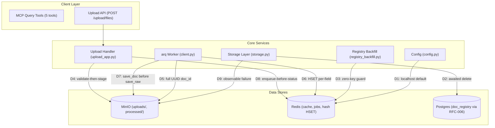
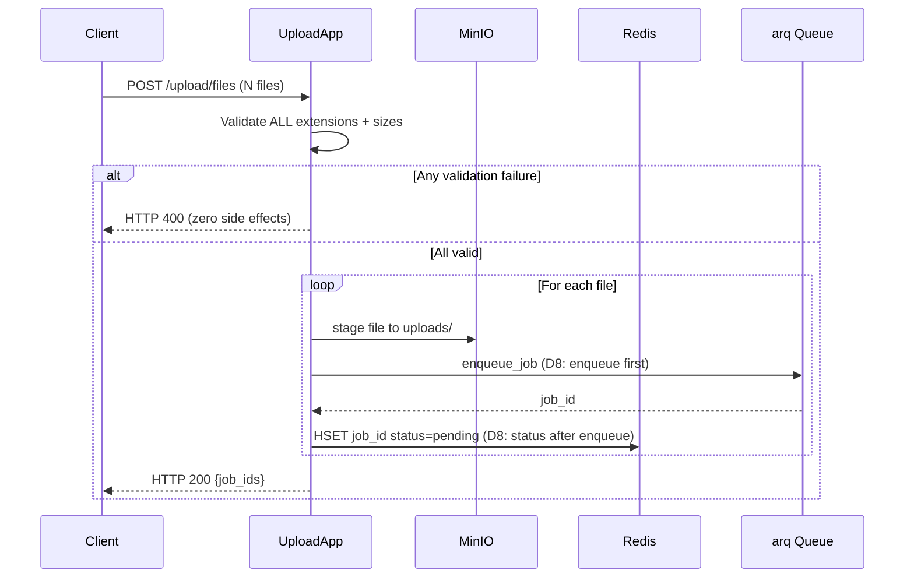
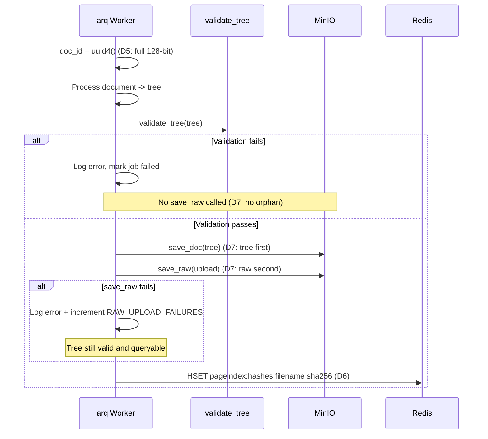
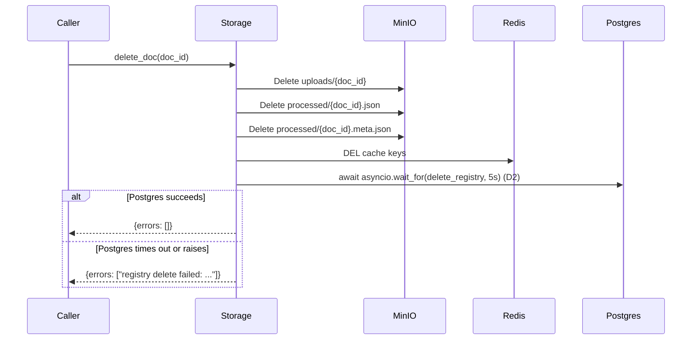
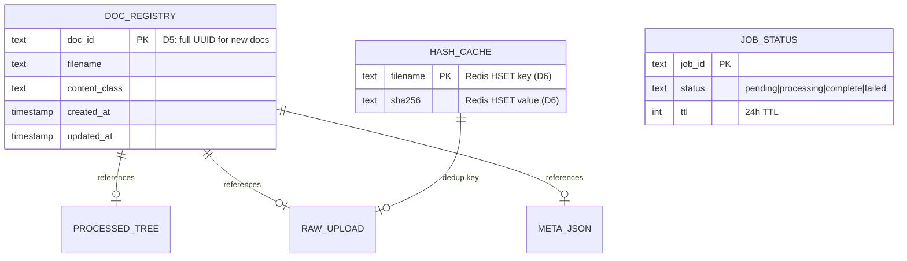

<!-- Space: CITRA -->
<!-- Title: Design: Docstore Data-Integrity & Compliance Hardening -->
<!-- Folder: Designs -->
<!-- Confluence-Page-ID: 5093588993 -->
<!-- Confluence-URL: https://inheaden.atlassian.net/wiki/spaces/CITRA/pages/5093588993/Design+Docstore+Data-Integrity+Compliance+Hardening -->

# Design Document: Docstore Data-Integrity & Compliance Hardening

## Traceability

| Artifact            | Reference                                                                                            |
| ------------------- | ---------------------------------------------------------------------------------------------------- |
| Governing RFC       | [RFC-007: Docstore Data-Integrity & Compliance Hardening](../rfcs/007-docstore-data-integrity-hardening.md) |
| PRD / Requirements  | `PRD.md`                                                                                           |
| Architecture Doc    | `ARCHITECTURE.md`                                                                                  |
| Implementation Plan | [tasks-rfc007-docstore-integrity.md](../tasks/tasks-rfc007-docstore-integrity.md)                  |

## Overview

PageIndex's docstore layer suffers from nine verified data-integrity issues rooted in a single systemic pattern: [non-transactional multi-step writes](../rfcs/007-docstore-data-integrity-hardening.md#context) that leave the system in inconsistent states on partial failure. This design formalizes the corrections -- operation reordering, validation-first upload gating, UUID collision prevention, hash-cache migration from monolithic MinIO blob to atomic Redis HSET, and an awaited erasure cascade to satisfy CLAUDE.md HR2 (right-to-erasure). The fixes restore the invariant that every write path either fully commits or fully rolls back, with no silent orphans, phantoms, or invisible data loss.

The [severity distribution](../rfcs/007-docstore-data-integrity-hardening.md#severity-distribution) spans 1 FAILING, 3 DEGRADED, and 5 LATENT issues. All nine are addressed across [four implementation batches](../tasks/tasks-rfc007-docstore-integrity.md#tasks).

## Key Design Principles

1. **Fail-atomic writes**: Every multi-step write sequence either completes entirely or leaves the system unchanged. No partial commits. *(Derived from [RFC-007 Context](../rfcs/007-docstore-data-integrity-hardening.md#context): "non-transactional multi-step writes")*
2. **Validation-before-mutation**: All validation checks run before the first side-effectful operation. No staging, enqueuing, or status-setting until inputs are fully validated. *(Derived from [RFC-007 D4](../rfcs/007-docstore-data-integrity-hardening.md#d4--validate-then-stage-for-multi-file-uploads-iss-04); implemented in [Task 1.2](../tasks/tasks-rfc007-docstore-integrity.md#12-validate-then-stage-for-multi-file-uploads-d4))*
3. **Persistence-order matches dependency-order**: If artifact B depends on artifact A, persist A first. Raw uploads depend on processed trees, not vice versa. *(Derived from [RFC-007 D7](../rfcs/007-docstore-data-integrity-hardening.md#d7--reorder-save_raw-after-save_doc-to-prevent-orphans-iss-11); implemented in [Task 1.4](../tasks/tasks-rfc007-docstore-integrity.md#14-reorder-save_doc-before-save_raw-d7))*
4. **Observable failure over silent swallow**: Every error path must produce an observable signal -- a return value, a log entry, or a Prometheus counter. Silent `except: pass` is prohibited. *(Derived from [RFC-007 D9](../rfcs/007-docstore-data-integrity-hardening.md#d9--surface-delete_staging-failures-instead-of-swallowing-iss-20); implemented in [Task 3.1](../tasks/tasks-rfc007-docstore-integrity.md#31-surface-delete_staging-failures-d9))*
5. **Compliance-first erasure**: Erasure cascades must await all store deletions and report failures accurately. Fire-and-forget on compliance-critical paths is a violation. *(Derived from [RFC-007 D2](../rfcs/007-docstore-data-integrity-hardening.md#d2--await-registry-delete-in-delete_doc-erasure-cascade-iss-02) and [CLAUDE.md HR2](../rfcs/007-docstore-data-integrity-hardening.md#hard-rule-constraints-claudemd--binding); implemented in [Task 3.2](../tasks/tasks-rfc007-docstore-integrity.md#32-await-registry-delete-in-erasure-cascade-d2))*
6. **Atomic-per-field over monolithic-blob**: Shared mutable state (hash caches) must use storage primitives that support per-entry atomicity, not read-modify-write on a single blob. *(Derived from [RFC-007 D6](../rfcs/007-docstore-data-integrity-hardening.md#d6--move-hash-cache-from-minio-json-blob-to-redis-hset-iss-10); implemented in [Task 4.1](../tasks/tasks-rfc007-docstore-integrity.md#41-implement-redis-hset-hash-cache-d6))*

## Launch Constraints

- No new external dependencies beyond what is already in the stack (Redis, MinIO, Postgres via RFC-006)
- All existing 8-char `doc_id` values in storage remain valid -- only new ingestions get full UUIDs ([RFC-007 D5](../rfcs/007-docstore-data-integrity-hardening.md#d5--use-full-uuid-for-doc_id-iss-09))
- [D6](../rfcs/007-docstore-data-integrity-hardening.md#d6--move-hash-cache-from-minio-json-blob-to-redis-hset-iss-10) long-term Postgres column deferred until RFC-006 stabilizes -- this RFC implements Redis HSET only
- [D2](../rfcs/007-docstore-data-integrity-hardening.md#d2--await-registry-delete-in-delete_doc-erasure-cascade-iss-02) timeout configurable via `REGISTRY_DELETE_TIMEOUT_S` env var (default 5.0s)

## Architecture

### High-Level System Architecture

The diagram below shows every service and data store touched by this RFC, with edge labels mapping to [Architecture Decisions](#architecture-decisions).



Edge label legend (each links to its [Architecture Decisions](#architecture-decisions) entry and RFC decision section):

| Edge label | Architecture Decision | RFC section | Task |
| --- | --- | --- | --- |
| D1: localhost default | [Default Redis URL to localhost](#architecture-decisions) | [RFC-007 D1](../rfcs/007-docstore-data-integrity-hardening.md#d1--fix-default-redis_url-to-localhost-iss-01) | [Task 1.1](../tasks/tasks-rfc007-docstore-integrity.md#11-fix-redis-url-default-d1) |
| D2: awaited delete | [Await registry delete in erasure cascade](#architecture-decisions) | [RFC-007 D2](../rfcs/007-docstore-data-integrity-hardening.md#d2--await-registry-delete-in-delete_doc-erasure-cascade-iss-02) | [Task 3.2](../tasks/tasks-rfc007-docstore-integrity.md#32-await-registry-delete-in-erasure-cascade-d2) |
| D3: zero-key guard | [Guard backfill against zero-key completion](#architecture-decisions) | [RFC-007 D3](../rfcs/007-docstore-data-integrity-hardening.md#d3--guard-registry_backfill-against-zero-key-completion-iss-03) | [Task 2.2](../tasks/tasks-rfc007-docstore-integrity.md#22-guard-registry-backfill-against-zero-key-completion-d3) |
| D4: validate-then-stage | [Validate-then-stage for multi-file uploads](#architecture-decisions) | [RFC-007 D4](../rfcs/007-docstore-data-integrity-hardening.md#d4--validate-then-stage-for-multi-file-uploads-iss-04) | [Task 1.2](../tasks/tasks-rfc007-docstore-integrity.md#12-validate-then-stage-for-multi-file-uploads-d4) |
| D5: full UUID doc_id | [Full UUID for doc_id](#architecture-decisions) | [RFC-007 D5](../rfcs/007-docstore-data-integrity-hardening.md#d5--use-full-uuid-for-doc_id-iss-09) | [Task 2.1](../tasks/tasks-rfc007-docstore-integrity.md#21-use-full-uuid-for-doc_id-d5) |
| D6: HSET per-field | [Redis HSET for hash cache](#architecture-decisions) | [RFC-007 D6](../rfcs/007-docstore-data-integrity-hardening.md#d6--move-hash-cache-from-minio-json-blob-to-redis-hset-iss-10) | [Task 4.1](../tasks/tasks-rfc007-docstore-integrity.md#41-implement-redis-hset-hash-cache-d6) |
| D7: save_doc before save_raw | [Persist raw after tree](#architecture-decisions) | [RFC-007 D7](../rfcs/007-docstore-data-integrity-hardening.md#d7--reorder-save_raw-after-save_doc-to-prevent-orphans-iss-11) | [Task 1.4](../tasks/tasks-rfc007-docstore-integrity.md#14-reorder-save_doc-before-save_raw-d7) |
| D8: enqueue-before-status | [Enqueue before status](#architecture-decisions) | [RFC-007 D8](../rfcs/007-docstore-data-integrity-hardening.md#d8--reorder-enqueue_job-before-status-set-to-eliminate-phantom-jobs-iss-12) | [Task 1.3](../tasks/tasks-rfc007-docstore-integrity.md#13-reorder-enqueue-before-status-d8) |
| D9: observable failure | [Observable staging delete failures](#architecture-decisions) | [RFC-007 D9](../rfcs/007-docstore-data-integrity-hardening.md#d9--surface-delete_staging-failures-instead-of-swallowing-iss-20) | [Task 3.1](../tasks/tasks-rfc007-docstore-integrity.md#31-surface-delete_staging-failures-d9) |

### Architecture Decisions

**Default Redis URL to localhost** ([RFC-007 D1](../rfcs/007-docstore-data-integrity-hardening.md#d1--fix-default-redis_url-to-localhost-iss-01), ISS-01): The hardcoded neonatal-care Redis URL is a copy-paste artifact from a different project. Changing to `redis://localhost:6379/0` matches docker-compose and standard dev convention. Production already overrides via `REDIS_URL`. Validates [Property 9](#property-9-correct-redis-default). Implemented in [Task 1.1](../tasks/tasks-rfc007-docstore-integrity.md#11-fix-redis-url-default-d1).

**Await registry delete in erasure cascade** ([RFC-007 D2](../rfcs/007-docstore-data-integrity-hardening.md#d2--await-registry-delete-in-delete_doc-erasure-cascade-iss-02), ISS-02, [CLAUDE.md HR2](../rfcs/007-docstore-data-integrity-hardening.md#hard-rule-constraints-claudemd--binding)): Fire-and-forget on the Postgres delete means `delete_doc` can report success while the registry row persists -- a direct HR2 violation. The fix wraps the task in `asyncio.wait_for(task, timeout=5.0)` with error surfacing. Validates [Property 4](#property-4-erasure-cascade-completeness). Implemented in [Task 3.2](../tasks/tasks-rfc007-docstore-integrity.md#32-await-registry-delete-in-erasure-cascade-d2).

**Guard backfill against zero-key completion** ([RFC-007 D3](../rfcs/007-docstore-data-integrity-hardening.md#d3--guard-registry_backfill-against-zero-key-completion-iss-03), ISS-03, [CLAUDE.md HR5](../rfcs/007-docstore-data-integrity-hardening.md#hard-rule-constraints-claudemd--binding)): An empty `meta_keys` list (wrong bucket, transient outage) currently marks the registry complete, making the entire corpus invisible. The guard skips `set_registry_complete` on zero keys and logs a WARNING. Validates [Property 7](#property-7-zero-key-backfill-guard). Implemented in [Task 2.2](../tasks/tasks-rfc007-docstore-integrity.md#22-guard-registry-backfill-against-zero-key-completion-d3).

**Validate-then-stage for multi-file uploads** ([RFC-007 D4](../rfcs/007-docstore-data-integrity-hardening.md#d4--validate-then-stage-for-multi-file-uploads-iss-04), ISS-04): The current single-pass processes files sequentially, staging valid files before discovering invalid ones later in the batch. The two-pass design (validate all, then stage all) provides all-or-nothing semantics. Validates [Property 2](#property-2-all-or-nothing-upload-validation). Implemented in [Task 1.2](../tasks/tasks-rfc007-docstore-integrity.md#12-validate-then-stage-for-multi-file-uploads-d4).

**Full UUID for doc_id** ([RFC-007 D5](../rfcs/007-docstore-data-integrity-hardening.md#d5--use-full-uuid-for-doc_id-iss-09), ISS-09): 8-char truncation yields only 32 bits of entropy; P(collision) ~1% at ~6,500 documents with silent overwrites. Full UUID eliminates this class of bug entirely. Validates [Property 5](#property-5-no-collision-prone-doc_id). Implemented in [Task 2.1](../tasks/tasks-rfc007-docstore-integrity.md#21-use-full-uuid-for-doc_id-d5).

**Redis HSET for hash cache** ([RFC-007 D6](../rfcs/007-docstore-data-integrity-hardening.md#d6--move-hash-cache-from-minio-json-blob-to-redis-hset-iss-10), ISS-10): The monolithic MinIO JSON blob + instance-level asyncio.Lock is broken under multi-process arq workers (each process has its own lock). Redis HSET provides per-field atomicity with no read-modify-write cycle. Validates [Property 6](#property-6-hash-cache-atomicity). Implemented in [Task 4.1](../tasks/tasks-rfc007-docstore-integrity.md#41-implement-redis-hset-hash-cache-d6).

**Persist raw after tree** ([RFC-007 D7](../rfcs/007-docstore-data-integrity-hardening.md#d7--reorder-save_raw-after-save_doc-to-prevent-orphans-iss-11), ISS-11): Current order (save_raw then save_doc) creates orphaned raw uploads when tree validation fails. Reversing the order ensures the queryable artifact exists before committing the source upload. Validates [Property 3](#property-3-no-orphaned-raw-uploads). Implemented in [Task 1.4](../tasks/tasks-rfc007-docstore-integrity.md#14-reorder-save_doc-before-save_raw-d7).

**Enqueue before status** ([RFC-007 D8](../rfcs/007-docstore-data-integrity-hardening.md#d8--reorder-enqueue_job-before-status-set-to-eliminate-phantom-jobs-iss-12), ISS-12): Current order (set status then enqueue) creates phantom "pending" entries that persist for 24h when enqueue fails. Reversing eliminates phantoms at the cost of a brief "not found" window. Validates [Property 1](#property-1-no-phantom-pending-jobs). Implemented in [Task 1.3](../tasks/tasks-rfc007-docstore-integrity.md#13-reorder-enqueue-before-status-d8).

**Observable staging delete failures** ([RFC-007 D9](../rfcs/007-docstore-data-integrity-hardening.md#d9--surface-delete_staging-failures-instead-of-swallowing-iss-20), ISS-20): Silent S3Error swallowing in `delete_staging` leaks orphaned staging objects. Returning `bool` + incrementing a Prometheus counter makes the failure visible. Validates [Property 8](#property-8-observable-staging-delete-failure). Implemented in [Task 3.1](../tasks/tasks-rfc007-docstore-integrity.md#31-surface-delete_staging-failures-d9).

### Deployment Architecture

- **Backend**: Python 3.12 + FastMCP + gunicorn/uvicorn workers
- **Database**: PostgreSQL (doc_registry via RFC-006)
- **Object Storage**: MinIO (`uploads/`, `processed/`, `staging/`)
- **Task Queue**: arq with Redis broker
- **Event Bus**: Redis (cache + job bus + hash HSET per [D6](../rfcs/007-docstore-data-integrity-hardening.md#d6--move-hash-cache-from-minio-json-blob-to-redis-hset-iss-10))

### Communication Patterns

| Pattern            | Use Case                              | Technology            |
| ------------------ | ------------------------------------- | --------------------- |
| Sync HTTP          | Upload API, status polling            | FastAPI/Starlette     |
| Async job queue    | Document processing pipeline          | arq + Redis           |
| Direct object I/O  | Raw/processed document storage        | MinIO (S3-compatible) |
| Atomic key-value   | Hash cache ([D6](../rfcs/007-docstore-data-integrity-hardening.md#d6--move-hash-cache-from-minio-json-blob-to-redis-hset-iss-10)), job status ([D8](../rfcs/007-docstore-data-integrity-hardening.md#d8--reorder-enqueue_job-before-status-set-to-eliminate-phantom-jobs-iss-12)), registry flag | Redis HSET/HGET       |
| Awaited async task | Erasure cascade ([D2](../rfcs/007-docstore-data-integrity-hardening.md#d2--await-registry-delete-in-delete_doc-erasure-cascade-iss-02) Postgres delete) | asyncio.wait_for      |

### Sequence Diagrams

#### Upload Flow ([D4](../rfcs/007-docstore-data-integrity-hardening.md#d4--validate-then-stage-for-multi-file-uploads-iss-04) + [D8](../rfcs/007-docstore-data-integrity-hardening.md#d8--reorder-enqueue_job-before-status-set-to-eliminate-phantom-jobs-iss-12): validate-then-stage, enqueue-before-status)

Validates [Property 1](#property-1-no-phantom-pending-jobs) and [Property 2](#property-2-all-or-nothing-upload-validation). Implemented in [Task 1.2](../tasks/tasks-rfc007-docstore-integrity.md#12-validate-then-stage-for-multi-file-uploads-d4) and [Task 1.3](../tasks/tasks-rfc007-docstore-integrity.md#13-reorder-enqueue-before-status-d8).



#### Processing Flow ([D5](../rfcs/007-docstore-data-integrity-hardening.md#d5--use-full-uuid-for-doc_id-iss-09) + [D7](../rfcs/007-docstore-data-integrity-hardening.md#d7--reorder-save_raw-after-save_doc-to-prevent-orphans-iss-11): full UUID, save_doc before save_raw)

Validates [Property 3](#property-3-no-orphaned-raw-uploads), [Property 5](#property-5-no-collision-prone-doc_id), and [Property 6](#property-6-hash-cache-atomicity). Implemented in [Task 1.4](../tasks/tasks-rfc007-docstore-integrity.md#14-reorder-save_doc-before-save_raw-d7), [Task 2.1](../tasks/tasks-rfc007-docstore-integrity.md#21-use-full-uuid-for-doc_id-d5), and [Task 4.1](../tasks/tasks-rfc007-docstore-integrity.md#41-implement-redis-hset-hash-cache-d6).



#### Erasure Cascade ([D2](../rfcs/007-docstore-data-integrity-hardening.md#d2--await-registry-delete-in-delete_doc-erasure-cascade-iss-02): awaited registry delete)

Validates [Property 4](#property-4-erasure-cascade-completeness). Satisfies [CLAUDE.md HR2](../rfcs/007-docstore-data-integrity-hardening.md#hard-rule-constraints-claudemd--binding). Implemented in [Task 3.2](../tasks/tasks-rfc007-docstore-integrity.md#32-await-registry-delete-in-erasure-cascade-d2), with integration test in [Task 3.4](../tasks/tasks-rfc007-docstore-integrity.md#34-write-integration-test-for-erasure-cascade-d2).



## Service Contracts

### 1. Config (`config.py`)

**Responsibility**: Centralized configuration with env-var overrides and sensible defaults.

**Changes ([D1](../rfcs/007-docstore-data-integrity-hardening.md#d1--fix-default-redis_url-to-localhost-iss-01))**:

- `redis_url` default: `"redis://localhost:6379/0"` *(was: neonatal-care hardcoded URL)* -- validates [Property 9](#property-9-correct-redis-default); implemented in [Task 1.1](../tasks/tasks-rfc007-docstore-integrity.md#11-fix-redis-url-default-d1)
- New env var: `REGISTRY_DELETE_TIMEOUT_S` (float, default `5.0`) -- supports [D2](../rfcs/007-docstore-data-integrity-hardening.md#d2--await-registry-delete-in-delete_doc-erasure-cascade-iss-02) timeout tuning

### 2. Upload Handler (`upload_app.py`)

**Responsibility**: Accept multi-file uploads, validate, stage to MinIO, enqueue processing jobs.

```python
# API Endpoints
POST /upload/files   # Upload one or more documents for processing
GET  /upload/status/{job_id}  # Poll processing status
```

**Changes ([D4](../rfcs/007-docstore-data-integrity-hardening.md#d4--validate-then-stage-for-multi-file-uploads-iss-04), [D8](../rfcs/007-docstore-data-integrity-hardening.md#d8--reorder-enqueue_job-before-status-set-to-eliminate-phantom-jobs-iss-12))**:

- [D4](../rfcs/007-docstore-data-integrity-hardening.md#d4--validate-then-stage-for-multi-file-uploads-iss-04): Two-pass handler -- validate all files before any staging/enqueue/status mutation. Validates [Property 2](#property-2-all-or-nothing-upload-validation). Implemented in [Task 1.2](../tasks/tasks-rfc007-docstore-integrity.md#12-validate-then-stage-for-multi-file-uploads-d4).
- [D8](../rfcs/007-docstore-data-integrity-hardening.md#d8--reorder-enqueue_job-before-status-set-to-eliminate-phantom-jobs-iss-12): `enqueue_job()` before `redis.hset(status=pending)` -- no phantom pending on enqueue failure. Validates [Property 1](#property-1-no-phantom-pending-jobs). Implemented in [Task 1.3](../tasks/tasks-rfc007-docstore-integrity.md#13-reorder-enqueue-before-status-d8).

### 3. Worker / Client (`client.py`)

**Responsibility**: Process ingested documents -- extract, validate, persist trees and raw uploads, manage hash cache.

**Changes ([D5](../rfcs/007-docstore-data-integrity-hardening.md#d5--use-full-uuid-for-doc_id-iss-09), [D6](../rfcs/007-docstore-data-integrity-hardening.md#d6--move-hash-cache-from-minio-json-blob-to-redis-hset-iss-10), [D7](../rfcs/007-docstore-data-integrity-hardening.md#d7--reorder-save_raw-after-save_doc-to-prevent-orphans-iss-11))**:

- [D5](../rfcs/007-docstore-data-integrity-hardening.md#d5--use-full-uuid-for-doc_id-iss-09): `doc_id = str(uuid.uuid4())` -- full 128-bit UUID, no truncation. Validates [Property 5](#property-5-no-collision-prone-doc_id). Implemented in [Task 2.1](../tasks/tasks-rfc007-docstore-integrity.md#21-use-full-uuid-for-doc_id-d5).
- [D6](../rfcs/007-docstore-data-integrity-hardening.md#d6--move-hash-cache-from-minio-json-blob-to-redis-hset-iss-10): Hash cache via `Redis HSET pageindex:hashes` -- atomic per-field, replaces MinIO JSON blob. Validates [Property 6](#property-6-hash-cache-atomicity). Implemented in [Task 4.1](../tasks/tasks-rfc007-docstore-integrity.md#41-implement-redis-hset-hash-cache-d6).
- [D7](../rfcs/007-docstore-data-integrity-hardening.md#d7--reorder-save_raw-after-save_doc-to-prevent-orphans-iss-11): `save_doc()` before `save_raw()` -- tree persists before raw upload commits. Validates [Property 3](#property-3-no-orphaned-raw-uploads). Implemented in [Task 1.4](../tasks/tasks-rfc007-docstore-integrity.md#14-reorder-save_doc-before-save_raw-d7).

**Internal Interfaces**:

- Reads jobs from arq queue (Redis)
- Writes processed trees + raw uploads to MinIO (order changed per [D7](../rfcs/007-docstore-data-integrity-hardening.md#d7--reorder-save_raw-after-save_doc-to-prevent-orphans-iss-11))
- Writes hash cache entries to Redis HSET per [D6](../rfcs/007-docstore-data-integrity-hardening.md#d6--move-hash-cache-from-minio-json-blob-to-redis-hset-iss-10)

### 4. Storage Layer (`storage.py`)

**Responsibility**: Abstraction over MinIO + Redis + Postgres for document CRUD and erasure cascades.

**Changes ([D2](../rfcs/007-docstore-data-integrity-hardening.md#d2--await-registry-delete-in-delete_doc-erasure-cascade-iss-02), [D9](../rfcs/007-docstore-data-integrity-hardening.md#d9--surface-delete_staging-failures-instead-of-swallowing-iss-20))**:

- [D2](../rfcs/007-docstore-data-integrity-hardening.md#d2--await-registry-delete-in-delete_doc-erasure-cascade-iss-02): `delete_doc` awaits Postgres registry delete with `asyncio.wait_for(task, timeout)`, surfaces errors. Validates [Property 4](#property-4-erasure-cascade-completeness). Implemented in [Task 3.2](../tasks/tasks-rfc007-docstore-integrity.md#32-await-registry-delete-in-erasure-cascade-d2).
- [D9](../rfcs/007-docstore-data-integrity-hardening.md#d9--surface-delete_staging-failures-instead-of-swallowing-iss-20): `delete_staging` returns `bool`, increments `STAGING_DELETE_FAILURES` counter on S3Error. Validates [Property 8](#property-8-observable-staging-delete-failure). Implemented in [Task 3.1](../tasks/tasks-rfc007-docstore-integrity.md#31-surface-delete_staging-failures-d9).

**Internal Interfaces**:

- Called by Worker for `save_doc`, `save_raw`, `delete_doc`
- Called by Upload Handler for `delete_staging`
- [D2](../rfcs/007-docstore-data-integrity-hardening.md#d2--await-registry-delete-in-delete_doc-erasure-cascade-iss-02) calls Postgres registry (RFC-006) for delete

### 5. Registry Backfill (`registry_backfill.py`)

**Responsibility**: Populate Postgres registry from existing MinIO metadata files.

**Changes ([D3](../rfcs/007-docstore-data-integrity-hardening.md#d3--guard-registry_backfill-against-zero-key-completion-iss-03))**:

- Guard: when `meta_keys` is empty, skip `set_registry_complete`, log WARNING, return early. Validates [Property 7](#property-7-zero-key-backfill-guard). Implemented in [Task 2.2](../tasks/tasks-rfc007-docstore-integrity.md#22-guard-registry-backfill-against-zero-key-completion-d3).

### 6. Metrics (`metrics.py`)

**Responsibility**: Prometheus metric definitions.

**New counters ([D9](../rfcs/007-docstore-data-integrity-hardening.md#d9--surface-delete_staging-failures-instead-of-swallowing-iss-20), [D7](../rfcs/007-docstore-data-integrity-hardening.md#d7--reorder-save_raw-after-save_doc-to-prevent-orphans-iss-11))**:

- `STAGING_DELETE_FAILURES` -- incremented when `delete_staging` returns False ([Property 8](#property-8-observable-staging-delete-failure), [Task 3.1](../tasks/tasks-rfc007-docstore-integrity.md#31-surface-delete_staging-failures-d9))
- `RAW_UPLOAD_FAILURES` -- incremented when `save_raw` fails after successful `save_doc` ([Property 3](#property-3-no-orphaned-raw-uploads), [Task 1.4](../tasks/tasks-rfc007-docstore-integrity.md#14-reorder-save_doc-before-save_raw-d7))

## Data Models

### Entity Relationship Diagram



### Core Entities

#### Hash Cache ([D6](../rfcs/007-docstore-data-integrity-hardening.md#d6--move-hash-cache-from-minio-json-blob-to-redis-hset-iss-10) -- migrated from MinIO JSON blob to Redis HSET)

Validates [Property 6](#property-6-hash-cache-atomicity). Implemented in [Task 4.1](../tasks/tasks-rfc007-docstore-integrity.md#41-implement-redis-hset-hash-cache-d6), with migration in [Task 4.2](../tasks/tasks-rfc007-docstore-integrity.md#42-write-one-time-migration-utility-for-d6).

```python
# Storage: Redis HSET "pageindex:hashes"
# Each field is a filename, value is its SHA-256 hex digest
# Atomic per-field -- no read-modify-write cycle
# Replaces: MinIO object "pageindex:hashes.json" (monolithic JSON blob)

# Operations:
#   HSET pageindex:hashes <filename> <sha256>   -- write one entry
#   HGET pageindex:hashes <filename>            -- read one entry
#   HGETALL pageindex:hashes                    -- migration/debug only
```

#### Job Status ([D8](../rfcs/007-docstore-data-integrity-hardening.md#d8--reorder-enqueue_job-before-status-set-to-eliminate-phantom-jobs-iss-12) -- reordered)

Validates [Property 1](#property-1-no-phantom-pending-jobs). Implemented in [Task 1.3](../tasks/tasks-rfc007-docstore-integrity.md#13-reorder-enqueue-before-status-d8).

```python
# Storage: Redis HASH per job_id
# D8 change: enqueue_job() THEN set status -- never phantom pending

class JobStatus(str, Enum):
    PENDING = "pending"
    PROCESSING = "processing"
    COMPLETE = "complete"
    FAILED = "failed"
```

## Correctness Properties

*A property is a characteristic or behavior that should hold true across all valid executions of the system -- a formal statement about what the system should do. Properties serve as the bridge between human-readable specifications and machine-verifiable correctness guarantees.*

### Property 1: No phantom pending jobs

*For any* upload where `enqueue_job` raises an exception, system SHALL NOT have a Redis status hash entry for that job ID.

**Validates**: [RFC-007 D8](../rfcs/007-docstore-data-integrity-hardening.md#d8--reorder-enqueue_job-before-status-set-to-eliminate-phantom-jobs-iss-12), ISS-12. **Tested in**: [Task 1.5](../tasks/tasks-rfc007-docstore-integrity.md#15-write-unit-tests-for-batch-0) (`test_enqueue_failure_no_phantom_status`). **Service contract**: [Upload Handler](#2-upload-handler-upload_apppy). **Sequence diagram**: [Upload Flow](#upload-flow-d4--d8-validate-then-stage-enqueue-before-status).

### Property 2: All-or-nothing upload validation

*For any* multi-file upload batch where at least one file fails validation, system SHALL have zero MinIO writes, zero Redis mutations, and zero arq enqueues from that batch.

**Validates**: [RFC-007 D4](../rfcs/007-docstore-data-integrity-hardening.md#d4--validate-then-stage-for-multi-file-uploads-iss-04), ISS-04. **Tested in**: [Task 1.5](../tasks/tasks-rfc007-docstore-integrity.md#15-write-unit-tests-for-batch-0) (`test_upload_mixed_invalid_no_staging`). **Service contract**: [Upload Handler](#2-upload-handler-upload_apppy). **Sequence diagram**: [Upload Flow](#upload-flow-d4--d8-validate-then-stage-enqueue-before-status).

### Property 3: No orphaned raw uploads

*For any* document processing where `save_doc` (or `save_flat_doc`) fails or tree validation fails, system SHALL NOT call `save_raw`.

**Validates**: [RFC-007 D7](../rfcs/007-docstore-data-integrity-hardening.md#d7--reorder-save_raw-after-save_doc-to-prevent-orphans-iss-11), ISS-11, CLAUDE.md HR5. **Tested in**: [Task 1.5](../tasks/tasks-rfc007-docstore-integrity.md#15-write-unit-tests-for-batch-0) (`test_save_doc_failure_no_raw_orphan`). **Service contract**: [Worker / Client](#3-worker--client-clientpy). **Sequence diagram**: [Processing Flow](#processing-flow-d5--d7-full-uuid-save_doc-before-save_raw).

### Property 4: Erasure cascade completeness

*For any* `delete_doc` invocation, system SHALL await all store deletions (MinIO uploads, MinIO processed, MinIO meta, Redis cache, Postgres registry) and SHALL report any individual store failure in the returned errors list.

**Validates**: [RFC-007 D2](../rfcs/007-docstore-data-integrity-hardening.md#d2--await-registry-delete-in-delete_doc-erasure-cascade-iss-02), ISS-02, [CLAUDE.md HR2](../rfcs/007-docstore-data-integrity-hardening.md#hard-rule-constraints-claudemd--binding). **Tested in**: [Task 3.3](../tasks/tasks-rfc007-docstore-integrity.md#33-write-unit-tests-for-batch-2) (`test_delete_doc_awaits_registry`, `test_delete_doc_registry_timeout`) and [Task 3.4](../tasks/tasks-rfc007-docstore-integrity.md#34-write-integration-test-for-erasure-cascade-d2) (integration). **Service contract**: [Storage Layer](#4-storage-layer-storagepy). **Sequence diagram**: [Erasure Cascade](#erasure-cascade-d2-awaited-registry-delete).

### Property 5: No collision-prone doc_id

*For any* newly ingested document, system SHALL assign a `doc_id` with at least 122 bits of entropy (full UUID v4).

**Validates**: [RFC-007 D5](../rfcs/007-docstore-data-integrity-hardening.md#d5--use-full-uuid-for-doc_id-iss-09), ISS-09. **Tested in**: [Task 2.3](../tasks/tasks-rfc007-docstore-integrity.md#23-write-unit-tests-for-batch-1) (`test_doc_id_full_uuid`). **Service contract**: [Worker / Client](#3-worker--client-clientpy). **Sequence diagram**: [Processing Flow](#processing-flow-d5--d7-full-uuid-save_doc-before-save_raw).

### Property 6: Hash cache atomicity

*For any* two concurrent hash-cache writes with different filenames, system SHALL persist both entries (no last-writer-wins loss).

**Validates**: [RFC-007 D6](../rfcs/007-docstore-data-integrity-hardening.md#d6--move-hash-cache-from-minio-json-blob-to-redis-hset-iss-10), ISS-10. **Tested in**: [Task 4.3](../tasks/tasks-rfc007-docstore-integrity.md#43-write-unit-tests-for-batch-3) (`test_hash_cache_redis_hset`, `test_hash_cache_concurrent_workers`). **Service contract**: [Worker / Client](#3-worker--client-clientpy). **Sequence diagram**: [Processing Flow](#processing-flow-d5--d7-full-uuid-save_doc-before-save_raw).

### Property 7: Zero-key backfill guard

*For any* registry backfill run where `meta_keys` is empty, system SHALL NOT call `set_registry_complete`.

**Validates**: [RFC-007 D3](../rfcs/007-docstore-data-integrity-hardening.md#d3--guard-registry_backfill-against-zero-key-completion-iss-03), ISS-03, CLAUDE.md HR5. **Tested in**: [Task 2.3](../tasks/tasks-rfc007-docstore-integrity.md#23-write-unit-tests-for-batch-1) (`test_backfill_zero_keys_skips_complete`). **Service contract**: [Registry Backfill](#5-registry-backfill-registry_backfillpy).

### Property 8: Observable staging delete failure

*For any* `delete_staging` call that encounters an S3Error, system SHALL return `False` and increment the `STAGING_DELETE_FAILURES` counter.

**Validates**: [RFC-007 D9](../rfcs/007-docstore-data-integrity-hardening.md#d9--surface-delete_staging-failures-instead-of-swallowing-iss-20), ISS-20. **Tested in**: [Task 3.3](../tasks/tasks-rfc007-docstore-integrity.md#33-write-unit-tests-for-batch-2) (`test_delete_staging_s3error_returns_false`). **Service contract**: [Storage Layer](#4-storage-layer-storagepy).

### Property 9: Correct Redis default

*For any* deployment without `REDIS_URL` env var set, system SHALL use `redis://localhost:6379/0` as the Redis connection URL.

**Validates**: [RFC-007 D1](../rfcs/007-docstore-data-integrity-hardening.md#d1--fix-default-redis_url-to-localhost-iss-01), ISS-01. **Tested in**: [Task 1.5](../tasks/tasks-rfc007-docstore-integrity.md#15-write-unit-tests-for-batch-0) (`test_config_redis_default`). **Service contract**: [Config](#1-config-configpy).

## Error Handling

### Error Categories and Responses

| Category | HTTP Status | Response Format | Retry Strategy | RFC section | Property |
| --- | --- | --- | --- | --- | --- |
| Validation Error ([D4](../rfcs/007-docstore-data-integrity-hardening.md#d4--validate-then-stage-for-multi-file-uploads-iss-04)) | 400 | `{error: str, detail: str, invalid_files: list}` | Client-side fix required | [RFC-007 D4](../rfcs/007-docstore-data-integrity-hardening.md#d4--validate-then-stage-for-multi-file-uploads-iss-04) | [P2](#property-2-all-or-nothing-upload-validation) |
| Not Found | 404 | `{error: "not_found", job_id: str}` | No retry | -- | -- |
| Server Error | 500 | `{error: "internal_error", request_id: str}` | Retry with backoff | -- | -- |

### Service-Specific Error Handling

**[Upload Handler](#2-upload-handler-upload_apppy) ([D4](../rfcs/007-docstore-data-integrity-hardening.md#d4--validate-then-stage-for-multi-file-uploads-iss-04), [D8](../rfcs/007-docstore-data-integrity-hardening.md#d8--reorder-enqueue_job-before-status-set-to-eliminate-phantom-jobs-iss-12)):**

- Multi-file batch with invalid file(s) -> HTTP 400 before any mutation ([D4](../rfcs/007-docstore-data-integrity-hardening.md#d4--validate-then-stage-for-multi-file-uploads-iss-04), [Property 2](#property-2-all-or-nothing-upload-validation))
- `enqueue_job` raises after staging -> Redis status never set, staged file becomes orphan (acceptable: staging cleanup reaps it) ([D8](../rfcs/007-docstore-data-integrity-hardening.md#d8--reorder-enqueue_job-before-status-set-to-eliminate-phantom-jobs-iss-12), [Property 1](#property-1-no-phantom-pending-jobs))

**[Worker / Client](#3-worker--client-clientpy) ([D5](../rfcs/007-docstore-data-integrity-hardening.md#d5--use-full-uuid-for-doc_id-iss-09), [D6](../rfcs/007-docstore-data-integrity-hardening.md#d6--move-hash-cache-from-minio-json-blob-to-redis-hset-iss-10), [D7](../rfcs/007-docstore-data-integrity-hardening.md#d7--reorder-save_raw-after-save_doc-to-prevent-orphans-iss-11)):**

- `save_doc` fails -> `save_raw` never called, job marked failed ([D7](../rfcs/007-docstore-data-integrity-hardening.md#d7--reorder-save_raw-after-save_doc-to-prevent-orphans-iss-11), [Property 3](#property-3-no-orphaned-raw-uploads))
- `save_raw` fails after `save_doc` succeeds -> log error, increment `RAW_UPLOAD_FAILURES`, tree remains queryable ([D7](../rfcs/007-docstore-data-integrity-hardening.md#d7--reorder-save_raw-after-save_doc-to-prevent-orphans-iss-11))
- Redis HSET fails -> hash cache miss on next run, document re-processes (idempotent) ([D6](../rfcs/007-docstore-data-integrity-hardening.md#d6--move-hash-cache-from-minio-json-blob-to-redis-hset-iss-10))

**[Storage Layer](#4-storage-layer-storagepy) ([D2](../rfcs/007-docstore-data-integrity-hardening.md#d2--await-registry-delete-in-delete_doc-erasure-cascade-iss-02), [D9](../rfcs/007-docstore-data-integrity-hardening.md#d9--surface-delete_staging-failures-instead-of-swallowing-iss-20)):**

- Postgres registry delete times out (>5s) -> error appended to cascade errors list, caller sees partial failure ([D2](../rfcs/007-docstore-data-integrity-hardening.md#d2--await-registry-delete-in-delete_doc-erasure-cascade-iss-02), [Property 4](#property-4-erasure-cascade-completeness))
- Postgres registry delete raises exception -> error appended to cascade errors list ([D2](../rfcs/007-docstore-data-integrity-hardening.md#d2--await-registry-delete-in-delete_doc-erasure-cascade-iss-02), [Property 4](#property-4-erasure-cascade-completeness))
- `delete_staging` S3Error -> returns False, increments `STAGING_DELETE_FAILURES` counter ([D9](../rfcs/007-docstore-data-integrity-hardening.md#d9--surface-delete_staging-failures-instead-of-swallowing-iss-20), [Property 8](#property-8-observable-staging-delete-failure))

**[Registry Backfill](#5-registry-backfill-registry_backfillpy) ([D3](../rfcs/007-docstore-data-integrity-hardening.md#d3--guard-registry_backfill-against-zero-key-completion-iss-03)):**

- Zero `meta_keys` found -> skip `set_registry_complete`, log WARNING, return early ([D3](../rfcs/007-docstore-data-integrity-hardening.md#d3--guard-registry_backfill-against-zero-key-completion-iss-03), [Property 7](#property-7-zero-key-backfill-guard))

## Testing Strategy

### Testing Layers

Testing follows the [RFC-007 Test Strategy](../rfcs/007-docstore-data-integrity-hardening.md#test-strategy):

1. **Property-Based Tests (PBT)**: Verify universal properties across randomly generated inputs for all 9 [correctness properties](#correctness-properties).
2. **Unit Tests**: Cover specific examples, edge cases, error conditions per [RFC-007 Per-fix unit tests](../rfcs/007-docstore-data-integrity-hardening.md#per-fix-unit-tests).
3. **Integration Tests**: Verify erasure cascade ([D2](../rfcs/007-docstore-data-integrity-hardening.md#d2--await-registry-delete-in-delete_doc-erasure-cascade-iss-02)), upload validation ([D4](../rfcs/007-docstore-data-integrity-hardening.md#d4--validate-then-stage-for-multi-file-uploads-iss-04)), hash migration ([D6](../rfcs/007-docstore-data-integrity-hardening.md#d6--move-hash-cache-from-minio-json-blob-to-redis-hset-iss-10)) against real services, per [RFC-007 Integration tests](../rfcs/007-docstore-data-integrity-hardening.md#integration-tests).
4. **Regression Gate**: All existing tests pass unchanged, per [RFC-007 Regression gate](../rfcs/007-docstore-data-integrity-hardening.md#regression-gate). Implemented in [Task 5.2](../tasks/tasks-rfc007-docstore-integrity.md#52-run-full-regression-suite).

### Property-Based Testing Configuration

- **Library**: Hypothesis
- **Minimum iterations**: 100 per property
- **Deadline**: 500ms per example
- **Database strategy**: Mock external stores (Redis, MinIO, Postgres) at the interface boundary

### Test Categories by Service

| Service | PBT Properties | Unit Tests (task) | Integration Tests |
| --- | --- | --- | --- |
| [Config](#1-config-configpy) | [P9](#property-9-correct-redis-default) | `test_config_redis_default` ([Task 1.5](../tasks/tasks-rfc007-docstore-integrity.md#15-write-unit-tests-for-batch-0)) | -- |
| [Upload Handler](#2-upload-handler-upload_apppy) | [P1](#property-1-no-phantom-pending-jobs), [P2](#property-2-all-or-nothing-upload-validation) | `test_upload_mixed_invalid_no_staging`, `test_enqueue_failure_no_phantom_status` ([Task 1.5](../tasks/tasks-rfc007-docstore-integrity.md#15-write-unit-tests-for-batch-0)) | HTTP-level mixed batch [D4](../rfcs/007-docstore-data-integrity-hardening.md#d4--validate-then-stage-for-multi-file-uploads-iss-04) ([Task 5.1](../tasks/tasks-rfc007-docstore-integrity.md#51-write-upload-validation-integration-test-d4)) |
| [Worker / Client](#3-worker--client-clientpy) | [P3](#property-3-no-orphaned-raw-uploads), [P5](#property-5-no-collision-prone-doc_id), [P6](#property-6-hash-cache-atomicity) | `test_doc_id_full_uuid` ([Task 2.3](../tasks/tasks-rfc007-docstore-integrity.md#23-write-unit-tests-for-batch-1)), `test_save_doc_failure_no_raw_orphan` ([Task 1.5](../tasks/tasks-rfc007-docstore-integrity.md#15-write-unit-tests-for-batch-0)), `test_hash_cache_redis_hset`, `test_hash_cache_concurrent_workers` ([Task 4.3](../tasks/tasks-rfc007-docstore-integrity.md#43-write-unit-tests-for-batch-3)) | -- |
| [Storage](#4-storage-layer-storagepy) | [P4](#property-4-erasure-cascade-completeness), [P8](#property-8-observable-staging-delete-failure) | `test_delete_doc_awaits_registry`, `test_delete_doc_registry_timeout` ([Task 3.3](../tasks/tasks-rfc007-docstore-integrity.md#33-write-unit-tests-for-batch-2)), `test_delete_staging_s3error_returns_false` ([Task 3.3](../tasks/tasks-rfc007-docstore-integrity.md#33-write-unit-tests-for-batch-2)) | Erasure cascade E2E [D2](../rfcs/007-docstore-data-integrity-hardening.md#d2--await-registry-delete-in-delete_doc-erasure-cascade-iss-02) ([Task 3.4](../tasks/tasks-rfc007-docstore-integrity.md#34-write-integration-test-for-erasure-cascade-d2)) |
| [Registry Backfill](#5-registry-backfill-registry_backfillpy) | [P7](#property-7-zero-key-backfill-guard) | `test_backfill_zero_keys_skips_complete` ([Task 2.3](../tasks/tasks-rfc007-docstore-integrity.md#23-write-unit-tests-for-batch-1)) | -- |

### Key Test Scenarios

**Critical Path Tests:**

1. Upload 3 valid files -> all staged, all enqueued, all status=pending *(validates [D4](../rfcs/007-docstore-data-integrity-hardening.md#d4--validate-then-stage-for-multi-file-uploads-iss-04)+[D8](../rfcs/007-docstore-data-integrity-hardening.md#d8--reorder-enqueue_job-before-status-set-to-eliminate-phantom-jobs-iss-12) success path)*
2. Process document end-to-end -> full UUID doc_id, tree saved before raw, hash in Redis HSET *(validates [D5](../rfcs/007-docstore-data-integrity-hardening.md#d5--use-full-uuid-for-doc_id-iss-09)+[D7](../rfcs/007-docstore-data-integrity-hardening.md#d7--reorder-save_raw-after-save_doc-to-prevent-orphans-iss-11)+[D6](../rfcs/007-docstore-data-integrity-hardening.md#d6--move-hash-cache-from-minio-json-blob-to-redis-hset-iss-10) success path)*
3. Delete document -> all 4 stores cleaned, no errors *(validates [D2](../rfcs/007-docstore-data-integrity-hardening.md#d2--await-registry-delete-in-delete_doc-erasure-cascade-iss-02) success path)*
4. Registry backfill with N>0 meta_keys -> `set_registry_complete` called *(validates [D3](../rfcs/007-docstore-data-integrity-hardening.md#d3--guard-registry_backfill-against-zero-key-completion-iss-03) success path)*

**Edge Cases:**

- Multi-file upload with file N invalid: zero side effects from files 1..N-1 *(validates [P2](#property-2-all-or-nothing-upload-validation))*
- `enqueue_job` raises mid-batch: phantom-free for failed file, earlier files unaffected *(validates [P1](#property-1-no-phantom-pending-jobs))*
- `save_doc` raises: `save_raw` never invoked *(validates [P3](#property-3-no-orphaned-raw-uploads))*
- Postgres down during erasure: timeout triggers, error reported, other stores still cleaned *(validates [P4](#property-4-erasure-cascade-completeness))*
- Two concurrent arq workers writing hash cache entries: both persist *(validates [P6](#property-6-hash-cache-atomicity))*
- Empty MinIO bucket during backfill: registry NOT marked complete *(validates [P7](#property-7-zero-key-backfill-guard))*
- `delete_staging` S3Error: returns False, counter incremented *(validates [P8](#property-8-observable-staging-delete-failure))*
- `doc_id` is full 36-char UUID with hyphens *(validates [P5](#property-5-no-collision-prone-doc_id))*

## Risks

Risk analysis per [RFC-007 Risks](../rfcs/007-docstore-data-integrity-hardening.md#risks):

1. **[D2](../rfcs/007-docstore-data-integrity-hardening.md#d2--await-registry-delete-in-delete_doc-erasure-cascade-iss-02) timeout tuning.** 5s timeout is a balance between catching hung connections and allowing slow-but-healthy Postgres responses. Configurable via `REGISTRY_DELETE_TIMEOUT_S` env var (default 5.0). Monitor via existing `delete_doc` error logging. [Property 4](#property-4-erasure-cascade-completeness) verified in [Task 3.3](../tasks/tasks-rfc007-docstore-integrity.md#33-write-unit-tests-for-batch-2) and [Task 3.4](../tasks/tasks-rfc007-docstore-integrity.md#34-write-integration-test-for-erasure-cascade-d2).

2. **[D6](../rfcs/007-docstore-data-integrity-hardening.md#d6--move-hash-cache-from-minio-json-blob-to-redis-hset-iss-10) migration window.** During transition from MinIO JSON blob to Redis HSET, workers started before migration use the old blob; workers started after use Redis. Mitigation: migration script ([Task 4.2](../tasks/tasks-rfc007-docstore-integrity.md#42-write-one-time-migration-utility-for-d6)) writes Redis HSET first, then deletes MinIO blob. New code checks Redis first, falls back to MinIO blob if key missing (belt-and-suspenders for partial migration). Remove fallback after one full deployment cycle.

3. **[D5](../rfcs/007-docstore-data-integrity-hardening.md#d5--use-full-uuid-for-doc_id-iss-09) doc_id length change.** Existing 8-char doc_ids remain in storage. Any code that assumes fixed doc_id length will break. Verified: no code path parses or constrains doc_id length -- treated as opaque `text` everywhere (MinIO keys, Redis keys, Postgres `doc_id TEXT`). Risk is low but warrants grep for `[:8]` patterns in future code. [Property 5](#property-5-no-collision-prone-doc_id) verified in [Task 2.3](../tasks/tasks-rfc007-docstore-integrity.md#23-write-unit-tests-for-batch-1).

4. **[D7](../rfcs/007-docstore-data-integrity-hardening.md#d7--reorder-save_raw-after-save_doc-to-prevent-orphans-iss-11) save_raw after save_doc.** If `save_raw` fails after `save_doc` succeeds, processed tree exists without source upload. This is preferable to the current orphan risk (raw without tree), since the tree is the queryable artifact and the raw upload is recoverable from the client. Add `RAW_UPLOAD_FAILURES` counter for observability. [Property 3](#property-3-no-orphaned-raw-uploads) verified in [Task 1.5](../tasks/tasks-rfc007-docstore-integrity.md#15-write-unit-tests-for-batch-0).

5. **[D4](../rfcs/007-docstore-data-integrity-hardening.md#d4--validate-then-stage-for-multi-file-uploads-iss-04) all-or-nothing upload.** Callers previously relied on partial processing of valid files in a mixed batch; they now get a clean 400 rejection. This is a breaking change for any such caller. Mitigation: document all-or-nothing semantics in API response body and changelog. [Property 2](#property-2-all-or-nothing-upload-validation) verified in [Task 1.5](../tasks/tasks-rfc007-docstore-integrity.md#15-write-unit-tests-for-batch-0) and [Task 5.1](../tasks/tasks-rfc007-docstore-integrity.md#51-write-upload-validation-integration-test-d4).
