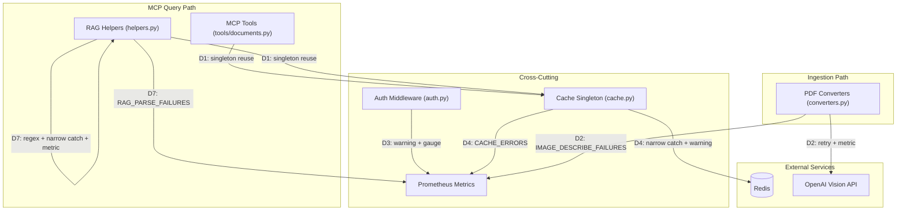
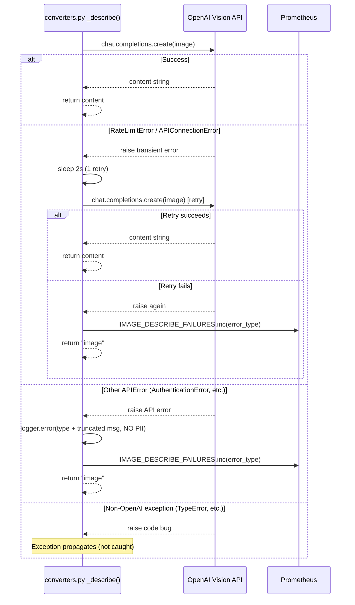
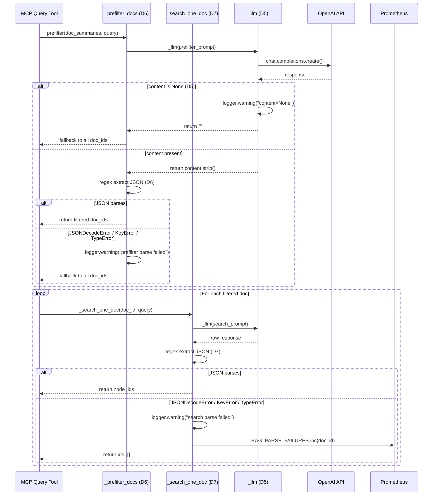
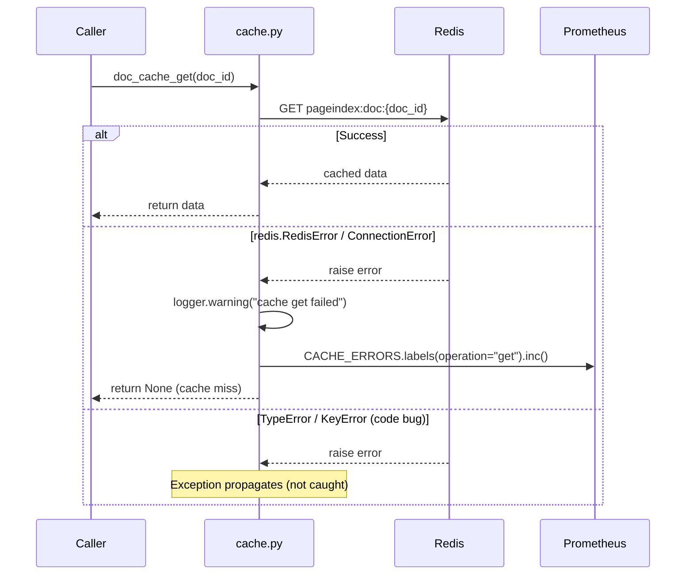

<!-- Space: CITRA -->
<!-- Title: Design: Observability & Error-Handling Overhaul -->
<!-- Folder: Designs -->
<!-- Confluence-Page-ID: 5093621762 -->
<!-- Confluence-URL: https://inheaden.atlassian.net/wiki/spaces/CITRA/pages/5093621762/Design+Observability+Error-Handling+Overhaul -->

# Design Document: Observability & Error-Handling Overhaul

## Traceability

| Artifact | Reference |
|---|---|
| Governing RFC | [RFC-008: Observability & Error-Handling Overhaul](../rfcs/008-observability-error-handling.md) |
| PRD / Requirements | `PRD.md` |
| Architecture Doc | `ARCHITECTURE.md` |
| Implementation Plan | [tasks-rfc008-observability-error-handling.md](../tasks/tasks-rfc008-observability-error-handling.md) |

## Overview

PageIndex's observability and error-handling layer suffers from two systemic anti-patterns identified during the [62-document corpus audit](../rfcs/008-observability-error-handling.md#context): ad-hoc Redis connection management (4+ locations creating per-call connections instead of reusing `cache.py` singletons) and broad `except Exception` with debug-level logging (8+ locations swallowing operationally significant failures). This design formalizes the corrections across 7 issues (ISS-07, ISS-08, ISS-13, ISS-16, ISS-17, ISS-18, ISS-19) spanning 5 source files -- replacing ad-hoc connections with singleton reuse, narrowing exception scopes to Redis/JSON-specific types, raising log levels to WARNING for degraded-but-functional states, adding regex-based JSON extraction for LLM response resilience, introducing retry logic for transient OpenAI failures, and registering 4 new Prometheus metrics for operational visibility. All changes preserve the existing fail-open semantics while making degradation observable.

## Key Design Principles

1. **Singleton-only Redis access**: Every Redis interaction outside `cache.py` must go through `get_async_redis()` or `get_cache_redis()`. No `aioredis.from_url()` calls outside `cache.py`. *(Derived from [RFC-008 D1](../rfcs/008-observability-error-handling.md#d1--replace-all-ad-hoc-redis-connections-with-cachepy-singletons-iss-07))*
2. **Narrow catch, loud log**: Exception handlers must name the specific exception types they handle (`redis.RedisError`, `json.JSONDecodeError`, `openai.APIError`). Caught exceptions log at WARNING or ERROR, never DEBUG. Uncaught exceptions propagate with full tracebacks. *(Derived from [RFC-008 D4](../rfcs/008-observability-error-handling.md#d4--raise-cache-error-logging--narrow-exception-scope-iss-16), [D6](../rfcs/008-observability-error-handling.md#d6--harden-_prefilter_docs-json-extraction--narrow-catch-iss-18), [D7](../rfcs/008-observability-error-handling.md#d7--harden-_search_one_doc-json-extraction--narrow-catch--metric-iss-19))*
3. **Fail-open with a signal**: Cache misses, parse failures, and API errors degrade gracefully (return fallback values) but always emit a Prometheus counter increment and a WARNING log. Silent degradation is prohibited. *(Derived from [RFC-008 D4](../rfcs/008-observability-error-handling.md#d4--raise-cache-error-logging--narrow-exception-scope-iss-16), [D8](../rfcs/008-observability-error-handling.md#d8--prometheus-metric-registry-conventions))*
4. **PII-safe logging**: Error logs for the OpenAI vision path must not include request/response bodies, image content, or document text. Only exception type and a truncated error message are logged. *(Derived from [RFC-008 Hard Rule HR3](../rfcs/008-observability-error-handling.md#hard-rule-constraints))*
5. **Prerequisite-first sequencing**: The `_llm()` None guard ([D5](../rfcs/008-observability-error-handling.md#d5--guard-_llm-against-none-content-iss-17)) must land before narrowing exception scopes in its callers ([D6](../rfcs/008-observability-error-handling.md#d6--harden-_prefilter_docs-json-extraction--narrow-catch-iss-18), [D7](../rfcs/008-observability-error-handling.md#d7--harden-_search_one_doc-json-extraction--narrow-catch--metric-iss-19)), since removing `except Exception` exposes `AttributeError` from `None.strip()`. *(Derived from [RFC-008 Implementation Plan](../rfcs/008-observability-error-handling.md#implementation-plan))*
6. **Metric-per-degradation-path**: Every code path that returns a fallback value instead of the computed result must increment a dedicated Prometheus counter. This makes degradation frequency queryable in Grafana without grepping logs. *(Derived from [RFC-008 D8](../rfcs/008-observability-error-handling.md#d8--prometheus-metric-registry-conventions))*

## Launch Constraints

- No new external dependencies -- all changes use existing `redis`, `openai`, and `prometheus_client` packages already in `pyproject.toml`
- [D1](../rfcs/008-observability-error-handling.md#d1--replace-all-ad-hoc-redis-connections-with-cachepy-singletons-iss-07) must land before RFC-009 Batch 1 (ISS-06 Redis pub/sub leak fix assumes singleton-managed connections)
- [D2](../rfcs/008-observability-error-handling.md#d2--add-retry--logging--metric-to-openai-vision-image-describe-iss-08) retry is bounded to 1 attempt / 2s backoff -- no unbounded retry loops
- [D3](../rfcs/008-observability-error-handling.md#d3--warn-when-mcp-bearer-token-auth-is-disabled-iss-13) warning fires once per process, not per request -- module-level flag prevents log spam
- [HR3](../rfcs/008-observability-error-handling.md#hard-rule-constraints) compliance: [D2](../rfcs/008-observability-error-handling.md#d2--add-retry--logging--metric-to-openai-vision-image-describe-iss-08) error logs must not contain image content or PII

## Architecture

### High-Level System Architecture

The diagram below shows every module and data store touched by this RFC, with edge labels mapping to [Architecture Decisions](#architecture-decisions).



Edge label legend (each links to its [Architecture Decisions](#architecture-decisions) entry and RFC decision):

| Edge label | Architecture Decision | RFC section | Task |
|---|---|---|---|
| D1: singleton reuse | [Replace ad-hoc Redis with singletons](#architecture-decisions) | [RFC-008 D1](../rfcs/008-observability-error-handling.md#d1--replace-all-ad-hoc-redis-connections-with-cachepy-singletons-iss-07) | [Task 2.1](../tasks/tasks-rfc008-observability-error-handling.md#21-replace-ad-hoc-redis-connections-d1) |
| D2: retry + metric | [OpenAI vision retry with metric](#architecture-decisions) | [RFC-008 D2](../rfcs/008-observability-error-handling.md#d2--add-retry--logging--metric-to-openai-vision-image-describe-iss-08) | [Task 3.1](../tasks/tasks-rfc008-observability-error-handling.md#31-openai-vision-retry-d2) |
| D3: warning + gauge | [Auth-disabled warning and gauge](#architecture-decisions) | [RFC-008 D3](../rfcs/008-observability-error-handling.md#d3--warn-when-mcp-bearer-token-auth-is-disabled-iss-13) | [Task 2.4](../tasks/tasks-rfc008-observability-error-handling.md#24-auth-disabled-warning-gauge-d3) |
| D4: narrow catch + warning | [Cache error narrowing and visibility](#architecture-decisions) | [RFC-008 D4](../rfcs/008-observability-error-handling.md#d4--raise-cache-error-logging--narrow-exception-scope-iss-16) | [Task 2.6](../tasks/tasks-rfc008-observability-error-handling.md#26-cache-error-narrowing-d4) |
| D5: None guard | [LLM None-content safety](#architecture-decisions) | [RFC-008 D5](../rfcs/008-observability-error-handling.md#d5--guard-_llm-against-none-content-iss-17) | [Task 1.1](../tasks/tasks-rfc008-observability-error-handling.md#11-guard-llm-none-content-d5) |
| D6: regex + narrow catch | [Prefilter JSON extraction resilience](#architecture-decisions) | [RFC-008 D6](../rfcs/008-observability-error-handling.md#d6--harden-_prefilter_docs-json-extraction--narrow-catch-iss-18) | [Task 3.3](../tasks/tasks-rfc008-observability-error-handling.md#33-prefilter-json-extraction-d6) |
| D7: regex + narrow catch + metric | [Search-one-doc JSON extraction resilience](#architecture-decisions) | [RFC-008 D7](../rfcs/008-observability-error-handling.md#d7--harden-_search_one_doc-json-extraction--narrow-catch--metric-iss-19) | [Task 3.5](../tasks/tasks-rfc008-observability-error-handling.md#35-search-one-doc-json-extraction-d7) |
| D8: metrics | [Prometheus metric conventions](#architecture-decisions) | [RFC-008 D8](../rfcs/008-observability-error-handling.md#d8--prometheus-metric-registry-conventions) | All metric tasks |

### Architecture Decisions

**Replace ad-hoc Redis with singletons** ([RFC-008 D1](../rfcs/008-observability-error-handling.md#d1--replace-all-ad-hoc-redis-connections-with-cachepy-singletons-iss-07), ISS-07): Ad-hoc `aioredis.from_url()` in `tools/documents.py:54-58` and `helpers.py:368-372` creates per-call TCP connections to Redis, defeating connection pooling. Replacing with `get_async_redis()` singleton eliminates ~1-3ms TCP setup per call. Additional optimization: cache the `registry_complete` boolean with 60s TTL (the flag is monotonic). Validates [Property 1](#property-1-redis-singleton-exclusivity). Implemented in [Task 2.1](../tasks/tasks-rfc008-observability-error-handling.md#21-replace-ad-hoc-redis-connections-d1) and [Task 2.2](../tasks/tasks-rfc008-observability-error-handling.md#22-cache-registry-complete-flag-d1). Cross-ref: prerequisite for ISS-06 (RFC-009).

**OpenAI vision retry with metric** ([RFC-008 D2](../rfcs/008-observability-error-handling.md#d2--add-retry--logging--metric-to-openai-vision-image-describe-iss-08), ISS-08, [HR3](../rfcs/008-observability-error-handling.md#hard-rule-constraints)): The `except Exception: return "image"` in `converters.py:1289` silently degrades every image when the API is unreachable. Splitting into `RateLimitError`/`APIConnectionError` (retry once, 2s backoff) vs `APIError` (log ERROR, no retry) vs non-OpenAI exceptions (propagate) provides graduated handling. Error logs omit request/response bodies per HR3. Validates [Property 2](#property-2-image-describe-retry-and-fallback). Implemented in [Task 3.1](../tasks/tasks-rfc008-observability-error-handling.md#31-openai-vision-retry-d2).

**Auth-disabled warning and gauge** ([RFC-008 D3](../rfcs/008-observability-error-handling.md#d3--warn-when-mcp-bearer-token-auth-is-disabled-iss-13), ISS-13): When `MCP_BEARER_TOKEN` is empty, the entire MCP API is unauthenticated with zero diagnostic signal. A once-only WARNING log + Prometheus gauge `MCP_AUTH_DISABLED=1` provides both human-readable and machine-queryable detection. Validates [Property 3](#property-3-auth-disabled-visibility). Implemented in [Task 2.4](../tasks/tasks-rfc008-observability-error-handling.md#24-auth-disabled-warning-gauge-d3).

**Cache error narrowing and visibility** ([RFC-008 D4](../rfcs/008-observability-error-handling.md#d4--raise-cache-error-logging--narrow-exception-scope-iss-16), ISS-16, [HR2](../rfcs/008-observability-error-handling.md#hard-rule-constraints)): Narrowing `except Exception` to `except (redis.RedisError, ConnectionError)` preserves fail-open for all Redis/network failures while letting code bugs (`TypeError`, `KeyError`) propagate. Raising log level from DEBUG to WARNING makes a misconfigured `REDIS_URL` visible without debug log activation. Per HR2, cache-purge failures during erasure are now auditable. Validates [Property 4](#property-4-cache-error-visibility). Implemented in [Task 2.6](../tasks/tasks-rfc008-observability-error-handling.md#26-cache-error-narrowing-d4).

**LLM None-content safety** ([RFC-008 D5](../rfcs/008-observability-error-handling.md#d5--guard-_llm-against-none-content-iss-17), ISS-17): OpenAI `content=None` (refusal/content-filter) causes `AttributeError` on `.strip()`, masked by broad catches in callers. Guarding with `if content is None: return ""` produces a clean empty string that downstream fallback paths already handle. This is a prerequisite for [D6](../rfcs/008-observability-error-handling.md#d6--harden-_prefilter_docs-json-extraction--narrow-catch-iss-18) and [D7](../rfcs/008-observability-error-handling.md#d7--harden-_search_one_doc-json-extraction--narrow-catch--metric-iss-19). Validates [Property 5](#property-5-llm-none-content-safety). Implemented in [Task 1.1](../tasks/tasks-rfc008-observability-error-handling.md#11-guard-llm-none-content-d5).

**Prefilter JSON extraction resilience** ([RFC-008 D6](../rfcs/008-observability-error-handling.md#d6--harden-_prefilter_docs-json-extraction--narrow-catch-iss-18), ISS-18): LLMs frequently return valid JSON wrapped in markdown fences or preamble text. Regex extraction (`re.search(r'\{.*\}', raw, re.DOTALL)`) before `json.loads` recovers these cases. Narrowing catch to `(JSONDecodeError, KeyError, TypeError)` ensures code bugs surface. Validates [Property 6](#property-6-prefilter-json-extraction-resilience). Implemented in [Task 3.3](../tasks/tasks-rfc008-observability-error-handling.md#33-prefilter-json-extraction-d6).

**Search-one-doc JSON extraction resilience** ([RFC-008 D7](../rfcs/008-observability-error-handling.md#d7--harden-_search_one_doc-json-extraction--narrow-catch--metric-iss-19), ISS-19): Same regex + narrow-catch pattern as D6, plus a `RAG_PARSE_FAILURES` counter to make per-document parse failures visible in Grafana. When this fallback fires, a prefilter-selected document contributes zero context to the RAG answer. Validates [Property 7](#property-7-search-one-doc-json-extraction-resilience). Implemented in [Task 3.5](../tasks/tasks-rfc008-observability-error-handling.md#35-search-one-doc-json-extraction-d7).

**Prometheus metric conventions** ([RFC-008 D8](../rfcs/008-observability-error-handling.md#d8--prometheus-metric-registry-conventions)): All 4 new metrics use the `pageindex_` namespace prefix, `_total` suffix for counters, snake_case naming, and module-level `prometheus_client` objects. The `doc_id` label on `RAG_PARSE_FAILURES` is bounded by `PAGEINDEX_CATALOG_TOPK` (default 200). Validates [Property 8](#property-8-prometheus-metric-conventions). Implemented across all metric-bearing tasks.

### Deployment Architecture

- **Backend**: Python 3.12 + FastMCP + gunicorn/uvicorn workers
- **Object Storage**: MinIO (`uploads/`, `processed/`)
- **Task Queue**: arq with Redis broker
- **Cache + Job Bus**: Redis (singleton access via `cache.py` per [D1](../rfcs/008-observability-error-handling.md#d1--replace-all-ad-hoc-redis-connections-with-cachepy-singletons-iss-07))
- **Metrics**: Prometheus (`/metrics` endpoint, scraped by Grafana)
- **External API**: OpenAI Vision (image-describe, retry per [D2](../rfcs/008-observability-error-handling.md#d2--add-retry--logging--metric-to-openai-vision-image-describe-iss-08))

### Communication Patterns

| Pattern | Use Case | Technology |
|---------|----------|------------|
| Singleton Redis | Cache read/write, registry flag, job status ([D1](../rfcs/008-observability-error-handling.md#d1--replace-all-ad-hoc-redis-connections-with-cachepy-singletons-iss-07)) | `cache.py` `get_async_redis()` / `get_cache_redis()` |
| Retry with backoff | OpenAI vision transient failures ([D2](../rfcs/008-observability-error-handling.md#d2--add-retry--logging--metric-to-openai-vision-image-describe-iss-08)) | In-function 1-retry / 2s backoff |
| Fail-open with metric | Cache errors ([D4](../rfcs/008-observability-error-handling.md#d4--raise-cache-error-logging--narrow-exception-scope-iss-16)), JSON parse failures ([D6](../rfcs/008-observability-error-handling.md#d6--harden-_prefilter_docs-json-extraction--narrow-catch-iss-18), [D7](../rfcs/008-observability-error-handling.md#d7--harden-_search_one_doc-json-extraction--narrow-catch--metric-iss-19)) | `prometheus_client` Counters |
| Once-only warning | Auth disabled detection ([D3](../rfcs/008-observability-error-handling.md#d3--warn-when-mcp-bearer-token-auth-is-disabled-iss-13)) | Module-level `_auth_warned` flag |

### Sequence Diagrams

#### Ingestion Image-Describe Flow ([D2](../rfcs/008-observability-error-handling.md#d2--add-retry--logging--metric-to-openai-vision-image-describe-iss-08))

Validates [Property 2](#property-2-image-describe-retry-and-fallback). Implemented in [Task 3.1](../tasks/tasks-rfc008-observability-error-handling.md#31-openai-vision-retry-d2).



#### RAG Query Flow ([D5](../rfcs/008-observability-error-handling.md#d5--guard-_llm-against-none-content-iss-17), [D6](../rfcs/008-observability-error-handling.md#d6--harden-_prefilter_docs-json-extraction--narrow-catch-iss-18), [D7](../rfcs/008-observability-error-handling.md#d7--harden-_search_one_doc-json-extraction--narrow-catch--metric-iss-19))

Validates [Property 5](#property-5-llm-none-content-safety), [Property 6](#property-6-prefilter-json-extraction-resilience), and [Property 7](#property-7-search-one-doc-json-extraction-resilience). Implemented in [Task 1.1](../tasks/tasks-rfc008-observability-error-handling.md#11-guard-llm-none-content-d5), [Task 3.3](../tasks/tasks-rfc008-observability-error-handling.md#33-prefilter-json-extraction-d6), and [Task 3.5](../tasks/tasks-rfc008-observability-error-handling.md#35-search-one-doc-json-extraction-d7).



#### Cache Operation Flow ([D4](../rfcs/008-observability-error-handling.md#d4--raise-cache-error-logging--narrow-exception-scope-iss-16))

Validates [Property 4](#property-4-cache-error-visibility). Implemented in [Task 2.6](../tasks/tasks-rfc008-observability-error-handling.md#26-cache-error-narrowing-d4).



## Service Contracts

### 1. Redis Connection Management (`cache.py`)

**Responsibility**: Centralized Redis connection lifecycle -- singleton access for both sync and async clients, document cache read-through, and job-status management.

**Changes ([D1](../rfcs/008-observability-error-handling.md#d1--replace-all-ad-hoc-redis-connections-with-cachepy-singletons-iss-07), [D4](../rfcs/008-observability-error-handling.md#d4--raise-cache-error-logging--narrow-exception-scope-iss-16))**:

- [D1](../rfcs/008-observability-error-handling.md#d1--replace-all-ad-hoc-redis-connections-with-cachepy-singletons-iss-07): New function `is_registry_complete_cached() -> bool` -- wraps `is_registry_complete()` with a module-level boolean cache and 60s TTL. Monotonic: once `True`, stays `True`. Validates [Property 1](#property-1-redis-singleton-exclusivity). Implemented in [Task 2.2](../tasks/tasks-rfc008-observability-error-handling.md#22-cache-registry-complete-flag-d1).
- [D4](../rfcs/008-observability-error-handling.md#d4--raise-cache-error-logging--narrow-exception-scope-iss-16): `doc_cache_get`, `doc_cache_set`, `doc_cache_delete` -- narrow `except Exception` to `except (redis.RedisError, ConnectionError)`, raise log to WARNING, add `CACHE_ERRORS` counter. Validates [Property 4](#property-4-cache-error-visibility). Implemented in [Task 2.6](../tasks/tasks-rfc008-observability-error-handling.md#26-cache-error-narrowing-d4).

**Internal Interfaces**:

- `get_async_redis()` -- called by `tools/documents.py` and `helpers.py` (replacing their ad-hoc `aioredis.from_url`)
- `get_cache_redis()` -- called by `doc_cache_get/set/delete`
- `is_registry_complete_cached()` -- called by `_list_docs_with_fallback` and `_registry_narrow`

### 2. Auth Middleware (`auth.py`)

**Responsibility**: Bearer-token authentication for MCP endpoints, with disabled-state visibility.

**Changes ([D3](../rfcs/008-observability-error-handling.md#d3--warn-when-mcp-bearer-token-auth-is-disabled-iss-13))**:

- Module-level `_auth_warned: bool = False` flag -- gates once-only WARNING log when `MCP_BEARER_TOKEN` is empty
- Prometheus gauge `MCP_AUTH_DISABLED` set to `1` at init when token is empty, `0` otherwise
- Validates [Property 3](#property-3-auth-disabled-visibility). Implemented in [Task 2.4](../tasks/tasks-rfc008-observability-error-handling.md#24-auth-disabled-warning-gauge-d3).

### 3. OpenAI Vision Image-Describe (`converters.py`)

**Responsibility**: Describe images extracted from PDFs via OpenAI Vision API, with retry for transient failures.

**Changes ([D2](../rfcs/008-observability-error-handling.md#d2--add-retry--logging--metric-to-openai-vision-image-describe-iss-08))**:

- Replace `except Exception: return "image"` at line 1289 with graduated exception handling:
  - `openai.RateLimitError`, `openai.APIConnectionError`: retry once with 2s backoff, then fallback
  - `openai.APIError` (other subclasses): log ERROR (type + truncated message, no PII per [HR3](../rfcs/008-observability-error-handling.md#hard-rule-constraints)), fallback
  - Non-OpenAI exceptions: propagate (code bugs)
- `IMAGE_DESCRIBE_FAILURES` counter incremented on every fallback to `"image"`
- Validates [Property 2](#property-2-image-describe-retry-and-fallback). Implemented in [Task 3.1](../tasks/tasks-rfc008-observability-error-handling.md#31-openai-vision-retry-d2).

### 4. LLM Helper (`helpers.py`)

**Responsibility**: Shared `_llm()` function providing the common OpenAI chat-completion call for all RAG query paths.

**Changes ([D5](../rfcs/008-observability-error-handling.md#d5--guard-_llm-against-none-content-iss-17))**:

- Guard `content = r.choices[0].message.content` -- if `None`, log WARNING and return `""` instead of raising `AttributeError` on `.strip()`
- Downstream callers (`_prefilter_docs`, `_search_one_doc`) already handle empty strings via existing fallback paths
- Validates [Property 5](#property-5-llm-none-content-safety). Implemented in [Task 1.1](../tasks/tasks-rfc008-observability-error-handling.md#11-guard-llm-none-content-d5).

### 5. Prefilter (`helpers.py`)

**Responsibility**: Narrow the candidate document set by asking the LLM which documents are relevant to a query.

**Changes ([D6](../rfcs/008-observability-error-handling.md#d6--harden-_prefilter_docs-json-extraction--narrow-catch-iss-18))**:

- Add regex extraction `re.search(r'\{.*\}', raw, re.DOTALL)` before `json.loads` to strip markdown fences and preamble text
- Narrow catch from `except Exception` to `except (json.JSONDecodeError, KeyError, TypeError)`
- Log at WARNING (not ERROR -- fallback is by design)
- Validates [Property 6](#property-6-prefilter-json-extraction-resilience). Implemented in [Task 3.3](../tasks/tasks-rfc008-observability-error-handling.md#33-prefilter-json-extraction-d6).

### 6. Search-One-Doc (`helpers.py`)

**Responsibility**: Extract relevant node IDs from a single document's tree via LLM-guided search.

**Changes ([D7](../rfcs/008-observability-error-handling.md#d7--harden-_search_one_doc-json-extraction--narrow-catch--metric-iss-19))**:

- Same regex + narrow-catch pattern as [D6](../rfcs/008-observability-error-handling.md#d6--harden-_prefilter_docs-json-extraction--narrow-catch-iss-18)
- Add `RAG_PARSE_FAILURES` counter (labels: `doc_id`) incremented on every fallback to `ids = []`
- Validates [Property 7](#property-7-search-one-doc-json-extraction-resilience). Implemented in [Task 3.5](../tasks/tasks-rfc008-observability-error-handling.md#35-search-one-doc-json-extraction-d7).

### 7. Document Listing (`tools/documents.py`)

**Responsibility**: MCP tool implementations for document listing and search, including registry-complete flag check.

**Changes ([D1](../rfcs/008-observability-error-handling.md#d1--replace-all-ad-hoc-redis-connections-with-cachepy-singletons-iss-07))**:

- Replace `aioredis.from_url()` + `await r.aclose()` at lines 54-58 with `await get_async_redis()` from `cache.py`
- Use `is_registry_complete_cached()` instead of per-call Redis query
- Validates [Property 1](#property-1-redis-singleton-exclusivity). Implemented in [Task 2.1](../tasks/tasks-rfc008-observability-error-handling.md#21-replace-ad-hoc-redis-connections-d1).

### 8. Prometheus Metrics Registry

**Responsibility**: Define and register all new Prometheus metrics per [D8](../rfcs/008-observability-error-handling.md#d8--prometheus-metric-registry-conventions) conventions.

| Metric | Type | Labels | Module | Validates |
|---|---|---|---|---|
| `pageindex_image_describe_failures_total` | Counter | `error_type` | `converters.py` | [Property 2](#property-2-image-describe-retry-and-fallback) |
| `pageindex_mcp_auth_disabled` | Gauge | -- | `auth.py` | [Property 3](#property-3-auth-disabled-visibility) |
| `pageindex_cache_errors_total` | Counter | `operation` | `cache.py` | [Property 4](#property-4-cache-error-visibility) |
| `pageindex_rag_parse_failures_total` | Counter | `doc_id` | `helpers.py` | [Property 7](#property-7-search-one-doc-json-extraction-resilience) |

## Data Models

### Prometheus Metrics Schema

```python
from prometheus_client import Counter, Gauge

# D2 (converters.py) — image-describe fallbacks
IMAGE_DESCRIBE_FAILURES = Counter(
    "pageindex_image_describe_failures_total",
    "Number of image-describe calls that fell back to 'image'",
    ["error_type"],  # e.g., "RateLimitError", "APIConnectionError", "AuthenticationError"
)

# D3 (auth.py) — auth-disabled state
MCP_AUTH_DISABLED = Gauge(
    "pageindex_mcp_auth_disabled",
    "1 when MCP bearer-token auth is disabled (MCP_BEARER_TOKEN empty), 0 otherwise",
)

# D4 (cache.py) — cache operation failures
CACHE_ERRORS = Counter(
    "pageindex_cache_errors_total",
    "Number of Redis cache operation failures (fail-open, returns None/no-op)",
    ["operation"],  # "get", "set", "delete"
)

# D7 (helpers.py) — RAG search parse failures
RAG_PARSE_FAILURES = Counter(
    "pageindex_rag_parse_failures_total",
    "Number of _search_one_doc JSON parse failures (fallback to ids=[])",
    ["doc_id"],
)
```

## Correctness Properties

*A property is a characteristic or behavior that should hold true across all valid executions of the system -- a formal statement about what the system should do. Properties serve as the bridge between human-readable specifications and machine-verifiable correctness guarantees.*

### Property 1: Redis singleton exclusivity

*For any* code path in `tools/documents.py` or `helpers.py` that queries Redis, system SHALL use `get_async_redis()` from `cache.py` and SHALL NOT call `aioredis.from_url()` directly.

**Validates**: [RFC-008 D1](../rfcs/008-observability-error-handling.md#d1--replace-all-ad-hoc-redis-connections-with-cachepy-singletons-iss-07), ISS-07. **Tested in**: [Task 2.3](../tasks/tasks-rfc008-observability-error-handling.md#23-test-redis-singleton-reuse-d1) (`test_list_docs_uses_singleton`, `test_registry_complete_cached`). **Service contract**: [Redis Connection Management](#1-redis-connection-management-cachepy), [Document Listing](#7-document-listing-toolsdocumentspy).

### Property 2: Image-describe retry and fallback

*For any* `_describe()` call where OpenAI raises `RateLimitError` or `APIConnectionError`, system SHALL retry exactly once with 2s backoff before falling back to `"image"`. *For any* `_describe()` call where OpenAI raises a non-retryable `APIError`, system SHALL log at ERROR (without PII per [HR3](../rfcs/008-observability-error-handling.md#hard-rule-constraints)), increment `IMAGE_DESCRIBE_FAILURES`, and return `"image"`. *For any* non-OpenAI exception, system SHALL let it propagate.

**Validates**: [RFC-008 D2](../rfcs/008-observability-error-handling.md#d2--add-retry--logging--metric-to-openai-vision-image-describe-iss-08), ISS-08, [HR3](../rfcs/008-observability-error-handling.md#hard-rule-constraints). **Tested in**: [Task 3.2](../tasks/tasks-rfc008-observability-error-handling.md#32-test-image-describe-resilience-d2) (`test_rate_limit_retry`, `test_connection_error_retry`, `test_auth_error_no_retry`, `test_type_error_propagates`). **Service contract**: [OpenAI Vision Image-Describe](#3-openai-vision-image-describe-converterspy). **Sequence diagram**: [Ingestion Image-Describe Flow](#ingestion-image-describe-flow--d2).

### Property 3: Auth-disabled visibility

*For any* deployment where `MCP_BEARER_TOKEN` is empty, system SHALL set `MCP_AUTH_DISABLED` gauge to `1` and SHALL emit exactly one WARNING log on the first request that hits the disabled path.

**Validates**: [RFC-008 D3](../rfcs/008-observability-error-handling.md#d3--warn-when-mcp-bearer-token-auth-is-disabled-iss-13), ISS-13. **Tested in**: [Task 2.5](../tasks/tasks-rfc008-observability-error-handling.md#25-test-auth-disabled-d3) (`test_auth_disabled_warns_once`, `test_auth_enabled_no_warning`). **Service contract**: [Auth Middleware](#2-auth-middleware-authpy).

### Property 4: Cache-error visibility

*For any* `doc_cache_get`, `doc_cache_set`, or `doc_cache_delete` call that encounters a `redis.RedisError` or `ConnectionError`, system SHALL log at WARNING (including the exception message), increment `CACHE_ERRORS` counter with the `operation` label, and return the fail-open value (`None` for get, no-op for set/delete). *For any* non-Redis/non-connection exception (e.g., `TypeError`), system SHALL let it propagate.

**Validates**: [RFC-008 D4](../rfcs/008-observability-error-handling.md#d4--raise-cache-error-logging--narrow-exception-scope-iss-16), ISS-16, [HR2](../rfcs/008-observability-error-handling.md#hard-rule-constraints). **Tested in**: [Task 2.7](../tasks/tasks-rfc008-observability-error-handling.md#27-test-cache-error-narrowing-d4) (`test_redis_error_warns_and_counts`, `test_type_error_propagates`). **Service contract**: [Redis Connection Management](#1-redis-connection-management-cachepy). **Sequence diagram**: [Cache Operation Flow](#cache-operation-flow--d4).

### Property 5: LLM None-content safety

*For any* OpenAI response where `choices[0].message.content` is `None`, `_llm()` SHALL return `""` and log a WARNING. It SHALL NOT raise `AttributeError`.

**Validates**: [RFC-008 D5](../rfcs/008-observability-error-handling.md#d5--guard-_llm-against-none-content-iss-17), ISS-17. **Tested in**: [Task 1.2](../tasks/tasks-rfc008-observability-error-handling.md#12-test-llm-none-guard-d5) (`test_llm_none_returns_empty`, `test_llm_valid_strips`). **Service contract**: [LLM Helper](#4-llm-helper-helperspy). **Sequence diagram**: [RAG Query Flow](#rag-query-flow--d5-d6-d7).

### Property 6: Prefilter JSON extraction resilience

*For any* LLM response containing valid JSON wrapped in markdown fences or preamble text, `_prefilter_docs` SHALL extract and parse the JSON successfully. *For any* response that fails JSON parsing after extraction, system SHALL catch only `(JSONDecodeError, KeyError, TypeError)`, log at WARNING, and fall back to all `doc_ids`.

**Validates**: [RFC-008 D6](../rfcs/008-observability-error-handling.md#d6--harden-_prefilter_docs-json-extraction--narrow-catch-iss-18), ISS-18. **Tested in**: [Task 3.4](../tasks/tasks-rfc008-observability-error-handling.md#34-test-prefilter-json-extraction-d6) (`test_json_in_fences`, `test_malformed_fallback`, `test_attribute_error_propagates`). **Service contract**: [Prefilter](#5-prefilter-helperspy). **Sequence diagram**: [RAG Query Flow](#rag-query-flow--d5-d6-d7).

### Property 7: Search-one-doc JSON extraction resilience

*For any* LLM response containing valid JSON wrapped in preamble text, `_search_one_doc` SHALL extract and parse the JSON successfully. *For any* response that fails JSON parsing, system SHALL catch only `(JSONDecodeError, KeyError, TypeError)`, log at WARNING, increment `RAG_PARSE_FAILURES` counter with the `doc_id` label, and fall back to `ids = []`.

**Validates**: [RFC-008 D7](../rfcs/008-observability-error-handling.md#d7--harden-_search_one_doc-json-extraction--narrow-catch--metric-iss-19), ISS-19. **Tested in**: [Task 3.6](../tasks/tasks-rfc008-observability-error-handling.md#36-test-search-one-doc-d7) (`test_json_with_preamble`, `test_unparseable_counts_metric`). **Service contract**: [Search-One-Doc](#6-search-one-doc-helperspy). **Sequence diagram**: [RAG Query Flow](#rag-query-flow--d5-d6-d7).

### Property 8: Prometheus metric conventions

*For any* new Prometheus metric added by this RFC, it SHALL use the `pageindex_` namespace prefix, `_total` suffix for counters, and snake_case naming. Counter labels SHALL have bounded cardinality (no unbounded string labels except `doc_id`, which is bounded by `PAGEINDEX_CATALOG_TOPK`).

**Validates**: [RFC-008 D8](../rfcs/008-observability-error-handling.md#d8--prometheus-metric-registry-conventions). **Tested in**: [Task 4.1](../tasks/tasks-rfc008-observability-error-handling.md#41-corpus-regression) (verify metrics registered and scrapable on `/metrics`). **Service contract**: [Prometheus Metrics Registry](#8-prometheus-metrics-registry).

## Error Handling

### Error Categories & Responses

| Category | Handling | Log Level | Retry | Metric | Decision |
|----------|----------|-----------|-------|--------|----------|
| Redis connection/command failure | Fail-open (return None / no-op) | WARNING | No | `CACHE_ERRORS` | [D4](../rfcs/008-observability-error-handling.md#d4--raise-cache-error-logging--narrow-exception-scope-iss-16) |
| OpenAI transient error (rate limit, connection) | Retry once, then fallback | WARNING | 1x / 2s | `IMAGE_DESCRIBE_FAILURES` | [D2](../rfcs/008-observability-error-handling.md#d2--add-retry--logging--metric-to-openai-vision-image-describe-iss-08) |
| OpenAI permanent error (auth, other API) | Fallback to `"image"` | ERROR | No | `IMAGE_DESCRIBE_FAILURES` | [D2](../rfcs/008-observability-error-handling.md#d2--add-retry--logging--metric-to-openai-vision-image-describe-iss-08) |
| LLM content=None | Return empty string | WARNING | No | -- | [D5](../rfcs/008-observability-error-handling.md#d5--guard-_llm-against-none-content-iss-17) |
| JSON parse failure (prefilter) | Fallback to all doc_ids | WARNING | No | -- | [D6](../rfcs/008-observability-error-handling.md#d6--harden-_prefilter_docs-json-extraction--narrow-catch-iss-18) |
| JSON parse failure (search) | Fallback to ids=[] | WARNING | No | `RAG_PARSE_FAILURES` | [D7](../rfcs/008-observability-error-handling.md#d7--harden-_search_one_doc-json-extraction--narrow-catch--metric-iss-19) |
| Auth disabled | Pass-through (dev mode) | WARNING (once) | N/A | `MCP_AUTH_DISABLED` | [D3](../rfcs/008-observability-error-handling.md#d3--warn-when-mcp-bearer-token-auth-is-disabled-iss-13) |
| Code bug (TypeError, KeyError, etc.) | Propagate with full traceback | N/A | No | -- | All |

### Service-Specific Error Handling

**[Redis Connection Management](#1-redis-connection-management-cachepy) ([D1](../rfcs/008-observability-error-handling.md#d1--replace-all-ad-hoc-redis-connections-with-cachepy-singletons-iss-07), [D4](../rfcs/008-observability-error-handling.md#d4--raise-cache-error-logging--narrow-exception-scope-iss-16)):**

- `doc_cache_get` Redis failure -> return `None` (cache miss), log WARNING, increment `CACHE_ERRORS.labels(operation="get")` ([D4](../rfcs/008-observability-error-handling.md#d4--raise-cache-error-logging--narrow-exception-scope-iss-16), [Property 4](#property-4-cache-error-visibility))
- `doc_cache_set` Redis failure -> no-op, log WARNING, increment `CACHE_ERRORS.labels(operation="set")` ([D4](../rfcs/008-observability-error-handling.md#d4--raise-cache-error-logging--narrow-exception-scope-iss-16), [Property 4](#property-4-cache-error-visibility))
- `doc_cache_delete` Redis failure -> no-op, log WARNING, increment `CACHE_ERRORS.labels(operation="delete")` ([D4](../rfcs/008-observability-error-handling.md#d4--raise-cache-error-logging--narrow-exception-scope-iss-16), [Property 4](#property-4-cache-error-visibility)). Per [HR2](../rfcs/008-observability-error-handling.md#hard-rule-constraints), this makes cache-purge failures during erasure auditable.
- `is_registry_complete_cached` Redis failure -> return `False` (assume not complete, fall back to MinIO listing) ([D1](../rfcs/008-observability-error-handling.md#d1--replace-all-ad-hoc-redis-connections-with-cachepy-singletons-iss-07))

**[OpenAI Vision Image-Describe](#3-openai-vision-image-describe-converterspy) ([D2](../rfcs/008-observability-error-handling.md#d2--add-retry--logging--metric-to-openai-vision-image-describe-iss-08)):**

- `RateLimitError` / `APIConnectionError` -> retry once with 2s backoff, then return `"image"` + increment counter ([Property 2](#property-2-image-describe-retry-and-fallback))
- `AuthenticationError` / other `APIError` -> log ERROR (exception type + truncated message, no PII), return `"image"` + increment counter ([Property 2](#property-2-image-describe-retry-and-fallback))
- `TypeError` / `ValueError` / other non-OpenAI -> propagate (code bug, not API failure)

**[LLM Helper](#4-llm-helper-helperspy) ([D5](../rfcs/008-observability-error-handling.md#d5--guard-_llm-against-none-content-iss-17)):**

- `content=None` -> return `""`, log WARNING ([Property 5](#property-5-llm-none-content-safety))

**[Prefilter](#5-prefilter-helperspy) ([D6](../rfcs/008-observability-error-handling.md#d6--harden-_prefilter_docs-json-extraction--narrow-catch-iss-18)):**

- `JSONDecodeError` / `KeyError` / `TypeError` -> return all `doc_ids` (expensive but correct fallback), log WARNING ([Property 6](#property-6-prefilter-json-extraction-resilience))
- `AttributeError` / other -> propagate (code bug; now impossible after [D5](../rfcs/008-observability-error-handling.md#d5--guard-_llm-against-none-content-iss-17))

**[Search-One-Doc](#6-search-one-doc-helperspy) ([D7](../rfcs/008-observability-error-handling.md#d7--harden-_search_one_doc-json-extraction--narrow-catch--metric-iss-19)):**

- `JSONDecodeError` / `KeyError` / `TypeError` -> set `ids = []`, log WARNING, increment `RAG_PARSE_FAILURES.labels(doc_id=doc_id)` ([Property 7](#property-7-search-one-doc-json-extraction-resilience))
- Other exceptions -> propagate

## Testing Strategy

### Testing Layers

Testing follows the [RFC-008 Test Strategy](../rfcs/008-observability-error-handling.md#test-strategy):

1. **Unit Tests**: Mock external dependencies (Redis, OpenAI) at the interface boundary to verify each decision's error-handling behavior in isolation. One test per expected exception type per function.
2. **Integration Tests**: 62-document corpus regression (`issue/verify_corpus.py`) to verify no behavioral regressions after all batches land. Per [RFC-008 Integration](../rfcs/008-observability-error-handling.md#integration).
3. **Metric Verification**: Confirm all 4 new Prometheus metrics are registered and scrapable on `/metrics`.

### Test Categories by Service

| Service | Properties | Unit Tests (task) | Integration Tests |
|---------|------------|-------------------|-------------------|
| [Redis Connection Management](#1-redis-connection-management-cachepy) | [P1](#property-1-redis-singleton-exclusivity), [P4](#property-4-cache-error-visibility) | `test_list_docs_uses_singleton`, `test_registry_complete_cached` ([Task 2.3](../tasks/tasks-rfc008-observability-error-handling.md#23-test-redis-singleton-reuse-d1)), `test_redis_error_warns_and_counts`, `test_type_error_propagates` ([Task 2.7](../tasks/tasks-rfc008-observability-error-handling.md#27-test-cache-error-narrowing-d4)) | -- |
| [Auth Middleware](#2-auth-middleware-authpy) | [P3](#property-3-auth-disabled-visibility) | `test_auth_disabled_warns_once`, `test_auth_enabled_no_warning` ([Task 2.5](../tasks/tasks-rfc008-observability-error-handling.md#25-test-auth-disabled-d3)) | -- |
| [OpenAI Vision](#3-openai-vision-image-describe-converterspy) | [P2](#property-2-image-describe-retry-and-fallback) | `test_rate_limit_retry`, `test_connection_error_retry`, `test_auth_error_no_retry`, `test_type_error_propagates` ([Task 3.2](../tasks/tasks-rfc008-observability-error-handling.md#32-test-image-describe-resilience-d2)) | -- |
| [LLM Helper](#4-llm-helper-helperspy) | [P5](#property-5-llm-none-content-safety) | `test_llm_none_returns_empty`, `test_llm_valid_strips` ([Task 1.2](../tasks/tasks-rfc008-observability-error-handling.md#12-test-llm-none-guard-d5)) | -- |
| [Prefilter](#5-prefilter-helperspy) | [P6](#property-6-prefilter-json-extraction-resilience) | `test_json_in_fences`, `test_malformed_fallback`, `test_attribute_error_propagates` ([Task 3.4](../tasks/tasks-rfc008-observability-error-handling.md#34-test-prefilter-json-extraction-d6)) | -- |
| [Search-One-Doc](#6-search-one-doc-helperspy) | [P7](#property-7-search-one-doc-json-extraction-resilience) | `test_json_with_preamble`, `test_unparseable_counts_metric` ([Task 3.6](../tasks/tasks-rfc008-observability-error-handling.md#36-test-search-one-doc-d7)) | -- |
| All services | [P8](#property-8-prometheus-metric-conventions) | -- | Corpus regression ([Task 4.1](../tasks/tasks-rfc008-observability-error-handling.md#41-corpus-regression)) |

### Key Test Scenarios

**Critical Path Tests:**

1. Call `_list_docs_with_fallback` -- verify `get_async_redis()` used, no `aioredis.from_url` call *(validates [P1](#property-1-redis-singleton-exclusivity), [D1](../rfcs/008-observability-error-handling.md#d1--replace-all-ad-hoc-redis-connections-with-cachepy-singletons-iss-07))*
2. Mock OpenAI to raise `RateLimitError` then succeed -- verify retry fires and content returned *(validates [P2](#property-2-image-describe-retry-and-fallback), [D2](../rfcs/008-observability-error-handling.md#d2--add-retry--logging--metric-to-openai-vision-image-describe-iss-08))*
3. Instantiate `BearerAuthMiddleware` with empty token, send request -- verify WARNING logged once and gauge == 1 *(validates [P3](#property-3-auth-disabled-visibility), [D3](../rfcs/008-observability-error-handling.md#d3--warn-when-mcp-bearer-token-auth-is-disabled-iss-13))*
4. Mock Redis to raise `redis.ConnectionError` in `doc_cache_get` -- verify WARNING logged, counter incremented, `None` returned *(validates [P4](#property-4-cache-error-visibility), [D4](../rfcs/008-observability-error-handling.md#d4--raise-cache-error-logging--narrow-exception-scope-iss-16))*
5. Mock OpenAI response with `content=None` -- verify `_llm()` returns `""` *(validates [P5](#property-5-llm-none-content-safety), [D5](../rfcs/008-observability-error-handling.md#d5--guard-_llm-against-none-content-iss-17))*
6. Pass LLM response wrapped in ````json` fences to `_prefilter_docs` -- verify JSON extracted *(validates [P6](#property-6-prefilter-json-extraction-resilience), [D6](../rfcs/008-observability-error-handling.md#d6--harden-_prefilter_docs-json-extraction--narrow-catch-iss-18))*
7. Pass LLM response with preamble + valid JSON to `_search_one_doc` -- verify node IDs extracted *(validates [P7](#property-7-search-one-doc-json-extraction-resilience), [D7](../rfcs/008-observability-error-handling.md#d7--harden-_search_one_doc-json-extraction--narrow-catch--metric-iss-19))*

**Edge Cases:**

- `doc_cache_get` raises `TypeError` (code bug) -- verify exception propagates, NOT caught by narrowed handler *(validates [P4](#property-4-cache-error-visibility))*
- `_describe()` raises `TypeError` -- verify exception propagates, NOT caught *(validates [P2](#property-2-image-describe-retry-and-fallback))*
- `_prefilter_docs` receives `AttributeError` from caller -- verify propagation after [D5](../rfcs/008-observability-error-handling.md#d5--guard-_llm-against-none-content-iss-17) guard *(validates [P6](#property-6-prefilter-json-extraction-resilience))*
- `registry_complete` cached `True` -- second call within TTL returns `True` without Redis query *(validates [P1](#property-1-redis-singleton-exclusivity))*
- `MCP_BEARER_TOKEN` set to valid value -- gauge == 0, no WARNING *(validates [P3](#property-3-auth-disabled-visibility))*
- Second request on disabled auth -- no duplicate WARNING (once-only flag) *(validates [P3](#property-3-auth-disabled-visibility))*
- OpenAI `RateLimitError` on both initial call AND retry -- verify fallback to `"image"` after exactly 1 retry *(validates [P2](#property-2-image-describe-retry-and-fallback))*
- `RAG_PARSE_FAILURES` counter label uses actual `doc_id` from the call *(validates [P7](#property-7-search-one-doc-json-extraction-resilience), [P8](#property-8-prometheus-metric-conventions))*
- 62-document corpus regression passes with zero regressions after all batches *(validates all properties, [RFC-008 Integration](../rfcs/008-observability-error-handling.md#integration))*

## Risks

Risk analysis per [RFC-008 Risks](../rfcs/008-observability-error-handling.md#risks):

1. **[D1](../rfcs/008-observability-error-handling.md#d1--replace-all-ad-hoc-redis-connections-with-cachepy-singletons-iss-07) singleton lifecycle mismatch.** If `get_async_redis()` returns a connection bound to a different event loop (e.g., in test fixtures or multi-loop deployments), callers will get `RuntimeError`. **Mitigation:** The existing `cache.py` singleton is already used by the cache read/write path in production without issue; the risk is low. Test fixtures must use the same event-loop-scoped fixture. [Property 1](#property-1-redis-singleton-exclusivity) verified in [Task 2.3](../tasks/tasks-rfc008-observability-error-handling.md#23-test-redis-singleton-reuse-d1).

2. **[D2](../rfcs/008-observability-error-handling.md#d2--add-retry--logging--metric-to-openai-vision-image-describe-iss-08) retry adds latency to image-heavy documents.** A single 2s retry per failed image in a 50-image PDF adds up to 100s worst-case. **Mitigation:** The retry is bounded to 1 attempt with a short backoff. If `IMAGE_DESCRIBE_FAILURES` counter spikes, operators can disable image description entirely via the existing `DESCRIBE_IMAGES=false` env var. [Property 2](#property-2-image-describe-retry-and-fallback) verified in [Task 3.2](../tasks/tasks-rfc008-observability-error-handling.md#32-test-image-describe-resilience-d2).

3. **[D4](../rfcs/008-observability-error-handling.md#d4--raise-cache-error-logging--narrow-exception-scope-iss-16) narrowed catch may miss an unexpected Redis error subclass.** If a future `redis` library version introduces a new exception class not under `redis.RedisError`, it would propagate instead of being caught. **Mitigation:** `redis.RedisError` is the documented base class for all Redis client errors. The `ConnectionError` addition catches OS-level socket failures. This covers all known failure modes. [Property 4](#property-4-cache-error-visibility) verified in [Task 2.7](../tasks/tasks-rfc008-observability-error-handling.md#27-test-cache-error-narrowing-d4).

4. **[D6](../rfcs/008-observability-error-handling.md#d6--harden-_prefilter_docs-json-extraction--narrow-catch-iss-18)/[D7](../rfcs/008-observability-error-handling.md#d7--harden-_search_one_doc-json-extraction--narrow-catch--metric-iss-19) regex extraction is greedy.** `re.search(r'\{.*\}', raw, re.DOTALL)` matches the first `{` to the last `}`, which is correct for a single JSON object but would produce invalid JSON if the LLM returns multiple objects. **Mitigation:** Both callers expect exactly one JSON object. If the regex produces invalid JSON, `json.loads` raises `JSONDecodeError` and the existing fallback fires -- no worse than today. [Property 6](#property-6-prefilter-json-extraction-resilience) verified in [Task 3.4](../tasks/tasks-rfc008-observability-error-handling.md#34-test-prefilter-json-extraction-d6); [Property 7](#property-7-search-one-doc-json-extraction-resilience) verified in [Task 3.6](../tasks/tasks-rfc008-observability-error-handling.md#36-test-search-one-doc-d7).

5. **[D8](../rfcs/008-observability-error-handling.md#d8--prometheus-metric-registry-conventions) `doc_id` label cardinality.** The `RAG_PARSE_FAILURES` counter uses `doc_id` as a label. If parse failures are widespread across many documents, this could create high cardinality in Prometheus. **Mitigation:** The counter only fires on parse failures in the narrowed candidate set (bounded by `PAGEINDEX_CATALOG_TOPK`, default 200). If cardinality becomes a concern, the label can be dropped in a follow-up without changing the fix semantics. [Property 8](#property-8-prometheus-metric-conventions) verified in [Task 4.1](../tasks/tasks-rfc008-observability-error-handling.md#41-corpus-regression).
