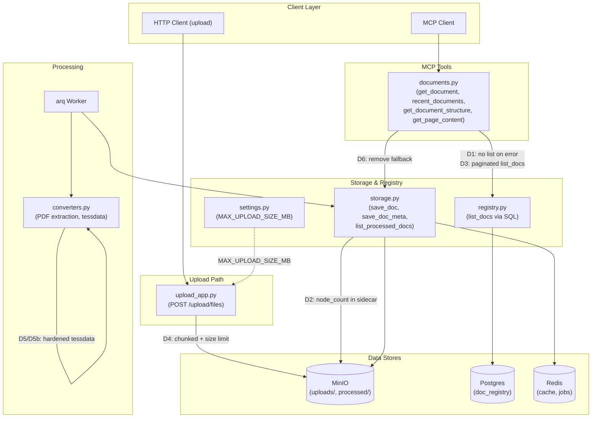
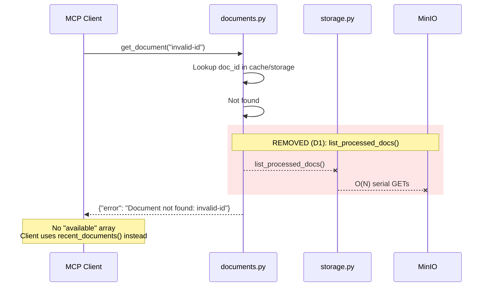
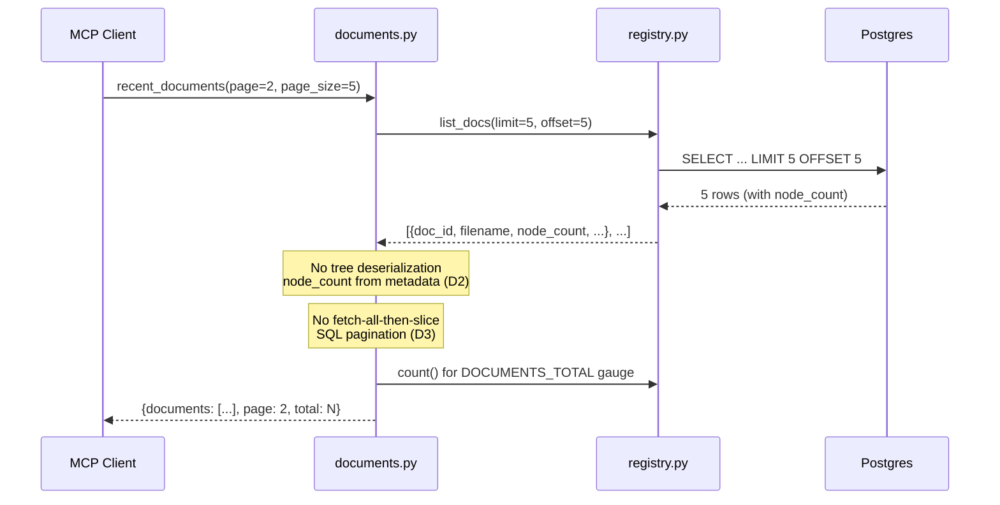
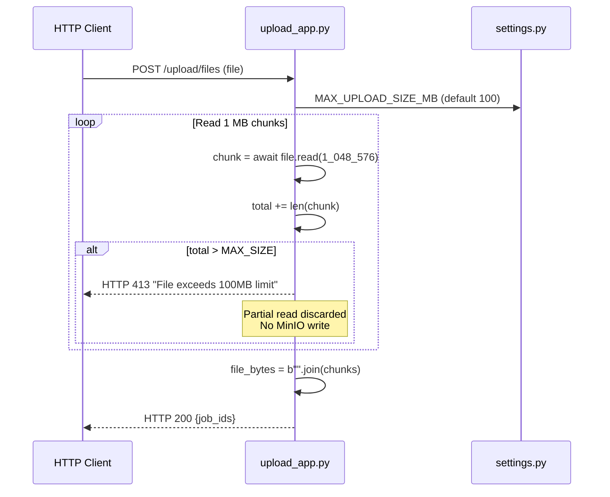
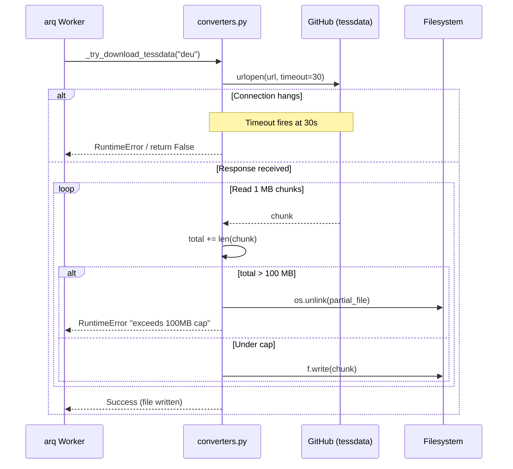
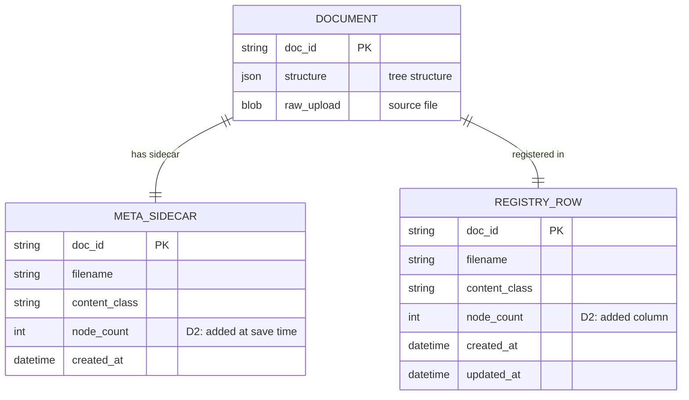

<!-- Space: CITRA -->
<!-- Title: Design: Query-Path Performance & Input Hardening -->
<!-- Folder: Designs -->
<!-- Confluence-Page-ID: 5093326851 -->
<!-- Confluence-URL: https://inheaden.atlassian.net/wiki/spaces/CITRA/pages/5093326851/Design+Query-Path+Performance+Input+Hardening -->

# Design Document: Query-Path Performance & Input Hardening

## Traceability

| Artifact | Reference |
|---|---|
| Governing RFC | [RFC-009: Query-Path Performance & Input Hardening](../rfcs/009-query-path-performance-input-hardening.md) |
| PRD / Requirements | `PRD.md` |
| Architecture Doc | `ARCHITECTURE.md` |
| Implementation Plan | [tasks-rfc009-query-path-performance-input-hardening.md](../tasks/tasks-rfc009-query-path-performance-input-hardening.md) |

## Overview

The PageIndex MCP Server query path contains O(N) MinIO listing fallbacks that fire on every "document not found" error and every registry degradation, creating both a performance bottleneck and a DoS vector. Compounding this, the upload endpoint accepts unbounded file sizes and the tessdata download path has no timeout or size cap. This design eliminates these issues via 7 decisions ([D1](../rfcs/009-query-path-performance-input-hardening.md#d1--remove-on-listing-from-error-paths-iss-21--immediate), [D2](../rfcs/009-query-path-performance-input-hardening.md#d2--store-node_count-in-metajson-sidecar-at-save-time-iss-05-short-term), [D3](../rfcs/009-query-path-performance-input-hardening.md#d3--server-side-pagination-for-recent_documents-iss-06), [D4](../rfcs/009-query-path-performance-input-hardening.md#d4--chunked-upload-with-size-limit-iss-15), [D5](../rfcs/009-query-path-performance-input-hardening.md#d5--tessdata-download-hardening-iss-14-immediate), [D5b](../rfcs/009-query-path-performance-input-hardening.md#d5b--pre-bake-tessdata-in-docker-image-iss-14-production), [D6](../rfcs/009-query-path-performance-input-hardening.md#d6--remove-minio-fallback-from-_list_docs_with_fallback-iss-05-long-term)) across 5 implementation batches, addressing ISS-05, ISS-06, ISS-14, ISS-15, and ISS-21.

## Key Design Principles

1. **Write-time amortization**: Compute expensive metadata (node counts) at ingestion time, not at query time. Ingestion runs once per document; listing runs on every page view. Moving work to write-time amortizes it across all reads.
2. **Registry-first**: Replace O(N) MinIO listing with a single SQL query via the Postgres registry (RFC-006). The registry is the authoritative source for document metadata once backfill is complete.
3. **Defense-in-depth**: Apply size limits and timeouts even behind authentication. An authenticated client can still be compromised or buggy -- size limits on uploads and tessdata downloads are defense-in-depth, not redundant.
4. **Graceful degradation removal**: Surface errors instead of silently falling back to O(N) MinIO listing. The fallback is the performance problem -- removing it forces operators to fix the root cause (registry availability) rather than silently degrading.
5. **Production-path elimination**: Pre-bake tessdata in the Docker image to remove the runtime download path entirely in production. Dev/local retains the download fallback with timeout and size cap.

## Launch Constraints

- [D6](../rfcs/009-query-path-performance-input-hardening.md#d6--remove-minio-fallback-from-_list_docs_with_fallback-iss-05-long-term) is blocked on RFC-007 ISS-03 (registry dual-write correctness) and RFC-006 D3 (backfill completion). Cannot remove the MinIO fallback until the registry is authoritative.
- [D3](../rfcs/009-query-path-performance-input-hardening.md#d3--server-side-pagination-for-recent_documents-iss-06) depends on [D2](../rfcs/009-query-path-performance-input-hardening.md#d2--store-node_count-in-metajson-sidecar-at-save-time-iss-05-short-term) (node_count in sidecar eliminates tree deserialization) and ISS-07/RFC-008 (Redis singleton lifecycle prevents connection churn).
- [D5b](../rfcs/009-query-path-performance-input-hardening.md#d5b--pre-bake-tessdata-in-docker-image-iss-14-production) is ops-only (Dockerfile change, no application code). Runtime download ([D5](../rfcs/009-query-path-performance-input-hardening.md#d5--tessdata-download-hardening-iss-14-immediate)) remains as the dev/local fallback.

## Architecture

### High-Level System Architecture



### Architecture Decisions

**Remove O(N) listing from error paths** ([RFC-009 D1](../rfcs/009-query-path-performance-input-hardening.md#d1--remove-on-listing-from-error-paths-iss-21--immediate), ISS-21): Three MCP tools call `list_processed_docs()` on every invalid `doc_id` solely to populate an `available` array in the error response. This is O(N) with serial MinIO GETs and creates a DoS vector. The fix removes the `list_processed_docs()` call entirely -- the MCP tool description already directs clients to `recent_documents()`. Pure code removal with no behavioral change for well-behaved clients. Validates [Property 1](#property-1-no-on-listing-on-error-paths). Implemented in [Task 1.1](../tasks/tasks-rfc009-query-path-performance-input-hardening.md#11-remove-on-listing-from-error-paths-d1).

**Store node_count in .meta.json sidecar at save time** ([RFC-009 D2](../rfcs/009-query-path-performance-input-hardening.md#d2--store-node_count-in-metajson-sidecar-at-save-time-iss-05-short-term), ISS-05): `recent_documents` currently deserializes the full tree for every page item just to count nodes. Computing `node_count` in `save_doc_meta()` at ingestion time and persisting it in the `.meta.json` sidecar eliminates the per-doc tree deserialization entirely. The registry schema gets a `node_count INTEGER` column populated by dual-write. Validates [Property 2](#property-2-node-count-persisted-at-save-time). Implemented in [Task 3.1](../tasks/tasks-rfc009-query-path-performance-input-hardening.md#31-store-node-count-in-metajson-sidecar-d2).

**Server-side pagination for recent_documents** ([RFC-009 D3](../rfcs/009-query-path-performance-input-hardening.md#d3--server-side-pagination-for-recent_documents-iss-06), ISS-06): `_list_docs_with_fallback()` fetches up to 100,000 rows then slices in Python. The fix passes `limit=page_size, offset=(page-1)*page_size` directly to `list_docs()` on the registry path. The MinIO fallback retains fetch-all-then-slice behavior (it goes away with [D6](../rfcs/009-query-path-performance-input-hardening.md#d6--remove-minio-fallback-from-_list_docs_with_fallback-iss-05-long-term)). Validates [Property 3](#property-3-server-side-pagination). Implemented in [Task 3.2](../tasks/tasks-rfc009-query-path-performance-input-hardening.md#32-server-side-pagination-d3).

**Chunked upload with size limit** ([RFC-009 D4](../rfcs/009-query-path-performance-input-hardening.md#d4--chunked-upload-with-size-limit-iss-15), ISS-15): The upload endpoint reads the entire file into memory with no size check. The fix replaces unbounded `file.read()` with chunked read (1 MB chunks) that aborts with HTTP 413 if total exceeds `MAX_UPLOAD_SIZE_MB` (default 100 MB). Validates [Property 4](#property-4-upload-size-bounded). Implemented in [Task 2.1](../tasks/tasks-rfc009-query-path-performance-input-hardening.md#21-chunked-upload-with-size-limit-d4).

**Tessdata download hardening** ([RFC-009 D5](../rfcs/009-query-path-performance-input-hardening.md#d5--tessdata-download-hardening-iss-14-immediate), ISS-14): `_try_download_tessdata` uses `urllib.request.urlretrieve` with no timeout, no size limit, and no checksum. The fix replaces it with `urlopen(url, timeout=30)` plus chunked read with a 100 MB cap. Validates [Property 5](#property-5-tessdata-download-bounded). Implemented in [Task 2.2](../tasks/tasks-rfc009-query-path-performance-input-hardening.md#22-tessdata-download-hardening-d5).

**Pre-bake tessdata in Docker image** ([RFC-009 D5b](../rfcs/009-query-path-performance-input-hardening.md#d5b--pre-bake-tessdata-in-docker-image-iss-14-production), ISS-14): Add `RUN curl -fsSL -o ...` lines to the Dockerfile for `deu`, `eng`, `ara` traineddata. This removes the runtime download path in production entirely. The runtime download ([D5](../rfcs/009-query-path-performance-input-hardening.md#d5--tessdata-download-hardening-iss-14-immediate)) remains as a dev/local fallback. Validates [Property 6](#property-6-tessdata-pre-baked-in-production). Implemented in [Task 4.1](../tasks/tasks-rfc009-query-path-performance-input-hardening.md#41-pre-bake-tessdata-in-dockerfile-d5b).

**Remove MinIO fallback from _list_docs_with_fallback** ([RFC-009 D6](../rfcs/009-query-path-performance-input-hardening.md#d6--remove-minio-fallback-from-_list_docs_with_fallback-iss-05-long-term), ISS-05): Four codepaths in `_list_docs_with_fallback()` fall back to `list_processed_docs()` (O(N) MinIO listing). Once the registry is authoritative (RFC-007 ISS-03 resolved, RFC-006 D3 backfill complete), all fallback paths are removed. If Postgres is down, return an error, not a degraded O(N) listing. Validates [Property 7](#property-7-no-minio-fallback-on-registry-path). Implemented in [Task 5.1](../tasks/tasks-rfc009-query-path-performance-input-hardening.md#51-remove-minio-fallback-d6).

### Deployment Architecture

- **Backend**: Python 3.12 + FastMCP + gunicorn/uvicorn workers
- **Database**: PostgreSQL (doc_registry via RFC-006)
- **Object Storage**: MinIO (`uploads/`, `processed/`, `.meta.json` sidecars)
- **Task Queue**: arq with Redis broker
- **Cache / Job Bus**: Redis (document cache, job status, registry flag)
- **Container**: Docker with pre-baked tessdata ([D5b](../rfcs/009-query-path-performance-input-hardening.md#d5b--pre-bake-tessdata-in-docker-image-iss-14-production))

### Communication Patterns

| Pattern | Use Case | Technology |
|---------|----------|------------|
| Sync MCP | MCP tool calls (`get_document`, `recent_documents`, etc.) | FastMCP |
| Sync HTTP | Upload API (`POST /upload/files`), status polling | FastAPI/Starlette |
| Async job queue | Document processing pipeline | arq + Redis |
| Direct object I/O | Raw/processed document storage, `.meta.json` sidecars | MinIO (S3-compatible) |
| SQL query | Document listing, pagination, node_count lookup | Postgres via registry.py |

### Sequence Diagrams

#### Error Path Flow ([D1](../rfcs/009-query-path-performance-input-hardening.md#d1--remove-on-listing-from-error-paths-iss-21--immediate))

Validates [Property 1](#property-1-no-on-listing-on-error-paths). Implemented in [Task 1.1](../tasks/tasks-rfc009-query-path-performance-input-hardening.md#11-remove-on-listing-from-error-paths-d1) and [Task 1.2](../tasks/tasks-rfc009-query-path-performance-input-hardening.md#12-error-path-regression-tests-d1).



#### Recent Documents Flow ([D2](../rfcs/009-query-path-performance-input-hardening.md#d2--store-node_count-in-metajson-sidecar-at-save-time-iss-05-short-term), [D3](../rfcs/009-query-path-performance-input-hardening.md#d3--server-side-pagination-for-recent_documents-iss-06))

Validates [Property 2](#property-2-node-count-persisted-at-save-time) and [Property 3](#property-3-server-side-pagination). Implemented in [Task 3.1](../tasks/tasks-rfc009-query-path-performance-input-hardening.md#31-store-node-count-in-metajson-sidecar-d2), [Task 3.2](../tasks/tasks-rfc009-query-path-performance-input-hardening.md#32-server-side-pagination-d3), and [Task 3.3](../tasks/tasks-rfc009-query-path-performance-input-hardening.md#33-pagination-and-sidecar-tests-d2-d3).



#### Upload Flow ([D4](../rfcs/009-query-path-performance-input-hardening.md#d4--chunked-upload-with-size-limit-iss-15))

Validates [Property 4](#property-4-upload-size-bounded). Implemented in [Task 2.1](../tasks/tasks-rfc009-query-path-performance-input-hardening.md#21-chunked-upload-with-size-limit-d4) and [Task 2.3](../tasks/tasks-rfc009-query-path-performance-input-hardening.md#23-input-hardening-tests-d4-d5).



#### Tessdata Download Flow ([D5](../rfcs/009-query-path-performance-input-hardening.md#d5--tessdata-download-hardening-iss-14-immediate))

Validates [Property 5](#property-5-tessdata-download-bounded). Implemented in [Task 2.2](../tasks/tasks-rfc009-query-path-performance-input-hardening.md#22-tessdata-download-hardening-d5) and [Task 2.3](../tasks/tasks-rfc009-query-path-performance-input-hardening.md#23-input-hardening-tests-d4-d5).



## Service Contracts

### 1. tools/documents.py

**Responsibility**: MCP tool handlers for document query and listing operations.

**Changes ([D1](../rfcs/009-query-path-performance-input-hardening.md#d1--remove-on-listing-from-error-paths-iss-21--immediate), [D3](../rfcs/009-query-path-performance-input-hardening.md#d3--server-side-pagination-for-recent_documents-iss-06), [D6](../rfcs/009-query-path-performance-input-hardening.md#d6--remove-minio-fallback-from-_list_docs_with_fallback-iss-05-long-term))**:

- [D1](../rfcs/009-query-path-performance-input-hardening.md#d1--remove-on-listing-from-error-paths-iss-21--immediate): Remove `list_processed_docs()` calls from error paths in `get_document` (line 195), `get_document_structure` (line 258), `get_page_content` (line 300). Return `{"error": "Document not found: {doc_id}"}` without an `available` array. Validates [Property 1](#property-1-no-on-listing-on-error-paths). Implemented in [Task 1.1](../tasks/tasks-rfc009-query-path-performance-input-hardening.md#11-remove-on-listing-from-error-paths-d1).
- [D3](../rfcs/009-query-path-performance-input-hardening.md#d3--server-side-pagination-for-recent_documents-iss-06): Pass `limit=page_size, offset=(page-1)*page_size` to `list_docs()` on the registry path instead of `limit=100_000`. Read `node_count` from listing metadata instead of deserializing trees. Add `count()` query to preserve `DOCUMENTS_TOTAL` gauge accuracy. Validates [Property 3](#property-3-server-side-pagination). Implemented in [Task 3.2](../tasks/tasks-rfc009-query-path-performance-input-hardening.md#32-server-side-pagination-d3).
- [D6](../rfcs/009-query-path-performance-input-hardening.md#d6--remove-minio-fallback-from-_list_docs_with_fallback-iss-05-long-term): Remove all MinIO fallback paths from `_list_docs_with_fallback()`. Return error on Postgres failure instead of degraded O(N) listing. Validates [Property 7](#property-7-no-minio-fallback-on-registry-path). Implemented in [Task 5.1](../tasks/tasks-rfc009-query-path-performance-input-hardening.md#51-remove-minio-fallback-d6).

**Internal Interfaces**:

- Calls `registry.py` `list_docs()` for paginated document listing
- Calls `storage.py` `get_doc()` for individual document retrieval
- No longer calls `storage.py` `list_processed_docs()` on error paths ([D1](../rfcs/009-query-path-performance-input-hardening.md#d1--remove-on-listing-from-error-paths-iss-21--immediate))

### 2. storage.py

**Responsibility**: Abstraction over MinIO for document CRUD, metadata sidecars, and the O(N) listing path.

**Changes ([D2](../rfcs/009-query-path-performance-input-hardening.md#d2--store-node_count-in-metajson-sidecar-at-save-time-iss-05-short-term))**:

- [D2](../rfcs/009-query-path-performance-input-hardening.md#d2--store-node_count-in-metajson-sidecar-at-save-time-iss-05-short-term): Compute `node_count` inside `save_doc_meta()` from the tree structure and persist it in the `.meta.json` sidecar alongside existing metadata fields. This runs after `validate_tree()` per CLAUDE.md HR5 -- no new store path is introduced. Validates [Property 2](#property-2-node-count-persisted-at-save-time). Implemented in [Task 3.1](../tasks/tasks-rfc009-query-path-performance-input-hardening.md#31-store-node-count-in-metajson-sidecar-d2).

**Internal Interfaces**:

- Called by arq Worker for `save_doc`, `save_doc_meta`, `save_raw`
- `list_processed_docs()` remains for MinIO fallback path (removed by [D6](../rfcs/009-query-path-performance-input-hardening.md#d6--remove-minio-fallback-from-_list_docs_with_fallback-iss-05-long-term))

### 3. upload_app.py

**Responsibility**: Accept file uploads, validate, stage to MinIO, enqueue processing jobs.

```python
# API Endpoints
POST /upload/files          # Upload one or more documents for processing
GET  /upload/status/{job_id}  # Poll processing status
```

**Changes ([D4](../rfcs/009-query-path-performance-input-hardening.md#d4--chunked-upload-with-size-limit-iss-15))**:

- [D4](../rfcs/009-query-path-performance-input-hardening.md#d4--chunked-upload-with-size-limit-iss-15): Replace unbounded `file.read()` with chunked read (1 MB chunks). Abort with HTTP 413 if total exceeds `MAX_UPLOAD_SIZE_MB`. Validates [Property 4](#property-4-upload-size-bounded). Implemented in [Task 2.1](../tasks/tasks-rfc009-query-path-performance-input-hardening.md#21-chunked-upload-with-size-limit-d4).

### 4. converters.py

**Responsibility**: PDF extraction pipeline including tessdata management for OCR escalation.

**Changes ([D5](../rfcs/009-query-path-performance-input-hardening.md#d5--tessdata-download-hardening-iss-14-immediate))**:

- [D5](../rfcs/009-query-path-performance-input-hardening.md#d5--tessdata-download-hardening-iss-14-immediate): Replace `urllib.request.urlretrieve` in `_try_download_tessdata` with `urllib.request.urlopen(url, timeout=30)` plus chunked read with 100 MB cap. Clean up partial file on oversize. Validates [Property 5](#property-5-tessdata-download-bounded). Implemented in [Task 2.2](../tasks/tasks-rfc009-query-path-performance-input-hardening.md#22-tessdata-download-hardening-d5).

### 5. settings.py

**Responsibility**: Centralized configuration with env-var overrides.

**Changes ([D4](../rfcs/009-query-path-performance-input-hardening.md#d4--chunked-upload-with-size-limit-iss-15))**:

- New env var: `MAX_UPLOAD_SIZE_MB` (int, default `100`). Controls the maximum upload file size in megabytes. Supports [D4](../rfcs/009-query-path-performance-input-hardening.md#d4--chunked-upload-with-size-limit-iss-15). Implemented in [Task 2.1](../tasks/tasks-rfc009-query-path-performance-input-hardening.md#21-chunked-upload-with-size-limit-d4).

### 6. registry.py

**Responsibility**: Postgres-backed document registry for O(1) listing and metadata queries.

**Changes ([D2](../rfcs/009-query-path-performance-input-hardening.md#d2--store-node_count-in-metajson-sidecar-at-save-time-iss-05-short-term))**:

- [D2](../rfcs/009-query-path-performance-input-hardening.md#d2--store-node_count-in-metajson-sidecar-at-save-time-iss-05-short-term): Add `node_count INTEGER` column to `documents` table. Populated by dual-write at ingestion time. Returned in `list_docs()` results so `recent_documents` can read it without tree deserialization. Validates [Property 2](#property-2-node-count-persisted-at-save-time). Implemented in [Task 3.1](../tasks/tasks-rfc009-query-path-performance-input-hardening.md#31-store-node-count-in-metajson-sidecar-d2).

## Data Models

### Entity Relationship Diagram



### Meta Sidecar ([D2](../rfcs/009-query-path-performance-input-hardening.md#d2--store-node_count-in-metajson-sidecar-at-save-time-iss-05-short-term))

Validates [Property 2](#property-2-node-count-persisted-at-save-time). Implemented in [Task 3.1](../tasks/tasks-rfc009-query-path-performance-input-hardening.md#31-store-node-count-in-metajson-sidecar-d2).

```python
# File: processed/{doc_id}.meta.json
# Existing fields preserved; node_count added by D2

class MetaSidecar:
    doc_id: str
    filename: str
    content_class: str          # e.g. "hierarchical", "flat_clean"
    node_count: int | None      # D2: computed in save_doc_meta(), None for legacy sidecars
    created_at: str             # ISO 8601
    # ... existing fields unchanged
```

### Registry Documents Table ([D2](../rfcs/009-query-path-performance-input-hardening.md#d2--store-node_count-in-metajson-sidecar-at-save-time-iss-05-short-term))

```sql
-- Migration: add node_count column
ALTER TABLE documents ADD COLUMN node_count INTEGER;
-- Populated by dual-write in save_doc_meta()
-- NULL for existing rows until backfill (RFC-006 D3) re-generates them
```

## Correctness Properties

*A property is a characteristic or behavior that should hold true across all valid executions of the system -- a formal statement about what the system should do. Properties serve as the bridge between human-readable specifications and machine-verifiable correctness guarantees.*

### Property 1: No O(N) listing on error paths

*For any* MCP tool call (`get_document`, `get_document_structure`, `get_page_content`) with an invalid `doc_id`, system SHALL return an error response without calling `list_processed_docs()`.

**Validates**: [RFC-009 D1](../rfcs/009-query-path-performance-input-hardening.md#d1--remove-on-listing-from-error-paths-iss-21--immediate), ISS-21. **Tested in**: [Task 1.2](../tasks/tasks-rfc009-query-path-performance-input-hardening.md#12-error-path-regression-tests-d1). **Service contract**: [tools/documents.py](#1-toolsdocumentspy). **Sequence diagram**: [Error Path Flow](#error-path-flow--d1).

### Property 2: node_count persisted at save time

*For any* document processed through `save_doc_meta()`, system SHALL persist a `node_count` integer in the `.meta.json` sidecar reflecting the number of nodes in the tree structure.

**Validates**: [RFC-009 D2](../rfcs/009-query-path-performance-input-hardening.md#d2--store-node_count-in-metajson-sidecar-at-save-time-iss-05-short-term), ISS-05. **Tested in**: [Task 3.3](../tasks/tasks-rfc009-query-path-performance-input-hardening.md#33-pagination-and-sidecar-tests-d2-d3). **Service contract**: [storage.py](#2-storagepy), [registry.py](#6-registrypy). **Sequence diagram**: [Recent Documents Flow](#recent-documents-flow--d2--d3).

### Property 3: Server-side pagination

*For any* `recent_documents` call with `page` and `page_size` parameters on the registry path, system SHALL pass `limit=page_size` and `offset=(page-1)*page_size` to the registry's `list_docs()` query, NOT fetch all rows and slice in Python.

**Validates**: [RFC-009 D3](../rfcs/009-query-path-performance-input-hardening.md#d3--server-side-pagination-for-recent_documents-iss-06), ISS-06. **Tested in**: [Task 3.3](../tasks/tasks-rfc009-query-path-performance-input-hardening.md#33-pagination-and-sidecar-tests-d2-d3). **Service contract**: [tools/documents.py](#1-toolsdocumentspy). **Sequence diagram**: [Recent Documents Flow](#recent-documents-flow--d2--d3).

### Property 4: Upload size bounded

*For any* file upload to `POST /upload/files`, system SHALL reject with HTTP 413 any file whose total size exceeds `MAX_UPLOAD_SIZE_MB` megabytes, reading the file in chunks without loading the entire content into memory first.

**Validates**: [RFC-009 D4](../rfcs/009-query-path-performance-input-hardening.md#d4--chunked-upload-with-size-limit-iss-15), ISS-15. **Tested in**: [Task 2.3](../tasks/tasks-rfc009-query-path-performance-input-hardening.md#23-input-hardening-tests-d4-d5). **Service contract**: [upload_app.py](#3-upload_apppy). **Sequence diagram**: [Upload Flow](#upload-flow--d4).

### Property 5: Tessdata download bounded

*For any* tessdata download via `_try_download_tessdata`, system SHALL enforce a 30-second connection timeout and a 100 MB size cap, cleaning up any partial file on oversize or timeout.

**Validates**: [RFC-009 D5](../rfcs/009-query-path-performance-input-hardening.md#d5--tessdata-download-hardening-iss-14-immediate), ISS-14. **Tested in**: [Task 2.3](../tasks/tasks-rfc009-query-path-performance-input-hardening.md#23-input-hardening-tests-d4-d5). **Service contract**: [converters.py](#4-converterspy). **Sequence diagram**: [Tessdata Download Flow](#tessdata-download-flow--d5).

### Property 6: Tessdata pre-baked in production

*For any* production Docker deployment, system SHALL have `deu.traineddata`, `eng.traineddata`, and `ara.traineddata` pre-baked in the image, eliminating the runtime download path.

**Validates**: [RFC-009 D5b](../rfcs/009-query-path-performance-input-hardening.md#d5b--pre-bake-tessdata-in-docker-image-iss-14-production), ISS-14. **Tested in**: [Task 4.2](../tasks/tasks-rfc009-query-path-performance-input-hardening.md#42-checkpoint--batch-3). **Service contract**: [converters.py](#4-converterspy).

### Property 7: No MinIO fallback on registry path

*For any* document listing request after registry backfill is complete, system SHALL use only the registry `list_docs()` SQL query and SHALL NOT fall back to `list_processed_docs()` (the O(N) MinIO listing).

**Validates**: [RFC-009 D6](../rfcs/009-query-path-performance-input-hardening.md#d6--remove-minio-fallback-from-_list_docs_with_fallback-iss-05-long-term), ISS-05. **Tested in**: [Task 5.2](../tasks/tasks-rfc009-query-path-performance-input-hardening.md#52-registry-only-tests-d6). **Service contract**: [tools/documents.py](#1-toolsdocumentspy).

## Error Handling

### Error Categories & Responses

| Category | HTTP Status | Response Format | Retry Strategy | RFC Decision | Property |
|----------|-------------|-----------------|----------------|--------------|----------|
| Document not found | N/A (MCP) | `{"error": "Document not found: {doc_id}"}` | No retry -- use `recent_documents()` | [D1](../rfcs/009-query-path-performance-input-hardening.md#d1--remove-on-listing-from-error-paths-iss-21--immediate) | [P1](#property-1-no-on-listing-on-error-paths) |
| Upload too large | 413 | `{"detail": "File exceeds {N}MB limit"}` | Client-side: reduce file size or raise `MAX_UPLOAD_SIZE_MB` | [D4](../rfcs/009-query-path-performance-input-hardening.md#d4--chunked-upload-with-size-limit-iss-15) | [P4](#property-4-upload-size-bounded) |
| Tessdata oversize | RuntimeError | Logged, `_try_download_tessdata` returns False | Retry after network check; D5b eliminates in prod | [D5](../rfcs/009-query-path-performance-input-hardening.md#d5--tessdata-download-hardening-iss-14-immediate) | [P5](#property-5-tessdata-download-bounded) |
| Tessdata timeout | URLError/timeout | Logged, `_try_download_tessdata` returns False | Retry; D5b eliminates in prod | [D5](../rfcs/009-query-path-performance-input-hardening.md#d5--tessdata-download-hardening-iss-14-immediate) | [P5](#property-5-tessdata-download-bounded) |
| Registry unavailable | N/A (MCP) | `{"error": "Registry unavailable"}` (post-[D6](../rfcs/009-query-path-performance-input-hardening.md#d6--remove-minio-fallback-from-_list_docs_with_fallback-iss-05-long-term)) | Retry with backoff | [D6](../rfcs/009-query-path-performance-input-hardening.md#d6--remove-minio-fallback-from-_list_docs_with_fallback-iss-05-long-term) | [P7](#property-7-no-minio-fallback-on-registry-path) |

### Service-Specific Error Handling

**[tools/documents.py](#1-toolsdocumentspy) ([D1](../rfcs/009-query-path-performance-input-hardening.md#d1--remove-on-listing-from-error-paths-iss-21--immediate), [D6](../rfcs/009-query-path-performance-input-hardening.md#d6--remove-minio-fallback-from-_list_docs_with_fallback-iss-05-long-term))**:

- Invalid `doc_id` in `get_document`, `get_document_structure`, `get_page_content` -> return simple error JSON, no `list_processed_docs()` call ([D1](../rfcs/009-query-path-performance-input-hardening.md#d1--remove-on-listing-from-error-paths-iss-21--immediate), [Property 1](#property-1-no-on-listing-on-error-paths))
- Postgres down after [D6](../rfcs/009-query-path-performance-input-hardening.md#d6--remove-minio-fallback-from-_list_docs_with_fallback-iss-05-long-term) -> return error instead of falling back to O(N) MinIO listing ([D6](../rfcs/009-query-path-performance-input-hardening.md#d6--remove-minio-fallback-from-_list_docs_with_fallback-iss-05-long-term), [Property 7](#property-7-no-minio-fallback-on-registry-path))
- `DOCUMENTS_TOTAL` gauge with server-side pagination: must use a separate `count()` query, not `len(docs)` which now equals `page_size` ([D3](../rfcs/009-query-path-performance-input-hardening.md#d3--server-side-pagination-for-recent_documents-iss-06), [Property 3](#property-3-server-side-pagination))

**[upload_app.py](#3-upload_apppy) ([D4](../rfcs/009-query-path-performance-input-hardening.md#d4--chunked-upload-with-size-limit-iss-15))**:

- File exceeds `MAX_UPLOAD_SIZE_MB` -> HTTP 413 rejection during chunked read, before any MinIO write ([D4](../rfcs/009-query-path-performance-input-hardening.md#d4--chunked-upload-with-size-limit-iss-15), [Property 4](#property-4-upload-size-bounded))
- File at exactly `MAX_UPLOAD_SIZE_MB` -> accepted (boundary is exclusive: reject only when total strictly exceeds the limit)

**[converters.py](#4-converterspy) ([D5](../rfcs/009-query-path-performance-input-hardening.md#d5--tessdata-download-hardening-iss-14-immediate))**:

- Tessdata download exceeds 100 MB -> partial file deleted, `RuntimeError` raised or returns False ([D5](../rfcs/009-query-path-performance-input-hardening.md#d5--tessdata-download-hardening-iss-14-immediate), [Property 5](#property-5-tessdata-download-bounded))
- Tessdata download hangs -> `urlopen` timeout fires at 30s, no indefinite hang ([D5](../rfcs/009-query-path-performance-input-hardening.md#d5--tessdata-download-hardening-iss-14-immediate), [Property 5](#property-5-tessdata-download-bounded))
- Tessdata pre-baked in Docker -> runtime download path never fires in production ([D5b](../rfcs/009-query-path-performance-input-hardening.md#d5b--pre-bake-tessdata-in-docker-image-iss-14-production), [Property 6](#property-6-tessdata-pre-baked-in-production))

## Testing Strategy

Testing follows the [RFC-009 Test Strategy](../rfcs/009-query-path-performance-input-hardening.md#test-strategy) and validates all 7 [correctness properties](#correctness-properties).

### Testing Layers

1. **Unit Tests**: Per-decision tests covering error paths, boundary conditions, and mock verification. Each property has at least one dedicated unit test.
2. **Integration Tests**: Registry pagination with real Postgres (20 docs, verify offset/limit). Sidecar enrichment round-trip (save + read back).
3. **Manual Load Tests**: DoS resistance -- 100 concurrent invalid doc_id requests, measure MinIO GET count (should be 0 post-[D1](../rfcs/009-query-path-performance-input-hardening.md#d1--remove-on-listing-from-error-paths-iss-21--immediate)).

### Test Categories by Service

| Service | Properties | Unit Tests (task) | Integration Tests |
|---------|------------|-------------------|-------------------|
| [tools/documents.py](#1-toolsdocumentspy) | [P1](#property-1-no-on-listing-on-error-paths), [P3](#property-3-server-side-pagination), [P7](#property-7-no-minio-fallback-on-registry-path) | Error path regression ([Task 1.2](../tasks/tasks-rfc009-query-path-performance-input-hardening.md#12-error-path-regression-tests-d1)), pagination mock ([Task 3.3](../tasks/tasks-rfc009-query-path-performance-input-hardening.md#33-pagination-and-sidecar-tests-d2-d3)), registry-only listing ([Task 5.2](../tasks/tasks-rfc009-query-path-performance-input-hardening.md#52-registry-only-tests-d6)) | Pagination with real Postgres ([Task 3.3](../tasks/tasks-rfc009-query-path-performance-input-hardening.md#33-pagination-and-sidecar-tests-d2-d3)) |
| [storage.py](#2-storagepy) | [P2](#property-2-node-count-persisted-at-save-time) | Sidecar node_count ([Task 3.3](../tasks/tasks-rfc009-query-path-performance-input-hardening.md#33-pagination-and-sidecar-tests-d2-d3)) | -- |
| [upload_app.py](#3-upload_apppy) | [P4](#property-4-upload-size-bounded) | Oversize rejection + boundary ([Task 2.3](../tasks/tasks-rfc009-query-path-performance-input-hardening.md#23-input-hardening-tests-d4-d5)) | -- |
| [converters.py](#4-converterspy) | [P5](#property-5-tessdata-download-bounded), [P6](#property-6-tessdata-pre-baked-in-production) | Timeout + oversize + happy path ([Task 2.3](../tasks/tasks-rfc009-query-path-performance-input-hardening.md#23-input-hardening-tests-d4-d5)) | -- |
| [registry.py](#6-registrypy) | [P2](#property-2-node-count-persisted-at-save-time) | node_count column in listing ([Task 3.3](../tasks/tasks-rfc009-query-path-performance-input-hardening.md#33-pagination-and-sidecar-tests-d2-d3)) | -- |

### Key Test Scenarios

**Critical Path Tests:**

1. Call `get_document("nonexistent-id")` -> `{"error": "Document not found: nonexistent-id"}` with no `available` key, `list_processed_docs` not called *(validates [P1](#property-1-no-on-listing-on-error-paths))*
2. Call `save_doc_meta()` with a tree, read back `.meta.json` -> `node_count` present and correct *(validates [P2](#property-2-node-count-persisted-at-save-time))*
3. Call `recent_documents(page=2, page_size=5)` -> `list_docs` called with `limit=5, offset=5` *(validates [P3](#property-3-server-side-pagination))*
4. POST file under 100 MB -> HTTP 200 *(validates [P4](#property-4-upload-size-bounded) success path)*
5. Mock `urlopen` returning valid data under 100 MB -> file written successfully *(validates [P5](#property-5-tessdata-download-bounded) success path)*

**Edge Cases:**

- POST file at exactly 100 MB boundary -> HTTP 200; 100 MB + 1 byte -> HTTP 413 *(validates [P4](#property-4-upload-size-bounded))*
- `get_document_structure("nonexistent")` and `get_page_content("nonexistent")` -> same error format as `get_document`, no listing call *(validates [P1](#property-1-no-on-listing-on-error-paths))*
- Mock `urlopen` to hang indefinitely -> timeout fires within 30s *(validates [P5](#property-5-tessdata-download-bounded))*
- Mock `urlopen` to return >100 MB -> partial file cleaned up, error raised *(validates [P5](#property-5-tessdata-download-bounded))*
- Existing `.meta.json` without `node_count` field -> `recent_documents` defaults to `None`/`0`, no crash *(validates [P2](#property-2-node-count-persisted-at-save-time))*
- Server-side pagination with `DOCUMENTS_TOTAL` gauge -> uses `count()` query, not `len(docs)` *(validates [P3](#property-3-server-side-pagination))*
- 100 concurrent invalid doc_id requests post-[D1](../rfcs/009-query-path-performance-input-hardening.md#d1--remove-on-listing-from-error-paths-iss-21--immediate) -> 0 MinIO GETs (manual load test)

## Risks

Risk analysis per [RFC-009 Risks](../rfcs/009-query-path-performance-input-hardening.md#risks):

1. **[D1](../rfcs/009-query-path-performance-input-hardening.md#d1--remove-on-listing-from-error-paths-iss-21--immediate) breaks clients parsing `available` array.** The `available` field in error responses is undocumented and the MCP tool description already directs clients to `recent_documents()`. No known client parses this field. Risk is low. [Property 1](#property-1-no-on-listing-on-error-paths) verified in [Task 1.2](../tasks/tasks-rfc009-query-path-performance-input-hardening.md#12-error-path-regression-tests-d1).

2. **[D2](../rfcs/009-query-path-performance-input-hardening.md#d2--store-node_count-in-metajson-sidecar-at-save-time-iss-05-short-term) sidecar format change.** Adding `node_count` to `.meta.json` is additive. Existing sidecars without `node_count` must default to `None`/`0`. The one-time backfill (RFC-006 D3) will re-generate sidecars. [Property 2](#property-2-node-count-persisted-at-save-time) verified in [Task 3.3](../tasks/tasks-rfc009-query-path-performance-input-hardening.md#33-pagination-and-sidecar-tests-d2-d3).

3. **[D3](../rfcs/009-query-path-performance-input-hardening.md#d3--server-side-pagination-for-recent_documents-iss-06) pagination changes total-count behavior.** With server-side pagination, `len(docs)` is `page_size`, not the corpus count. Must add a `count()` query to preserve the `DOCUMENTS_TOTAL` gauge accuracy. [Property 3](#property-3-server-side-pagination) verified in [Task 3.3](../tasks/tasks-rfc009-query-path-performance-input-hardening.md#33-pagination-and-sidecar-tests-d2-d3).

4. **[D4](../rfcs/009-query-path-performance-input-hardening.md#d4--chunked-upload-with-size-limit-iss-15) default may be too low.** 100 MB covers all documents in the 62-file validation corpus (largest ~2 MB). Users with larger documents can raise `MAX_UPLOAD_SIZE_MB` via env var. [Property 4](#property-4-upload-size-bounded) verified in [Task 2.3](../tasks/tasks-rfc009-query-path-performance-input-hardening.md#23-input-hardening-tests-d4-d5).

5. **[D5](../rfcs/009-query-path-performance-input-hardening.md#d5--tessdata-download-hardening-iss-14-immediate) timeout too short on slow networks.** Tessdata files are ~2-4 MB; 30s is generous. Networks slower than ~130 KB/s will fail, but the fallback behavior (log warning, return False) is unchanged. [D5b](../rfcs/009-query-path-performance-input-hardening.md#d5b--pre-bake-tessdata-in-docker-image-iss-14-production) eliminates the runtime download in production. [Property 5](#property-5-tessdata-download-bounded) verified in [Task 2.3](../tasks/tasks-rfc009-query-path-performance-input-hardening.md#23-input-hardening-tests-d4-d5).

6. **[D6](../rfcs/009-query-path-performance-input-hardening.md#d6--remove-minio-fallback-from-_list_docs_with_fallback-iss-05-long-term) is a breaking change without backfill.** Environments that have not completed RFC-006 D3 backfill will get errors instead of degraded listings. This is intentional -- the fallback is the performance problem. D6 ships only after backfill is confirmed complete, gated by the `pageindex:registry:complete` Redis flag. [Property 7](#property-7-no-minio-fallback-on-registry-path) verified in [Task 5.2](../tasks/tasks-rfc009-query-path-performance-input-hardening.md#52-registry-only-tests-d6).
