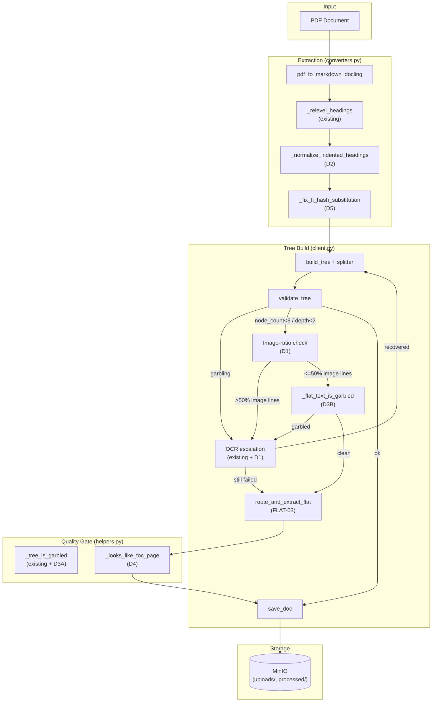
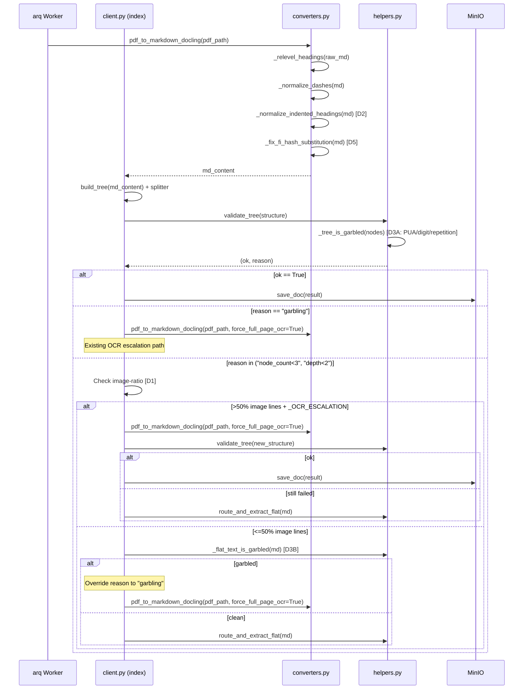
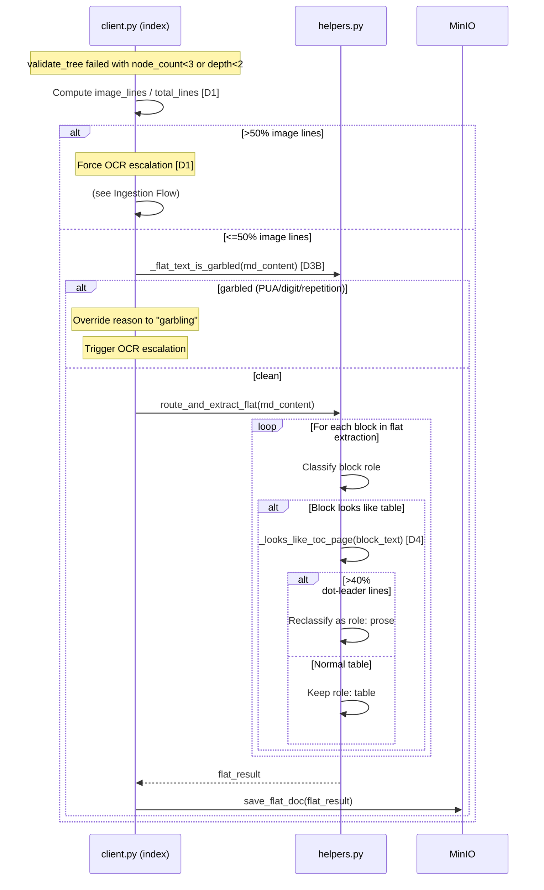

<!-- Space: CITRA -->
<!-- Title: Design: Corpus Gap Remediation — Ingestion Pipeline Hardening -->
<!-- Parent: Designs -->
<!-- Confluence-Page-ID: 5103026177 -->
<!-- Confluence-URL: https://inheaden.atlassian.net/wiki/spaces/CITRA/pages/5103026177/Design+Corpus+Gap+Remediation+Ingestion+Pipeline+Hardening -->

# Design Document: Corpus Gap Remediation — Ingestion Pipeline Hardening

## Traceability

| Artifact | Reference |
|---|---|
| Governing RFC | [RFC-010: Corpus Gap Remediation](../rfcs/010-corpus-gap-remediation.md) |
| PRD / Requirements | `PRD.md` |
| Architecture Doc | `ARCHITECTURE.md` |
| Implementation Plan | [tasks-rfc010-corpus-gap-remediation.md](../tasks/tasks-rfc010-corpus-gap-remediation.md) |

## Overview

A 25-document corpus gap analysis revealed 6 systemic defects in the PageIndex ingestion pipeline producing a 48% FAIL rate and 48% MARGINAL rate. The defects span two categories: missing escalation paths (image-only PDFs never trigger OCR, garble detection is too narrow, the flat-doc path bypasses quality checks) and heading normalization gaps (Docling emits indented headings the tree builder ignores, stale pre-Fix-1 artifacts remain in MinIO). This design addresses all 6 gaps through 6 decisions ([D0](../rfcs/010-corpus-gap-remediation.md#d0--reprocess-stale-corpus-artifacts-gap-3a--gap-4--immediate-zero-code), [D1](../rfcs/010-corpus-gap-remediation.md#d1--image-ratio-pre-check-for-ocr-escalation-gap-1--35-lines), [D2](../rfcs/010-corpus-gap-remediation.md#d2--heading-indent-normalization-gap-3b--30-lines), [D3](../rfcs/010-corpus-gap-remediation.md#d3--extended-garble-detection-gap-2--43-lines), [D4](../rfcs/010-corpus-gap-remediation.md#d4--toc-as-table-filter-gap-6c--20-lines), [D5](../rfcs/010-corpus-gap-remediation.md#d5--في-interim-post-process-gap-5a--upstream--interim)) totalling ~128 lines of code changes plus 3 stale-artifact reprocessing operations, targeting a PASS rate improvement from 4% to ~60%.

## Key Design Principles

1. **Escalate, not reject**: When a document fails a quality gate, the system attempts recovery (OCR escalation, garble-aware re-routing) before classifying it as failed. A `low_quality_tree` error is the last resort, not the first response.
2. **Extend, not replace**: New garble heuristics ([D3](../rfcs/010-corpus-gap-remediation.md#d3--extended-garble-detection-gap-2--43-lines)) extend the existing `_tree_is_garbled` function and `validate_tree` gate. No existing checks are removed or weakened. The gate strictly tightens.
3. **Threshold safety margins**: Every numeric threshold (image-ratio 50%, PUA 3%, digit 60%, repetition 30%, Arabic-dominance 30%, TOC dot-leader 40%) is calibrated against the 25-doc corpus AND the 62-file validation set with documented false-positive safety analysis. Thresholds are constants, not env vars, to avoid config sprawl.
4. **Kill-switch coverage**: All new escalation paths respect existing kill-switches (`_OCR_ESCALATION`, `settings.flat_doc_routing`). No new env vars are introduced for [D1](../rfcs/010-corpus-gap-remediation.md#d1--image-ratio-pre-check-for-ocr-escalation-gap-1--35-lines)/[D3](../rfcs/010-corpus-gap-remediation.md#d3--extended-garble-detection-gap-2--43-lines)/[D4](../rfcs/010-corpus-gap-remediation.md#d4--toc-as-table-filter-gap-6c--20-lines) -- they fall under existing controls.
5. **Upstream-aware interim fixes**: [D5](../rfcs/010-corpus-gap-remediation.md#d5--في-interim-post-process-gap-5a--upstream--interim) is explicitly marked as interim, guarded by an Arabic-dominance threshold, and scoped to inline `#` only. The upstream Docling issue is the proper resolution; the interim fix is removable once the upstream ships.
6. **Reprocess before recode**: Stale artifacts ([D0](../rfcs/010-corpus-gap-remediation.md#d0--reprocess-stale-corpus-artifacts-gap-3a--gap-4--immediate-zero-code)) are addressed by re-running existing pipeline code, not by writing new code. Zero-code ops run first (Batch 0) to capture gains immediately.

## Launch Constraints

- `_OCR_ESCALATION` env var (existing) gates [D1](../rfcs/010-corpus-gap-remediation.md#d1--image-ratio-pre-check-for-ocr-escalation-gap-1--35-lines) image-ratio OCR escalation. When disabled, image-dominant PDFs fall through to FLAT-03 as before.
- `settings.flat_doc_routing` (existing kill-switch) must be enabled for [D1](../rfcs/010-corpus-gap-remediation.md#d1--image-ratio-pre-check-for-ocr-escalation-gap-1--35-lines) to fire. The image-ratio check is inside the FLAT-03 routing block.
- [D5](../rfcs/010-corpus-gap-remediation.md#d5--في-interim-post-process-gap-5a--upstream--interim) Arabic-dominance threshold (>30% Arabic chars) scopes the interim fix to Arabic-dominant documents only. Non-Arabic documents are never modified.
- [D0](../rfcs/010-corpus-gap-remediation.md#d0--reprocess-stale-corpus-artifacts-gap-3a--gap-4--immediate-zero-code) requires access to MinIO and `preprocess_client.py` -- ops-only, no code deployment needed.
- All fixes use the existing Docling (MIT) extraction path. No new pymupdf dependency is introduced (HR4 compliance).

## Architecture

### High-Level System Architecture



### Architecture Decisions

**Reprocess stale corpus artifacts** ([RFC-010 D0](../rfcs/010-corpus-gap-remediation.md#d0--reprocess-stale-corpus-artifacts-gap-3a--gap-4--immediate-zero-code)): Three documents (`2030e34d`, `2a7e0ebe`, `ae02da49`) were processed before Fix-1 landed. The current splitter and NFKC fold already handle all three cases. Re-running `preprocess_client.py` is the correct fix -- no code changes needed. Validates [Property 7](#property-7-stale-artifact-reprocessing). Implemented in [Task 0.1](../tasks/tasks-rfc010-corpus-gap-remediation.md#01-reprocess-stale-docids).

**Image-ratio pre-check for OCR escalation** ([RFC-010 D1](../rfcs/010-corpus-gap-remediation.md#d1--image-ratio-pre-check-for-ocr-escalation-gap-1--35-lines)): Image-only PDFs yield only `<!-- image -->` blocks and fail `validate_tree` for `node_count<3`, routing to FLAT-03 with zero image-density awareness. The fix inserts an image-ratio check before FLAT-03 routing: if >50% of lines are `<!-- image -->`, force OCR retry via `pdf_to_markdown_docling` with `force_full_page_ocr=True`. Reuses all existing infrastructure. Falls through to FLAT-03 if OCR also fails. Validates [Property 1](#property-1-image-dominant-ocr-escalation). Implemented in [Task 1.1](../tasks/tasks-rfc010-corpus-gap-remediation.md#11-image-ratio-ocr-precheck).

**Heading indent normalization** ([RFC-010 D2](../rfcs/010-corpus-gap-remediation.md#d2--heading-indent-normalization-gap-3b--30-lines)): Docling emits headings with leading whitespace (`    ### Article (10)`) which CommonMark does not recognize. The tree builder treats them as body text, trapping Article markers in oversized leaf nodes. A regex-based normalization pass strips leading whitespace before `#` heading markers. Applied after `_relevel_headings` and `_normalize_dashes` in the post-processing chain. Validates [Property 2](#property-2-heading-indent-normalization). Implemented in [Task 2.3](../tasks/tasks-rfc010-corpus-gap-remediation.md#23-heading-indent-normalization).

**Extended garble detection -- tree path** ([RFC-010 D3 Part A](../rfcs/010-corpus-gap-remediation.md#d3--extended-garble-detection-gap-2--43-lines)): `_tree_is_garbled` only checks empty/NUL/FFFD/control-char ratio. Three corruption types pass as valid Unicode: PUA mojibake, digit-junk repetition, single-token repetition. The fix adds three checks: PUA-char ratio >3%, digit ratio >60% on blobs >500 chars, single-token repetition >30%. Validates [Property 3](#property-3-extended-garble-detection-tree-path). Implemented in [Task 2.1](../tasks/tasks-rfc010-corpus-gap-remediation.md#21-extend-tree-is-garbled).

**Extended garble detection -- flat path** ([RFC-010 D3 Part B](../rfcs/010-corpus-gap-remediation.md#d3--extended-garble-detection-gap-2--43-lines)): The flat-doc path (FLAT-03) bypasses quality checks entirely. A new `_flat_text_is_garbled` function applies the same heuristics to flat-path markdown before `route_and_extract_flat`. Wired at `client.py:~526` -- if garbled, overrides reason to `"garbling"` so OCR escalation can fire. Validates [Property 4](#property-4-flat-path-garble-gate). Implemented in [Task 2.2](../tasks/tasks-rfc010-corpus-gap-remediation.md#22-flat-text-is-garbled).

**TOC-as-table filter** ([RFC-010 D4](../rfcs/010-corpus-gap-remediation.md#d4--toc-as-table-filter-gap-6c--20-lines)): TOC/index pages with dot-leader formatting are misclassified as data tables in `route_and_extract_flat`. A `_looks_like_toc_page` heuristic checks dot-leader density (>40% of lines matching `\.{4,}\s*\d+\s*$`). Matching blocks get `role: prose` instead of `role: table`. Validates [Property 5](#property-5-toc-page-classification). Implemented in [Task 1.2](../tasks/tasks-rfc010-corpus-gap-remediation.md#12-toc-dot-leader-filter).

**Arabic fi-hash interim post-process** ([RFC-010 D5](../rfcs/010-corpus-gap-remediation.md#d5--في-interim-post-process-gap-5a--upstream--interim)): Docling replaces the Arabic particle "في" with `#` in markdown serialization (2,923 occurrences in one document). An interim post-process detects Arabic-dominant text (>30% Arabic chars) and replaces non-heading-initial `#` with في. Fragile -- scoped to P3 priority. Upstream Docling issue is the proper resolution. Validates [Property 6](#property-6-arabic-hash-substitution-fix). Implemented in [Task 3.2](../tasks/tasks-rfc010-corpus-gap-remediation.md#32-interim-fi-hash-postprocess).

### Deployment Architecture

- **Backend**: Python 3.12 + FastMCP + gunicorn/uvicorn workers
- **Object Storage**: MinIO (`uploads/`, `processed/*.json`, `processed/*.meta.json`)
- **Task Queue**: arq with Redis broker
- **Cache / Job Bus**: Redis (document cache, job status)
- **OCR**: Tesseract via Docling, tessdata in `.tessdata/` (pre-baked in Docker per RFC-009 D5b)

### Communication Patterns

| Pattern | Use Case | Technology |
|---------|----------|------------|
| Sync MCP | MCP tool calls (query tools) | FastMCP |
| Sync HTTP | Upload API (`POST /upload/files`), status polling | FastAPI/Starlette |
| Async job queue | Document processing pipeline (index method) | arq + Redis |
| Direct object I/O | Raw/processed document storage, `.meta.json` sidecars | MinIO (S3-compatible) |
| CLI batch | Corpus reprocessing ([D0](../rfcs/010-corpus-gap-remediation.md#d0--reprocess-stale-corpus-artifacts-gap-3a--gap-4--immediate-zero-code)) | `preprocess_client.py` |

### Sequence Diagrams

#### Ingestion Flow (D0, D1, D2, D3, D5)

Validates [Property 1](#property-1-image-dominant-ocr-escalation), [Property 2](#property-2-heading-indent-normalization), [Property 3](#property-3-extended-garble-detection-tree-path), [Property 6](#property-6-arabic-hash-substitution-fix), [Property 7](#property-7-stale-artifact-reprocessing). Implemented across [Task 0.1](../tasks/tasks-rfc010-corpus-gap-remediation.md#01-reprocess-stale-docids), [Task 1.1](../tasks/tasks-rfc010-corpus-gap-remediation.md#11-image-ratio-ocr-precheck), [Task 2.1](../tasks/tasks-rfc010-corpus-gap-remediation.md#21-extend-tree-is-garbled), [Task 2.3](../tasks/tasks-rfc010-corpus-gap-remediation.md#23-heading-indent-normalization), [Task 3.2](../tasks/tasks-rfc010-corpus-gap-remediation.md#32-interim-fi-hash-postprocess).



#### Flat-Doc Routing Flow (D1, D3, D4)

Validates [Property 1](#property-1-image-dominant-ocr-escalation), [Property 4](#property-4-flat-path-garble-gate), [Property 5](#property-5-toc-page-classification). Implemented in [Task 1.1](../tasks/tasks-rfc010-corpus-gap-remediation.md#11-image-ratio-ocr-precheck), [Task 1.2](../tasks/tasks-rfc010-corpus-gap-remediation.md#12-toc-dot-leader-filter), [Task 2.2](../tasks/tasks-rfc010-corpus-gap-remediation.md#22-flat-text-is-garbled).



## Service Contracts

### 1. client.py

**Responsibility**: Orchestrates document ingestion -- extraction, tree building, quality gating, OCR escalation, and flat-doc routing.

**Changes ([D1](../rfcs/010-corpus-gap-remediation.md#d1--image-ratio-pre-check-for-ocr-escalation-gap-1--35-lines), [D3 Part B](../rfcs/010-corpus-gap-remediation.md#d3--extended-garble-detection-gap-2--43-lines))**:

- [D1](../rfcs/010-corpus-gap-remediation.md#d1--image-ratio-pre-check-for-ocr-escalation-gap-1--35-lines): Insert image-ratio check at line ~497, before existing FLAT-03 routing block. When `reason in ("node_count<3", "depth<2")` and `ext == ".pdf"` and `_OCR_ESCALATION` and `settings.flat_doc_routing`: compute `image_lines / total_lines`. If >0.50, force OCR retry via `pdf_to_markdown_docling(file_path, True, langs)`. Re-run tree build + splitter + `validate_tree`. Increment `OCR_ESCALATION_TOTAL` with `result="recovered"` or `result="still_image_only"`. If still failed, fall through to FLAT-03. Validates [Property 1](#property-1-image-dominant-ocr-escalation). Implemented in [Task 1.1](../tasks/tasks-rfc010-corpus-gap-remediation.md#11-image-ratio-ocr-precheck).

- [D3 Part B](../rfcs/010-corpus-gap-remediation.md#d3--extended-garble-detection-gap-2--43-lines): Wire `_flat_text_is_garbled(md_content)` at line ~526, inside the FLAT-03 block, before `route_and_extract_flat`. If garbled, override `reason` to `"garbling"` so the existing OCR escalation path at line 455 can fire. Validates [Property 4](#property-4-flat-path-garble-gate). Implemented in [Task 2.2](../tasks/tasks-rfc010-corpus-gap-remediation.md#22-flat-text-is-garbled).

**Internal Interfaces**:

- Calls `converters.py` `pdf_to_markdown_docling()` for text extraction and OCR escalation
- Calls `helpers.py` `validate_tree()` for quality gating
- Calls `helpers.py` `_flat_text_is_garbled()` (new, [D3 Part B](../rfcs/010-corpus-gap-remediation.md#d3--extended-garble-detection-gap-2--43-lines)) for flat-path garble check
- Calls `helpers.py` `route_and_extract_flat()` for flat-doc classification

### 2. helpers.py

**Responsibility**: Quality gating (`validate_tree`, `_tree_is_garbled`), tree splitting, and flat-doc extraction/classification.

**Changes ([D3 Part A](../rfcs/010-corpus-gap-remediation.md#d3--extended-garble-detection-gap-2--43-lines), [D3 Part B](../rfcs/010-corpus-gap-remediation.md#d3--extended-garble-detection-gap-2--43-lines), [D4](../rfcs/010-corpus-gap-remediation.md#d4--toc-as-table-filter-gap-6c--20-lines))**:

- [D3 Part A](../rfcs/010-corpus-gap-remediation.md#d3--extended-garble-detection-gap-2--43-lines): Extend `_tree_is_garbled` at line ~525 with three new checks after the existing control-char check: (1) PUA-char ratio >3% (`0xE000`--`0xF8FF`), (2) digit ratio >60% on blobs >500 chars, (3) single-token repetition >30% of all words via `Counter.most_common(1)`. Validates [Property 3](#property-3-extended-garble-detection-tree-path). Implemented in [Task 2.1](../tasks/tasks-rfc010-corpus-gap-remediation.md#21-extend-tree-is-garbled).

- [D3 Part B](../rfcs/010-corpus-gap-remediation.md#d3--extended-garble-detection-gap-2--43-lines): New `_flat_text_is_garbled(md: str) -> bool` at line ~975. Applies the same heuristic chain (empty, NUL/FFFD, control-char >5%, PUA >3%, digit >60%, repetition >30%) to raw markdown strings. Validates [Property 4](#property-4-flat-path-garble-gate). Implemented in [Task 2.2](../tasks/tasks-rfc010-corpus-gap-remediation.md#22-flat-text-is-garbled).

- [D4](../rfcs/010-corpus-gap-remediation.md#d4--toc-as-table-filter-gap-6c--20-lines): New `_looks_like_toc_page(block_text: str) -> bool` heuristic inside `route_and_extract_flat` at line ~976. Compiled regex `_DOT_LEADER_RE = re.compile(r"\.{4,}\s*\d+\s*$")`. Returns True when >40% of lines (minimum 3 lines) match. Matching blocks reclassified from `role: table` to `role: prose`. Validates [Property 5](#property-5-toc-page-classification). Implemented in [Task 1.2](../tasks/tasks-rfc010-corpus-gap-remediation.md#12-toc-dot-leader-filter).

**Internal Interfaces**:

- `_tree_is_garbled` called by `validate_tree` only (line 527)
- `validate_tree` called in `client.py:index` (line 449, and again at line 489 after OCR retry)
- `_flat_text_is_garbled` called by `client.py:index` FLAT-03 block (new, [D3 Part B](../rfcs/010-corpus-gap-remediation.md#d3--extended-garble-detection-gap-2--43-lines))
- `_looks_like_toc_page` called within `route_and_extract_flat` (new, [D4](../rfcs/010-corpus-gap-remediation.md#d4--toc-as-table-filter-gap-6c--20-lines))
- `route_and_extract_flat` called in `client.py:index` FLAT-03 block (line 528)

### 3. converters.py

**Responsibility**: PDF extraction pipeline -- Docling text-layer extraction, OCR escalation, and markdown post-processing chain.

**Changes ([D2](../rfcs/010-corpus-gap-remediation.md#d2--heading-indent-normalization-gap-3b--30-lines), [D5](../rfcs/010-corpus-gap-remediation.md#d5--في-interim-post-process-gap-5a--upstream--interim))**:

- [D2](../rfcs/010-corpus-gap-remediation.md#d2--heading-indent-normalization-gap-3b--30-lines): New `_normalize_indented_headings(md: str) -> str` function. Compiled regex `_INDENTED_HEADING_RE = re.compile(r"^[ \t]+(#{1,6}\s)", re.MULTILINE)`. Strips leading whitespace before ATX heading markers. Applied after `_relevel_headings` and `_normalize_dashes`, before return from `pdf_to_markdown_docling`. Validates [Property 2](#property-2-heading-indent-normalization). Implemented in [Task 2.3](../tasks/tasks-rfc010-corpus-gap-remediation.md#23-heading-indent-normalization).

- [D5](../rfcs/010-corpus-gap-remediation.md#d5--في-interim-post-process-gap-5a--upstream--interim): New `_fix_fi_hash_substitution(md: str) -> str` function. Compiled regex `_INLINE_HASH_RE = re.compile(r"(?<=\S)#(?=\S)")`. Detects Arabic-dominant text (>30% Arabic chars in `؀`--`ۿ` range) and replaces inline `#` (surrounded by non-whitespace) with في. Applied after `_normalize_indented_headings`. Line-initial `#` (markdown headings) are not affected. Validates [Property 6](#property-6-arabic-hash-substitution-fix). Implemented in [Task 3.2](../tasks/tasks-rfc010-corpus-gap-remediation.md#32-interim-fi-hash-postprocess).

**Post-processing chain after [D2](../rfcs/010-corpus-gap-remediation.md#d2--heading-indent-normalization-gap-3b--30-lines)/[D5](../rfcs/010-corpus-gap-remediation.md#d5--في-interim-post-process-gap-5a--upstream--interim)**:

```
raw_md -> _relevel_headings -> _normalize_dashes -> _normalize_indented_headings [D2] -> _fix_fi_hash_substitution [D5] -> return
```

**Internal Interfaces**:

- `pdf_to_markdown_docling` called by `client.py:index` and `verify_corpus.py`
- Both new functions are internal to `converters.py` (called within `pdf_to_markdown_docling` only)

## Data Models

### Garble Check Extension Points

The garble detection system operates at two points in the pipeline, covering both the tree path and the flat-doc path:

```python
# helpers.py -- tree path (existing function, extended by D3A)
def _tree_is_garbled(nodes: list[dict]) -> bool:
    """Walk tree, concatenate text, check corruption indicators."""
    # Existing checks: empty, NUL, FFFD, control-char ratio >5%
    # D3A additions:
    #   PUA-char ratio >3% (0xE000-0xF8FF)
    #   Digit ratio >60% on blobs >500 chars
    #   Single-token repetition >30% of words

# helpers.py -- flat path (new function, D3B)
def _flat_text_is_garbled(md: str) -> bool:
    """Garble check for flat-doc path (FLAT-03 bypass closure)."""
    # Same heuristic chain as _tree_is_garbled applied to raw markdown
    # Returns True if any corruption indicator fires
```

### Flat-Doc Block Structure (D4 extension)

```python
# Existing block structure in route_and_extract_flat output:
class FlatBlock:
    role: str          # "prose" | "table" | "heading" | ...
    text: str          # Block content
    page: int | None   # Source page number
    # D4: blocks previously classified as role="table" that match
    # _looks_like_toc_page() are reclassified to role="prose"
```

### Corruption Thresholds (D3)

| Check | Threshold | Applies to | False-positive safety |
|-------|-----------|------------|----------------------|
| PUA-char ratio | >3% | Tree + flat | Normal docs have 0% PUA; only broken CMaps produce PUA |
| Digit ratio | >60% (blob >500 chars) | Tree + flat | World-stats-pocketbook (heaviest numbers) is <30% digits |
| Single-token repetition | >30% of words | Tree + flat | Normal docs never have one word >5% of total |
| Control-char ratio | >5% (existing) | Tree + flat | Unchanged from current implementation |

## Correctness Properties

*A property is a characteristic or behavior that should hold true across all valid executions of the system -- a formal statement about what the system should do. Properties serve as the bridge between human-readable specifications and machine-verifiable correctness guarantees.*

### Property 1: Image-dominant OCR escalation

*For any* PDF document where >50% of extracted markdown lines are `<!-- image -->` blocks, and `_OCR_ESCALATION` is enabled, and `settings.flat_doc_routing` is enabled, system SHALL trigger OCR escalation via `pdf_to_markdown_docling` with `force_full_page_ocr=True` before routing to FLAT-03.

**Validates**: [RFC-010 D1](../rfcs/010-corpus-gap-remediation.md#d1--image-ratio-pre-check-for-ocr-escalation-gap-1--35-lines). **Tested in**: [Task 1.3](../tasks/tasks-rfc010-corpus-gap-remediation.md#13-unit-tests-d1). **Service contract**: [client.py](#1-clientpy). **Sequence diagram**: [Ingestion Flow](#ingestion-flow-d0-d1-d2-d3-d5).

### Property 2: Heading indent normalization

*For any* markdown output from `pdf_to_markdown_docling`, system SHALL strip leading whitespace (spaces and tabs) before ATX heading markers (`#{1,6}\s`) so that all headings begin at column 0, while leaving non-heading indented content (code blocks, list continuations) unmodified.

**Validates**: [RFC-010 D2](../rfcs/010-corpus-gap-remediation.md#d2--heading-indent-normalization-gap-3b--30-lines). **Tested in**: [Task 2.5](../tasks/tasks-rfc010-corpus-gap-remediation.md#25-unit-tests-d2). **Service contract**: [converters.py](#3-converterspy). **Sequence diagram**: [Ingestion Flow](#ingestion-flow-d0-d1-d2-d3-d5).

### Property 3: Extended garble detection (tree path)

*For any* tree node text blob processed by `_tree_is_garbled`, system SHALL return `True` when the blob contains PUA-char ratio >3%, OR digit ratio >60% on blobs >500 chars, OR single-token repetition >30% of all words, OR the literal substring `GLYPH<` is present, in addition to all existing checks (empty, NUL, FFFD, control-char ratio >5%).

**Validates**: [RFC-010 D3 Part A](../rfcs/010-corpus-gap-remediation.md#d3--extended-garble-detection-gap-2--43-lines). **Tested in**: [Task 2.4](../tasks/tasks-rfc010-corpus-gap-remediation.md#24-unit-tests-d3), [Task 3.5](../tasks/tasks-rfc010-corpus-gap-remediation.md#35-glyph-marker-detection-forward-compat) (GLYPH marker case). **Service contract**: [helpers.py](#2-helperspy). **Sequence diagram**: [Ingestion Flow](#ingestion-flow-d0-d1-d2-d3-d5).

> **2026-07-15 addition.** The `GLYPH<` check is forward-compatible groundwork for [docling-parse#299](https://github.com/docling-project/docling-parse/pull/299) (upstream fix tracked under [D5](../rfcs/010-corpus-gap-remediation.md#d5--في-interim-post-process-gap-5a--upstream--interim)), which will make docling-parse emit `GLYPH<N>` markers instead of fabricating ASCII (e.g. `#`) for unmapped codes in symbolic/composite fonts. Until that dependency is bumped, no PDF in our corpus produces `GLYPH<>` output, so this check is currently inert but exercised by tests.

### Property 4: Flat-path garble gate

*For any* markdown content entering the FLAT-03 routing path in `client.py:index`, system SHALL call `_flat_text_is_garbled(md_content)` before `route_and_extract_flat`. If garbled, system SHALL override the validation reason to `"garbling"` to enable OCR escalation, closing the flat-path bypass. `_flat_text_is_garbled` SHALL apply the same `GLYPH<` marker check as [Property 3](#property-3-extended-garble-detection-tree-path).

**Validates**: [RFC-010 D3 Part B](../rfcs/010-corpus-gap-remediation.md#d3--extended-garble-detection-gap-2--43-lines). **Tested in**: [Task 2.4](../tasks/tasks-rfc010-corpus-gap-remediation.md#24-unit-tests-d3), [Task 3.5](../tasks/tasks-rfc010-corpus-gap-remediation.md#35-glyph-marker-detection-forward-compat) (GLYPH marker case). **Service contract**: [client.py](#1-clientpy), [helpers.py](#2-helperspy). **Sequence diagram**: [Flat-Doc Routing Flow](#flat-doc-routing-flow-d1-d3-d4).

### Property 5: TOC page classification

*For any* text block in `route_and_extract_flat` where >40% of lines (minimum 3 lines) match the dot-leader pattern (`\.{4,}\s*\d+\s*$`), system SHALL classify the block as `role: prose` rather than `role: table`.

**Validates**: [RFC-010 D4](../rfcs/010-corpus-gap-remediation.md#d4--toc-as-table-filter-gap-6c--20-lines). **Tested in**: [Task 1.4](../tasks/tasks-rfc010-corpus-gap-remediation.md#14-unit-tests-d4). **Service contract**: [helpers.py](#2-helperspy). **Sequence diagram**: [Flat-Doc Routing Flow](#flat-doc-routing-flow-d1-d3-d4).

### Property 6: Arabic hash substitution fix

*For any* markdown output from `pdf_to_markdown_docling` where >30% of characters are Arabic script (`؀`--`ۿ`), system SHALL replace inline `#` (preceded and followed by non-whitespace) with في, while leaving line-initial `#` heading markers unmodified.

**Validates**: [RFC-010 D5](../rfcs/010-corpus-gap-remediation.md#d5--في-interim-post-process-gap-5a--upstream--interim). **Tested in**: [Task 3.3](../tasks/tasks-rfc010-corpus-gap-remediation.md#33-unit-tests-d5). **Service contract**: [converters.py](#3-converterspy). **Sequence diagram**: [Ingestion Flow](#ingestion-flow-d0-d1-d2-d3-d5).

> **Status (2026-07-15).** This property is interim per its RFC decision. Root cause traced upstream to [docling-project/docling#3802](https://github.com/docling-project/docling/issues/3802) — docling-parse's ToUnicode-fallback logic, not markdown serialization. Fix PR [docling-parse#299](https://github.com/docling-project/docling-parse/pull/299) is open (CI green, unreviewed). Once merged and the dependency is bumped, `#` will no longer be fabricated for this failure mode (`GLYPH<N>` markers appear instead — see [Property 3](#property-3-extended-garble-detection-tree-path)/[Property 4](#property-4-flat-path-garble-gate)), and this property plus `_fix_fi_hash_substitution`/`_INLINE_HASH_RE` should be retired.

### Property 7: Stale artifact reprocessing

*For any* document whose MinIO artifacts were generated before Fix-1 (specifically `2030e34d`, `2a7e0ebe`, `ae02da49`), system SHALL produce updated artifacts when re-processed through `preprocess_client.py` using the current splitter (`split_oversized_leaf_nodes`) and NFKC fold (`_fold_with_index_map`), with no code changes required.

**Validates**: [RFC-010 D0](../rfcs/010-corpus-gap-remediation.md#d0--reprocess-stale-corpus-artifacts-gap-3a--gap-4--immediate-zero-code). **Tested in**: [Task 0.2](../tasks/tasks-rfc010-corpus-gap-remediation.md#02-verify-splitter-output). **Service contract**: N/A (ops-only, no code change). **Sequence diagram**: [Ingestion Flow](#ingestion-flow-d0-d1-d2-d3-d5).

## Error Handling

### Error Categories & Responses

| Category | Response | Retry Strategy | RFC Decision | Property |
|----------|----------|----------------|--------------|----------|
| OCR escalation fails (image-dominant) | Falls through to FLAT-03 | No retry -- FLAT-03 is the fallback | [D1](../rfcs/010-corpus-gap-remediation.md#d1--image-ratio-pre-check-for-ocr-escalation-gap-1--35-lines) | [P1](#property-1-image-dominant-ocr-escalation) |
| OCR escalation fails (garbled flat) | Falls through to FLAT-03 | No retry -- FLAT-03 persists as-is | [D3B](../rfcs/010-corpus-gap-remediation.md#d3--extended-garble-detection-gap-2--43-lines) | [P4](#property-4-flat-path-garble-gate) |
| Garble false positive | Document rejected or escalated unnecessarily | Adjust threshold constants | [D3A](../rfcs/010-corpus-gap-remediation.md#d3--extended-garble-detection-gap-2--43-lines) | [P3](#property-3-extended-garble-detection-tree-path) |
| Arabic fi-hash over-correction | Legitimate `#` replaced with في | Raise Arabic-dominance threshold | [D5](../rfcs/010-corpus-gap-remediation.md#d5--في-interim-post-process-gap-5a--upstream--interim) | [P6](#property-6-arabic-hash-substitution-fix) |
| Tessdata download failure (D1 OCR) | OCR escalation fails, falls to FLAT-03 | Pre-bake tessdata (RFC-009 D5b) | [D1](../rfcs/010-corpus-gap-remediation.md#d1--image-ratio-pre-check-for-ocr-escalation-gap-1--35-lines) | [P1](#property-1-image-dominant-ocr-escalation) |
| Stale doc reprocessing failure | `preprocess_client.py` logs error | Re-run manually; check MinIO access | [D0](../rfcs/010-corpus-gap-remediation.md#d0--reprocess-stale-corpus-artifacts-gap-3a--gap-4--immediate-zero-code) | [P7](#property-7-stale-artifact-reprocessing) |

### Service-Specific Error Handling

**[client.py](#1-clientpy) ([D1](../rfcs/010-corpus-gap-remediation.md#d1--image-ratio-pre-check-for-ocr-escalation-gap-1--35-lines), [D3B](../rfcs/010-corpus-gap-remediation.md#d3--extended-garble-detection-gap-2--43-lines))**:

- Image-ratio OCR escalation failure -> `OCR_ESCALATION_TOTAL.labels(result="still_image_only").inc()`, then fall through to FLAT-03 ([D1](../rfcs/010-corpus-gap-remediation.md#d1--image-ratio-pre-check-for-ocr-escalation-gap-1--35-lines), [Property 1](#property-1-image-dominant-ocr-escalation))
- Flat-path garble detected -> override reason to `"garbling"`, trigger OCR escalation; if OCR also fails, the document surfaces as `low_quality_tree` error per HR5 ([D3B](../rfcs/010-corpus-gap-remediation.md#d3--extended-garble-detection-gap-2--43-lines), [Property 4](#property-4-flat-path-garble-gate))
- `_OCR_ESCALATION=False` -> image-ratio check is skipped entirely, no behavioral change from current code ([D1](../rfcs/010-corpus-gap-remediation.md#d1--image-ratio-pre-check-for-ocr-escalation-gap-1--35-lines))

**[helpers.py](#2-helperspy) ([D3A](../rfcs/010-corpus-gap-remediation.md#d3--extended-garble-detection-gap-2--43-lines), [D4](../rfcs/010-corpus-gap-remediation.md#d4--toc-as-table-filter-gap-6c--20-lines))**:

- Garble threshold false positive (e.g., financial document with >60% digits) -> document rejected for garbling when it is actually valid. Safety margin: world-stats-pocketbook is <30% digits, well below 60% threshold. Thresholds are constants -- promote to env vars only if tuning proves necessary ([D3A](../rfcs/010-corpus-gap-remediation.md#d3--extended-garble-detection-gap-2--43-lines), [Property 3](#property-3-extended-garble-detection-tree-path))
- TOC heuristic false positive (non-TOC block with >40% dot-leader lines) -> block reclassified as prose instead of table. Low risk: the dot-leader + trailing-number pattern is highly specific to TOC/index pages ([D4](../rfcs/010-corpus-gap-remediation.md#d4--toc-as-table-filter-gap-6c--20-lines), [Property 5](#property-5-toc-page-classification))

**[converters.py](#3-converterspy) ([D2](../rfcs/010-corpus-gap-remediation.md#d2--heading-indent-normalization-gap-3b--30-lines), [D5](../rfcs/010-corpus-gap-remediation.md#d5--في-interim-post-process-gap-5a--upstream--interim))**:

- Heading normalization on indented code blocks -> regex `^[ \t]+(#{1,6}\s)` only matches lines with `#` heading markers after whitespace; pure code indentation without `#` is unaffected ([D2](../rfcs/010-corpus-gap-remediation.md#d2--heading-indent-normalization-gap-3b--30-lines), [Property 2](#property-2-heading-indent-normalization))
- Arabic fi-hash replacement on legitimate inline `#` in Arabic text -> the regex `(?<=\S)#(?=\S)` targets `#` surrounded by non-whitespace. Markdown heading markers (line-initial `# `) are unaffected. Risk accepted as interim; upstream Docling fix is the proper resolution ([D5](../rfcs/010-corpus-gap-remediation.md#d5--في-interim-post-process-gap-5a--upstream--interim), [Property 6](#property-6-arabic-hash-substitution-fix))

## Testing Strategy

Testing follows the [RFC-010 Test Strategy](../rfcs/010-corpus-gap-remediation.md#test-strategy) and validates all 7 [correctness properties](#correctness-properties).

### Testing Layers

1. **Unit Tests**: Per-decision tests covering threshold boundaries, false-positive guards, and mock verification. Each property has at least one dedicated unit test task.
2. **Integration Tests**: Reprocessing stale doc_ids ([D0](../rfcs/010-corpus-gap-remediation.md#d0--reprocess-stale-corpus-artifacts-gap-3a--gap-4--immediate-zero-code)) and full 25-doc corpus revalidation ([Batch 4](../rfcs/010-corpus-gap-remediation.md#batch-4--revalidation)) verify end-to-end pipeline behavior.
3. **Regression Tests**: 27-file German insurance corpus run after [D2](../rfcs/010-corpus-gap-remediation.md#d2--heading-indent-normalization-gap-3b--30-lines) to verify zero heading changes on unaffected documents.

### Test Categories by Service

| Service | Properties | Unit Tests (task) | Integration Tests |
|---------|------------|-------------------|-------------------|
| [client.py](#1-clientpy) | [P1](#property-1-image-dominant-ocr-escalation), [P4](#property-4-flat-path-garble-gate) | Image-ratio OCR escalation ([Task 1.3](../tasks/tasks-rfc010-corpus-gap-remediation.md#13-unit-tests-d1)), flat-path garble wiring ([Task 2.4](../tasks/tasks-rfc010-corpus-gap-remediation.md#24-unit-tests-d3)) | Full corpus reprocess ([Task 4.1](../tasks/tasks-rfc010-corpus-gap-remediation.md#41-full-corpus-reprocess)) |
| [helpers.py](#2-helperspy) | [P3](#property-3-extended-garble-detection-tree-path), [P4](#property-4-flat-path-garble-gate), [P5](#property-5-toc-page-classification) | Garble extension ([Task 2.4](../tasks/tasks-rfc010-corpus-gap-remediation.md#24-unit-tests-d3)), TOC filter ([Task 1.4](../tasks/tasks-rfc010-corpus-gap-remediation.md#14-unit-tests-d4)) | Digit-junk doc `4f37b2e3` triggers garble->OCR ([Task 4.1](../tasks/tasks-rfc010-corpus-gap-remediation.md#41-full-corpus-reprocess)) |
| [converters.py](#3-converterspy) | [P2](#property-2-heading-indent-normalization), [P6](#property-6-arabic-hash-substitution-fix) | Heading normalization ([Task 2.5](../tasks/tasks-rfc010-corpus-gap-remediation.md#25-unit-tests-d2)), fi-hash fix ([Task 3.3](../tasks/tasks-rfc010-corpus-gap-remediation.md#33-unit-tests-d5)) | German corpus regression ([Task 2.5](../tasks/tasks-rfc010-corpus-gap-remediation.md#25-unit-tests-d2)) |
| N/A (ops) | [P7](#property-7-stale-artifact-reprocessing) | -- | Stale doc reprocessing ([Task 0.1](../tasks/tasks-rfc010-corpus-gap-remediation.md#01-reprocess-stale-docids)), splitter verification ([Task 0.2](../tasks/tasks-rfc010-corpus-gap-remediation.md#02-verify-splitter-output)) |

### Key Test Scenarios

**Critical Path Tests:**

1. Mock markdown with >50% `<!-- image -->` lines -> `pdf_to_markdown_docling` called with `force_full_page_ocr=True` *(validates [P1](#property-1-image-dominant-ocr-escalation))*
2. Markdown with `    ### Article (10)` -> output has `### Article (10)` at column 0 *(validates [P2](#property-2-heading-indent-normalization))*
3. PUA-heavy string (>3% PUA chars) -> `_tree_is_garbled` returns True *(validates [P3](#property-3-extended-garble-detection-tree-path))*
4. Digit-junk flat-path markdown -> `_flat_text_is_garbled` returns True, reason overridden to `"garbling"` *(validates [P4](#property-4-flat-path-garble-gate))*
5. Block with >40% dot-leader lines -> `_looks_like_toc_page` returns True, classified as `role: prose` *(validates [P5](#property-5-toc-page-classification))*
6. Arabic-dominant text with inline `word#word` -> `#` replaced with في *(validates [P6](#property-6-arabic-hash-substitution-fix))*
7. Re-run `preprocess_client.py` on `2030e34d` -> tail-blob splits from 236k to <50k nodes *(validates [P7](#property-7-stale-artifact-reprocessing))*

**Edge Cases:**

- Markdown with <50% image lines -> FLAT-03 routing proceeds without OCR escalation, no metric increment *(validates [P1](#property-1-image-dominant-ocr-escalation))*
- `_OCR_ESCALATION=False` -> no image-ratio check, no escalation regardless of image density *(validates [P1](#property-1-image-dominant-ocr-escalation))*
- Indented code blocks (4+ spaces, no `#`) -> NOT modified by heading normalization *(validates [P2](#property-2-heading-indent-normalization))*
- `   ## Heading` (3 spaces, valid CommonMark) -> stripped to `## Heading` for consistency *(validates [P2](#property-2-heading-indent-normalization))*
- Normal German insurance text -> NOT garbled (false-positive guard) *(validates [P3](#property-3-extended-garble-detection-tree-path))*
- `b1a72fb2`-style text (2.1% Latin substitution) -> NOT garbled (below all thresholds) *(validates [P3](#property-3-extended-garble-detection-tree-path))*
- Short block (<3 lines) with dot leaders -> `_looks_like_toc_page` returns False (too few lines) *(validates [P5](#property-5-toc-page-classification))*
- Non-Arabic text with inline `#` -> no replacement *(validates [P6](#property-6-arabic-hash-substitution-fix))*
- Line-initial `# Heading` in Arabic text -> NOT replaced (heading markers preserved) *(validates [P6](#property-6-arabic-hash-substitution-fix))*
- `ae02da49` (Human Rights) reprocessing -> ~137k residual expected (genuinely long articles), not a bug *(validates [P7](#property-7-stale-artifact-reprocessing))*
