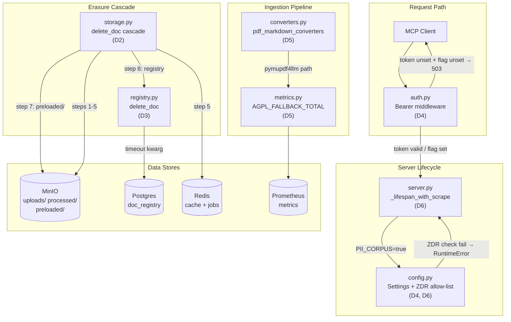
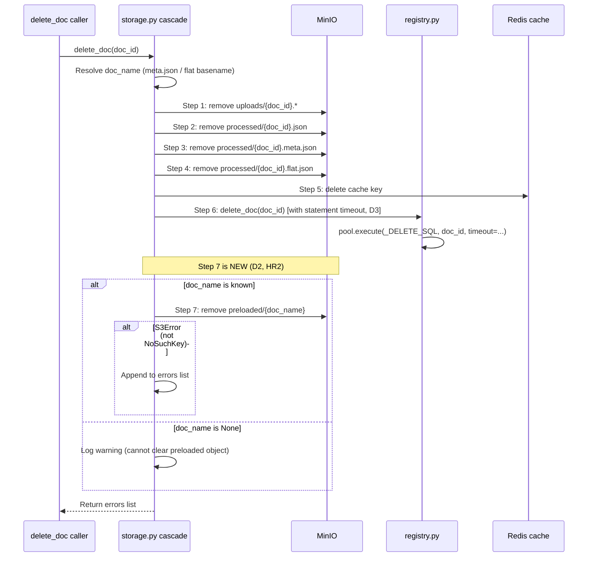
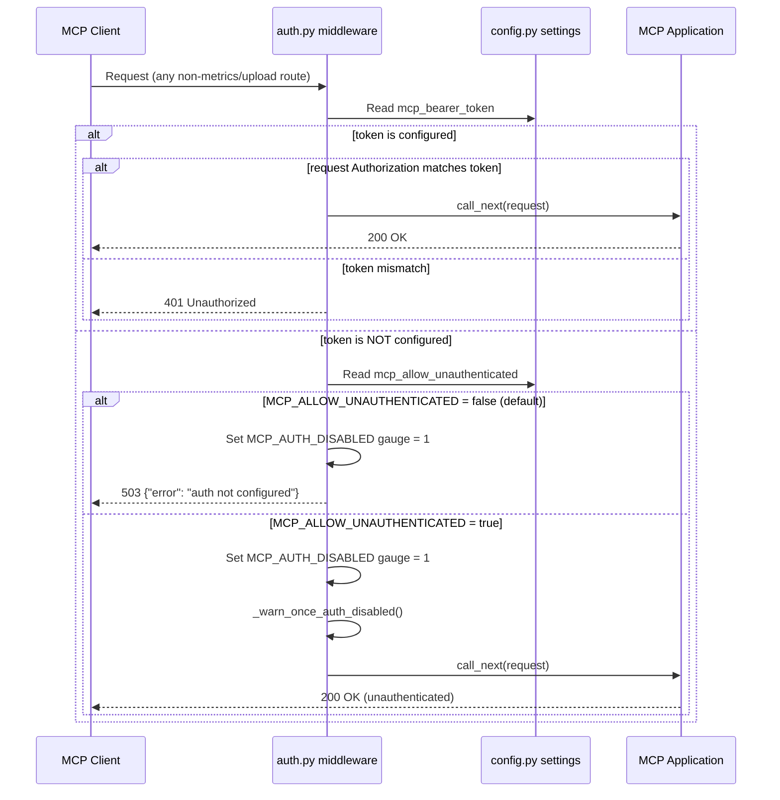
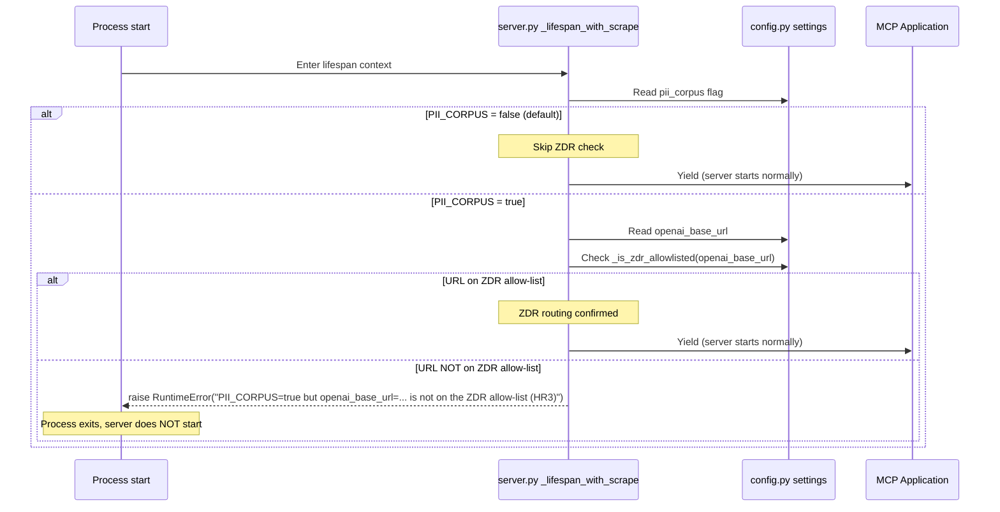

<!-- Space: CITRA -->
<!-- Title: Design: Compliance & Auth Quick-Win Batch -->
<!-- Folder: Designs -->

# Design Document: Compliance & Auth Quick-Win Batch

## Traceability

| Artifact | Reference |
|---|---|
| Governing RFC | [RFC-011: Compliance & Auth Quick-Win Batch](../rfcs/011-compliance-auth-quickwins.md) |
| PRD / Requirements | `PRD.md` |
| Architecture Doc | `ARCHITECTURE.md` |
| Implementation Plan | [tasks-rfc011-compliance-auth-quickwins.md](../tasks/tasks-rfc011-compliance-auth-quickwins.md) |

## Overview

A docstore audit (2026-07-15) surfaced 6 issues touching the erasure cascade ([HR2](../rfcs/011-compliance-auth-quickwins.md#hard-rule-constraints-claudemd--binding)), authentication posture, AGPL observability ([HR4](../rfcs/011-compliance-auth-quickwins.md#hard-rule-constraints-claudemd--binding)), and PII data-residency routing ([HR3](../rfcs/011-compliance-auth-quickwins.md#hard-rule-constraints-claudemd--binding)). Two issues (ISS-02) are already fixed by prior RFC-010/RFC-007-D2 work and require only audit-tracker closure. The remaining four are standalone, config-driven fixes totalling ~51 lines of code: bearer auth fails closed by default ([D4](../rfcs/011-compliance-auth-quickwins.md#d4--iss-32-bearer-auth-fails-closed-by-default)), `preloaded/` raw-object purge in the erasure cascade ([D2](../rfcs/011-compliance-auth-quickwins.md#d2--iss-41-purge-preloadedfilename-in-the-erasure-cascade)), statement-level timeout on registry delete ([D3](../rfcs/011-compliance-auth-quickwins.md#d3--iss-40-statement-level-timeout-on-registry-delete)), AGPL fallback counter ([D5](../rfcs/011-compliance-auth-quickwins.md#d5--iss-35-agpl-fallback-observability-metric-only)), and a startup ZDR-routing assertion for PII-flagged corpora ([D6](../rfcs/011-compliance-auth-quickwins.md#d6--iss-33-startup-zdr-routing-assertion-for-pii-flagged-corpora)). Each fix hardens a compliance-critical code path with fail-closed or observability semantics, with no shared surface between any two fixes.

## Key Design Principles

1. **Fail closed by default**: When a safety-critical configuration is absent (bearer token, ZDR routing), the system rejects or refuses to start rather than silently permitting unsafe operation. Opt-in flags (`MCP_ALLOW_UNAUTHENTICATED`) make the open posture explicit and auditable.
2. **Standalone fixes, no shared surface**: Each of the four open decisions ([D2](../rfcs/011-compliance-auth-quickwins.md#d2--iss-41-purge-preloadedfilename-in-the-erasure-cascade), [D3](../rfcs/011-compliance-auth-quickwins.md#d3--iss-40-statement-level-timeout-on-registry-delete), [D4](../rfcs/011-compliance-auth-quickwins.md#d4--iss-32-bearer-auth-fails-closed-by-default), [D5](../rfcs/011-compliance-auth-quickwins.md#d5--iss-35-agpl-fallback-observability-metric-only), [D6](../rfcs/011-compliance-auth-quickwins.md#d6--iss-33-startup-zdr-routing-assertion-for-pii-flagged-corpora)) touches a distinct source file and can be implemented, tested, and shipped independently. No ordering dependency exists.
3. **Config-gated behavior changes**: The one behavior-changing fix ([D4](../rfcs/011-compliance-auth-quickwins.md#d4--iss-32-bearer-auth-fails-closed-by-default)) is gated behind `MCP_ALLOW_UNAUTHENTICATED` so deployments can opt into the prior pass-through behavior without code changes. All other fixes are additive (new cascade step, new metric, new startup assertion).
4. **Reuse existing infrastructure**: [D3](../rfcs/011-compliance-auth-quickwins.md#d3--iss-40-statement-level-timeout-on-registry-delete) reuses `settings.registry_delete_timeout_s` (no new config). [D2](../rfcs/011-compliance-auth-quickwins.md#d2--iss-41-purge-preloadedfilename-in-the-erasure-cascade) mirrors the existing per-step `S3Error` handling pattern. [D5](../rfcs/011-compliance-auth-quickwins.md#d5--iss-35-agpl-fallback-observability-metric-only) follows the `pageindex_<domain>_<noun>_total` Prometheus naming convention already in `metrics.py`.
5. **Metric-only scope for legal-gated decisions**: [D5](../rfcs/011-compliance-auth-quickwins.md#d5--iss-35-agpl-fallback-observability-metric-only) adds observability (counter + alert) for AGPL fallback without enforcing a hard gate. The hard gate (`PDF_CONVERTER_STRICT`) is deferred until legal sign-off per [HR4](../rfcs/011-compliance-auth-quickwins.md#hard-rule-constraints-claudemd--binding).
6. **Explicit cascade ordering**: [D2](../rfcs/011-compliance-auth-quickwins.md#d2--iss-41-purge-preloadedfilename-in-the-erasure-cascade) adds `preloaded/` purge as step 7, preserving the existing explicit per-store ordering mandated by [HR2](../rfcs/011-compliance-auth-quickwins.md#hard-rule-constraints-claudemd--binding).

## Launch Constraints

- [D4](../rfcs/011-compliance-auth-quickwins.md#d4--iss-32-bearer-auth-fails-closed-by-default) **requires a deploy-runbook update** before shipping: any deployment currently running with an unset bearer token in a trusted-network context will start rejecting requests with 503 until `MCP_ALLOW_UNAUTHENTICATED=true` is set or a token is configured.
- [D6](../rfcs/011-compliance-auth-quickwins.md#d6--iss-33-startup-zdr-routing-assertion-for-pii-flagged-corpora) **requires sign-off on the ZDR allow-list** as a reviewed artifact before merging. The allow-list constant in [config.py](#5-configpy) must be validated against current provider offerings (Azure modified-abuse-monitoring, Bedrock, OpenAI EU-ZDR endpoints).
- `MCP_ALLOW_UNAUTHENTICATED` (bool, default `false`) is the only new environment variable. `PII_CORPUS` (bool, default `false`) is the flag that activates the [D6](../rfcs/011-compliance-auth-quickwins.md#d6--iss-33-startup-zdr-routing-assertion-for-pii-flagged-corpora) startup assertion.

## Architecture

### High-Level System Architecture



### Architecture Decisions

**No code change for ISS-02** ([RFC-011 D1](../rfcs/011-compliance-auth-quickwins.md#d1--iss-02-no-code-change-close-as-resolved)): The registry delete is already bounded by `asyncio.wait_for` + `settings.registry_delete_timeout_s` with regression coverage in `test_storage_contract.py`. No task required beyond marking ISS-02 closed in the audit tracker. Implemented in [Task 0.1](../tasks/tasks-rfc011-compliance-auth-quickwins.md#01-close-iss-02-audit-tracker).

**Purge preloaded/ in erasure cascade** ([RFC-011 D2](../rfcs/011-compliance-auth-quickwins.md#d2--iss-41-purge-preloadedfilename-in-the-erasure-cascade)): `sync_preloaded_to_minio()` writes `preloaded/{f.name}` keyed by filename, but the erasure cascade never visits this prefix -- a direct [HR2](../rfcs/011-compliance-auth-quickwins.md#hard-rule-constraints-claudemd--binding) violation. `doc_name` is already resolved early in the cascade, so the key is in scope. Added as step 7 after registry delete, mirroring the existing per-step `S3Error` handling pattern. Validates [Property 1](#property-1-preloaded-object-erasure). Implemented in [Task 1.2](../tasks/tasks-rfc011-compliance-auth-quickwins.md#12-preloaded-purge-erasure-cascade).

**Statement-level timeout on registry delete** ([RFC-011 D3](../rfcs/011-compliance-auth-quickwins.md#d3--iss-40-statement-level-timeout-on-registry-delete)): The cascade-level `asyncio.wait_for` bounds the await but does not guarantee server-side statement cancellation. Adding `timeout=settings.registry_delete_timeout_s` to `pool.execute` ensures asyncpg sends a server-side cancellation. Reuses existing config -- no new settings. Validates [Property 2](#property-2-registry-delete-statement-timeout). Implemented in [Task 2.1](../tasks/tasks-rfc011-compliance-auth-quickwins.md#21-registry-statement-timeout).

**Bearer auth fails closed by default** ([RFC-011 D4](../rfcs/011-compliance-auth-quickwins.md#d4--iss-32-bearer-auth-fails-closed-by-default)): `auth.py` currently passes all traffic when the bearer token is unset. Adding `MCP_ALLOW_UNAUTHENTICATED` (default `false`) + 503 response makes the open posture an explicit opt-in, matching `upload_app.py`'s `require_api_key` pattern. Validates [Property 3](#property-3-auth-fail-closed-default). Implemented in [Task 1.1](../tasks/tasks-rfc011-compliance-auth-quickwins.md#11-auth-fail-closed-default).

**AGPL fallback observability** ([RFC-011 D5](../rfcs/011-compliance-auth-quickwins.md#d5--iss-35-agpl-fallback-observability-metric-only)): No counter exists when the AGPL pymupdf4llm path fires. A `pageindex_agpl_fallback_total` counter with `reason` label (`operator_configured` / `docling_missing`) enables alerting on unintentional fallback. The hard gate is deferred per [HR4](../rfcs/011-compliance-auth-quickwins.md#hard-rule-constraints-claudemd--binding). Validates [Property 4](#property-4-agpl-fallback-observability). Implemented in [Task 2.2](../tasks/tasks-rfc011-compliance-auth-quickwins.md#22-agpl-fallback-metric).

**Startup ZDR-routing assertion** ([RFC-011 D6](../rfcs/011-compliance-auth-quickwins.md#d6--iss-33-startup-zdr-routing-assertion-for-pii-flagged-corpora)): Converts the existing [HR3](../rfcs/011-compliance-auth-quickwins.md#hard-rule-constraints-claudemd--binding) convention (a code comment) into startup-time enforcement. If `PII_CORPUS=true`, the server refuses to start unless `openai_base_url` matches the ZDR allow-list. No routing logic changes -- `OPENAI_BASE_URL` remains the lever. Validates [Property 5](#property-5-zdr-routing-enforcement). Implemented in [Task 3.1](../tasks/tasks-rfc011-compliance-auth-quickwins.md#31-zdr-startup-assertion).

### Deployment Architecture

- **Backend**: Python 3.12 + FastMCP + gunicorn/uvicorn workers
- **Object Storage**: MinIO (`uploads/`, `processed/*.json`, `processed/*.meta.json`, `preloaded/`)
- **Task Queue**: arq with Redis broker
- **Cache / Job Bus**: Redis (document cache, job status)
- **Registry**: Postgres (`doc_registry` table, asyncpg pool)
- **Metrics**: Prometheus (scraped via `/metrics` endpoint)

### Communication Patterns

| Pattern | Use Case | Technology |
|---------|----------|------------|
| Sync MCP | MCP tool calls (query tools) | FastMCP |
| Sync HTTP | Upload API (`POST /upload/files`), status polling | FastAPI/Starlette |
| Auth middleware | Bearer token validation on MCP/query routes | Starlette middleware |
| Async job queue | Document processing pipeline (index method) | arq + Redis |
| Direct object I/O | Raw/processed document storage, preloaded sync | MinIO (S3-compatible) |
| Registry SQL | Document metadata CRUD | asyncpg + Postgres |
| Metrics scrape | Prometheus counter/gauge export | Prometheus client library |

### Sequence Diagrams

#### Erasure Cascade Flow (D2)

Validates [Property 1](#property-1-preloaded-object-erasure). Implemented in [Task 1.2](../tasks/tasks-rfc011-compliance-auth-quickwins.md#12-preloaded-purge-erasure-cascade).



#### Auth Middleware Flow (D4)

Validates [Property 3](#property-3-auth-fail-closed-default). Implemented in [Task 1.1](../tasks/tasks-rfc011-compliance-auth-quickwins.md#11-auth-fail-closed-default).



#### Startup Validation Flow (D6)

Validates [Property 5](#property-5-zdr-routing-enforcement). Implemented in [Task 3.1](../tasks/tasks-rfc011-compliance-auth-quickwins.md#31-zdr-startup-assertion).



## Service Contracts

### 1. storage.py

**Responsibility**: Orchestrates the multi-step erasure cascade across MinIO, Redis, and the Postgres registry.

**Changes ([D2](../rfcs/011-compliance-auth-quickwins.md#d2--iss-41-purge-preloadedfilename-in-the-erasure-cascade))**:

- [D2](../rfcs/011-compliance-auth-quickwins.md#d2--iss-41-purge-preloadedfilename-in-the-erasure-cascade): Add step 7 to the cascade (`storage.py:160-281`) after registry delete. Remove `preloaded/{doc_name}` from MinIO. Suppress `S3Error` with code `NoSuchKey` (object may not exist if the document was never preloaded). Log warning when `doc_name` is `None` (cannot construct the object key). Update the cascade docstring (`storage.py:161-166`) to enumerate step 7. Validates [Property 1](#property-1-preloaded-object-erasure). Implemented in [Task 1.2](../tasks/tasks-rfc011-compliance-auth-quickwins.md#12-preloaded-purge-erasure-cascade). Tested in [Task 1.4](../tasks/tasks-rfc011-compliance-auth-quickwins.md#14-unit-tests-d2).

**Internal Interfaces**:

- Calls `registry.py` `delete_doc()` at step 6 (via `_registry_delete_doc`)
- Calls MinIO `remove_object` for steps 1-4 and new step 7
- Calls Redis `delete` for step 5

### 2. registry.py

**Responsibility**: Postgres-backed document metadata registry (CRUD operations via asyncpg).

**Changes ([D3](../rfcs/011-compliance-auth-quickwins.md#d3--iss-40-statement-level-timeout-on-registry-delete))**:

- [D3](../rfcs/011-compliance-auth-quickwins.md#d3--iss-40-statement-level-timeout-on-registry-delete): Add `timeout=settings.registry_delete_timeout_s` kwarg to `pool.execute(_DELETE_SQL, doc_id)` at `registry.py:208-216`. This ensures asyncpg sends a server-side statement cancellation on timeout, complementing the cascade-level `asyncio.wait_for`. Validates [Property 2](#property-2-registry-delete-statement-timeout). Implemented in [Task 2.1](../tasks/tasks-rfc011-compliance-auth-quickwins.md#21-registry-statement-timeout). Tested in [Task 2.3](../tasks/tasks-rfc011-compliance-auth-quickwins.md#23-unit-tests-d3).

**Internal Interfaces**:

- Called by `storage.py` cascade step 6 via `_registry_delete_doc`
- Uses asyncpg `pool.execute` with the `_DELETE_SQL` prepared statement

### 3. auth.py

**Responsibility**: Starlette middleware enforcing bearer-token authentication on MCP/query routes.

**Changes ([D4](../rfcs/011-compliance-auth-quickwins.md#d4--iss-32-bearer-auth-fails-closed-by-default))**:

- [D4](../rfcs/011-compliance-auth-quickwins.md#d4--iss-32-bearer-auth-fails-closed-by-default): Replace the unconditional pass-through at `auth.py:39-47` when `settings.mcp_bearer_token` is unset. Check `settings.mcp_allow_unauthenticated`: if `false` (default), return `JSONResponse({"error": "auth not configured"}, status_code=503)`. If `true`, preserve the existing warning + pass-through behavior. Validates [Property 3](#property-3-auth-fail-closed-default). Implemented in [Task 1.1](../tasks/tasks-rfc011-compliance-auth-quickwins.md#11-auth-fail-closed-default). Tested in [Task 1.3](../tasks/tasks-rfc011-compliance-auth-quickwins.md#13-unit-tests-d4).

**Internal Interfaces**:

- Reads `settings.mcp_bearer_token` and `settings.mcp_allow_unauthenticated` from [config.py](#5-configpy)
- Sets `MCP_AUTH_DISABLED` Prometheus gauge (existing)
- Calls `_warn_once_auth_disabled()` (existing) only when opt-in flag is set

### 4. converters.py

**Responsibility**: PDF extraction pipeline -- Docling/pymupdf4llm converter chain and markdown post-processing.

**Changes ([D5](../rfcs/011-compliance-auth-quickwins.md#d5--iss-35-agpl-fallback-observability-metric-only))**:

- [D5](../rfcs/011-compliance-auth-quickwins.md#d5--iss-35-agpl-fallback-observability-metric-only): Increment `AGPL_FALLBACK_TOTAL` counter inside the pymupdf4llm converter function. Label `reason="operator_configured"` when `PDF_CONVERTER=pymupdf4llm` is explicitly set, else `reason="docling_missing"` (Docling not importable, unconditional fallback). Validates [Property 4](#property-4-agpl-fallback-observability). Implemented in [Task 2.2](../tasks/tasks-rfc011-compliance-auth-quickwins.md#22-agpl-fallback-metric). Tested in [Task 2.4](../tasks/tasks-rfc011-compliance-auth-quickwins.md#24-unit-tests-d5).

**Internal Interfaces**:

- `pdf_markdown_converters()` builds the converter chain; pymupdf4llm is always the chain base
- Imports `AGPL_FALLBACK_TOTAL` from [metrics.py](#7-metricspy)
- Reads `settings.pdf_converter` from [config.py](#5-configpy) to determine `reason` label

### 5. config.py

**Responsibility**: Pydantic settings model -- all environment variable bindings and configuration constants.

**Changes ([D4](../rfcs/011-compliance-auth-quickwins.md#d4--iss-32-bearer-auth-fails-closed-by-default), [D6](../rfcs/011-compliance-auth-quickwins.md#d6--iss-33-startup-zdr-routing-assertion-for-pii-flagged-corpora))**:

- [D4](../rfcs/011-compliance-auth-quickwins.md#d4--iss-32-bearer-auth-fails-closed-by-default): New field `mcp_allow_unauthenticated: bool = False` bound to `MCP_ALLOW_UNAUTHENTICATED` env var. Placed alongside the existing `mcp_bearer_token` field. Validates [Property 3](#property-3-auth-fail-closed-default). Implemented in [Task 1.1](../tasks/tasks-rfc011-compliance-auth-quickwins.md#11-auth-fail-closed-default).

- [D6](../rfcs/011-compliance-auth-quickwins.md#d6--iss-33-startup-zdr-routing-assertion-for-pii-flagged-corpora): New field `pii_corpus: bool = False` bound to `PII_CORPUS` env var. New constant `ZDR_ALLOW_LIST: tuple[str, ...]` containing the reviewed ZDR-compliant endpoint hostnames (Azure modified-abuse-monitoring, Bedrock, OpenAI EU-ZDR endpoints -- the same ladder documented in memory `rfc004-open-questions-research` Q5). New helper `_is_zdr_allowlisted(base_url: str) -> bool` that checks whether the base URL hostname matches any entry in the allow-list. Validates [Property 5](#property-5-zdr-routing-enforcement). Implemented in [Task 3.1](../tasks/tasks-rfc011-compliance-auth-quickwins.md#31-zdr-startup-assertion).

**Internal Interfaces**:

- `mcp_allow_unauthenticated` read by [auth.py](#3-authpy) middleware
- `pii_corpus` and `_is_zdr_allowlisted` read by [server.py](#6-serverpy) lifespan
- `registry_delete_timeout_s` (existing) read by [registry.py](#2-registrypy) for [D3](../rfcs/011-compliance-auth-quickwins.md#d3--iss-40-statement-level-timeout-on-registry-delete)

### 6. server.py

**Responsibility**: FastMCP server entry point -- lifespan management, route mounting, Prometheus scrape scheduling.

**Changes ([D6](../rfcs/011-compliance-auth-quickwins.md#d6--iss-33-startup-zdr-routing-assertion-for-pii-flagged-corpora))**:

- [D6](../rfcs/011-compliance-auth-quickwins.md#d6--iss-33-startup-zdr-routing-assertion-for-pii-flagged-corpora): Add ZDR-routing assertion in `_lifespan_with_scrape` (lines 49-92), before `yield`. If `settings.pii_corpus` is `True` and `_is_zdr_allowlisted(settings.openai_base_url)` returns `False`, raise `RuntimeError` with a message citing [HR3](../rfcs/011-compliance-auth-quickwins.md#hard-rule-constraints-claudemd--binding). This prevents the server from starting with a PII corpus routed through a non-ZDR endpoint. Validates [Property 5](#property-5-zdr-routing-enforcement). Implemented in [Task 3.1](../tasks/tasks-rfc011-compliance-auth-quickwins.md#31-zdr-startup-assertion). Tested in [Task 3.2](../tasks/tasks-rfc011-compliance-auth-quickwins.md#32-unit-tests-d6).

**Internal Interfaces**:

- Reads `settings.pii_corpus` and `settings.openai_base_url` from [config.py](#5-configpy)
- Calls `_is_zdr_allowlisted()` from [config.py](#5-configpy)

### 7. metrics.py

**Responsibility**: Prometheus metric definitions -- counters, gauges, histograms for the PageIndex server.

**Changes ([D5](../rfcs/011-compliance-auth-quickwins.md#d5--iss-35-agpl-fallback-observability-metric-only))**:

- [D5](../rfcs/011-compliance-auth-quickwins.md#d5--iss-35-agpl-fallback-observability-metric-only): New counter `AGPL_FALLBACK_TOTAL = Counter("pageindex_agpl_fallback_total", "PDF conversions that used the AGPL pymupdf4llm path", ["reason"])`. Label values: `operator_configured` (explicit `PDF_CONVERTER=pymupdf4llm`), `docling_missing` (Docling not importable -- unintentional fallback, alert-worthy). Follows existing `pageindex_<domain>_<noun>_total` naming convention. Validates [Property 4](#property-4-agpl-fallback-observability). Implemented in [Task 2.2](../tasks/tasks-rfc011-compliance-auth-quickwins.md#22-agpl-fallback-metric). Tested in [Task 2.4](../tasks/tasks-rfc011-compliance-auth-quickwins.md#24-unit-tests-d5).

**Internal Interfaces**:

- `AGPL_FALLBACK_TOTAL` imported and incremented by [converters.py](#4-converterspy)

## Data Models

### New Configuration Fields

```python
# config.py — new fields in Settings (Pydantic BaseSettings)

class Settings(BaseSettings):
    # ... existing fields ...

    # D4: Auth fail-closed control
    mcp_allow_unauthenticated: bool = False
    # Env: MCP_ALLOW_UNAUTHENTICATED
    # When True + mcp_bearer_token unset, requests pass through with warning.
    # When False (default) + token unset, all MCP requests get 503.

    # D6: PII corpus flag
    pii_corpus: bool = False
    # Env: PII_CORPUS
    # When True, startup asserts openai_base_url is ZDR-allowlisted.
```

### ZDR Allow-List Constant

```python
# config.py — constant, not env-configurable

ZDR_ALLOW_LIST: tuple[str, ...] = (
    # Azure modified-abuse-monitoring endpoints
    "*.openai.azure.com",
    # AWS Bedrock
    "bedrock-runtime.*.amazonaws.com",
    # OpenAI EU-ZDR (added Jan 2026)
    "api.openai.com",  # with ZDR contractual agreement
    # Self-hosted (residency fallback)
    "localhost",
    "127.0.0.1",
)

def _is_zdr_allowlisted(base_url: str | None) -> bool:
    """Check if base_url hostname matches any ZDR allow-list entry."""
    ...
```

### AGPL Fallback Counter

```python
# metrics.py — new counter

AGPL_FALLBACK_TOTAL = Counter(
    "pageindex_agpl_fallback_total",
    "PDF conversions that used the AGPL pymupdf4llm path",
    ["reason"],  # "operator_configured" | "docling_missing"
)
```

## Correctness Properties

*A property is a characteristic or behavior that should hold true across all valid executions of the system -- a formal statement about what the system should do. Properties serve as the bridge between human-readable specifications and machine-verifiable correctness guarantees.*

### Property 1: Preloaded object erasure

*For any* document deletion where `doc_name` is known, the system SHALL remove `preloaded/{doc_name}` from MinIO during the erasure cascade, as step 7 after registry delete. If the object does not exist (`NoSuchKey`), the step SHALL succeed silently. If `doc_name` is `None`, the step SHALL log a warning and skip the removal without failing the cascade.

**Validates**: [RFC-011 D2](../rfcs/011-compliance-auth-quickwins.md#d2--iss-41-purge-preloadedfilename-in-the-erasure-cascade), [HR2](../rfcs/011-compliance-auth-quickwins.md#hard-rule-constraints-claudemd--binding). **Tested in**: [Task 1.4](../tasks/tasks-rfc011-compliance-auth-quickwins.md#14-unit-tests-d2). **Service contract**: [storage.py](#1-storagepy). **Sequence diagram**: [Erasure Cascade Flow](#erasure-cascade-flow--d2).

### Property 2: Registry delete statement timeout

*For any* `delete_doc` call in `registry.py`, the system SHALL pass `timeout=settings.registry_delete_timeout_s` to `pool.execute`, ensuring asyncpg sends a server-side statement cancellation if the timeout elapses, complementing the cascade-level `asyncio.wait_for`.

**Validates**: [RFC-011 D3](../rfcs/011-compliance-auth-quickwins.md#d3--iss-40-statement-level-timeout-on-registry-delete). **Tested in**: [Task 2.3](../tasks/tasks-rfc011-compliance-auth-quickwins.md#23-unit-tests-d3). **Service contract**: [registry.py](#2-registrypy). **Sequence diagram**: [Erasure Cascade Flow](#erasure-cascade-flow--d2).

### Property 3: Auth fail-closed default

*For any* MCP request when the bearer token is unset (`settings.mcp_bearer_token` is `None` or empty), the system SHALL reject the request with HTTP 503 and `{"error": "auth not configured"}` unless `MCP_ALLOW_UNAUTHENTICATED` is explicitly set to `true`. When the flag is `true`, the system SHALL pass the request through with the existing once-per-process warning and `MCP_AUTH_DISABLED` gauge set to 1.

**Validates**: [RFC-011 D4](../rfcs/011-compliance-auth-quickwins.md#d4--iss-32-bearer-auth-fails-closed-by-default). **Tested in**: [Task 1.3](../tasks/tasks-rfc011-compliance-auth-quickwins.md#13-unit-tests-d4). **Service contract**: [auth.py](#3-authpy). **Sequence diagram**: [Auth Middleware Flow](#auth-middleware-flow--d4).

### Property 4: AGPL fallback observability

*For any* PDF conversion that uses the pymupdf4llm path, the system SHALL increment the `pageindex_agpl_fallback_total` counter with `reason="operator_configured"` when `PDF_CONVERTER=pymupdf4llm` is explicitly set, or `reason="docling_missing"` when the pymupdf4llm path fires because Docling is not importable.

**Validates**: [RFC-011 D5](../rfcs/011-compliance-auth-quickwins.md#d5--iss-35-agpl-fallback-observability-metric-only), [HR4](../rfcs/011-compliance-auth-quickwins.md#hard-rule-constraints-claudemd--binding). **Tested in**: [Task 2.4](../tasks/tasks-rfc011-compliance-auth-quickwins.md#24-unit-tests-d5). **Service contract**: [converters.py](#4-converterspy), [metrics.py](#7-metricspy). **Sequence diagram**: N/A (single increment, no multi-step flow).

### Property 5: ZDR routing enforcement

*For any* server startup with `PII_CORPUS=true`, the system SHALL refuse to start (raise `RuntimeError`) if `openai_base_url` is not on the ZDR allow-list. When `PII_CORPUS` is `false` (default), the ZDR check SHALL be skipped entirely.

**Validates**: [RFC-011 D6](../rfcs/011-compliance-auth-quickwins.md#d6--iss-33-startup-zdr-routing-assertion-for-pii-flagged-corpora), [HR3](../rfcs/011-compliance-auth-quickwins.md#hard-rule-constraints-claudemd--binding). **Tested in**: [Task 3.2](../tasks/tasks-rfc011-compliance-auth-quickwins.md#32-unit-tests-d6). **Service contract**: [server.py](#6-serverpy), [config.py](#5-configpy). **Sequence diagram**: [Startup Validation Flow](#startup-validation-flow--d6).

## Error Handling

### Error Categories & Responses

| Category | Status / Signal | Response | RFC Decision | Property |
|----------|----------------|----------|--------------|----------|
| Auth not configured (token unset, flag unset) | 503 | `{"error": "auth not configured"}` | [D4](../rfcs/011-compliance-auth-quickwins.md#d4--iss-32-bearer-auth-fails-closed-by-default) | [P3](#property-3-auth-fail-closed-default) |
| ZDR routing violation on startup | RuntimeError | Process exits with message citing HR3 | [D6](../rfcs/011-compliance-auth-quickwins.md#d6--iss-33-startup-zdr-routing-assertion-for-pii-flagged-corpora) | [P5](#property-5-zdr-routing-enforcement) |
| Preloaded object does not exist | Suppressed | `NoSuchKey` S3Error silently ignored | [D2](../rfcs/011-compliance-auth-quickwins.md#d2--iss-41-purge-preloadedfilename-in-the-erasure-cascade) | [P1](#property-1-preloaded-object-erasure) |
| Preloaded object S3 error (non-NoSuchKey) | Appended to errors | Error added to cascade errors list, cascade continues | [D2](../rfcs/011-compliance-auth-quickwins.md#d2--iss-41-purge-preloadedfilename-in-the-erasure-cascade) | [P1](#property-1-preloaded-object-erasure) |
| doc_name unknown during erasure | Warning logged | Step 7 skipped, cascade continues | [D2](../rfcs/011-compliance-auth-quickwins.md#d2--iss-41-purge-preloadedfilename-in-the-erasure-cascade) | [P1](#property-1-preloaded-object-erasure) |
| Registry delete statement timeout | asyncpg.QueryCanceledError | Server-side cancellation sent, error propagates to cascade-level handler | [D3](../rfcs/011-compliance-auth-quickwins.md#d3--iss-40-statement-level-timeout-on-registry-delete) | [P2](#property-2-registry-delete-statement-timeout) |

### Service-Specific Error Handling

**[auth.py](#3-authpy) ([D4](../rfcs/011-compliance-auth-quickwins.md#d4--iss-32-bearer-auth-fails-closed-by-default))**:

- Token unset + `MCP_ALLOW_UNAUTHENTICATED=false` (default) -> 503 JSON response, `MCP_AUTH_DISABLED` gauge set to 1. No retry -- operator must configure a token or set the opt-in flag ([Property 3](#property-3-auth-fail-closed-default))
- Token unset + `MCP_ALLOW_UNAUTHENTICATED=true` -> pass-through with once-per-process warning (existing behavior preserved) ([Property 3](#property-3-auth-fail-closed-default))

**[storage.py](#1-storagepy) ([D2](../rfcs/011-compliance-auth-quickwins.md#d2--iss-41-purge-preloadedfilename-in-the-erasure-cascade))**:

- `S3Error` with code `NoSuchKey` on `preloaded/{doc_name}` -> suppressed (document may never have been preloaded; this is normal for documents ingested via the upload API) ([Property 1](#property-1-preloaded-object-erasure))
- `S3Error` with any other code -> appended to `errors` list, cascade continues. Mirrors existing step 1-4 error handling pattern ([Property 1](#property-1-preloaded-object-erasure))

**[registry.py](#2-registrypy) ([D3](../rfcs/011-compliance-auth-quickwins.md#d3--iss-40-statement-level-timeout-on-registry-delete))**:

- Statement-level timeout fires -> asyncpg raises `asyncpg.QueryCanceledError`, which propagates to the cascade-level `asyncio.wait_for` handler in `storage.py` (already catches `TimeoutError` and generic `Exception`) ([Property 2](#property-2-registry-delete-statement-timeout))

**[server.py](#6-serverpy) ([D6](../rfcs/011-compliance-auth-quickwins.md#d6--iss-33-startup-zdr-routing-assertion-for-pii-flagged-corpora))**:

- `PII_CORPUS=true` + non-allowlisted `openai_base_url` -> `RuntimeError` raised in lifespan context manager, gunicorn/uvicorn logs the exception and exits. The server never starts serving requests ([Property 5](#property-5-zdr-routing-enforcement))
- `PII_CORPUS=false` (default) -> ZDR check is skipped entirely, no behavioral change ([Property 5](#property-5-zdr-routing-enforcement))

## Testing Strategy

Testing follows the [RFC-011 Test Strategy](../rfcs/011-compliance-auth-quickwins.md#test-strategy) and validates all 5 [correctness properties](#correctness-properties).

### Testing Layers

1. **Unit Tests**: Per-decision tests covering each property with mock-based verification. Each property has at least one dedicated test task.
2. **Contract Tests**: Extend existing `test_storage_contract.py` and `test_registry_contract.py` to cover the new cascade step and timeout kwarg.
3. **Integration Tests**: Auth middleware tests exercise the full Starlette middleware stack with `TestClient`.

### Test Categories by Service

| Service | Properties | Unit Tests (task) | Key Assertions |
|---------|------------|-------------------|----------------|
| [storage.py](#1-storagepy) | [P1](#property-1-preloaded-object-erasure) | [Task 1.4](../tasks/tasks-rfc011-compliance-auth-quickwins.md#14-unit-tests-d2) | `remove_object` called on `preloaded/<name>`; `doc_name is None` warning path |
| [registry.py](#2-registrypy) | [P2](#property-2-registry-delete-statement-timeout) | [Task 2.3](../tasks/tasks-rfc011-compliance-auth-quickwins.md#23-unit-tests-d3) | `pool.execute` receives `timeout` kwarg |
| [auth.py](#3-authpy) | [P3](#property-3-auth-fail-closed-default) | [Task 1.3](../tasks/tasks-rfc011-compliance-auth-quickwins.md#13-unit-tests-d4) | Flag unset + token unset -> 503; flag set + token unset -> pass-through |
| [converters.py](#4-converterspy) + [metrics.py](#7-metricspy) | [P4](#property-4-agpl-fallback-observability) | [Task 2.4](../tasks/tasks-rfc011-compliance-auth-quickwins.md#24-unit-tests-d5) | Counter increments with correct `reason` label on both paths |
| [server.py](#6-serverpy) + [config.py](#5-configpy) | [P5](#property-5-zdr-routing-enforcement) | [Task 3.2](../tasks/tasks-rfc011-compliance-auth-quickwins.md#32-unit-tests-d6) | Startup pass (ZDR-allowlisted) and fail (arbitrary URL) |

### Key Test Scenarios

**Critical Path Tests:**

1. Erasure cascade with known `doc_name` -> `remove_object` called with `preloaded/{doc_name}` *(validates [P1](#property-1-preloaded-object-erasure))*
2. `pool.execute` called with `timeout=settings.registry_delete_timeout_s` *(validates [P2](#property-2-registry-delete-statement-timeout))*
3. Token unset + `MCP_ALLOW_UNAUTHENTICATED=false` -> 503 response *(validates [P3](#property-3-auth-fail-closed-default))*
4. pymupdf4llm converter fires with `PDF_CONVERTER=pymupdf4llm` -> counter incremented with `reason="operator_configured"` *(validates [P4](#property-4-agpl-fallback-observability))*
5. `PII_CORPUS=true` + non-allowlisted URL -> `RuntimeError` raised *(validates [P5](#property-5-zdr-routing-enforcement))*

**Edge Cases:**

- Erasure cascade with `doc_name=None` -> warning logged, step 7 skipped, cascade succeeds *(validates [P1](#property-1-preloaded-object-erasure))*
- `NoSuchKey` on `preloaded/{doc_name}` -> suppressed, no error appended *(validates [P1](#property-1-preloaded-object-erasure))*
- Non-`NoSuchKey` S3Error on `preloaded/{doc_name}` -> error appended to errors list *(validates [P1](#property-1-preloaded-object-erasure))*
- Token unset + `MCP_ALLOW_UNAUTHENTICATED=true` -> pass-through with warning *(validates [P3](#property-3-auth-fail-closed-default))*
- Token set (regardless of flag) -> normal auth validation *(validates [P3](#property-3-auth-fail-closed-default))*
- pymupdf4llm fires because Docling not importable -> counter with `reason="docling_missing"` *(validates [P4](#property-4-agpl-fallback-observability))*
- `PII_CORPUS=true` + allowlisted URL -> server starts normally *(validates [P5](#property-5-zdr-routing-enforcement))*
- `PII_CORPUS=false` (default) -> ZDR check skipped, no RuntimeError regardless of URL *(validates [P5](#property-5-zdr-routing-enforcement))*
