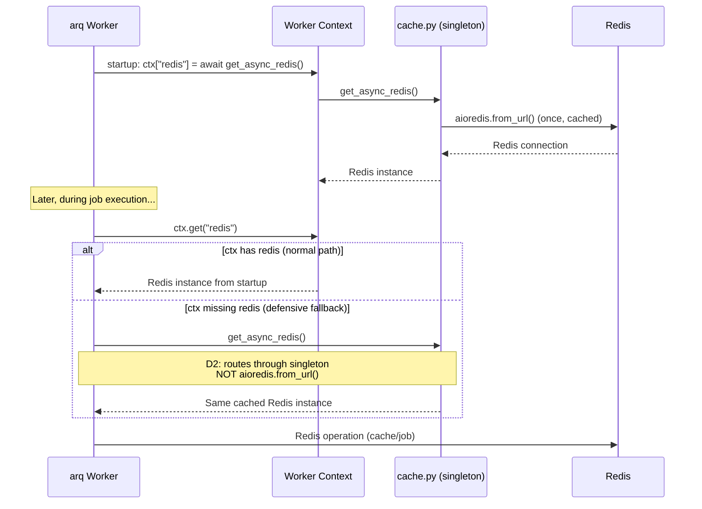
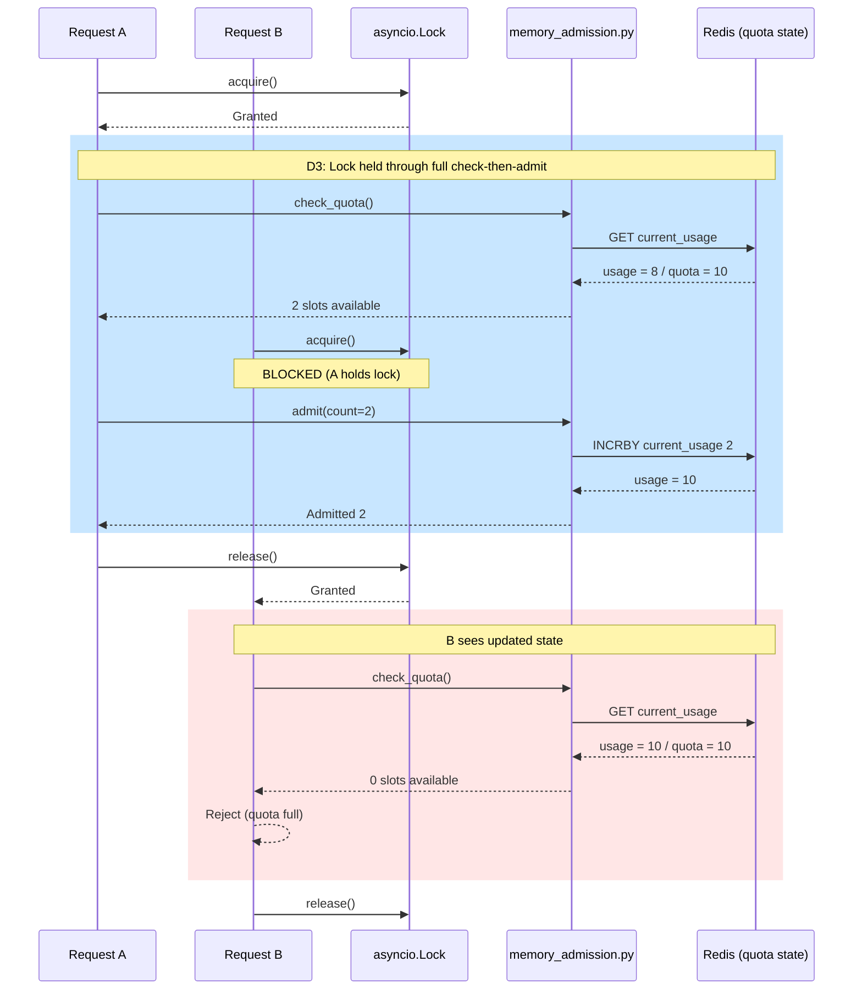
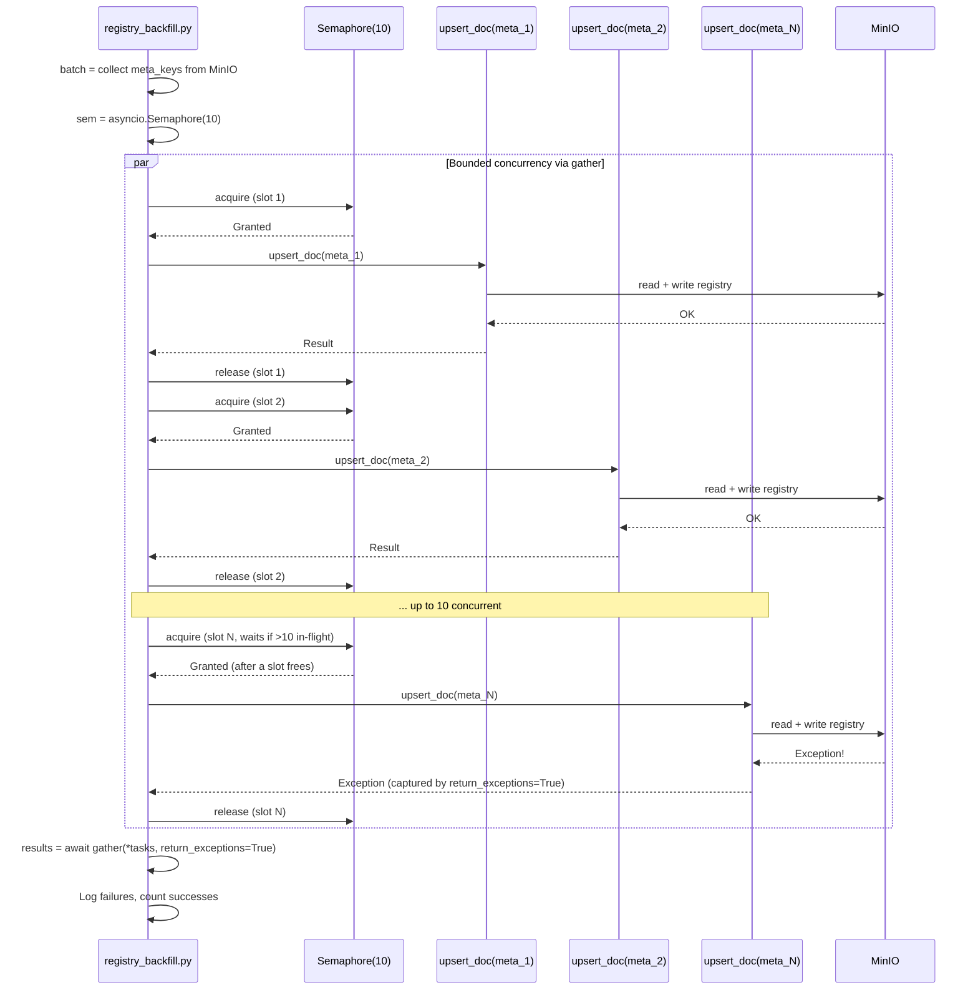

<!-- Space: CITRA -->
<!-- Title: Design: RFC-012 Reliability & Dead-Code Quick-Wins -->
<!-- Folder: Designs -->

# Design Document: Reliability & Dead-Code Quick-Win Batch

## Traceability

| Artifact | Reference |
|---|---|
| Governing RFC | [RFC-012: Reliability & Dead-Code Quick-Win Batch](../rfcs/012-reliability-deadcode-quickwins.md) |
| PRD / Requirements | `PRD.md` |
| Architecture Doc | `ARCHITECTURE.md` |
| Implementation Plan | [tasks-rfc012-reliability-deadcode-quickwins.md](../tasks/tasks-rfc012-reliability-deadcode-quickwins.md) |

## Overview

The PageIndex MCP Server's worker, admission controller, process manager, and test harness carry 7 audit-flagged issues spanning ad-hoc Redis connections, a check-then-admit race condition, an aggressive gunicorn graceful timeout, dead code, a hardcoded test URL, and sequential registry upserts. This design addresses all 7 issues via targeted, independent fixes that improve worker reliability, remove confirmed-dead files, harden the test harness, and batch registry backfill operations -- without touching any compliance, PII-routing, or tree-quality surface.

## Key Design Principles

1. **Singleton-first for connections**: Every Redis access point in the codebase must route through the shared `cache.py` singleton. Ad-hoc `aioredis.from_url` calls are a consistency and connection-leak risk even when they appear to be dead paths.
2. **Hold locks through decision windows**: When a check-then-act sequence guards a shared resource, the lock must span the entire window. Releasing and reacquiring per iteration turns the lock into a no-op under concurrency.
3. **Safe defaults over prod defaults**: Test harness defaults must point at `localhost`, not production. A developer running `python test.py` without configuration must never hit the production server.
4. **Delete confirmed-dead code**: Files with zero references and no active callers carry maintenance and confusion cost. Delete outright; git history is the recovery path.
5. **Bounded concurrency for bulk operations**: Sequential loops over async I/O waste wall-clock time; unbounded `gather` risks connection storms. A semaphore-bounded `gather` is the standard pattern.

## Launch Constraints

- All 7 fixes are independent with no shared code surface -- they can land in any order.
- [D1](../rfcs/012-reliability-deadcode-quickwins.md#d1--iss-03-no-code-change-close-as-resolved) requires no code change; it is an audit-tracker update only.
- [D4](../rfcs/012-reliability-deadcode-quickwins.md#d4--iss-39-raise-gunicorn-graceful_timeout-add-request-jitter) changes deploy-time behavior (longer graceful shutdown window) -- note in the deploy runbook.
- None of these fixes touch PII routing, erasure, or tree-quality gating ([RFC Hard Rules](../rfcs/012-reliability-deadcode-quickwins.md#hard-rule-constraints-claudemd--binding)).

## Architecture

### High-Level System Architecture

```mermaid
graph TB
  subgraph "Client Layer"
    MCP["MCP Client"]
    HTTP["HTTP Client (test.py)"]
  end

  subgraph "Process Manager"
    Gunicorn["gunicorn.conf.py<br/>(D4: lifecycle tuning)"]
  end

  subgraph "MCP Server"
    Server["FastMCP Server"]
  end

  subgraph "Worker"
    ArqWorker["arq Worker<br/>(worker.py)"]
    Admission["memory_admission.py<br/>(D3: lock scope)"]
  end

  subgraph "Shared Infrastructure"
    Cache["cache.py<br/>(get_async_redis singleton)"]
    Backfill["registry_backfill.py<br/>(D7: batched upserts)"]
  end

  subgraph "Data Stores"
    Redis[("Redis<br/>(cache + job bus)")]
    MinIO[("MinIO<br/>(uploads/, processed/)")]
  end

  subgraph "Dead Code (D5: deleted)"
    Dead1["upload.py &#10060;"]
    Dead2["tools/processing.py &#10060;"]
  end

  MCP --> Server
  HTTP -->|"D6: env override"| Server
  Gunicorn -->|"D4: graceful_timeout=30<br/>max_requests + jitter"| Server
  ArqWorker -->|"D2: route through singleton"| Cache
  Admission -->|"D3: hold lock through<br/>check-then-admit"| Redis
  Cache --> Redis
  Backfill -->|"D7: semaphore-bounded<br/>gather"| MinIO
  Server --> Redis
  Server --> MinIO
```

### Architecture Decisions

**[AD1] Close ISS-03 as resolved** ([RFC-012 D1](../rfcs/012-reliability-deadcode-quickwins.md#d1--iss-03-no-code-change-close-as-resolved)): `registry_backfill.py:188-193` already guards `set_registry_complete` behind a non-empty `meta_keys` check. No code change required -- mark ISS-03 closed in the audit tracker only. No correctness property (no code surface). Implemented in [Task 1.1](../tasks/tasks-rfc012-reliability-deadcode-quickwins.md#11-close-iss-03-as-resolved).

**[AD2] Redis singleton reuse** ([RFC-012 D2](../rfcs/012-reliability-deadcode-quickwins.md#d2--iss-07-route-worker-redis-access-through-the-shared-singleton)): `worker.py:275` and `:446` fall back to `aioredis.from_url(settings.redis_url, ...)` when `ctx.get("redis")` is falsy. Although `ctx["redis"]` is always set at startup (`worker.py:509`), the fallback is the last ad-hoc connection site in the codebase. Replace both with `from .cache import get_async_redis` to route through the shared singleton for consistency and defense-in-depth. Alternative: leave the fallback as-is since it's a dead path today -- rejected because it's a latent connection-leak risk if startup ordering changes. Validates [Property 1](#property-1-redis-singleton-consistency). Implemented in [Task 2.1](../tasks/tasks-rfc012-reliability-deadcode-quickwins.md#21-route-worker-redis-through-singleton).

**[AD3] Admission lock scope** ([RFC-012 D3](../rfcs/012-reliability-deadcode-quickwins.md#d3--iss-37-hold-the-lock-through-the-full-check-then-admit-window)): `memory_admission.py:72-99` acquires and releases a lock per loop iteration, leaving a window between check and admit where a concurrent request can slip through and over-admit. Wrap the full decision window -- check through admit -- in one `asyncio.Lock()` acquisition. Alternative: per-iteration locking with a post-admit recheck -- rejected because it adds complexity without eliminating the race (recheck itself is not atomic). Validates [Property 2](#property-2-admission-lock-atomicity). Implemented in [Task 3.1](../tasks/tasks-rfc012-reliability-deadcode-quickwins.md#31-fix-admission-lock-scope).

**[AD4] Gunicorn lifecycle tuning** ([RFC-012 D4](../rfcs/012-reliability-deadcode-quickwins.md#d4--iss-39-raise-gunicorn-graceful_timeout-add-request-jitter)): `gunicorn.conf.py:13`'s `graceful_timeout=5` is too short for in-flight ingestion requests to complete during worker restart/deploy. Raise to `graceful_timeout=30` and add `max_requests=100` / `max_requests_jitter=10` to stagger worker recycling. Alternative: keep 5s and rely on the job queue for retries -- rejected because HTTP upload requests are not retryable by the queue, and a 5s window drops them silently. Validates [Property 3](#property-3-graceful-shutdown-completeness). Implemented in [Task 2.2](../tasks/tasks-rfc012-reliability-deadcode-quickwins.md#22-tune-gunicorn-lifecycle).

**[AD5] Dead code removal** ([RFC-012 D5](../rfcs/012-reliability-deadcode-quickwins.md#d5--iss-42--iss-45-delete-confirmed-dead-files)): `upload.py` (repo root) calls a non-existent MCP tool `process_document` and has 0 references repo-wide; `ingest_via_server.py` is the active replacement. `tools/processing.py` is a 1-line tombstone comment with 0 references. Both confirmed dead via codebase-graph reference search. Delete outright -- no deprecation shim. Alternative: keep with a deprecation warning -- rejected because zero-reference files cannot emit warnings at runtime. Validates [Property 4](#property-4-dead-code-absence). Implemented in [Task 1.3](../tasks/tasks-rfc012-reliability-deadcode-quickwins.md#13-delete-dead-files).

**[AD6] Test URL env override** ([RFC-012 D6](../rfcs/012-reliability-deadcode-quickwins.md#d6--iss-43-env-var-override-for-testpys-target-url)): `test.py:21` hardcodes `https://pageindex.aiwithsalil.work/mcp`. Replace with `os.environ.get("TEST_MCP_URL", "http://localhost:8201/mcp")` -- defaulting to localhost, not prod. A developer running `python test.py` without env vars must never hit production. Alternative: keep the prod default and require CI to override -- rejected because it inverts the safety default. Validates [Property 5](#property-5-test-url-safety). Implemented in [Task 1.2](../tasks/tasks-rfc012-reliability-deadcode-quickwins.md#12-add-test-url-env-override).

**[AD7] Batched registry upserts** ([RFC-012 D7](../rfcs/012-reliability-deadcode-quickwins.md#d7--iss-46-batch-registry-backfill-upserts-with-bounded-concurrency)): `registry_backfill.py:129` runs a sequential `for` loop over per-doc upserts. Replace with `asyncio.Semaphore(10)` + `asyncio.gather(..., return_exceptions=True)` for bounded-concurrency batching. Alternative: unbounded `gather` -- rejected because it can open 100+ concurrent connections during a full backfill. Alternative: sequential with connection pooling -- rejected because it still wastes wall-clock time on I/O-bound work. Validates [Property 6](#property-6-backfill-concurrency-correctness). Implemented in [Task 3.2](../tasks/tasks-rfc012-reliability-deadcode-quickwins.md#32-batch-registry-backfill-upserts).

### Deployment Architecture

- **Backend**: Python 3.12 + FastMCP + gunicorn/uvicorn workers
- **Object Storage**: MinIO (`uploads/`, `processed/`, `.meta.json` sidecars)
- **Task Queue**: arq with Redis broker
- **Cache / Job Bus**: Redis (document cache, job status, admission state)
- **Process Manager**: gunicorn ([D4](#ad4--gunicorn-lifecycle-tuning) -- `graceful_timeout=30`, `max_requests=100`, `max_requests_jitter=10`)

### Communication Patterns

| Pattern | Use Case | Technology |
|---------|----------|------------|
| Sync MCP | MCP tool calls (document query) | FastMCP |
| Sync HTTP | Test harness ([D6](#ad6--test-url-env-override)), upload API | FastAPI/Starlette |
| Async job queue | Document processing pipeline | arq + Redis |
| Async Redis | Worker cache access ([D2](#ad2--redis-singleton-reuse)), admission checks ([D3](#ad3--admission-lock-scope)) | aioredis via `cache.py` singleton |
| Async bounded gather | Registry backfill upserts ([D7](#ad7--batched-registry-upserts)) | asyncio.Semaphore + asyncio.gather |

### Sequence Diagrams

#### Worker Startup Flow ([D2](../rfcs/012-reliability-deadcode-quickwins.md#d2--iss-07-route-worker-redis-access-through-the-shared-singleton))

Validates [Property 1](#property-1-redis-singleton-consistency). Implemented in [Task 2.1](../tasks/tasks-rfc012-reliability-deadcode-quickwins.md#21-route-worker-redis-through-singleton) and [Task 4.1](../tasks/tasks-rfc012-reliability-deadcode-quickwins.md#41-redis-singleton-spy-test).

#### Memory Admission Flow ([D3](../rfcs/012-reliability-deadcode-quickwins.md#d3--iss-37-hold-the-lock-through-the-full-check-then-admit-window))

Validates [Property 2](#property-2-admission-lock-atomicity). Implemented in [Task 3.1](../tasks/tasks-rfc012-reliability-deadcode-quickwins.md#31-fix-admission-lock-scope) and [Task 4.2](../tasks/tasks-rfc012-reliability-deadcode-quickwins.md#42-admission-lock-concurrency-test).

#### Registry Backfill Flow ([D7](../rfcs/012-reliability-deadcode-quickwins.md#d7--iss-46-batch-registry-backfill-upserts-with-bounded-concurrency))

Validates [Property 6](#property-6-backfill-concurrency-correctness). Implemented in [Task 3.2](../tasks/tasks-rfc012-reliability-deadcode-quickwins.md#32-batch-registry-backfill-upserts) and [Task 4.3](../tasks/tasks-rfc012-reliability-deadcode-quickwins.md#43-backfill-gather-test).

## Service Contracts

### 1. worker.py

**Responsibility**: arq worker process -- executes document processing jobs from the Redis queue.

**Changes ([D2](../rfcs/012-reliability-deadcode-quickwins.md#d2--iss-07-route-worker-redis-access-through-the-shared-singleton))**:

- [D2](../rfcs/012-reliability-deadcode-quickwins.md#d2--iss-07-route-worker-redis-access-through-the-shared-singleton): Replace ad-hoc `aioredis.from_url(settings.redis_url, ...)` fallback at lines 275 and 446 with `from .cache import get_async_redis; redis = ctx.get("redis") or await get_async_redis()`. Validates [Property 1](#property-1-redis-singleton-consistency). Implemented in [Task 2.1](../tasks/tasks-rfc012-reliability-deadcode-quickwins.md#21-route-worker-redis-through-singleton).

**Internal Interfaces**:

- Reads jobs from Redis via arq
- Calls `cache.py` `get_async_redis()` for Redis access (post-[D2](../rfcs/012-reliability-deadcode-quickwins.md#d2--iss-07-route-worker-redis-access-through-the-shared-singleton))
- Calls `memory_admission.py` for quota checks before processing

### 2. memory_admission.py

**Responsibility**: Admission controller -- gates document processing based on memory quota to prevent OOM in the worker.

**Changes ([D3](../rfcs/012-reliability-deadcode-quickwins.md#d3--iss-37-hold-the-lock-through-the-full-check-then-admit-window))**:

- [D3](../rfcs/012-reliability-deadcode-quickwins.md#d3--iss-37-hold-the-lock-through-the-full-check-then-admit-window): Move `asyncio.Lock()` acquisition from per-iteration to spanning the full check-then-admit window (lines 72-99). The lock must be held from the initial quota check through the admission increment. Validates [Property 2](#property-2-admission-lock-atomicity). Implemented in [Task 3.1](../tasks/tasks-rfc012-reliability-deadcode-quickwins.md#31-fix-admission-lock-scope).

**Internal Interfaces**:

- Called by `worker.py` before starting a processing job
- Reads/writes quota state in Redis

### 3. gunicorn.conf.py

**Responsibility**: Gunicorn process manager configuration -- controls worker lifecycle, timeouts, and recycling.

**Changes ([D4](../rfcs/012-reliability-deadcode-quickwins.md#d4--iss-39-raise-gunicorn-graceful_timeout-add-request-jitter))**:

- [D4](../rfcs/012-reliability-deadcode-quickwins.md#d4--iss-39-raise-gunicorn-graceful_timeout-add-request-jitter): Raise `graceful_timeout` from `5` to `30`. Add `max_requests = 100` and `max_requests_jitter = 10` to stagger worker recycling and prevent synchronized restarts under load. Validates [Property 3](#property-3-graceful-shutdown-completeness). Implemented in [Task 2.2](../tasks/tasks-rfc012-reliability-deadcode-quickwins.md#22-tune-gunicorn-lifecycle).

### 4. registry_backfill.py

**Responsibility**: One-shot backfill script -- populates the Postgres registry from existing MinIO metadata sidecars.

**Changes ([D7](../rfcs/012-reliability-deadcode-quickwins.md#d7--iss-46-batch-registry-backfill-upserts-with-bounded-concurrency))**:

- [D7](../rfcs/012-reliability-deadcode-quickwins.md#d7--iss-46-batch-registry-backfill-upserts-with-bounded-concurrency): Replace the sequential `for` loop at line 129 with `asyncio.Semaphore(10)` + `asyncio.gather(*tasks, return_exceptions=True)`. Each upsert is wrapped in a semaphore-guarded coroutine. Failed upserts are logged but do not abort the batch. Validates [Property 6](#property-6-backfill-concurrency-correctness). Implemented in [Task 3.2](../tasks/tasks-rfc012-reliability-deadcode-quickwins.md#32-batch-registry-backfill-upserts).

**Internal Interfaces**:

- Reads `.meta.json` sidecars from MinIO
- Writes to Postgres registry via `upsert_doc()`

### 5. test.py

**Responsibility**: Manual smoke-test harness -- sends MCP tool calls to a server endpoint and reports results.

**Changes ([D6](../rfcs/012-reliability-deadcode-quickwins.md#d6--iss-43-env-var-override-for-testpys-target-url))**:

- [D6](../rfcs/012-reliability-deadcode-quickwins.md#d6--iss-43-env-var-override-for-testpys-target-url): Replace hardcoded `url = "https://pageindex.aiwithsalil.work/mcp"` at line 21 with `url = os.environ.get("TEST_MCP_URL", "http://localhost:8201/mcp")`. Default is localhost, not prod. Validates [Property 5](#property-5-test-url-safety). Implemented in [Task 1.2](../tasks/tasks-rfc012-reliability-deadcode-quickwins.md#12-add-test-url-env-override).

### 6. cache.py

**Responsibility**: Shared async Redis connection singleton -- the single authorized Redis connection factory for the entire codebase.

**Changes**: No direct changes. [D2](../rfcs/012-reliability-deadcode-quickwins.md#d2--iss-07-route-worker-redis-access-through-the-shared-singleton) routes `worker.py`'s ad-hoc connections through `cache.py`'s existing `get_async_redis()` (line 39). This file is the target of [Property 1](#property-1-redis-singleton-consistency) -- after [D2](../rfcs/012-reliability-deadcode-quickwins.md#d2--iss-07-route-worker-redis-access-through-the-shared-singleton), every Redis access in the codebase routes through this singleton.

**Internal Interfaces**:

- `get_async_redis() -> aioredis.Redis` -- process-cached async Redis connection
- Called by `worker.py` (post-[D2](../rfcs/012-reliability-deadcode-quickwins.md#d2--iss-07-route-worker-redis-access-through-the-shared-singleton)), `helpers.py`, `documents.py`, `memory_admission.py`

## Data Models

This RFC introduces no new data models, schema changes, or storage layout changes. All fixes are behavioral (connection routing, lock scope, config values, file deletion, env-var override, concurrency pattern).

## Correctness Properties

*A property is a characteristic or behavior that should hold true across all valid executions of the system -- a formal statement about what the system should do. Properties serve as the bridge between human-readable specifications and machine-verifiable correctness guarantees.*

### Property 1: Redis singleton consistency

*For any* Redis access in `worker.py`, system SHALL obtain the connection via `cache.py`'s `get_async_redis()` singleton, never via a direct `aioredis.from_url()` call.

**Validates**: [RFC-012 D2](../rfcs/012-reliability-deadcode-quickwins.md#d2--iss-07-route-worker-redis-access-through-the-shared-singleton), ISS-07. **Tested in**: [Task 4.1](../tasks/tasks-rfc012-reliability-deadcode-quickwins.md#41-redis-singleton-spy-test). **Service contract**: [worker.py](#1-workerpy), [cache.py](#6-cachepy). **Sequence diagram**: [Worker Startup Flow](#worker-startup-flow--d2).

### Property 2: Admission lock atomicity

*For any* pair of concurrent admission requests where the combined demand exceeds remaining quota, system SHALL admit at most one request -- the `asyncio.Lock()` must be held from quota check through admission increment, preventing interleaved check-then-admit sequences.

**Validates**: [RFC-012 D3](../rfcs/012-reliability-deadcode-quickwins.md#d3--iss-37-hold-the-lock-through-the-full-check-then-admit-window), ISS-37. **Tested in**: [Task 4.2](../tasks/tasks-rfc012-reliability-deadcode-quickwins.md#42-admission-lock-concurrency-test). **Service contract**: [memory_admission.py](#2-memory_admissionpy). **Sequence diagram**: [Memory Admission Flow](#memory-admission-flow--d3).

### Property 3: Graceful shutdown completeness

*For any* in-flight HTTP request at the time of a gunicorn worker restart, system SHALL allow up to 30 seconds for the request to complete before forced termination, and worker recycling via `max_requests` SHALL be jittered to prevent synchronized restarts.

**Validates**: [RFC-012 D4](../rfcs/012-reliability-deadcode-quickwins.md#d4--iss-39-raise-gunicorn-graceful_timeout-add-request-jitter), ISS-39. **Tested in**: Verified by existing test suite continuing green; config-only change with no new test required ([Task 2.3](../tasks/tasks-rfc012-reliability-deadcode-quickwins.md#23-checkpoint--batch-1)). **Service contract**: [gunicorn.conf.py](#3-gunicornconfpy).

### Property 4: Dead code absence

*For any* file in the repository, system SHALL NOT contain `upload.py` (repo root) or `tools/processing.py` -- both are confirmed dead code with zero references.

**Validates**: [RFC-012 D5](../rfcs/012-reliability-deadcode-quickwins.md#d5--iss-42--iss-45-delete-confirmed-dead-files), ISS-42 + ISS-45. **Tested in**: Verified by file absence and existing test suite continuing green ([Task 1.4](../tasks/tasks-rfc012-reliability-deadcode-quickwins.md#14-checkpoint--batch-0)). **Service contract**: N/A (deleted files).

### Property 5: Test URL safety

*For any* invocation of `test.py` without `TEST_MCP_URL` set, system SHALL target `http://localhost:8201/mcp`, never the production server.

**Validates**: [RFC-012 D6](../rfcs/012-reliability-deadcode-quickwins.md#d6--iss-43-env-var-override-for-testpys-target-url), ISS-43. **Tested in**: Verified by inspection; config-only change ([Task 1.4](../tasks/tasks-rfc012-reliability-deadcode-quickwins.md#14-checkpoint--batch-0)). **Service contract**: [test.py](#5-testpy).

### Property 6: Backfill concurrency correctness

*For any* registry backfill batch of N documents, system SHALL execute upserts with at most 10 concurrent operations via `asyncio.Semaphore(10)`, collect all results (including exceptions) via `asyncio.gather(..., return_exceptions=True)`, and log per-item failures without aborting the batch.

**Validates**: [RFC-012 D7](../rfcs/012-reliability-deadcode-quickwins.md#d7--iss-46-batch-registry-backfill-upserts-with-bounded-concurrency), ISS-46. **Tested in**: [Task 4.3](../tasks/tasks-rfc012-reliability-deadcode-quickwins.md#43-backfill-gather-test). **Service contract**: [registry_backfill.py](#4-registry_backfillpy). **Sequence diagram**: [Registry Backfill Flow](#registry-backfill-flow--d7).

## Error Handling

### Error Categories & Responses

| Category | Surface | Response / Behavior | Retry Strategy | RFC Decision | Property |
|----------|---------|---------------------|----------------|--------------|----------|
| Redis connection failure (worker) | Worker log | Falls back to `get_async_redis()` singleton; logs warning | Automatic via singleton retry | [D2](../rfcs/012-reliability-deadcode-quickwins.md#d2--iss-07-route-worker-redis-access-through-the-shared-singleton) | [P1](#property-1-redis-singleton-consistency) |
| Admission race (over-admit) | Worker log | Lock prevents; pre-[D3](../rfcs/012-reliability-deadcode-quickwins.md#d3--iss-37-hold-the-lock-through-the-full-check-then-admit-window) this was silent corruption | N/A -- prevented by lock | [D3](../rfcs/012-reliability-deadcode-quickwins.md#d3--iss-37-hold-the-lock-through-the-full-check-then-admit-window) | [P2](#property-2-admission-lock-atomicity) |
| In-flight request during restart | HTTP | Gunicorn allows 30s grace; forced kill after | Client retries | [D4](../rfcs/012-reliability-deadcode-quickwins.md#d4--iss-39-raise-gunicorn-graceful_timeout-add-request-jitter) | [P3](#property-3-graceful-shutdown-completeness) |
| Test hits prod accidentally | HTTP | Pre-[D6](../rfcs/012-reliability-deadcode-quickwins.md#d6--iss-43-env-var-override-for-testpys-target-url): silent prod traffic; post-[D6](../rfcs/012-reliability-deadcode-quickwins.md#d6--iss-43-env-var-override-for-testpys-target-url): defaults to localhost | N/A -- prevented by default | [D6](../rfcs/012-reliability-deadcode-quickwins.md#d6--iss-43-env-var-override-for-testpys-target-url) | [P5](#property-5-test-url-safety) |
| Per-doc upsert failure in backfill | Backfill log | Exception captured by `return_exceptions=True`; logged; batch continues | Manual re-run of backfill | [D7](../rfcs/012-reliability-deadcode-quickwins.md#d7--iss-46-batch-registry-backfill-upserts-with-bounded-concurrency) | [P6](#property-6-backfill-concurrency-correctness) |

### Service-Specific Error Handling

**[worker.py](#1-workerpy) ([D2](../rfcs/012-reliability-deadcode-quickwins.md#d2--iss-07-route-worker-redis-access-through-the-shared-singleton))**:

- `ctx.get("redis")` returns `None` (should never happen post-startup) -> falls back to `get_async_redis()` singleton, not raw `aioredis.from_url()` ([D2](../rfcs/012-reliability-deadcode-quickwins.md#d2--iss-07-route-worker-redis-access-through-the-shared-singleton), [Property 1](#property-1-redis-singleton-consistency))

**[memory_admission.py](#2-memory_admissionpy) ([D3](../rfcs/012-reliability-deadcode-quickwins.md#d3--iss-37-hold-the-lock-through-the-full-check-then-admit-window))**:

- Two concurrent requests arrive with 1 slot remaining -> lock serializes: first request admits, second sees updated quota and rejects ([D3](../rfcs/012-reliability-deadcode-quickwins.md#d3--iss-37-hold-the-lock-through-the-full-check-then-admit-window), [Property 2](#property-2-admission-lock-atomicity))
- Lock acquisition blocks indefinitely if a coroutine holds it and never releases -> mitigated by asyncio's cooperative scheduling; the critical section is < 1ms (Redis GET + INCRBY)

**[gunicorn.conf.py](#3-gunicornconfpy) ([D4](../rfcs/012-reliability-deadcode-quickwins.md#d4--iss-39-raise-gunicorn-graceful_timeout-add-request-jitter))**:

- Worker restart during a 25s upload request -> completes within 30s `graceful_timeout` ([D4](../rfcs/012-reliability-deadcode-quickwins.md#d4--iss-39-raise-gunicorn-graceful_timeout-add-request-jitter), [Property 3](#property-3-graceful-shutdown-completeness))
- All workers hit `max_requests` simultaneously -> `max_requests_jitter=10` staggers restarts across a 90-110 request window ([D4](../rfcs/012-reliability-deadcode-quickwins.md#d4--iss-39-raise-gunicorn-graceful_timeout-add-request-jitter), [Property 3](#property-3-graceful-shutdown-completeness))

**[registry_backfill.py](#4-registry_backfillpy) ([D7](../rfcs/012-reliability-deadcode-quickwins.md#d7--iss-46-batch-registry-backfill-upserts-with-bounded-concurrency))**:

- 3 of 50 upserts fail with transient MinIO errors -> 3 exceptions captured in `results`, logged with doc_id; remaining 47 succeed; operator re-runs backfill for the 3 failures ([D7](../rfcs/012-reliability-deadcode-quickwins.md#d7--iss-46-batch-registry-backfill-upserts-with-bounded-concurrency), [Property 6](#property-6-backfill-concurrency-correctness))
- Semaphore exhaustion (10 slow upserts) -> 11th task waits for a slot; no timeout on semaphore acquisition (backfill is not latency-critical)

## Testing Strategy

Testing follows the [RFC-012 Test Strategy](../rfcs/012-reliability-deadcode-quickwins.md#test-strategy) and validates all 6 [correctness properties](#correctness-properties).

### Testing Layers

1. **Unit Tests**: Mock/spy-based tests for [D2](../rfcs/012-reliability-deadcode-quickwins.md#d2--iss-07-route-worker-redis-access-through-the-shared-singleton) (singleton routing), [D3](../rfcs/012-reliability-deadcode-quickwins.md#d3--iss-37-hold-the-lock-through-the-full-check-then-admit-window) (concurrency race), and [D7](../rfcs/012-reliability-deadcode-quickwins.md#d7--iss-46-batch-registry-backfill-upserts-with-bounded-concurrency) (batched gather with simulated failures).
2. **Config Verification**: [D4](../rfcs/012-reliability-deadcode-quickwins.md#d4--iss-39-raise-gunicorn-graceful_timeout-add-request-jitter), [D5](../rfcs/012-reliability-deadcode-quickwins.md#d5--iss-42--iss-45-delete-confirmed-dead-files), [D6](../rfcs/012-reliability-deadcode-quickwins.md#d6--iss-43-env-var-override-for-testpys-target-url) are config-only or deletion changes verified by the existing test suite continuing green.
3. **Regression**: Full `uv run pytest` at each batch checkpoint to confirm no regressions from any change.

### Key Test Scenarios

**Critical Path Tests:**

1. Mock `worker.py` job execution with `ctx.get("redis")` returning `None` -> assert `get_async_redis()` is called, NOT `aioredis.from_url()` *(validates [P1](#property-1-redis-singleton-consistency), [Task 4.1](../tasks/tasks-rfc012-reliability-deadcode-quickwins.md#41-redis-singleton-spy-test))*
2. Two concurrent admission requests against a near-full quota -> assert only one admits *(validates [P2](#property-2-admission-lock-atomicity), [Task 4.2](../tasks/tasks-rfc012-reliability-deadcode-quickwins.md#42-admission-lock-concurrency-test))*
3. Batch of 5 upserts with 1 simulated failure -> assert `upsert_doc` called 5 times, 4 successes + 1 exception in results *(validates [P6](#property-6-backfill-concurrency-correctness), [Task 4.3](../tasks/tasks-rfc012-reliability-deadcode-quickwins.md#43-backfill-gather-test))*

**Edge Cases:**

- `ctx.get("redis")` returns a valid connection -> `get_async_redis()` is NOT called (fast path still works, [P1](#property-1-redis-singleton-consistency))
- Single admission request exactly at quota -> admitted (lock is not a bottleneck for non-contended access, [P2](#property-2-admission-lock-atomicity))
- Backfill with 0 documents -> `gather` receives empty iterable, returns empty list, no error ([P6](#property-6-backfill-concurrency-correctness))
- Backfill with all upserts failing -> all exceptions captured, logged, batch completes without raising ([P6](#property-6-backfill-concurrency-correctness))
- `test.py` with `TEST_MCP_URL` explicitly set to prod URL -> uses the override (env var takes precedence, [P5](#property-5-test-url-safety))
- `upload.py` and `tools/processing.py` absent from repo -> `uv run pytest` passes with no import errors ([P4](#property-4-dead-code-absence))
