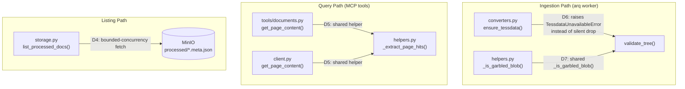
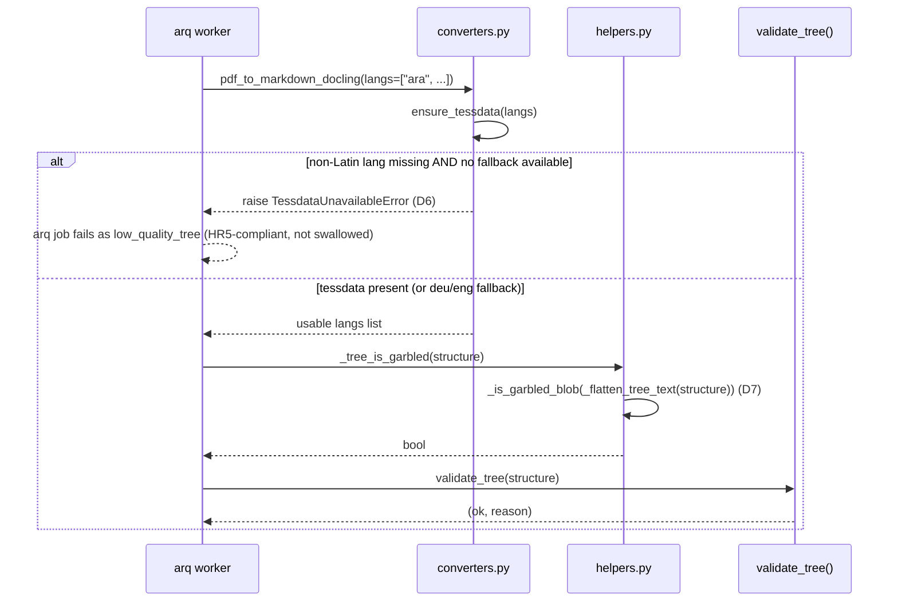
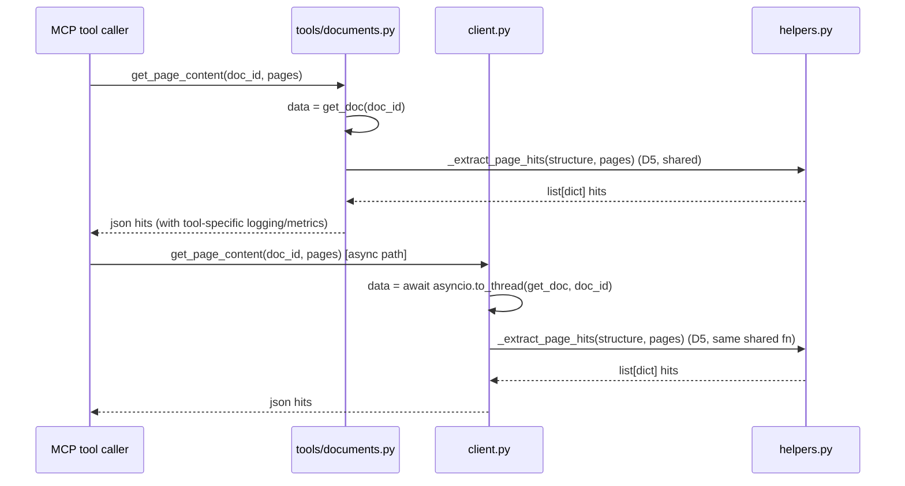
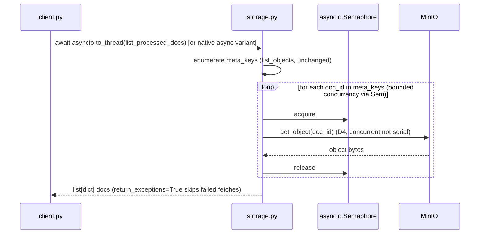

<!-- Space: CITRA -->
<!-- Title: Design: RFC-013 Structural Hardening Batch -->
<!-- Folder: Designs -->

# Design: RFC-013 — Structural Hardening Batch

## Traceability

| RFC Decision | Design Section | Correctness Property | Task |
|---|---|---|---|
| [D1-D3](../rfcs/013-structural-hardening.md#d1-d3--iss-08-iss-18-iss-19-no-code-change-close-as-resolved) | n/a — no code change | n/a | [Task 1.1](../tasks/tasks-rfc013-structural-hardening.md#11-mark-iss-08-iss-18-iss-19-resolved) |
| [D4](../rfcs/013-structural-hardening.md#d4--iss-05-bounded-concurrency-minio-fetch-for-list_processed_docs) | [storage.py](#1-storagepy), [Listing Flow](#listing-flow--d4) | [Property 1](#property-1-bounded-concurrency-minio-fetch) | [Task 2.1](../tasks/tasks-rfc013-structural-hardening.md#21-bounded-concurrency-minio-fetch-d4) |
| [D5](../rfcs/013-structural-hardening.md#d5--iss-44-extract-shared-page-hit-helper) | [helpers.py](#2-helperspy), [tools/documents.py](#4-toolsdocumentspy), [client.py](#5-clientpy), [Query Flow](#query-flow--d5) | [Property 2](#property-2-shared-page-hit-extraction) | [Task 2.2](../tasks/tasks-rfc013-structural-hardening.md#22-extract-shared-page-hit-helper-d5) |
| [D6](../rfcs/013-structural-hardening.md#d6--iss-34-raise-on-missing-non-latin-tessdata-instead-of-silent-drop) | [converters.py](#3-converterspy), [Ingestion Flow](#ingestion-flow--d6--d7) | [Property 3](#property-3-non-latin-tessdata-raise) | [Task 3.1](../tasks/tasks-rfc013-structural-hardening.md#31-tessdata-unavailable-error-d6) |
| [D7](../rfcs/013-structural-hardening.md#d7--iss-36-deduplicate-garble-detection-into-one-shared-function) | [helpers.py](#2-helperspy), [Ingestion Flow](#ingestion-flow--d6--d7) | [Property 4](#property-4-unified-garble-detection) | [Task 3.2](../tasks/tasks-rfc013-structural-hardening.md#32-deduplicate-garble-detection-d7) |

## Overview

RFC-013 is a low-risk, four-fix structural hardening batch that closes out
[Batch 2](../rfcs/013-structural-hardening.md#context) of the docstore audit:
three items ([D1-D3](../rfcs/013-structural-hardening.md#d1-d3--iss-08-iss-18-iss-19-no-code-change-close-as-resolved))
are already fixed in prior work and require only status bookkeeping, and four
open items land as small, independent, mechanical changes — bounding
`list_processed_docs`'s MinIO fan-out concurrency
([D4](../rfcs/013-structural-hardening.md#d4--iss-05-bounded-concurrency-minio-fetch-for-list_processed_docs)),
extracting a shared page-hit helper to kill duplicated pagination logic
([D5](../rfcs/013-structural-hardening.md#d5--iss-44-extract-shared-page-hit-helper)),
converting a silent non-Latin-tessdata fallback into a loud, typed error
([D6](../rfcs/013-structural-hardening.md#d6--iss-34-raise-on-missing-non-latin-tessdata-instead-of-silent-drop)),
and deduplicating two independently-drifting garble-detection functions into
one shared predicate
([D7](../rfcs/013-structural-hardening.md#d7--iss-36-deduplicate-garble-detection-into-one-shared-function)).
None of the four open fixes changes externally observable behavior for the
happy path — they change *how loudly* the system fails, and *how many places*
duplicate logic lives, not *what* the logic computes.

## Key Design Principles

1. **Behavior-preserving refactors, not heuristic changes.** [D5](../rfcs/013-structural-hardening.md#d5--iss-44-extract-shared-page-hit-helper)
   and [D7](../rfcs/013-structural-hardening.md#d7--iss-36-deduplicate-garble-detection-into-one-shared-function)
   extract existing logic verbatim into one shared function; thresholds
   (500-char digit-ratio floor, 20-token repetition floor, 0.60/0.30 ratios)
   are copied exactly, never re-tuned as a side effect of the dedup.
2. **Fail loud, not silent, on production-load-bearing paths.** [D6](../rfcs/013-structural-hardening.md#d6--iss-34-raise-on-missing-non-latin-tessdata-instead-of-silent-drop)
   converts a silently-degraded OCR-language fallback into a typed,
   catchable exception so operators see the failure instead of a
   downstream Latin-mojibake tree passing the garble gate by accident.
3. **Bounded concurrency over unbounded serial I/O.** [D4](../rfcs/013-structural-hardening.md#d4--iss-05-bounded-concurrency-minio-fetch-for-list_processed_docs)
   replaces an O(N) serial MinIO GET loop with a semaphore-bounded
   concurrent fetch — bounded so a large corpus listing cannot exhaust
   MinIO connections, not unbounded `asyncio.gather`.
4. **HR5 gates never loosen.** Per [HR5](../rfcs/013-structural-hardening.md#hard-rule-constraints-claudemd--binding),
   both [D6](../rfcs/013-structural-hardening.md#d6--iss-34-raise-on-missing-non-latin-tessdata-instead-of-silent-drop)
   and [D7](../rfcs/013-structural-hardening.md#d7--iss-36-deduplicate-garble-detection-into-one-shared-function)
   touch the garbling-detection path that feeds `validate_tree()`; D6
   tightens (silent degrade → raise), D7 is strictly behavior-preserving.
   Neither may cause a previously-failing tree to now pass, or vice versa,
   outside of D6's intentional new failure mode for missing non-Latin
   tessdata.
5. **No AGPL/pymupdf surface touched.** Per [HR4](../rfcs/013-structural-hardening.md#hard-rule-constraints-claudemd--binding),
   all four fixes are confined to `storage.py`, `helpers.py`,
   `converters.py`'s tessdata-selection block, and the two MCP-facing
   query call sites — none touch the PDF-extraction/pymupdf4llm surface.

## Launch Constraints

- [D6](../rfcs/013-structural-hardening.md#d6--iss-34-raise-on-missing-non-latin-tessdata-instead-of-silent-drop)
  must ship together with the `ara.traineddata` pre-bake infrastructure
  item — landing the raise alone, before the tessdata is pre-baked in the
  worker image, will turn every non-Latin-OCR request into a
  `low_quality_tree` failure in production (see
  [Risks](../rfcs/013-structural-hardening.md#risks)).
- [D7](../rfcs/013-structural-hardening.md#d7--iss-36-deduplicate-garble-detection-into-one-shared-function)
  requires a full corpus re-validation pass before being declared fully
  closed-out; that re-validation is an operational follow-up task, tracked
  separately, gated on this RFC merging (per
  [What this RFC does not cover](../rfcs/013-structural-hardening.md#what-this-rfc-does-not-cover)) —
  it is not a blocking dependency for merging the code change itself.
- [D4](../rfcs/013-structural-hardening.md#d4--iss-05-bounded-concurrency-minio-fetch-for-list_processed_docs)
  and [D5](../rfcs/013-structural-hardening.md#d5--iss-44-extract-shared-page-hit-helper)
  have no sequencing dependency on each other or on D6/D7 — both can ship
  in any order, or in parallel, per the
  [Implementation Plan](../rfcs/013-structural-hardening.md#implementation-plan).

## Architecture

### High-level system architecture



### Architecture Decisions

- **[D1-D3](../rfcs/013-structural-hardening.md#d1-d3--iss-08-iss-18-iss-19-no-code-change-close-as-resolved)
  — No code change, close as resolved.** ISS-08 (`_describe` retry/backoff
  with `IMAGE_DESCRIBE_FAILURES` counter, `converters.py:1316-1369`),
  ISS-18 (shared `_extract_json_object`, `helpers.py:62-76`/`:120`), and
  ISS-19 (narrowed except + `RAG_PARSE_FAILURES` counter,
  `helpers.py:221-223`) were verified already fixed in prior landings on
  re-audit. No design surface for these — status bookkeeping only, per
  [Task 1.1](../tasks/tasks-rfc013-structural-hardening.md#11-mark-iss-08-iss-18-iss-19-resolved).
- **[D4](../rfcs/013-structural-hardening.md#d4--iss-05-bounded-concurrency-minio-fetch-for-list_processed_docs)
  — Bounded-concurrency MinIO fetch.** `list_processed_docs`
  (`storage.py:420-423`) currently issues one serial `mc.get_object` call
  per doc_id inside a `for` loop — O(N) wall-clock for a listing endpoint.
  Fixed via `asyncio.Semaphore`-bounded `asyncio.gather(..., return_exceptions=True)`
  over `meta_keys.items()`, wrapped so the currently-synchronous
  `list_processed_docs` is called via `asyncio.to_thread` from
  `client.py:286`'s async call site (see
  [Service Contracts § storage.py](#1-storagepy)). Registry-only long-term
  fix (Approach B) is explicitly out of scope for this RFC.
- **[D5](../rfcs/013-structural-hardening.md#d5--iss-44-extract-shared-page-hit-helper)
  — Extract shared page-hit helper.** `tools/documents.py` (~352-360) and
  `client.py` (~769-776) each independently parse a page-spec string
  (`"1-3,5"` → `set[int]`) and filter `_build_node_map` output against it.
  Extracted to `helpers.py::_extract_page_hits(structure, pages) -> list[dict]`,
  reusing the existing `_build_node_map` and a new `_parse_page_spec`
  helper; call sites keep their own logging/metrics wrapper around the
  call, matching the existing `_build_node_map` sharing pattern.
- **[D6](../rfcs/013-structural-hardening.md#d6--iss-34-raise-on-missing-non-latin-tessdata-instead-of-silent-drop)
  — Raise on missing non-Latin tessdata.** `converters.py:719-752`'s
  `ensure_tessdata()` currently drops any requested language whose
  traineddata file is absent, silently falling back to `["deu", "eng"]`
  with only a `logger.warning`. This is the confirmed root cause of the
  مرسوم-13 Latin-mojibake-passes-garble-gate failure mode (see memory
  `fix3-ocr-escalation-mojibake-escape`). Fixed by defining
  `TessdataUnavailableError` and raising it when *all* non-Latin scripts
  requested (i.e., anything other than `deu`/`eng`) are missing from
  `TESSDATA_PREFIX` and `TESSDATA_ALLOW_DOWNLOAD` is not set — Latin
  fallback (`deu`/`eng` present) remains non-raising since that is the
  existing safe baseline, not the failure mode.
- **[D7](../rfcs/013-structural-hardening.md#d7--iss-36-deduplicate-garble-detection-into-one-shared-function)
  — Deduplicate garble detection.** `_tree_is_garbled` (`helpers.py:535`)
  and `_flat_text_is_garbled` (`helpers.py:1072`) independently implement
  the same digit-ratio (>0.60, gated on `len(blob) > 500`) and
  token-repetition (>0.30, gated on `len(tokens) > 20`) checks — RFC-010's
  D3/D3B landed the token-repetition guard into only one of the two, which
  is exactly the fix-one-miss-the-other drift this RFC closes.
  Extracted to `_is_garbled_blob(text: str) -> bool` in `helpers.py`, with
  `_tree_is_garbled` calling `_is_garbled_blob(_flatten_tree_text(structure))`
  and `_flat_text_is_garbled` calling `_is_garbled_blob(text)` directly.
  Thresholds are copied exactly, unchanged.

### Deployment Architecture

No deployment topology changes. All four fixes are in-process code changes
to the existing FastMCP server (`tools/documents.py`, `client.py`) and the
arq worker (`converters.py`, `storage.py`, `helpers.py` — shared between
both processes). No new services, no new env vars beyond the
already-existing `TESSDATA_PREFIX` / `TESSDATA_ALLOW_DOWNLOAD` consumed by
[D6](#3-converterspy). No MinIO bucket layout change, no Redis schema
change, no new Prometheus metric labels beyond what D6's raise path emits
through existing error-handling middleware (see [Error Handling](#error-handling)).

### Communication Patterns

- **[D4](../rfcs/013-structural-hardening.md#d4--iss-05-bounded-concurrency-minio-fetch-for-list_processed_docs):**
  intra-process async fan-out (`asyncio.Semaphore` + `asyncio.gather`) from
  `client.py`'s async MCP tool handler into `storage.py`'s
  (still-synchronous, `to_thread`-wrapped) MinIO client — no new network
  hops, same MinIO endpoint, just concurrent instead of serial GETs.
- **[D5](../rfcs/013-structural-hardening.md#d5--iss-44-extract-shared-page-hit-helper):**
  pure in-process function extraction; no I/O, no new call boundary — both
  `tools/documents.py` and `client.py` import `_extract_page_hits` from
  `helpers.py` and call it synchronously against already-loaded `structure`.
- **[D6](../rfcs/013-structural-hardening.md#d6--iss-34-raise-on-missing-non-latin-tessdata-instead-of-silent-drop):**
  the raised `TessdataUnavailableError` propagates up through the existing
  arq job exception path into the `low_quality_tree` error surface
  documented in `DESIGN.md`'s Erasure/DSR and job-status sections — no new
  transport, reuses the existing arq job-failure reporting mechanism.
- **[D7](../rfcs/013-structural-hardening.md#d7--iss-36-deduplicate-garble-detection-into-one-shared-function):**
  pure in-process function extraction; both `_tree_is_garbled` and
  `_flat_text_is_garbled` remain the public entry points called by
  `validate_tree()` and the flat-doc success route respectively — only
  their internal implementation is unified.

## Sequence Diagrams

### Ingestion Flow — D6 / D7



### Query Flow — D5



### Listing Flow — D4



## Service Contracts

### 1. storage.py

```python
def list_processed_docs() -> list[dict]:
    """List all processed documents. Reads lightweight .meta.json sidecars
    when available, falling back to full .json for legacy documents.

    D4 (ISS-05): per-doc MinIO GET fan-out is bounded-concurrency (asyncio
    .Semaphore-gated asyncio.gather with return_exceptions=True), not
    unbounded and not serial. A single failed fetch does not abort the
    listing; it is skipped (mirrors prior serial-loop try/except behavior).
    """
```

Contract: input is none (reads bucket state); output is unchanged in shape
and content versus the prior serial implementation — only wall-clock
fetch order/concurrency changes. Callers (`client.py:286`) already wrap
the call in `asyncio.to_thread`; that wrapping is preserved unless the
function itself is converted to native `async def`, in which case the
call site drops the `to_thread` wrap (implementation detail decided at
[Task 2.1](../tasks/tasks-rfc013-structural-hardening.md#21-bounded-concurrency-minio-fetch-d4)).

### 2. helpers.py

```python
def _parse_page_spec(pages: str) -> set[int]:
    """Parse '1-3,5' style page spec into a set of page numbers."""

def _extract_page_hits(structure: list, pages: str) -> list[dict]:
    """D5 (ISS-44): shared page-hit extraction. Builds the node map via
    the existing _build_node_map, parses `pages` via _parse_page_spec,
    and returns nodes whose page range intersects the wanted set."""

def _is_garbled_blob(text: str) -> bool:
    """D7 (ISS-36): single shared garble predicate — null/replacement-byte
    check, PUA-ratio check, digit-ratio check (>0.60, gated on len>500),
    and token-repetition check (>0.30, gated on len(tokens)>20). Thresholds
    are exactly those previously duplicated across _tree_is_garbled and
    _flat_text_is_garbled; unchanged by this extraction."""

def _tree_is_garbled(structure: list) -> bool:
    """Delegates to _is_garbled_blob(_flatten_tree_text(structure))."""

def _flat_text_is_garbled(text: str) -> bool:
    """Delegates to _is_garbled_blob(text) directly."""
```

Contract: `_is_garbled_blob` is pure (no I/O, no side effects), takes a
single `str`, returns `bool`. `_tree_is_garbled` and `_flat_text_is_garbled`
retain their existing signatures and call sites (`validate_tree()` and the
flat-doc success route respectively) — no caller-visible change.

### 3. converters.py

```python
class TessdataUnavailableError(Exception):
    """D6 (ISS-34): raised by ensure_tessdata() when a required non-Latin
    language's traineddata is unavailable (TESSDATA_PREFIX lookup miss)
    and TESSDATA_ALLOW_DOWNLOAD is not set to fetch it. Distinguishes a
    hard OCR-language failure from the safe deu/eng fallback baseline."""

def ensure_tessdata(langs: list[str]) -> list[str]:
    """Ensure <lang>.traineddata is available; return usable subset.

    D6: previously never raised — missing languages were silently dropped
    and, if nothing remained, fell back to ['deu', 'eng'] regardless of
    what was actually requested. Now: if the requested langs include any
    non-Latin script (i.e. not 'deu'/'eng') and none of those non-Latin
    languages have available traineddata, raises
    TessdataUnavailableError instead of silently substituting deu/eng.
    Latin-only requests, or requests where at least one non-Latin
    language IS available, are unaffected (no new raise path)."""
```

Contract: call sites in `converters.py`'s OCR-escalation path
(`~lines 465-500` per the escalation flow read during grounding) must
handle `TessdataUnavailableError` by letting it propagate to the arq job
failure surface (per [Ingestion Flow](#ingestion-flow--d6--d7)) — it must
NOT be caught and silently swallowed, since that would reintroduce the
exact silent-degrade bug this fix closes (see the AGPL fallthrough bug
noted in memory `vlm-hierarchy-detection-rfc004` as a cautionary
precedent for swallowed excepts in this file).

### 4. tools/documents.py

```python
def get_page_content(doc_id: str, pages: str) -> str:
    """Extract specific page content from processed documents.

    D5: page-hit extraction now delegates to
    helpers._extract_page_hits(structure, pages) instead of inlining its
    own wanted-set parse + node-filter loop. Tool-level logging/metrics
    (TOOL_CALLS, TOOL_ERRORS, TOOL_DURATION) wrap the call unchanged."""
```

Contract: return type, JSON shape, and error path (`{"error": "..."}` on
doc-not-found) are unchanged. Only the internal wanted-set/node-filter
logic (~lines 352-360) is replaced by the shared helper call.

### 5. client.py

```python
async def get_page_content(self, doc_id: str, pages: str) -> str:
    """Return node text for the specified pages as a JSON string.

    D5: page-hit extraction now delegates to
    helpers._extract_page_hits(structure, pages) instead of inlining its
    own wanted-set parse + node-filter loop (previously ~lines 769-776).
    """

def list_processed_docs_handler(...):
    """D4: call site for storage.list_processed_docs(); adjusts its
    asyncio.to_thread wrapping (or drops it) to match whichever concrete
    signature Task 2.1 lands (sync-wrapped-in-to_thread vs native async).
    """
```

Contract: both methods keep their existing async signatures and JSON
output shape; only their internal delegation target changes.

## Data Models

RFC-013 introduces no new persisted entities, no MinIO layout change, and
no new Redis keys. The only new "data model" is the exception type
introduced by [D6](#3-converterspy):

| Type | Module | Fields | Purpose |
|---|---|---|---|
| `TessdataUnavailableError` | `converters.py` | inherits `Exception`; message includes the missing lang code(s) | Raised by `ensure_tessdata()` so a missing non-Latin tessdata surfaces as a distinguishable, catchable failure up through the arq job-failure path into `low_quality_tree`, rather than silently substituting `['deu', 'eng']`. |

No schema migration, no versioning concern — this is a pure in-process
control-flow addition.

## Correctness Properties

### Property 1: Bounded-concurrency MinIO fetch

For any corpus of N processed documents, `list_processed_docs()` SHALL
fetch each document's metadata object with concurrency bounded by a fixed
semaphore limit (not serial, and not unbounded), and a single fetch
failure SHALL NOT abort the overall listing.

- **Validates:** [D4](../rfcs/013-structural-hardening.md#d4--iss-05-bounded-concurrency-minio-fetch-for-list_processed_docs)
- **Tested in:** [Task 2.3](../tasks/tasks-rfc013-structural-hardening.md#23-unit-tests-d4-d5) — unit test exercising `list_processed_docs` against a mocked MinIO client with N>semaphore-limit objects, asserting bounded in-flight concurrency and that one injected fetch failure does not raise for the whole call.
- **Service contract:** [storage.py](#1-storagepy)
- **Sequence diagram:** [Listing Flow](#listing-flow--d4)

### Property 2: Shared page-hit extraction

For any `structure` and any valid `pages` spec string, `tools/documents.py`'s
`get_page_content` and `client.py`'s `get_page_content` SHALL produce
identical page-hit results by calling the same underlying
`helpers._extract_page_hits` function — no call site SHALL retain its own
independent wanted-set parse or node-filter implementation.

- **Validates:** [D5](../rfcs/013-structural-hardening.md#d5--iss-44-extract-shared-page-hit-helper)
- **Tested in:** [Task 2.3](../tasks/tasks-rfc013-structural-hardening.md#23-unit-tests-d4-d5) — parametrized test calling both `tools.documents.get_page_content` and `client.PageIndexClient.get_page_content` with identical `(structure, pages)` fixtures, asserting byte-identical page-hit output.
- **Service contract:** [helpers.py](#2-helperspy), [tools/documents.py](#4-toolsdocumentspy), [client.py](#5-clientpy)
- **Sequence diagram:** [Query Flow](#query-flow--d5)

### Property 3: Non-Latin tessdata raise

For any OCR-escalation request whose language list includes a non-Latin
script (anything other than `deu`/`eng`) for which no traineddata is
available under `TESSDATA_PREFIX` and `TESSDATA_ALLOW_DOWNLOAD` is unset,
`ensure_tessdata()` SHALL raise `TessdataUnavailableError` rather than
silently falling back to `['deu', 'eng']`; for any request where `deu`
and/or `eng` traineddata is available (with or without other missing
non-Latin languages), `ensure_tessdata()` SHALL NOT raise and SHALL
continue to return the existing safe fallback subset.

- **Validates:** [D6](../rfcs/013-structural-hardening.md#d6--iss-34-raise-on-missing-non-latin-tessdata-instead-of-silent-drop)
- **Tested in:** [Task 3.3](../tasks/tasks-rfc013-structural-hardening.md#33-unit-tests-d6-d7) — unit test with `TESSDATA_PREFIX` pointed at a fixture directory containing only `deu.traineddata`/`eng.traineddata`, asserting `ensure_tessdata(["ara"])` raises `TessdataUnavailableError` while `ensure_tessdata(["deu", "eng"])` returns normally.
- **Service contract:** [converters.py](#3-converterspy)
- **Sequence diagram:** [Ingestion Flow](#ingestion-flow--d6--d7)

### Property 4: Unified garble detection

For any text blob, `_tree_is_garbled(structure)` and
`_flat_text_is_garbled(text)` SHALL agree with a direct call to
`_is_garbled_blob` on the same underlying text — i.e., both public
functions SHALL be pure delegations to the single shared predicate, with
identical digit-ratio (>0.60, `len(blob)>500`) and token-repetition
(>0.30, `len(tokens)>20`) thresholds preserved exactly as they existed
pre-dedup.

- **Validates:** [D7](../rfcs/013-structural-hardening.md#d7--iss-36-deduplicate-garble-detection-into-one-shared-function)
- **Tested in:** [Task 3.3](../tasks/tasks-rfc013-structural-hardening.md#33-unit-tests-d6-d7) — differential test (per [Test Strategy](../rfcs/013-structural-hardening.md#test-strategy)) running the same corpus of known-garbled and known-clean blobs through both `_tree_is_garbled`/`_flat_text_is_garbled` and asserting they always agree, plus a regression test confirming the 500-char and 20-token floors are unchanged from pre-RFC-013 behavior.
- **Service contract:** [helpers.py](#2-helperspy)
- **Sequence diagram:** [Ingestion Flow](#ingestion-flow--d6--d7)

## Error Handling

### Error Categories & Responses

| Category | Trigger | Response |
|---|---|---|
| Bounded-fetch partial failure ([D4](#1-storagepy)) | One MinIO `get_object` call raises inside the bounded-concurrency fan-out | Caught via `return_exceptions=True`; that doc_id is skipped from the listing (matches prior serial-loop `try/except` behavior), no exception propagates to the caller. |
| Non-Latin tessdata missing ([D6](#3-converterspy)) | `ensure_tessdata()` is asked for a non-Latin language with no available traineddata and no download fallback | Raises `TessdataUnavailableError`; propagates through the arq worker's exception handling into the existing `low_quality_tree` job-failure surface (per [HR5](../rfcs/013-structural-hardening.md#hard-rule-constraints-claudemd--binding), this is a *tightening*, not a new failure category — it reclassifies a previously-silent-degrade into a visible one). |
| Latin/deu/eng tessdata present ([D6](#3-converterspy)) | Any request where the safe fallback languages are available | No error; unchanged from pre-RFC-013 behavior. |
| Garble-gate disagreement ([D7](#2-helperspy)) | Only possible if the dedup introduces a regression | Not an expected runtime error — covered by the differential unit test in [Property 4](#property-4-unified-garble-detection), not a production error path. |
| Page-hit extraction on malformed `pages` spec ([D5](#2-helperspy)) | `pages` string fails `int()` parsing in `_parse_page_spec` | Unchanged from pre-RFC-013 behavior at both call sites — this RFC does not add new validation, only shares the existing (unvalidated) parse logic. |

### Service-Specific Error Handling

- **[storage.py](#1-storagepy):** `list_processed_docs()`'s bounded fetch
  must use `return_exceptions=True` on `asyncio.gather` so a single MinIO
  hiccup degrades the listing (fewer docs returned) rather than failing
  the whole call — matching the existing serial-loop's per-doc
  `try/except`.
- **[converters.py](#3-converterspy):** `TessdataUnavailableError` must
  NOT be caught and swallowed anywhere in the OCR-escalation call chain
  (per [HR5](../rfcs/013-structural-hardening.md#hard-rule-constraints-claudemd--binding),
  swallowing it would silently reintroduce the exact bug D6 closes,
  functionally identical to the AGPL-fallthrough except-swallow bug noted
  against this file in memory `vlm-hierarchy-detection-rfc004`). It
  propagates to the arq worker's top-level job-failure handler, which
  already reports `low_quality_tree`-class errors per `ARCHITECTURE.md`'s
  Tree Quality Gate.
- **[helpers.py](#2-helperspy):** `_is_garbled_blob` remains a pure
  function with no exception paths of its own (mirrors both predecessor
  functions) — any error handling stays at the caller (`validate_tree()`
  or the flat-doc route), unchanged by this RFC.

## Testing Strategy

### Testing Layers

1. **Unit tests** — one test module per D-number's touched file, added
   alongside existing contract-test suites (`test_storage_contract.py`,
   `test_converters_contract.py`, `test_rfc010_helpers.py`,
   `test_documents_tools.py`, `test_client_contract.py`) per
   [Test Strategy](../rfcs/013-structural-hardening.md#test-strategy).
2. **Differential tests** — for [D7](#property-4-unified-garble-detection),
   run the same fixture blobs through both pre-existing public entry
   points (`_tree_is_garbled`, `_flat_text_is_garbled`) and assert
   agreement with the new shared `_is_garbled_blob`, per
   [Property 4](#property-4-unified-garble-detection).
3. **Regression tests** — confirm the 500-char/20-token thresholds and
   the `deu`/`eng` safe-fallback baseline are byte-identical to
   pre-RFC-013 behavior for [D6](#property-3-non-latin-tessdata-raise)
   and [D7](#property-4-unified-garble-detection).
4. **Operational follow-up (out of band)** — full corpus re-validation
   pass after [D7](../rfcs/013-structural-hardening.md#d7--iss-36-deduplicate-garble-detection-into-one-shared-function)
   lands, tracked as a separate task per
   [What this RFC does not cover](../rfcs/013-structural-hardening.md#what-this-rfc-does-not-cover)
   and the [Risks](../rfcs/013-structural-hardening.md#risks) section —
   not a blocking gate for this RFC's unit-test suite passing.

### Test Categories by Service

| Service | Test Category | Task |
|---|---|---|
| [storage.py](#1-storagepy) | Bounded-concurrency fetch, partial-failure tolerance | [Task 2.3](../tasks/tasks-rfc013-structural-hardening.md#23-unit-tests-d4-d5) |
| [helpers.py](#2-helperspy) (D5) | Shared page-hit output parity across call sites | [Task 2.3](../tasks/tasks-rfc013-structural-hardening.md#23-unit-tests-d4-d5) |
| [converters.py](#3-converterspy) | `TessdataUnavailableError` raise/no-raise boundary | [Task 3.3](../tasks/tasks-rfc013-structural-hardening.md#33-unit-tests-d6-d7) |
| [helpers.py](#2-helperspy) (D7) | Differential agreement, threshold regression | [Task 3.3](../tasks/tasks-rfc013-structural-hardening.md#33-unit-tests-d6-d7) |

### Key Test Scenarios

- `list_processed_docs()` with N=50 mocked meta objects and a semaphore
  limit smaller than N asserts observed concurrent in-flight requests
  never exceed the limit ([Property 1](#property-1-bounded-concurrency-minio-fetch)).
- `list_processed_docs()` with one mocked `get_object` raising
  `S3Error` asserts the call still returns the remaining N-1 docs, not an
  exception ([Property 1](#property-1-bounded-concurrency-minio-fetch)).
- `_extract_page_hits(structure, "3-5,9")` called directly, and via both
  `tools.documents.get_page_content` and `client.PageIndexClient.get_page_content`,
  asserts identical output across all three call paths
  ([Property 2](#property-2-shared-page-hit-extraction)).
- `ensure_tessdata(["ara"])` against a fixture `TESSDATA_PREFIX`
  containing only `deu.traineddata`/`eng.traineddata` raises
  `TessdataUnavailableError`; `ensure_tessdata(["ara", "deu"])` against
  the same fixture does NOT raise (deu available) and returns `["deu"]`
  ([Property 3](#property-3-non-latin-tessdata-raise)).
- A corpus of known-garbled blobs (digit-junk, token-repetition,
  null-byte, PUA-ratio cases) and known-clean blobs run through
  `_tree_is_garbled`, `_flat_text_is_garbled`, and `_is_garbled_blob`
  directly all agree, with the 500-char and 20-token gating floors
  verified unchanged from the pre-dedup implementations
  ([Property 4](#property-4-unified-garble-detection)).
