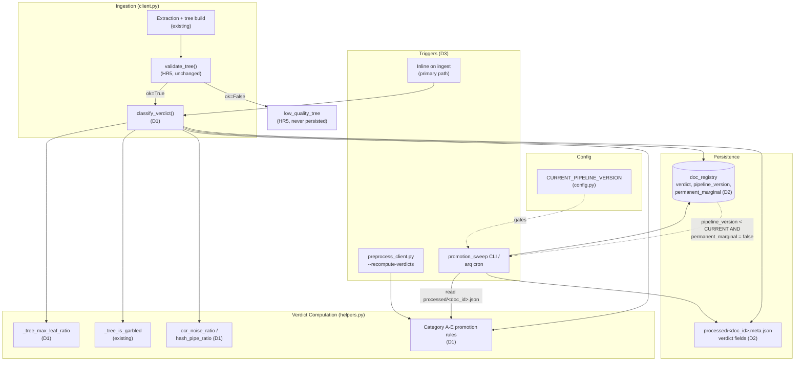
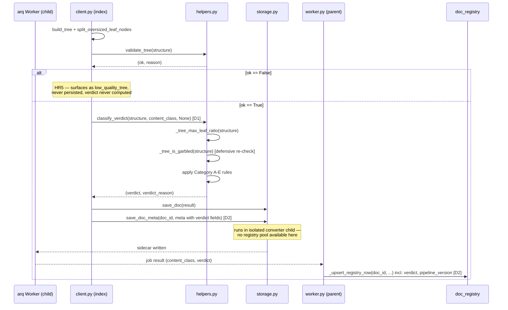
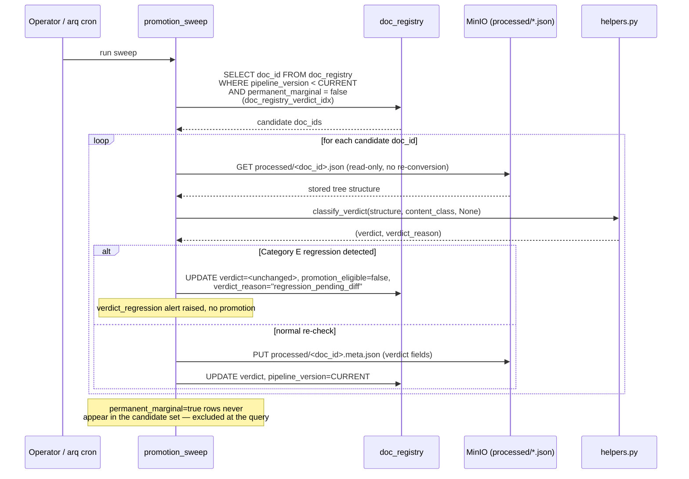
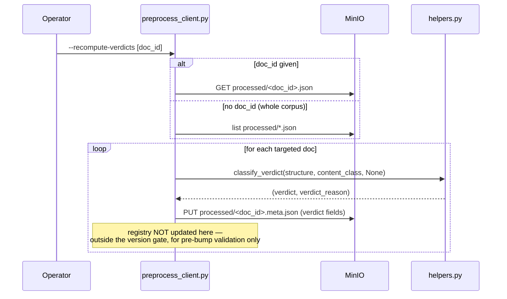
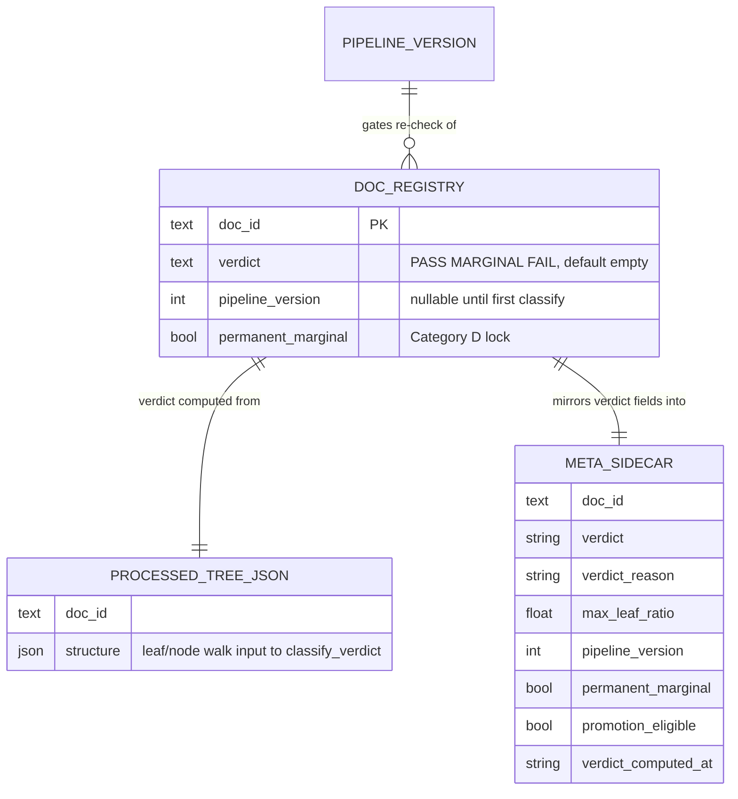

<!-- Space: CITRA -->
<!-- Title: Design: Corpus Document Promotion Pipeline -->
<!-- Folder: Designs -->

# Design Document: Corpus Document Promotion Pipeline

## Traceability

| Artifact | Reference |
|---|---|
| Governing RFC | [RFC-014: Corpus Document Promotion Pipeline](../rfcs/014-corpus-promotion-pipeline.md) |
| PRD / Requirements | `PRD.md` |
| Architecture Doc | `ARCHITECTURE.md` |
| Implementation Plan | [tasks-rfc014-corpus-promotion-pipeline.md](../tasks/tasks-rfc014-corpus-promotion-pipeline.md) |

## Overview

The PASS/MARGINAL/FAIL corpus-verdict taxonomy defined in `audit/SCOPE.md` §5 is currently applied entirely by hand — a human re-reads the corpus after every pipeline fix and writes a new markdown report, and no re-check ever runs automatically when a fix that would flip a MARGINAL document to PASS ships. This design turns that taxonomy into a computed, machine-checkable pipeline output ([RFC-014 D1](../rfcs/014-corpus-promotion-pipeline.md#d1--verdict-as-a-computed-pipeline-output)), persists it alongside every document ([RFC-014 D2](../rfcs/014-corpus-promotion-pipeline.md#d2--persisted-verdict-state)), re-evaluates it exactly once per pipeline-affecting fix via version-gated triggers ([RFC-014 D3](../rfcs/014-corpus-promotion-pipeline.md#d3--triggers-version-gated-idempotent)), and runs the first production sweep against the two known MARGINAL-borderline documents and the one regression-flagged document ([RFC-014 D4](../rfcs/014-corpus-promotion-pipeline.md#d4--first-sweep-promotions-and-the--33-gate)).

## Key Design Principles

1. **HR5 is a floor, not a ceiling**: `validate_tree()` (`node_count<3`, `depth<2`, garbling) remains the sole hard PASS/FAIL persistence gate. The verdict classifier is a strictly separate, softer quality tier layered on top of documents that already cleared `validate_tree()` — it never runs on a document that failed the hard gate, and it can never override a `low_quality_tree` rejection.
2. **Additive, not destructive schema evolution**: every new sidecar field and registry column follows the `node_count` migration precedent (RFC-009) — new fields are omitted when absent so legacy `.meta.json` files stay byte-identical, and registry `ALTER TABLE ... ADD COLUMN IF NOT EXISTS` runs idempotently on every `init_registry()` call.
3. **Deterministic re-check, not continuous re-scoring**: a verdict only changes when either (a) the document is re-ingested, or (b) a version-gated sweep runs after `CURRENT_PIPELINE_VERSION` bumps. There is no polling, no scheduled full re-conversion, and no LLM call in the re-check path — the sweep re-classifies already-stored tree JSON, read-only and cheap.
4. **Regression before promotion**: any document whose stored tree shows a large structural regression (node-count drop >30% and leaf-concentration growth >2x versus its last stored verdict) is blocked from auto-promotion and flagged for human review, even if its raw numbers would otherwise clear the PASS threshold. Category E fires before any category-specific promotion gate is evaluated.
5. **Human-clearable locks, not silent re-entry**: Category D (Docling/source-limited) documents are marked `permanent_marginal` and are excluded from every sweep until a human explicitly clears the flag — the mechanism never re-promotes a document whose underlying extraction limitation hasn't changed.

## Launch Constraints

- The verdict classifier only ever runs after `validate_tree()` returns `ok=True` — see [Property 2](#property-2-hr5-independence). A document that fails `validate_tree()` is never persisted and never reaches `classify_verdict`.
- `CURRENT_PIPELINE_VERSION` (new `config.py` int constant) must be bumped in the same commit as any splitter/garble/OCR fix that could change corpus classification, per [RFC-014 D3](../rfcs/014-corpus-promotion-pipeline.md#d3--triggers-version-gated-idempotent) — this is a process constraint enforced by code review, not by code.
- `ocr_noise_ratio`/`hash_pipe_ratio` (Category A/C sub-metrics) are new, uncalibrated heuristics; their thresholds carry the same "not yet corpus-validated" caveat as [RFC-013 D7](../rfcs/013-structural-hardening.md#d7). Treat the first sweep as a validation run per [RFC-014 Risks](../rfcs/014-corpus-promotion-pipeline.md#risks).
- The 0.17 Category B/C promotion threshold ([RFC-014 D4](../rfcs/014-corpus-promotion-pipeline.md#d4--first-sweep-promotions-and-the--33-gate)) applies only to Category B/C clean-text depth-2 documents; it does not change the 0.15 PASS line used by `classify_verdict` for direct-ingest verdicts.
- مرسوم 33 (`8b05de59`) is not eligible for auto-promotion under any threshold until the node-title diff task (tracked separately, outside this RFC per [RFC-014 What this RFC does NOT cover](../rfcs/014-corpus-promotion-pipeline.md#what-this-rfc-does-not-cover)) resolves whether its 125→58 node drop is TOC-noise filtering or a splitter regression.
- Registry schema migration ([RFC-014 D2](../rfcs/014-corpus-promotion-pipeline.md#d2--persisted-verdict-state)) must be deployed as a standalone, reversible step before any sweep runs — not bundled into the same deploy as the sweep's first run, per [RFC-014 Risks](../rfcs/014-corpus-promotion-pipeline.md#risks).

## Architecture

### High-Level System Architecture



### Architecture Decisions

**Verdict as a computed pipeline output** ([RFC-014 D1](../rfcs/014-corpus-promotion-pipeline.md#d1--verdict-as-a-computed-pipeline-output)): the 15%/75% leaf-concentration thresholds that define PASS/MARGINAL/FAIL in `audit/SCOPE.md` §5 exist today only as hand-computed audit numbers — no code computes them. `classify_verdict` and its supporting `_tree_max_leaf_ratio` helper make this metric a first-class, machine-checkable pipeline output, called immediately after each `validate_tree()` call site in `client.py` and after flat-doc routing. This is the foundational decision; D2-D4 all depend on its return shape. Validates [Property 1](#property-1-verdict-determinism) and [Property 2](#property-2-hr5-independence). Implemented in [Task 1.1](../tasks/tasks-rfc014-corpus-promotion-pipeline.md#11-implement-tree-max-leaf-ratio), [Task 1.2](../tasks/tasks-rfc014-corpus-promotion-pipeline.md#12-implement-classify-verdict), [Task 1.3](../tasks/tasks-rfc014-corpus-promotion-pipeline.md#13-implement-ocr-noise-ratio-and-hash-pipe-ratio).

**Sidecar + registry persistence** ([RFC-014 D2](../rfcs/014-corpus-promotion-pipeline.md#d2--persisted-verdict-state)): rather than storing the verdict only in the tree JSON (which would require full deserialization for any corpus-wide query), the verdict is written to both the lightweight `.meta.json` sidecar (for single-document reads) and a new indexed `doc_registry` column set (for corpus-wide sweep queries). This mirrors the existing `node_count` dual-write precedent exactly — same additive-field pattern, same write path (`save_doc_meta` in the isolated converter child; `_upsert_registry_row` in the long-lived worker parent). Validates [Property 3](#property-3-legacy-sidecar-compatibility). Implemented in [Task 2.1](../tasks/tasks-rfc014-corpus-promotion-pipeline.md#21-extend-meta-fields-and-save-doc-meta), [Task 2.2](../tasks/tasks-rfc014-corpus-promotion-pipeline.md#22-registry-migration).

**Version-gated triggers over continuous polling** ([RFC-014 D3](../rfcs/014-corpus-promotion-pipeline.md#d3--triggers-version-gated-idempotent)): a naive design would re-check every document on a timer. Instead, `CURRENT_PIPELINE_VERSION` is bumped exactly when a corpus-affecting fix ships, and the sweep's indexed query (`pipeline_version < CURRENT AND permanent_marginal = false`) finds only the documents that could plausibly have a stale verdict — a document at the current version is a guaranteed no-op the index skips without deserializing anything. This keeps the sweep read-only, cheap, and idempotent by construction (deterministic extraction yields the same verdict on repeat runs). Validates [Property 4](#property-4-sweep-idempotence) and [Property 7](#property-7-version-gated-recheck). Implemented in [Task 3.1](../tasks/tasks-rfc014-corpus-promotion-pipeline.md#31-wire-classify-verdict-into-ingest-path), [Task 3.2](../tasks/tasks-rfc014-corpus-promotion-pipeline.md#32-implement-promotion-sweep-cli), [Task 3.3](../tasks/tasks-rfc014-corpus-promotion-pipeline.md#33-add-recompute-verdicts-flag-to-preprocess-client).

**Category-specific promotion gates, not one global threshold** ([RFC-014 D1](../rfcs/014-corpus-promotion-pipeline.md#d1--verdict-as-a-computed-pipeline-output), [RFC-014 D4](../rfcs/014-corpus-promotion-pipeline.md#d4--first-sweep-promotions-and-the--33-gate)): OCR-rescued documents, structurally-thin documents, and text-quality-marginal documents fail for different reasons and need different promotion conditions. A single global "MARGINAL→PASS if leaf_ratio<0.15" rule would either be too permissive for OCR-noise cases or too strict for the two known 0.16-0.165 borderline documents. Five categories (A-E) encode this explicitly, with Category D (Docling/source-limited) locked out of auto-promotion entirely and Category E (regression) blocking promotion even when the raw numbers would otherwise pass. Validates [Property 5](#property-5-permanent-marginal-exclusion), [Property 6](#property-6-regression-detection), and [Property 8](#property-8-threshold-promotion). Implemented in [Task 1.2](../tasks/tasks-rfc014-corpus-promotion-pipeline.md#12-implement-classify-verdict), [Task 4.1](../tasks/tasks-rfc014-corpus-promotion-pipeline.md#41-configure-017-threshold), [Task 4.3](../tasks/tasks-rfc014-corpus-promotion-pipeline.md#43-implement-marsoom-33-regression-gate).

### Deployment Architecture

- **Backend**: Python 3.12 + FastMCP + gunicorn/uvicorn workers
- **Database**: Postgres (`doc_registry` table, RFC-006) — new `verdict`, `pipeline_version`, `permanent_marginal` columns + `doc_registry_verdict_idx` composite index ([RFC-014 D2](../rfcs/014-corpus-promotion-pipeline.md#d2--persisted-verdict-state))
- **Object Storage**: MinIO (`processed/*.json` tree artifacts, `processed/*.meta.json` sidecars — both read-only inputs to the verdict classifier)
- **Task Queue**: arq with Redis broker — the sweep may run as either a standalone CLI invocation or an arq cron job per [RFC-014 D3](../rfcs/014-corpus-promotion-pipeline.md#d3--triggers-version-gated-idempotent)
- **Cache / Job Bus**: Redis (unaffected — verdict fields do not flow through `doc_cache`)

### Communication Patterns

| Pattern | Use Case | Technology |
|---------|----------|------------|
| In-process function call | `classify_verdict` invoked after `validate_tree()` in the same ingest call stack | Python (`client.py` → `helpers.py`) |
| Direct object I/O | Sidecar read/write (`processed/<doc_id>.meta.json`) | MinIO (S3-compatible) |
| SQL write / indexed scan | Registry verdict upsert; sweep candidate query | asyncpg → Postgres (`doc_registry`) |
| CLI batch | On-demand recompute (`preprocess_client.py --recompute-verdicts`), version-gated sweep (`promotion_sweep`) | Python CLI |
| Async job queue [OPTIONAL cron mode] | Sweep as a periodic arq job rather than a manual CLI invocation | arq + Redis |

### Sequence Diagrams

#### Ingest Flow (D1, D2, D3)

Validates [Property 1](#property-1-verdict-determinism), [Property 2](#property-2-hr5-independence), [Property 3](#property-3-legacy-sidecar-compatibility). Implemented in [Task 3.1](../tasks/tasks-rfc014-corpus-promotion-pipeline.md#31-wire-classify-verdict-into-ingest-path).



#### Backfill Sweep Flow (D3)

Validates [Property 4](#property-4-sweep-idempotence), [Property 5](#property-5-permanent-marginal-exclusion), [Property 7](#property-7-version-gated-recheck). Implemented in [Task 3.2](../tasks/tasks-rfc014-corpus-promotion-pipeline.md#32-implement-promotion-sweep-cli).



#### On-Demand Recompute Flow (D3)

Validates [Property 1](#property-1-verdict-determinism), [Property 7](#property-7-version-gated-recheck). Implemented in [Task 3.3](../tasks/tasks-rfc014-corpus-promotion-pipeline.md#33-add-recompute-verdicts-flag-to-preprocess-client).



## Service Contracts

### 1. helpers.py

**Responsibility**: Quality gating (`validate_tree`, `_tree_is_garbled`, `_tree_node_count`, `_tree_depth`) and, with this RFC, verdict classification.

**Changes ([RFC-014 D1](../rfcs/014-corpus-promotion-pipeline.md#d1--verdict-as-a-computed-pipeline-output))**:

- New `_tree_max_leaf_ratio(structure) -> tuple[int, int, float]` alongside `_tree_node_count` (line 491). Walks the tree, identifies leaf nodes (`nodes` empty), returns `(max_leaf_chars, total_chars, ratio)`. Validates [Property 1](#property-1-verdict-determinism). Implemented in [Task 1.1](../tasks/tasks-rfc014-corpus-promotion-pipeline.md#11-implement-tree-max-leaf-ratio).
- New `classify_verdict(structure, content_class, validate_reason) -> tuple[str, str]` called immediately after each `validate_tree()` call site (`client.py` lines 450, 490, 544 per [RFC-014 D1](../rfcs/014-corpus-promotion-pipeline.md#d1--verdict-as-a-computed-pipeline-output)) and after flat-doc routing. Applies the numeric verdict rules (`FAIL` if `validate_reason == "garbling"` — defensive only, since a garbling `validate_tree` failure already blocks persistence per HR5 — or `max_leaf_ratio > 0.75`; `PASS` if `node_count >= 3 and depth >= 2 and max_leaf_ratio < 0.15 and not _tree_is_garbled`; `MARGINAL` otherwise), then applies the Category A-E promotion gates from the table in [RFC-014 D1](../rfcs/014-corpus-promotion-pipeline.md#d1--verdict-as-a-computed-pipeline-output). Validates [Property 1](#property-1-verdict-determinism), [Property 2](#property-2-hr5-independence), [Property 6](#property-6-regression-detection). Implemented in [Task 1.2](../tasks/tasks-rfc014-corpus-promotion-pipeline.md#12-implement-classify-verdict).
- New `ocr_noise_ratio` / `hash_pipe_ratio` token-scan helpers, reusing the existing garble-blob text walk (natural extension point once RFC-013 D7's unified `_is_garbled_blob` lands). Feed the Category A and Category C promotion gates. Validates [Property 8](#property-8-threshold-promotion). Implemented in [Task 1.3](../tasks/tasks-rfc014-corpus-promotion-pipeline.md#13-implement-ocr-noise-ratio-and-hash-pipe-ratio).

**Internal Interfaces**:

- `_tree_max_leaf_ratio` called by `classify_verdict` only (new, [D1](../rfcs/014-corpus-promotion-pipeline.md#d1--verdict-as-a-computed-pipeline-output))
- `classify_verdict` called by `client.py` after every `validate_tree()` call site, by `promotion_sweep` (D3), and by `preprocess_client.py --recompute-verdicts` (D3)
- `_tree_is_garbled`, `_tree_node_count`, `_tree_depth` (existing, unchanged) called by both `validate_tree` (HR5 gate) and `classify_verdict` (verdict tier) — `classify_verdict` never calls these before `validate_tree` has already returned `ok=True` for the same structure

### 2. storage.py

**Responsibility**: MinIO read/write for processed tree JSON and `.meta.json` sidecars; erasure cascade.

**Changes ([RFC-014 D2](../rfcs/014-corpus-promotion-pipeline.md#d2--persisted-verdict-state))**:

- Extend `_META_FIELDS` (line 285, currently `("doc_id", "doc_name", "source_url", "processed_at")`) is left unchanged as the base tuple — new verdict fields are added to `save_doc_meta` (line 288) following the same conditional-inclusion pattern the `node_count` field (RFC-009) established: `verdict`, `verdict_reason`, `max_leaf_ratio`, `pipeline_version`, `permanent_marginal`, `promotion_eligible`, `verdict_computed_at` are written to the sidecar only when present in the `meta` dict passed by the caller, so a caller (or legacy code path) that never sets them produces a sidecar byte-identical to today's. Validates [Property 3](#property-3-legacy-sidecar-compatibility). Implemented in [Task 2.1](../tasks/tasks-rfc014-corpus-promotion-pipeline.md#21-extend-meta-fields-and-save-doc-meta).
- No change to `save_doc` (line 79) — verdict fields never enter the full tree JSON, only the lightweight sidecar and the registry, keeping tree deserialization unnecessary for verdict queries.
- No change to the erasure cascade (`storage.py` ERASE steps) — verdict/version fields are corpus-metadata only, carry no PII, and are purged as part of the existing sidecar deletion step (HR2; RFC-011 D2 already covers the one erasure gap found this audit cycle).

**Internal Interfaces**:

- `save_doc_meta` called from the isolated `converters_cli` child subprocess (same as today) — the registry dual-write for verdict fields happens separately, in `worker.py`'s `_upsert_registry_row`, per the same split documented in `save_doc_meta`'s existing docstring
- `read_registry_fields` (line 352) extended to project out the new `verdict`, `pipeline_version`, `permanent_marginal` columns from the just-persisted `.meta.json`/tree doc for the worker-parent dual-write

### 3. config.py

**Responsibility**: env loading and the `Settings` dataclass.

**Changes ([RFC-014 D3](../rfcs/014-corpus-promotion-pipeline.md#d3--triggers-version-gated-idempotent))**:

- New module-level `CURRENT_PIPELINE_VERSION: int` constant (not part of the `Settings` dataclass, since it is a code-level version marker bumped per-commit, not an env-configurable runtime value). Bumped in the same commit as any splitter/garble/OCR fix that could change corpus classification. Validates [Property 7](#property-7-version-gated-recheck). Implemented in [Task 4.1](../tasks/tasks-rfc014-corpus-promotion-pipeline.md#41-configure-017-threshold) (threshold config lives alongside it).
- New Category B/C promotion threshold constant (0.17, per [RFC-014 D4](../rfcs/014-corpus-promotion-pipeline.md#d4--first-sweep-promotions-and-the--33-gate)), declared as a plain constant rather than an env var — consistent with RFC-010's "thresholds are constants, not env vars, to avoid config sprawl" principle. Validates [Property 8](#property-8-threshold-promotion). Implemented in [Task 4.1](../tasks/tasks-rfc014-corpus-promotion-pipeline.md#41-configure-017-threshold).

**Internal Interfaces**:

- `CURRENT_PIPELINE_VERSION` read by `client.py` (ingest path, stamped onto every new verdict) and by `promotion_sweep` (candidate query bound)

### 4. client.py

**Responsibility**: Orchestrates document ingestion — extraction, tree building, quality gating (`validate_tree`), OCR escalation, flat-doc routing, and persistence.

**Changes ([RFC-014 D1](../rfcs/014-corpus-promotion-pipeline.md#d1--verdict-as-a-computed-pipeline-output), [RFC-014 D3](../rfcs/014-corpus-promotion-pipeline.md#d3--triggers-version-gated-idempotent))**:

- Insert `classify_verdict(result["structure"], content_class, reason)` immediately after each of the three existing `validate_tree()` call sites (lines 450, 490, 544) and after flat-doc routing succeeds, but only on the branch where `ok == True` — never on a branch where the document is about to be rejected as `low_quality_tree`. Validates [Property 2](#property-2-hr5-independence). Implemented in [Task 3.1](../tasks/tasks-rfc014-corpus-promotion-pipeline.md#31-wire-classify-verdict-into-ingest-path).
- Pass the computed `(verdict, verdict_reason, max_leaf_ratio, CURRENT_PIPELINE_VERSION, verdict_computed_at)` tuple into the `meta` dict handed to `save_doc_meta`, alongside the existing `doc_id`/`doc_name`/`source_url`/`processed_at`/`content_class`/`node_count` fields. Implemented in [Task 3.1](../tasks/tasks-rfc014-corpus-promotion-pipeline.md#31-wire-classify-verdict-into-ingest-path).

**Internal Interfaces**:

- Calls `helpers.py` `validate_tree()` for the hard HR5 gate (unchanged)
- Calls `helpers.py` `classify_verdict()` (new, [D1](../rfcs/014-corpus-promotion-pipeline.md#d1--verdict-as-a-computed-pipeline-output)) only after `validate_tree()` returns `ok=True`
- Calls `storage.py` `save_doc()` / `save_doc_meta()` with verdict fields included in the meta payload

### 5. worker.py

**Responsibility**: arq job lifecycle — spawns the isolated converter child, handles job status transitions, and performs the RFC-006 Postgres registry dual-write (`_upsert_registry_row`, line 483) in the long-lived parent process (the only process holding a registry pool).

**Changes ([RFC-014 D2](../rfcs/014-corpus-promotion-pipeline.md#d2--persisted-verdict-state))**:

- Extend `_upsert_registry_row` (line 483) to read the new verdict fields via `storage.read_registry_fields` and pass them through to `registry.upsert_doc`, alongside the existing `content_class`/`node_count` fields. Best-effort, same as today — a verdict dual-write failure logs a warning and never fails the job; the MinIO sidecar remains the source of truth. Validates [Property 3](#property-3-legacy-sidecar-compatibility). Implemented in [Task 2.2](../tasks/tasks-rfc014-corpus-promotion-pipeline.md#22-registry-migration).
- No change to `reap_stale_jobs` or the DLQ path — verdict computation happens entirely within the successful-completion branch, before `_upsert_registry_row` is called at line 389.

**Internal Interfaces**:

- Calls `storage.py` `read_registry_fields()` for the just-persisted doc's registry-relevant fields including verdict
- Calls `registry.py` `upsert_doc()` with the extended field set

### 6. preprocess_client.py

**Responsibility**: batch-preprocess local `doc_store/` documents with hash-based change detection; primary corpus-population and re-run tool.

**Changes ([RFC-014 D3](../rfcs/014-corpus-promotion-pipeline.md#d3--triggers-version-gated-idempotent))**:

- New `--recompute-verdicts [<doc_id>]` flag. When given a `doc_id`, targets one document; when omitted, targets the whole corpus. Reads the already-stored `processed/<doc_id>.json`, calls `classify_verdict`, writes the updated sidecar via `save_doc_meta` — no re-conversion, no OCR, no LLM call. Deliberately does **not** write to the registry or bump the stored `pipeline_version`; this is the pre-bump validation tool an operator uses to check a fix's effect before committing to `CURRENT_PIPELINE_VERSION += 1` corpus-wide, distinct from the version-gated sweep. Validates [Property 7](#property-7-version-gated-recheck). Implemented in [Task 3.3](../tasks/tasks-rfc014-corpus-promotion-pipeline.md#33-add-recompute-verdicts-flag-to-preprocess-client).
- New standalone `promotion_sweep` CLI entry point (may share `preprocess_client.py`'s module or live alongside it — implementation detail left to [Task 3.2](../tasks/tasks-rfc014-corpus-promotion-pipeline.md#32-implement-promotion-sweep-cli)). Queries `doc_registry` for `pipeline_version < CURRENT_PIPELINE_VERSION AND permanent_marginal = false` via the `doc_registry_verdict_idx` index, re-runs `classify_verdict` against each candidate's stored tree JSON, and writes both sidecar and registry updates. Validates [Property 4](#property-4-sweep-idempotence), [Property 5](#property-5-permanent-marginal-exclusion). Implemented in [Task 3.2](../tasks/tasks-rfc014-corpus-promotion-pipeline.md#32-implement-promotion-sweep-cli).

**Internal Interfaces**:

- Calls `storage.py` for MinIO reads of `processed/<doc_id>.json` and writes to `processed/<doc_id>.meta.json`
- Calls `helpers.py` `classify_verdict()` (new, [D1](../rfcs/014-corpus-promotion-pipeline.md#d1--verdict-as-a-computed-pipeline-output))
- `promotion_sweep` additionally reads/writes `doc_registry` directly via `registry.py` (not routed through `worker.py`, since it runs outside the arq job lifecycle)

## Data Models

### Entity Relationship Diagram



### Verdict State (Sidecar — `.meta.json`)

```python
# storage.py -- extension to the sidecar written by save_doc_meta (D2)
class VerdictSidecarFields:
    verdict: str               # "PASS" | "MARGINAL" | "FAIL" -- omitted if caller never sets it
    verdict_reason: str        # e.g. "leaf_concentration=0.16"
    max_leaf_ratio: float      # from _tree_max_leaf_ratio
    pipeline_version: int      # CURRENT_PIPELINE_VERSION at classification time
    permanent_marginal: bool   # Category D lock -- human-clearable only
    promotion_eligible: bool   # derived: true only if a re-check could flip verdict
    verdict_computed_at: str   # ISO-8601
```

### Verdict State (Registry — `doc_registry`)

```python
# registry.py -- extension to the doc_registry table (D2), mirroring the
# existing _MIGRATE_NODE_COUNT_SQL additive-column pattern (line 95)
class DocRegistryVerdictColumns:
    verdict: str              # NOT NULL DEFAULT '' -- '' for pre-migration rows
    pipeline_version: int     # nullable -- NULL until first classify_verdict run
    permanent_marginal: bool  # NOT NULL DEFAULT false

# New index: doc_registry_verdict_idx ON doc_registry (verdict, pipeline_version)
# Lets promotion_sweep find "all MARGINAL where pipeline_version < CURRENT" in one
# indexed scan with no tree deserialization, mirroring doc_registry_processed_at_idx.
```

### Category Promotion Rules (D1/D4)

| Category | Promotion condition | Else | First-sweep outcome |
|---|---|---|---|
| A — OCR-rescued | `max_leaf_ratio < 0.15` AND `ocr_noise_ratio < 0.005` | stays MARGINAL | — |
| B — structural | `max_leaf_ratio < 0.15` AND `node_count >= 3` (0.17 for borderline per [D4](../rfcs/014-corpus-promotion-pipeline.md#d4--first-sweep-promotions-and-the--33-gate)) | stays MARGINAL, `marginal_reason="leaf_concentration"` | Haftpflicht-Besondere (`906392fb`) → PASS |
| C — text-quality | `not _tree_is_garbled` AND `hash_pipe_ratio < 0.01` AND `max_leaf_ratio < 0.15` (0.17 for borderline) | stays MARGINAL | سياسة حوكمة (`efd65b00`) → PASS |
| D — Docling/source-limited | never auto-promotes | `permanent_marginal=true`, human-clearable only | 3 documents locked |
| E — regression | never auto-promotes while `node_count` drop >30% AND `max_leaf_ratio` growth >2x vs. last stored verdict | `verdict_regression` alert, `promotion_eligible=false` | مرسوم 33 (`8b05de59`) → blocked, `verdict_reason="regression_pending_diff"` |

## Correctness Properties

*A property is a characteristic or behavior that should hold true across all valid executions of the system — a formal statement about what the system should do. Properties serve as the bridge between human-readable specifications and machine-verifiable correctness guarantees.*

### Property 1: Verdict determinism

*For any* tree structure that has already passed `validate_tree()`, system SHALL compute the same `(verdict, verdict_reason)` pair from `classify_verdict` on every invocation, given the same structure, `content_class`, and threshold constants — regardless of whether the call originates from the inline ingest path, the backfill sweep, or the on-demand recompute CLI.

**Validates**: [RFC-014 D1](../rfcs/014-corpus-promotion-pipeline.md#d1--verdict-as-a-computed-pipeline-output). **Tested in**: [Task 1.4](../tasks/tasks-rfc014-corpus-promotion-pipeline.md#14-write-d1-unit-tests). **Service contract**: [helpers.py](#1-helperspy). **Sequence diagram**: [Ingest Flow](#ingest-flow-d1-d2-d3), [On-Demand Recompute Flow](#on-demand-recompute-flow-d3).

### Property 2: HR5 independence

*For any* document, system SHALL call `classify_verdict` if and only if `validate_tree()` has already returned `ok=True` for that document's structure — a document that fails `validate_tree()` (garbling, `node_count<3`, `depth<2`) SHALL surface as `low_quality_tree` and SHALL NOT reach verdict classification, and no verdict computation SHALL ever change the outcome of a `validate_tree()` call.

**Validates**: [RFC-014 D1](../rfcs/014-corpus-promotion-pipeline.md#d1--verdict-as-a-computed-pipeline-output), [RFC-014 HR5 constraint](../rfcs/014-corpus-promotion-pipeline.md#hard-rule-constraints-claudemd--binding). **Tested in**: [Task 1.4](../tasks/tasks-rfc014-corpus-promotion-pipeline.md#14-write-d1-unit-tests). **Service contract**: [client.py](#4-clientpy), [helpers.py](#1-helperspy). **Sequence diagram**: [Ingest Flow](#ingest-flow-d1-d2-d3).

### Property 3: Legacy sidecar compatibility

*For any* `.meta.json` sidecar written before this RFC's fields existed, system SHALL load it without error, and any code path reading a missing verdict field SHALL treat it as absent (not as a parse failure); *for any* pre-migration `doc_registry` row, system SHALL default `verdict=''`, `pipeline_version=NULL`, `permanent_marginal=false` rather than failing the migration.

**Validates**: [RFC-014 D2](../rfcs/014-corpus-promotion-pipeline.md#d2--persisted-verdict-state). **Tested in**: [Task 2.3](../tasks/tasks-rfc014-corpus-promotion-pipeline.md#23-write-d2-tests). **Service contract**: [storage.py](#2-storagepy), [worker.py](#5-workerpy). **Sequence diagram**: [Ingest Flow](#ingest-flow-d1-d2-d3).

### Property 4: Sweep idempotence

*For any* backfill sweep run twice in succession with no intervening `CURRENT_PIPELINE_VERSION` bump or corpus change, system SHALL produce identical verdicts on both runs, and the second run SHALL find zero candidate rows (since the first run already advanced every eligible row's `pipeline_version` to `CURRENT`).

**Validates**: [RFC-014 D3](../rfcs/014-corpus-promotion-pipeline.md#d3--triggers-version-gated-idempotent). **Tested in**: [Task 3.4](../tasks/tasks-rfc014-corpus-promotion-pipeline.md#34-write-d3-tests). **Service contract**: [preprocess_client.py](#6-preprocess-clientpy). **Sequence diagram**: [Backfill Sweep Flow](#backfill-sweep-flow-d3).

### Property 5: Permanent-marginal exclusion

*For any* `doc_registry` row with `permanent_marginal=true`, system SHALL exclude it from every sweep's candidate query regardless of its `pipeline_version`, and SHALL only clear the flag via explicit human action outside the automated sweep path.

**Validates**: [RFC-014 D1](../rfcs/014-corpus-promotion-pipeline.md#d1--verdict-as-a-computed-pipeline-output) (Category D), [RFC-014 D3](../rfcs/014-corpus-promotion-pipeline.md#d3--triggers-version-gated-idempotent), [RFC-014 What this RFC does NOT cover](../rfcs/014-corpus-promotion-pipeline.md#what-this-rfc-does-not-cover). **Tested in**: [Task 3.4](../tasks/tasks-rfc014-corpus-promotion-pipeline.md#34-write-d3-tests). **Service contract**: [preprocess_client.py](#6-preprocess-clientpy). **Sequence diagram**: [Backfill Sweep Flow](#backfill-sweep-flow-d3).

### Property 6: Regression detection

*For any* document whose newly-computed `node_count` is more than 30% lower than its last stored verdict's `node_count`, AND whose newly-computed `max_leaf_ratio` is more than 2x its last stored verdict's `max_leaf_ratio`, system SHALL set `promotion_eligible=false` and `verdict_reason="regression_pending_diff"` (or equivalent Category E marker) regardless of whether the raw PASS thresholds would otherwise be met, and SHALL raise a `verdict_regression` alert.

**Validates**: [RFC-014 D1](../rfcs/014-corpus-promotion-pipeline.md#d1--verdict-as-a-computed-pipeline-output) (Category E), [RFC-014 D4](../rfcs/014-corpus-promotion-pipeline.md#d4--first-sweep-promotions-and-the--33-gate) (مرسوم 33 gate). **Tested in**: [Task 4.4](../tasks/tasks-rfc014-corpus-promotion-pipeline.md#44-write-d4-golden-file-tests). **Service contract**: [helpers.py](#1-helperspy). **Sequence diagram**: [Backfill Sweep Flow](#backfill-sweep-flow-d3).

### Property 7: Version-gated re-check

*For any* document with a stored `pipeline_version` less than `CURRENT_PIPELINE_VERSION`, system SHALL re-classify it exactly once on the next sweep run; *for any* document already at `pipeline_version == CURRENT_PIPELINE_VERSION`, system SHALL NOT re-classify it in any sweep run (no churn on an already-current document).

**Validates**: [RFC-014 D3](../rfcs/014-corpus-promotion-pipeline.md#d3--triggers-version-gated-idempotent). **Tested in**: [Task 3.4](../tasks/tasks-rfc014-corpus-promotion-pipeline.md#34-write-d3-tests). **Service contract**: [config.py](#3-configpy), [preprocess_client.py](#6-preprocess-clientpy). **Sequence diagram**: [Backfill Sweep Flow](#backfill-sweep-flow-d3).

### Property 8: Threshold promotion

*For any* Category B or Category C document with `max_leaf_ratio` in `[0.15, 0.17)`, `node_count >= 3`, `depth >= 2`, and not garbled, system SHALL classify it PASS under the documented 0.17 promotion threshold rather than requiring a manual verdict override; *for any* such document with `max_leaf_ratio >= 0.17`, system SHALL classify it MARGINAL.

**Validates**: [RFC-014 D4](../rfcs/014-corpus-promotion-pipeline.md#d4--first-sweep-promotions-and-the--33-gate). **Tested in**: [Task 4.4](../tasks/tasks-rfc014-corpus-promotion-pipeline.md#44-write-d4-golden-file-tests). **Service contract**: [config.py](#3-configpy), [helpers.py](#1-helperspy). **Sequence diagram**: [Backfill Sweep Flow](#backfill-sweep-flow-d3).

## Error Handling

### Global Error Codes

| Category | Response | Retry Strategy | RFC Decision | Property |
|----------|----------|----------------|---------------|----------|
| Registry pool not ready during verdict dual-write | Skip dual-write, log at debug/warning level, never fail the job | Next sweep run picks it up once `pipeline_version` is stale | [D2](../rfcs/014-corpus-promotion-pipeline.md#d2--persisted-verdict-state), [D3](../rfcs/014-corpus-promotion-pipeline.md#d3--triggers-version-gated-idempotent) | [P3](#property-3-legacy-sidecar-compatibility) |
| Sweep encounters a `processed/<doc_id>.json` that fails to deserialize | Skip that doc_id, log error, continue sweep | Manual investigation; sweep does not abort corpus-wide | [D3](../rfcs/014-corpus-promotion-pipeline.md#d3--triggers-version-gated-idempotent) | [P4](#property-4-sweep-idempotence) |
| `classify_verdict` called on a structure that never passed `validate_tree()` | Programming error — this path must not exist; caught by [Property 2](#property-2-hr5-independence) tests, not a runtime error contract | N/A | [D1](../rfcs/014-corpus-promotion-pipeline.md#d1--verdict-as-a-computed-pipeline-output) | [P2](#property-2-hr5-independence) |
| Category E regression false positive (legitimate splitter improvement misread as regression) | `promotion_eligible=false` held until human clears via the node-title diff | Human review, not automatic retry | [D1](../rfcs/014-corpus-promotion-pipeline.md#d1--verdict-as-a-computed-pipeline-output), [D4](../rfcs/014-corpus-promotion-pipeline.md#d4--first-sweep-promotions-and-the--33-gate) | [P6](#property-6-regression-detection) |
| Registry migration fails mid-deploy (`ALTER TABLE` error) | `init_registry()` raises; server does not start with a half-migrated schema | Fix and redeploy; migration is idempotent (`IF NOT EXISTS`) so a retry is safe | [D2](../rfcs/014-corpus-promotion-pipeline.md#d2--persisted-verdict-state) | [P3](#property-3-legacy-sidecar-compatibility) |

### Service-Specific Error Handling

**[helpers.py](#1-helperspy) ([D1](../rfcs/014-corpus-promotion-pipeline.md#d1--verdict-as-a-computed-pipeline-output))**:

- `_tree_max_leaf_ratio` called on an empty structure (`node_count == 0`, which can only occur if `validate_tree()` bypassed — see [Property 2](#property-2-hr5-independence)) → returns `(0, 0, 0.0)` defensively rather than raising a division-by-zero, since `validate_tree()` already guarantees `node_count >= 3` upstream.
- `ocr_noise_ratio`/`hash_pipe_ratio` false positives (new, uncalibrated heuristics) → documents stay MARGINAL rather than being wrongly promoted; false positives here are a promotion-blocking risk, not a data-corruption risk, per [RFC-014 Risks](../rfcs/014-corpus-promotion-pipeline.md#risks).

**[storage.py](#2-storagepy) ([D2](../rfcs/014-corpus-promotion-pipeline.md#d2--persisted-verdict-state))**:

- `save_doc_meta` receives a `meta` dict missing verdict fields (e.g. called from a code path predating this RFC) → sidecar is written exactly as before, verdict fields simply omitted; no exception. Validated by the conditional-inclusion pattern already used for `content_class`/`node_count`.

**[worker.py](#5-workerpy) ([D2](../rfcs/014-corpus-promotion-pipeline.md#d2--persisted-verdict-state))**:

- `_upsert_registry_row` verdict dual-write fails (Postgres unavailable, network error) → best-effort, catches `Exception`, logs a warning, never fails the arq job. MinIO sidecar remains authoritative; the next sweep run (once `pipeline_version` is behind) will re-derive and re-write the registry row.

**[preprocess_client.py](#6-preprocess-clientpy) ([D3](../rfcs/014-corpus-promotion-pipeline.md#d3--triggers-version-gated-idempotent))**:

- `promotion_sweep` hits a MinIO read error for one candidate doc_id → logs and continues to the next candidate; does not abort the whole sweep (a single missing/corrupted artifact must not block re-checking the rest of the version-stale corpus).
- `--recompute-verdicts <doc_id>` given a `doc_id` with no stored `processed/<doc_id>.json` → clear error message, non-zero exit, no partial write.

## Testing Strategy

Testing follows the [RFC-014 Test Strategy](../rfcs/014-corpus-promotion-pipeline.md#test-strategy) and validates all 8 [correctness properties](#correctness-properties).

### Testing Layers

1. **Unit Tests**: Parametrized tests for `_tree_max_leaf_ratio` at 5%/16%/76% concentration and `classify_verdict` across all 5 category rules including the Category E regression trigger. Each property has at least one dedicated unit test task.
2. **Integration Tests**: Sidecar round-trip (legacy `.meta.json` load), registry migration (default-value backfill), and sweep end-to-end (seeded stale row → sweep → updated verdict/version, `permanent_marginal` row skipped).
3. **Golden-File / Regression Tests**: Stored سياسة حوكمة and Haftpflicht-Besondere trees confirm the 0.17 threshold flips both to PASS; stored مرسوم 33 pre/post-RFC-010 trees confirm the Category E rule fires and blocks promotion.

### Test Categories by Service

| Service | Properties | Unit Tests (task) | Integration/Golden Tests |
|---------|------------|-------------------|---------------------------|
| [helpers.py](#1-helperspy) | [P1](#property-1-verdict-determinism), [P2](#property-2-hr5-independence), [P6](#property-6-regression-detection), [P8](#property-8-threshold-promotion) | `_tree_max_leaf_ratio` + `classify_verdict` parametrized tests ([Task 1.4](../tasks/tasks-rfc014-corpus-promotion-pipeline.md#14-write-d1-unit-tests)) | Category E golden-file regression test on مرسوم 33 trees ([Task 4.4](../tasks/tasks-rfc014-corpus-promotion-pipeline.md#44-write-d4-golden-file-tests)) |
| [storage.py](#2-storagepy) | [P3](#property-3-legacy-sidecar-compatibility) | Sidecar conditional-field tests ([Task 2.3](../tasks/tasks-rfc014-corpus-promotion-pipeline.md#23-write-d2-tests)) | Legacy sidecar round-trip load test ([Task 2.3](../tasks/tasks-rfc014-corpus-promotion-pipeline.md#23-write-d2-tests)) |
| [worker.py](#5-workerpy) | [P3](#property-3-legacy-sidecar-compatibility) | — | Registry migration default-value test ([Task 2.3](../tasks/tasks-rfc014-corpus-promotion-pipeline.md#23-write-d2-tests)) |
| [preprocess_client.py](#6-preprocess-clientpy) | [P4](#property-4-sweep-idempotence), [P5](#property-5-permanent-marginal-exclusion), [P7](#property-7-version-gated-recheck) | Sweep candidate-query and idempotence tests ([Task 3.4](../tasks/tasks-rfc014-corpus-promotion-pipeline.md#34-write-d3-tests)) | Seeded stale-row sweep integration test ([Task 3.4](../tasks/tasks-rfc014-corpus-promotion-pipeline.md#34-write-d3-tests)) |
| [config.py](#3-configpy) | [P7](#property-7-version-gated-recheck), [P8](#property-8-threshold-promotion) | Threshold constant test ([Task 4.1](../tasks/tasks-rfc014-corpus-promotion-pipeline.md#41-configure-017-threshold)) | — |

### Key Test Scenarios

**Critical Path Tests:**

1. Synthetic tree at 16% leaf concentration, `node_count=18`, `depth=2`, clean text → `classify_verdict` returns `("MARGINAL", "leaf_concentration=0.16")` under the 0.15 base rule, then `("PASS", ...)` once the 0.17 Category-C gate is applied *(validates [P1](#property-1-verdict-determinism), [P8](#property-8-threshold-promotion))*
2. Document that fails `validate_tree()` with `reason="node_count<3"` → `classify_verdict` is never called; `low_quality_tree` surfaces exactly as before *(validates [P2](#property-2-hr5-independence))*
3. Legacy `.meta.json` (no verdict fields) loaded by any reader → loads successfully, verdict-dependent fields read as absent, not as a parse error *(validates [P3](#property-3-legacy-sidecar-compatibility))*
4. Seed a `doc_registry` row with `pipeline_version=CURRENT-1`, run `promotion_sweep` twice → first run updates verdict + bumps `pipeline_version=CURRENT`; second run finds zero candidates *(validates [P4](#property-4-sweep-idempotence), [P7](#property-7-version-gated-recheck))*
5. Seed a row with `permanent_marginal=true` and `pipeline_version=CURRENT-1` → sweep's candidate query excludes it entirely *(validates [P5](#property-5-permanent-marginal-exclusion))*
6. Stored مرسوم 33 pre/post-RFC-010 trees (`node_count` 125→58, `max_leaf_ratio` 5.3%→26.7%) fed to the Category E check → `promotion_eligible=false`, `verdict_reason="regression_pending_diff"` *(validates [P6](#property-6-regression-detection))*
7. Stored سياسة حوكمة tree (`max_leaf_ratio=0.165`, 18 nodes, depth 2, not garbled) → PASS under the 0.17 threshold *(validates [P8](#property-8-threshold-promotion))*
8. Stored Haftpflicht-Besondere tree (`max_leaf_ratio=0.16`, 33 nodes, depth 2) → PASS under the 0.17 threshold, pinned to the stored run's ratio rather than a fresh non-deterministic re-extraction *(validates [P8](#property-8-threshold-promotion))*

**Edge Cases:**

- `max_leaf_ratio` exactly at `0.15` → boundary is exclusive (`< 0.15` required for base PASS), so `0.15` itself stays MARGINAL *(validates [P1](#property-1-verdict-determinism))*
- `max_leaf_ratio` exactly at `0.75` → boundary is exclusive on the FAIL side (`> 0.75` required), so `0.75` itself is not force-FAILed by this rule alone *(validates [P1](#property-1-verdict-determinism))*
- Category D document (e.g. GHV-TKV-Tarif) with numbers that would otherwise clear the PASS threshold → still excluded, since `permanent_marginal=true` is a category lock, not a threshold check *(validates [P5](#property-5-permanent-marginal-exclusion))*
- Sweep run when `doc_registry` has zero stale rows (fresh corpus, all at `CURRENT`) → no-op, zero writes *(validates [P4](#property-4-sweep-idempotence), [P7](#property-7-version-gated-recheck))*
- `preprocess_client.py --recompute-verdicts` on a single `doc_id` outside the version gate → sidecar updates, registry `pipeline_version` untouched (distinct from the sweep's behavior) *(validates [P7](#property-7-version-gated-recheck))*
- Node-count drop of exactly 30% with leaf-ratio growth of exactly 2x → boundary inclusivity must be pinned by the implementation and covered by a dedicated boundary test, since the RFC states ">30%"/">2x" as strict inequalities *(validates [P6](#property-6-regression-detection))*
