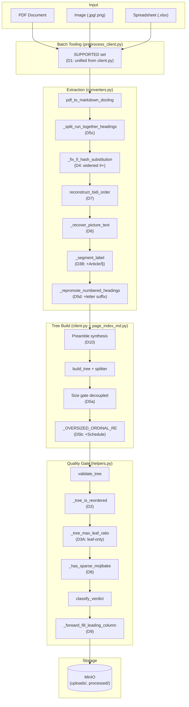
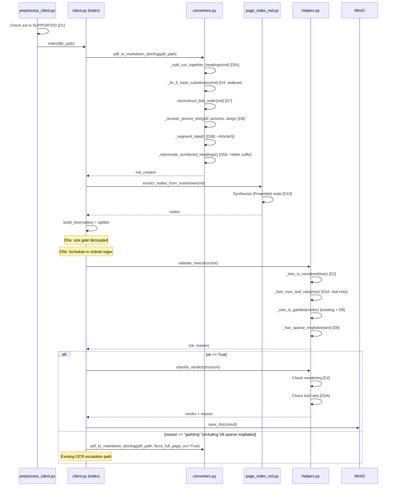
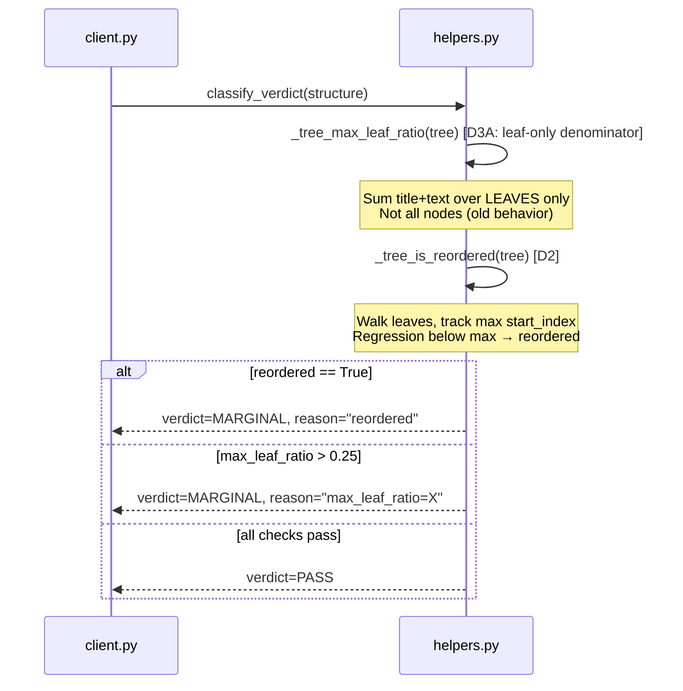

<!-- Space: CITRA -->
<!-- Title: Design: Corpus Audit Remediation — Verdict Engine & Extraction Gaps -->
<!-- Folder: Designs -->

# Design Document: Corpus Audit Remediation — Verdict Engine & Extraction Gaps

## Traceability

| Artifact | Reference |
|---|---|
| Governing RFC | [RFC-015: Corpus Audit Remediation — Verdict Engine & Extraction Gaps](../rfcs/015-corpus-audit-remediation.md#decision) |
| PRD / Requirements | [PRD.md](../PRD.md#functional-requirements) |
| Architecture Doc | [ARCHITECTURE.md](../ARCHITECTURE.md#tree-quality-gate) |
| Implementation Plan | [tasks-rfc015-corpus-audit-remediation.md](../tasks/tasks-rfc015-corpus-audit-remediation.md#tasks) |

## Overview

A 26-file corpus audit (2026-07-17) independently re-derived every stored verdict from persisted MinIO artifacts and found 2 stored PASS verdicts confirmed wrong — a direct violation of [CLAUDE.md HR5](../rfcs/015-corpus-audit-remediation.md#hard-rule-constraints-claudemd--binding) (never silently persist a low-quality tree). Beyond verdict engine correctness, the audit catalogued 8 extraction and normalization gaps spanning marker leakage, tail-blob sub-causes, chart text loss, BiDi scrambling, sparse mojibake, table-parser edge cases, and preamble content loss. This design addresses all 10 decisions ([D1](../rfcs/015-corpus-audit-remediation.md#d1--batch-tooling-unify-supported-set-p0-5-lines)–[D10](../rfcs/015-corpus-audit-remediation.md#d10--preamble-node-synthesis-p1-15-lines)) totalling ~270 lines of code changes plus one new dependency (`python-bidi`, MIT), targeting wrong-PASS count 2→0 and MARGINAL count 12→≤6.

## Key Design Principles

1. **Tighten, never loosen**: [D2](../rfcs/015-corpus-audit-remediation.md#d2--verdict-engine-content-ordering-check-p0-25-lines) and [D3](../rfcs/015-corpus-audit-remediation.md#d3--verdict-engine-ratio-denominator-fix--english-heading-labels-p0-30-lines) add new checks to `validate_tree` and `classify_verdict`. No existing check is removed or weakened. The gate strictly tightens per [HR5](../rfcs/015-corpus-audit-remediation.md#hard-rule-constraints-claudemd--binding).
2. **Additive sub-fixes over monolithic rewrites**: [D5](../rfcs/015-corpus-audit-remediation.md#d5--giant-tail-blob-four-additive-sub-fixes-p1-60-lines-total)'s four sub-causes each get an independent, narrowly-scoped fix. Each can be implemented, tested, and reverted independently.
3. **Language-gated processing**: [D4](../rfcs/015-corpus-audit-remediation.md#d4--marker-leakage-widen-hash-sentinel-regex-p1-15-lines), [D7](../rfcs/015-corpus-audit-remediation.md#d7--bidi-word-order-normalization-p1-25-lines--dependency), and [D8](../rfcs/015-corpus-audit-remediation.md#d8--sparse-mixed-script-garble-detection-p1-20-lines) are gated on Arabic-ratio thresholds. German/English documents are never modified by Arabic-specific normalization paths.
4. **Reuse existing escalation paths**: [D6](../rfcs/015-corpus-audit-remediation.md#d6--chartinfographic-text-recovery-via-per-picture-ocr-p1-40-lines) and [D8](../rfcs/015-corpus-audit-remediation.md#d8--sparse-mixed-script-garble-detection-p1-20-lines) wire into the existing OCR-escalation infrastructure (RFC-005 Fix-3, RFC-010 D3). No new escalation mechanism is introduced.
5. **Kill-switch coverage**: Per-picture OCR ([D6](../rfcs/015-corpus-audit-remediation.md#d6--chartinfographic-text-recovery-via-per-picture-ocr-p1-40-lines)) respects the existing `_OCR_ESCALATION` kill-switch. No new env vars are introduced.
6. **Column-scoped table fixes**: [D9](../rfcs/015-corpus-audit-remediation.md#d9--table-rowspan-forward-fill-p1-15-lines) forward-fill is strictly column 0 only — data columns are never modified.

## Launch Constraints

- [D6](../rfcs/015-corpus-audit-remediation.md#d6--chartinfographic-text-recovery-via-per-picture-ocr-p1-40-lines) uses `fitz` (PyMuPDF/AGPL) for bbox cropping — extends existing AGPL surface, not a new introduction per [HR4](../rfcs/015-corpus-audit-remediation.md#hard-rule-constraints-claudemd--binding).
- [D7](../rfcs/015-corpus-audit-remediation.md#d7--bidi-word-order-normalization-p1-25-lines--dependency) requires `python-bidi` added to `pyproject.toml` before implementation. Pure Python, MIT, no C extension.
- [D4](../rfcs/015-corpus-audit-remediation.md#d4--marker-leakage-widen-hash-sentinel-regex-p1-15-lines) supersedes RFC-010 D5's interim `_INLINE_HASH_RE` — the old regex is replaced, not extended alongside.
- [D3A](../rfcs/015-corpus-audit-remediation.md#d3--verdict-engine-ratio-denominator-fix--english-heading-labels-p0-30-lines) ratio denominator change shifts all existing verdicts. Full corpus reprocess (Batch 4) required to update stored artifacts.
- All OCR escalation paths respect `OPENAI_BASE_URL` routing per [HR3](../rfcs/015-corpus-audit-remediation.md#hard-rule-constraints-claudemd--binding).

## Architecture

### High-Level System Architecture



### Architecture Decisions

**Unify batch SUPPORTED set** ([RFC-015 D1](../rfcs/015-corpus-audit-remediation.md#d1--batch-tooling-unify-supported-set-p0-5-lines)): Import `_SUPPORTED` from `client.py` rather than maintaining a duplicate set in `preprocess_client.py`. The alternative — keeping both sets in sync manually — caused the silent `.jpg`/`.xlsx` exclusion that triggered this fix. Validates [Property 1](#property-1-batch-supported-set-completeness). Implemented in [Task 1.1](../tasks/tasks-rfc015-corpus-audit-remediation.md#11-unify-batch-supported-set-d1).

**Content-ordering check** ([RFC-015 D2](../rfcs/015-corpus-audit-remediation.md#d2--verdict-engine-content-ordering-check-p0-25-lines)): Add `_tree_is_reordered()` using `start_index`/`line_num` regression detection. The alternative — checking logical reference order — would false-positive on annexes that reference earlier articles. Using source-document position avoids this. Validates [Property 2](#property-2-content-ordering-rejection). Implemented in [Task 1.2](../tasks/tasks-rfc015-corpus-audit-remediation.md#12-add-tree-reordering-check-d2).

**Leaf-only ratio denominator** ([RFC-015 D3A](../rfcs/015-corpus-audit-remediation.md#d3--verdict-engine-ratio-denominator-fix--english-heading-labels-p0-30-lines)): Restrict `_tree_max_leaf_ratio` to leaf nodes only. The alternative — keeping the total-node denominator and adjusting the threshold — would mask the root cause (non-leaf wrapper inflation) rather than fixing it. Validates [Property 3](#property-3-leaf-ratio-accuracy). Implemented in [Task 1.3](../tasks/tasks-rfc015-corpus-audit-remediation.md#13-fix-leaf-ratio-denominator-d3a).

**English heading labels** ([RFC-015 D3B](../rfcs/015-corpus-audit-remediation.md#d3--verdict-engine-ratio-denominator-fix--english-heading-labels-p0-30-lines)): Add `Article N` / `§ N` patterns to `_segment_label`. The alternative — a general-purpose regex matching any capitalized word followed by a number — would be too broad and cause false positives on body text. Validates [Property 4](#property-4-english-heading-depth-assignment). Implemented in [Task 1.4](../tasks/tasks-rfc015-corpus-audit-remediation.md#14-add-english-article-heading-labels-d3b).

**Widened hash-sentinel regex** ([RFC-015 D4](../rfcs/015-corpus-audit-remediation.md#d4--marker-leakage-widen-hash-sentinel-regex-p1-15-lines)): Replace RFC-010 D5's per-char `(?<=\S)#(?=\S)` with whole-run `#+` consumption. The alternative — keeping the per-char regex and adding boundary handling — would be more complex for the same result. Line-by-line heading preservation is simpler and more robust. Validates [Property 5](#property-5-marker-leakage-elimination). Implemented in [Task 2.1](../tasks/tasks-rfc015-corpus-audit-remediation.md#21-widen-hash-sentinel-regex-d4).

**Four additive tail-blob sub-fixes** ([RFC-015 D5](../rfcs/015-corpus-audit-remediation.md#d5--giant-tail-blob-four-additive-sub-fixes-p1-60-lines-total)): Each sub-cause gets its own fix rather than a single splitter rewrite. The alternative — redesigning the splitter from scratch — would risk regressions on the 62 files already validated by RFC-005. Validates [Property 6](#property-6-heading-boundary-recognition). Implemented in [Tasks 2.2](../tasks/tasks-rfc015-corpus-audit-remediation.md#22-decouple-splitter-size-gate-d5a)–[2.5](../tasks/tasks-rfc015-corpus-audit-remediation.md#25-extend-letter-suffix-promotion-d5d).

**Per-picture OCR** ([RFC-015 D6](../rfcs/015-corpus-audit-remediation.md#d6--chartinfographic-text-recovery-via-per-picture-ocr-p1-40-lines)): Crop each `PictureItem` bbox and OCR independently. The alternative — full-page OCR on any page with a picture — would be wasteful and slow when only a small region contains chart text. Validates [Property 7](#property-7-chart-text-recovery). Implemented in [Task 3.1](../tasks/tasks-rfc015-corpus-audit-remediation.md#31-per-picture-ocr-fallback-d6).

**BiDi normalization** ([RFC-015 D7](../rfcs/015-corpus-audit-remediation.md#d7--bidi-word-order-normalization-p1-25-lines--dependency)): Use `python-bidi` per-line rather than a custom reordering heuristic. The alternative — character-level heuristics — would be fragile and incomplete; `python-bidi` implements the full Unicode BiDi Algorithm (UAX #9). Validates [Property 8](#property-8-bidi-order-restoration). Implemented in [Task 3.2](../tasks/tasks-rfc015-corpus-audit-remediation.md#32-bidi-word-order-normalization-d7).

**Sparse mixed-script garble detection** ([RFC-015 D8](../rfcs/015-corpus-audit-remediation.md#d8--sparse-mixed-script-garble-detection-p1-20-lines)): Per-node script-mixing regex rather than lowering the global garble thresholds. The alternative — reducing PUA/digit/repetition thresholds — would cause false positives on legitimate documents. Validates [Property 9](#property-9-sparse-mojibake-detection). Implemented in [Task 3.3](../tasks/tasks-rfc015-corpus-audit-remediation.md#33-sparse-mixed-script-garble-detection-d8).

**Column-0 forward-fill** ([RFC-015 D9](../rfcs/015-corpus-audit-remediation.md#d9--table-rowspan-forward-fill-p1-15-lines)): Forward-fill scoped to column 0 only. The alternative — full-table forward-fill — would corrupt intentionally-empty data cells. Validates [Property 10](#property-10-rowspan-forward-fill). Implemented in [Task 3.4](../tasks/tasks-rfc015-corpus-audit-remediation.md#34-table-rowspan-forward-fill-d9).

**Preamble node synthesis** ([RFC-015 D10](../rfcs/015-corpus-audit-remediation.md#d10--preamble-node-synthesis-p1-15-lines)): Synthesize a `[Preamble]` node for pre-heading content >50 chars. The alternative — lowering the heading detection threshold — would cause false positives on documents with decorative text before the first heading. Validates [Property 11](#property-11-preamble-preservation). Implemented in [Task 3.5](../tasks/tasks-rfc015-corpus-audit-remediation.md#35-preamble-node-synthesis-d10).

### Deployment Architecture

- **Backend**: Python 3.12 + FastMCP + gunicorn/uvicorn workers
- **Object Storage**: MinIO (`uploads/`, `processed/*.json`, `processed/*.meta.json`)
- **Task Queue**: arq with Redis broker
- **Cache / Job Bus**: Redis (document cache, job status)
- **OCR**: Tesseract via Docling + per-picture bbox crop ([D6](../rfcs/015-corpus-audit-remediation.md#d6--chartinfographic-text-recovery-via-per-picture-ocr-p1-40-lines)), tessdata in `.tessdata/`
- **New dependency**: `python-bidi` (MIT, pure Python) for [D7](../rfcs/015-corpus-audit-remediation.md#d7--bidi-word-order-normalization-p1-25-lines--dependency)

### Communication Patterns

| Pattern | Use Case | Technology |
|---------|----------|------------|
| Sync MCP | MCP tool calls (query tools) | FastMCP |
| Sync HTTP | Upload API (`POST /upload/files`), status polling | FastAPI/Starlette |
| Async job queue | Document processing pipeline (index method) | arq + Redis |
| Direct object I/O | Raw/processed document storage, `.meta.json` sidecars | MinIO (S3-compatible) |
| CLI batch | Corpus reprocessing ([Batch 4](../rfcs/015-corpus-audit-remediation.md#batch-4--revalidation)) | `preprocess_client.py` |

### Sequence Diagrams

#### Ingestion Pipeline Flow — D1-D10

Validates [Property 1](#property-1-batch-supported-set-completeness), [Property 4](#property-4-english-heading-depth-assignment), [Property 5](#property-5-marker-leakage-elimination), [Property 6](#property-6-heading-boundary-recognition), [Property 7](#property-7-chart-text-recovery), [Property 8](#property-8-bidi-order-restoration), [Property 9](#property-9-sparse-mojibake-detection), [Property 11](#property-11-preamble-preservation). Implemented across [Task 2.1](../tasks/tasks-rfc015-corpus-audit-remediation.md#21-widen-hash-sentinel-regex-d4), [Task 2.4](../tasks/tasks-rfc015-corpus-audit-remediation.md#24-split-run-together-headings-d5c), [Task 3.1](../tasks/tasks-rfc015-corpus-audit-remediation.md#31-per-picture-ocr-fallback-d6), [Task 3.2](../tasks/tasks-rfc015-corpus-audit-remediation.md#32-bidi-word-order-normalization-d7), [Task 3.5](../tasks/tasks-rfc015-corpus-audit-remediation.md#35-preamble-node-synthesis-d10).



#### Verdict Classification Flow — D2, D3

Validates [Property 2](#property-2-content-ordering-rejection), [Property 3](#property-3-leaf-ratio-accuracy). Implemented in [Task 1.2](../tasks/tasks-rfc015-corpus-audit-remediation.md#12-add-tree-reordering-check-d2), [Task 1.3](../tasks/tasks-rfc015-corpus-audit-remediation.md#13-fix-leaf-ratio-denominator-d3a).



## Service Contracts

### 1. preprocess_client.py

**Responsibility**: Batch preprocessing CLI — walks `doc_store/`, filters by supported extensions, enqueues processing jobs.

**Changes ([D1](../rfcs/015-corpus-audit-remediation.md#d1--batch-tooling-unify-supported-set-p0-5-lines))**:

- [D1](../rfcs/015-corpus-audit-remediation.md#d1--batch-tooling-unify-supported-set-p0-5-lines): Replace hardcoded `SUPPORTED = {".pdf", ".docx", ".pptx", ".md", ".txt", ".html"}` at line 111 with `from pageindex_mcp.client import _SUPPORTED as SUPPORTED`. Zero new code path — the import unifies the canonical set that already includes `.jpg`, `.xlsx`, `.png` via `_IMAGE_EXTS`/`_SUPPORTED`. Validates [Property 1](#property-1-batch-supported-set-completeness). Implemented in [Task 1.1](../tasks/tasks-rfc015-corpus-audit-remediation.md#11-unify-batch-supported-set-d1).

**Internal Interfaces**:

- Calls `client.py` `index()` via HTTP upload API or direct invocation
- Reads `doc_store/` directory for file discovery

### 2. helpers.py — Verdict Engine

**Responsibility**: Quality gating (`validate_tree`, `classify_verdict`, `_tree_max_leaf_ratio`) and content-ordering verification.

**Changes ([D2](../rfcs/015-corpus-audit-remediation.md#d2--verdict-engine-content-ordering-check-p0-25-lines), [D3A](../rfcs/015-corpus-audit-remediation.md#d3--verdict-engine-ratio-denominator-fix--english-heading-labels-p0-30-lines))**:

- [D2](../rfcs/015-corpus-audit-remediation.md#d2--verdict-engine-content-ordering-check-p0-25-lines): New `_tree_is_reordered(tree: dict) -> bool` — walks leaves via `_walk_leaves`, tracks running max of `start_index` (falling back to `line_num`), returns `True` on any regression. Wired into `validate_tree` (line ~594) for pre-`save_doc` rejection per [HR5](../rfcs/015-corpus-audit-remediation.md#hard-rule-constraints-claudemd--binding), and into `classify_verdict` (line ~650) to force verdict below PASS with reason `"reordered"`. Validates [Property 2](#property-2-content-ordering-rejection). Implemented in [Task 1.2](../tasks/tasks-rfc015-corpus-audit-remediation.md#12-add-tree-reordering-check-d2).

- [D3A](../rfcs/015-corpus-audit-remediation.md#d3--verdict-engine-ratio-denominator-fix--english-heading-labels-p0-30-lines): Modify `_tree_max_leaf_ratio` (line ~611) to restrict `total` accumulation to leaf nodes only via `_walk_leaves`. Non-leaf wrapper-node titles no longer inflate the denominator. Validates [Property 3](#property-3-leaf-ratio-accuracy). Implemented in [Task 1.3](../tasks/tasks-rfc015-corpus-audit-remediation.md#13-fix-leaf-ratio-denominator-d3a).

**Internal Interfaces**:

- `_tree_is_reordered` called by `validate_tree` and `classify_verdict`
- `_tree_max_leaf_ratio` called by `classify_verdict` (line ~660)
- `validate_tree` called in `client.py:index` (line ~449, and again after OCR retry)

### 3. helpers.py — Garble Detection

**Responsibility**: Garble detection (`_tree_is_garbled`, `_flat_text_is_garbled`) and OCR-escalation triggering.

**Changes ([D8](../rfcs/015-corpus-audit-remediation.md#d8--sparse-mixed-script-garble-detection-p1-20-lines))**:

- [D8](../rfcs/015-corpus-audit-remediation.md#d8--sparse-mixed-script-garble-detection-p1-20-lines): New `_MIXED_SCRIPT_RE` compiled regex and `_has_sparse_mojibake(text: str, threshold: float = 0.02) -> bool`. Detects localized Arabic-Latin-Arabic / Latin-Arabic-Latin script mixing. Requires >100 chars and >2% of words matching. Wired into `_tree_is_garbled` as an additional check (after existing PUA/digit/repetition checks from RFC-010 D3A), and into `_flat_text_is_garbled`. When triggered, reactivates the existing OCR-escalation path. Validates [Property 9](#property-9-sparse-mojibake-detection). Implemented in [Task 3.3](../tasks/tasks-rfc015-corpus-audit-remediation.md#33-sparse-mixed-script-garble-detection-d8).

**Internal Interfaces**:

- `_has_sparse_mojibake` called by `_tree_is_garbled` and `_flat_text_is_garbled`
- `_tree_is_garbled` called by `validate_tree` (line ~527)
- `_flat_text_is_garbled` called by `client.py:index` FLAT-03 block

### 4. helpers.py — Splitter

**Responsibility**: Oversized-leaf splitting (`split_oversized_leaf_nodes`, `_OVERSIZED_ORDINAL_RE`) and flat-table parsing (`_flat_parse_table`).

**Changes ([D5a](../rfcs/015-corpus-audit-remediation.md#d5--giant-tail-blob-four-additive-sub-fixes-p1-60-lines-total), [D5b](../rfcs/015-corpus-audit-remediation.md#d5--giant-tail-blob-four-additive-sub-fixes-p1-60-lines-total), [D9](../rfcs/015-corpus-audit-remediation.md#d9--table-rowspan-forward-fill-p1-15-lines))**:

- [D5a](../rfcs/015-corpus-audit-remediation.md#d5--giant-tail-blob-four-additive-sub-fixes-p1-60-lines-total): Decouple the size gate at line ~1008 from marker-density — change `if len(leaf_text) > max_chars:` to `if len(leaf_text) > max_chars or _has_heading_markers(leaf_text):` so ordinal matching runs on any leaf with detectable heading markers regardless of char count. New `_has_heading_markers(text: str) -> bool` helper. Validates [Property 6](#property-6-heading-boundary-recognition). Implemented in [Task 2.2](../tasks/tasks-rfc015-corpus-audit-remediation.md#22-decouple-splitter-size-gate-d5a).

- [D5b](../rfcs/015-corpus-audit-remediation.md#d5--giant-tail-blob-four-additive-sub-fixes-p1-60-lines-total): Extend `_OVERSIZED_ORDINAL_RE` to add `Schedule\s+\(?(\d+)\)?` alongside existing `§`, `Article`, `Section`, `مادة` patterns. Validates [Property 6](#property-6-heading-boundary-recognition). Implemented in [Task 2.3](../tasks/tasks-rfc015-corpus-audit-remediation.md#23-add-schedule-to-ordinal-regex-d5b).

- [D9](../rfcs/015-corpus-audit-remediation.md#d9--table-rowspan-forward-fill-p1-15-lines): New `_forward_fill_leading_column(rows: list[list[str]]) -> list[list[str]]` — forward-fills empty cells in column 0 only (merged rowspan headers). Wired into `_flat_parse_table` (line ~771) after row parsing, before returning structured table data. Validates [Property 10](#property-10-rowspan-forward-fill). Implemented in [Task 3.4](../tasks/tasks-rfc015-corpus-audit-remediation.md#34-table-rowspan-forward-fill-d9).

**Internal Interfaces**:

- `split_oversized_leaf_nodes` called in `client.py:index` before `validate_tree`
- `_flat_parse_table` called within `route_and_extract_flat`
- `_forward_fill_leading_column` called within `_flat_parse_table` (new)

### 5. converters.py — PDF Pipeline

**Responsibility**: PDF extraction pipeline — Docling text-layer extraction, markdown post-processing chain, heading label recognition, and per-picture OCR.

**Changes ([D3B](../rfcs/015-corpus-audit-remediation.md#d3--verdict-engine-ratio-denominator-fix--english-heading-labels-p0-30-lines), [D4](../rfcs/015-corpus-audit-remediation.md#d4--marker-leakage-widen-hash-sentinel-regex-p1-15-lines), [D5c](../rfcs/015-corpus-audit-remediation.md#d5--giant-tail-blob-four-additive-sub-fixes-p1-60-lines-total), [D5d](../rfcs/015-corpus-audit-remediation.md#d5--giant-tail-blob-four-additive-sub-fixes-p1-60-lines-total), [D6](../rfcs/015-corpus-audit-remediation.md#d6--chartinfographic-text-recovery-via-per-picture-ocr-p1-40-lines), [D7](../rfcs/015-corpus-audit-remediation.md#d7--bidi-word-order-normalization-p1-25-lines--dependency))**:

- [D3B](../rfcs/015-corpus-audit-remediation.md#d3--verdict-engine-ratio-denominator-fix--english-heading-labels-p0-30-lines): New `_ARTICLE_RE = re.compile(r"^(?:Art(?:icle|\.)\s+\d+|§\s*\d+)", re.IGNORECASE)` integrated into `_segment_label` (line ~202) after existing German patterns. English `Article N` / `§ N` headings receive depth 1. Validates [Property 4](#property-4-english-heading-depth-assignment). Implemented in [Task 1.4](../tasks/tasks-rfc015-corpus-audit-remediation.md#14-add-english-article-heading-labels-d3b).

- [D4](../rfcs/015-corpus-audit-remediation.md#d4--marker-leakage-widen-hash-sentinel-regex-p1-15-lines): Replace `_INLINE_HASH_RE = re.compile(r"(?<=\S)#(?=\S)")` with `_INLINE_HASH_RE = re.compile(r"#+")`. Rewrite `_fix_fi_hash_substitution` to process line-by-line: preserve line-initial heading markers, replace all other `#+` runs with في. Move earlier in pipeline — before heading-depth inference. Validates [Property 5](#property-5-marker-leakage-elimination). Implemented in [Task 2.1](../tasks/tasks-rfc015-corpus-audit-remediation.md#21-widen-hash-sentinel-regex-d4).

- [D5c](../rfcs/015-corpus-audit-remediation.md#d5--giant-tail-blob-four-additive-sub-fixes-p1-60-lines-total): New `_split_run_together_headings(md: str) -> str` — `re.sub(r"(?<=[^\n])(#{1,6}\s)", r"\n\1", md)`. Applied before heading-depth inference. Validates [Property 6](#property-6-heading-boundary-recognition). Implemented in [Task 2.4](../tasks/tasks-rfc015-corpus-audit-remediation.md#24-split-run-together-headings-d5c).

- [D5d](../rfcs/015-corpus-audit-remediation.md#d5--giant-tail-blob-four-additive-sub-fixes-p1-60-lines-total): Modify `_repromote_numbered_headings` (line ~647) — change digit-only trailing check to `r"\d+[a-z]?"` to accept letter-suffixed sub-clauses like `7.10.a`. Validates [Property 6](#property-6-heading-boundary-recognition). Implemented in [Task 2.5](../tasks/tasks-rfc015-corpus-audit-remediation.md#25-extend-letter-suffix-promotion-d5d).

- [D6](../rfcs/015-corpus-audit-remediation.md#d6--chartinfographic-text-recovery-via-per-picture-ocr-p1-40-lines): New `_recover_picture_text(doc_path, pictures, langs) -> dict[int, str]`. For each `PictureItem` bbox: crop via PyMuPDF `fitz`, render at 300 DPI, run `_tesseract_ocr`, return recovered text >20 chars. Wired after `export_to_markdown()` — splice recovered text as `> [Chart text]: ...` after `<!-- image -->` markers. Gated on `_OCR_ESCALATION`. Validates [Property 7](#property-7-chart-text-recovery). Implemented in [Task 3.1](../tasks/tasks-rfc015-corpus-audit-remediation.md#31-per-picture-ocr-fallback-d6).

- [D7](../rfcs/015-corpus-audit-remediation.md#d7--bidi-word-order-normalization-p1-25-lines--dependency): New `reconstruct_bidi_order(text: str) -> str` using `bidi.algorithm.get_display`. Applied per-line, gated on Arabic-ratio threshold (>15% Arabic chars including presentation forms `U+FE70-U+FEFF`). Applied after `_fix_fi_hash_substitution`, before heading-depth inference. Validates [Property 8](#property-8-bidi-order-restoration). Implemented in [Task 3.2](../tasks/tasks-rfc015-corpus-audit-remediation.md#32-bidi-word-order-normalization-d7).

**Post-processing chain after D4/D5c/D7**:

```
raw_md -> _relevel_headings -> _normalize_dashes -> _normalize_indented_headings [RFC-010 D2]
       -> _split_run_together_headings [D5c] -> _fix_fi_hash_substitution [D4: widened, moved earlier]
       -> reconstruct_bidi_order [D7] -> _recover_picture_text [D6] -> _segment_label [D3B]
       -> _repromote_numbered_headings [D5d] -> return
```

**Internal Interfaces**:

- `pdf_to_markdown_docling` called by `client.py:index` and `verify_corpus.py`
- `_recover_picture_text` called within `pdf_to_markdown_docling` (new, [D6](../rfcs/015-corpus-audit-remediation.md#d6--chartinfographic-text-recovery-via-per-picture-ocr-p1-40-lines))
- `reconstruct_bidi_order` called within `pdf_to_markdown_docling` (new, [D7](../rfcs/015-corpus-audit-remediation.md#d7--bidi-word-order-normalization-p1-25-lines--dependency))
- All new functions are internal to `converters.py`

### 6. page_index_md.py — Tree Builder

**Responsibility**: Markdown-to-tree conversion — heading detection, node extraction, tree assembly.

**Changes ([D10](../rfcs/015-corpus-audit-remediation.md#d10--preamble-node-synthesis-p1-15-lines))**:

- [D10](../rfcs/015-corpus-audit-remediation.md#d10--preamble-node-synthesis-p1-15-lines): Modify `extract_nodes_from_markdown` (line ~32) — before the heading-split loop, find the first heading index. If content precedes it and exceeds 50 chars, synthesize a preamble node with `title="[Preamble]"`, `text=<content>`, `depth=0`, `line_num=0` and insert at position 0. Validates [Property 11](#property-11-preamble-preservation). Implemented in [Task 3.5](../tasks/tasks-rfc015-corpus-audit-remediation.md#35-preamble-node-synthesis-d10).

**Internal Interfaces**:

- `extract_nodes_from_markdown` called by `client.py:index` (via `build_tree`)
- Output feeds into `split_oversized_leaf_nodes` and `validate_tree`

### 7. client.py — Orchestration

**Responsibility**: Orchestrates document ingestion — extraction, tree building, quality gating, OCR escalation, flat-doc routing, and MinIO persistence.

**No direct code changes in this RFC.** `client.py` already orchestrates all the components modified by D1–D10. The changes in `helpers.py`, `converters.py`, and `page_index_md.py` are consumed through existing call sites:

- `pdf_to_markdown_docling()` — gains D4/D5c/D5d/D6/D7 post-processing
- `validate_tree()` — gains D2 reordering check and D8 sparse mojibake detection
- `classify_verdict()` — gains D2/D3A verdict corrections
- `split_oversized_leaf_nodes()` — gains D5a/D5b splitter improvements
- `extract_nodes_from_markdown()` — gains D10 preamble synthesis
- `route_and_extract_flat()` → `_flat_parse_table()` — gains D9 forward-fill

## Data Models

### Verdict Engine Extension Points

The verdict engine gains two new check dimensions without changing the existing data model:

```python
# helpers.py — content ordering (new function, D2)
def _tree_is_reordered(tree: dict) -> bool:
    """Walk leaves, track running max of start_index/line_num.
    Return True if any node regresses below running max."""

# helpers.py — leaf-only ratio (modified function, D3A)
def _tree_max_leaf_ratio(tree: dict) -> float:
    """Compute max(leaf_size) / sum(leaf_sizes).
    Changed: denominator now sums LEAF nodes only, not all nodes."""
```

### Splitter Extension Points

```python
# helpers.py — size gate decoupled (D5a)
# Before: if len(leaf_text) > max_chars:
# After:  if len(leaf_text) > max_chars or _has_heading_markers(leaf_text):

def _has_heading_markers(text: str) -> bool:
    """Lightweight check for _OVERSIZED_ORDINAL_RE matches."""

# helpers.py — extended ordinal regex (D5b)
_OVERSIZED_ORDINAL_RE = re.compile(
    r"(?:§|Article|Section|مادة|Schedule)\s+\(?(\d+)\)?",
    re.IGNORECASE,
)
```

### Preamble Node Structure

```python
# page_index_md.py — synthesized preamble node (D10)
class PreambleNode:
    title: str = "[Preamble]"
    text: str      # content before first heading, >50 chars
    depth: int = 0
    line_num: int = 0
```

### Sparse Mojibake Detection

```python
# helpers.py — per-node script-mixing check (D8)
_MIXED_SCRIPT_RE = re.compile(
    r"[؀-ۿ][\x20-\x7E]{1,8}[؀-ۿ]"       # Arabic-Latin-Arabic
    r"|[\x20-\x7E]{1,8}[؀-ۿ][\x20-\x7E]{1,8}"  # Latin-Arabic-Latin
)

def _has_sparse_mojibake(text: str, threshold: float = 0.02) -> bool:
    """Detect localized Latin/digit fragments glued to Arabic script.
    Requires >100 chars and >2% of words matching."""
```

### Table Forward-Fill

```python
# helpers.py — column-0 rowspan forward-fill (D9)
def _forward_fill_leading_column(rows: list[list[str]]) -> list[list[str]]):
    """Forward-fill empty cells in column 0 only (merged rowspan headers).
    Data columns (1+) are never modified."""
```

## Correctness Properties

*A property is a characteristic or behavior that should hold true across all valid executions of the system — a formal statement about what the system should do. Properties serve as the bridge between human-readable specifications and machine-verifiable correctness guarantees.*

### Property 1: Batch Supported Set Completeness

*For any* file extension handled by `client.py:_SUPPORTED` (including `.jpg`, `.xlsx`, `.png`), `preprocess_client.py:SUPPORTED` SHALL include that extension, so that batch preprocessing never silently excludes a file that the HTTP upload path would successfully process.

**Validates**: [RFC-015 D1](../rfcs/015-corpus-audit-remediation.md#d1--batch-tooling-unify-supported-set-p0-5-lines). **Tested in**: [Task 1.5](../tasks/tasks-rfc015-corpus-audit-remediation.md#15-write-p0-unit-tests-d1-d2-d3). **Service contract**: [preprocess_client.py](#1-preprocess_clientpy).

### Property 2: Content Ordering Rejection

*For any* document tree where a leaf node's `start_index` (or `line_num` proxy) regresses below the running maximum of preceding leaf nodes, `_tree_is_reordered` SHALL return `True`, `validate_tree` SHALL reject the tree pre-`save_doc`, and `classify_verdict` SHALL assign a verdict strictly below PASS with reason containing `"reordered"`.

**Validates**: [RFC-015 D2](../rfcs/015-corpus-audit-remediation.md#d2--verdict-engine-content-ordering-check-p0-25-lines). **Tested in**: [Task 1.5](../tasks/tasks-rfc015-corpus-audit-remediation.md#15-write-p0-unit-tests-d1-d2-d3). **Service contract**: [helpers.py — Verdict Engine](#2-helperspy--verdict-engine). **Sequence diagram**: [Verdict Classification Flow](#verdict-classification-flow--d2-d3).

### Property 3: Leaf Ratio Accuracy

*For any* document tree, `_tree_max_leaf_ratio` SHALL compute `max(leaf_sizes) / sum(leaf_sizes)` using **leaf nodes only** as the denominator, so that non-leaf wrapper-node titles do not inflate the denominator and artificially deflate the ratio.

**Validates**: [RFC-015 D3A](../rfcs/015-corpus-audit-remediation.md#d3--verdict-engine-ratio-denominator-fix--english-heading-labels-p0-30-lines). **Tested in**: [Task 1.5](../tasks/tasks-rfc015-corpus-audit-remediation.md#15-write-p0-unit-tests-d1-d2-d3). **Service contract**: [helpers.py — Verdict Engine](#2-helperspy--verdict-engine). **Sequence diagram**: [Verdict Classification Flow](#verdict-classification-flow--d2-d3).

### Property 4: English Heading Depth Assignment

*For any* heading text matching `Art(?:icle|\.)\s+\d+` or `§\s*\d+` (case-insensitive), `_segment_label` SHALL return an explicit depth (depth 1), preventing mis-nesting as generic sub-bullets. Existing German heading patterns (`Abschnitt`, `Teil`) SHALL continue to be recognized without regression.

**Validates**: [RFC-015 D3B](../rfcs/015-corpus-audit-remediation.md#d3--verdict-engine-ratio-denominator-fix--english-heading-labels-p0-30-lines). **Tested in**: [Task 1.5](../tasks/tasks-rfc015-corpus-audit-remediation.md#15-write-p0-unit-tests-d1-d2-d3). **Service contract**: [converters.py — PDF Pipeline](#5-converterspy--pdf-pipeline). **Sequence diagram**: [Ingestion Pipeline Flow](#ingestion-pipeline-flow--d1-d10).

### Property 5: Marker Leakage Elimination

*For any* Arabic-dominant markdown (>15% Arabic chars), `_fix_fi_hash_substitution` SHALL replace all non-heading-initial `#+` runs with في, consuming boundary `#` characters that the RFC-010 D5 per-char regex left behind. Line-initial heading markers (`# `, `## `, etc.) SHALL be preserved. The function SHALL execute before heading-depth inference in the pipeline.

**Validates**: [RFC-015 D4](../rfcs/015-corpus-audit-remediation.md#d4--marker-leakage-widen-hash-sentinel-regex-p1-15-lines). **Tested in**: [Task 2.6](../tasks/tasks-rfc015-corpus-audit-remediation.md#26-write-marker-splitter-tests-d4-d5). **Service contract**: [converters.py — PDF Pipeline](#5-converterspy--pdf-pipeline). **Sequence diagram**: [Ingestion Pipeline Flow](#ingestion-pipeline-flow--d1-d10).

### Property 6: Heading Boundary Recognition

*For any* leaf node containing detectable heading markers (matching `_OVERSIZED_ORDINAL_RE`), the splitter SHALL attempt ordinal matching regardless of the leaf's character count (D5a size-gate decoupling). `_OVERSIZED_ORDINAL_RE` SHALL match `Schedule (N)` patterns alongside existing `§`, `Article`, `Section`, `مادة` (D5b). Run-together headings (heading markers following non-whitespace without a newline) SHALL be split before heading-depth inference (D5c). Numbered sub-clauses with a single trailing letter (e.g., `7.10.a`) SHALL pass the heading promotion condition (D5d).

**Validates**: [RFC-015 D5](../rfcs/015-corpus-audit-remediation.md#d5--giant-tail-blob-four-additive-sub-fixes-p1-60-lines-total). **Tested in**: [Task 2.6](../tasks/tasks-rfc015-corpus-audit-remediation.md#26-write-marker-splitter-tests-d4-d5). **Service contract**: [helpers.py — Splitter](#4-helperspy--splitter), [converters.py — PDF Pipeline](#5-converterspy--pdf-pipeline). **Sequence diagram**: [Ingestion Pipeline Flow](#ingestion-pipeline-flow--d1-d10).

### Property 7: Chart Text Recovery

*For any* PDF document where Docling's layout model clusters text into a `PictureItem` bounding box (emitting `<!-- image -->`), and `_OCR_ESCALATION` is enabled, `_recover_picture_text` SHALL crop the bbox via PyMuPDF, OCR via Tesseract, and splice recovered text (>20 chars) as `> [Chart text]: ...` after the corresponding `<!-- image -->` marker.

**Validates**: [RFC-015 D6](../rfcs/015-corpus-audit-remediation.md#d6--chartinfographic-text-recovery-via-per-picture-ocr-p1-40-lines). **Tested in**: [Task 3.6](../tasks/tasks-rfc015-corpus-audit-remediation.md#36-write-extraction-quality-tests-d6-d10). **Service contract**: [converters.py — PDF Pipeline](#5-converterspy--pdf-pipeline). **Sequence diagram**: [Ingestion Pipeline Flow](#ingestion-pipeline-flow--d1-d10).

### Property 8: BiDi Order Restoration

*For any* text where >15% of characters are Arabic script (including presentation forms `U+FE70-U+FEFF`), `reconstruct_bidi_order` SHALL apply `python-bidi` `get_display` per-line to restore logical reading order from visual/glyph order. German/English documents (Arabic ratio <15%) SHALL produce byte-identical output (zero false-positive risk).

**Validates**: [RFC-015 D7](../rfcs/015-corpus-audit-remediation.md#d7--bidi-word-order-normalization-p1-25-lines--dependency). **Tested in**: [Task 3.6](../tasks/tasks-rfc015-corpus-audit-remediation.md#36-write-extraction-quality-tests-d6-d10). **Service contract**: [converters.py — PDF Pipeline](#5-converterspy--pdf-pipeline). **Sequence diagram**: [Ingestion Pipeline Flow](#ingestion-pipeline-flow--d1-d10).

### Property 9: Sparse Mojibake Detection

*For any* text blob >100 characters where >2% of words match the `_MIXED_SCRIPT_RE` pattern (Arabic-Latin-Arabic or Latin-Arabic-Latin), `_has_sparse_mojibake` SHALL return `True`, triggering garble detection and OCR escalation. Documents with legitimate transliterated names (e.g., `b1a72fb2`) SHALL NOT trigger (below 2% threshold).

**Validates**: [RFC-015 D8](../rfcs/015-corpus-audit-remediation.md#d8--sparse-mixed-script-garble-detection-p1-20-lines). **Tested in**: [Task 3.6](../tasks/tasks-rfc015-corpus-audit-remediation.md#36-write-extraction-quality-tests-d6-d10). **Service contract**: [helpers.py — Garble Detection](#3-helperspy--garble-detection). **Sequence diagram**: [Ingestion Pipeline Flow](#ingestion-pipeline-flow--d1-d10).

### Property 10: Rowspan Forward-Fill

*For any* table parsed by `_flat_parse_table`, `_forward_fill_leading_column` SHALL forward-fill empty cells in column 0 from the most recent non-empty value in that column. Data columns (index 1+) with empty cells SHALL NOT be forward-filled.

**Validates**: [RFC-015 D9](../rfcs/015-corpus-audit-remediation.md#d9--table-rowspan-forward-fill-p1-15-lines). **Tested in**: [Task 3.6](../tasks/tasks-rfc015-corpus-audit-remediation.md#36-write-extraction-quality-tests-d6-d10). **Service contract**: [helpers.py — Splitter](#4-helperspy--splitter).

### Property 11: Preamble Preservation

*For any* markdown document where non-trivial content (>50 characters) precedes the first `#` heading, `extract_nodes_from_markdown` SHALL synthesize a preamble node with `title="[Preamble]"`, `depth=0`, `line_num=0` and insert it at position 0. Documents starting with a heading SHALL NOT produce a preamble node. Trivial whitespace (<50 chars) before the first heading SHALL NOT produce a preamble node.

**Validates**: [RFC-015 D10](../rfcs/015-corpus-audit-remediation.md#d10--preamble-node-synthesis-p1-15-lines). **Tested in**: [Task 3.6](../tasks/tasks-rfc015-corpus-audit-remediation.md#36-write-extraction-quality-tests-d6-d10). **Service contract**: [page_index_md.py — Tree Builder](#6-page_index_mdpy--tree-builder). **Sequence diagram**: [Ingestion Pipeline Flow](#ingestion-pipeline-flow--d1-d10).

## Error Handling

### Error Categories & Responses

| Category | Response | Retry Strategy | RFC Decision | Property |
|----------|----------|----------------|--------------|----------|
| Reordered tree detected | Verdict forced below PASS, reason `"reordered"` | No retry — structural defect in extraction | [D2](../rfcs/015-corpus-audit-remediation.md#d2--verdict-engine-content-ordering-check-p0-25-lines) | [P2](#property-2-content-ordering-rejection) |
| Inflated leaf ratio (old denominator) | Verdict corrected via leaf-only calculation | No retry — metric recalculation | [D3A](../rfcs/015-corpus-audit-remediation.md#d3--verdict-engine-ratio-denominator-fix--english-heading-labels-p0-30-lines) | [P3](#property-3-leaf-ratio-accuracy) |
| Marker leakage (`#في#`) | Fixed by widened regex pre-heading-inference | No retry — normalization pass | [D4](../rfcs/015-corpus-audit-remediation.md#d4--marker-leakage-widen-hash-sentinel-regex-p1-15-lines) | [P5](#property-5-marker-leakage-elimination) |
| Per-picture OCR failure | Graceful skip — `<!-- image -->` marker preserved without caption | No retry per picture | [D6](../rfcs/015-corpus-audit-remediation.md#d6--chartinfographic-text-recovery-via-per-picture-ocr-p1-40-lines) | [P7](#property-7-chart-text-recovery) |
| Sparse mojibake detected | Triggers OCR escalation via existing path | One OCR retry (existing) | [D8](../rfcs/015-corpus-audit-remediation.md#d8--sparse-mixed-script-garble-detection-p1-20-lines) | [P9](#property-9-sparse-mojibake-detection) |
| Sparse mojibake false positive | Document garble-flagged unnecessarily | Adjust 2% threshold constant | [D8](../rfcs/015-corpus-audit-remediation.md#d8--sparse-mixed-script-garble-detection-p1-20-lines) | [P9](#property-9-sparse-mojibake-detection) |
| BiDi normalization on non-Arabic text | Prevented by >15% Arabic-ratio gate | N/A — gate is deterministic | [D7](../rfcs/015-corpus-audit-remediation.md#d7--bidi-word-order-normalization-p1-25-lines--dependency) | [P8](#property-8-bidi-order-restoration) |

### Service-Specific Error Handling

**[helpers.py — Verdict Engine](#2-helperspy--verdict-engine) ([D2](../rfcs/015-corpus-audit-remediation.md#d2--verdict-engine-content-ordering-check-p0-25-lines), [D3A](../rfcs/015-corpus-audit-remediation.md#d3--verdict-engine-ratio-denominator-fix--english-heading-labels-p0-30-lines))**:

- Reordering check false positive (annex references earlier articles out of order) → check uses `start_index` (physical position), not logical reference order; appendices that physically follow main body won't trigger. If false positives appear, check can be softened to flag regressions >N lines ([RFC-015 Risk 1](../rfcs/015-corpus-audit-remediation.md#risks), [Property 2](#property-2-content-ordering-rejection))
- Ratio denominator change shifts all existing verdicts → MARGINAL threshold (0.25) already calibrated against leaf content; full corpus reprocess updates all stored verdicts ([RFC-015 Risk 2](../rfcs/015-corpus-audit-remediation.md#risks), [Property 3](#property-3-leaf-ratio-accuracy))

**[converters.py — PDF Pipeline](#5-converterspy--pdf-pipeline) ([D4](../rfcs/015-corpus-audit-remediation.md#d4--marker-leakage-widen-hash-sentinel-regex-p1-15-lines), [D6](../rfcs/015-corpus-audit-remediation.md#d6--chartinfographic-text-recovery-via-per-picture-ocr-p1-40-lines), [D7](../rfcs/015-corpus-audit-remediation.md#d7--bidi-word-order-normalization-p1-25-lines--dependency))**:

- Widened hash regex over-consumes `#` in edge cases → line-by-line processing preserves heading markers; unit tests for both Arabic and non-Arabic text ([RFC-015 Risk 3](../rfcs/015-corpus-audit-remediation.md#risks), [Property 5](#property-5-marker-leakage-elimination))
- Per-picture OCR adds processing time → only fires when pictures detected + `_OCR_ESCALATION` enabled; text-only documents unaffected ([RFC-015 Risk 4](../rfcs/015-corpus-audit-remediation.md#risks), [Property 7](#property-7-chart-text-recovery))
- `python-bidi` import failure → would surface at module load; pure Python dep with no C extension minimizes install failures ([RFC-015 Risk 5](../rfcs/015-corpus-audit-remediation.md#risks), [Property 8](#property-8-bidi-order-restoration))

**[helpers.py — Garble Detection](#3-helperspy--garble-detection) ([D8](../rfcs/015-corpus-audit-remediation.md#d8--sparse-mixed-script-garble-detection-p1-20-lines))**:

- Sparse mojibake false positive on mixed-script document → 2% threshold calibrated against `92eebefa` (21.4% — must trigger) and `b1a72fb2` (legitimate names — must not trigger); pattern requires Arabic-Latin-Arabic specifically, not just co-occurrence ([RFC-015 Risk 6](../rfcs/015-corpus-audit-remediation.md#risks), [Property 9](#property-9-sparse-mojibake-detection))

## Testing Strategy

Testing follows the [RFC-015 Test Strategy](../rfcs/015-corpus-audit-remediation.md#test-strategy) and validates all 11 [correctness properties](#correctness-properties).

### Testing Layers

1. **Unit Tests**: Per-decision tests covering threshold boundaries, false-positive guards, regex correctness, and mock verification. Each property has at least one dedicated unit test in the corresponding test task.
2. **Integration Tests**: Full 26-file corpus reprocess ([Batch 4](../rfcs/015-corpus-audit-remediation.md#batch-4--revalidation)) verifying end-to-end pipeline behavior and wrong-PASS correction.
3. **Regression Tests**: German corpus spot-checks after [D3B](../rfcs/015-corpus-audit-remediation.md#d3--verdict-engine-ratio-denominator-fix--english-heading-labels-p0-30-lines) (heading labels), [D5c](../rfcs/015-corpus-audit-remediation.md#d5--giant-tail-blob-four-additive-sub-fixes-p1-60-lines-total) (run-together headings), and [D5b](../rfcs/015-corpus-audit-remediation.md#d5--giant-tail-blob-four-additive-sub-fixes-p1-60-lines-total) (ordinal regex) to verify zero changes on unaffected documents.

### Test Categories by Service

| Service | Properties | Unit Tests (task) | Integration Tests |
|---------|------------|-------------------|-------------------|
| [preprocess_client.py](#1-preprocess_clientpy) | [P1](#property-1-batch-supported-set-completeness) | SUPPORTED set inclusion ([Task 1.5](../tasks/tasks-rfc015-corpus-audit-remediation.md#15-write-p0-unit-tests-d1-d2-d3)) | `.jpg` job enqueue ([Task 1.5](../tasks/tasks-rfc015-corpus-audit-remediation.md#15-write-p0-unit-tests-d1-d2-d3)) |
| [helpers.py — Verdict Engine](#2-helperspy--verdict-engine) | [P2](#property-2-content-ordering-rejection), [P3](#property-3-leaf-ratio-accuracy) | Reordering detection, leaf-only ratio ([Task 1.5](../tasks/tasks-rfc015-corpus-audit-remediation.md#15-write-p0-unit-tests-d1-d2-d3)) | `54e92c0a`/`a4c1b522` verdict correction ([Task 4.2](../tasks/tasks-rfc015-corpus-audit-remediation.md#42-verdict-verification)) |
| [helpers.py — Garble Detection](#3-helperspy--garble-detection) | [P9](#property-9-sparse-mojibake-detection) | Mixed-script regex, false-positive guard ([Task 3.6](../tasks/tasks-rfc015-corpus-audit-remediation.md#36-write-extraction-quality-tests-d6-d10)) | `92eebefa` garble→OCR escalation ([Task 3.6](../tasks/tasks-rfc015-corpus-audit-remediation.md#36-write-extraction-quality-tests-d6-d10)) |
| [helpers.py — Splitter](#4-helperspy--splitter) | [P6](#property-6-heading-boundary-recognition), [P10](#property-10-rowspan-forward-fill) | Size gate, Schedule regex, forward-fill ([Tasks 2.6](../tasks/tasks-rfc015-corpus-audit-remediation.md#26-write-marker-splitter-tests-d4-d5), [3.6](../tasks/tasks-rfc015-corpus-audit-remediation.md#36-write-extraction-quality-tests-d6-d10)) | Tail-blob splitting on 6+ docs ([Task 4.1](../tasks/tasks-rfc015-corpus-audit-remediation.md#41-full-corpus-reprocess)) |
| [converters.py — PDF Pipeline](#5-converterspy--pdf-pipeline) | [P4](#property-4-english-heading-depth-assignment), [P5](#property-5-marker-leakage-elimination), [P6](#property-6-heading-boundary-recognition), [P7](#property-7-chart-text-recovery), [P8](#property-8-bidi-order-restoration) | Hash regex, Article label, run-together, letter-suffix, picture OCR, BiDi ([Tasks 1.5](../tasks/tasks-rfc015-corpus-audit-remediation.md#15-write-p0-unit-tests-d1-d2-d3), [2.6](../tasks/tasks-rfc015-corpus-audit-remediation.md#26-write-marker-splitter-tests-d4-d5), [3.6](../tasks/tasks-rfc015-corpus-audit-remediation.md#36-write-extraction-quality-tests-d6-d10)) | Chart text recovery on `1f2a37f6` ([Task 3.6](../tasks/tasks-rfc015-corpus-audit-remediation.md#36-write-extraction-quality-tests-d6-d10)) |
| [page_index_md.py — Tree Builder](#6-page_index_mdpy--tree-builder) | [P11](#property-11-preamble-preservation) | Preamble synthesis, 50-char threshold ([Task 3.6](../tasks/tasks-rfc015-corpus-audit-remediation.md#36-write-extraction-quality-tests-d6-d10)) | `722eb392` Section 1 recovery ([Task 3.6](../tasks/tasks-rfc015-corpus-audit-remediation.md#36-write-extraction-quality-tests-d6-d10)) |

### Key Test Scenarios

**Critical Path Tests:**

1. `preprocess_client.SUPPORTED` includes `.jpg`, `.xlsx`, `.png` *(validates [P1](#property-1-batch-supported-set-completeness))*
2. Tree with regressing `start_index` → `_tree_is_reordered` returns True, `classify_verdict` yields verdict < PASS *(validates [P2](#property-2-content-ordering-rejection))*
3. Tree with deep non-leaf wrappers → `_tree_max_leaf_ratio` produces higher ratio than all-node denominator *(validates [P3](#property-3-leaf-ratio-accuracy))*
4. `_segment_label("Article 5")` → returns explicit depth; `_segment_label("§ 12")` → returns explicit depth *(validates [P4](#property-4-english-heading-depth-assignment))*
5. `"text #في# more text"` → `"text في more text"` (boundary `#` consumed) *(validates [P5](#property-5-marker-leakage-elimination))*
6. Leaf with heading markers but <50k chars → ordinal matching runs *(validates [P6](#property-6-heading-boundary-recognition))*
7. Mock PDF picture bbox with text → OCR fires, text recovered after `<!-- image -->` *(validates [P7](#property-7-chart-text-recovery))*
8. Visual-order Arabic text → logical order after `reconstruct_bidi_order` *(validates [P8](#property-8-bidi-order-restoration))*
9. Arabic text with glued Latin fragments → `_has_sparse_mojibake` returns True *(validates [P9](#property-9-sparse-mojibake-detection))*
10. Table rows with empty column 0 → forward-filled from prior row *(validates [P10](#property-10-rowspan-forward-fill))*
11. Markdown with content before first heading → preamble node created with `title="[Preamble]"` *(validates [P11](#property-11-preamble-preservation))*

**Edge Cases:**

- Tree with monotonic `start_index` → `_tree_is_reordered` returns False *(validates [P2](#property-2-content-ordering-rejection))*
- German heading labels (`Abschnitt`, `Teil`) still recognized after D3B addition *(validates [P4](#property-4-english-heading-depth-assignment))*
- `"## Heading"` (line-initial) → preserved by widened hash regex *(validates [P5](#property-5-marker-leakage-elimination))*
- Non-Arabic text with `#` → unchanged by `_fix_fi_hash_substitution` *(validates [P5](#property-5-marker-leakage-elimination))*
- `"Schedule (3)"` matches `_OVERSIZED_ORDINAL_RE` *(validates [P6](#property-6-heading-boundary-recognition))*
- `"text### Heading"` (run-together) → `"text\n### Heading"` *(validates [P6](#property-6-heading-boundary-recognition))*
- `"7.10.a"` accepted by promotion condition *(validates [P6](#property-6-heading-boundary-recognition))*
- Picture bbox <20 chars recovered → no caption added *(validates [P7](#property-7-chart-text-recovery))*
- German/English text → unchanged by `reconstruct_bidi_order` (Arabic-ratio gate) *(validates [P8](#property-8-bidi-order-restoration))*
- `b1a72fb2`-style text (legitimate transliterated names) → NOT flagged as mojibake *(validates [P9](#property-9-sparse-mojibake-detection))*
- Data columns (1+) with empty cells → NOT forward-filled *(validates [P10](#property-10-rowspan-forward-fill))*
- Document starting with heading → no preamble node; trivial whitespace (<50 chars) → no preamble node *(validates [P11](#property-11-preamble-preservation))*
