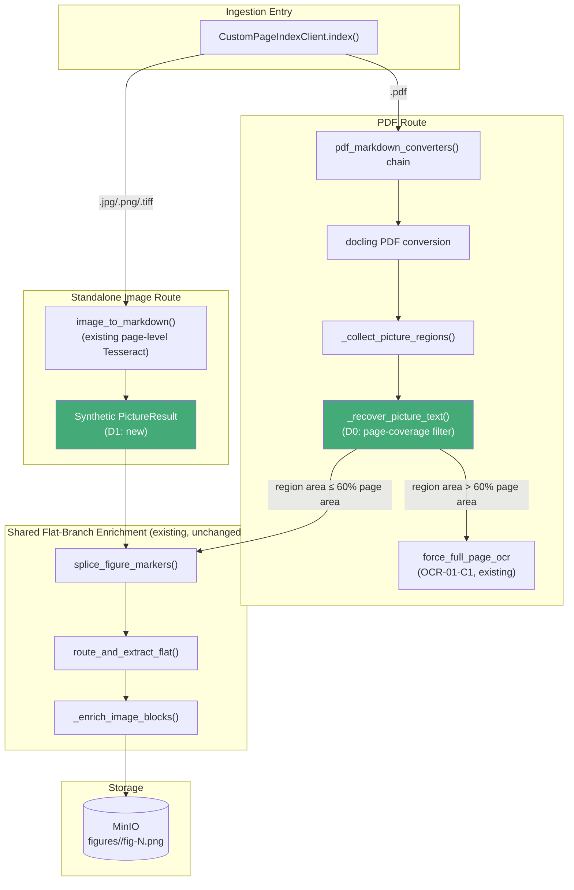
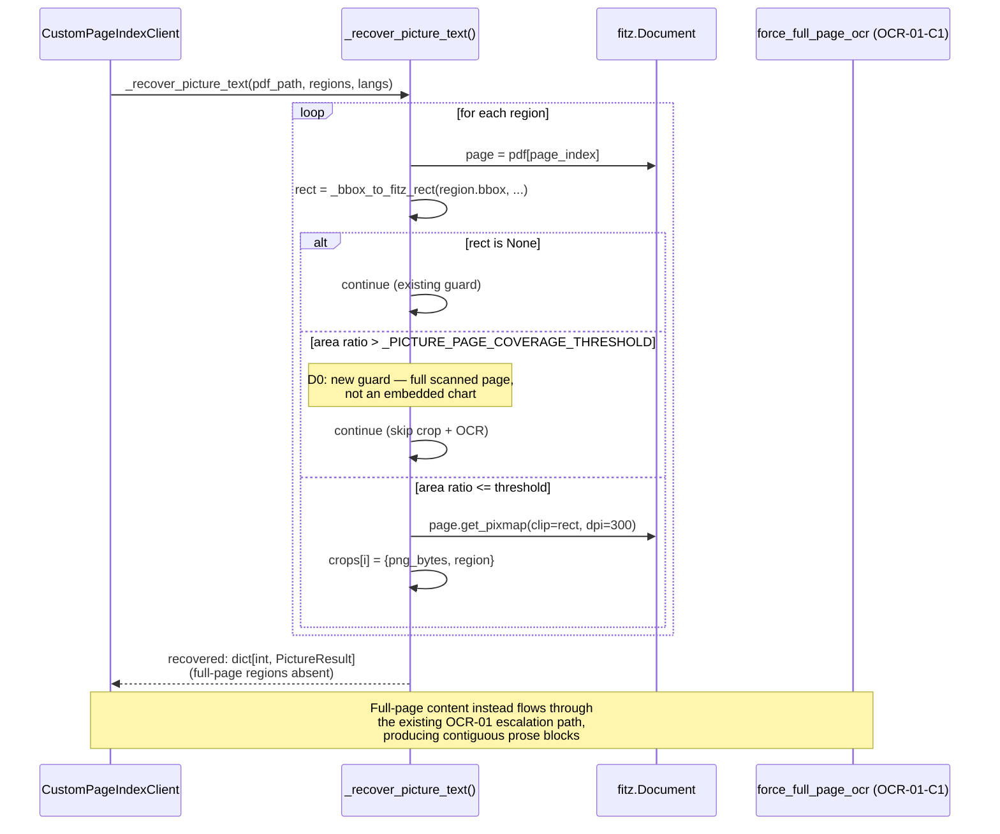
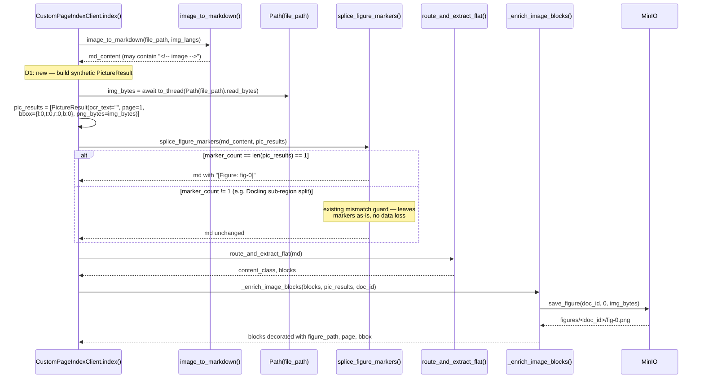
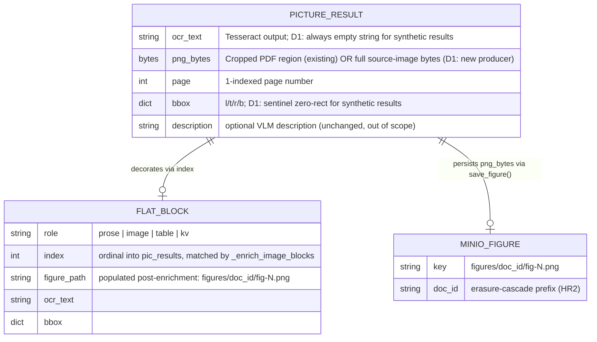

<!-- Space: CITRA -->
<!-- Title: Design: RFC-017 OCR / Image-Block Pipeline Decoupling -->
<!-- Folder: Designs -->

# Design Document: OCR / Image-Block Pipeline Decoupling

## Traceability

| Artifact               | Reference                                                                                         |
| ---------------------- | ------------------------------------------------------------------------------------------------- |
| Governing RFC          | [RFC-017: OCR / Image-Block Pipeline Decoupling](../rfcs/017-ocr-image-block-decoupling.md)        |
| PRD / Requirements     | `PRD.md`                                                                                        |
| Architecture Doc       | `ARCHITECTURE.md`                                                                               |
| Implementation Plan    | [tasks-rfc017-ocr-image-block-decoupling.md](../tasks/tasks-rfc017-ocr-image-block-decoupling.md)  |
| Investigation Evidence | [RFC-017 Investigation Evidence](../rfcs/017-ocr-image-block-decoupling.md#investigation-evidence) |

## Overview

`feat/image-block-picture-ocr` ([RFC-015 D6](../rfcs/015-corpus-audit-remediation.md)) added per-picture OCR + VLM enrichment so charts, infographics, and photos become first-class retrievable artifacts. As documented in the RFC's [Context](../rfcs/017-ocr-image-block-decoupling.md#context) and [Investigation Evidence](../rfcs/017-ocr-image-block-decoupling.md#investigation-evidence), that pipeline conflates with the previously-validated page-level OCR escalation pipeline (OCR-01, RFC-005 Fix 3) in two independent ways: (1) Docling's layout model sometimes classifies an entire scanned page as a single `PictureItem`, so per-picture cropping fragments what should be a contiguous `prose` block into an `image`-block `ocr_text` field invisible to `content_signals`; and (2) the standalone-image ingestion branch never invokes the enrichment pipeline at all, so chart/wedge text in `.jpg`/`.png`/`.tiff` files is silently dropped as a bare `<!-- image -->` marker.

This design covers exactly the two fixes in the RFC's [Decisions](../rfcs/017-ocr-image-block-decoupling.md#decisions) section: [D0](../rfcs/017-ocr-image-block-decoupling.md#d0--page-coverage-filter-in-_recover_picture_text) (a page-area filter that keeps full-page scans on the proven OCR-01 escalation path) and [D1](../rfcs/017-ocr-image-block-decoupling.md#d1--standalone-image-enrichment-via-synthetic-pictureresult) (a synthetic `PictureResult` that lets standalone images flow through the existing flat-branch enrichment machinery). Both are surgical, config-gated additions to existing functions — no new services, stores, or LLM egress paths. Items P1–P5 are explicitly [Out of Scope](../rfcs/017-ocr-image-block-decoupling.md#out-of-scope) for this RFC and are not addressed here.

## Key Design Principles

1. **Route content to the pipeline that already handles it correctly.** A full-page scan is not a picture; it is a page. [D0](../rfcs/017-ocr-image-block-decoupling.md#d0--page-coverage-filter-in-_recover_picture_text) does not add new OCR logic — it removes a category of input from the per-picture path so `force_full_page_ocr` (OCR-01-C1) can do the job it already does correctly.
2. **Reuse the existing enrichment pipeline instead of building a parallel one.** [D1](../rfcs/017-ocr-image-block-decoupling.md#d1--standalone-image-enrichment-via-synthetic-pictureresult) does not write new figure-persistence or marker-splicing code; it manufactures the one data structure (`PictureResult`) the existing `splice_figure_markers` / `_enrich_image_blocks` pipeline already expects, so standalone images inherit all of that pipeline's behavior — including its safety guards — for free.
3. **Degrade to current (safe) behavior on any ambiguity.** Both decisions are additive filters/adapters bolted onto call sites that already have well-defined fallback behavior (`splice_figure_markers`'s marker-count mismatch guard, `_enrich_image_blocks`'s `png_bytes`-presence check) — neither decision needs its own new error path.
4. **No new egress, no new derived store.** Both decisions operate entirely on already-computed geometry (page/region area ratios) or already-local bytes (the source image file) — no LLM call, no new MinIO prefix, no new Redis key.

## Launch Constraints

- [D0](../rfcs/017-ocr-image-block-decoupling.md#d0--page-coverage-filter-in-_recover_picture_text) changes retrieval granularity for scanned-page-classified-as-picture cases: previously-fragmented `image`-block OCR text becomes contiguous `prose` via the OCR-01 escalation path instead. This is a quality *improvement* per [HR5](../rfcs/017-ocr-image-block-decoupling.md#hard-rule-constraints-claudemd-binding), but any downstream consumer that specifically depended on `ocr_text` appearing inside an `image` block for a full-page scan will see that content move to `prose` blocks instead.
- [D1](../rfcs/017-ocr-image-block-decoupling.md#d1--standalone-image-enrichment-via-synthetic-pictureresult) changes standalone-image ingestion output shape: a `<!-- image -->` marker becomes `[Figure: fig-0]` and a new `figures/<doc_id>/fig-0.png` object is written to MinIO via `save_figure()`. This is additive (no existing field is removed) but is a MinIO-layout change operators should be aware of for capacity planning on image-heavy corpora.
- Neither decision touches PII routing ([HR3](../rfcs/017-ocr-image-block-decoupling.md#hard-rule-constraints-claudemd-binding)): [D0](../rfcs/017-ocr-image-block-decoupling.md#d0--page-coverage-filter-in-_recover_picture_text) is pure arithmetic inside the existing `fitz` scope; [D1](../rfcs/017-ocr-image-block-decoupling.md#d1--standalone-image-enrichment-via-synthetic-pictureresult)'s only text (`ocr_text=""`) comes from the local-Tesseract page-level pass `image_to_markdown()` already ran.
- Neither decision touches erasure cascades ([HR2](../rfcs/017-ocr-image-block-decoupling.md#hard-rule-constraints-claudemd-binding)): [D1](../rfcs/017-ocr-image-block-decoupling.md#d1--standalone-image-enrichment-via-synthetic-pictureresult)'s new figure object lives under the existing `figures/<doc_id>/` prefix, which `delete_doc`'s existing prefix-purge step already covers.
- Neither decision touches AGPL exposure ([HR4](../rfcs/017-ocr-image-block-decoupling.md#hard-rule-constraints-claudemd-binding)): [D0](../rfcs/017-ocr-image-block-decoupling.md#d0--page-coverage-filter-in-_recover_picture_text) adds arithmetic inside `_recover_picture_text`'s existing `fitz` (PyMuPDF, AGPL-3.0) scope; no new import is introduced.

## Architecture

### High-Level System Architecture

### Architecture Decisions

**[AD0] Page-coverage filter as an early-continue in the existing crop loop** ([D0](../rfcs/017-ocr-image-block-decoupling.md#d0--page-coverage-filter-in-_recover_picture_text)): `_recover_picture_text()`'s Phase 1 loop (`converters.py:1376-1386`) already computes a `fitz.Rect` per region before cropping via `page.get_pixmap()`. The filter adds one ratio comparison — `(rect.width * rect.height) / page_area > _PICTURE_PAGE_COVERAGE_THRESHOLD` — and an early `continue` immediately after the existing `rect is None` guard, before the expensive `get_pixmap(dpi=300)` call. Alternative considered: filtering at `_collect_picture_regions()` (before any bbox→rect conversion) — rejected because that function has no `page.rect` handle available (it iterates the Docling document tree, not the PDF), so the area check would need its own PDF re-open, duplicating work `_recover_picture_text` already does. Validates [Property 1](#property-1-page-coverage-filter-excludes-full-page-regions). Implemented in [Task 1.2](../tasks/tasks-rfc017-ocr-image-block-decoupling.md#12-add-area-check-in-recover-picture-text).

**[AD1] Configurable threshold via a module constant + env var** ([D0](../rfcs/017-ocr-image-block-decoupling.md#d0--page-coverage-filter-in-_recover_picture_text)): `_PICTURE_PAGE_COVERAGE_THRESHOLD = float(os.getenv("PICTURE_PAGE_COVERAGE_THRESHOLD", "0.6"))` follows the same pattern as the neighboring `_OCR_ESCALATION` and `_IMAGE_ENRICH_CONCURRENCY` constants in `converters.py` — a module-level constant read once at import time, overridable per-deployment without a code change. Default `0.6` is a heuristic (large infographics near that ratio are a known [risk](../rfcs/017-ocr-image-block-decoupling.md#risks)); operators with corpora that legitimately contain large embedded charts can raise it via the env var. Implemented in [Task 1.1](../tasks/tasks-rfc017-ocr-image-block-decoupling.md#11-add-page-coverage-threshold-constant).

**[AD2] Synthetic `PictureResult` reuses the existing flat-branch pipeline verbatim** ([D1](../rfcs/017-ocr-image-block-decoupling.md#d1--standalone-image-enrichment-via-synthetic-pictureresult)): rather than writing a standalone-image-specific enrichment path, the standalone image branch (`client.py:529-541`) is changed only to populate `pic_results` — the same variable the PDF route populates from `_split_converter_output()` — with one entry built from the source file's bytes. Every downstream call (`splice_figure_markers`, `route_and_extract_flat`, `_enrich_image_blocks`, `save_figure`) is unchanged; they already operate generically on `pic_results: list[PictureResult]` regardless of which route produced it. Alternative considered: a bespoke "attach whole-image figure" helper specific to the standalone-image branch — rejected because it would duplicate `_enrich_image_blocks`'s MinIO-upload and block-decoration logic instead of reusing it (violates [Key Design Principle 2](#key-design-principles)). Validates [Property 2](#property-2-standalone-image-produces-synthetic-pictureresult). Implemented in [Task 1.3](../tasks/tasks-rfc017-ocr-image-block-decoupling.md#13-add-synthetic-pictureresult-for-standalone-images).

**[AD3] `ocr_text=""` in the synthetic result to avoid duplicate OCR work** ([D1](../rfcs/017-ocr-image-block-decoupling.md#d1--standalone-image-enrichment-via-synthetic-pictureresult)): `image_to_markdown()` already ran a full-page Tesseract pass to produce `md_content` before the synthetic `PictureResult` is built, so re-running per-picture OCR on the identical bytes would be redundant work with no new signal. `_enrich_image_blocks` already handles an empty `ocr_text` gracefully (`if not block.get("ocr_text"): block["ocr_text"] = pr.get("ocr_text", "")` — a no-op when both are empty), so no downstream change is needed to accommodate this. Implemented in [Task 1.3](../tasks/tasks-rfc017-ocr-image-block-decoupling.md#13-add-synthetic-pictureresult-for-standalone-images).

**[AD4] Full-image bbox (`{l:0, t:0, r:0, b:0}`) as a sentinel, not a real region** ([D1](../rfcs/017-ocr-image-block-decoupling.md#d1--standalone-image-enrichment-via-synthetic-pictureresult)): unlike PDF-route `PictureResult`s, whose `bbox` is a real crop rectangle used only for block metadata display (never for re-cropping downstream), the synthetic result's `bbox` is never used to derive a sub-region — the `png_bytes` already ARE the whole source file. The zero-rect is therefore a display-only placeholder consistent with the `bbox` field's existing (non-authoritative) downstream usage in `_enrich_image_blocks` (`block["bbox"] = pr.get("bbox", {})`).

## Deployment Architecture

No new services, containers, or infrastructure. Both changes ship inside the existing `pageindex_mcp` package (`converters.py`, `client.py`) and take effect on the next deploy of the MCP server / arq worker image — whichever process the ingestion call runs in (per `ARCHITECTURE.md` § Ingestion Pipeline & Data Flow, both PDF and standalone-image indexing run inside the same worker process that calls `CustomPageIndexClient.index()`). `_PICTURE_PAGE_COVERAGE_THRESHOLD`'s `PICTURE_PAGE_COVERAGE_THRESHOLD` env var is read once at module import — changing it requires a process restart, matching the existing pattern for `_OCR_ESCALATION` / `OCR_ESCALATION`.

## Communication Patterns

| Pattern                      | Use Case                                                                                                                                | Technology                         |
| ---------------------------- | --------------------------------------------------------------------------------------------------------------------------------------- | ---------------------------------- |
| In-process function call     | `_recover_picture_text()` Phase 1 crop loop invoking the new area check ([D0](#d0--page-coverage-filter-in-_recover_picture_text))     | Python,`fitz.Rect` arithmetic    |
| In-process function call     | Standalone image branch constructing the synthetic`PictureResult` ([D1](#d1--standalone-image-enrichment-via-synthetic-pictureresult)) | Python,`pathlib.Path.read_bytes` |
| Local subprocess (unchanged) | Page-level Tesseract OCR inside`image_to_markdown()`                                                                                  | `tesseract` CLI                  |
| Object storage (unchanged)   | `_enrich_image_blocks()` persisting synthetic-result PNG bytes                                                                        | MinIO`save_figure()`             |

No new network calls, no new LLM egress, no new message-queue topics. Both decisions live entirely inside existing synchronous/async call chains already documented in `ARCHITECTURE.md`.

## Sequence Diagrams

### PDF Route: Page-Coverage Filter ([D0](../rfcs/017-ocr-image-block-decoupling.md#d0--page-coverage-filter-in-_recover_picture_text))

Validates [Property 1](#property-1-page-coverage-filter-excludes-full-page-regions). Implemented in [Task 1.2](../tasks/tasks-rfc017-ocr-image-block-decoupling.md#12-add-area-check-in-recover-picture-text) and tested in [Task 2.1](../tasks/tasks-rfc017-ocr-image-block-decoupling.md#21-write-p0b-page-coverage-filter-tests).

### Standalone Image Route: Synthetic PictureResult ([D1](../rfcs/017-ocr-image-block-decoupling.md#d1--standalone-image-enrichment-via-synthetic-pictureresult))

Validates [Property 2](#property-2-standalone-image-produces-synthetic-pictureresult). Implemented in [Task 1.3](../tasks/tasks-rfc017-ocr-image-block-decoupling.md#13-add-synthetic-pictureresult-for-standalone-images) and tested in [Task 2.2](../tasks/tasks-rfc017-ocr-image-block-decoupling.md#22-write-p0a-standalone-image-enrichment-tests).

## Service Contracts

### 1. `converters.py` (`src/pageindex_mcp/converters.py`)

**Responsibility**: PDF/image → markdown conversion; per-picture region cropping and OCR recovery.

**Changes ([D0](../rfcs/017-ocr-image-block-decoupling.md#d0--page-coverage-filter-in-_recover_picture_text))**:

- New module-level constant `_PICTURE_PAGE_COVERAGE_THRESHOLD` (default `0.6`, env-overridable via `PICTURE_PAGE_COVERAGE_THRESHOLD`), added near the existing `_PICTURE_OCR_MIN_CHARS` / `_IMAGE_ENRICH_CONCURRENCY` constants. Implemented in [Task 1.1](../tasks/tasks-rfc017-ocr-image-block-decoupling.md#11-add-page-coverage-threshold-constant).
- `_recover_picture_text()`'s Phase 1 crop loop (`converters.py:1376-1386`) gains an area-ratio check immediately after the existing `rect is None` guard: regions whose `(rect.width * rect.height) / page_area` exceeds the threshold are `continue`d past before `page.get_pixmap()` is called, so they never enter `crops` and never appear in the returned `dict[int, PictureResult]`. Implemented in [Task 1.2](../tasks/tasks-rfc017-ocr-image-block-decoupling.md#12-add-area-check-in-recover-picture-text).

**Internal Interfaces** (unchanged signatures):

- `_recover_picture_text(pdf_path: str, regions: list[dict], langs: list[str]) -> dict[int, PictureResult]` — called from the PDF conversion chain inside `pdf_markdown_converters()`.
- `splice_figure_markers(md: str, pics: list[PictureResult]) -> str` — unchanged; consumes whatever `pic_results` the caller (PDF route or [D1](../rfcs/017-ocr-image-block-decoupling.md#d1--standalone-image-enrichment-via-synthetic-pictureresult)'s standalone route) provides.

### 2. `client.py` (`src/pageindex_mcp/client.py`)

**Responsibility**: Ingestion orchestration — format-specific conversion routing, OCR escalation, flat-branch enrichment.

**Changes ([D1](../rfcs/017-ocr-image-block-decoupling.md#d1--standalone-image-enrichment-via-synthetic-pictureresult))**:

- New imports: `PictureResult` (from `converters.py`) and `Path` (from `pathlib`), needed by the standalone image branch. Implemented in [Task 1.3](../tasks/tasks-rfc017-ocr-image-block-decoupling.md#13-add-synthetic-pictureresult-for-standalone-images).
- Standalone image branch (`client.py:529-541`, `elif ext in _IMAGE_EXTS:`): after `md_content = await asyncio.to_thread(image_to_markdown, file_path, img_langs)`, read the source file's bytes via `asyncio.to_thread(Path(file_path).read_bytes)` and assign `pic_results = [PictureResult(ocr_text="", page=1, bbox={"l": 0, "t": 0, "r": 0, "b": 0}, png_bytes=img_bytes)]`. Previously `pic_results` stayed at its function-top initial value `[]` for this branch. Implemented in [Task 1.3](../tasks/tasks-rfc017-ocr-image-block-decoupling.md#13-add-synthetic-pictureresult-for-standalone-images).

**Internal Interfaces** (unchanged signatures, now exercised by the standalone-image branch for the first time):

- `splice_figure_markers(md, pic_results)` — called uniformly for both the PDF flat route and the standalone-image route once `pic_results` is non-empty.
- `_enrich_image_blocks(blocks, pic_results, doc_id)` — called uniformly; uploads `pic_results[0]["png_bytes"]` via `save_figure(doc_id, 0, png)` and decorates the matching `{"role": "image"}` block.

## Data Models

RFC-017 introduces no new persisted schema, table, or MinIO key namespace. [D1](../rfcs/017-ocr-image-block-decoupling.md#d1--standalone-image-enrichment-via-synthetic-pictureresult)'s only storage effect is that the standalone-image route now populates the existing `figures/<doc_id>/fig-<index>.png` MinIO key (already used by the PDF route via `save_figure()`) for the first time. The `PictureResult` `TypedDict` (already defined in `converters.py`) is reused verbatim, not extended:

No migration is required — this is a producer-side change (which code paths create `PictureResult` entries and how many pass the coverage filter), not a shape change.

## Correctness Properties

*A property is a characteristic behavior that should hold true across all valid executions of the system.*

### Property 1: Page-coverage filter excludes full-page regions

*For any* `PictureItem` region whose bounding box area exceeds `_PICTURE_PAGE_COVERAGE_THRESHOLD` fraction of the page area, the system SHALL skip that region in `_recover_picture_text` Phase 1 cropping and not include it in the returned `PictureResult` dictionary.

- **Validates**: [D0](../rfcs/017-ocr-image-block-decoupling.md#d0--page-coverage-filter-in-_recover_picture_text)
- **Tested in**: [Task 2.1](../tasks/tasks-rfc017-ocr-image-block-decoupling.md#21-write-p0b-page-coverage-filter-tests)
- **Service contract**: [converters.py](#1-converterspy-srcpageindex_mcpconverterspy)

### Property 2: Standalone image produces synthetic PictureResult

*For any* standalone image file (`.jpg`/`.png`/`.tiff`) processed via `index()`, the system SHALL create exactly one `PictureResult` entry whose `png_bytes` equal the source file bytes, enabling the downstream flat-branch enrichment pipeline to process `<!-- image -->` markers.

- **Validates**: [D1](../rfcs/017-ocr-image-block-decoupling.md#d1--standalone-image-enrichment-via-synthetic-pictureresult)
- **Tested in**: [Task 2.2](../tasks/tasks-rfc017-ocr-image-block-decoupling.md#22-write-p0a-standalone-image-enrichment-tests)
- **Service contract**: [client.py](#2-clientpy-srcpageindex_mcpclientpy)

## Error Handling

**[converters.py](#1-converterspy-srcpageindex_mcpconverterspy) ([D0](../rfcs/017-ocr-image-block-decoupling.md#d0--page-coverage-filter-in-_recover_picture_text))**:

- `page_area` computes to `0` (degenerate page geometry) — the existing `page_area > 0` guard short-circuits the ratio check, so the region falls through to normal cropping rather than a divide-by-zero. No new failure mode introduced.
- A region's true area is exactly at the `0.6` boundary — ratio comparison uses strict `>`, so a region at exactly the threshold is still cropped (kept on the per-picture path); only regions strictly *exceeding* the threshold are skipped, consistent with [D0](../rfcs/017-ocr-image-block-decoupling.md#d0--page-coverage-filter-in-_recover_picture_text)'s "exceeds" wording.
- Every full-page region skipped by [D0](../rfcs/017-ocr-image-block-decoupling.md#d0--page-coverage-filter-in-_recover_picture_text) does not silently vanish from the document: it relies on the existing, independent OCR-01 escalation path (`force_full_page_ocr`) to recover that page's text as `prose` — this design does not alter or gate that escalation path, per [HR5](../rfcs/017-ocr-image-block-decoupling.md#hard-rule-constraints-claudemd-binding).

**[client.py](#2-clientpy-srcpageindex_mcpclientpy) ([D1](../rfcs/017-ocr-image-block-decoupling.md#d1--standalone-image-enrichment-via-synthetic-pictureresult))**:

- `image_to_markdown()` produces more or fewer than one `<!-- image -->` marker (e.g. Docling detects sub-regions inside the standalone image) — `splice_figure_markers`'s existing marker-count mismatch guard (`converters.py:1455-1463`) fires (`marker_count != len(pics)`), leaves the markdown's markers unchanged, and logs a warning. This is graceful degradation to current (pre-[D1](../rfcs/017-ocr-image-block-decoupling.md#d1--standalone-image-enrichment-via-synthetic-pictureresult)) behavior for that document, not a crash — tested by [Task 2.2](../tasks/tasks-rfc017-ocr-image-block-decoupling.md#22-write-p0a-standalone-image-enrichment-tests) per the RFC's marker-count-mismatch edge case.
- `Path(file_path).read_bytes()` fails (file removed between conversion and enrichment, permissions error) — propagates as an exception out of `index()`, matching how every other `asyncio.to_thread` file-I/O call in this same branch already behaves; no new try/except is introduced because none of the surrounding branch code catches file-I/O errors either.
- Large source image (e.g. a 10MB TIFF) held as `png_bytes` in memory — matches existing behavior for PDF-route 300-DPI crops, which are also large; `_enrich_image_blocks` already pops `png_bytes` from the result dict immediately after the MinIO upload completes (audit finding 11 fix), bounding the memory lifetime to one upload round-trip. See [RFC-017 Risks](../rfcs/017-ocr-image-block-decoupling.md#risks) item 3.

## Testing Strategy

| Layer                            | Coverage                                                                                                                                                                          | Task                                                                                                          |
| -------------------------------- | --------------------------------------------------------------------------------------------------------------------------------------------------------------------------------- | ------------------------------------------------------------------------------------------------------------- |
| Unit —`_recover_picture_text` | Region covering > 60% page area is skipped (no crop, no OCR call, absent from returned dict)                                                                                      | [Task 2.1](../tasks/tasks-rfc017-ocr-image-block-decoupling.md#21-write-p0b-page-coverage-filter-tests)        |
| Unit —`_recover_picture_text` | Region covering <= 60% page area is kept and cropped as before (regression guard)                                                                                                 | [Task 2.1](../tasks/tasks-rfc017-ocr-image-block-decoupling.md#21-write-p0b-page-coverage-filter-tests)        |
| Unit — standalone image branch  | `.jpg`/`.png`/`.tiff` ingestion produces exactly one `PictureResult` whose `png_bytes` equals the source file's bytes                                                   | [Task 2.2](../tasks/tasks-rfc017-ocr-image-block-decoupling.md#22-write-p0a-standalone-image-enrichment-tests) |
| Unit — standalone image branch  | Multiple`<!-- image -->` markers from a single standalone image degrade gracefully via the existing `splice_figure_markers` mismatch guard (no exception, markers left as-is) | [Task 2.2](../tasks/tasks-rfc017-ocr-image-block-decoupling.md#22-write-p0a-standalone-image-enrichment-tests) |
| Checkpoint                       | Batch 0 (constant + area check + synthetic result) lands and existing test suite stays green before new tests are added                                                           | [Task 1.4](../tasks/tasks-rfc017-ocr-image-block-decoupling.md#14-checkpoint-batch-0)                          |
| Checkpoint                       | Batch 1 (new P0a/P0b tests) all pass alongside the full existing suite                                                                                                            | [Task 2.3](../tasks/tasks-rfc017-ocr-image-block-decoupling.md#23-checkpoint-batch-1)                          |

Both properties ([Property 1](#property-1-page-coverage-filter-excludes-full-page-regions), [Property 2](#property-2-standalone-image-produces-synthetic-pictureresult)) are covered by targeted unit tests in `tests/test_image_blocks.py` rather than end-to-end corpus runs — per [RFC-017&#39;s Implementation Plan](../rfcs/017-ocr-image-block-decoupling.md#implementation-plan), both decisions are pure, deterministic function-level behaviors (an area-ratio comparison; a bytes-read-and-dict-construction) that do not require Docling/Tesseract to actually run to verify correctness, matching the existing test style for neighboring `_recover_picture_text` / `splice_figure_markers` coverage in the same file.
