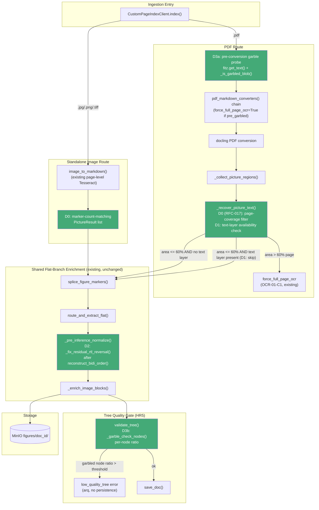
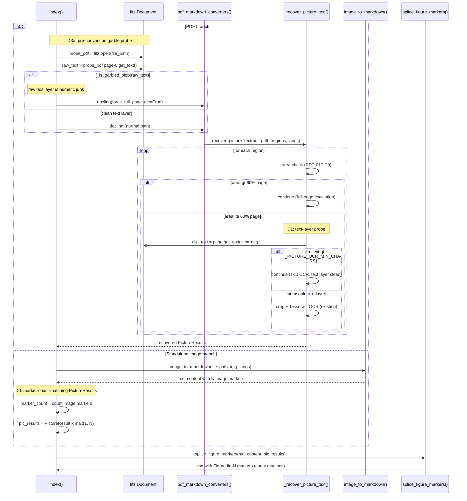
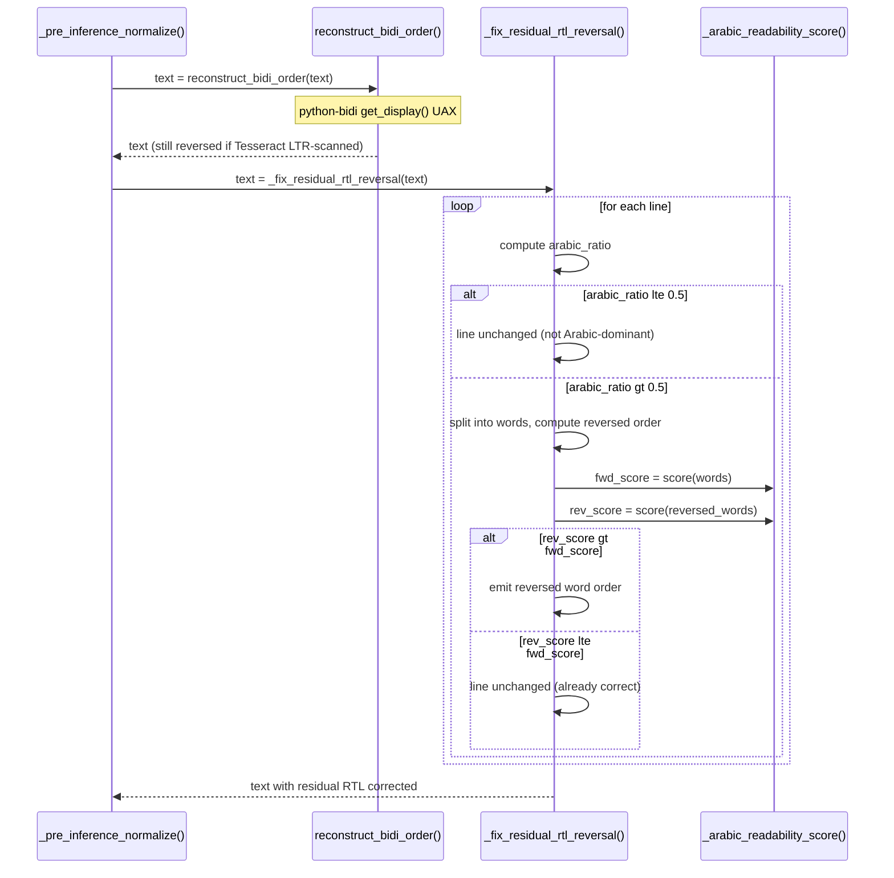

<!-- Space: CITRA -->
<!-- Title: Design: RFC-018 Corpus Audit Remediation -->
<!-- Folder: Designs -->

# Design Document: Corpus Audit Remediation

## Traceability

| Artifact            | Reference                                                                                                                                                                          |
| ------------------- | ---------------------------------------------------------------------------------------------------------------------------------------------------------------------------------- |
| Governing RFC       | [RFC-018: Corpus Audit Remediation](../rfcs/018-corpus-audit-remediation.md)                                                                                                        |
| PRD / Requirements  | `PRD.md`                                                                                                                                                                         |
| Architecture Doc    | `ARCHITECTURE.md`                                                                                                                                                                |
| Implementation Plan | [tasks-rfc018-corpus-audit-remediation.md](../tasks/tasks-rfc018-corpus-audit-remediation.md)                                                                                       |
| Prior Audit         | [`audit/RFC018_INVESTIGATION_LOG_2026-07-27.md`](../../audit/RFC018_INVESTIGATION_LOG_2026-07-27.md)                                                                              |
| Superseded Decision | RFC-017 D1 (single-`PictureResult` standalone-image synthesis, replaced by [D0](../rfcs/018-corpus-audit-remediation.md#d0--fix-p0a-marker-count-mismatch-for-standalone-images)) |

## Overview

A 25-document corpus re-ingestion audit on `feat/image-block-picture-ocr` scored **7 PASS, 10 MARGINAL, 8 FAIL**. RFC-017's P0a (standalone image enrichment) shipped but does not work end-to-end: its single-`PictureResult` synthesis trips `splice_figure_markers`'s marker-count mismatch guard whenever Docling emits more than one `<!-- image -->` marker for a standalone image, silently discarding all chart content. RFC-017's P0b (page-coverage filter) is also insufficient — per-picture OCR still fires on sub-60%-page chart regions that sit on top of a clean, already-extracted text layer, overwriting good vector text with garbled OCR. Two failure modes outside RFC-017's scope dominate the remaining failures: Arabic text stored in reversed word/character order (7 docs) and a garble-gate hole where numeric-junk text layers pass `validate_tree` undetected because bulk per-tree ratios dilute a small number of badly corrupted nodes across a large document (3 docs). This RFC covers four surgical, function-level fixes — [D0](../rfcs/018-corpus-audit-remediation.md#d0--fix-p0a-marker-count-mismatch-for-standalone-images) (marker-count-matching `PictureResult`s), [D1](../rfcs/018-corpus-audit-remediation.md#d1--text-layer-availability-check-before-per-picture-ocr) (text-layer probe before per-picture OCR), [D2](../rfcs/018-corpus-audit-remediation.md#d2--arabic-rtl-reversal-hardening) (post-bidi Arabic word-order correction), and [D3](../rfcs/018-corpus-audit-remediation.md#d3--garble-gate-numeric-junk-probe) (a two-pronged garble probe: pre-conversion for the PDF branch, per-node for the tree-validation gate) — none of which add a new service, store, or LLM egress path.

## Key Design Principles

1. **Fix the producer, not the consumer.** [D0](../rfcs/018-corpus-audit-remediation.md#d0--fix-p0a-marker-count-mismatch-for-standalone-images) does not relax `splice_figure_markers`'s marker-count guard — it makes the standalone-image branch produce a `PictureResult` count that already satisfies the existing, correct guard. The guard stays strict; the input becomes correct.
2. **Prefer the data source that is already known-good.** [D1](../rfcs/018-corpus-audit-remediation.md#d1--text-layer-availability-check-before-per-picture-ocr) does not improve per-picture OCR quality — it adds a cheap `fitz` text probe so per-picture OCR is skipped entirely whenever Docling's vector-text extraction already covers the region, since vector text is categorically more reliable than a 300-DPI crop-and-OCR round-trip.
3. **Catch corruption earlier, and at the right granularity.** [D3a](../rfcs/018-corpus-audit-remediation.md#d3--garble-gate-numeric-junk-probe) moves detection before the expensive non-OCR conversion attempt; [D3b](../rfcs/018-corpus-audit-remediation.md#d3--garble-gate-numeric-junk-probe) moves detection from whole-tree ratios (which dilute a few badly corrupted nodes across hundreds of clean ones) to per-node ratios, closing the exact gap the existing `_tree_is_garbled` whole-blob check cannot see.
4. **Heuristics must be provably non-regressive on already-correct input.** [D2](../rfcs/018-corpus-audit-remediation.md#d2--arabic-rtl-reversal-hardening)'s readability-score comparison only reverses a line when the reversed-word-order score is strictly higher than the forward score — text already in correct reading order is mathematically guaranteed to pass through unchanged (`rev_score <= fwd_score` is the no-op branch).
5. **No new egress, no new derived store, no threshold hardcoded without an escape hatch.** All four decisions operate on already-local bytes/text (`fitz`, `python-bidi`, in-process node text) per [HR3](../rfcs/018-corpus-audit-remediation.md#hard-rule-constraints-claudemd-binding)/[HR4](../rfcs/018-corpus-audit-remediation.md#hard-rule-constraints-claudemd-binding), and [D3b](../rfcs/018-corpus-audit-remediation.md#d3--garble-gate-numeric-junk-probe)'s node-ratio threshold is env-var configurable per [Risks](../rfcs/018-corpus-audit-remediation.md#risks) item 4.

## Launch Constraints

- **HR1** (never claim vectorless beats vector RAG) — N/A, no positioning changes.
- **HR2** (right-to-erasure cascade) — N/A, no new derived stores; [D0](../rfcs/018-corpus-audit-remediation.md#d0--fix-p0a-marker-count-mismatch-for-standalone-images) still writes only into the existing `figures/<doc_id>/` prefix already covered by `delete_doc`'s purge; [D2](../rfcs/018-corpus-audit-remediation.md#d2--arabic-rtl-reversal-hardening)/[D3](../rfcs/018-corpus-audit-remediation.md#d3--garble-gate-numeric-junk-probe) are in-place text transforms with no persisted byproduct.
- **HR3** (PII only through ZDR-tier LLMs) — no new LLM egress in any decision: [D0](../rfcs/018-corpus-audit-remediation.md#d0--fix-p0a-marker-count-mismatch-for-standalone-images)/[D1](../rfcs/018-corpus-audit-remediation.md#d1--text-layer-availability-check-before-per-picture-ocr) use local Tesseract/`fitz` only, [D2](../rfcs/018-corpus-audit-remediation.md#d2--arabic-rtl-reversal-hardening) is pure Unicode computation, [D3](../rfcs/018-corpus-audit-remediation.md#d3--garble-gate-numeric-junk-probe) uses local `fitz` text extraction and in-process node inspection.
- **HR4** (AGPL-3.0 awareness) — no new AGPL imports: [D1](../rfcs/018-corpus-audit-remediation.md#d1--text-layer-availability-check-before-per-picture-ocr)/[D3a](../rfcs/018-corpus-audit-remediation.md#d3--garble-gate-numeric-junk-probe) reuse `fitz` already imported at `converters.py:1371`; [D2](../rfcs/018-corpus-audit-remediation.md#d2--arabic-rtl-reversal-hardening) reuses `python-bidi` already imported at `converters.py:1220`.
- **HR5** (never silently persist a low-quality tree) — [D3](../rfcs/018-corpus-audit-remediation.md#d3--garble-gate-numeric-junk-probe) is a direct HR5 *strengthening*: it closes a documented gap where garbled text layers currently pass `validate_tree` and get persisted; catching them earlier now forces the existing `low_quality_tree` error path (`helpers.py:527-531`) instead.
- VLM stays OFF by default (RFC-004, user-locked 2026-06-12) — unaffected by any of D0-D3.
- Granite-258M permanently rejected (user-locked 2026-06-12) — unaffected.
- [D2](../rfcs/018-corpus-audit-remediation.md#d2--arabic-rtl-reversal-hardening) changes the on-disk text of previously-reversed Arabic content for future ingestions only — it does not retroactively repair already-persisted trees; a re-ingestion is required to pick up the fix (no migration is in scope for this RFC).
- [D3b](../rfcs/018-corpus-audit-remediation.md#d3--garble-gate-numeric-junk-probe) can newly reject documents that previously passed `validate_tree` (a small number of badly corrupted nodes in an otherwise-clean tree) — this is the intended HR5 tightening, but operators should expect a small increase in `low_quality_tree` errors on the existing corpus until re-ingested with [D3a](../rfcs/018-corpus-audit-remediation.md#d3--garble-gate-numeric-junk-probe)'s upfront OCR escalation in place.

## Architecture

### High-Level System Architecture

### Architecture Decisions

**[AD0] Marker-count-matching `PictureResult` list, not a single synthetic result** ([D0](../rfcs/018-corpus-audit-remediation.md#d0--fix-p0a-marker-count-mismatch-for-standalone-images)): RFC-017 D1 built exactly one `PictureResult` per standalone image regardless of how many `<!-- image -->` markers `image_to_markdown()` produced, which trips `splice_figure_markers`'s existing `marker_count != len(pics)` guard whenever Docling detects more than one sub-region inside the source image — the guard then leaves the markdown's markers unchanged and `_enrich_image_blocks` never fires (audit entry 13: pie-chart JPG, 0 figures, 0 enrichment). [D0](../rfcs/018-corpus-audit-remediation.md#d0--fix-p0a-marker-count-mismatch-for-standalone-images) counts the actual `<!-- image -->` occurrences in the produced markdown and replicates one `PictureResult` (same `png_bytes`, same source image) `max(1, marker_count)` times, so the guard's precondition is always met. Alternative considered: relaxing the guard itself to tolerate a count mismatch — rejected because the guard is a correctness invariant shared with the PDF route (a mismatch there indicates a real bug, not an expected condition), and weakening it would mask future regressions instead of fixing this one. Validates [Property 1](#property-1-marker-count-match). Implemented in [Task 1.1](../tasks/tasks-rfc018-corpus-audit-remediation.md#11-fix-marker-count-mismatch-d0).

**[AD1] Text-layer probe placed after the existing area check, before pixmap extraction** ([D1](../rfcs/018-corpus-audit-remediation.md#d1--text-layer-availability-check-before-per-picture-ocr)): `_recover_picture_text()`'s Phase 1 loop already computes a `fitz.Rect` and runs RFC-017 D0's page-coverage check (`converters.py:1389`) before calling `page.get_pixmap()`. [D1](../rfcs/018-corpus-audit-remediation.md#d1--text-layer-availability-check-before-per-picture-ocr) inserts one more cheap check in the same slot: `page.get_text("text", clip=rect).strip()`, and `continue`s past the expensive `get_pixmap(dpi=300)` + Tesseract round-trip when the clipped text exceeds `_PICTURE_OCR_MIN_CHARS` (20, the same constant RFC-015 D6 already uses to decide whether *OCR output* is signal or noise — reused here symmetrically to decide whether *OCR input* is even needed). Alternative considered: comparing OCR output quality against the existing text layer post-hoc — rejected because it still pays the OCR cost and risks the OCR output silently overwriting good vector text in `_enrich_image_blocks` if the comparison heuristic is wrong; skipping OCR entirely when a text layer already exists removes the overwrite risk structurally. Validates [Property 2](#property-2-text-layer-ocr-skip). Implemented in [Task 1.2](../tasks/tasks-rfc018-corpus-audit-remediation.md#12-add-text-layer-check-d1).

**[AD2] Readability-score comparison, not a fixed reversal rule** ([D2](../rfcs/018-corpus-audit-remediation.md#d2--arabic-rtl-reversal-hardening)): `_fix_residual_rtl_reversal()` only reverses a >50%-Arabic line's word order when `_arabic_readability_score(reversed_words) > _arabic_readability_score(words)` — a lexicon-frequency heuristic (`_AR_COMMON_WORDS` + definite-article prefix regex `_AR_DEFINITE_RE`) scored on both orderings. This makes the transform self-gating: text already in correct reading order scores at least as well forward as reversed (or the difference is noise-level), so the `<=` branch is a guaranteed no-op. Alternative considered: detecting LTR-scanned-Arabic corruption structurally (e.g. via Tesseract's per-word bounding-box order) — rejected because `_pre_inference_normalize()` operates on markdown text after conversion, with no access to Tesseract's original word geometry; a text-level heuristic is the only signal available at this pipeline stage. Validates [Property 3](#property-3-arabic-rtl-correction). Implemented in [Task 1.3](../tasks/tasks-rfc018-corpus-audit-remediation.md#13-add-arabic-rtl-reversal-hardening-d2) and wired into `_pre_inference_normalize()` in [Task 1.4](../tasks/tasks-rfc018-corpus-audit-remediation.md#14-call-rtl-reversal-in-pre-inference-normalize-d2).

**[AD3] Two-pronged garble detection — pre-conversion probe (D3a) and per-node gate (D3b) — instead of one wider whole-tree threshold** ([D3](../rfcs/018-corpus-audit-remediation.md#d3--garble-gate-numeric-junk-probe)): the existing `_tree_is_garbled()` (`helpers.py:636-640`) flattens the entire tree into one blob before applying `_is_garbled_blob`'s ratio checks, which structurally cannot detect a small number of badly corrupted nodes diluted across hundreds of clean ones (audit entry 18: 1 PUA-heavy node among 99 clean nodes, tree-wide PUA ratio stays under the 3% threshold). [D3a](../rfcs/018-corpus-audit-remediation.md#d3--garble-gate-numeric-junk-probe) catches the common case — the *entire* raw PDF text layer is numeric junk — cheaply and early, before a wasted non-OCR Docling conversion attempt, by probing only page 1 via `fitz` and reusing `_is_garbled_blob` directly. [D3b](../rfcs/018-corpus-audit-remediation.md#d3--garble-gate-numeric-junk-probe) catches the long-tail case [D3a](../rfcs/018-corpus-audit-remediation.md#d3--garble-gate-numeric-junk-probe) cannot see — localized corruption in an otherwise-clean tree — by running `_is_garbled_blob` per-node inside `validate_tree()` and comparing the *ratio of garbled nodes* (not a blob-wide character ratio) against a configurable threshold. Alternative considered: lowering `_is_garbled_blob`'s existing whole-tree ratio thresholds — rejected because that would raise false-positive risk on large, legitimately mixed-quality documents (e.g. financial tables with high digit density) without addressing the structural dilution problem. Validates [Property 4](#property-4-garble-probe-escalation) and [Property 5](#property-5-per-node-garble-detection). Implemented in [Task 1.5](../tasks/tasks-rfc018-corpus-audit-remediation.md#15-add-pre-conversion-garble-probe-d3a) and [Task 1.6](../tasks/tasks-rfc018-corpus-audit-remediation.md#16-add-per-node-garble-check-d3b).

**[AD4] `GARBLE_NODE_RATIO_THRESHOLD` as an env-var-overridable constant, mirroring the RFC-017 `_PICTURE_PAGE_COVERAGE_THRESHOLD` pattern** ([D3b](../rfcs/018-corpus-audit-remediation.md#d3--garble-gate-numeric-junk-probe)): the default 10% garbled-node ratio is a heuristic per [Risks](../rfcs/018-corpus-audit-remediation.md#risks) item 4 — documents with legitimate high-digit-density nodes (financial tables) risk false-positive `low_quality_tree` rejections at too-low a threshold. Following the same module-constant + env-var pattern already established for `_PICTURE_PAGE_COVERAGE_THRESHOLD`, the threshold is tunable per-deployment without a code change. Implemented in [Task 1.6](../tasks/tasks-rfc018-corpus-audit-remediation.md#16-add-per-node-garble-check-d3b).

## Sequence Diagrams

### Ingestion Flow (D0, D1, D3)

Validates [Property 1](#property-1-marker-count-match), [Property 2](#property-2-text-layer-ocr-skip), and [Property 4](#property-4-garble-probe-escalation). Implemented in [Task 1.1](../tasks/tasks-rfc018-corpus-audit-remediation.md#11-fix-marker-count-mismatch-d0), [Task 1.2](../tasks/tasks-rfc018-corpus-audit-remediation.md#12-add-text-layer-check-d1), and [Task 1.5](../tasks/tasks-rfc018-corpus-audit-remediation.md#15-add-pre-conversion-garble-probe-d3a).

### Arabic Normalization Flow (D2)

Validates [Property 3](#property-3-arabic-rtl-correction). Implemented in [Task 1.3](../tasks/tasks-rfc018-corpus-audit-remediation.md#13-add-arabic-rtl-reversal-hardening-d2) and [Task 1.4](../tasks/tasks-rfc018-corpus-audit-remediation.md#14-call-rtl-reversal-in-pre-inference-normalize-d2).

## Service Contracts

### 1. `client.py` (`src/pageindex_mcp/client.py`)

**Responsibility**: Ingestion orchestration — format-specific conversion routing, OCR escalation, garble-aware pre-conversion probing, flat-branch enrichment.

**Changes**:

- Standalone image branch (lines 537-545): replace the single-`PictureResult` synthesis (RFC-017 D1) with a marker-count-matching list — `marker_count = md_content.count("<!-- image -->")`, `pic_results = [PictureResult(...)] * max(1, marker_count)`. Validates [Property 1](#property-1-marker-count-match). Implemented in [Task 1.1](../tasks/tasks-rfc018-corpus-audit-remediation.md#11-fix-marker-count-mismatch-d0).
- PDF branch, before the first `pdf_to_markdown_docling()` call: new pre-conversion garble probe — `fitz.open(file_path)`, extract page-1 raw text, run `_is_garbled_blob()` on it, and set `force_full_page_ocr=True` on the conversion call if garbled. Probe failure (any exception) is non-fatal and falls through to the normal (non-forced) path. Validates [Property 4](#property-4-garble-probe-escalation). Implemented in [Task 1.5](../tasks/tasks-rfc018-corpus-audit-remediation.md#15-add-pre-conversion-garble-probe-d3a).

**Internal Interfaces** (unchanged signatures):

- `splice_figure_markers(md: str, pics: list[PictureResult]) -> str` — now always receives a marker-count-matching list from both the PDF route and the standalone-image route.
- `pdf_to_markdown_docling(file_path, ..., force_full_page_ocr: bool = False)` — existing parameter, now also driven by the [D3a](../rfcs/018-corpus-audit-remediation.md#d3--garble-gate-numeric-junk-probe) probe result in addition to its existing (post-conversion) callers.

### 2. `converters.py` (`src/pageindex_mcp/converters.py`)

**Responsibility**: PDF/image → markdown conversion; per-picture region cropping and OCR recovery; markdown normalization (BiDi reorder, heading-depth inference).

**Changes**:

- `_recover_picture_text()` Phase 1 crop loop (`converters.py:1389-1391`, immediately after RFC-017 D0's area-ratio `continue`): new text-layer probe — `clip_text = page.get_text("text", clip=rect).strip()`; `continue` past `page.get_pixmap()` when `len(clip_text) > _PICTURE_OCR_MIN_CHARS`. Validates [Property 2](#property-2-text-layer-ocr-skip). Implemented in [Task 1.2](../tasks/tasks-rfc018-corpus-audit-remediation.md#12-add-text-layer-check-d1).
- New functions near `reconstruct_bidi_order()` (`converters.py:~1230`): `_fix_residual_rtl_reversal(text: str) -> str`, `_arabic_readability_score(words: list[str]) -> int`, `_is_arabic_char(c: str) -> bool`, plus module-level `_AR_COMMON_WORDS` lexicon and `_AR_DEFINITE_RE` regex. Validates [Property 3](#property-3-arabic-rtl-correction). Implemented in [Task 1.3](../tasks/tasks-rfc018-corpus-audit-remediation.md#13-add-arabic-rtl-reversal-hardening-d2).
- `_pre_inference_normalize()` (`converters.py:~1501`): one new line, `text = _fix_residual_rtl_reversal(text)`, immediately after the existing `text = reconstruct_bidi_order(text)` call. Implemented in [Task 1.4](../tasks/tasks-rfc018-corpus-audit-remediation.md#14-call-rtl-reversal-in-pre-inference-normalize-d2).

**Internal Interfaces** (unchanged signatures):

- `_recover_picture_text(pdf_path: str, regions: list[dict], langs: list[str]) -> dict[int, PictureResult]` — same signature, region set returned now additionally excludes text-layer-covered regions.
- `_pre_inference_normalize(text: str) -> str` — same signature; `_fix_residual_rtl_reversal` is applied inline as one more clean-up pass in the existing ordering (RFC-015 D5c → D4 → D7 → **D2 new**).

### 3. `helpers.py` (`src/pageindex_mcp/helpers.py`)

**Responsibility**: Tree quality gate (HR5) — `validate_tree()` and its garble-detection helpers.

**Changes**:

- New `_garble_check_nodes(nodes: list) -> int`: recursively walks the tree, running `_is_garbled_blob()` (`helpers.py:567-600`) on each individual node's text (not the whole-tree flattened blob `_tree_is_garbled()` uses), returning a count of garbled nodes.
- `validate_tree()` (`helpers.py:643-659`): after the existing `_tree_is_garbled(structure)` whole-tree check, add a per-node ratio check — if `_garble_check_nodes(structure) / _tree_node_count(structure) > GARBLE_NODE_RATIO_THRESHOLD` (default 10%, env-overridable), return `False, "garbling"` via the same existing failure path (no new reason string, same downstream `low_quality_tree` handling). Validates [Property 5](#property-5-per-node-garble-detection). Implemented in [Task 1.6](../tasks/tasks-rfc018-corpus-audit-remediation.md#16-add-per-node-garble-check-d3b).

**Internal Interfaces** (unchanged signature):

- `validate_tree(structure: list) -> tuple[bool, str]` — same signature, one more failure condition added in priority order after the existing `node_count<3` / `depth<2` / `garbling` (whole-tree) / `reordered` checks.

## Correctness Properties

*A property is a characteristic behavior that should hold true across all valid executions of the system.*

### Property 1: Marker-count match

*For any* standalone image file processed via `index()` whose `image_to_markdown()` output contains N occurrences of `<!-- image -->`, the system SHALL produce exactly `max(1, N)` `PictureResult` entries, so `splice_figure_markers`'s marker-count guard always passes for standalone images.

- **Validates**: [D0](../rfcs/018-corpus-audit-remediation.md#d0--fix-p0a-marker-count-mismatch-for-standalone-images)
- **Tested in**: [Task 2.1](../tasks/tasks-rfc018-corpus-audit-remediation.md#21-test-marker-count-match-d0)
- **Service contract**: [client.py](#1-clientpy-srcpageindex_mcpclientpy)

### Property 2: Text-layer OCR skip

*For any* picture region at or below the `_PICTURE_PAGE_COVERAGE_THRESHOLD` area ratio whose clipped bounding box contains more than `_PICTURE_OCR_MIN_CHARS` characters of extractable `fitz` text, the system SHALL skip per-picture OCR cropping for that region (it SHALL NOT appear in the OCR `crops` dict).

- **Validates**: [D1](../rfcs/018-corpus-audit-remediation.md#d1--text-layer-availability-check-before-per-picture-ocr)
- **Tested in**: [Task 2.2](../tasks/tasks-rfc018-corpus-audit-remediation.md#22-test-text-layer-skip-d1) and [Task 2.3](../tasks/tasks-rfc018-corpus-audit-remediation.md#23-test-text-layer-allow-d1)
- **Service contract**: [converters.py](#2-converterspy-srcpageindex_mcpconverterspy)

### Property 3: Arabic RTL correction

*For any* line of text that is >50% Arabic-script characters and whose reversed word order scores strictly higher on `_arabic_readability_score` than its forward order, the system SHALL emit that line with word order reversed; *for any* such line whose forward order scores greater than or equal to its reversed order, the system SHALL leave it unchanged.

- **Validates**: [D2](../rfcs/018-corpus-audit-remediation.md#d2--arabic-rtl-reversal-hardening)
- **Tested in**: [Task 2.4](../tasks/tasks-rfc018-corpus-audit-remediation.md#24-test-reversed-arabic-fixed-d2) and [Task 2.5](../tasks/tasks-rfc018-corpus-audit-remediation.md#25-test-correct-arabic-unchanged-d2)
- **Service contract**: [converters.py](#2-converterspy-srcpageindex_mcpconverterspy)

### Property 4: Garble probe escalation

*For any* PDF whose page-1 raw `fitz` text layer is classified garbled by `_is_garbled_blob()`, the system SHALL invoke `pdf_to_markdown_docling()` with `force_full_page_ocr=True` on the first conversion attempt for that document.

- **Validates**: [D3a](../rfcs/018-corpus-audit-remediation.md#d3--garble-gate-numeric-junk-probe)
- **Tested in**: [Task 2.6](../tasks/tasks-rfc018-corpus-audit-remediation.md#26-test-garble-probe-numeric-junk-d3a)
- **Service contract**: [client.py](#1-clientpy-srcpageindex_mcpclientpy)

### Property 5: Per-node garble detection

*For any* validated tree whose ratio of individually-garbled nodes (per `_is_garbled_blob` applied node-by-node) exceeds `GARBLE_NODE_RATIO_THRESHOLD`, `validate_tree()` SHALL return `(False, "garbling")` even when the whole-tree flattened-blob check (`_tree_is_garbled`) would pass due to dilution.

- **Validates**: [D3b](../rfcs/018-corpus-audit-remediation.md#d3--garble-gate-numeric-junk-probe)
- **Tested in**: [Task 2.7](../tasks/tasks-rfc018-corpus-audit-remediation.md#27-test-per-node-garble-catches-pua-d3b)
- **Service contract**: [helpers.py](#3-helperspy-srcpageindex_mcphelperspy)

## Error Handling

**[client.py](#1-clientpy-srcpageindex_mcpclientpy) ([D0](../rfcs/018-corpus-audit-remediation.md#d0--fix-p0a-marker-count-mismatch-for-standalone-images))**:

- `marker_count` computes to `0` (no `<!-- image -->` marker in `image_to_markdown()` output, e.g. the image was fully OCR'd into prose with no residual marker) — `max(1, marker_count)` guards against an empty `pic_results` list, preserving RFC-017 D1's original single-result behavior for that case.
- Every `PictureResult` in the replicated list shares the same `png_bytes` (the whole source file) — this is intentional per RFC-017 [AD4]'s sentinel-bbox rationale, not a bug; each duplicate produces its own `figures/<doc_id>/fig-N.png` MinIO object via the existing `_enrich_image_blocks` loop, so duplication is a storage cost, not a correctness risk.

**[converters.py](#2-converterspy-srcpageindex_mcpconverterspy) ([D1](../rfcs/018-corpus-audit-remediation.md#d1--text-layer-availability-check-before-per-picture-ocr))**:

- `page.get_text("text", clip=rect)` returns whitespace-only or empty text — `len(clip_text) > _PICTURE_OCR_MIN_CHARS` is `False`, so the region falls through to the existing crop-and-OCR path unchanged; this is the correct behavior for genuinely text-free chart regions.
- `page.get_text()` raises (corrupt clip rect, closed document) — propagates as an exception, matching the existing (unguarded) `page.get_pixmap()` call two lines below it; no new try/except is introduced because the surrounding loop does not catch `fitz` errors either.

**[converters.py](#2-converterspy-srcpageindex_mcpconverterspy) ([D2](../rfcs/018-corpus-audit-remediation.md#d2--arabic-rtl-reversal-hardening))**:

- A line has 0 Arabic-script characters or an empty stripped string — `arabic_ratio` short-circuits to `0`/undefined-guarded, the `<= 0.5` branch fires, the line is emitted unchanged; no division-by-zero (empty-line guard precedes the ratio computation).
- `_arabic_readability_score` ties (`rev_score == fwd_score`) — the `rev_score > fwd_score` comparison is strict, so a tie takes the unchanged branch, biasing toward no-op on ambiguous input (a deliberate conservative default per [Key Design Principle 4](#key-design-principles)).
- Heuristic false positive (a correctly-ordered line gets reversed because the lexicon scores it lower) — per [RFC-018 Risks](../rfcs/018-corpus-audit-remediation.md#risks) item 1, this is not caught structurally by [D2](../rfcs/018-corpus-audit-remediation.md#d2--arabic-rtl-reversal-hardening) itself; if the reversal produces garbled-looking output, the downstream garble gate ([D3a](../rfcs/018-corpus-audit-remediation.md#d3--garble-gate-numeric-junk-probe)/[D3b](../rfcs/018-corpus-audit-remediation.md#d3--garble-gate-numeric-junk-probe)) is the safety net that surfaces `low_quality_tree` rather than silently persisting a worse-than-input tree.

**[client.py](#1-clientpy-srcpageindex_mcpclientpy) ([D3a](../rfcs/018-corpus-audit-remediation.md#d3--garble-gate-numeric-junk-probe))**:

- `fitz.open(file_path)` raises or the PDF has 0 pages — caught by the probe's own `try/except Exception: pass`, `pre_garbled` stays `False`, and the normal (non-forced) conversion path runs; probe failure never blocks ingestion. Logged at `info` level for observability, not surfaced as an error.

**[helpers.py](#3-helperspy-srcpageindex_mcphelperspy) ([D3b](../rfcs/018-corpus-audit-remediation.md#d3--garble-gate-numeric-junk-probe))**:

- `_tree_node_count(structure)` is `0` — cannot occur at this point in `validate_tree()`, since the `node_count<3` check earlier in the same function already short-circuits and returns `False` before the [D3b](../rfcs/018-corpus-audit-remediation.md#d3--garble-gate-numeric-junk-probe) check is reached (priority-ordered checks, per existing `validate_tree` structure).
- Threshold miscalibration (too aggressive on legitimate high-digit-density documents, e.g. financial tables) — mitigated by `GARBLE_NODE_RATIO_THRESHOLD` being env-var configurable per [Risks](../rfcs/018-corpus-audit-remediation.md#risks) item 4; a document that trips this new check surfaces the existing `low_quality_tree` arq error rather than a silent bad-quality persist, consistent with [HR5](../rfcs/018-corpus-audit-remediation.md#hard-rule-constraints-claudemd-binding).

## Testing Strategy

All five properties are covered by targeted unit tests operating on function-level inputs — none require Docling/Tesseract to actually execute, matching the existing test style for neighboring `_recover_picture_text` / `validate_tree` coverage.

| Property                                           | Test scenario                                                                                                                                                   | Task                                                                                                 |
| -------------------------------------------------- | --------------------------------------------------------------------------------------------------------------------------------------------------------------- | ---------------------------------------------------------------------------------------------------- |
| [Property 1](#property-1-marker-count-match)        | Image producing 3`<!-- image -->` markers → `pic_results` has 3 entries, all sharing the same `png_bytes`                                                | [Task 2.1](../tasks/tasks-rfc018-corpus-audit-remediation.md#21-test-marker-count-match-d0)           |
| [Property 1](#property-1-marker-count-match)        | Image producing 1 marker → 1`PictureResult` (RFC-017 D1 regression guard)                                                                                    | [Task 2.1](../tasks/tasks-rfc018-corpus-audit-remediation.md#21-test-marker-count-match-d0)           |
| [Property 2](#property-2-text-layer-ocr-skip)       | Region >20 chars of`fitz` text under bbox → absent from the `crops` dict (per-picture OCR skipped)                                                         | [Task 2.2](../tasks/tasks-rfc018-corpus-audit-remediation.md#22-test-text-layer-skip-d1)              |
| [Property 2](#property-2-text-layer-ocr-skip)       | Region with empty text under bbox → present in the`crops` dict (per-picture OCR still fires)                                                                 | [Task 2.3](../tasks/tasks-rfc018-corpus-audit-remediation.md#23-test-text-layer-allow-d1)             |
| [Property 2](#property-2-text-layer-ocr-skip)       | Region >60% page area AND has a text layer → skipped by the RFC-017 D0 area check first (D0 takes precedence)                                                  | [Task 2.2](../tasks/tasks-rfc018-corpus-audit-remediation.md#22-test-text-layer-skip-d1)              |
| [Property 3](#property-3-arabic-rtl-correction)     | "دراوملا ةرازو" (reversed) → "وزارة الموارد" (correct reading order)                                                                   | [Task 2.4](../tasks/tasks-rfc018-corpus-audit-remediation.md#24-test-reversed-arabic-fixed-d2)        |
| [Property 3](#property-3-arabic-rtl-correction)     | "وزارة الموارد" (already correct) → unchanged                                                                                                      | [Task 2.5](../tasks/tasks-rfc018-corpus-audit-remediation.md#25-test-correct-arabic-unchanged-d2)     |
| [Property 3](#property-3-arabic-rtl-correction)     | Mixed Arabic/Latin line, <50% Arabic-script chars → unchanged (below the Arabic-dominant threshold)                                                            | [Task 2.5](../tasks/tasks-rfc018-corpus-audit-remediation.md#25-test-correct-arabic-unchanged-d2)     |
| [Property 4](#property-4-garble-probe-escalation)   | PDF with an 89%-digit page-1 text layer →`force_full_page_ocr=True` passed on the first conversion call                                                      | [Task 2.6](../tasks/tasks-rfc018-corpus-audit-remediation.md#26-test-garble-probe-numeric-junk-d3a)   |
| [Property 4](#property-4-garble-probe-escalation)   | PDF with a clean page-1 text layer →`force_full_page_ocr=False` (normal path, no regression)                                                                 | [Task 2.6](../tasks/tasks-rfc018-corpus-audit-remediation.md#26-test-garble-probe-numeric-junk-d3a)   |
| [Property 5](#property-5-per-node-garble-detection) | Tree with 1 PUA-heavy node among 99 clean nodes →`_garble_check_nodes` returns 1, ratio exceeds threshold, `validate_tree` returns `(False, "garbling")` | [Task 2.7](../tasks/tasks-rfc018-corpus-audit-remediation.md#27-test-per-node-garble-catches-pua-d3b) |
| Checkpoint                                         | Batch 0 (all six core changes) lands and the existing test suite stays green before new tests are added                                                         | [Task 1.7](../tasks/tasks-rfc018-corpus-audit-remediation.md#17-checkpoint--batch-0)                  |
| Checkpoint                                         | Batch 1 (all seven new property tests) pass alongside the full existing suite                                                                                   | [Task 2.8](../tasks/tasks-rfc018-corpus-audit-remediation.md#28-checkpoint--batch-1)                  |
