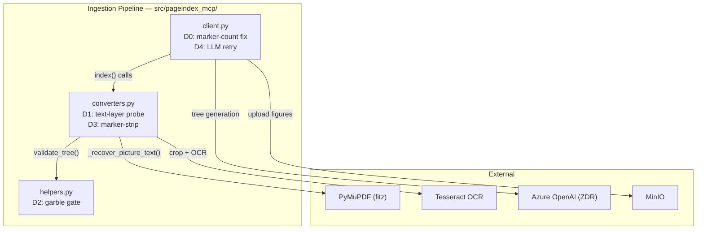
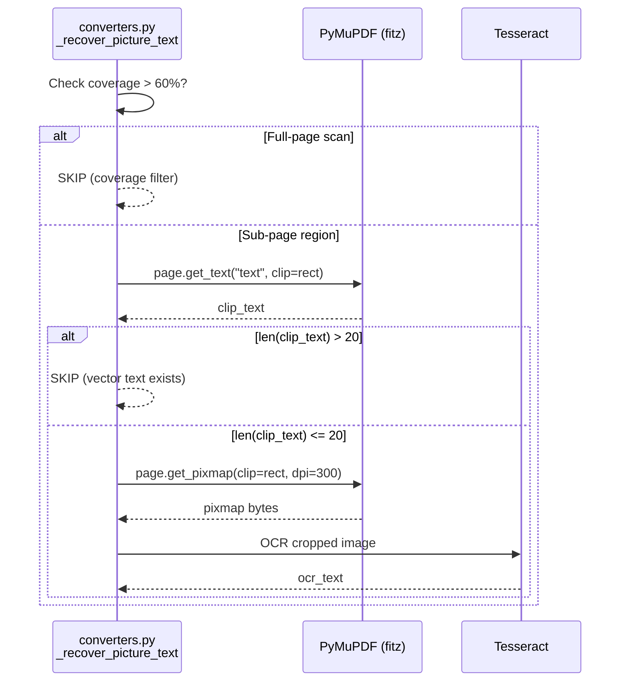
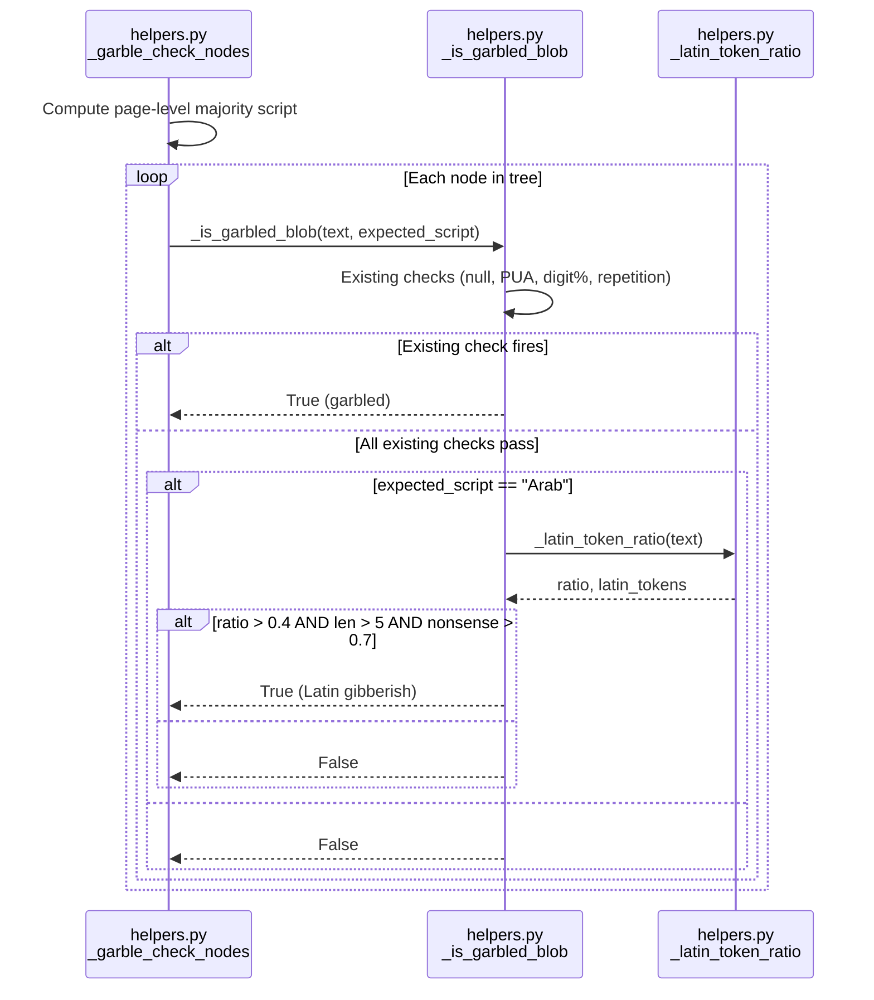
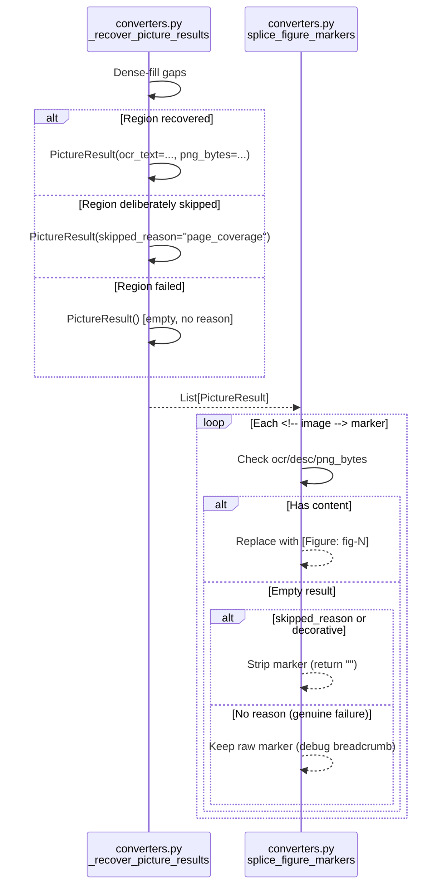
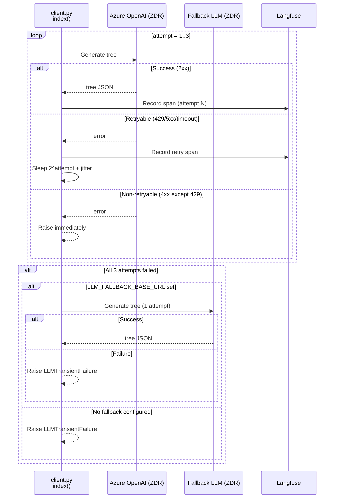

<!-- Space: CITRA -->
<!-- Title: Design: RFC-019 Corpus Reingestion Audit Remediation Phase 2 -->
<!-- Folder: Designs -->

# RFC-019 Design Document: Corpus Reingestion Audit Remediation — Phase 2

## Traceability

| Artifact | Reference |
|---|---|
| Governing RFC | [RFC-019: Corpus Reingestion Audit Remediation — Phase 2](../rfcs/019-corpus-reingestion-phase2.md) |
| PRD / Requirements | [`PRD.md`](../../PRD.md) |
| Architecture Doc | [`ARCHITECTURE.md`](../../ARCHITECTURE.md) |
| Implementation Plan | [tasks-rfc019-corpus-reingestion-phase2.md](../tasks/tasks-rfc019-corpus-reingestion-phase2.md) |
| Prior Design | [design-rfc018-corpus-audit-remediation.md](design-rfc018-corpus-audit-remediation.md) |
| Audit Source | [`audit/CORPUS_REINGESTION_AUDIT_2026-07-27.md`](../../audit/CORPUS_REINGESTION_AUDIT_2026-07-27.md) |
| Predecessor RFCs | RFC-017 (P0a/P0b), RFC-018 (D0–D3) |

## Overview

The 2026-07-27 corpus reingestion audit scored 12 PASS / 9 MARGINAL / 3 FAIL / 1 ERROR across the 25-document validation corpus. Five distinct defects account for the non-PASS population: a marker-count mismatch in standalone-image ingestion ([Issue 1](../rfcs/019-corpus-reingestion-phase2.md#issue-1--marker-count-mismatch-landed)), OCR firing over clean vector text ([Issue 2](../rfcs/019-corpus-reingestion-phase2.md#issue-2--ocr-over-clean-vector-text)), a Latin-gibberish blind spot in the garble gate ([Issue 3](../rfcs/019-corpus-reingestion-phase2.md#issue-3--garble-gate-latin-gibberish-hole)), unresolved `<!-- image -->` markers in output ([Issue 4](../rfcs/019-corpus-reingestion-phase2.md#issue-4--unresolved-markers-in-output)), and an Azure LLM transient failure ([Issue 5](../rfcs/019-corpus-reingestion-phase2.md#issue-5--azure-llm-transient-failure)). This design specifies function-level changes for fixes [D0](../rfcs/019-corpus-reingestion-phase2.md#d0-splice_figure_markers-count-guard-fix-p0--landed)–[D4](../rfcs/019-corpus-reingestion-phase2.md#d4-azure-llm-retryfallback-hardening-p2) across three source files, targeting a projected [21–22 PASS scorecard](../rfcs/019-corpus-reingestion-phase2.md#beforeafter-corpus-impact).

## Key Design Principles

1. **Fix the producer, keep the guard.** [D0](../rfcs/019-corpus-reingestion-phase2.md#d0-splice_figure_markers-count-guard-fix-p0--landed) makes the standalone-image branch produce the correct `PictureResult` count rather than relaxing `splice_figure_markers`'s count guard. The ordinal-alignment contract stays strict.
2. **Prefer known-good data.** [D1](../rfcs/019-corpus-reingestion-phase2.md#d1-text-layer-availability-probe-before-ocr-p0--implemented-uncommitted) skips OCR entirely when PyMuPDF's vector-text probe confirms text already exists under a picture bbox. Vector text is categorically more reliable than a 300-DPI crop-and-Tesseract round-trip.
3. **Detect semantically, not just structurally.** [D2](../rfcs/019-corpus-reingestion-phase2.md#d2-two-pronged-garble-gate-latin-gibberish--pua-p1) introduces script-context dictionary-ratio checking — the first heuristic that can catch well-formed nonsense (valid ASCII tokens that are semantically wrong in an Arabic context), closing a class of garble that no character-level check can see.
4. **Distinguish deliberate from accidental absence.** [D3](../rfcs/019-corpus-reingestion-phase2.md#d3-scanned-page-background-pictureitem-filter-p1--marker-strip-completion) tags coverage-skipped regions with a reason field so the marker-strip path can differentiate "recovery declined" from "recovery failed."
5. **No new egress, no new stores.** All five fixes operate on already-local bytes/text. No new LLM calls, no new MinIO prefixes, no new Redis keys. HR2/HR3/HR4 constraints are unaffected.

## Launch Constraints

- **HR1** — N/A, no positioning changes.
- **HR2** — No new derived stores. [D0](../rfcs/019-corpus-reingestion-phase2.md#d0-splice_figure_markers-count-guard-fix-p0--landed) writes only into the existing `figures/<doc_id>/` prefix already covered by `delete_doc`. [D2](../rfcs/019-corpus-reingestion-phase2.md#d2-two-pronged-garble-gate-latin-gibberish--pua-p1)/[D3](../rfcs/019-corpus-reingestion-phase2.md#d3-scanned-page-background-pictureitem-filter-p1--marker-strip-completion) are in-place text transforms with no persisted byproduct.
- **HR3** — No new LLM egress. [D0](../rfcs/019-corpus-reingestion-phase2.md#d0-splice_figure_markers-count-guard-fix-p0--landed)/[D1](../rfcs/019-corpus-reingestion-phase2.md#d1-text-layer-availability-probe-before-ocr-p0--implemented-uncommitted) use local Tesseract/`fitz`. [D2](../rfcs/019-corpus-reingestion-phase2.md#d2-two-pronged-garble-gate-latin-gibberish--pua-p1)/[D3](../rfcs/019-corpus-reingestion-phase2.md#d3-scanned-page-background-pictureitem-filter-p1--marker-strip-completion) are pure in-process computation. [D4](../rfcs/019-corpus-reingestion-phase2.md#d4-azure-llm-retryfallback-hardening-p2) retries existing ZDR-tier calls; fallback routing is constrained to ZDR endpoints only.
- **HR4** — No new AGPL imports. [D1](../rfcs/019-corpus-reingestion-phase2.md#d1-text-layer-availability-probe-before-ocr-p0--implemented-uncommitted) reuses `fitz` already imported at `converters.py:1454`.
- **HR5** — [D2](../rfcs/019-corpus-reingestion-phase2.md#d2-two-pronged-garble-gate-latin-gibberish--pua-p1) is a direct HR5 strengthening: it closes the gap where garbled text passes `validate_tree` and persists silently.

## Architecture

### High-Level System Architecture

All changes touch three files in `src/pageindex_mcp/`. No new services, workers, or storage backends are introduced.



### Architecture Decisions

<a id="ad1-fix-producer-not-guard-d0"></a>
**AD1: Fix producer, not guard** ([RFC-019 D0](../rfcs/019-corpus-reingestion-phase2.md#d0-splice_figure_markers-count-guard-fix-p0--landed)): Build `max(1, marker_count)` duplicate `PictureResult` entries rather than removing the count guard. Alternative (bypass guard) was rejected because it would reintroduce the unverified-invariant risk that finding 7 exists to prevent. Validates [Property 1](#property-1-marker-count-alignment). Implemented in [Task 1.1](../tasks/tasks-rfc019-corpus-reingestion-phase2.md#11-verify-d0-marker-count-guard).

<a id="ad2-vector-text-probe-before-ocr-d1"></a>
**AD2: Vector-text probe before OCR** ([RFC-019 D1](../rfcs/019-corpus-reingestion-phase2.md#d1-text-layer-availability-probe-before-ocr-p0--implemented-uncommitted)): Use `page.get_text("text", clip=rect)` to detect existing text before cropping for Tesseract. Alternative (LM perplexity) was rejected per Granite-258M CPU-cost lock (2026-06-12). Validates [Property 2](#property-2-vector-text-ocr-suppression). Implemented in [Task 1.3](../tasks/tasks-rfc019-corpus-reingestion-phase2.md#13-commit-d1-text-layer-probe).

<a id="ad3-script-context-dictionary-garble-d2"></a>
**AD3: Script-context dictionary-ratio garble detection** ([RFC-019 D2](../rfcs/019-corpus-reingestion-phase2.md#d2-two-pronged-garble-gate-latin-gibberish--pua-p1)): Extend `_is_garbled_blob` with an `expected_script` parameter and Latin-token nonsense-ratio check. Alternative (n-gram log-likelihood) was rejected as requiring heavier calibration. Validates [Property 3](#property-3-latin-gibberish-detection). Implemented in [Task 3.1](../tasks/tasks-rfc019-corpus-reingestion-phase2.md#31-implement-common-words-latin-detection)–[Task 3.2](../tasks/tasks-rfc019-corpus-reingestion-phase2.md#32-implement-expected-script-inference).

<a id="ad4-tagged-skip-reason-d3"></a>
**AD4: Tagged skip-reason for deliberate coverage skips** ([RFC-019 D3](../rfcs/019-corpus-reingestion-phase2.md#d3-scanned-page-background-pictureitem-filter-p1--marker-strip-completion)): Add `skipped_reason` field to `PictureResult` rather than using a separate state machine. This is the minimal change that lets `splice_figure_markers` distinguish "deliberately declined" from "genuinely failed." Validates [Property 4](#property-4-deliberate-skip-marker-strip). Implemented in [Task 2.1](../tasks/tasks-rfc019-corpus-reingestion-phase2.md#21-implement-d3-marker-strip).

<a id="ad5-bounded-retry-with-typed-failure-d4"></a>
**AD5: Bounded retry with typed failure** ([RFC-019 D4](../rfcs/019-corpus-reingestion-phase2.md#d4-azure-llm-retryfallback-hardening-p2)): Exponential-backoff retry (3 attempts, base 2s, jitter) with typed `LLMTransientFailure` on exhaustion — distinct from `low_quality_tree`. Alternative (unbounded retry) rejected to prevent amplifying load on a degraded Azure endpoint. Validates [Property 5](#property-5-llm-retry-bounded). Implemented in [Task 4.1](../tasks/tasks-rfc019-corpus-reingestion-phase2.md#41-implement-d4-retry-backoff).

### Deployment Architecture

- **Backend**: Python 3.12, FastMCP + Gunicorn/Uvicorn
- **Database**: Redis (cache + job bus)
- **Object Storage**: MinIO (`uploads/`, `processed/`, `figures/`)
- **Task Queue**: arq with Redis broker
- **LLM**: Azure OpenAI (ZDR tier), optional fallback via `LLM_FALLBACK_BASE_URL`

No new infrastructure. All changes are in-process code within existing `client.py`, `converters.py`, `helpers.py`.

### Communication Patterns

| Pattern | Use Case | Technology |
|---------|----------|------------|
| Sync function call | [D1](#ad2-vector-text-probe-before-ocr-d1) text-layer probe, [D2](#ad3-script-context-dictionary-garble-d2) garble check, [D3](#ad4-tagged-skip-reason-d3) marker strip | In-process Python |
| Async HTTP with retry | [D4](#ad5-bounded-retry-with-typed-failure-d4) LLM tree generation | `litellm` + exponential backoff |
| Async job queue | Ingestion pipeline orchestration | arq (Redis) |

### Sequence Diagrams

<a id="per-picture-ocr-flow--d1"></a>
#### Per-Picture OCR Flow (D1)



<a id="garble-detection-flow--d2"></a>
#### Garble Detection Flow (D2)



<a id="marker-resolution-flow--d3"></a>
#### Marker Resolution Flow (D3)



<a id="llm-retry-flow--d4"></a>
#### LLM Retry Flow (D4)



## Service Contracts

<a id="1-clientpy"></a>
### 1. client.py

**Responsibility**: Orchestrates document ingestion — file upload, markdown export, picture enrichment, tree generation, and storage.

**Changes for RFC-019:**

| Function | Fix | Change | Links |
|---|---|---|---|
| `index()` standalone-image branch (L555–580) | [D0](../rfcs/019-corpus-reingestion-phase2.md#d0-splice_figure_markers-count-guard-fix-p0--landed) | Count `<!-- image -->` markers; build `max(1, marker_count)` duplicate `PictureResult` entries | [Property 1](#property-1-marker-count-alignment) · [Task 1.1](../tasks/tasks-rfc019-corpus-reingestion-phase2.md#11-verify-d0-marker-count-guard) |
| `index()` LLM call path | [D4](../rfcs/019-corpus-reingestion-phase2.md#d4-azure-llm-retryfallback-hardening-p2) | Wrap tree-generation calls with bounded exponential-backoff retry; raise `LLMTransientFailure` on exhaustion | [Property 5](#property-5-llm-retry-bounded) · [Task 4.1](../tasks/tasks-rfc019-corpus-reingestion-phase2.md#41-implement-d4-retry-backoff) · [LLM Retry Flow](#llm-retry-flow--d4) |

<a id="2-converterspy"></a>
### 2. converters.py

**Responsibility**: PDF-to-markdown conversion, picture region recovery, figure-marker splicing.

**Changes for RFC-019:**

| Function | Fix | Change | Links |
|---|---|---|---|
| `_recover_picture_text()` phase 1 loop (L1474–1478) | [D1](../rfcs/019-corpus-reingestion-phase2.md#d1-text-layer-availability-probe-before-ocr-p0--implemented-uncommitted) | After coverage check, probe vector text via `page.get_text("text", clip=rect)`; skip OCR if `> _PICTURE_OCR_MIN_CHARS` (20) chars | [Property 2](#property-2-vector-text-ocr-suppression) · [Task 1.3](../tasks/tasks-rfc019-corpus-reingestion-phase2.md#13-commit-d1-text-layer-probe) · [OCR Flow](#per-picture-ocr-flow--d1) |
| `_recover_picture_results()` (~L1620) | [D3](../rfcs/019-corpus-reingestion-phase2.md#d3-scanned-page-background-pictureitem-filter-p1--marker-strip-completion) | Gap-fill with `PictureResult(skipped_reason="page_coverage")` instead of anonymous `PictureResult()` | [Property 4](#property-4-deliberate-skip-marker-strip) · [Task 2.1](../tasks/tasks-rfc019-corpus-reingestion-phase2.md#21-implement-d3-marker-strip) · [Marker Flow](#marker-resolution-flow--d3) |
| `splice_figure_markers()` (~L1560) | [D3](../rfcs/019-corpus-reingestion-phase2.md#d3-scanned-page-background-pictureitem-filter-p1--marker-strip-completion) | Branch on `skipped_reason`/`decorative`: strip marker cleanly vs. keep for debugging | [Property 4](#property-4-deliberate-skip-marker-strip) · [Task 2.1](../tasks/tasks-rfc019-corpus-reingestion-phase2.md#21-implement-d3-marker-strip) · [Marker Flow](#marker-resolution-flow--d3) |

<a id="3-helperspy"></a>
### 3. helpers.py

**Responsibility**: Tree validation, garble detection, quality-gate heuristics.

**Changes for RFC-019:**

| Function | Fix | Change | Links |
|---|---|---|---|
| `_is_garbled_blob()` | [D2](../rfcs/019-corpus-reingestion-phase2.md#d2-two-pronged-garble-gate-latin-gibberish--pua-p1) | Add optional `expected_script` parameter; append Latin-gibberish prong after existing checks | [Property 3](#property-3-latin-gibberish-detection) · [Task 3.1](../tasks/tasks-rfc019-corpus-reingestion-phase2.md#31-implement-common-words-latin-detection) · [Garble Flow](#garble-detection-flow--d2) |
| `_latin_token_ratio()` (NEW) | [D2](../rfcs/019-corpus-reingestion-phase2.md#d2-two-pronged-garble-gate-latin-gibberish--pua-p1) | Extract Latin 2+ char tokens, compute ratio against total tokens | [Property 3](#property-3-latin-gibberish-detection) · [Task 3.1](../tasks/tasks-rfc019-corpus-reingestion-phase2.md#31-implement-common-words-latin-detection) |
| `_COMMON_WORDS` (NEW) | [D2](../rfcs/019-corpus-reingestion-phase2.md#d2-two-pronged-garble-gate-latin-gibberish--pua-p1) | ~200-entry `frozenset` of English + German stopwords | [Task 3.1](../tasks/tasks-rfc019-corpus-reingestion-phase2.md#31-implement-common-words-latin-detection) |
| `_garble_check_nodes()` | [D2](../rfcs/019-corpus-reingestion-phase2.md#d2-two-pronged-garble-gate-latin-gibberish--pua-p1) | Compute page-level majority script; thread `expected_script` into `_is_garbled_blob` calls | [Property 3](#property-3-latin-gibberish-detection) · [Task 3.2](../tasks/tasks-rfc019-corpus-reingestion-phase2.md#32-implement-expected-script-inference) · [Garble Flow](#garble-detection-flow--d2) |
| `LLMTransientFailure` (NEW) | [D4](../rfcs/019-corpus-reingestion-phase2.md#d4-azure-llm-retryfallback-hardening-p2) | Typed exception for LLM retry exhaustion; arq maps to `llm_transient_failure` status | [Property 5](#property-5-llm-retry-bounded) · [Task 4.1](../tasks/tasks-rfc019-corpus-reingestion-phase2.md#41-implement-d4-retry-backoff) |

## Data Models

### PictureResult (Extended)

```python
class PictureResult(TypedDict, total=False):
    ocr_text: str
    png_bytes: bytes
    page: int
    bbox: dict             # {"l": float, "t": float, "r": float, "b": float}
    description: str
    skipped_reason: str    # NEW (D3): "page_coverage" when coverage filter fires
    decorative: bool       # existing (implicit via absence of ocr/png/desc)
```

**D3 field: `skipped_reason`** — Added by [D3](../rfcs/019-corpus-reingestion-phase2.md#d3-scanned-page-background-pictureitem-filter-p1--marker-strip-completion). Currently only value is `"page_coverage"`. Extensible for future skip reasons. Used by `splice_figure_markers` to decide strip-vs-keep.

### LLMTransientFailure (New)

```python
class LLMTransientFailure(Exception):
    """Raised when LLM tree-generation retries are exhausted on transient errors."""
    def __init__(self, attempts: int, last_status: int | None, last_error: str):
        self.attempts = attempts
        self.last_status = last_status
        self.last_error = last_error
```

**D4 exception** — Added by [D4](../rfcs/019-corpus-reingestion-phase2.md#d4-azure-llm-retryfallback-hardening-p2). The arq job handler maps this to `llm_transient_failure` job status, distinct from `low_quality_tree`. Batch tooling can auto-requeue `llm_transient_failure` jobs; `low_quality_tree` jobs require human review.

### Garble Detection Thresholds (D2)

| Threshold | Default | Override Env Var | Rationale |
|---|---|---|---|
| Latin-token ratio | 0.4 | `GARBLE_LATIN_RATIO` | Bilingual Arabic/English contracts typically run 20–30% Latin; false-Latin OCR output runs 60–80% |
| Minimum Latin tokens | 5 | (hardcoded) | Avoids false positives on short nodes with 1–2 English loanwords |
| Nonsense ratio | 0.7 | `GARBLE_NONSENSE_RATIO` | False-Latin tokens are random syllables; real English prose scores < 0.3 against the stopword set |
| Kill switch | `true` | `GARBLE_LATIN_GIBBERISH_ENABLED` | Disables entire Latin-gibberish prong without code change |

## Correctness Properties

*A property is a characteristic or behavior that should hold true across all valid executions of the system — a formal statement about what the system should do. Properties serve as the bridge between human-readable specifications and machine-verifiable correctness guarantees.*

<a id="property-1-marker-count-alignment"></a>
### Property 1: Marker-Count Alignment

*For any* standalone image upload where Docling's `image_to_markdown` emits N `<!-- image -->` markers (N >= 0), the system SHALL build exactly `max(1, N)` `PictureResult` entries, satisfying `splice_figure_markers`'s `marker_count == len(pics)` guard without bypassing it.

- **Validates:** [RFC-019 D0](../rfcs/019-corpus-reingestion-phase2.md#d0-splice_figure_markers-count-guard-fix-p0--landed)
- **Tested in:** [Task 1.1](../tasks/tasks-rfc019-corpus-reingestion-phase2.md#11-verify-d0-marker-count-guard) (`TestStandaloneImageEnrichment`), [Task 1.2](../tasks/tasks-rfc019-corpus-reingestion-phase2.md#12-add-multi-marker-raster-test) (`test_multi_marker_raster`)
- **Service contract:** [1. client.py](#1-clientpy)
- **Sequence diagram:** N/A (single function, no multi-component flow)

<a id="property-2-vector-text-ocr-suppression"></a>
### Property 2: Vector-Text OCR Suppression

*For any* picture region where `page.get_text("text", clip=rect)` returns more than `_PICTURE_OCR_MIN_CHARS` (20) characters of vector text, the system SHALL skip Tesseract OCR for that region, preserving the original vector text without corruption.

- **Validates:** [RFC-019 D1](../rfcs/019-corpus-reingestion-phase2.md#d1-text-layer-availability-probe-before-ocr-p0--implemented-uncommitted)
- **Tested in:** [Task 1.4](../tasks/tasks-rfc019-corpus-reingestion-phase2.md#14-d1-boundary-and-env-override-tests) (boundary tests at 0, 20, 25 chars + env override)
- **Service contract:** [2. converters.py](#2-converterspy)
- **Sequence diagram:** [Per-Picture OCR Flow](#per-picture-ocr-flow--d1)

<a id="property-3-latin-gibberish-detection"></a>
### Property 3: Latin-Gibberish Detection

*For any* text node where the expected script is Arabic and more than 40% of tokens are Latin-script, with more than 5 Latin tokens and more than 70% of those tokens absent from `_COMMON_WORDS`, the system SHALL flag the node as garbled, triggering `validate_tree()` failure and OCR escalation per Hard Rule 5.

- **Validates:** [RFC-019 D2](../rfcs/019-corpus-reingestion-phase2.md#d2-two-pronged-garble-gate-latin-gibberish--pua-p1)
- **Tested in:** [Task 3.3](../tasks/tasks-rfc019-corpus-reingestion-phase2.md#33-d2-fixture-and-regression-tests) (fixture tests: MOU MOHRE, qarar 106/2022, warid 597; negative cases: bilingual docs)
- **Service contract:** [3. helpers.py](#3-helperspy)
- **Sequence diagram:** [Garble Detection Flow](#garble-detection-flow--d2)

<a id="property-4-deliberate-skip-marker-strip"></a>
### Property 4: Deliberate-Skip Marker Strip

*For any* `PictureResult` with `skipped_reason` set (or `decorative=True`), `splice_figure_markers` SHALL remove the corresponding `<!-- image -->` marker entirely (return `""`). *For any* `PictureResult` with no content and no `skipped_reason`, the marker SHALL be preserved verbatim as a debug breadcrumb.

- **Validates:** [RFC-019 D3](../rfcs/019-corpus-reingestion-phase2.md#d3-scanned-page-background-pictureitem-filter-p1--marker-strip-completion)
- **Tested in:** [Task 2.2](../tasks/tasks-rfc019-corpus-reingestion-phase2.md#22-d3-test-coverage) (`TestPageCoverageFilter`: strip vs. preserve, env toggle)
- **Service contract:** [2. converters.py](#2-converterspy)
- **Sequence diagram:** [Marker Resolution Flow](#marker-resolution-flow--d3)

<a id="property-5-llm-retry-bounded"></a>
### Property 5: LLM Retry Bounded

*For any* LLM tree-generation call that fails with a retryable error (429, 5xx, `ConnectionError`, `ReadTimeout`), the system SHALL retry at most `LLM_TREE_MAX_RETRIES` (default 3) times with exponential backoff (base 2s + jitter), then raise `LLMTransientFailure`. Non-retryable errors (4xx except 429) SHALL fail immediately with no retry.

- **Validates:** [RFC-019 D4](../rfcs/019-corpus-reingestion-phase2.md#d4-azure-llm-retryfallback-hardening-p2)
- **Tested in:** [Task 4.2](../tasks/tasks-rfc019-corpus-reingestion-phase2.md#42-d4-retry-unit-tests) (retry success, exhaustion, non-retryable, fallback, max-retries=1)
- **Service contract:** [1. client.py](#1-clientpy)
- **Sequence diagram:** [LLM Retry Flow](#llm-retry-flow--d4)

## Error Handling

### Error Categories & Responses

| Category | Arq Job Status | Retry Strategy | Introduced By |
|----------|---------------|----------------|---------------|
| Tree validation failure | `low_quality_tree` | No retry (human review) | Existing |
| LLM transient failure | `llm_transient_failure` | Auto-requeue by batch tooling | [D4](../rfcs/019-corpus-reingestion-phase2.md#d4-azure-llm-retryfallback-hardening-p2) |
| LLM auth/request error | `llm_error` | No retry (config fix required) | Existing |
| Garble detection trigger | `low_quality_tree` | OCR escalation path | [D2](../rfcs/019-corpus-reingestion-phase2.md#d2-two-pronged-garble-gate-latin-gibberish--pua-p1) strengthens |

### D4 Retry Classification

| Condition | Retryable? | Behavior |
|-----------|-----------|----------|
| HTTP 429 (rate limit) | Yes | Respect `Retry-After` header (capped 60s), else backoff |
| HTTP 5xx (server error) | Yes | Exponential backoff with jitter |
| `ConnectionError` | Yes | Exponential backoff with jitter |
| `ReadTimeout` | Yes | Exponential backoff with jitter |
| HTTP 4xx (except 429) | No | Fail immediately |
| `AuthenticationError` | No | Fail immediately |
| Malformed request | No | Fail immediately |

### Observability

- Each retry attempt logged at WARNING: attempt number, status code, backoff duration
- Langfuse spans: `retry_attempt`, `retry_reason` metadata on LLM generation span
- Prometheus: `LLM_RETRIES_TOTAL` counter (labels: `status_code`, `attempt`)

## Testing Strategy

### Testing Layers

1. **Unit Tests**: Cover specific examples, edge cases, error conditions per [Property 1](#property-1-marker-count-alignment)–[Property 5](#property-5-llm-retry-bounded).
2. **Fixture Tests**: Real garbled strings from corpus FAIL docs validate [Property 3](#property-3-latin-gibberish-detection).
3. **Integration Tests**: Spot and full corpus reingestion validate end-to-end scorecard improvement.

### Test Categories by Service

| Service | Properties Covered | Test Tasks | Key Test Areas |
|---------|-------------------|------------|----------------|
| [client.py](#1-clientpy) | [P1](#property-1-marker-count-alignment), [P5](#property-5-llm-retry-bounded) | [T1.1](../tasks/tasks-rfc019-corpus-reingestion-phase2.md#11-verify-d0-marker-count-guard), [T1.2](../tasks/tasks-rfc019-corpus-reingestion-phase2.md#12-add-multi-marker-raster-test), [T4.1](../tasks/tasks-rfc019-corpus-reingestion-phase2.md#41-implement-d4-retry-backoff), [T4.2](../tasks/tasks-rfc019-corpus-reingestion-phase2.md#42-d4-retry-unit-tests) | Multi-marker raster, retry/exhaustion/fallback |
| [converters.py](#2-converterspy) | [P2](#property-2-vector-text-ocr-suppression), [P4](#property-4-deliberate-skip-marker-strip) | [T1.4](../tasks/tasks-rfc019-corpus-reingestion-phase2.md#14-d1-boundary-and-env-override-tests), [T2.2](../tasks/tasks-rfc019-corpus-reingestion-phase2.md#22-d3-test-coverage) | Vector-text boundary, strip vs. preserve |
| [helpers.py](#3-helperspy) | [P3](#property-3-latin-gibberish-detection) | [T3.3](../tasks/tasks-rfc019-corpus-reingestion-phase2.md#33-d2-fixture-and-regression-tests) | Arabic garble fixtures, bilingual negatives, env kill-switch |

### Key Test Scenarios

**Critical Path Tests:**

1. Standalone JPG producing 3 `<!-- image -->` markers resolves to 3 `[Figure: fig-N]` blocks — [Task 1.2](../tasks/tasks-rfc019-corpus-reingestion-phase2.md#12-add-multi-marker-raster-test)
2. Chart region with 25 chars vector text skips OCR, preserving clean labels — [Task 1.4](../tasks/tasks-rfc019-corpus-reingestion-phase2.md#14-d1-boundary-and-env-override-tests)
3. MOU MOHRE false-Latin output flagged garbled, triggers OCR escalation — [Task 3.3](../tasks/tasks-rfc019-corpus-reingestion-phase2.md#33-d2-fixture-and-regression-tests)
4. Coverage-skipped region marker stripped; genuine failure marker preserved — [Task 2.2](../tasks/tasks-rfc019-corpus-reingestion-phase2.md#22-d3-test-coverage)
5. LLM 429 on attempt 1, success on attempt 2, result returned — [Task 4.2](../tasks/tasks-rfc019-corpus-reingestion-phase2.md#42-d4-retry-unit-tests)

**Edge Cases:**

- Zero `<!-- image -->` markers from Docling raster input — `max(1, 0)` produces one `PictureResult`
- Exactly 20 chars vector text — OCR fires (`>` not `>=`)
- Short node (<50 chars) with one Latin loanword in Arabic context — NOT flagged (minimum 5 tokens)
- `GARBLE_LATIN_GIBBERISH_ENABLED=false` — Latin-gibberish prong does not fire even on known-garbled input
- `LLM_TREE_MAX_RETRIES=1` — single attempt, no retry
- `STRIP_SKIPPED_IMAGE_MARKERS=false` — marker preserved even for skipped results

## Migration and Rollback

**Deployment order.** Phases are independent commits, deployable individually:

1. **[Phase 1](../tasks/tasks-rfc019-corpus-reingestion-phase2.md#1-phase-1--commit-staged-work-d0-d1)** ([D0](../rfcs/019-corpus-reingestion-phase2.md#d0-splice_figure_markers-count-guard-fix-p0--landed) verification + [D1](../rfcs/019-corpus-reingestion-phase2.md#d1-text-layer-availability-probe-before-ocr-p0--implemented-uncommitted) commit): Commit uncommitted working tree. Zero new code; unblocks CI.
2. **[Phase 2](../tasks/tasks-rfc019-corpus-reingestion-phase2.md#2-phase-2--d3-marker-strip)** ([D3](../rfcs/019-corpus-reingestion-phase2.md#d3-scanned-page-background-pictureitem-filter-p1--marker-strip-completion) marker-strip): ~15 LOC. Independent of Phase 1.
3. **[Phase 3](../tasks/tasks-rfc019-corpus-reingestion-phase2.md#3-phase-3--d2-garble-gate)** ([D2](../rfcs/019-corpus-reingestion-phase2.md#d2-two-pronged-garble-gate-latin-gibberish--pua-p1) garble gate): ~40 LOC. Independent of Phases 1–2 but both required for full coverage.
4. **[Phase 4](../tasks/tasks-rfc019-corpus-reingestion-phase2.md#4-phase-4--d4-llm-retry)** ([D4](../rfcs/019-corpus-reingestion-phase2.md#d4-azure-llm-retryfallback-hardening-p2) retry): Independent of all above.

**Rollback levers per fix:**

| Fix | Rollback Mechanism | Effect |
|---|---|---|
| [D0](../rfcs/019-corpus-reingestion-phase2.md#d0-splice_figure_markers-count-guard-fix-p0--landed) | Git revert of `cad3f63` | Standalone images lose enrichment (pre-fix state) |
| [D1](../rfcs/019-corpus-reingestion-phase2.md#d1-text-layer-availability-probe-before-ocr-p0--implemented-uncommitted) | Set `_PICTURE_OCR_MIN_CHARS=999999` | OCR fires on all sub-coverage regions (pre-D1 behavior) |
| [D2](../rfcs/019-corpus-reingestion-phase2.md#d2-two-pronged-garble-gate-latin-gibberish--pua-p1) | Set `GARBLE_LATIN_GIBBERISH_ENABLED=false` | Latin-gibberish prong disabled; existing checks unchanged |
| [D3](../rfcs/019-corpus-reingestion-phase2.md#d3-scanned-page-background-pictureitem-filter-p1--marker-strip-completion) | Set `STRIP_SKIPPED_IMAGE_MARKERS=false` | Coverage-skipped markers preserved verbatim (pre-D3 behavior) |
| [D4](../rfcs/019-corpus-reingestion-phase2.md#d4-azure-llm-retryfallback-hardening-p2) | Set `LLM_TREE_MAX_RETRIES=1` | Single attempt, no retry (current behavior) |

**Reingestion requirement.** All fixes apply to future ingestions only. Already-persisted trees retain their current content. A full corpus reingestion ([Phase 5 checkpoint](../tasks/tasks-rfc019-corpus-reingestion-phase2.md#5-phase-5--final-validation)) is required to realize the projected [scorecard improvement](../rfcs/019-corpus-reingestion-phase2.md#beforeafter-corpus-impact).

**Open questions.** See [RFC-019 Open Questions](../rfcs/019-corpus-reingestion-phase2.md#open-questions) and [RFC-019 Risks](../rfcs/019-corpus-reingestion-phase2.md#risks--mitigations).
