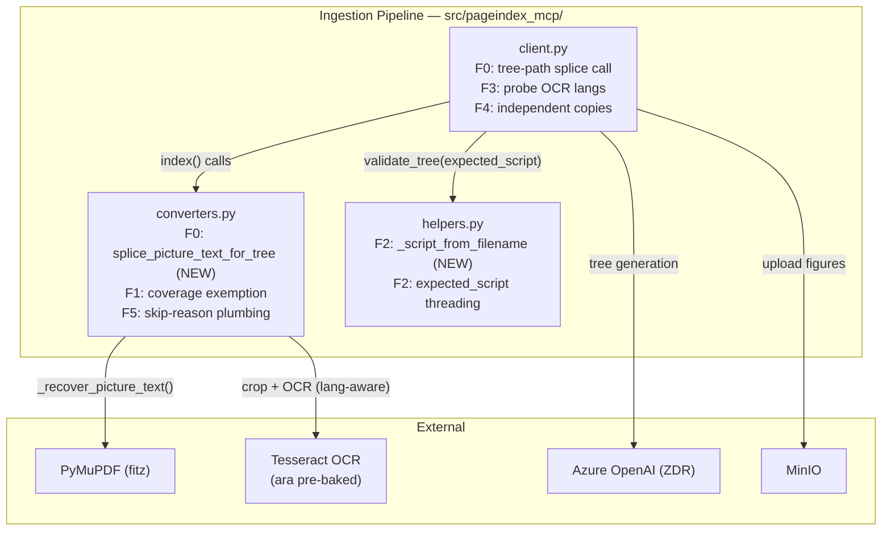
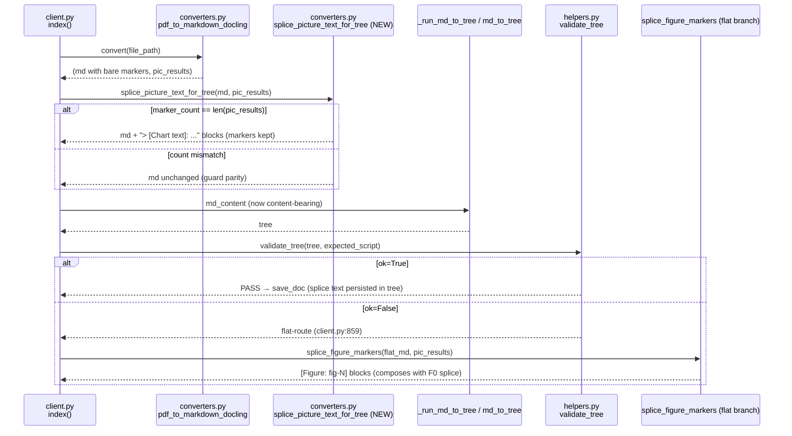
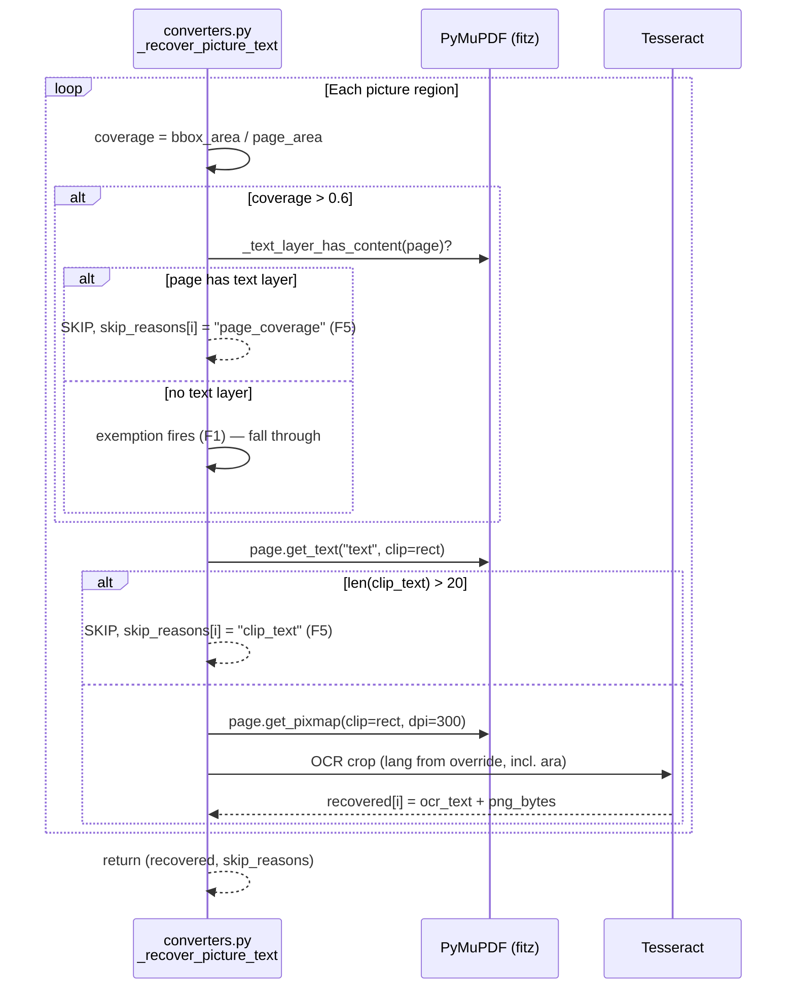
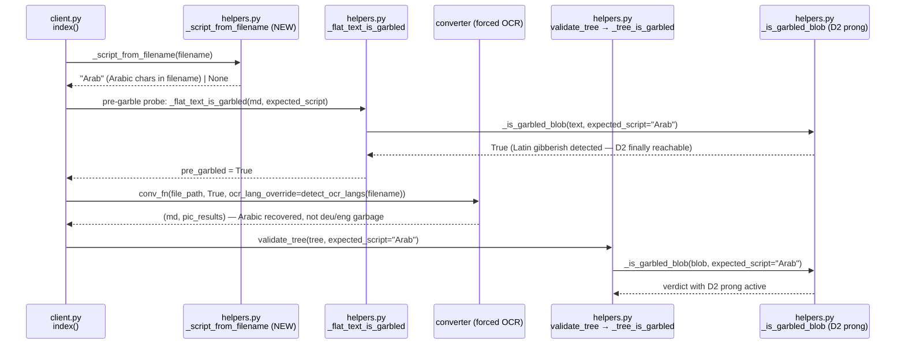

<!-- Space: CITRA -->
<!-- Title: Design: RFC-020 Run 3 Regression Remediation -->
<!-- Folder: Designs -->

# RFC-020 Design Document: Run 3 Regression Remediation — Tree/Image/Garble Pipeline Fixes

## Traceability

| Artifact            | Reference                                                                                          |
| ------------------- | -------------------------------------------------------------------------------------------------- |
| Governing RFC       | [RFC-020: Run 3 Regression Remediation](../rfcs/020-run3-regression-remediation.md)                 |
| PRD / Requirements  | [`PRD.md`](../../PRD.md)                                                                          |
| Architecture Doc    | [`ARCHITECTURE.md`](../../ARCHITECTURE.md)                                                        |
| Implementation Plan | [tasks-rfc020-run3-regression-remediation.md](../tasks/tasks-rfc020-run3-regression-remediation.md) |
| Prior Design        | [design-rfc019-corpus-reingestion-phase2.md](design-rfc019-corpus-reingestion-phase2.md)            |
| Audit Source        | Run 3 corpus reingestion audit, 2026-07-27 (`audit/`)                                            |
| Predecessor RFCs    | RFC-017 (P0a/P0b), RFC-018 (D0-D3), RFC-019 (D0-D4)                                                |

## Overview

The Run 3 corpus reingestion audit scored 8 PASS / 11 MARGINAL / 5 FAIL / 1 ERROR across 25 docs — a net regression from Run 2, with 7 regressions caused by `feat/image-block-picture-ocr` branch changes. Three regression categories drive the damage: a tree-to-flat collapse of 5 Arabic scanned PDFs ([Regression 1](../rfcs/020-run3-regression-remediation.md#regression-1--tree-to-flat-collapse-of-arabic-scanned-pdfs-docs-17-20-23)), zero image enrichment on 2 embedded-picture docs ([Regression 2](../rfcs/020-run3-regression-remediation.md#regression-2--zero-image-enrichment-docs-3-9)), and a garble-gate gap that let 60k chars of Latin gibberish persist ([Regression 3](../rfcs/020-run3-regression-remediation.md#regression-3--garble-gate-gap-doc-24)). This design specifies function-level changes for fixes [F0](../rfcs/020-run3-regression-remediation.md#f0-restore-per-picture-ocr-splice-to-tree-path-p0--critical)–[F5](../rfcs/020-run3-regression-remediation.md#f5-accurate-skipped_reason-attribution-in-_recover_picture_results-p2) across three source files, targeting the projected [15–17 PASS scorecard](../rfcs/020-run3-regression-remediation.md#beforeafter-corpus-impact).

## Key Design Principles

1. **One markdown, two consumers.** [F0](../rfcs/020-run3-regression-remediation.md#f0-restore-per-picture-ocr-splice-to-tree-path-p0--critical) splices recovered picture OCR into the markdown *before* it forks into tree and flat paths, so `md_to_tree` and `splice_figure_markers` both see it. No path-specific enrichment logic; the RFC-017 decoupling of *VLM describe* from page OCR is preserved — only the already-recovered text splice is restored.
2. **Filters must know when they're the last resort.** [F1](../rfcs/020-run3-regression-remediation.md#f1-exempt-no-text-layer-full-page-scans-from-the-coverage-filter-p0) keeps RFC-018 D0's waste-prevention intent (skip decorative full-page backgrounds *over real text*) but exempts pages with no usable text layer, where the picture IS the content.
3. **Out-of-band signals beat in-band inference.** [F2](../rfcs/020-run3-regression-remediation.md#f2-filename-derived-expected_script-for-garble-gate-callers-p0) derives `expected_script` from the filename — a signal corrupted text cannot poison — fixing the self-defeating loop where `_infer_script` reads Latin gibberish and concludes "Latn". [F3](../rfcs/020-run3-regression-remediation.md#f3-arabic-aware-ocr-language-for-the-pre-garble-probe-p1) applies the same principle to OCR language selection.
4. **Guards are preserved, never bypassed.** [F0](../rfcs/020-run3-regression-remediation.md#f0-restore-per-picture-ocr-splice-to-tree-path-p0--critical) reuses the `marker_count == len(pics)` ordinal guard verbatim (RFC-019 AD1 lineage); [F4](../rfcs/020-run3-regression-remediation.md#f4-independent-pictureresult-copies-in-the-standalone-image-path-p1) keeps the guard-satisfying count while fixing object identity.
5. **No new egress, no new stores.** All six fixes operate on already-local bytes/text: local Tesseract, local `fitz`, in-process string transforms. No new LLM calls, MinIO prefixes, or Redis keys — HR2/HR3/HR4 unaffected.

## Launch Constraints

- **HR1** — N/A; no positioning changes.
- **HR2** — No new derived stores. [F0](../rfcs/020-run3-regression-remediation.md#f0-restore-per-picture-ocr-splice-to-tree-path-p0--critical)–[F5](../rfcs/020-run3-regression-remediation.md#f5-accurate-skipped_reason-attribution-in-_recover_picture_results-p2) are in-process transforms writing only to existing `processed/` and `figures/` prefixes already covered by the erasure cascade.
- **HR3** — No new LLM egress. [F0](../rfcs/020-run3-regression-remediation.md#f0-restore-per-picture-ocr-splice-to-tree-path-p0--critical)/[F1](../rfcs/020-run3-regression-remediation.md#f1-exempt-no-text-layer-full-page-scans-from-the-coverage-filter-p0)/[F3](../rfcs/020-run3-regression-remediation.md#f3-arabic-aware-ocr-language-for-the-pre-garble-probe-p1) use local Tesseract/`fitz`; [F2](../rfcs/020-run3-regression-remediation.md#f2-filename-derived-expected_script-for-garble-gate-callers-p0)/[F4](../rfcs/020-run3-regression-remediation.md#f4-independent-pictureresult-copies-in-the-standalone-image-path-p1)/[F5](../rfcs/020-run3-regression-remediation.md#f5-accurate-skipped_reason-attribution-in-_recover_picture_results-p2) are pure computation. Recovered Arabic OCR text flowing to tree-generation LLM calls stays on the existing ZDR-tier route.
- **HR4** — No new AGPL imports. [F1](../rfcs/020-run3-regression-remediation.md#f1-exempt-no-text-layer-full-page-scans-from-the-coverage-filter-p0) reuses `fitz` already imported in `converters.py`.
- **HR5** — [F2](../rfcs/020-run3-regression-remediation.md#f2-filename-derived-expected_script-for-garble-gate-callers-p0) is a direct HR5 repair: doc 24's low-quality content currently persists silently because the D2 prong is unreachable in production; after F2 it fails `validate_tree` and escalates. [F0](../rfcs/020-run3-regression-remediation.md#f0-restore-per-picture-ocr-splice-to-tree-path-p0--critical) also serves HR5's spirit — `validate_tree` runs against markdown that actually contains the document's content, so its verdicts are meaningful.

## Architecture

### High-Level System Architecture

All changes touch three files in `src/pageindex_mcp/`. No new services, workers, or storage backends.



### Architecture Decisions

<a id="ad1-splice-markdown-before-tree-parse-f0"></a>
**AD1: Splice markdown before tree parse, not tree nodes after** ([RFC-020 F0](../rfcs/020-run3-regression-remediation.md#f0-restore-per-picture-ocr-splice-to-tree-path-p0--critical)): New `splice_picture_text_for_tree(md, pics)` appends `> [Chart text]:` blocks after markers in the markdown *before* it is written to disk and forked to tree/flat paths. Alternative (post-parse tree-node enrichment) rejected — requires marker→node matching that doesn't exist and adds a second ordinal-alignment invariant. Restores master's `_maybe_splice_picture_ocr` semantics. Validates [Property 1](#property-1-tree-path-ocr-splice-parity). Implemented in [Task 1.1](../tasks/tasks-rfc020-run3-regression-remediation.md#11-implement-tree-path-splice-helper)–[Task 1.2](../tasks/tasks-rfc020-run3-regression-remediation.md#12-wire-splice-into-clientindex).

<a id="ad2-text-layer-gated-coverage-exemption-f1"></a>
**AD2: Text-layer-gated coverage exemption** ([RFC-020 F1](../rfcs/020-run3-regression-remediation.md#f1-exempt-no-text-layer-full-page-scans-from-the-coverage-filter-p0)): The >60% page-coverage skip applies only when `_text_layer_has_content(page)` is true. Alternative (lower the threshold) rejected — no threshold separates "decorative background" from "full-page scan"; the text layer is the discriminating signal. Validates [Property 2](#property-2-full-page-scan-text-recovery). Implemented in [Task 2.1](../tasks/tasks-rfc020-run3-regression-remediation.md#21-implement-f1-coverage-exemption).

<a id="ad3-filename-derived-expected-script-f2"></a>
**AD3: Filename-derived expected_script with inference fallback** ([RFC-020 F2](../rfcs/020-run3-regression-remediation.md#f2-filename-derived-expected_script-for-garble-gate-callers-p0)): `_script_from_filename` reuses `detect_ocr_langs`'s Arabic detection; callers prefer it and fall back to `_infer_script` only when the filename yields `None`. Alternative (fix `_infer_script` to be corruption-resistant) rejected — no in-band inference can distinguish "genuinely Latin doc" from "fully Latin-garbled Arabic doc"; the information simply isn't in the text. Validates [Property 3](#property-3-filename-derived-script-garble-detection). Implemented in [Task 3.1](../tasks/tasks-rfc020-run3-regression-remediation.md#31-implement-f2-expected-script-threading).

<a id="ad4-reuse-detect-ocr-langs-for-probe-f3"></a>
**AD4: Reuse detect_ocr_langs for the pre-garble probe** ([RFC-020 F3](../rfcs/020-run3-regression-remediation.md#f3-arabic-aware-ocr-language-for-the-pre-garble-probe-p1)): The probe's forced-OCR call passes `ocr_lang_override=detect_ocr_langs(filename)`, restoring parity with master's escalation path (`client.py:724-731`). Alternative (new probe-specific language config) rejected — one detection function, two call sites, zero drift. Validates [Property 4](#property-4-arabic-ocr-language-selection). Implemented in [Task 3.2](../tasks/tasks-rfc020-run3-regression-remediation.md#32-implement-f3-ocr-lang-override).

<a id="ad5-independent-pictureresult-copies-f4"></a>
**AD5: Independent PictureResult copies via comprehension** ([RFC-020 F4](../rfcs/020-run3-regression-remediation.md#f4-independent-pictureresult-copies-in-the-standalone-image-path-p1)): Replace list multiplication with a list comprehension; `png_bytes` (immutable) may alias, dict containers may not. Alternative (`copy.deepcopy` per entry) rejected — needlessly copies megabytes of image bytes. Validates [Property 5](#property-5-independent-pictureresult-copies). Implemented in [Task 4.1](../tasks/tasks-rfc020-run3-regression-remediation.md#41-implement-f4-independent-copies).

<a id="ad6-skip-reason-returned-from-source-f5"></a>
**AD6: Skip reasons returned from the deciding function** ([RFC-020 F5](../rfcs/020-run3-regression-remediation.md#f5-accurate-skipped_reason-attribution-in-_recover_picture_results-p2)): `_recover_picture_text` returns `(recovered, skip_reasons)` so `_recover_picture_results` records the *actual* filter that fired instead of hardcoding `"page_coverage"`. Alternative (log-only) rejected — the reason must travel with the `PictureResult` to be visible in stored meta and audits. Validates [Property 6](#property-6-accurate-skip-reason-attribution). Implemented in [Task 2.2](../tasks/tasks-rfc020-run3-regression-remediation.md#22-implement-f5-skip-reason-plumbing).

### Deployment Architecture

- **Backend**: Python 3.12, FastMCP + Gunicorn/Uvicorn
- **Database**: Redis (cache + job bus)
- **Object Storage**: MinIO (`uploads/`, `processed/`, `figures/`)
- **Task Queue**: arq with Redis broker
- **OCR**: Tesseract with `ara` tessdata pre-baked (RFC-005)
- **LLM**: Azure OpenAI (ZDR tier)

No new infrastructure. All changes are in-process code within `client.py`, `converters.py`, `helpers.py`. Expected operational deltas: OCR CPU time increases on full-page-scan corpora ([F1](../rfcs/020-run3-regression-remediation.md#f1-exempt-no-text-layer-full-page-scans-from-the-coverage-filter-p0) — intended work, not waste); tree-generation prompts grow by spliced OCR text ([F0](../rfcs/020-run3-regression-remediation.md#f0-restore-per-picture-ocr-splice-to-tree-path-p0--critical) — parity with master).

### Communication Patterns

| Pattern                  | Use Case                                                                                                                                                                                                                                      | Technology                                |
| ------------------------ | --------------------------------------------------------------------------------------------------------------------------------------------------------------------------------------------------------------------------------------------- | ----------------------------------------- |
| Sync function call       | [F0](#ad1-splice-markdown-before-tree-parse-f0) splice, [F1](#ad2-text-layer-gated-coverage-exemption-f1) exemption, [F2](#ad3-filename-derived-expected-script-f2) script threading, [F5](#ad6-skip-reason-returned-from-source-f5) skip reasons | In-process Python                         |
| Thread-pooled conversion | [F3](#ad4-reuse-detect-ocr-langs-for-probe-f3) forced OCR re-conversion with `ocr_lang_override`                                                                                                                                             | `asyncio.to_thread` + Docling/Tesseract |
| Async job queue          | Ingestion pipeline orchestration                                                                                                                                                                                                              | arq (Redis)                               |

### Sequence Diagrams

<a id="tree-path-splice-flow--f0"></a>

#### Tree-Path Splice Flow (F0)



<a id="full-page-scan-recovery-flow--f1"></a>

#### Full-Page Scan Recovery Flow (F1 + F5)



<a id="garble-script-threading-flow--f2f3"></a>

#### Garble Script-Threading Flow (F2 + F3)



## Service Contracts

<a id="1-clientpy"></a>

### 1. client.py

**Responsibility**: Orchestrates document ingestion — conversion, pre-garble probing, picture enrichment, tree generation, validation, storage.

**Changes for RFC-020:**

| Function                                                                                                       | Fix                                                                                                                 | Change                                                                                                                                                                                              | Links                                                                                                                                                                                                                               |
| -------------------------------------------------------------------------------------------------------------- | ------------------------------------------------------------------------------------------------------------------- | --------------------------------------------------------------------------------------------------------------------------------------------------------------------------------------------------- | ----------------------------------------------------------------------------------------------------------------------------------------------------------------------------------------------------------------------------------- |
| `index()` post-conversion, pre-`_run_md_to_tree` (before markdown persisted; `_run_md_to_tree` at L1188) | [F0](../rfcs/020-run3-regression-remediation.md#f0-restore-per-picture-ocr-splice-to-tree-path-p0--critical)         | Call`splice_picture_text_for_tree(md_content, pic_results)` when `pic_results` non-empty and `TREE_PATH_PICTURE_SPLICE_ENABLED` (default on); spliced markdown feeds both tree and flat paths | [Property 1](#property-1-tree-path-ocr-splice-parity) · [Task 1.2](../tasks/tasks-rfc020-run3-regression-remediation.md#12-wire-splice-into-clientindex) · [Splice Flow](#tree-path-splice-flow--f0)                                 |
| `index()` pre-garble forced-OCR call (L553-556)                                                              | [F3](../rfcs/020-run3-regression-remediation.md#f3-arabic-aware-ocr-language-for-the-pre-garble-probe-p1)            | `conv_fn(file_path, True, ocr_lang_override=detect_ocr_langs(filename))` — restores master's escalation-path language detection (was L724-731)                                                   | [Property 4](#property-4-arabic-ocr-language-selection) · [Task 3.2](../tasks/tasks-rfc020-run3-regression-remediation.md#32-implement-f3-ocr-lang-override) · [Garble Flow](#garble-script-threading-flow--f2f3)                    |
| `index()` pre-garble probe (L531-548) + `validate_tree` call                                               | [F2](../rfcs/020-run3-regression-remediation.md#f2-filename-derived-expected_script-for-garble-gate-callers-p0)      | Compute`expected_script = _script_from_filename(filename)` once; pass to `_flat_text_is_garbled` and `validate_tree`                                                                          | [Property 3](#property-3-filename-derived-script-garble-detection) · [Task 3.1](../tasks/tasks-rfc020-run3-regression-remediation.md#31-implement-f2-expected-script-threading) · [Garble Flow](#garble-script-threading-flow--f2f3) |
| `index()` standalone-image branch (L667-692; bug at L679-686)                                                | [F4](../rfcs/020-run3-regression-remediation.md#f4-independent-pictureresult-copies-in-the-standalone-image-path-p1) | List comprehension`[PictureResult(...) for _ in range(max(1, marker_count))]` replaces `* max(1, marker_count)`                                                                                 | [Property 5](#property-5-independent-pictureresult-copies) · [Task 4.1](../tasks/tasks-rfc020-run3-regression-remediation.md#41-implement-f4-independent-copies)                                                                     |

<a id="2-converterspy"></a>

### 2. converters.py

**Responsibility**: PDF/image-to-markdown conversion, picture region recovery, figure-marker splicing, OCR language detection.

**Changes for RFC-020:**

| Function                                                                              | Fix                                                                                                                   | Change                                                                                                                                                                                                                       | Links                                                                                                                                                                                                                  |
| ------------------------------------------------------------------------------------- | --------------------------------------------------------------------------------------------------------------------- | ---------------------------------------------------------------------------------------------------------------------------------------------------------------------------------------------------------------------------- | ---------------------------------------------------------------------------------------------------------------------------------------------------------------------------------------------------------------------- |
| `splice_picture_text_for_tree()` (NEW, beside `splice_figure_markers` L1536-1581) | [F0](../rfcs/020-run3-regression-remediation.md#f0-restore-per-picture-ocr-splice-to-tree-path-p0--critical)           | Append`> [Chart text]: {ocr_text}` after each marker with non-empty `ocr_text`; keep markers; apply `marker_count == len(pics)` guard; `def splice_picture_text_for_tree(md: str, pics: list[PictureResult]) -> str` | [Property 1](#property-1-tree-path-ocr-splice-parity) · [Task 1.1](../tasks/tasks-rfc020-run3-regression-remediation.md#11-implement-tree-path-splice-helper) · [Splice Flow](#tree-path-splice-flow--f0)               |
| `_recover_picture_text()` coverage filter (L1471-1474)                              | [F1](../rfcs/020-run3-regression-remediation.md#f1-exempt-no-text-layer-full-page-scans-from-the-coverage-filter-p0)   | Coverage skip fires only when`_text_layer_has_content(page)`; no-text-layer full-page regions fall through to OCR; `COVERAGE_EXEMPT_NO_TEXT_LAYER` env (default on)                                                      | [Property 2](#property-2-full-page-scan-text-recovery) · [Task 2.1](../tasks/tasks-rfc020-run3-regression-remediation.md#21-implement-f1-coverage-exemption) · [Recovery Flow](#full-page-scan-recovery-flow--f1)       |
| `_recover_picture_text()` return (L1427-1527)                                       | [F5](../rfcs/020-run3-regression-remediation.md#f5-accurate-skipped_reason-attribution-in-_recover_picture_results-p2) | Return`(recovered, skip_reasons: dict[int, str])` with values `"page_coverage"` / `"clip_text"`                                                                                                                        | [Property 6](#property-6-accurate-skip-reason-attribution) · [Task 2.2](../tasks/tasks-rfc020-run3-regression-remediation.md#22-implement-f5-skip-reason-plumbing) · [Recovery Flow](#full-page-scan-recovery-flow--f1) |
| `_recover_picture_results()` (L1598-1636; hardcode at L1628)                        | [F5](../rfcs/020-run3-regression-remediation.md#f5-accurate-skipped_reason-attribution-in-_recover_picture_results-p2) | Gap-fill with`PictureResult(skipped_reason=skip_reasons.get(i, "unknown"))` instead of hardcoded `"page_coverage"`                                                                                                       | [Property 6](#property-6-accurate-skip-reason-attribution) · [Task 2.2](../tasks/tasks-rfc020-run3-regression-remediation.md#22-implement-f5-skip-reason-plumbing)                                                      |

<a id="3-helperspy"></a>

### 3. helpers.py

**Responsibility**: Tree validation, garble detection, quality-gate heuristics.

**Changes for RFC-020:**

| Function                                 | Fix                                                                                                            | Change                                                                                                     | Links                                                                                                                                                                          |
| ---------------------------------------- | -------------------------------------------------------------------------------------------------------------- | ---------------------------------------------------------------------------------------------------------- | ------------------------------------------------------------------------------------------------------------------------------------------------------------------------------ |
| `_script_from_filename()` (NEW)        | [F2](../rfcs/020-run3-regression-remediation.md#f2-filename-derived-expected_script-for-garble-gate-callers-p0) | `def _script_from_filename(filename: str) -> str                                                           | None`—`"Arab"`when`detect_ocr_langs(filename)`(converters.py:773-800) includes`"ara"`, else `None`                                                                    |
| `_tree_is_garbled()` (L738-742)        | [F2](../rfcs/020-run3-regression-remediation.md#f2-filename-derived-expected_script-for-garble-gate-callers-p0) | New optional param: `def _tree_is_garbled(nodes, expected_script: str                                      | None = None)`; forwards to `_is_garbled_blob(blob, expected_script=expected_script)`                                                                                         |
| `_flat_text_is_garbled()` (L1519-1523) | [F2](../rfcs/020-run3-regression-remediation.md#f2-filename-derived-expected_script-for-garble-gate-callers-p0) | New optional param, forwarded identically                                                                  | [Property 3](#property-3-filename-derived-script-garble-detection) · [Task 3.1](../tasks/tasks-rfc020-run3-regression-remediation.md#31-implement-f2-expected-script-threading) |
| `validate_tree()` (L746-769)           | [F2](../rfcs/020-run3-regression-remediation.md#f2-filename-derived-expected_script-for-garble-gate-callers-p0) | New optional`expected_script` param; forwards to `_tree_is_garbled` and `_garble_check_nodes`        | [Property 3](#property-3-filename-derived-script-garble-detection) · [Task 3.1](../tasks/tasks-rfc020-run3-regression-remediation.md#31-implement-f2-expected-script-threading) |
| `_garble_check_nodes()` (L724-735)     | [F2](../rfcs/020-run3-regression-remediation.md#f2-filename-derived-expected_script-for-garble-gate-callers-p0) | Prefer caller-supplied`expected_script`; use `_infer_script` (L701-721) only as fallback when `None` | [Property 3](#property-3-filename-derived-script-garble-detection) · [Task 3.1](../tasks/tasks-rfc020-run3-regression-remediation.md#31-implement-f2-expected-script-threading) |

## Data Models

### PictureResult (skip-reason values extended)

```python
class PictureResult(TypedDict, total=False):
    ocr_text: str
    png_bytes: bytes
    page: int
    bbox: dict             # {"l": float, "t": float, "r": float, "b": float}
    description: str
    skipped_reason: str    # RFC-019 D3 field; RFC-020 F5 value set:
                           #   "page_coverage" — coverage filter fired (text layer present)
                           #   "clip_text"     — vector text under bbox exceeded threshold (NEW)
                           #   "unknown"       — defensive fallback (NEW)
    decorative: bool
```

No schema migration needed — `skipped_reason` already exists; [F5](../rfcs/020-run3-regression-remediation.md#f5-accurate-skipped_reason-attribution-in-_recover_picture_results-p2) only corrects its values. `splice_figure_markers`'s strip-vs-keep branch treats any non-empty reason identically.

### Environment Variables (new / relevant)

| Variable                             | Default  | Fix                                                                                                                 | Effect                                                                                                                                                      |
| ------------------------------------ | -------- | ------------------------------------------------------------------------------------------------------------------- | ----------------------------------------------------------------------------------------------------------------------------------------------------------- |
| `TREE_PATH_PICTURE_SPLICE_ENABLED` | `true` | [F0](../rfcs/020-run3-regression-remediation.md#f0-restore-per-picture-ocr-splice-to-tree-path-p0--critical)         | Kill switch;`false` restores branch-HEAD (flat-only splice) behavior                                                                                      |
| `COVERAGE_EXEMPT_NO_TEXT_LAYER`    | `true` | [F1](../rfcs/020-run3-regression-remediation.md#f1-exempt-no-text-layer-full-page-scans-from-the-coverage-filter-p0) | `false` restores unconditional RFC-018 D0 skipping                                                                                                        |
| `PICTURE_PAGE_COVERAGE_THRESHOLD`  | `0.6`  | existing (converters.py:1327-1329)                                                                                  | Coverage cut-off, unchanged                                                                                                                                 |
| `GARBLE_LATIN_GIBBERISH_ENABLED`   | `true` | existing (RFC-019 D2)                                                                                               | Still gates the D2 prong that[F2](../rfcs/020-run3-regression-remediation.md#f2-filename-derived-expected_script-for-garble-gate-callers-p0) makes reachable |

## Correctness Properties

*A property is a characteristic or behavior that should hold true across all valid executions of the system.*

<a id="property-1-tree-path-ocr-splice-parity"></a>

### Property 1: Tree-Path OCR Splice Parity

*For any* document conversion producing `pic_results` with at least one non-empty `ocr_text`, and where `marker_count == len(pic_results)`, the markdown consumed by `md_to_tree` SHALL contain the recovered text as `> [Chart text]:` blocks — per-picture OCR is never silently discarded on the tree path. On count mismatch, the markdown SHALL pass through unchanged (guard parity with `splice_figure_markers`).

- **Validates:** [RFC-020 F0](../rfcs/020-run3-regression-remediation.md#f0-restore-per-picture-ocr-splice-to-tree-path-p0--critical)
- **Tested in:** [Task 1.3](../tasks/tasks-rfc020-run3-regression-remediation.md#13-f0-unit-and-integration-tests) (`test_tree_path_splice_*`, Arabic scanned end-to-end fixture)
- **Service contract:** [1. client.py](#1-clientpy), [2. converters.py](#2-converterspy)
- **Sequence diagram:** [Tree-Path Splice Flow](#tree-path-splice-flow--f0)

<a id="property-2-full-page-scan-text-recovery"></a>

### Property 2: Full-Page Scan Text Recovery

*For any* picture region exceeding `PICTURE_PAGE_COVERAGE_THRESHOLD` on a page where `_text_layer_has_content(page)` is false, `_recover_picture_text` SHALL attempt OCR recovery rather than skipping. *For any* such region on a page with a usable text layer, the coverage skip SHALL still apply (RFC-018 D0 preserved).

- **Validates:** [RFC-020 F1](../rfcs/020-run3-regression-remediation.md#f1-exempt-no-text-layer-full-page-scans-from-the-coverage-filter-p0)
- **Tested in:** [Task 2.3](../tasks/tasks-rfc020-run3-regression-remediation.md#23-f1-and-f5-tests) (exemption fires / D0 preserved / env toggle)
- **Service contract:** [2. converters.py](#2-converterspy)
- **Sequence diagram:** [Full-Page Scan Recovery Flow](#full-page-scan-recovery-flow--f1)

<a id="property-3-filename-derived-script-garble-detection"></a>

### Property 3: Filename-Derived Script Garble Detection

*For any* document whose filename contains Arabic script, the system SHALL pass `expected_script="Arab"` to `_is_garbled_blob` via `_tree_is_garbled`, `_flat_text_is_garbled`, and `_garble_check_nodes`, so the D2 Latin-gibberish prong is reachable even when the text itself is 100% Latin gibberish. *For any* document with a Latin-only filename, behavior SHALL be unchanged from RFC-019.

- **Validates:** [RFC-020 F2](../rfcs/020-run3-regression-remediation.md#f2-filename-derived-expected_script-for-garble-gate-callers-p0)
- **Tested in:** [Task 3.3](../tasks/tasks-rfc020-run3-regression-remediation.md#33-f2-and-f3-tests) (doc-24 fixture positive; Latin-filename and bilingual negatives; kill switch)
- **Service contract:** [3. helpers.py](#3-helperspy), [1. client.py](#1-clientpy)
- **Sequence diagram:** [Garble Script-Threading Flow](#garble-script-threading-flow--f2f3)

<a id="property-4-arabic-ocr-language-selection"></a>

### Property 4: Arabic OCR Language Selection

*For any* pre-garble-probe-triggered forced OCR re-conversion (`pre_garbled=True`, docling converter), the converter SHALL be invoked with `ocr_lang_override = detect_ocr_langs(filename)` — for Arabic-named files this includes `"ara"` — never the bare `DOCLING_OCR_LANG` default.

- **Validates:** [RFC-020 F3](../rfcs/020-run3-regression-remediation.md#f3-arabic-aware-ocr-language-for-the-pre-garble-probe-p1)
- **Tested in:** [Task 3.3](../tasks/tasks-rfc020-run3-regression-remediation.md#33-f2-and-f3-tests) (`test_pre_garble_ocr_lang_override_*`)
- **Service contract:** [1. client.py](#1-clientpy)
- **Sequence diagram:** [Garble Script-Threading Flow](#garble-script-threading-flow--f2f3)

<a id="property-5-independent-pictureresult-copies"></a>

### Property 5: Independent PictureResult Copies

*For any* standalone-image ingest producing N `PictureResult` entries (N = `max(1, marker_count)`), mutating any single entry (e.g. `pop("png_bytes")`) SHALL leave all other entries intact — no shared dict identity between entries.

- **Validates:** [RFC-020 F4](../rfcs/020-run3-regression-remediation.md#f4-independent-pictureresult-copies-in-the-standalone-image-path-p1)
- **Tested in:** [Task 4.1](../tasks/tasks-rfc020-run3-regression-remediation.md#41-implement-f4-independent-copies) (`test_pic_results_not_shared_references`, multi-marker enrichment)
- **Service contract:** [1. client.py](#1-clientpy)
- **Sequence diagram:** N/A (single function, no multi-component flow)

<a id="property-6-accurate-skip-reason-attribution"></a>

### Property 6: Accurate Skip-Reason Attribution

*For any* picture region skipped by `_recover_picture_text`, the backfilled `PictureResult.skipped_reason` SHALL name the filter that actually fired (`"page_coverage"` or `"clip_text"`), and the marker-strip behavior of `splice_figure_markers` SHALL be identical for both values.

- **Validates:** [RFC-020 F5](../rfcs/020-run3-regression-remediation.md#f5-accurate-skipped_reason-attribution-in-_recover_picture_results-p2)
- **Tested in:** [Task 2.3](../tasks/tasks-rfc020-run3-regression-remediation.md#23-f1-and-f5-tests) (reason-per-filter assertions; strip parity)
- **Service contract:** [2. converters.py](#2-converterspy)
- **Sequence diagram:** [Full-Page Scan Recovery Flow](#full-page-scan-recovery-flow--f1)

## Error Handling

| Category                               | Arq Job Status                                                    | Behavior                                                                                                                                                                                                                                                                                                | Affected By |
| -------------------------------------- | ----------------------------------------------------------------- | ------------------------------------------------------------------------------------------------------------------------------------------------------------------------------------------------------------------------------------------------------------------------------------------------------- | ----------- |
| Tree validation failure (depth/garble) | flat-route or`low_quality_tree`                                 | [F0](../rfcs/020-run3-regression-remediation.md#f0-restore-per-picture-ocr-splice-to-tree-path-p0--critical)/[F1](../rfcs/020-run3-regression-remediation.md#f1-exempt-no-text-layer-full-page-scans-from-the-coverage-filter-p0) reduce spurious flat-routes by feeding real content to the tree builder | F0, F1      |
| Garble detection trigger               | OCR escalation → re-validate; honest FAIL if still garbled (HR5) | [F2](../rfcs/020-run3-regression-remediation.md#f2-filename-derived-expected_script-for-garble-gate-callers-p0) makes the D2 prong reachable; [F3](../rfcs/020-run3-regression-remediation.md#f3-arabic-aware-ocr-language-for-the-pre-garble-probe-p1) makes the escalation OCR use the right language   | F2, F3      |
| Splice guard mismatch                  | Non-fatal; markdown unchanged; WARNING log with marker/pic counts | New F0 log line mirrors`splice_figure_markers`'s existing guard logging                                                                                                                                                                                                                               | F0          |
| LLM transient failure                  | `llm_transient_failure` (RFC-019 D4)                            | Unchanged; Run 3's 1 ERROR remains D4 territory, out of RFC-020 scope                                                                                                                                                                                                                                   | —          |

**Observability.** WARNING logs on: F0 guard mismatch (marker vs pic counts), F1 exemption firing (page number, coverage %), F2 filename-vs-inferred script disagreement. Existing Prometheus/Langfuse surfaces unchanged.

## Testing Strategy

### Testing Layers

1. **Unit tests**: per-fix edge cases per [Property 1](#property-1-tree-path-ocr-splice-parity)–[Property 6](#property-6-accurate-skip-reason-attribution).
2. **Fixture tests**: doc-24 Latin-gibberish blobs; Arabic scanned-page fixtures for the tree-restoration path.
3. **Integration/corpus tests**: spot reingestion (docs 3, 9, 17, 24) after Phases 2-3; full 25-doc Run 4 reaudit in [Phase 5](../tasks/tasks-rfc020-run3-regression-remediation.md#5-phase-5--final-validation).

### Test Categories by Service

| Service                         | Properties Covered                                                                                                                                                                                         | Test Tasks                                                                                                                                                                                                                                                                                                                                                                                                                                                               | Key Test Areas                                          |
| ------------------------------- | ---------------------------------------------------------------------------------------------------------------------------------------------------------------------------------------------------------- | ------------------------------------------------------------------------------------------------------------------------------------------------------------------------------------------------------------------------------------------------------------------------------------------------------------------------------------------------------------------------------------------------------------------------------------------------------------------------ | ------------------------------------------------------- |
| [client.py](#1-clientpy)         | [P1](#property-1-tree-path-ocr-splice-parity), [P3](#property-3-filename-derived-script-garble-detection), [P4](#property-4-arabic-ocr-language-selection), [P5](#property-5-independent-pictureresult-copies) | [T1.2](../tasks/tasks-rfc020-run3-regression-remediation.md#12-wire-splice-into-clientindex), [T1.3](../tasks/tasks-rfc020-run3-regression-remediation.md#13-f0-unit-and-integration-tests), [T3.2](../tasks/tasks-rfc020-run3-regression-remediation.md#32-implement-f3-ocr-lang-override), [T3.3](../tasks/tasks-rfc020-run3-regression-remediation.md#33-f2-and-f3-tests), [T4.1](../tasks/tasks-rfc020-run3-regression-remediation.md#41-implement-f4-independent-copies) | Splice wiring, lang override, reference isolation       |
| [converters.py](#2-converterspy) | [P1](#property-1-tree-path-ocr-splice-parity), [P2](#property-2-full-page-scan-text-recovery), [P6](#property-6-accurate-skip-reason-attribution)                                                             | [T1.1](../tasks/tasks-rfc020-run3-regression-remediation.md#11-implement-tree-path-splice-helper), [T2.1](../tasks/tasks-rfc020-run3-regression-remediation.md#21-implement-f1-coverage-exemption), [T2.2](../tasks/tasks-rfc020-run3-regression-remediation.md#22-implement-f5-skip-reason-plumbing), [T2.3](../tasks/tasks-rfc020-run3-regression-remediation.md#23-f1-and-f5-tests)                                                                                       | Splice helper + guard, coverage exemption, skip reasons |
| [helpers.py](#3-helperspy)       | [P3](#property-3-filename-derived-script-garble-detection)                                                                                                                                                  | [T3.1](../tasks/tasks-rfc020-run3-regression-remediation.md#31-implement-f2-expected-script-threading), [T3.3](../tasks/tasks-rfc020-run3-regression-remediation.md#33-f2-and-f3-tests)                                                                                                                                                                                                                                                                                    | Script threading, doc-24 fixtures, negatives            |

### Key Test Scenarios

**Critical path:**

1. Arabic scanned fixture: conversion → F0 splice → `md_to_tree` → `depth>=2` → `validate_tree` PASS → no flat-route — [Task 1.3](../tasks/tasks-rfc020-run3-regression-remediation.md#13-f0-unit-and-integration-tests)
2. Full-page picture on no-text-layer page → OCR recovers text; same region over a text layer → skipped — [Task 2.3](../tasks/tasks-rfc020-run3-regression-remediation.md#23-f1-and-f5-tests)
3. Doc-24 blob (0% Arabic codepoints) + Arabic filename → `_flat_text_is_garbled` and `_tree_is_garbled` both `True` — [Task 3.3](../tasks/tasks-rfc020-run3-regression-remediation.md#33-f2-and-f3-tests)
4. `pre_garbled=True` + Arabic filename → converter called with `ara` in `ocr_lang_override` — [Task 3.3](../tasks/tasks-rfc020-run3-regression-remediation.md#33-f2-and-f3-tests)
5. 3-marker standalone image → `pop("png_bytes")` on entry 0 → entries 1-2 retain bytes; all 3 enriched — [Task 4.1](../tasks/tasks-rfc020-run3-regression-remediation.md#41-implement-f4-independent-copies)

**Edge cases:**

- F0 with `pic_results=[]` → markdown byte-identical
- F0 count mismatch → unchanged + WARNING (guard parity with `splice_figure_markers`)
- F0 + flat path: `splice_picture_text_for_tree` then `splice_figure_markers` compose without double-inserting text
- F1 coverage exactly at threshold (0.6) → not "greater than" → no skip decision change
- F2 `expected_script=None` (Latin filename) → all callers behave exactly as RFC-019 HEAD
- F2 bilingual Arabic/English legal doc → not flagged (D2 thresholds hold)
- F5 `skipped_reason="clip_text"` → marker stripped identically to `"page_coverage"`

## Migration and Rollback

**Deployment order.** Phases are isolated commits on `feat/image-block-picture-ocr`, deployable individually:

1. **[Phase 1](../tasks/tasks-rfc020-run3-regression-remediation.md#1-phase-1--f0-tree-path-splice-restoration)** ([F0](../rfcs/020-run3-regression-remediation.md#f0-restore-per-picture-ocr-splice-to-tree-path-p0--critical)): the critical regression; land first.
2. **[Phase 2](../tasks/tasks-rfc020-run3-regression-remediation.md#2-phase-2--f1-coverage-exemption--f5-skip-reason)** ([F1](../rfcs/020-run3-regression-remediation.md#f1-exempt-no-text-layer-full-page-scans-from-the-coverage-filter-p0)+[F5](../rfcs/020-run3-regression-remediation.md#f5-accurate-skipped_reason-attribution-in-_recover_picture_results-p2)): same function, one commit.
3. **[Phase 3](../tasks/tasks-rfc020-run3-regression-remediation.md#3-phase-3--f2f3-script-and-language-threading)** ([F2](../rfcs/020-run3-regression-remediation.md#f2-filename-derived-expected_script-for-garble-gate-callers-p0)+[F3](../rfcs/020-run3-regression-remediation.md#f3-arabic-aware-ocr-language-for-the-pre-garble-probe-p1)): independent of Phases 1-2.
4. **[Phase 4](../tasks/tasks-rfc020-run3-regression-remediation.md#4-phase-4--f4-shared-reference-fix)** ([F4](../rfcs/020-run3-regression-remediation.md#f4-independent-pictureresult-copies-in-the-standalone-image-path-p1)): fully independent, trivial.

**Rollback levers per fix:**

| Fix                                                                                                                                                                                                                                       | Rollback Mechanism                                                          | Effect                                        |
| ----------------------------------------------------------------------------------------------------------------------------------------------------------------------------------------------------------------------------------------- | --------------------------------------------------------------------------- | --------------------------------------------- |
| [F0](../rfcs/020-run3-regression-remediation.md#f0-restore-per-picture-ocr-splice-to-tree-path-p0--critical)                                                                                                                               | `TREE_PATH_PICTURE_SPLICE_ENABLED=false`                                  | Flat-only splice (branch-HEAD behavior)       |
| [F1](../rfcs/020-run3-regression-remediation.md#f1-exempt-no-text-layer-full-page-scans-from-the-coverage-filter-p0)                                                                                                                       | `COVERAGE_EXEMPT_NO_TEXT_LAYER=false`                                     | Unconditional D0 coverage skip                |
| [F2](../rfcs/020-run3-regression-remediation.md#f2-filename-derived-expected_script-for-garble-gate-callers-p0)                                                                                                                            | `GARBLE_LATIN_GIBBERISH_ENABLED=false` (prong) or omit param (git revert) | D2 prong disabled / unreachable again         |
| [F3](../rfcs/020-run3-regression-remediation.md#f3-arabic-aware-ocr-language-for-the-pre-garble-probe-p1)                                                                                                                                  | Git revert                                                                  | Probe OCR reverts to`DOCLING_OCR_LANG`      |
| [F4](../rfcs/020-run3-regression-remediation.md#f4-independent-pictureresult-copies-in-the-standalone-image-path-p1)/[F5](../rfcs/020-run3-regression-remediation.md#f5-accurate-skipped_reason-attribution-in-_recover_picture_results-p2) | Git revert                                                                  | Pure bug fixes; no behavioral lever warranted |

**Reingestion requirement.** All fixes apply to future ingestions only; already-persisted trees/flat docs retain Run 3 content. The full Run 4 reaudit ([Task 5.1](../tasks/tasks-rfc020-run3-regression-remediation.md#51-full-corpus-reaudit-run-4)) is required to realize the projected [scorecard](../rfcs/020-run3-regression-remediation.md#beforeafter-corpus-impact).

**Open questions.** See [RFC-020 Open Questions](../rfcs/020-run3-regression-remediation.md#open-questions) and [RFC-020 Risks](../rfcs/020-run3-regression-remediation.md#risks--mitigations).
