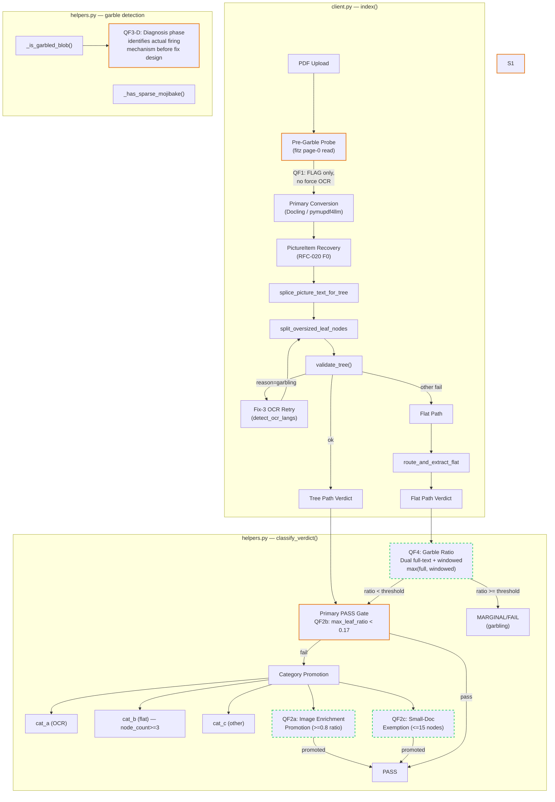
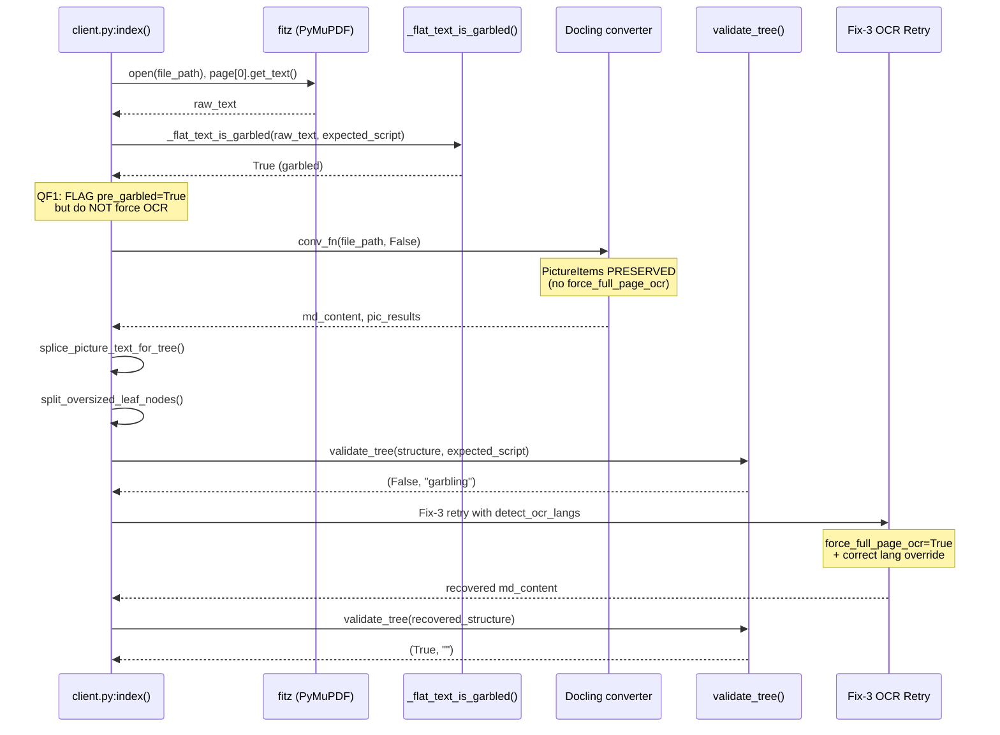
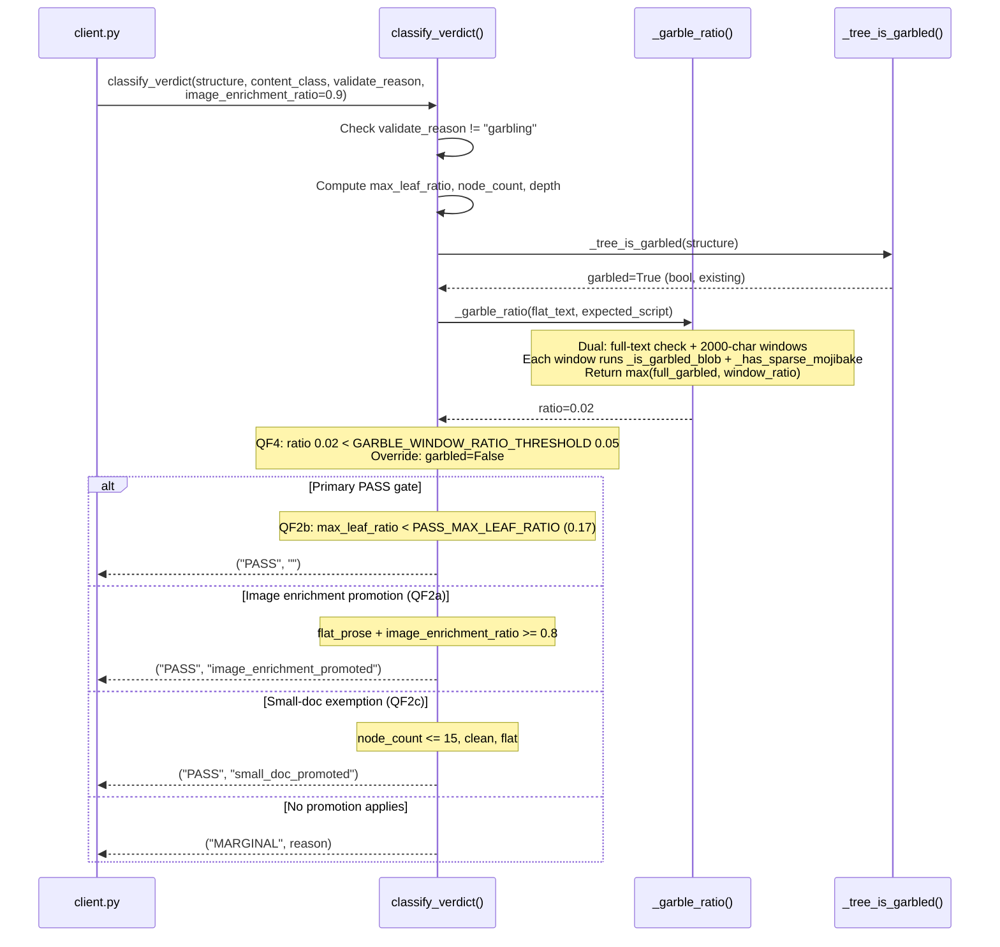
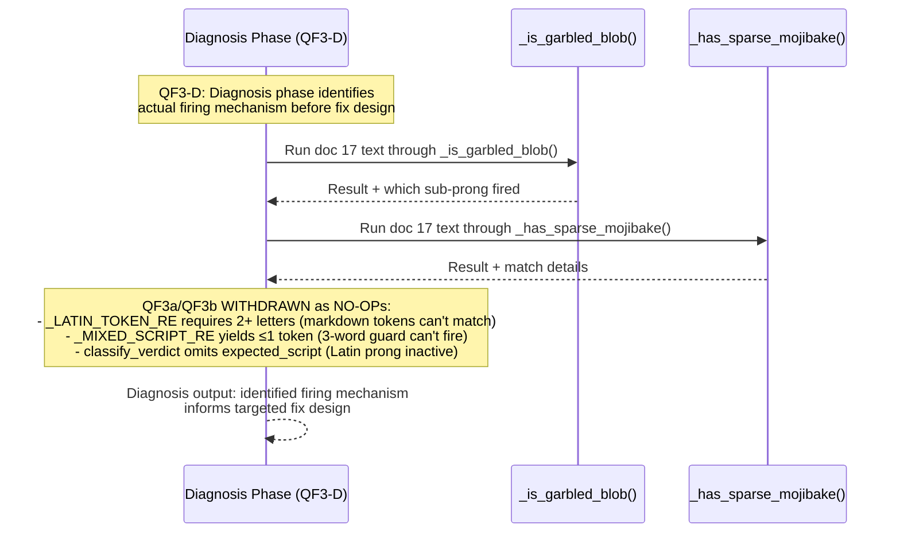

<!-- Space: CITRA -->
<!-- Title: Design: RFC-021 Run 4 Verdict Quick-Fixes -->
<!-- Folder: Designs -->

# RFC-021 Design Document: Run 4 Verdict Quick-Fixes — Threshold Tuning, Garble Gate Precision, OCR Deferral

## Traceability

| Artifact | Reference |
|---|---|
| Governing RFC | [RFC-021: Run 4 Verdict Quick-Fixes](../rfcs/021-run4-verdict-quickfixes.md) |
| PRD / Requirements | `PRD.md` -- Functional Requirements, Quality Bar |
| Architecture Doc | `ARCHITECTURE.md` -- Ingestion Pipeline, Tree Quality Gate |
| Implementation Plan | [tasks-rfc021-run4-verdict-quickfixes.md](../tasks/tasks-rfc021-run4-verdict-quickfixes.md) |
| Prior Design (RFC-020) | [design-rfc020-run3-regression-remediation.md](design-rfc020-run3-regression-remediation.md) |
| Prior Design (RFC-018) | [design-rfc018-corpus-audit-remediation.md](design-rfc018-corpus-audit-remediation.md) |

## Overview

Run 4 corpus reaudit (25 documents, all RFC-020 F0-F5 fixes applied) scored **13 PASS / 9 MARGINAL / 2 FAIL / 1 ERROR** -- a clear improvement over Run 3's 8/11/5/1 but still short of target. Analysis of the 9 MARGINAL verdicts reveals that **6-7 are caused by fixable code bugs or overly harsh thresholds**, not genuine extraction limitations. They cluster into four quick-fix categories:

- **[QF1](../rfcs/021-run4-verdict-quickfixes.md#qf1-f2d2-forced-ocr-regression-docs-7-20-21):** Pre-garble probe forces OCR upfront, destroying PictureItems and collapsing the tree (Docs 7, 20, 21).
- **[QF2](../rfcs/021-run4-verdict-quickfixes.md#qf2-verdict-threshold-harshness-smallflat-docs-docs-8-13-14-19):** PASS gate too strict for small/flat/image-dominant documents with good content (Docs 8, 13, 14, 19).
- **[QF3](../rfcs/021-run4-verdict-quickfixes.md#qf3-garble-gate-false-positive-on-bilingual-docs-doc-17):** Garble gate misreads markdown formatting in Arabic/English bilingual content as corruption (Doc 17).
- **[QF4](../rfcs/021-run4-verdict-quickfixes.md#qf4-verdict_reason-input-probe-not-output-quality-docs-20-21):** Stored verdict reflects input text-layer quality, not final OCR-recovered output quality (Docs 20, 21).

Fixing these four categories should promote 6-7 MARGINAL to PASS, projecting Run 5 at **19-20 PASS / 2-3 MARGINAL / 2 FAIL / 1 ERROR**.

## Key Design Principles

1. **Fix-only, no new features.** Each QF corrects a measurable defect in the existing verdict/garble pipeline. No new extraction routes, no new LLM calls, no new storage backends.

2. **Isolated rollback per fix.** Every threshold change is gated behind an environment variable with a default that activates the fix. Reverting to pre-RFC-021 behavior requires only env-var overrides, not code reverts.

3. **Additive safety.** QF3 is now a diagnosis-first approach (QF3a/QF3b withdrawn as NO-OPs). QF4's garble ratio uses dual full-text + windowed detection with `max()` to ensure additive-only behavior. The `_is_garbled_blob` and `_has_sparse_mojibake` gates remain intact in both the full-text and windowed checks.

4. **Zero regression on existing PASS.** All 13 Run 4 PASS documents must remain PASS after every QF. This is enforced by [Property 9](#property-9-zero-regression-on-existing-pass) and validated in [Phase 5](../tasks/tasks-rfc021-run4-verdict-quickfixes.md#5-phase-5--full-corpus-reaudit).

5. **Structural metrics are proxies, not absolutes.** `node_count`, `depth`, and `max_leaf_ratio` approximate content quality. When a document's content is demonstrably well-extracted (high image-enrichment ratio, clean text, small page count), structural shortfalls should not prevent PASS.

6. **Existing retry paths over new ones.** QF1 removes a premature optimization (pre-garble forced OCR) in favor of the already-correct Fix-3 retry path, rather than introducing a third escalation mechanism.

## Launch Constraints

| ID | Constraint | Source |
|---|---|---|
| HR1 | No new derived stores -- all changes are in-process logic in `client.py` and `helpers.py` | `CLAUDE.md` Hard Rule 2 |
| HR2 | No new LLM calls -- verdict computation and garble detection remain purely heuristic | `CLAUDE.md` Hard Rule 3 |
| HR3 | `validate_tree()` must still run before `save_doc` -- QF1 deferral does not bypass the gate | `CLAUDE.md` Hard Rule 5 |
| HR4 | All changes must be in-process Python; no infrastructure changes (Redis, MinIO, Prometheus topology unchanged) | `ARCHITECTURE.md` |
| HR5 | Every env-var kill switch must restore exact pre-RFC-021 behavior to enable incremental rollout | [RFC-021 Rollback Strategy](../rfcs/021-run4-verdict-quickfixes.md#rollback-strategy) |

## Architecture

### High-Level System Architecture

The following diagram shows the ingestion pipeline components affected by RFC-021. Highlighted boxes indicate modified code paths; dashed boxes indicate new logic.



### Architecture Decisions

#### AD1: Defer OCR to Fix-3 Retry (QF1)

| Aspect | Decision |
|---|---|
| **Context** | Pre-garble probe (`client.py:543-556`) forces `conv_fn(file_path, True)` on primary attempt when text layer is garbled. This destroys Docling PictureItem segmentation. |
| **Decision** | Pre-garble probe FLAGS `pre_garbled=True` but does NOT force OCR on primary conversion. Fix-3 retry path (`client.py:729-751`) handles OCR escalation after `validate_tree` fails with `reason="garbling"`. |
| **Trade-off** | One wasted non-OCR attempt on garbled docs (~2-5s latency) vs. preserving PictureItem segmentation for all docs. |
| **Rollback** | `PRE_GARBLE_FORCE_OCR_ENABLED=true` restores pre-RFC-021 behavior. |
| **RFC ref** | [QF1-Fix](../rfcs/021-run4-verdict-quickfixes.md#qf1-fix-defer-ocr-escalation-from-pre-garble-probe-to-fix-3-retry-path) |
| **Tasks** | [Task 1.1](../tasks/tasks-rfc021-run4-verdict-quickfixes.md#11-remove-forced-ocr-from-pre-garble-probe), [Task 1.2](../tasks/tasks-rfc021-run4-verdict-quickfixes.md#12-qf1-unit-and-integration-tests) |

#### AD2: Image Enrichment Promotion (QF2a)

| Aspect | Decision |
|---|---|
| **Context** | Flat/image-dominant docs (Docs 13, 14) have content captured in enriched image blocks, not tree nodes. `node_count < 3` blocks PASS despite perfect enrichment. |
| **Decision** | Add a new promotion path in `classify_verdict`: if `content_class` is `flat_prose` or `flat_mixed` and `image_enrichment_ratio >= 0.8`, promote to PASS with reason `"image_enrichment_promoted"`. |
| **Trade-off** | Introduces a non-structural PASS criterion. Acceptable because image enrichment quality is a direct content-quality signal, not a structural proxy. |
| **Rollback** | Git revert only (pure logic, no threshold lever). |
| **RFC ref** | [QF2a](../rfcs/021-run4-verdict-quickfixes.md#qf2a-image-enrichment-promotion-path) |
| **Tasks** | [Task 2.1](../tasks/tasks-rfc021-run4-verdict-quickfixes.md#21-implement-qf2a-image-enrichment-promotion) |

#### AD3: Dedicated Image Pipeline (QF2a-LT)

| Aspect | Decision |
|---|---|
| **Context** | Standalone image files (`.jpg`, `.png`, etc.) are fundamentally not text documents. Tree metrics (`node_count`, `depth`, `max_leaf_ratio`) are meaningless for them. |
| **Decision** | Phase 6 (long-term follow-up): detect `image_standalone` content class early in `client.py:index()`, route to `_classify_image_verdict()` which receives `image_enrichment_ratio: float | None` parameter and judges on enrichment quality alone. The ratio is computed in `client.py` from flat `blocks` after `_enrich_image_blocks()` runs (line 969), then passed to `classify_verdict` as `image_enrichment_ratio: float | None` parameter. Fields checked: `ocr_text`, `description`, `figure_path` (stamped by `_enrich_image_blocks`). **Note:** collision with existing `_IMAGE_EXTS` route (`client.py:231/681`) -- reconciliation task needed. |
| **Trade-off** | Adds a new content class and verdict function. Justified because it removes the category confusion permanently. |
| **Rollback** | `IMAGE_STANDALONE_PIPELINE_ENABLED=false` falls back to [AD2](#ad2-image-enrichment-promotion-qf2a) promotion path. |
| **RFC ref** | [QF2a-LT](../rfcs/021-run4-verdict-quickfixes.md#qf2a-lt-dedicated-image-file-pipeline-long-term-follow-up) |
| **Tasks** | [Task 6.1](../tasks/tasks-rfc021-run4-verdict-quickfixes.md#61-implement-image_standalone-content-class-detection), [Task 6.2](../tasks/tasks-rfc021-run4-verdict-quickfixes.md#62-implement-classify-image-verdict), [Task 6.3](../tasks/tasks-rfc021-run4-verdict-quickfixes.md#63-image-specific-meta-fields), [Task 6.4](../tasks/tasks-rfc021-run4-verdict-quickfixes.md#64-qf2a-lt-tests) |

#### AD4: Threshold Alignment (QF2b)

| Aspect | Decision |
|---|---|
| **Context** | Primary PASS gate uses `max_leaf_ratio < 0.15` but category B/C promotion uses `CATEGORY_BC_PROMOTION_THRESHOLD = 0.17`. The 0.15/0.17 split is an artifact of conservative initial deployment (RFC-014), not a deliberate quality distinction. Doc 19 (`max_leaf_ratio=0.16`) falls through. |
| **Decision** | Align primary PASS gate threshold to `0.17`, matching `CATEGORY_BC_PROMOTION_THRESHOLD`. Parameterize via `PASS_MAX_LEAF_RATIO` env var. |
| **Trade-off** | 0.02 relaxation. Risk of promoting genuinely unbalanced trees is low -- 0.17 already validated as safe by category B/C promotion experience. |
| **Rollback** | `PASS_MAX_LEAF_RATIO=0.15` restores pre-RFC-021 behavior. |
| **RFC ref** | [QF2b](../rfcs/021-run4-verdict-quickfixes.md#qf2b-relax-max_leaf_ratio-for-primary-pass-gate) |
| **Tasks** | [Task 2.2](../tasks/tasks-rfc021-run4-verdict-quickfixes.md#22-implement-qf2b-max_leaf_ratio-relaxation) |

#### AD5: Small-Doc Exemption (QF2c)

| Aspect | Decision |
|---|---|
| **Context** | Small documents (1-2 pages, <= 15 nodes) with clean content cannot meet structural depth/node thresholds designed for multi-chapter documents. Doc 8 (Reitlehrer) is penalized despite full content extraction. |
| **Decision** | Add small-doc exemption: if `node_count <= 10`, `max_leaf_ratio < 0.20`, `len(flat_text) > 100`, `len(flat_text) < 15_000`, `not garbled`, and `content_class` is `flat_prose` or `flat_mixed`, promote to PASS with reason `"small_doc_promoted"`. The `max_leaf_ratio < 0.20` threshold preserves `test_cat_b_above_017_stays_marginal` (ratio=0.20). **Note:** verify whether QF2b alone rescues doc 8 before implementing QF2c. |
| **Trade-off** | Most aggressive of the three QF2 sub-fixes. `node_count <= 10` / `max_leaf_ratio < 0.20` thresholds tightened from original `<= 15` / `< 0.50` after analysis; char ceiling `< 15_000` added to limit scope. |
| **Rollback** | `SMALL_DOC_PROMOTION_ENABLED=false` disables the exemption. |
| **RFC ref** | [QF2c](../rfcs/021-run4-verdict-quickfixes.md#qf2c-small-doc-exemption) |
| **Tasks** | [Task 2.3](../tasks/tasks-rfc021-run4-verdict-quickfixes.md#23-implement-qf2c-small-doc-exemption) |

#### AD6: QF3a/QF3b WITHDRAWN -- Diagnosis-First Approach (QF3-D)

| Aspect | Decision |
|---|---|
| **Context** | QF3a (markdown-token exclusion) and QF3b (bilingual guard) are provable NO-OPs and are WITHDRAWN: (1) `_LATIN_TOKEN_RE = re.compile(r"[A-Za-z]{2,}")` -- markdown tokens (`---`, `###`) cannot match a 2+ letter pattern; (2) `_MIXED_SCRIPT_RE` matches <= 8 chars with no spaces, so `split()` yields <= 1 token, making the ">= 3 common words" guard impossible to fire; (3) `classify_verdict` calls `_tree_is_garbled(structure)` without `expected_script`, so the Latin-gibberish prong is inactive at verdict time. |
| **Decision** | Replace QF3a/QF3b with QF3-D: a diagnosis phase that runs doc 17 text through each garble sub-prong to identify the actual firing mechanism before designing a fix. No code changes are produced by the diagnosis phase itself. |
| **Trade-off** | Defers the fix until the mechanism is understood. This is preferable to shipping provably inert code. |
| **Rollback** | N/A -- diagnosis phase produces no code changes. |
| **RFC ref** | [QF3a](../rfcs/021-run4-verdict-quickfixes.md#qf3a-exclude-markdown-formatting-tokens-from-latin-gibberish-scoring), [QF3b](../rfcs/021-run4-verdict-quickfixes.md#qf3b-bilingual-content-guard-in-sparse-mojibake-detector) |
| **Tasks** | [Task 3.1](../tasks/tasks-rfc021-run4-verdict-quickfixes.md#31-implement-qf3a-markdown-token-exclusion), [Task 3.2](../tasks/tasks-rfc021-run4-verdict-quickfixes.md#32-implement-qf3b-bilingual-content-guard) |

#### AD8: Garble Ratio Windowing (QF4)

| Aspect | Decision |
|---|---|
| **Context** | `_tree_is_garbled` and `_flat_text_is_garbled` return `bool` -- any garble in the flattened text flags the whole document. A garbled cover page poisons the verdict for otherwise clean documents (Docs 20, 21). |
| **Decision** | Introduce `_garble_ratio(text, expected_script)` that splits text into 2000-char windows (not 500 -- ensures the digit-ratio prong, which requires `len(blob) > 500`, can fire). Each window runs BOTH `_is_garbled_blob` AND `_has_sparse_mojibake`. The full-text check runs in parallel -- `max(full_garbled, window_ratio)` ensures additive-only behavior (any detection that fires on the full text is preserved). `classify_verdict` uses this ratio with threshold `GARBLE_WINDOW_RATIO_THRESHOLD` (default 0.05, read at call-time not module-level to match codebase convention) -- only flag as garbled if > 5% of windows are garbled. |
| **Trade-off** | Adds a second garble check in `classify_verdict` (the existing `_tree_is_garbled` bool is still used in `validate_tree`). The windowed check is more expensive (N calls to `_is_garbled_blob` + `_has_sparse_mojibake`) but only runs once per document at verdict time. |
| **Rollback** | `GARBLE_WINDOW_RATIO_THRESHOLD=0.0` is a true kill switch -- restores exact pre-QF4 binary behavior because `_tree_is_garbled` gate is preserved, not replaced. |
| **RFC ref** | [QF4-Fix](../rfcs/021-run4-verdict-quickfixes.md#qf4-fix-garble-ratio-check-in-classify_verdict) |
| **Tasks** | [Task 4.1](../tasks/tasks-rfc021-run4-verdict-quickfixes.md#41-implement-garble-ratio-function), [Task 4.2](../tasks/tasks-rfc021-run4-verdict-quickfixes.md#42-qf4-unit-tests) |

### Deployment Architecture

No infrastructure changes. All fixes are in-process Python logic modifications in two files:

| File | Lines affected | QF |
|---|---|---|
| `src/pageindex_mcp/client.py` | 543-556 (pre-garble probe), 980-984 (flat verdict call) | QF1, QF2a (parameter passing) |
| `src/pageindex_mcp/helpers.py` | 651-662 (Latin gibberish), 684-696 (sparse mojibake), 765-769 (tree garble), 863-915 (classify_verdict) | QF2a/b/c, QF3a/b, QF4, QF2a-LT |
| `src/pageindex_mcp/config.py` | New env vars: `PASS_MAX_LEAF_RATIO`, `SMALL_DOC_PROMOTION_ENABLED`, `GARBLE_WINDOW_RATIO_THRESHOLD`, `PRE_GARBLE_FORCE_OCR_ENABLED`, `IMAGE_STANDALONE_PIPELINE_ENABLED` | All |

Existing deployment topology (MCP server + arq worker + MinIO + Redis) is unchanged. The arq worker process picks up new logic on restart; no rolling-deploy coordination required beyond the standard restart.

### Communication Patterns

All changes are synchronous, in-process function calls. No new inter-service communication, no new Redis keys, no new MinIO paths (except the optional `image_standalone` meta fields in [AD3](#ad3-dedicated-image-pipeline-qf2a-lt)).

| Caller | Callee | Change |
|---|---|---|
| `client.py:index()` | Pre-garble probe | QF1: flag only, no `conv_fn(..., True)` |
| `client.py:index()` | `classify_verdict()` | QF2a: pass `image_enrichment_ratio` kwarg |
| `classify_verdict()` | `_garble_ratio()` | QF4: new call, dual full-text + windowed garble check with `max()` |
| QF3 | N/A | QF3-D: diagnosis phase only -- no code changes to `_is_garbled_blob` or `_has_sparse_mojibake` |

## Sequence Diagrams

### Pre-Garble Probe Flow (QF1)



### Verdict Computation Flow (QF2/QF4)



### Garble Detection Flow (QF3)



## Service Contracts

### 1. client.py

**File:** `src/pageindex_mcp/client.py`

#### QF1: Pre-garble probe modification (lines 543-556)

**Current behavior:** When `pre_garbled=True` and `converter == "docling"`, calls `conv_fn(file_path, True)` -- forcing full-page OCR on primary attempt.

**New behavior:** Pre-garble probe sets `pre_garbled=True` flag but does NOT alter the primary conversion call. The flag is retained for logging/diagnostics. OCR escalation occurs only via the existing Fix-3 retry path (`client.py:729-751`) when `validate_tree` returns `reason="garbling"`.

```python
# BEFORE (client.py:553-556):
if pre_garbled and converter == "docling":
    md_content, pic_results = await conv_fn(file_path, True)

# AFTER:
# pre_garbled flag retained for logging only.
# Primary attempt always runs without force_full_page_ocr.
# Fix-3 retry (line 729-751) handles OCR escalation
# when validate_tree returns reason="garbling".
```

**Env var gate:** `PRE_GARBLE_FORCE_OCR_ENABLED` (default `"false"`). When `"true"`, restores the pre-RFC-021 forced-OCR behavior.

Linked: [AD1](#ad1-defer-ocr-to-fix-3-retry-qf1), [Task 1.1](../tasks/tasks-rfc021-run4-verdict-quickfixes.md#11-remove-forced-ocr-from-pre-garble-probe)

#### QF2a: Image enrichment ratio parameter passing (lines 980-984)

**Current call site** (flat verdict, `client.py:980`):

```python
f_verdict, f_verdict_reason = classify_verdict(
    flat_structure, content_class, None,
)
```

**New call site (line ~969):** Compute `image_enrichment_ratio` from flat `blocks` after `_enrich_image_blocks()` runs, then pass as keyword argument. Fields checked: `ocr_text`, `description`, `figure_path` (stamped by `_enrich_image_blocks`):

```python
# Compute image enrichment ratio from flat blocks (after _enrich_image_blocks)
image_blocks = [b for b in blocks if b.get("type") == "image"]
enriched_count = sum(
    1 for b in image_blocks
    if b.get("ocr_text") or b.get("description") or b.get("figure_path")
)
total_images = len(image_blocks)
img_enrich_ratio = (enriched_count / total_images) if total_images > 0 else None

f_verdict, f_verdict_reason = classify_verdict(
    flat_structure, content_class, None,
    image_enrichment_ratio=img_enrich_ratio,
)
```

**Same change at tree verdict** (`client.py:1077`):

```python
verdict, verdict_reason = classify_verdict(
    structure, "", None,
    image_enrichment_ratio=img_enrich_ratio,
)
```

Linked: [AD2](#ad2-image-enrichment-promotion-qf2a), [Task 2.1](../tasks/tasks-rfc021-run4-verdict-quickfixes.md#21-implement-qf2a-image-enrichment-promotion)

### 2. helpers.py

**File:** `src/pageindex_mcp/helpers.py`

#### QF2a: Image enrichment promotion path (after line 904)

**New keyword parameter** on `classify_verdict`:

```python
def classify_verdict(
    structure: list,
    content_class: str,
    validate_reason: str | None,
    *,
    image_enrichment_ratio: float | None = None,
) -> tuple[str, str]:
```

**New promotion block** inserted after cat_c promotion (line 904), before MARGINAL fallthrough (line 906):

```python
# QF2a (RFC-021): image-enrichment promotion for flat docs whose
# content is primarily captured in enriched image blocks.
if (
    content_class in ("flat_prose", "flat_mixed")
    and image_enrichment_ratio is not None
    and image_enrichment_ratio >= 0.8
):
    return "PASS", "image_enrichment_promoted"
```

Linked: [AD2](#ad2-image-enrichment-promotion-qf2a), [Property 2](#property-2-image-enrichment-promotion), [Task 2.1](../tasks/tasks-rfc021-run4-verdict-quickfixes.md#21-implement-qf2a-image-enrichment-promotion)

#### QF2b: Primary PASS gate threshold relaxation (line 883)

**Current:**

```python
if node_count >= 3 and depth >= 2 and max_leaf_ratio < 0.15 and not garbled:
```

**New:**

```python
_PASS_MAX_LEAF_RATIO = float(os.environ.get("PASS_MAX_LEAF_RATIO", "0.17"))

if node_count >= 3 and depth >= 2 and max_leaf_ratio < _PASS_MAX_LEAF_RATIO and not garbled:
```

Linked: [AD4](#ad4-threshold-alignment-qf2b), [Property 4](#property-4-pass-gate-threshold-consistency), [Task 2.2](../tasks/tasks-rfc021-run4-verdict-quickfixes.md#22-implement-qf2b-max_leaf_ratio-relaxation)

#### QF2c: Small-doc exemption (after QF2a promotion block)

**New promotion block:**

```python
_SMALL_DOC_PROMOTION_ENABLED = os.environ.get(
    "SMALL_DOC_PROMOTION_ENABLED", "true"
).lower() != "false"

# QF2c (RFC-021): small-doc exemption for flat docs with few nodes
# but clean, sufficient content.
if (
    _SMALL_DOC_PROMOTION_ENABLED
    and node_count <= 10
    and max_leaf_ratio < 0.20
    and len(flat_text) > 100
    and len(flat_text) < 15_000
    and not garbled
    and content_class in ("flat_prose", "flat_mixed")
):
    return "PASS", "small_doc_promoted"
```

Linked: [AD5](#ad5-small-doc-exemption-qf2c), [Property 5](#property-5-small-doc-promotion-safety), [Task 2.3](../tasks/tasks-rfc021-run4-verdict-quickfixes.md#23-implement-qf2c-small-doc-exemption)

#### QF3: Diagnosis Phase (QF3a/QF3b WITHDRAWN)

QF3a (markdown-token exclusion) and QF3b (bilingual guard) are WITHDRAWN as provable NO-OPs (see [AD6](#ad6-qf3aqf3b-withdrawn----diagnosis-first-approach-qf3-d) for full rationale). No code changes to `_is_garbled_blob` or `_has_sparse_mojibake` are made in this phase.

**QF3-D diagnosis phase:** Run doc 17 text through each garble sub-prong (`_is_garbled_blob`, `_has_sparse_mojibake`, and their internal sub-checks) to identify the actual firing mechanism, then design a targeted fix based on findings.

Linked: [AD6](#ad6-qf3aqf3b-withdrawn----diagnosis-first-approach-qf3-d), [Task 3.1](../tasks/tasks-rfc021-run4-verdict-quickfixes.md#31-implement-qf3a-markdown-token-exclusion), [Task 3.2](../tasks/tasks-rfc021-run4-verdict-quickfixes.md#32-implement-qf3b-bilingual-content-guard)

#### QF4: Garble ratio function and wiring (new function + lines 881, 907-908)

**New function:**

```python
def _garble_ratio(text: str, expected_script: str | None = None) -> float:
    """QF4 (RFC-021): dual full-text + windowed garble detection.

    Uses 2000-char windows (ensures digit-ratio prong requiring len > 500 can fire).
    Each window runs BOTH _is_garbled_blob AND _has_sparse_mojibake.
    Full-text check runs in parallel -- max(full, windowed) ensures additive-only
    behavior: any detection that fires on the full text is preserved."""
    if not text.strip():
        return 1.0

    # Full-text check (preserves existing detection)
    full_garbled = 1.0 if (
        _is_garbled_blob(text, expected_script=expected_script)
        or _has_sparse_mojibake(text)
    ) else 0.0

    # Windowed check
    window = 2000
    chunks = [text[i:i + window] for i in range(0, len(text), window)]
    if not chunks:
        return max(full_garbled, 1.0)
    garbled_chunks = sum(
        1 for c in chunks
        if _is_garbled_blob(c, expected_script=expected_script)
        or _has_sparse_mojibake(c)
    )
    window_ratio = garbled_chunks / len(chunks)

    return max(full_garbled, window_ratio)
```

**Wiring in `classify_verdict`** (line 881):

```python
# Read at call-time, not module-level (match codebase convention)
_garble_window_threshold = float(os.environ.get("GARBLE_WINDOW_RATIO_THRESHOLD", "0.05"))

# Existing: garbled = _tree_is_garbled(structure)
# QF4 (RFC-021): dual full-text + windowed ratio check
flat_text = _flatten_tree_text(structure)  # hoisted, already computed later
garble_r = _garble_ratio(flat_text)
garbled = garble_r > _garble_window_threshold
```

Linked: [AD8](#ad8-garble-ratio-windowing-qf4), [Property 8](#property-8-garble-ratio-windowed-accuracy), [Task 4.1](../tasks/tasks-rfc021-run4-verdict-quickfixes.md#41-implement-garble-ratio-function), [Task 4.2](../tasks/tasks-rfc021-run4-verdict-quickfixes.md#42-qf4-unit-tests)

#### QF2a-LT: Dedicated image pipeline (Phase 6)

**New in `client.py:index()`** (around line 520):

```python
IMAGE_EXTENSIONS = {".jpg", ".jpeg", ".png", ".tiff", ".tif", ".bmp", ".gif", ".webp"}

ext = Path(file_path).suffix.lower()
if ext in IMAGE_EXTENSIONS:
    content_class = "image_standalone"
    # Route to image-specific processing -- skip tree/flat entirely
```

**New in `helpers.py`:**

```python
def _classify_image_verdict(
    image_enrichment_ratio: float | None,
) -> tuple[str, str]:
    """Verdict for standalone image files.

    Receives image_enrichment_ratio (computed in client.py from flat blocks
    after _enrich_image_blocks runs). Judges on enrichment quality, not tree
    structure.
    - PASS: image_enrichment_ratio >= 0.8.
    - MARGINAL: images detected but enrichment ratio < 0.8.
    - FAIL: no images detected (ratio is None or 0.0).
    """
    if image_enrichment_ratio is None or image_enrichment_ratio == 0.0:
        return "FAIL", "no_image_blocks"
    if image_enrichment_ratio >= 0.8:
        return "PASS", f"image_enriched(ratio={image_enrichment_ratio:.2f})"
    return "MARGINAL", f"images_not_enriched(ratio={image_enrichment_ratio:.2f})"
```

**Note:** collision with existing `_IMAGE_EXTS` route (`client.py:231/681`) -- reconciliation task needed.

**Routing in `classify_verdict`:**

```python
_IMAGE_STANDALONE_PIPELINE_ENABLED = os.environ.get(
    "IMAGE_STANDALONE_PIPELINE_ENABLED", "true"
).lower() != "false"

# At top of classify_verdict, before any tree/flat logic:
if _IMAGE_STANDALONE_PIPELINE_ENABLED and content_class == "image_standalone":
    return _classify_image_verdict(image_enrichment_ratio)
```

Linked: [AD3](#ad3-dedicated-image-pipeline-qf2a-lt), [Property 3](#property-3-image-standalone-routing), [Task 6.1](../tasks/tasks-rfc021-run4-verdict-quickfixes.md#61-implement-image_standalone-content-class-detection)-[Task 6.4](../tasks/tasks-rfc021-run4-verdict-quickfixes.md#64-qf2a-lt-tests)

## Data Models

### meta.json sidecar changes

The `meta.json` sidecar (stored in MinIO `processed/*.meta.json`) gains the following optional fields for `image_standalone` content class ([AD3](#ad3-dedicated-image-pipeline-qf2a-lt), Phase 6 only):

| Field | Type | When present | Description |
|---|---|---|---|
| `content_class` | `string` | Always (existing) | New value `"image_standalone"` for image files |
| `total_images` | `int` | `content_class == "image_standalone"` | Number of image blocks detected |
| `enriched_images` | `int` | `content_class == "image_standalone"` | Number of image blocks with `enriched=True` |
| `enrichment_methods` | `list[str]` | `content_class == "image_standalone"` | Methods that produced enrichment data (e.g., `["ocr", "vlm"]`) |

No changes to `meta.json` schema for QF1-QF4 (Phases 1-4). The existing `verdict`, `verdict_reason`, `max_leaf_ratio`, `node_count`, and `depth` fields continue to be populated. New `verdict_reason` values introduced:

| `verdict_reason` | QF | Meaning |
|---|---|---|
| `"image_enrichment_promoted"` | QF2a | Flat doc promoted via image enrichment ratio >= 0.8 |
| `"small_doc_promoted"` | QF2c | Small flat doc promoted via exemption |
| `"image_enriched(N/M)"` | QF2a-LT | Standalone image with N of M images enriched |
| `"images_not_enriched"` | QF2a-LT | Standalone image, blocks found but none enriched |
| `"no_image_blocks"` | QF2a-LT | Standalone image, no image blocks detected |

## Correctness Properties

### Property 1: PictureItem Preservation

**Statement:** When `PRE_GARBLE_FORCE_OCR_ENABLED` is `"false"` (default), the primary Docling conversion attempt MUST NOT receive `force_full_page_ocr=True`, regardless of `pre_garbled` flag value.

**Rationale:** Forced OCR destroys Docling's PictureItem segmentation, which is required for RFC-020 F0 picture-text splicing.

**Verification:** [Task 1.2](../tasks/tasks-rfc021-run4-verdict-quickfixes.md#12-qf1-unit-and-integration-tests) -- unit test asserts `conv_fn` called with `force_full_page_ocr=False` when `pre_garbled=True` and env var is default.

**Audit note:** Existing test `tests/test_client_contract.py` D3a block (lines 619-720) asserts force-OCR on garble probe -- QF1 inverts this behavior. A task to update these assertions must be added. The rollback path must preserve `ocr_lang_override=detect_ocr_langs(filename)`.

Linked: [AD1](#ad1-defer-ocr-to-fix-3-retry-qf1)

### Property 2: Image Enrichment Promotion

**Statement:** A document with `content_class in ("flat_prose", "flat_mixed")` and `image_enrichment_ratio >= 0.8` MUST receive verdict PASS with reason `"image_enrichment_promoted"`, regardless of `node_count` or `depth`.

**Verification:** [Task 2.4](../tasks/tasks-rfc021-run4-verdict-quickfixes.md#24-qf2-unit-tests) -- unit test with `flat_prose`, enrichment ratio 1.0, node_count=2 asserts PASS.

Linked: [AD2](#ad2-image-enrichment-promotion-qf2a)

### Property 3: Image Standalone Routing

**Statement:** When `IMAGE_STANDALONE_PIPELINE_ENABLED` is `"true"` (default) and `content_class == "image_standalone"`, `classify_verdict` MUST delegate to `_classify_image_verdict` and MUST NOT evaluate tree/flat metrics.

**Verification:** [Task 6.4](../tasks/tasks-rfc021-run4-verdict-quickfixes.md#64-qf2a-lt-tests) -- unit test with `image_standalone` content class asserts `_classify_image_verdict` is called and tree metrics are not computed.

Linked: [AD3](#ad3-dedicated-image-pipeline-qf2a-lt)

### Property 4: PASS Gate Threshold Consistency

**Statement:** The primary PASS gate `max_leaf_ratio` threshold MUST equal `PASS_MAX_LEAF_RATIO` env var (default 0.17), which MUST be consistent with `CATEGORY_BC_PROMOTION_THRESHOLD` (0.17) unless explicitly overridden.

**Verification:** [Task 2.4](../tasks/tasks-rfc021-run4-verdict-quickfixes.md#24-qf2-unit-tests) -- unit test with `max_leaf_ratio=0.16` asserts PASS at default threshold; asserts MARGINAL when `PASS_MAX_LEAF_RATIO=0.15`.

Linked: [AD4](#ad4-threshold-alignment-qf2b)

### Property 5: Small-Doc Promotion Safety

**Statement:** Small-doc exemption MUST NOT promote documents that are garbled (`_tree_is_garbled` or `_garble_ratio > threshold`), have `max_leaf_ratio >= 0.20`, have `len(flat_text) <= 100`, have `len(flat_text) >= 15_000`, or have `node_count > 10`.

**Verification:** [Task 2.4](../tasks/tasks-rfc021-run4-verdict-quickfixes.md#24-qf2-unit-tests) -- unit tests for each exclusion condition: garbled small doc stays MARGINAL, high-leaf-ratio (>= 0.20) small doc stays MARGINAL (preserves `test_cat_b_above_017_stays_marginal` at ratio=0.20), empty small doc stays MARGINAL, 11-node doc not exempt, doc with >= 15k chars not exempt.

Linked: [AD5](#ad5-small-doc-exemption-qf2c)

### Property 6: Garble-Gate Precision (QF3 -- Diagnosis-First)

**Statement:** For any bilingual document whose actual garble sub-prong firing mechanism has been diagnosed, the fix SHALL suppress only the identified false-positive mechanism without weakening detection of genuine corruption. QF3a (markdown-token exclusion) and QF3b (bilingual guard) are WITHDRAWN as provable NO-OPs (see [AD6](#ad6-qf3aqf3b-withdrawn----diagnosis-first-approach-qf3-d)).

**Verification:** [Task 3.3](../tasks/tasks-rfc021-run4-verdict-quickfixes.md#33-qf3-unit-tests) -- diagnosis: measure doc 17 garble sub-prong values (`_is_garbled_blob` result per sub-check, `_has_sparse_mojibake` match details) to identify actual firing mechanism.

Linked: [AD6](#ad6-qf3aqf3b-withdrawn----diagnosis-first-approach-qf3-d)

### Property 8: Garble Ratio Windowed Accuracy

**Statement:** `_garble_ratio` MUST use dual full-text + 2000-char windowed detection with `max(full_garbled, window_ratio)`. Each window runs BOTH `_is_garbled_blob` AND `_has_sparse_mojibake`. For any text where `_is_garbled_blob(full_text)` or `_has_sparse_mojibake(full_text)` returns True, `_garble_ratio` SHALL return >= 1.0 (preserves existing detection). `classify_verdict` MUST use this ratio with `GARBLE_WINDOW_RATIO_THRESHOLD` (default 0.05, read at call-time not module-level) to determine garble status. `GARBLE_WINDOW_RATIO_THRESHOLD=0.0` is a true kill switch -- restores exact pre-QF4 binary behavior because `_tree_is_garbled` gate is preserved, not replaced.

**Verification:** [Task 4.2](../tasks/tasks-rfc021-run4-verdict-quickfixes.md#42-qf4-unit-tests) -- unit tests: (1) text garbled by full-text check returns ratio >= 1.0; (2) text with one garbled 2000-char window out of many returns proportional ratio; (3) threshold=0.0 restores binary behavior; (4) empty text returns 1.0.

Linked: [AD8](#ad8-garble-ratio-windowing-qf4)

### Property 9: Zero Regression on Existing PASS

**Statement:** All 13 Run 4 PASS documents MUST remain PASS after all QF1-QF4 changes are applied. No document that was PASS in Run 4 may be demoted to MARGINAL or FAIL.

**Verification:** [Task 5.1](../tasks/tasks-rfc021-run4-verdict-quickfixes.md#51-full-25-doc-reingestion-and-run-5-scorecard) -- full 25-doc corpus reingestion with Run 5 scorecard. Compare Run 4 PASS docs against Run 5 verdicts.

Linked: All ADs, [Phase 5 checkpoint](../tasks/tasks-rfc021-run4-verdict-quickfixes.md#5-phase-5--full-corpus-reaudit)

## Error Handling

### Env Var Rollback Matrix

Each fix has an independent env-var kill switch. Setting any of these restores the exact pre-RFC-021 behavior for that fix without affecting the others:

| Fix | Env Var | Rollback Value | Default (fix active) | Effect of rollback |
|---|---|---|---|---|
| [QF1](#ad1-defer-ocr-to-fix-3-retry-qf1) | `PRE_GARBLE_FORCE_OCR_ENABLED` | `"true"` | `"false"` | Pre-garble probe forces OCR on primary attempt (old behavior) |
| [QF2b](#ad4-threshold-alignment-qf2b) | `PASS_MAX_LEAF_RATIO` | `"0.15"` | `"0.17"` | Primary PASS gate uses old 0.15 threshold |
| [QF2c](#ad5-small-doc-exemption-qf2c) | `SMALL_DOC_PROMOTION_ENABLED` | `"false"` | `"true"` | Small-doc exemption disabled |
| [QF4](#ad8-garble-ratio-windowing-qf4) | `GARBLE_WINDOW_RATIO_THRESHOLD` | `"0.0"` | `"0.05"` | Any garble in any window flags document (binary behavior) |
| [QF2a-LT](#ad3-dedicated-image-pipeline-qf2a-lt) | `IMAGE_STANDALONE_PIPELINE_ENABLED` | `"false"` | `"true"` | Falls back to QF2a enrichment promotion |
| QF2a | N/A | Git revert | N/A | Pure logic change, no threshold lever needed |
| QF3 | N/A | N/A | N/A | Diagnosis phase produces no code changes |

### Graceful Degradation

1. **`_garble_ratio` exception:** If `_is_garbled_blob` raises within the windowed loop, the exception propagates to `classify_verdict`. Since `_is_garbled_blob` is pure (no I/O), this should not occur. If it does, the existing `_tree_is_garbled` boolean result is used as fallback (conservative: more likely to flag garble).

2. **`image_enrichment_ratio=None`:** When no `pic_results` are available (non-image docs), the ratio is `None` and the QF2a promotion block is skipped entirely. No behavioral change for non-image documents.

3. **QF3 diagnosis phase:** No code changes are produced by the diagnosis phase. If the diagnosis identifies a firing mechanism and a subsequent fix is designed, graceful degradation for that fix will be documented in the follow-up design.

4. **QF2a-LT content class detection:** If `IMAGE_EXTENSIONS` check fails to fire (e.g., unusual file extension), the document falls through to normal tree/flat processing and is handled by the QF2a promotion path as before.

## Testing Strategy

### Per-Property Test Matrix

| Property | Test Type | Test Description | QF | Task |
|---|---|---|---|---|
| [Property 1](#property-1-pictureitem-preservation) | Unit | `pre_garbled=True` does NOT invoke `conv_fn(file_path, True)` on primary | QF1 | [1.2](../tasks/tasks-rfc021-run4-verdict-quickfixes.md#12-qf1-unit-and-integration-tests) |
| [Property 1](#property-1-pictureitem-preservation) | Unit | PictureItems preserved in primary output (mock Docling returns PictureResults) | QF1 | [1.2](../tasks/tasks-rfc021-run4-verdict-quickfixes.md#12-qf1-unit-and-integration-tests) |
| [Property 1](#property-1-pictureitem-preservation) | Unit | Fix-3 retry still fires when `validate_tree` returns `"garbling"` | QF1 | [1.2](../tasks/tasks-rfc021-run4-verdict-quickfixes.md#12-qf1-unit-and-integration-tests) |
| [Property 1](#property-1-pictureitem-preservation) | Unit | `PRE_GARBLE_FORCE_OCR_ENABLED=true` restores old behavior | QF1 | [1.2](../tasks/tasks-rfc021-run4-verdict-quickfixes.md#12-qf1-unit-and-integration-tests) |
| [Property 2](#property-2-image-enrichment-promotion) | Unit | `flat_prose` + `image_enrichment_ratio=1.0` -> PASS, `"image_enrichment_promoted"` | QF2a | [2.4](../tasks/tasks-rfc021-run4-verdict-quickfixes.md#24-qf2-unit-tests) |
| [Property 2](#property-2-image-enrichment-promotion) | Unit | `image_enrichment_ratio=0.5` -> MARGINAL (below 0.8) | QF2a | [2.4](../tasks/tasks-rfc021-run4-verdict-quickfixes.md#24-qf2-unit-tests) |
| [Property 2](#property-2-image-enrichment-promotion) | Unit | Non-flat `content_class` -> no promotion even with ratio=1.0 | QF2a | [2.4](../tasks/tasks-rfc021-run4-verdict-quickfixes.md#24-qf2-unit-tests) |
| [Property 2](#property-2-image-enrichment-promotion) | Unit | `image_enrichment_ratio=None` -> no change to verdict | QF2a | [2.4](../tasks/tasks-rfc021-run4-verdict-quickfixes.md#24-qf2-unit-tests) |
| [Property 3](#property-3-image-standalone-routing) | Unit | `image_standalone` + enriched image -> PASS | QF2a-LT | [6.4](../tasks/tasks-rfc021-run4-verdict-quickfixes.md#64-qf2a-lt-tests) |
| [Property 3](#property-3-image-standalone-routing) | Unit | `image_standalone` + no enrichment -> MARGINAL | QF2a-LT | [6.4](../tasks/tasks-rfc021-run4-verdict-quickfixes.md#64-qf2a-lt-tests) |
| [Property 3](#property-3-image-standalone-routing) | Unit | `image_standalone` + no image blocks -> FAIL | QF2a-LT | [6.4](../tasks/tasks-rfc021-run4-verdict-quickfixes.md#64-qf2a-lt-tests) |
| [Property 3](#property-3-image-standalone-routing) | Unit | `IMAGE_STANDALONE_PIPELINE_ENABLED=false` -> falls back to normal verdict | QF2a-LT | [6.4](../tasks/tasks-rfc021-run4-verdict-quickfixes.md#64-qf2a-lt-tests) |
| [Property 4](#property-4-pass-gate-threshold-consistency) | Unit | `max_leaf_ratio=0.16`, all other PASS conditions met -> PASS | QF2b | [2.4](../tasks/tasks-rfc021-run4-verdict-quickfixes.md#24-qf2-unit-tests) |
| [Property 4](#property-4-pass-gate-threshold-consistency) | Unit | `max_leaf_ratio=0.18` -> MARGINAL (above 0.17) | QF2b | [2.4](../tasks/tasks-rfc021-run4-verdict-quickfixes.md#24-qf2-unit-tests) |
| [Property 4](#property-4-pass-gate-threshold-consistency) | Unit | `PASS_MAX_LEAF_RATIO=0.15` -> `max_leaf_ratio=0.16` is MARGINAL (old behavior) | QF2b | [2.4](../tasks/tasks-rfc021-run4-verdict-quickfixes.md#24-qf2-unit-tests) |
| [Property 5](#property-5-small-doc-promotion-safety) | Unit | 10-node, depth=1, clean flat doc -> PASS `"small_doc_promoted"` | QF2c | [2.4](../tasks/tasks-rfc021-run4-verdict-quickfixes.md#24-qf2-unit-tests) |
| [Property 5](#property-5-small-doc-promotion-safety) | Unit | 11-node doc -> no exemption (above 10 threshold) | QF2c | [2.4](../tasks/tasks-rfc021-run4-verdict-quickfixes.md#24-qf2-unit-tests) |
| [Property 5](#property-5-small-doc-promotion-safety) | Unit | Garbled 10-node doc -> no exemption | QF2c | [2.4](../tasks/tasks-rfc021-run4-verdict-quickfixes.md#24-qf2-unit-tests) |
| [Property 5](#property-5-small-doc-promotion-safety) | Unit | `max_leaf_ratio=0.20` small doc -> no exemption (at boundary) | QF2c | [2.4](../tasks/tasks-rfc021-run4-verdict-quickfixes.md#24-qf2-unit-tests) |
| [Property 5](#property-5-small-doc-promotion-safety) | Unit | `len(flat_text) >= 15_000` small doc -> no exemption (above char ceiling) | QF2c | [2.4](../tasks/tasks-rfc021-run4-verdict-quickfixes.md#24-qf2-unit-tests) |
| [Property 5](#property-5-small-doc-promotion-safety) | Unit | `SMALL_DOC_PROMOTION_ENABLED=false` -> no exemption | QF2c | [2.4](../tasks/tasks-rfc021-run4-verdict-quickfixes.md#24-qf2-unit-tests) |
| [Property 6](#property-6-garble-gate-precision-qf3----diagnosis-first) | Diagnosis | Measure doc 17 `_is_garbled_blob` result per sub-check | QF3-D | [3.3](../tasks/tasks-rfc021-run4-verdict-quickfixes.md#33-qf3-unit-tests) |
| [Property 6](#property-6-garble-gate-precision-qf3----diagnosis-first) | Diagnosis | Measure doc 17 `_has_sparse_mojibake` match details | QF3-D | [3.3](../tasks/tasks-rfc021-run4-verdict-quickfixes.md#33-qf3-unit-tests) |
| [Property 6](#property-6-garble-gate-precision-qf3----diagnosis-first) | Diagnosis | Identify actual firing mechanism before fix design | QF3-D | [3.3](../tasks/tasks-rfc021-run4-verdict-quickfixes.md#33-qf3-unit-tests) |
| [Property 8](#property-8-garble-ratio-windowed-accuracy) | Unit | 1000 clean chars + 50 garbled chars -> ratio below threshold -> not garbled | QF4 | [4.2](../tasks/tasks-rfc021-run4-verdict-quickfixes.md#42-qf4-unit-tests) |
| [Property 8](#property-8-garble-ratio-windowed-accuracy) | Unit | Fully garbled text -> ratio=1.0 -> garbled | QF4 | [4.2](../tasks/tasks-rfc021-run4-verdict-quickfixes.md#42-qf4-unit-tests) |
| [Property 8](#property-8-garble-ratio-windowed-accuracy) | Unit | `GARBLE_WINDOW_RATIO_THRESHOLD=0.0` -> any garble flags document | QF4 | [4.2](../tasks/tasks-rfc021-run4-verdict-quickfixes.md#42-qf4-unit-tests) |
| [Property 8](#property-8-garble-ratio-windowed-accuracy) | Unit | Empty text -> ratio=1.0 | QF4 | [4.2](../tasks/tasks-rfc021-run4-verdict-quickfixes.md#42-qf4-unit-tests) |
| [Property 9](#property-9-zero-regression-on-existing-pass) | Integration | Full 25-doc corpus reingestion: all 13 Run 4 PASS docs remain PASS | All | [5.1](../tasks/tasks-rfc021-run4-verdict-quickfixes.md#51-full-25-doc-reingestion-and-run-5-scorecard) |
| [Property 9](#property-9-zero-regression-on-existing-pass) | Regression | Each phase checkpoint verifies no PASS->MARGINAL demotions | All | [1.3](../tasks/tasks-rfc021-run4-verdict-quickfixes.md#13-checkpoint--phase-1), [2.5](../tasks/tasks-rfc021-run4-verdict-quickfixes.md#25-checkpoint--phase-2), [3.4](../tasks/tasks-rfc021-run4-verdict-quickfixes.md#34-checkpoint--phase-3), [4.3](../tasks/tasks-rfc021-run4-verdict-quickfixes.md#43-checkpoint--phase-4) |
