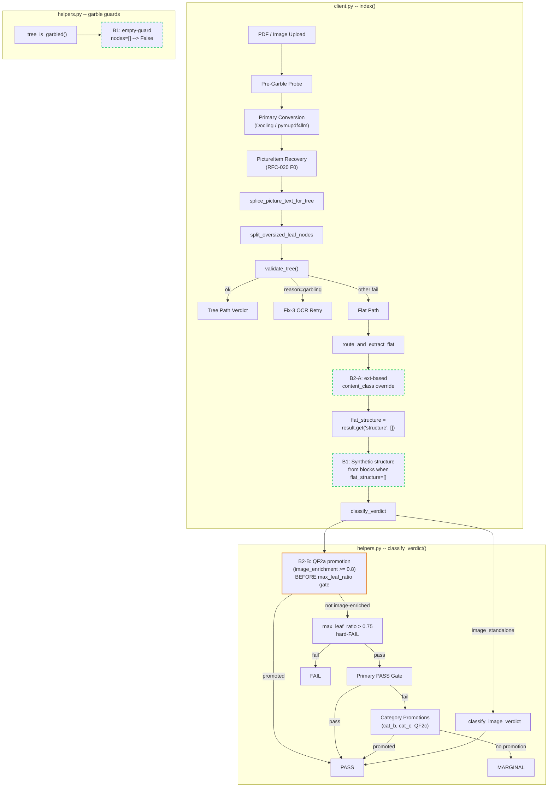
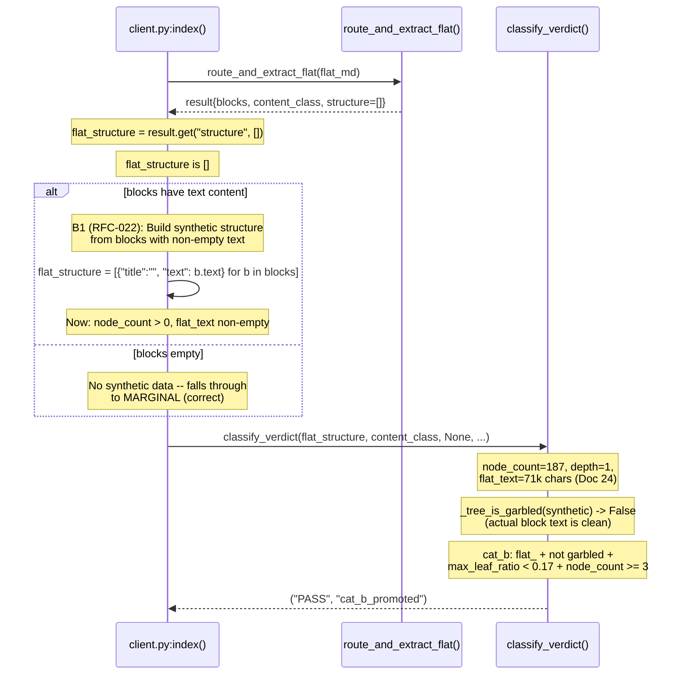
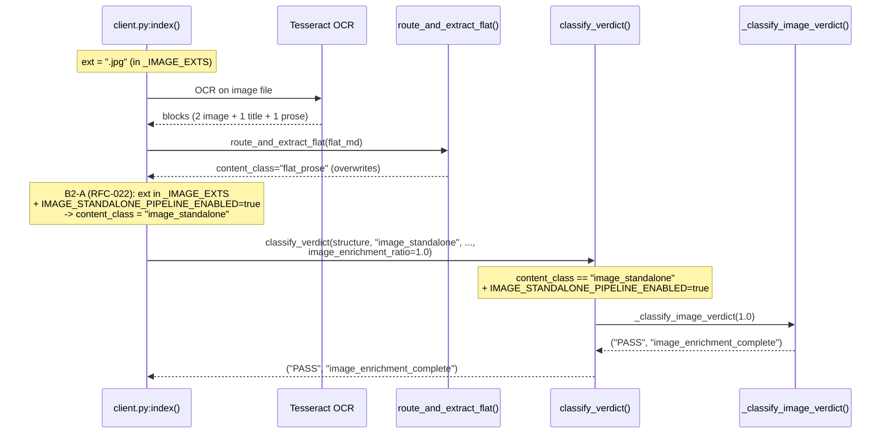
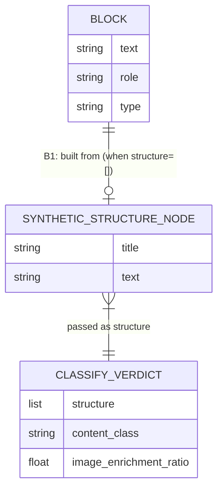

<!-- Space: CITRA -->
<!-- Title: Design: RFC-022 Run 5 Verdict Bug-Fixes -->
<!-- Folder: Designs -->

# Design Document: RFC-022 Run 5 Verdict Bugfixes

## Traceability

| Artifact | Reference |
|---|---|
| Governing RFC | [RFC-022: Run 5 Verdict Bug-Fixes](../rfcs/022-run5-verdict-bugfixes.md) |
| PRD / Requirements | `PRD.md` -- Functional Requirements, Quality Bar |
| Architecture Doc | `ARCHITECTURE.md` -- Ingestion Pipeline, Tree Quality Gate |
| Implementation Plan | [tasks-rfc022-run5-verdict-bugfixes.md](../tasks/tasks-rfc022-run5-verdict-bugfixes.md) |
| Prior Design (RFC-021) | [design-rfc021-run4-verdict-quickfixes.md](design-rfc021-run4-verdict-quickfixes.md) |
| Prior Design (RFC-020) | [design-rfc020-run3-regression-remediation.md](design-rfc020-run3-regression-remediation.md) |

## Overview

Run 5 corpus reaudit (25 docs, all RFC-021 QF1-QF4 + QF2a-LT fixes applied) scored **17 PASS / 4 MARGINAL / 3 FAIL / 1 ERROR**. Post-audit deviation analysis identified **3 confirmed code bugs** causing 3 documents to receive incorrect verdicts:

- **[B1](../rfcs/022-run5-verdict-bugfixes.md#b1-flat-doc-verdict-blind-spot-structure--all-gates-blocked) (P0):** `classify_verdict` receives `structure=[]` for flat docs, causing ALL tree-derived metrics to degenerate (`node_count=0`, `depth=0`, `flat_text=""`, `garbled=True`). Every promotion path is blocked. Fix: build synthetic structure from blocks in [client.py](#1-clientpy) + empty-guard in [helpers.py](#2-helperspy).
- **[B2](../rfcs/022-run5-verdict-bugfixes.md#b2-image-file-routing--gate-ordering-two-part) (P1):** Two-part. (A) `route_and_extract_flat` overwrites `content_class` set by `_IMAGE_EXTS` route. (B) `max_leaf_ratio > 0.75` hard-FAIL fires before QF2a promotion can rescue image-enriched docs. Fix: extension-based override + gate hoist.
- **[B3](../rfcs/022-run5-verdict-bugfixes.md#b3-ghv-tkv-ocr-splice-regression) (P1):** Doc 3 regressed MARGINAL to FAIL between Run 4 and Run 5 -- `<!-- image -->` markers produced but never enriched. Fix: diagnosis-first, then repair based on findings.

After fixes, projected Run 6: **19 PASS / 4 MARGINAL / 1 FAIL / 1 ERROR** (from 17/4/3/1).

## Key Design Principles

1. **Fix-only, no new features.** Each bug fix corrects a measurable defect in the existing verdict/routing pipeline. No new extraction routes, no new LLM calls, no new storage backends.

2. **Synthetic data is transient.** The synthetic structure built for flat docs in [B1-Fix](../rfcs/022-run5-verdict-bugfixes.md#b1-fix-synthetic-structure-from-flat-doc-blocks) is computed at verdict time and never persisted to MinIO or Redis. It is a translation layer between the existing block model and the existing `classify_verdict` interface.

3. **Extension is definitionally correct.** For [B2-Fix Part A](../rfcs/022-run5-verdict-bugfixes.md#b2-fix-image-routing--gate-reorder-two-part), file extension is the authoritative signal for `content_class="image_standalone"` because OCR can produce non-image blocks from image files. Block-role heuristics (`all(role=="image")`) are insufficient.

4. **Diagnosis before commitment.** [B3-Fix](../rfcs/022-run5-verdict-bugfixes.md#b3-fix-ghv-tkv-ocr-splice-trace--repair) starts with a trace of Doc 3's code path. Three hypothesized causes exist; committing to a fix before identifying the real one wastes effort.

5. **Zero regression on existing PASS.** All 17 Run 5 PASS documents must remain PASS after every fix. Enforced by [Property 5](#property-5-ocr-splice-completeness) and validated in [Phase 4](../tasks/tasks-rfc022-run5-verdict-bugfixes.md#4-pipeline-version-bump-reaudit).

## Launch Constraints

| ID | Constraint | Source |
|---|---|---|
| HR1 | No new derived stores -- all changes are in-process logic in `client.py` and `helpers.py` | `CLAUDE.md` Hard Rule 2 |
| HR2 | No new LLM calls -- verdict computation and garble detection remain purely heuristic | `CLAUDE.md` Hard Rule 3 |
| HR3 | `validate_tree()` must still run before `save_doc` -- synthetic structure does not bypass the gate | `CLAUDE.md` Hard Rule 5 |
| HR4 | All changes must be in-process Python; no infrastructure changes (Redis, MinIO, Prometheus topology unchanged) | `ARCHITECTURE.md` |
| HR5 | Pipeline version bump required to force reprocessing past hash-based change detection | [RFC-022 Pipeline Version](../rfcs/022-run5-verdict-bugfixes.md#pipeline-version) |

## Architecture

### High-Level System Architecture

The following diagram shows the ingestion pipeline components affected by RFC-022. Highlighted boxes indicate modified code paths; dashed boxes indicate new logic.



### Architecture Decisions

#### AD-1: Synthetic Structure from Blocks (B1-Fix)

| Aspect | Decision |
|---|---|
| **Context** | Flat docs pass `structure=[]` to `classify_verdict`. All tree-derived metrics degenerate: `node_count=0`, `depth=0`, `flat_text=""`, `_tree_is_garbled([])=True`. Every promotion path is blocked -- including garble-immune QF2a (requires `image_enrichment_ratio >= 0.8`, which Doc 24 lacks). |
| **Decision** | Build synthetic structure from existing flat-doc blocks in `client.py` rather than modifying `classify_verdict` to accept raw blocks. Each text-bearing block becomes `{"title": "", "text": block_text}`. |
| **Trade-off** | Synthetic structure is flat (depth=1) so PASS gate (`depth >= 2`) never fires. cat_b promotion is the expected path. This is correct -- flat docs are flat. |
| **Rollback** | Git revert -- pure logic, no threshold lever. |
| **RFC ref** | [B1-Fix](../rfcs/022-run5-verdict-bugfixes.md#b1-fix-synthetic-structure-from-flat-doc-blocks) |
| **Tasks** | [Task 1.1](../tasks/tasks-rfc022-run5-verdict-bugfixes.md#11-synthetic-structure-from-blocks), [Task 1.2](../tasks/tasks-rfc022-run5-verdict-bugfixes.md#12-tree-is-garbled-empty-guard) |

#### AD-2: Extension-Based Override (B2-A Fix)

| Aspect | Decision |
|---|---|
| **Context** | `_IMAGE_EXTS` route (client.py:707) processes standalone image files via Tesseract OCR, but `route_and_extract_flat` (line 1004) overwrites any prior `content_class`. QF2a-LT's `all(role=="image")` check fails for Doc 13 because Tesseract produces mixed block roles (2 image + 1 title + 1 prose). |
| **Decision** | Use file extension as authoritative signal for `content_class="image_standalone"`. Override fires AFTER `route_and_extract_flat` so it sticks through to `classify_verdict`. |
| **Trade-off** | Extension-based classification is definitionally correct for `_IMAGE_EXTS` ({.png, .jpg, .jpeg, .tiff, .tif}) -- these are image files regardless of what OCR extracts from them. |
| **Rollback** | `IMAGE_STANDALONE_PIPELINE_ENABLED=false` (existing env var). |
| **RFC ref** | [B2-Fix](../rfcs/022-run5-verdict-bugfixes.md#b2-fix-image-routing--gate-reorder-two-part) |
| **Tasks** | [Task 2.1](../tasks/tasks-rfc022-run5-verdict-bugfixes.md#21-extension-based-content-class-override) |

#### AD-3: QF2a Gate Hoist (B2-B Fix)

| Aspect | Decision |
|---|---|
| **Context** | `max_leaf_ratio > 0.75` hard-FAIL (helpers.py:1184) fires BEFORE QF2a `image_enrichment_promoted` check (line 1245). For Doc 13 with `max_leaf_ratio=1.00`, QF2a is dead code. |
| **Decision** | Move QF2a promotion above the hard-FAIL rather than removing the hard-FAIL. `max_leaf_ratio > 0.75` remains a valid quality gate for non-image docs; only image-enriched docs should bypass it. This is defense-in-depth for when `IMAGE_STANDALONE_PIPELINE_ENABLED=false`. |
| **Trade-off** | The hoisted QF2a fires before `_tree_is_garbled` is computed. Safe because: (1) flat docs already pass upstream garble gate; (2) `image_enrichment_ratio >= 0.8` is itself strong extraction evidence. |
| **Rollback** | Git revert -- gate reorder only. |
| **RFC ref** | [B2-Fix](../rfcs/022-run5-verdict-bugfixes.md#b2-fix-image-routing--gate-reorder-two-part) |
| **Tasks** | [Task 2.2](../tasks/tasks-rfc022-run5-verdict-bugfixes.md#22-qf2a-gate-hoist) |

#### AD-4: Diagnosis-First for B3

| Aspect | Decision |
|---|---|
| **Context** | Doc 3 regressed MARGINAL to FAIL between Run 4 (4,267 chars) and Run 5 (375 chars). `<!-- image -->` markers produced but never enriched. Three hypothesized causes: QF1 OCR deferral interaction, P0b page-coverage filter, or `_recover_picture_text()` returning empty. |
| **Decision** | Trace Doc 3's code path before committing to a fix. Existing investigation (`OCR_IMAGE_BLOCK_CONFLATION_INVESTIGATION_2026-07-27.md`) documents the same symptom pattern and may contain the answer. |
| **Trade-off** | Defers the fix until root cause is confirmed. Preferable to shipping a wrong fix at a speculative cause. |
| **Rollback** | Depends on diagnosis -- env-var gate if threshold change; git revert if logic change. |
| **RFC ref** | [B3-Fix](../rfcs/022-run5-verdict-bugfixes.md#b3-fix-ghv-tkv-ocr-splice-trace--repair) |
| **Tasks** | [Task 3.1](../tasks/tasks-rfc022-run5-verdict-bugfixes.md#31-b3-diagnosis), [Task 3.2](../tasks/tasks-rfc022-run5-verdict-bugfixes.md#32-b3-fix) |

#### AD-5: Pipeline Version Bump

| Aspect | Decision |
|---|---|
| **Context** | `preprocess_client.py` uses hash-based change detection. Unchanged source files skip processing unless the pipeline version changes. Without a bump, Run 6 reads stale Run 5 verdicts. |
| **Decision** | Increment `CURRENT_PIPELINE_VERSION` (e.g. `3` to `4`) to force full reprocessing of all 25 docs. |
| **Trade-off** | Full reprocessing takes ~15-20 minutes but is required exactly once. |
| **Rollback** | Decrement version -- processing skips but stale verdicts remain. Not recommended. |
| **RFC ref** | [Pipeline Version](../rfcs/022-run5-verdict-bugfixes.md#pipeline-version) |
| **Tasks** | [Task 4.1](../tasks/tasks-rfc022-run5-verdict-bugfixes.md#41-pipeline-version-bump) |

### Deployment Architecture

No infrastructure changes. All fixes are in-process Python logic modifications in two files:

| File | Lines affected | Bug |
|---|---|---|
| `src/pageindex_mcp/client.py` | ~1004 (ext override), ~1050 (synthetic structure) | B1, B2-A, B3 (TBD) |
| `src/pageindex_mcp/helpers.py` | `_tree_is_garbled` (empty guard), `classify_verdict` (gate reorder) | B1, B2-B |

Existing deployment topology (MCP server + arq worker + MinIO + Redis) is unchanged. The arq worker process picks up new logic on restart; no rolling-deploy coordination required beyond the standard restart.

### Communication Patterns

All changes are synchronous, in-process function calls. No new inter-service communication, no new Redis keys, no new MinIO paths.

| Caller | Callee | Change |
|---|---|---|
| `client.py:index()` | `classify_verdict()` | B1: passes synthetic structure instead of `[]` when blocks are available |
| `client.py:index()` | `classify_verdict()` | B2-A: passes `content_class="image_standalone"` for `_IMAGE_EXTS` files |
| `classify_verdict()` | `_classify_image_verdict()` | B2: existing routing, now reached correctly for image files |
| `classify_verdict()` | QF2a promotion | B2-B: fires before `max_leaf_ratio > 0.75` hard-FAIL |
| `_tree_is_garbled()` | N/A | B1: early return `False` on empty input |

## Sequence Diagrams

### Flat-Doc Verdict Flow (B1)



### Image Standalone Routing Flow (B2)



## Service Contracts

### 1. client.py

**File:** `src/pageindex_mcp/client.py`

#### B1: Synthetic structure from blocks (after line 1050)

**Current behavior:** `flat_structure = result.get("structure", [])` passes an empty list to `classify_verdict` for flat docs. All tree-derived metrics degenerate.

**New behavior:** When `flat_structure` is empty and `blocks` contains text-bearing entries, build a synthetic structure where each block becomes a `{"title": "", "text": block_text}` node.

```python
flat_structure = result.get("structure", [])

# B1 (RFC-022): flat docs may have structure=[] (failed tree or
# no tree attempt). classify_verdict scores on structure -- an
# empty list yields node_count=0/depth=0/flat_text="" which
# blocks every promotion gate. Build synthetic structure from
# blocks so the verdict function has real content to assess.
if not flat_structure and blocks:
    flat_structure = [
        {"title": "", "text": b.get("text", "")}
        for b in blocks
        if b.get("text", "").strip()
    ]
```

**Guard:** Only fires when `flat_structure` is empty AND `blocks` has content. Docs with a real structure are unaffected. Docs with empty blocks get no synthetic data (correct -- nothing to score).

Linked: [AD-1](#ad-1-synthetic-structure-from-blocks-b1-fix), [Property 1](#property-1-synthetic-structure-for-flat-docs), [Task 1.1](../tasks/tasks-rfc022-run5-verdict-bugfixes.md#11-synthetic-structure-from-blocks)

#### B2-A: Extension-based content_class override (after line 1004)

**Current behavior:** `route_and_extract_flat(flat_md)` sets `content_class` based on block composition. QF2a-LT's `all(role=="image")` check fires only when ALL blocks are image-typed. For image files producing mixed block roles (via Tesseract OCR), `content_class` ends up as `"flat_prose"` or `"flat_mixed"`.

**New behavior:** After `route_and_extract_flat`, if the file extension is in `_IMAGE_EXTS` and `IMAGE_STANDALONE_PIPELINE_ENABLED=true`, override `content_class` to `"image_standalone"`.

```python
# B2-A (RFC-022): _IMAGE_EXTS files are definitionally
# image-standalone. The all(role=="image") check misses
# cases where OCR produces text blocks alongside image
# blocks. Extension is the authoritative signal.
if (
    _IMAGE_STANDALONE_PIPELINE_ENABLED
    and ext in _IMAGE_EXTS
):
    content_class = "image_standalone"
```

Linked: [AD-2](#ad-2-extension-based-override-b2-a-fix), [Property 3](#property-3-image-extension-routing), [Task 2.1](../tasks/tasks-rfc022-run5-verdict-bugfixes.md#21-extension-based-content-class-override), [Image Standalone Routing Flow](#image-standalone-routing-flow-b2)

#### B3: OCR splice repair (TBD after diagnosis)

Exact code change depends on [Task 3.1](../tasks/tasks-rfc022-run5-verdict-bugfixes.md#31-b3-diagnosis) findings. Three hypothesized fixes:

1. *P0b blocks all regions:* Relax coverage threshold for table-heavy pages, or add zero-enrichment backstop
2. *OCR pipeline skip/failure:* Post-processing validation -- `<!-- image -->` markers with zero enriched blocks triggers warning + re-attempt
3. *Conflation with page-level OCR:* Apply decoupling fix from `OCR_IMAGE_BLOCK_CONFLATION_INVESTIGATION_2026-07-27.md`

Linked: [AD-4](#ad-4-diagnosis-first-for-b3), [Property 5](#property-5-ocr-splice-completeness), [Task 3.1](../tasks/tasks-rfc022-run5-verdict-bugfixes.md#31-b3-diagnosis), [Task 3.2](../tasks/tasks-rfc022-run5-verdict-bugfixes.md#32-b3-fix)

### 2. helpers.py

**File:** `src/pageindex_mcp/helpers.py`

#### B1: `_tree_is_garbled` empty guard

**Current behavior:** `_tree_is_garbled([])` calls `_flatten_tree_text([])` which returns `""`, then `_is_garbled_blob("")` returns `True` (empty blob is vacuously garbled). This is semantically wrong -- an empty node list carries zero evidence of garble.

**New behavior:** Early return `False` when `nodes` is empty.

```python
def _tree_is_garbled(nodes: list, expected_script: str | None = None) -> bool:
    if not nodes:
        return False  # B1 (RFC-022): no text -> no evidence of garble
    blob = _flatten_tree_text(nodes)
    return _is_garbled_blob(blob, expected_script=expected_script) or _has_sparse_mojibake(blob)
```

Linked: [AD-1](#ad-1-synthetic-structure-from-blocks-b1-fix), [Property 2](#property-2-tree-is-garbled-empty-guard), [Task 1.2](../tasks/tasks-rfc022-run5-verdict-bugfixes.md#12-tree-is-garbled-empty-guard)

#### B2-B: QF2a gate hoist in `classify_verdict`

**Current behavior:** `max_leaf_ratio > 0.75` hard-FAIL (line 1184) fires before QF2a `image_enrichment_promoted` check (line 1245). For any image-enriched doc with `max_leaf_ratio > 0.75`, QF2a is dead code.

**New behavior:** Move QF2a promotion above the `max_leaf_ratio > 0.75` gate.

```python
# B2-B (RFC-022): rescue gate -- classification-changing promotions
# must fire BEFORE hard-exits based on pre-promotion state.
# Defense-in-depth for IMAGE_STANDALONE_PIPELINE_ENABLED=false.
if (
    content_class in ("flat_prose", "flat_mixed")
    and image_enrichment_ratio is not None
    and image_enrichment_ratio >= 0.8
):
    return "PASS", "image_enrichment_promoted"

_, _, max_leaf_ratio = _tree_max_leaf_ratio(structure)
if max_leaf_ratio > 0.75:
    return "FAIL", f"max_leaf_ratio={max_leaf_ratio:.2f}"
```

Linked: [AD-3](#ad-3-qf2a-gate-hoist-b2-b-fix), [Property 4](#property-4-qf2a-gate-ordering), [Task 2.2](../tasks/tasks-rfc022-run5-verdict-bugfixes.md#22-qf2a-gate-hoist)

## Data Models

### Entity-Relationship Diagram

This RFC does not introduce new persisted data models. The only data change is the synthetic structure -- a transient object built from existing blocks at verdict time, never persisted to MinIO or Redis.



**Existing `meta.json` fields used (no changes):**

| Field | Type | Notes |
|---|---|---|
| `verdict` | `string` | PASS / MARGINAL / FAIL / ERROR |
| `verdict_reason` | `string` | New values: `"cat_b_promoted"` (for B1-rescued flat docs) |
| `content_class` | `string` | B2-A: now correctly set to `"image_standalone"` for image files |
| `max_leaf_ratio` | `float` | Computed from synthetic structure for flat docs (B1) |
| `node_count` | `int` | Non-zero for flat docs with synthetic structure (B1) |

## Correctness Properties

### Property 1: Synthetic Structure for Flat Docs

**Statement:** For any flat document with `structure=[]` and non-empty text blocks, `classify_verdict` SHALL receive a synthetic structure with `node_count > 0` and non-empty `flat_text`.

**Rationale:** `classify_verdict` was designed for tree documents. When flat docs pass `structure=[]`, ALL tree-derived metrics degenerate. The synthetic structure translates block content into a form `classify_verdict` can score.

**Verification:** [Task 1.3](../tasks/tasks-rfc022-run5-verdict-bugfixes.md#13-b1-unit-tests) -- `test_synthetic_structure_from_blocks`: (a) empty structure + text blocks produces synthetic structure with nodes; (b) synthetic structure through `classify_verdict` returns cat_b_promoted; (c) empty structure + empty blocks produces no synthetic data, MARGINAL.

Linked: [AD-1](#ad-1-synthetic-structure-from-blocks-b1-fix), [B1-Fix](../rfcs/022-run5-verdict-bugfixes.md#b1-fix-synthetic-structure-from-flat-doc-blocks), [client.py](#1-clientpy), [Flat-Doc Verdict Flow](#flat-doc-verdict-flow-b1)

### Property 2: Tree-Is-Garbled Empty Guard

**Statement:** For any call to `_tree_is_garbled` with an empty node list, the function SHALL return `False`.

**Rationale:** An empty node list carries zero evidence of garble. The prior behavior (`True` via `_is_garbled_blob("")`) is a vacuous truth that poisons downstream verdict computation.

**Verification:** [Task 1.3](../tasks/tasks-rfc022-run5-verdict-bugfixes.md#13-b1-unit-tests) -- `test_tree_is_garbled_empty`: (a) `_tree_is_garbled([])` returns `False`; (b) `_tree_is_garbled([{"text": "real content"}])` unchanged behavior.

Linked: [AD-1](#ad-1-synthetic-structure-from-blocks-b1-fix), [B1-Fix](../rfcs/022-run5-verdict-bugfixes.md#b1-fix-synthetic-structure-from-flat-doc-blocks), [helpers.py](#2-helperspy)

### Property 3: Image Extension Routing

**Statement:** For any file with extension in `_IMAGE_EXTS`, `content_class` SHALL be `"image_standalone"` when `IMAGE_STANDALONE_PIPELINE_ENABLED=true`, regardless of block composition from `route_and_extract_flat`.

**Rationale:** Extension is definitionally correct for image files. OCR can produce mixed block roles (image + title + prose) from a single image, causing `all(role=="image")` to fail.

**Verification:** [Task 2.3](../tasks/tasks-rfc022-run5-verdict-bugfixes.md#23-b2-unit-tests) -- `test_image_ext_content_class`: (a) `.jpg` file with mixed blocks gets `content_class="image_standalone"`; (b) `IMAGE_STANDALONE_PIPELINE_ENABLED=false` skips override.

Linked: [AD-2](#ad-2-extension-based-override-b2-a-fix), [B2-Fix](../rfcs/022-run5-verdict-bugfixes.md#b2-fix-image-routing--gate-reorder-two-part), [client.py](#1-clientpy), [Image Standalone Routing Flow](#image-standalone-routing-flow-b2)

### Property 4: QF2a Gate Ordering

**Statement:** For any document with `content_class` in `("flat_prose", "flat_mixed")` and `image_enrichment_ratio >= 0.8`, the QF2a promotion SHALL fire before `max_leaf_ratio > 0.75` hard-FAIL.

**Rationale:** `max_leaf_ratio > 0.75` is a valid quality gate for non-image docs, but image-enriched docs have content captured in enriched image blocks, not tree nodes. The structural metric is misleading for these docs.

**Verification:** [Task 2.3](../tasks/tasks-rfc022-run5-verdict-bugfixes.md#23-b2-unit-tests) -- `test_qf2a_before_max_leaf_ratio`: (a) `flat_prose` + ratio=0.9 + `max_leaf_ratio=1.0` returns PASS via QF2a; (b) `flat_prose` + no ratio + `max_leaf_ratio=1.0` returns FAIL (unchanged).

Linked: [AD-3](#ad-3-qf2a-gate-hoist-b2-b-fix), [B2-Fix](../rfcs/022-run5-verdict-bugfixes.md#b2-fix-image-routing--gate-reorder-two-part), [helpers.py](#2-helperspy)

### Property 5: OCR Splice Completeness

**Statement:** For any document where `<!-- image -->` markers are produced, at least one enriched block SHALL exist in the output (or a warning SHALL be logged).

**Rationale:** `<!-- image -->` markers indicate picture regions detected during conversion. If zero enrichment occurs, the pipeline silently drops content -- a regression from prior runs where F1 coverage exemption preserved partial text.

**Verification:** [Task 3.3](../tasks/tasks-rfc022-run5-verdict-bugfixes.md#33-b3-unit-tests) -- `test_ocr_splice_completeness`: (a) doc with `<!-- image -->` markers produces at least one enriched block; (b) if enrichment fails, warning is logged.

Linked: [AD-4](#ad-4-diagnosis-first-for-b3), [B3-Fix](../rfcs/022-run5-verdict-bugfixes.md#b3-fix-ghv-tkv-ocr-splice-trace--repair), [client.py](#1-clientpy)

## Error Handling

### B1 Error Handling

| Condition | Behavior | Rationale |
|---|---|---|
| `blocks` is empty AND `structure` is empty | No synthetic structure built; falls through to MARGINAL | Correct -- no content to score |
| `blocks` has entries but all have empty/whitespace `text` | No synthetic structure built (`.strip()` filter) | Correct -- whitespace-only blocks are not content |
| Synthetic structure produces `node_count > 0` but text is garbled | `_tree_is_garbled(synthetic)` returns `True`; garble gate fires normally | Correct -- garble detection on actual content, not degenerate empty string |

### B2 Error Handling

| Condition | Behavior | Rationale |
|---|---|---|
| `IMAGE_STANDALONE_PIPELINE_ENABLED=false` | Extension override skipped; falls through to flat path | Existing rollback behavior from QF2a-LT |
| File extension not in `_IMAGE_EXTS` | Override skipped; normal content_class from `route_and_extract_flat` | Correct -- only image files get the override |
| `image_enrichment_ratio=None` (no image blocks) | QF2a promotion skipped; `max_leaf_ratio > 0.75` gate applies normally | Correct -- non-image docs use structural metrics |

### B3 Error Handling

TBD after [Task 3.1](../tasks/tasks-rfc022-run5-verdict-bugfixes.md#31-b3-diagnosis) diagnosis. Likely:

| Condition | Behavior | Rationale |
|---|---|---|
| `<!-- image -->` markers with zero enriched blocks | Warning logged; document proceeds with available text | Fail-open -- partial content better than silent drop |

### Rollback Matrix

| Fix | Rollback lever | Default (fix active) | Effect of rollback |
|---|---|---|---|
| B1 (synthetic structure) | Git revert | N/A | Flat docs return to `structure=[]` scoring |
| B1 (`_tree_is_garbled` guard) | Git revert | N/A | Empty nodes return to vacuous `True` |
| B2-A (ext override) | `IMAGE_STANDALONE_PIPELINE_ENABLED=false` | `"true"` | Falls back to `all(role=="image")` heuristic |
| B2-B (gate hoist) | Git revert | N/A | QF2a fires after `max_leaf_ratio > 0.75` (dead code for high-ratio docs) |
| B3 | Depends on diagnosis | TBD | TBD |

## Testing Strategy

Property-based tests are not warranted for these surgical fixes. Unit tests per bug, plus full 25-doc regression reaudit in Phase 4.

### Per-Property Test Matrix

| Property | Test File | Test Description | Bug | Task |
|---|---|---|---|---|
| [Property 1](#property-1-synthetic-structure-for-flat-docs) | `tests/test_rfc022_b1.py` | empty structure + text blocks produces synthetic structure with nodes | B1 | [1.3](../tasks/tasks-rfc022-run5-verdict-bugfixes.md#13-b1-unit-tests) |
| [Property 1](#property-1-synthetic-structure-for-flat-docs) | `tests/test_rfc022_b1.py` | synthetic structure through `classify_verdict` returns cat_b_promoted | B1 | [1.3](../tasks/tasks-rfc022-run5-verdict-bugfixes.md#13-b1-unit-tests) |
| [Property 1](#property-1-synthetic-structure-for-flat-docs) | `tests/test_rfc022_b1.py` | empty structure + empty blocks produces no synthetic data, MARGINAL | B1 | [1.3](../tasks/tasks-rfc022-run5-verdict-bugfixes.md#13-b1-unit-tests) |
| [Property 1](#property-1-synthetic-structure-for-flat-docs) | `tests/test_rfc022_b1.py` | non-empty garbled structure still detected as garbled | B1 | [1.3](../tasks/tasks-rfc022-run5-verdict-bugfixes.md#13-b1-unit-tests) |
| [Property 2](#property-2-tree-is-garbled-empty-guard) | `tests/test_rfc022_b1.py` | `_tree_is_garbled([])` returns `False` | B1 | [1.3](../tasks/tasks-rfc022-run5-verdict-bugfixes.md#13-b1-unit-tests) |
| [Property 2](#property-2-tree-is-garbled-empty-guard) | `tests/test_rfc022_b1.py` | `_tree_is_garbled([{"text": "real content"}])` unchanged behavior | B1 | [1.3](../tasks/tasks-rfc022-run5-verdict-bugfixes.md#13-b1-unit-tests) |
| [Property 3](#property-3-image-extension-routing) | `tests/test_rfc022_b2.py` | `.jpg` extension sets `content_class="image_standalone"` after `route_and_extract_flat` | B2 | [2.3](../tasks/tasks-rfc022-run5-verdict-bugfixes.md#23-b2-unit-tests) |
| [Property 3](#property-3-image-extension-routing) | `tests/test_rfc022_b2.py` | `IMAGE_STANDALONE_PIPELINE_ENABLED=false` skips extension override | B2 | [2.3](../tasks/tasks-rfc022-run5-verdict-bugfixes.md#23-b2-unit-tests) |
| [Property 3](#property-3-image-extension-routing) | `tests/test_rfc022_b2.py` | `_classify_image_verdict(1.0)` returns PASS | B2 | [2.3](../tasks/tasks-rfc022-run5-verdict-bugfixes.md#23-b2-unit-tests) |
| [Property 3](#property-3-image-extension-routing) | `tests/test_rfc022_b2.py` | `_classify_image_verdict(None)` returns FAIL | B2 | [2.3](../tasks/tasks-rfc022-run5-verdict-bugfixes.md#23-b2-unit-tests) |
| [Property 4](#property-4-qf2a-gate-ordering) | `tests/test_rfc022_b2.py` | `flat_prose` + ratio=0.9 + `max_leaf_ratio=1.0` returns PASS via hoisted QF2a | B2 | [2.3](../tasks/tasks-rfc022-run5-verdict-bugfixes.md#23-b2-unit-tests) |
| [Property 4](#property-4-qf2a-gate-ordering) | `tests/test_rfc022_b2.py` | `flat_prose` + no ratio + `max_leaf_ratio=1.0` returns FAIL (unchanged) | B2 | [2.3](../tasks/tasks-rfc022-run5-verdict-bugfixes.md#23-b2-unit-tests) |
| [Property 5](#property-5-ocr-splice-completeness) | `tests/test_rfc022_b3.py` | doc with `<!-- image -->` markers produces at least one enriched block | B3 | [3.3](../tasks/tasks-rfc022-run5-verdict-bugfixes.md#33-b3-unit-tests) |
| [Property 5](#property-5-ocr-splice-completeness) | `tests/test_rfc022_b3.py` | if enrichment fails, warning is logged | B3 | [3.3](../tasks/tasks-rfc022-run5-verdict-bugfixes.md#33-b3-unit-tests) |
| [Property 5](#property-5-ocr-splice-completeness) | `tests/test_rfc022_b3.py` | post-fix chars > 375 | B3 | [3.3](../tasks/tasks-rfc022-run5-verdict-bugfixes.md#33-b3-unit-tests) |
| Zero regression | Full corpus | All 17 Run 5 PASS docs remain PASS after all fixes | All | [4.2](../tasks/tasks-rfc022-run5-verdict-bugfixes.md#42-full-25-doc-reaudit) |
| Zero regression | Full corpus | Run 6 scorecard = 19P / 4M / 1F / 1E | All | [4.3](../tasks/tasks-rfc022-run5-verdict-bugfixes.md#43-checkpoint--final) |
