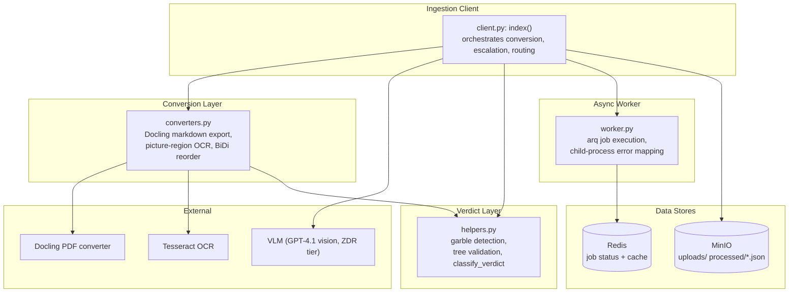
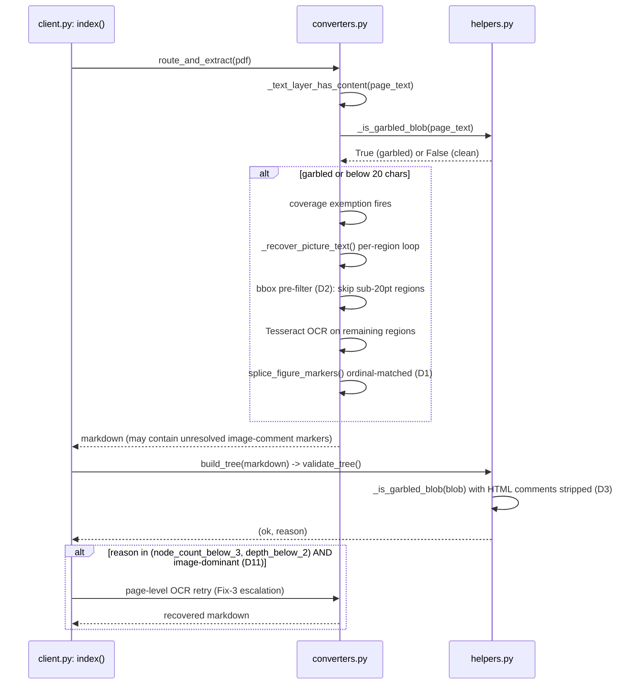
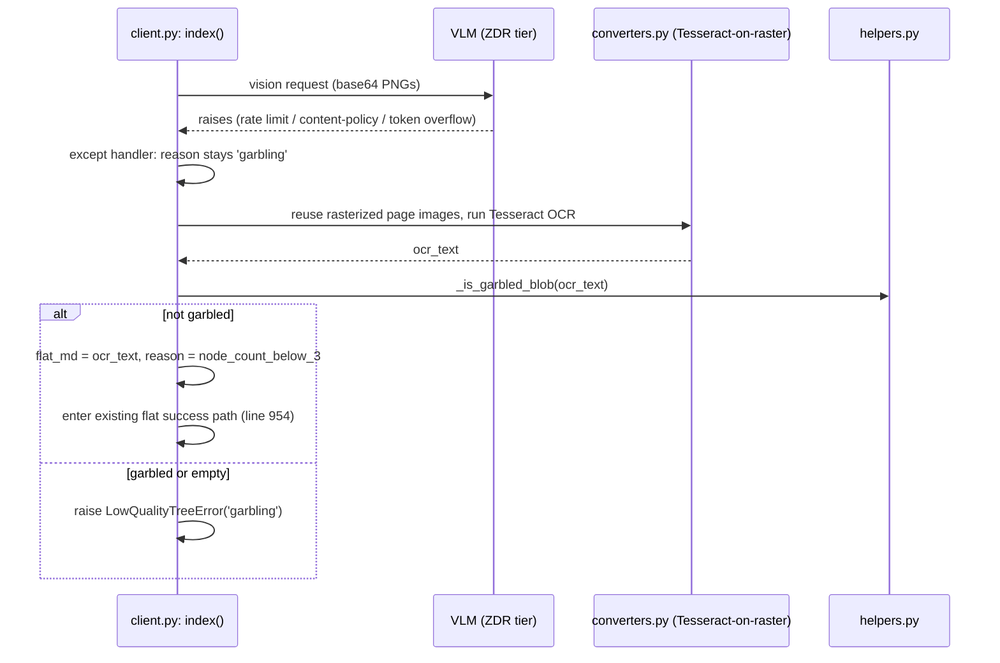
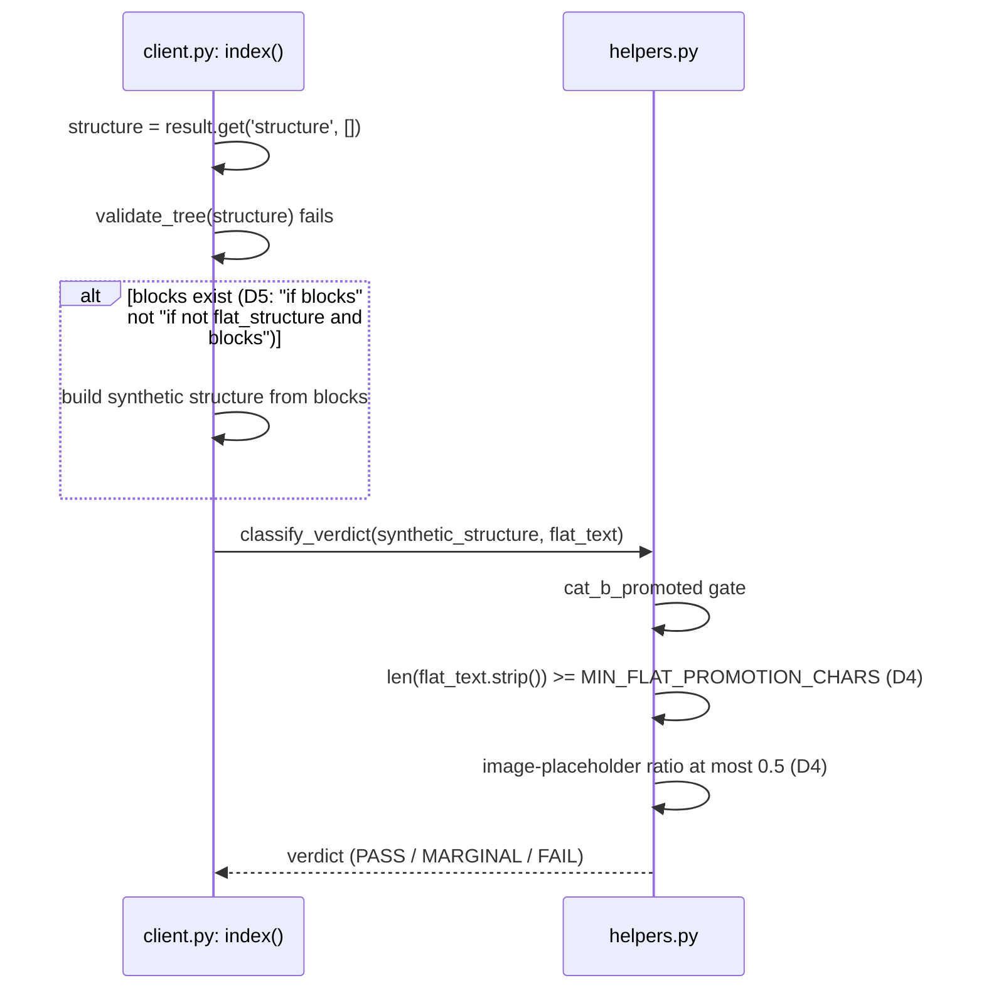
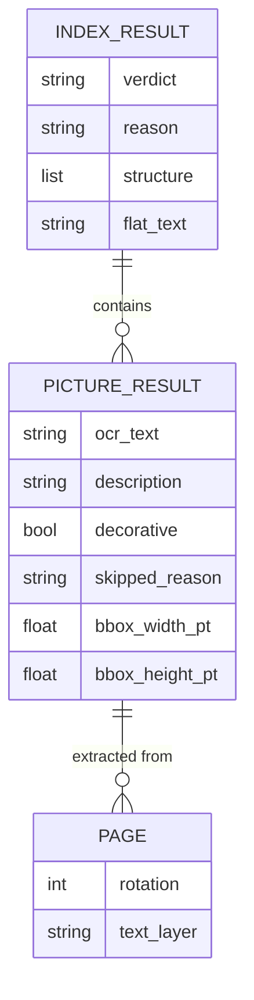

<!-- Space: CITRA -->
<!-- Title: Design Document: RFC-023 Run 6 Content Recovery & Verdict Hardening -->
<!-- Folder: Designs -->

# Design Document: RFC-023 Run 6 Content Recovery & Verdict Hardening

## Traceability

| Artifact             | Reference                                                                                                                          |
| -------------------- | ---------------------------------------------------------------------------------------------------------------------------------- |
| Governing RFC(s)     | [RFC-023: Run 6 Content Recovery &amp; Verdict Hardening](../rfcs/023-run6-content-recovery-and-verdict-hardening.md)               |
| Audit source         | [`audit/CORPUS_REINGESTION_AUDIT_RUN-6.md`](../../audit/CORPUS_REINGESTION_AUDIT_RUN-6.md)          |
| Hard Rules (binding) | [CLAUDE.md § Hard Rules](../../CLAUDE.md#hard-rules)                                                                               |
| Implementation Plan  | [tasks-rfc023-run6-content-recovery-and-verdict-hardening.md](../tasks/tasks-rfc023-run6-content-recovery-and-verdict-hardening.md) |

## Overview

Run 6 of the corpus reaudit scored 11 PASS / 4 MARGINAL / 9 FAIL / 1 ERROR against a projected 19 PASS — the worst regression since Run 4, per [RFC-023 Problem Statement](../rfcs/023-run6-content-recovery-and-verdict-hardening.md#problem-statement). This design closes 11 distinct defects (D0-D11, excluding a deferred D3 follow-up) spanning three themes: garble-aware content recovery for the picture-OCR pipeline, verdict-classification correctness/escalation hardening, and pipeline resilience for rotated pages, VLM crashes, and worker error mapping. The fixes are scoped to four existing modules — `converters.py`, `helpers.py`, `client.py`, `worker.py` — with no new services, no schema changes, and no new external dependencies; every fix ships behind an env-var or code-revert rollback path so the branch can be de-risked incrementally per [RFC-023 Implementation Plan](../rfcs/023-run6-content-recovery-and-verdict-hardening.md#implementation-plan) and validated against the [Correctness Properties](#correctness-properties) below.

## Key Design Principles

1. **Garble-awareness before coverage/threshold gates**: Any gate that decides whether to recover content (OCR exemptions, escalation triggers, garble-blob detection) must first ask "is this text actually garbled?" rather than relying on proxy signals like character count or line-count ratios alone — this is the root theme of [D0](../rfcs/023-run6-content-recovery-and-verdict-hardening.md#d0-make-_text_layer_has_content-garble-aware-p0-bug), [D3](../rfcs/023-run6-content-recovery-and-verdict-hardening.md#d3-strip--image---markers-from-garble-detection-p0-bug), and [D11](../rfcs/023-run6-content-recovery-and-verdict-hardening.md#d11-widen-ocr-escalation-to-structural-failure-reasons-p1-bug).
2. **Graceful degradation over all-or-nothing bail-outs**: When a count-mismatch or partial-failure condition is detected, prefer per-item recovery (ordinal matching, synthetic structure from blocks) over abandoning the entire recovery path, per [D1](../rfcs/023-run6-content-recovery-and-verdict-hardening.md#d1-graceful-degradation-for-splice_figure_markers-count-mismatch-p0-bug) and [D5](../rfcs/023-run6-content-recovery-and-verdict-hardening.md#d5-prefer-synthetic-structure-over-rejected-tree-for-flat-routed-docs-p1-bug).
3. **A degraded-but-present artifact beats zero artifacts**: Tesseract-on-raster fallback when a VLM crashes ([D7](../rfcs/023-run6-content-recovery-and-verdict-hardening.md#d7-tesseract-on-raster-fallback-when-vlm-crashes-on-garbled-pdfs-p2-missing-feature)) trades quality for existence, but never at the cost of persisting genuinely garbled content — the garble check on OCR output is non-negotiable and enforces [CLAUDE.md HR5](../../CLAUDE.md#hard-rules).
4. **Every recovery path terminates in a garble check, never a silent low-quality save**: No new escalation or fallback branch introduced by this RFC (D0, D7, D11) may bypass `validate_tree()` / `_is_garbled_blob()`; a failed recovery still raises `LowQualityTreeError`, per [CLAUDE.md HR5](../../CLAUDE.md#hard-rules).
5. **Verdict gates require content-quality evidence, not just structural shape**: `node_count`/`max_leaf_ratio`/`garbled` alone are insufficient to promote a flat doc to PASS; minimum character length and placeholder-dominance ratio must also hold, per [D4](../rfcs/023-run6-content-recovery-and-verdict-hardening.md#d4-add-content-quality-guard-to-cat_b_promoted-gate-p0-bug).
6. **Env-var rollback for every threshold/behavior change**: Each fix in this RFC ships with a named env var defaulting to the new (fixed) behavior, permitting instant single-fix rollback without a code revert — see the Rollback line in each RFC decision (e.g. [D0](../rfcs/023-run6-content-recovery-and-verdict-hardening.md#d0-make-_text_layer_has_content-garble-aware-p0-bug), [D2](../rfcs/023-run6-content-recovery-and-verdict-hardening.md#d2-decorative-icon-bbox-classifier-for-sub-icon-pictureitems-p1-missing-feature), [D4](../rfcs/023-run6-content-recovery-and-verdict-hardening.md#d4-add-content-quality-guard-to-cat_b_promoted-gate-p0-bug), [D7](../rfcs/023-run6-content-recovery-and-verdict-hardening.md#d7-tesseract-on-raster-fallback-when-vlm-crashes-on-garbled-pdfs-p2-missing-feature), [D10](../rfcs/023-run6-content-recovery-and-verdict-hardening.md#d10-extraction-pinning-for-non-deterministic-docling-documents-p3-data-quality), [D11](../rfcs/023-run6-content-recovery-and-verdict-hardening.md#d11-widen-ocr-escalation-to-structural-failure-reasons-p1-bug)).
7. **Interaction gating over independent fixes when two defects touch the same signal**: Where two fixes could conflict (empty-OCR decorative-icon stripping vs. rotation-caused OCR failure), the fix must be explicitly gated so it defers to the other rather than firing blindly — see [D2](../rfcs/023-run6-content-recovery-and-verdict-hardening.md#d2-decorative-icon-bbox-classifier-for-sub-icon-pictureitems-p1-missing-feature)'s `page.rotation == 0` guard against [D6](../rfcs/023-run6-content-recovery-and-verdict-hardening.md#d6-page-rotation-correction-for-per-picture-ocr-p1-bug).

## Launch Constraints

- No new services, databases, or infrastructure — all fixes land inside `src/pageindex_mcp/{converters,helpers,client,worker}.py` and their test suites.
- No AGPL-surface changes; Tesseract and PyMuPDF usage patterns are extended, not newly introduced (per [CLAUDE.md HR4](../../CLAUDE.md#hard-rules)).
- The Batch 6 full reaudit (25 docs) must show zero regressions on the 11 Run-6 PASS docs before this RFC is considered complete, per [RFC-023 Risk: Run 7 regression on Run 6 PASS docs](../rfcs/023-run6-content-recovery-and-verdict-hardening.md#risk-assessment).
- D3's `expected_script` propagation gap is explicitly out of scope for this RFC (deferred to a follow-up), per the [RFC-023 D3 Known remaining gap](../rfcs/023-run6-content-recovery-and-verdict-hardening.md#d3-strip--image---markers-from-garble-detection-p0-bug).
- Doc 3 (GHV-TKV-Tarif) stays MARGINAL by design — out of scope per the [RFC-023 Per-Document Projections](../rfcs/023-run6-content-recovery-and-verdict-hardening.md#per-document-projections) table.

## Architecture

### High-Level System Architecture



### Architecture Decisions

**Garble check inside `_text_layer_has_content` rather than a separate pre-pass** ([RFC-023 D0](../rfcs/023-run6-content-recovery-and-verdict-hardening.md#d0-make-_text_layer_has_content-garble-aware-p0-bug)): Reusing the existing `_is_garbled_blob` helper inline keeps the coverage-exemption decision atomic and avoids a second pass over page text; the alternative (a standalone garble pre-filter stage) would require threading an extra boolean through the picture-recovery call chain for no additional correctness. See [Property 1](#property-1-garble-aware-text-layer-exemption-d0).

**Ordinal matching for graceful marker splicing rather than positional/content-similarity matching** ([RFC-023 D1](../rfcs/023-run6-content-recovery-and-verdict-hardening.md#d1-graceful-degradation-for-splice_figure_markers-count-mismatch-p0-bug)): Ordinal (Nth-marker-to-Nth-region) matching is chosen over fuzzy positional matching because Docling emits both markers and regions in document order; ordinal matching is O(n), deterministic, and testable without heuristics. See [Property 2](#property-2-graceful-marker-splicing-d1).

**Bbox-area pre-filter before crop+OCR rather than post-OCR-only classification** ([RFC-023 D2](../rfcs/023-run6-content-recovery-and-verdict-hardening.md#d2-decorative-icon-bbox-classifier-for-sub-icon-pictureitems-p1-missing-feature)): Skipping OCR entirely for sub-20pt regions saves Tesseract invocations (60 wasted calls in the Unfallversicherung case) in addition to fixing the marker-retention bug; the post-OCR empty-yield heuristic is retained only as a belt-and-suspenders catch for regions that pass the size filter but still yield nothing, gated on `page.rotation == 0` to avoid masking [D6](../rfcs/023-run6-content-recovery-and-verdict-hardening.md#d6-page-rotation-correction-for-per-picture-ocr-p1-bug). See [Property 3](#property-3-decorative-icon-suppression-d2).

**Regex-strip HTML comments before tokenizing rather than excluding `<!-- image -->` as a stop-token** ([RFC-023 D3](../rfcs/023-run6-content-recovery-and-verdict-hardening.md#d3-strip--image---markers-from-garble-detection-p0-bug)): Stripping the full `<!--.*?-->` pattern generalizes to any structural HTML-comment marker Docling might emit (not just `<!-- image -->`), and is a strict pre-filter with no risk of under-detecting genuine repeated-token garble. See [Property 4](#property-4-image-marker-garble-exemption-d3).

**Two independent guards (min-chars + placeholder-ratio) on `cat_b_promoted` rather than a single combined score** ([RFC-023 D4](../rfcs/023-run6-content-recovery-and-verdict-hardening.md#d4-add-content-quality-guard-to-cat_b_promoted-gate-p0-bug)): Two orthogonal guards are individually simple to reason about and tune independently via env vars, versus a single weighted score that would require re-deriving weights whenever either signal's distribution shifted. See [Property 5](#property-5-flat-promotion-content-quality-guard-d4).

**Always prefer synthetic structure from blocks when blocks exist, rather than only when the tree structure is empty** ([RFC-023 D5](../rfcs/023-run6-content-recovery-and-verdict-hardening.md#d5-prefer-synthetic-structure-over-rejected-tree-for-flat-routed-docs-p1-bug)): A structure that failed `validate_tree()` has already been proven unfit for verdict computation; there is no scenario where a rejected tree is a better verdict input than the synthetic structure built from the actual stored blocks. See [Property 6](#property-6-synthetic-structure-preference-for-flat-routed-docs-d5).

**Zero-and-restore page rotation around `get_pixmap` rather than post-hoc image rotation** ([RFC-023 D6](../rfcs/023-run6-content-recovery-and-verdict-hardening.md#d6-page-rotation-correction-for-per-picture-ocr-p1-bug)): Correcting the PDF page-rotation metadata before rendering is simpler and less error-prone than rotating the rendered raster after the fact (which would require re-deriving the correct rotation direction from the same metadata anyway). See [Property 7](#property-7-rotation-corrected-picture-ocr-d6).

**Reason-override (`garbling` → `node_count<3`) as the sole VLM-crash recovery mechanism, not a new routing branch** ([RFC-023 D7](../rfcs/023-run6-content-recovery-and-verdict-hardening.md#d7-tesseract-on-raster-fallback-when-vlm-crashes-on-garbled-pdfs-p2-missing-feature)): Reusing the existing flat-success path at line 954 by overriding the failure reason avoids duplicating flat-routing logic, and preserves the invariant that `'garbling'` is never itself a flat-routable reason — genuinely garbled, unrecovered documents must still raise `LowQualityTreeError` per [CLAUDE.md HR5](../../CLAUDE.md#hard-rules). See [Property 8](#property-8-tesseract-on-raster-vlm-fallback-d7).

**Tesseract-on-raw-bytes isolated to the standalone-image route rather than modifying `image_to_markdown`** ([RFC-023 D8](../rfcs/023-run6-content-recovery-and-verdict-hardening.md#d8-standalone-image-ocr-enrichment--worker-error-mapping-p1-bug--p2-improvement)): Keeping the OCR-enrichment change inside `client.py`'s standalone-image branch avoids coupling the generic markdown converter to `PictureResult` semantics, and the `MIN_STANDALONE_IMAGE_MD_CHARS` skip guard prevents double-counted content when Docling already extracted meaningful text. See [Property 9](#property-9-standalone-image-ocr-enrichment--terminal-error-classification-d8).

**Substring-based terminal/transient classification of `LLMTransientFailure` rather than a fixed reason string** ([RFC-023 D8](../rfcs/023-run6-content-recovery-and-verdict-hardening.md#d8-standalone-image-ocr-enrichment--worker-error-mapping-p1-bug--p2-improvement)): A `_classify_llm_failure(stderr_tail)` helper that inspects the error-detail string for CMap/content-policy vs. rate-limit indicators allows arq to keep retrying transient failures (rate limits) while stopping deterministic ones (CMap corruption, content-policy rejection) immediately — a single fixed mapping would force one behavior on both failure classes. See [Property 9](#property-9-standalone-image-ocr-enrichment--terminal-error-classification-d8).

**Split BiDi early-return into heading-preservation (always) and full-reorder (conditional) rather than removing the early-return** ([RFC-023 D9](../rfcs/023-run6-content-recovery-and-verdict-hardening.md#d9-bidi-early-return-heading-marker-preservation-p2-bug)): Removing the early-return entirely would reprocess already-logical-order text needlessly, costing performance for the majority of documents where the optimization is correct; splitting the two concerns preserves the perf win while fixing the heading-marker loss specific to bilingual documents. See [Property 10](#property-10-bidi-heading-marker-preservation-d9).

**Env-var threshold widening rather than verdict hysteresis for Docling non-determinism** ([RFC-023 D10](../rfcs/023-run6-content-recovery-and-verdict-hardening.md#d10-extraction-pinning-for-non-deterministic-docling-documents-p3-data-quality)): Hysteresis (retaining a prior verdict across runs) was rejected because the corpus-reaudit methodology wipes all derived stores (MinIO, Redis, PostgreSQL) before each run, so there is no prior verdict to retain in a from-scratch reaudit; a single env-var threshold change requires zero code changes to `classify_verdict` itself. See [Property 11](#property-11-extraction-jitter-threshold-widening-d10).

**Extend the existing Fix-3 OCR escalation gate to structural-failure reasons, gated on image-dominance, rather than a new escalation path** ([RFC-023 D11](../rfcs/023-run6-content-recovery-and-verdict-hardening.md#d11-widen-ocr-escalation-to-structural-failure-reasons-p1-bug)): Reusing the existing image-line-ratio check (denominator corrected to non-empty lines) closes the gap where D0's garble-aware exemption produces structural failures instead of the `garbling` reason Fix-3 originally targeted, without introducing a second, parallel escalation mechanism. See [Property 12](#property-12-structural-failure-ocr-escalation-d11).

### Deployment Architecture

- **Backend**: FastMCP server (single dev process on port 8201; gunicorn + uvicorn workers in production) — unchanged by this RFC.
- **Async Worker**: arq worker process (`pageindex_mcp.worker.WorkerSettings`) — modified by [D8b](../rfcs/023-run6-content-recovery-and-verdict-hardening.md#d8-standalone-image-ocr-enrichment--worker-error-mapping-p1-bug--p2-improvement) to add `_classify_llm_failure` to the `_CHILD_ERROR_REASON` / `_TERMINAL_CHILD_REASONS` mapping.
- **Object Storage**: MinIO — no layout changes; this RFC changes what content lands in `processed/*.json`, not where.
- **Task Queue**: arq with Redis broker — no queue-topology change; only `_TERMINAL_CHILD_REASONS` membership changes (affects retry count for `LLMTransientFailure`, MAX_TRIES=2 unchanged).
- **Conversion Runtime**: Docling (CPU-forced on darwin) + PyMuPDF (`page.get_pixmap`) + Tesseract — extended, not replaced, by [D0](../rfcs/023-run6-content-recovery-and-verdict-hardening.md#d0-make-_text_layer_has_content-garble-aware-p0-bug)/[D2](../rfcs/023-run6-content-recovery-and-verdict-hardening.md#d2-decorative-icon-bbox-classifier-for-sub-icon-pictureitems-p1-missing-feature)/[D6](../rfcs/023-run6-content-recovery-and-verdict-hardening.md#d6-page-rotation-correction-for-per-picture-ocr-p1-bug)/[D7](../rfcs/023-run6-content-recovery-and-verdict-hardening.md#d7-tesseract-on-raster-fallback-when-vlm-crashes-on-garbled-pdfs-p2-missing-feature)/[D8](../rfcs/023-run6-content-recovery-and-verdict-hardening.md#d8-standalone-image-ocr-enrichment--worker-error-mapping-p1-bug--p2-improvement).

### Communication Patterns

| Pattern       | Use Case                                                                                                           | Technology                  |
| ------------- | ------------------------------------------------------------------------------------------------------------------ | --------------------------- |
| Sync call     | `client.index()` invokes `converters.py` functions in-process for markdown export, picture OCR, BiDi reorder   | Python function calls       |
| Sync call     | `client.index()` invokes `helpers.py` for garble detection, tree validation, verdict classification            | Python function calls       |
| Async job     | `POST /upload/files` enqueues an arq job; worker executes `index()` in a child process                         | arq + Redis                 |
| Status poll   | `GET /upload/status/{job_id}` reads job state from Redis                                                         | Redis GET                   |
| External call | Standalone-image and VLM-crash fallback paths invoke Tesseract as a subprocess/library call                        | pytesseract / Tesseract CLI |
| External call | VLM fallback path calls the configured vision model (ZDR tier only, per[CLAUDE.md HR3](../../CLAUDE.md#hard-rules)) | OpenAI-compatible API       |

### Sequence Diagrams

#### Garble-Aware Picture Recovery Flow (D0, D1, D2, D3, D11)



Links: [D0](../rfcs/023-run6-content-recovery-and-verdict-hardening.md#d0-make-_text_layer_has_content-garble-aware-p0-bug), [D1](../rfcs/023-run6-content-recovery-and-verdict-hardening.md#d1-graceful-degradation-for-splice_figure_markers-count-mismatch-p0-bug), [D2](../rfcs/023-run6-content-recovery-and-verdict-hardening.md#d2-decorative-icon-bbox-classifier-for-sub-icon-pictureitems-p1-missing-feature), [D3](../rfcs/023-run6-content-recovery-and-verdict-hardening.md#d3-strip--image---markers-from-garble-detection-p0-bug), [D11](../rfcs/023-run6-content-recovery-and-verdict-hardening.md#d11-widen-ocr-escalation-to-structural-failure-reasons-p1-bug) · [Property 1](#property-1-garble-aware-text-layer-exemption-d0), [Property 2](#property-2-graceful-marker-splicing-d1), [Property 3](#property-3-decorative-icon-suppression-d2), [Property 4](#property-4-image-marker-garble-exemption-d3), [Property 12](#property-12-structural-failure-ocr-escalation-d11) · [Task 1.1](../tasks/tasks-rfc023-run6-content-recovery-and-verdict-hardening.md#11-garble-aware-text-layer-exemption-d0), [Task 1.2](../tasks/tasks-rfc023-run6-content-recovery-and-verdict-hardening.md#12-graceful-marker-splicing-converterspy-d1), [Task 3.1](../tasks/tasks-rfc023-run6-content-recovery-and-verdict-hardening.md#31-decorative-icon-bbox-classifier-d2)

#### VLM-Crash Tesseract Fallback Flow (D7)



Links: [D7](../rfcs/023-run6-content-recovery-and-verdict-hardening.md#d7-tesseract-on-raster-fallback-when-vlm-crashes-on-garbled-pdfs-p2-missing-feature) · [Property 8](#property-8-tesseract-on-raster-vlm-fallback-d7) · [Task 4.2](../tasks/tasks-rfc023-run6-content-recovery-and-verdict-hardening.md#42-tesseract-on-raster-vlm-fallback-d7) · [CLAUDE.md HR5](../../CLAUDE.md#hard-rules)

#### Flat-Routing Verdict Computation Flow (D4, D5)



Links: [D4](../rfcs/023-run6-content-recovery-and-verdict-hardening.md#d4-add-content-quality-guard-to-cat_b_promoted-gate-p0-bug), [D5](../rfcs/023-run6-content-recovery-and-verdict-hardening.md#d5-prefer-synthetic-structure-over-rejected-tree-for-flat-routed-docs-p1-bug) · [Property 5](#property-5-flat-promotion-content-quality-guard-d4), [Property 6](#property-6-synthetic-structure-preference-for-flat-routed-docs-d5) · [Task 2.1](../tasks/tasks-rfc023-run6-content-recovery-and-verdict-hardening.md#21-content-quality-guard-for-cat_b_promoted-d4), [Task 2.2](../tasks/tasks-rfc023-run6-content-recovery-and-verdict-hardening.md#22-prefer-synthetic-structure-for-flat-routed-docs-d5)

## Service Contracts

### 1. converters.py — Picture/Text Recovery

**Responsibility**: Convert PDF/image source documents to markdown, including garble-aware text-layer detection, per-picture OCR recovery, marker splicing, rotation correction, and BiDi reordering for RTL scripts.
**Database**: None (pure conversion functions; consumes/produces in-memory markdown and MinIO-staged bytes).

```python
# Modified functions
_text_layer_has_content(page_text: str) -> bool
  # D0: now calls _is_garbled_blob(page_text) internally; returns False if garbled even when len > 20

splice_figure_markers(markdown: str, picture_results: list[PictureResult]) -> str
  # D1: replaces all-or-nothing count-mismatch bail-out with ordinal-matched graceful splicing;
  #     excess markers stripped per STRIP_SKIPPED_IMAGE_MARKERS

_recover_picture_text(page, regions: list) -> list[PictureResult]
  # D2: bbox-area pre-filter (DECORATIVE_ICON_MIN_DIM_PT, default 20pt) before crop+OCR;
  #     belt-and-suspenders decorative=True on empty-yield OCR, gated on page.rotation == 0
  # D6: page.rotation saved/zeroed/restored around page.get_pixmap()

reconstruct_bidi_order(text: str) -> str
  # D9: early-return split into (1) always-apply heading-marker preservation via
  #     _BIDI_HEADING_PREFIX_RE, (2) conditional full-document reorder

image_to_markdown(image_bytes: bytes) -> str
  # D8a: new Tesseract OCR call on raw image bytes for standalone-image route,
  #      skipped when resulting md_content > MIN_STANDALONE_IMAGE_MD_CHARS (default 100)
```

**Internal Interfaces**:

- Called synchronously by `client.py: index()` for both PDF and standalone-image routes.
- Calls Tesseract (via pytesseract) for per-region and whole-page OCR.
- Calls PyMuPDF (`page.get_pixmap`, `page.set_rotation`) for rasterization.

### 2. helpers.py — Garble Detection & Verdict Classification

**Responsibility**: Detect garbled text blobs, validate tree structure quality, and classify final ingestion verdicts (PASS/MARGINAL/FAIL).
**Database**: None (pure functions over in-memory structures).

```python
_is_garbled_blob(blob: str, expected_script: str | None = None) -> bool
  # D3: strips <!-- ... --> HTML comments via re.sub(r'<!--.*?-->', '', blob)
  #     before tokenizing for single-token repetition check

_FLAT_FIGURE_RE  # module-level regex
  # D1: extended (or paralleled) to recognize raw <!-- image --> markers as image blocks

classify_verdict(structure: list, flat_text: str) -> Verdict
  # D4: cat_b_promoted gate gains len(flat_text.strip()) >= MIN_FLAT_PROMOTION_CHARS (default 500)
  #     and image-placeholder-dominance ratio (> 0.5 blocks rejection) checks
  # D10: PASS_MAX_LEAF_RATIO env-var default widened from 0.17 to 0.20
```

**Internal Interfaces**:

- Called synchronously by `client.py: index()` after tree-build and after flat-routing.
- No outbound calls to other services; pure computation over strings/structures.

### 3. client.py — Ingestion Orchestration & Escalation

**Responsibility**: Orchestrate the end-to-end document-ingestion flow — conversion, tree build, verdict classification, OCR/VLM escalation, and flat-routing fallback.
**Database**: Writes final artifacts to MinIO (`processed/*.json`, `processed/*.meta.json`); reads/writes job status to Redis.

```python
index(doc_bytes: bytes, doc_type: str) -> IndexResult
  # D5: flat-path verdict computation guard changed from
  #     "if not flat_structure and blocks:" to "if blocks:"
  # D7: VLM exception handler gains Tesseract-on-raster fallback;
  #     overrides reason to 'node_count<3' on non-garbled OCR recovery
  # D8a: standalone-image (_IMAGE_EXTS) route populates synthetic
  #      PictureResult.ocr_text via converters.image_to_markdown Tesseract path
  # D11: Fix-3 OCR escalation gate extended to reason in ('node_count<3','depth<2')
  #      when image-dominant; image-dominant ratio denominator changed from
  #      len(total_lines) to len(non_empty_lines)
```

**Internal Interfaces**:

- Calls `converters.py` for markdown conversion and picture OCR.
- Calls `helpers.py` for garble detection, tree validation, and verdict classification.
- Calls the configured VLM (ZDR tier, per [CLAUDE.md HR3](../../CLAUDE.md#hard-rules)) for vision fallback.
- Raises `LowQualityTreeError` (surfaced by the arq worker as a `low_quality_tree` job error) when no recovery path succeeds, per [CLAUDE.md HR5](../../CLAUDE.md#hard-rules).

### 4. worker.py — Arq Error Mapping

**Responsibility**: Execute `client.py: index()` inside an arq-managed child process and map child-process exceptions to retry/terminal job outcomes.
**Database**: Writes job status/error detail to Redis.

```python
_CHILD_ERROR_REASON: dict[type[Exception], str]
  # D8b: adds LLMTransientFailure -> result of _classify_llm_failure(stderr_tail)

_classify_llm_failure(stderr_tail: str) -> str
  # D8b: new helper. Returns 'llm_failure_terminal' if stderr_tail contains
  #      "CMap", "content_policy", or "content_filter"; otherwise
  #      'llm_failure_transient' (covers "rate_limit", "429", "throttl", and
  #      any unrecognized detail — arq retries up to MAX_TRIES=2)

_TERMINAL_CHILD_REASONS: set[str]
  # D8b: adds 'llm_failure_terminal' only (not 'llm_failure_transient')

ConverterChildError.__init__(self, message: str, stderr_tail: str)
  # No change required: stderr_tail already retains the full 2000-char tail
  # (line 225) independent of the 200-char message truncation (line 144),
  # and is already surfaced at lines 316/347.
```

**Internal Interfaces**:

- Invoked by arq's job-execution loop; on `LLMTransientFailure`, consults `_classify_llm_failure` to decide retry eligibility before the existing `_TERMINAL_CHILD_REASONS` check.
- Writes job status (including `stderr_tail`) to Redis for `GET /upload/status/{job_id}` to surface.

## Data Models

### Entity Relationship Diagram



### Core Entities (converters.py / helpers.py — in-memory, no persistent schema change)

```python
class PictureResult:
    ocr_text: str            # D2, D8a: now populated for decorative-filtered and standalone-image cases
    description: str | None
    decorative: bool         # D2: now actually assigned (was declared but unused pre-RFC-023)
    skipped_reason: str | None  # D2: new value "decorative_icon" for sub-threshold bbox regions
    bbox_width_pt: float
    bbox_height_pt: float

class Verdict(str, Enum):
    PASS = "PASS"
    MARGINAL = "MARGINAL"
    FAIL = "FAIL"
    ERROR = "ERROR"

class LLMFailureClass(str, Enum):        # D8b: new enum backing _classify_llm_failure
    TERMINAL = "llm_failure_terminal"
    TRANSIENT = "llm_failure_transient"
```

No MinIO layout changes, no Redis schema changes, no new persistent tables — this RFC changes computation over existing in-memory structures and what content lands in already-defined `processed/*.json` artifacts.

## Correctness Properties

*A property is a characteristic or behavior that should hold true across all valid executions of the system — a formal statement about what the system should do. Properties serve as the bridge between human-readable RFC decisions and machine-verifiable test assertions.*

### Property 1: Garble-aware text-layer exemption (D0)

*For any* page text passed to `_text_layer_has_content`, the function SHALL return `False` if the text is either shorter than 20 characters OR flagged garbled by `_is_garbled_blob`, and SHALL return `True` only for text that is both long enough AND not garbled.

**Validates: [RFC-023 D0](../rfcs/023-run6-content-recovery-and-verdict-hardening.md#d0-make-_text_layer_has_content-garble-aware-p0-bug)**
**Tested in:** [Task 1.1](../tasks/tasks-rfc023-run6-content-recovery-and-verdict-hardening.md#11-garble-aware-text-layer-exemption-d0) — `tests/test_rfc023_d0.py`
**Service contract:** [converters.py § `_text_layer_has_content`](#1-converterspy--picturetext-recovery)
**Sequence diagram:** [Garble-Aware Picture Recovery Flow](#garble-aware-picture-recovery-flow-d0-d1-d2-d3-d11)

### Property 2: Graceful marker splicing (D1)

*For any* markdown containing N `<!-- image -->` markers and M `PictureResult` regions where N ≠ M, `splice_figure_markers` SHALL splice all markers with a matching ordinal `PictureResult` and SHALL strip (or neutrally mark) excess markers without a matching region, never bailing out to leave all N markers unresolved.

**Validates: [RFC-023 D1](../rfcs/023-run6-content-recovery-and-verdict-hardening.md#d1-graceful-degradation-for-splice_figure_markers-count-mismatch-p0-bug)**
**Tested in:** [Task 1.2](../tasks/tasks-rfc023-run6-content-recovery-and-verdict-hardening.md#12-graceful-marker-splicing-converterspy-d1), [Task 1.3](../tasks/tasks-rfc023-run6-content-recovery-and-verdict-hardening.md#13-flat-figure-regex-image-marker-recognition-d1) — `tests/test_rfc023_d1.py`
**Service contract:** [converters.py § `splice_figure_markers`](#1-converterspy--picturetext-recovery)
**Sequence diagram:** [Garble-Aware Picture Recovery Flow](#garble-aware-picture-recovery-flow-d0-d1-d2-d3-d11)

### Property 3: Decorative-icon suppression (D2)

*For any* `PictureItem` region whose bbox width AND height are both below `DECORATIVE_ICON_MIN_DIM_PT` (default 20pt), the system SHALL skip crop+OCR and set `skip_reasons[i] = "decorative_icon"`; *for any* region that passes the size filter but yields empty OCR text with no description on a page with `rotation == 0`, the system SHALL set `decorative=True`; neither path SHALL fire when `page.rotation != 0`.

**Validates: [RFC-023 D2](../rfcs/023-run6-content-recovery-and-verdict-hardening.md#d2-decorative-icon-bbox-classifier-for-sub-icon-pictureitems-p1-missing-feature)**
**Tested in:** [Task 3.1](../tasks/tasks-rfc023-run6-content-recovery-and-verdict-hardening.md#31-decorative-icon-bbox-classifier-d2) — `tests/test_rfc023_d2.py`
**Service contract:** [converters.py § `_recover_picture_text`](#1-converterspy--picturetext-recovery)
**Sequence diagram:** [Garble-Aware Picture Recovery Flow](#garble-aware-picture-recovery-flow-d0-d1-d2-d3-d11)

### Property 4: Image-marker garble exemption (D3)

*For any* text blob consisting solely of `<!-- ... -->` HTML comment markers (regardless of repetition count), `_is_garbled_blob` SHALL return `False`; *for any* text blob with genuine repeated non-comment tokens exceeding the 30% threshold, `_is_garbled_blob` SHALL still return `True`.

**Validates: [RFC-023 D3](../rfcs/023-run6-content-recovery-and-verdict-hardening.md#d3-strip--image---markers-from-garble-detection-p0-bug)**
**Tested in:** [Task 1.4](../tasks/tasks-rfc023-run6-content-recovery-and-verdict-hardening.md#14-strip-html-comments-from-garble-detection-d3) — `tests/test_rfc023_d3.py`
**Service contract:** [helpers.py § `_is_garbled_blob`](#2-helperspy--garble-detection--verdict-classification)
**Sequence diagram:** [Garble-Aware Picture Recovery Flow](#garble-aware-picture-recovery-flow-d0-d1-d2-d3-d11)

### Property 5: Flat-promotion content-quality guard (D4)

*For any* flat-routed document evaluated by `cat_b_promoted`, promotion to PASS SHALL be blocked if `len(flat_text.strip()) < MIN_FLAT_PROMOTION_CHARS` (default 500) OR if the ratio of image-placeholder blocks to total blocks exceeds 0.5, regardless of `node_count`, `max_leaf_ratio`, or garble status.

**Validates: [RFC-023 D4](../rfcs/023-run6-content-recovery-and-verdict-hardening.md#d4-add-content-quality-guard-to-cat_b_promoted-gate-p0-bug)**
**Tested in:** [Task 2.1](../tasks/tasks-rfc023-run6-content-recovery-and-verdict-hardening.md#21-content-quality-guard-for-cat_b_promoted-d4) — `tests/test_rfc023_d4.py`
**Service contract:** [helpers.py § `classify_verdict`](#2-helperspy--garble-detection--verdict-classification)
**Sequence diagram:** [Flat-Routing Verdict Computation Flow](#flat-routing-verdict-computation-flow-d4-d5)

### Property 6: Synthetic-structure preference for flat-routed docs (D5)

*For any* flat-routed document where `blocks` is non-empty, the verdict-computation input structure SHALL be the synthetic structure built from `blocks`, regardless of whether the rejected tree structure (`result.get('structure', [])`) is itself empty or non-empty.

**Validates: [RFC-023 D5](../rfcs/023-run6-content-recovery-and-verdict-hardening.md#d5-prefer-synthetic-structure-over-rejected-tree-for-flat-routed-docs-p1-bug)**
**Tested in:** [Task 2.2](../tasks/tasks-rfc023-run6-content-recovery-and-verdict-hardening.md#22-prefer-synthetic-structure-for-flat-routed-docs-d5) — `tests/test_rfc023_d5.py`
**Service contract:** [client.py § `index()`](#3-clientpy--ingestion-orchestration--escalation)
**Sequence diagram:** [Flat-Routing Verdict Computation Flow](#flat-routing-verdict-computation-flow-d4-d5)

### Property 7: Rotation-corrected picture OCR (D6)

*For any* page with `page.rotation != 0` passed to `_recover_picture_text`, the system SHALL temporarily zero the rotation before calling `page.get_pixmap()` and SHALL restore the original rotation value afterward, regardless of whether OCR succeeds or raises.

**Validates: [RFC-023 D6](../rfcs/023-run6-content-recovery-and-verdict-hardening.md#d6-page-rotation-correction-for-per-picture-ocr-p1-bug)**
**Tested in:** [Task 3.2](../tasks/tasks-rfc023-run6-content-recovery-and-verdict-hardening.md#32-page-rotation-correction-for-picture-ocr-d6) — `tests/test_rfc023_d6.py`
**Service contract:** [converters.py § `_recover_picture_text`](#1-converterspy--picturetext-recovery)

### Property 8: Tesseract-on-raster VLM fallback (D7)

*For any* VLM exception raised during vision fallback, the system SHALL run Tesseract OCR on the rasterized page images; if the resulting OCR text passes `_is_garbled_blob` (returns `False`), the system SHALL use it as `flat_md` and override `reason` to `'node_count<3'` to enter the flat success path; if the OCR text is garbled or empty, the system SHALL still raise `LowQualityTreeError('garbling')`.

**Validates: [RFC-023 D7](../rfcs/023-run6-content-recovery-and-verdict-hardening.md#d7-tesseract-on-raster-fallback-when-vlm-crashes-on-garbled-pdfs-p2-missing-feature)**
**Tested in:** [Task 4.2](../tasks/tasks-rfc023-run6-content-recovery-and-verdict-hardening.md#42-tesseract-on-raster-vlm-fallback-d7) — `tests/test_rfc023_d7.py`
**Service contract:** [client.py § `index()`](#3-clientpy--ingestion-orchestration--escalation)
**Sequence diagram:** [VLM-Crash Tesseract Fallback Flow](#vlm-crash-tesseract-fallback-flow-d7)

### Property 9: Standalone-image OCR enrichment + terminal-error classification (D8)

*For any* standalone image file whose Docling-extracted `md_content` contains ≤ `MIN_STANDALONE_IMAGE_MD_CHARS` (default 100) non-whitespace characters, the system SHALL run Tesseract OCR on the raw image bytes and populate the synthetic `PictureResult.ocr_text`; otherwise the OCR step SHALL be skipped. *For any* `LLMTransientFailure` raised by a child process, `_classify_llm_failure` SHALL classify it as terminal (added to `_TERMINAL_CHILD_REASONS`, no retry) if and only if the error detail contains a CMap-corruption or content-policy indicator, and as transient (retryable, MAX_TRIES=2) otherwise.

**Validates: [RFC-023 D8](../rfcs/023-run6-content-recovery-and-verdict-hardening.md#d8-standalone-image-ocr-enrichment--worker-error-mapping-p1-bug--p2-improvement)**
**Tested in:** [Task 4.1](../tasks/tasks-rfc023-run6-content-recovery-and-verdict-hardening.md#41-standalone-image-ocr-enrichment-d8a), [Task 4.3](../tasks/tasks-rfc023-run6-content-recovery-and-verdict-hardening.md#43-llm-failure-terminal-vs-transient-classification-d8b) — `tests/test_rfc023_d8.py`
**Service contract:** [client.py § `index()`](#3-clientpy--ingestion-orchestration--escalation), [worker.py § `_classify_llm_failure`](#4-workerpy--arq-error-mapping)

### Property 10: BiDi heading-marker preservation (D9)

*For any* text processed by `reconstruct_bidi_order`, heading markers matched by `_BIDI_HEADING_PREFIX_RE` SHALL be preserved regardless of whether the bulk-text early-return fires; full-document BiDi reordering SHALL still be skipped when the existing early-return conditions (Arabic ratio ≤15% or logical-order detection) hold.

**Validates: [RFC-023 D9](../rfcs/023-run6-content-recovery-and-verdict-hardening.md#d9-bidi-early-return-heading-marker-preservation-p2-bug)**
**Tested in:** [Task 5.1](../tasks/tasks-rfc023-run6-content-recovery-and-verdict-hardening.md#51-bidi-heading-marker-preservation-d9) — `tests/test_rfc023_d9.py`
**Service contract:** [converters.py § `reconstruct_bidi_order`](#1-converterspy--picturetext-recovery)

### Property 11: Extraction-jitter threshold widening (D10)

*For any* document whose `max_leaf_ratio` falls strictly below `PASS_MAX_LEAF_RATIO` (default 0.20, widened from 0.17), `classify_verdict` SHALL NOT reject PASS eligibility on that basis alone; for `max_leaf_ratio >= PASS_MAX_LEAF_RATIO`, the prior MARGINAL/FAIL behavior SHALL be unchanged.

**Validates: [RFC-023 D10](../rfcs/023-run6-content-recovery-and-verdict-hardening.md#d10-extraction-pinning-for-non-deterministic-docling-documents-p3-data-quality)**
**Tested in:** [Task 5.2](../tasks/tasks-rfc023-run6-content-recovery-and-verdict-hardening.md#52-widen-pass_max_leaf_ratio-threshold-d10) — `tests/test_rfc023_d10.py`
**Service contract:** [helpers.py § `classify_verdict`](#2-helperspy--garble-detection--verdict-classification)

### Property 12: Structural-failure OCR escalation (D11)

*For any* `validate_tree` failure with `reason in ('node_count<3', 'depth<2')` where the image-line ratio (image lines / non-empty lines) exceeds 0.50, the system SHALL trigger the same OCR escalation path as `reason == 'garbling'`; the image-dominance ratio SHALL be computed against `non_empty_lines`, not `total_lines`, so that garbled/whitespace lines do not dilute the ratio below the threshold.

**Validates: [RFC-023 D11](../rfcs/023-run6-content-recovery-and-verdict-hardening.md#d11-widen-ocr-escalation-to-structural-failure-reasons-p1-bug)**
**Tested in:** [Task 1.5](../tasks/tasks-rfc023-run6-content-recovery-and-verdict-hardening.md#15-widen-ocr-escalation-to-structural-failures-d11) — `tests/test_rfc023_d11.py`
**Service contract:** [client.py § `index()`](#3-clientpy--ingestion-orchestration--escalation)
**Sequence diagram:** [Garble-Aware Picture Recovery Flow](#garble-aware-picture-recovery-flow-d0-d1-d2-d3-d11)

## Error Handling

### Error Categories & Responses

| Category                                             | Job Outcome                         | Response Format                                           | Retry Strategy                                                     |
| ---------------------------------------------------- | ----------------------------------- | --------------------------------------------------------- | ------------------------------------------------------------------ |
| Low-quality tree (garbling, unrecovered)             | `low_quality_tree` arq error      | `{error: "low_quality_tree", reason: str, doc_id: str}` | No retry — surfaces per[CLAUDE.md HR5](../../CLAUDE.md#hard-rules) |
| Deterministic LLM/VLM failure (CMap, content-policy) | `llm_failure_terminal` (D8b)      | `{error: "llm_failure_terminal", detail: str}`          | No retry                                                           |
| Transient LLM/VLM failure (rate limit, 429)          | `llm_failure_transient` (D8b)     | `{error: "llm_failure_transient", detail: str}`         | Retry, MAX_TRIES=2                                                 |
| Converter child crash (generic)                      | `converter_child_failed`          | `{error: "converter_child_failed", stderr_tail: str}`   | Retry, MAX_TRIES=2                                                 |
| Docling extraction jitter (PASS/MARGINAL boundary)   | Not an error — verdict computation | `{verdict: "PASS"                                         | "MARGINAL", max_leaf_ratio: float}`                                |

### Service-Specific Error Handling

**converters.py:**

- Tesseract raises on an unreadable crop (e.g., zero-area bbox after rotation correction) → caught, region's `PictureResult.ocr_text` set to `""`, `skip_reasons[i]` set accordingly; does not abort the remaining regions in the loop.
- `page.get_pixmap()` raises after rotation zeroing (D6) → original rotation is still restored via a `finally` block before the exception propagates.

**client.py:**

- VLM call raises (D7) → caught by the existing exception handler; Tesseract-on-raster fallback attempted before falling through to `LowQualityTreeError`.
- Tesseract-on-raster fallback (D7) itself raises (e.g., Tesseract binary missing) → caught, treated identically to a garbled/empty OCR result, falls through to `LowQualityTreeError('garbling')`.

**worker.py:**

- `LLMTransientFailure` with an unrecognized `stderr_tail` (D8b) → defaults to `llm_failure_transient` (retryable), never silently dropped as `converter_child_failed`, so `_classify_llm_failure` fails open toward retry rather than toward silent data loss.

### Circuit Breaker Configuration [OPTIONAL]

Not applicable — this RFC has no new external service calls that warrant a circuit breaker; Tesseract and PyMuPDF calls are local/in-process, and the VLM call already has an existing ZDR-tier client with its own retry policy (unchanged by this RFC).

### Inter-Service Communication Failure Modes [OPTIONAL]

| Scenario                                                     | Handling                                                                                                                                                                            |
| ------------------------------------------------------------ | ----------------------------------------------------------------------------------------------------------------------------------------------------------------------------------- |
| Tesseract binary unavailable during D2/D6/D7/D8a OCR calls   | Exception caught at the call site; region/document treated as zero-yield OCR, falls through to existing decorative/garbled/`LowQualityTreeError` handling — no new crash surface |
| VLM ZDR-tier endpoint unreachable during D7 fallback trigger | Existing VLM exception handler already catches this; D7 fallback (Tesseract) fires identically regardless of the specific VLM failure cause                                         |

## Testing Strategy

### Testing Layers

1. **Unit Tests**: One dedicated test file per RFC decision (`tests/test_rfc023_d0.py` through `tests/test_rfc023_d11.py`), covering the specific examples and edge cases enumerated in [RFC-023 Test Strategy](../rfcs/023-run6-content-recovery-and-verdict-hardening.md#test-strategy).
2. **Integration Tests**: Full `index()` invocation against fixture PDFs representative of each affected corpus document (e.g., a synthetic rotated-page PDF for D6, a synthetic bilingual PDF for D9), verifying end-to-end verdict output.
3. **Regression Tests**: Batch 6 full 25-doc corpus reaudit verifying all 11 Run-6 PASS docs retain PASS, per [RFC-023 Risk: Run 7 regression on Run 6 PASS docs](../rfcs/023-run6-content-recovery-and-verdict-hardening.md#risk-assessment).
4. **End-to-End Tests**: `uv run pytest` full suite plus a live `preprocess_client.py` run against `doc_store/` for the 25-doc corpus (Batch 6).

### Property-Based Testing Configuration

Not applicable at MVP scope — this RFC's 12 properties are validated via targeted unit tests against the exact edge cases enumerated in the [RFC-023 Test Strategy](../rfcs/023-run6-content-recovery-and-verdict-hardening.md#test-strategy) table (fixed fixtures: known bbox sizes, known rotation values, known char counts) rather than generated inputs, since the properties are threshold/boundary conditions best pinned with exact fixture values.

### Test Categories by Service

| Service       | Properties                                                                                                                                                                                                                                                                                                                                                                                           | Unit Tests                                                                                                                               | Integration Tests                                                      |
| ------------- | ---------------------------------------------------------------------------------------------------------------------------------------------------------------------------------------------------------------------------------------------------------------------------------------------------------------------------------------------------------------------------------------------------- | ---------------------------------------------------------------------------------------------------------------------------------------- | ---------------------------------------------------------------------- |
| converters.py | [Property 1](#property-1-garble-aware-text-layer-exemption-d0), [Property 2](#property-2-graceful-marker-splicing-d1), [Property 3](#property-3-decorative-icon-suppression-d2), [Property 7](#property-7-rotation-corrected-picture-ocr-d6), [Property 9](#property-9-standalone-image-ocr-enrichment--terminal-error-classification-d8), [Property 10](#property-10-bidi-heading-marker-preservation-d9) | `test_rfc023_d0.py`, `test_rfc023_d1.py`, `test_rfc023_d2.py`, `test_rfc023_d6.py`, `test_rfc023_d8.py`, `test_rfc023_d9.py` | Rotated-page PDF, bilingual PDF, sub-icon-heavy PDF fixtures           |
| helpers.py    | [Property 4](#property-4-image-marker-garble-exemption-d3), [Property 5](#property-5-flat-promotion-content-quality-guard-d4), [Property 11](#property-11-extraction-jitter-threshold-widening-d10)                                                                                                                                                                                                     | `test_rfc023_d3.py`, `test_rfc023_d4.py`, `test_rfc023_d10.py`                                                                     | classify_verdict against synthetic block sets                          |
| client.py     | [Property 6](#property-6-synthetic-structure-preference-for-flat-routed-docs-d5), [Property 8](#property-8-tesseract-on-raster-vlm-fallback-d7), [Property 9](#property-9-standalone-image-ocr-enrichment--terminal-error-classification-d8), [Property 12](#property-12-structural-failure-ocr-escalation-d11)                                                                                          | `test_rfc023_d5.py`, `test_rfc023_d7.py`, `test_rfc023_d8.py`, `test_rfc023_d11.py`                                              | Full`index()` runs against VLM-crash and structural-failure fixtures |
| worker.py     | [Property 9](#property-9-standalone-image-ocr-enrichment--terminal-error-classification-d8)                                                                                                                                                                                                                                                                                                           | `test_rfc023_d8.py`                                                                                                                    | arq job retry-count assertion against mocked`LLMTransientFailure`    |

### Key Test Scenarios

**Critical Path Tests:**

1. A scanned Arabic PDF with a thin garbled text layer ingests through D0's coverage exemption, D2's decorative-icon filter, D1's graceful splicing, and D3's garble-exemption to produce a PASS/MARGINAL verdict instead of the Run-6 FAIL.
2. A rotated UAE numbers PDF (D6) produces correctly-oriented OCR text instead of garbled/reversed text.
3. A VLM crash on a garbled PDF (D7) falls through to Tesseract-on-raster and reaches a flat PASS/MARGINAL verdict instead of zero artifacts.
4. Batch 6: full 25-doc reaudit reproduces the [RFC-023 Per-Document Projections](../rfcs/023-run6-content-recovery-and-verdict-hardening.md#per-document-projections) table with zero regressions on the 11 Run-6 PASS docs.

**Edge Cases:**

- D2/D6 interaction: an empty-OCR region on a rotated page (`page.rotation != 0`) must NOT be marked `decorative=True` — it must defer to D6's rotation correction, per [RFC-023 D2 Interaction with D6](../rfcs/023-run6-content-recovery-and-verdict-hardening.md#d2-decorative-icon-bbox-classifier-for-sub-icon-pictureitems-p1-missing-feature).
- D8b boundary: a `LLMTransientFailure` whose `stderr_tail` contains both a rate-limit indicator AND a CMap indicator — the terminal classification (CMap) must take precedence to avoid infinite retry on a deterministic failure, per [RFC-023 Risk: D8b rate-limit failures incorrectly classified as terminal](../rfcs/023-run6-content-recovery-and-verdict-hardening.md#risk-assessment).
- D3 known gap: Arabic flat text with a legitimately high script-agnostic garble_ratio (deferred `expected_script` propagation) must NOT be treated as a regression introduced by this RFC — verified by explicit test comments referencing the [RFC-023 D3 Known remaining gap](../rfcs/023-run6-content-recovery-and-verdict-hardening.md#d3-strip--image---markers-from-garble-detection-p0-bug).
