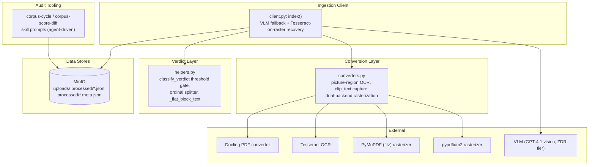
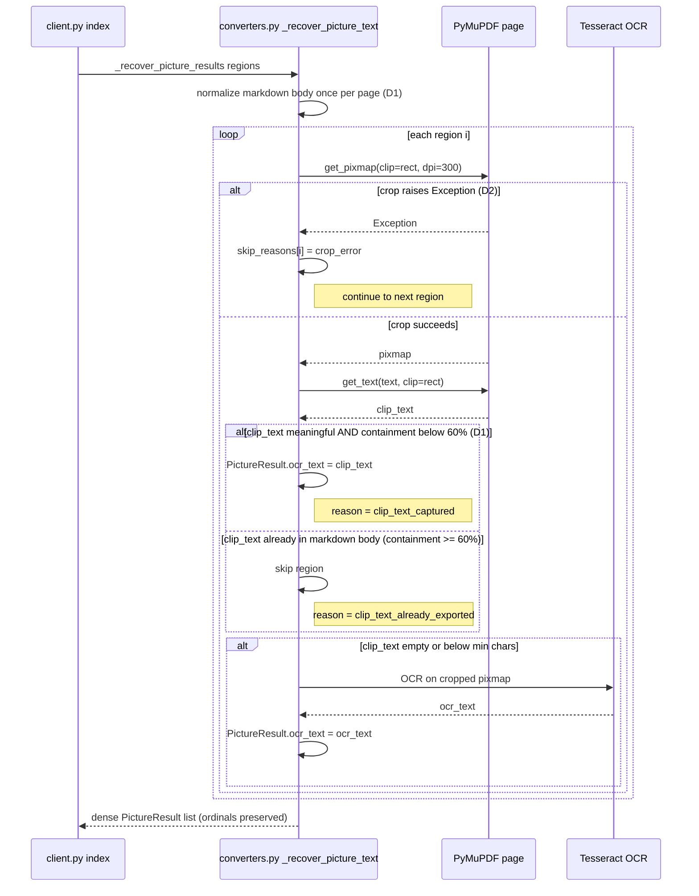
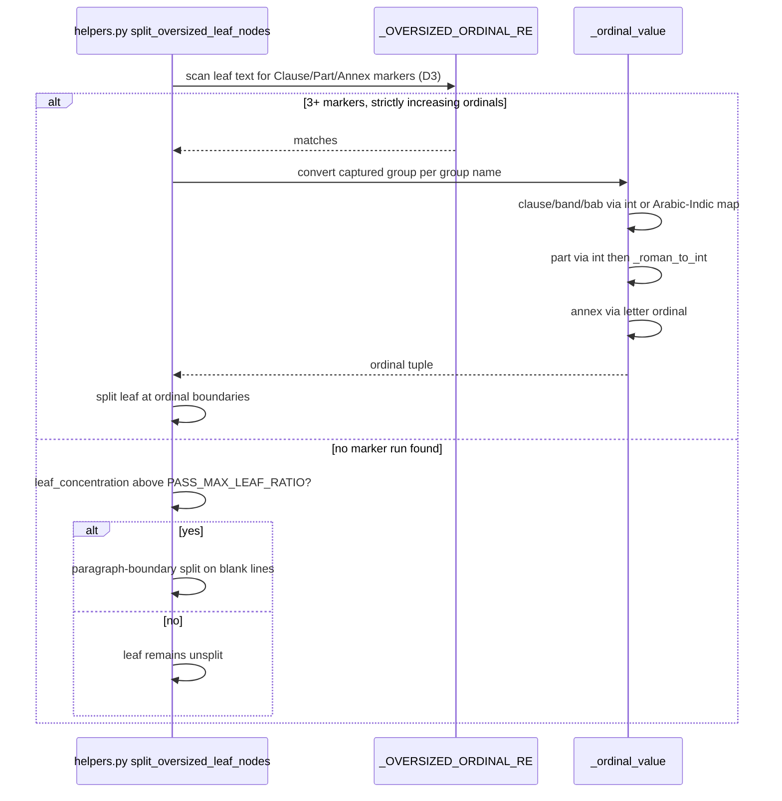
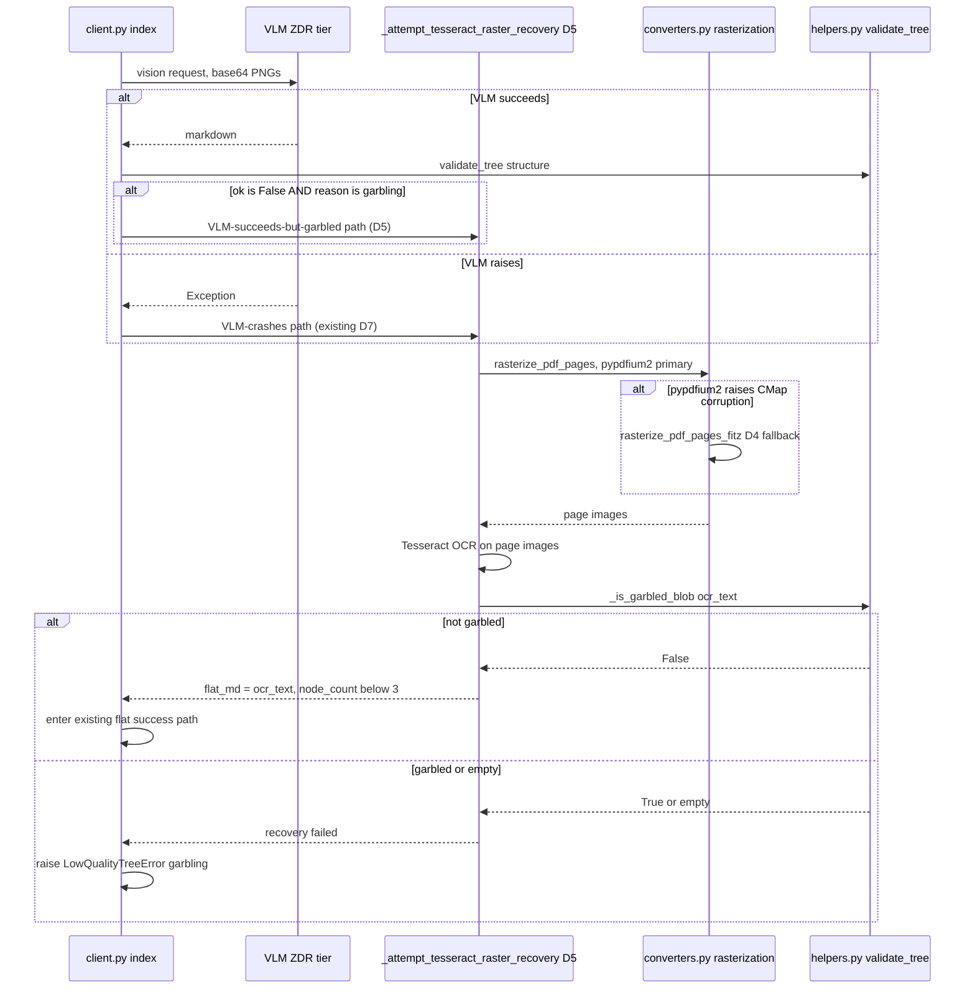
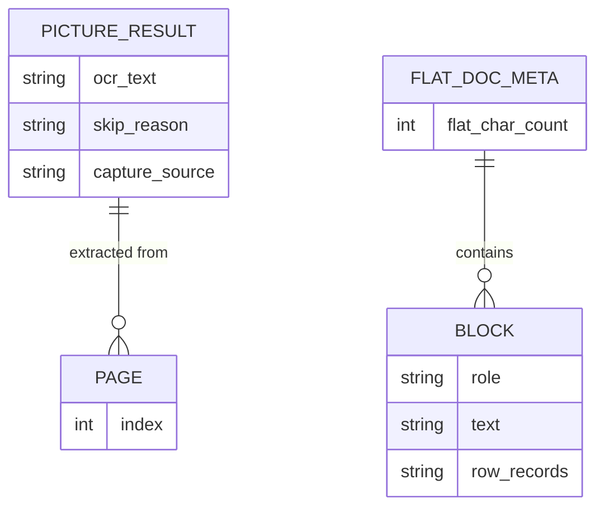

<!-- Space: CITRA -->
<!-- Title: Design Document: RFC-024 Run 7 Verdict Stability & Recovery Gaps -->
<!-- Folder: Designs -->

# Design Document: RFC-024 Run 7 Verdict Stability & Recovery Gaps

## Traceability

| Artifact             | Reference                                                                                                                    |
| -------------------- | ---------------------------------------------------------------------------------------------------------------------------- |
| Governing RFC(s)     | [RFC-024: Run 7 Verdict Stability &amp; Recovery Gaps](../rfcs/024-run7-verdict-stability-and-recovery-gaps.md)               |
| Audit source         | [`audit/CORPUS_REINGESTION_AUDIT_RUN-7.md`](../../audit/CORPUS_REINGESTION_AUDIT_RUN-7.md)      |
| Hard Rules (binding) | [CLAUDE.md § Hard Rules](../../CLAUDE.md#hard-rules)                                                                         |
| Implementation Plan  | [tasks-rfc024-run7-verdict-stability-and-recovery-gaps.md](../tasks/tasks-rfc024-run7-verdict-stability-and-recovery-gaps.md) |

## Overview

Run 7 of the corpus reaudit (25 docs) exposed residual instability that survived RFC-023's landing: a verdict that oscillates PASS/MARGINAL between runs due to Docling extraction jitter, a content-recovery pipeline that discards every picture result for a document when a single region crashes, an ordinal splitter that does not recognize MOU/decree structural markers common in the Arabic legal corpus, a chart/infographic recovery path that throws away readable PDF text-layer content when Docling misclassifies it as a picture, a Tesseract fallback that shares its rasterization backend (and therefore its single point of failure) with the VLM path, and an audit-tooling char-count bug that misreports two table-heavy documents as near-empty. This design closes seven distinct defects (D0-D6) across four themes — verdict stability, content-recovery pipeline gaps, splitter coverage, and audit-tooling correctness — scoped to two existing modules (`converters.py`, `helpers.py`), one orchestration module (`client.py`), and the corpus-audit reporting process, per [RFC-024 Implementation Plan](../rfcs/024-run7-verdict-stability-and-recovery-gaps.md#implementation-plan) and validated against the [Correctness Properties](#correctness-properties) below.

## Key Design Principles

1. **Crash isolation before content capture**: A recovery pipeline that captures more content is only as good as its ability to survive a single bad input — [D2](../rfcs/024-run7-verdict-stability-and-recovery-gaps.md#d2-per-region-tryexcept-in-phase-1-crop-loop-p0-bug) (per-region try/except) must land before [D1](../rfcs/024-run7-verdict-stability-and-recovery-gaps.md#d1-capture-clip_text-into-pictureresult-when-docling-misclassifies-text-as-images-p0-missing-feature) (clip-text capture) can be trusted on documents with mixed good/bad regions, since a partial-failure document is exactly where D1's capture matters most.
2. **Containment guards over presence checks**: Every fix that captures previously-discarded content (D1's clip-text, D3's ordinal splitting) must positively verify the content is not already represented elsewhere (D1's normalized-substring containment check against the Docling markdown body) rather than relying on "this region/leaf was classified as X" alone — classification alone is not discriminative here because every input to the function is already the same classification by construction.
3. **Threshold widening is a stopgap, not a fix, for non-determinism**: [D0](../rfcs/024-run7-verdict-stability-and-recovery-gaps.md#d0-widen-pass_max_leaf_ratio-default-from-020-to-030-p1-bug) is the third consecutive widening of the same threshold for the same jitter mode (RFC-023 D10: 0.17→0.20; this RFC: 0.20→0.30); every widening ships with an explicit acknowledgment that a fourth widening is not acceptable — the next occurrence requires hysteresis or prior-verdict anchoring, per [RFC-024 Risk: recurrence](../rfcs/024-run7-verdict-stability-and-recovery-gaps.md#risk-assessment).
4. **Shared thresholds move together**: Any two mechanisms that gate on the same underlying signal (D0's PASS gate and D3's paragraph-boundary-split trigger both gate on `max_leaf_ratio`) must reference the *same* env var, never independently-tuned hard-coded values, so that raising one threshold does not silently create a dead zone where neither mechanism fires.
5. **Isolate shared single points of failure, don't just add try/except around them**: [D4](../rfcs/024-run7-verdict-stability-and-recovery-gaps.md#d4-dual-rasterization-backend-for-tesseract-fallback-p1-bug) adds a genuinely independent rasterization backend (fitz) rather than wrapping the existing pypdfium2 call in a retry loop, because the CMap-corruption failure mode is deterministic per-page — retrying the same backend would fail identically every time.
6. **A degraded-but-present artifact beats zero artifacts, but never a garbled one**: [D5](../rfcs/024-run7-verdict-stability-and-recovery-gaps.md#d5-d7-tesseract-recovery-for-vlm-succeeds-but-garbled-path-p1-missing-feature) extends D7's Tesseract-on-raster recovery to the VLM-succeeds-but-garbled path, but the extracted `_attempt_tesseract_raster_recovery` helper still runs its own garble check before returning content — a recovered document that is still garbled must raise `LowQualityTreeError`, never persist, per [CLAUDE.md HR5](../../CLAUDE.md#hard-rules).
7. **Reporting bugs get reporting fixes, not pipeline changes**: [D6](../rfcs/024-run7-verdict-stability-and-recovery-gaps.md#d6-fix-audit-tooling-char-count-measurement-for-flat-docs-p2-data-quality) explicitly does not touch `classify_verdict` or any verdict-computation code path — the production pipeline already uses `_flat_block_text()` correctly (RFC-022 B3); only the audit/diagnostic reporting layer is wrong, and fixing production code that isn't broken would be scope creep.
8. **Env-var rollback for every threshold/behavior change**: Each fix ships with a named env var defaulting to the new (fixed) behavior, permitting instant single-fix rollback without a code revert — see the Rollback line in each RFC decision (e.g. [D0](../rfcs/024-run7-verdict-stability-and-recovery-gaps.md#d0-widen-pass_max_leaf_ratio-default-from-020-to-030-p1-bug), [D1](../rfcs/024-run7-verdict-stability-and-recovery-gaps.md#d1-capture-clip_text-into-pictureresult-when-docling-misclassifies-text-as-images-p0-missing-feature), [D4](../rfcs/024-run7-verdict-stability-and-recovery-gaps.md#d4-dual-rasterization-backend-for-tesseract-fallback-p1-bug), [D5](../rfcs/024-run7-verdict-stability-and-recovery-gaps.md#d5-d7-tesseract-recovery-for-vlm-succeeds-but-garbled-path-p1-missing-feature)).

## Launch Constraints

- No new services, databases, or infrastructure — all fixes land inside `src/pageindex_mcp/{converters,helpers,client}.py`, their test suites, and the agent-driven corpus-cycle / corpus-score-diff skill prompts.
- No AGPL-surface expansion — [D4](../rfcs/024-run7-verdict-stability-and-recovery-gaps.md#d4-dual-rasterization-backend-for-tesseract-fallback-p1-bug)'s fitz usage is an already-accepted transitive dependency (used in the pre-garble probe and picture cropping), per [CLAUDE.md HR4](../../CLAUDE.md#hard-rules).
- The Batch 5 full reaudit (Run 8, 25 docs) must show zero PASS→MARGINAL regressions from [D3](../rfcs/024-run7-verdict-stability-and-recovery-gaps.md#d3-extend-ordinal-splitter-regex-for-moudecree-documents-p1-missing-feature)'s new ordinal patterns before this RFC is considered complete, per [RFC-024 Risk: Run 8 regression on Run 7 PASS docs](../rfcs/024-run7-verdict-stability-and-recovery-gaps.md#risk-assessment).
- [D5](../rfcs/024-run7-verdict-stability-and-recovery-gaps.md#d5-d7-tesseract-recovery-for-vlm-succeeds-but-garbled-path-p1-missing-feature) explicitly supersedes RFC-023 D7 test case (d); the old assertion is preserved only as a regression test under `D7_GARBLE_RECOVERY_ENABLED=false`.
- Doc 18 (Organizational Decision)'s projected outcome is conditional on the [T3.0 spike](../tasks/tasks-rfc024-run7-verdict-stability-and-recovery-gaps.md#31-pre-implementation-spike-fitz-rasterization-survives-cmap-corruption-d4) confirming fitz survives CMap corruption — if it does not, Doc 18 stays ERROR and is out of scope for further remediation in this RFC.

## Architecture

### High-Level System Architecture



### Architecture Decisions

**Widen the env var rather than introduce hysteresis** ([RFC-024 D0](../rfcs/024-run7-verdict-stability-and-recovery-gaps.md#d0-widen-pass_max_leaf_ratio-default-from-020-to-030-p1-bug)): A single-line env-var default change absorbs Doc 8's observed jitter range (0.17-0.2571) without any code change, and the hard FAIL gate at `max_leaf_ratio > 0.75` remains untouched; hysteresis/prior-verdict anchoring is deliberately deferred because the corpus-reaudit methodology wipes all derived stores before each run, so there is no prior verdict to anchor to in a from-scratch reaudit. See [Property 1](#property-1-pass_max_leaf_ratio-threshold-widening-d0).

**Containment-guarded clip-text capture rather than a PictureItem-type check** ([RFC-024 D1](../rfcs/024-run7-verdict-stability-and-recovery-gaps.md#d1-capture-clip_text-into-pictureresult-when-docling-misclassifies-text-as-images-p0-missing-feature)): Every region entering `_recover_picture_text` is already a PictureItem by construction, so "is this a PictureItem" provides zero discrimination between "Docling already exported this text elsewhere in the markdown" and "this text was truly lost." A per-page-computed normalized-containment check (NFKC fold + whitespace collapse + lowercase, ≥60% substring match) is the only signal that actually answers the discrimination question, and computing it once per page (not per region) keeps the loop O(n) instead of O(n²). See [Property 2](#property-2-clip-text-capture-with-containment-guard-d1).

**Per-region try/except in the Phase 1 crop loop rather than a broader outer retry** ([RFC-024 D2](../rfcs/024-run7-verdict-stability-and-recovery-gaps.md#d2-per-region-tryexcept-in-phase-1-crop-loop-p0-bug)): Isolating the failure at the exact call (`page.get_pixmap(clip=rect, dpi=300)`) that raises preserves the dense `skip_reasons` ordinal contract documented in `_recover_picture_results`'s docstring, whereas relying on the existing outer except at line 1766 loses every region in the document, not just the degenerate one. See [Property 3](#property-3-per-region-crop-isolation-d2).

**Additive regex extension with a dispatch-on-group-name value converter, rather than a rewritten single pattern** ([RFC-024 D3](../rfcs/024-run7-verdict-stability-and-recovery-gaps.md#d3-extend-ordinal-splitter-regex-for-moudecree-documents-p1-missing-feature)): New named capture groups (`clause`, `part`, `band`, `bab`, `annex`) are added alongside the existing groups (`art`, `sec`, `s`, `sched`, `mada`) rather than folding everything into one generic ordinal group, because the three value *types* these new groups can carry (Arabic-Indic digits, Roman numerals, bare Latin letters) each need a distinct conversion path (`ARABIC_INDIC_MAP` translation, `_roman_to_int`, `ord(ch) - ord('A') + 1`) that a single generic `int()` call cannot dispatch on safely — `int('IV')` and `int('A')` both raise `ValueError`. See [Property 4](#property-4-extended-ordinal-splitter-recognition-d3).

**A dedicated `rasterize_pdf_pages_fitz` fallback function rather than retrying pypdfium2** ([RFC-024 D4](../rfcs/024-run7-verdict-stability-and-recovery-gaps.md#d4-dual-rasterization-backend-for-tesseract-fallback-p1-bug)): CMap corruption is a deterministic per-page failure — a retry against the same pypdfium2 backend would fail identically every time. Fitz (`fitz.Page.get_pixmap()`) is already imported and proven for image cropping in `_recover_picture_text`, so extending it to full-page rasterization introduces no new dependency surface. This isolates D7's rasterization path from the VLM's rasterization path, closing the shared single point of failure. See [Property 5](#property-5-dual-rasterization-backend-fallback-d4).

**Extract D7's Tesseract logic into a shared helper invoked from both the VLM try-block and except-block, rather than duplicating it** ([RFC-024 D5](../rfcs/024-run7-verdict-stability-and-recovery-gaps.md#d5-d7-tesseract-recovery-for-vlm-succeeds-but-garbled-path-p1-missing-feature)): D7 was structurally nested inside the `except Exception as vlm_exc:` block, making it unreachable when the VLM succeeds but `validate_tree` still reports `'garbling'`. A shared `_attempt_tesseract_raster_recovery()` helper, invoked from both the success-path garble check and the exception handler, avoids duplicating the OCR-then-garble-check sequence while covering both failure shapes. See [Property 6](#property-6-garbled-vlm-tesseract-recovery-d5).

**Fix the audit-reporting call site, not the production verdict pipeline** ([RFC-024 D6](../rfcs/024-run7-verdict-stability-and-recovery-gaps.md#d6-fix-audit-tooling-char-count-measurement-for-flat-docs-p2-data-quality)): The production path (`client.py`, RFC-022 B3) already calls `_flat_block_text()` correctly; only the corpus-cycle/corpus-score-diff skill-prompt-driven audit reporting uses the wrong `block.get('text', '')` accessor. Persisting a `_flat_block_text`-derived char count into `save_flat_doc`'s meta (mandatory per [T4.3](../tasks/tasks-rfc024-run7-verdict-stability-and-recovery-gaps.md#43-persist-_flat_block_text-derived-char-count-in-save_flat_doc-meta-d6-mandatory)) gives future audits a durable ground-truth value instead of requiring every new audit code path to re-derive the correct accessor from scratch. See [Property 7](#property-7-flat-doc-char-count-measurement-consistency-d6).

### Deployment Architecture

- **Backend**: FastMCP server (single dev process on port 8201; gunicorn + uvicorn workers in production) — unchanged by this RFC.
- **Async Worker**: arq worker process (`pageindex_mcp.worker.WorkerSettings`) — unchanged; no new error-mapping surface is introduced by D0-D6.
- **Object Storage**: MinIO — no layout changes; [D6](../rfcs/024-run7-verdict-stability-and-recovery-gaps.md#d6-fix-audit-tooling-char-count-measurement-for-flat-docs-p2-data-quality) adds one new integer field to `processed/*.meta.json` (persisted flat char count).
- **Conversion Runtime**: Docling (CPU-forced on darwin) + PyMuPDF (`fitz`) + pypdfium2 + Tesseract — [D4](../rfcs/024-run7-verdict-stability-and-recovery-gaps.md#d4-dual-rasterization-backend-for-tesseract-fallback-p1-bug) adds fitz as a second rasterization backend alongside the existing pypdfium2 primary.
- **Vision Fallback**: VLM (ZDR tier only, per [CLAUDE.md HR3](../../CLAUDE.md#hard-rules)) — unchanged endpoint/routing; [D5](../rfcs/024-run7-verdict-stability-and-recovery-gaps.md#d5-d7-tesseract-recovery-for-vlm-succeeds-but-garbled-path-p1-missing-feature) adds a new recovery branch reachable from the VLM success path, not a new external call.

### Communication Patterns

| Pattern       | Use Case                                                                                         | Technology                  |
| ------------- | ------------------------------------------------------------------------------------------------ | --------------------------- |
| Sync call     | `client.py: index()` invokes `converters.py` for markdown export, picture OCR, rasterization | Python function calls       |
| Sync call     | `client.py: index()` invokes `helpers.py` for verdict classification, ordinal splitting      | Python function calls       |
| External call | Tesseract OCR invoked on rasterized pages (pypdfium2-first, fitz-fallback, per D4)               | pytesseract / Tesseract CLI |
| External call | VLM fallback path calls the configured vision model (ZDR tier only)                              | OpenAI-compatible API       |
| Agent-driven  | corpus-cycle / corpus-score-diff skill prompts read`processed/*.meta.json` for audit scoring   | Skill prompt + MinIO read   |

### Sequence Diagrams

#### Picture Recovery Resilience Flow (D1, D2)



Links: [D1](../rfcs/024-run7-verdict-stability-and-recovery-gaps.md#d1-capture-clip_text-into-pictureresult-when-docling-misclassifies-text-as-images-p0-missing-feature), [D2](../rfcs/024-run7-verdict-stability-and-recovery-gaps.md#d2-per-region-tryexcept-in-phase-1-crop-loop-p0-bug) · [Property 2](#property-2-clip-text-capture-with-containment-guard-d1), [Property 3](#property-3-per-region-crop-isolation-d2) · [Task 1.1](../tasks/tasks-rfc024-run7-verdict-stability-and-recovery-gaps.md#11-per-region-tryexcept-in-phase-1-crop-loop-d2), [Task 1.2](../tasks/tasks-rfc024-run7-verdict-stability-and-recovery-gaps.md#12-clip-text-capture-with-containment-guard-d1)

#### Ordinal Splitter & Paragraph-Boundary Fallback Flow (D0, D3)



Links: [D0](../rfcs/024-run7-verdict-stability-and-recovery-gaps.md#d0-widen-pass_max_leaf_ratio-default-from-020-to-030-p1-bug), [D3](../rfcs/024-run7-verdict-stability-and-recovery-gaps.md#d3-extend-ordinal-splitter-regex-for-moudecree-documents-p1-missing-feature) · [Property 1](#property-1-pass_max_leaf_ratio-threshold-widening-d0), [Property 4](#property-4-extended-ordinal-splitter-recognition-d3) · [Task 2.1](../tasks/tasks-rfc024-run7-verdict-stability-and-recovery-gaps.md#21-widen-pass_max_leaf_ratio-default-from-020-to-030-d0), [Task 2.2](../tasks/tasks-rfc024-run7-verdict-stability-and-recovery-gaps.md#22-extend-_oversized_ordinal_re-and-_ordinal_value-d3), [Task 2.3](../tasks/tasks-rfc024-run7-verdict-stability-and-recovery-gaps.md#23-leaf_concentration-aware-paragraph-boundary-splitting-fallback-d3)

#### Dual-Rasterization VLM-Garble Recovery Flow (D4, D5)



Links: [D4](../rfcs/024-run7-verdict-stability-and-recovery-gaps.md#d4-dual-rasterization-backend-for-tesseract-fallback-p1-bug), [D5](../rfcs/024-run7-verdict-stability-and-recovery-gaps.md#d5-d7-tesseract-recovery-for-vlm-succeeds-but-garbled-path-p1-missing-feature) · [Property 5](#property-5-dual-rasterization-backend-fallback-d4), [Property 6](#property-6-garbled-vlm-tesseract-recovery-d5) · [Task 3.2](../tasks/tasks-rfc024-run7-verdict-stability-and-recovery-gaps.md#32-add-rasterize_pdf_pages_fitz-and-pypdfium2-then-fitz-fallback-d4), [Task 3.3](../tasks/tasks-rfc024-run7-verdict-stability-and-recovery-gaps.md#33-extract-_attempt_tesseract_raster_recovery-and-invoke-on-garbled-vlm-success-d5) · [CLAUDE.md HR5](../../CLAUDE.md#hard-rules)

## Service Contracts

### 1. converters.py — Picture Recovery & Rasterization

**Responsibility**: Convert PDF picture regions to markdown-embeddable text via crop+OCR or direct text-layer capture, and provide a dual-backend rasterization primitive for downstream OCR fallback paths.
**Database**: None (pure conversion functions; consumes/produces in-memory markdown and MinIO-staged bytes).

```python
# Modified / new functions
_recover_picture_text(page, regions: list) -> list[PictureResult]
  # D1: normalizes Docling markdown body once per page; per-region clip_text
  #     containment check (>=60% normalized-substring match -> skip;
  #     otherwise capture into PictureResult.ocr_text, reason='clip_text_captured')
  # D2: wraps the Phase 1 crop-loop body (page.get_pixmap(clip=rect, dpi=300))
  #     in a per-region try/except; on Exception, skip_reasons[i]='crop_error', continue

_normalize_for_containment(text: str) -> str
  # D1: new helper. NFKC-fold + whitespace-collapse + lowercase. Shared between
  #     the D1 containment guard and its test assertions.

_recover_picture_results(page, regions: list) -> list[PictureResult]
  # D2: outer except at line ~1766 remains as last-resort guard; no longer the
  #     only failure path — most single-region failures are now caught upstream

rasterize_pdf_pages(pdf_path, dpi: int) -> list  # existing, pypdfium2-backed
rasterize_pdf_pages_fitz(pdf_path, dpi: int) -> list
  # D4: new function. Uses fitz.Page.get_pixmap() to rasterize; independent
  #     backend from pypdfium2, reusing the pattern already proven in
  #     _recover_picture_text's crop path

tesseract_ocr_pdf_pages(pdf_path, dpi: int) -> str
  # D4: tries rasterize_pdf_pages (pypdfium2) first; on Exception, falls back
  #     to rasterize_pdf_pages_fitz; gated on D7_FITZ_FALLBACK_ENABLED (default true)
```

**Internal Interfaces**:

- Called synchronously by `client.py: index()` for markdown conversion and both VLM-crash and VLM-garbled-success Tesseract recovery paths.
- Calls Tesseract (via pytesseract) for per-region and whole-page OCR.
- Calls PyMuPDF (`page.get_pixmap`, `fitz.Page.get_pixmap`) and pypdfium2 for rasterization.

### 2. helpers.py — Verdict Threshold & Ordinal Splitter

**Responsibility**: Classify final ingestion verdicts (PASS/MARGINAL/FAIL) and split oversized leaf nodes on structural ordinal markers or, failing that, paragraph boundaries.
**Database**: None (pure functions over in-memory structures).

```python
classify_verdict(structure: list, flat_text: str) -> Verdict
  # D0: PASS_MAX_LEAF_RATIO env-var default widened from 0.20 to 0.30;
  #     max_leaf_ratio > 0.75 hard-FAIL gate unchanged

_OVERSIZED_ORDINAL_RE  # module-level regex
  # D3: extended with named groups: clause, part, band ("بند"), bab ("باب"), annex

_ordinal_value(match) -> tuple
  # D3: dispatches on capture-group name. clause/band/bab -> int() or
  #     ARABIC_INDIC_MAP translation then int(); part -> int() then
  #     _roman_to_int() fallback; annex -> int() then single-letter
  #     ord(ch)-ord('A')+1 fallback. No group ever raises ValueError.

_roman_to_int(s: str) -> int
  # D3: new helper. Converts [IVX]+ tokens (Part I .. Part XXXIX)

_has_heading_markers(text: str) -> bool
  # D3: recognizes the new Clause/Part/بند/باب/Annex markers as heading signals

split_oversized_leaf_nodes(nodes: list) -> list
  # D3: (item 3, lower priority) adds a leaf_concentration-aware paragraph-boundary
  #     splitting fallback, gated on the SAME PASS_MAX_LEAF_RATIO env var as D0
  #     (not a separate hard-coded 0.25), controlled by
  #     LEAF_CONCENTRATION_PARAGRAPH_SPLIT_ENABLED (default true)

_flat_block_text(block: dict) -> str    # existing, unchanged — already correct
```

**Internal Interfaces**:

- Called synchronously by `client.py: index()` after tree-build (`classify_verdict`) and during flat-node splitting (`split_oversized_leaf_nodes`).
- No outbound calls to other services; pure computation over strings/structures.

### 3. client.py — VLM Garble Recovery & Audit Meta Persistence

**Responsibility**: Orchestrate the end-to-end ingestion flow's VLM fallback and Tesseract-on-raster recovery, and persist a durable char-count field for flat docs.
**Database**: Writes final artifacts to MinIO (`processed/*.json`, `processed/*.meta.json`).

```python
index(doc_bytes: bytes, doc_type: str) -> IndexResult
  # D5: after the VLM try-block's validate_tree() call, when ok is False and
  #     reason == 'garbling' (VLM succeeded but tree is garbled), invokes
  #     _attempt_tesseract_raster_recovery() — previously only reachable from
  #     the except-block (VLM crash) path
  # D6: save_flat_doc() call now persists a _flat_block_text()-derived total
  #     char count into meta (mandatory per T4.3)

_attempt_tesseract_raster_recovery(file_path, tess_langs, ...) -> str | None
  # D5: new helper, extracted from the pre-existing D7 except-block logic to
  #     avoid duplicating it between the try-block (VLM-succeeds-but-garbled)
  #     and except-block (VLM-crashes) call sites. Runs Tesseract OCR via
  #     converters.tesseract_ocr_pdf_pages (D4 dual-backend), then
  #     helpers._is_garbled_blob() on the result before returning.
  #     Gated on D7_GARBLE_RECOVERY_ENABLED (default true).

save_flat_doc(doc_id: str, blocks: list, ...) -> None
  # D6: persists sum(len(_flat_block_text(b)) for b in blocks) into meta.json
  #     as a new field (e.g. flat_char_count), so future audits do not need
  #     to re-derive it from block.get('text', '')
```

**Internal Interfaces**:

- Calls `converters.py` for markdown conversion, rasterization, and Tesseract OCR.
- Calls `helpers.py` for garble detection, tree validation, ordinal splitting, and verdict classification.
- Calls the configured VLM (ZDR tier, per [CLAUDE.md HR3](../../CLAUDE.md#hard-rules)) for vision fallback.
- Raises `LowQualityTreeError` (surfaced by the arq worker as a `low_quality_tree` job error) when no recovery path succeeds, per [CLAUDE.md HR5](../../CLAUDE.md#hard-rules).

### 4. Audit Tooling — corpus-cycle / corpus-score-diff Skill Prompts

**Responsibility**: Agent-driven generation of per-document char-count summaries in `audit/CORPUS_REINGESTION_AUDIT_RUN-*.md`.
**Database**: Reads `processed/*.meta.json` from MinIO; no writes beyond the audit markdown report.

```
# No standalone scripts exist in scripts/ — this is a skill-prompt-driven process.
# D6: the corpus-cycle and corpus-score-diff skill prompts must be updated to call
#     _flat_block_text(b) (or read the new persisted flat_char_count meta field
#     from D6's client.py change) instead of block.get('text', '') when computing
#     per-document char counts for the audit summary table.
```

**Internal Interfaces**:

- Invoked by the corpus-cycle / corpus-score-diff skills during agent-driven audit runs (not a standalone importable module).
- Reads MinIO `processed/*.meta.json`; writes the human-readable audit report.

## Data Models

### Entity Relationship Diagram



### Core Entities (converters.py / helpers.py / client.py meta — in-memory + one new persisted field)

```python
class PictureResult:
    ocr_text: str            # D1: now also populated via clip_text_captured path
    skip_reason: str | None  # D1: new value "clip_text_already_exported";
                              # D2: new value "crop_error"
    capture_source: str | None  # D1: new field, e.g. "tesseract" | "clip_text" | None

class FlatDocMeta:            # persisted into processed/*.meta.json
    flat_char_count: int      # D6: new field, sum(len(_flat_block_text(b)) for b in blocks)

class Verdict(str, Enum):
    PASS = "PASS"
    MARGINAL = "MARGINAL"
    FAIL = "FAIL"
    ERROR = "ERROR"
```

No MinIO layout changes beyond the one new `flat_char_count` field in existing `processed/*.meta.json` artifacts; no Redis schema changes; no new persistent tables.

## Correctness Properties

*A property is a characteristic or behavior that should hold true across all valid executions of the system — a formal statement about what the system should do. Properties serve as the bridge between human-readable RFC decisions and machine-verifiable test assertions.*

### Property 1: PASS_MAX_LEAF_RATIO threshold widening (D0)

*For any* document whose `max_leaf_ratio` falls strictly below `PASS_MAX_LEAF_RATIO` (default 0.30, widened from 0.20), `classify_verdict` SHALL NOT reject PASS eligibility on that basis alone; for `max_leaf_ratio >= PASS_MAX_LEAF_RATIO`, the prior MARGINAL/FAIL behavior SHALL be unchanged; for `max_leaf_ratio > 0.75`, the hard FAIL gate SHALL still fire regardless of `PASS_MAX_LEAF_RATIO`.

**Validates: [RFC-024 D0](../rfcs/024-run7-verdict-stability-and-recovery-gaps.md#d0-widen-pass_max_leaf_ratio-default-from-020-to-030-p1-bug)**
**Tested in:** [Task 2.1](../tasks/tasks-rfc024-run7-verdict-stability-and-recovery-gaps.md#21-widen-pass_max_leaf_ratio-default-from-020-to-030-d0) — `tests/test_rfc024_d0.py`
**Service contract:** [helpers.py § `classify_verdict`](#2-helperspy--verdict-threshold--ordinal-splitter)
**Sequence diagram:** [Ordinal Splitter &amp; Paragraph-Boundary Fallback Flow](#ordinal-splitter--paragraph-boundary-fallback-flow-d0-d3)

### Property 2: Clip-text capture with containment guard (D1)

*For any* `PictureItem` region whose `clip_text` (via `page.get_text('text', clip=rect)`) exceeds `_PICTURE_OCR_MIN_CHARS`, the system SHALL compute normalized containment (NFKC + whitespace-collapse + lowercase) against the once-per-page-normalized Docling markdown body; if the normalized `clip_text` is ≥60% contained, the system SHALL skip capture with `reason='clip_text_already_exported'`; otherwise it SHALL capture `clip_text` into `PictureResult.ocr_text` with `reason='clip_text_captured'`, and SHALL NOT proceed to Tesseract OCR for that region.

**Validates: [RFC-024 D1](../rfcs/024-run7-verdict-stability-and-recovery-gaps.md#d1-capture-clip_text-into-pictureresult-when-docling-misclassifies-text-as-images-p0-missing-feature)**
**Tested in:** [Task 1.2](../tasks/tasks-rfc024-run7-verdict-stability-and-recovery-gaps.md#12-clip-text-capture-with-containment-guard-d1), [Task 1.3](../tasks/tasks-rfc024-run7-verdict-stability-and-recovery-gaps.md#13-batch-1-unit-tests) — `tests/test_rfc024_d1.py`
**Service contract:** [converters.py § `_recover_picture_text`](#1-converterspy--picture-recovery--rasterization)
**Sequence diagram:** [Picture Recovery Resilience Flow](#picture-recovery-resilience-flow-d1-d2)

### Property 3: Per-region crop isolation (D2)

*For any* region in the Phase 1 crop loop whose `page.get_pixmap(clip=rect, dpi=300)` call raises an `Exception`, the system SHALL record `skip_reasons[i] = 'crop_error'`, log a warning with the region index and error, and continue processing subsequent regions without shifting their ordinals; the outer except in `_recover_picture_results` SHALL remain reachable only when ALL regions fail.

**Validates: [RFC-024 D2](../rfcs/024-run7-verdict-stability-and-recovery-gaps.md#d2-per-region-tryexcept-in-phase-1-crop-loop-p0-bug)**
**Tested in:** [Task 1.1](../tasks/tasks-rfc024-run7-verdict-stability-and-recovery-gaps.md#11-per-region-tryexcept-in-phase-1-crop-loop-d2) — `tests/test_rfc024_d2.py`
**Service contract:** [converters.py § `_recover_picture_text` / `_recover_picture_results`](#1-converterspy--picture-recovery--rasterization)
**Sequence diagram:** [Picture Recovery Resilience Flow](#picture-recovery-resilience-flow-d1-d2)

### Property 4: Extended ordinal splitter recognition (D3)

*For any* leaf text containing ≥3 strictly-increasing markers matching `Clause`, `Part` (Arabic-Indic or Roman numeral), `بند`, `باب`, or `Annex` (numeric or bare Latin letter), `_has_heading_markers` SHALL return `True` and `_ordinal_value` SHALL return a correctly-typed int tuple for every matched group without raising `ValueError`; existing `Article`/`Section`/`مادة` recognition SHALL be unaffected; *for any* leaf where no ordinal marker run is found and `leaf_concentration > PASS_MAX_LEAF_RATIO`, the system SHALL fall back to paragraph-boundary splitting on blank-line boundaries, using the same `PASS_MAX_LEAF_RATIO` env var as [Property 1](#property-1-pass_max_leaf_ratio-threshold-widening-d0).

**Validates: [RFC-024 D3](../rfcs/024-run7-verdict-stability-and-recovery-gaps.md#d3-extend-ordinal-splitter-regex-for-moudecree-documents-p1-missing-feature)**
**Tested in:** [Task 2.2](../tasks/tasks-rfc024-run7-verdict-stability-and-recovery-gaps.md#22-extend-_oversized_ordinal_re-and-_ordinal_value-d3), [Task 2.3](../tasks/tasks-rfc024-run7-verdict-stability-and-recovery-gaps.md#23-leaf_concentration-aware-paragraph-boundary-splitting-fallback-d3) — `tests/test_rfc024_d3.py`
**Service contract:** [helpers.py § `_OVERSIZED_ORDINAL_RE` / `_ordinal_value` / `split_oversized_leaf_nodes`](#2-helperspy--verdict-threshold--ordinal-splitter)
**Sequence diagram:** [Ordinal Splitter &amp; Paragraph-Boundary Fallback Flow](#ordinal-splitter--paragraph-boundary-fallback-flow-d0-d3)

### Property 5: Dual rasterization backend fallback (D4)

*For any* PDF whose pypdfium2-backed `rasterize_pdf_pages` call raises during `tesseract_ocr_pdf_pages`, the system SHALL fall back to `rasterize_pdf_pages_fitz` (PyMuPDF-backed) and return page images from whichever backend succeeds; *if* both backends fail, the error SHALL propagate cleanly; *when* `D7_FITZ_FALLBACK_ENABLED=false`, the fitz fallback SHALL NOT fire and the original pypdfium2-only failure mode SHALL be preserved.

**Validates: [RFC-024 D4](../rfcs/024-run7-verdict-stability-and-recovery-gaps.md#d4-dual-rasterization-backend-for-tesseract-fallback-p1-bug)**
**Tested in:** [Task 3.2](../tasks/tasks-rfc024-run7-verdict-stability-and-recovery-gaps.md#32-add-rasterize_pdf_pages_fitz-and-pypdfium2-then-fitz-fallback-d4) — `tests/test_rfc024_d4.py`
**Service contract:** [converters.py § `rasterize_pdf_pages_fitz` / `tesseract_ocr_pdf_pages`](#1-converterspy--picture-recovery--rasterization)
**Sequence diagram:** [Dual-Rasterization VLM-Garble Recovery Flow](#dual-rasterization-vlm-garble-recovery-flow-d4-d5)

### Property 6: Garbled-VLM Tesseract recovery (D5)

*For any* VLM call that succeeds but whose resulting tree fails `validate_tree` with `reason == 'garbling'`, the system SHALL invoke `_attempt_tesseract_raster_recovery` from the try-block (not only from the except-block on VLM crash); *if* the recovered OCR text passes `_is_garbled_blob` (returns `False`), the system SHALL use it as `flat_md` with `reason` overridden to `'node_count<3'` and enter the existing flat success path; *if* the recovered text is still garbled or empty, the system SHALL raise `LowQualityTreeError('garbling')`; *when* `D7_GARBLE_RECOVERY_ENABLED=false`, a `'garbling'` reason with no VLM exception SHALL fall through to `LowQualityTreeError` unchanged (preserving the pre-D5 RFC-023 D7 case (d) behavior).

**Validates: [RFC-024 D5](../rfcs/024-run7-verdict-stability-and-recovery-gaps.md#d5-d7-tesseract-recovery-for-vlm-succeeds-but-garbled-path-p1-missing-feature)**
**Tested in:** [Task 3.3](../tasks/tasks-rfc024-run7-verdict-stability-and-recovery-gaps.md#33-extract-_attempt_tesseract_raster_recovery-and-invoke-on-garbled-vlm-success-d5), [Task 3.4](../tasks/tasks-rfc024-run7-verdict-stability-and-recovery-gaps.md#34-batch-3-unit-tests--rewrite-test_rfc023_d7py-case-d) — `tests/test_rfc024_d5.py`, `tests/test_rfc023_d7.py`
**Service contract:** [client.py § `index()` / `_attempt_tesseract_raster_recovery`](#3-clientpy--vlm-garble-recovery--audit-meta-persistence)
**Sequence diagram:** [Dual-Rasterization VLM-Garble Recovery Flow](#dual-rasterization-vlm-garble-recovery-flow-d4-d5)

### Property 7: Flat-doc char-count measurement consistency (D6)

*For any* flat document containing `role='table'` blocks, the audit-reporting char count SHALL be computed via `_flat_block_text(b)` (which reads `row_records` for table blocks) rather than `block.get('text', '')`, matching the production verdict pipeline's existing computation; *if* a `flat_char_count` field is persisted in `processed/*.meta.json` per [T4.3](../tasks/tasks-rfc024-run7-verdict-stability-and-recovery-gaps.md#43-persist-_flat_block_text-derived-char-count-in-save_flat_doc-meta-d6-mandatory), the audit-reported count SHALL equal the persisted value.

**Validates: [RFC-024 D6](../rfcs/024-run7-verdict-stability-and-recovery-gaps.md#d6-fix-audit-tooling-char-count-measurement-for-flat-docs-p2-data-quality)**
**Tested in:** [Task 4.3](../tasks/tasks-rfc024-run7-verdict-stability-and-recovery-gaps.md#43-persist-_flat_block_text-derived-char-count-in-save_flat_doc-meta-d6-mandatory) — `tests/test_rfc024_d6.py`
**Service contract:** [client.py § `save_flat_doc`](#3-clientpy--vlm-garble-recovery--audit-meta-persistence), [Audit Tooling § corpus-cycle / corpus-score-diff](#4-audit-tooling--corpus-cycle--corpus-score-diff-skill-prompts)

## Error Handling

### Error Categories & Responses

| Category                                     | Job Outcome                         | Response Format                                                  | Retry Strategy                                                     |
| -------------------------------------------- | ----------------------------------- | ---------------------------------------------------------------- | ------------------------------------------------------------------ |
| Low-quality tree (garbling, unrecovered)     | `low_quality_tree` arq error      | `{error: "low_quality_tree", reason: str, doc_id: str}`        | No retry — surfaces per[CLAUDE.md HR5](../../CLAUDE.md#hard-rules) |
| Single-region crop failure (D2)              | Not a job error — partial recovery | `skip_reasons[i]='crop_error'` recorded in-band                | N/A — remaining regions still process                             |
| Both rasterization backends fail (D4)        | `converter_child_failed`          | `{error: "converter_child_failed", stderr_tail: str}`          | Retry, MAX_TRIES=2 (existing worker policy, unchanged)             |
| Garbled-VLM recovery also garbled/empty (D5) | `low_quality_tree` arq error      | `{error: "low_quality_tree", reason: "garbling", doc_id: str}` | No retry                                                           |

### Service-Specific Error Handling

**converters.py:**

- `page.get_pixmap(clip=rect, dpi=300)` raises for a single region (D2) → caught in-loop, `skip_reasons[i]='crop_error'` set, loop continues to the next region; does not propagate to the outer except.
- `rasterize_pdf_pages` (pypdfium2) raises for CMap-corrupt pages (D4) → caught in `tesseract_ocr_pdf_pages`, falls back to `rasterize_pdf_pages_fitz`; if fitz also raises, the exception propagates cleanly to the caller (no silent swallow).

**client.py:**

- VLM succeeds but `validate_tree` returns `(False, 'garbling')` (D5) → `_attempt_tesseract_raster_recovery` invoked; on failure, falls through to the existing `LowQualityTreeError('garbling')` path unchanged.
- `_attempt_tesseract_raster_recovery` itself raises (e.g., Tesseract binary missing, both rasterization backends fail) → caught, treated identically to a garbled/empty OCR result, falls through to `LowQualityTreeError('garbling')`.

### Circuit Breaker Configuration [OPTIONAL]

Not applicable — no new external service calls; Tesseract, pypdfium2, and fitz calls are local/in-process, and the VLM call already has an existing ZDR-tier client with its own retry policy (unchanged by this RFC).

### Inter-Service Communication Failure Modes [OPTIONAL]

| Scenario                                                         | Handling                                                                                                                                                                                                                                                 |
| ---------------------------------------------------------------- | -------------------------------------------------------------------------------------------------------------------------------------------------------------------------------------------------------------------------------------------------------- |
| Tesseract binary unavailable during D4/D5 OCR calls              | Exception caught at the call site; treated as zero-yield OCR, falls through to existing garbled/`LowQualityTreeError` handling                                                                                                                         |
| Both pypdfium2 and fitz fail on Doc 18's CMap-corrupt pages (D4) | Doc 18 stays`ERROR`, per the [T3.0 spike](../tasks/tasks-rfc024-run7-verdict-stability-and-recovery-gaps.md#31-pre-implementation-spike-fitz-rasterization-survives-cmap-corruption-d4) contingency — out of scope for further remediation in this RFC |

## Testing Strategy

### Testing Layers

1. **Unit Tests**: One dedicated test file per RFC decision (`tests/test_rfc024_d0.py` through `tests/test_rfc024_d6.py`), covering the specific examples and edge cases enumerated in [RFC-024 Test Strategy](../rfcs/024-run7-verdict-stability-and-recovery-gaps.md#test-strategy).
2. **Regression Tests**: `tests/test_rfc023_d7.py` case (d) rewritten per [D5&#39;s Supersession note](../rfcs/024-run7-verdict-stability-and-recovery-gaps.md#d5-d7-tesseract-recovery-for-vlm-succeeds-but-garbled-path-p1-missing-feature) to assert the new garbled-VLM-triggers-recovery behavior, with the old assertion preserved under `D7_GARBLE_RECOVERY_ENABLED=false`.
3. **Spike Validation**: [T3.0](../tasks/tasks-rfc024-run7-verdict-stability-and-recovery-gaps.md#31-pre-implementation-spike-fitz-rasterization-survives-cmap-corruption-d4) renders Doc 18's CMap-corrupt pages with `fitz.Page.get_pixmap()` before D4 implementation proceeds, confirming the fallback backend actually survives the corruption it is meant to route around.
4. **Full Corpus Regression**: Run 8 reaudit (25 docs) verifying the [RFC-024 Projected Run 8 Verdict Changes](../rfcs/024-run7-verdict-stability-and-recovery-gaps.md#projected-run-8-verdict-changes) table and zero PASS→MARGINAL regressions from D3's new ordinal patterns scanning existing Run 7 PASS docs.

### Property-Based Testing Configuration

Not applicable at MVP scope — this RFC's 7 properties are validated via targeted unit tests against the exact edge cases enumerated in the [RFC-024 Test Strategy](../rfcs/024-run7-verdict-stability-and-recovery-gaps.md#test-strategy) table (fixed fixtures: known `max_leaf_ratio` values, known bbox/clip_text content, known ordinal marker sequences) rather than generated inputs, since the properties are threshold/boundary conditions and regex-match conditions best pinned with exact fixture values.

### Test Categories by Service

| Service       | Properties                                                                                                                                                                                   | Unit Tests                                                          | Integration Tests                                                                         |
| ------------- | -------------------------------------------------------------------------------------------------------------------------------------------------------------------------------------------- | ------------------------------------------------------------------- | ----------------------------------------------------------------------------------------- |
| converters.py | [Property 2](#property-2-clip-text-capture-with-containment-guard-d1), [Property 3](#property-3-per-region-crop-isolation-d2), [Property 5](#property-5-dual-rasterization-backend-fallback-d4) | `test_rfc024_d1.py`, `test_rfc024_d2.py`, `test_rfc024_d4.py` | Mixed good/bad-region picture fixture; CMap-corrupt PDF fixture                           |
| helpers.py    | [Property 1](#property-1-pass_max_leaf_ratio-threshold-widening-d0), [Property 4](#property-4-extended-ordinal-splitter-recognition-d3)                                                        | `test_rfc024_d0.py`, `test_rfc024_d3.py`                        | `classify_verdict` / `split_oversized_leaf_nodes` against synthetic leaves            |
| client.py     | [Property 6](#property-6-garbled-vlm-tesseract-recovery-d5), [Property 7](#property-7-flat-doc-char-count-measurement-consistency-d6)                                                          | `test_rfc024_d5.py`, `test_rfc023_d7.py`, `test_rfc024_d6.py` | Full`index()` run against garbled-VLM-success fixture; `save_flat_doc` meta assertion |

### Key Test Scenarios

**Critical Path Tests:**

1. Doc 8 (Reitlehrer) ingests with `max_leaf_ratio=0.2571` and lands PASS instead of oscillating PASS/MARGINAL, per [D0](../rfcs/024-run7-verdict-stability-and-recovery-gaps.md#d0-widen-pass_max_leaf_ratio-default-from-020-to-030-p1-bug).
2. Doc 14 (UAE landscape) with one degenerate picture region and six healthy ones recovers OCR text for all six healthy regions instead of losing all seven, per [D1](../rfcs/024-run7-verdict-stability-and-recovery-gaps.md#d1-capture-clip_text-into-pictureresult-when-docling-misclassifies-text-as-images-p0-missing-feature)/[D2](../rfcs/024-run7-verdict-stability-and-recovery-gaps.md#d2-per-region-tryexcept-in-phase-1-crop-loop-p0-bug).
3. Doc 7 (MOU MOHRE) and Doc 21 (Domestic Workers) split on `Clause`/`بند` markers respectively and land PASS instead of MARGINAL, per [D3](../rfcs/024-run7-verdict-stability-and-recovery-gaps.md#d3-extend-ordinal-splitter-regex-for-moudecree-documents-p1-missing-feature).
4. Doc 18 (Organizational Decision) — conditional on the T3.0 spike — falls back to fitz rasterization and recovers via D5's garbled-VLM-success path instead of staying ERROR.
5. Run 8: full 25-doc reaudit reproduces the [RFC-024 Projected Run 8 Verdict Changes](../rfcs/024-run7-verdict-stability-and-recovery-gaps.md#projected-run-8-verdict-changes) table with zero regressions on Run 7 PASS docs.

**Edge Cases:**

- D1 double-capture guard: `clip_text` content that IS already present in the Docling markdown body (≥60% normalized containment) must skip capture — verified against whitespace/reflow variants, per [RFC-024 Test Strategy: D1 row](../rfcs/024-run7-verdict-stability-and-recovery-gaps.md#test-strategy).
- D2/D1 interaction: a document where ALL regions fail crop must still return an empty list gracefully (outer except remains a valid last resort), not raise.
- D3 false-positive guard: "Part 2 of the agreement" in German/English prose must NOT trigger a spurious split — the strictly-increasing-run guard (min_segments=3) must reject non-sequential matches; Run 8 explicitly verifies zero PASS→MARGINAL regressions on non-Arabic Run 7 PASS docs, per [RFC-024 Risk: D3 false positives](../rfcs/024-run7-verdict-stability-and-recovery-gaps.md#risk-assessment).
- D5 supersession boundary: `stderr_tail`/`reason` combinations that exercise both the old (`D7_GARBLE_RECOVERY_ENABLED=false`) and new (default `true`) code paths must both be covered in `tests/test_rfc023_d7.py`'s rewritten case (d), per [RFC-024 D5 Supersession note](../rfcs/024-run7-verdict-stability-and-recovery-gaps.md#d5-d7-tesseract-recovery-for-vlm-succeeds-but-garbled-path-p1-missing-feature).
- D6 boundary: a flat doc with zero table blocks must show no change in reported char count before/after the fix (regression guard for the non-table majority case).
