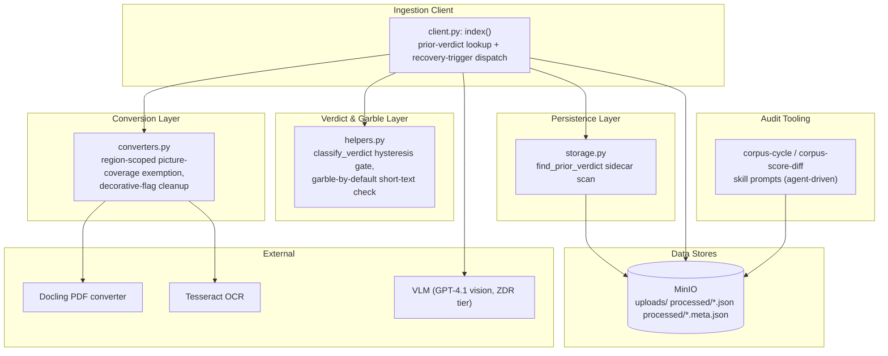
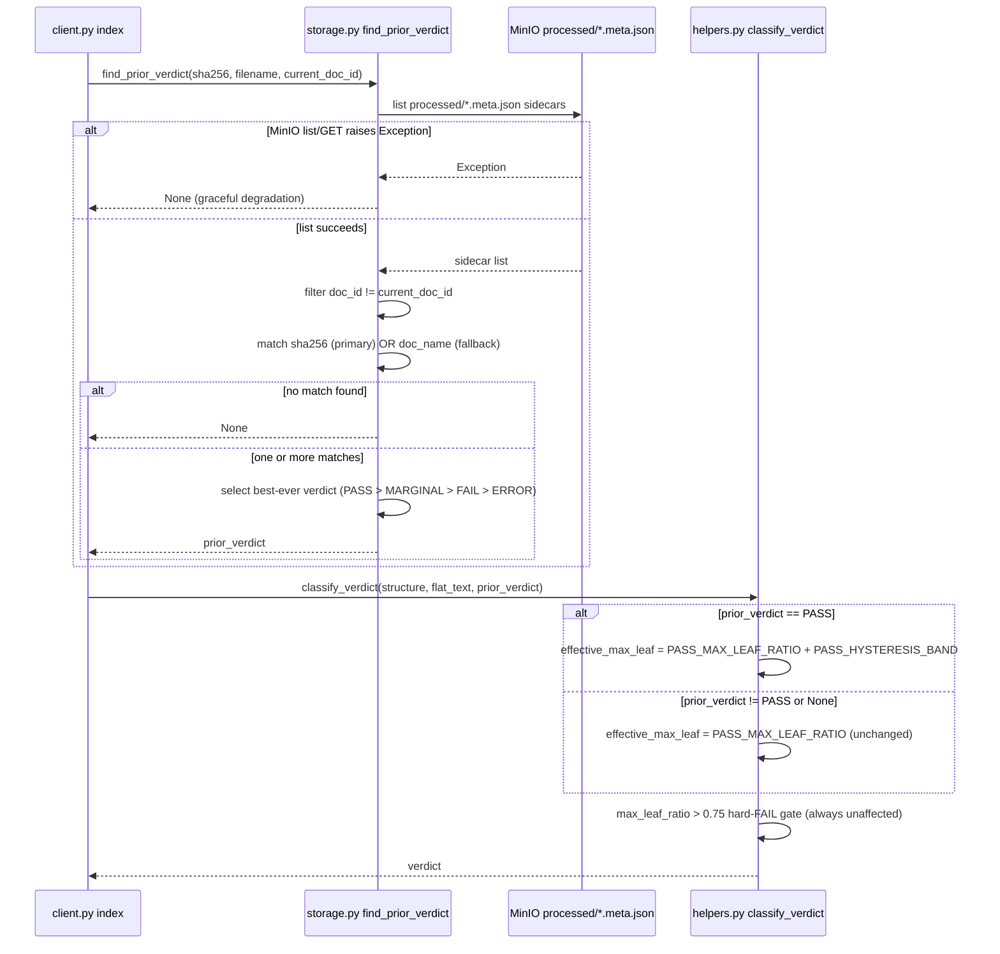
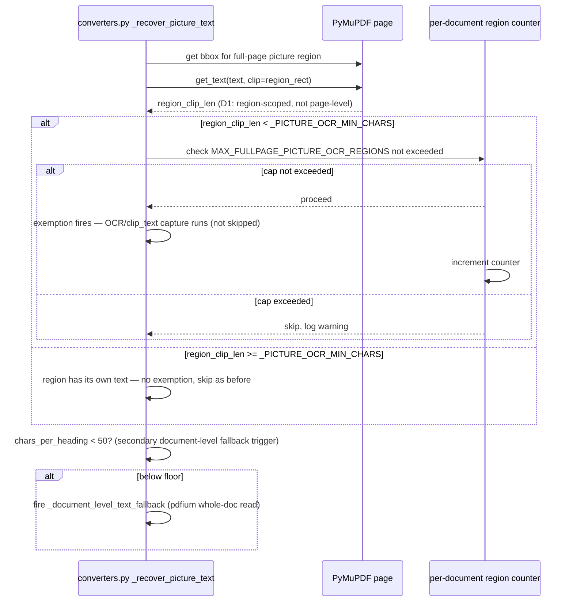
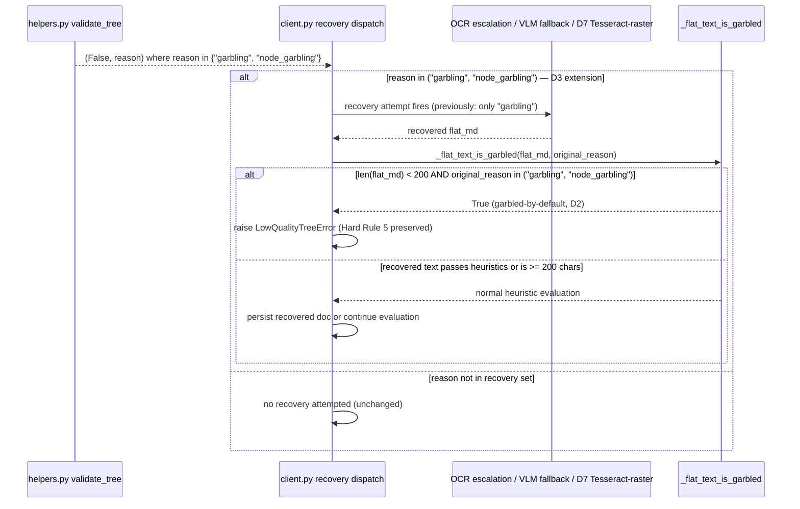
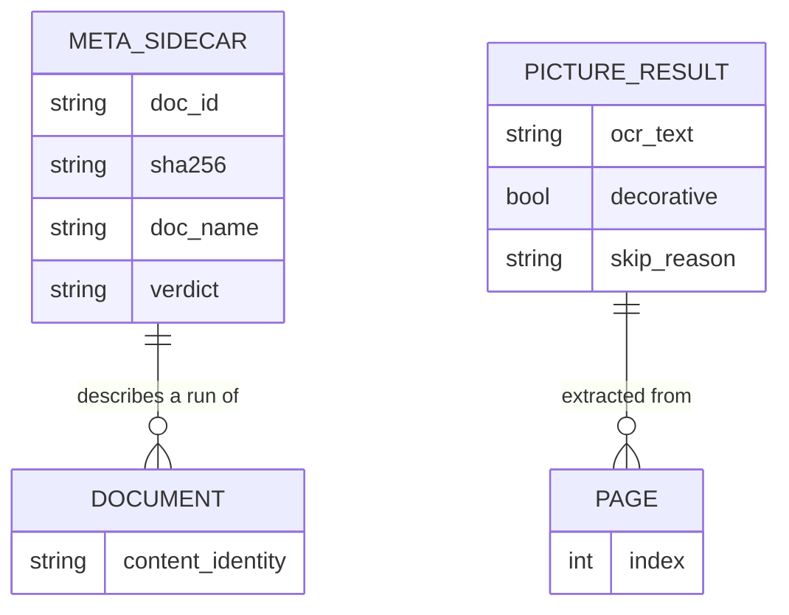

<!-- Space: CITRA -->
<!-- Title: Design Document: RFC-025 Run 8 Verdict Hysteresis & Recovery Coverage -->
<!-- Folder: Designs -->

# Design Document: RFC-025 Run 8 Verdict Hysteresis & Recovery Coverage

## Traceability

| Artifact               | Reference                                                                                                                     |
| ----------------------- | ------------------------------------------------------------------------------------------------------------------------------ |
| Governing RFC(s)       | [RFC-025: Run 8 Verdict Hysteresis &amp; Recovery Coverage](../rfcs/025-run8-verdict-hysteresis-and-recovery-coverage.md)      |
| Audit source            | [`audit/CORPUS_REINGESTION_AUDIT_RUN-8.md`](../../audit/CORPUS_REINGESTION_AUDIT_RUN-8.md)                                    |
| Hard Rules (binding)    | [CLAUDE.md § Hard Rules](../../CLAUDE.md#hard-rules)                                                                          |
| Implementation Plan     | [tasks-rfc025-run8-verdict-hysteresis-and-recovery-coverage.md](../tasks/tasks-rfc025-run8-verdict-hysteresis-and-recovery-coverage.md) |

## Overview

Run 8 of the corpus reaudit (25 docs, corrected to 7 PASS / 6 MARGINAL / 9 FAIL / 3 ERROR) confirms the exact failure mode RFC-024's own risk table predicted: a third consecutive `PASS_MAX_LEAF_RATIO` widening still failed to stabilize verdicts, because the underlying defect was never hysteresis-shaped tolerance but a bare threshold comparison with no memory of a document's own prior-run outcome. This design closes that gap plus three independent defects surfaced by the same reaudit — a page-level (not region-level) text-layer check that silently drops body prose under full-page picture regions, a short-text garble-gate bypass that lets sub-floor OCR residue slip through as legitimate prose, and a recovery-trigger reason-string mismatch that strands `"node_garbling"` documents with zero recovery attempts — across `storage.py`, `helpers.py`, `converters.py`, and `client.py`, per [RFC-025 Implementation Plan](../rfcs/025-run8-verdict-hysteresis-and-recovery-coverage.md#implementation-plan) and validated against the [Correctness Properties](#correctness-properties) below. A fifth, data-quality-only decision hardens the audit-reporting process itself against the same fabrication failure mode already confirmed once in project memory.

## Key Design Principles

1. **Anchor to content identity, not job identity**: [D0](../rfcs/025-run8-verdict-hysteresis-and-recovery-coverage.md#d0-implement-hysteresis-band-for-max_leaf_ratio-verdict-gate-p0-bug)'s `find_prior_verdict` resolves prior-run outcomes by sha256 (primary) and filename (fallback), never by `doc_id`, because re-ingestion always mints a new UUID — job identity is structurally unable to answer "has this exact document passed before?" and content identity is the only correct anchor.
2. **Best-ever, not most-recent, anchoring**: [D0](../rfcs/025-run8-verdict-hysteresis-and-recovery-coverage.md#d0-implement-hysteresis-band-for-max_leaf_ratio-verdict-gate-p0-bug) returns the best verdict across ALL matching prior sidecars (`PASS > MARGINAL > FAIL > ERROR`), not simply the immediately-prior run's verdict, because the immediately-prior run may itself be a jitter-induced regression — anchoring to "most recent" would have propagated Doc 14's Run 8 MARGINAL forward instead of recovering Run 7's PASS.
3. **Graceful degradation over ingestion-blocking**: Every new I/O path this RFC introduces ([D0](../rfcs/025-run8-verdict-hysteresis-and-recovery-coverage.md#d0-implement-hysteresis-band-for-max_leaf_ratio-verdict-gate-p0-bug)'s MinIO sidecar scan) must catch `Exception` and degrade to `None`/no-op rather than raise — a quality-of-life hysteresis feature must never become a new way for ingestion to fail.
4. **Scope text-presence checks to the region that matters, not the container that holds it**: [D1](../rfcs/025-run8-verdict-hysteresis-and-recovery-coverage.md#d1-region-aware-text-layer-check-for-picture-coverage-exemption-p0-bug)'s `_region_has_own_text_layer` replaces a page-level presence check with a region-scoped one, because a page-level check is trivially satisfied by content (headers, footers, page numbers) that has nothing to do with whether the specific picture region's own body text survived.
5. **Bound newly-unlocked recovery work with an explicit cap**: [D1](../rfcs/025-run8-verdict-hysteresis-and-recovery-coverage.md#d1-region-aware-text-layer-check-for-picture-coverage-exemption-p0-bug)'s region-aware check converts previously-skipped full-page picture regions into active 300-DPI crop+OCR work; `MAX_FULLPAGE_PICTURE_OCR_REGIONS` bounds this newly-unlocked cost per document rather than trusting corpus composition to keep it small — the Human-Rights doc already peaked at 9,573 MB child RSS before this exemption existed.
6. **A recovery-triggering reason set must track every reason `validate_tree` can emit, not just the first one**: [D3](../rfcs/025-run8-verdict-hysteresis-and-recovery-coverage.md#d3-extend-recovery-triggers-to-match-node_garbling-reason-p1-bug) extends all three recovery-trigger conditions to match `("garbling", "node_garbling")` as a set, and [D2](../rfcs/025-run8-verdict-hysteresis-and-recovery-coverage.md#d2-fix-short-text-garble-gate-bypass-and-orphaned-rotation-decorative-flag-p1-bug)'s short-text default is gated on the SAME set — a recovery-triggering reason string that isn't threaded consistently through every consumer reproduces exactly the bypass this RFC exists to close.
7. **A degraded-but-present artifact still cannot outrun Hard Rule 5**: Neither [D2](../rfcs/025-run8-verdict-hysteresis-and-recovery-coverage.md#d2-fix-short-text-garble-gate-bypass-and-orphaned-rotation-decorative-flag-p1-bug) nor [D3](../rfcs/025-run8-verdict-hysteresis-and-recovery-coverage.md#d3-extend-recovery-triggers-to-match-node_garbling-reason-p1-bug) weakens the terminal `LowQualityTreeError` — both only widen which documents *get a recovery attempt*, never which documents get to skip the garble check after recovery, per [CLAUDE.md HR5](../../CLAUDE.md#hard-rules).
8. **Env-var rollback for every threshold/behavior change**: Each fix ships with a named env var defaulting to the new (fixed) behavior — [D0](../rfcs/025-run8-verdict-hysteresis-and-recovery-coverage.md#d0-implement-hysteresis-band-for-max_leaf_ratio-verdict-gate-p0-bug)'s `PASS_HYSTERESIS_BAND`, [D1](../rfcs/025-run8-verdict-hysteresis-and-recovery-coverage.md#d1-region-aware-text-layer-check-for-picture-coverage-exemption-p0-bug)'s `REGION_AWARE_TEXT_CHECK_ENABLED` / `MAX_FULLPAGE_PICTURE_OCR_REGIONS`, [D2](../rfcs/025-run8-verdict-hysteresis-and-recovery-coverage.md#d2-fix-short-text-garble-gate-bypass-and-orphaned-rotation-decorative-flag-p1-bug)'s `GARBLE_SHORT_TEXT_DEFAULT` — permitting instant single-fix rollback without a code revert.
9. **Reporting bugs get reporting fixes, never pipeline changes**: [D4](../rfcs/025-run8-verdict-hysteresis-and-recovery-coverage.md#d4-harden-audit-data-verification-against-minio-ground-truth-p2-data-quality) touches only `audit/CORPUS_REINGESTION_AUDIT_RUN-8.md` and the corpus-score-diff skill prompt — the production pipeline's Reitlehrer state is already correct in MinIO (PASS); only the audit's *reporting* of it was fabricated, per [verify-source-before-asserting-defects](../../CLAUDE.md#hard-rules) project-memory lesson.

## Launch Constraints

- No new services, databases, or infrastructure — all fixes land inside `src/pageindex_mcp/{storage,helpers,converters,client}.py`, their test suites, `audit/CORPUS_REINGESTION_AUDIT_RUN-8.md`, and the agent-driven corpus-cycle / corpus-score-diff skill prompts.
- [D0](../rfcs/025-run8-verdict-hysteresis-and-recovery-coverage.md#d0-implement-hysteresis-band-for-max_leaf_ratio-verdict-gate-p0-bug) hysteresis applies ONLY to the PASS-gate comparison on `max_leaf_ratio`; the hard `max_leaf_ratio > 0.75` FAIL gate is untouched and unaffected by any prior-verdict lookup.
- [D1](../rfcs/025-run8-verdict-hysteresis-and-recovery-coverage.md#d1-region-aware-text-layer-check-for-picture-coverage-exemption-p0-bug)'s `MAX_FULLPAGE_PICTURE_OCR_REGIONS` (default 50) is an explicit memory/runtime ceiling — Run 9 must observe actual RSS on the Human-Rights doc and this cap may be lowered in a follow-up RFC after observation; it must not be treated as a final tuned value.
- [D2](../rfcs/025-run8-verdict-hysteresis-and-recovery-coverage.md#d2-fix-short-text-garble-gate-bypass-and-orphaned-rotation-decorative-flag-p1-bug) item 3 (rotation math spike) is time-boxed to 0.25d with explicit exit criteria; if the spike confirms mis-cropping, the coordinate-transform fix itself is filed as a follow-up RFC and is explicitly out of scope here.
- The Batch 4 Run 9 reaudit must confirm the [Residual FAIL/ERROR Documents table](../rfcs/025-run8-verdict-hysteresis-and-recovery-coverage.md#residual-failerror-documents-explicitly-out-of-scope) (11 docs) retain their Run 8 verdicts unchanged — any unexpected change on those docs is a Run 9 finding for separate triage, never attributed to D0-D4.
- [D4](../rfcs/025-run8-verdict-hysteresis-and-recovery-coverage.md#d4-harden-audit-data-verification-against-minio-ground-truth-p2-data-quality) does not recompute or alter any stored verdict — it corrects only the audit report's textual claims about the already-correct MinIO state.

## Architecture

### High-Level System Architecture



### Architecture Decisions

**Content-hash + filename identity resolution rather than doc_id lookup** ([RFC-025 D0](../rfcs/025-run8-verdict-hysteresis-and-recovery-coverage.md#d0-implement-hysteresis-band-for-max_leaf_ratio-verdict-gate-p0-bug)): Re-ingestion mints a new `doc_id` (UUID) per upload, so the current document's own `meta.json` key cannot locate a prior run's verdict. `find_prior_verdict(sha256, filename, current_doc_id)` scans all `processed/*.meta.json` sidecars (the same object-listing pattern as `list_processed_docs()`) and matches on `sha256` (primary) or `doc_name` (fallback for legacy sidecars lacking a hash), explicitly excluding the current `doc_id` from results. See [Property 1](#property-1-prior-verdict-hysteresis-anchoring-d0).

**A tolerance band applied only when the prior verdict was PASS, not a universally-widened threshold** ([RFC-025 D0](../rfcs/025-run8-verdict-hysteresis-and-recovery-coverage.md#d0-implement-hysteresis-band-for-max_leaf_ratio-verdict-gate-p0-bug)): Rather than a fourth blanket widening of `PASS_MAX_LEAF_RATIO` (which RFC-024's own risk table explicitly ruled out), the effective threshold only relaxes for documents with a known-good prior outcome: `effective_max_leaf = _pass_max_leaf + _hysteresis_band` when `prior_verdict == "PASS"`, otherwise the base threshold applies unchanged. A document with no prior history, or a prior MARGINAL/FAIL/ERROR history, gets zero hysteresis — this prevents the band from ever masking a genuine first-time quality regression. See [Property 1](#property-1-prior-verdict-hysteresis-anchoring-d0).

**Region-scoped text check via `page.get_text(clip=rect)` delta, rather than a page-level presence check** ([RFC-025 D1](../rfcs/025-run8-verdict-hysteresis-and-recovery-coverage.md#d1-region-aware-text-layer-check-for-picture-coverage-exemption-p0-bug)): `_text_layer_has_content(page)` returns `True` from incidental header/footer/page-number text anywhere on the page, which trivially exceeds the 20-char threshold and disables the coverage exemption even when the picture's own bbox has zero native text. `_region_has_own_text_layer(page, region_rect)` instead measures text INSIDE the region's own bbox via a clipped `get_text` call, which is the only signal that actually answers "did this specific region's body text survive." See [Property 2](#property-2-region-scoped-picture-coverage-text-check-d1).

**A per-document region cap rather than an unbounded exemption** ([RFC-025 D1](../rfcs/025-run8-verdict-hysteresis-and-recovery-coverage.md#d1-region-aware-text-layer-check-for-picture-coverage-exemption-p0-bug)): Every full-page picture region the region-aware check newly exempts becomes a 300-DPI crop+Tesseract OCR call — a previously entirely-skipped cost. `MAX_FULLPAGE_PICTURE_OCR_REGIONS` (default 50) bounds this per document, generous enough to recover the Human-Rights doc's ~347-node body prose while capping the memory blowup risk that already peaked at 9,573 MB child RSS in Run 8 before this exemption existed. See [Property 2](#property-2-region-scoped-picture-coverage-text-check-d1).

**Garble-by-default on short post-retry text, gated on a reason SET not a single string** ([RFC-025 D2](../rfcs/025-run8-verdict-hysteresis-and-recovery-coverage.md#d2-fix-short-text-garble-gate-bypass-and-orphaned-rotation-decorative-flag-p1-bug)): Both existing garble heuristics (`_is_garbled_blob`'s 5-Latin-token floor, `_has_sparse_mojibake`'s 100-char floor) silently return "not garbled" for sub-floor OCR residue, letting 60 chars of junk persist as legitimate prose. The fix defaults to garbled when text is under a 200-char floor AND the original tree-build reason was in `("garbling", "node_garbling")` — the set (not a single literal) is required because [D3](../rfcs/025-run8-verdict-hysteresis-and-recovery-coverage.md#d3-extend-recovery-triggers-to-match-node_garbling-reason-p1-bug) legitimizes `"node_garbling"` as a garbling failure class in the same RFC; omitting it from the set would silently reintroduce the exact bypass D2 fixes for a `"node_garbling"`-origin document. See [Property 3](#property-3-garble-by-default-for-short-post-retry-text-d2).

**Unconditional decorative flag on empty OCR, removing the orphaned rotation gate** ([RFC-025 D2](../rfcs/025-run8-verdict-hysteresis-and-recovery-coverage.md#d2-fix-short-text-garble-gate-bypass-and-orphaned-rotation-decorative-flag-p1-bug)): The existing `rotation == 0` condition on the decorative flag references a rotation-correction retry path that was never implemented — the `rotation` key is read only at that one site. Removing the condition (decorative=True whenever OCR yields nothing, regardless of rotation) is a pure bugfix with no new behavioral surface, since content-bearing regions are unaffected (the flag only fires on empty OCR). See [Property 3](#property-3-garble-by-default-for-short-post-retry-text-d2).

**Extend the recovery-trigger condition to a reason set rather than adding a parallel code path** ([RFC-025 D3](../rfcs/025-run8-verdict-hysteresis-and-recovery-coverage.md#d3-extend-recovery-triggers-to-match-node_garbling-reason-p1-bug)): All three recovery paths (OCR escalation, VLM fallback, D7 Tesseract-raster) already share the identical `reason == "garbling"` gating shape at three call sites; changing each to `reason in ("garbling", "node_garbling")` is a minimal, mechanically-verifiable extension that reuses the existing recovery machinery rather than duplicating it for the per-node garble class. See [Property 4](#property-4-node_garbling-recovery-trigger-parity-d3).

**Pre-publish MinIO ground-truth assertion, not a one-off manual correction** ([RFC-025 D4](../rfcs/025-run8-verdict-hysteresis-and-recovery-coverage.md#d4-harden-audit-data-verification-against-minio-ground-truth-p2-data-quality)): Correcting the four fabricated Reitlehrer references in the Run-8 audit fixes this one incident; adding a mandatory MinIO-hash-and-compare step to the corpus-score-diff skill prompt before any per-document figures are written prevents recurrence of the same fabrication failure mode already confirmed once (project memory: `fabricated-corpus-report-2026-07-17.md`). See [Property 5](#property-5-audit-ground-truth-verification-d4).

### Deployment Architecture

- **Backend**: FastMCP server (single dev process on port 8201; gunicorn + uvicorn workers in production) — unchanged by this RFC.
- **Async Worker**: arq worker process (`pageindex_mcp.worker.WorkerSettings`) — unchanged; no new error-mapping surface introduced by D0-D4.
- **Object Storage**: MinIO — no layout changes; [D0](../rfcs/025-run8-verdict-hysteresis-and-recovery-coverage.md#d0-implement-hysteresis-band-for-max_leaf_ratio-verdict-gate-p0-bug) adds a new READ-only access pattern (list + N sidecar GETs on `processed/*.meta.json`), no new writes.
- **Conversion Runtime**: Docling (CPU-forced on darwin) + PyMuPDF (`fitz`) + Tesseract — [D1](../rfcs/025-run8-verdict-hysteresis-and-recovery-coverage.md#d1-region-aware-text-layer-check-for-picture-coverage-exemption-p0-bug) changes only the exemption-decision logic ahead of the existing crop+OCR call, no new backend.
- **Vision Fallback**: VLM (ZDR tier only, per [CLAUDE.md HR3](../../CLAUDE.md#hard-rules)) — unchanged endpoint/routing; [D3](../rfcs/025-run8-verdict-hysteresis-and-recovery-coverage.md#d3-extend-recovery-triggers-to-match-node_garbling-reason-p1-bug) makes the existing VLM-fallback trigger reachable from a previously-unreachable reason value, not a new external call.

### Communication Patterns

| Pattern       | Use Case                                                                                          | Technology            |
| ------------- | --------------------------------------------------------------------------------------------------- | ---------------------- |
| Sync call     | `client.py: index()` invokes `storage.py` for prior-verdict lookup before `classify_verdict()`   | Python function call (`asyncio.to_thread`) |
| Sync call     | `client.py: index()` invokes `helpers.py` for verdict classification and garble-gate evaluation  | Python function calls  |
| Sync call     | `client.py: index()` invokes `converters.py` for picture-region recovery                          | Python function calls  |
| External call | Tesseract OCR invoked on newly-exempted full-page picture crops (D1) and recovery-triggered pages (D3) | pytesseract / Tesseract CLI |
| External call | VLM fallback path calls the configured vision model (ZDR tier only), now reachable for `"node_garbling"` (D3) | OpenAI-compatible API |
| Agent-driven  | corpus-cycle / corpus-score-diff skill prompts read `processed/*.meta.json` for audit scoring and pre-publish verification (D4) | Skill prompt + MinIO read |

### Sequence Diagrams

#### Prior-Verdict Hysteresis Flow (D0)



Links: [D0](../rfcs/025-run8-verdict-hysteresis-and-recovery-coverage.md#d0-implement-hysteresis-band-for-max_leaf_ratio-verdict-gate-p0-bug) · [Property 1](#property-1-prior-verdict-hysteresis-anchoring-d0) · [Task 1.1](../tasks/tasks-rfc025-run8-verdict-hysteresis-and-recovery-coverage.md#11-add-find_prior_verdict-storagepy-d0), [Task 1.2](../tasks/tasks-rfc025-run8-verdict-hysteresis-and-recovery-coverage.md#12-add-prior_verdict-param-and-hysteresis-band-helperspy-d0), [Task 1.3](../tasks/tasks-rfc025-run8-verdict-hysteresis-and-recovery-coverage.md#13-wire-find_prior_verdict-call-sites-clientpy-d0)

#### Picture Coverage Region-Aware Exemption Flow (D1)



Links: [D1](../rfcs/025-run8-verdict-hysteresis-and-recovery-coverage.md#d1-region-aware-text-layer-check-for-picture-coverage-exemption-p0-bug) · [Property 2](#property-2-region-scoped-picture-coverage-text-check-d1) · [Task 2.1](../tasks/tasks-rfc025-run8-verdict-hysteresis-and-recovery-coverage.md#21-region-scoped-text-layer-check-converterspy-d1), [Task 2.2](../tasks/tasks-rfc025-run8-verdict-hysteresis-and-recovery-coverage.md#22-chars-per-heading-secondary-trigger-converterspy-d1), [Task 2.3](../tasks/tasks-rfc025-run8-verdict-hysteresis-and-recovery-coverage.md#23-env-var-gating-and-fullpage-ocr-region-cap-converterspy-d1)

#### Garble-Gate Recovery & node_garbling Flow (D2, D3)



Links: [D2](../rfcs/025-run8-verdict-hysteresis-and-recovery-coverage.md#d2-fix-short-text-garble-gate-bypass-and-orphaned-rotation-decorative-flag-p1-bug), [D3](../rfcs/025-run8-verdict-hysteresis-and-recovery-coverage.md#d3-extend-recovery-triggers-to-match-node_garbling-reason-p1-bug) · [Property 3](#property-3-garble-by-default-for-short-post-retry-text-d2), [Property 4](#property-4-node_garbling-recovery-trigger-parity-d3) · [Task 1.4](../tasks/tasks-rfc025-run8-verdict-hysteresis-and-recovery-coverage.md#14-garble-by-default-for-post-retry-short-text-helperspy-d2), [Task 1.5](../tasks/tasks-rfc025-run8-verdict-hysteresis-and-recovery-coverage.md#15-thread-original-reason-through-flat-path-garble-gate-clientpy-d2), [Task 2.4](../tasks/tasks-rfc025-run8-verdict-hysteresis-and-recovery-coverage.md#24-extend-recovery-triggers-to-match-node_garbling-clientpy-d3) · [CLAUDE.md HR5](../../CLAUDE.md#hard-rules)

## Service Contracts

### 1. storage.py — Prior-Verdict Resolution

**Responsibility**: Resolve a document's best-ever prior verdict across re-ingestion `doc_id` churn via content-hash and filename identity matching.
**Database**: MinIO (`processed/*.meta.json` sidecars) — read-only.

```python
# New function
find_prior_verdict(sha256: str, filename: str, current_doc_id: str) -> Optional[str]
  # D0: lists processed/*.meta.json sidecars (reuses list_objects pattern from
  #     list_processed_docs()); filters out current_doc_id; matches sha256
  #     (primary) or doc_name (fallback for legacy sidecars); returns the
  #     best-ever verdict via priority PASS > MARGINAL > FAIL > ERROR > None;
  #     catches Exception on MinIO failure and returns None (graceful degradation)
```

**Internal Interfaces**:

- Called synchronously (via `asyncio.to_thread`) by `client.py: index()` before both `classify_verdict()` call sites (tree path and flat path).
- Reads MinIO `processed/*.meta.json` objects only — never reads full `processed/*.json` bodies, keeping the scan lightweight (<1KB per sidecar).

### 2. helpers.py — Verdict Classification & Garble Gate

**Responsibility**: Classify final ingestion verdicts with prior-verdict-aware hysteresis, and determine whether flat text is garbled with a reason-set-aware short-text default.
**Database**: None (pure functions over in-memory structures).

```python
classify_verdict(structure: list, flat_text: str, prior_verdict: Optional[str] = None) -> Verdict
  # D0: new prior_verdict parameter; at the PASS gate (line ~1233), computes
  #     effective_max_leaf = PASS_MAX_LEAF_RATIO + PASS_HYSTERESIS_BAND when
  #     prior_verdict == "PASS", else PASS_MAX_LEAF_RATIO unchanged.
  #     max_leaf_ratio > 0.75 hard-FAIL gate untouched.
  #     New env var: PASS_HYSTERESIS_BAND (default 0.10)

_flat_text_is_garbled(text: str, original_reason: Optional[str] = None) -> bool
  # D2: when len(text) < 200 AND original_reason in ("garbling", "node_garbling"),
  #     returns True (garbled-by-default) BEFORE falling through to
  #     _is_garbled_blob's 5-token floor or _has_sparse_mojibake's 100-char floor.
  #     Gated on GARBLE_SHORT_TEXT_DEFAULT (default true).

_is_garbled_blob(text: str) -> bool     # existing, unchanged (5-Latin-token floor)
_has_sparse_mojibake(text: str) -> bool # existing, unchanged (100-char floor)
```

**Internal Interfaces**:

- Called synchronously by `client.py: index()` after tree-build (`classify_verdict`, both tree and flat call sites) and during post-recovery flat-text evaluation (`_flat_text_is_garbled`).
- No outbound calls to other services; pure computation over strings/structures.

### 3. converters.py — Picture Coverage & Decorative Flag

**Responsibility**: Determine whether a full-page picture region's coverage exemption should fire based on the region's OWN text layer (not the page's), bounded by a per-document region cap, and mark decorative image regions without a rotation-gated dead-code path.
**Database**: None (pure conversion functions over in-memory PDF page objects).

```python
_region_has_own_text_layer(page, region_rect) -> bool
  # D1: new function. Computes region_clip_len = len(page.get_text("text",
  #     clip=region_rect)). Returns True (exemption does NOT fire) when
  #     region_clip_len >= _PICTURE_OCR_MIN_CHARS; returns False (exemption
  #     fires) when below threshold, REGARDLESS of text outside the bbox.
  #     Replaces the page-level _text_layer_has_content(page) call at the
  #     coverage-exemption gate.

_recover_picture_text(page, regions: list) -> list[PictureResult]
  # D1: coverage-exemption gate now calls _region_has_own_text_layer(page, rect)
  #     instead of _text_layer_has_content(page); gated on
  #     REGION_AWARE_TEXT_CHECK_ENABLED (default true) for page-level fallback

_document_level_text_fallback(markdown: str, heading_count: int) -> Optional[str]
  # D1: new secondary trigger — fires when total_chars / max(heading_count, 1)
  #     < 50, catching heading-only trees where structure survived but prose
  #     did not, in addition to the existing 100-char absolute floor

MAX_FULLPAGE_PICTURE_OCR_REGIONS  # env var, default 50
  # D1: per-document counter; once exceeded, further full-page exemptions are
  #     skipped with a logged warning (bounds memory/runtime cost)

# Decorative flag cleanup (lines ~1760-1764)
  # D2: result["decorative"] = True fires whenever OCR yields nothing,
  #     REGARDLESS of crops[i]["rotation"] value. Orphaned "gets first crack"
  #     rotation-correction comment removed (no such retry exists).
```

**Internal Interfaces**:

- Called synchronously by `client.py: index()` for picture-region recovery during markdown conversion.
- Calls Tesseract (via pytesseract) for per-region OCR when the region-aware exemption fires and clip_text is insufficient.
- Calls PyMuPDF (`page.get_text`, `page.get_pixmap`) for region-scoped text extraction and 300-DPI crops.

### 4. client.py — Recovery Trigger Wiring & Prior-Verdict Threading

**Responsibility**: Orchestrate the end-to-end ingestion flow's prior-verdict lookup, recovery-trigger dispatch across the extended reason set, and original-reason threading into the flat-path garble gate.
**Database**: Reads MinIO via `storage.find_prior_verdict`; writes final artifacts to `processed/*.json`, `processed/*.meta.json`.

```python
index(doc_bytes: bytes, doc_type: str) -> IndexResult
  # D0: before both classify_verdict() call sites (~line 1329 flat path,
  #     ~line 1434 tree path), calls
  #     await asyncio.to_thread(storage.find_prior_verdict, sha256, filename, doc_id)
  #     and passes the result as prior_verdict
  # D2: threads the original tree-build reason through to the flat-path
  #     garble-gate call site (~line 1196) so _flat_text_is_garbled can apply
  #     its garble-by-default logic
  # D3: recovery-trigger conditions at three call sites (OCR escalation ~line
  #     959, VLM fallback ~line 1015, D7 Tesseract-raster ~line 1048) changed
  #     from `reason == "garbling"` to `reason in ("garbling", "node_garbling")`
```

**Internal Interfaces**:

- Calls `storage.py` for prior-verdict resolution before verdict classification.
- Calls `converters.py` for markdown conversion and picture-region recovery.
- Calls `helpers.py` for garble detection, tree validation, and verdict classification.
- Calls the configured VLM (ZDR tier, per [CLAUDE.md HR3](../../CLAUDE.md#hard-rules)) for vision fallback, now reachable for `"node_garbling"`.
- Raises `LowQualityTreeError` (surfaced by the arq worker as a `low_quality_tree` job error) when no recovery path succeeds, per [CLAUDE.md HR5](../../CLAUDE.md#hard-rules).

### 5. Audit Tooling — corpus-score-diff / corpus-cycle Skill Prompts

**Responsibility**: Agent-driven generation of per-document verdict/char/node figures in `audit/CORPUS_REINGESTION_AUDIT_RUN-*.md`, hardened with a mandatory pre-publish MinIO ground-truth comparison.
**Database**: Reads `processed/*.meta.json` and `processed/*.json` from MinIO; no writes beyond the audit markdown report.

```
# No standalone scripts exist in scripts/ — this is a skill-prompt-driven process.
# D4: the corpus-score-diff skill prompt must add a mandatory pre-publish step:
#     before writing any per-document verdict/char/node figure into the audit
#     report, pull and hash the live processed/*.meta.json + processed/*.json
#     for that document and compare against the figure about to be written.
#     Fail the write if the report's figures diverge from the actual store.
```

**Internal Interfaces**:

- Invoked by the corpus-cycle / corpus-score-diff skills during agent-driven audit runs (not a standalone importable module).
- Reads MinIO `processed/*.meta.json` and `processed/*.json`; writes the human-readable audit report.

## Data Models

### Entity Relationship Diagram



### Core Entities (storage.py / helpers.py / converters.py — in-memory + existing sidecar fields, no schema migration)

```python
class MetaSidecar:            # existing processed/*.meta.json shape, read-only for D0
    doc_id: str
    sha256: str | None         # primary match key for find_prior_verdict
    doc_name: str | None       # fallback match key for legacy sidecars
    verdict: str                # "PASS" | "MARGINAL" | "FAIL" | "ERROR"

class Verdict(str, Enum):
    PASS = "PASS"
    MARGINAL = "MARGINAL"
    FAIL = "FAIL"
    ERROR = "ERROR"

class PictureResult:
    ocr_text: str
    decorative: bool           # D2: no longer gated on rotation == 0
    skip_reason: str | None    # D1: region-scoped exemption changes which
                                # regions reach this field at all
```

No MinIO layout changes — [D0](../rfcs/025-run8-verdict-hysteresis-and-recovery-coverage.md#d0-implement-hysteresis-band-for-max_leaf_ratio-verdict-gate-p0-bug) is a read-only consumer of existing `sha256`/`verdict`/`doc_name` sidecar fields (RFC-014 D2); no Redis schema changes; no new persistent tables.

## Correctness Properties

*A property is a characteristic or behavior that should hold true across all valid executions of the system — a formal statement about what the system should do. Properties serve as the bridge between human-readable RFC decisions and machine-verifiable test assertions.*

### Property 1: Prior-verdict hysteresis anchoring (D0)

*For any* document whose sha256 matches a prior-run sidecar with `verdict == "PASS"` under a different `doc_id`, `classify_verdict` SHALL apply `effective_max_leaf = PASS_MAX_LEAF_RATIO + PASS_HYSTERESIS_BAND` at the PASS gate; *for any* document with no matching prior sidecar, or whose best-ever matching prior verdict is not `"PASS"`, `classify_verdict` SHALL apply the unmodified `PASS_MAX_LEAF_RATIO` threshold; *for any* `max_leaf_ratio > 0.75`, the hard FAIL gate SHALL fire regardless of `prior_verdict`; *if* `find_prior_verdict` raises or MinIO is unavailable, it SHALL return `None` and ingestion SHALL proceed without hysteresis; *when* `PASS_HYSTERESIS_BAND=0.0`, hysteresis SHALL be fully disabled.

**Validates: [RFC-025 D0](../rfcs/025-run8-verdict-hysteresis-and-recovery-coverage.md#d0-implement-hysteresis-band-for-max_leaf_ratio-verdict-gate-p0-bug)**
**Tested in:** [Task 1.1](../tasks/tasks-rfc025-run8-verdict-hysteresis-and-recovery-coverage.md#11-add-find_prior_verdict-storagepy-d0), [Task 1.2](../tasks/tasks-rfc025-run8-verdict-hysteresis-and-recovery-coverage.md#12-add-prior_verdict-param-and-hysteresis-band-helperspy-d0), [Task 1.3](../tasks/tasks-rfc025-run8-verdict-hysteresis-and-recovery-coverage.md#13-wire-find_prior_verdict-call-sites-clientpy-d0) — `tests/test_rfc025_d0.py`
**Service contract:** [storage.py § `find_prior_verdict`](#1-storagepy--prior-verdict-resolution), [helpers.py § `classify_verdict`](#2-helperspy--verdict-classification--garble-gate)
**Sequence diagram:** [Prior-Verdict Hysteresis Flow](#prior-verdict-hysteresis-flow-d0)

### Property 2: Region-scoped picture coverage text check (D1)

*For any* full-page picture region whose bbox-clipped text length (`page.get_text("text", clip=region_rect)`) is below `_PICTURE_OCR_MIN_CHARS`, `_region_has_own_text_layer` SHALL return `False` and the coverage exemption SHALL fire (OCR/clip_text capture runs) REGARDLESS of text present elsewhere on the page; *for any* region whose own bbox-clipped text meets or exceeds the threshold, the exemption SHALL NOT fire; *for any* document, once `MAX_FULLPAGE_PICTURE_OCR_REGIONS` full-page exemptions have fired, further exemptions SHALL be skipped with a logged warning; *when* `REGION_AWARE_TEXT_CHECK_ENABLED=false`, the prior page-level `_text_layer_has_content` check SHALL be used instead (backward compat).

**Validates: [RFC-025 D1](../rfcs/025-run8-verdict-hysteresis-and-recovery-coverage.md#d1-region-aware-text-layer-check-for-picture-coverage-exemption-p0-bug)**
**Tested in:** [Task 2.1](../tasks/tasks-rfc025-run8-verdict-hysteresis-and-recovery-coverage.md#21-region-scoped-text-layer-check-converterspy-d1), [Task 2.2](../tasks/tasks-rfc025-run8-verdict-hysteresis-and-recovery-coverage.md#22-chars-per-heading-secondary-trigger-converterspy-d1), [Task 2.3](../tasks/tasks-rfc025-run8-verdict-hysteresis-and-recovery-coverage.md#23-env-var-gating-and-fullpage-ocr-region-cap-converterspy-d1) — `tests/test_rfc025_d1.py`
**Service contract:** [converters.py § `_region_has_own_text_layer` / `_recover_picture_text`](#3-converterspy--picture-coverage--decorative-flag)
**Sequence diagram:** [Picture Coverage Region-Aware Exemption Flow](#picture-coverage-region-aware-exemption-flow-d1)

### Property 3: Garble-by-default for short post-retry text (D2)

*For any* flat markdown shorter than 200 chars whose original tree-build `reason` is in `("garbling", "node_garbling")`, `_flat_text_is_garbled` SHALL return `True` regardless of whether `_is_garbled_blob` or `_has_sparse_mojibake` would independently return `False` on that text; *for any* flat markdown whose original reason is NOT in that set, the existing heuristic evaluation SHALL be unchanged; *for any* picture region where OCR yields no text, `decorative` SHALL be set to `True` regardless of the region's `rotation` value; *when* `GARBLE_SHORT_TEXT_DEFAULT=false`, the prior heuristic-only behavior SHALL be restored.

**Validates: [RFC-025 D2](../rfcs/025-run8-verdict-hysteresis-and-recovery-coverage.md#d2-fix-short-text-garble-gate-bypass-and-orphaned-rotation-decorative-flag-p1-bug)**
**Tested in:** [Task 1.4](../tasks/tasks-rfc025-run8-verdict-hysteresis-and-recovery-coverage.md#14-garble-by-default-for-post-retry-short-text-helperspy-d2), [Task 1.5](../tasks/tasks-rfc025-run8-verdict-hysteresis-and-recovery-coverage.md#15-thread-original-reason-through-flat-path-garble-gate-clientpy-d2), [Task 1.6](../tasks/tasks-rfc025-run8-verdict-hysteresis-and-recovery-coverage.md#16-remove-rotation-gate-on-decorative-flag-converterspy-d2), [Task 2.5](../tasks/tasks-rfc025-run8-verdict-hysteresis-and-recovery-coverage.md#25-spike-verify-_bbox_to_fitz_rect-rotation-math-d2) — `tests/test_rfc025_d2.py`
**Service contract:** [helpers.py § `_flat_text_is_garbled`](#2-helperspy--verdict-classification--garble-gate), [converters.py § decorative flag cleanup](#3-converterspy--picture-coverage--decorative-flag)
**Sequence diagram:** [Garble-Gate Recovery &amp; node_garbling Flow](#garble-gate-recovery--node_garbling-flow-d2-d3)

### Property 4: node_garbling recovery trigger parity (D3)

*For any* `validate_tree` result of `(False, "node_garbling")`, all three recovery-trigger conditions (OCR escalation, VLM fallback, D7 Tesseract-raster) SHALL fire identically to a `(False, "garbling")` result; *for any* `validate_tree` result whose reason is neither `"garbling"` nor `"node_garbling"` (e.g. `"node_count<3"`), none of the three recovery triggers SHALL fire; *if* recovery also produces garbled output, `LowQualityTreeError` SHALL still be raised (Hard Rule 5 unweakened).

**Validates: [RFC-025 D3](../rfcs/025-run8-verdict-hysteresis-and-recovery-coverage.md#d3-extend-recovery-triggers-to-match-node_garbling-reason-p1-bug)**
**Tested in:** [Task 2.4](../tasks/tasks-rfc025-run8-verdict-hysteresis-and-recovery-coverage.md#24-extend-recovery-triggers-to-match-node_garbling-clientpy-d3) — `tests/test_rfc025_d3.py`
**Service contract:** [client.py § recovery-trigger conditions](#4-clientpy--recovery-trigger-wiring--prior-verdict-threading)
**Sequence diagram:** [Garble-Gate Recovery &amp; node_garbling Flow](#garble-gate-recovery--node_garbling-flow-d2-d3)

### Property 5: Audit ground-truth verification (D4)

*For any* per-document figure (verdict, char count, node count) written into `audit/CORPUS_REINGESTION_AUDIT_RUN-8.md`, the value SHALL match the corresponding live `processed/*.meta.json` / `processed/*.json` state in MinIO at correction time; *for any* future audit generated by the corpus-score-diff skill prompt, the pre-publish assertion SHALL compare each figure against a freshly-pulled MinIO hash before writing, and SHALL fail the write on divergence.

**Validates: [RFC-025 D4](../rfcs/025-run8-verdict-hysteresis-and-recovery-coverage.md#d4-harden-audit-data-verification-against-minio-ground-truth-p2-data-quality)**
**Tested in:** [Task 3.1](../tasks/tasks-rfc025-run8-verdict-hysteresis-and-recovery-coverage.md#31-correct-reitlehrer-references-in-run-8-audit-d4), [Task 3.2](../tasks/tasks-rfc025-run8-verdict-hysteresis-and-recovery-coverage.md#32-add-pre-publish-minio-verification-assertion-d4) — Manual verification (audit tooling has no automated test suite)
**Service contract:** [Audit Tooling § corpus-score-diff / corpus-cycle](#5-audit-tooling--corpus-score-diff--corpus-cycle-skill-prompts)

## Error Handling

### Error Categories & Responses

| Category                                             | Job Outcome                    | Response Format                                                  | Retry Strategy                                    |
| ------------------------------------------------------ | -------------------------------- | -------------------------------------------------------------------- | ---------------------------------------------------- |
| Low-quality tree (garbling / node_garbling, unrecovered) | `low_quality_tree` arq error | `{error: "low_quality_tree", reason: str, doc_id: str}`          | No retry — surfaces per [CLAUDE.md HR5](../../CLAUDE.md#hard-rules) |
| `find_prior_verdict` MinIO failure (D0)               | Not a job error — graceful no-op | Function returns `None`; ingestion proceeds without hysteresis   | N/A — hysteresis simply does not apply             |
| Full-page picture crop/OCR failure post-D1 exemption   | Not a job error — region skipped | `skip_reason` recorded in-band (existing crop-failure handling unchanged) | N/A — remaining regions still process              |
| `MAX_FULLPAGE_PICTURE_OCR_REGIONS` exceeded (D1)      | Not a job error — capped, warned | Warning logged; further full-page regions skipped, not exempted  | N/A — bounded cost, not a failure                  |
| Recovery attempt for `"node_garbling"` also garbled/empty (D3) | `low_quality_tree` arq error | `{error: "low_quality_tree", reason: "node_garbling", doc_id: str}` | No retry                                           |

### Service-Specific Error Handling

**storage.py:**

- `find_prior_verdict`'s MinIO list or per-sidecar GET raises `Exception` → caught, logged as a warning, function returns `None`; the caller (`client.py`) proceeds with the base `PASS_MAX_LEAF_RATIO` threshold as if no prior history existed.

**converters.py:**

- `_region_has_own_text_layer`'s `page.get_text(clip=...)` call raising (malformed rect, degenerate page) → treated as "no text in region" (conservative: exemption fires), matching the existing fail-open posture of `_text_layer_has_content`.
- `MAX_FULLPAGE_PICTURE_OCR_REGIONS` exceeded → not an error; subsequent full-page regions fall through to the pre-D1 skip behavior with a logged warning.

**client.py:**

- Recovery attempt fires for `reason == "node_garbling"` (D3) but the recovered text still fails `_flat_text_is_garbled` (D2's garble-by-default or the existing heuristics) → falls through to the existing `LowQualityTreeError` path unchanged, with `reason` preserved as `"node_garbling"` for observability.

### Circuit Breaker Configuration [OPTIONAL]

Not applicable — no new external service calls; the MinIO sidecar scan (D0), region text-layer check (D1), and reason-set extension (D2, D3) are all local/in-process or existing-backend calls with no new retry policy required.

### Inter-Service Communication Failure Modes [OPTIONAL]

| Scenario                                                          | Handling                                                                                                                       |
| -------------------------------------------------------------------- | ----------------------------------------------------------------------------------------------------------------------------- |
| MinIO unavailable during `find_prior_verdict`'s sidecar list/GET (D0) | Returns `None`; ingestion proceeds without hysteresis — never blocks ingestion                                              |
| Both VLM and D7 Tesseract-raster recovery fail on a `"node_garbling"` document (D3) | `LowQualityTreeError("node_garbling")` raised — same terminal outcome as an unrecovered `"garbling"` document, per Hard Rule 5 |
| `_bbox_to_fitz_rect` rotation-math spike (D2 item 3) confirms mis-cropping | Spike closes with a failing test on file; the coordinate-transform fix is filed as a follow-up RFC, out of scope here          |

## Testing Strategy

### Testing Layers

1. **Unit Tests**: One dedicated test file per RFC decision (`tests/test_rfc025_d0.py` through `tests/test_rfc025_d4.py` where applicable), covering the specific examples and edge cases enumerated in [RFC-025 Test Strategy](../rfcs/025-run8-verdict-hysteresis-and-recovery-coverage.md#test-strategy).
2. **Spike Validation**: [Task 2.5](../tasks/tasks-rfc025-run8-verdict-hysteresis-and-recovery-coverage.md#25-spike-verify-_bbox_to_fitz_rect-rotation-math-d2) is time-boxed to 0.25d with explicit exit criteria (pass/fail test on a known rotation=270 crop) — if the spike fails, a follow-up RFC is filed for the coordinate-transform fix, not attempted in-line.
3. **Manual Verification**: [D4](../rfcs/025-run8-verdict-hysteresis-and-recovery-coverage.md#d4-harden-audit-data-verification-against-minio-ground-truth-p2-data-quality) has no automated test suite (audit tooling is a skill-prompt-driven process, not importable code) — verified manually against live MinIO state at correction time.
4. **Full Corpus Regression**: Run 9 reaudit (25 docs) verifying the [RFC-025 Projected Run 9 Verdict Changes](../rfcs/025-run8-verdict-hysteresis-and-recovery-coverage.md#projected-run-9-verdict-changes) table and confirming the [Residual FAIL/ERROR Documents table](../rfcs/025-run8-verdict-hysteresis-and-recovery-coverage.md#residual-failerror-documents-explicitly-out-of-scope) (11 docs) retain their Run 8 verdicts unchanged.

### Property-Based Testing Configuration

Not applicable at MVP scope — this RFC's 5 properties are validated via targeted unit tests against the exact edge cases enumerated in the [RFC-025 Test Strategy](../rfcs/025-run8-verdict-hysteresis-and-recovery-coverage.md#test-strategy) table (fixed fixtures: known `max_leaf_ratio` / `prior_verdict` combinations, known bbox/clip_text content, known reason strings) rather than generated inputs, matching the RFC-024 precedent for this same threshold/boundary-condition class of fix.

### Test Categories by Service

| Service      | Properties                                                                                                                                 | Unit Tests                                          | Integration Tests                                                       |
| ------------- | --------------------------------------------------------------------------------------------------------------------------------------------- | ------------------------------------------------------ | --------------------------------------------------------------------------- |
| storage.py    | [Property 1](#property-1-prior-verdict-hysteresis-anchoring-d0)                                                                              | `test_rfc025_d0.py`                                  | Multi-sidecar MinIO fixture with mixed doc_ids and verdicts               |
| helpers.py    | [Property 1](#property-1-prior-verdict-hysteresis-anchoring-d0), [Property 3](#property-3-garble-by-default-for-short-post-retry-text-d2)   | `test_rfc025_d0.py`, `test_rfc025_d2.py`            | `classify_verdict` / `_flat_text_is_garbled` against synthetic fixtures |
| converters.py | [Property 2](#property-2-region-scoped-picture-coverage-text-check-d1), [Property 3](#property-3-garble-by-default-for-short-post-retry-text-d2) | `test_rfc025_d1.py`, `test_rfc025_d2.py` (rotation part) | Full-page picture region fixture with header-only outside-bbox text; rotation=270 crop fixture |
| client.py     | [Property 1](#property-1-prior-verdict-hysteresis-anchoring-d0), [Property 4](#property-4-node_garbling-recovery-trigger-parity-d3)          | `test_rfc025_d0.py` (wiring), `test_rfc025_d3.py`    | Full `index()` run against a `"node_garbling"`-origin fixture         |
| Audit Tooling | [Property 5](#property-5-audit-ground-truth-verification-d4)                                                                                 | Manual                                                | N/A — skill-prompt-driven, no automated harness                          |

### Key Test Scenarios

**Critical Path Tests:**

1. Doc 14 (Haftpflicht-Besondere) ingests, `find_prior_verdict` locates Run 7's PASS sidecar under a different `doc_id` via sha256 match, hysteresis fires (effective threshold 0.40), and the document lands PASS instead of oscillating PASS/MARGINAL, per [D0](../rfcs/025-run8-verdict-hysteresis-and-recovery-coverage.md#d0-implement-hysteresis-band-for-max_leaf_ratio-verdict-gate-p0-bug).
2. Human-Rights doc (16) with full-page picture regions and header-only outside-bbox text now has its region-aware exemption fire, recovering body prose instead of retaining only heading/ToC structure, per [D1](../rfcs/025-run8-verdict-hysteresis-and-recovery-coverage.md#d1-region-aware-text-layer-check-for-picture-coverage-exemption-p0-bug).
3. Federal Decree 13/2022 (15)'s 60-char post-OCR-retry residue is now garbled-by-default (original reason `"garbling"`, text < 200 chars), re-triggering the VLM path instead of being persisted as legitimate flat_prose, per [D2](../rfcs/025-run8-verdict-hysteresis-and-recovery-coverage.md#d2-fix-short-text-garble-gate-bypass-and-orphaned-rotation-decorative-flag-p1-bug).
4. القرار التنظيمي's `"node_garbling"`-reason first tree build now triggers OCR escalation, VLM fallback, and D7 Tesseract-raster recovery instead of going straight to `LowQualityTreeError` with zero recovery attempts, per [D3](../rfcs/025-run8-verdict-hysteresis-and-recovery-coverage.md#d3-extend-recovery-triggers-to-match-node_garbling-reason-p1-bug).
5. Run 9: full 25-doc reaudit reproduces the [RFC-025 Projected Run 9 Verdict Changes](../rfcs/025-run8-verdict-hysteresis-and-recovery-coverage.md#projected-run-9-verdict-changes) table with zero regressions on the [Residual FAIL/ERROR Documents](../rfcs/025-run8-verdict-hysteresis-and-recovery-coverage.md#residual-failerror-documents-explicitly-out-of-scope) list.

**Edge Cases:**

- D0: multiple prior `doc_id`s for the same sha256 with mixed verdicts (PASS + MARGINAL) — best-ever anchoring must return PASS, not the most-recent verdict.
- D0: current `doc_id` must never self-match in the sidecar scan.
- D1: a full-page picture region with substantial text INSIDE its own bbox (>20 chars) must still be skipped as before — the region-scoped check must not become permissive in the other direction.
- D1: `MAX_FULLPAGE_PICTURE_OCR_REGIONS` boundary — the 51st full-page exemption on a document must be skipped with a warning, not silently exempted.
- D2: a legitimately short document (never flagged garbled on first pass, original reason not in the garbling set) must be unaffected by the garble-by-default gate.
- D2: rotation-gate removal must not mark a content-bearing rotated region as decorative — the flag only fires when OCR yields nothing.
- D3: a `"node_count<3"` reason must NOT trigger any of the three recovery paths — the extension is exact-set matching, not a broadened catch-all.
- D4: all four fabricated Reitlehrer references (Summary Scorecard row, tally line, regression narrative, investigation table) must be corrected consistently — a partial correction that fixes only one location while leaving others fabricated is itself a Property 5 violation.
