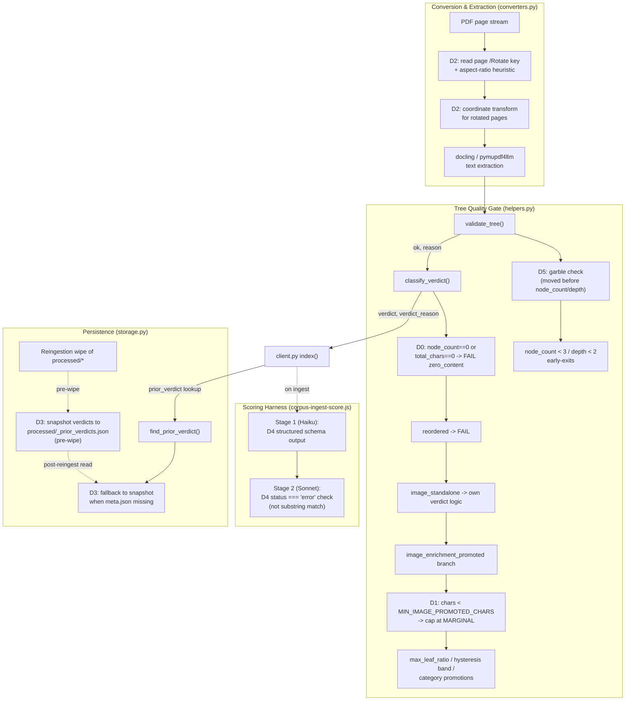
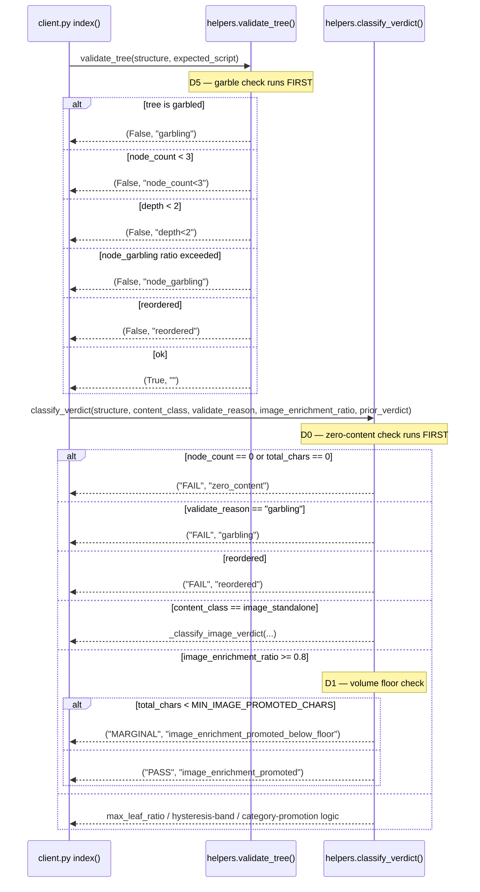
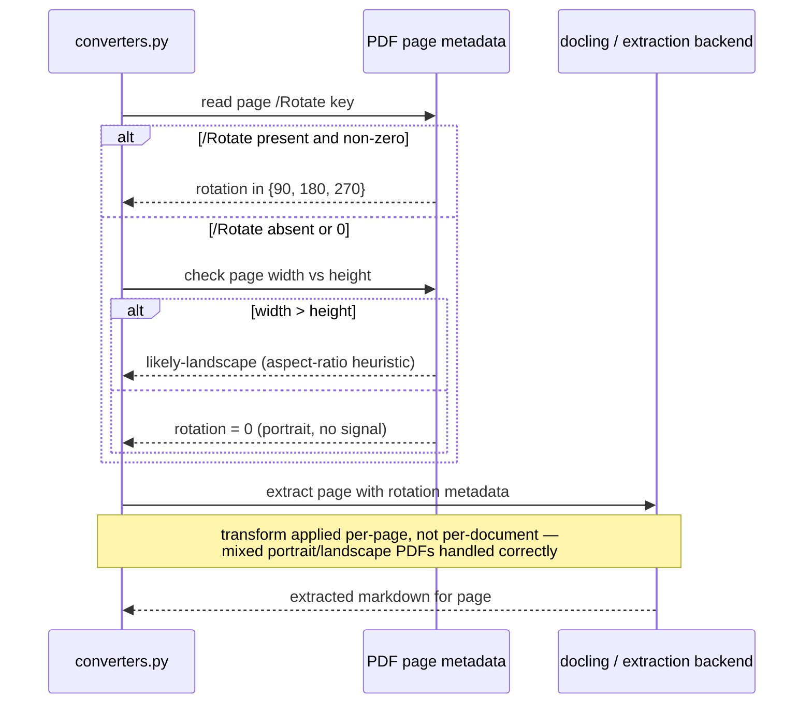
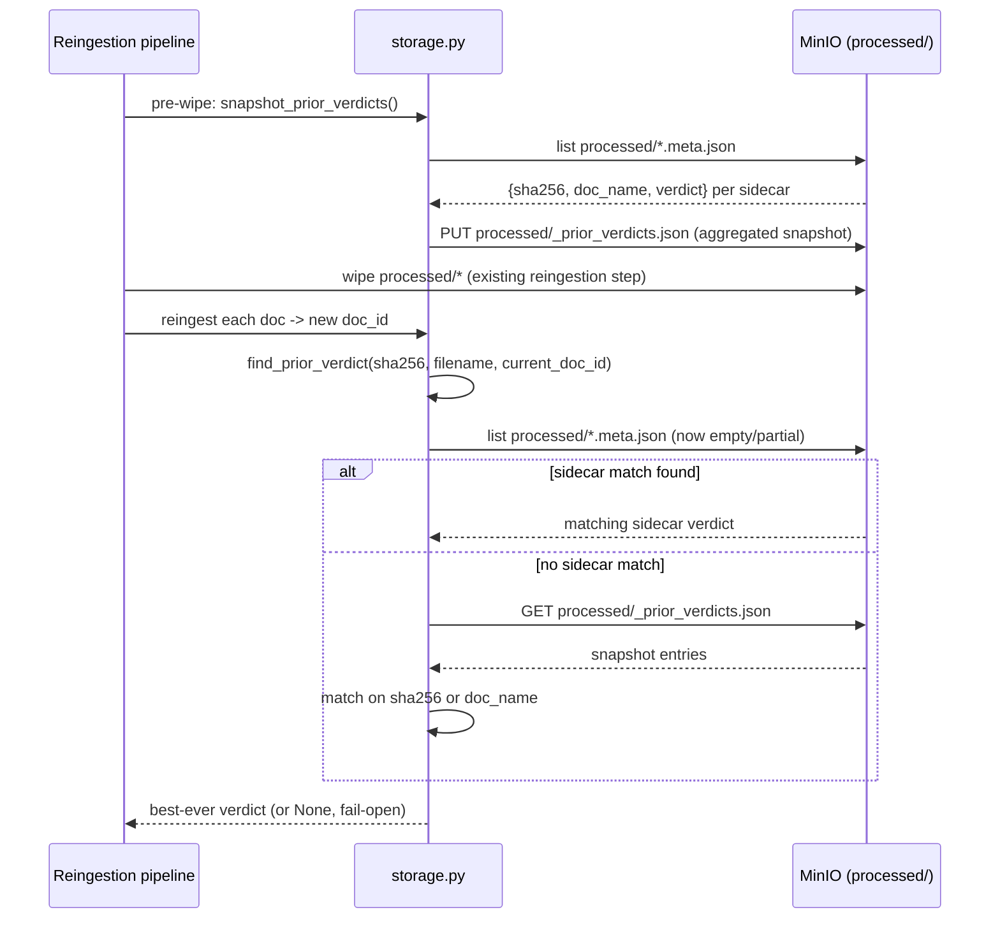

<!-- Space: CITRA -->
<!-- Title: Design Document: RFC-026 Run 9 Verdict Gate Hardening & Page Rotation Detection -->
<!-- Folder: Designs -->

# Design Document: RFC-026 Run 9 Verdict Gate Hardening & Page Rotation Detection

## 1. Traceability

| Artifact | Reference |
| --- | --- |
| Governing RFC | [RFC-026: Run 9 — Verdict Gate Hardening & Page Rotation Detection](../rfcs/026-verdict-gate-hardening-rotation-detection.md) |
| Product requirements | [PRD.md § Quality Bar & Acceptance Criteria](../../PRD.md#quality-bar--acceptance-criteria) |
| Architecture — tree gate | [ARCHITECTURE.md § Tree Quality Gate](../../ARCHITECTURE.md#tree-quality-gate) |
| Architecture — extraction | [ARCHITECTURE.md § PDF Extraction Strategy](../../ARCHITECTURE.md#pdf-extraction-strategy) |
| Hard Rules (binding) | [CLAUDE.md § Hard Rules](../../CLAUDE.md#hard-rules) — Hard Rule 5 ("Never silently persist a low-quality tree") is the controlling constraint for D0, D1, D5 |
| Implementation Plan | [tasks-rfc026-verdict-gate-hardening-rotation-detection.md](../tasks/tasks-rfc026-verdict-gate-hardening-rotation-detection.md) |
| Prior cycle design (pattern precedent) | [design-rfc025-run8-verdict-hysteresis-and-recovery-coverage.md](design-rfc025-run8-verdict-hysteresis-and-recovery-coverage.md) |

## 2. Overview

Run 9 of the corpus quality cycle posted a numerically strong result (15 PASS / 8 MARGINAL / 0 FAIL / 1 ERROR, up from Run 8's 7/6/9/3), but the audit behind those numbers found the improvement partly illusory: `classify_verdict()` in [`src/pageindex_mcp/helpers.py`](../../src/pageindex_mcp/helpers.py) has no hard floor for zero-content documents and no absolute-volume floor on the `image_enrichment_promoted` PASS path, so four zero-char Arabic documents and three near-empty (38–492 char) documents cleared the gate outright — a direct violation of [CLAUDE.md Hard Rule 5](../../CLAUDE.md#hard-rules). Separately, `validate_tree()` checks node-count/depth before garbling, masking the true failure reason for numeric-junk OCR text; a persistent (3-run) rotation-extraction bug fragments landscape-oriented PDF pages into near-empty nodes; the reingestion wipe in [`src/pageindex_mcp/storage.py`](../../src/pageindex_mcp/storage.py) destroys the hysteresis signal `find_prior_verdict()` depends on before every corpus run; and the scoring harness itself ([`.claude/workflows/corpus-ingest-score.js`](../../.claude/workflows/corpus-ingest-score.js)) has a substring-match bug that can spuriously flip every document's tallied verdict to ERROR. This RFC lands five fixes (D0, D1, D5 in `helpers.py`; D2 in `converters.py`; D3 in `storage.py`; D4 in the scoring harness) that close each gap independently, in priority order, with D6 (Latin-script CMap garble detection) explicitly deferred to the next cycle.

## 3. Key Design Principles

1. **Zero content never passes** — [D0](../rfcs/026-verdict-gate-hardening-rotation-detection.md#d0--hard-fail-floor-for-zero-content-documents) makes `node_count == 0` or `total_chars == 0` an unconditional `("FAIL", "zero_content")` that runs before every promotion branch, including `image_enrichment_promoted`. No content-class check, ratio, or hysteresis band can override an empty document.
2. **Promotion paths need an absolute floor, not just a ratio** — [D1](../rfcs/026-verdict-gate-hardening-rotation-detection.md#d1--image-enrichment-promoted-volume-floor) recognizes that a ratio-only gate (`image_enrichment_ratio >= 0.8`) is scale-blind: 0.8 of 38 chars is still 38 chars. Every ratio-based promotion in `classify_verdict()` must be paired with a minimum absolute-character floor.
3. **Garble is a content-integrity signal, not a structure signal, and must be checked first** — [D5](../rfcs/026-verdict-gate-hardening-rotation-detection.md#d5--validate-tree-garble-check-ordering) reorders `validate_tree()` so garbling is detected and reported even on documents that also happen to be structurally thin, so downstream OCR-escalation logic sees the correct `garbling` reason instead of a shadowing `node_count<3`.
4. **Rotation-aware extraction is page-level, not document-level** — [D2](../rfcs/026-verdict-gate-hardening-rotation-detection.md#d2--page-level-rotation-detection) treats each PDF page independently (reading `/Rotate` plus an aspect-ratio heuristic) because a single document can mix portrait and landscape pages; a document-level flag would mis-transform the pages that don't need it.
5. **Hysteresis must survive the infrastructure that hysteresis-consuming code assumes is stable** — [D3](../rfcs/026-verdict-gate-hardening-rotation-detection.md#d3--hysteresis-preservation-across-reingestion-wipe) recognizes that `find_prior_verdict()`'s contract (scan `processed/*.meta.json`) is silently broken by the reingestion pipeline's own wipe step; the fix snapshots verdicts across that wipe rather than changing the wipe's semantics.
6. **The measurement instrument must not be the thing under test** — [D4](../rfcs/026-verdict-gate-hardening-rotation-detection.md#d4--scoring-harness-stage-2-guard-fix) replaces a substring-match guard with a schema-validated structured status so the scoring harness cannot fabricate ERROR verdicts on documents that ingested successfully.

## 4. Launch Constraints

- **D6 (Latin-script CMap garble detection) is explicitly deferred** — see [RFC-026 § Out of Scope](../rfcs/026-verdict-gate-hardening-rotation-detection.md#out-of-scope) for the boundary and rationale; this design and its tasks file cover D0–D5 only. Any future CMap dictionary-based garble work is a separate RFC.
- **The task breakdown contains no ingestion steps** — per prior-cycle process learning (Run 9 cycle notes), tasks in [tasks-rfc026-verdict-gate-hardening-rotation-detection.md](../tasks/tasks-rfc026-verdict-gate-hardening-rotation-detection.md) are code-and-unit-test only; corpus reingestion/scoring is a separate operational step run via the `corpus-cycle` skill after this RFC lands, not a task in this plan.
- Two other Run 9 findings are explicitly out of scope for this RFC — see [RFC-026 § Out of Scope](../rfcs/026-verdict-gate-hardening-rotation-detection.md#out-of-scope): the image-OCR-never-fires defect for scanned Arabic PDFs (tracked separately since Run 6), and the `world-stats-pocketbook-2023.pdf` 30-minute job-timeout (an infra sizing issue, not a code-quality defect).
- Priority order for implementation follows [RFC-026 § Priority Order](../rfcs/026-verdict-gate-hardening-rotation-detection.md#priority-order): D0 → D1 → D5 → D2 → D3 → D4, which is also the batch order used in the tasks file (Batch 0 = D0/D1/D5, Batch 1 = D2, Batch 2 = D3/D4).

## 5. Architecture



## 6. Architecture Decisions

### D0 — Hard FAIL floor for zero-content documents

[RFC-026 § D0](../rfcs/026-verdict-gate-hardening-rotation-detection.md#d0--hard-fail-floor-for-zero-content-documents) is implemented as the very first check inside `classify_verdict()` at [`src/pageindex_mcp/helpers.py:1174`](../../src/pageindex_mcp/helpers.py), ahead of the existing `validate_reason == "garbling"` / `"reordered"` short-circuits at lines 1181–1186 and strictly ahead of the `image_enrichment_promoted` branch at lines 1198–1203. Placement before `image_enrichment_promoted` is the crux of the fix: today a zero-node/zero-char document with `content_class in ("flat_prose", "flat_mixed")` and a stray `image_enrichment_ratio >= 0.8` reaches PASS before any content check runs. `node_count == 0 or total_chars == 0` is evaluated directly from the `structure` argument (via the existing `_tree_node_count()` / `_flatten_tree_text()` helpers already used lower in the function), so no new data dependency is introduced. Decision: this is a hard, unconditional gate — no `prior_verdict` hysteresis band, no `content_class` exemption, and no future promotion branch may be inserted above it. This directly satisfies [CLAUDE.md Hard Rule 5](../../CLAUDE.md#hard-rules).

### D1 — Image-enrichment-promoted volume floor

[RFC-026 § D1](../rfcs/026-verdict-gate-hardening-rotation-detection.md#d1--image-enrichment-promoted-volume-floor) adds an absolute character floor to the existing `image_enrichment_promoted` branch at [`src/pageindex_mcp/helpers.py:1198-1203`](../../src/pageindex_mcp/helpers.py). The branch's condition (`content_class in ("flat_prose", "flat_mixed") and image_enrichment_ratio is not None and image_enrichment_ratio >= 0.8`) is ratio-only and scale-blind: 38, 123, and 492-char documents all satisfied `ratio >= 0.8` and got `("PASS", "image_enrichment_promoted")`. The fix computes `total_chars` from the same `structure` (reusing the `_flatten_tree_text()` call already present a few lines below at line 1221, hoisted earlier if needed) and, when `total_chars < MIN_IMAGE_PROMOTED_CHARS` (env var, default `500` — mirroring the existing `MIN_FLAT_PROMOTION_CHARS` pattern at line 1251), the branch returns `("MARGINAL", "image_enrichment_promoted_below_floor")` instead of PASS. The branch still promotes above the floor exactly as before — this is a floor on an existing promotion, not a new gate.

### D2 — Page-level rotation detection

[RFC-026 § D2](../rfcs/026-verdict-gate-hardening-rotation-detection.md#d2--page-level-rotation-detection) closes a defect that has stalled 3 consecutive corpus runs: `uae_numbers_english_page_16_17` yields ~750 chars across 76 flat nodes for a 2-page document that should extract ~4000–8000 chars, because landscape pages are extracted with the wrong coordinate mapping. `src/pageindex_mcp/converters.py` already contains a page-rotation-aware code path for OCR crops — `page.rotation` is read and zeroed before rendering at [`converters.py:1744-1755`](../../src/pageindex_mcp/converters.py) (comment: "zero page rotation before rendering so Tesseract receives a correctly-oriented crop regardless of PDF page-rotation metadata"), so a `/Rotate`-reading and rotation-restoring pattern already exists in this file for the Tesseract-crop path. D2 generalizes this: read each page's `/Rotate` key (0/90/180/270) plus an aspect-ratio heuristic (width > height without an explicit `/Rotate` still implies likely-landscape) at the top of the main extraction path (`pdf_to_markdown` at [`converters.py:711`](../../src/pageindex_mcp/converters.py) and the docling entrypoint `pdf_to_markdown_docling` at [`converters.py:2057`](../../src/pageindex_mcp/converters.py)), and passes per-page rotation metadata through to the docling service / text extraction so the coordinate transform is applied consistently, not only inside the OCR-crop branch. The check is per-page, never per-document, so mixed portrait/landscape PDFs are handled correctly.

### D3 — Hysteresis preservation across reingestion wipe

[RFC-026 § D3](../rfcs/026-verdict-gate-hardening-rotation-detection.md#d3--hysteresis-preservation-across-reingestion-wipe) fixes a contract violation between the reingestion pipeline and `find_prior_verdict()` at [`src/pageindex_mcp/storage.py:626`](../../src/pageindex_mcp/storage.py). `find_prior_verdict()` scans `processed/*.meta.json` (lines 641-666), matching on `sha256` or `doc_name`, to recover the best-ever verdict (`_VERDICT_PRIORITY` at line 623: `PASS > MARGINAL > FAIL > ERROR`) for a document being reingested under a fresh `doc_id`. The corpus reingestion pipeline wipes all `processed/` objects before reingesting the corpus, so this scan always returns `None` — hysteresis (e.g. the `PASS_HYSTERESIS_BAND` widening in `classify_verdict()` at `helpers.py:1230-1234`) never engages, and documents like `GHV-TKV-Tarif.pdf` flap PASS→MARGINAL on an identical tree purely from `leaf_concentration` noise. The fix adds a pre-wipe snapshot step that serializes every current `{sha256, doc_name, verdict}` triple to `processed/_prior_verdicts.json`, and `find_prior_verdict()` gains a fallback: if no per-document `*.meta.json` sidecar matches, it reads the snapshot file and matches against its entries the same way. The snapshot itself is written by the reingestion pipeline immediately before the wipe step and is not deleted by the wipe (its own key falls outside the pattern of individual doc sidecars, or the wipe is ordered to write-then-wipe-others).

### D4 — Scoring harness Stage 2 guard fix

[RFC-026 § D4](../rfcs/026-verdict-gate-hardening-rotation-detection.md#d4--scoring-harness-stage-2-guard-fix) fixes a false-positive in [`.claude/workflows/corpus-ingest-score.js`](../../.claude/workflows/corpus-ingest-score.js). Stage 1 (Haiku, the `agent()` call at [line 159-179](../../.claude/workflows/corpus-ingest-score.js)) currently has no `schema` parameter, so it returns free-form text; Stage 2's guard at [line 183](../../.claude/workflows/corpus-ingest-score.js) is `!ingestResult || (typeof ingestResult === 'string' && ingestResult.includes('error'))` — if the Haiku agent's prose response happens to contain the substring "error" anywhere (including in a phrase like "error handling succeeded" or "no errors"), every downstream doc short-circuits to `verdict: 'ERROR'` regardless of actual ingestion outcome. The fix adds a `schema` argument to the Stage 1 `agent()` call (structurally identical in shape to the existing `SCORE_SCHEMA` at lines 133-153, minimally `{doc_id, filename, status: enum['success','error','timeout','oom'], error, content_class}` per the prompt's own already-specified return contract at line 178), and replaces the Stage 2 guard with a structured check: `!ingestResult || ingestResult.status === 'error'`. This is a process-reliability fix, not a corpus-quality-code fix — it does not touch `helpers.py`, `converters.py`, or `storage.py`.

### D5 — Validate-tree garble check ordering

[RFC-026 § D5](../rfcs/026-verdict-gate-hardening-rotation-detection.md#d5--validate-tree-garble-check-ordering) reorders three adjacent checks in `validate_tree()` at [`src/pageindex_mcp/helpers.py:1047-1077`](../../src/pageindex_mcp/helpers.py). Today the function returns `False, "node_count<3"` (line 1053-1054) or `False, "depth<2"` (line 1055-1056) before ever reaching the garble check at line 1057 (`_tree_is_garbled(structure, expected_script=expected_script)`). For a document like `وارد 597`, numeric-junk text produces a minimal tree that trips the `node_count<3` exit first, so the caller receives `reason="node_count<3"` and never learns the content was also garbled — the flat-doc-fallback / OCR-escalation logic that keys off `reason == "garbling"` (per `classify_verdict()`'s own `validate_reason == "garbling"` check at `helpers.py:1181`) never fires. The fix moves the garble check (and, per the RFC's explicit ordering requirement, ahead of the structural early-exits) so that `_tree_is_garbled()` is evaluated first: if garbled, return `False, "garbling"` regardless of `node_count`/`depth`. The `node_count<3` / `depth<2` checks remain, now running only on non-garbled trees. This ordering is also a stated prerequisite for the deferred D6 (Latin-script CMap detection), which will plug into the same garble-first slot in a future RFC.

## 7. Service Contracts

| Service | File | Dimensions | Contract |
| --- | --- | --- | --- |
| Verdict & tree-gate logic | [`src/pageindex_mcp/helpers.py`](../../src/pageindex_mcp/helpers.py) | D0, D1, D5 | `validate_tree(structure, expected_script=None) -> (ok: bool, reason: str)` at [line 1047](../../src/pageindex_mcp/helpers.py) gates persistence per [CLAUDE.md Hard Rule 5](../../CLAUDE.md#hard-rules); garble check ([D5](../rfcs/026-verdict-gate-hardening-rotation-detection.md#d5--validate-tree-garble-check-ordering)) now runs before the `node_count`/`depth` early-exits. `classify_verdict(structure, content_class, validate_reason, image_enrichment_ratio=None, prior_verdict=None) -> (verdict: str, reason: str)` at [line 1174](../../src/pageindex_mcp/helpers.py) gains an unconditional zero-content FAIL floor ([D0](../rfcs/026-verdict-gate-hardening-rotation-detection.md#d0--hard-fail-floor-for-zero-content-documents)) as its first check, and the `image_enrichment_promoted` branch gains a `MIN_IMAGE_PROMOTED_CHARS`-gated floor ([D1](../rfcs/026-verdict-gate-hardening-rotation-detection.md#d1--image-enrichment-promoted-volume-floor)). Both `verdict` values remain drawn from `{"PASS", "MARGINAL", "FAIL"}` — no new verdict tier is introduced. |
| PDF conversion / extraction | [`src/pageindex_mcp/converters.py`](../../src/pageindex_mcp/converters.py) | D2 | `pdf_to_markdown(pdf_path: str) -> str` at [line 711](../../src/pageindex_mcp/converters.py) and `pdf_to_markdown_docling(...)` at [line 2057](../../src/pageindex_mcp/converters.py) gain a per-page rotation-detection pre-pass ([D2](../rfcs/026-verdict-gate-hardening-rotation-detection.md#d2--page-level-rotation-detection)) that reads `/Rotate` plus an aspect-ratio fallback and threads a per-page rotation value through to the extraction call, reusing the read/zero/restore pattern already present for the OCR-crop path at [lines 1744-1755](../../src/pageindex_mcp/converters.py). Return type and call signature are unchanged; rotation handling is internal. |
| Persistence & hysteresis | [`src/pageindex_mcp/storage.py`](../../src/pageindex_mcp/storage.py) | D3 | `find_prior_verdict(sha256: str, filename: str, current_doc_id: str) -> str \| None` at [line 626](../../src/pageindex_mcp/storage.py) gains a snapshot-fallback path ([D3](../rfcs/026-verdict-gate-hardening-rotation-detection.md#d3--hysteresis-preservation-across-reingestion-wipe)): when no `processed/*.meta.json` sidecar matches, it reads `processed/_prior_verdicts.json` and matches against its `{sha256, doc_name, verdict}` entries the same way. A new snapshot-writer (invoked by the reingestion pipeline immediately pre-wipe) serializes the current verdict set to that path. Both remain fail-open: MinIO/read errors degrade to `None`, never raise — hysteresis stays a quality-of-life feature, never a blocker (matching the function's existing docstring contract). |
| Scoring harness | [`.claude/workflows/corpus-ingest-score.js`](../../.claude/workflows/corpus-ingest-score.js) | D4 | Stage 1 `agent()` call ([lines 159-179](../../.claude/workflows/corpus-ingest-score.js)) gains a `schema` parameter constraining its return to `{doc_id, filename, status: enum['success','error','timeout','oom'], error, content_class}` ([D4](../rfcs/026-verdict-gate-hardening-rotation-detection.md#d4--scoring-harness-stage-2-guard-fix)). Stage 2's guard at [line 183](../../.claude/workflows/corpus-ingest-score.js) changes from `typeof ingestResult === 'string' && ingestResult.includes('error')` to `ingestResult.status === 'error'`. `SCORE_SCHEMA` (lines 133-153) is unchanged. |

## 8. Sequence Diagrams

### Verdict classification flow (D0, D1, D5)



### Rotation detection flow (D2)



### Hysteresis snapshot flow (D3)



## 9. Data Models

### `processed/_prior_verdicts.json`

```json
{
  "snapshot_at": "2026-07-31T00:00:00Z",
  "entries": [
    {
      "sha256": "a1b2c3...",
      "doc_name": "GHV-TKV-Tarif.pdf",
      "doc_id": "prior-doc-id-before-wipe",
      "verdict": "PASS"
    }
  ]
}
```

- Written by the reingestion pipeline immediately before the `processed/` wipe step, per [D3](../rfcs/026-verdict-gate-hardening-rotation-detection.md#d3--hysteresis-preservation-across-reingestion-wipe).
- Read only by `find_prior_verdict()` at [`storage.py:626`](../../src/pageindex_mcp/storage.py) as a fallback when no individual `processed/<doc_id>.meta.json` sidecar matches the current document's `sha256`/`doc_name`.
- `entries[].verdict` uses the same `_VERDICT_PRIORITY` domain already defined at [`storage.py:623`](../../src/pageindex_mcp/storage.py): `{"PASS", "MARGINAL", "FAIL", "ERROR"}`.
- Read/write failures degrade to `None` / skip, consistent with the existing fail-open contract of `find_prior_verdict()`.

### Page rotation metadata (in-memory, converters.py)

```json
{
  "page_index": 15,
  "rotate_key": 90,
  "aspect_ratio_landscape": true,
  "effective_rotation": 90
}
```

- Produced per-page inside `pdf_to_markdown()` / `pdf_to_markdown_docling()` ([D2](../rfcs/026-verdict-gate-hardening-rotation-detection.md#d2--page-level-rotation-detection)); not persisted — consumed immediately by the extraction call for that page and discarded.
- `rotate_key` mirrors the existing `orig_rotation = page.rotation` pattern already used for OCR crops at [`converters.py:1746`](../../src/pageindex_mcp/converters.py); `aspect_ratio_landscape` is the new fallback heuristic for pages lacking an explicit `/Rotate` value.
- `effective_rotation` is `rotate_key` when present/non-zero, else `90` (or `270`, implementation-determined) when `aspect_ratio_landscape` is true and `rotate_key` is `0`, else `0`.

## 10. Correctness Properties

- **P1 — Zero-content hard FAIL** ([D0](../rfcs/026-verdict-gate-hardening-rotation-detection.md#d0--hard-fail-floor-for-zero-content-documents)): For any input to `classify_verdict()` where `node_count == 0` or `total_chars == 0`, the return value is always `("FAIL", "zero_content")`, regardless of `content_class`, `image_enrichment_ratio`, or `prior_verdict`. No PASS or MARGINAL verdict is reachable for a zero-content document.
- **P2 — Image-enrichment volume floor** ([D1](../rfcs/026-verdict-gate-hardening-rotation-detection.md#d1--image-enrichment-promoted-volume-floor)): For any document taking the `image_enrichment_promoted` branch (`content_class in ("flat_prose", "flat_mixed")`, `image_enrichment_ratio >= 0.8`), the verdict is `"PASS"` only when `total_chars >= MIN_IMAGE_PROMOTED_CHARS`; otherwise it is capped at `"MARGINAL"`.
- **P3 — Rotation-aware extraction** ([D2](../rfcs/026-verdict-gate-hardening-rotation-detection.md#d2--page-level-rotation-detection)): For any PDF page with a non-zero `/Rotate` key or a landscape aspect ratio, extracted character count is not degraded relative to an equivalent unrotated page — i.e., `uae_numbers_english_page_16_17` (landscape and portrait variants) extracts in the expected ~4000-8000 char range instead of ~750 chars. Rotation handling is applied independently per page within a single document.
- **P4 — Hysteresis preservation** ([D3](../rfcs/026-verdict-gate-hardening-rotation-detection.md#d3--hysteresis-preservation-across-reingestion-wipe)): For any document reingested after a `processed/` wipe, `find_prior_verdict()` returns the pre-wipe best-ever verdict (via the `_prior_verdicts.json` snapshot fallback) whenever a snapshot entry matches on `sha256` or `doc_name`, even though no per-document `*.meta.json` sidecar survives the wipe.
- **P5 — Scoring harness structured output** ([D4](../rfcs/026-verdict-gate-hardening-rotation-detection.md#d4--scoring-harness-stage-2-guard-fix)): Stage 2's ERROR short-circuit fires if and only if `ingestResult` is falsy or `ingestResult.status === 'error'`; a successful ingestion whose Stage 1 report happens to contain the substring "error" in unrelated prose does not trigger a false ERROR tally.
- **P6 — Garble priority over structure checks** ([D5](../rfcs/026-verdict-gate-hardening-rotation-detection.md#d5--validate-tree-garble-check-ordering)): For any tree that is both garbled and structurally thin (`node_count < 3` and/or `depth < 2`), `validate_tree()` returns `(False, "garbling")`, never `(False, "node_count<3")` or `(False, "depth<2")` — garbling is always reported when present, regardless of tree shape.

## 11. Error Handling

- **Rotation detection failures** ([D2](../rfcs/026-verdict-gate-hardening-rotation-detection.md#d2--page-level-rotation-detection)): if reading a page's `/Rotate` key raises (corrupt PDF metadata) or the aspect-ratio heuristic cannot determine page dimensions, the page falls back to `effective_rotation = 0` (unrotated/default extraction) — a single page's rotation-detection failure does not abort extraction of the rest of the document, matching the existing per-page try/restore pattern already used for the OCR-crop rotation handling at [`converters.py:1744-1755`](../../src/pageindex_mcp/converters.py).
- **Snapshot read/write failures** ([D3](../rfcs/026-verdict-gate-hardening-rotation-detection.md#d3--hysteresis-preservation-across-reingestion-wipe)): both the pre-wipe snapshot write and the post-reingestion snapshot read follow `find_prior_verdict()`'s existing fail-open contract (docstring at [`storage.py:626-637`](../../src/pageindex_mcp/storage.py)) — any MinIO error or malformed JSON degrades to a no-op / `None` result rather than raising, since hysteresis is a quality-of-life feature and must never block ingestion.
- **Zero-content / volume-floor checks** ([D0](../rfcs/026-verdict-gate-hardening-rotation-detection.md#d0--hard-fail-floor-for-zero-content-documents), [D1](../rfcs/026-verdict-gate-hardening-rotation-detection.md#d1--image-enrichment-promoted-volume-floor)): these are pure functions over already-loaded `structure` data with no I/O, so no new error path is introduced; `MIN_IMAGE_PROMOTED_CHARS` parsing follows the existing `int(os.environ.get(..., "500"))` pattern already used for `MIN_FLAT_PROMOTION_CHARS` at [`helpers.py:1251`](../../src/pageindex_mcp/helpers.py), so a malformed env var raises at startup/first-call the same way existing threshold env vars do — no silent fallback is introduced that would mask misconfiguration.
- **Scoring harness schema violations** ([D4](../rfcs/026-verdict-gate-hardening-rotation-detection.md#d4--scoring-harness-stage-2-guard-fix)): if the Stage 1 agent's output fails to validate against its new `schema`, the harness surfaces that as a harness-level error (consistent with how `SCORE_SCHEMA` violations are already handled for Stage 2/3), rather than falling through to the old substring-match behavior.

## 12. Testing Strategy

Unit tests are added per property, colocated with the existing test suites for each module (`tests/test_helpers.py`-style, `tests/test_converters.py`-style, `tests/test_storage.py`-style, per the project's existing layout).

- **P1 (D0)**: `classify_verdict()` called with `structure=[]` (node_count 0) and with a structure whose flattened text is empty (total_chars 0), each combined with `content_class="flat_prose"` and `image_enrichment_ratio=0.9` (i.e., a case that would otherwise hit `image_enrichment_promoted`) — assert `("FAIL", "zero_content")` in both cases, per [Tasks §1.4 Unit tests batch 0](../tasks/tasks-rfc026-verdict-gate-hardening-rotation-detection.md#14-unit-tests-batch-0).
- **P2 (D1)**: `classify_verdict()` with `image_enrichment_ratio=0.85` and `total_chars` set to 38, 499, 500, and 501 — assert MARGINAL below the floor, PASS at/above it (boundary-inclusive test at the exact `MIN_IMAGE_PROMOTED_CHARS` value), plus an env-var override test setting `MIN_IMAGE_PROMOTED_CHARS=100`, per [Tasks §1.4](../tasks/tasks-rfc026-verdict-gate-hardening-rotation-detection.md#14-unit-tests-batch-0).
- **P3 (D2)**: fixture PDFs with `/Rotate=90` and `/Rotate=0`-but-landscape-aspect-ratio pages — assert extracted char count is within the expected range and that a mixed portrait+landscape multi-page fixture extracts each page independently, per [Tasks §2.3 Unit tests batch 1](../tasks/tasks-rfc026-verdict-gate-hardening-rotation-detection.md#23-unit-tests-batch-1).
- **P4 (D3)**: `find_prior_verdict()` against a mocked MinIO with no `*.meta.json` objects but a populated `_prior_verdicts.json` — assert the snapshot fallback returns the correct best-ever verdict by both `sha256` and `doc_name` match; a corrupt/missing snapshot test asserts fail-open (`None`, no raise), per [Tasks §3.3 Unit tests batch 2](../tasks/tasks-rfc026-verdict-gate-hardening-rotation-detection.md#33-unit-tests-batch-2).
- **P5 (D4)**: a JS-level test (or harness dry-run) asserting the Stage 2 guard treats `{status: "success", ...}` as non-error even when other string fields contain "error" substrings, and treats `{status: "error", ...}` as error, per [Tasks §3.3](../tasks/tasks-rfc026-verdict-gate-hardening-rotation-detection.md#33-unit-tests-batch-2).
- **P6 (D5)**: `validate_tree()` with a structure that is both garbled and has `node_count < 3` — assert `(False, "garbling")`, not `(False, "node_count<3")`; a control test with a non-garbled thin tree still asserts `(False, "node_count<3")` to confirm the reorder didn't break the existing check, per [Tasks §1.3 Validate-tree garble reorder](../tasks/tasks-rfc026-verdict-gate-hardening-rotation-detection.md#13-validate-tree-garble-reorder) and [§1.4](../tasks/tasks-rfc026-verdict-gate-hardening-rotation-detection.md#14-unit-tests-batch-0).

Test categories map onto the tasks file's batch structure: [Batch 0 — verdict gate fixes (D0, D1, D5)](../tasks/tasks-rfc026-verdict-gate-hardening-rotation-detection.md#1-batch-0--verdict-gate-fixes-d0-d1-d5) with its own [checkpoint](../tasks/tasks-rfc026-verdict-gate-hardening-rotation-detection.md#15-checkpoint--batch-0); [Batch 1 — rotation detection (D2)](../tasks/tasks-rfc026-verdict-gate-hardening-rotation-detection.md#2-batch-1--rotation-detection-d2) with its [checkpoint](../tasks/tasks-rfc026-verdict-gate-hardening-rotation-detection.md#24-checkpoint--batch-1); [Batch 2 — hysteresis and harness (D3, D4)](../tasks/tasks-rfc026-verdict-gate-hardening-rotation-detection.md#3-batch-2--hysteresis-and-harness-d3-d4) with its [checkpoint](../tasks/tasks-rfc026-verdict-gate-hardening-rotation-detection.md#34-checkpoint--batch-2); and the overall [Final checkpoint](../tasks/tasks-rfc026-verdict-gate-hardening-rotation-detection.md#4-final-checkpoint), which gates the whole RFC on all six properties (P1-P6) passing together — including a regression pass confirming no previously-PASS document in the corpus flips to FAIL/MARGINAL solely due to the D0/D1/D5 reordering (i.e., these are floor/ordering fixes, not new rejection criteria for already-adequate content).
