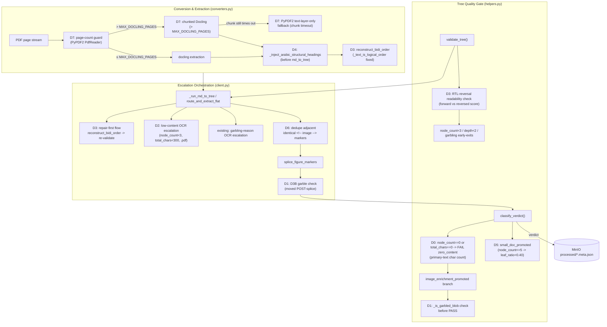
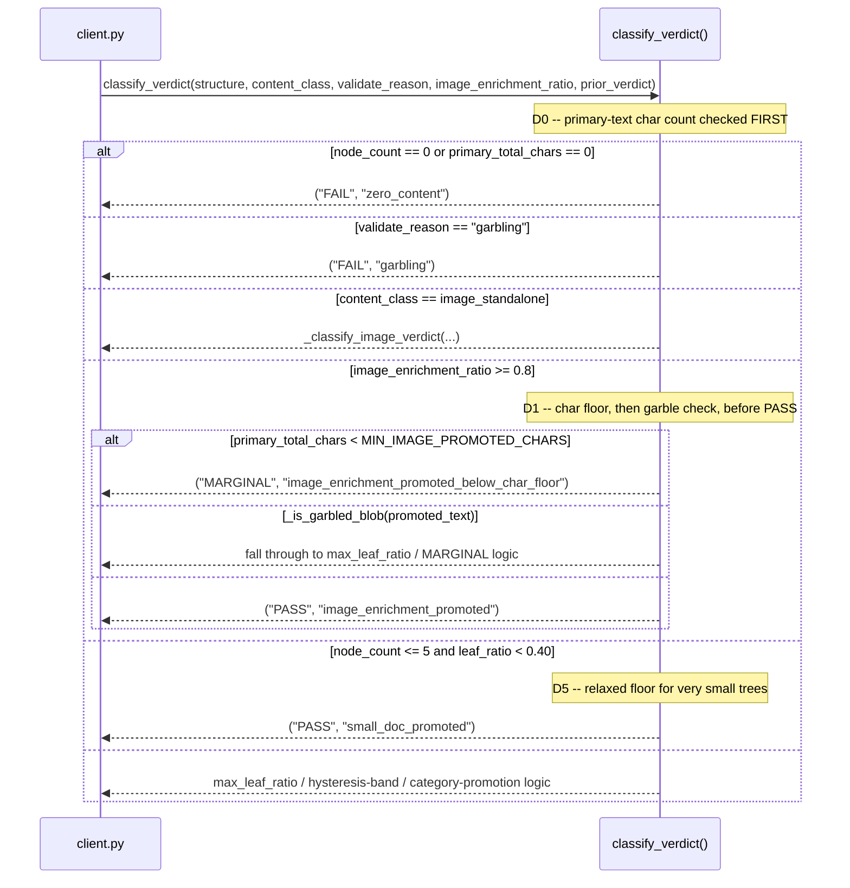
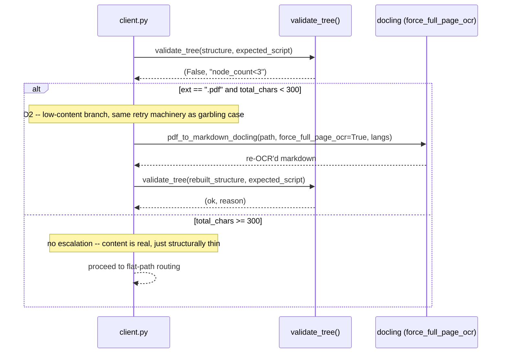
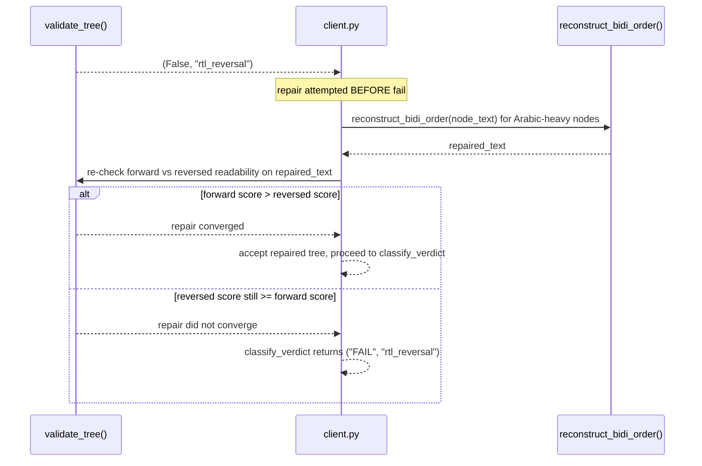
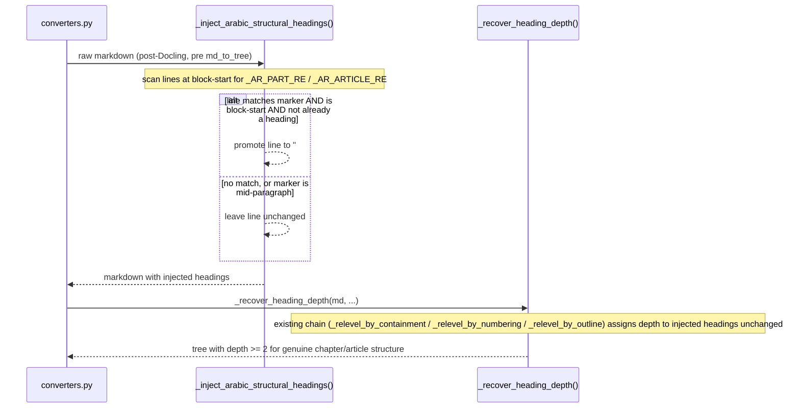
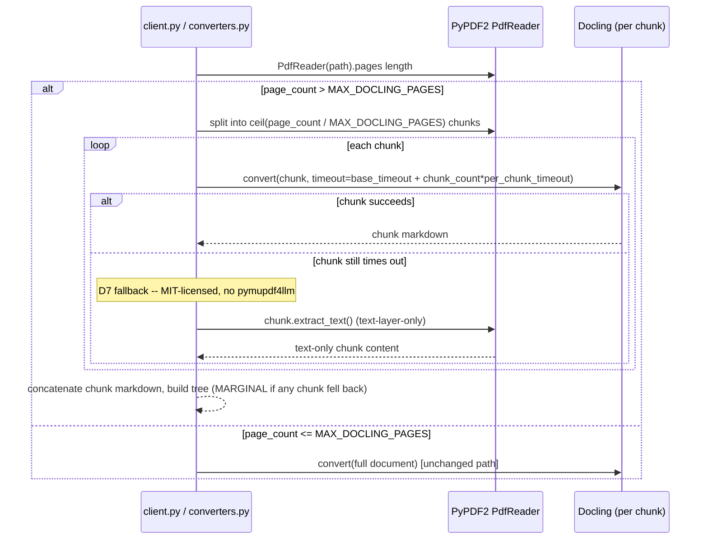
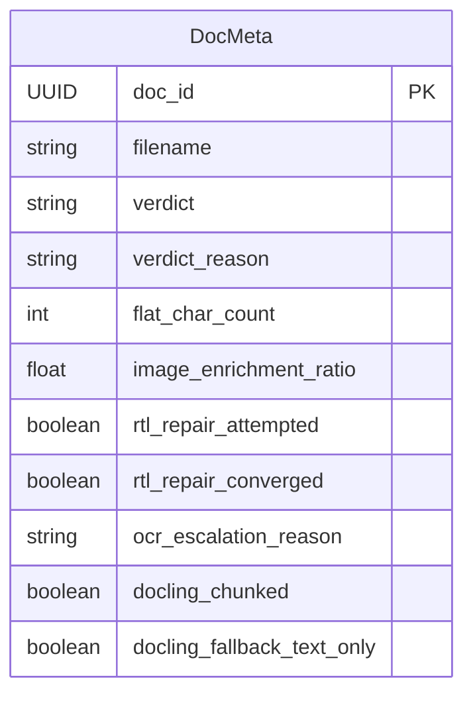

<!-- Space: CITRA -->
<!-- Title: Design Document: RFC-027 Run-10 Extraction Gate Integrity and Arabic Content Recovery -->
<!-- Folder: Designs -->

# Design Document: RFC-027 Run-10 Extraction Gate Integrity and Arabic Content Recovery

## Traceability

| Artifact | Reference |
|---|---|
| Governing RFC | [RFC-027: Run-10 Extraction Gate Integrity and Arabic Content Recovery](../rfcs/027-run10-extraction-gate-and-arabic-recovery.md) |
| Audit report | [audit/CORPUS_REINGESTION_AUDIT_RUN-10.md](../../audit/CORPUS_REINGESTION_AUDIT_RUN-10.md) |
| Product requirements | [PRD.md § Quality Bar & Acceptance Criteria](../../PRD.md#quality-bar--acceptance-criteria) |
| Architecture — tree gate | [ARCHITECTURE.md § Tree Quality Gate](../../ARCHITECTURE.md#tree-quality-gate) |
| Architecture — extraction | [ARCHITECTURE.md § PDF Extraction Strategy](../../ARCHITECTURE.md#pdf-extraction-strategy) |
| Hard Rules (binding) | [CLAUDE.md § Hard Rules](../../CLAUDE.md#hard-rules) — Hard Rule 5 ("Never silently persist a low-quality tree") governs D0, D1, D2, D3, D5; Hard Rule 4 (AGPL-3.0 awareness) governs D7's no-pymupdf4llm constraint |
| Implementation Plan | [tasks-rfc027-run10-extraction-gate-and-arabic-recovery.md](../tasks/tasks-rfc027-run10-extraction-gate-and-arabic-recovery.md) |
| Prior cycle design (pattern precedent) | [design-rfc026-verdict-gate-hardening-rotation-detection.md](design-rfc026-verdict-gate-hardening-rotation-detection.md) |

## Overview

Run 10 is the first corpus cycle after RFC-026's gate hardening landed (commit `6113ba3`), and the FAIL count jumped from 0 to 10 out of 25 documents. That jump is overwhelmingly correct — RFC-026's zero-content floor (D0) and image-enrichment char floor (D1) are now surfacing pre-existing extraction failures that were previously soft-landed as MARGINAL or silently auto-promoted to PASS. RFC-027 closes the remaining bypass paths that RFC-026 exposed but did not close, and attacks the largest single failure cluster in the corpus: scanned and reversed Arabic PDFs that never recover usable content. The work splits into two themes — (1) verdict-gate integrity (D0, D1, D5, D6, D8: inflated char counts, garble-detection gaps in promotion branches, digit-noise bypassing the garble gate, duplicate image markers, and an audit-reporting correction) and (2) Arabic content recovery (D2, D3, D4: OCR escalation for zero/near-zero-content scanned PDFs, RTL-reversal detection with a repair-first bidi flow, and structural heading injection for Arabic legal documents whose chapter/article markers Docling does not recognize as headings) — plus one operational fix (D7: a page-count guard and chunked-Docling route for oversized PDFs that currently die to `CHILD_TIMEOUT`). No decision in this RFC introduces a new verdict tier; every branch still resolves to `{"PASS", "MARGINAL", "FAIL"}` per the existing `classify_verdict()` contract.

## Key Design Principles

1. **Verdict char counts must reflect only primary document text** ([D0](../rfcs/027-run10-extraction-gate-and-arabic-recovery.md#d0----split-_flat_block_text-to-exclude-enrichment-metadata-from-verdict-char-counts)): `flat_char_count` and the synthetic `flat_structure` fed to `classify_verdict()` must never include image-enrichment `ocr_text`/`description` metadata. Enrichment text remains available for search indexing via a separate function — the split is additive, not a removal of enrichment content from the system.
2. **Every promotion path checks garble before returning PASS** ([D1](../rfcs/027-run10-extraction-gate-and-arabic-recovery.md#d1----wire-garble-detection-into-image_enrichment_promoted-branch-and-reorder-d3b-check-post-splice)): a ratio/floor check alone is insufficient — `image_enrichment_promoted` must call `_is_garbled_blob` on the promoted text before returning PASS, matching the pattern the RFC-026 D5 garble-first ordering already established for `validate_tree()`.
3. **Content-integrity checks run after content is complete, not before** ([D1](../rfcs/027-run10-extraction-gate-and-arabic-recovery.md#d1----wire-garble-detection-into-image_enrichment_promoted-branch-and-reorder-d3b-check-post-splice)): the D3B flat-path garble check must run after `splice_figure_markers` injects OCR-derived content, not before — checking incomplete content is equivalent to not checking it.
4. **Zero and near-zero content earns an OCR retry, not a silent FAIL** ([D2](../rfcs/027-run10-extraction-gate-and-arabic-recovery.md#d2----extend-ocr-escalation-to-low-content-and-garbled-arabic-pdfs)): RFC-026 D0 correctly surfaces empty documents as FAIL, but FAIL without an attempted recovery path is a missed rescue, not a completed diagnosis — scanned Arabic PDFs get one `force_full_page_ocr` retry below a calibrated 300-char floor, mirroring the existing garbling-triggered retry.
5. **Repair before reject for recoverable defects** ([D3](../rfcs/027-run10-extraction-gate-and-arabic-recovery.md#d3----add-rtl-reversal-detection-to-validate_tree-fix-_text_is_logical_order-and-wire-repair-first-flow)): reversed-but-valid Arabic text is a known-fixable defect (`reconstruct_bidi_order` already exists) — `validate_tree()` must detect it, but the pipeline must attempt the fix and re-validate before routing to FAIL, not FAIL on detection alone.
6. **Structure recovery cannot invent headings from nothing, but it can promote markers Docling already emits** ([D4](../rfcs/027-run10-extraction-gate-and-arabic-recovery.md#d4----inject-arabic-structural-headings-for-non-heading-lines)): `_recover_heading_depth`'s relevel chain only assigns depth to *existing* headings; Arabic structural markers (باب/فصل/مادة) are present as plain text lines, so a dedicated injection pass promotes them to `#` headings before the existing relevel chain runs — no new heading-detection heuristic duplicated inside the relevel functions.
7. **Threshold relaxations are scoped to the exact condition that produced the false positive, never widened globally** ([D5](../rfcs/027-run10-extraction-gate-and-arabic-recovery.md#d5----relax-small-doc-leaf-ratio-threshold-for-very-small-trees)): the `node_count <= 5` leaf-ratio relaxation applies only at `node_count <= 5`; documents with 6-10 nodes keep the existing 0.20 threshold, verified by a corpus-wide impact check before landing.
8. **Deduplication never touches markers with intervening content** ([D6](../rfcs/027-run10-extraction-gate-and-arabic-recovery.md#d6----deduplicate-identical-adjacent-image-markers-from-docling-standalone-image-export)): RFC-018 D0's multi-region `PictureResult` replication design depends on consecutive `<!-- image -->` markers representing distinct regions — the D6 dedup regex collapses only whitespace-gapped duplicates, never markers separated by any other content.
9. **Licensing constraints are load-bearing design inputs, not implementation details** ([D7](../rfcs/027-run10-extraction-gate-and-arabic-recovery.md#d7----add-page-count-guard-for-large-document-docling-timeout-chunked-docling-route)): per CLAUDE.md Hard Rule 4, the large-document timeout fallback uses PyPDF2 (MIT, already a dependency), never pymupdf4llm — a network-served AGPL-3.0 fallback is an unresolved legal decision this RFC does not open.

## Launch Constraints

- `MIN_IMAGE_PROMOTED_CHARS` (D0/D1), `total_chars < 300` OCR-escalation floor (D2), `node_count <= 5` leaf-ratio relaxation (D5), and `MAX_DOCLING_PAGES` (D7, default ~150) are corpus-calibrated constants, not tuned per-document — they ship as environment-variable-overridable defaults, matching the existing `PASS_MAX_LEAF_RATIO` / `MIN_FLAT_PROMOTION_CHARS` pattern in `helpers.py`.
- D3's RTL-reversal readability scoring depends on `_AR_COMMON_WORDS` vocabulary coverage; it is calibrated against the Run-10 corpus (legal/administrative/governance Arabic) and is not guaranteed to generalize to unseen Arabic domains without vocabulary extension.
- D7's chunked-Docling route is page-boundary-only (no mid-page splits); minor heading-depth discontinuities at chunk joins are an accepted trade-off, normalized by the existing `_relevel_by_containment` pass.
- No task in this RFC performs corpus ingestion, reingestion, or verification — those steps belong to the `corpus-cycle` skill, run separately after this plan lands (same operating constraint as RFC-026).
- D8 is a documentation-only fix to `audit/CORPUS_REINGESTION_AUDIT_RUN-10.md`; it does not touch `src/`.

## Architecture

### High-Level System Architecture



### Architecture Decisions

<a id="d0--split-_flat_block_text-into-primary-and-enrichment-variants"></a>**Split enrichment text out of verdict char counts** (RFC-027 [D0](../rfcs/027-run10-extraction-gate-and-arabic-recovery.md#d0----split-_flat_block_text-to-exclude-enrichment-metadata-from-verdict-char-counts)): `_flat_block_text()` in `helpers.py` (line ~2249) currently conflates primary document text with image-enrichment `ocr_text`/`description` for image blocks, and feeds both `flat_char_count` (`client.py:1359`) and the synthetic `flat_structure` passed to `classify_verdict()` (`client.py:1330-1335`). The alternative — subtracting an estimated enrichment-char count after the fact — was rejected because it requires re-deriving which characters came from enrichment, duplicating logic the source blocks already encode. Instead, `_flat_block_primary_text(block)` is introduced as a sibling function returning only `block.get('text', '')` plus table `row_records`; `_flat_block_text()` is kept unchanged for `_flat_search_text` / retrieval, so enrichment content remains searchable. Every verdict-facing call site switches to the primary-text function; every search-facing call site keeps the existing one.

<a id="d1--wire-garble-detection-into-image_enrichment_promoted-and-post-splice-d3b-recheck"></a>**Garble-check the promoted text, and check it after splicing** (RFC-027 [D1](../rfcs/027-run10-extraction-gate-and-arabic-recovery.md#d1----wire-garble-detection-into-image_enrichment_promoted-branch-and-reorder-d3b-check-post-splice)): `classify_verdict()`'s `image_enrichment_promoted` branch (`helpers.py:1207-1219`) checks only `image_enrichment_ratio >= 0.8` and the D0/RFC-026 char floor — it never calls the existing `_is_garbled_blob` (`helpers.py:863`, already calibrated at >60% digits on blobs >500 chars). Rather than invent a second garble heuristic, this branch reuses `_is_garbled_blob` directly on the flattened promoted text; if garbled, the branch falls through to the ordinary MARGINAL/FAIL path instead of returning PASS. Separately, `client.py`'s D3B flat-path garble check (`client.py:1202`, `_flat_text_is_garbled(flat_md, ...)`) runs before `splice_figure_markers` (`client.py:1261`) injects OCR content — the check is moved to run immediately after splicing so post-splice junk (image-OCR garble) is caught. A duplicate-block exclusion (`> [Chart text]:` prose) is added to the `image_enrichment_ratio` and char-floor calculations to prevent one OCR read from being double-counted as both image enrichment and spliced prose.

<a id="d2--low-content-ocr-escalation-for-arabic-pdfs"></a>**Extend the existing OCR-escalation branch by content volume, not just by reason string** (RFC-027 [D2](../rfcs/027-run10-extraction-gate-and-arabic-recovery.md#d2----extend-ocr-escalation-to-low-content-and-garbled-arabic-pdfs)): the OCR-escalation condition at `client.py:965` fires only on `reason in ("garbling", "node_garbling")`. Zero-content docs route through `reason='node_count<3'` and never escalate; near-zero-content docs (38-230 chars) similarly fall through because they have *some* content. Rather than adding a parallel escalation code path, a second condition is added at the same call site: `reason == "node_count<3" and total_chars < 300 and ext == ".pdf"` triggers the identical `force_full_page_ocr` retry already used for the garbling case, reusing the existing language-detection and retry machinery. `total_chars` is read from the structure object (sum of node text lengths via `_flatten_tree_text`), never from `validate_tree()`'s 2-tuple return, per the RFC's explicit clarification.

<a id="d3--rtl-reversal-detection-and-repair-first-flow"></a>**RTL reversal is detected in the gate and repaired before FAIL, not FAILed on detection** (RFC-027 [D3](../rfcs/027-run10-extraction-gate-and-arabic-recovery.md#d3----add-rtl-reversal-detection-to-validate_tree-fix-_text_is_logical_order-and-wire-repair-first-flow)): neither `validate_tree()` nor `classify_verdict()` currently detects reversed-but-valid Arabic — `_tree_is_garbled` targets null bytes, replacement characters, PUA codepoints, and sparse mojibake, none of which fire on correctly-encoded-but-reversed RTL text. Two changes land together because the second is a prerequisite for the first to be useful: (1) `_text_is_logical_order` (`converters.py:1205`) is fixed from `return orig_total >= disp_total` (true when both are 0, a false positive that silently blocks `reconstruct_bidi_order`) to `return sampled > 0 and orig_total > 0 and orig_total >= disp_total`; (2) `validate_tree()` gains a forward-vs-reversed readability prong on Arabic-heavy trees, returning `(False, "rtl_reversal")` when the reversed reading scores higher. The orchestration in `client.py` is repair-first: on `rtl_reversal`, call `reconstruct_bidi_order` (now unblocked by the fix in (1)), re-run the readability check, and accept the repaired tree if forward now scores higher; only route to FAIL if the reversed score still wins after repair. This mirrors the existing garbling-retry pattern (attempt recovery, re-validate, then decide) rather than introducing a new fail-first pattern.

<a id="d4--arabic-structural-heading-injection"></a>**Heading injection runs once, before tree-building, not inside the relevel chain** (RFC-027 [D4](../rfcs/027-run10-extraction-gate-and-arabic-recovery.md#d4----inject-arabic-structural-headings-for-non-heading-lines)): Docling does not classify Arabic structural markers (باب/فصل/مادة) as `SectionHeaderItem`s, so no `#` markers exist in the raw markdown for `_recover_heading_depth`'s chain (`_relevel_by_containment` / `_relevel_by_numbering` / `_relevel_by_outline`) to act on — those functions can only re-level *existing* headings, they cannot create new ones. `_inject_arabic_structural_headings(md)` is added as a distinct pre-pass, scanning raw markdown for lines matching the already-defined `_AR_PART_RE` / `_AR_ARTICLE_RE` patterns (`converters.py:79-80`) and promoting matching lines to `#`-prefixed headings, before `_recover_heading_depth` runs. This keeps marker-detection logic in one place instead of teaching three separate relevel functions to also recognize Arabic markers.

<a id="d5--small-doc-leaf-ratio-dispensation"></a>**Small-tree leaf-ratio relaxation is bounded to node_count, not to a document-size heuristic** (RFC-027 [D5](../rfcs/027-run10-extraction-gate-and-arabic-recovery.md#d5----relax-small-doc-leaf-ratio-threshold-for-very-small-trees)): `small_doc_promoted` (`helpers.py:1298-1307`) requires `max_leaf_ratio < 0.20`, which is structurally unreachable for `node_count <= 5` trees — a 5-node tree with any non-trivial hierarchy has a leaf-concentration floor well above 0.20. The threshold is bumped to `0.40` specifically for `node_count <= 5`; 6-10-node documents keep the existing `0.20` bound. A corpus-wide grep for `node_count` in `[3, 5]` with `leaf_concentration` in `[0.20, 0.40]` is run before landing to confirm no degenerate stub tree would be newly promoted by the relaxed threshold.

<a id="d6--adjacent-image-marker-deduplication"></a>**Marker dedup targets whitespace-only gaps exclusively, never a marker-count threshold** (RFC-027 [D6](../rfcs/027-run10-extraction-gate-and-arabic-recovery.md#d6----deduplicate-identical-adjacent-image-markers-from-docling-standalone-image-export)): Docling's `export_to_markdown()` occasionally emits duplicate consecutive `<!-- image -->` markers for a single image region, and `marker_count` (`client.py:921`) drives `PictureResult` replication (the RFC-018 D0 multi-region design). A blanket cap on marker count would silently drop legitimate multi-figure pages. The fix instead applies `re.sub(r'(<!-- image -->)\s*(?=<!-- image -->)', '', md_content)` before the `marker_count` computation — this collapses a marker only when it is immediately (modulo whitespace) followed by another identical marker, preserving every marker that has intervening content between it and its neighbor.

<a id="d7--page-count-guard-and-chunked-docling-fallback"></a>**Oversized PDFs get a chunked-Docling path with an MIT-licensed fallback, never an AGPL one** (RFC-027 [D7](../rfcs/027-run10-extraction-gate-and-arabic-recovery.md#d7----add-page-count-guard-for-large-document-docling-timeout-chunked-docling-route)): `world-stats-pocketbook-2023.pdf` (292 pages) exceeds both `CHILD_TIMEOUT` and `docling_service_timeout_s` because Docling's layout pipeline runs at ~5-10s/page on CPU. Per CLAUDE.md Hard Rule 4, `pymupdf4llm` (AGPL-3.0, already gated behind the optional `agpl-fallback` extra) is explicitly not used as the fallback here. Instead, a `MAX_DOCLING_PAGES` config (default ~150) triggers: (1) primary — split via `PyPDF2.PdfReader` (MIT, already a dependency) into page-count chunks, run each through the standard Docling pipeline independently within the existing timeout window, concatenate the resulting markdown; (2) fallback — if a chunk still times out, use `PyPDF2`'s `page.extract_text()` for text-only extraction, landing the document at MARGINAL (flat structure) rather than losing it entirely; (3) `CHILD_TIMEOUT` scales dynamically as `base_timeout + (chunk_count * per_chunk_timeout)` for the chunked path.

**Audit-reporting fixes are documentation-only and read-verified against live MinIO state** (RFC-027 [D8](../rfcs/027-run10-extraction-gate-and-arabic-recovery.md#d8----correct-run-10-audit-report-landscapeportrait-twin-scorecard-and-d4-verification-gap)): audit row #23 (landscape twin) reported PASS/unknown while the live `processed/*.meta.json` shows MARGINAL/`flat_mixed`/`depth=1`, identical to its portrait twin. The correction is a straight edit to `audit/CORPUS_REINGESTION_AUDIT_RUN-10.md` (move the pair from Improvements to Stalls) plus tightening the audit pipeline's own pre-publish (D4-in-audit-process) verification to cross-check every scorecard row against the stored gate verdict before publishing — this is a process fix inside the audit tooling, not a `src/` change.

### Deployment Architecture

This RFC does not change the deployment topology. It ships as code changes to three modules (`helpers.py`, `client.py`, `converters.py`) plus config/worker wiring (`config.py`, `worker.py`) inside the existing single `pageindex_mcp` FastMCP + arq deployment described in `ARCHITECTURE.md`:

- **Backend**: FastMCP server (unchanged) + arq worker process (unchanged process boundary; D7 changes only the worker's per-job `CHILD_TIMEOUT` value for chunked-Docling jobs, not how the worker is deployed).
- **Database**: None — verdict/metadata state continues to live in MinIO `processed/*.meta.json`, no relational store introduced.
- **Object Storage**: MinIO, unchanged bucket layout (`uploads/`, `processed/*.json`, `processed/*.meta.json`).
- **Task Queue**: arq + Redis, unchanged; D7 adds a scaled timeout value passed into the existing job envelope, not a new queue or job type.

### Communication Patterns

| Pattern | Use Case | Technology |
|---------|----------|------------|
| Synchronous in-process call | `client.py` orchestration invoking `helpers.validate_tree()` / `classify_verdict()` (D0-D3, D5) | Direct Python function call, no RPC |
| Synchronous in-process call | `client.py` invoking `converters.pdf_to_markdown_docling()` for the D2/D3/D7 retry and chunking paths | Direct Python function call |
| Async job execution | arq worker picking up an ingestion job and running the full pipeline, including D7's chunked-Docling route | arq (Redis-backed job queue), unchanged from existing pipeline |
| Local subprocess / remote call | Docling conversion (`_remote_pdf_to_markdown` when configured) | Existing Docling service integration, unchanged transport |

### Sequence Diagrams

Verdict classification flow (D0 / D1 / D5)



<a id="ocr-escalation-flow-d2"></a>Low-content OCR escalation flow (D2)



<a id="rtl-repair-flow-d3"></a>RTL-reversal repair-first flow (D3)



<a id="arabic-heading-injection-flow-d4"></a>Arabic structural heading injection flow (D4)



<a id="chunked-docling-flow-d7"></a>Chunked-Docling large-document flow (D7)



## Service Contracts

This RFC modifies internal module contracts inside the single `pageindex_mcp` ingestion service; it does not add or change any MCP-tool or HTTP endpoint surface. Contracts below are function-level, listed by owning module.

<a id="1-helpers-helperspy"></a>
### 1. Verdict gate (`src/pageindex_mcp/helpers.py`)

**Responsibility**: Compute the primary/search text split, the tree structural-quality verdict, and the final PASS/MARGINAL/FAIL classification.

```python
def _flat_block_primary_text(block: dict) -> str: ...       # D0 -- new: text + row_records only, no enrichment
def _flat_block_text(block: dict) -> str: ...                # unchanged: text + ocr_text/description, for search
def validate_tree(structure: list, expected_script: str | None = None) -> tuple[bool, str]: ...  # D3: adds "rtl_reversal" reason
def classify_verdict(
    structure: list,
    content_class: str,
    validate_reason: str | None,
    image_enrichment_ratio: float | None = None,
    prior_verdict: str | None = None,
) -> tuple[str, str]: ...  # D0 (primary-text count), D1 (garble check pre-PASS), D5 (relaxed small-doc floor)
```

**Internal Interfaces**:

- Called by `client.py` after tree build and after any OCR-escalation retry (D2, D3).
- `validate_tree()`'s `"rtl_reversal"` reason is consumed exclusively by the D3 repair-first orchestration in `client.py`; no other caller branches on it.

<a id="2-client-clientpy"></a>
### 2. Escalation orchestration (`src/pageindex_mcp/client.py`)

**Responsibility**: Drive the ingestion pipeline — tree build, OCR-escalation retries, figure-marker splicing, flat-path routing, and the final `validate_tree()`/`classify_verdict()` call.

```python
# existing garbling-triggered retry, extended by D2:
if not ok and (
    reason in ("garbling", "node_garbling")
    or (reason == "node_count<3" and total_chars < 300 and ext == ".pdf")   # D2 -- new condition
) and _OCR_ESCALATION:
    ...  # force_full_page_ocr retry (unchanged machinery)

# new D3 repair-first branch, alongside the existing garbling retry:
if not ok and reason == "rtl_reversal" and ext == ".pdf":
    ...  # reconstruct_bidi_order -> re-validate -> accept or FAIL

# D6 -- dedup pass runs before marker_count is computed:
md_content = re.sub(r'(<!-- image -->)\s*(?=<!-- image -->)', '', md_content)
marker_count = md_content.count("<!-- image -->")

# D1 -- D3B garble check moved to run AFTER splice_figure_markers:
flat_md = splice_figure_markers(flat_md, pic_results)
if _flat_text_is_garbled(flat_md, expected_script=expected_script, original_reason=original_reason):
    reason = "garbling"
```

**Internal Interfaces**:

- Calls `pdf_to_markdown_docling(path, force_full_page_ocr=True, langs)` for both the existing garbling retry and the new D2 low-content retry — same function, same retry budget (one attempt).
- Calls `converters.reconstruct_bidi_order()` for the D3 repair attempt.
- Calls `helpers.validate_tree()` a second time after both D2's OCR retry and D3's bidi repair, to re-check the recovered/repaired content before proceeding.

<a id="3-converters-converterspy"></a>
### 3. PDF conversion (`src/pageindex_mcp/converters.py`)

**Responsibility**: Convert PDF/HTML/image inputs to markdown and build the initial tree structure, including Arabic-specific text repair and structural-heading recovery.

```python
def _text_is_logical_order(text: str) -> bool: ...             # D3 -- fixed false-positive at orig_total==0
def reconstruct_bidi_order(text: str) -> str: ...               # unchanged signature; now reachable for governance/legal vocab
def _inject_arabic_structural_headings(md: str) -> str: ...     # D4 -- new, runs before _recover_heading_depth
def _recover_heading_depth(md: str, heading_pages: dict, pdf_path: str) -> str: ...  # unchanged; now sees injected headings
def pdf_to_markdown_docling(
    pdf_path: str,
    force_full_page_ocr: bool = False,
    ocr_lang_override: list[str] | None = None,
    max_pages: int | None = None,   # D7 -- new, drives chunked route when page_count > MAX_DOCLING_PAGES
) -> tuple[str, list]: ...
```

**Internal Interfaces**:

- `_inject_arabic_structural_headings()` is called immediately before `_recover_heading_depth()` inside the markdown-post-processing chain; it does not call any relevel function itself.
- D7's chunking calls `PyPDF2.PdfReader(pdf_path).pages` to get `page_count`, splits via `PdfReader`/`PdfWriter`, and invokes the existing Docling conversion entrypoint once per chunk.

<a id="4-config-configpy"></a>
### 4. Config (`src/pageindex_mcp/config.py`)

**Responsibility**: Own the `MAX_DOCLING_PAGES` env-var-overridable threshold (D7) that gates the direct-vs-chunked Docling routing decision, following the existing `int(os.environ.get(...))` pattern already used for `MIN_IMAGE_PROMOTED_CHARS` (RFC-026) and `MIN_FLAT_PROMOTION_CHARS`.

```python
MAX_DOCLING_PAGES: int = int(os.environ.get("MAX_DOCLING_PAGES", "150"))  # D7 -- new
```

**Internal Interfaces**:

- Read by `converters.py`'s page-count guard (Task 4.1) before `_docling_converter().convert()` is invoked.
- No other module writes this value; it is a single process-wide constant, not per-document configuration.

<a id="5-worker-workerpy"></a>
### 5. Worker (`src/pageindex_mcp/worker.py`)

**Responsibility**: Own the arq job execution envelope, including the `CHILD_TIMEOUT` scaling (D7) applied when a document is routed through the chunked-Docling path.

```python
def scaled_child_timeout(base_timeout: int, chunk_count: int, per_chunk_timeout: int) -> int:
    # D7 -- new: base_timeout + (chunk_count * per_chunk_timeout), applied only when docling_chunked=True
    ...
```

**Internal Interfaces**:

- Called by the arq job wrapper before invoking `converters.pdf_to_markdown_docling(..., max_pages=...)` so the child process timeout matches the chunked page-count guard's chunk plan.
- Un-chunked documents (`page_count <= MAX_DOCLING_PAGES`) continue to use the existing unscaled `CHILD_TIMEOUT`, unchanged by this RFC.

## Data Models

### Entity Relationship Diagram

This RFC extends fields on the existing `DocMeta` record only — it introduces no new persisted entity and no new relationship. There is one entity in scope:



### `processed/<doc_id>.meta.json` (verdict-relevant fields, extended)

```python
class DocMeta:
    doc_id: UUID
    filename: str
    verdict: VerdictTier                    # PASS | MARGINAL | FAIL -- unchanged domain
    verdict_reason: str                     # D0: "zero_content"; D1: "image_enrichment_promoted_below_char_floor" / "image_enrichment_promoted"; D3: "rtl_reversal"; D5: "small_doc_promoted"
    flat_char_count: int                    # D0: now computed from _flat_block_primary_text, excludes enrichment
    image_enrichment_ratio: float | None
    rtl_repair_attempted: bool              # D3 -- new: whether reconstruct_bidi_order was invoked
    rtl_repair_converged: bool | None        # D3 -- new: None if not attempted, else forward>reversed post-repair
    ocr_escalation_reason: str | None        # D2 -- new: "garbling" | "node_garbling" | "low_content" | None
    docling_chunked: bool                    # D7 -- new: True if page_count > MAX_DOCLING_PAGES
    docling_fallback_text_only: bool         # D7 -- new: True if any chunk fell back to PyPDF2 text extraction
    created_at: datetime
    updated_at: datetime

class VerdictTier(str, Enum):
    PASS = "PASS"
    MARGINAL = "MARGINAL"
    FAIL = "FAIL"
    ERROR = "ERROR"
```

### Rotation/page-chunk metadata (in-memory, `converters.py`, D7)

```python
class DoclingChunkResult:
    chunk_index: int
    page_start: int
    page_end: int
    markdown: str
    fell_back_to_text_only: bool   # True if this chunk's Docling call timed out and PyPDF2 text extraction was used
```

- Produced per-chunk inside `pdf_to_markdown_docling()` when `page_count > MAX_DOCLING_PAGES`; concatenated in page order before `md_to_tree`; not persisted independently — only the concatenated markdown and the `docling_fallback_text_only` boolean (true if any chunk fell back) survive into `DocMeta`.

## Correctness Properties

*A property is a characteristic or behavior that should hold true across all valid executions of the system.*

<a id="property-1-verdict-char-count-excludes-enrichment-metadata"></a>
### Property 1: Zero-content hard-fail uses primary text only

*For any* document structure where `_tree_node_count(structure) == 0` or the **primary-text** character count (via `_flat_block_primary_text`, excluding enrichment metadata) is `0`, `classify_verdict()` SHALL return `("FAIL", "zero_content")`, regardless of `content_class`, `image_enrichment_ratio`, or `prior_verdict`.

**Validates: RFC-027 D0**

<a id="property-2-garble-detection-in-promotion-and-post-splice-recheck"></a>
### Property 2: Image-enrichment promotion requires both a real char floor and a garble check

*For any* document reaching the `image_enrichment_promoted` branch (`content_class in ("flat_prose", "flat_mixed")` and `image_enrichment_ratio >= 0.8`), `classify_verdict()` SHALL return `("MARGINAL", "image_enrichment_promoted_below_char_floor")` if primary-text chars is below `MIN_IMAGE_PROMOTED_CHARS`, SHALL fall through to the ordinary MARGINAL/FAIL logic (not PASS) if `_is_garbled_blob` detects garbling on the promoted text, and SHALL return `("PASS", "image_enrichment_promoted")` only when both checks clear.

**Validates: RFC-027 D1**

### Property 3: Flat-path garble check runs on post-splice content

*For any* document routed through the flat path with figure markers, the D3B garble check (`_flat_text_is_garbled`) SHALL evaluate `flat_md` **after** `splice_figure_markers` has run, so that OCR-derived garble content injected by splicing is included in the check.

**Validates: RFC-027 D1**

<a id="property-3-low-content-ocr-escalation"></a>
### Property 4: Low-content Arabic PDFs receive one OCR escalation attempt

*For any* `.pdf` document where `validate_tree()` returns `reason == "node_count<3"` and the structure's total character count is `< 300`, the pipeline SHALL trigger exactly one `force_full_page_ocr` retry before finalizing a verdict. *For any* such document with total character count `>= 300`, no additional escalation SHALL fire beyond the pre-existing garbling-triggered retry.

**Validates: RFC-027 D2**

<a id="property-4-rtl-reversal-detection-and-repair-first-flow"></a>
### Property 5: RTL reversal is detected and repair is attempted before FAIL

*For any* Arabic-heavy tree where the reversed-text readability score exceeds the forward-text readability score, `validate_tree()` SHALL return `(False, "rtl_reversal")`. *For any* document with that reason, the pipeline SHALL call `reconstruct_bidi_order` and re-check readability before determining the final verdict; the document SHALL only reach `("FAIL", "rtl_reversal")` if the reversed score still exceeds (or equals) the forward score after repair.

**Validates: RFC-027 D3**

### Property 6: `_text_is_logical_order` never returns a false positive on zero-signal input

*For any* text where both the original-order match score and displaced-order match score are `0` (no vocabulary signal from `_AR_COMMON_WORDS` at all), `_text_is_logical_order` SHALL return `False`, not `True`.

**Validates: RFC-027 D3**

<a id="property-5-arabic-structural-heading-injection"></a>
### Property 7: Arabic structural markers become headings before tree-building

*For any* raw markdown line matching `_AR_PART_RE` or `_AR_ARTICLE_RE` at the start of a text block (not mid-paragraph) and not already a markdown heading, `_inject_arabic_structural_headings` SHALL promote that line to a `#`-prefixed heading before `_recover_heading_depth` runs, such that the resulting tree has `depth >= 2` for documents with genuine chapter/article structure.

**Validates: RFC-027 D4**

<a id="property-6-small-doc-leaf-ratio-dispensation"></a>
### Property 8: Small-doc leaf-ratio floor is exactly node-count-scoped

*For any* document with `node_count <= 5`, `small_doc_promoted` SHALL apply `max_leaf_ratio < 0.40`. *For any* document with `6 <= node_count <= 10`, `small_doc_promoted` SHALL continue to apply the existing `max_leaf_ratio < 0.20` bound, unchanged.

**Validates: RFC-027 D5**

<a id="property-7-adjacent-image-marker-dedup"></a>
### Property 9: Image-marker dedup collapses only whitespace-gapped duplicates

*For any* markdown containing two consecutive `<!-- image -->` markers separated only by whitespace (no other content), the dedup pass SHALL collapse them to a single marker. *For any* two `<!-- image -->` markers separated by any non-whitespace content, both markers SHALL be preserved unchanged.

**Validates: RFC-027 D6**

<a id="property-8-large-document-chunked-docling-guard"></a>
### Property 10: Oversized PDFs complete processing via chunking or degrade to text-only, never SIGKILL

*For any* PDF with `page_count > MAX_DOCLING_PAGES`, the pipeline SHALL split it into `ceil(page_count / MAX_DOCLING_PAGES)` chunks and process each within the scaled `CHILD_TIMEOUT`. *For any* chunk that still times out, the pipeline SHALL fall back to PyPDF2 text-layer-only extraction for that chunk rather than allowing the job to be SIGTERM/SIGKILL'd with no persisted artifact; the resulting document SHALL classify at MARGINAL or worse (never PASS) if any chunk used the text-only fallback.

**Validates: RFC-027 D7**

### Property 11: Audit scorecard rows match live stored verdicts

*For any* row published in `audit/CORPUS_REINGESTION_AUDIT_RUN-10.md`, the reported verdict and `content_class` SHALL match the corresponding document's live `processed/*.meta.json` at publish time, verified by an explicit cross-check step before publication.

**Validates: RFC-027 D8**

## Error Handling

### Error Categories & Responses

This RFC operates entirely within the async ingestion pipeline (arq worker), not a synchronous HTTP request/response surface — there are no new HTTP status codes. Failure states surface as `verdict`/`verdict_reason` values in `processed/<doc_id>.meta.json`, or as arq job errors per the existing `low_quality_tree` contract (CLAUDE.md Hard Rule 5).

| Category | Surface | Response | Retry Strategy |
|----------|---------|----------|-----------------|
| Zero/near-zero content after OCR escalation | `meta.json` | `verdict="FAIL"`, `verdict_reason="zero_content"` | No further retry — the single D2 `force_full_page_ocr` attempt is exhausted; document requires manual review |
| RTL reversal that does not converge after bidi repair | `meta.json` | `verdict="FAIL"`, `verdict_reason="rtl_reversal"` | No further retry — one repair attempt per RFC-027 D3; vocabulary-gap failures require `_AR_COMMON_WORDS` extension, not a retry loop |
| Garbled image-enrichment-promoted text | `meta.json` | Falls through to ordinary MARGINAL/FAIL logic, never PASS | No retry — garble detection at promotion time is a final gate, not a recoverable state |
| Docling chunk timeout (D7) | `meta.json` | `docling_fallback_text_only=True`, `verdict` capped at MARGINAL | No retry beyond the text-layer-only fallback — a second Docling attempt on the same chunk would time out identically |
| Corrupt/unreadable page count (D7, PyPDF2 `PdfReader` raises) | worker log + arq job error | Falls back to un-chunked path (treat as `page_count <= MAX_DOCLING_PAGES`) | Single attempt; if the un-chunked path also fails, existing `low_quality_tree` error handling applies unchanged |

### Service-Specific Error Handling

**`helpers.py` (verdict gate):**

- `_is_garbled_blob` raising on malformed input inside the D1 promotion-branch check → caught, treated as garbled (fail-closed: an exception evaluating garble is not evidence of clean text), branch falls through to MARGINAL/FAIL.
- `_flat_block_primary_text` called on a block missing both `text` and `row_records` keys → returns `""`, consistent with existing `_flat_block_text`'s empty-string default for missing fields.

**`client.py` (escalation orchestration):**

- D2's low-content OCR escalation `force_full_page_ocr` retry raising (Docling service unavailable, timeout) → caught identically to the existing garbling-retry exception handler; the pipeline proceeds with the original zero/near-zero content and `("FAIL", "zero_content")` from D0 as the terminal verdict — the retry failing does not itself produce a different error state.
- D3's `reconstruct_bidi_order` raising during repair attempt → caught, `rtl_repair_converged=False` recorded, falls through to `("FAIL", "rtl_reversal")` — an exception during repair is treated as repair-did-not-converge, not as a separate error tier.
- D6's dedup regex is a pure string transform — no exception path; a `None`/empty `md_content` short-circuits before the substitution (existing guard).

**`converters.py` (extraction):**

- D4's `_inject_arabic_structural_headings` operating on malformed markdown (unbalanced code fences, etc.) → regex-based line matching is fence-unaware by design; the RFC's risk mitigation (require the marker to be the dominant content of the line, applied only at block-start) bounds the blast radius, but a pathological input producing over-injection is caught downstream by the existing `_relevel_by_containment` depth-normalization pass, not by `_inject_arabic_structural_headings` itself.
- D7's `PyPDF2.PdfReader(pdf_path)` raising on a corrupt/encrypted PDF → caught, page-count guard treated as inapplicable (falls to the existing un-chunked Docling path, which will surface its own existing error handling if the file is genuinely unreadable).

### Inter-Service Communication Failure Modes

| Scenario | Handling |
|----------|----------|
| Docling remote service (`_remote_pdf_to_markdown`) unavailable during a D2 low-content OCR retry | Same fallback as the existing garbling-retry path — exception propagates to the existing `except` block around the retry call; original (pre-retry) content and reason are retained, D0's zero-content FAIL is the terminal outcome |
| Docling remote service unavailable for a D7 individual chunk | That chunk's exception triggers the D7 text-layer-only fallback for that chunk specifically — other chunks are unaffected and complete via Docling normally |

## Testing Strategy

### Testing Layers

1. **Property-Based Tests (PBT)**: Not introduced net-new by this RFC — RFC-026 established the pattern of plain unit tests with boundary-value coverage for `classify_verdict()`/`validate_tree()`, and RFC-027 continues that pattern rather than adding a Hypothesis harness.
2. **Unit Tests**: Cover each of the 11 correctness properties with explicit boundary-value inputs (char-count floors, node-count boundaries, garble-ratio thresholds), colocated in `tests/test_helpers.py`-style, `tests/test_converters.py`-style, and `tests/test_client.py`-style modules per the existing project layout.
3. **Integration Tests**: Process real fixture PDFs (a scanned zero-content Arabic PDF for D2, a reversed-RTL Arabic PDF for D3, an Arabic legal-structure PDF for D4, a multi-region-image PDF for D6, an oversized PDF for D7) through the full pipeline and assert the resulting `meta.json` verdict/reason.
4. **Corpus-wide Regression Checks**: D5 and D0 each require a corpus-wide grep/scan before landing (per the RFC's own Risks table) to confirm the threshold/reordering change does not flip any currently-correct verdict — these run as a pre-merge script, not a pytest test, matching the RFC-026 design's "regression pass confirming no previously-PASS document... flips" precedent.

### Property-Based Testing Configuration

Not applicable — this RFC follows RFC-026's precedent of boundary-value unit tests over property-based generation, given the small, discrete input domains (verdict reason strings, char-count thresholds, node-count integers).

### Test Categories by Batch

| Batch | Decisions | Properties | Unit Tests | Integration Tests |
|-------|-----------|------------|-------------|--------------------|
| [Batch 0 — Independent Small Fixes](../tasks/tasks-rfc027-run10-extraction-gate-and-arabic-recovery.md#1-batch-0--independent-small-fixes-d0-d5-d6-d8) | D0, D5, D6, D8 | 1, 8, 9, 11 | `_flat_block_primary_text` vs `_flat_block_text` split; `small_doc_promoted` at `node_count=5,leaf=0.39` vs `node_count=8,leaf=0.35`; marker-dedup regex on whitespace-gapped vs content-separated markers | Process Unfallversicherung PDF, assert `flat_char_count == 492` and `verdict == MARGINAL`; process pie-chart JPG, assert single `fig-0` block |
| [Batch 1 — Verdict Gate Garble Hardening + OCR Escalation](../tasks/tasks-rfc027-run10-extraction-gate-and-arabic-recovery.md#2-batch-1--verdict-gate-garble-hardening--ocr-escalation-d1-d2) | D1, D2 | 2, 3, 4 | 70%-digit blob into `image_enrichment_promoted`, assert garble fall-through; D3B check on pre- vs post-splice `flat_md`; escalation-condition unit test with mocked `validate_tree` returning `(False, "node_count<3")` at `total_chars` in `{0, 38, 230, 299, 300}` | Process ward-597 fixture, assert `verdict != PASS`; process a low-content scanned Arabic PDF fixture, assert `force_full_page_ocr` triggers and post-retry char count `> 0` |
| [Batch 2 — Arabic Extraction Improvements](../tasks/tasks-rfc027-run10-extraction-gate-and-arabic-recovery.md#3-batch-2--arabic-extraction-improvements-d3-d4) | D3, D4 | 5, 6, 7 | `_text_is_logical_order` at `orig_total=0,disp_total=0`; `validate_tree` on reversed-Arabic fixture tree; `_inject_arabic_structural_headings` on raw markdown with باب/فصل/مادة lines at block-start vs mid-paragraph | Process siyasat-hawkama fixture through repair-first flow, assert repair attempted before any FAIL; process marsoom-biqanoon fixture, assert `depth >= 2` |
| [Batch 3 — Large-Document Timeout Guard](../tasks/tasks-rfc027-run10-extraction-gate-and-arabic-recovery.md#4-batch-3--large-document-timeout-guard-d7) | D7 | 10 | `MAX_DOCLING_PAGES` chunk-count math (`ceil(292/150)==2`); mocked chunk-timeout triggering PyPDF2 text-only fallback | Process world-stats-pocketbook-2023.pdf fixture (or a synthetic oversized PDF), assert completion within timeout with no SIGTERM/SIGKILL, `docling_chunked=True` |

### Key Test Scenarios

**Critical Path Tests:**

1. A scanned zero-content Arabic PDF (`< 300` chars) is ingested, escalates to `force_full_page_ocr` exactly once, and produces a non-empty, non-garbled tree that clears `classify_verdict()` at MARGINAL or better.
2. A reversed-RTL Arabic PDF is ingested, `validate_tree()` flags `rtl_reversal`, `reconstruct_bidi_order` repairs it, re-validation passes, and the document is persisted with the repaired (forward-order) text — not FAILed.
3. An Arabic legal PDF with باب/فصل/مادة structural markers but no Docling-detected headings is ingested and produces a tree with `depth >= 2` matching its English-twin structure.
4. A 292-page PDF is ingested via the chunked-Docling route and completes within the scaled timeout with all chunks successfully processed (no text-only fallback needed).

**Edge Cases:**

- A document at exactly `total_chars == 300` does NOT trigger D2's low-content escalation (boundary exclusive per the RFC's `< 300` framing).
- A document at exactly `node_count == 5` uses the relaxed `0.40` leaf-ratio floor; a document at `node_count == 6` uses the original `0.20` floor (D5 boundary).
- A document at exactly `total_chars == MIN_IMAGE_PROMOTED_CHARS` (500 by default) clears the D1 char floor (boundary-inclusive, per the existing RFC-026 D1 precedent).
- Two `<!-- image -->` markers separated by a single space vs. by a single non-whitespace character (e.g. a stray `.`) — the former collapses, the latter does not (D6 boundary).
- A chunk boundary that falls mid-heading (e.g. a chapter header split across two page chunks) — accepted discontinuity per Launch Constraints, verified to still produce a usable (if imperfect) tree rather than a build failure.
- `reconstruct_bidi_order` repair attempt raises an exception — treated as non-convergence, routes to `("FAIL", "rtl_reversal")`, not to an unhandled error.
