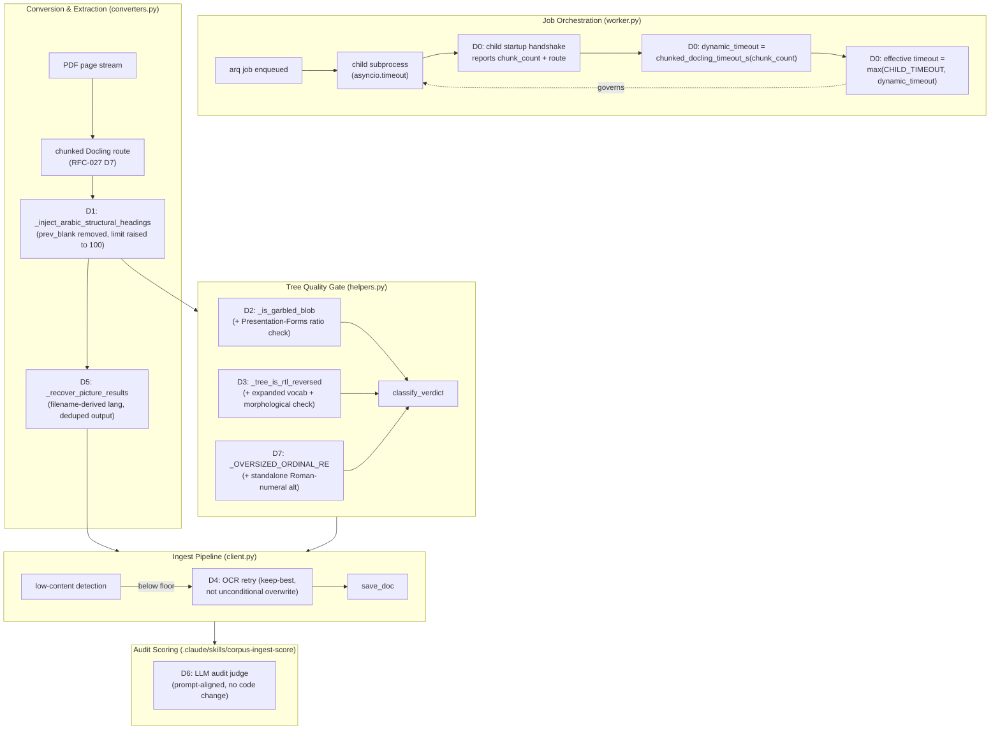
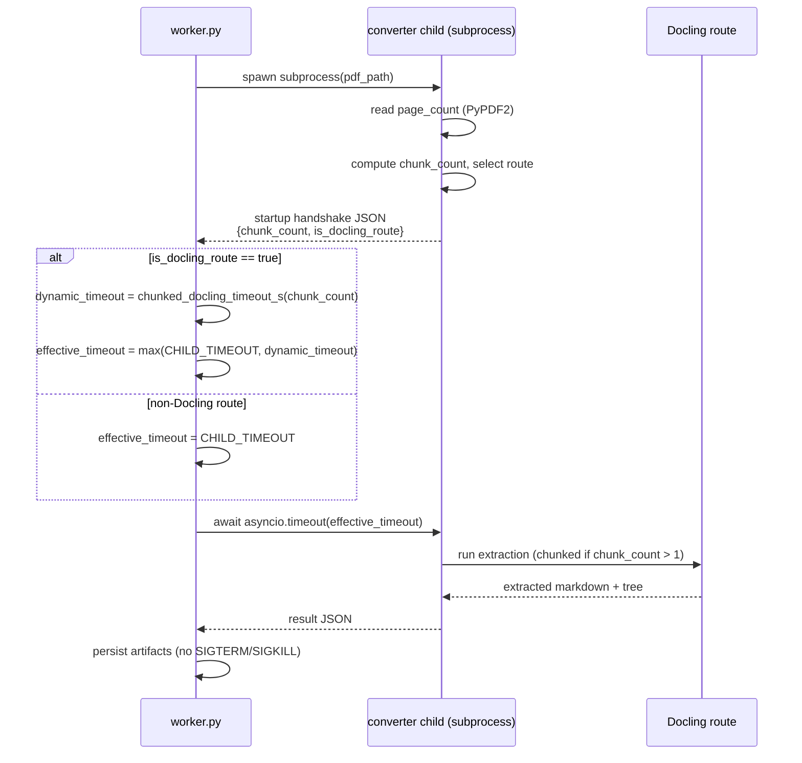
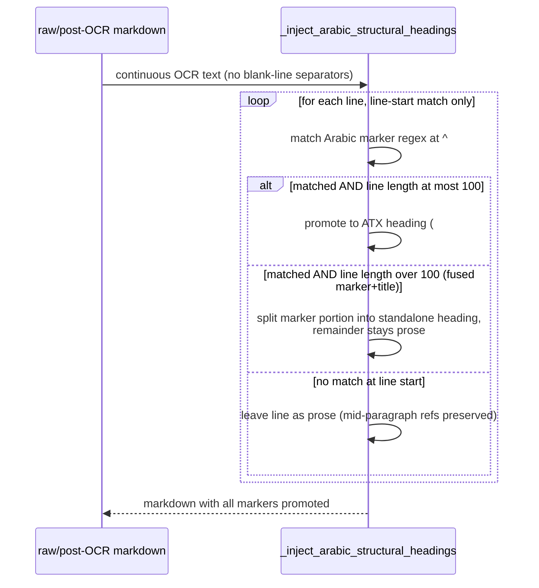
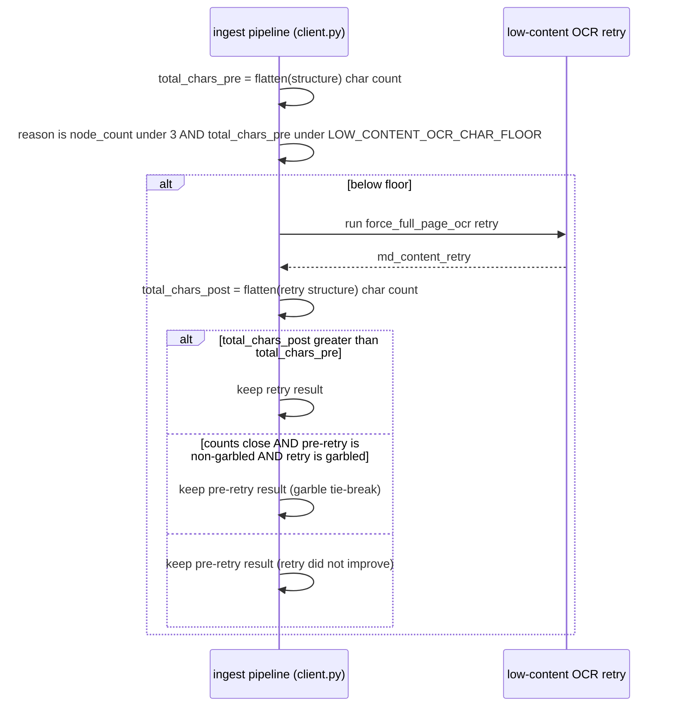
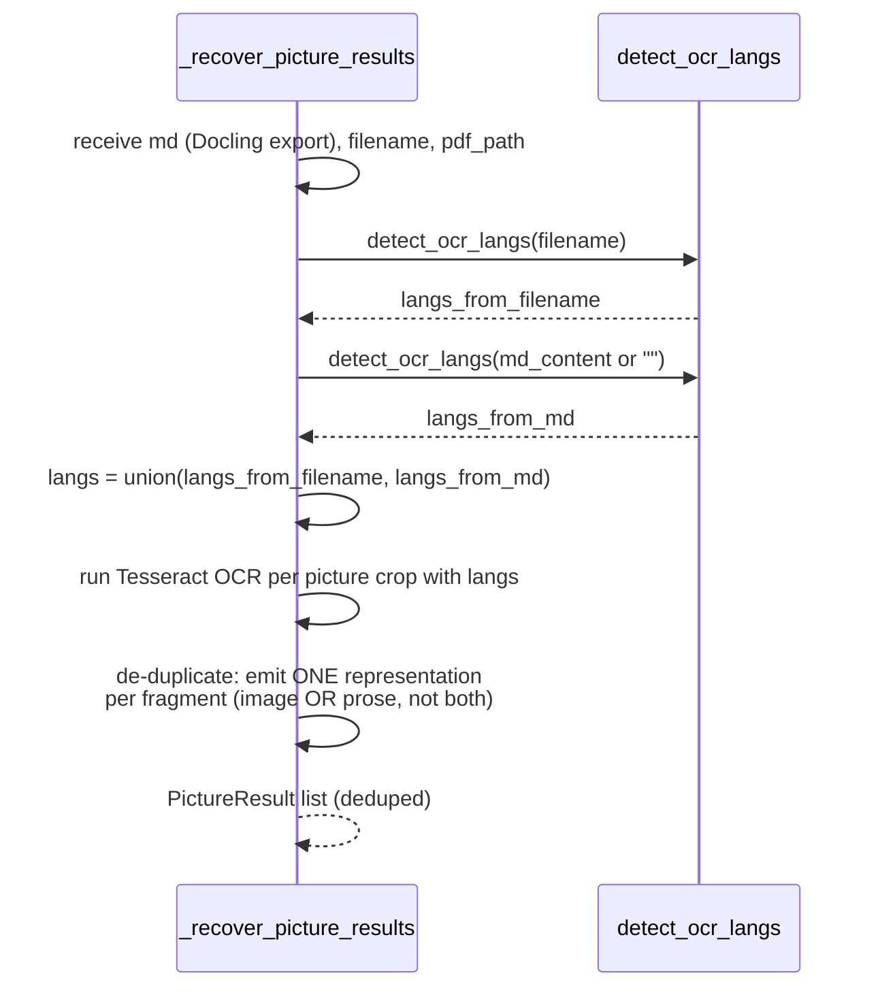
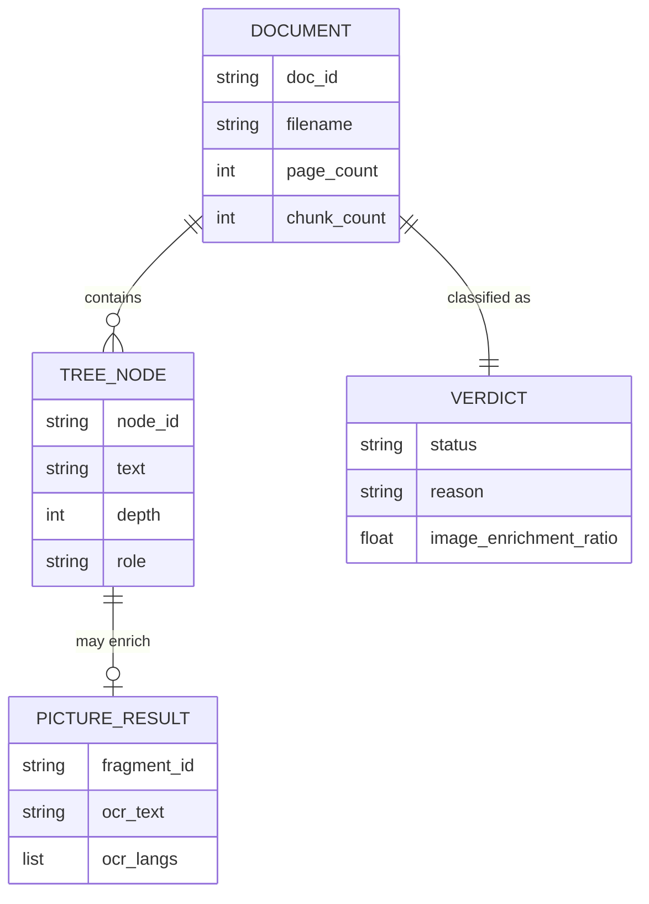

<!-- Space: CITRA -->

<!-- Title: Design Document: RFC-028 Run 11 Arabic Recovery, Garble Detection, and Timeout Wiring -->

<!-- Folder: Designs -->

# Design Document: RFC-028 Run 11 Arabic Recovery, Garble Detection, and Timeout Wiring

## Traceability

| Artifact                               | Reference                                                                                                                                                                                                        |
| -------------------------------------- | ---------------------------------------------------------------------------------------------------------------------------------------------------------------------------------------------------------------- |
| Governing RFC                          | [RFC-028: Run 11 Arabic Recovery, Garble Detection, and Timeout Wiring](../rfcs/028-run11-arabic-recovery-and-timeout-wiring.md)                                                                            |
| Audit report                           | [audit/CORPUS_REINGESTION_AUDIT_RUN-11.md](../../audit/CORPUS_REINGESTION_AUDIT_RUN-11.md)                                                                                                                        |
| Product requirements                   | [PRD.md § Quality Bar &amp; Acceptance Criteria](../../PRD.md#quality-bar--acceptance-criteria)                                                                                                                  |
| Architecture — tree gate              | [ARCHITECTURE.md § Tree Quality Gate](../../ARCHITECTURE.md#tree-quality-gate)                                                                                                                                   |
| Architecture — extraction             | [ARCHITECTURE.md § PDF Extraction Strategy](../../ARCHITECTURE.md#pdf-extraction-strategy)                                                                                                                       |
| Hard Rules (binding)                   | [CLAUDE.md § Hard Rules](../../CLAUDE.md#hard-rules) — Hard Rule 5 ("Never silently persist a low-quality tree") governs D1, D2, D3, D4; Hard Rule 4 (AGPL-3.0 awareness) constrains D0's timeout fallback path |
| Implementation Plan                    | [tasks-rfc028-run11-arabic-recovery-and-timeout-wiring.md](../tasks/tasks-rfc028-run11-arabic-recovery-and-timeout-wiring.md)                                                                                     |
| Prior cycle design (pattern precedent) | [design-rfc027-run10-extraction-gate-and-arabic-recovery.md](design-rfc027-run10-extraction-gate-and-arabic-recovery.md)                                                                                          |

## Overview

Run 11 is the first corpus cycle after RFC-027's extraction-gate and Arabic-recovery fixes landed. The headline result is positive — FAIL count dropped from 10 to 4, and five previously zero-content Arabic PDFs now yield real text — but two classes of defect remain: (1) a dead-code timeout bug where RFC-027's dynamic-timeout calculation function was written but never wired into `worker.py`, causing world-stats-pocketbook-2023.pdf to ERROR for the third consecutive run, and (2) two bugs in Arabic structural-heading injection (`prev_blank` guard, char-limit) that leave all five newly-recovered Arabic documents at MARGINAL with flat/depth-0 trees despite clean text. Layered on top are two garble-detection blind spots (Arabic Presentation Forms false-negative, RTL-reversal vocabulary insufficiency), an unconditional-overwrite bug in the low-content OCR retry that can regress already-low content, a wrong-language-source bug in picture OCR, a gate-vs-judge scoring-prompt misalignment, and a missing Roman-numeral ordinal pattern. This design covers all eight RFC-028 decisions (D0-D7); D6 is prompt-only and has no code-level architecture or correctness property, per the RFC's own scoping of that decision. No decision introduces a new verdict tier — every branch still resolves to `{"PASS", "MARGINAL", "FAIL"}` per the existing `classify_verdict()` contract.

## Key Design Principles

1. **Dynamic timeout computation is dead until it is called from the hot path** ([D0](../rfcs/028-run11-arabic-recovery-and-timeout-wiring.md#d0----wire-dynamic-timeout-into-worker-subprocess)): `chunked_docling_timeout_s()` existing in `converters.py` satisfies nothing on its own — RFC-027 task 4.2 marked this "complete" without wiring it into `worker.py`'s `asyncio.timeout()` call, which is the actual failure mode this RFC closes.
2. **Timeout extensions are floor-raising, never floor-lowering** ([D0](../rfcs/028-run11-arabic-recovery-and-timeout-wiring.md#d0----wire-dynamic-timeout-into-worker-subprocess)): `max(CHILD_TIMEOUT, dynamic_timeout)` ensures non-chunked documents keep their existing 1770s budget; only chunked PDFs above the chunking threshold get an extended budget.
3. **Structural marker promotion is gated on position, not on surrounding whitespace** ([D1](../rfcs/028-run11-arabic-recovery-and-timeout-wiring.md#d1----fix-arabic-structural-heading-injection-prev_blank--char-limit)): the `prev_blank` guard assumed OCR output preserves blank-line separators between structural markers, which scanned Arabic PDFs do not; the line-start regex anchor (`^`), not blank-line context, is what prevents mid-paragraph references from over-promoting.
4. **Garble judgment for a script belongs in the garble function, not the script-identification function** ([D2](../rfcs/028-run11-arabic-recovery-and-timeout-wiring.md#d2----arabic-presentation-forms-garble-detection)): `_infer_script` correctly classifies Arabic Presentation Forms as Arabic-script text (they are); the fact that heavy presentation-forms usage indicates font-encoded garble is a quality judgment that belongs solely in `_is_garbled_blob`, per the RFC's explicit note.
5. **Reversal detection must not depend solely on a fixed vocabulary** ([D3](../rfcs/028-run11-arabic-recovery-and-timeout-wiring.md#d3----expand-rtl-reversal-detection-vocabulary)): expanding `_AR_COMMON_WORDS` closes the observed gap but not the general one; a morphological (final/initial Arabic glyph-form) check gives a vocabulary-independent second signal so unseen domain vocabulary does not silently defeat reversal detection again.
6. **A recovery retry must only replace content it actually improves** ([D4](../rfcs/028-run11-arabic-recovery-and-timeout-wiring.md#d4----fix-3-ocr-retry-keep-best-instead-of-unconditional-overwrite)): the D2/Fix-3 low-content OCR retry exists to rescue near-zero-content documents; an unconditional overwrite turns a rescue mechanism into a regression mechanism when the retry itself underperforms the original extraction.
7. **OCR language selection must use a signal that survives near-empty input** ([D5](../rfcs/028-run11-arabic-recovery-and-timeout-wiring.md#d5----fix-ocr-language-detection-source-in-_recover_picture_results)): `detect_ocr_langs(md)` degrades to `['eng']` exactly when `md` is near-empty or all-digits — precisely the scanned-Arabic-PDF case this path exists to serve; the filename is a signal that does not degrade with extraction quality, matching the union pattern `client.py`'s escalation sites already use.
8. **Scoring-prompt alignment is not a substitute for a code-level gate, and vice versa** ([D6](../rfcs/028-run11-arabic-recovery-and-timeout-wiring.md#d6----gate-vs-judge-alignment-for-image-markers-in-hierarchical-docs)): `classify_verdict` already returns the correct `PASS` for federal_decree_law_no_33; the fix belongs entirely in the LLM audit-judge prompt, not as a redundant code-level exemption that risks under-penalizing genuine enrichment gaps elsewhere.
9. **Structural splitting on incidental tokens is a false-positive risk that must be guarded numerically, not heuristically** ([D7](../rfcs/028-run11-arabic-recovery-and-timeout-wiring.md#d7----add-standalone-roman-numeral-ordinal-splitting)): a bare `[IVX]+\.` pattern matches incidental prose ("I. went to the store"); requiring a minimum of two consecutive matches within the same oversized leaf is the guard, mirroring the existing strictly-increasing-run guard already used elsewhere in the ordinal splitter.

## Launch Constraints

- `_CHUNKED_DOCLING_PER_CHUNK_TIMEOUT_S` (D0), the Presentation-Forms ratio threshold `0.50` (D2), and the minimum-2-consecutive-matches Roman-numeral guard (D7) are corpus-calibrated constants shipped as code constants, matching the existing `PASS_MAX_LEAF_RATIO` / `MIN_FLAT_PROMOTION_CHARS` pattern in `helpers.py` — they are not (yet) environment-variable-overridable.
- `JOB_TIMEOUT` is an arq worker-level setting; raising it from 1800 to 3630 (D0) affects worst-case slot occupancy for every job processed by the worker, not only large chunked PDFs. This is an accepted, RFC-approved trade-off (see RFC-028 Risks).
- D3's morphological reversal check operates on Unicode presentation-form ranges only; it is not a full Arabic-script shaping engine and does not attempt to repair reversed text — it only flags it (repair remains `reconstruct_bidi_order`, landed under RFC-027 D3).
- D6 is a documentation/prompt-only change to the audit scoring pipeline (`.claude/skills/corpus-ingest-score`); it does not touch `src/`.
- No task in this RFC performs corpus ingestion, reingestion, or verification — those steps belong to the `corpus-cycle` skill, run separately after this plan lands (same operating constraint as RFC-027).

## Architecture

### High-Level System Architecture



### Architecture Decisions

<!-- Anchor note: headings below use an en dash (–) as the D-number separator, not a
     double hyphen, so their generated slugs are `dN--<slug>` (matching the exact
     anchors tasks-rfc028-run11-arabic-recovery-and-timeout-wiring.md links against) —
     do not "normalize" these to ASCII "--" or the cross-references will break. -->

#### D0 – Wire Dynamic Timeout into Worker Subprocess

**Delegate chunk-count computation to the converter child, not the worker** (RFC-028 [D0](../rfcs/028-run11-arabic-recovery-and-timeout-wiring.md#d0----wire-dynamic-timeout-into-worker-subprocess)): the worker never independently re-derives page count; it trusts the child's startup JSON handshake, which already reads page count at `converters.py:2318-2340` for routing. This avoids worker/child disagreement when PyPDF2 fails in one process but not the other, and gives a clean fallback (`CHILD_TIMEOUT`) when the child reports a non-Docling route.

#### D1 – Fix Arabic Structural Heading Injection

**Remove `prev_blank`, keep the line-start anchor** (RFC-028 [D1](../rfcs/028-run11-arabic-recovery-and-timeout-wiring.md#d1----fix-arabic-structural-heading-injection-prev_blank--char-limit)): the alternative — requiring some other separator heuristic (e.g. sentence-boundary detection) — was rejected as unnecessary complexity; the existing `^`-anchored regex match already prevents mid-paragraph promotion, so `prev_blank` was redundant and actively harmful for continuous OCR output.

#### D2 – Arabic Presentation-Forms Garble Detection

**Presentation-Forms check is additive to `_is_garbled_blob`, not a replacement for the PUA check** (RFC-028 [D2](../rfcs/028-run11-arabic-recovery-and-timeout-wiring.md#d2----arabic-presentation-forms-garble-detection)): both checks address distinct garble signatures (private-use-area glyphs vs. positional Arabic glyph variants) and are evaluated independently; the RFC considered folding both into one generic "non-logical-Unicode ratio" check but rejected it because the failure signatures and safe thresholds differ per range.

#### D3 – Expand RTL Reversal Detection Vocabulary

**Morphological check is combined with vocabulary score via OR, not AND** (RFC-028 [D3](../rfcs/028-run11-arabic-recovery-and-timeout-wiring.md#d3----expand-rtl-reversal-detection-vocabulary)): either signal independently indicating reversal is sufficient to flag a tree as `rtl_reversed`, because the vocabulary gap (RFC-028's root cause) and the morphological gap are largely orthogonal failure modes — requiring both to agree would re-introduce the same class of false-negative this RFC closes.

#### D4 – OCR Retry Keep-Best

**Keep-best uses `total_chars` as primary signal, garble as tie-break only** (RFC-028 [D4](../rfcs/028-run11-arabic-recovery-and-timeout-wiring.md#d4----fix-3-ocr-retry-keep-best-instead-of-unconditional-overwrite)): a strict "prefer non-garbled" primary rule was rejected because garble detection itself has known blind spots (D2, D3 exist because of this); char-count is the more robust primary signal, with garble as a secondary tie-break only when counts are close, per the RFC's explicit risk mitigation.

#### D5 – Fix OCR Language Detection Source

**Filename is a signal that does not degrade with extraction quality** (RFC-028 [D5](../rfcs/028-run11-arabic-recovery-and-timeout-wiring.md#d5----fix-ocr-language-detection-source-in-_recover_picture_results)): `detect_ocr_langs(md)` degrades to `['eng']` exactly when `md` is near-empty or all-digits — precisely the scanned-Arabic-PDF case this path exists to serve. Threading `filename` into `_recover_picture_results` and unioning with the `md`-derived langs matches the existing pattern already used at `client.py`'s OCR-escalation call sites, so this decision is a consistency fix, not a new pattern.

#### D6 – Gate-vs-Judge Alignment for Image Markers

**Prompt-only fix, no code-level property** (RFC-028 [D6](../rfcs/028-run11-arabic-recovery-and-timeout-wiring.md#d6----gate-vs-judge-alignment-for-image-markers-in-hierarchical-docs)): `classify_verdict` already returns `PASS` correctly for federal_decree_law_no_33 (502 nodes, 110k chars, decorative unenriched image markers); the gap is entirely in the LLM audit-judge prompt used by the scoring pipeline (`.claude/skills/corpus-ingest-score`), which downgrades to MARGINAL for markers the code-level gate already tolerates. Because this decision does not change `src/`, it has no entry in [Correctness Properties](#correctness-properties) and no unit-test task — it is validated via the audit scoring pipeline's judge output, not `pytest`.

#### D7 – Roman-Numeral Ordinal Splitting

**Require a minimum of 2 consecutive matches, not a single-token heuristic** (RFC-028 [D7](../rfcs/028-run11-arabic-recovery-and-timeout-wiring.md#d7----add-standalone-roman-numeral-ordinal-splitting)): a bare `[IVX]+\.` alternative alone would false-positive on incidental prose (e.g. "I. went to the store"); gating the split on 2+ consecutive matches within the same oversized leaf mirrors the existing strictly-increasing-run guard already used elsewhere in the ordinal splitter, rather than introducing a new heuristic class.

### Deployment Architecture

- **Backend**: FastMCP server (single process, port 8201) + separate `arq` worker process, unchanged by this RFC.
- **Database**: N/A — document trees persist as JSON in MinIO; no relational store.
- **Object Storage**: MinIO (`uploads/`, `processed/*.json`, `processed/*.meta.json`) — unchanged.
- **Task Queue**: `arq` with Redis broker — `JOB_TIMEOUT` raised 1800 → 3630 (D0); `MAX_JOBS = 1` per worker unchanged.
- **Event Bus**: N/A — arq job queue is the only async dispatch mechanism.

### Communication Patterns

| Pattern                            | Use Case                                                                                  | Technology                                                |
| ---------------------------------- | ----------------------------------------------------------------------------------------- | --------------------------------------------------------- |
| arq job enqueue/dequeue            | Async PDF ingestion jobs                                                                  | Redis-backed arq queue                                    |
| Subprocess + JSON stdout handshake | Worker ↔ converter child communication (chunk_count, route)                              | `asyncio.create_subprocess_exec` + JSON line protocol   |
| Synchronous function call          | Tree quality gate (`classify_verdict`, `_is_garbled_blob`, `_tree_is_rtl_reversed`) | In-process Python calls within`client.py`'s ingest flow |

### Sequence Diagrams

#### Dynamic Timeout Wiring Flow (D0)



#### Arabic Heading Injection Flow (D1)



#### OCR Retry Keep-Best Flow (D4)



#### OCR Language Detection Flow (D5)



## Service Contracts

### 1. Worker (`worker.py`)

**Responsibility**: Dequeue arq jobs, spawn the converter child subprocess per document, and enforce timeout/memory bounds around that subprocess.
**Database**: N/A (Redis-backed arq queue only; no owned tables).

```python
# Internal entry points (not HTTP — arq task functions)
process_document(ctx, job_payload)  # arq task: spawns child subprocess, applies effective timeout
```

**Internal Interfaces**:

- Spawns the converter child subprocess and reads its startup JSON handshake (`chunk_count`, `is_docling_route`) — D0.
- Imports `chunked_docling_timeout_s` from `converters.py` and computes `effective_timeout = max(CHILD_TIMEOUT, chunked_docling_timeout_s(chunk_count))` before entering `asyncio.timeout(...)` — D0.
- Falls back to `CHILD_TIMEOUT` unconditionally when the child reports a non-Docling route — D0.
- `JOB_TIMEOUT` (arq worker-level `job_timeout` setting) raised from `1800` to `3630` to statically accommodate the new dynamic maximum — D0.

### 2. Converters (`converters.py`)

**Responsibility**: PDF → markdown/tree extraction, including Docling routing, Arabic structural-heading injection, and picture-region OCR recovery.
**Database**: N/A (stateless conversion functions).

```python
# Key functions touched by this RFC (not HTTP endpoints — internal library functions)
chunked_docling_timeout_s(chunk_count: int) -> int          # D0: existing, now actually called by worker.py
_inject_arabic_structural_headings(md: str) -> str            # D1: prev_blank removed, limit 60 -> 100
_recover_picture_results(md: str, document, pdf_path: str, filename: str) -> list[PictureResult]  # D5: filename threaded in
_AR_COMMON_WORDS: frozenset[str]                                # D3: expanded with governance/legal terms
```

**Internal Interfaces**:

- `_CHUNKED_DOCLING_PER_CHUNK_TIMEOUT_S` raised from `600` to `1500`, yielding `chunked_docling_timeout_s(2) = 3300s` — D0.
- Startup JSON handshake extended to report `chunk_count` and route type to the parent worker process — D0.
- `_inject_arabic_structural_headings` promotes markers regardless of preceding blank-line context; splits fused marker+title lines exceeding 100 chars into a standalone heading plus remaining prose — D1.
- `_recover_picture_results` receives `filename` and calls `detect_ocr_langs(filename)` unioned with `detect_ocr_langs(md_content or "")` instead of `detect_ocr_langs(md)` alone; de-duplicates the `role:"image"` + `role:"prose"` splice pair per fragment — D5.
- `_AR_COMMON_WORDS` (consumed cross-module by `helpers.py`'s `_tree_is_rtl_reversed`) expanded with governance/legal vocabulary (حوكمة, بيانات, سياسة, إدارة, تنظيم, قرار, وزارة, لائحة, تنفيذية, مرسوم) — D3.

### 3. Helpers (`helpers.py`)

**Responsibility**: Tree quality gate — garble detection, RTL-reversal detection, verdict classification, oversized-leaf splitting.
**Database**: N/A (stateless gate functions).

```python
# Key functions touched by this RFC (not HTTP endpoints — internal library functions)
_is_garbled_blob(blob: str, expected_script: str | None = None) -> bool   # D2: + Presentation-Forms ratio check
_tree_is_rtl_reversed(nodes: list) -> bool                                  # D3: + morphological reversal check
_OVERSIZED_ORDINAL_RE: re.Pattern                                            # D7: + standalone Roman-numeral alt
_ordinal_value(m: "re.Match[str]") -> tuple[int, ...]                       # D7: + Roman-numeral parse via _roman_to_int
classify_verdict(...) -> tuple[str, str]                                    # D6: verified unchanged (no code fix needed)
```

**Internal Interfaces**:

- `_is_garbled_blob`, after the existing PUA (U+E000-F8FF) check, adds a Presentation-Forms check: count chars in U+FB50-FDFF and U+FE70-FEFF; if the ratio of presentation-forms chars to total Arabic-range chars exceeds `0.50`, return `True` — D2.
- `_infer_script` (helpers.py:961-976) is explicitly left unchanged — script identification correctly counts presentation forms as Arabic-script; only the garble judgment moves — D2.
- `_tree_is_rtl_reversed` gains a character-level morphological check (final-form Arabic glyphs at word start, initial-form at word end) as a vocabulary-independent signal, OR-combined with the existing `_arabic_readability_score`-based vocabulary signal — D3.
- `_OVERSIZED_ORDINAL_RE` gains a standalone Roman-numeral alternative (`[IVX]+\.\s`), distinct from the existing `Part [IVX]+` compound-marker pattern, gated on a minimum of 2 consecutive matches within the same oversized leaf before splitting — D7.
- `classify_verdict` is verified, not modified, for D6 — the existing `image_enrichment_promoted` gate already returns `PASS` correctly for hierarchical docs with decorative unenriched image markers.

### 4. Client (`client.py`)

**Responsibility**: End-to-end ingest orchestration — converter invocation, low-content OCR retry/escalation, tree persistence via `save_doc`.
**Database**: MinIO (`processed/*.json`, `processed/*.meta.json`) via `save_doc`.

```python
# Internal entry points (not HTTP — ingest orchestration functions)
process_and_save(file_path: str, ...)  # low-content OCR retry path (lines ~974-1046), D4
```

**Internal Interfaces**:

- Snapshots pre-retry `total_chars` (from the tree/flat structure) before running the low-content OCR retry; compares post-retry `total_chars` against the snapshot; keeps whichever result has more content, with `_is_garbled_blob` as a secondary tie-break when counts are close — D4.
- Existing union pattern `detect_ocr_langs(filename)` ∪ `detect_ocr_langs(md_content or "")` at the OCR-escalation call sites (lines ~1002-1004, ~1171-1173) is unchanged by this RFC; D5 brings `_recover_picture_results` in `converters.py` up to the same pattern.
- Calls `classify_verdict` at the existing call site (line ~1518) — unchanged by D6; the fix is entirely in the audit-judge prompt, not this call site.

## Data Models

### Entity Relationship Diagram



### Core Entities (Worker / Converter — no owned DB, MinIO-persisted JSON)

```python
class ChildHandshake:
    chunk_count: int          # D0: reported by converter child at startup
    is_docling_route: bool    # D0: governs worker's timeout fallback decision

class PictureResult:
    fragment_id: str
    ocr_text: str
    ocr_langs: list[str]      # D5: now derived from filename ∪ md, not md alone
    role: str                  # "image" | "prose" — D5: exactly one persisted per fragment post-dedup

class Verdict(str, Enum):
    PASS = "PASS"
    MARGINAL = "MARGINAL"
    FAIL = "FAIL"
```

## Correctness Properties

*A property is a characteristic or behavior that should hold true across all valid executions of the system — a formal statement about what the system should do. Properties serve as the bridge between human-readable specifications and machine-verifiable correctness guarantees. D6 (RFC-028) has no code-level property — it is a prompt-only change validated via the audit scoring pipeline, not `pytest`.*

### Property 1: Dynamic timeout scales with chunk count

*For any* document whose converter child reports `chunk_count = N` on a Docling route, system SHALL compute `effective_timeout = max(CHILD_TIMEOUT, chunked_docling_timeout_s(N))`, and *for any* document whose child reports a non-Docling route, system SHALL use `effective_timeout = CHILD_TIMEOUT` unconditionally.

**Validates: [RFC-028 D0](../rfcs/028-run11-arabic-recovery-and-timeout-wiring.md#d0----wire-dynamic-timeout-into-worker-subprocess)**

### Property 2: Arabic heading injection promotes all markers regardless of blank-line context

*For any* markdown line matching the Arabic structural-marker regex at line start (`^`), system SHALL promote it to an ATX heading regardless of whether the preceding line was blank, and SHALL NOT promote any line where the marker match does not begin at the line start.

**Validates: [RFC-028 D1](../rfcs/028-run11-arabic-recovery-and-timeout-wiring.md#d1----fix-arabic-structural-heading-injection-prev_blank--char-limit)**

### Property 3: Presentation-Forms ratio triggers garble detection

*For any* text blob where the ratio of Arabic Presentation Forms characters (U+FB50-FDFF, U+FE70-FEFF) to total Arabic-range characters exceeds `0.50`, `_is_garbled_blob` SHALL return `True`; *for any* blob at or below that ratio (holding all other garble signals constant), it SHALL NOT trigger this specific check.

**Validates: [RFC-028 D2](../rfcs/028-run11-arabic-recovery-and-timeout-wiring.md#d2----arabic-presentation-forms-garble-detection)**

### Property 4: RTL-reversal detection is vocabulary and morphology aware

*For any* Arabic tree whose title text is reversed, system SHALL flag it via `_tree_is_rtl_reversed` returning `True` if EITHER the vocabulary-based readability score OR the morphological (final/initial glyph-form position) check indicates reversal; *for any* correctly-ordered Arabic tree with valid morphology, system SHALL NOT flag it as reversed regardless of vocabulary coverage.

**Validates: [RFC-028 D3](../rfcs/028-run11-arabic-recovery-and-timeout-wiring.md#d3----expand-rtl-reversal-detection-vocabulary)**

### Property 5: OCR retry keeps result with more content

*For any* low-content-triggered OCR retry, system SHALL persist the result (pre-retry or post-retry) with the greater `total_chars`, and *for any* near-tie in `total_chars`, SHALL prefer the non-garbled result (per `_is_garbled_blob`) as a secondary tie-break.

**Validates: [RFC-028 D4](../rfcs/028-run11-arabic-recovery-and-timeout-wiring.md#d4----fix-3-ocr-retry-keep-best-instead-of-unconditional-overwrite)**

### Property 6: Picture OCR language is filename-derived, not markdown-derived

*For any* call to `_recover_picture_results`, system SHALL derive the Tesseract language list from `detect_ocr_langs(filename)` unioned with `detect_ocr_langs(md_content or "")`, and SHALL NOT rely solely on `detect_ocr_langs(md)` when `md` is near-empty or all-digits.

**Validates: [RFC-028 D5](../rfcs/028-run11-arabic-recovery-and-timeout-wiring.md#d5----fix-ocr-language-detection-source-in-_recover_picture_results)**

### Property 7: Roman-numeral ordinal markers are detected and split

*For any* oversized leaf node containing 2 or more consecutive standalone Roman-numeral markers (e.g. "I. ", "II. ", "III. "), `_OVERSIZED_ORDINAL_RE` SHALL match all of them and `split_oversized_leaf_nodes` SHALL split the node accordingly; *for any* leaf containing fewer than 2 such matches, system SHALL NOT trigger a split on this pattern alone.

**Validates: [RFC-028 D7](../rfcs/028-run11-arabic-recovery-and-timeout-wiring.md#d7----add-standalone-roman-numeral-ordinal-splitting)**

## Error Handling

### Error Categories & Responses

| Category                            | Surface                        | Response Format                                                       | Retry Strategy                                            |
| ----------------------------------- | ------------------------------ | --------------------------------------------------------------------- | --------------------------------------------------------- |
| Child subprocess timeout            | arq job                        | `asyncio.TimeoutError` → SIGTERM then SIGKILL, job marked failed   | arq's built-in job retry (unchanged by this RFC)          |
| Low-quality tree                    | `save_doc` gate              | `low_quality_tree` arq error (per CLAUDE.md Hard Rule 5)            | No auto-retry; surfaces to corpus audit for manual triage |
| OCR retry underperformance          | `client.py` ingest flow      | Keep-best comparison (D4) — not an error, a silent no-op replacement | N/A — resolved in-process, no retry needed               |
| Non-Docling route reported by child | `worker.py` D0 timeout logic | Falls back to`CHILD_TIMEOUT` unconditionally                        | N/A — deterministic fallback, no retry                   |

### Service-Specific Error Handling

**Worker (`worker.py`):**

- Child reports `chunk_count = 0` or handshake read fails → treat as non-Docling route, fall back to `CHILD_TIMEOUT` (D0 risk mitigation for PyPDF2 read failures).
- `JOB_TIMEOUT` raise (1800 → 3630) extends worst-case slot occupancy for every job, not only large chunked PDFs; accepted trade-off per RFC-028 Risks — monitor arq queue depth after landing, add a second worker replica if queue depth becomes a concern.

**Converters (`converters.py`):**

- `_inject_arabic_structural_headings` fused marker+title split (D1) must not drop the remaining prose text — split output is `heading_line + "\n" + remaining_prose`, never a silent truncation.
- `_recover_picture_results` filename-derivation (D5) falls back to the existing `md`-derived langs when filename yields no language signal (e.g. a generic filename with no Arabic/script hint), preserving prior behavior for non-degenerate cases.

**Helpers (`helpers.py`):**

- D2's Presentation-Forms check only evaluates when there is a non-trivial Arabic-range character count in the blob (avoids division-by-zero / false triggers on non-Arabic text).
- D7's minimum-2-consecutive-matches guard is load-bearing — a single Roman-numeral-shaped token in prose must not trigger a structural split (RFC-028 Risks).

### Circuit Breaker Configuration

Not applicable — this RFC does not introduce new external service calls; Tesseract OCR and Docling invocations remain synchronous in-process/subprocess calls governed by the existing timeout mechanisms (D0).

### Inter-Service Communication Failure Modes

| Scenario                                                | Handling                                                             |
| ------------------------------------------------------- | -------------------------------------------------------------------- |
| Converter child dies before handshake JSON is written   | Worker treats as non-Docling route, uses`CHILD_TIMEOUT` (D0)       |
| Child reports`chunk_count` but crashes mid-extraction | arq's existing SIGTERM/SIGKILL + job-retry semantics apply unchanged |

## Testing Strategy

### Testing Layers

1. **Unit Tests**: Cover each of the 7 in-scope correctness properties (D0-D5, D7) plus edge cases (near-tie char counts for D4, non-Docling fallback for D0, mid-paragraph non-promotion for D1, false-positive guards for D2/D7).
2. **Regression Tests**: Re-run RFC-027's Arabic-path and timeout tests (`tests/test_rfc027_d3.py`, `tests/test_rfc027_d4.py`, `tests/test_rfc027_d7.py`) to confirm no regression from D0/D1/D3's changes to shared functions.
3. **Integration Tests**: D0's dynamic-timeout wiring validated against a real 292-page document (world-stats-pocketbook-2023.pdf) completing without SIGTERM/SIGKILL; D6's prompt change validated via the audit scoring pipeline (not `pytest`) against federal_decree_law_no_33.
4. **Corpus Verification**: Explicitly out of scope for this plan's tasks — corpus ingestion/reingestion/scoring runs separately via the `corpus-cycle` skill after this plan lands.

### Property-Based Testing Configuration

Not applicable — matching RFC-027's precedent, this RFC follows the project's established pattern of boundary-value unit tests over property-based generation, given the small, discrete input domains (char-count thresholds, ratio thresholds, node-count integers, regex match counts). No Hypothesis (or equivalent) harness is introduced.

### Test Categories by Service

| Service                | Properties           | Unit Tests                                                                            | Integration Tests                                       |
| ---------------------- | -------------------- | ------------------------------------------------------------------------------------- | ------------------------------------------------------- |
| `worker.py`          | 1                    | `tests/test_rfc028_d0.py`                                                           | world-stats-pocketbook completion (manual/corpus-cycle) |
| `converters.py`      | 1, 2, 6              | `tests/test_rfc028_d0.py`, `tests/test_rfc028_d1.py`, `tests/test_rfc028_d5.py` | N/A                                                     |
| `helpers.py`         | 3, 4, 7              | `tests/test_rfc028_d2.py`, `tests/test_rfc028_d3.py`, `tests/test_rfc028_d7.py` | N/A                                                     |
| `client.py`          | 5                    | `tests/test_rfc028_d4.py`                                                           | N/A                                                     |
| Audit scoring pipeline | — (D6, no property) | N/A                                                                                   | federal_decree_law_no_33 judge-prompt validation        |

### Key Test Scenarios

**Critical Path Tests:**

1. World-stats-pocketbook-2023.pdf (292 pages) completes processing end-to-end without SIGTERM/SIGKILL under the D0 dynamic timeout.
2. A representative Arabic legal document (e.g. marsoom 33-style continuous-OCR fixture) reaches depth ≥ 2 after D1's heading-injection fix, versus depth 0-1 before.

**Edge Cases:**

- D0: child reports `chunk_count = 0` (PyPDF2 read failure) → `max(1770, 1800) == 1800`, preserving existing non-chunked behavior.
- D1: a mid-paragraph reference to a marker (not at line start) is NOT promoted, confirming the line-start anchor holds after `prev_blank` removal.
- D2: a blob with logical-order Arabic Unicode only (no presentation forms) does not false-positive on the new check.
- D3: correctly-ordered Arabic text with zero vocabulary matches but valid morphology does not false-positive from the morphological check alone.
- D4: a near-tie in char count where the pre-retry result is non-garbled and the retry result is garbled — pre-retry result wins.
- D7: a single incidental "I. went to the store" with no other Roman-numeral markers does not trigger a split (minimum-2-matches guard).
