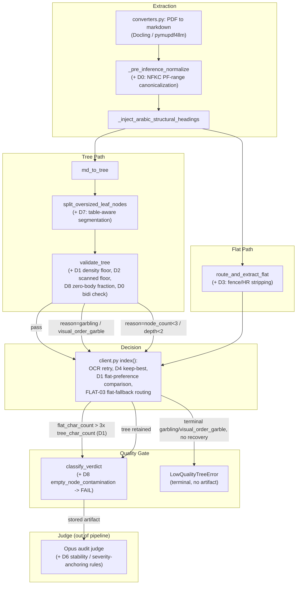
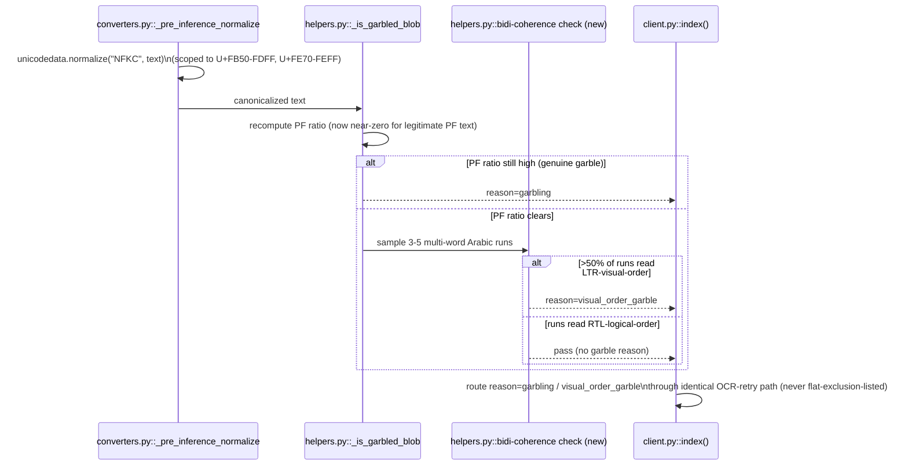

<!-- Space: CITRA -->
<!-- Title: Design Document: RFC-029 Run 12 Arabic Garble-Gate Fixes, Thin-Tree Density Gate, and Extraction Quality Improvements -->
<!-- Folder: Designs -->

# Design Document: RFC-029 Run 12 Arabic Garble-Gate Fixes, Thin-Tree Density Gate, and Extraction Quality Improvements

## Traceability

| Artifact | Reference |
|---|---|
| Governing RFC(s) | [RFC-029: Run 12 Arabic garble-gate fixes, thin-tree density gate, and extraction quality improvements](../rfcs/029-run12-arabic-garble-gates-and-extraction-quality.md) |
| Audit | [audit/CORPUS_REINGESTION_AUDIT_RUN-12.md](../../audit/CORPUS_REINGESTION_AUDIT_RUN-12.md) |
| Implementation Plan | [tasks-rfc029-run12-arabic-garble-gates-and-extraction-quality.md](../tasks/tasks-rfc029-run12-arabic-garble-gates-and-extraction-quality.md) |
| Hard Rules (binding) | [CLAUDE.md § Hard Rules](../../CLAUDE.md#hard-rules) |

## Overview

Run 12 re-audited all 25 corpus documents against the pipeline landed by RFC-028 and found 10 PASS / 10 MARGINAL / 4 FAIL / 1 ERROR, with four regressions and two gate holes not caught by `validate_tree`/`classify_verdict`. This design covers nine decisions (D0-D8) split across two subsystems: (1) the Arabic garble-gate and tree-vs-flat routing path in `helpers.py`/`client.py`/`converters.py` (D0, D1, D2, D8), which decides whether an extraction is trustworthy and which representation (tree vs. flat) is retained; and (2) extraction-quality improvements that are orthogonal to the gate (D3 fence/HR stripping, D4 table dedup, D5 picture-context retention, D7 table-aware node segmentation) plus a judge-calibration text change (D6) that is not a code change at all. The design's job is to specify exact signatures, decision order, and correctness properties so the nine fixes compose without reopening any of the four regressions the audit found.

## Key Design Principles

1. **Gate hardening never widens the routing exclusion list silently**: every new `reason=` value introduced by this RFC (`visual_order_garble`, `empty_node_contamination`) must be explicitly classified as terminal (raises `LowQualityTreeError`, no flat fallback) or recoverable (routes through the existing OCR-retry / flat-fallback paths) — never left to fall through to whichever branch happens to match, per CLAUDE.md Hard Rule 5.
2. **Normalize before you judge**: NFKC canonicalization (D0) must run before any garble-ratio check, so downstream consumers (garble gate, density gate, judge) always see canonical text. Ordering violations (checking pre-normalized text) are the root cause of the D0 regression this RFC fixes.
3. **Additive gates, not replaced gates**: D1 (thin-tree density) and D2 (scanned-density floor) both add new failure conditions to `validate_tree`/`classify_verdict`; neither replaces the RFC-028 structural checks (`node_count>=3`, `depth>=2`, PF-ratio garble check). A document must clear the union of old and new checks.
4. **Volume is not a quality signal**: D2 and D8 both encode the same underlying principle — more characters or more nodes is not evidence of a better extraction. Both introduce a *density* or *fraction* check (chars-per-page, zero-body-node fraction) that cannot be defeated by sheer output volume.
5. **Pure-filter fixes stay pure**: D3 (fence/HR stripping) and D4 (table dedup) must not alter meaningful content — they are lossless rendering-format fixes. Any ambiguity is resolved by preferring to retain content over removing it (e.g., D4 requires ALL columns byte-identical, not just any two, before collapsing).
6. **Deferred risk is isolated, not blocked on**: D5(c) (chart-page synthesis heuristic) is the highest-risk item in the RFC. It must be structurally independent (own env var gate, own batch) so D5(a)/D5(b) can land and be evaluated without waiting on or being blocked by D5(c)'s calibration.
7. **Judge calibration is verified, not assumed**: D6 requires a Phase-A JSON diff to confirm byte-identity before any calibration text is added to the skill files (Phase B). A calibration rule built on an unverified premise could mask a genuine regression.

## Launch Constraints

- All nine decisions are implemented as code + unit/property tests only in this plan. Corpus re-ingestion, re-scoring, and artifact regeneration are explicitly out of scope and handled by the separate `corpus-cycle` / `corpus-ingest-score` workflow after this plan lands.
- D5(c) ships behind an opt-in environment variable and is not enabled by default; D1's 3x flat-preference threshold and D2's `MIN_SCANNED_DENSITY_FLOOR` are also env-var-tunable per the RFC's stated mitigation, so thresholds can be recalibrated without a code change.
- No decision in this RFC may downgrade a currently-PASS corpus document; every threshold-introducing task (D1, D2, D8) carries a mandatory regression test against all 10 current PASS docs' metric shapes.

## Architecture

### High-Level Pipeline Flow



### Architecture Decisions

**D0 — NFKC-normalize Arabic Presentation Forms before garble check** (RFC-029 D0): Add NFKC normalization scoped to the Arabic Presentation Forms ranges inside `_pre_inference_normalize`, ahead of `md_to_tree`/`validate_tree`, so the PF-ratio garble check never fires on canonically-encoded-but-legitimately-PF-rendered Arabic. Because NFKC does not reorder visual-order glyph runs, pair it with a new bidi-coherence sampler that flags `reason=visual_order_garble` when normalized text still reads in the wrong logical direction. Rejected alternative: raising or removing the PF-ratio threshold outright — this would simply reopen the RFC-028 D2 garble hole for genuinely garbled font-encoded PDFs.

**D1 — Content-density gate: prefer flat over thin trees** (RFC-029 D1): Add a chars-per-node floor to `validate_tree` and a flat-vs-tree char-count comparison in `client.py::index()`; when flat output exceeds 3x the tree's char count, or the tree falls under ~500 chars/node, prefer flat. Rejected alternative: tightening `_inject_arabic_structural_headings`'s injection criteria directly — this was considered but deferred because it risks reopening the RFC-028 injection fix for genuinely shallow (but real) Arabic tree structures; a content-density comparison is a more direct measure of information loss.

**D2 — Post-OCR garble dilution: density floor for scanned Arabic PDFs** (RFC-029 D2): Thread `page_count` into `validate_tree`/`classify_verdict` and add a `chars_per_page < MIN_SCANNED_DENSITY_FLOOR` check plus an Arabic-content-ratio heuristic, so OCR volume growth cannot dilute a genuinely garbled (repeating-token) scan below the existing ratio-based thresholds. Rejected alternative: reverting RFC-028 D5's `ara` Tesseract lang addition — rejected because that fix is net-positive for other Arabic docs; the correct fix is hardening the gate that the volume increase defeated, not the OCR improvement that caused it.

**D3 — Strip fence markers and HR separators in flat extraction** (RFC-029 D3): Pure filter added to `route_and_extract_flat`'s while loop: toggle an `in_fence` state on ` ``` ` lines and skip `---`/`===`/`***` thematic-break lines without emitting a prose block. No alternative considered — this is uncontested noise removal.

**D4 — Post-export table deduplication for Docling char inflation** (RFC-029 D4): A repair pass runs after every `export_to_markdown()` call site, collapsing pipe-table rows where ALL columns are byte-identical (with a >3-column-count guard) and stripping GFM alignment padding. Rejected alternative: patching Docling itself — out of scope, Docling is a third-party dependency; a post-export repair pass is the only tractable fix at this layer.

**D5 — Retain chart image context when picture skip-gates fire** (RFC-029 D5): Three layered, independently-deferrable fixes: (a) retain `png_bytes`/`clip_text` in `_recover_picture_text` instead of discarding them on skip, and stop `splice_figure_markers` from stripping markers that carry retained context; (b) copy Docling's extracted `md_content` into the synthetic `PictureResult.ocr_text` for standalone images instead of leaving it empty; (c) a new post-Docling low-text-density heuristic that synthesizes `PictureItem` regions for vector-chart pages Docling's layout model misses entirely. (a) and (b) are low-risk plumbing; (c) is gated behind an opt-in env var precisely because false-positive picture synthesis on legitimately sparse pages is a real risk the RFC flags as the highest-risk item in the set.

**D6 — LLM judge calibration: stability and severity anchoring** (RFC-029 D6): Not a code change — two calibration rules added to `.claude/skills/corpus-ingest-score/SKILL.md`'s Judge Verdict guidance (stability rule, severity-anchoring rule), contingent on a Phase-A JSON diff confirming the flagged documents are genuinely byte-identical across runs. Rejected alternative: applying the calibration rules unconditionally — rejected per the RFC's explicit verification prerequisite, since an unverified premise could mask a real table-header regression.

**D7 — Tree-builder table-aware node segmentation** (RFC-029 D7): Extend `split_oversized_leaf_nodes` (or add a sibling function) to detect `|---|---|` pipe-table boundaries inside a node body and split prose from table content into separate nodes when the node exceeds ~2000 chars and the table has >5 rows, run before `validate_tree`. Rejected alternative: lowering the existing 50k-char `split_oversized_leaf_nodes` threshold globally — rejected because it is not table-aware and would split large prose-only nodes unnecessarily; the fix must specifically target the prose+table mixing pattern.

**D8 — Cross-document contamination gate for zero-body-text node clusters** (RFC-029 D8): Add a zero-body-text non-root-node fraction check to `validate_tree` (`reason=empty_node_contamination` above a 30% threshold, calibrated to leaf nodes as the stronger signal) and have `classify_verdict` treat it as a hard FAIL, closing the gate hole that let a 53%-contaminated tree score PASS. Rejected alternative: cross-document embedding/similarity comparison to detect contamination directly — rejected as disproportionate; the zero-body-node-cluster heuristic catches the observed contamination pattern without needing a second document corpus to compare against.

### Flow: NFKC then bidi check



### Deployment Architecture

- **Runtime**: unchanged — FastMCP server (port 8201) + arq worker as a separate process. This RFC modifies extraction/gate logic in `pageindex_mcp.converters`, `pageindex_mcp.helpers`, and `pageindex_mcp.client`, all imported by both the server and the worker process; no new services, queues, or storage buckets are introduced.
- **Object Storage**: no MinIO layout changes. D4's table-repair pass and D7's node-segmentation both affect the shape of `processed/*.json` content but not the storage keys or bucket structure.
- **Config**: new env vars are additive — `D1_FLAT_PREFERENCE_RATIO` (default 3), `MIN_SCANNED_DENSITY_FLOOR` (default 1500 chars/page), and an opt-in flag for D5(c)'s chart-page heuristic (default off).

## Correctness Properties

*A property is a characteristic or behavior that should hold true across all valid executions of the system.*

### Property 1: NFKC canonicalization idempotence

*For any* input text containing Arabic Presentation Forms characters (U+FB50-FDFF, U+FE70-FEFF), `_pre_inference_normalize` SHALL map them to their canonical Arabic (U+0600-06FF) equivalents, SHALL leave non-Arabic text byte-unchanged, and a second application of the normalization SHALL be a no-op (idempotent).

**Validates: RFC-029 D0**

### Property 2: Bidi-coherence detection

*For any* NFKC-normalized text where >50% of 3-5 sampled multi-word Arabic runs read in LTR visual order rather than RTL logical order, the bidi-coherence check SHALL return `reason=visual_order_garble`, and this reason SHALL be routed through the same OCR-retry recovery path as `reason=garbling` (never added to the flat-routing exclusion list).

**Validates: RFC-029 D0**

### Property 3: Content-density routing

*For any* tree/flat extraction pair where `flat_char_count > 3 * tree_char_count` (default ratio, env-var tunable), `client.py::index()` SHALL prefer the flat result over the tree result; independently, any tree with fewer than ~500 chars/node SHALL be flagged by `validate_tree` as thin regardless of whether a flat comparison was run. No document whose tree/flat metric shape matches a current Run-12 PASS document SHALL be flipped to flat by this gate.

**Validates: RFC-029 D1**

### Property 4: Scanned-density floor

*For any* tree built from a scanned PDF where `page_count` is available and `chars_per_page < MIN_SCANNED_DENSITY_FLOOR` (default 1500), `validate_tree`/`classify_verdict` SHALL flag the result as suspect density; this floor SHALL NOT fire on documents with genuinely sparse but real Arabic content at equivalent char/page volume, and the D4 keep-best comparison in `client.py` SHALL NOT let post-retry char-count growth alone override a pre-retry garble signal when the post-retry output shows the same repeating-token pattern merely at higher volume.

**Validates: RFC-029 D2**

### Property 5: Fence/HR stripping

*For any* markdown input to `route_and_extract_flat` containing code-fence delimiters (```` ``` ````) or thematic-break separators (`---`, `===`, `***`), the emitted block list SHALL contain zero fence or HR artifact blocks, and all non-fence, non-HR content SHALL be preserved unchanged in the output.

**Validates: RFC-029 D3**

### Property 6: Table-dedup collapse

*For any* pipe-table row where ALL column cells are byte-identical and the row has more than 3 columns, the post-export table-repair pass SHALL collapse the row to a single cell with minimal single-space padding; for any pipe-table row with at least one column that differs from the others, the row SHALL be left unchanged (content-preserving).

**Validates: RFC-029 D4**

### Property 7: Picture-context retention

*For any* `PictureResult` for which `_recover_picture_text`'s skip gates fire (`clip_text_already_exported` or `page_coverage`), the returned result SHALL retain the cropped `png_bytes`, and for the `clip_text_already_exported` case specifically SHALL propagate `clip_text` into `ocr_text`; `splice_figure_markers` SHALL NOT strip an `<!-- image -->` marker when its corresponding `PictureResult` carries non-empty `png_bytes` or `ocr_text`, regardless of `STRIP_SKIPPED_IMAGE_MARKERS`. For any standalone image route where Docling's extracted `md_content` exceeds `MIN_STANDALONE_IMAGE_MD_CHARS`, the synthetic `PictureResult.ocr_text` SHALL contain that Docling text rather than being empty. [Extended, D5(c) sub-case] For any page with <200 chars of text-layer content combined with a visual-content indicator (embedded image or vector path), the post-Docling heuristic SHALL synthesize a `PictureItem` region for that page; for any page under the same char threshold but lacking a visual-content indicator, the heuristic SHALL NOT fire.

**Validates: RFC-029 D5(a), D5(b), D5(c)**

### Property 8: Verdict stability anchoring

*For any* document whose stored gate verdict is PASS and whose extraction metrics are confirmed byte-identical to the prior run (via an explicit JSON diff, never assumed), the Opus audit judge SHALL NOT downgrade the verdict unless it can cite a specific content-quality defect absent from the prior run's finding; for any flat/chart document with <1000 chars and zero enrichments where the extraction layer itself has not regressed, the judge SHALL anchor severity to MARGINAL rather than FAIL.

**Validates: RFC-029 D6 (contingent on Phase A byte-identity verification)**

### Property 9: Table-node segmentation

*For any* tree node exceeding 2000 chars whose body contains a pipe-table with more than 5 rows (identified by a `|---|---|` separator line), the tree-builder SHALL split the node into a prose child (retaining the original heading) and a table child (with a synthesized heading), and the concatenation of the split children's text SHALL equal the original node's text (no content loss). For any node without a qualifying pipe-table, the node SHALL be left unsplit.

**Validates: RFC-029 D7**

### Property 10: Zero-body contamination gate

*For any* tree where the fraction of non-root nodes with empty (whitespace-stripped) body text exceeds 30%, `validate_tree` SHALL flag `reason=empty_node_contamination` and `classify_verdict` SHALL classify the result as FAIL, never PASS. For any tree with a zero-body-node fraction below 10% (representative of current PASS-corpus shapes, including title-only section headings whose content lives in child nodes), the check SHALL NOT fire.

**Validates: RFC-029 D8**

## Error Handling

### New Gate Reasons & Routing

| Reason | Introduced By | Terminal or Recoverable | Routing |
|---|---|---|---|
| `visual_order_garble` | D0 | Recoverable | Same OCR-retry path as `garbling` (client.py ~991-1082); NOT added to the FLAT-03-C2 flat-routing exclusion list at ~1286 — behaves identically to `garbling` |
| `empty_node_contamination` | D8 | Terminal (FAIL verdict) | `classify_verdict` returns FAIL; does not raise `LowQualityTreeError` on its own (an artifact still exists and is stored per CLAUDE.md Hard Rule 5 — it is scored FAIL, not silently discarded) |
| Thin-tree / density-floor flags (D1, D2) | D1, D2 | Recoverable (routing decision) | Trigger a flat-preference comparison or a suspect-density flag in `classify_verdict`, not an unconditional raise; the document still gets an artifact, scored according to the gate outcome |

### Service-Specific Error Handling

**helpers.py (`validate_tree` / `classify_verdict`):**

- PF-heavy Arabic text that clears NFKC canonicalization but fails the bidi-coherence sample → `reason=visual_order_garble`, routed to OCR retry (never silently accepted, never terminally dropped without a retry attempt).
- Tree with `chars_per_node < 500` and no flat comparison available (e.g., flat extraction itself failed) → flagged thin but does not raise; downstream `classify_verdict` scoring reflects the flag.
- `page_count` unavailable for a scanned-PDF tree (D2 dependency risk) → the chars-per-page floor cannot evaluate and is skipped for that document (fail-open on missing data, not fail-closed), logged as a coverage gap rather than blocking the pipeline.

**client.py (`index()` routing):**

- D1 flat-preference comparison requires running `route_and_extract_flat` even when the tree already passed `validate_tree` — this is an additional extraction cost accepted for correctness; if the flat extraction itself raises, the tree result is retained (fail back to tree, not to an error).
- D4 keep-best logic must not let a garbled pre-retry result be silently replaced by a same-pattern, higher-volume post-retry result — if both show the repeating-token signature, the pre-retry garble reason is preserved and surfaces in `classify_verdict`, not silently overwritten by the char-count-wins default.

**converters.py (picture enrichment, D5):**

- D5(c)'s chart-page heuristic is env-var gated; when disabled (default), behavior is byte-identical to pre-RFC-029 — no regression risk from an unevaluated heuristic being active by default.
- D5(a)/D5(b) retaining previously-discarded `png_bytes`/`ocr_text` must not resurrect markers for `PictureResult`s that have genuinely nothing to retain (both `png_bytes` and `ocr_text` empty) — the strip behavior for true no-content skips is unchanged.

## Testing Strategy

### Testing Layers

1. **Unit Tests**: One test module per decision (`test_rfc029_d0.py` through `test_rfc029_d8.py` as grouped in the task checkpoints), covering the property statements above as concrete input/output cases.
2. **Parameterized Regression Tests**: For every threshold-introducing decision (D1, D2, D8), a parameterized sweep across all 25 corpus documents' recorded metric shapes (node count, char count, page count, zero-body fraction) verifying no currently-PASS document flips verdict.
3. **Integration Tests**: Deferred to the `corpus-cycle` re-ingestion workflow (out of scope for this plan) — re-ingesting the specific affected documents (huquq al-insan, marsoom 13, warid 597, al-iqtisad, world-stats-pocketbook, GHV-TKV-Tarif, uae_numbers_portrait/landscape, MOU MOHRE, SLA arabic, qerar 1/106) and confirming the RFC's stated target verdicts.
4. **Judge Calibration Verification**: D6 Phase A (JSON diff) is a manual verification step, not an automated test; D6 Phase B's effectiveness is verified by re-running `corpus-ingest-score` on the two named documents post-calibration.

### Test Categories by Decision

| Decision | Property | Unit Tests | Regression/Integration |
|---|---|---|---|
| D0 | 1, 2 | NFKC idempotence, PF-ratio clearing, visual-order detection | Genuinely-garbled text still flagged; huquq al-insan re-ingest reaches non-ERROR |
| D1 | 3 | Density-gate prefers flat on thin/rich pair | 25-doc parameterized sweep; marsoom 13 routes to flat |
| D2 | 4 | Density floor flags repeating-junk OCR, spares real sparse Arabic | 10 PASS-doc sweep; warid 597 reaches MARGINAL/FAIL |
| D3 | 5 | Fence/HR stripped, content preserved | MOU MOHRE noise-block drop; SLA arabic fence-count-to-zero |
| D4 | 6 | Identical-column collapse, differing-column no-op | world-stats-pocketbook char-count drop; GHV-TKV-Tarif no content loss |
| D5(a,b,c) | 7 | png_bytes/ocr_text retention; standalone JPG passthrough; chart-page synthesis + false-positive guard | uae_numbers_portrait/landscape image-block enrichment; image pie chart JPG enrichment count |
| D6 | 8 | N/A (prompt calibration, not code) | Phase A JSON diff; Phase B re-score of cabinet_resolution_no_21 and uae_numbers_landscape |
| D7 | 9 | Prose+table split, no-table no-op, content-preserving concatenation | GHV-TKV-Tarif node split; Haftpflicht-Allgemeine-Bedingungen no regression |
| D8 | 10 | Contamination-fraction flags, healthy-tree no-op | al-iqtisad reaches FAIL; 10 PASS-doc sweep |

### Key Test Scenarios

**Critical Path Tests:**

1. A PF-heavy Arabic PDF (huquq al-insan shape) flows through `_pre_inference_normalize` → NFKC canonicalization → bidi-coherence check → passes or routes to OCR retry, never falls straight to `LowQualityTreeError` without a retry attempt.
2. A thin Arabic tree (marsoom 13 shape) is compared against its flat extraction, flat wins on the 3x threshold, and the stored artifact is the flat result.
3. A contaminated tree (al-iqtisad shape, 53% zero-body nodes) is flagged `empty_node_contamination` and scored FAIL, not PASS.

**Edge Cases:**

- A document with `page_count` unavailable at the `validate_tree` call site (D2 threading risk) — floor check skipped, not a crash.
- A pipe-table with exactly 3 identical columns (at the D4 collapse-threshold boundary of >3) — left unchanged, not collapsed.
- A tree with title-only section headings whose real content lives in child nodes (D8 false-positive risk) — must stay under the 30% zero-body threshold and pass.
- D1 and D2 thresholds evaluated together on a single document that is both thin AND scanned-with-junk-OCR — the Batch-2 checkpoint's joint parameterized sweep must confirm no threshold conflict produces a contradictory routing decision.
