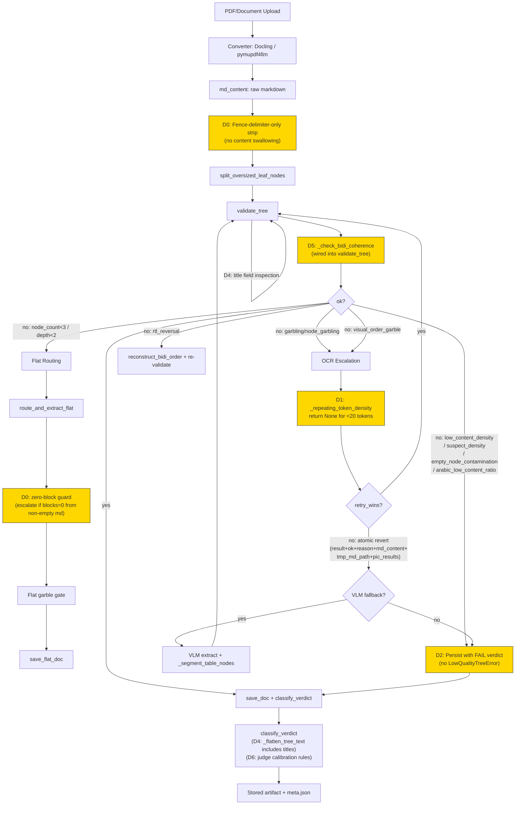
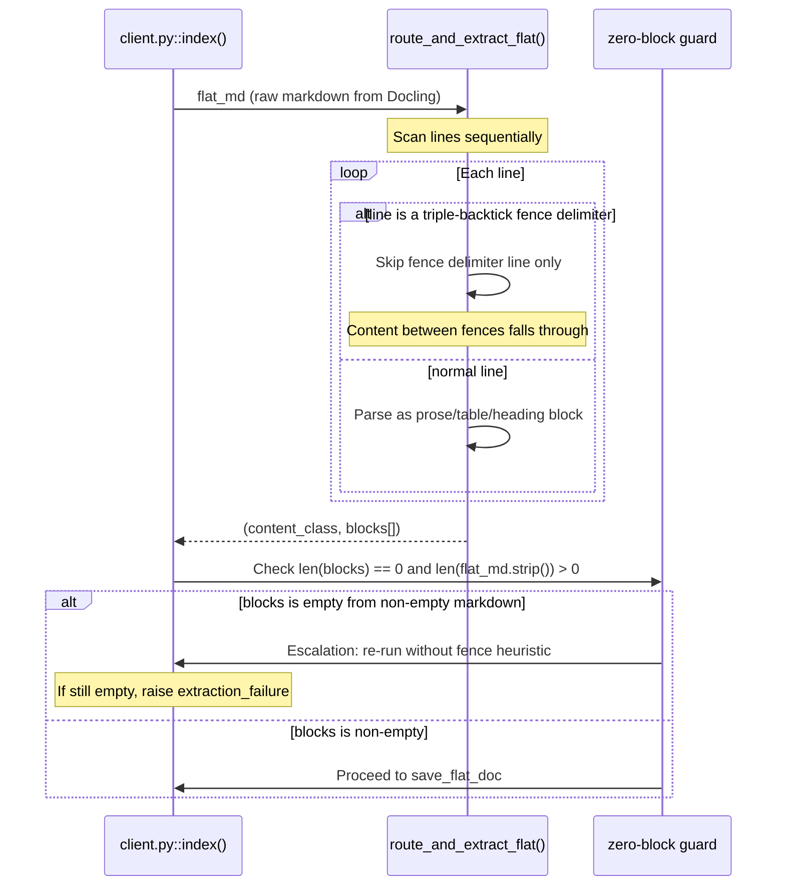
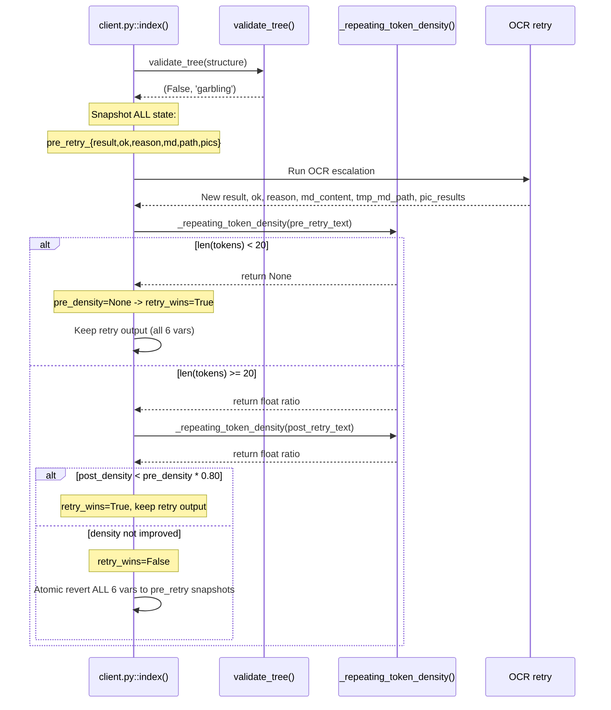
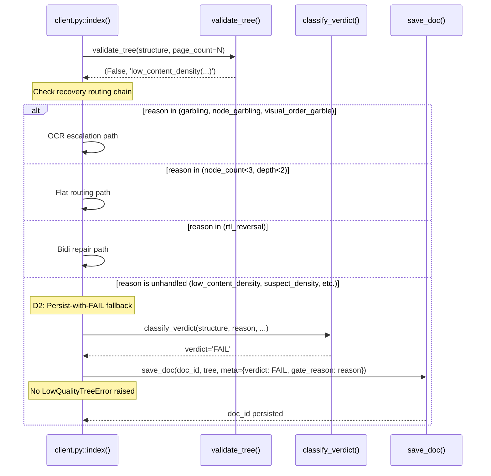

<!-- Space: CITRA -->
<!-- Title: Design Document: RFC-030 Run 13 RFC-029 Regression Fixes: Fence-Toggle Content Loss, OCR Retry Floor, and Validate-Tree Recovery Gaps -->
<!-- Folder: Designs -->

# Design Document: RFC-030 Run 13 RFC-029 Regression Fixes: Fence-Toggle Content Loss, OCR Retry Floor, and Validate-Tree Recovery Gaps

## Traceability

| Artifact | Reference |
|---|---|
| Governing RFC(s) | [RFC-030: Run 13 RFC-029 Regression Fixes: Fence-Toggle Content Loss, OCR Retry Floor, and Validate-Tree Recovery Gaps](../rfcs/030-run13-rfc029-regression-fixes.md) |
| Audit | [audit/CORPUS_REINGESTION_AUDIT_RUN-13.md](../../audit/CORPUS_REINGESTION_AUDIT_RUN-13.md) |
| Implementation Plan | [tasks-rfc030-run13-rfc029-regression-fixes.md](../tasks/tasks-rfc030-run13-rfc029-regression-fixes.md) |
| Hard Rules (binding) | [CLAUDE.md § Hard Rules](../../CLAUDE.md#hard-rules) |

## Overview

RFC-030 remediates seven regressions introduced by RFC-029's Run 13 implementation across three systemic failure clusters: (1) content-destruction in the flat-extraction fence-toggle and OCR retry guardrail (D0, D1), (2) unhandled validate_tree failure reasons causing terminal ERROR instead of persist-with-FAIL (D2, D3), and (3) blind spots in the garble and bidi-coherence gates that leave title-level corruption and visual-order Arabic undetected (D4, D5), plus missing judge calibration rules that cause inconsistent scoring across runs (D6). The design scope covers helpers.py (fence stripping, garble gate, bidi coherence, density threshold, validate_tree), client.py (recovery routing, OCR retry state management, persist-with-FAIL wiring), and the corpus-ingest-score skill file. All changes are additive or threshold-tuning; no new data model fields or storage layout changes are required.

## Key Design Principles

1. Preserve content by default: any heuristic that discards input text must prove the text is noise, not assume it; silent content destruction is the highest-severity defect class.
2. Persist with verdict, never terminate with ERROR, for quality failures that classify_verdict already maps to FAIL: a stored FAIL artifact is inspectable and recoverable, an ERROR is a dead end.
3. Gate thresholds must be calibrated against the actual corpus distribution, not theoretical values: the low_content_density floor of 500 chars/node rejected three previously-PASS legal documents and must be lowered to 150.
4. Recovery routing must be exhaustive over validate_tree's reason set: every new failure reason added to validate_tree must have a corresponding handler in client.py's recovery chain or an explicit persist-with-FAIL fallback.
5. Garble detection must inspect all user-visible text fields: both node text and node title carry content shown to users, so both must pass through the garble gate.
6. Dead code is a defect: a fully-implemented function that is never called from any pipeline path provides zero protection; _check_bidi_coherence must be wired into validate_tree.
7. State rollback must be atomic: when the OCR retry loses and reverts to pre-retry state, ALL mutable variables (result, ok, reason, md_content, tmp_md_path, pic_results) must be reverted together to prevent tree-vs-markdown mismatches.
8. Judge scoring must be deterministic across runs for unchanged content: byte-identical metrics must produce the same verdict unless a specific new defect is cited.

## Launch Constraints

1. All 25 corpus documents must be re-ingested after the full patch set and produce zero new regressions against Run 12 baselines; the 5 documents that improved in Run 13 (cabinet_resolution_21, uae_numbers landscape, world-stats-pocketbook, al-qarar al-tanzimi, huquq al-insan) must retain their improvements.
2. Implementation order is dependency-constrained: Batch 1 (D3 threshold, D2 persist-with-FAIL) must land before Batch 2 (D0 fence, D1 OCR retry) to avoid masking density-gate interactions; D4 and D5 are independent and can run in parallel with either batch.
3. No new validate_tree failure reason may be added without a corresponding entry in both the client.py recovery routing table and the classify_verdict reason-to-verdict map; a CI test must enforce this invariant.
4. The _check_bidi_coherence function must ship in audit-only mode (log but do not act) for one full corpus cycle before enabling routing consequences, to establish the false-positive rate against the 25-document corpus.
5. warid-597 (timeout/hang on 42-page scanned Arabic PDF) is explicitly out of scope for this RFC and must not be conflated with D2's persist-with-FAIL fix; it requires separate timeout investigation.

## Architecture

### High-Level Pipeline Flow



### Architecture Decisions

**D0 — Fix fence-toggle content destruction in route_and_extract_flat** (RFC-030 D0): Replace the naive in_fence parity toggle (helpers.py lines 2711-2726) with a fence-delimiter-only stripping approach. The current implementation tracks a boolean in_fence flag that toggles on every triple-backtick line and discards ALL lines while the flag is True. This silently destroys content when Docling wraps Arabic text in fenced blocks or when stray fence markers from layout misclassification (stamps/signatures tagged as CODE by Heron RT-DETRv2) create an odd fence-marker count that permanently sets in_fence=True.

The fix has three parts:
1. Strip only the triple-backtick delimiter lines themselves; let enclosed content fall through to the normal prose/table parsers. Rationale: fenced content in Docling output is real document text (Arabic articles, paragraphs) that was misclassified as code by the layout model -- it should be parsed as prose, not discarded.
2. Add a post-extraction zero-block guard in client.py: if route_and_extract_flat returns (content_class, []) from non-empty input markdown, treat it as an extraction failure and escalate (re-run without fence heuristic or raise the same error path used for tree-routed docs) instead of persisting a 0-block flat.json.
3. Review HR-separator stripping (lines 2733-2737) for over-aggressiveness contributing to the 32% char reduction in the Reitlehrer document. The current regex matches any line of 3+ identical characters from the set {-, =, *}, which may strip legitimate content lines in German documents.

Rejected alternative: Pre-scan all lines for fence-marker count and only treat paired fences as real fences (odd-count markers pass through as noise). Rejected because this still discards content inside genuinely paired fences, which in Docling output is real document text, not code. The delimiter-only strip approach preserves all content regardless of fence pairing.

**D1 — Fix _repeating_token_density short-text floor breaking OCR retry guardrail** (RFC-030 D1): Change _repeating_token_density (client.py line 1094-1095) to return None instead of 0.0 when text has fewer than 20 alnum tokens. Update the caller to treat None as 'unmeasurable' -- when _pre_density is None, the retry automatically wins (retry_wins=True) because the pre-retry text was too short to assess quality, so any OCR retry output is preferable to an unmeasurably thin original.

The current hard-coded return 0.0 creates an arithmetic impossibility: for no-text-layer PDFs, the pre-retry snapshot always has <20 tokens, so _pre_density is always 0.0, and the win condition (_post_density < _pre_density * 0.80, i.e., _post_density < 0.0) can never be satisfied. The OCR retry always loses and reverts to the garbled pre-retry tree.

Additionally, fix the incomplete state revert at lines 1144-1147: when retry loses, the current code reverts result/ok/reason but leaves md_content, tmp_md_path, and pic_results pointing at the retry's output. This creates a tree-vs-markdown state mismatch where the persisted tree structure comes from the pre-retry result but the markdown file and picture results come from the retry. The fix snapshots all six variables before the retry and reverts all six atomically when retry loses.

Rejected alternative: Lower the token threshold from 20 to 5 to make the density calculation fire on shorter texts. Rejected because density ratios on very short texts (5-19 tokens) are statistically meaningless -- a single repeated token in a 5-token text gives 20% density, which is noise, not signal. The None/unmeasurable sentinel correctly separates 'too short to assess' from 'assessed and found clean (0.0)'.

**D2 — Persist trees with unhandled validate_tree failure reasons as FAIL instead of raising ERROR** (RFC-030 D2): Add a catch-all branch in client.py's recovery routing chain (after the existing garbling/node_count<3/depth<2/rtl_reversal handlers) that persists the tree with its validate_tree-assigned reason when the reason is not handled by any specific recovery path. classify_verdict already maps all four new reasons (suspect_density, low_content_density, empty_node_contamination, arabic_low_content_ratio) to hard FAIL verdicts, confirming that RFC-029's design intent was persist-with-FAIL, not raise-ERROR.

The implementation adds a new branch at client.py line ~1387 (after the flat-routing condition):
```
elif not ok and reason not in ('garbling', 'node_garbling', 'visual_order_garble', 'node_count<3', 'depth<2', 'rtl_reversal', 'reordered'):
    # Unhandled validate_tree reason -- persist with the reason,
    # let classify_verdict assign the appropriate FAIL verdict.
    pass  # fall through to save_doc
```

This turns the final raise LowQualityTreeError(reason) at line 1639 into dead code for the four new reasons. The tree structure is preserved unchanged (no flat extraction, no OCR retry) because these reasons indicate quality problems, not structural deficiency.

A CI invariant test ensures every reason string returned by validate_tree has either a recovery handler or is covered by this persist-with-FAIL fallback, preventing future wiring omissions.

Rejected alternative: Route low_content_density and suspect_density to flat extraction (the node_count<3/depth<2 path). Rejected because these documents have genuine hierarchical structure -- the Penal Code at 408.2 chars/node has real chapters, articles, and sub-articles. Flattening would destroy valid hierarchy to work around a miscalibrated density threshold. Similarly, routing empty_node_contamination to OCR retry assumes the problem is OCR-related, but empty nodes can result from layout-model misclassification, not OCR failure.

**D3 — Fix low_content_density threshold and _segment_table_nodes wiring interaction** (RFC-030 D3): Lower the _RFC029_MIN_CHARS_PER_NODE constant from 500 to 150 (helpers.py line ~1102). The 500 threshold was set without calibration against the actual corpus distribution and rejects three previously-PASS legal documents: Penal Code at 408.2 chars/node, marsoom-33 at 459.4 chars/node, and federal_decree_law_no_33 at 54.3 chars/node (the last having a separate node-explosion root cause).

The 150 threshold is calibrated to separate genuine extraction failures (scanned-garble trees with 2-10 chars/node over 300+ shell nodes) from well-structured legal documents with fine-grained article segmentation (typical range: 150-500 chars/node for multi-article statutes). The node_count >= 200 guard remains unchanged.

The _segment_table_nodes wiring into the primary tree-build path (client.py line 981) is explicitly deferred. Running _segment_table_nodes before validate_tree would inflate node counts and mechanically reduce chars_per_node for all documents with tables, making more documents hit the density gate. _segment_table_nodes is currently wired only into OCR retry (line ~1215) and VLM fallback paths, which is correct for those recovery contexts where the table content is already suspect.

Rejected alternative: Remove the low_content_density gate entirely, relying on the node_count<3 and depth<2 gates for degenerate trees. Rejected because the density gate catches a real failure mode -- scanned-garble trees with hundreds of shell nodes each carrying near-zero text -- that the structural gates miss. The gate logic is sound; only the threshold was miscalibrated.

**D4 — Extend garble gate to inspect node title field** (RFC-030 D4): Modify _garble_check_nodes (helpers.py lines 1153-1186) to inspect both node.get('text') and node.get('title') for garble indicators. Currently the function only checks text, leaving title-level corruption (23/24 reversed RTL titles in siyasat-hawkama) invisible to the garble gate.

The fix adds title inspection with a separate threshold tolerance: title strings are typically shorter (10-100 chars) than body text (100-10000 chars), so the garble detection heuristics (digit-ratio, PUA-ratio, repetition-ratio) need a higher tolerance for mixed-script patterns in short title strings to avoid false positives on legitimate bilingual titles (e.g., Arabic title containing an English technical term or abbreviation).

Additionally, verify that _flatten_tree_text (helpers.py line 554-565) already includes title text in its output -- inspection confirms it does (line 560: parts.append(str(n.get('title', '')))), so classify_verdict's garble check via _tree_is_garbled -> _flatten_tree_text already includes titles in the bulk text. The gap is specifically in the per-node _garble_check_nodes function used for the node_garbling reason in validate_tree.

Rejected alternative: Create a separate _garble_check_titles function that runs independently from _garble_check_nodes. Rejected because this would duplicate the garble-detection logic and the recursive tree-walk, creating a maintenance burden. A single pass through _garble_check_nodes that inspects both fields is simpler and ensures consistent threshold application.

**D5 — Wire _check_bidi_coherence into validate_tree pipeline** (RFC-030 D5): Remove the duplicate definition of _check_bidi_coherence (helpers.py lines 936 and 1028) -- keep the second (more complete) definition at line 1028 as the canonical version and delete the first. Wire the canonical version into validate_tree as an additive check after the rtl_reversal gate and before the empty_node_contamination gate.

The wiring adds:
```python
# After rtl_reversal check, before empty_node_contamination
if doc_script == 'Arab' or (expected_script == 'Arab' and doc_script is None):
    bidi_ok, bidi_reason = _check_bidi_coherence(full_text)
    if not bidi_ok:
        return False, bidi_reason  # 'visual_order_garble'
```

The visual_order_garble reason is already handled in client.py's OCR escalation condition (line ~1011: reason in ('garbling', 'node_garbling', 'visual_order_garble')), so no new recovery routing is needed.

Due to the risk of unknown false-positive rates (the function has never run against the full corpus in a live pipeline), the initial deployment ships in audit-only mode: _check_bidi_coherence is called and its result is logged, but validate_tree does not return the failure. After one full corpus cycle confirming zero false positives, the gate is promoted to enforcing mode.

Rejected alternative: Wire _check_bidi_coherence as a pre-validate_tree step in client.py rather than inside validate_tree itself. Rejected because validate_tree is the single validation entry point and all other quality gates live there; adding bidi coherence outside would fragment the validation logic and make it possible for callers to skip the check.

**D6 — Write judge calibration rules to corpus-ingest-score skill file** (RFC-030 D6): Add two calibration rules to .claude/skills/corpus-ingest-score/SKILL.md that were specified in RFC-029 D6 Phase B but never written:

1. Stability rule: When a document's stored verdict is PASS and the current run's metrics (chars, nodes, depth, garble ratio) are within 10% of the stored values, the judge must retain PASS unless it can cite a specific new defect (not present in the prior run's finding) that justifies downgrade. The judge must explicitly name the stability rule when retaining a prior verdict, creating an audit trail. The 10% window accommodates legitimate minor metric fluctuations from non-deterministic Docling output (e.g., Haftpflicht chars changed ~6% between runs).

2. Severity-anchoring rule: Flat/chart documents with fewer than 1000 chars and zero enrichments anchor to MARGINAL (not FAIL) when extraction has not regressed from the prior run. The rationale is that these documents are inherently low-content (single-page charts, small images) and the extraction pipeline has extracted what is available; downgrading to FAIL implies a fixable defect when the limitation is in the source material.

Both rules apply only to the Opus judge's corpus-ingest-score pipeline; they do not affect the stored gate verdict computed by classify_verdict.

Rejected alternative: Tighten the stability window to byte-identical (0% tolerance) as originally specified in the trace findings. Rejected because Docling output is non-deterministic across runs -- the same PDF can produce slightly different character counts (Haftpflicht: ~6% variation) due to font-substitution and ligature handling differences. A 0% window would force the judge to re-evaluate every document on every run, defeating the stability rule's purpose.

## Sequence Diagrams

### Flow: Fence-delimiter strip then zero-block guard (D0)



### Flow: OCR retry with density sentinel and atomic revert (D1)



### Flow: Unhandled validate_tree reason persists as FAIL (D2)



## Correctness Properties

### Property 1: Fence-delimiter-only stripping preserves enclosed content

For any input markdown string M passed to route_and_extract_flat: if M contains non-whitespace text between triple-backtick fence markers, the output block list must contain that text (as prose or table blocks). Only the fence-delimiter lines themselves may be dropped; content between them must always fall through to the normal prose/table parsers.

### Property 2: Zero-block flat extraction triggers escalation, not persistence

If M is non-empty (contains any non-whitespace, non-fence-marker text), the output block list from route_and_extract_flat must be non-empty. A zero-block result from non-empty input must trigger the client.py escalation path (re-run without the fence heuristic, or raise the same error path used for tree-routed docs), never silent persistence of an empty flat.json.

### Property 3: OCR retry short-text density floor returns None, not zero

_repeating_token_density must return None (not 0.0) when the input text has fewer than 20 alphanumeric tokens, correctly distinguishing "too short to assess" from "assessed and found clean (0.0)".

### Property 4: Retry-wins short-circuit when pre-density is None

When _pre_density is None, retry_wins must be True regardless of _post_density, subject to the absolute minimum-quality floor on the post-retry output described in D1.

### Property 5: Atomic revert of md_content tmp_md_path pic_results

When retry_wins is False, ALL six state variables (result, ok, reason, md_content, tmp_md_path, pic_results) must be atomically reverted together to their pre-retry snapshots, preventing a tree-vs-markdown state mismatch.

### Property 6: Unhandled validate_tree reasons persist as FAIL, not ERROR

For every reason string R returned by validate_tree where ok=False: if R is not handled by a specific recovery path (OCR escalation, flat routing, bidi repair), the document must be persisted via save_doc with classify_verdict computing the verdict (which maps R to FAIL). LowQualityTreeError must never be raised for R in {low_content_density, suspect_density, empty_node_contamination, arabic_low_content_ratio}. The persisted tree structure must be identical to the validate_tree input (no flattening, no retry modification).

### Property 7: low_content_density threshold lowered to 150 chars/node

A tree with total_nodes >= 200 and chars_per_node >= 150 must pass the low_content_density gate. A tree with total_nodes >= 200 and chars_per_node < 150 must fail. The Penal Code (408.2 chars/node), marsoom-33 (459.4 chars/node), and any tree with chars_per_node in [150, 500) must pass (was rejected under the old 500 threshold).

### Property 8: Garble gate inspects node title field

_garble_check_nodes must inspect node.get('title') in addition to node.get('text') for each node in the tree. A node whose title contains garbled content (RTL-reversed Arabic, high PUA ratio, high digit ratio) but whose text is clean must increment the garbled node count. The garble detection threshold for title strings must be tuned separately (higher tolerance) to avoid false positives on short mixed-script titles.

### Property 9: _flatten_tree_text includes title text

_flatten_tree_text must include each node's title text (prepended to the node's body text with a separator) in its concatenated output, so classify_verdict's bulk-text garble check (via _tree_is_garbled) inherits title-level corruption detection.

### Property 10: _check_bidi_coherence wired into validate_tree, deduplicated

After the fix, exactly one definition of _check_bidi_coherence must exist in helpers.py. validate_tree must call _check_bidi_coherence for Arabic-script documents and, when in enforcing mode, return (False, 'visual_order_garble') when the check fails. The visual_order_garble reason must be handled by client.py's OCR escalation path (already present in the reason-check set).

### Property 11: Judge calibration rules prevent verdict instability on unchanged content

The corpus-ingest-score skill file must contain both the stability rule and the severity-anchoring rule. When a document's metrics are within 10% of the prior run and the stored verdict is PASS, the judge must retain PASS unless citing a specific new defect. Flat/chart documents with <1000 chars and zero enrichments must anchor to MARGINAL when extraction has not regressed.

## Error Handling

New validate_tree failure reasons route through client.py's recovery chain as follows:

EXISTING HANDLERS (unchanged):
- garbling, node_garbling, visual_order_garble -> OCR escalation path (client.py line ~1011). If OCR retry fails or is unavailable, falls through to VLM fallback, then to flat-path garble gate, then to LowQualityTreeError (terminal ERROR -- garbling is the only legitimate terminal reason).
- node_count<3, depth<2 -> Flat routing path (client.py line ~1387). Routes to route_and_extract_flat for flat-document success path.
- rtl_reversal -> Bidi repair path (client.py line ~1155). Attempts reconstruct_bidi_order and re-validates.
- reordered -> Falls through to LowQualityTreeError (terminal ERROR -- reordered content is a structural defect requiring manual intervention).

NEW HANDLERS (D2):
- low_content_density -> Persist-with-FAIL fallback. classify_verdict maps to FAIL. Tree structure preserved unchanged. Rationale: the tree has genuine hierarchy; the density is low but not zero.
- suspect_density -> Persist-with-FAIL fallback. classify_verdict maps to FAIL. Rationale: chars-per-page below floor indicates thin extraction but not total failure.
- empty_node_contamination -> Persist-with-FAIL fallback. classify_verdict maps to hard FAIL (CLAUDE.md Hard Rule 5 -- explicitly noted in code comments). Tree preserved for inspection.
- arabic_low_content_ratio -> Persist-with-FAIL fallback. classify_verdict maps to FAIL. Rationale: Arabic content is present but dominated by numeric/OCR noise.

NEW HANDLER (D5):
- visual_order_garble (from _check_bidi_coherence) -> Routes to the existing OCR escalation path, same as garbling/node_garbling. This is already handled because visual_order_garble is in the OCR escalation reason set at line ~1011.

ZERO-BLOCK GUARD (D0):
- When route_and_extract_flat returns (content_class, []) from non-empty markdown, the guard treats this as an extraction failure. It does NOT persist a 0-block flat.json. Instead, it re-runs extraction without the fence heuristic. If the re-run also produces zero blocks, the document falls through to LowQualityTreeError with reason 'extraction_failure' (new reason, mapped to FAIL by classify_verdict).

CI INVARIANT:
A test enumerates all reason strings that validate_tree can return (by inspecting its source code or running it against synthetic trees) and asserts that every reason either (a) has a named handler in client.py's if/elif chain, or (b) is covered by the persist-with-FAIL catch-all. This prevents future wiring omissions when new reasons are added.

## Testing Strategy

UNIT TESTS (per decision):

D0 Fence stripping:
- test_paired_fence_preserves_content: markdown with paired ``` blocks yields prose blocks containing the enclosed text.
- test_unclosed_fence_preserves_trailing_content: markdown with odd fence-marker count preserves all text after the stray marker.
- test_zero_block_guard_escalates: route_and_extract_flat returning [] from non-empty markdown triggers escalation, not persistence.
- test_hr_separator_does_not_strip_content_lines: German text lines resembling HR separators (e.g., "---" within a signature block) are not stripped when they carry semantic meaning.

D1 OCR retry density:
- test_repeating_token_density_returns_none_below_threshold: text with <20 alnum tokens returns None.
- test_retry_wins_when_pre_density_is_none: when _pre_density is None, retry_wins is True regardless of _post_density.
- test_atomic_state_revert_on_retry_loss: when retry loses, all six variables (result, ok, reason, md_content, tmp_md_path, pic_results) are reverted to pre-retry snapshots.

D2 Persist-with-FAIL:
- test_low_content_density_persists_as_fail: tree triggering low_content_density is persisted (save_doc called) with classify_verdict returning FAIL, not raising LowQualityTreeError.
- test_suspect_density_persists_as_fail: same for suspect_density.
- test_empty_node_contamination_persists_as_fail: same for empty_node_contamination.
- test_arabic_low_content_ratio_persists_as_fail: same for arabic_low_content_ratio.
- test_persisted_tree_unchanged: tree structure passed to save_doc is identical to validate_tree input (no flattening).

D3 Density threshold:
- test_300_nodes_300_chars_passes: tree with 300 nodes at 300 chars/node passes low_content_density.
- test_300_nodes_50_chars_fails: tree with 300 nodes at 50 chars/node fails.
- test_200_nodes_160_chars_passes: tree at the boundary (200 nodes, 160 chars/node) passes.
- test_199_nodes_skips_gate: tree with 199 nodes bypasses the density gate entirely.

D4 Title garble detection:
- test_garbled_title_clean_text_detected: node with garbled title but clean body text increments garbled count.
- test_rtl_reversed_title_detected: node with RTL-reversed Arabic title is detected by _word_has_reversed_morphology.
- test_bilingual_title_not_false_positive: node with legitimate mixed-script title (Arabic + English term) does not trigger garble detection.

D5 Bidi coherence:
- test_visual_order_arabic_fails_coherence: text with reversed morphology triggers (False, 'visual_order_garble').
- test_logical_order_arabic_passes: correctly-ordered Arabic text returns (True, '').
- test_single_definition_exists: grep/AST check confirms exactly one _check_bidi_coherence definition in helpers.py.
- test_validate_tree_calls_bidi_check: validate_tree for Arabic-script tree invokes _check_bidi_coherence (mock-verified).

D6 Judge calibration:
- test_skill_file_contains_stability_rule: parse .claude/skills/corpus-ingest-score/SKILL.md and assert stability rule text is present.
- test_skill_file_contains_anchoring_rule: same for severity-anchoring rule.

PROPERTY TESTS:
- For any tree T where validate_tree returns (False, reason): if reason is not in the terminal set {garbling, reordered}, then client.py must NOT raise LowQualityTreeError. Property verified by Hypothesis-generated trees with varying node counts, depths, and content densities.
- For any markdown M where len(M.strip()) > 0 and M contains non-fence-marker text: route_and_extract_flat(M) must return a non-empty block list.

INTEGRATION TESTS (corpus regression):
- Re-ingest all 25 corpus documents after the full patch set.
- Assert the 5 Run-13 improvements retain their improved verdicts.
- Assert the 3 PASS-to-ERROR regressions (Penal Code, fed-33 EN, marsoom-33 AR) recover to PASS or MARGINAL (not ERROR).
- Assert the content-destruction regressions (SLA, MOU, qerar-106, marsoom-13) recover block counts to Run 12 levels.
- Assert stable documents (Haftpflicht-Besondere, Ministerial-279, cabinet-96) remain PASS with no metric regression.
