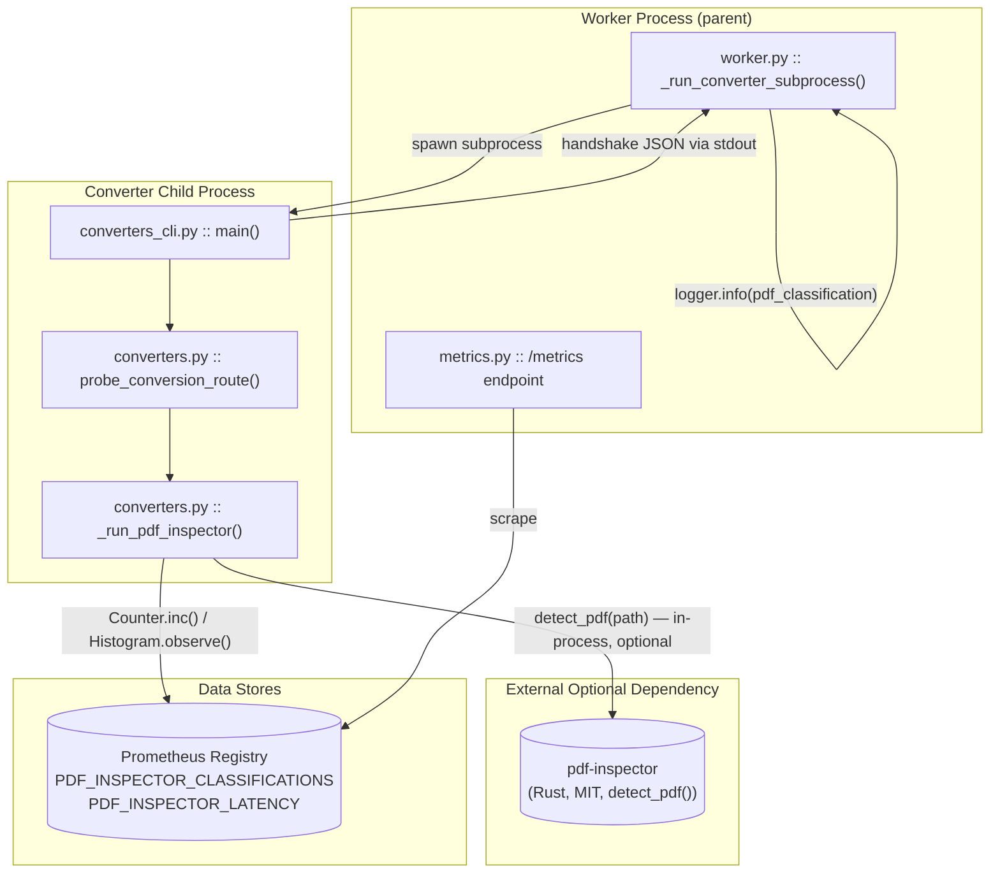
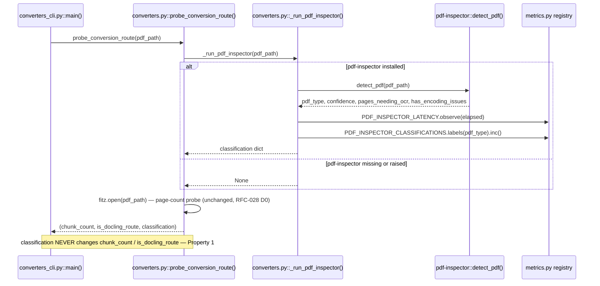
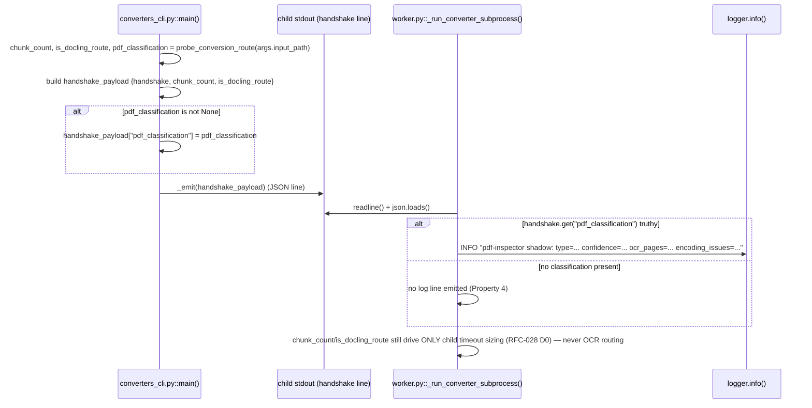
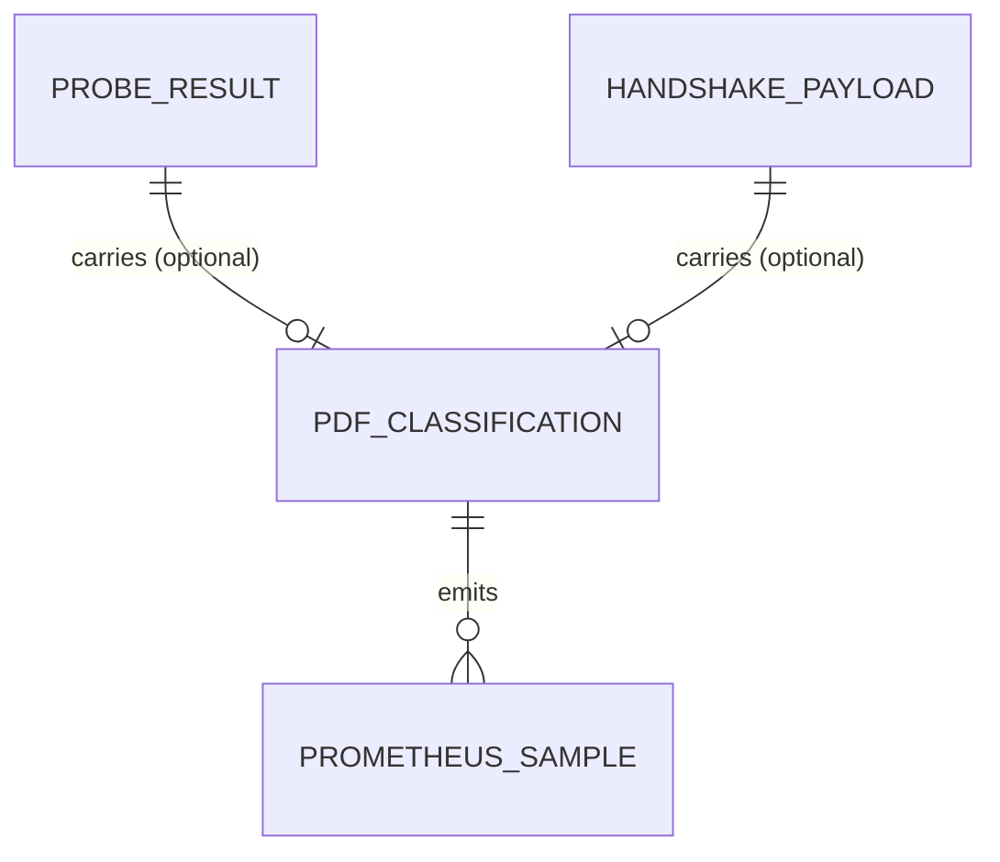

<!-- Space: CITRA -->
<!-- Title: Design Document: pdf-inspector Shadow-Mode Pilot -->
<!-- Folder: Designs -->

# Design Document: pdf-inspector Shadow-Mode Pilot

## Traceability

| Artifact | Reference |
|---|---|
| Governing RFC | [RFC-031: pdf-inspector Shadow-Mode Pilot](../rfcs/031-pdf-inspector-shadow-pilot.md) |
| Decisions covered | [D0](../rfcs/031-pdf-inspector-shadow-pilot.md#d0-add-pdf-inspector-as-optional-dependency), [D1](../rfcs/031-pdf-inspector-shadow-pilot.md#d1-shadow-mode-classification-in-probe_conversion_route), [D2](../rfcs/031-pdf-inspector-shadow-pilot.md#d2-extended-handshake-and-worker-logging), [D3](../rfcs/031-pdf-inspector-shadow-pilot.md#d3-prometheus-observability), [D4](../rfcs/031-pdf-inspector-shadow-pilot.md#d4-config-toggle-for-future-promotion), [D5](../rfcs/031-pdf-inspector-shadow-pilot.md#d5-corpus-validation-this-phase) |
| Promotion criteria | [RFC-031 Promotion Criteria (Phase 2)](../rfcs/031-pdf-inspector-shadow-pilot.md#promotion-criteria-phase-2--future-rfc) |
| Non-goals | [RFC-031 Non-Goals](../rfcs/031-pdf-inspector-shadow-pilot.md#non-goals) |
| Implementation Plan | [tasks-rfc031-pdf-inspector-shadow.md](../tasks/tasks-rfc031-pdf-inspector-shadow.md) |

## Overview

PageIndex's PDF ingestion pipeline currently discovers whether a document needs OCR only *after* a full Docling conversion attempt fails `validate_tree()`, forcing a second full-document reconversion with `force_full_page_ocr=True`. This design introduces `firecrawl/pdf-inspector` — a Rust, MIT-licensed, ~10-50ms PDF classifier — as a **shadow-mode signal** inside the existing pre-flight probe, `probe_conversion_route()`. In shadow mode the classifier's output (`pdf_type`, `confidence`, `pages_needing_ocr`, `has_encoding_issues`) is computed, logged, and exported as Prometheus metrics, but it **never influences** `chunk_count`, `is_docling_route`, or any OCR routing decision — `validate_tree()` remains the sole quality gate ([Property 1](#property-1-classification-never-influences-routing)). The goal of this phase is purely observational: validate classification accuracy against the German T&C corpus so that a future RFC can promote the signal to active routing once the [promotion criteria](../rfcs/031-pdf-inspector-shadow-pilot.md#promotion-criteria-phase-2--future-rfc) are met.

## Key Design Principles

1. **Shadow before active.** No classification output is allowed to change control flow in this phase — it is metered and logged only. This bounds the pilot's blast radius to "worse observability" in the failure case, never "worse routing."
2. **Zero new I/O, zero new subprocess.** `probe_conversion_route()` already opens the PDF byte stream via PyMuPDF for page-count estimation; `_run_pdf_inspector()` is inserted as an in-process call at the same point, adding no new file handles or subprocess spawns.
3. **Optional dependency, graceful absence.** pdf-inspector is an optional extra ([D0](../rfcs/031-pdf-inspector-shadow-pilot.md#d0-add-pdf-inspector-as-optional-dependency)), mirroring the existing `agpl-fallback` pattern. Its absence must never break the probe or the pipeline ([Property 2](#property-2-graceful-degradation-on-missing-dependency)).
4. **Fail closed to `None`, never raise.** Any classification failure — missing dependency, corrupt PDF, unexpected exception from the Rust binary — degrades to `classification = None` rather than propagating an exception into the probe or handshake path ([Property 3](#property-3-graceful-degradation-on-classification-failure)).
5. **Minimal-change data channel.** The startup handshake JSON between `converters_cli.py` (child) and `worker.py` (parent) — established by RFC-028 D0 — is the existing sync point for chunk sizing; extending it with an optional `pdf_classification` key is lower-risk than adding a new channel ([D2](../rfcs/031-pdf-inspector-shadow-pilot.md#d2-extended-handshake-and-worker-logging)).
6. **Observability is the entire value of this phase.** Without Prometheus metrics ([D3](../rfcs/031-pdf-inspector-shadow-pilot.md#d3-prometheus-observability)) and corpus validation ([D5](../rfcs/031-pdf-inspector-shadow-pilot.md#d5-corpus-validation-this-phase)), shadow mode produces no actionable data — these are not optional polish.
7. **Promotion is a config flip, not a rewrite.** `PDF_INSPECTOR_PRECLASSIFY` ([D4](../rfcs/031-pdf-inspector-shadow-pilot.md#d4-config-toggle-for-future-promotion)) is wired into `config.py` now, unread by any routing logic, so Phase 2 promotion needs only a consumer added at the read site — not new plumbing.

## Launch Constraints

- Classification must **never** gate or alter `chunk_count` / `is_docling_route` in this phase — see [RFC-031 Non-Goals](../rfcs/031-pdf-inspector-shadow-pilot.md#non-goals): "Never let classification skip `validate_tree()`."
- pdf-inspector must never be used as a markdown extractor (bug #269: `markdown` field always `None`) — see [Non-Goals](../rfcs/031-pdf-inspector-shadow-pilot.md#non-goals).
- No CJK corpus testing this phase (bug #272: crashes) — see [Non-Goals](../rfcs/031-pdf-inspector-shadow-pilot.md#non-goals).
- Vendor benchmark numbers are not decision grounds — corpus validation ([D5](../rfcs/031-pdf-inspector-shadow-pilot.md#d5-corpus-validation-this-phase)) is the only accepted evidence, consistent with CLAUDE.md's prohibition on unverified benchmark claims.
- `PDF_INSPECTOR_PRECLASSIFY` defaults to off and is unconsumed by routing logic in this phase ([D4](../rfcs/031-pdf-inspector-shadow-pilot.md#d4-config-toggle-for-future-promotion)) — promotion to active routing is explicitly out of scope and requires a future RFC per [Promotion Criteria](../rfcs/031-pdf-inspector-shadow-pilot.md#promotion-criteria-phase-2--future-rfc).

## Architecture

### High-Level System Architecture



### Architecture Decisions

**Optional dependency via extras group** ([RFC-031 D0](../rfcs/031-pdf-inspector-shadow-pilot.md#d0-add-pdf-inspector-as-optional-dependency)): pdf-inspector ships as the `pdf-inspection` extra in [pyproject.toml](#6-pyprojecttoml), also folded into `dev` so CI exercises the shadow path. The alternative — a hard dependency — was rejected because AGPL-fallback precedent in this codebase treats non-core capabilities as opt-in, and a missing native wheel on an unsupported platform must not break the base install.

**In-process call inside the existing probe** ([RFC-031 D1](../rfcs/031-pdf-inspector-shadow-pilot.md#d1-shadow-mode-classification-in-probe_conversion_route)): `_run_pdf_inspector()` is called from inside `probe_conversion_route()`, which already reads the PDF via PyMuPDF for page-count estimation. The alternative — a separate pre-classification subprocess or pipeline stage — was rejected as unnecessary I/O and architectural surface for a ~10-50ms in-process call.

**Handshake extension over new channel** ([RFC-031 D2](../rfcs/031-pdf-inspector-shadow-pilot.md#d2-extended-handshake-and-worker-logging)): the classification dict rides the existing RFC-028 D0 startup handshake JSON line as an optional `pdf_classification` key. The alternative — a second IPC channel or a side-channel log file — was rejected as more moving parts for the same data that already crosses the child/parent boundary once per conversion.

**Two purpose-built Prometheus metrics** ([RFC-031 D3](../rfcs/031-pdf-inspector-shadow-pilot.md#d3-prometheus-observability)): `pageindex_pdf_inspector_classifications_total` (Counter, `pdf_type` label) and `pageindex_pdf_inspector_latency_seconds` (Histogram, sub-100ms buckets). The alternative — reusing an existing generic Counter/Histogram — was rejected because shadow mode's entire value proposition is dedicated, queryable observability data.

**Config toggle wired but unread** ([RFC-031 D4](../rfcs/031-pdf-inspector-shadow-pilot.md#d4-config-toggle-for-future-promotion)): `PDF_INSPECTOR_PRECLASSIFY` exists in [config.py](#5-configpy) today so a future promotion RFC changes one read site, not new plumbing. The alternative — adding the env var only when promotion ships — was rejected because it defers a trivial, risk-free change for no benefit.

**Corpus validation as acceptance gate, not code change** ([RFC-031 D5](../rfcs/031-pdf-inspector-shadow-pilot.md#d5-corpus-validation-this-phase)): classification accuracy on the 27-document German T&C corpus is the acceptance evidence for this phase, decoupled from any code path. The alternative — accepting vendor benchmark claims — was rejected per the [Launch Constraints](#launch-constraints) prohibition on unverified benchmark grounds.

### Deployment Architecture

- **Backend**: FastMCP server (host process) + arq worker (separate host process), unchanged by this RFC.
- **Converter execution**: unchanged subprocess-per-conversion model (`converters_cli.py` spawned by `worker.py::_run_converter_subprocess()`); pdf-inspector's `detect_pdf()` runs in-process *inside* that child, not as a further subprocess.
- **Object Storage**: MinIO, unaffected — no new artifacts are written by shadow-mode classification.
- **Task Queue**: arq / Redis, unaffected — classification adds no new job type.
- **Metrics**: Prometheus `/metrics` endpoint (existing `metrics.py` registry), extended with two new series ([D3](../rfcs/031-pdf-inspector-shadow-pilot.md#d3-prometheus-observability)).
- **New runtime dependency**: `pdf-inspector` Rust extension wheel, installed only when the `pdf-inspection` extra (or `dev` extra) is selected ([D0](../rfcs/031-pdf-inspector-shadow-pilot.md#d0-add-pdf-inspector-as-optional-dependency)).

### Communication Patterns

| Pattern | Use Case | Technology |
|---------|----------|------------|
| In-process function call | `probe_conversion_route()` → `_run_pdf_inspector()` → `detect_pdf()` | Python → Rust FFI via `pdf-inspector` package |
| Child→parent handshake (stdout, JSON line) | Converter child reports `chunk_count`, `is_docling_route`, optional `pdf_classification` to worker parent | Existing RFC-028 D0 handshake protocol, extended per [D2](../rfcs/031-pdf-inspector-shadow-pilot.md#d2-extended-handshake-and-worker-logging) |
| Metrics push (in-process) | Classification result and latency recorded to the local Prometheus registry | `prometheus_client.Counter` / `Histogram`, per [D3](../rfcs/031-pdf-inspector-shadow-pilot.md#d3-prometheus-observability) |
| Structured logging | Worker parent logs classification at INFO after handshake parse | Python stdlib `logging`, per [D2](../rfcs/031-pdf-inspector-shadow-pilot.md#d2-extended-handshake-and-worker-logging) |
| Scrape (pull) | Prometheus server scrapes `/metrics` for `PDF_INSPECTOR_CLASSIFICATIONS` / `PDF_INSPECTOR_LATENCY` | HTTP GET, existing `/metrics` endpoint |

### Sequence Diagrams

#### Probe Flow (D0 → D1)



Links: [D0](../rfcs/031-pdf-inspector-shadow-pilot.md#d0-add-pdf-inspector-as-optional-dependency), [D1](../rfcs/031-pdf-inspector-shadow-pilot.md#d1-shadow-mode-classification-in-probe_conversion_route), [D3](../rfcs/031-pdf-inspector-shadow-pilot.md#d3-prometheus-observability), [Property 1](#property-1-classification-never-influences-routing), [Property 2](#property-2-graceful-degradation-on-missing-dependency), [Property 3](#property-3-graceful-degradation-on-classification-failure), [Property 5](#property-5-prometheus-metrics-accuracy).

#### Handshake Flow (D1 → D2)



Links: [D1](../rfcs/031-pdf-inspector-shadow-pilot.md#d1-shadow-mode-classification-in-probe_conversion_route), [D2](../rfcs/031-pdf-inspector-shadow-pilot.md#d2-extended-handshake-and-worker-logging), [Property 1](#property-1-classification-never-influences-routing), [Property 4](#property-4-handshake-classification-conditional-emission).

## Service Contracts

### 1. converters.py

**Responsibility**: Compute the pre-flight route probe (`probe_conversion_route()`) used to size the converter child's timeout, now extended with a shadow-mode pdf-inspector classification.

```python
# Module-level availability flag — RFC-031 D0/D1
try:
    from pdf_inspector import detect_pdf as _detect_pdf
    _pdf_inspector_available = True
except ImportError:
    _pdf_inspector_available = False
    _detect_pdf = None

def _run_pdf_inspector(pdf_path: str) -> dict | None:
    """RFC-031 D1: runs detect_pdf(), records D3 metrics, catches ALL exceptions."""
    # returns {"pdf_type": str, "confidence": float,
    #          "pages_needing_ocr": list[int], "has_encoding_issues": bool}
    # or None if unavailable / failed.

def probe_conversion_route(pdf_path: str) -> tuple[int, bool, dict | None]:
    """RFC-028 D0 (chunk_count, is_docling_route) extended by RFC-031 D1
    with a third element: pdf_classification (shadow mode — never consumed
    for routing)."""
```

**Internal Interfaces**:

- Calls `pdf_inspector.detect_pdf(pdf_path)` when `_pdf_inspector_available` — see [D0](../rfcs/031-pdf-inspector-shadow-pilot.md#d0-add-pdf-inspector-as-optional-dependency), [D1](../rfcs/031-pdf-inspector-shadow-pilot.md#d1-shadow-mode-classification-in-probe_conversion_route).
- Publishes to `PDF_INSPECTOR_LATENCY` / `PDF_INSPECTOR_CLASSIFICATIONS` (see [metrics.py contract](#4-metricspy)) — see [D3](../rfcs/031-pdf-inspector-shadow-pilot.md#d3-prometheus-observability).
- Called by `converters_cli.py::main()` — see [converters_cli.py contract](#2-converters_clipy).
- Guaranteed behavior: [Property 1](#property-1-classification-never-influences-routing), [Property 2](#property-2-graceful-degradation-on-missing-dependency), [Property 3](#property-3-graceful-degradation-on-classification-failure).

### 2. converters_cli.py

**Responsibility**: Child-process entry point; emits the startup handshake JSON line (RFC-028 D0), now conditionally carrying the pdf-inspector classification.

```python
# main() — RFC-031 D2
chunk_count, is_docling_route, pdf_classification = probe_conversion_route(args.input_path)
handshake_payload = {"handshake": True, "chunk_count": chunk_count, "is_docling_route": is_docling_route}
if pdf_classification is not None:
    handshake_payload["pdf_classification"] = pdf_classification
_emit(handshake_payload)
```

**Internal Interfaces**:

- Calls [`converters.py::probe_conversion_route()`](#1-converterspy) — see [D1](../rfcs/031-pdf-inspector-shadow-pilot.md#d1-shadow-mode-classification-in-probe_conversion_route).
- Emits handshake JSON line consumed by [`worker.py::_run_converter_subprocess()`](#3-workerpy) — see [D2](../rfcs/031-pdf-inspector-shadow-pilot.md#d2-extended-handshake-and-worker-logging).
- Guaranteed behavior: [Property 4](#property-4-handshake-classification-conditional-emission).

### 3. worker.py

**Responsibility**: Parent process managing the converter child subprocess; parses the handshake line to size the child timeout (unchanged) and now logs the shadow classification at INFO.

```python
# _run_converter_subprocess() — RFC-031 D2
handshake = json.loads(handshake_line.decode(errors="replace").strip())
if isinstance(handshake, dict) and handshake.get("handshake"):
    ...  # chunk_count / is_docling_route timeout sizing — unchanged, RFC-028 D0
    pdf_class = handshake.get("pdf_classification")
    if pdf_class:
        logger.info(
            "pdf-inspector shadow: type=%s confidence=%.2f ocr_pages=%s encoding_issues=%s",
            pdf_class.get("pdf_type", "unknown"),
            pdf_class.get("confidence", 0.0),
            pdf_class.get("pages_needing_ocr", []),
            pdf_class.get("has_encoding_issues", False),
        )
```

**Internal Interfaces**:

- Consumes the handshake emitted by [`converters_cli.py::main()`](#2-converters_clipy) — see [D2](../rfcs/031-pdf-inspector-shadow-pilot.md#d2-extended-handshake-and-worker-logging).
- Logging is purely observational — does not affect `effective_timeout` sizing (still driven solely by `chunk_count`/`is_docling_route`, RFC-028 D0), consistent with [Property 1](#property-1-classification-never-influences-routing).
- Guaranteed behavior: [Property 4](#property-4-handshake-classification-conditional-emission).

### 4. metrics.py

**Responsibility**: Declares the two shadow-mode Prometheus series and exposes them via the existing `/metrics` scrape endpoint.

```python
PDF_INSPECTOR_CLASSIFICATIONS = Counter(
    "pageindex_pdf_inspector_classifications_total",
    "Shadow-mode pdf-inspector classification results from probe_conversion_route.",
    ["pdf_type"],
)
PDF_INSPECTOR_LATENCY = Histogram(
    "pageindex_pdf_inspector_latency_seconds",
    "pdf-inspector detect_pdf latency in probe_conversion_route (shadow mode).",
    buckets=[0.005, 0.01, 0.025, 0.05, 0.1, 0.25],
)
```

**Internal Interfaces**:

- Written to by [`converters.py::_run_pdf_inspector()`](#1-converterspy) — see [D3](../rfcs/031-pdf-inspector-shadow-pilot.md#d3-prometheus-observability).
- Scraped by the existing `/metrics` Starlette endpoint (unchanged handler, new series).
- Guaranteed behavior: [Property 5](#property-5-prometheus-metrics-accuracy).

### 5. config.py

**Responsibility**: Central environment-driven configuration; now carries the reserved (unconsumed) promotion toggle.

```python
PDF_INSPECTOR_PRECLASSIFY: bool = os.environ.get(
    "PDF_INSPECTOR_PRECLASSIFY", "0"
).strip().lower() in ("1", "true", "yes")
```

**Internal Interfaces**:

- No current readers — reserved for the Phase 2 promotion RFC per [D4](../rfcs/031-pdf-inspector-shadow-pilot.md#d4-config-toggle-for-future-promotion) and the [Promotion Criteria](../rfcs/031-pdf-inspector-shadow-pilot.md#promotion-criteria-phase-2--future-rfc).

### 6. pyproject.toml

**Responsibility**: Declares `pdf-inspector` as an optional extra so the shadow classifier is opt-in at install time.

```toml
[project.optional-dependencies]
pdf-inspection = ["pdf-inspector>=0.2.6"]
dev = ["pytest", "pytest-asyncio", "pytest-cov", "httpx", "fakeredis[aioredis]",
       "langchain-mcp-adapters", "langchain[openai]", "ruff>=0.15.17",
       "pdf-inspector>=0.2.6"]
```

**Internal Interfaces**:

- Consumed by `converters.py`'s module-level `try/except ImportError` guard — see [D0](../rfcs/031-pdf-inspector-shadow-pilot.md#d0-add-pdf-inspector-as-optional-dependency), [converters.py contract](#1-converterspy).
- `dev` extra inclusion ensures CI exercises the classification path — see [Property 6](#property-6-corpus-classification-accuracy).

## Data Models

### Entity Relationship Diagram



### Core Entities (converters.py / converters_cli.py / worker.py — in-memory, no persistent store)

```python
class PdfClassification:
    """RFC-031 D1. Returned by _run_pdf_inspector(); embedded as the third
    element of probe_conversion_route()'s tuple and as the optional
    'pdf_classification' key in the handshake payload. Never persisted to
    MinIO or Redis — this phase is metrics/logging only."""
    pdf_type: str            # "text_based" | "scanned" | "image_based" | "mixed"
    confidence: float        # 0.0-1.0, as reported by pdf-inspector
    pages_needing_ocr: list[int]   # per-page indices flagged by pdf-inspector (RFC-031 Non-Goals: known 0/1-indexing bug #252 — do not act on this list yet)
    has_encoding_issues: bool

class ProbeResult:
    """Return value of probe_conversion_route() — RFC-028 D0, extended RFC-031 D1."""
    chunk_count: int                    # unchanged semantics — drives child timeout only
    is_docling_route: bool              # unchanged semantics — drives child timeout only
    pdf_classification: PdfClassification | None  # NEW, shadow-mode, routing-inert

class HandshakePayload:
    """JSON line emitted by converters_cli.py::main(), parsed by
    worker.py::_run_converter_subprocess() — RFC-028 D0, extended RFC-031 D2."""
    handshake: bool          # always True
    chunk_count: int
    is_docling_route: bool
    pdf_classification: dict | None  # present only when RFC-031 D1 classification succeeded
```

## Correctness Properties

*A property is a characteristic or behavior that should hold true across all valid executions of the system — a formal statement about what the system should do. Properties serve as the bridge between human-readable specifications and machine-verifiable correctness guarantees.*

### Property 1: Classification never influences routing

*For any* PDF input to `probe_conversion_route()`, the returned `chunk_count` and `is_docling_route` values SHALL be identical to the values that would be returned if pdf-inspector classification were entirely absent — the third tuple element (`pdf_classification`) SHALL NOT be read by any branch that computes `chunk_count` or `is_docling_route`.

**Validates:** [RFC-031 D1](../rfcs/031-pdf-inspector-shadow-pilot.md#d1-shadow-mode-classification-in-probe_conversion_route)
**Tested in:** `tests/test_pdf_inspector_shadow.py` (shadow-mode routing-invariance cases)
**Service contract:** [converters.py](#1-converterspy), [worker.py](#3-workerpy)
**Sequence diagram:** [Probe Flow](#probe-flow--d0--d1), [Handshake Flow](#handshake-flow--d1--d2)

### Property 2: Graceful degradation on missing dependency

*For any* environment in which `pdf_inspector` is not importable, `_pdf_inspector_available` SHALL be `False`, `_run_pdf_inspector()` SHALL return `None` without raising, and `probe_conversion_route()` SHALL return its normal two-value routing semantics plus a `None` classification.

**Validates:** [RFC-031 D0](../rfcs/031-pdf-inspector-shadow-pilot.md#d0-add-pdf-inspector-as-optional-dependency), [RFC-031 D1](../rfcs/031-pdf-inspector-shadow-pilot.md#d1-shadow-mode-classification-in-probe_conversion_route)
**Tested in:** `tests/test_pdf_inspector_shadow.py` (import-failure / monkeypatched `_pdf_inspector_available=False` cases)
**Service contract:** [converters.py](#1-converterspy), [pyproject.toml](#6-pyprojecttoml)

### Property 3: Graceful degradation on classification failure

*For any* exception raised by `detect_pdf(pdf_path)` — corrupt PDF, native-extension crash, unexpected return shape — `_run_pdf_inspector()` SHALL catch the exception, log it at DEBUG level, and return `None`, without propagating the exception into `probe_conversion_route()` or the converter child process.

**Validates:** [RFC-031 D1](../rfcs/031-pdf-inspector-shadow-pilot.md#d1-shadow-mode-classification-in-probe_conversion_route)
**Tested in:** `tests/test_pdf_inspector_shadow.py` (mocked `detect_pdf` raising cases)
**Service contract:** [converters.py](#1-converterspy)
**Sequence diagram:** [Probe Flow](#probe-flow--d0--d1)

### Property 4: Handshake classification conditional emission

*For any* handshake payload constructed by `converters_cli.py::main()`, the key `pdf_classification` SHALL be present if and only if `probe_conversion_route()` returned a non-`None` third element; and `worker.py::_run_converter_subprocess()` SHALL emit an INFO log line about pdf-inspector if and only if `handshake.get("pdf_classification")` is truthy.

**Validates:** [RFC-031 D2](../rfcs/031-pdf-inspector-shadow-pilot.md#d2-extended-handshake-and-worker-logging)
**Tested in:** `tests/test_pdf_inspector_shadow.py` (handshake presence/absence cases), `tests/test_rfc028_d0.py` (regression coverage for the base handshake contract under the new 3-tuple return type)
**Service contract:** [converters_cli.py](#2-converters_clipy), [worker.py](#3-workerpy)
**Sequence diagram:** [Handshake Flow](#handshake-flow--d1--d2)

### Property 5: Prometheus metrics accuracy

*For any* successful classification, `PDF_INSPECTOR_CLASSIFICATIONS.labels(pdf_type=result.pdf_type)` SHALL be incremented by exactly 1 and `PDF_INSPECTOR_LATENCY` SHALL be observed with the wall-clock duration of the `detect_pdf()` call; for any failed or skipped classification, neither metric SHALL be touched.

**Validates:** [RFC-031 D3](../rfcs/031-pdf-inspector-shadow-pilot.md#d3-prometheus-observability)
**Tested in:** `tests/test_pdf_inspector_shadow.py` (metric-increment assertions via the Prometheus test registry)
**Service contract:** [converters.py](#1-converterspy), [metrics.py](#4-metricspy)
**Sequence diagram:** [Probe Flow](#probe-flow--d0--d1)

### Property 6: Corpus classification accuracy

*For any* PDF in the 27-document German insurance T&C corpus (`issue/data/`), `detect_pdf()` SHALL complete without raising, and SHALL classify at least 95% of the corpus as `text_based` with mean confidence ≥0.90 for those documents, at a latency <100ms per document — measured and reported to be, in the actual corpus run, 27/27 `text_based`, confidence 1.000, latency mean 14.7ms / p95 37.5ms / max 112.0ms.

**Validates:** [RFC-031 D5](../rfcs/031-pdf-inspector-shadow-pilot.md#d5-corpus-validation-this-phase)
**Tested in:** corpus validation script feeding `audit/PDF_INSPECTOR_VIABILITY_REPORT.md`
**Service contract:** [converters.py](#1-converterspy)

## Error Handling

### Error Categories & Responses

| Category | Trigger | Response | Retry Strategy |
|----------|---------|----------|-----------------|
| Missing optional dependency | `import pdf_inspector` fails at module load | `_pdf_inspector_available = False`; `_run_pdf_inspector()` short-circuits to `None` | None — expected steady state when extra not installed, see [Property 2](#property-2-graceful-degradation-on-missing-dependency) |
| Classification exception | `detect_pdf()` raises (corrupt PDF, native crash, malformed result) | Caught in `_run_pdf_inspector()`, logged at DEBUG with `exc_info=True`, returns `None` | None — shadow mode; routing proceeds unaffected, see [Property 3](#property-3-graceful-degradation-on-classification-failure) |
| Handshake JSON malformed | Child emits non-JSON or truncated handshake line | Existing RFC-028 D0 fallback: `handshake = None`, worker uses fixed `CHILD_TIMEOUT`; classification silently absent | None — pre-existing behavior, unaffected by this RFC |
| Metrics registry unavailable | Prometheus scrape hits a registry error (unrelated to this RFC) | Out of scope — inherits existing `/metrics` endpoint error handling | Out of scope |

### Service-Specific Error Handling

**converters.py:**

- `detect_pdf()` throwing any `Exception` subtype → caught broadly in `_run_pdf_inspector()`; the pipeline continues with `classification=None`. This is intentionally a blanket `except Exception`, not a narrow catch, because pdf-inspector is a third-party native extension whose failure modes are not fully enumerable — see [Property 3](#property-3-graceful-degradation-on-classification-failure).
- `fitz.open()` failure (page-count probe) is pre-existing RFC-028 D0 behavior and is unaffected — it returns `(1, False, classification)`, still carrying whatever classification (or `None`) was already computed.

**converters_cli.py:**

- Handshake construction never conditionally fails — the `if pdf_classification is not None` guard means the base handshake (`handshake`, `chunk_count`, `is_docling_route`) is always well-formed even when classification is unavailable, preserving the RFC-028 D0 contract exactly, per [Property 4](#property-4-handshake-classification-conditional-emission).

**worker.py:**

- Malformed or missing `pdf_classification` in a parsed handshake dict is handled by the existing `handshake.get("pdf_classification")` (returns `None`/falsy, skips the log line) — no new exception surface introduced.

## Testing Strategy

### Testing Layers

1. **Unit Tests**: 18 new tests in `tests/test_pdf_inspector_shadow.py` covering [D1](../rfcs/031-pdf-inspector-shadow-pilot.md#d1-shadow-mode-classification-in-probe_conversion_route) through [D4](../rfcs/031-pdf-inspector-shadow-pilot.md#d4-config-toggle-for-future-promotion): availability flag branching, exception handling, metric increments, handshake conditional emission, worker log-line conditional emission, and config default/override parsing.
2. **Regression Tests**: 3 existing tests in `tests/test_rfc028_d0.py` updated for `probe_conversion_route()`'s new 3-tuple return type, verifying the RFC-028 D0 handshake/timeout contract is preserved unchanged by this RFC — validates [Property 1](#property-1-classification-never-influences-routing) and [Property 4](#property-4-handshake-classification-conditional-emission).
3. **Corpus Validation** ([RFC-031 D5](../rfcs/031-pdf-inspector-shadow-pilot.md#d5-corpus-validation-this-phase)): Batch run of `detect_pdf()` against all 27 German insurance T&C PDFs in `issue/data/`, feeding [Property 6](#property-6-corpus-classification-accuracy) and a before/after probe-latency comparison, results captured in `audit/PDF_INSPECTOR_VIABILITY_REPORT.md`.
4. **Integration Tests**: End-to-end handshake round-trip — spawn `converters_cli.py` as a real subprocess against a sample PDF, assert `worker.py::_run_converter_subprocess()` parses the handshake and logs the shadow classification at INFO without altering `effective_timeout` sizing.

### Property Coverage

| Property | Test Location |
|---|---|
| [Property 1](#property-1-classification-never-influences-routing) | `tests/test_pdf_inspector_shadow.py`, `tests/test_rfc028_d0.py` |
| [Property 2](#property-2-graceful-degradation-on-missing-dependency) | `tests/test_pdf_inspector_shadow.py` |
| [Property 3](#property-3-graceful-degradation-on-classification-failure) | `tests/test_pdf_inspector_shadow.py` |
| [Property 4](#property-4-handshake-classification-conditional-emission) | `tests/test_pdf_inspector_shadow.py`, `tests/test_rfc028_d0.py` |
| [Property 5](#property-5-prometheus-metrics-accuracy) | `tests/test_pdf_inspector_shadow.py` |
| [Property 6](#property-6-corpus-classification-accuracy) | corpus validation run → `audit/PDF_INSPECTOR_VIABILITY_REPORT.md` |

### Key Test Scenarios

**Critical Path Tests:**

1. PDF with pdf-inspector installed and a healthy classification → `probe_conversion_route()` returns unchanged `chunk_count`/`is_docling_route` plus a populated classification dict; handshake carries `pdf_classification`; worker logs it at INFO; both Prometheus series update.
2. Full 27-document corpus run → 27/27 `text_based`, confidence 1.000, zero exceptions, latency within the <100ms budget ([D5](../rfcs/031-pdf-inspector-shadow-pilot.md#d5-corpus-validation-this-phase) acceptance criteria).

**Edge Cases:**

- pdf-inspector not installed (`ImportError` at module load) → classification always `None`, no metrics touched, routing unaffected.
- `detect_pdf()` raises mid-call → caught, `None` returned, DEBUG log emitted, no exception surfaces to caller.
- Non-PDF input path → `probe_conversion_route()` short-circuits to `(1, False, None)` before `_run_pdf_inspector()` is even invoked.
- Handshake line truncated or non-JSON → pre-existing RFC-028 D0 fallback path; classification absent, no new failure mode introduced.
- `pages_needing_ocr` present but per-page-indexing bug (#252) unresolved → the field is logged/metered but never read for routing decisions, per [Launch Constraints](#launch-constraints) and [RFC-031 Non-Goals](../rfcs/031-pdf-inspector-shadow-pilot.md#non-goals).
