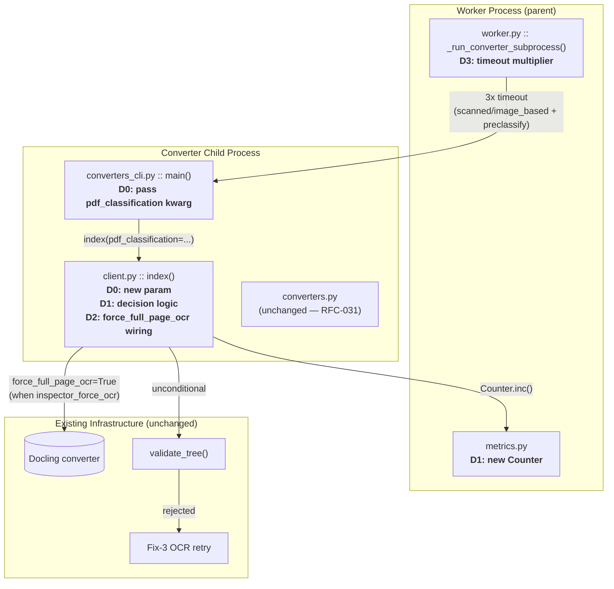
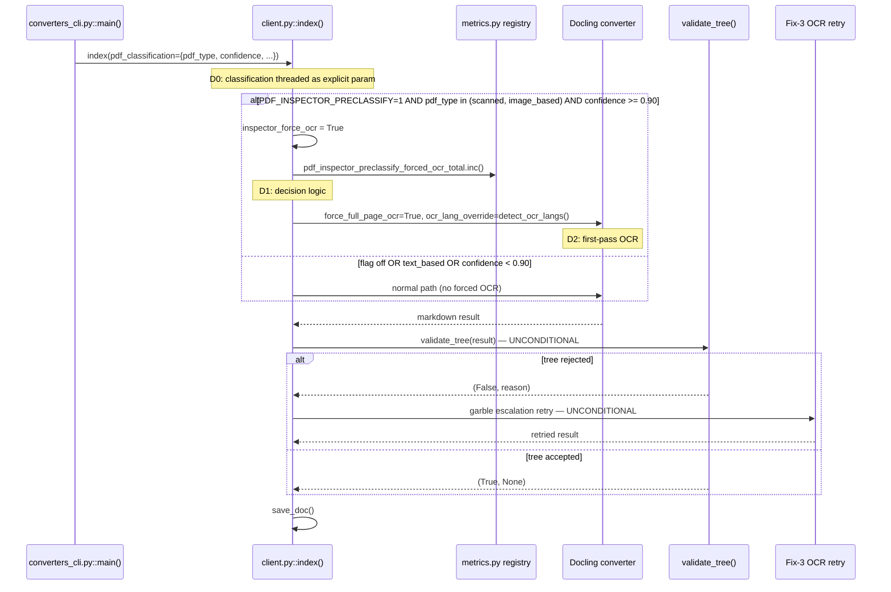

<!-- Space: CITRA -->
<!-- Title: Design: RFC-032 pdf-inspector Tier 1 Activation — Document-Level OCR Pre-Routing -->
<!-- Folder: Designs -->

# RFC-032 Design Document: pdf-inspector Tier 1 Activation

<a id="traceability"></a>
## Traceability

| Artifact | Reference |
|---|---|
| Governing RFC | [RFC-032: pdf-inspector Tier 1 Activation](../rfcs/032-pdf-inspector-tier1-activation.md) |
| Decisions covered | [D0](../rfcs/032-pdf-inspector-tier1-activation.md#d0-thread-pdf_classification-from-converters_cli-into-clientindex), [D1](../rfcs/032-pdf-inspector-tier1-activation.md#d1-document-level-ocr-routing-decision-in-index), [D2](../rfcs/032-pdf-inspector-tier1-activation.md#d2-converter-loop-wiring--force-ocr-on-first-pass), [D3](../rfcs/032-pdf-inspector-tier1-activation.md#d3-worker-timeout-multiplier), [D4](../rfcs/032-pdf-inspector-tier1-activation.md#d4-tests), [D5](../rfcs/032-pdf-inspector-tier1-activation.md#d5-pre-activation-shadow-agreement-measurement), [D6](../rfcs/032-pdf-inspector-tier1-activation.md#d6-full-corpus-regression-gate-pre-activation) |
| PRD / Requirements | [`PRD.md`](../../PRD.md) |
| Architecture Doc | [`ARCHITECTURE.md`](../../ARCHITECTURE.md) |
| Implementation Plan | [tasks-rfc032-pdf-inspector-tier1-activation.md](../tasks/tasks-rfc032-pdf-inspector-tier1-activation.md) |
| Predecessor Design | [design-rfc031-pdf-inspector-shadow.md](design-rfc031-pdf-inspector-shadow.md) |
| Invariants | [RFC-032 Invariants](../rfcs/032-pdf-inspector-tier1-activation.md#invariants) |
| Non-goals | [RFC-032 Non-Goals](../rfcs/032-pdf-inspector-tier1-activation.md#non-goals) |
| Audit Sources | [`audit/PDF_INSPECTOR_VIABILITY_REPORT.md`](../../audit/PDF_INSPECTOR_VIABILITY_REPORT.md), [`audit/PDF_INSPECTOR_PHASE2_ACTIVATION_REPORT.md`](../../audit/PDF_INSPECTOR_PHASE2_ACTIVATION_REPORT.md) |

<a id="overview"></a>
## Overview

RFC-031 landed pdf-inspector as a shadow-mode classifier: classification runs end-to-end through `probe_conversion_route()`, the startup handshake, worker logging, and Prometheus metrics, but **never influences routing**. The `PDF_INSPECTOR_PRECLASSIFY` config flag exists in `config.py` but has zero consumers anywhere in the codebase — flipping it to `1` today changes nothing. This design promotes the classification signal from shadow to active: when the flag is enabled, scanned/image-based PDFs classified with confidence >= 0.90 go straight to `force_full_page_ocr=True` on the first Docling pass, eliminating the reactive double-conversion penalty (~600-2000ms per affected doc). The change threads the `pdf_classification` dict from `converters_cli.py` into `client.py::index()` ([D0](../rfcs/032-pdf-inspector-tier1-activation.md#d0-thread-pdf_classification-from-converters_cli-into-clientindex)), computes the routing decision ([D1](../rfcs/032-pdf-inspector-tier1-activation.md#d1-document-level-ocr-routing-decision-in-index)), wires `force_full_page_ocr` on the converter loop ([D2](../rfcs/032-pdf-inspector-tier1-activation.md#d2-converter-loop-wiring--force-ocr-on-first-pass)), and adds a timeout safety margin for scanned docs ([D3](../rfcs/032-pdf-inspector-tier1-activation.md#d3-worker-timeout-multiplier)). `validate_tree()` and the Fix-3 OCR retry remain unconditional safety nets — the inspector classification is advisory, never a gate bypass. Zero-code rollback via `PDF_INSPECTOR_PRECLASSIFY=0`.

<a id="key-design-principles"></a>
## Key Design Principles

1. **Advisory, never authoritative.** Inspector classification adds an OCR signal but never suppresses `validate_tree()` or the Fix-3 garble escalation retry. The existing ground-truth quality gate remains unconditional on every code path.
2. **Mirror proven patterns.** All new conditionals in `index()` are structurally identical to the existing `pre_garbled + PRE_GARBLE_FORCE_OCR_ENABLED` pattern (lines 735-749), reducing review risk and cognitive load.
3. **Opt-in, instant rollback.** The feature is gated behind `PDF_INSPECTOR_PRECLASSIFY` (default off). Setting it to `0` makes the entire D0-D2 decision path inert with no data migration, no re-ingestion, and no stored-tree risk.
4. **Conservative threshold.** The 0.90 confidence gate is hardcoded — deliberately positioned between the corpus's scanned-doc floor (0.950) and text-based ceiling (0.750). No configurable threshold until upstream pdf-inspector supports one (#266/#267).
5. **Proportionate scope.** ~30 LOC across 3 files. No new services, stores, dependencies, or LLM egress.

<a id="launch-constraints"></a>
## Launch Constraints

- **HR1** — N/A, no positioning changes. This RFC is an internal routing optimization with no user-facing claims.
- **HR2** — No new derived stores. Classification data stays in-memory within the converter child process. No new MinIO prefixes, Redis keys, or Postgres tables ([Invariant 4](../rfcs/032-pdf-inspector-tier1-activation.md#invariants)).
- **HR3** — No new LLM egress. All changes are local routing logic ([Invariant 5](../rfcs/032-pdf-inspector-tier1-activation.md#invariants)).
- **HR4** — No new AGPL imports. All touched files (`client.py`, `converters_cli.py`, `worker.py`, `metrics.py`) use only existing dependencies.
- **HR5** — `validate_tree()` remains unconditional ([Invariant 1](../rfcs/032-pdf-inspector-tier1-activation.md#invariants)). Inspector-forced OCR is a hint to the first pass; if the result is low-quality, Fix-3 retry fires as normal ([Invariant 2](../rfcs/032-pdf-inspector-tier1-activation.md#invariants)).

<a id="architecture"></a>
## Architecture

<a id="high-level-system-architecture"></a>
### High-Level System Architecture

All changes touch four files in `src/pageindex_mcp/`. No new services, workers, or storage backends are introduced. Shaded nodes indicate files modified by this RFC.



### Architecture Decisions

<a id="ad1-thread-classification-param-d0"></a>
**AD1: Thread classification as an explicit function parameter** ([RFC-032 D0](../rfcs/032-pdf-inspector-tier1-activation.md#d0-thread-pdf_classification-from-converters_cli-into-clientindex)): The `pdf_classification` dict already exists in the `converters_cli` scope (returned by `probe_conversion_route()` at line 98). An explicit `pdf_classification: dict | None = None` parameter on `index()` is testable and self-documenting. The alternative — attribute injection via `client._pdf_classification` — was rejected as fragile and opaque. Validates [Property 1](#property-1-flag-gate-inertness). Implemented in [Task 1.1](../tasks/tasks-rfc032-pdf-inspector-tier1-activation.md#11-index-signature-pdf-classification-param) and [Task 1.2](../tasks/tasks-rfc032-pdf-inspector-tier1-activation.md#12-converters-cli-pass-kwarg).

<a id="ad2-ocr-routing-decision-d1"></a>
**AD2: Three-predicate OCR routing decision** ([RFC-032 D1](../rfcs/032-pdf-inspector-tier1-activation.md#d1-document-level-ocr-routing-decision-in-index)): `inspector_force_ocr` is set True when all three hold: `config.PDF_INSPECTOR_PRECLASSIFY`, `pdf_type in ("scanned", "image_based")`, and `confidence >= 0.90`. This mirrors the existing `pre_garbled` conditional pattern. The 0.90 confidence threshold is hardcoded because upstream pdf-inspector offers no configurable threshold (#266/#267/#254). The threshold separates the corpus's scanned-doc floor (0.950) from the text-based ceiling (0.750) with margin. Validates [Property 2](#property-2-scanned-image-force-ocr), [Property 3](#property-3-text-based-no-force), [Property 4](#property-4-confidence-threshold-gate). Implemented in [Task 2.1](../tasks/tasks-rfc032-pdf-inspector-tier1-activation.md#21-compute-inspector-force-ocr) and [Task 2.2](../tasks/tasks-rfc032-pdf-inspector-tier1-activation.md#22-prometheus-counter).

<a id="ad3-converter-loop-force-ocr-d2"></a>
**AD3: Wire force_full_page_ocr in the converter loop** ([RFC-032 D2](../rfcs/032-pdf-inspector-tier1-activation.md#d2-converter-loop-wiring--force-ocr-on-first-pass)): When `inspector_force_ocr` and the converter is Docling, the converter loop passes `force_full_page_ocr=True` and `ocr_lang_override=detect_ocr_langs(filename)` on the first pass. Structurally identical to the `pre_garbled` conditionals at lines 779-814. Both signals can fire independently and produce the same result (first-pass OCR) — no conflict. The `_docling_converter` cache key already includes `'force'` for the force-OCR variant, so no converter-layer changes are needed. Validates [Property 2](#property-2-scanned-image-force-ocr). Implemented in [Task 3.1](../tasks/tasks-rfc032-pdf-inspector-tier1-activation.md#31-wire-force-ocr-converter-loop).

<a id="ad4-worker-timeout-multiplier-d3"></a>
**AD4: 3x timeout multiplier for scanned/image_based classifications** ([RFC-032 D3](../rfcs/032-pdf-inspector-tier1-activation.md#d3-worker-timeout-multiplier)): Scanned and image-based docs going straight to full-page OCR on the first pass are 3-10x slower than text-layer extraction. The existing `effective_timeout` is sized for the text-layer-first path. A 3x multiplier covers the lower end of the stated 3-10x range; the original 2x was insufficient. The scope now matches D1/D2 — both `scanned` and `image_based` docs that get forced OCR also get the timeout multiplier. Implemented in [Task 4.1](../tasks/tasks-rfc032-pdf-inspector-tier1-activation.md#41-worker-timeout-multiplier).

<a id="ad5-tests-d4"></a>
**AD5: Targeted unit + integration test suite** ([RFC-032 D4](../rfcs/032-pdf-inspector-tier1-activation.md#d4-tests)): Tests cover the decision matrix exhaustively: flag on/off, each pdf_type, confidence above/below threshold, classification absent. Integration tests verify the Fix-3 safety net fires after inspector-forced OCR when `validate_tree()` rejects. Remote-path test verifies `_remote_pdf_to_markdown` receives `force_full_page_ocr=True`. Validates all [Correctness Properties](#correctness-properties). Implemented in [Task 5.1](../tasks/tasks-rfc032-pdf-inspector-tier1-activation.md#51-unit-tests), [Task 5.2](../tasks/tasks-rfc032-pdf-inspector-tier1-activation.md#52-integration-tests), [Task 5.3](../tasks/tasks-rfc032-pdf-inspector-tier1-activation.md#53-remote-path-test).

<a id="ad6-shadow-agreement-measurement-d5"></a>
**AD6: Pre-activation shadow agreement measurement** ([RFC-032 D5](../rfcs/032-pdf-inspector-tier1-activation.md#d5-pre-activation-shadow-agreement-measurement)): Before flipping the flag in production, ingest all non-text_based corpus docs (currently 4 scanned + 1 mixed, N=5) with the flag off and compare inspector classification against `validate_tree()`'s implicit OCR signal (did Fix-3 garble escalation fire?). Require zero disagreements. At N=5, this is a spot-check, not a statistical measurement — the earlier ">=99% agreement" language was misleading at this sample size. The gate strengthens automatically as more scanned/mixed/image_based docs enter the corpus. Implemented in [Task 6.1](../tasks/tasks-rfc032-pdf-inspector-tier1-activation.md#61-shadow-agreement-measurement).

<a id="ad7-corpus-regression-gate-d6"></a>
**AD7: Full corpus regression gate** ([RFC-032 D6](../rfcs/032-pdf-inspector-tier1-activation.md#d6-full-corpus-regression-gate-pre-activation)): Before flipping the flag in production, run the full 60-doc corpus with `PRECLASSIFY=1` and compare the verdict distribution (PASS/MARGINAL/FAIL) against the `PRECLASSIFY=0` baseline. Any PASS→MARGINAL or PASS→FAIL regression blocks activation. This catches unexpected side effects on text_based docs that D5's 5-doc check cannot see. Recommended by the Phase 2 Activation Report (Rec-2b). Implemented in [Task 6.2](../tasks/tasks-rfc032-pdf-inspector-tier1-activation.md#62-full-corpus-regression-gate).

<a id="deployment-architecture"></a>
### Deployment Architecture

No deployment changes. The existing architecture remains:

- **Backend**: FastMCP server (host process) + arq worker (separate host process), unchanged.
- **Converter execution**: unchanged subprocess-per-conversion model (`converters_cli.py` spawned by `worker.py::_run_converter_subprocess()`).
- **Object Storage**: MinIO, unaffected — no new artifacts written.
- **Task Queue**: arq / Redis, unaffected — no new job types.
- **Metrics**: Prometheus `/metrics` endpoint (existing `metrics.py` registry), extended with one new Counter ([D1](../rfcs/032-pdf-inspector-tier1-activation.md#d1-document-level-ocr-routing-decision-in-index)).
- **Feature activation**: `PDF_INSPECTOR_PRECLASSIFY=1` environment variable (already defined in `config.py` by RFC-031 [D4](../rfcs/031-pdf-inspector-shadow-pilot.md#d4-config-toggle-for-future-promotion), currently unconsumed).

<a id="communication-patterns"></a>
### Communication Patterns

No new communication patterns introduced. All data flow uses channels established by RFC-028 D0 and RFC-031:

| Pattern | Use Case | Status |
|---------|----------|--------|
| Explicit function parameter | `converters_cli.py::main()` passes `pdf_classification` kwarg to `client.index()` | **New** (D0) — replaces the gap where classification was computed but discarded |
| Metrics push (in-process) | Forced-OCR activation recorded to Prometheus Counter | **New** (D1) — one new Counter |
| Child→parent handshake (stdout, JSON line) | Unchanged — classification already rides the handshake (RFC-031 D2) | Unchanged |
| Structured logging | Worker parent logs classification at INFO (RFC-031 D2) | Unchanged |

### Sequence Diagrams

<a id="ocr-routing-flow--d0--d1--d2"></a>
#### OCR Routing Flow (D0 + D1 + D2)



Links: [D0](../rfcs/032-pdf-inspector-tier1-activation.md#d0-thread-pdf_classification-from-converters_cli-into-clientindex), [D1](../rfcs/032-pdf-inspector-tier1-activation.md#d1-document-level-ocr-routing-decision-in-index), [D2](../rfcs/032-pdf-inspector-tier1-activation.md#d2-converter-loop-wiring--force-ocr-on-first-pass), [Property 1](#property-1-flag-gate-inertness), [Property 2](#property-2-scanned-image-force-ocr), [Property 3](#property-3-text-based-no-force), [Property 5](#property-5-validate-tree-unconditional), [Property 6](#property-6-fix-3-retry-unconditional).

<a id="service-contracts"></a>
## Service Contracts

<a id="1-configpy"></a>
### 1. config.py

**Responsibility**: Central environment-driven configuration. `PDF_INSPECTOR_PRECLASSIFY` was defined by RFC-031 [D4](../rfcs/031-pdf-inspector-shadow-pilot.md#d4-config-toggle-for-future-promotion) but had zero consumers. This RFC adds the first consumer in `client.py::index()`.

```python
PDF_INSPECTOR_PRECLASSIFY: bool = os.environ.get(
    "PDF_INSPECTOR_PRECLASSIFY", "0"
).strip().lower() in ("1", "true", "yes")
```

**Internal Interfaces**:

- Read by [`client.py::index()`](#3-clientpy) to gate the OCR routing decision — see [D1](../rfcs/032-pdf-inspector-tier1-activation.md#d1-document-level-ocr-routing-decision-in-index).
- Setting to `0` (default) makes the entire D0-D2 decision path inert — see [Property 1](#property-1-flag-gate-inertness).

<a id="2-converters-clipy"></a>
### 2. converters_cli.py

**Responsibility**: Child-process entry point; passes `pdf_classification` to `client.index()`.

```python
# main() — RFC-032 D0
result = client.index(
    ...,
    pdf_classification=pdf_classification,  # NEW — threaded from probe_conversion_route()
)
```

**Internal Interfaces**:

- Receives `pdf_classification` from `converters.py::probe_conversion_route()` (unchanged, RFC-031 [D1](../rfcs/031-pdf-inspector-shadow-pilot.md#d1-shadow-mode-classification-in-probe_conversion_route)).
- Passes it to [`client.py::index()`](#3-clientpy) as an explicit kwarg — see [D0](../rfcs/032-pdf-inspector-tier1-activation.md#d0-thread-pdf_classification-from-converters_cli-into-clientindex), [AD1](#ad1-thread-classification-param-d0).
- Handshake emission unchanged (RFC-031 [D2](../rfcs/031-pdf-inspector-shadow-pilot.md#d2-extended-handshake-and-worker-logging)) — classification still rides the handshake JSON for worker logging.

<a id="3-clientpy"></a>
### 3. client.py

**Responsibility**: Core ingestion logic in `index()`. Now accepts `pdf_classification`, computes the OCR routing decision, and wires `force_full_page_ocr` into the converter loop.

```python
def index(
    self,
    ...,
    pdf_classification: dict | None = None,  # NEW — RFC-032 D0
) -> dict:
    ...
    # RFC-032 D1: OCR routing decision
    inspector_force_ocr = (
        config.PDF_INSPECTOR_PRECLASSIFY
        and pdf_classification is not None
        and pdf_classification.get("pdf_type") in ("scanned", "image_based")
        and pdf_classification.get("confidence", 0.0) >= 0.90
    )
    if inspector_force_ocr:
        logger.info("pdf-inspector pre-classify: forcing OCR for %s", filename)
        PDF_INSPECTOR_FORCED_OCR.inc()

    # RFC-032 D2: converter loop — force OCR on first pass
    # (within the converter loop, mirrors pre_garbled pattern)
    if inspector_force_ocr and "docling" in conv_name:
        # remote: _remote_pdf_to_markdown(staging_key, force_full_page_ocr=True, ...)
        # local:  conv_fn(file_path, True, ocr_lang_override=detect_ocr_langs(filename))
```

**Internal Interfaces**:

- Called by [`converters_cli.py::main()`](#2-converters-clipy) with `pdf_classification` kwarg — see [D0](../rfcs/032-pdf-inspector-tier1-activation.md#d0-thread-pdf_classification-from-converters_cli-into-clientindex).
- Reads [`config.PDF_INSPECTOR_PRECLASSIFY`](#1-configpy) to gate decision — see [D1](../rfcs/032-pdf-inspector-tier1-activation.md#d1-document-level-ocr-routing-decision-in-index).
- Increments [`metrics.PDF_INSPECTOR_FORCED_OCR`](#5-metricspy) on activation — see [D1](../rfcs/032-pdf-inspector-tier1-activation.md#d1-document-level-ocr-routing-decision-in-index).
- Calls `validate_tree()` unconditionally after conversion — see [Property 5](#property-5-validate-tree-unconditional).
- Fix-3 retry fires unconditionally on `validate_tree()` rejection — see [Property 6](#property-6-fix-3-retry-unconditional).
- Guaranteed behavior: [Property 1](#property-1-flag-gate-inertness), [Property 2](#property-2-scanned-image-force-ocr), [Property 3](#property-3-text-based-no-force), [Property 4](#property-4-confidence-threshold-gate).
- Sequence diagram: [OCR Routing Flow](#ocr-routing-flow--d0--d1--d2).

<a id="4-workerpy"></a>
### 4. worker.py

**Responsibility**: Parent process managing the converter child subprocess. Now applies a 3x timeout multiplier when preclassify is enabled and the doc is classified as scanned or image_based.

```python
# _run_converter_subprocess() — RFC-032 D3
pdf_class = handshake.get("pdf_classification")
if (
    config.PDF_INSPECTOR_PRECLASSIFY
    and isinstance(pdf_class, dict)
    and pdf_class.get("pdf_type") in ("scanned", "image_based")
):
    effective_timeout *= 3
    logger.info("pdf-inspector: 3x timeout for %s PDF (%ss)", pdf_class["pdf_type"], effective_timeout)
```

**Internal Interfaces**:

- Reads `pdf_classification` from the handshake JSON (unchanged channel, RFC-031 [D2](../rfcs/031-pdf-inspector-shadow-pilot.md#d2-extended-handshake-and-worker-logging)).
- Reads [`config.PDF_INSPECTOR_PRECLASSIFY`](#1-configpy) to gate the multiplier — see [D3](../rfcs/032-pdf-inspector-tier1-activation.md#d3-worker-timeout-multiplier).
- Guaranteed behavior: multiplier applies only when preclassify is enabled, so flag-off leaves timeout unchanged — see [Property 1](#property-1-flag-gate-inertness).

<a id="5-metricspy"></a>
### 5. metrics.py

**Responsibility**: Declares the new Prometheus Counter for forced-OCR activations.

```python
PDF_INSPECTOR_FORCED_OCR = Counter(
    "pageindex_pdf_inspector_preclassify_forced_ocr_total",
    "Number of documents where pdf-inspector pre-classification forced first-pass OCR.",
)
```

**Internal Interfaces**:

- Incremented by [`client.py::index()`](#3-clientpy) when `inspector_force_ocr` is True — see [D1](../rfcs/032-pdf-inspector-tier1-activation.md#d1-document-level-ocr-routing-decision-in-index).
- Scraped by the existing `/metrics` Starlette endpoint (unchanged handler, new series).
- Existing shadow-mode metrics (`PDF_INSPECTOR_CLASSIFICATIONS`, `PDF_INSPECTOR_LATENCY` from RFC-031 [D3](../rfcs/031-pdf-inspector-shadow-pilot.md#d3-prometheus-observability)) remain unchanged.

## Data Models

No new persistent entities. The `pdf_classification` dict shape (defined by RFC-031 [D1](../rfcs/031-pdf-inspector-shadow-pilot.md#d1-shadow-mode-classification-in-probe_conversion_route), produced by `_run_pdf_inspector()`) is consumed in-memory only:

```python
# In-memory dict shape — never persisted to MinIO, Redis, or Postgres
pdf_classification: dict | None = {
    "pdf_type": str,            # "text_based" | "scanned" | "image_based" | "mixed"
    "confidence": float,        # 0.0-1.0
    "pages_needing_ocr": list[int],   # NOT consumed by Tier 1 (bug #252)
    "has_encoding_issues": bool,      # NOT consumed by Tier 1
}
```

Only `pdf_type` and `confidence` are read by the [D1](../rfcs/032-pdf-inspector-tier1-activation.md#d1-document-level-ocr-routing-decision-in-index) decision logic. `pages_needing_ocr` and `has_encoding_issues` are logged and metered (RFC-031) but not acted upon in Tier 1 — see [Non-Goals](../rfcs/032-pdf-inspector-tier1-activation.md#non-goals).

<a id="correctness-properties"></a>
## Correctness Properties

<a id="property-1-flag-gate-inertness"></a>
### Property 1: Flag-gate inertness

*For any* PDF input to `index()`, when `config.PDF_INSPECTOR_PRECLASSIFY` is `False` (the default), the value of `inspector_force_ocr` SHALL be `False` regardless of the `pdf_classification` dict's content, and the converter loop, timeout sizing, and `validate_tree()`/Fix-3 behavior SHALL be identical to the pre-RFC-032 code path.

**Validates:** [RFC-032 D0](../rfcs/032-pdf-inspector-tier1-activation.md#d0-thread-pdf_classification-from-converters_cli-into-clientindex), [RFC-032 D1](../rfcs/032-pdf-inspector-tier1-activation.md#d1-document-level-ocr-routing-decision-in-index), [Invariant 3](../rfcs/032-pdf-inspector-tier1-activation.md#invariants)
**Tested in:** [Task 5.1](../tasks/tasks-rfc032-pdf-inspector-tier1-activation.md#51-unit-tests) — `PRECLASSIFY=0` ignores classification even at confidence 1.0
**Service contract:** [config.py](#1-configpy), [client.py](#3-clientpy), [worker.py](#4-workerpy)
**Sequence diagram:** [OCR Routing Flow](#ocr-routing-flow--d0--d1--d2)

<a id="property-2-scanned-image-force-ocr"></a>
### Property 2: Scanned/image-based forces OCR

*For any* PDF input to `index()`, when `config.PDF_INSPECTOR_PRECLASSIFY` is `True` AND `pdf_classification["pdf_type"]` is `"scanned"` or `"image_based"` AND `pdf_classification["confidence"]` >= 0.90, the converter loop SHALL pass `force_full_page_ocr=True` to the Docling converter on the first pass.

**Validates:** [RFC-032 D1](../rfcs/032-pdf-inspector-tier1-activation.md#d1-document-level-ocr-routing-decision-in-index), [RFC-032 D2](../rfcs/032-pdf-inspector-tier1-activation.md#d2-converter-loop-wiring--force-ocr-on-first-pass)
**Tested in:** [Task 5.1](../tasks/tasks-rfc032-pdf-inspector-tier1-activation.md#51-unit-tests) — `pdf_type=scanned` + `confidence>=0.90` forces OCR; [Task 5.2](../tasks/tasks-rfc032-pdf-inspector-tier1-activation.md#52-integration-tests) — end-to-end integration
**Service contract:** [client.py](#3-clientpy)
**Sequence diagram:** [OCR Routing Flow](#ocr-routing-flow--d0--d1--d2)

<a id="property-3-text-based-no-force"></a>
### Property 3: Text-based never forces OCR

*For any* PDF input to `index()`, when `pdf_classification["pdf_type"]` is `"text_based"`, `inspector_force_ocr` SHALL be `False` regardless of confidence level or flag state. OCR suppression for text-based docs is explicitly a [Non-Goal](../rfcs/032-pdf-inspector-tier1-activation.md#non-goals) (Tier 1.5).

**Validates:** [RFC-032 D1](../rfcs/032-pdf-inspector-tier1-activation.md#d1-document-level-ocr-routing-decision-in-index), [Non-Goals](../rfcs/032-pdf-inspector-tier1-activation.md#non-goals)
**Tested in:** [Task 5.1](../tasks/tasks-rfc032-pdf-inspector-tier1-activation.md#51-unit-tests) — `pdf_type="text_based"` never forces OCR
**Service contract:** [client.py](#3-clientpy)
**Sequence diagram:** [OCR Routing Flow](#ocr-routing-flow--d0--d1--d2)

<a id="property-4-confidence-threshold-gate"></a>
### Property 4: Confidence threshold gate

*For any* PDF input to `index()`, when `pdf_classification["confidence"]` < 0.90, `inspector_force_ocr` SHALL be `False` regardless of `pdf_type` or flag state. The 0.90 threshold is hardcoded per [D1](../rfcs/032-pdf-inspector-tier1-activation.md#d1-document-level-ocr-routing-decision-in-index).

**Validates:** [RFC-032 D1](../rfcs/032-pdf-inspector-tier1-activation.md#d1-document-level-ocr-routing-decision-in-index)
**Tested in:** [Task 5.1](../tasks/tasks-rfc032-pdf-inspector-tier1-activation.md#51-unit-tests) — confidence 0.85 falls through to normal path
**Service contract:** [client.py](#3-clientpy)
**Sequence diagram:** [OCR Routing Flow](#ocr-routing-flow--d0--d1--d2)

<a id="property-5-validate-tree-unconditional"></a>
### Property 5: validate_tree() unconditional

*For any* PDF input to `index()`, `validate_tree()` SHALL be called on the conversion result regardless of whether `inspector_force_ocr` was True or False. Inspector classification is advisory; it never bypasses the ground-truth quality gate.

**Validates:** [RFC-032 Invariant 1](../rfcs/032-pdf-inspector-tier1-activation.md#invariants)
**Tested in:** [Task 5.2](../tasks/tasks-rfc032-pdf-inspector-tier1-activation.md#52-integration-tests) — `validate_tree` always called after forced-OCR pass
**Service contract:** [client.py](#3-clientpy)
**Sequence diagram:** [OCR Routing Flow](#ocr-routing-flow--d0--d1--d2)

<a id="property-6-fix-3-retry-unconditional"></a>
### Property 6: Fix-3 retry unconditional

*For any* PDF input to `index()` where `validate_tree()` returns `(False, reason)`, the Fix-3 garble escalation retry SHALL fire regardless of whether `inspector_force_ocr` was True. Inspector-forced OCR does not suppress the retry safety net.

**Validates:** [RFC-032 Invariant 2](../rfcs/032-pdf-inspector-tier1-activation.md#invariants)
**Tested in:** [Task 5.2](../tasks/tasks-rfc032-pdf-inspector-tier1-activation.md#52-integration-tests) — mock `validate_tree` -> `(False, "garbling")` after forced-OCR pass -> Fix-3 retry fires
**Service contract:** [client.py](#3-clientpy)
**Sequence diagram:** [OCR Routing Flow](#ocr-routing-flow--d0--d1--d2)

<a id="error-handling"></a>
## Error Handling

No new error paths introduced. Classification failure is already swallowed by `_run_pdf_inspector()` (RFC-031 [D1](../rfcs/031-pdf-inspector-shadow-pilot.md#d1-shadow-mode-classification-in-probe_conversion_route), [Property 3 of RFC-031 design](design-rfc031-pdf-inspector-shadow.md#property-3-graceful-degradation-on-classification-failure)). When `pdf_classification` is `None` (missing dependency, corrupt PDF, or classification exception), the D1 decision logic short-circuits to `inspector_force_ocr = False` — the pipeline proceeds on its existing path with no change in behavior.

| Category | Trigger | Response |
|----------|---------|----------|
| Classification absent | `pdf_classification is None` (dependency missing, exception in `detect_pdf()`) | `inspector_force_ocr = False`; normal path, no forced OCR |
| Classification low confidence | `confidence < 0.90` | `inspector_force_ocr = False`; normal path |
| Forced-OCR produces garbled result | `validate_tree()` rejects inspector-OCR'd output | Fix-3 retry fires unconditionally ([Property 6](#property-6-fix-3-retry-unconditional)) |
| Timeout on scanned OCR-first pass | Subprocess exceeds `effective_timeout` | D3 3x multiplier provides margin; existing timeout handling unchanged |

<a id="testing-strategy"></a>
## Testing Strategy

### Testing Layers

1. **Unit Tests** ([Task 5.1](../tasks/tasks-rfc032-pdf-inspector-tier1-activation.md#51-unit-tests)): New tests in `tests/test_pdf_inspector_tier1.py` covering the decision matrix: flag on/off ([Property 1](#property-1-flag-gate-inertness)), scanned/image_based forcing OCR ([Property 2](#property-2-scanned-image-force-ocr)), text_based never forcing ([Property 3](#property-3-text-based-no-force)), confidence below threshold ([Property 4](#property-4-confidence-threshold-gate)), classification absent (None).
2. **Integration Tests** ([Task 5.2](../tasks/tasks-rfc032-pdf-inspector-tier1-activation.md#52-integration-tests)): End-to-end path through `index()` with mocked converters: verify `validate_tree()` is always called after forced-OCR pass ([Property 5](#property-5-validate-tree-unconditional)), verify Fix-3 retry fires on rejection after forced-OCR ([Property 6](#property-6-fix-3-retry-unconditional)).
3. **Remote-Path Test** ([Task 5.3](../tasks/tasks-rfc032-pdf-inspector-tier1-activation.md#53-remote-path-test)): Verify `_remote_pdf_to_markdown` receives `force_full_page_ocr=True` when `inspector_force_ocr` is True.
4. **Shadow Agreement Measurement** ([Task 6.1](../tasks/tasks-rfc032-pdf-inspector-tier1-activation.md#61-shadow-agreement-measurement)): Pre-activation corpus run — 4 scanned + 1 mixed docs, flag off, compare inspector classification against `validate_tree()`'s implicit OCR signal. Require zero disagreements on all non-text_based corpus docs (currently N=5; spot-check, not statistical measurement).

### Property Coverage

| Property | Test Location |
|---|---|
| [Property 1](#property-1-flag-gate-inertness) | `tests/test_pdf_inspector_tier1.py` — unit |
| [Property 2](#property-2-scanned-image-force-ocr) | `tests/test_pdf_inspector_tier1.py` — unit + integration |
| [Property 3](#property-3-text-based-no-force) | `tests/test_pdf_inspector_tier1.py` — unit |
| [Property 4](#property-4-confidence-threshold-gate) | `tests/test_pdf_inspector_tier1.py` — unit |
| [Property 5](#property-5-validate-tree-unconditional) | `tests/test_pdf_inspector_tier1.py` — integration |
| [Property 6](#property-6-fix-3-retry-unconditional) | `tests/test_pdf_inspector_tier1.py` — integration |
