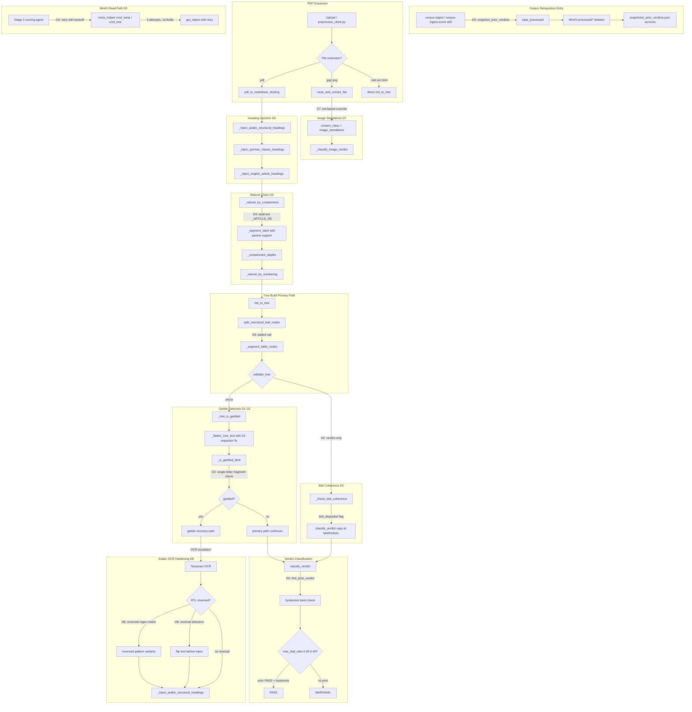
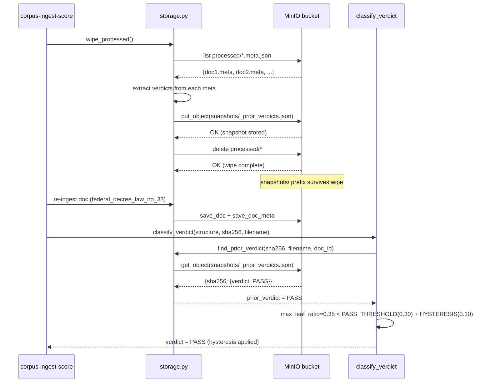
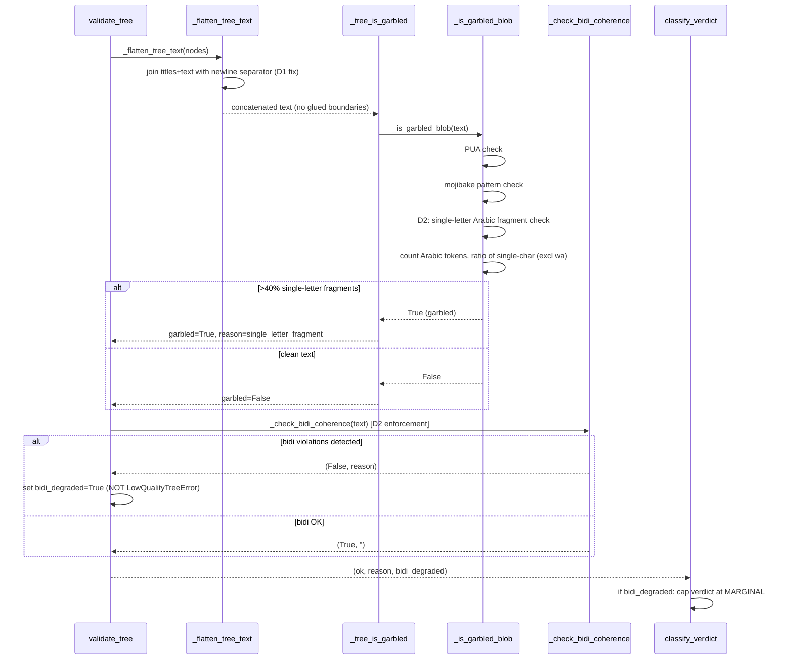
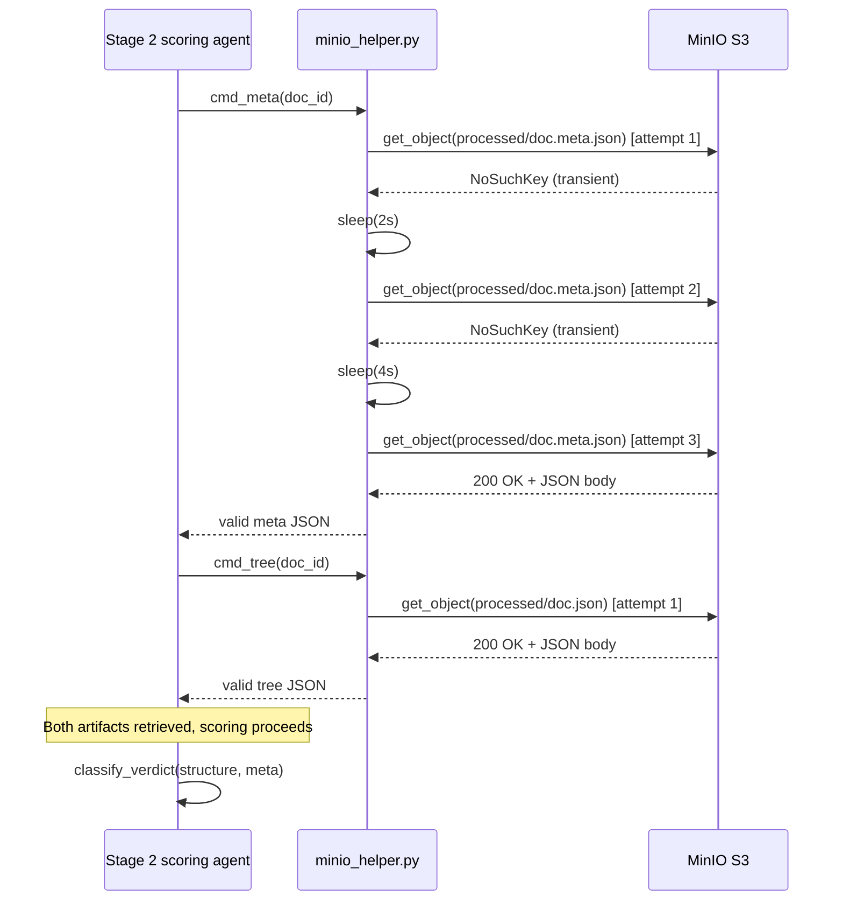

<!-- Space: CITRA -->
<!-- Title: Design Document: RFC-033 RFC-033: Run-15 Corpus Re-ingestion Quality Fixes -->
<!-- Folder: Designs -->

# Design Document: RFC-033 RFC-033: Run-15 Corpus Re-ingestion Quality Fixes

## Traceability

| Artifact | Reference |
|---|---|
| Governing RFC(s) | [RFC-033: RFC-033: Run-15 Corpus Re-ingestion Quality Fixes](../rfcs/033-run15-run15-reingestion-quality-fixes.md) |
| Audit | [audit/CORPUS_REINGESTION_AUDIT_RUN-15.md](../../audit/CORPUS_REINGESTION_AUDIT_RUN-15.md) |
| Implementation Plan | [tasks-rfc033-run15-reingestion-quality-fixes.md](../tasks/tasks-rfc033-run15-reingestion-quality-fixes.md) |
| Hard Rules (binding) | [CLAUDE.md § Hard Rules](../../CLAUDE.md#hard-rules) |

## Overview

RFC-033 addresses nine defects (D0-D8) surfaced by the Run-15 corpus re-ingestion audit across the PageIndex document-ingestion pipeline. The fixes span four subsystems: verdict hysteresis wiring in the reingestion pipeline (D0), garble-detection accuracy in helpers.py (D1, D2), MinIO read-path resilience in minio_helper.py (D3), structural heading/numbering recognition in converters.py (D4, D5, D8), tree-build path completeness in client.py (D6, D7). Together they target the Run-15 tally of 12 MARGINAL / 1 FAIL / 1 ERROR, aiming to promote at least 6 documents toward PASS while eliminating false-positive garble detection, false regressions from missing hysteresis, and transient infrastructure errors that produce permanent ERROR verdicts. All changes preserve the existing validate_tree gate contract and the FLAT-03-C1 flat-path design.

## Key Design Principles

1. Snapshot before wipe: any operation that deletes derived stores must atomically snapshot prior verdicts first, so hysteresis-band logic has data to work with.
2. Dead code is a defect: redundant checks that re-evaluate the same predicate on the same input (the _garble_ratio full-text tautology) must be removed, not left dormant.
3. Verdict gates must not gate persistence: new detection heuristics (bidi coherence, single-letter fragments) affect the verdict returned by classify_verdict but must not raise LowQualityTreeError, preserving tree persistence for borderline documents.
4. Retry transient failures: read-path operations against external stores (MinIO) must retry with exponential backoff before producing permanent ERROR verdicts.
5. Heading injection before relevel: structural heading promotion (_inject_german_clause_headings, _inject_english_article_headings) must run before _relevel_by_containment so the relevel chain has headings to work with.
6. Regex widening over new code paths: when a regex like _ARTICLE_RE is too narrow, widen the pattern rather than adding a parallel detection path -- one regex, one truth.
7. Segment before validate: table segmentation (_segment_table_nodes) and leaf splitting (split_oversized_leaf_nodes) must complete before validate_tree so the validated structure reflects the final tree shape.
8. Reversal detection is best-effort: Arabic RTL reversal hardening (D8) improves structure recovery but the flat-path fallback remains the safety net for documents where reversal detection is inconclusive.

## Launch Constraints

1. All 25 corpus documents must be re-ingested and scored after each batch lands; no batch may reduce the Run-15 PASS count (11) or increase FAIL+ERROR count (2).
2. D2 bidi coherence enforcement must ship as verdict-only (bidi_degraded flag caps at MARGINAL); persistence-gating promotion requires measured false-positive rate below 2% across a full corpus cycle.
3. D0 snapshot prefix must be outside processed/ (use snapshots/_prior_verdicts.json) so the wipe does not delete the snapshot it just created.
4. D8 reversed-regex variants must pass negative tests against all non-reversed Arabic documents in the corpus (marsoom 13, marsoom 33) before merge.
5. The four-batch implementation order (Batch 0: D0/D1/D3/D4, Batch 1: D6/D7, Batch 2: D2/D5, Batch 3: D8) must be respected to avoid cross-dependency conflicts in helpers.py garble detection.

## Architecture

### High-Level Pipeline Flow

### Architecture Decisions

**D0 — Wire hysteresis snapshot into corpus reingestion pipeline** (RFC-033 D0): Create a wipe_processed() utility in storage.py that atomically: (1) calls snapshot_prior_verdicts() to serialize all current verdicts to snapshots/_prior_verdicts.json (a MinIO prefix outside processed/), then (2) deletes all processed/* objects. Update find_prior_verdict() to read from snapshots/_prior_verdicts.json instead of processed/_prior_verdicts.json. Update both .claude/skills/corpus-ingest/SKILL.md and .claude/skills/corpus-ingest-score/SKILL.md agent instructions, plus the actual wipe call sites in .claude/workflows/corpus-ingest.js (lines 44-58) and .claude/workflows/corpus-ingest-score.js (lines 49-63) to invoke wipe_processed() instead of raw MinIO delete operations. The snapshot must complete before any object deletion begins. find_prior_verdict() reads from the snapshot prefix at storage.py:728 and returns the prior verdict string so classify_verdict can apply the +0.10 PASS_HYSTERESIS_BAND at lines 1578-1589, preventing false PASS-to-MARGINAL regressions on byte-identical trees whose max_leaf_ratio falls in the 0.30-0.40 band.

Rejected alternative: Store prior verdicts in Redis instead of MinIO. Rejected because Redis is ephemeral (restarted during infra maintenance) and the snapshot must survive across the full reingestion cycle which can take hours. MinIO provides durable object storage with the same API the pipeline already uses.

**D1 — Fix garble-ratio full-text tautology and flatten-text separator** (RFC-033 D1): Two changes in helpers.py: (1) In _garble_ratio() at line 1439, remove the full-text binary check (lines 1443-1444) that re-evaluates _is_garbled_blob + _has_sparse_mojibake on the same concatenated text that _tree_is_garbled already checked. This eliminates the tautology where full_garbled=1.0 always when _tree_is_garbled=True, making the windowed ratio (lines 1450-1455) the sole return value. The windowed ratio divides text into 500-char chunks and computes the fraction of chunks that individually trigger garble detection, providing fine-grained measurement. (2) In _flatten_tree_text() at lines 554-565, insert a newline character between concatenated title and text parts from each node. Currently titles and text are joined with empty string, creating artificial Arabic-Latin-Arabic glued patterns at node boundaries (e.g., an Arabic title ending in a Latin numeral glued to the next node's Arabic text). The newline prevents these cross-boundary artifacts from triggering _has_sparse_mojibake's mixed-script pattern detector.

Rejected alternative: Add an explicit exclusion list for known mixed-script boundary patterns in _has_sparse_mojibake. Rejected because the root cause is the missing separator in _flatten_tree_text creating patterns that should never exist -- fixing the data is cleaner than working around bad data in the detector.

**D2 — Arabic single-letter fragment detection and bidi coherence enforcement** (RFC-033 D2): Three coordinated changes: (a) Add a single-letter Arabic fragment heuristic to _is_garbled_blob() after line 863. The heuristic tokenizes text by whitespace, filters to tokens containing Arabic-script characters (Unicode range 0600-06FF), and flags the text as garbled when >40% of Arabic-bearing tokens are single characters. The Arabic conjunction particle wa (و) is excluded from the single-character count since it is a legitimate single-letter word. This catches the PDF text-layer failure mode where Arabic words are decomposed into individual letters with inter-character spaces (e.g., م ا د ة instead of مادة). (b) Promote BIDI_COHERENCE_ENFORCE from default-false to default-true, but change the enforcement mechanism from raising LowQualityTreeError (which gates persistence) to setting a bidi_degraded flag on the validation result. classify_verdict reads this flag and caps the verdict at MARGINAL when set. This ensures documents like the human-rights doc (347 nodes, 394k chars, known bidi-reversed titles) continue to persist their trees but receive accurate verdicts. Full persistence-gating requires <2% false-positive rate measured across a complete corpus cycle. (c) Wire the single-letter-fragment check into _garble_check_nodes for per-node garble ratio computation, so the per-node inspection can detect fragment garbling alongside existing PUA and mojibake checks.

Rejected alternative: Use an Arabic NLP tokenizer (e.g., camel-tools) to detect fragment decomposition. Rejected because it adds a heavy dependency (300MB+ model) for a heuristic that can be implemented with simple character-class analysis at the token level, and the 40% single-letter threshold is discriminative enough for the observed failure mode.

**D3 — Add retry logic to MinIO read path in ingest+score pipeline** (RFC-033 D3): Wrap the get_object calls in minio_helper.py cmd_meta (line 36) and cmd_tree (line 41) with an exponential-backoff retry decorator: 3 attempts with delays of 2s, 4s, and 8s. Retryable exceptions include minio.error.S3Error with code NoSuchKey (transient consistency), ConnectionError, urllib3.exceptions.ReadTimeoutError, and socket.timeout. After all 3 attempts fail, re-raise the original exception with a clear error message indicating the number of attempts and final error. Additionally, update the Stage 2 agent prompt in .claude/workflows/corpus-ingest-score.js (lines 242-271) to instruct the scoring agent to wait 5 seconds and retry up to 3 times when minio_helper.py returns NoSuchKey, providing a second layer of retry at the agent level. The retry wrapper is implemented as a simple for-loop with time.sleep rather than pulling in a retry library, keeping the dependency footprint unchanged.

Rejected alternative: Add a write-then-verify step in the converter that confirms object existence before reporting success. Rejected because the converter already writes synchronously (save_doc then save_doc_meta via put_object) before emitting success -- the gap is in the read path, not the write path. Adding write verification would add latency to every document without addressing the actual failure point.

**D4 — Extend _ARTICLE_RE to match parenthesized article numbering** (RFC-033 D4): Widen the _ARTICLE_RE regex at converters.py:226 from r'^(?:Art(?:icle|\.)\ s+\d+|\S\s*\d+)' to r'^(?:Art(?:icle|\.)\ s+\(?\s*\d+|\S\s*\(?\s*\d+)' (adding optional open-paren with optional whitespace before the digit group). This single change flows through to _segment_label() at line 298 which uses _ARTICLE_RE.match(t) to extract the numeric label, _containment_depths() at line 360 which builds the depth map from segment labels, and _relevel_by_containment() at line 384 which assigns heading levels based on containment. The label extraction in _segment_label already strips non-digit characters, so '(47)' naturally yields ['47'] without additional parsing. No changes needed downstream of the regex.

Rejected alternative: Add a separate _ARTICLE_PAREN_RE regex and a parallel match branch in _segment_label. Rejected because the parenthesized form is a syntactic variant of the same pattern, not a semantically different heading type. One regex handles both forms with less code and no risk of precedence conflicts between two overlapping patterns.

**D5 — Add German clause-pattern heading injection (Ziffer/Ziff.) and English Article (N) fallback** (RFC-033 D5): Implement two new injection functions in converters.py following the established _inject_arabic_structural_headings pattern (lines 98-140): (1) _inject_german_clause_headings: regex r'^(Ziffer|Ziff\.)\s+\d+' anchored at line start, promoting matched lines to ## headings. The line-start anchor prevents mid-sentence references like 'see Ziffer 1 above' from being promoted. (2) _inject_english_article_headings: regex r'^Article\s+\(?\d+\)?' anchored at line start, promoting matched lines to ## headings when Docling failed to detect them (complementing D4's regex widening which handles headings Docling DID detect but with parenthesized numbering). Both functions are called at the injection site in pdf_to_markdown_docling() at lines 2759-2760, after _inject_arabic_structural_headings and before the _relevel chain. The injection order is: Arabic -> German -> English, applied to both post_md and raw_md variables. Each function preserves existing heading lines (lines already starting with #) unchanged.

Rejected alternative: Extend _inject_arabic_structural_headings to handle all three languages in one function. Rejected because the Arabic injection has language-specific logic (stem matching, RTL handling) that would be muddied by interleaving German and English patterns. Separate functions per language follow the single-responsibility principle and are independently testable.

**D6 — Call _segment_table_nodes on primary tree-build path** (RFC-033 D6): Add result['structure'] = _segment_table_nodes(result.get('structure', [])) at two locations in client.py: (1) after line 1031 on the primary tree-build path, immediately after split_oversized_leaf_nodes and BEFORE validate_tree at line 1034, so the segmented table structure is what gets validated. (2) after line 1428 on the image-escalation path, immediately after split_oversized_leaf_nodes and BEFORE validate_tree at line 1429. The function _segment_table_nodes (already imported at client.py:47) splits TABLE-type nodes with multiple logical sections into per-section sub-nodes, reducing leaf_concentration for table-heavy documents. It is idempotent -- calling it on already-segmented nodes from the garble-recovery paths (lines 1126, 1312) produces identical output, so no conditional guard is needed. RFC-030 explicitly deferred this fix; this RFC picks it up after confirming no ordering-dependent regressions exist.

Rejected alternative: Call _segment_table_nodes inside validate_tree itself so it runs everywhere automatically. Rejected because validate_tree is a pure validation function that should not mutate its input -- mixing mutation into validation violates separation of concerns and makes the validation result dependent on mutation side effects.

**D7 — Implement RFC-022 B2 Part A: image_standalone content_class override** (RFC-033 D7): Add an extension-based content_class override in client.py after the existing all-blocks-are-image check at line 1608. The new check: when the file extension (ext) is in _IMAGE_EXTS and _IMAGE_STANDALONE_PIPELINE_ENABLED is True, force content_class='image_standalone' regardless of the content_class returned by route_and_extract_flat. This is needed because bare image files (.jpg/.png) go through OCR which creates prose blocks, so the all(b.get('role')=='image') check at line 1606 fails. With the override, classify_verdict routes through _classify_image_verdict(image_enrichment_ratio) at helpers.py:1522 instead of the flat_prose promotion gate. _classify_image_verdict returns PASS when ratio >= 0.8 (the pie chart has ratio=1.0), bypassing the MIN_IMAGE_PROMOTED_CHARS floor that blocks the flat_prose path (489 chars < 500 floor). The check must be placed AFTER the existing all-blocks-are-image check but BEFORE the logging at line 1610 so the correct content_class is logged.

Rejected alternative: Lower MIN_IMAGE_PROMOTED_CHARS from 500 to 400 to capture the 489-char pie chart. Rejected because the char floor exists for a reason (preventing low-content documents from getting promoted) and the issue is misclassification, not threshold tuning. A .jpg file should always be classified as image_standalone regardless of OCR char count.

**D8 — Harden Arabic OCR tree-building against Tesseract RTL-reversed text** (RFC-033 D8): Two complementary changes: (1) Extend the Arabic stem regexes _AR_PART_RE, _AR_ARTICLE_RE, _AR_WORD_RE (converters.py lines 81-214) to include reversed variants of their core stems. For each existing stem (e.g., مادة for article), add the reversed form (ةدام) as an alternation. This is a cheap, targeted fix that catches the exact Tesseract mirror-reversal failure mode where the visual glyph order is reversed. The reversed variants are generated by reversing the Unicode character sequence of each stem. (2) Add a per-line reversal detection utility function _detect_arabic_reversal(text) that checks a sample of Arabic-bearing lines against a known-good word list (the same stems used in _AR_WORD_RE plus common Arabic structural words). When >30% of sampled lines contain reversed-but-not-forward matches, the function returns True. When reversal is detected, _inject_arabic_structural_headings reverses each line's character sequence before pattern matching, then keeps the original (reversed) text in the output heading (the regex just needs to match for heading promotion; the text content is what Tesseract produced). The flat-path fallback (FLAT-03-C1 design) remains the safety net when reversal detection is inconclusive.

Rejected alternative: Use a bidirectional text normalization library (e.g., python-bidi) to correct RTL text before processing. Rejected because Tesseract's reversal is a character-sequence reversal (not a Unicode bidi algorithm issue) -- python-bidi solves display-order problems, not OCR character-order problems. The reversal is mechanical and best detected/handled mechanically.

## Sequence Diagrams

### Flow: Hysteresis snapshot and verdict recovery during reingestion

### Flow: Garble detection with D1 separator fix and D2 fragment check

### Flow: MinIO retry with backoff in scoring pipeline

## Correctness Properties

### Property 0: Hysteresis snapshot survives wipe

After wipe_processed() completes, the object snapshots/_prior_verdicts.json MUST exist in MinIO AND all objects under processed/* MUST be deleted. find_prior_verdict(sha256, filename, doc_id) MUST return the verdict string that was stored before the wipe for any document whose sha256+filename match.

### Property 1: Garble ratio reflects windowed measurement only

_garble_ratio(text, expected_script) MUST return a value in [0.0, 1.0] equal to the fraction of 500-char windows that individually trigger _is_garbled_blob or _has_sparse_mojibake. It MUST NOT return 1.0 solely because _tree_is_garbled returned True on the same text. _flatten_tree_text(nodes) MUST insert at least one whitespace character between consecutive node title/text concatenations.

### Property 2: Arabic single-letter fragments detected without false positives on particles

_is_garbled_blob MUST return True when >40% of Arabic-bearing whitespace-delimited tokens are single characters (excluding the conjunction wa). _is_garbled_blob MUST return False on clean Arabic text where <40% of tokens are single characters. When BIDI_COHERENCE_ENFORCE is true, validate_tree MUST NOT raise LowQualityTreeError for bidi violations; instead classify_verdict MUST cap the verdict at MARGINAL via the bidi_degraded flag.

### Property 3: MinIO read retries recover from transient failures

cmd_meta and cmd_tree MUST attempt get_object up to 3 times with exponential backoff (2s, 4s, 8s) before raising an exception. A transient NoSuchKey on attempts 1-2 followed by success on attempt 3 MUST return valid JSON. Exhaustion of all 3 attempts MUST raise the original exception (not swallow it).

### Property 4: Parenthesized article numbering yields containment depth

_segment_label('Article (47) - Title') MUST return ['47']. _segment_label('Article 47 - Title') MUST return ['47']. _containment_depths on a list containing both forms MUST return non-None depth values for both.

### Property 5: German and English heading injection is line-start-anchored

_inject_german_clause_headings MUST promote 'Ziffer 1 Haftung' at line start to '## Ziffer 1 Haftung'. It MUST NOT promote 'see Ziffer 1 above' appearing mid-line. _inject_english_article_headings MUST promote 'Article (3) Definitions' at line start to '## Article (3) Definitions'. Neither function MUST modify lines already starting with '#'.

### Property 6: Table segmentation runs on all tree-build paths

On the primary tree-build path (client.py ~line 1031), the structure passed to validate_tree MUST have had _segment_table_nodes applied. On the image-escalation path (client.py ~line 1428), the structure passed to validate_tree MUST have had _segment_table_nodes applied. Documents on garble-recovery paths MUST produce identical output (idempotency).

### Property 7: Image extension forces image_standalone content_class

When ext is in _IMAGE_EXTS and _IMAGE_STANDALONE_PIPELINE_ENABLED is True, content_class MUST be 'image_standalone' regardless of what route_and_extract_flat returned. When ext is '.pdf', the extension-based override MUST NOT fire (only the all-blocks-are-image check applies).

### Property 8: Reversed Arabic stems match in numbering_depth

_AR_ARTICLE_RE MUST match both 'المادة' (forward) and 'ةداملا' (reversed). _AR_PART_RE MUST match both 'الباب' (forward) and 'بابلا' (reversed). _detect_arabic_reversal MUST return True when >30% of sampled Arabic lines contain reversed-but-not-forward stem matches, and False on non-reversed Arabic text.

## Error Handling

New gate reasons and their recovery routing:

1. **bidi_degraded** (D2): When _check_bidi_coherence detects RTL inconsistencies with BIDI_COHERENCE_ENFORCE=true, validate_tree sets bidi_degraded=True on the result tuple instead of raising LowQualityTreeError. classify_verdict reads this flag and caps the verdict at MARGINAL. The tree is still persisted -- this is a verdict-only gate, not a persistence gate. Recovery: none needed; the document is stored with an accurate verdict. Promotion to persistence-gating requires measured false-positive rate below 2%.

2. **single_letter_fragment_garble** (D2): When _is_garbled_blob detects >40% single-letter Arabic fragments, the node is flagged garbled in _garble_check_nodes. This feeds into _tree_is_garbled which triggers the garble-recovery path in client.py (OCR escalation at lines 1060-1130). If OCR recovery also fails, the document falls to the flat path via FLAT-03-C1 design.

3. **visual_order_garble** (D8): When _detect_arabic_reversal identifies Tesseract mirror-reversed text, the reversed text is fed through _inject_arabic_structural_headings with character-reversed lines for pattern matching. If the reversed-pattern variants in _AR_PART_RE/_AR_ARTICLE_RE successfully match, the tree-build proceeds with recovered heading structure. If reversal detection is inconclusive (below the 30% threshold), the document falls to the flat path via FLAT-03-C1 -- this is the intentional safety net.

4. **empty_node_contamination** (D6): When _segment_table_nodes runs on the primary path and produces nodes with empty text (a potential edge case with malformed TABLE blocks), validate_tree catches these via the existing node_count<3 check. The document proceeds to garble-recovery or flat-path as appropriate.

5. **minio_read_exhausted** (D3): When all 3 retry attempts in cmd_meta/cmd_tree fail, the original exception propagates to the Stage 2 scoring agent. The agent-level retry instruction adds another 3 attempts with 5-second waits. If both layers exhaust retries, the document receives an ERROR verdict with a clear message indicating MinIO read failure after 6 total attempts (3 programmatic + 3 agent-level). This is logged but not silently swallowed.

6. **garble_ratio_recalibrated** (D1): After removing the full-text tautology, _garble_ratio returns the windowed ratio which may be significantly lower than 1.0 for documents where only some windows are garbled. classify_verdict at line 1572 compares this ratio against the garble threshold. Documents previously locked at ratio=1.0 (like the SLA doc) will now get their true windowed ratio, potentially dropping below the threshold and avoiding false-positive MARGINAL verdicts.

All new gate reasons are logged at WARNING level with the document filename, the specific reason string, and the numeric value that triggered the gate. Existing Prometheus counters (GARBLE_DETECTION_TOTAL, VALIDATE_TREE_TOTAL) are incremented with new label values for the new reason types.

## Testing Strategy

**Unit tests** (per-decision, ~35 new test functions):

Each decision has 2-4 unit tests targeting the specific function modified. Tests use synthetic inputs (constructed trees, mock MinIO responses, crafted Arabic text) and assert exact outputs. Key examples: D0 tests verify snapshot file location and wipe completeness; D1 tests verify newline separators in _flatten_tree_text output and windowed-only ratio computation; D2 tests verify single-letter fragment detection with wa-exclusion; D3 tests mock get_object failures across retry attempts; D4 tests verify _segment_label on both 'Article 47' and 'Article (47)'; D5 tests verify line-start anchoring rejects mid-sentence matches; D8 tests verify reversed stem matching and reversal detection threshold.

**Negative tests** (critical for D2, D5, D8):

Each heuristic that could false-positive has explicit negative tests against known-clean documents. D2: clean Arabic docs (marsoom 13, marsoom 33) must not trigger fragment detection. D5: mid-sentence 'see Ziffer 1' must not be promoted. D8: non-reversed Arabic documents must not trigger reversal detection. These are the highest-priority tests since false positives cause more operational damage than missed detections.

**Blast-radius tests** (D2 only):

The human-rights document (347 nodes, 394k chars, known bidi-reversed titles) must be explicitly tested to verify it: (a) does NOT raise LowQualityTreeError (tree persists), (b) DOES get capped at MARGINAL by bidi_degraded flag, (c) does NOT lose any content during re-ingestion.

**Integration tests** (per-batch, run after each batch lands):

Full corpus re-ingestion of all 25 documents after each batch, comparing against Run-15 baseline. Assertions: PASS count must not decrease below 11; FAIL+ERROR count must not increase above 2; specific affected documents must show the expected verdict change (e.g., D0: federal_decree_law_no_33 stays PASS with hysteresis; D1: SLA doc garble_ratio drops below 1.0; D3: organizational_decree scores successfully).

**Property-based tests** (D1, D4):

D1: for any list of nodes with mixed-script titles, _flatten_tree_text output must not contain any adjacent Arabic-Latin character pair without intervening whitespace. D4: for any string matching 'Article \(?\d+\)?', _segment_label must return a non-empty list.

**Regression tests** (all decisions):

Documents already on garble-recovery paths (D6) must produce identical trees before and after the change. Documents already matching _ARTICLE_RE without parentheses (D4) must produce identical segment labels. The existing 238-test suite must pass with zero failures after each batch.
