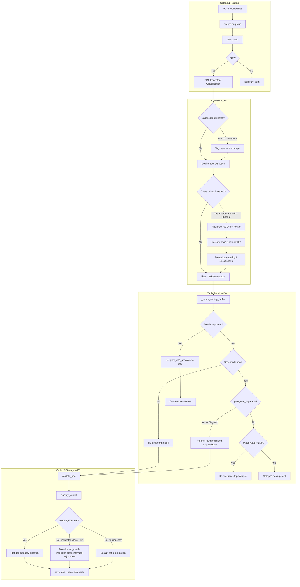
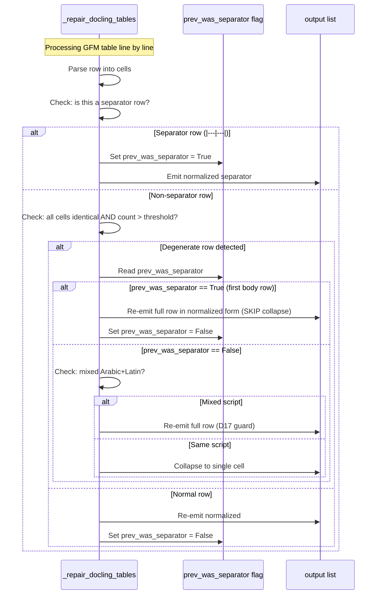
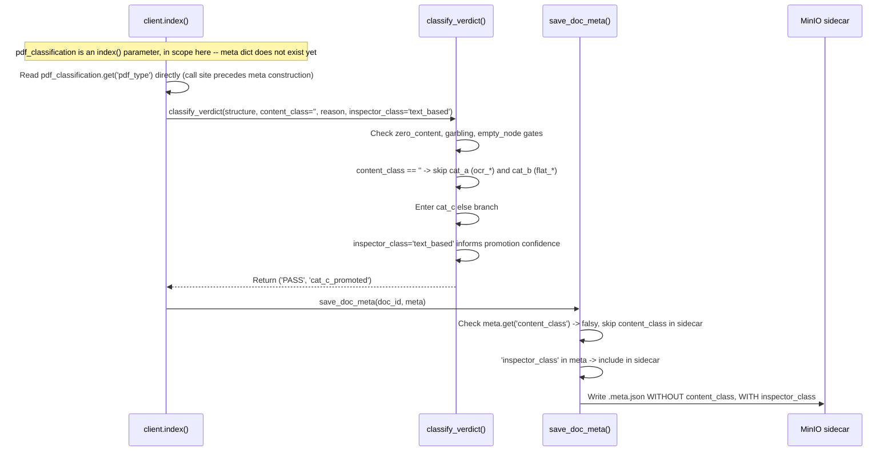
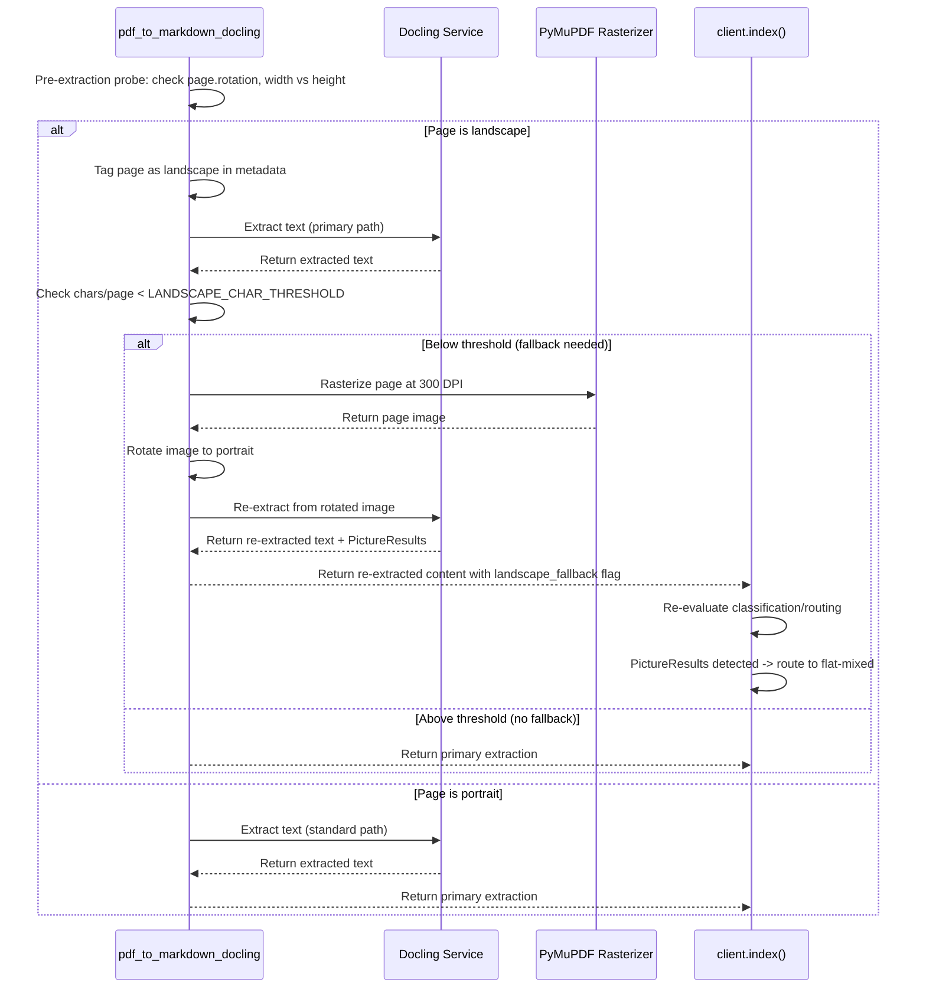

<!-- Space: CITRA -->
<!-- Title: Design Document: RFC-035 Run-18 Table Header Collapse, Content-Class Gap, and Landscape Extraction -->
<!-- Folder: Designs -->

# Design Document: RFC-035 Run-18 Table Header Collapse, Content-Class Gap, and Landscape Extraction

## Traceability

| Artifact | Reference |
|---|---|
| Governing RFC(s) | [RFC-035: Run-18 Table Header Collapse, Content-Class Gap, and Landscape Extraction](../rfcs/035-run18-run18-table-meta-landscape-fixes.md) |
| Audit | [audit/CORPUS_REINGESTION_AUDIT_RUN-18.md](../../audit/CORPUS_REINGESTION_AUDIT_RUN-18.md) |
| Implementation Plan | [tasks-rfc035-run18-table-meta-landscape-fixes.md](../tasks/tasks-rfc035-run18-table-meta-landscape-fixes.md) |
| Hard Rules (binding) | [CLAUDE.md § Hard Rules](../../CLAUDE.md#hard-rules) |

## Overview

RFC-035 addresses three defects surfaced by the Run-18 corpus re-ingestion audit (8 PASS / 12 MARGINAL / 3 FAIL / 1 ERROR across 24 documents). D0 fixes a false-positive degenerate-row collapse in _repair_docling_tables that strips legitimate first-body-row data from GFM tables when Docling emits repeated column labels (cabinet_resolution_no_21 regression, PASS to MARGINAL). D1 threads the existing inspector_class metadata through classify_verdict so tree-path documents that never carry content_class can reach the correct category-specific promotion path (Reitlehrer regression, PASS to MARGINAL). D2 adds landscape-page orientation detection and a rasterize-rotate-reextract fallback so Docling can recover tabular/chart content from rotated pages (uae_numbers_english landscape stall, 748 chars byte-identical across 4 runs). The three decisions are independent and batched in ascending complexity order.

## Key Design Principles

1. Preserve the flat-vs-tree discriminator invariant: content_class in a sidecar means flat-doc routing; tree-doc sidecars must never carry content_class, only inspector_class.
2. Guard, do not suppress: D0 adds a prev_was_separator flag that skips collapse for the first post-separator row rather than disabling degenerate-row collapse globally -- genuine Docling merge artifacts must still be collapsed.
3. Re-emit in normalized form: every row emitted by _repair_docling_tables, whether collapsed, guarded, or passed through, uses the same minimal single-space-padding format (no raw verbatim lines) to maintain whitespace-normalization consistency.
4. Orientation detection must be a pre-extraction probe, not a post-hoc rescue: landscape pages are tagged before Docling extraction so the fallback path can rasterize and rotate before re-extraction, not after content is already lost.
5. Scoring changes stay in classify_verdict, not in the sidecar writer: D1 threads inspector_class into the verdict function as a new optional parameter rather than injecting content_class into tree-doc sidecars, keeping the storage contract intact.
6. No silent quality degradation: any new gate reason (visual_order_garble, empty_node_contamination) introduced by the recovery paths must route through validate_tree and surface as a verdict_reason, never stored silently (CLAUDE.md Hard Rule 5).
7. Incremental corpus validation: D0, D1, and D2 deploy and re-ingest in separate batches so regressions are attributable to individual changes, not compounding.
8. Routing re-evaluation on fallback: D2 Phase 2 re-extraction must feed results back through the same classification/routing logic the portrait companion traverses, so landscape docs that produce PictureResults can route to flat-mixed rather than staying on the tree path.

## Launch Constraints

1. D0 must be validated against repaired markdown for cabinet_resolution_no_21 (Schedules 1-5 body rows intact) before claiming resolution -- the prev_was_separator guard only shields the single first post-separator row.
2. D1 requires investigation of the Run-16 vs Run-18 scoring delta for Reitlehrer before implementation: if the regression is a scoring-criteria change rather than a pipeline data change, the correct fix may be reverting a threshold, not threading inspector_class.
3. D2 integration tests require live remote Docling and MinIO infrastructure; the landscape rasterize-rotate-reextract fallback cannot be validated with mocked extraction.
4. All three fixes target converters/client/helpers -- deploying together without incremental corpus validation risks compounding regressions harder to attribute to individual changes.
5. D2 Phase 2 must not ship without routing re-evaluation logic; rasterize-rotate without reclassification can meet the char-count success criterion while the document stays on the tree path and still loses chart content.

## Architecture

### High-Level Pipeline Flow

### Architecture Decisions

**D0 — Fix degenerate-row collapse treating first post-separator body rows as degenerate** (RFC-035 D0): The _repair_docling_tables function in converters.py (lines 2674-2691) collapses rows where all cells share the same value and the cell count exceeds _RFC029_TABLE_MIN_COLLAPSE_COLS, treating them as Docling merge artifacts. However, in GFM tables, the row immediately after the separator (|---|) is the first body row. When Docling emits tables where this first body row repeats column labels (e.g., sub-header rows in cabinet_resolution_no_21's fee schedules), the heuristic incorrectly collapses legitimate structural data.

The fix introduces a boolean prev_was_separator flag that tracks whether the previous row was a separator. When processing a row that passes the degenerate check (unique_vals==1, len(cells)>threshold), the guard checks prev_was_separator: if true, the row is re-emitted in normalized minimal-padding form ('| ' + ' | '.join(cells) + ' |') and collapse is skipped. The flag is set to True when a separator row is detected (lines 2667-2671) and reset to False after the first non-separator row is processed.

The guard is deliberately narrow: it shields only the single first post-separator row. If Docling emits multi-row repeated-label sequences beyond the first row, those rows will still be collapsed. This is an intentional scope limitation documented as a known constraint, with a broader heuristic (e.g., collapse suppression for the first N body rows, or a minimum-unique-value threshold) deferred to a follow-up RFC if observed in practice.

The existing RFC-034 D17 mixed-script (Arabic+Latin) guard at lines 2677-2687 remains unchanged and fires independently of the new prev_was_separator guard. Both guards run before the collapse line at 2688.

Rejected alternative: Disable degenerate-row collapse entirely for all rows following a separator. Rejected because genuine Docling merge artifacts can appear in body rows (not just the first post-separator row), and suppressing collapse globally would re-introduce the bloated table output that the original heuristic was designed to fix. The narrow single-row guard is the minimum viable fix with the smallest regression surface.

**D1 — Thread inspector_class through classify_verdict for tree-path documents** (RFC-035 D1): Tree-path documents never carry content_class in their sidecar (by design: FLAT-02-C1/C3 in storage.py lines 504-507 guards this). The classify_verdict function (helpers.py:1592) dispatches on content_class: startswith('ocr_') routes to cat_a, startswith('flat_') to cat_b, and the else branch to cat_c. Tree-path documents with content_class='' always fall to the cat_c else branch.

The Reitlehrer regression (PASS in Run 16, MARGINAL in Run 18) was initially framed as a 'missing content_class metadata' defect. Investigation reveals that tree-path documents have NEVER had content_class since inception. The inspector_class field (pdf_classification.pdf_type, e.g., 'text_based', 'scanned', 'image_based') is already persisted in tree-doc sidecars (client.py:2057-2058, storage.py:544).

The fix adds an optional inspector_class parameter to classify_verdict. When content_class is empty (tree-path doc) and inspector_class is present, the cat_c promotion path can use inspector_class to make informed adjustments -- for example, a 'text_based' inspector_class confirms the document was cleanly extracted and the cat_c promotion threshold can be applied with higher confidence. The fix does NOT set content_class on tree-path documents and does NOT write content_class into tree-doc sidecars.

Before implementation, the Run-16 vs Run-18 scoring delta for Reitlehrer must be investigated: if the regression is caused by a scoring-threshold change between runs rather than a pipeline data change, the correct fix may be reverting the threshold change rather than threading inspector_class.

The classify_verdict call site in client.py is at line 2017-2019, which executes BEFORE the meta dict is constructed (line 2021) and BEFORE meta['inspector_class'] is set (line 2057-2058, inside the PDF-only branch) -- so the fix cannot read inspector_class off `meta` at the call site. `pdf_classification` is already an `index()` function parameter (declared at line 804) and is in scope at line 2017, so the call site must pass `pdf_classification.get('pdf_type') if pdf_classification else None` directly. Downstream, the meta dict construction (line 2021-2034) and the existing `meta['inspector_class']` write (line 2057-2058) are unchanged and continue to feed save_doc_meta as before -- no changes to the sidecar writer are needed.

Rejected alternative: Populate content_class in tree-path document sidecars so classify_verdict can dispatch tree docs through the flat_* category paths. Rejected because content_class presence is the flat-vs-tree discriminator used by read_registry_fields (storage.py:607) to select .flat.json vs .json, and by the flat-doc adapter in helpers.py:203-209. Setting content_class on tree docs would misroute downstream readers to nonexistent .flat.json artifacts and break the FLAT-02 invariant.

**D2 — Landscape-oriented page extraction with rasterize-rotate fallback** (RFC-035 D2): Docling's text extraction pipeline misaligns the coordinate system on landscape-oriented (rotated 90-degree) pages, producing minimal text output. The uae_numbers_english_page_16_17_landscape document yields 748 chars (byte-identical across 4 runs) while its portrait companion yields 764 chars plus 4 PictureResults via the flat-mixed path.

Phase 1 (Detection): Add a pre-extraction orientation probe in converters.py::pdf_to_markdown_docling that uses PyMuPDF's page.rotation attribute and a width>height geometric heuristic. Pages identified as landscape are tagged in extraction metadata. This is a read-only probe that does not alter the primary extraction path.

Phase 2 (Fallback): When landscape-tagged pages produce below-threshold character counts (<500 chars/page, configurable via LANDSCAPE_CHAR_THRESHOLD env var), trigger a fallback path: rasterize the page at 300 DPI using PyMuPDF, rotate the image to portrait orientation, and re-extract via Docling or OCR. Critically, the re-extraction output must be fed back through the same classification/routing logic that the portrait companion traverses. Without routing re-evaluation, the document could meet the char-count success criterion while remaining on the tree path and still losing chart content that should route through flat-mixed with PictureResults.

VLM-based chart enrichment (originally D2 Phase 3) is explicitly out of scope and excised to a separate future RFC, as it requires a non-Granite VLM model selection decision that is user-LOCKED.

The detection probe runs inside converters.py; the fallback trigger and routing re-evaluation live at the boundary between converters.py and client.py::index(), where the classification/routing decision is made.

Rejected alternative: Post-hoc character-count rescue without orientation detection: simply re-extract any page with low char counts regardless of orientation. Rejected because non-landscape pages can legitimately have low char counts (e.g., cover pages, divider pages), and blanket re-extraction would waste compute on false positives. Orientation detection makes the fallback targeted and avoids rasterizing pages that are genuinely sparse.

## Sequence Diagrams

### Flow: D0 degenerate-row collapse with prev_was_separator guard

### Flow: D1 classify_verdict with inspector_class for tree-path documents

### Flow: D2 Landscape detection and rasterize-rotate-reextract fallback

## Correctness Properties

### Property 1: D0: First post-separator body rows are never collapsed

For any GFM table processed by _repair_docling_tables, if a row R immediately follows a separator row (|---|) and all cells in R share the same value with cell count exceeding _RFC029_TABLE_MIN_COLLAPSE_COLS, R must appear in the output as a full normalized row ('| cell | cell | ... |') with all original cells preserved. The collapsed_rows counter must NOT increment for R. Conversely, a degenerate row that does NOT immediately follow a separator must still be collapsed to a single-cell row (regression guard for existing behavior).

### Property 2: D1: Tree-doc sidecars never contain content_class; classify_verdict uses inspector_class for tree-path promotion

After D1, (a) no .meta.json sidecar for a tree-path document may contain the key 'content_class'; (b) read_registry_fields called with content_class=None must select processed/<id>.json (not .flat.json); (c) classify_verdict called with content_class='' and inspector_class='text_based' must reach the cat_c promotion branch (not cat_a or cat_b); (d) classify_verdict called with content_class='flat_mixed' must still reach the cat_b promotion branch regardless of inspector_class value (existing behavior preserved).

### Property 3: D2: Landscape pages with below-threshold char counts trigger rasterize-rotate-reextract and routing re-evaluation

For any PDF page where (page.rotation % 180 != 0 OR page.width > page.height) AND the Docling extraction yields fewer than LANDSCAPE_CHAR_THRESHOLD chars, the pipeline must (a) rasterize the page at 300 DPI, (b) rotate to portrait orientation, (c) re-extract via Docling or OCR, and (d) feed the re-extracted content through classification/routing so that PictureResult detection can fire and route the document to flat-mixed if applicable. The final char count for the re-extracted page must exceed 748 chars (the current stalled baseline) for the uae_numbers_english landscape document.

## Error Handling

New gate reasons introduced or touched by D0-D2 route through the existing validate_tree / classify_verdict / save_doc_meta pipeline as follows:

1. empty_node_contamination (existing, unchanged): validate_tree detects a high fraction of structurally empty nodes and sets validate_reason='empty_node_contamination_XX'. classify_verdict (line 1614) returns hard FAIL before any promotion branch. No D0-D2 change affects this path.

2. visual_order_garble (potential D2 interaction): If the rasterize-rotate-reextract fallback in D2 produces text with visual-order Arabic (LTR byte order for RTL script), validate_tree's bidi coherence check may set validate_reason='bidi_degraded'. classify_verdict (line 1636-1640) caps the verdict at MARGINAL. The D2 fallback must NOT suppress this gate -- garbled re-extraction is worse than low char counts.

3. low_quality_tree / rtl_reversal (existing, unchanged): validate_tree raises LowQualityTreeError for severe RTL reversal. The arq worker catches this and records the job as failed with reason='low_quality_tree: rtl_reversal'. No stored artifact is created. ward-597 correctly follows this path in Run 18.

4. D0 does not introduce new gate reasons. A collapsed-vs-preserved row decision is purely a table-repair transformation; it does not affect validate_tree outcomes. However, if D0's guard preserves rows that contain garbled content, that content flows downstream to validate_tree where existing garble detection handles it.

5. D1's inspector_class threading does not introduce new gate reasons. It modifies the promotion logic within classify_verdict's cat_c branch. If inspector_class is absent or unrecognized, the existing cat_c promotion path fires unchanged (graceful degradation).

6. D2 Phase 2 fallback failure: If rasterization or rotation fails (e.g., PyMuPDF cannot render the page), the fallback must log a warning and fall through to the original low-char-count extraction rather than raising an exception. The document proceeds with its original (degraded) extraction, and the low char count surfaces naturally through classify_verdict's node_count/depth/max_leaf_ratio logic as a MARGINAL or FAIL verdict.

## Testing Strategy

Unit Tests:

D0 - _repair_docling_tables guard:
- Construct a GFM table with a header row, separator row (|---|---|---|), and a first body row where all cells are identical (simulating Docling's repeated-label emission). Assert the body row is preserved in normalized form, not collapsed. Assert collapsed_rows count is 0 for this row.
- Construct a genuine degenerate row (NOT immediately after separator) with identical cells. Assert it IS collapsed to a single-cell row (regression guard).
- Construct a table where the first AND second post-separator rows have identical cells. Assert only the first is guarded; the second is collapsed (scope limitation verification).
- Verify the prev_was_separator flag resets after the first non-separator row: row 3+ degenerate rows must still be collapsed even if row 1 was guarded.

D1 - classify_verdict inspector_class threading:
- Call classify_verdict(structure=valid_tree, content_class='', validate_reason=None, inspector_class='text_based') with a tree that would reach cat_c. Assert it reaches cat_c_promoted (not cat_a or cat_b).
- Call classify_verdict with content_class='flat_mixed' and inspector_class='text_based'. Assert it reaches cat_b (content_class takes precedence over inspector_class).
- Call classify_verdict with content_class='' and inspector_class=None. Assert it falls through to default cat_c behavior (backward compatibility).
- Sidecar invariant test: construct a tree-doc meta dict, run it through save_doc_meta, read back the sidecar, assert 'content_class' key is absent and 'inspector_class' key is present.

D2 - Landscape detection and fallback:
- Unit test orientation probe: mock a PyMuPDF page with rotation=90 and width>height. Assert it is tagged as landscape.
- Unit test orientation probe: mock a portrait page (rotation=0, height>width). Assert it is NOT tagged as landscape.
- Unit test fallback trigger: mock a landscape-tagged page with 200 chars extracted. Assert the rasterize-rotate-reextract path is invoked.
- Unit test fallback skip: mock a landscape-tagged page with 2000 chars extracted. Assert the fallback is NOT invoked (chars above threshold).

Property-Based Tests:
- For D0: generate random GFM tables with varying cell counts and identical/non-identical cell values. Assert that collapse only fires when (a) all cells identical, (b) cell count > threshold, AND (c) row does not immediately follow a separator.
- For D1: generate random (content_class, inspector_class) pairs. Assert that content_class always takes routing precedence and inspector_class only influences the cat_c branch.

Integration Tests (require live Docling/MinIO):
- D0: Re-ingest cabinet_resolution_no_21 and verify Schedule 1-5 body rows are intact in the processed JSON. Assert verdict improves from MARGINAL back to PASS.
- D1: Re-ingest Reitlehrer and verify verdict improves without content_class appearing in the tree-doc sidecar.
- D2: Ingest uae_numbers_english_page_16_17_landscape and verify char count exceeds 748 and document routes to flat-mixed with PictureResults (matching portrait companion behavior).
