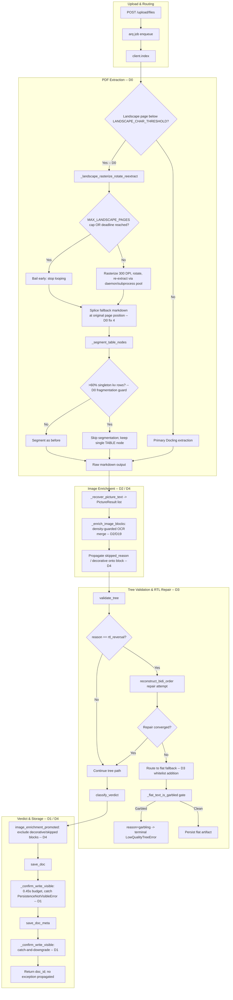
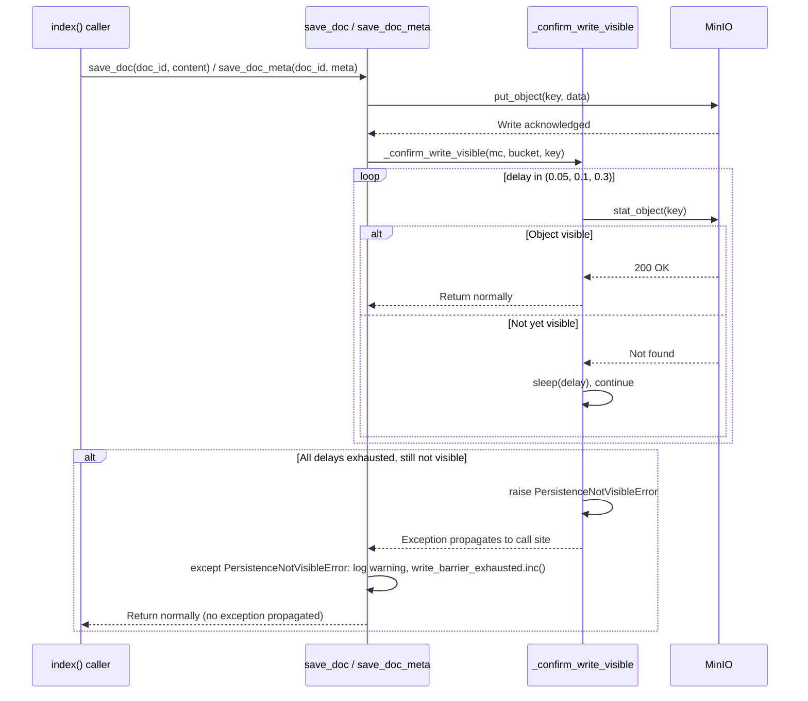
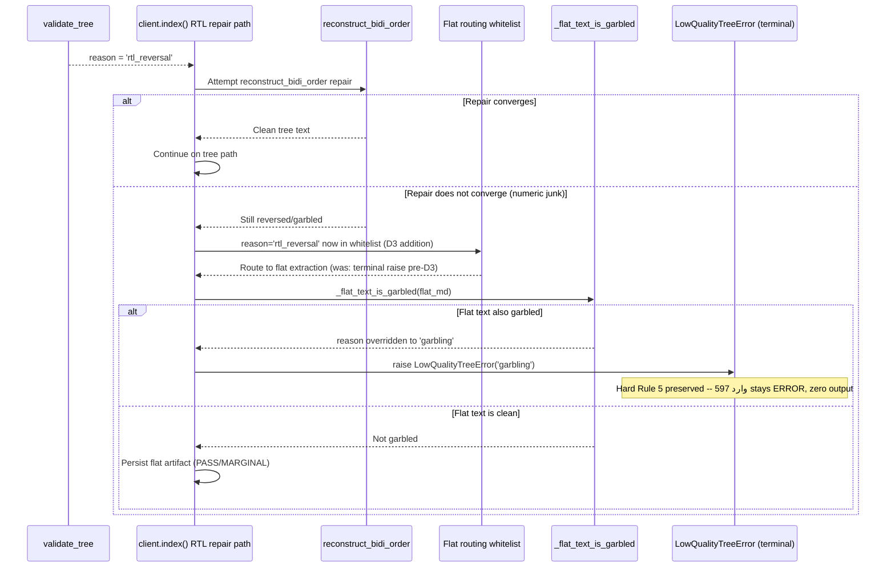
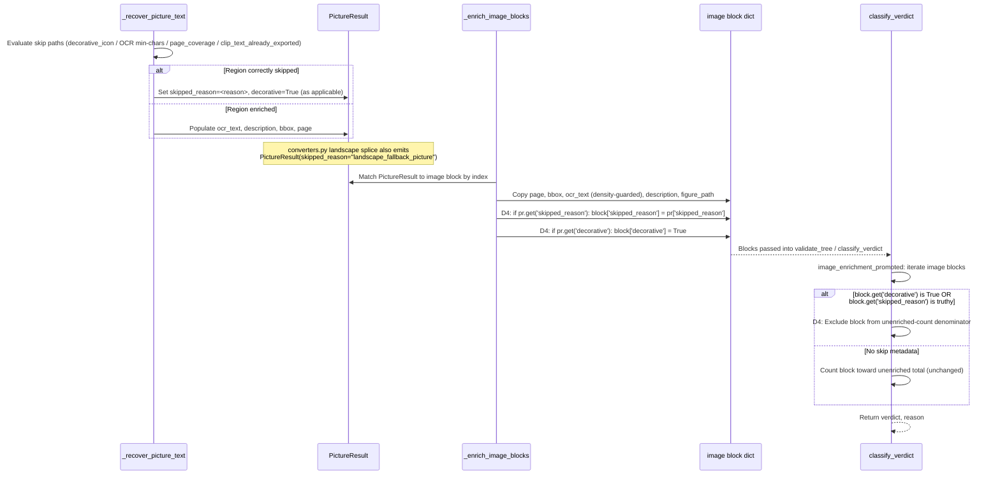
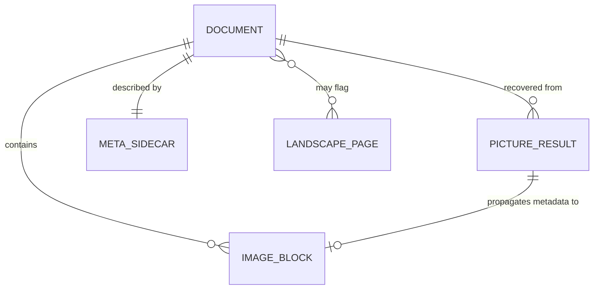

<!-- Space: CITRA -->
<!-- Title: Design Document: RFC-036 Run-19 Landscape Runaway, Write-Barrier Retry, and Enrichment Propagation Fixes -->
<!-- Folder: Designs -->

# Design Document: RFC-036 Run-19 Landscape Runaway, Write-Barrier Retry, and Enrichment Propagation Fixes

## Traceability

| Artifact | Reference |
|---|---|
| Governing RFC(s) | [RFC-036: Run-19 Landscape Runaway, Write-Barrier Retry, and Enrichment Propagation Fixes](../rfcs/036-run19-run19-landscape-writebarrier-enrichment-fixes.md) |
| Audit | [audit/CORPUS_REINGESTION_AUDIT_RUN-19.md](../../audit/CORPUS_REINGESTION_AUDIT_RUN-19.md) |
| Implementation Plan | [tasks-rfc036-run19-landscape-writebarrier-enrichment-fixes.md](../tasks/tasks-rfc036-run19-landscape-writebarrier-enrichment-fixes.md) |
| Hard Rules (binding) | [CLAUDE.md § Hard Rules](../../CLAUDE.md#hard-rules) |

## Overview

RFC-036 addresses five defects surfaced by the Run-19 corpus re-ingestion audit (9 PASS / 12 MARGINAL / 1 FAIL / 3 ERROR across 25 documents). [D0](../rfcs/036-run19-run19-landscape-writebarrier-enrichment-fixes.md#d0-landscape-reextract-runaway-page-cap-thread-kill-splice-fix-and-fragmentation-guard) caps and hardens the uncommitted RFC-035 D2 landscape rasterize-rotate-reextract path, which currently runs an uncapped serial loop with non-daemon `ThreadPoolExecutor` threads that survive timeout and produces chart-axis fragmentation (uae_numbers FAIL, world-stats-pocketbook ERROR). [D1](../rfcs/036-run19-run19-landscape-writebarrier-enrichment-fixes.md#d1-write-barrier-delay-cap-schedule-and-catch-persistencenotvisibleerror-in-save-callers) reduces the RFC-034 D18 write-barrier delay budget from 4.4s/call to 0.45s/call and catches `PersistenceNotVisibleError` at the `save_doc`/`save_doc_meta` call sites so a successful write never surfaces as an unhandled `RuntimeError` (اتفاقية مستوى الخدمة ERROR, landed late outside the scorer polling window). [D2](../rfcs/036-run19-run19-landscape-writebarrier-enrichment-fixes.md#d2-land-staged-d19-enrichment-density-preserve-fix) lands the already-staged RFC-034 D19 `_ocr_information_density` displacement guard, isolating its hunks from unrelated uncommitted work via selective staging. [D3](../rfcs/036-run19-run19-landscape-writebarrier-enrichment-fixes.md#d3-rtl-reversal-add-flat-fallback-routing-instead-of-terminal-rejection) adds `rtl_reversal` to the flat-routing whitelist so documents where tree extraction fails but flat extraction is clean can persist instead of being terminally rejected, while the existing flat-path garble gate remains the safety net for documents (وارد 597) where both paths are equally garbled. [D4](../rfcs/036-run19-run19-landscape-writebarrier-enrichment-fixes.md#d4-propagate-pictureresult-skip-metadata-to-image-blocks-and-suppress-false-enrichment-verdicts) propagates `skipped_reason`/`decorative` metadata from `PictureResult` onto image blocks and excludes tagged-decorative and landscape-fallback blocks from `classify_verdict`'s `image_enrichment_promoted` unenriched count, fixing false MARGINAL verdicts on GHV-TKV-Tarif and Unfallversicherung. The five decisions batch into two waves: Batch 0 (D0, D1, D2 — critical, independent) and Batch 1 (D3, D4 — improvements that depend on Batch 0 stability).

## Key Design Principles

1. **Bound every reextraction loop.** D0's landscape fallback must never run unbounded — a hard page cap (`MAX_LANDSCAPE_PAGES`) and a monotonic wall-clock deadline are both required; either alone is insufficient (a single slow page can still blow the budget under a page-count-only cap).
2. **Kill what you spawn.** A `future.result(timeout=...)` that raises `TimeoutError` must guarantee the underlying work stops, not merely stop waiting for it. Non-daemon `ThreadPoolExecutor` threads that keep running past a logical timeout are a correctness bug, not a performance nuance — they starve the child process from exiting cleanly, which the arq worker then observes as an unattributed timeout kill rather than a status.
3. **Splice, don't append.** Any fallback content recovered out-of-band (landscape reextraction) must be spliced back into its original page position in the document, not appended at the end — ordering is part of correctness for downstream chunking and node structure.
4. **Guard against a heuristic's own success.** `_segment_table_nodes`'s row-segmentation heuristic that helped tables in prior RFCs can itself fragment content it was never meant to touch (chart axis labels). A singleton-ratio guard (>60% single-value rows) recognizes this failure mode and opts the block out of segmentation rather than tuning thresholds further.
5. **A successful write must never look like a failure.** D1's `_confirm_write_visible` is an observability probe layered on top of an already-successful `put_object`. Its exhaustion is evidence of eventual-consistency lag, not data loss, and must never propagate as an exception that triggers job retry.
6. **Trivial fixes ship trivially.** D2 is a "commit what's staged" operation with zero new implementation; the only design obligation is to isolate its hunks with `git add -p` / explicit paths so it does not drag in unrelated uncommitted RFC-035 work.
7. **Rejection must be the last resort, not the first response to a repair failure.** D3 does not weaken Hard Rule 5 (never silently persist a low-quality tree) — it removes a redundant terminal raise that fires *before* the existing flat-fallback + garble-gate safety net gets a chance to run. The garble gate remains the sole authority on whether garbled RTL content is rejected.
8. **A correct skip is not a defect.** D4 treats `skipped_reason`/`decorative` as first-class metadata that must survive the `PictureResult` → image-block boundary so that verdict scoring (`classify_verdict`) can distinguish "content was never recovered because it was decorative/out-of-scope" from "content was lost." Suppressing false `image_enrichment_promoted` verdicts is a scoring-accuracy fix, not a quality-bar relaxation.
9. **No cross-batch coordination hazards.** The suppression of `landscape_fallback_picture` `PictureResult`s from `image_enrichment_promoted` originates conceptually in D0 but is implemented entirely in D4's `classify_verdict` filter, avoiding two decisions touching the same code path in the same batch (see [Implementation Plan](../rfcs/036-run19-run19-landscape-writebarrier-enrichment-fixes.md#implementation-plan)).

## Launch Constraints

1. `MAX_LANDSCAPE_PAGES` is a heuristic cap and needs calibration against the corpus; it may cause legitimately landscape-heavy documents (e.g. presentation decks) to lose content on pages beyond the cap. Ship with a documented default and a corpus spot-check, not a "correct forever" value.
2. Replacing `ThreadPoolExecutor` with a subprocess-per-chunk or daemon-thread pool must not measurably slow down chunked Docling conversion for documents that never touch the landscape path — this is a shared code path (`_pdf_to_markdown_docling_chunked`), not a landscape-only one.
3. D0's page-position splice changes block ordering for every document that triggers the landscape path, not only the regressed ones. A corpus regression check for any other document that triggers landscape reextraction is required before this is considered safe to ship broadly.
4. D1's reduced write-barrier budget (4.4s → 0.45s) assumes MinIO read-after-write consistency is sub-100ms in the deployed environment. If a higher-latency MinIO backend is ever introduced, the schedule must be re-validated, not silently inherited.
5. D2 must use selective staging (`git add -p` or explicit file paths) — the working tree has other uncommitted RFC-034/RFC-035 changes in `converters.py`, `helpers.py`, and `storage.py` that must not be dragged into the D19 commit.
6. D3 does not change وارد 597's ERROR verdict and must not be represented as doing so; the garble gate correctly rejects numeric-junk flat text on both paths. Full resolution for that document is out of scope (tracked under RFC-036 Out-of-Scope items [4,9,12]).
7. D4's decorative-exclusion filter must not be widened to swallow genuine enrichment failures. Validation against edge cases in `_recover_picture_text`'s skip paths (`decorative_icon`, OCR min-chars, `page_coverage`, `clip_text_already_exported`) is required before the filter is trusted at scale.
8. All five decisions modify code that is currently uncommitted on `feat/pdf-inspector-shadow-pilot` alongside other uncommitted RFC-034/RFC-035 work; staging order across Batch 0 and Batch 1 must avoid merge/rebase conflicts with that existing working-tree state.

## Architecture

### High-Level Pipeline Flow



### Architecture Decisions

**D0 — Landscape reextract runaway: page cap, thread kill, splice fix, and fragmentation guard** ([RFC-036 D0](../rfcs/036-run19-run19-landscape-writebarrier-enrichment-fixes.md#d0-landscape-reextract-runaway-page-cap-thread-kill-splice-fix-and-fragmentation-guard)): `_landscape_rasterize_rotate_reextract` (`converters.py`, uncapped serial loop starting ~line 2060) currently reextracts every page flagged by `_landscape_pages_below_threshold` with no upper bound. A 292-page document such as world-stats-pocketbook with dense numeric tables triggering `LANDSCAPE_CHAR_THRESHOLD=500` (line 2003) blows the per-chunk 1500s timeout inside `_pdf_to_markdown_docling_chunked` (line 2900). The fix adds a `MAX_LANDSCAPE_PAGES` constant and a monotonic wall-clock deadline check inside the per-page loop, bailing early when either is reached.

Independently, the `ThreadPoolExecutor` used inside `_pdf_to_markdown_docling_chunked` (instantiated at line 2959, `pool = ThreadPoolExecutor(max_workers=1)`) spawns non-daemon threads. `future.result(timeout=...)` only abandons *waiting*; `pool.shutdown(cancel_futures=True)` only cancels *unstarted* futures — a thread already inside the landscape loop keeps running past the logical timeout, blocking clean child-process exit and causing arq to hard-kill the job at `JOB_TIMEOUT` with no status recorded. The fix replaces the plain pool with either a subprocess-per-chunk approach or a daemon-thread pool that can actually be terminated on timeout.

Chart axis labels recovered by the 300-DPI rasterize-rotate path are currently appended at document end rather than spliced into page position, and are then shattered by `_segment_table_nodes` (`helpers.py` line 2417) into 71+ singleton kv blocks — the fragmentation seen in uae_numbers_landscape's FAIL verdict. The fix (a) splices landscape fallback markdown into its correct page position in `pdf_to_markdown_docling` (line 3007) instead of appending at end, and (b) adds a singleton-ratio guard to `_segment_table_nodes`: when >60% of a table's rows are single-value cells (axis-label rows), segmentation is skipped and the block is kept as a single TABLE node. `LANDSCAPE_CHAR_THRESHOLD` is also re-tuned to additionally require detected picture/graphic regions, not low char count alone, to reduce false-positive triggers on dense-but-legitimate tabular pages.

Rejected alternative: patch only the page cap and leave the `ThreadPoolExecutor` as-is, relying on the arq job-level timeout as the safety net. Rejected because the arq kill produces no attributable status (`converter_child_failed` never fires; the job simply vanishes at `JOB_TIMEOUT`), which is strictly worse for observability than a controlled internal timeout with a clean error status — and it does nothing for the fragmentation defect, which is independent of the timeout issue.

**D1 — Write-barrier delay: cap schedule and catch `PersistenceNotVisibleError` in save callers** ([RFC-036 D1](../rfcs/036-run19-run19-landscape-writebarrier-enrichment-fixes.md#d1-write-barrier-delay-cap-schedule-and-catch-persistencenotvisibleerror-in-save-callers)): `_confirm_write_visible` (`storage.py` line 36) polls `stat_object` against `_WRITE_BARRIER_DELAYS = (0.1, 0.3, 1.0, 3.0)` (line 29), totaling 4.4s per call and up to 8.8s worst-case across the two call sites in `save_doc` (line 212) and `save_doc_meta` (line 575). On exhaustion it raises `PersistenceNotVisibleError` (line 32, a `RuntimeError` subclass), which today is unhandled at both call sites and propagates to the child process, mapped to the generic `converter_child_failed` reason string. That string is absent from `_TERMINAL_CHILD_REASONS` in `worker.py`, so arq retries the whole job (`MAX_TRIES=2`), potentially doubling wall-clock time.

The fix reduces `_WRITE_BARRIER_DELAYS` to `(0.05, 0.1, 0.3)` (0.45s total), since MinIO read-after-write consistency in the deployed environment is typically sub-100ms, and wraps each `_confirm_write_visible` call at both call sites in a `try/except PersistenceNotVisibleError` that logs a warning, increments a new `write_barrier_exhausted` Prometheus counter (`metrics.py`), and returns normally without re-raising. Because the `put_object` has already succeeded before `_confirm_write_visible` runs, a `stat_object` failure at this point is a visibility-probe gap, not a write failure — catching it at the call site means it never reaches the child process, and no change to `_TERMINAL_CHILD_REASONS` or worker-level classification is needed.

The design explicitly does not claim certainty that this mechanism caused the اتفاقية مستوى الخدمة late-landing ERROR — no worker logs confirming `PersistenceNotVisibleError` fired or a retry occurred for `doc_id d58be46f` have been located, and the 8.8s worst-case barrier alone cannot explain 3-5 minutes of lateness. The fix is justified independently on engineering grounds: the barrier budget is over-provisioned and an unhandled exception from an already-successful write is a correctness bug regardless of its role in this specific incident.

Rejected alternative: add `converter_child_failed` (or a new reason string) to `_TERMINAL_CHILD_REASONS` in `worker.py` so a retry never fires even if the exception propagates. Rejected because it treats the symptom (retry storms) rather than the cause (an observability probe raising an exception that looks like a data-loss error); catching at the call site is strictly narrower and leaves `_TERMINAL_CHILD_REASONS` semantics untouched for genuinely terminal converter failures.

**D2 — Land staged D19 enrichment density-preserve fix** ([RFC-036 D2](../rfcs/036-run19-run19-landscape-writebarrier-enrichment-fixes.md#d2-land-staged-d19-enrichment-density-preserve-fix)): `_ocr_information_density` (`client.py` line 710) and the density-guarded merge inside `_enrich_image_blocks` (line 719, comparison logic at lines 754-763) are fully implemented — the fix is a git-staging operation, not a code change. `_ocr_information_density(text)` scores `(alnum + digits) / max(len(text), 1)`; when `existing_density > new_density * 1.5`, existing OCR text is preserved and only logged (line 756-761); otherwise the two texts are concatenated (line 763). This prevents the Layer-2 displacement bug where real OCR digits (e.g. 489 chars) get replaced by lower-density placeholder description text (e.g. 1,203 chars, ratio=0.50).

Because `git status` shows `client.py` modified alongside other uncommitted RFC-034/RFC-035 changes spanning `converters.py`, `helpers.py`, and `storage.py`, the commit must use `git add -p` (or explicit `git add src/pageindex_mcp/client.py:<hunk> tests/test_rfc034_d19_enrichment.py`) to isolate exactly the D19 hunks — a broad `git add -A` or `git add client.py` (whole file) would improperly bundle unrelated D0/D1/D3/D4 work-in-progress into a single commit and defeat batch attribution.

Rejected alternative: re-implement D19 from the RFC-036 description rather than committing the existing staged diff. Rejected — the staged code is already correct and tested (`tests/test_rfc034_d19_enrichment.py` exists); re-implementing risks introducing a behavioral drift from what was actually validated.

**D3 — RTL reversal: add flat-fallback routing instead of terminal rejection** ([RFC-036 D3](../rfcs/036-run19-run19-landscape-writebarrier-enrichment-fixes.md#d3-rtl-reversal-add-flat-fallback-routing-instead-of-terminal-rejection)): `validate_tree` (`helpers.py` line 1375, referenced) can return `reason='rtl_reversal'`. `client.py`'s RTL repair path (lines 1413-1444) attempts `reconstruct_bidi_order` (line 1426); when the underlying text is numeric junk rather than genuinely reversed Arabic, the repair does not converge. The RFC-033 D8 flat-comparison reroute (lines 1444-1475) only reclassifies to `'node_count<3'` when flat text is clean while tree text is still reversed — it does nothing when both paths are equally garbled. Today, `'rtl_reversal'` sits in the terminal-raise tuple at line ~1990 (`"garbling", "node_garbling", "visual_order_garble", "node_count<3", "depth<2", "rtl_reversal", "reordered"`) and is excluded from the flat-routing whitelist at line 1707 (`reason in ("node_count<3", "depth<2")`), so any `rtl_reversal` document is rejected with zero output before the flat path — and its existing garble gate — ever runs.

The fix adds `'rtl_reversal'` to the flat-routing whitelist at line 1707 and removes it from the terminal-raise tuple when the flat fallback path is available, so that when `reconstruct_bidi_order` fails to converge, the document is routed to the same flat-extraction + `_flat_text_is_garbled` gate (line ~1747) that `'node_count<3'`/`'depth<2'` already use. If the flat text is also garbled, `_flat_text_is_garbled` overrides the reason to `'garbling'`, which remains in the terminal-raise tuple and correctly raises `LowQualityTreeError` — no garble-gate bypass is introduced, and Hard Rule 5 is preserved end-to-end. For وارد 597 specifically, both paths are numeric junk, so the document still ends as ERROR with zero output post-fix; the fix's benefit is for the class of RTL documents where tree extraction genuinely scrambles content that PyMuPDF's flat extraction handles cleanly.

Rejected alternative: attempt a smarter `reconstruct_bidi_order` that distinguishes numeric junk from genuine reversal so the repair converges more often. Rejected as a much larger and less certain effort (heuristics on garbled numeric text are inherently unreliable) compared to simply giving `rtl_reversal` the same flat-fallback + garble-gate treatment every other non-garbling rejection reason already receives.

**D4 — Propagate `PictureResult` skip metadata to image blocks and suppress false enrichment verdicts** ([RFC-036 D4](../rfcs/036-run19-run19-landscape-writebarrier-enrichment-fixes.md#d4-propagate-pictureresult-skip-metadata-to-image-blocks-and-suppress-false-enrichment-verdicts)): `_enrich_image_blocks` (`client.py` line 719) matches `PictureResult`s to image blocks and currently only writes `page`, `bbox`, `ocr_text`, `description`, and `figure_path` onto the block dict (lines 748-765). When `_recover_picture_text` (`converters.py`) correctly skips a region — the sub-20pt `decorative_icon` filter (line 2332), the OCR min-chars gate yielding `decorative=True` (line 2424), the `page_coverage` threshold (lines 2239, 2269), or `clip_text_already_exported` — the resulting `PictureResult` carries `skipped_reason` (`TypedDict` field, line 1651) and `decorative` (line 1652) but neither is ever copied onto the block. Blocks then present as `page=0, bbox={}` with no explanation, and `classify_verdict`'s `image_enrichment_promoted` path (`helpers.py` lines 1655-1675) counts them as unenriched gaps — degrading GHV-TKV-Tarif (3/4 decorative animal silhouettes/logo) and Unfallversicherung (60/63 table-cell checkmark icons) to MARGINAL despite the skips being correct.

Separately, `landscape_fallback_picture` `PictureResult`s emitted by the D0 splice path (`converters.py` line 3281, `PictureResult(page=p["page_no"], skipped_reason="landscape_fallback_picture")`) are not filtered from `image_enrichment_promoted`'s denominator, causing false-positive verdict promotions for any document processed through the landscape reextract path — this is the D0-adjacent case D4 absorbs to avoid two decisions touching `classify_verdict` in the same batch (Principle 9).

The fix (1) extends `_enrich_image_blocks` to copy `pr.get('skipped_reason')` and `pr.get('decorative')` onto the block dict whenever present; (2) extends `classify_verdict`'s `image_enrichment_promoted` calculation in `helpers.py` to exclude blocks where `block.get('decorative')` is `True` or `block.get('skipped_reason')` is truthy from the unenriched-count denominator — a single filter that covers both the decorative-icon case and the landscape-fallback case; (3) audits every skip path inside `_recover_picture_text` (`decorative_icon`, OCR min-chars, `page_coverage`, `clip_text_already_exported`) to confirm each consistently sets `skipped_reason` on the `PictureResult` dict, since the filter in (2) is only as complete as the metadata emitted in (1).

Rejected alternative: filter `landscape_fallback_picture` results inside D0's converter code (skip emitting them into the `PictureResult` list at all) rather than filtering them in `classify_verdict`. Rejected because that would also drop them from `_enrich_image_blocks`'s figure/description reconciliation, losing legitimate metadata about what was attempted; filtering only at the verdict-scoring boundary in D4 keeps the `PictureResult` list complete while fixing scoring accuracy.

### Deployment Architecture

- **Backend**: FastMCP server (`mcp_server.py`) + gunicorn/uvicorn workers in production; arq worker (`pageindex_mcp.worker.WorkerSettings`) as a separate host process consuming the same job queue.
- **Database**: No relational DB for document state; MinIO object storage is the system of record for `uploads/`, `processed/*.json`, `processed/*.meta.json`.
- **Object Storage**: MinIO, accessed via the `minio` Python SDK (`storage.py`); D1's `_confirm_write_visible` polls `stat_object` against this backend after every `put_object`.
- **Task Queue**: `arq` with a Redis broker; `MAX_TRIES=2` retry policy on non-terminal child-process failure reasons (`_TERMINAL_CHILD_REASONS` in `worker.py`), which D1 avoids triggering by catching `PersistenceNotVisibleError` before it reaches the worker boundary.
- **External Integrations**: Remote Docling conversion service (chunked calls via `_pdf_to_markdown_docling_chunked`, D0's `ThreadPoolExecutor`/subprocess boundary); Tesseract CLI for picture OCR (`_recover_picture_text`, D4's skip-metadata source).

### Communication Patterns

| Pattern | Use Case | Technology |
|---------|----------|------------|
| Sync HTTP | Docling chunk conversion request/response | `httpx` client inside `_pdf_to_markdown_docling_chunked` |
| Bounded thread/subprocess pool | Concurrent chunk conversion with a hard timeout | D0: daemon-thread pool or subprocess-per-chunk (replaces plain `ThreadPoolExecutor`) |
| Async job queue | Upload → conversion → validation → persistence pipeline | arq over Redis |
| Write-then-confirm | MinIO `put_object` followed by bounded `stat_object` polling | D1: `_confirm_write_visible`, budget reduced to 0.45s, exceptions caught at call site |
| Metrics push | Observability counters for degraded-but-non-fatal states | Prometheus `Counter` (`write_barrier_exhausted`, D1) |

### Sequence Diagrams

#### Landscape reextract flow — D0

```mermaid
sequenceDiagram
    participant P as pdf_to_markdown_docling
    participant L as _landscape_rasterize_rotate_reextract
    participant Pool as ThreadPoolExecutor / daemon pool
    participant D as Docling Service
    participant S as _segment_table_nodes

    P->>P: _landscape_pages_below_threshold flags N pages
    P->>L: Start per-page reextraction loop
    loop For each flagged page
        L->>L: Check page_index < MAX_LANDSCAPE_PAGES AND now < deadline
        alt Cap or deadline reached
            L->>L: Bail early, stop loop
        else Within budget
            L->>Pool: Submit rasterize(300 DPI) + rotate + reextract chunk
            Pool->>D: Reextract call
            D-->>Pool: Return chunk text
            alt Chunk exceeds per-chunk timeout
                Pool->>Pool: future.result(timeout) raises TimeoutError
                Pool->>Pool: Kill daemon thread / terminate subprocess (guaranteed stop)
            else Completes in time
                Pool-->>L: Return chunk text
            end
        end
    end
    L-->>P: Return landscape_fallback_pages (bounded set)
    P->>P: Splice fallback markdown at original page position (not appended at end)
    P->>S: Pass spliced markdown to table segmentation
    S->>S: Compute singleton-ratio for candidate table block
    alt >60% single-value rows
        S->>S: Skip segmentation; keep single TABLE node
    else Normal table
        S->>S: Segment as before
    end
    S-->>P: Return final structure
```

#### Write barrier flow — D1



#### Flat fallback routing flow — D3



#### Enrichment skip propagation flow — D4



## Service Contracts

### 1. converters.py

**Responsibility**: PDF-to-markdown extraction, including chunked Docling conversion, landscape-page detection/reextraction, and picture recovery/OCR.
**Database**: None (stateless extraction; reads PDF bytes, writes markdown/`PictureResult` structures returned to `client.py`).

```python
# Key functions touched by RFC-036
MAX_LANDSCAPE_PAGES: int  # D0: new module-level cap constant
LANDSCAPE_CHAR_THRESHOLD: int  # D0: existing (line 2003), re-tuned to require picture/graphic regions

def _landscape_rasterize_rotate_reextract(...) -> list[dict]:
    """D0: per-page loop now bails when page_index >= MAX_LANDSCAPE_PAGES
    OR a monotonic wall-clock deadline is reached."""

def _pdf_to_markdown_docling_chunked(...) -> str:
    """D0: ThreadPoolExecutor (line 2959) replaced with a daemon-thread pool
    or subprocess-per-chunk approach that guarantees cleanup on timeout."""

def pdf_to_markdown_docling(...) -> str:  # noqa: PLR0915, C901
    """D0: landscape fallback markdown is spliced into its original page
    position (was: appended at document end)."""

def _recover_picture_text(...) -> list[PictureResult]:
    """D4: audited so every skip path (decorative_icon, OCR min-chars,
    page_coverage, clip_text_already_exported) consistently sets
    skipped_reason on the returned PictureResult."""
```

**Internal Interfaces**:

- Called by `client.py::index()` during PDF extraction; returns markdown text plus a list of `PictureResult` (TypedDict, `skipped_reason`/`decorative` fields at lines 1651-1652) consumed by `_enrich_image_blocks`.
- Emits `PictureResult(page=p["page_no"], skipped_reason="landscape_fallback_picture")` (line 3281) for D0's landscape splice path, which D4's `classify_verdict` filter suppresses from `image_enrichment_promoted`.

### 2. storage.py

**Responsibility**: MinIO persistence of processed documents, metadata sidecars, and figure blobs, including write-visibility confirmation.
**Database**: MinIO bucket (`settings.minio_bucket`) — owns `uploads/`, `processed/*.json`, `processed/*.meta.json`, `figures/`.

```python
# API surface touched by RFC-036 D1
_WRITE_BARRIER_DELAYS: tuple[float, ...]  # D1: (0.05, 0.1, 0.3) -- was (0.1, 0.3, 1.0, 3.0)

class PersistenceNotVisibleError(RuntimeError): ...

def _confirm_write_visible(mc: Minio, bucket: str, key: str) -> None:
    """Polls stat_object across _WRITE_BARRIER_DELAYS; raises
    PersistenceNotVisibleError on exhaustion. Unchanged internal behavior --
    only the delay schedule shrinks under D1."""

async def save_doc(doc_id: str, content: dict) -> None:
    """D1: wraps the _confirm_write_visible(mc, bucket, key) call (line 212)
    in try/except PersistenceNotVisibleError -> log warning,
    write_barrier_exhausted.inc(), return normally (no re-raise)."""

async def save_doc_meta(doc_id: str, meta: dict) -> None:
    """D1: wraps the _confirm_write_visible(mc, bucket, key) call (line 575)
    identically to save_doc."""
```

**Internal Interfaces**:

- Calls MinIO `put_object` then `_confirm_write_visible` synchronously within `save_doc`/`save_doc_meta`; both are invoked from `client.py::index()` on the happy path and are the sole producers of `PersistenceNotVisibleError`.
- Increments `write_barrier_exhausted` (new `metrics.py` counter) on exhaustion instead of propagating.

### 3. client.py

**Responsibility**: Orchestrates the end-to-end `index()` pipeline — extraction dispatch, RTL repair, image enrichment, validation/routing, and persistence calls.
**Database**: None directly; delegates all persistence to `storage.py`.

```python
def _ocr_information_density(text: str) -> float:
    """D2 (RFC-034 D19, staged): (alnum + digits) / max(len(text), 1)."""

async def _enrich_image_blocks(blocks: list[dict], pic_results: list[PictureResult], doc_id: str) -> None:
    """D2: density-guarded OCR merge -- existing_density > new_density * 1.5
    preserves existing OCR instead of concatenating (lines 754-763).
    D4: additionally copies pr.get('skipped_reason') and pr.get('decorative')
    onto block dict when present."""

async def index(self, ...) -> str:  # noqa: C901, PLR0915
    """D3: RTL repair path (lines 1413-1444) -- when reconstruct_bidi_order
    does not converge, 'rtl_reversal' is added to the flat-routing
    whitelist (line ~1707: was ("node_count<3", "depth<2"), now includes
    "rtl_reversal") and removed from the terminal-raise tuple (line ~1990)
    when the flat fallback path is available. _flat_text_is_garbled
    (line ~1747) remains the downstream safety net."""
```

**Internal Interfaces**:

- Calls `converters.py::pdf_to_markdown_docling` / `_recover_picture_text` for extraction and picture recovery.
- Calls `helpers.py::validate_tree` and `helpers.py::classify_verdict` for quality gating and verdict assignment.
- Calls `storage.py::save_doc` / `save_doc_meta` for persistence; D1's exception-catching means `index()` never observes `PersistenceNotVisibleError` from these calls.
- Increments `LOW_QUALITY_TREES` (`metrics.py`) with `reason=` label on terminal raises; D3 changes which reasons reach this line for `rtl_reversal` documents (only genuinely-garbled-on-both-paths cases still raise, now labeled `reason="garbling"` rather than `reason="rtl_reversal"`).

### 4. helpers.py

**Responsibility**: Tree validation (`validate_tree`), verdict classification (`classify_verdict`), and table-node segmentation (`_segment_table_nodes`).
**Database**: None (pure functions over in-memory tree structures).

```python
def _segment_table_nodes(structure: list) -> list:  # noqa: C901, PLR0915
    """D0: new singleton-ratio guard -- when >60% of a candidate table
    block's rows are single-value cells (chart axis labels), segmentation
    is skipped and the block is re-emitted as a single TABLE node."""

def classify_verdict(  # noqa: C901, PLR0915
    structure: list,
    content_class: str,
    validate_reason: str | None,
    image_enrichment_ratio: float | None,
    ...
) -> tuple[str, str]:
    """D4: image_enrichment_promoted path (lines 1655-1675) excludes blocks
    where block.get('decorative') is True or block.get('skipped_reason')
    is truthy from the unenriched-count denominator before computing
    image_enrichment_ratio's promotion eligibility."""
```

**Internal Interfaces**:

- Called by `client.py::index()` after extraction/enrichment completes and before `save_doc`/`save_doc_meta`.
- `_segment_table_nodes` is called from within the extraction post-processing chain in `converters.py`/`client.py` on the spliced markdown structure produced by D0.

### 5. metrics.py

**Responsibility**: Prometheus metric definitions for pipeline observability.
**Database**: None (in-process metric registry, scraped via `/metrics`).

```python
# New counter for D1
write_barrier_exhausted = Counter(
    "pageindex_write_barrier_exhausted_total",
    "Count of _confirm_write_visible exhaustions caught and downgraded to warnings",
    ["operation"],  # "save_doc" | "save_doc_meta"
)

# Existing counter, label semantics shift slightly under D3
LOW_QUALITY_TREES = Counter(...)  # existing (line 142); reason="rtl_reversal" now only
                                    # fires for documents where the flat fallback ALSO
                                    # garbles (reason overridden to "garbling" beforehand
                                    # in most cases -- see client.py contract above)
```

**Internal Interfaces**:

- `write_barrier_exhausted` is incremented from `storage.py::save_doc`/`save_doc_meta` exception handlers (D1); scraped by the existing Prometheus deployment, no new scrape target required.

## Data Models

### Entity Relationship Diagram



### Core Entities (pageindex_mcp — MinIO / in-memory)

```python
class PictureResult:  # TypedDict, converters.py line ~1640
    page: int
    bbox: dict
    ocr_text: str
    description: str
    png_bytes: bytes | None
    skipped_reason: str  # RFC-019 D3 field; D4 adds "landscape_fallback_picture" as a valid value
    decorative: bool  # RFC-023 D2 field

class ImageBlock:  # dict shape inside `structure`, client.py::_enrich_image_blocks
    role: str  # "image"
    index: int  # position in pic_results
    page: int
    bbox: dict
    ocr_text: str
    description: str
    figure_path: str
    skipped_reason: str | None  # D4: newly propagated from PictureResult
    decorative: bool | None  # D4: newly propagated from PictureResult

class LandscapePage:  # internal marker, converters.py D0
    page_no: int
    char_count: int  # below LANDSCAPE_CHAR_THRESHOLD
    has_picture_region: bool  # D0 re-tuned threshold requirement
    reextract_deadline_exceeded: bool  # D0: True if MAX_LANDSCAPE_PAGES/deadline cap fired

class VerdictReason(str, Enum):  # helpers.py::classify_verdict return values
    RTL_REVERSAL = "rtl_reversal"  # D3: now only terminal when flat fallback also garbles
    GARBLING = "garbling"  # terminal, unchanged
    IMAGE_ENRICHMENT_PROMOTED = "image_enrichment_promoted"  # D4: denominator now excludes decorative/skipped blocks
    IMAGE_ENRICHMENT_PROMOTED_BELOW_CHAR_FLOOR = "image_enrichment_promoted_below_char_floor"
```

## Correctness Properties

### Property 1: Landscape page cap bounds reextraction

*For any* document with N pages flagged below `LANDSCAPE_CHAR_THRESHOLD`, `_landscape_rasterize_rotate_reextract` SHALL reextract at most `MAX_LANDSCAPE_PAGES` pages and SHALL stop the loop no later than the configured monotonic deadline, whichever limit is reached first.

**Validates: [D0](../rfcs/036-run19-run19-landscape-writebarrier-enrichment-fixes.md#d0-landscape-reextract-runaway-page-cap-thread-kill-splice-fix-and-fragmentation-guard)**, [task 1.1](../tasks/tasks-rfc036-run19-landscape-writebarrier-enrichment-fixes.md#11-d0a-add-max_landscape_pages-cap-and-deadline)

### Property 2: Thread pool cleanup on timeout

*For any* chunk conversion that exceeds the per-chunk timeout inside `_pdf_to_markdown_docling_chunked`, the system SHALL guarantee the underlying thread or subprocess doing the reextraction work terminates (not merely that the caller stops waiting for its result), so that the child process can exit cleanly and arq observes a controlled timeout status rather than a hard `JOB_TIMEOUT` kill.

**Validates: [D0](../rfcs/036-run19-run19-landscape-writebarrier-enrichment-fixes.md#d0-landscape-reextract-runaway-page-cap-thread-kill-splice-fix-and-fragmentation-guard)**, [task 1.2](../tasks/tasks-rfc036-run19-landscape-writebarrier-enrichment-fixes.md#12-d0b-replace-threadpoolexecutor-with-daemon-or-subprocess)

### Property 3: Landscape content spliced at page position

*For any* landscape fallback markdown recovered by the reextraction path, `pdf_to_markdown_docling` SHALL insert it at its original page position within the document's block sequence, and SHALL NOT append it after the last block of the primary extraction.

**Validates: [D0](../rfcs/036-run19-run19-landscape-writebarrier-enrichment-fixes.md#d0-landscape-reextract-runaway-page-cap-thread-kill-splice-fix-and-fragmentation-guard)**, [task 1.4](../tasks/tasks-rfc036-run19-landscape-writebarrier-enrichment-fixes.md#14-d0d-splice-landscape-markdown-at-page-position)

### Property 4: Singleton-ratio guard prevents fragmentation

*For any* candidate table block passed to `_segment_table_nodes` where more than 60% of rows are single-value cells, the function SHALL skip row segmentation and SHALL emit the block as a single TABLE node; a block at or below the 60% singleton ratio SHALL be segmented per existing (pre-RFC-036) behavior.

**Validates: [D0](../rfcs/036-run19-run19-landscape-writebarrier-enrichment-fixes.md#d0-landscape-reextract-runaway-page-cap-thread-kill-splice-fix-and-fragmentation-guard)**, [task 1.5](../tasks/tasks-rfc036-run19-landscape-writebarrier-enrichment-fixes.md#15-d0e-singleton-ratio-guard-in-_segment_table_nodes)

### Property 5: Write-barrier budget capped

*For any* call to `_confirm_write_visible`, the total elapsed polling delay across `_WRITE_BARRIER_DELAYS` SHALL NOT exceed 0.45 seconds.

**Validates: [D1](../rfcs/036-run19-run19-landscape-writebarrier-enrichment-fixes.md#d1-write-barrier-delay-cap-schedule-and-catch-persistencenotvisibleerror-in-save-callers)**, [task 1.6](../tasks/tasks-rfc036-run19-landscape-writebarrier-enrichment-fixes.md#16-d1-reduce-write-barrier-delays-and-catch-persistencenotvisibleerror)

### Property 6: PersistenceNotVisibleError never propagates

*For any* invocation of `save_doc` or `save_doc_meta` where the underlying `put_object` succeeds but `_confirm_write_visible` raises `PersistenceNotVisibleError`, the caller (`save_doc`/`save_doc_meta`) SHALL catch the exception, log a warning, increment `write_barrier_exhausted`, and return normally — the exception SHALL NOT propagate to `client.py::index()` or to the arq worker.

**Validates: [D1](../rfcs/036-run19-run19-landscape-writebarrier-enrichment-fixes.md#d1-write-barrier-delay-cap-schedule-and-catch-persistencenotvisibleerror-in-save-callers)**, [task 1.6](../tasks/tasks-rfc036-run19-landscape-writebarrier-enrichment-fixes.md#16-d1-reduce-write-barrier-delays-and-catch-persistencenotvisibleerror)

### Property 7: Staged D19 density-preserve active

*For any* image block with existing OCR text whose information density exceeds 1.5x the newly recovered enrichment text's density, `_enrich_image_blocks` SHALL preserve the existing OCR text and SHALL NOT overwrite or dilute it by concatenation; when the reverse holds, texts SHALL be concatenated as before.

**Validates: [D2](../rfcs/036-run19-run19-landscape-writebarrier-enrichment-fixes.md#d2-land-staged-d19-enrichment-density-preserve-fix)**, [task 1.7](../tasks/tasks-rfc036-run19-landscape-writebarrier-enrichment-fixes.md#17-d2-commit-staged-d19-enrichment-density-preserve)

### Property 8: RTL reversal routes to flat fallback

*For any* document where `validate_tree` returns `reason='rtl_reversal'` and `reconstruct_bidi_order` fails to converge, the system SHALL route the document through flat extraction (via the flat-routing whitelist) instead of raising `LowQualityTreeError` immediately.

**Validates: [D3](../rfcs/036-run19-run19-landscape-writebarrier-enrichment-fixes.md#d3-rtl-reversal-add-flat-fallback-routing-instead-of-terminal-rejection)**, [task 2.1](../tasks/tasks-rfc036-run19-landscape-writebarrier-enrichment-fixes.md#21-d3-add-rtl_reversal-to-flat-routing-whitelist)

### Property 9: Garble gate rejects garbled flat text

*For any* document routed to flat fallback under Property 8 whose flat text is also garbled per `_flat_text_is_garbled`, the system SHALL override the reason to `'garbling'` and SHALL raise `LowQualityTreeError`, producing zero stored output (Hard Rule 5 enforcement, no bypass).

**Validates: [D3](../rfcs/036-run19-run19-landscape-writebarrier-enrichment-fixes.md#d3-rtl-reversal-add-flat-fallback-routing-instead-of-terminal-rejection)**, [task 2.1](../tasks/tasks-rfc036-run19-landscape-writebarrier-enrichment-fixes.md#21-d3-add-rtl_reversal-to-flat-routing-whitelist)

### Property 10: Skip metadata propagated to image blocks

*For any* `PictureResult` matched to an image block by `_enrich_image_blocks` that carries a truthy `skipped_reason` or `decorative=True`, the corresponding image block dict SHALL have `skipped_reason` and/or `decorative` set to the same values.

**Validates: [D4](../rfcs/036-run19-run19-landscape-writebarrier-enrichment-fixes.md#d4-propagate-pictureresult-skip-metadata-to-image-blocks-and-suppress-false-enrichment-verdicts)**, [task 2.2](../tasks/tasks-rfc036-run19-landscape-writebarrier-enrichment-fixes.md#22-d4-propagate-skip-metadata-and-suppress-false-verdicts)

### Property 11: Decorative blocks excluded from unenriched count

*For any* image block passed into `classify_verdict`'s `image_enrichment_promoted` calculation where `block.get('decorative')` is `True` or `block.get('skipped_reason')` is truthy (including `skipped_reason="landscape_fallback_picture"`), that block SHALL be excluded from the unenriched-count denominator used to compute `image_enrichment_ratio` promotion eligibility.

**Validates: [D4](../rfcs/036-run19-run19-landscape-writebarrier-enrichment-fixes.md#d4-propagate-pictureresult-skip-metadata-to-image-blocks-and-suppress-false-enrichment-verdicts)**, [task 2.2](../tasks/tasks-rfc036-run19-landscape-writebarrier-enrichment-fixes.md#22-d4-propagate-skip-metadata-and-suppress-false-verdicts)

## Error Handling

New and touched error/gate paths under D0-D4 route through the existing `validate_tree` / `classify_verdict` / arq worker pipeline as follows:

1. **D0 landscape cap/deadline bail (new, non-fatal)**: when `MAX_LANDSCAPE_PAGES` or the deadline fires mid-loop, `_landscape_rasterize_rotate_reextract` returns whatever pages it already processed rather than raising. The document proceeds with a partial landscape recovery; downstream verdict logic (`max_leaf_ratio`, char-count floors) surfaces any resulting quality gap naturally as MARGINAL/FAIL rather than as an exception.
2. **D0 thread/subprocess kill on timeout (new)**: a `FuturesTimeoutError` (or subprocess `TimeoutExpired`) at the per-chunk 1500s boundary must now actually terminate the underlying work. The child process then exits with a clean timeout status rather than being killed by arq at `JOB_TIMEOUT` with no attributable reason — this is an observability improvement, not a new terminal-error category.
3. **D0 singleton-ratio guard (new, non-fatal)**: purely a table-repair transformation decision; it does not raise or alter `validate_tree` outcomes. If the guard preserves rows that are themselves garbled content, existing garble detection downstream is unaffected and still handles it.
4. **D1 `PersistenceNotVisibleError` (downgraded)**: caught at `save_doc`/`save_doc_meta` call sites, logged as a warning, counted via `write_barrier_exhausted`, never re-raised. No change to `_TERMINAL_CHILD_REASONS` in `worker.py` is required — the exception no longer reaches that boundary.
5. **D2 (no new gate reasons)**: `_ocr_information_density`/`_enrich_image_blocks` changes are a text-merge decision internal to enrichment; they do not raise or affect `validate_tree`/`classify_verdict` gate reasons.
6. **D3 `rtl_reversal` (behavior change, existing terminal path preserved)**: `rtl_reversal` is removed from the terminal-raise tuple only when the flat fallback path is available (i.e., `flat_doc_routing` enabled and the whitelist check passes). If the flat text is also garbled, `_flat_text_is_garbled` overrides the reason to `'garbling'`, which remains terminal — `LowQualityTreeError('garbling')` is raised exactly as before for this class of document. `LOW_QUALITY_TREES.labels(reason=...)` increments with the *overridden* reason, so RTL-reversal-turned-garbling documents are now labeled `garbling` in metrics rather than `rtl_reversal`; dashboards/alerts keyed on the `rtl_reversal` label value should be reviewed for this shift.
7. **D4 skip-metadata propagation (no new gate reasons)**: purely additive metadata on block dicts and a denominator filter inside `classify_verdict`. It cannot cause a document to fail that would otherwise pass under garbling/empty-node/`max_leaf_ratio` gates — it only affects the `image_enrichment_promoted` promotion branch's inputs.
8. **D4 filter over-exclusion risk (documented, not auto-mitigated)**: if `_recover_picture_text` incorrectly classifies a content-bearing image as decorative, D4's filter will suppress it from the unenriched count and the verdict will not reflect the loss. This is a known risk (RFC-036 Risks) mitigated only by the skip-path audit in `_recover_picture_text` (Launch Constraint 7), not by additional runtime error handling.

## Testing Strategy

### Testing Layers

1. **Property-Based Tests (PBT)**: exercise Properties 1, 4, 5 (D0 page cap under randomized landscape-page-count fixtures; D0 singleton-ratio guard under randomized row-identity distributions; D1 delay-schedule sum) across generated inputs.
2. **Unit Tests**: cover the remaining properties with targeted fixtures — Property 2 (mocked timeout + thread/subprocess liveness check), Property 3 (splice position assertion), Property 6 (mocked `PersistenceNotVisibleError`), Property 7 (density comparison table), Properties 8-9 (`rtl_reversal` routing with clean vs. garbled flat text), Properties 10-11 (`PictureResult` → block propagation and `classify_verdict` filter).
3. **Integration Tests**: require live Docling/MinIO — re-ingest uae_numbers_landscape (D0, FAIL→MARGINAL target), world-stats-pocketbook (D0, ERROR→clean-timeout-with-status target), اتفاقية مستوى الخدمة (D1, completes within scorer polling window), the pie-chart JPG (D2, OCR preserved not displaced), وارد 597 (D3, confirms still-ERROR with improved diagnostics), GHV-TKV-Tarif and Unfallversicherung (D4, MARGINAL→PASS target).
4. **End-to-End Tests**: full corpus re-ingestion cycle (`corpus-cycle`/`corpus-diagnose-plan` skills) post-Batch-0 and post-Batch-1 to confirm no cross-decision regressions, per Launch Constraint 3 (D0 splice ordering) and Launch Constraint 8 (staging-order safety across uncommitted work).

### Property-Based Testing Configuration

- **Library**: `hypothesis` (existing project convention, e.g. `tests/test_rfc035_d2_landscape.py`).
- **Minimum iterations**: 100 per property.
- **Deadline**: 2000ms per example (accommodates synthetic multi-page document construction for Property 1/3).
- **Database strategy**: no persistent Hypothesis example database sharing across CI runs beyond the default local cache; all fixtures are constructed in-memory (no live MinIO/Docling dependency for PBT/unit layers).

### Test Categories by Service

| Service | PBT Properties | Unit Tests | Integration Tests |
|---------|----------------|------------|-------------------|
| converters.py | 1, 4 | 2, 3 | uae_numbers_landscape, world-stats-pocketbook |
| storage.py | 5 | 6 | اتفاقية مستوى الخدمة |
| client.py | — | 7, 8, 9, 10 | pie-chart JPG, وارد 597 |
| helpers.py | 4 (shared) | 11 | GHV-TKV-Tarif, Unfallversicherung |
| metrics.py | — | 6 (counter increment assertion) | — |

### Key Test Scenarios

**Critical Path Tests:**

1. A 20-page synthetic document with 15 landscape pages ingests end-to-end, reextraction stops at `MAX_LANDSCAPE_PAGES`, spliced content lands at correct page position, and no fragmented singleton kv table results.
2. A document triggering `PersistenceNotVisibleError` on `save_doc` still returns a valid `doc_id` and completes the job without arq retry.
3. A pie-chart JPG with high-density existing OCR digits is enriched without displacement by lower-density placeholder text.
4. An RTL document with clean flat text but failed tree repair persists as a flat artifact instead of raising.
5. A document with decorative icon `PictureResult`s reaches PASS/MARGINAL without `image_enrichment_promoted` penalizing the correctly-skipped icons.

**Edge Cases:**

- Landscape page count exactly at `MAX_LANDSCAPE_PAGES` boundary (off-by-one check).
- Chunk conversion that times out mid-thread with partial output already written — verify no partial/corrupt splice.
- `_confirm_write_visible` exhausting delays on `save_doc` but succeeding on the subsequent `save_doc_meta` call (independent failure per call site).
- RTL document where flat text is *also* garbled — confirms Property 9's terminal path still fires (regression guard against accidentally silencing Hard Rule 5).
- A `PictureResult` with both `skipped_reason` and non-empty `ocr_text` (edge case where a low-yield OCR still ran before the skip classification) — verify propagation does not silently drop the partial OCR text alongside the skip tag.
- Table block at exactly 60% singleton ratio (boundary condition for Property 4's guard).
</content>
