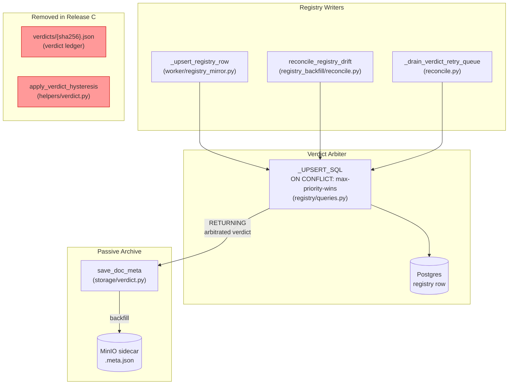
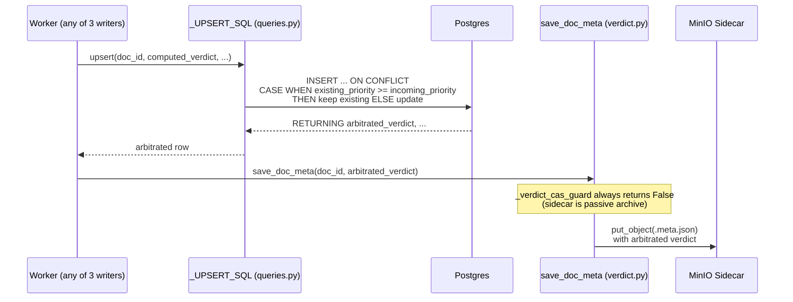
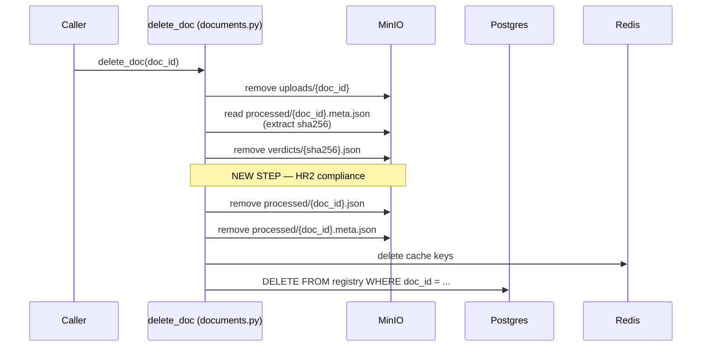
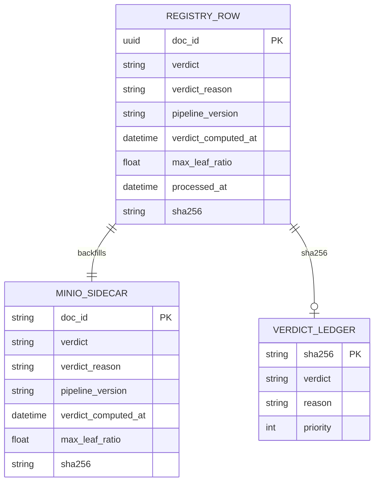

<!-- Space: CITRA -->
<!-- Title: Design: Verdict CAS Unification and Ledger Compliance Closure -->
<!-- Folder: Designs -->

---
id: "design-rfc037-verdict-cas-unification"
title: "Design: Verdict CAS Unification and Ledger Compliance Closure"
type: design
status: draft
date: "2026-08-24"
tags:
  - design
  - verdict
  - storage
  - compliance
aliases:
  - "design-rfc037-verdict-cas-unification"
governs:
  - "[[RFC-037]]"
---

# Design: Verdict CAS Unification and Ledger Compliance Closure

## Traceability

| Artifact | Reference |
|----------|-----------|
| Governing RFC | [RFC-037](../rfcs/037-verdict-cas-unification.md) |
| Implementation Plan | [Tasks: Verdict CAS Unification](../tasks/tasks-rfc037-verdict-cas-unification.md) |
| PRD / Requirements | [[PRD]] |
| Architecture | [[ARCHITECTURE]] |

## Overview

The verdict system currently has three competing stability mechanisms — a MinIO sidecar CAS guard, a Postgres SQL CAS guard, and a verdict ledger with hysteresis anchoring — that never consult each other, allowing MinIO and Postgres to hold different verdicts indefinitely. This design designates Postgres as the single verdict arbiter via a max-priority-wins SQL guard, demotes the MinIO sidecar to a passive archive backfilled from the Postgres `RETURNING` row, closes the HR2 erasure gap for verdict ledger files, and then removes the now-redundant ledger and hysteresis code. The result is one verdict stability mechanism instead of three, with a net reduction of ~140 lines.

## Key Design Principles

1. **Single Arbiter**: Postgres is the sole authority for verdict arbitration. The MinIO sidecar becomes a passive archive that reflects the Postgres-arbitrated value, never the locally-computed one.
2. **Max-Priority-Wins Monotonicity**: Verdicts can only be upgraded (ERROR → FAIL → MARGINAL → PASS), never downgraded. This eliminates oscillation across re-ingestion cycles without relying on external anchoring mechanisms.
3. **Compliance-First Sequencing**: The HR2 erasure fix ([D2](../rfcs/037-verdict-cas-unification.md#decision-summary)) ships in Release A alongside the SQL guard, before any cleanup code is removed. Compliance gaps are closed immediately.
4. **Passive Archive**: The sidecar `.meta.json` continues to exist for tooling compatibility, but its content is always backfilled from Postgres — it never arbitrates.
5. **Code Deletion Over Flags**: Rather than gating the ledger/hysteresis behind feature flags, we delete the code entirely after corpus validation proves the SQL guard is sufficient.

## Launch Constraints

- Release A ([D1](../rfcs/037-verdict-cas-unification.md#decision-summary), [D2](../rfcs/037-verdict-cas-unification.md#decision-summary), [D6](../rfcs/037-verdict-cas-unification.md#decision-summary)) must deploy before Release C ([D3](../rfcs/037-verdict-cas-unification.md#decision-summary), [D4](../rfcs/037-verdict-cas-unification.md#decision-summary), [D5](../rfcs/037-verdict-cas-unification.md#decision-summary))
- Release B (corpus validation with zero verdict downgrades) is a mandatory gate between Release A and Release C
- No code deletion (Release C) until corpus validation passes

## Architecture

### High-Level System Architecture

### Architecture Decisions

**SQL Max-Priority-Wins Guard** ([RFC-037 D1](../rfcs/037-verdict-cas-unification.md#decision-summary)): The `_UPSERT_SQL` `ON CONFLICT` clause gains `CASE WHEN` expressions that compare incoming verdict priority against the existing row. When the existing verdict has higher priority, it is preserved. This is preferred over application-level comparison because all three registry writers automatically inherit the guard through the shared SQL, eliminating per-writer coordination. → [Property 1](#property-1-max-priority-wins-sql) · [Task 1.1](../tasks/tasks-rfc037-verdict-cas-unification.md#11-sql-max-priority-wins-guard-d1)

**HR2 Verdict Ledger Erasure** ([RFC-037 D2](../rfcs/037-verdict-cas-unification.md#decision-summary)): The `delete_doc` cascade adds a step to remove `verdicts/{sha256}.json`, positioned after the sidecar read (to extract sha256) and before sidecar deletion. This closes the [CLAUDE.md HR2](../rfcs/037-verdict-cas-unification.md#hard-rule-constraints-claudemd--binding) gap where verdict ledger files survived document erasure. → [Property 2](#property-2-hr2-erasure-completeness) · [Task 1.2](../tasks/tasks-rfc037-verdict-cas-unification.md#12-hr2-verdict-ledger-erasure-d2)

**Ledger Function Removal** ([RFC-037 D3](../rfcs/037-verdict-cas-unification.md#decision-summary)): `persist_verdict_ledger`, `read_verdict_ledger`, and `_LEDGER_VERDICT_PRIORITY` are deleted from `storage/verdict.py` after corpus validation proves the SQL guard is sufficient. The ledger was a workaround for lacking SQL-level arbitration; with D1 in place, it is redundant. → [Property 4](#property-4-ledger-hysteresis-removal) · [Task 3.1](../tasks/tasks-rfc037-verdict-cas-unification.md#31-ledger-function-removal-d3)

**Hysteresis Removal** ([RFC-037 D4](../rfcs/037-verdict-cas-unification.md#decision-summary)): `apply_verdict_hysteresis` and `_LEDGER_PRIORITY` are deleted from `helpers/verdict.py`, and the two call sites in `client/indexer.py` (flat path and tree path) are removed. The `read_ledger_fn` parameter threading is cleaned up. Hysteresis was needed because the sidecar CAS and SQL CAS disagreed; with a single SQL arbiter, it adds no value. → [Property 4](#property-4-ledger-hysteresis-removal) · [Task 3.2](../tasks/tasks-rfc037-verdict-cas-unification.md#32-hysteresis-removal-d4)

**Sidecar CAS Collapse** ([RFC-037 D5](../rfcs/037-verdict-cas-unification.md#decision-summary)): `_verdict_cas_guard` is simplified to unconditionally return `False`, then inlined and removed. The sidecar becomes a passive archive backfilled from the Postgres `RETURNING` value. This eliminates the dual-CAS divergence where a tie blocked the sidecar but allowed Postgres. → [Property 5](#property-5-sidecar-passivity) · [Task 3.3](../tasks/tasks-rfc037-verdict-cas-unification.md#33-sidecar-cas-collapse-d5)

**Priority Constant Consolidation** ([RFC-037 D6](../rfcs/037-verdict-cas-unification.md#decision-summary)): A single `VERDICT_PRIORITY` constant is defined in `helpers/types.py`, replacing the two duplicate definitions. All consumers import from this one location. This prevents future silent divergence between the maps. → [Property 6](#property-6-priority-constant-uniqueness) · [Task 1.3](../tasks/tasks-rfc037-verdict-cas-unification.md#13-priority-constant-consolidation-d6)

### Deployment Architecture

- **Backend**: arq worker (async job processing) + FastMCP server (MCP tool exposure)
- **Database**: Postgres (registry rows — verdict arbiter)
- **Object Storage**: MinIO (sidecar `.meta.json` passive archive, verdict ledger `verdicts/{sha256}.json` — to be removed)
- **Task Queue**: arq + Redis (job bus, cache)
- **Metrics**: Prometheus

### Communication Patterns

- **Synchronous**: SQL upsert with `RETURNING` — worker writes verdict to Postgres, receives arbitrated value back
- **Asynchronous**: arq job queue — worker processes documents, verdict computation and persistence happen within the job
- **Object Store**: MinIO sidecar backfill — after SQL arbitration, the winning verdict is written to the sidecar `.meta.json`

## Sequence Diagrams

### Verdict Upsert Flow — [D1](../rfcs/037-verdict-cas-unification.md#decision-summary), [D5](../rfcs/037-verdict-cas-unification.md#decision-summary)

→ [Property 1](#property-1-max-priority-wins-sql) · [Property 5](#property-5-sidecar-passivity) · [Task 1.1](../tasks/tasks-rfc037-verdict-cas-unification.md#11-sql-max-priority-wins-guard-d1)

### Erasure Cascade Flow — [D2](../rfcs/037-verdict-cas-unification.md#decision-summary)

→ [Property 2](#property-2-hr2-erasure-completeness) · [Task 1.2](../tasks/tasks-rfc037-verdict-cas-unification.md#12-hr2-verdict-ledger-erasure-d2)

## Service Contracts

### 1. registry/queries.py

**Responsibility**: Defines the SQL statements for registry row upsert and query.

**Changes ([D1](../rfcs/037-verdict-cas-unification.md#decision-summary)):**
- Modify `_UPSERT_SQL` `ON CONFLICT` clause to add `CASE WHEN` priority comparison for verdict fields
- The `RETURNING` clause returns the arbitrated verdict (existing or incoming, whichever has higher priority)
- All three registry writers inherit this guard automatically

→ [Property 1](#property-1-max-priority-wins-sql) · [Task 1.1](../tasks/tasks-rfc037-verdict-cas-unification.md#11-sql-max-priority-wins-guard-d1)

### 2. storage/verdict.py

**Responsibility**: Manages verdict persistence to MinIO sidecar and verdict ledger.

**Changes:**
- ([D1](../rfcs/037-verdict-cas-unification.md#decision-summary)) Update `save_doc_meta` to use the Postgres-arbitrated verdict from `RETURNING`, not the locally-computed one
- ([D3](../rfcs/037-verdict-cas-unification.md#decision-summary)) Delete `persist_verdict_ledger`, `read_verdict_ledger`, `_LEDGER_VERDICT_PRIORITY` (Release C)
- ([D5](../rfcs/037-verdict-cas-unification.md#decision-summary)) Simplify `_verdict_cas_guard` to always return `False`, then delete (Release C)

→ [Property 1](#property-1-max-priority-wins-sql) · [Property 4](#property-4-ledger-hysteresis-removal) · [Property 5](#property-5-sidecar-passivity) · [Task 1.1](../tasks/tasks-rfc037-verdict-cas-unification.md#11-sql-max-priority-wins-guard-d1) · [Task 3.1](../tasks/tasks-rfc037-verdict-cas-unification.md#31-ledger-function-removal-d3) · [Task 3.3](../tasks/tasks-rfc037-verdict-cas-unification.md#33-sidecar-cas-collapse-d5)

### 3. storage/documents.py

**Responsibility**: Manages document lifecycle including the erasure cascade.

**Changes ([D2](../rfcs/037-verdict-cas-unification.md#decision-summary)):**
- Add `verdicts/{sha256}.json` removal step to `delete_doc` cascade
- Position after sidecar read (to extract sha256) and before sidecar deletion
- Handle missing sha256 gracefully (log warning, continue cascade)

→ [Property 2](#property-2-hr2-erasure-completeness) · [Task 1.2](../tasks/tasks-rfc037-verdict-cas-unification.md#12-hr2-verdict-ledger-erasure-d2)

### 4. helpers/types.py

**Responsibility**: Defines shared type constants and dataclasses for the pipeline.

**Changes ([D6](../rfcs/037-verdict-cas-unification.md#decision-summary)):**
- Add `VERDICT_PRIORITY: dict[str, int] = {"PASS": 3, "MARGINAL": 2, "FAIL": 1, "ERROR": 0}`
- This becomes the sole source of truth for verdict priority ordering

→ [Property 6](#property-6-priority-constant-uniqueness) · [Task 1.3](../tasks/tasks-rfc037-verdict-cas-unification.md#13-priority-constant-consolidation-d6)

### 5. helpers/verdict.py

**Responsibility**: Verdict computation, hysteresis, and priority mapping.

**Changes ([D4](../rfcs/037-verdict-cas-unification.md#decision-summary)):**
- Delete `apply_verdict_hysteresis` function (Release C)
- Delete `_LEDGER_PRIORITY` constant (replaced by `VERDICT_PRIORITY` in [helpers/types.py](#4-helperstypespy) in Release A)

→ [Property 4](#property-4-ledger-hysteresis-removal) · [Task 3.2](../tasks/tasks-rfc037-verdict-cas-unification.md#32-hysteresis-removal-d4)

### 6. client/indexer.py

**Responsibility**: Orchestrates document indexing, including verdict hysteresis application.

**Changes ([D4](../rfcs/037-verdict-cas-unification.md#decision-summary)):**
- Remove `apply_verdict_hysteresis` call in `_persist_flat_result` (line ~852-863)
- Remove `apply_verdict_hysteresis` call in `_persist_tree_result` (line ~985-996)
- Clean up `read_ledger_fn` parameter from function signatures

→ [Property 4](#property-4-ledger-hysteresis-removal) · [Task 3.2](../tasks/tasks-rfc037-verdict-cas-unification.md#32-hysteresis-removal-d4)

## Data Models

### Entity Relationship Diagram

**Note:** `VERDICT_LEDGER` is removed in Release C ([D3](../rfcs/037-verdict-cas-unification.md#decision-summary)). After Release C, the relationship between `REGISTRY_ROW` and `VERDICT_LEDGER` no longer exists.

## Correctness Properties

### Property 1: Max-Priority-Wins SQL

*For any* pair of (existing_verdict, incoming_verdict) on the same doc_id, the `_UPSERT_SQL` query SHALL preserve whichever verdict has higher priority according to `VERDICT_PRIORITY` (PASS > MARGINAL > FAIL > ERROR). The `RETURNING` clause SHALL return the winning verdict.

**Validates:** [RFC-037 Requirement 1](../rfcs/037-verdict-cas-unification.md#requirement-1-single-verdict-arbiter)
**Tested in:** [Task 1.4](../tasks/tasks-rfc037-verdict-cas-unification.md#14-test-release-a) — `test_max_priority_wins_sql`
**Service contract:** [registry/queries.py](#1-registryqueriespy)
**Sequence diagram:** [Verdict Upsert Flow](#verdict-upsert-flow--d1--d5)

### Property 2: HR2 Erasure Completeness

*For any* document deleted via `delete_doc`, the system SHALL remove the `verdicts/{sha256}.json` object from MinIO. After the cascade completes, no object keyed to the deleted document's sha256 SHALL exist under the `verdicts/` prefix.

**Validates:** [RFC-037 Requirement 2](../rfcs/037-verdict-cas-unification.md#requirement-2-hr2-erasure-cascade-compliance)
**Tested in:** [Task 1.4](../tasks/tasks-rfc037-verdict-cas-unification.md#14-test-release-a) — `test_hr2_erasure_cascade`
**Service contract:** [storage/documents.py](#3-storagedocumentspy)
**Sequence diagram:** [Erasure Cascade Flow](#erasure-cascade-flow--d2)

### Property 3: Single Priority Map

*For any* code path that references verdict priority ordering, it SHALL import `VERDICT_PRIORITY` from `helpers/types.py`. No other module SHALL define a local verdict priority mapping.

**Validates:** [RFC-037 Requirement 3](../rfcs/037-verdict-cas-unification.md#requirement-3-priority-map-deduplication)
**Tested in:** [Task 1.4](../tasks/tasks-rfc037-verdict-cas-unification.md#14-test-release-a) — `test_priority_constant_uniqueness`
**Service contract:** [helpers/types.py](#4-helperstypespy)

### Property 4: Ledger/Hysteresis Removal

*For any* document ingestion after Release C, the system SHALL NOT call `persist_verdict_ledger`, `read_verdict_ledger`, or `apply_verdict_hysteresis`. These functions SHALL NOT be importable from their former modules.

**Validates:** [RFC-037 Requirement 4](../rfcs/037-verdict-cas-unification.md#requirement-4-ledger-and-hysteresis-removal)
**Tested in:** [Task 3.4](../tasks/tasks-rfc037-verdict-cas-unification.md#34-test-release-c) — `test_ledger_removal`, `test_hysteresis_removal`
**Service contract:** [storage/verdict.py](#2-storageverdictpy), [helpers/verdict.py](#5-helpersverdictpy), [client/indexer.py](#6-clientindexerpy)

### Property 5: Sidecar Passivity

*For any* sidecar write after Release C, the system SHALL NOT reject the write based on timestamp comparison. The sidecar verdict SHALL always equal the Postgres-arbitrated verdict from the `RETURNING` row.

**Validates:** [RFC-037 Requirement 1 AC 3](../rfcs/037-verdict-cas-unification.md#requirement-1-single-verdict-arbiter)
**Tested in:** [Task 3.4](../tasks/tasks-rfc037-verdict-cas-unification.md#34-test-release-c) — `test_sidecar_passivity`
**Service contract:** [storage/verdict.py](#2-storageverdictpy)
**Sequence diagram:** [Verdict Upsert Flow](#verdict-upsert-flow--d1--d5)

### Property 6: Priority Constant Uniqueness

*For any* verdict string in the system (PASS, MARGINAL, FAIL, ERROR), the `VERDICT_PRIORITY` constant in `helpers/types.py` SHALL assign a unique integer priority. The constant SHALL be the sole definition of verdict priority ordering across the codebase.

**Validates:** [RFC-037 Requirement 3](../rfcs/037-verdict-cas-unification.md#requirement-3-priority-map-deduplication)
**Tested in:** [Task 1.4](../tasks/tasks-rfc037-verdict-cas-unification.md#14-test-release-a) — `test_priority_constant_uniqueness`
**Service contract:** [helpers/types.py](#4-helperstypespy)

## Error Handling

### Error Categories & Responses

| Category | Trigger | Response | Retry Strategy |
|----------|---------|----------|----------------|
| SQL Upsert Failure | Postgres connection error or constraint violation | Log error, raise to arq job handler (marks job as ERROR) | arq automatic retry (3 attempts with backoff) |
| Sidecar Write Failure | MinIO unavailable or permission error | Log warning, continue (sidecar is passive archive; Postgres is authoritative) | No retry — sidecar will be reconciled by `reconcile_registry_drift` cron |
| SHA256 Not Found During Erasure | Both processed doc and sidecar already deleted | Log warning with doc_id, continue erasure cascade | No retry — best-effort; the verdicts/ file may not exist |
| Verdict Ledger Not Found | `verdicts/{sha256}.json` doesn't exist (normal for pre-ledger documents) | Ignore `NoSuchKey`, continue | Not an error |

### Service-Specific Error Handling

**registry/queries.py:**
- SQL max-priority-wins comparison fails silently (impossible with `CASE WHEN` — degrades to current behavior)
- `RETURNING` returns no rows → treated as insert failure, logged and retried

**storage/documents.py:**
- `delete_doc` sha256 extraction fails → log warning, skip verdicts/ removal, continue cascade (no data loss — the verdict file is orphaned but not a compliance risk since the document itself is deleted)

## Testing Strategy

### Testing Layers

1. **Property-Based Tests**: Verify universal properties across all verdict combinations for [Properties 1–6](#correctness-properties)
2. **Unit Tests**: Cover specific examples, edge cases, error conditions for each decision
3. **Integration Tests**: Verify three-writer convergence and erasure cascade completeness
4. **Corpus Validation**: Full corpus scoring cycle confirming zero verdict downgrades (Release B gate)

### Test Categories by Service

| Service | Properties | Unit Tests | Integration Tests |
|---------|-----------|------------|-------------------|
| registry/queries.py | [Property 1](#property-1-max-priority-wins-sql) | All 16 verdict×verdict combinations, tie behavior | Three-writer convergence |
| storage/documents.py | [Property 2](#property-2-hr2-erasure-completeness) | Erasure with/without sha256, missing ledger file | Full cascade with MinIO |
| helpers/types.py | [Property 6](#property-6-priority-constant-uniqueness) | Constant completeness, uniqueness | Grep-based CI lint |
| storage/verdict.py | [Property 4](#property-4-ledger-hysteresis-removal), [Property 5](#property-5-sidecar-passivity) | Function removal (ImportError), sidecar passivity | — |
| helpers/verdict.py | [Property 4](#property-4-ledger-hysteresis-removal) | Function removal (ImportError) | — |
| client/indexer.py | [Property 4](#property-4-ledger-hysteresis-removal) | Call site removal, signature cleanup | — |

### Key Test Scenarios

**Critical Path Tests:**

1. Upsert PASS verdict, then upsert MARGINAL for same doc_id → RETURNING shows PASS (max-priority-wins)
2. `delete_doc` removes `verdicts/{sha256}.json` alongside all other derived stores
3. All three registry writers converge to same max-priority verdict under concurrent execution

**Edge Cases:**

- Tie on `verdict_computed_at` with same verdict → no-op (idempotent)
- Tie on `verdict_computed_at` with different verdict → higher priority wins (SQL `CASE WHEN`)
- `delete_doc` called when sha256 unavailable from both processed doc and sidecar → warning logged, cascade continues
- `delete_doc` called when `verdicts/{sha256}.json` doesn't exist → `NoSuchKey` ignored
- Sidecar write fails after SQL upsert succeeds → Postgres is authoritative, sidecar reconciled by cron
