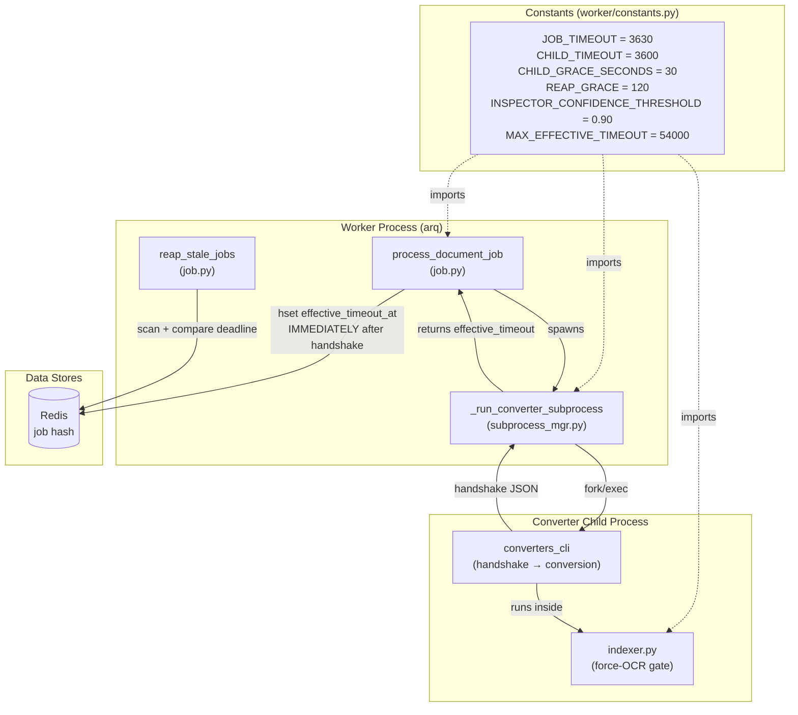
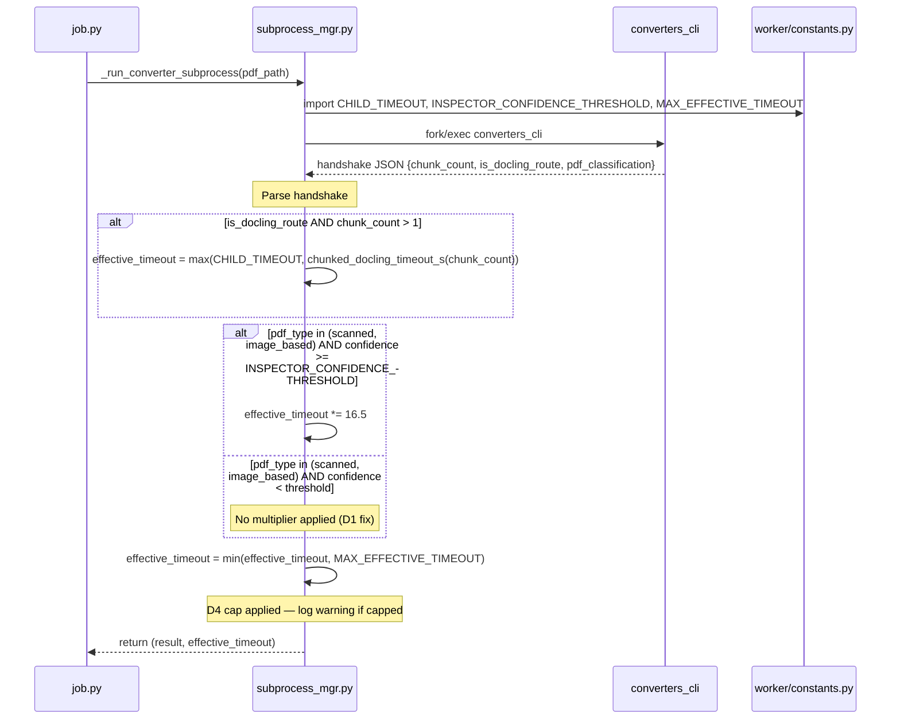
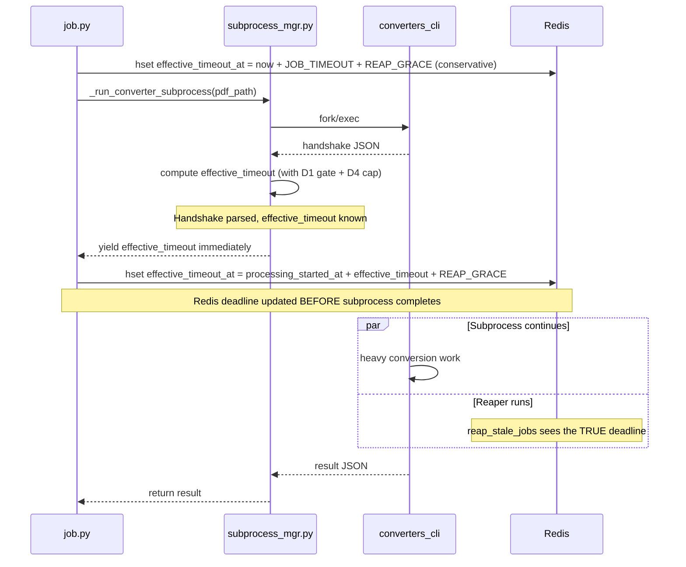
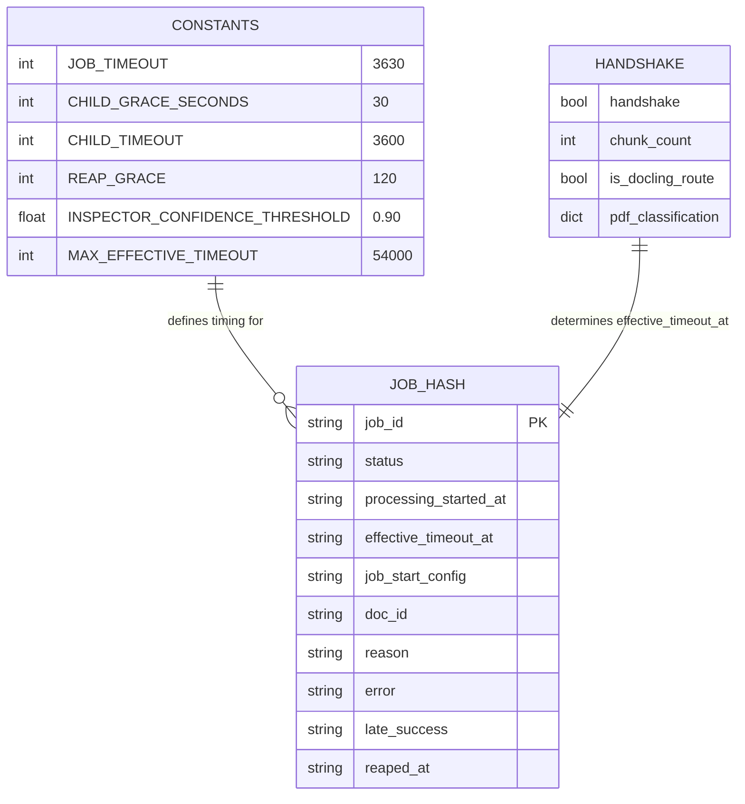

<!-- Space: CITRA -->
<!-- Title: Design: Worker Timeout Unification and Inspector Threshold Alignment -->
<!-- Folder: Designs -->

---
id: "design-rfc038-worker-timeout-unification"
title: "Design: Worker Timeout Unification and Inspector Threshold Alignment"
type: design
status: draft
date: "2026-08-24"
tags:
  - design
  - worker
  - timeout
  - inspector
  - reliability
aliases:
  - "design-rfc038-worker-timeout-unification"
governs:
  - "[[RFC-038]]"
---

# Design: Worker Timeout Unification and Inspector Threshold Alignment

## Traceability

| Artifact | Reference |
|----------|-----------|
| Governing RFC | [RFC-038](../rfcs/038-worker-timeout-unification.md) |
| Implementation Plan | [Tasks: Worker Timeout Unification](../tasks/tasks-rfc038-worker-timeout-unification.md) |
| PRD / Requirements | [[PRD]] |
| Architecture | [[ARCHITECTURE]] |

## Overview

The worker timeout subsystem has four interacting defects discovered by the post-fix-11 architecture audit (Zone 7): a split-brain inspector confidence threshold between `indexer.py` and `subprocess_mgr.py`, a race window where the extended deadline reaches Redis too late for the reaper, duplicated timeout constants across two modules, and an unbounded effective-timeout multiplication chain. This design unifies the confidence gate, persists the extended deadline immediately after the child's handshake, extracts all timing constants into a single module, and caps the multiplication chain — closing the race window that causes false reaps and the split-brain that wastes timeout budget on documents that never run forced OCR.

## Key Design Principles

1. **Single source of truth for timing constants**: Every timing constant (`JOB_TIMEOUT`, `CHILD_TIMEOUT`, `CHILD_GRACE_SECONDS`, `REAP_GRACE`, `INSPECTOR_CONFIDENCE_THRESHOLD`, `MAX_EFFECTIVE_TIMEOUT`) lives in exactly one module (`worker/constants.py`). No duplicated definitions, no replication comments.
2. **Threshold symmetry**: The inspector confidence gate that triggers forced OCR in `indexer.py` and the gate that triggers the 16.5× timeout multiplier in `subprocess_mgr.py` must use the identical threshold constant. If a document is not confident enough for forced OCR, it does not get the timeout budget sized for forced OCR.
3. **Deadline visibility**: The reaper's view of a job's deadline must always reflect the actual timeout the worker will enforce. The gap between "worker knows the real deadline" and "Redis knows the real deadline" must be minimized to < 1 second.
4. **Bounded multiplication**: No combination of timeout multipliers can produce an effective timeout exceeding `MAX_EFFECTIVE_TIMEOUT`. The cap is applied after all multipliers, logged when hit, and configurable via environment variable.
5. **Return-value decoupling**: `_run_converter_subprocess` returns the computed `effective_timeout` to its caller rather than reaching into Redis itself, keeping subprocess management decoupled from job-state persistence.

## Launch Constraints

- The `worker/constants.py` module must not introduce circular imports — it contains only literal values, no imports from other project modules.
- The `_run_converter_subprocess` return contract change (`result` dict gains `_effective_timeout` key) is already partially implemented (Zone 6 Part B added it); this design formalizes and extends it.
- The `MAX_EFFECTIVE_TIMEOUT` default (54,000s / 15 hours) must be high enough to never cap legitimate processing in the current corpus. It is a safety rail, not a tuning knob.

## Architecture

### High-Level System Architecture



### Architecture Decisions

**[D1: Confidence Gate Alignment](../rfcs/038-worker-timeout-unification.md#d1--confidence-gate-alignment)**: The 16.5× timeout multiplier in `subprocess_mgr.py:179-188` currently checks only `pdf_type in ("scanned", "image_based")` with no confidence gate. The client-side forced-OCR gate in `indexer.py:368-373` requires `confidence >= 0.90`. This asymmetry means a document classified at confidence 0.50 gets a massive timeout budget but never runs the forced OCR that budget was sized for. The fix adds `confidence >= INSPECTOR_CONFIDENCE_THRESHOLD` to the `subprocess_mgr.py` multiplier condition. The threshold constant is imported from `worker/constants.py`. Validates [Property 1](#property-1-confidence-gate-consistency). Implemented in [Task 1.2](../tasks/tasks-rfc038-worker-timeout-unification.md#12-confidence-gate-alignment-d1).

**[D2: Early Deadline Persistence](../rfcs/038-worker-timeout-unification.md#d2--early-deadline-persistence)**: Currently, `_run_converter_subprocess` returns `_effective_timeout` in the result dict, and `job.py:252-262` updates Redis *after* the subprocess completes. This creates a race: between handshake and subprocess completion, `reap_stale_jobs` sees only the conservative initial deadline (`processing_started_at + JOB_TIMEOUT + REAP_GRACE = 3750s`) and can falsely reap a legitimately running job whose true deadline is much longer. The fix moves the Redis `hset` of `effective_timeout_at` to fire immediately after `_run_converter_subprocess` returns the effective timeout via a new early-return mechanism: the handshake parse and timeout computation happen first, and the computed value is yielded to the caller before the subprocess completes. In practice, `_run_converter_subprocess` is refactored to return `(result, effective_timeout)` as a tuple, with the caller persisting the deadline immediately after the handshake parse completes. Validates [Property 2](#property-2-early-deadline-persistence). Implemented in [Task 2.1](../tasks/tasks-rfc038-worker-timeout-unification.md#21-early-deadline-persistence-d2).

**[D3: Constants Extraction](../rfcs/038-worker-timeout-unification.md#d3--constants-extraction)**: `JOB_TIMEOUT = 3630` is defined in both `job.py:55` and `subprocess_mgr.py:39` (as `_JOB_TIMEOUT`). The comment at `subprocess_mgr.py:38` explicitly admits this duplication. `CHILD_TIMEOUT` and `CHILD_GRACE_SECONDS` are derived from the duplicated value. The fix extracts all timing constants to `worker/constants.py` — a pure-literal module with zero internal imports. Both `job.py` and `subprocess_mgr.py` import from it. Validates [Property 3](#property-3-constant-single-source). Implemented in [Task 1.1](../tasks/tasks-rfc038-worker-timeout-unification.md#11-extract-worker-timing-constants-d3).

**[D4: Effective Timeout Cap](../rfcs/038-worker-timeout-unification.md#d4--effective-timeout-cap)**: The chunked Docling timeout (`chunked_docling_timeout_s`) and the 16.5× inspector multiplier are not mutually exclusive in `subprocess_mgr.py:155-193`. When both apply (a scanned PDF that is also chunked), the computed effective timeout can reach ~500,000 seconds while `JOB_TIMEOUT` remains 3,630 seconds. The fix applies `min(effective_timeout, MAX_EFFECTIVE_TIMEOUT)` after all multipliers, logs a warning when the cap is hit, and makes `MAX_EFFECTIVE_TIMEOUT` configurable via environment variable (default 54,000s). Validates [Property 4](#property-4-timeout-cap-enforcement). Implemented in [Task 2.2](../tasks/tasks-rfc038-worker-timeout-unification.md#22-timeout-multiplication-cap-d4).

### Deployment Architecture

- **Backend**: Python 3.12 + arq async task queue
- **Task Queue**: arq with Redis broker — `job_timeout` set at worker level, not per-job
- **Object Storage**: MinIO — staging key download happens before subprocess spawn
- **Redis**: Job-state hash per job (`pageindex:job:<job_id>`) with `effective_timeout_at` field

### Communication Patterns

| Pattern | Use Case | Technology |
|---------|----------|------------|
| Subprocess fork/exec | Isolate converter memory from worker | `asyncio.create_subprocess_exec` with `start_new_session=True` |
| Handshake JSON line | Child reports chunk count, PDF classification, route before heavy work | stdout first line, parsed before `proc.communicate()` |
| Redis hash field update | Persist effective deadline for reaper visibility | `redis.hset(job_key, "effective_timeout_at", ...)` |
| Periodic sweep | Detect orphaned jobs (worker OOMKilled mid-processing) | `reap_stale_jobs` cron via arq, every 60 seconds |

### Sequence Diagrams

#### Timeout Computation Flow — [D1](../rfcs/038-worker-timeout-unification.md#d1--confidence-gate-alignment) + [D4](../rfcs/038-worker-timeout-unification.md#d4--effective-timeout-cap)



#### Early Deadline Persistence Flow — [D2](../rfcs/038-worker-timeout-unification.md#d2--early-deadline-persistence)



## Service Contracts

### [1. worker/subprocess_mgr.py](#1-workersubprocess_mgrpy)

**Responsibility**: Run the converter CLI in an isolated child process, parse the handshake, compute the effective timeout, and return the result with the effective timeout.

**Changes ([D1](../rfcs/038-worker-timeout-unification.md#d1--confidence-gate-alignment), [D4](../rfcs/038-worker-timeout-unification.md#d4--effective-timeout-cap)):**

- Remove `_JOB_TIMEOUT = 3630`, `CHILD_TIMEOUT`, and `CHILD_GRACE_SECONDS` definitions. Import from `worker/constants.py`.
- Remove the admission comment at line 38 ("NOTE: JOB_TIMEOUT is the canonical value...").
- Add `confidence >= INSPECTOR_CONFIDENCE_THRESHOLD` condition to the 16.5× multiplier block (line 179). Import `INSPECTOR_CONFIDENCE_THRESHOLD` from `worker/constants.py`.
- Add `effective_timeout = min(effective_timeout, MAX_EFFECTIVE_TIMEOUT)` after line 193, with a warning log when the cap is hit. Import `MAX_EFFECTIVE_TIMEOUT` from `worker/constants.py`.
- The `_effective_timeout` key in the result dict (line 234) continues to carry the capped value.

**Validates:** [Property 1](#property-1-confidence-gate-consistency), [Property 4](#property-4-timeout-cap-enforcement)

**Tasks:** [Task 1.1](../tasks/tasks-rfc038-worker-timeout-unification.md#11-extract-worker-timing-constants-d3), [Task 1.2](../tasks/tasks-rfc038-worker-timeout-unification.md#12-confidence-gate-alignment-d1), [Task 2.2](../tasks/tasks-rfc038-worker-timeout-unification.md#22-timeout-multiplication-cap-d4)

### [2. worker/job.py](#2-workerjobpy)

**Responsibility**: arq job handler — download staged file, spawn converter subprocess, persist job state transitions to Redis, upsert registry row on success. Also: `reap_stale_jobs` cron.

**Changes ([D2](../rfcs/038-worker-timeout-unification.md#d2--early-deadline-persistence), [D3](../rfcs/038-worker-timeout-unification.md#d3--constants-extraction)):**

- Remove `JOB_TIMEOUT = 3630` and `REAP_GRACE = 120` definitions. Import from `worker/constants.py`.
- Move the `effective_timeout_at` Redis update (currently at lines 252-262, after subprocess completion) to immediately after the subprocess returns `effective_timeout`. In the refactored flow, `_run_converter_subprocess` returns `effective_timeout` alongside the result, and `job.py` writes `hset(job_key, "effective_timeout_at", ...)` before any post-processing.
- Remove the Zone 6 Part B block at lines 252-262 (subsumed by the early-persistence mechanism).

**Validates:** [Property 2](#property-2-early-deadline-persistence), [Property 3](#property-3-constant-single-source)

**Tasks:** [Task 1.1](../tasks/tasks-rfc038-worker-timeout-unification.md#11-extract-worker-timing-constants-d3), [Task 2.1](../tasks/tasks-rfc038-worker-timeout-unification.md#21-early-deadline-persistence-d2)

### [3. client/indexer.py](#3-clientindexerpy)

**Responsibility**: Client-side document indexing — PDF classification, forced-OCR gate, tree generation.

**Changes ([D1](../rfcs/038-worker-timeout-unification.md#d1--confidence-gate-alignment)):**

- Replace the hardcoded `0.90` confidence threshold at line 372 with `INSPECTOR_CONFIDENCE_THRESHOLD` imported from `worker/constants.py`.
- No behavioral change — the threshold value remains 0.90, but is now imported from the single source of truth.

**Validates:** [Property 1](#property-1-confidence-gate-consistency)

**Tasks:** [Task 1.2](../tasks/tasks-rfc038-worker-timeout-unification.md#12-confidence-gate-alignment-d1)

### [4. worker/constants.py](#4-workerconstantspy)

**Responsibility**: Single source of truth for all worker timing constants and the inspector confidence threshold.

**New module ([D3](../rfcs/038-worker-timeout-unification.md#d3--constants-extraction)):**

```python
"""Canonical timing constants for the worker subprocess pipeline.

Every timing-related value used across job.py, subprocess_mgr.py, and
indexer.py is defined here — nowhere else.  This module has ZERO internal
imports to avoid circular dependency chains.
"""
import os

JOB_TIMEOUT: int = 3630
CHILD_GRACE_SECONDS: int = 30
CHILD_TIMEOUT: int = JOB_TIMEOUT - CHILD_GRACE_SECONDS
REAP_GRACE: int = 120
INSPECTOR_CONFIDENCE_THRESHOLD: float = 0.90
MAX_EFFECTIVE_TIMEOUT: int = int(
    os.environ.get("MAX_EFFECTIVE_TIMEOUT", "54000")
)
```

**Validates:** [Property 3](#property-3-constant-single-source), [Property 1](#property-1-confidence-gate-consistency), [Property 4](#property-4-timeout-cap-enforcement)

**Tasks:** [Task 1.1](../tasks/tasks-rfc038-worker-timeout-unification.md#11-extract-worker-timing-constants-d3)

## Data Models

### Entity Relationship Diagram



### Core Entities

```python
class JobHash:
    """Redis hash at pageindex:job:<job_id>."""
    job_id: str
    status: str  # pending | processing | done | error
    processing_started_at: str  # epoch seconds (wall-clock)
    effective_timeout_at: str  # epoch seconds — absolute deadline for reaper
    job_start_config: str  # JSON snapshot of pipeline config
    doc_id: str | None
    reason: str | None  # error classification
    error: str | None  # stderr tail
    late_success: str | None  # "true" if reap-recovery
    reaped_at: str | None  # epoch seconds when reaper marked ERROR

class Handshake:
    """First JSON line from converter child stdout."""
    handshake: bool  # always True
    chunk_count: int
    is_docling_route: bool
    pdf_classification: dict | None  # {pdf_type, confidence, pages_needing_ocr, has_encoding_issues}
```

## Correctness Properties

*A property is a characteristic or behavior that should hold true across all valid executions of the system — a formal statement about what the system should do.*

### Property 1: Confidence Gate Consistency

*For any* PDF document where `PDF_INSPECTOR_PRECLASSIFY` is enabled and `pdf_classification.pdf_type` is `"scanned"` or `"image_based"`, the 16.5× timeout multiplier in `subprocess_mgr.py` SHALL be applied if and only if `pdf_classification.confidence >= INSPECTOR_CONFIDENCE_THRESHOLD`, matching the identical condition used for forced-OCR in `indexer.py`.

**Validates:** [RFC-038 Requirement 1](../rfcs/038-worker-timeout-unification.md#requirement-1-threshold-consistency)
**Tested in:** [Task 1.2](../tasks/tasks-rfc038-worker-timeout-unification.md#12-confidence-gate-alignment-d1) — `test_timeout_multiplier_requires_confidence_threshold`
**Service contract:** [1. subprocess_mgr.py](#1-workersubprocess_mgrpy), [3. indexer.py](#3-clientindexerpy)
**Sequence diagram:** [Timeout Computation Flow](#timeout-computation-flow--d1--d4)

### Property 2: Early Deadline Persistence

*For any* job whose converter child emits a handshake that extends the effective timeout (via chunked Docling timeout or 16.5× multiplier), the `effective_timeout_at` field in Redis SHALL be updated to reflect the true deadline within 1 second of the handshake being parsed, before the subprocess completes its conversion work.

**Validates:** [RFC-038 Requirement 2](../rfcs/038-worker-timeout-unification.md#requirement-2-early-deadline-persistence)
**Tested in:** [Task 2.1](../tasks/tasks-rfc038-worker-timeout-unification.md#21-early-deadline-persistence-d2) — `test_early_deadline_persisted_before_subprocess_completes`
**Service contract:** [2. job.py](#2-workerjobpy)
**Sequence diagram:** [Early Deadline Persistence Flow](#early-deadline-persistence-flow--d2)

### Property 3: Constant Single Source

*For any* reference to `JOB_TIMEOUT`, `CHILD_TIMEOUT`, `CHILD_GRACE_SECONDS`, `REAP_GRACE`, or `INSPECTOR_CONFIDENCE_THRESHOLD` in the codebase, the value SHALL be imported from `worker/constants.py` — no module SHALL define its own copy.

**Validates:** [RFC-038 Requirement 3](../rfcs/038-worker-timeout-unification.md#requirement-3-timeout-constant-deduplication)
**Tested in:** [Task 1.1](../tasks/tasks-rfc038-worker-timeout-unification.md#11-extract-worker-timing-constants-d3) — `test_no_duplicate_timeout_definitions`
**Service contract:** [4. constants.py](#4-workerconstantspy)

### Property 4: Timeout Cap Enforcement

*For any* combination of timeout multipliers (chunked Docling timeout, 16.5× inspector multiplier, or both), the effective timeout applied to the converter child SHALL NOT exceed `MAX_EFFECTIVE_TIMEOUT` (default 54,000 seconds).

**Validates:** [RFC-038 Requirement 4](../rfcs/038-worker-timeout-unification.md#requirement-4-timeout-multiplication-cap)
**Tested in:** [Task 2.2](../tasks/tasks-rfc038-worker-timeout-unification.md#22-timeout-multiplication-cap-d4) — `test_effective_timeout_capped_at_max`
**Service contract:** [1. subprocess_mgr.py](#1-workersubprocess_mgrpy)
**Sequence diagram:** [Timeout Computation Flow](#timeout-computation-flow--d1--d4)

## Error Handling

### Error Categories & Responses

| Category | Handling | Retry Strategy |
|----------|----------|----------------|
| Handshake timeout (60s) | SIGTERM → SIGKILL child, re-raise `TimeoutError` | arq retries up to `MAX_TRIES` |
| Handshake parse failure | Fall through with `handshake = None`, use `CHILD_TIMEOUT` default | No retry needed — graceful fallback |
| Converter child timeout | Increment `CONVERTER_CHILD_TIMEOUT_TOTAL`, set job ERROR | arq retries up to `MAX_TRIES` |
| Converter child OOM (SIGKILL) | Increment `CONVERTER_CHILD_OOM_TOTAL`, set job ERROR | arq retries up to `MAX_TRIES` |
| False reap (reaper marks ERROR, child completes) | `late_success` flag, ERROR→DONE transition | Recovery path; D2 makes this near-zero |
| Timeout cap hit | Log warning with uncapped value, apply cap | No retry — cap is the intended behavior |

### Service-Specific Error Handling

**subprocess_mgr.py:**

- Handshake JSON decode failure → `handshake = None`, conservative timeout applies. No regression from current behavior.
- Confidence threshold below gate → multiplier not applied, base `CHILD_TIMEOUT` used. This is the D1 fix — currently this case incorrectly applies the multiplier.
- Timeout cap hit → warning logged with uncapped value (e.g., "Effective timeout 495,000s capped at MAX_EFFECTIVE_TIMEOUT 54,000s"). The capped value is used downstream.

**job.py:**

- Early deadline persistence failure (Redis `hset` fails) → logged but not fatal. The conservative initial deadline remains in Redis, and the reaper may false-reap (same as pre-fix behavior). The `late_success` recovery path handles this gracefully.
- Reaper sees a job with no `effective_timeout_at` field → falls back to `processing_started_at + JOB_TIMEOUT + REAP_GRACE` (backward compatibility, unchanged from current code).

## Testing Strategy

### Testing Layers

1. **Property-Based Tests (PBT)**: Verify [Properties 1–4](#correctness-properties) across randomly generated handshake payloads and timing configurations.
2. **Unit Tests**: Cover specific examples — threshold boundary (0.89 vs 0.90 vs 0.91), cap boundary, both multipliers applying simultaneously, handshake parse failures.
3. **Integration Tests**: Verify end-to-end that a scanned PDF below the confidence threshold does not receive the extended timeout, and that the reaper respects the early-persisted deadline.

### Property-Based Testing Configuration

- **Library**: Hypothesis
- **Minimum iterations**: 200 per property
- **Deadline**: 500ms per example
- **Database strategy**: In-memory Redis mock (fakeredis)

### Test Categories by Service

| Service | PBT Properties | Unit Tests | Integration Tests |
|---------|----------------|------------|-------------------|
| subprocess_mgr.py | [Property 1](#property-1-confidence-gate-consistency), [Property 4](#property-4-timeout-cap-enforcement) | Threshold boundary, cap boundary, both-multipliers, handshake parse failure | E2E with mocked child process |
| job.py | [Property 2](#property-2-early-deadline-persistence) | Early deadline write, reaper respects deadline, fallback when field missing | Reaper integration with fakeredis |
| constants.py | [Property 3](#property-3-constant-single-source) | No duplicates lint check, env var override for MAX_EFFECTIVE_TIMEOUT | Import verification across modules |
| indexer.py | [Property 1](#property-1-confidence-gate-consistency) | Threshold import verification | — |

### Key Test Scenarios

**Critical Path Tests:**

1. Scanned PDF at confidence 0.92 → 16.5× multiplier applied, deadline persisted immediately, reaper respects extended deadline
2. Scanned PDF at confidence 0.50 → no multiplier, base CHILD_TIMEOUT, reaper uses conservative deadline
3. Chunked + scanned PDF → both multipliers apply, cap enforced at MAX_EFFECTIVE_TIMEOUT

**Edge Cases:**

- Confidence exactly at threshold (0.90) → multiplier applied (>= comparison)
- Handshake with no `pdf_classification` key → no multiplier, base timeout
- `MAX_EFFECTIVE_TIMEOUT` env var set to "0" → effectively caps all timeouts (degenerate but handled)
- Redis `hset` for early deadline fails → conservative deadline remains, late_success recovery fires if reaper intervenes
- Reaper encounters job hash from before D2 (no `effective_timeout_at` field) → falls back to computed deadline from `processing_started_at`
