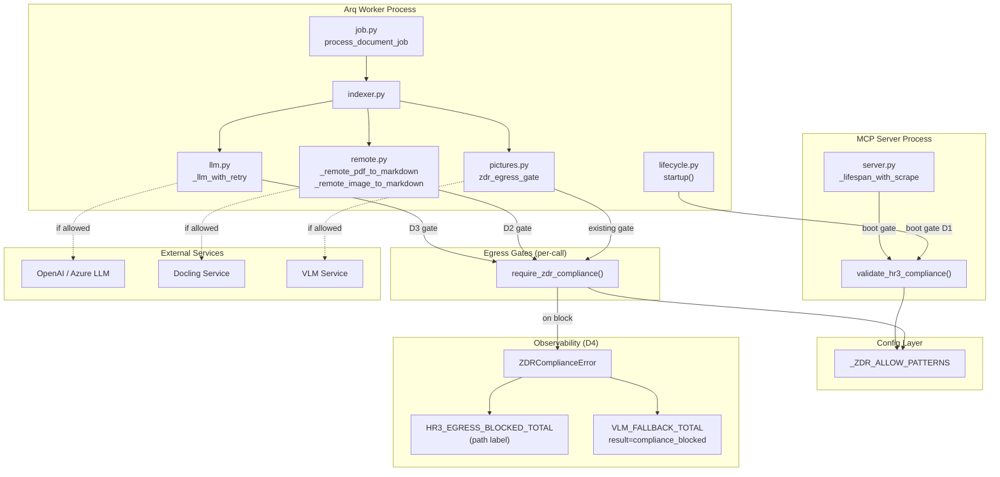
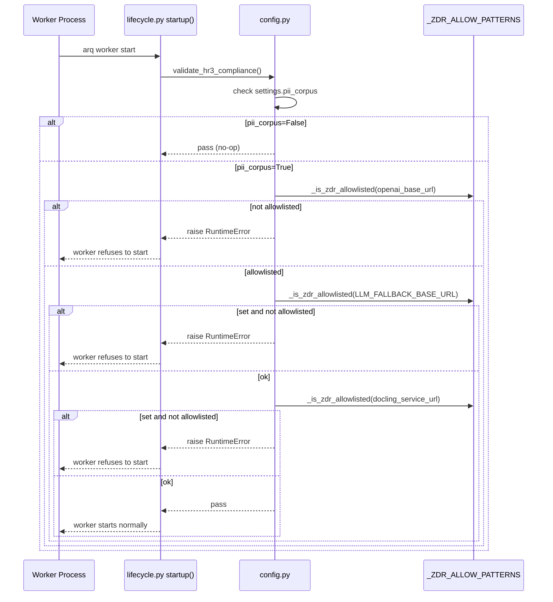
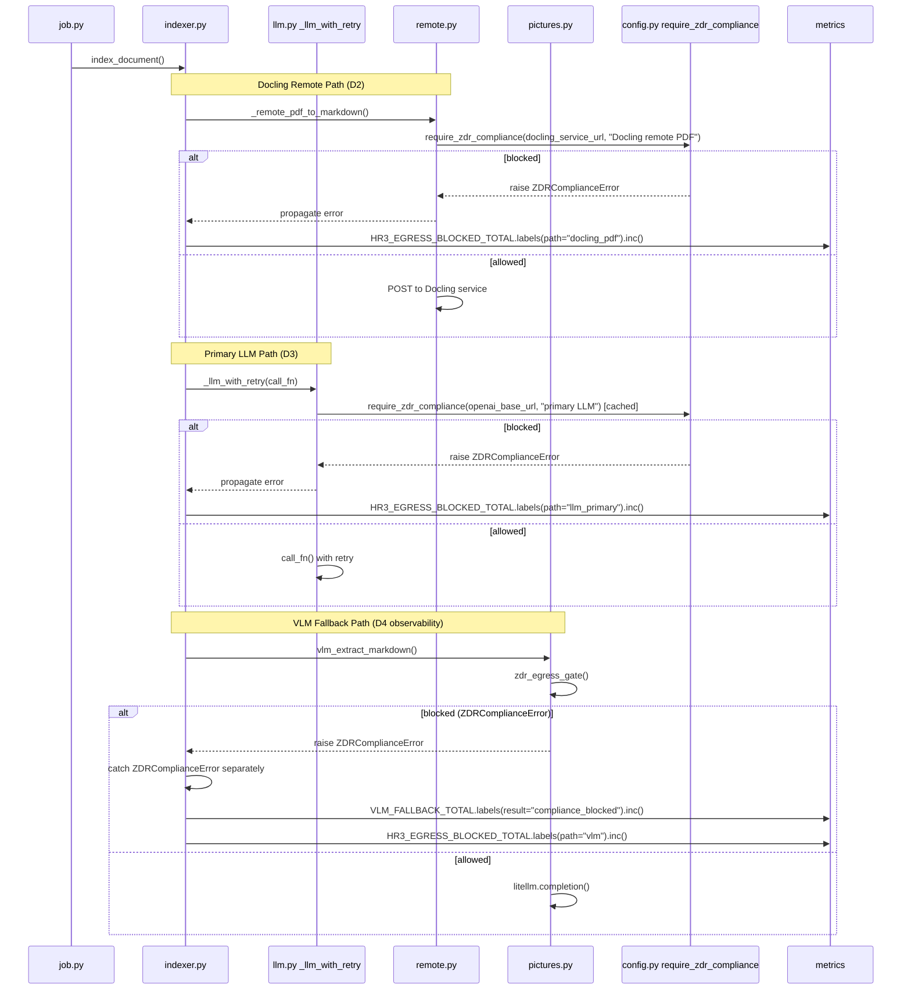
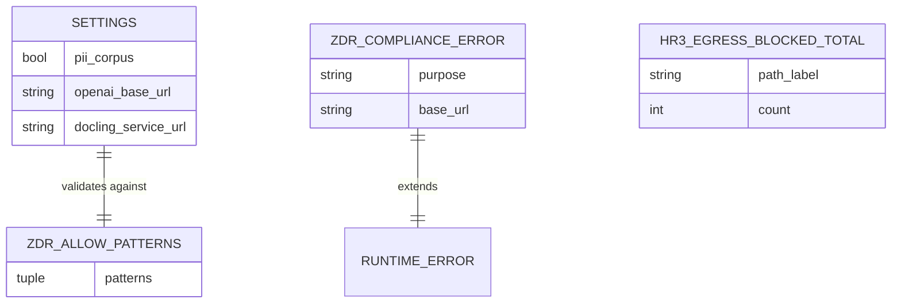

<!-- Space: CITRA -->
<!-- Title: Design: HR3 Egress Control Plane for PII Corpus Documents -->
<!-- Folder: Designs -->

---
id: "design-rfc039-hr3-egress-control-plane"
title: "Design: HR3 Egress Control Plane for PII Corpus Documents"
type: design
status: draft
date: "2026-08-24"
tags:
  - design
  - compliance
  - hr3
  - pii
  - egress
  - security
aliases:
  - "design-rfc039-hr3-egress-control-plane"
governs:
  - "[[RFC-039]]"
---

# Design: HR3 Egress Control Plane for PII Corpus Documents

## Traceability

| Artifact | Reference |
|----------|-----------|
| Governing RFC | [RFC-039](../rfcs/039-hr3-egress-control-plane.md) |
| Implementation Plan | [Tasks: HR3 Egress Control Plane](../tasks/tasks-rfc039-hr3-egress-control-plane.md) |
| PRD / Requirements | [[PRD]] |
| Architecture | [[ARCHITECTURE]] |

## Overview

The HR3 Egress Control Plane closes compliance gaps in the PageIndex ingestion pipeline where PII-bearing document content can egress to external services without Zero-Data-Retention (ZDR) validation. Today the MCP server process validates HR3 compliance at boot (`server.py:73-94`), but the arq worker process — where all document ingestion actually happens — has zero ZDR checks. Three egress paths are ungated: the primary LLM tree-generation call, Docling remote PDF conversion, and Docling remote image conversion. This design adds a shared boot gate to the worker, per-call egress gates at each ungated path, a typed `ZDRComplianceError` exception for distinguishing compliance blocks from service failures, and an `HR3_EGRESS_BLOCKED_TOTAL` counter for unified compliance observability.

## Key Design Principles

1. **Defense in depth**: Both boot-time validation (fail-fast) and per-call runtime gates (fail-safe). A misconfigured endpoint caught at startup never reaches a document; a runtime gate catches any endpoint that slips through boot validation (e.g. a dynamically resolved URL).
2. **Non-PII deployments are unaffected**: Every gate is behind `if settings.pii_corpus:`. The default (`pii_corpus=False`) adds zero overhead — no function calls, no pattern matching, no metric increments.
3. **Single enforcement primitive**: All gates delegate to `require_zdr_compliance()` in `config.py`. No independent reimplementation of allow-list matching exists anywhere in the codebase.
4. **Compliance blocks are not errors**: A ZDR block is a policy enforcement event, not a service failure. It gets its own exception type, metric label, and log level so operators can distinguish policy from outage.
5. **Fail-closed on ambiguity**: If a URL cannot be matched against the ZDR allow-list, the gate blocks. The operator must explicitly add the endpoint to `_ZDR_ALLOW_PATTERNS` to allow egress.

## Launch Constraints

- All changes are gated behind `if settings.pii_corpus:` — non-PII deployments must not regress in performance or behavior.
- The `_ZDR_ALLOW_PATTERNS` tuple in `config.py` is the single source of truth for ZDR-qualified endpoints; no new allow-list may be introduced.
- The worker boot gate must share validation logic with the server boot gate — no independent reimplementation.
- `ZDRComplianceError` must be a `RuntimeError` subclass to preserve backward compatibility with existing `except Exception` handlers.

## Architecture

### High-Level System Architecture



### Architecture Decisions

**Shared Boot Gate — `validate_hr3_compliance()`** ([RFC-039 D1](../rfcs/039-hr3-egress-control-plane.md#d1-shared-boot-gate--validate_hr3_compliance)): Extract the HR3 validation logic from `server.py:73-94` into a shared function in `config.py` that validates `openai_base_url`, `LLM_FALLBACK_BASE_URL` (if set), and `docling_service_url` (if set) against `_ZDR_ALLOW_PATTERNS`. Both `server.py` and `worker/lifecycle.py` call this single function. The alternative — duplicating the check in the worker — was rejected because independent reimplementations inevitably diverge (the server already checks `openai_base_url` and `LLM_FALLBACK_BASE_URL` but not `docling_service_url`; the worker would need all three). Linked: [Property 1](#property-1-worker-boot-gate-hr3), [Task 1.1](../tasks/tasks-rfc039-hr3-egress-control-plane.md#11-zdrcomplianceerror-and-validate-hr3-compliance-d1-d4), [Task 1.2](../tasks/tasks-rfc039-hr3-egress-control-plane.md#12-worker-boot-gate-d1).

**Docling Remote Egress Gates** ([RFC-039 D2](../rfcs/039-hr3-egress-control-plane.md#d2-docling-remote-egress-gates)): Add `require_zdr_compliance(settings.docling_service_url, ...)` calls at the top of `_remote_pdf_to_markdown` and `_remote_image_to_markdown` in `client/remote.py`, guarded by `if settings.pii_corpus:`. The `RuntimeError` (now `ZDRComplianceError`) propagates to the caller — callers already handle conversion failures. The alternative — adding Docling to the boot gate only — was rejected because the boot gate validates configuration, not runtime behavior; a per-call gate catches any dynamic URL resolution that the boot gate cannot see. Linked: [Property 2](#property-2-docling-egress-gate), [Task 2.1](../tasks/tasks-rfc039-hr3-egress-control-plane.md#21-docling-remote-egress-gates-d2).

**Primary LLM Per-Call Gate** ([RFC-039 D3](../rfcs/039-hr3-egress-control-plane.md#d3-primary-llm-per-call-gate)): Add a per-process-cached `require_zdr_compliance` call at the top of `_llm_with_retry` for the primary `base_url`. The check runs once per process (cached in a module-level `_primary_zdr_verified: bool = False` flag) since `openai_base_url` is stable within a process lifetime. The fallback path's existing check at `llm.py:118` remains unchanged. The alternative — relying solely on the boot gate — was rejected because the boot gate checks `openai_base_url` at startup, but `require_zdr_compliance` at the call site ensures defense-in-depth even if the settings object is rebound after startup. Linked: [Property 3](#property-3-primary-llm-gate), [Task 2.2](../tasks/tasks-rfc039-hr3-egress-control-plane.md#22-primary-llm-per-call-gate-d3).

**ZDRComplianceError and Observability** ([RFC-039 D4](../rfcs/039-hr3-egress-control-plane.md#d4-zdrcomplianceerror-and-observability)): Create `ZDRComplianceError(RuntimeError)` in `config.py` so compliance blocks are semantically distinct from generic errors. Update `zdr_egress_gate` in `converters/pictures.py` to raise/catch this specific subclass. Update the `except Exception` handler in `client/indexer.py:779-809` to catch `ZDRComplianceError` separately, labeling the VLM metric with `result='compliance_blocked'` instead of `result='error'`. Add `HR3_EGRESS_BLOCKED_TOTAL` counter in `metrics/definitions.py` with a `path` label. Linked: [Property 4](#property-4-compliance-observability), [Task 3.1](../tasks/tasks-rfc039-hr3-egress-control-plane.md#31-compliance-block-observability-d4).

### Deployment Architecture

- **Backend**: Python 3.12 / gunicorn + uvicorn workers (MCP server process) + arq worker process
- **Object Storage**: MinIO — stores raw uploads, processed documents, and verdict sidecars
- **Task Queue**: arq with Redis broker — document ingestion jobs run in the worker process
- **External Services**: OpenAI/Azure LLM (tree generation), Docling Service (PDF/image conversion), VLM (vision model fallback)
- **Metrics**: Prometheus — scraped from the MCP server `/metrics` endpoint; worker metrics mirrored through Redis

### Communication Patterns

| Pattern | Use Case | Technology |
|---------|----------|------------|
| Sync HTTP | LLM tree-generation calls | OpenAI Python SDK / litellm |
| Sync HTTP | Docling remote PDF/image conversion | httpx AsyncClient |
| Sync HTTP | VLM image extraction | litellm |
| Async job queue | Document ingestion pipeline | arq + Redis |
| Boot-time validation | HR3 compliance check | `validate_hr3_compliance()` |
| Per-call validation | HR3 egress gate | `require_zdr_compliance()` |

### Sequence Diagrams

#### Worker Boot Validation Flow — D1



#### Document Egress Flow — D2 + D3 + D4



## Service Contracts

### 1. config.py

**Responsibility**: Central configuration, HR3 ZDR allow-list management, and compliance enforcement primitives.
**Database**: None

**Changes** ([RFC-039 D1](../rfcs/039-hr3-egress-control-plane.md#d1-shared-boot-gate--validate_hr3_compliance), [RFC-039 D4](../rfcs/039-hr3-egress-control-plane.md#d4-zdrcomplianceerror-and-observability)):

- Add `ZDRComplianceError(RuntimeError)` exception class — raised by `require_zdr_compliance()` instead of bare `RuntimeError`. [Property 4](#property-4-compliance-observability), [Task 1.1](../tasks/tasks-rfc039-hr3-egress-control-plane.md#11-zdrcomplianceerror-and-validate-hr3-compliance-d1-d4).
- Add `validate_hr3_compliance()` function that checks `openai_base_url`, `LLM_FALLBACK_BASE_URL` (if set), and `docling_service_url` (if set) against `_ZDR_ALLOW_PATTERNS` when `pii_corpus=True`. Raises `RuntimeError` on violation. [Property 1](#property-1-worker-boot-gate-hr3), [Task 1.1](../tasks/tasks-rfc039-hr3-egress-control-plane.md#11-zdrcomplianceerror-and-validate-hr3-compliance-d1-d4).
- Update `require_zdr_compliance()` to raise `ZDRComplianceError` instead of bare `RuntimeError`. [Property 4](#property-4-compliance-observability), [Task 1.1](../tasks/tasks-rfc039-hr3-egress-control-plane.md#11-zdrcomplianceerror-and-validate-hr3-compliance-d1-d4).

### 2. worker/lifecycle.py

**Responsibility**: Worker process lifecycle management — startup/shutdown hooks for arq.
**Database**: Redis (arq connection)

**Changes** ([RFC-039 D1](../rfcs/039-hr3-egress-control-plane.md#d1-shared-boot-gate--validate_hr3_compliance)):

- Call `validate_hr3_compliance()` at the top of `startup()`, before Redis connection and registry initialization. Raises `RuntimeError` if validation fails, refusing to start the worker. [Property 1](#property-1-worker-boot-gate-hr3), [Task 1.2](../tasks/tasks-rfc039-hr3-egress-control-plane.md#12-worker-boot-gate-d1).

### 3. client/remote.py

**Responsibility**: Remote Docling service communication — PDF and image conversion via HTTP.
**Database**: None

**Changes** ([RFC-039 D2](../rfcs/039-hr3-egress-control-plane.md#d2-docling-remote-egress-gates)):

- Add `require_zdr_compliance(settings.docling_service_url, "Docling remote PDF conversion")` at the top of `_remote_pdf_to_markdown()`, guarded by `if settings.pii_corpus:`. [Property 2](#property-2-docling-egress-gate), [Task 2.1](../tasks/tasks-rfc039-hr3-egress-control-plane.md#21-docling-remote-egress-gates-d2).
- Add `require_zdr_compliance(settings.docling_service_url, "Docling remote image conversion")` at the top of `_remote_image_to_markdown()`, guarded by `if settings.pii_corpus:`. [Property 2](#property-2-docling-egress-gate), [Task 2.1](../tasks/tasks-rfc039-hr3-egress-control-plane.md#21-docling-remote-egress-gates-d2).
- Let `ZDRComplianceError` propagate — callers already handle conversion failures. [Property 2](#property-2-docling-egress-gate).

### 4. client/llm.py

**Responsibility**: LLM client setup, retry logic, and fallback routing.
**Database**: None

**Changes** ([RFC-039 D3](../rfcs/039-hr3-egress-control-plane.md#d3-primary-llm-per-call-gate)):

- Add module-level `_primary_zdr_verified: bool = False` flag.
- Add per-process-cached `require_zdr_compliance(settings.openai_base_url, "primary LLM tree generation")` call at the top of `_llm_with_retry()`, guarded by `if settings.pii_corpus and not _primary_zdr_verified:`. Set `_primary_zdr_verified = True` after the check passes. [Property 3](#property-3-primary-llm-gate), [Task 2.2](../tasks/tasks-rfc039-hr3-egress-control-plane.md#22-primary-llm-per-call-gate-d3).
- The existing fallback path check at line 118 remains unchanged. [Property 3](#property-3-primary-llm-gate).

### 5. converters/pictures.py

**Responsibility**: Picture region extraction, VLM fallback, and text recovery from images.
**Database**: None

**Changes** ([RFC-039 D4](../rfcs/039-hr3-egress-control-plane.md#d4-zdrcomplianceerror-and-observability)):

- Update `zdr_egress_gate()` to catch `ZDRComplianceError` (the new subclass) instead of bare `RuntimeError` from `require_zdr_compliance()`. The function's return contract `(allowed, api_base)` is unchanged. [Property 4](#property-4-compliance-observability), [Task 3.1](../tasks/tasks-rfc039-hr3-egress-control-plane.md#31-compliance-block-observability-d4).

### 6. client/indexer.py

**Responsibility**: Document indexing pipeline — orchestrates conversion, tree generation, and persistence.
**Database**: None (delegates to storage layer)

**Changes** ([RFC-039 D4](../rfcs/039-hr3-egress-control-plane.md#d4-zdrcomplianceerror-and-observability)):

- Update the `except Exception` handler at `indexer.py:779-809` (VLM fallback error path) to catch `ZDRComplianceError` before the generic `Exception` handler. When caught: log as compliance event (not service error), label metric `VLM_FALLBACK_TOTAL.labels(result='compliance_blocked')` instead of `result='error'`, and increment `HR3_EGRESS_BLOCKED_TOTAL.labels(path='vlm')`. [Property 4](#property-4-compliance-observability), [Task 3.1](../tasks/tasks-rfc039-hr3-egress-control-plane.md#31-compliance-block-observability-d4).

### 7. metrics/definitions.py

**Responsibility**: Prometheus metric definitions and `/metrics` response helper.
**Database**: None

**Changes** ([RFC-039 D4](../rfcs/039-hr3-egress-control-plane.md#d4-zdrcomplianceerror-and-observability)):

- Add `HR3_EGRESS_BLOCKED_TOTAL = Counter("pageindex_hr3_egress_blocked_total", "...", ["path"])` with labels: `docling_pdf`, `docling_image`, `vlm`, `llm_primary`, `llm_fallback`. [Property 4](#property-4-compliance-observability), [Task 3.1](../tasks/tasks-rfc039-hr3-egress-control-plane.md#31-compliance-block-observability-d4).

## Data Models

### Entity Relationship Diagram



### Core Entities

```python
class ZDRComplianceError(RuntimeError):
    """Raised when an egress path is blocked by HR3 compliance checks.
    Subclass of RuntimeError for backward compatibility with existing
    except Exception handlers."""
    pass

class HR3EgressPath(str, Enum):
    DOCLING_PDF = "docling_pdf"
    DOCLING_IMAGE = "docling_image"
    VLM = "vlm"
    LLM_PRIMARY = "llm_primary"
    LLM_FALLBACK = "llm_fallback"
```

## Correctness Properties

*A property is a characteristic or behavior that should hold true across all valid executions of the system — a formal statement about what the system should do. Properties serve as the bridge between human-readable specifications and machine-verifiable correctness guarantees.*

### Property 1: Worker Boot Gate HR3

*For any* worker process startup where `pii_corpus=True`, the worker SHALL refuse to start if any of `openai_base_url`, `LLM_FALLBACK_BASE_URL` (when set), or `docling_service_url` (when set) is not on the ZDR allow-list.

**Validates:** [RFC-039 D1](../rfcs/039-hr3-egress-control-plane.md#d1-shared-boot-gate--validate_hr3_compliance), [Requirement 1](../rfcs/039-hr3-egress-control-plane.md#requirement-1-worker-process-hr3-boot-gate)
**Tested in:** [Task 1.2](../tasks/tasks-rfc039-hr3-egress-control-plane.md#12-worker-boot-gate-d1) — `test_worker_boot_gate_blocks_non_zdr`
**Service contract:** [config.py](#1-configpy), [worker/lifecycle.py](#2-workerlifecyclepy)
**Sequence diagram:** [Worker Boot Validation Flow](#worker-boot-validation-flow--d1)

### Property 2: Docling Egress Gate

*For any* call to `_remote_pdf_to_markdown` or `_remote_image_to_markdown` where `pii_corpus=True`, the function SHALL call `require_zdr_compliance(settings.docling_service_url, ...)` before sending any data to the Docling service. If the check fails, `ZDRComplianceError` SHALL propagate to the caller — it SHALL NOT be caught silently.

**Validates:** [RFC-039 D2](../rfcs/039-hr3-egress-control-plane.md#d2-docling-remote-egress-gates), [Requirement 2](../rfcs/039-hr3-egress-control-plane.md#requirement-2-docling-remote-egress-gate)
**Tested in:** [Task 2.1](../tasks/tasks-rfc039-hr3-egress-control-plane.md#21-docling-remote-egress-gates-d2) — `test_docling_remote_blocks_non_zdr`
**Service contract:** [client/remote.py](#3-clientremotepy)
**Sequence diagram:** [Document Egress Flow](#document-egress-flow--d2--d3--d4)

### Property 3: Primary LLM Gate

*For any* invocation of `_llm_with_retry` where `pii_corpus=True`, the function SHALL validate ZDR compliance for the primary `openai_base_url` before the first LLM attempt. The check MAY be cached per-process since `openai_base_url` is stable within a process lifetime.

**Validates:** [RFC-039 D3](../rfcs/039-hr3-egress-control-plane.md#d3-primary-llm-per-call-gate), [Requirement 3](../rfcs/039-hr3-egress-control-plane.md#requirement-3-primary-llm-per-call-gate)
**Tested in:** [Task 2.2](../tasks/tasks-rfc039-hr3-egress-control-plane.md#22-primary-llm-per-call-gate-d3) — `test_primary_llm_blocks_non_zdr`
**Service contract:** [client/llm.py](#4-clientllmpy)
**Sequence diagram:** [Document Egress Flow](#document-egress-flow--d2--d3--d4)

### Property 4: Compliance Observability

*For any* egress path blocked by HR3 compliance, the system SHALL:
(a) raise `ZDRComplianceError` (not bare `RuntimeError`),
(b) label the VLM fallback metric with `result='compliance_blocked'` (not `result='error'`), and
(c) increment `HR3_EGRESS_BLOCKED_TOTAL` with the appropriate `path` label.

**Validates:** [RFC-039 D4](../rfcs/039-hr3-egress-control-plane.md#d4-zdrcomplianceerror-and-observability), [Requirement 4](../rfcs/039-hr3-egress-control-plane.md#requirement-4-compliance-block-observability)
**Tested in:** [Task 3.1](../tasks/tasks-rfc039-hr3-egress-control-plane.md#31-compliance-block-observability-d4) — `test_compliance_block_metrics`
**Service contract:** [config.py](#1-configpy), [converters/pictures.py](#5-converterspicturespy), [client/indexer.py](#6-clientindexerpy), [metrics/definitions.py](#7-metricsdefinitionspy)
**Sequence diagram:** [Document Egress Flow](#document-egress-flow--d2--d3--d4)

## Error Handling

### Error Categories & Responses

| Category | Exception | Response | Retry Strategy |
|----------|-----------|----------|----------------|
| HR3 boot gate violation | `RuntimeError` | Worker/server refuses to start | Operator fixes config |
| HR3 per-call block (Docling) | `ZDRComplianceError` | Propagates to caller; document processing fails | No retry — policy enforcement |
| HR3 per-call block (LLM primary) | `ZDRComplianceError` | Propagates as `LLMTransientFailure` | No retry — policy enforcement |
| HR3 per-call block (VLM) | `ZDRComplianceError` | Caught by indexer; VLM fallback skipped | No retry — graceful degradation |
| HR3 per-call block (LLM fallback) | `ZDRComplianceError` (existing) | Wrapped in `LLMTransientFailure` | No retry — policy enforcement |
| Genuine API failure | Various `Exception` subclasses | Retry with backoff | Exponential backoff per `_llm_with_retry` |

### Service-Specific Error Handling

**config.py — `validate_hr3_compliance()`:**

- Checks all three endpoints sequentially; raises on the first violation with a descriptive message identifying which endpoint and which hard rule.
- Non-PII deployments (`pii_corpus=False`) return immediately — no validation performed.

**client/remote.py — Docling egress:**

- `ZDRComplianceError` propagates to the caller. The caller (`indexer.py`) already handles conversion failures and will mark the document as an error.
- The presigned URL is never generated when the gate blocks — no data leaves the MinIO network boundary.

**client/llm.py — Primary LLM gate:**

- The per-process cache (`_primary_zdr_verified`) means the check runs once. If it fails, every subsequent call to `_llm_with_retry` in the same process also fails (the flag stays `False` and the check re-raises).
- Accepted limitation: if `settings.openai_base_url` is rebound after process startup, the cached check may be stale. This is documented in [RFC-039 Consequences](../rfcs/039-hr3-egress-control-plane.md#consequences).

**client/indexer.py — VLM fallback:**

- `ZDRComplianceError` is caught before `Exception`, logged as a compliance event (not an error), and the VLM fallback is skipped. The document continues processing without VLM enrichment.

## Testing Strategy

### Testing Layers

1. **Unit Tests**: Verify each gate function in isolation with mocked settings.
2. **Integration Tests**: Verify the boot gate prevents worker startup, and per-call gates prevent data egress in the full pipeline.
3. **Metric Validation Tests**: Verify that compliance blocks produce the correct metric labels and counter increments.

### Test Categories by Service

| Service | Unit Tests | Integration Tests |
|---------|------------|-------------------|
| [config.py](#1-configpy) | `validate_hr3_compliance` with various endpoint combinations; `ZDRComplianceError` is `RuntimeError` subclass | N/A |
| [worker/lifecycle.py](#2-workerlifecyclepy) | `startup()` raises when `validate_hr3_compliance` fails | Worker refuses to start with non-ZDR endpoints |
| [client/remote.py](#3-clientremotepy) | `_remote_pdf_to_markdown` / `_remote_image_to_markdown` raise `ZDRComplianceError` when `pii_corpus=True` and endpoint not allowlisted | No HTTP request sent when gate blocks |
| [client/llm.py](#4-clientllmpy) | `_llm_with_retry` raises on first call when primary URL not allowlisted; per-process cache works | N/A |
| [converters/pictures.py](#5-converterspicturespy) | `zdr_egress_gate` catches `ZDRComplianceError` specifically | N/A |
| [client/indexer.py](#6-clientindexerpy) | VLM fallback path catches `ZDRComplianceError` with correct metric label | N/A |
| [metrics/definitions.py](#7-metricsdefinitionspy) | `HR3_EGRESS_BLOCKED_TOTAL` counter exists with correct labels | Counter increments on compliance blocks |

### Key Test Scenarios

**Critical Path Tests:**

1. Worker boot with `pii_corpus=True` and all endpoints on ZDR allow-list — starts normally
2. Worker boot with `pii_corpus=True` and `openai_base_url` not on ZDR allow-list — refuses to start
3. Worker boot with `pii_corpus=False` and non-ZDR endpoints — starts normally (no-op)
4. Docling remote PDF call with `pii_corpus=True` and non-ZDR Docling URL — raises `ZDRComplianceError` before any HTTP request
5. Primary LLM call with `pii_corpus=True` and ZDR-allowlisted URL — proceeds normally, cache flag set
6. VLM fallback blocked by compliance — `VLM_FALLBACK_TOTAL` incremented with `result='compliance_blocked'`, not `result='error'`

**Edge Cases:**

- `validate_hr3_compliance()` with `LLM_FALLBACK_BASE_URL` unset (empty string) — skipped, no error
- `validate_hr3_compliance()` with `docling_service_url` unset — skipped, no error
- Per-process LLM cache: second call after successful first call — no re-check
- Per-process LLM cache: `_primary_zdr_verified` stays `False` after a `ZDRComplianceError` — re-raises on next call
- `server.py` and `worker/lifecycle.py` both call the same `validate_hr3_compliance()` — shared logic, consistent behavior
- `ZDRComplianceError` is caught by existing `except Exception` handlers (backward compatibility via `RuntimeError` subclass)
