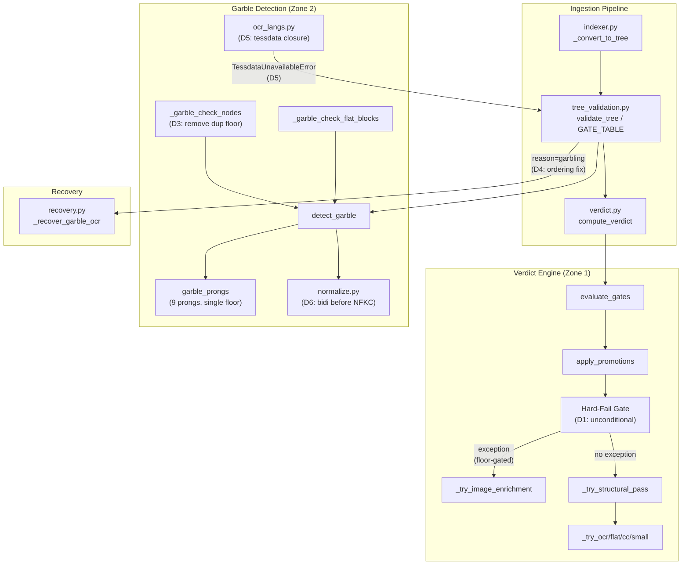
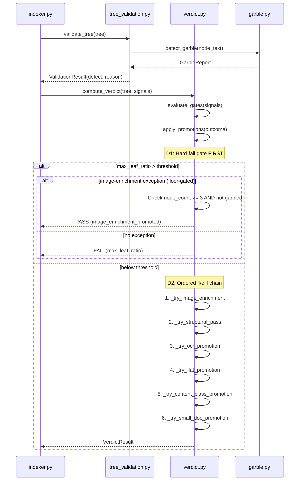
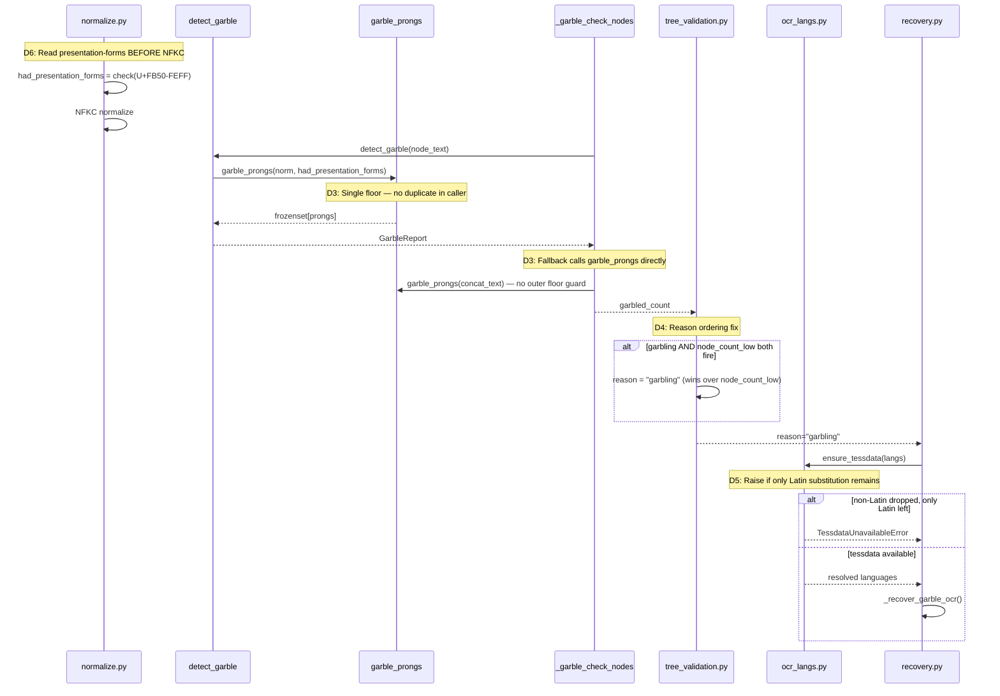

<!-- Space: CITRA -->
<!-- Title: Design Document: Verdict Gate & Garble Detection Critical Zone Remediation -->
<!-- Folder: Designs -->

---
id: "design-rfc040-verdict-garble-critical-zone-remediation"
title: "Design: Verdict Gate & Garble Detection Critical Zone Remediation"
type: design
status: draft
date: "2026-08-27"
tags:
  - design
  - verdict
  - garble
  - wave-4
  - corpus-quality
aliases:
  - "design-rfc040-verdict-garble-critical-zone-remediation"
governs:
  - "[[RFC-040]]"
---

# Design Document: Verdict Gate & Garble Detection Critical Zone Remediation

## Traceability

| Artifact | Reference |
|----------|-----------|
| Governing RFC(s) | [RFC-040](../rfcs/040-verdict-garble-critical-zone-remediation.md) |
| Architecture Doc | [[ARCHITECTURE]] |
| Implementation Plan | [Tasks: RFC-040](../tasks/tasks-rfc040-verdict-garble-critical-zone-remediation.md) |
| Corpus Audit (source) | `audit/ARCHITECTURE_DEFECT_ZONES_AUDIT_2026-08-27_POST-RUN20.md` |
| Remediation Scorecard | `audit/REMEDIATION_SCORECARD_2026-08-27_POST-RUN20.md` |

## Overview

The verdict-computation and garble-detection subsystems of the PageIndex ingestion pipeline contain two CRITICAL-severity architectural defect zones that survived wave 1–3 remediation. Zone 1 (Verdict Gate) allows image-enrichment promotion candidates to bypass structural hard-fail checks, creating a ratchet where threshold changes alternately mask and reveal defects. Zone 2 (Garble Detection) suffers from duplicated digit-ratio floor logic, reason-ordering that masks garbling from OCR recovery, silent tessdata substitution producing undetectable mojibake, and NFKC normalization destroying the bidi coherence signal before detection runs. This design addresses all 10 remaining bugs across both zones through 6 deliverables ([D1](../rfcs/040-verdict-garble-critical-zone-remediation.md#d1-unconditional-structural-hard-fail-zone-1)–[D6](../rfcs/040-verdict-garble-critical-zone-remediation.md#d6-nfkc-before-bidi-reordering-zone-2)), sequenced from zero-risk refactors through corpus-impacting restructuring, with 6 [correctness properties](#correctness-properties) validated by the [implementation plan](../tasks/tasks-rfc040-verdict-garble-critical-zone-remediation.md).

## Key Design Principles

1. **Gates over candidates:** Structural hard-fail is a gate that fires unconditionally before any promotion path runs — not a candidate that competes on numeric priority. A promotion may grant a documented *exception* to a gate, never silently *bypass* it.
2. **Priority via source order:** Promotion-path priority is expressed by position in an `if/elif` chain, not by a numeric `priority` field resolved at runtime with `max()`. Adding a new path forces the author to choose its position relative to existing paths.
3. **Single source of truth for detection thresholds:** Every garble-detection threshold (digit-ratio floor, token-repetition ratio, morphological-nonsense ratio) lives in exactly one place — `garble_prongs`. Callers do not independently re-gate on the same threshold.
4. **Detection implies remediation path:** When a defect reason (e.g. `garbling`) triggers a gate, the reason string must survive to the recovery dispatcher. Reason-ordering must never mask a recoverable reason with a non-recoverable one.
5. **Normalize after detect:** Detection functions that depend on pre-normalization codepoints (Arabic Presentation-Forms U+FB50–FEFF) must read them before NFKC normalization runs, not after.
6. **Loud failure over silent degradation:** When tessdata for a requested script is unavailable, raise `TessdataUnavailableError` rather than silently substituting a different script's traineddata. Mojibake is worse than an explicit error.

## Launch Constraints

- All 6 deliverables target the existing `ICR-97-rfc39` branch (or its successor) — no new services, no schema migrations, no infrastructure changes.
- Corpus diff is mandatory before merging any deliverable that changes verdict distribution ([D1](../rfcs/040-verdict-garble-critical-zone-remediation.md#d1-unconditional-structural-hard-fail-zone-1), [D4](../rfcs/040-verdict-garble-critical-zone-remediation.md#d4-gate_table-reason-ordering-fix-zone-2), [D5](../rfcs/040-verdict-garble-critical-zone-remediation.md#d5-tessdata-latin-substitution-closure-zone-2)).
- Test fixtures must be regenerated in the same PR as any threshold change to prevent calibration drift.
- [CLAUDE.md Hard Rule 5](../rfcs/040-verdict-garble-critical-zone-remediation.md#problem-statement): `validate_tree()` must run before `save_doc`; a failing tree must surface as an arq `low_quality_tree` error, not a stored artifact.

## Architecture

### High-Level System Architecture

### Architecture Decisions

**AD1: Unconditional Structural Hard-Fail** ([RFC-040 D1](../rfcs/040-verdict-garble-critical-zone-remediation.md#d1-unconditional-structural-hard-fail-zone-1)): The `max_leaf_ratio > hard_fail_max_leaf_ratio` check moves to the top of `apply_promotions`, evaluated before any `_try_*` function runs. `_has_image_rescue` is deleted. Image-enrichment becomes a floor-gated exception to hard-fail (must pass `sig.node_count >= 3` AND `not sig.effectively_garbled`) rather than a bypass. Alternative (keep `_has_image_rescue` with tighter guards) was rejected because the bypass mechanism itself — not just its threshold — is the root cause of the ratchet.

**AD2: Ordered Promotion Pipeline** ([RFC-040 D2](../rfcs/040-verdict-garble-critical-zone-remediation.md#d2-ordered-promotion-pipeline-zone-1)): The six `_try_*` functions + `PromotionCandidate` dataclass + `max(candidates, key=priority)` selection is replaced with a single ordered `if/elif` chain. Priority is determined by source-code position. Alternative (keep candidates with fixed priority constants) was rejected because numeric priority fields are invisible at the call site and silently mis-rank when new paths are added.

**AD3: Garble Detection Deduplication** ([RFC-040 D3](../rfcs/040-verdict-garble-critical-zone-remediation.md#d3-garble-detection-deduplication-zone-2)): The duplicate `garble_digit_floor` guard in `_garble_check_nodes`'s whole-tree fallback (garble.py:696–698) is removed. The fallback already calls `garble_prongs`, which applies the floor internally (line 380). Alternative (keep the outer guard and sync its value) was rejected because synchronized duplicates inevitably drift.

**AD4: GATE_TABLE Reason-Ordering Fix** ([RFC-040 D4](../rfcs/040-verdict-garble-critical-zone-remediation.md#d4-gate_table-reason-ordering-fix-zone-2)): When both `garbling` and `node_count_low` fire, `garbling` wins as the surfaced reason. OCR recovery only triggers for `reason in ('garbling', 'node_garbling')`; masking garbling with `node_count_low` blocks the recovery path. The fix short-circuits reason selection when a recoverable reason is in the fired-defects set.

**AD5: Tessdata Latin Substitution Closure** ([RFC-040 D5](../rfcs/040-verdict-garble-critical-zone-remediation.md#d5-tessdata-latin-substitution-closure-zone-2)): `ensure_tessdata` raises `TessdataUnavailableError` when ALL originally-requested non-Latin languages were dropped and ONLY Latin remain. This completes the fix from commit cf904ff which already handles missing non-Latin traineddata but allows silent Latin substitution. The MOU MOHRE Run-20 regression (PASS→ERROR) was caused by the first half; this completes it consistently.

**AD6: NFKC-Before-Bidi Reordering** ([RFC-040 D6](../rfcs/040-verdict-garble-critical-zone-remediation.md#d6-nfkc-before-bidi-reordering-zone-2)): `_pre_inference_normalize` is reordered so the `had_presentation_forms` computation reads Arabic Presentation-Forms codepoints (U+FB50–FEFF) BEFORE NFKC folding decomposes them. NFKC continues to run afterward for downstream consumers. This converts a zero-sensitivity null detector into a functional gate.

### Deployment Architecture

- **Backend**: Python 3.12, FastMCP + Uvicorn (port 8201)
- **Task Queue**: arq with Redis broker — worker process runs ingestion
- **Object Storage**: MinIO (processed/, uploads/, figures/, verdicts/)
- **Database**: PostgreSQL (doc_registry)
- **Cache**: Redis (pageindex:doc:*)

No deployment changes required — all deliverables are code-only modifications to existing modules.

### Communication Patterns

| Pattern | Use Case | Technology |
|---------|----------|------------|
| Sync HTTP | Document upload, job status polling | FastMCP endpoints |
| Async job queue | Document processing pipeline | arq + Redis |
| Direct function call | Verdict computation, garble detection | In-process Python |

### Sequence Diagrams

#### Verdict Computation Flow — [D1](../rfcs/040-verdict-garble-critical-zone-remediation.md#d1-unconditional-structural-hard-fail-zone-1), [D2](../rfcs/040-verdict-garble-critical-zone-remediation.md#d2-ordered-promotion-pipeline-zone-1)

#### Garble Detection Flow — [D3](../rfcs/040-verdict-garble-critical-zone-remediation.md#d3-garble-detection-deduplication-zone-2), [D4](../rfcs/040-verdict-garble-critical-zone-remediation.md#d4-gate_table-reason-ordering-fix-zone-2), [D5](../rfcs/040-verdict-garble-critical-zone-remediation.md#d5-tessdata-latin-substitution-closure-zone-2), [D6](../rfcs/040-verdict-garble-critical-zone-remediation.md#d6-nfkc-before-bidi-reordering-zone-2)

## Service Contracts

### 1. Verdict Engine (`verdict.py`)

**Responsibility**: Compute final PASS/MARGINAL/FAIL verdict for an ingested document tree by evaluating structural gates and promotion paths.

**Changes** ([D1](../rfcs/040-verdict-garble-critical-zone-remediation.md#d1-unconditional-structural-hard-fail-zone-1), [D2](../rfcs/040-verdict-garble-critical-zone-remediation.md#d2-ordered-promotion-pipeline-zone-1)):

| Change | RFC | Property | Task |
|--------|-----|----------|------|
| Delete `_has_image_rescue` variable and conditional (line 461–471) | [D1](../rfcs/040-verdict-garble-critical-zone-remediation.md#d1-unconditional-structural-hard-fail-zone-1) | [Property 1](#property-1-unconditional-hard-fail) | [Task 3.1](../tasks/tasks-rfc040-verdict-garble-critical-zone-remediation.md#31-unconditional-hard-fail-d1) |
| Move hard-fail check before candidate collection (~line 440) | [D1](../rfcs/040-verdict-garble-critical-zone-remediation.md#d1-unconditional-structural-hard-fail-zone-1) | [Property 1](#property-1-unconditional-hard-fail) | [Task 3.1](../tasks/tasks-rfc040-verdict-garble-critical-zone-remediation.md#31-unconditional-hard-fail-d1) |
| Add `sig.node_count >= 3` and `not sig.effectively_garbled` to `_try_image_enrichment` | [D1](../rfcs/040-verdict-garble-critical-zone-remediation.md#d1-unconditional-structural-hard-fail-zone-1) | [Property 1](#property-1-unconditional-hard-fail) | [Task 3.1](../tasks/tasks-rfc040-verdict-garble-critical-zone-remediation.md#31-unconditional-hard-fail-d1) |
| Replace `PromotionCandidate` + `max()` with ordered `if/elif` | [D2](../rfcs/040-verdict-garble-critical-zone-remediation.md#d2-ordered-promotion-pipeline-zone-1) | [Property 2](#property-2-ordered-promotion) | [Task 3.2](../tasks/tasks-rfc040-verdict-garble-critical-zone-remediation.md#32-ordered-promotion-pipeline-d2) |
| Delete `PromotionCandidate` dataclass and `priority` field | [D2](../rfcs/040-verdict-garble-critical-zone-remediation.md#d2-ordered-promotion-pipeline-zone-1) | [Property 2](#property-2-ordered-promotion) | [Task 3.2](../tasks/tasks-rfc040-verdict-garble-critical-zone-remediation.md#32-ordered-promotion-pipeline-d2) |

### 2. Garble Detection (`garble.py`)

**Responsibility**: Detect text-layer garbling via 9 heuristic prongs; provide per-node tree checks and per-block flat checks.

**Changes** ([D3](../rfcs/040-verdict-garble-critical-zone-remediation.md#d3-garble-detection-deduplication-zone-2)):

| Change | RFC | Property | Task |
|--------|-----|----------|------|
| Remove duplicate `garble_digit_floor` guard in `_garble_check_nodes` fallback (lines 696–698) | [D3](../rfcs/040-verdict-garble-critical-zone-remediation.md#d3-garble-detection-deduplication-zone-2) | [Property 3](#property-3-single-garble-floor) | [Task 1.1](../tasks/tasks-rfc040-verdict-garble-critical-zone-remediation.md#11-remove-duplicate-digit-floor-d3) |

### 3. Tree Validation (`tree_validation.py`)

**Responsibility**: Validate tree structure via GATE_TABLE, assign defect reasons, route to recovery paths.

**Changes** ([D4](../rfcs/040-verdict-garble-critical-zone-remediation.md#d4-gate_table-reason-ordering-fix-zone-2)):

| Change | RFC | Property | Task |
|--------|-----|----------|------|
| Short-circuit reason selection: when `garbling`/`node_garbling` is in fired defects AND selected reason differs, override with `garbling` | [D4](../rfcs/040-verdict-garble-critical-zone-remediation.md#d4-gate_table-reason-ordering-fix-zone-2) | [Property 4](#property-4-garble-reason-priority) | [Task 2.1](../tasks/tasks-rfc040-verdict-garble-critical-zone-remediation.md#21-fix-gate-table-reason-ordering-d4) |

### 4. OCR Languages (`ocr_langs.py`)

**Responsibility**: Resolve tessdata language packs for OCR; raise `TessdataUnavailableError` when required scripts are unavailable.

**Changes** ([D5](../rfcs/040-verdict-garble-critical-zone-remediation.md#d5-tessdata-latin-substitution-closure-zone-2)):

| Change | RFC | Property | Task |
|--------|-----|----------|------|
| After resolving available languages, check if ALL non-Latin languages were dropped and ONLY Latin remain → raise `TessdataUnavailableError` | [D5](../rfcs/040-verdict-garble-critical-zone-remediation.md#d5-tessdata-latin-substitution-closure-zone-2) | [Property 5](#property-5-tessdata-no-silent-substitution) | [Task 2.2](../tasks/tasks-rfc040-verdict-garble-critical-zone-remediation.md#22-close-tessdata-latin-substitution-d5) |

### 5. Normalization (`normalize.py`)

**Responsibility**: Pre-inference text normalization including bidi reconstruction and NFKC folding.

**Changes** ([D6](../rfcs/040-verdict-garble-critical-zone-remediation.md#d6-nfkc-before-bidi-reordering-zone-2)):

| Change | RFC | Property | Task |
|--------|-----|----------|------|
| Reorder `_pre_inference_normalize` so `had_presentation_forms` is computed before NFKC folding | [D6](../rfcs/040-verdict-garble-critical-zone-remediation.md#d6-nfkc-before-bidi-reordering-zone-2) | [Property 6](#property-6-bidi-signal-preserved) | [Task 1.2](../tasks/tasks-rfc040-verdict-garble-critical-zone-remediation.md#12-reorder-nfkc-bidi-d6) |

## Data Models

No data model changes. All deliverables modify in-process computation logic. No schema migrations, no new MinIO prefixes, no new Redis keys.

## Correctness Properties

*A property is a characteristic or behavior that should hold true across all valid executions of the system — a formal statement about what the system should do. Properties serve as the bridge between human-readable specifications and machine-verifiable correctness guarantees.*

### Property 1: Unconditional Hard-Fail

*For any* document where `sig.max_leaf_ratio > th.hard_fail_max_leaf_ratio`, the system SHALL return `FAIL` unless the document satisfies ALL of: (a) `content_class in ("flat_prose", "flat_mixed")`, (b) `image_enrichment_ratio >= 0.8`, (c) `total_chars >= min_image_promoted_chars`, (d) `sig.node_count >= 3`, (e) `not sig.effectively_garbled`, and (f) `detect_garble` returns false on the promoted text.

**Validates:** [RFC-040 D1](../rfcs/040-verdict-garble-critical-zone-remediation.md#d1-unconditional-structural-hard-fail-zone-1)
**Tested in:** [Task 3.1](../tasks/tasks-rfc040-verdict-garble-critical-zone-remediation.md#31-unconditional-hard-fail-d1) — `test_hard_fail_unconditional`, `test_image_enrichment_exception_requires_all_guards`
**Service contract:** [Verdict Engine](#1-verdict-engine-verdictpy)
**Sequence diagram:** [Verdict Computation Flow](#verdict-computation-flow--d1-d2)

### Property 2: Ordered Promotion

*For any* document entering the promotion pipeline, the system SHALL evaluate promotion paths in a fixed source-code order (image-enrichment → structural → OCR → flat → content-class → small-doc) and return the result of the FIRST matching path, with no numeric priority field or runtime `max()` selection.

**Validates:** [RFC-040 D2](../rfcs/040-verdict-garble-critical-zone-remediation.md#d2-ordered-promotion-pipeline-zone-1)
**Tested in:** [Task 3.2](../tasks/tasks-rfc040-verdict-garble-critical-zone-remediation.md#32-ordered-promotion-pipeline-d2) — `test_promotion_order_first_match_wins`
**Service contract:** [Verdict Engine](#1-verdict-engine-verdictpy)
**Sequence diagram:** [Verdict Computation Flow](#verdict-computation-flow--d1-d2)

### Property 3: Single Garble Floor

*For any* garble detection invocation (tree-mode or flat-mode), the `garble_digit_floor` threshold SHALL be applied in exactly one place — inside `garble_prongs` — and no caller SHALL independently re-gate on the same threshold.

**Validates:** [RFC-040 D3](../rfcs/040-verdict-garble-critical-zone-remediation.md#d3-garble-detection-deduplication-zone-2)
**Tested in:** [Task 1.1](../tasks/tasks-rfc040-verdict-garble-critical-zone-remediation.md#11-remove-duplicate-digit-floor-d3) — `test_fallback_delegates_floor_to_garble_prongs`
**Service contract:** [Garble Detection](#2-garble-detection-garblepy)
**Sequence diagram:** [Garble Detection Flow](#garble-detection-flow--d3-d4-d5-d6)

### Property 4: Garble Reason Priority

*For any* document where both `garbling` (or `node_garbling`) and `node_count_low` fire as defects, the system SHALL surface `garbling` (or `node_garbling`) as the reason, ensuring the OCR recovery path (`reason in ('garbling', 'node_garbling')`) is reachable.

**Validates:** [RFC-040 D4](../rfcs/040-verdict-garble-critical-zone-remediation.md#d4-gate_table-reason-ordering-fix-zone-2)
**Tested in:** [Task 2.1](../tasks/tasks-rfc040-verdict-garble-critical-zone-remediation.md#21-fix-gate-table-reason-ordering-d4) — `test_garble_reason_wins_over_node_count_low`
**Service contract:** [Tree Validation](#3-tree-validation-tree_validationpy)
**Sequence diagram:** [Garble Detection Flow](#garble-detection-flow--d3-d4-d5-d6)

### Property 5: Tessdata No Silent Substitution

*For any* OCR request that originally included non-Latin languages, the system SHALL raise `TessdataUnavailableError` if resolution drops ALL non-Latin languages and only Latin languages remain — never silently proceed with Latin-only tessdata to produce mojibake.

**Validates:** [RFC-040 D5](../rfcs/040-verdict-garble-critical-zone-remediation.md#d5-tessdata-latin-substitution-closure-zone-2)
**Tested in:** [Task 2.2](../tasks/tasks-rfc040-verdict-garble-critical-zone-remediation.md#22-close-tessdata-latin-substitution-d5) — `test_tessdata_raises_on_latin_only_substitution`
**Service contract:** [OCR Languages](#4-ocr-languages-ocr_langspy)
**Sequence diagram:** [Garble Detection Flow](#garble-detection-flow--d3-d4-d5-d6)

### Property 6: Bidi Signal Preserved

*For any* text containing Arabic Presentation-Forms codepoints (U+FB50–FEFF), the system SHALL compute `had_presentation_forms` BEFORE NFKC normalization destroys those codepoints, ensuring the bidi coherence gate has non-zero sensitivity.

**Validates:** [RFC-040 D6](../rfcs/040-verdict-garble-critical-zone-remediation.md#d6-nfkc-before-bidi-reordering-zone-2)
**Tested in:** [Task 1.2](../tasks/tasks-rfc040-verdict-garble-critical-zone-remediation.md#12-reorder-nfkc-bidi-d6) — `test_presentation_forms_detected_before_nfkc`
**Service contract:** [Normalization](#5-normalization-normalizepy)
**Sequence diagram:** [Garble Detection Flow](#garble-detection-flow--d3-d4-d5-d6)

## Error Handling

### Error Categories & Responses

| Category | Trigger | Response | Retry Strategy |
|----------|---------|----------|----------------|
| `TessdataUnavailableError` | Non-Latin tessdata missing, Latin-only substitution ([D5](#ad5-tessdata-closure)) | Log warning, skip OCR recovery, surface in verdict reason | No retry — tessdata must be installed |
| Structural hard-fail | `max_leaf_ratio > threshold`, no valid exception ([D1](#ad1-unconditional-hard-fail)) | Return `VerdictResult("FAIL", ...)` | Re-ingest after pipeline fix |
| Garble detection | Any prong fires in `garble_prongs` | `GarbleReport(is_garbled=True, fired_prongs=...)` | OCR retry if reason=`garbling` reaches recovery |

### Service-Specific Error Handling

**Verdict Engine (verdict.py):**

- Image-enrichment exception fails all guards → falls through to FAIL (not an error, correct classification)
- No promotion path matches → MARGINAL with diagnostic reason string

**Garble Detection (garble.py):**

- Below-floor text (< `garble_digit_floor` chars) → digit-ratio prong skipped, other prongs still run
- Whole-tree fallback fires only when per-node detection found 0 garbled nodes

**OCR Languages (ocr_langs.py):**

- Missing non-Latin tessdata → `TessdataUnavailableError` (existing behavior, extended by [D5](../rfcs/040-verdict-garble-critical-zone-remediation.md#d5-tessdata-latin-substitution-closure-zone-2))
- Missing Latin tessdata → `TessdataUnavailableError` (unchanged)

## Testing Strategy

### Testing Layers

1. **Unit Tests**: One test per correctness property, plus edge-case coverage for boundary conditions (38-char docs, max_leaf_ratio at threshold, garble+node_count_low co-firing).
2. **Integration Tests**: Corpus diff against Run-20 baseline for each verdict-impacting deliverable ([D1](../rfcs/040-verdict-garble-critical-zone-remediation.md#d1-unconditional-structural-hard-fail-zone-1), [D4](../rfcs/040-verdict-garble-critical-zone-remediation.md#d4-gate_table-reason-ordering-fix-zone-2), [D5](../rfcs/040-verdict-garble-critical-zone-remediation.md#d5-tessdata-latin-substitution-closure-zone-2)).
3. **Regression Tests**: Fixture regeneration in same PR as threshold changes ([D2](../rfcs/040-verdict-garble-critical-zone-remediation.md#d2-ordered-promotion-pipeline-zone-1)).

### Test Categories by Service

| Service | Properties | Unit Tests | Integration Tests |
|---------|-----------|------------|-------------------|
| [Verdict Engine](#1-verdict-engine-verdictpy) | [P1](#property-1-unconditional-hard-fail), [P2](#property-2-ordered-promotion) | Hard-fail bypass, promotion ordering, image-enrichment guards | Corpus diff (D1, D2) |
| [Garble Detection](#2-garble-detection-garblepy) | [P3](#property-3-single-garble-floor) | Fallback floor delegation, below-floor behavior | Existing suite |
| [Tree Validation](#3-tree-validation-tree_validationpy) | [P4](#property-4-garble-reason-priority) | Reason-ordering with co-firing defects | Corpus diff (D4) |
| [OCR Languages](#4-ocr-languages-ocr_langspy) | [P5](#property-5-tessdata-no-silent-substitution) | Latin-only substitution raises error | Corpus diff (D5) |
| [Normalization](#5-normalization-normalizepy) | [P6](#property-6-bidi-signal-preserved) | Presentation-forms before NFKC | Existing suite |

### Key Test Scenarios

**Critical Path Tests:**

1. Document with `max_leaf_ratio=1.0`, `image_enrichment_ratio=0.9`, `total_chars=5000`, `node_count >= 3`, not garbled → PASS via image-enrichment exception ([P1](#property-1-unconditional-hard-fail))
2. Document with `max_leaf_ratio=1.0`, `total_chars=38` → FAIL regardless of image enrichment ([P1](#property-1-unconditional-hard-fail))
3. Garbled minimal-tree document (3 nodes, digit-ratio > 0.6) → reason=`garbling` → OCR recovery triggers ([P4](#property-4-garble-reason-priority))
4. Arabic+English OCR request, Arabic tessdata missing → `TessdataUnavailableError` ([P5](#property-5-tessdata-no-silent-substitution))
5. Text with U+FB50 codepoints → `had_presentation_forms=True` before NFKC, `False` after ([P6](#property-6-bidi-signal-preserved))

**Edge Cases:**

- `max_leaf_ratio` exactly at threshold → FAIL (boundary is strict `>`, not `>=`)
- Image-enrichment with `sig.effectively_garbled=True` → exception denied, FAIL
- Document below `garble_digit_floor` in aggregate but individual nodes above → per-node detection catches it; fallback defers to `garble_prongs`
- Latin-only tessdata request (no non-Latin languages) → no error (substitution hole only applies when non-Latin was originally requested)
