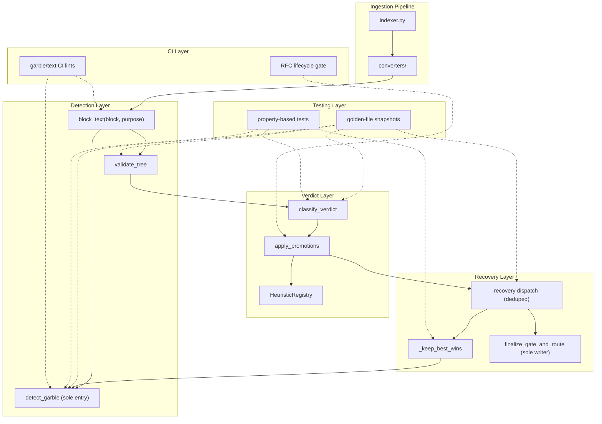
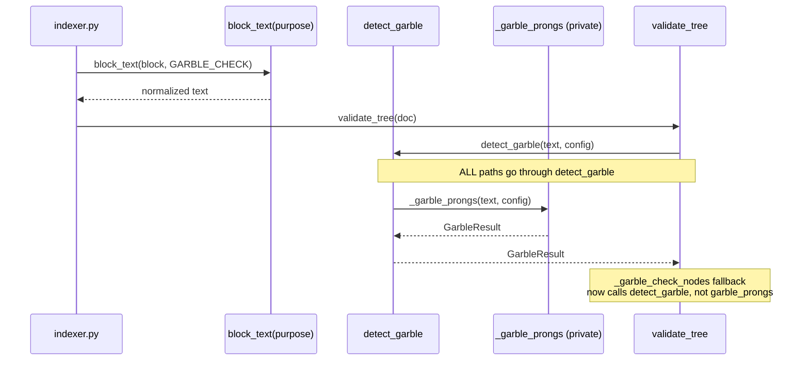
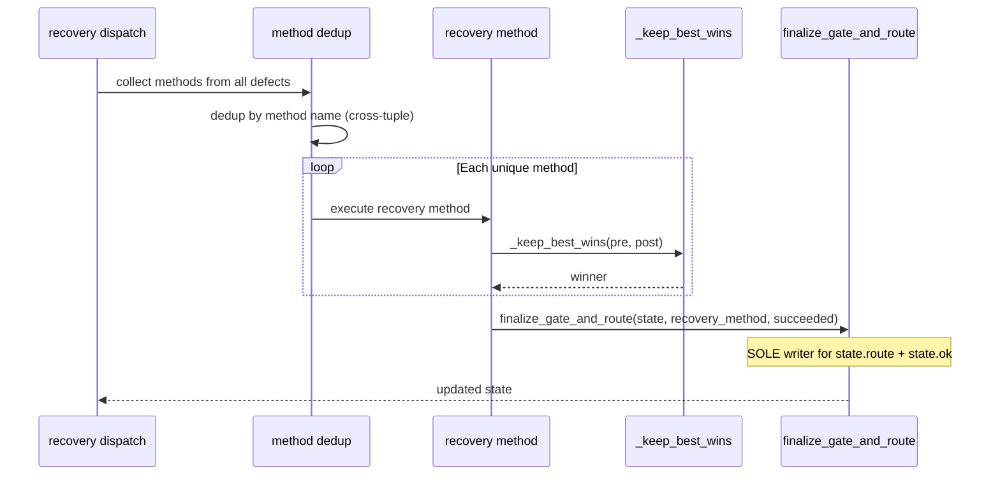
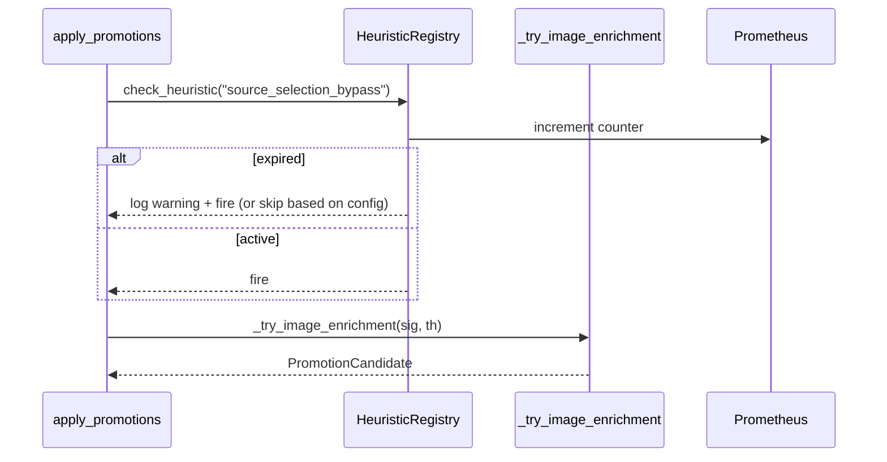
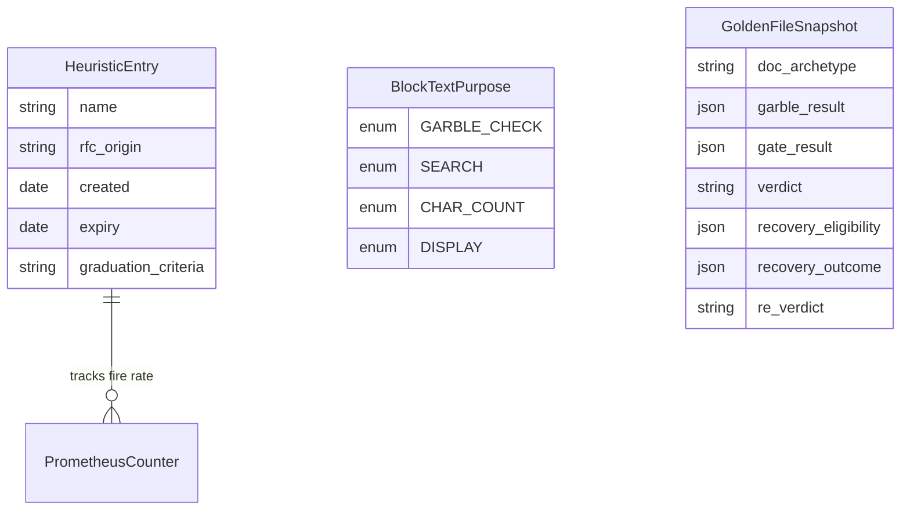

<!-- Space: CITRA -->
<!-- Title: Design Document: Recurring Defect Consolidation -->
<!-- Folder: Designs -->

---
id: "design-rfc041-recurring-defect-consolidation"
title: "Design: Recurring Defect Consolidation"
type: design
status: draft
date: "2026-08-31"
tags:
  - design
  - garble
  - verdict
  - recovery
  - test-oracle
  - rfc-lifecycle
aliases:
  - "design-rfc041-recurring-defect-consolidation"
governs:
  - "[[RFC-041]]"
---

# Design Document: Recurring Defect Consolidation

## Traceability

| Artifact | Reference |
|----------|-----------|
| Governing RFC(s) | [RFC-041](../rfcs/041-recurring-defect-consolidation.md) |
| PRD / Requirements | [[PRD]] |
| Architecture Doc | [[ARCHITECTURE]] |
| Implementation Plan | [tasks-rfc041-recurring-defect-consolidation](../tasks/tasks-rfc041-recurring-defect-consolidation.md) |
| Analysis Report | `audit/RECURRING_DEFECT_ROOT_CAUSE_ANALYSIS_2026-08-31.html` |

## Overview

The PageIndex ingestion pipeline suffers from a systemic pattern: single-responsibility contracts (sole garble detector, sole verdict writer, sole state mutator) are declared in docstrings and RFCs but violated by 3–6 parallel code paths that diverge silently over successive fix waves. This design consolidates garble detection, text extraction, recovery state mutation, and recovery dispatch into canonical entry points; wraps compensating heuristics in an expiry-tracked registry; establishes cross-component test coverage via golden-file snapshots and property-based tests; and adds CI enforcement for RFC lifecycle gates. The design addresses [RFC-041 D1–D10](../rfcs/041-recurring-defect-consolidation.md#decision-summary) across 5 implementation waves.

## Key Design Principles

1. **Convergence over compensation**: Eliminate divergent code paths rather than adding heuristics to compensate for their inconsistency. A single canonical function per concern means a fix in one place applies everywhere.
2. **Single-writer enforcement by construction**: State mutations (`state.route`, `state.ok`) and garble detection flow through exactly one function each. CI lints make violations merge-blocking.
3. **Expiry over permanence**: Every compensating heuristic carries an expiry date, a Prometheus counter, and an RFC reference. Permanently lenient paths become visible and retire-able.
4. **Test at the seam, not the component**: The triad (garble → gate → verdict → recovery) fails at cross-component boundaries. Golden-file and property-based tests assert invariants across the full chain.
5. **RFC lifecycle as CI concern**: Skipped validation gates are surfaced by CI before they propagate to the next wave.

## Launch Constraints

- All code changes in waves 0–2 require corpus-diff verification before merge.
- [D6 golden-file tests](../rfcs/041-recurring-defect-consolidation.md#d6-golden-file-pipeline-snapshot-tests-requirement-6) must land AFTER [D1](../rfcs/041-recurring-defect-consolidation.md#d1-garble-entry-point-consolidation-requirement-1) + [D2](../rfcs/041-recurring-defect-consolidation.md#d2-unified-block-text-accessor-requirement-2) + [D3](../rfcs/041-recurring-defect-consolidation.md#d3-recovery-state-single-writer-enforcement-requirement-3) so snapshots pin unified paths.
- [D8 RFC lifecycle gate](../rfcs/041-recurring-defect-consolidation.md#d8-rfc-lifecycle-ci-gate-requirement-7) must land before [D9 triage](../rfcs/041-recurring-defect-consolidation.md#d9-rfc-gap-triage-requirement-7) to prevent new gaps during triage.
- CLAUDE.md HR5 ("never silently persist a low-quality tree") must be preserved through all verdict changes.

## Architecture

### High-Level System Architecture



### Architecture Decisions

**AD1: Garble entry point consolidation** ([RFC-041 D1](../rfcs/041-recurring-defect-consolidation.md#d1-garble-entry-point-consolidation-requirement-1)): Replace the direct `garble_prongs` call in `_garble_check_nodes` fallback with `detect_garble`. Make `garble_prongs` private. The alternative — documenting and testing each parallel path independently — was rejected because it preserves the structural cause of fix-one-miss-the-other.

**AD2: Unified block_text accessor** ([RFC-041 D2](../rfcs/041-recurring-defect-consolidation.md#d2-unified-block-text-accessor-requirement-2)): Extract `block_text(block, purpose)` with a `BlockTextPurpose` enum. The alternative — syncing fixes across three independent functions — was rejected because it requires manual propagation and has failed across 4 waves.

**AD3: Recovery state single-writer** ([RFC-041 D3](../rfcs/041-recurring-defect-consolidation.md#d3-recovery-state-single-writer-enforcement-requirement-3)): Route all `state.route`/`state.ok` mutations through `finalize_gate_and_route` with recovery provenance parameters AND route-override parameters (`force_route`, `force_ok`). 5 of 8 direct mutations are intentional post-gate overrides (RTL comparison, VLM-tesseract fallback, flat-prefer density, landscape reroute) — the finalizer must express these. `_defect_from_reason_str` must raise on unrecognized reasons instead of returning `TreeDefect.OK`. `ExtractionState` guarded fields use `__setattr__` to enforce the single-writer contract mechanically. The alternative — auditing each direct assignment for correctness — was rejected because the 6 assignments already violated the documented contract, and the alternative of convention-only enforcement was rejected because the current convention-only contract failed identically.

**AD4: Cross-tuple recovery dedup** ([RFC-041 D4](../rfcs/041-recurring-defect-consolidation.md#d4-recovery-dispatch-cross-tuple-dedup-requirement-4)): Dedup by method name across all gate tuples. The alternative — per-tuple dedup with co-fire detection — was rejected as more complex with no additional benefit.

**AD5: Heuristic registry (scaffolding, not remediation)** ([RFC-041 D5](../rfcs/041-recurring-defect-consolidation.md#d5-heuristic-registry-requirement-5)): Wrap compensating paths in `HeuristicRegistry` with expiry and metrics. D5 provides **visibility and tracking infrastructure** — it does not remove any heuristic or close any leniency path. Actual heuristic removal (e.g., closing the `source_selection` bypass in verdict.py:479) is a separate effort that depends on D6 golden-file baseline to safely quantify verdict impact. The alternative — removing heuristics immediately — was rejected because it risks corpus regressions without the golden-file baseline from [D6](../rfcs/041-recurring-defect-consolidation.md#d6-golden-file-pipeline-snapshot-tests-requirement-6).

**AD6: Golden-file snapshots** ([RFC-041 D6](../rfcs/041-recurring-defect-consolidation.md#d6-golden-file-pipeline-snapshot-tests-requirement-6)): Full pipeline snapshot as JSON for 8–12 archetypes. The alternative — unit tests per component — was rejected because it's the existing approach that failed to catch cross-component regressions.

**AD7: Property-based triad tests** ([RFC-041 D7](../rfcs/041-recurring-defect-consolidation.md#d7-property-based-triad-tests-requirement-6)): Hypothesis strategies generating triad inputs with cross-component invariant assertions. Complements golden files with edge-case exploration.

**AD8: RFC lifecycle CI gate** ([RFC-041 D8](../rfcs/041-recurring-defect-consolidation.md#d8-rfc-lifecycle-ci-gate-requirement-7)): CI workflow blocking merges when GATE tasks are skipped. The alternative — manual review discipline — was rejected because it failed for RFC-037.

**AD9: RFC gap triage** ([RFC-041 D9](../rfcs/041-recurring-defect-consolidation.md#d9-rfc-gap-triage-requirement-7)): GitHub issues forcing decisions on 4 identified gaps. Pre-condition for D8 retroactive enforcement.

**AD10: Dead code + accessor parity** ([RFC-041 D10](../rfcs/041-recurring-defect-consolidation.md#d10-dead-code-and-accessor-parity-fixes-requirement-8)): `'Arabic'` → `'Arab'` fix, Zone-9 in `_flat_search_text`. Lands in wave 1 after D1+D2 so fixes apply to the consolidated paths.

**AD11: Verdict authority consolidation** ([RFC-041 D11](../rfcs/041-recurring-defect-consolidation.md#d11-verdict-authority-consolidation-requirement-9)): Route all verdict writes through `_upsert_registry_row` (Postgres-first CAS upsert + MinIO sidecar backfill). The alternative — auditing each writer independently for CAS guard consistency — was rejected because it preserves the 5-writer split and has failed to prevent divergence across prior waves. `write_verdict` becomes a thin wrapper delegating to `_upsert_registry_row`. `force_verdict_override` is registered with `HeuristicRegistry` (D5) for expiry tracking.

### Deployment Architecture

- **Backend**: Python 3.12 + FastMCP (host processes via `make up`)
- **Task Queue**: arq with Redis broker
- **Object Storage**: MinIO (`uploads/`, `processed/`)
- **Metrics**: Prometheus (new counters for heuristic registry)
- **CI**: GitHub Actions (new `rfc-lifecycle-lint.yml`)

### Communication Patterns

| Pattern | Use Case | Technology |
|---------|----------|------------|
| Sync function call | Garble detection, text extraction, verdict | Python function calls within indexer pipeline |
| Async job | OCR recovery dispatch | arq worker |
| CI check | RFC lifecycle gate, CI lints | GitHub Actions |
| Metrics push | Heuristic fire/expiry tracking | Prometheus counters/gauges |

### Sequence Diagrams

#### Garble Detection Flow — [D1](../rfcs/041-recurring-defect-consolidation.md#d1-garble-entry-point-consolidation-requirement-1), [D10](../rfcs/041-recurring-defect-consolidation.md#d10-dead-code-and-accessor-parity-fixes-requirement-8)



#### Recovery Dispatch Flow — [D3](../rfcs/041-recurring-defect-consolidation.md#d3-recovery-state-single-writer-enforcement-requirement-3), [D4](../rfcs/041-recurring-defect-consolidation.md#d4-recovery-dispatch-cross-tuple-dedup-requirement-4)



#### Verdict Promotion Flow — [D5](../rfcs/041-recurring-defect-consolidation.md#d5-heuristic-registry-requirement-5)



## Service Contracts

### 1. garble.py

**Responsibility**: Sole entry point for garble detection across all pipeline paths.
**Changes** ([D1](../rfcs/041-recurring-defect-consolidation.md#d1-garble-entry-point-consolidation-requirement-1)):
- Rename `garble_prongs` → `_garble_prongs` (private)
- Remove from `__all__`
- `_garble_check_nodes` fallback (:745–750) calls `detect_garble` instead of `garble_prongs`
- Fix `'Arabic'` → `'Arab'` at :583 ([D10](../rfcs/041-recurring-defect-consolidation.md#d10-dead-code-and-accessor-parity-fixes-requirement-8))
- Validates [Property 1](#property-1-garble-detection-convergence)
- Implementation: [Task 2.1](../tasks/tasks-rfc041-recurring-defect-consolidation.md#21-garble-entry-point-consolidation-d1), [Task 1.1](../tasks/tasks-rfc041-recurring-defect-consolidation.md#11-fix-arabic-dead-code-d10)

### 2. flat.py

**Responsibility**: Canonical text extraction from flat blocks via `block_text(block, purpose)`.
**Changes** ([D2](../rfcs/041-recurring-defect-consolidation.md#d2-unified-block-text-accessor-requirement-2)):
- New `BlockTextPurpose` enum: `GARBLE_CHECK`, `SEARCH`, `CHAR_COUNT`, `DISPLAY`
- New `block_text(block: dict, purpose: BlockTextPurpose) -> str`
- `_flat_block_primary_text` and `_flat_search_text` become thin wrappers
- Zone-9 header-only-table fix applies to all purposes ([D10](../rfcs/041-recurring-defect-consolidation.md#d10-dead-code-and-accessor-parity-fixes-requirement-8))
- **Callers:** `helpers/rag.py` (~:190) calls `_flat_search_text` — search quality impact must be validated alongside verdict corpus diff
- **Internal callers (added 2026-08-31):** `helpers/garble.py` calls `_node_text_parts` at :648,:685 and `_flat_block_primary_text` at :780. Garble.py's per-node table-content check (:692-695) must be regression-tested against `block_text(purpose=CHAR_COUNT)` to ensure garble scores don't shift
- Validates [Property 2](#property-2-block-text-consistency)
- Implementation: [Task 2.2](../tasks/tasks-rfc041-recurring-defect-consolidation.md#22-block-text-accessor-unification-d2), [Task 1.2](../tasks/tasks-rfc041-recurring-defect-consolidation.md#12-apply-zone-9-fix-to-flat-search-text-d10)

### 3. tree_validation.py

**Responsibility**: Tree quality gate evaluation with `_node_text_parts` delegating to `block_text`.
**Changes** ([D2](../rfcs/041-recurring-defect-consolidation.md#d2-unified-block-text-accessor-requirement-2)):
- `_node_text_parts` (:51) delegates to `block_text(block, CHAR_COUNT)`
- Validates [Property 2](#property-2-block-text-consistency)
- Implementation: [Task 2.2](../tasks/tasks-rfc041-recurring-defect-consolidation.md#22-block-text-accessor-unification-d2)

### 4. types.py

**Responsibility**: `ExtractionState` with `finalize_gate_and_route` as sole state writer, mechanically enforced.
**Changes** ([D3](../rfcs/041-recurring-defect-consolidation.md#d3-recovery-state-single-writer-enforcement-requirement-3)):
- `finalize_gate_and_route` (:358) gains `recovery_method: str | None`, `recovery_succeeded: bool | None`, `force_route: Route | None = None`, and `force_ok: bool | None = None` parameters
- When `force_route` is provided, it takes precedence over `decide_route(first_defect)` — this serves the 5 intentional override sites (RTL comparison :602, VLM-tesseract :658/:676/:694, flat-prefer :738, landscape :768)
- `_defect_from_reason_str` (:350-355) raises `ValueError` on unrecognized reason strings instead of returning `TreeDefect.OK`
- Legacy-tuple code path in `finalize_gate_and_route` (:378-381) logs deprecation warning
- `ExtractionState` fields `route`, `ok`, `reason`, `first_defect`, `gate_result` protected by `__setattr__` guard — only `finalize_gate_and_route` and `from_gate_result` may write them; direct assignment raises `AttributeError`
- CI lint exempts `from_gate_result` (:154, :168) and `finalize_gate_and_route` (:388) as legitimate initial-evaluation and canonical writers
- Validates [Property 3](#property-3-single-writer-invariant)
- Implementation: [Task 3.1](../tasks/tasks-rfc041-recurring-defect-consolidation.md#31-recovery-state-single-writer-enforcement-d3)

### 5. recovery.py

**Responsibility**: OCR recovery dispatch with cross-tuple dedup and single-writer state routing.
**Changes** ([D3](../rfcs/041-recurring-defect-consolidation.md#d3-recovery-state-single-writer-enforcement-requirement-3), [D4](../rfcs/041-recurring-defect-consolidation.md#d4-recovery-dispatch-cross-tuple-dedup-requirement-4)):
- Eliminate 8 direct `state.route`/`state.ok` assignments (6 `state.route =` at :602,:658,:676,:694,:738,:768 + 2 `state.ok =` at :737,:767)
- Eliminate 3 `state.rtl_decision = None` assignments (:341,:555,:639)
- Total unauthorized mutations: 11
- All state mutations route through `finalize_gate_and_route`
- Method dedup by name across all gate tuples (not per-tuple)
- `full_page_already_applied` guard at `_recover_image_dominant_ocr` entry
- Collapse VLM triple-block (:650,:668,:686) into single fallback
- Validates [Property 3](#property-3-single-writer-invariant), [Property 4](#property-4-recovery-dedup-idempotency)
- Implementation: [Task 3.1](../tasks/tasks-rfc041-recurring-defect-consolidation.md#31-recovery-state-single-writer-enforcement-d3), [Task 1.3](../tasks/tasks-rfc041-recurring-defect-consolidation.md#13-recovery-dispatch-cross-tuple-dedup-d4), [Task 1.4](../tasks/tasks-rfc041-recurring-defect-consolidation.md#14-consolidate-vlm-fallback-triple-block-d4)

### 6. verdict.py

**Responsibility**: Verdict classification with heuristic-registry-wrapped promotions.
**Changes** ([D5](../rfcs/041-recurring-defect-consolidation.md#d5-heuristic-registry-requirement-5)):
- `source_selection` bypass (:479) registered with `HeuristicRegistry`
- Each `_try_*` promotion registered with origin RFC, expiry date
- Validates [Property 5](#property-5-heuristic-expiry-visibility)
- Implementation: [Task 3.3](../tasks/tasks-rfc041-recurring-defect-consolidation.md#33-register-existing-heuristics-d5)

### 7. helpers/heuristic_registry.py (NEW)

**Responsibility**: Registration, tracking, and expiry of compensating heuristics.
**Changes** ([D5](../rfcs/041-recurring-defect-consolidation.md#d5-heuristic-registry-requirement-5)):
- `HeuristicRegistry` class with `register()`, `fire()`, `is_expired()` methods
- `HeuristicEntry` dataclass: name, rfc_origin, created, expiry, prometheus_counter
- Prometheus counter per heuristic (fire count), gauge for expired status
- Validates [Property 5](#property-5-heuristic-expiry-visibility)
- Implementation: [Task 3.2](../tasks/tasks-rfc041-recurring-defect-consolidation.md#32-heuristic-registry-module-d5)

### 8. .github/workflows/rfc-lifecycle-lint.yml (NEW)

**Responsibility**: CI gate blocking merges on skipped RFC validation gates.
**Changes** ([D8](../rfcs/041-recurring-defect-consolidation.md#d8-rfc-lifecycle-ci-gate-requirement-7)):
- Parse `.agents/rfcs/*.md` and `.agents/tasks/*.md`
- Detect: later-phase checked + earlier GATE unchecked; all-tasks-done drafts; unresolved Open Questions
- Merge-blocking for skipped gates, advisory for rest
- Validates [Property 8](#property-8-rfc-lifecycle-gate-soundness)
- Implementation: [Task 5.1](../tasks/tasks-rfc041-recurring-defect-consolidation.md#51-rfc-lifecycle-ci-gate-d8)

## Data Models

### Entity Relationship Diagram



### Core Entities

```python
class BlockTextPurpose(str, Enum):
    GARBLE_CHECK = "garble_check"
    SEARCH = "search"
    CHAR_COUNT = "char_count"
    DISPLAY = "display"

class HeuristicEntry:
    name: str
    rfc_origin: str
    created: date
    expiry: date | None
    graduation_criteria: str | None
    counter: prometheus_client.Counter
    expired_gauge: prometheus_client.Gauge
```

## Correctness Properties

### Property 1: Garble Detection Convergence

*For any* document processed by the pipeline, *all* garble detection paths (per-node, per-block, whole-tree fallback) SHALL produce the same result as calling `detect_garble` directly on the same text.

**Validates:** [RFC-041 D1](../rfcs/041-recurring-defect-consolidation.md#d1-garble-entry-point-consolidation-requirement-1)
**Tested in:** [Task 2.1](../tasks/tasks-rfc041-recurring-defect-consolidation.md#21-garble-entry-point-consolidation-d1) — `test_garble_fallback_uses_detect_garble`
**Service contract:** [garble.py](#1-garblepy)
**Sequence diagram:** [Garble Detection Flow](#garble-detection-flow--d1--d10)

### Property 2: Block Text Consistency

*For any* flat block `b` and any two purposes `p1`, `p2`, `block_text(b, p1)` and `block_text(b, p2)` SHALL differ only in enrichment inclusion, never in base text extraction or table-header handling.

**Validates:** [RFC-041 D2](../rfcs/041-recurring-defect-consolidation.md#d2-unified-block-text-accessor-requirement-2)
**Tested in:** [Task 2.2](../tasks/tasks-rfc041-recurring-defect-consolidation.md#22-block-text-accessor-unification-d2) — `test_block_text_consistency_across_purposes`
**Service contract:** [flat.py](#2-flatpy)

### Property 3: Single-Writer Invariant

*For any* recovery execution path, `state.route` and `state.ok` SHALL be modified exclusively through `finalize_gate_and_route`. No direct assignment to these fields SHALL exist in `recovery.py` or any other module. **Enforcement:** `ExtractionState.__setattr__` guard raises `AttributeError` for writes to `route`, `ok`, `reason`, `first_defect`, `gate_result` from any caller other than `finalize_gate_and_route` or `from_gate_result`. **Exemptions:** `types.py` `from_gate_result` (:154, :168) and `finalize_gate_and_route` (:388) are legitimate initial-evaluation and canonical writers respectively — CI lint must exempt these. **Overrides:** Recovery paths that need to override the gate-derived route (RTL comparison, VLM-tesseract fallback, flat-prefer density, landscape reroute) MUST use `finalize_gate_and_route(force_route=Route.FLAT)` or equivalent — never direct field assignment. **Safety:** `_defect_from_reason_str` SHALL raise `ValueError` on unrecognized reason strings instead of returning `TreeDefect.OK`.

**Validates:** [RFC-041 D3](../rfcs/041-recurring-defect-consolidation.md#d3-recovery-state-single-writer-enforcement-requirement-3) (criteria 1-7)
**Tested in:** [Task 3.1](../tasks/tasks-rfc041-recurring-defect-consolidation.md#31-recovery-state-single-writer-enforcement-d3) — `test_recovery_uses_finalize_gate_and_route`, `test_direct_assignment_raises`, `test_unknown_reason_raises`
**Service contract:** [recovery.py](#5-recoverypy), [types.py](#4-typesspy)
**Sequence diagram:** [Recovery Dispatch Flow](#recovery-dispatch-flow--d3--d4)

### Property 4: Recovery Dedup Idempotency

*For any* set of co-firing defects mapping to the same recovery method, THE method SHALL execute exactly once and the result SHALL be applied to all matching defects.

**Validates:** [RFC-041 D4](../rfcs/041-recurring-defect-consolidation.md#d4-recovery-dispatch-cross-tuple-dedup-requirement-4)
**Tested in:** [Task 1.3](../tasks/tasks-rfc041-recurring-defect-consolidation.md#13-recovery-dispatch-cross-tuple-dedup-d4) — `test_cofiring_defects_single_execution`
**Service contract:** [recovery.py](#5-recoverypy)
**Sequence diagram:** [Recovery Dispatch Flow](#recovery-dispatch-flow--d3--d4)

### Property 5: Heuristic Expiry Visibility

*For any* registered heuristic, THE system SHALL expose its fire count via Prometheus counter and its expired status via Prometheus gauge. An expired heuristic SHALL log a warning on every fire.

**Validates:** [RFC-041 D5](../rfcs/041-recurring-defect-consolidation.md#d5-heuristic-registry-requirement-5)
**Tested in:** [Task 3.2](../tasks/tasks-rfc041-recurring-defect-consolidation.md#32-heuristic-registry-module-d5) — `test_heuristic_fire_increments_counter`, `test_expired_heuristic_logs_warning`
**Service contract:** [heuristic_registry.py](#7-heuristic-registrypy)
**Sequence diagram:** [Verdict Promotion Flow](#verdict-promotion-flow--d5)

### Property 6: Triad Monotonicity

*For any* document where garble is detected (`effectively_garbled=True`), THE verdict SHALL be `FAIL` or `MARGINAL`, never `PASS` via any promotion path.

**Validates:** [RFC-041 D6](../rfcs/041-recurring-defect-consolidation.md#d6-golden-file-pipeline-snapshot-tests-requirement-6), [RFC-041 D7](../rfcs/041-recurring-defect-consolidation.md#d7-property-based-triad-tests-requirement-6)
**Tested in:** [Task 4.2](../tasks/tasks-rfc041-recurring-defect-consolidation.md#42-property-based-triad-tests-d7) — `test_garble_never_passes`
**Service contract:** [verdict.py](#6-verdictpy)

### Property 7: Triad Idempotency

*For any* document where recovery produces no improvement (`_keep_best_wins` selects pre-retry), THE verdict after recovery SHALL equal the verdict before recovery.

**Validates:** [RFC-041 D6](../rfcs/041-recurring-defect-consolidation.md#d6-golden-file-pipeline-snapshot-tests-requirement-6), [RFC-041 D7](../rfcs/041-recurring-defect-consolidation.md#d7-property-based-triad-tests-requirement-6)
**Tested in:** [Task 4.2](../tasks/tasks-rfc041-recurring-defect-consolidation.md#42-property-based-triad-tests-d7) — `test_noop_recovery_preserves_verdict`
**Service contract:** [recovery.py](#5-recoverypy)

### Property 8: RFC Lifecycle Gate Soundness

*For any* tasks file where a GATE-labeled task is unchecked but a later-phase task is checked, THE CI gate SHALL report a failure.

**Validates:** [RFC-041 D8](../rfcs/041-recurring-defect-consolidation.md#d8-rfc-lifecycle-ci-gate-requirement-7)
**Tested in:** [Task 5.1](../tasks/tasks-rfc041-recurring-defect-consolidation.md#51-rfc-lifecycle-ci-gate-d8) — `test_skipped_gate_detected`
**Service contract:** [rfc-lifecycle-lint.yml](#8-github-workflows-rfc-lifecycle-lintyml-new)

### Property 9: Dead Code Elimination

*For any* Arabic-script document, THE garble detection path comparing `_effective_script` SHALL use `'Arab'` (matching `_infer_script` output), not `'Arabic'`.

**Validates:** [RFC-041 D10](../rfcs/041-recurring-defect-consolidation.md#d10-dead-code-and-accessor-parity-fixes-requirement-8)
**Tested in:** [Task 1.1](../tasks/tasks-rfc041-recurring-defect-consolidation.md#11-fix-arabic-dead-code-d10) — `test_arabic_garble_path_active`
**Service contract:** [garble.py](#1-garblepy)

### Property 10: Accessor Parity

*For any* header-only table block, `_flat_search_text` SHALL return header text identical to `_flat_block_primary_text`.

**Validates:** [RFC-041 D10](../rfcs/041-recurring-defect-consolidation.md#d10-dead-code-and-accessor-parity-fixes-requirement-8)
**Tested in:** [Task 1.2](../tasks/tasks-rfc041-recurring-defect-consolidation.md#12-apply-zone-9-fix-to-flat-search-text-d10) — `test_search_text_header_only_table`
**Service contract:** [flat.py](#2-flatpy)

### Property 11: Verdict Authority Single-Path

*For any* verdict persistence operation, the verdict SHALL be written through `_upsert_registry_row` which writes to Postgres first (CAS-guarded) and backfills the MinIO sidecar with the winning row. No caller SHALL write to MinIO sidecar without first writing to Postgres (when registry is enabled and pool is available).

**Validates:** [RFC-041 D11](../rfcs/041-recurring-defect-consolidation.md#d11-verdict-authority-consolidation-requirement-9)
**Tested in:** [Task 3.5](../tasks/tasks-rfc041-recurring-defect-consolidation.md#35-verdict-authority-consolidation-d11) — `test_write_verdict_delegates_to_upsert_registry_row`, `test_verdict_consistency_cross_path`
**Service contract:** [storage/verdict.py, worker/registry_mirror.py, registry/queries.py]

## Rollback Strategy

Each wave checkpoint includes a rollback gate. If corpus diff shows unexpected regressions exceeding the forecast, revert the wave's changes before proceeding.

| Wave | Rollback approach |
|------|-------------------|
| 0 | Revert D4 dedup (restore per-tuple dedup). Single-file revert. |
| 1 | Restore original `garble_prongs` export and direct call in `_garble_check_nodes`. Restore `_flat_block_primary_text`/`_flat_search_text`/`_node_text_parts` as independent functions. Revert D10 Arabic fix (restore `'Arabic'` comparison). |
| 2 | Restore direct `state.route`/`state.ok` assignments in recovery.py. Remove `HeuristicRegistry` if not yet consumed. Restore `write_verdict` → `save_doc_meta` path for D11. |
| 3 | Remove golden-file and property-based test files (no production code affected). |
| 4 | Remove CI workflow file. Close GitHub issues as deferred. |

## Error Handling

### Error Categories & Responses

| Category | Response | Retry Strategy |
|----------|----------|----------------|
| Garble detection internal error | Log + treat as non-garbled (safe default) | No retry |
| Recovery method failure | Log + mark recovery as failed via `finalize_gate_and_route` | No retry (existing behavior) |
| Heuristic registry lookup miss | Log warning + proceed without heuristic tracking | No retry |
| Golden-file test mismatch | Test failure with diff output | Developer updates snapshot |
| RFC lifecycle lint parse error | Warning (non-blocking) | Fix markdown formatting |
| Verdict Postgres write failure | Enqueue to verdict retry queue + sidecar-only stamp | Reconcile cron retries via `_drain_verdict_retry_queue` |

### Service-Specific Error Handling

**recovery.py:**
- Recovery method raises exception → `finalize_gate_and_route(recovery_succeeded=False)` — state remains consistent even on failure.

**heuristic_registry.py:**
- Prometheus push failure → fire heuristic anyway, log warning — metrics loss is acceptable, behavioral correctness is not.

## Testing Strategy

### Testing Layers

1. **Property-Based Tests (PBT)**: Verify [Properties 1–7, 9–10](#correctness-properties) across randomly generated inputs. Hypothesis strategies for `TreeGateResult`, `GarbleConfig`, `ScriptContext`, `BlobKind`.
2. **Golden-File Tests**: 8–12 archetype documents with full pipeline snapshot. Diff-based regression detection.
3. **Unit Tests**: Per-decision tests for D1–D5, D8, D10.
4. **CI Lint Tests**: Grep-based guards for `garble_prongs`, `block['text']`, `state.route =`.

### Property-Based Testing Configuration

- **Library**: Hypothesis
- **CI iterations**: `max_examples=200` per property
- **Nightly iterations**: `max_examples=10000` per property
- **Deadline**: 10000ms per example (OCR mocking needed)

### Test Categories by Service

| Service | PBT Properties | Unit Tests | Golden-File Coverage |
|---------|----------------|------------|---------------------|
| garble.py | [P1](#property-1-garble-detection-convergence), [P9](#property-9-dead-code-elimination) | Fallback path, Arabic script | Arabic garbled, minimal-tree |
| flat.py | [P2](#property-2-block-text-consistency), [P10](#property-10-accessor-parity) | Purpose enum, table handling | Table-heavy, header-only |
| recovery.py | [P3](#property-3-single-writer-invariant), [P4](#property-4-recovery-dedup-idempotency), [P7](#property-7-triad-idempotency) | State routing, dedup, VLM | Scanned-image OCR |
| verdict.py | [P5](#property-5-heuristic-expiry-visibility), [P6](#property-6-triad-monotonicity) | Heuristic registration | Image-dominant, flat-prose |
| CI lint | [P8](#property-8-rfc-lifecycle-gate-soundness) | Skipped gate detection | N/A |
