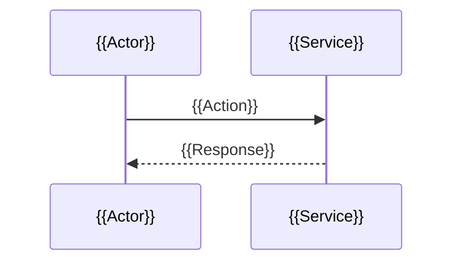

<!--
TEMPLATE INSTRUCTIONS (delete this block before committing):

File naming:  .agents/designs/design-rfc{{NNN}}-{{slug}}.md
Companion:    .agents/rfcs/{{NNN}}-{{slug}}.md (governing RFC)
              .agents/tasks/tasks-rfc{{NNN}}-{{slug}}.md (implementation plan)

Frontmatter contract:
  id           (required)  design-rfc{{NNN}}-{{slug}}
  title        (required)  human-readable, prefixed "Design: "
  type         (required)  always "design"
  status       (required)  draft | review | accepted | superseded | withdrawn
  date         (required)  ISO 8601 YYYY-MM-DD
  tags         (required)  must include "design" + at least one domain tag
  aliases      (recommended) short names for Obsidian graph linking
  governs      (optional)  [[wikilink]] to governing RFC
  space        (optional)  Confluence space key, for mark sync (--features=frontmatter)
  folders      (optional)  Confluence folder path, for mark sync
  parents      (optional)  Confluence parent page(s), for mark sync

Linking:
  - Cross-references use [[wikilinks]] for Obsidian graph connectivity
  - Every design decision must trace back to an RFC decision (D-number)
  - Properties are formal correctness invariants, not prose descriptions
  - Keep API endpoint listings exhaustive

Replace ALL {{placeholders}}. No template tokens may survive into committed artifacts.
-->
---
id: "design-rfc{{NNN}}-{{slug}}"
title: "Design: {{PROJECT_NAME}}"
type: design
status: draft
date: "{{YYYY-MM-DD}}"
tags:
  - design
  - "{{domain-tag}}"
aliases:
  - "design-rfc{{NNN}}-{{slug}}"
governs:
  - "[[RFC-{{NNN}}]]"
# mark confluence-sync fields (flat, not nested — mark reads these with --features=frontmatter)
# space: CITRA
# folders:
#   - Designs
# parents: []
---

# Design Document: {{PROJECT_NAME}}

## Traceability

| Artifact | Reference |
|----------|-----------|
| Governing RFC(s) | [[RFC-{{NNN}}]] |
| PRD / Requirements | [[PRD]] |
| Architecture Doc | [[ARCHITECTURE]] |
| Implementation Plan | [[tasks-rfc{{NNN}}-{{slug}}]] |

## Overview

{{One-paragraph summary: what the system is, who it serves, and the core value prop. State the problem being solved, not the solution architecture.}}

## Key Design Principles

<!--
List 3–8 principles that govern design trade-offs.
Each principle should be actionable — a developer should be able to resolve an ambiguity by referencing a principle.
-->

1. **{{Principle Name}}**: {{What it means and why it matters}}
2. **{{Principle Name}}**: {{What it means and why it matters}}

## Launch Constraints

<!--
Hard boundaries for the initial release. Remove or update as constraints lift.
-->

- {{Constraint 1}}
- {{Constraint 2}}

## Architecture

### High-Level System Architecture

<!--
Include a Mermaid diagram showing:
- Client layers
- API gateway / edge
- Core services and their databases
- External integrations
- Communication paths (sync, async, event bus)
-->

```mermaid
graph TB
  subgraph "Client Layer"
    {{Client}}["{{Client description}}"]
  end

  subgraph "Core Services"
    {{ServiceA}}["{{Service A name}}"]
    {{ServiceB}}["{{Service B name}}"]
  end

  subgraph "Data Stores"
    {{DB_A}}[("{{DB A name}}")]
    {{DB_B}}[("{{DB B name}}")]
  end

  subgraph "External Integrations"
    {{ExtA}}["{{External service A}}"]
  end

  {{Client}} --> {{ServiceA}}
  {{ServiceA}} --> {{DB_A}}
```

### Architecture Decisions

<!--
For each non-obvious architectural choice, state:
- WHAT was decided
- WHY (the alternative and why it was rejected)
- Link to RFC decision if applicable: (RFC-XXX D-N)
-->

**{{Decision Title}}** (RFC-{{RFC_ID}} D{{N}}): {{What was decided and why the alternative was worse.}}

### Deployment Architecture

<!--
Runtime environment: cloud/on-prem, container orchestration, object storage, task queues, CDN, mobile targets.
-->

- **Backend**: {{Runtime + hosting}}
- **Database**: {{DB technology + per-service or shared}}
- **Object Storage**: {{S3 / MinIO / etc.}}
- **Task Queue**: {{Celery / arq / etc.}} with {{broker}}
- **Event Bus**: {{Redis Streams / Kafka / etc.}}

### Communication Patterns

| Pattern | Use Case | Technology |
|---------|----------|------------|
| {{Pattern}} | {{Use Case}} | {{Technology}} |

### Sequence Diagrams [OPTIONAL]

<!--
Add Mermaid sequence diagrams for complex multi-service flows.
One diagram per critical flow (e.g., payment saga, auth flow, real-time messaging).
-->



## Service Contracts

<!--
One subsection per service. Each service section must include:
1. Responsibility (one sentence)
2. Database ownership
3. API endpoints (full paths)
4. Internal interfaces (events published/subscribed, cross-service API calls)

Services are listed in dependency order — foundational services first.
-->

### {{N}}. {{Service Name}}

**Responsibility**: {{Single-sentence responsibility statement.}}
**Database**: {{DB name}} (owns {{table list}})

```python
# API Endpoints
{{METHOD}} {{PATH}}  # {{Description}}
```

**Internal Interfaces**:

- Publishes `{{event_name}}` event to {{bus}} (consumed by {{consumers}})
- Subscribes to `{{event_name}}` event from {{producer}}
- Calls {{Service}} API for {{purpose}}

## Data Models

### Entity Relationship Diagram

```mermaid
erDiagram
  {{ENTITY_A}} ||--o{ {{ENTITY_B}} : {{relationship}}
```

### Core Entities ({{Service Name}} — {{DB Name}})

<!--
One subsection per service's data model.
Use Python-style class declarations.
- All monetary values in smallest unit (e.g., paisa, cents)
- All timestamps as datetime (UTC)
- All IDs as UUID
- Enums as separate classes
- Document non-obvious fields with inline comments
-->

```python
class {{EntityName}}:
    id: UUID
    {{field}}: {{type}}  # {{explanation if non-obvious}}
    created_at: datetime
    updated_at: datetime

class {{EnumName}}(str, Enum):
    {{VALUE}} = "{{value}}"
```

## Correctness Properties

<!--
CRITICAL SECTION — this drives the test plan in tasks.md.

Properties are universally quantified correctness invariants.
Format: "For any X, system SHALL Y."
Each property must link to the requirement(s) it validates.
Number properties sequentially — the task plan references these numbers.

Categories to cover:
- Access control & authorization
- Data integrity & invariants
- State machine correctness
- Calculation correctness
- Compliance requirements
- Error handling guarantees
-->

*A property is a characteristic or behavior that should hold true across all valid executions of the system — a formal statement about what the system should do. Properties serve as the bridge between human-readable specifications and machine-verifiable correctness guarantees.*

### Property {{N}}: {{Short title}}

*For any* {{universally quantified input/state}}, system SHALL {{guaranteed behavior}}.

**Validates: Requirements {{req_ids}}**

## Error Handling

### Error Categories & Responses

| Category | HTTP Status | Response Format | Retry Strategy |
|----------|-------------|-----------------|----------------|
| Validation Error | 400 | `{error: str, field: str, detail: str}` | Client-side fix required |
| Authentication Error | 401 | `{error: "unauthorized", detail: str}` | Re-authenticate |
| Authorization Error | 403 | `{error: "forbidden", detail: str}` | No retry |
| Not Found | 404 | `{error: "not_found", resource: str}` | No retry |
| Rate Limited | 429 | `{error: "rate_limited", retry_after: int}` | Exponential backoff |
| Server Error | 500 | `{error: "internal_error", request_id: str}` | Retry with backoff |

### Service-Specific Error Handling

<!--
For each service, list non-obvious error scenarios and their handling.
Focus on: external service failures, race conditions, compensation flows.
-->

**{{Service Name}}:**

- {{Error scenario}} → {{Handling strategy}}

### Circuit Breaker Configuration [OPTIONAL]

| Service | Failure Threshold | Recovery Time | Fallback |
|---------|-------------------|---------------|----------|
| {{Service}} | {{N}} failures / {{window}} | {{duration}} | {{fallback behavior}} |

### Inter-Service Communication Failure Modes [OPTIONAL]

| Scenario | Handling |
|----------|----------|
| {{Service A}} unavailable during {{operation}} | {{strategy}} |

## Testing Strategy

<!--
Must reference Property numbers from the Correctness Properties section.
The companion tasks.md file uses these numbers to create test tasks.
-->

### Testing Layers

1. **Property-Based Tests (PBT)**: Verify universal properties across randomly generated inputs for all {{N}} correctness properties.
2. **Unit Tests**: Cover specific examples, edge cases, error conditions, state machine transitions.
3. **Integration Tests**: Verify external service integrations and inter-service event flows.
4. **End-to-End Tests**: Verify critical user journeys.

### Property-Based Testing Configuration

- **Library**: {{Hypothesis / fast-check / etc.}}
- **Minimum iterations**: {{N}} per property
- **Deadline**: {{N}}ms per example
- **Database strategy**: {{isolation strategy}}

### Test Categories by Service

| Service | PBT Properties | Unit Tests | Integration Tests |
|---------|----------------|------------|-------------------|
| {{Service}} | {{property numbers}} | {{test areas}} | {{integration targets}} |

### Key Test Scenarios

<!--
List critical path tests (happy path) and edge cases.
Each scenario should be a one-line description that a developer can expand into a test.
-->

**Critical Path Tests:**

1. {{End-to-end journey description}}

**Edge Cases:**

- {{Race condition / boundary / error scenario}}
