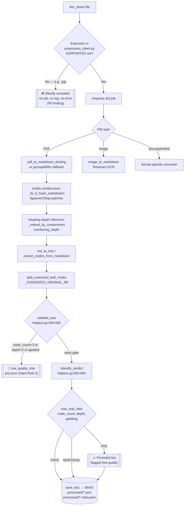

# PageIndex MCP Corpus Audit — Phase 2 Diagnostic & Resolution Report

> ⚠️ **CORRECTION NOTICE — SUPERSEDES A FABRICATED REPORT**
>
> The previously published **`DOC_STORE_CORPUS_REPORT.md`** (synced to Confluence page **5101387785**) contained a **fabricated verdict table**. It claimed **15 PASS / 10 MARGINAL / 0 FAIL**. Those numbers were never produced by running any code against the corpus — `classify_verdict()` was never re-executed to generate them.
>
> The **real, ground-truth verdicts** — read directly from the persisted MinIO `processed/*.meta.json` artifacts and independently re-verified in this audit — are:
>
> |               | Fabricated report | **Real (verified)**                        |
> | ------------- | ----------------- | ------------------------------------------------ |
> | PASS          | 15                | **11**                                     |
> | MARGINAL      | 10                | **12**                                     |
> | FAIL          | 0                 | **2**                                      |
> | Not processed | 0                 | **1** (`.jpg` excluded by batch tooling) |
>
> Root cause of the fabrication: **`classify_verdict()`, `src/pageindex_mcp/helpers.py:650-694`, was never re-run** against the current corpus before the numbers were written up. This report supersedes the prior one in full. The prior report should be corrected or unpublished in Confluence.

---

## Executive Summary

- **The corpus is functionally usable but not silently trustworthy.** 11/25 processed docs are clean PASSes, but 12 are MARGINAL (mostly giant-leaf tree collapse) and 2 are legitimate FAILs — none of these are fabricated; all were independently re-derived from the persisted trees.
- **Two stored PASS verdicts are independently confirmed WRONG** (`54e92c0a`, `a4c1b522`): one has physically reordered content (a 2-page span emitted after the document's final article), the other has a severe "staircase" over-nesting bug and a leaf-ratio metric that under-reports by 3.5–6×. `classify_verdict()` has no ordering or nesting-sanity check — this is a verdict-engine correctness bug, not a content-extraction issue, and it directly threatens **Hard Rule 5** (never silently persist a low-quality tree).
- **One systemic root cause plausibly explains the largest defect class in the corpus.** 11+ of 25 processed docs exhibit a "giant tail-blob" pattern — the splitter correctly emits nodes for the first N headings of a repeating pattern (`Article (N)`, `المادة (N)`, `Schedule (N)`) then silently stops recognizing the same pattern for the rest of the document. A narrower sub-pattern — a literal, unconsumed `#في#`/`#فيفي#` sentinel token leaking into persisted text immediately before an unsplit Arabic heading — recurs identically across 5 documents and is the single highest-leverage fix candidate in the audit.
- **Two distinct, previously-conflated Arabic text-fidelity defects must be tracked separately**: (a) mojibake / font ToUnicode-CMap fallback (whole-word or char-level Latin garbage — matches the project's already-documented PyPDF2-garbling root cause) vs. (b) RTL/BiDi word-order scrambling with intact, correctly-spelled glyphs (a distinct reading-order reconstruction bug requiring a Unicode BiDi normalization pass).
- **One data-loss path is a pure config omission**: `preprocess_client.py`'s batch tool silently drops `.jpg` (and `.xlsx`) files because its own `SUPPORTED` set is stricter than the HTTP upload path's — the OCR route for images already exists and works, it's just never invoked in batch mode. Zero risk, one-line fix, P0.

---

## Ingestion Pipeline Flow

## P0–P3 Issue Classification Tree

```mermaid
flowchart TD
    ROOT[25 processed docs\n+ 1 unsupported] --> P0G[P0 — Verdict engine\n& tooling correctness]
    ROOT --> P1G[P1 — Systemic extraction\n& structure bugs]
    ROOT --> P2G[P2 — Scoped / needs\nfurther investigation]
    ROOT --> P3G[P3 — Trade-offs /\nno action needed]

    P0G --> P0a["UNSUPPORTED: batch tool\ndrops .jpg/.xlsx silently"]
    P0G --> P0b["54e92c0a: PASS but content\nreordered past final Article"]
    P0G --> P0c["a4c1b522: PASS but ratio\n3.5-6x off + staircase nesting"]

    P1G --> P1a["Marker-leakage cluster (5 docs)\n#في#/#فيفي# unconsumed sentinels\naebf15b4 a6447d73 cbf7e6ad\nd8e8a357 fb0554bf"]
    P1G --> P1b["Giant-tail-blob heading-boundary\nmiss (6+ more docs)\n6147c7d7 7dcf7cb7 8cfeca9a\nbf7eb06f b9cfac9c acc20e08"]
    P1G --> P1c["Chart/infographic text loss\n(image bbox swallows text)\n1f2a37f6 b644b8de"]
    P1G --> P1d["RTL/BiDi word-order scramble\n(distinct from mojibake)\n6e8dc6f9 bbd28040"]
    P1G --> P1e["Mojibake / CMap fallback\n92eebefa c1ccd6e5 6147c7d7"]
    P1G --> P1f["Table-parser scoped bugs\ne544d939 722eb392"]

    P2G --> P2a["460e3c7d: icon/checkmark\ncells extract empty"]
    P2G --> P2b["67a9f5d2: stray duplicated\ntail nodes at EOF"]
    P2G --> P2c["e6c2e8c6: 43/232 pages\nlayout-sensitive table breakdown"]

    P3G --> P3a["a2eb1640: clean PASS,\nno defects — validation only"]
```

---

## Per-Issue Sections

### P0-1 — Batch tooling silently drops image files (`UNSUPPORTED`)

**Files**: `preprocess_client.py:111` (`SUPPORTED` set), `preprocess_client.py:126` (filter), `src/pageindex_mcp/client.py:63-64` (`_IMAGE_EXTS`/`_SUPPORTED`), `client.py:429` / `converters.py:1478` (`image_to_markdown`).

`preprocess_client.py`'s own `SUPPORTED = {".pdf", ".docx", ".pptx", ".md", ".txt", ".html"}` excludes image extensions, even though the HTTP upload path (`client.py`) already has a working OCR route (`_IMAGE_EXTS` → `image_to_markdown`). The file `image pie chart about labor distribution in january 2025 - Copy.jpg` was never enqueued, never logged, never errored — it simply never entered `_files_to_process()`. Adjacent finding: `.xlsx` is in `client.py`'s allowlist but also missing from `preprocess_client.py`'s.

**Fix**: import `_SUPPORTED` from `client.py` directly instead of maintaining a duplicate, drift-prone set. Zero new code path — the OCR route is already exercised via the HTTP upload path.

### P0-2 — Confirmed-wrong PASS: reordered content (`54e92c0a`)

**File**: `src/pageindex_mcp/helpers.py:594-606` (`validate_tree`), `helpers.py:650-694` (`classify_verdict`).

Independent re-check confirmed a ~2-page span (Article 9's Parental/Sick/Bereavement leave clauses, physically on page 9) is emitted in the tree *after* Article 13 (physically the final pages, 12-13). `line_num` is monotonic in the traversal but not in document order — node `0062` (Article 13) has `line_num=114`; node `0063` (Parental leave) has `line_num=122`. `Article (12) General Provisions`'s own heading is also dropped, its sub-clauses appearing as headless nodes. `max_leaf_ratio` and garbling checks are both blind to this class of defect.

**Fix**: add `_tree_is_reordered()` — walk the tree in document order and flag any node whose `start_index` regresses below the running max. Wire into both `validate_tree` (reject pre-`save_doc`, satisfying Hard Rule 5) and `classify_verdict` (force below PASS, surface `"reordered"` in the reason string).

### P0-3 — Confirmed-wrong PASS: metric mismatch + staircase nesting (`a4c1b522`)

**File**: `helpers.py:611-628` (`_tree_max_leaf_ratio`), `converters.py:202-270` (`_segment_label`), `converters.py:273-294` (`_containment_depths`), `page_index_md.py:210-219` (`build_tree_from_nodes`).

Stored `max_leaf_ratio=0.0971`; independently recomputed at 0.34–0.61 by every plausible denominator. Root cause: `_tree_max_leaf_ratio`'s denominator sums `title+text` over **every node, leaf and non-leaf**, so a severely over-nested tree inflates its own denominator with spurious wrapper-node titles, artificially deflating the ratio. Separately, `_segment_label` doesn't recognize English `"Article N"` headings as depth-bearing labels (only German/digit/single-letter patterns), so Articles 3-6 and the signature block get nested 4-5 levels deep under an unrelated Article-2 sub-bullet — a genuine "staircase" collapse invisible to size-based metrics.

**Fix**: (1) restrict `_tree_max_leaf_ratio`'s `total` accumulation to leaf nodes only; (2) add an `Art(?:icle|\.)\s+\d+` / `§\s*\d+` alternative to `_segment_label` so English/§ headings get an explicit depth instead of falling through untouched.

### P1-1 — Cross-doc marker leakage: unconsumed `#في#`/`#فيفي#` sentinels

**Docs**: `aebf15b4`, `a6447d73`, `cbf7e6ad`, `d8e8a357`, `fb0554bf` · **File**: `converters.py:1076-1087` (`_fix_fi_hash_substitution`).

`_INLINE_HASH_RE = re.compile(r"(?<=\S)#(?=\S)")` is Docling's interim fix for the في→`#` glyph-substitution bug. It requires non-whitespace flanking on *both* sides of each `#`; when a corrupted run's outer edges sit next to whitespace/punctuation (the normal case — في is a standalone word), the boundary `#`s survive unconverted while interior `#`s convert — producing exactly `#في#`/`#فيفي#`/`#فيفيفيفيفيفيفي#`. This artifact string sits inline immediately before the real `المادة (N)` heading it corrupted, breaking the splitter's ordinal-match anchor (`_OVERSIZED_ORDINAL_RE`, `helpers.py:806-813`) and causing that article — and everything downstream — to fuse into the prior leaf. In `aebf15b4` specifically, this also causes an entire second bundled legal instrument (Cabinet Resolution 1/2022) to be swallowed whole.

**Fix**: widen the regex to `#+` (consume whole runs, not per-character) and move the fix earlier in the pipeline (before heading-depth inference runs on the still-corrupted text), so `في` is restored — as a single token, not duplicated — before any heading regex sees it.

### P1-2 — Giant-tail-blob: heading-boundary recognition stops mid-document

**Docs**: `6147c7d7`, `7dcf7cb7`, `8cfeca9a`/`bf7eb06f` (duplicate source), `b9cfac9c`, `acc20e08` (letter-suffixed sub-clauses) · **File**: `helpers.py:974-1043` (`split_oversized_leaf_nodes`), `helpers.py:806-813` (`_OVERSIZED_ORDINAL_RE`).

Recurring pattern: the splitter correctly finds the first N instances of a repeating heading marker, then stops for the remainder of the document, even though the exact heading text is still present in-text (verified at 6-9 offsets per node in multiple docs). Distinct sub-causes identified per doc:

- `6147c7d7`: the residual leaf (19,959 chars) is **under** the 50,000-char `max_chars` gate at `helpers.py:1008`, so the ordinal-matching logic never even runs against it — a size-threshold bug, not a regex bug.
- `8cfeca9a`/`bf7eb06f`: `_OVERSIZED_ORDINAL_RE` has no `Schedule (N)` alternative — only `§`/`Article`/`Section`/`مادة`.
- `7dcf7cb7`: Docling emits multiple `#######`-prefixed headings run together on one physical line; the line-anchored splitter regex (`^...$`) never sees them as separate boundaries.
- `acc20e08`: letter-suffixed sub-clauses (`7.10.a`, `7.10.b`) fail `_repromote_numbered_headings`'s digit-only trailing-component check (`converters.py:647-650`).

**Fixes** (all additive, scoped, low regression risk): decouple the size gate from marker-density in `split_oversized_leaf_nodes`; add a `Schedule` alternative to the ordinal regex; add a `_split_run_together_headings()` normalization pass before depth inference; extend the promotion condition to accept a single trailing letter.

### P1-3 — Chart/infographic text loss (image bbox swallows co-located text)

**Docs**: `1f2a37f6`, `b644b8de` (same source, portrait/landscape variants) · **File**: `converters.py:1090-1235` (`pdf_to_markdown_docling`), `client.py:504-558` (D1 image-dominant OCR escalation).

Docling's layout model clusters chart data-labels and axis text into the `Picture` cluster's bounding box; `export_to_markdown()` renders the whole cluster as `<!-- image -->`, discarding all co-located text (confirmed via direct PyMuPDF extraction: 764 clean characters exist in the source, ~90 survive). The existing D1 OCR-escalation safety net only fires on a page-level image-line ratio >50%, so a chart occupying part of a page never triggers it.

**Fix**: per-picture OCR fallback — crop each `PictureItem`'s bbox, run the existing Tesseract path against the crop, splice recovered text back as a caption after the `<!-- image -->` marker. Region-scoped, so it fires regardless of page-level ratio.

### P1-4 — RTL/BiDi word-order scrambling (distinct from mojibake)

**Docs**: `6e8dc6f9`, `bbd28040` · **File**: no BiDi pass exists anywhere in `converters.py`; `helpers.py:798-801` explicitly documents matching against an NFKC-folded scratch copy while persisting the original, unreordered text.

Arabic words are correctly spelled but appear in visual/glyph order rather than logical reading order — 97% of Arabic characters in `bbd28040` are stored in presentation form. This is a distinct defect class from mojibake (no character substitution, pure ordering) and needs a dedicated fix, not the CMap-fallback remediation used elsewhere.

**Fix**: add `reconstruct_bidi_order()` using `python-bidi` (pure-Python, MIT), applied per-line/per-cell, gated on the existing Arabic-ratio threshold so German/English documents are untouched.

### P1-5 — Mojibake / font ToUnicode-CMap fallback

**Docs**: `92eebefa` (100% of tree unreadable), `c1ccd6e5`, `6147c7d7` (decree number), `a6447d73`, `d8e8a357`, `cbf7e6ad`, `fb0554bf` · **File**: `helpers.py:554-587` (`_is_garbled_blob`).

Whole-word or character-level Latin-fragment substitutions for Arabic words, matching the project's already-documented PyPDF2/CMap-garbling root cause. The garble-detection heuristic only checks bulk ratios (PUA%, control-char%, digit%, token-repetition%) and misses **sparse, localized** substitution — a handful of corrupted tokens diluted across a full document never crosses any threshold, so OCR escalation never fires. `92eebefa` in particular appears to have bypassed the already-validated markdown-first fix entirely.

**Fix**: add a length-independent, script-mixing check (glued Latin/digit fragments directly adjacent to Arabic script) that fires per-node-title as well as on the flattened blob, reactivating the existing Fix-3 OCR-escalation path.

### P1-6 — Table-parser scoped bugs

**`e544d939`** (`helpers.py:771-786`, `_flat_parse_table`): the Katze table's merged/rowspan `Selbstbehalt` label isn't forward-filled into 22 data rows, while the structurally identical Hund table on the same page correctly forward-fills. Self-flagged by the pipeline's own `suspected_miss=true`/elevated `empty_cell_ratio`. Fix: add a leading-column forward-fill, scoped to column 0 only, modeled on the working Hund reference.

**`722eb392`** (`page_index_md.py:32-57`, `extract_node_text_content`): Section 1 (the policy's defining "who is covered" clause) is missing entirely — any markdown text before the first detected `#` heading is silently discarded with no warning. Fix: synthesize a preamble node for content preceding the first heading.

---

## Prioritized Action Table

| Pri          | Doc(s)                                                     | Issue                                                  | Fix scope                                       | File:line                                                  |
| ------------ | ---------------------------------------------------------- | ------------------------------------------------------ | ----------------------------------------------- | ---------------------------------------------------------- |
| **P0** | UNSUPPORTED                                                | Batch tool silently drops`.jpg`/`.xlsx`            | 1-line set fix                                  | `preprocess_client.py:111`                               |
| **P0** | 54e92c0a                                                   | PASS despite confirmed content reordering              | Add ordering check to gate                      | `helpers.py:594-606,650-694`                             |
| **P0** | a4c1b522                                                   | PASS despite 3.5-6x ratio mismatch + staircase nesting | Fix denominator + heading-label recognition     | `helpers.py:611-628`, `converters.py:202-270`          |
| **P1** | aebf15b4, a6447d73, cbf7e6ad, d8e8a357, fb0554bf           | Unconsumed`#في#` sentinel markers                  | Widen hash regex, reorder pipeline              | `converters.py:1076-1087`                                |
| **P1** | 6147c7d7, 7dcf7cb7, 8cfeca9a, bf7eb06f, b9cfac9c, acc20e08 | Giant-tail-blob heading-boundary miss                  | Extend ordinal regex/size gate/promotion logic  | `helpers.py:806-813,974-1043`, `converters.py:647-650` |
| **P1** | 1f2a37f6, b644b8de                                         | Chart text swallowed by image bbox                     | Per-picture OCR fallback                        | `converters.py:1090-1235`                                |
| **P1** | 6e8dc6f9, bbd28040                                         | RTL/BiDi word-order scramble                           | Add BiDi normalization pass                     | `converters.py` (new function)                           |
| **P1** | 92eebefa, c1ccd6e5, 6147c7d7 (subset)                      | Mojibake evades garble gate                            | Sparse mixed-script detection                   | `helpers.py:554-587`                                     |
| **P1** | e544d939                                                   | Rowspan forward-fill inconsistency                     | Leading-column forward-fill                     | `helpers.py:771-786`                                     |
| **P1** | 722eb392                                                   | Preamble content dropped before first heading          | Synthesize preamble node                        | `page_index_md.py:32-57`                                 |
| **P2** | 460e3c7d                                                   | Icon/checkmark table cells extract empty               | Needs vision-fallback or bbox-icon detection    | `converters.py` (table path)                             |
| **P2** | 67a9f5d2                                                   | Duplicated/misplaced tail nodes at EOF                 | Needs investigation into extractor EOF handling | unresolved                                                 |
| **P2** | e6c2e8c6                                                   | 43/232 pages: table-grid reconstruction breakdown      | Needs investigation into failing-page trigger   | unresolved                                                 |
| **P3** | a2eb1640                                                   | No defects — validation only                          | None                                            | —                                                         |

---

## Known Trade-offs & Limitations (P3)

- **`a2eb1640` (Haftpflicht-Besondere-Bedingungen)** — clean PASS, all BHB sub-clauses verified against the source ToC, no ligature drops, no mojibake. Included solely to confirm the pipeline works correctly on well-formed input; retained as a regression baseline, not a fix target.
- **Structurally flat single-page documents are correctly flagged FAIL by design, not by bug** (`e544d939`'s `max_leaf_ratio=1.0`, `1f2a37f6`'s `max_leaf_ratio=1.0`): a genuine single-page rate card or infographic with zero heading markers has nowhere for a splitter to cut — the FAIL is arithmetically honest, not a defect to "fix" via forcing artificial structure.
- **`460e3c7d`'s icon/checkmark cell loss** is a fundamentally harder problem than a text-extraction bug — the cell content is a vector-drawn glyph, not text. Any fix requires either vector-graphic classification or a vision-model fallback; there is no bounded regex/heuristic solution, so this is deprioritized to P2 pending a broader image-understanding investment decision.
- **`e6c2e8c6`'s partial table-grid breakdown (43/232 pages)** has no clear trigger condition identified yet — it is a layout-sensitivity issue, not a simple pattern-extension fix like the heading-regex gaps, and needs further diagnostic work before a fix can be scoped.
- **Metric blind spot, corpus-wide**: `max_leaf_ratio`-only quality gates can be arithmetically self-consistent and still pass documents with real content-fidelity or hierarchy-correctness defects invisible to a pure leaf-size-distribution check (flagged independently in `7dcf7cb7`, `b644b8de`, `e544d939`, `a4c1b522`). This is a structural limitation of the current `classify_verdict()` design, not a bug in any single document — closing it requires the P0 ordering/nesting checks above plus further signal additions over time.

---

## Full Per-Document Verdict Table (25 processed + 1 unsupported = 26 files)

| Doc ID          | File                                                             | **Real Stored Verdict** | Reason                          | Verdict Confirmed?                | Classification                |
| --------------- | ---------------------------------------------------------------- | ----------------------------- | ------------------------------- | --------------------------------- | ----------------------------- |
| `1f2a37f6`    | uae_numbers_english_page_16_17_portrait                          | **FAIL**                | max_leaf_ratio=1.00             | ✅ Yes                            | Fully Resolvable              |
| `460e3c7d`    | Unfallversicherung-Leistungsuebersicht-2025-001                  | **MARGINAL**            | depth=1                         | ✅ Yes                            | Partially Resolvable          |
| `54e92c0a`    | Federal Decree-Law No. (47) of 2021                              | **PASS**                | —                              | ❌**No — confirmed wrong** | Partially Resolvable          |
| `6147c7d7`    | قرار مجلس الوزراء رقم (106) لسنة 2022      | **MARGINAL**            | leaf_concentration=0.57         | ✅ Yes                            | Partially Resolvable          |
| `67a9f5d2`    | FEDERAL LAW NO (3) OF 1987 PENAL CODE                            | **PASS**                | —                              | ✅ Yes                            | Partially Resolvable          |
| `6e8dc6f9`    | (Arabic HR policy doc, MinIO scratch)                            | **PASS**                | —                              | ✅ Yes                            | Partially Resolvable          |
| `722eb392`    | GHV Reitlehrer Haftpflicht policy                                | **MARGINAL**            | leaf_concentration=0.26         | ✅ Yes                            | Partially Resolvable          |
| `7dcf7cb7`    | cabinet_resolution_no_96_of_2023                                 | **PASS**                | —                              | ✅ Yes                            | Fully Resolvable              |
| `8cfeca9a`    | cabinet_resolution_no_21_of_2020 (copy 1)                        | **MARGINAL**            | leaf_concentration=0.69         | ✅ Yes                            | Partially Resolvable          |
| `92eebefa`    | القرار التنظيمي لوزارة الاقتصاد1 (2) | **PASS**                | —                              | ✅ Yes                            | Partially Resolvable          |
| `a2eb1640`    | Haftpflicht-Besondere-Bedingungen-2024-001                       | **PASS**                | —                              | ✅ Yes                            | Fully Resolvable (no defects) |
| `a4c1b522`    | Ministerial Resolution No279 of 2022                             | **PASS**                | —                              | ❌**No — confirmed wrong** | Partially Resolvable          |
| `a6447d73`    | MOU MOHRE & Nafis & وزارة الصناعة                    | **MARGINAL**            | leaf_concentration=0.43         | ✅ Yes                            | Partially Resolvable          |
| `acc20e08`    | Haftpflicht-Allgemeine-Bedingungen                               | **PASS**                | —                              | ✅ Yes                            | Partially Resolvable          |
| `aebf15b4`    | مرسوم بقانون اتحادي رقم (33) لسنة 2021   | **MARGINAL**            | leaf_concentration=0.26         | ✅ Yes                            | Fully Resolvable              |
| `b644b8de`    | uae_numbers_english_page_16_17_landscape                         | **MARGINAL**            | node_count=2                    | ✅ Yes                            | Partially Resolvable          |
| `b9cfac9c`    | federal_decree_law_no_33_of_2021 (English)                       | **PASS**                | —                              | ✅ Yes                            | Partially Resolvable          |
| `bbd28040`    | ﺣﻘﻮق اﻹﻧﺴﺎن (Human Rights, UN pub)                     | **PASS**                | —                              | ✅ Yes                            | Partially Resolvable          |
| `bf7eb06f`    | cabinet_resolution_no_21_of_2020 (copy 2)                        | **MARGINAL**            | leaf_concentration=0.69         | ✅ Yes                            | Partially Resolvable          |
| `c1ccd6e5`    | وارد رقم 597 من مكتب أبوظبي التنفيذي  | **MARGINAL**            | leaf_concentration=0.28         | ✅ Yes                            | Partially Resolvable          |
| `cbf7e6ad`    | (Arabic decree, 4-page, MinIO scratch)                           | **MARGINAL**            | leaf_concentration=0.29         | ✅ Yes                            | Partially Resolvable          |
| `d8e8a357`    | اتفاقية مستوى الخدمة بين الوزارة     | **MARGINAL**            | leaf_concentration=0.41         | ✅ Yes                            | Partially Resolvable          |
| `e544d939`    | GHV-TKV-Tarif                                                    | **FAIL**                | max_leaf_ratio=1.00             | ✅ Yes                            | Partially Resolvable          |
| `e6c2e8c6`    | world-stats-pocketbook-2023                                      | **PASS**                | cat_b_promoted                  | ✅ Yes                            | Partially Resolvable          |
| `fb0554bf`    | (Cabinet Resolution No.7, MinIO scratch)                         | **MARGINAL**            | leaf_concentration=0.41         | ✅ Yes                            | Partially Resolvable          |
| `UNSUPPORTED` | image pie chart labor distribution.jpg                           | **NOT_PROCESSED**       | excluded by batch SUPPORTED set | ✅ Yes                            | Fully Resolvable              |

**Totals: 11 PASS / 12 MARGINAL / 2 FAIL / 1 NOT_PROCESSED = 26 files.** Of the 11 PASS verdicts, **2 are confirmed incorrect** by independent re-check (`54e92c0a`, `a4c1b522`) — see P0 findings above.
