# PageIndex MCP Server

A [FastMCP](https://github.com/jlowin/fastmcp)-based server that exposes document
ingestion and retrieval over the [Model Context Protocol](https://modelcontextprotocol.io/).
Documents are parsed into a hierarchical **index tree** using a vectorless,
reasoning-based RAG approach — no vector database — and stored in MinIO object
storage. Queries are answered by reasoning over the tree structure rather than by
nearest-neighbour embedding search.

> **Positioning.** The value here is architectural — no vector store to operate,
> inspectable document trees, and queries that align with document structure. It
> is *not* a claim that tree-reasoning RAG beats vector RAG on retrieval accuracy.

The runtime is split into two processes that share Redis and MinIO:

- **① MCP Server** (FastMCP on gunicorn + uvicorn) — serves the query tools, the
  upload API, and a Prometheus `/metrics` endpoint.
- **② Async Worker** (arq) — consumes upload jobs, runs PDF/Office extraction and
  tree-building in an isolated subprocess, enforces a quality gate, and persists
  the result.

## Architecture

The diagram below is rendered inline (GitHub-native Mermaid). The **editable,
fully-detailed source of truth** is [`docs/architecture.drawio`](docs/architecture.drawio)
— open it in [diagrams.net](https://app.diagrams.net/) (`File → Open`) or the
VS Code *Draw.io Integration* extension. Keep the `.drawio` in sync when the
component layout changes; the Mermaid view below is a simplified mirror of it.

```mermaid
flowchart LR
  subgraph clients["Clients"]
    MCPC["MCP Client (Claude)<br/>Authorization: Bearer"]
    UPC["Upload Client /<br/>preprocess_client.py"]
  end

  subgraph server["① MCP Server Process — FastMCP on gunicorn + uvicorn (:8201)"]
    AUTH["BearerAuthMiddleware (auth.py)<br/>401 gate · exempts /metrics, /upload"]
    UPAPI["Upload API (upload_app.py)<br/>POST /upload/files<br/>GET /upload/status/{job_id}"]
    MET["/metrics endpoint<br/>Prometheus, no-auth"]
    TOOLS["5 MCP Query Tools (tools/documents.py)<br/>recent_documents · find_relevant_documents<br/>get_document · get_document_structure · get_page_content"]
    RAG["_rag / _rag_inner (helpers.py)<br/>tree-search RAG"]
    PF["_prefilter_docs<br/>LLM relevance filter"]
    S1["_search_one_doc<br/>tree select + flat adapter"]
    LLMQ["_llm() — OpenAI SDK call"]
    GET["cache.get_doc read-through (cache.py)<br/>tree → flat fallback"]
  end

  subgraph worker["② Async Worker Process — arq"]
    PDJ["process_document_job (worker.py)<br/>orchestrator"]
    SUB["_run_converter_subprocess<br/>OOM / leak isolation"]
    DLQ["DLQ / job status = error"]
    subgraph subp["Converter subprocess — converters_cli.main (fresh interpreter per job)"]
      CFG["configure_litellm() / validate_llm_config()"]
      IDX["CustomPageIndexClient.index()<br/>pageindex fork → litellm"]
      CONV["converters.py — extraction + tree build<br/>Docling (MIT) primary · pymupdf4llm (AGPL) fallback<br/>pypdfium2 outline · md → tree"]
      VT{"validate_tree()<br/>HR5 quality gate"}
      ST["TREE route<br/>save_doc + meta + raw"]
      SF["FLAT route (success)<br/>save_flat_doc"]
      GB["GARBLED → terminal reject"]
    end
  end

  subgraph infra["Storage & External Services"]
    MINIO[("MinIO (S3) — bucket: pageindex<br/>uploads/ · processed/*.json<br/>*.flat.json · *.meta.json · hashes/")]
    REDIS[("Redis (DB 1)<br/>doc cache TTL 300s · job status TTL 24h<br/>arq queue + DLQ")]
    PROV["LLM Provider<br/>OpenAI · Azure · OpenAI-compatible"]
    LF["Langfuse (tracing + cost)"]
    PROM["Prometheus"]
  end

  MCPC -->|"/mcp (Bearer)"| AUTH
  UPC -->|"HTTPS upload"| UPAPI
  AUTH -->|authorized| TOOLS
  TOOLS --> RAG --> PF --> S1
  PF -->|"filter LLM"| LLMQ
  S1 -->|"search LLM ×N"| LLMQ
  S1 --> GET
  GET -. "cache get/set" .-> REDIS
  GET --> MINIO
  LLMQ --> PROV
  LLMQ -. "query traces" .-> LF
  UPAPI -->|"upload_staging"| MINIO
  UPAPI -->|"enqueue job + status"| REDIS
  REDIS -->|"arq dequeue"| PDJ
  PDJ -->|"download_staging"| MINIO
  PDJ --> SUB --> CFG --> IDX --> CONV --> VT
  VT -->|"pass"| ST
  VT -->|"node_count&lt;3 / depth&lt;2"| SF
  VT -->|"garbling"| GB
  GB -->|"low_quality_tree"| DLQ
  ST --> MINIO
  SF --> MINIO
  IDX -->|"litellm.completion"| PROV
  IDX -. "ingestion traces" .-> LF
  PDJ -. "status=done/error" .-> REDIS
  DLQ --> REDIS
  PROM -. "scrape /metrics" .-> MET
```



**Two LLM paths, deliberately wired differently.** The *query* path calls the
provider through the OpenAI SDK (`_llm()`); the *ingestion* path runs inside the
converter subprocess and goes through the `pageindex` fork → `litellm`. Both are
routed by the same environment levers (`LLM_PROVIDER` / `OPENAI_BASE_URL`) and
both report to a single Langfuse project when tracing is enabled.

**Quality gate.** `validate_tree()` runs before anything is persisted. A clean
hierarchical tree takes the **TREE route**; a clean-but-flat document
(`node_count < 3` / `depth < 2`) is still a **success** and takes the **FLAT
route** (`processed/<id>.flat.json`). Only *garbled* extraction is a terminal
reject (`low_quality_tree` → DLQ).

## Requirements

- Python 3.12+
- [`uv`](https://github.com/astral-sh/uv) for dependency management
- A running **MinIO** instance (object storage)
- A running **Redis** instance (job queue + cache)
- An OpenAI / Azure / OpenAI-compatible API key (for the PageIndex library)

## Setup

```bash
# Install runtime dependencies
uv sync

# For development (adds pytest/httpx/fakeredis/ruff)
uv sync --extra dev
```

Copy `.env.example` to `.env` (or export directly) and set the variables below.

### LLM (required)

| Variable                                | Default                       | Description                                                                 |
| --------------------------------------- | ----------------------------- | --------------------------------------------------------------------------- |
| `OPENAI_API_KEY` or `CHATGPT_API_KEY`   | —                             | Required by the PageIndex library                                           |
| `LLM_PROVIDER`                          | `auto`                        | Provider selector: `auto` \| `openai` \| `compatible` \| `azure`            |
| `OPENAI_BASE_URL`                       | `https://api.openai.com/v1`   | OpenAI API or OpenAI-compatible endpoint (vLLM/Together/Groq/OpenRouter/local) |
| `AZURE_API_VERSION`                     | —                             | Required only for Azure (e.g., `2024-08-01-preview`)                        |
| `PAGEINDEX_MODEL`                       | `gpt-4o-2024-11-20`           | Model for ingestion; use `azure/<deployment>` for Azure                     |
| `PAGEINDEX_FILTER_MODEL`                | `gpt-4o-mini`                 | Model for document pre-filtering                                            |
| `PAGEINDEX_SEARCH_MODEL`                | `gpt-4o-mini`                 | Model for tree search                                                       |
| `PAGEINDEX_SEARCH_CONCURRENCY`          | `3`                           | Concurrent tree-search tasks                                                |

> **PII routing (HR3).** Route documents containing personal data only through a
> no-training + zero-retention tier (OpenAI ZDR / Anthropic ZDR / Azure modified
> abuse-monitoring), with EU residency where the corpus warrants. `OPENAI_BASE_URL`
> is the routing lever; a self-hosted model is the ultimate residency fallback.

### Auth

| Variable           | Default       | Description                                                        |
| ------------------ | ------------- | ----------------------------------------------------------------- |
| `MCP_BEARER_TOKEN` | `dev-api-key` | `Authorization: Bearer <token>` on `/mcp`; empty = auth disabled  |
| `UPLOAD_API_KEY`   | `dev-api-key` | Required by `POST /upload/files` via the `X-API-Key` header       |

### Redis & MinIO

| Variable            | Default                       | Description                          |
| ------------------- | ----------------------------- | ------------------------------------ |
| `REDIS_URL`         | `redis://localhost:6379/1`    | Redis connection (cache + arq queue) |
| `CACHE_TTL`         | `300`                         | Document cache TTL (seconds)         |
| `MINIO_ENDPOINT`    | `localhost:9000`              | MinIO server address                 |
| `MINIO_ACCESS_KEY`  | `minioadmin`                  | MinIO access key                     |
| `MINIO_SECRET_KEY`  | `minioadmin`                  | MinIO secret key                     |
| `MINIO_BUCKET`      | `pageindex`                   | Bucket name                          |
| `MINIO_SECURE`      | `false`                       | Use TLS for MinIO connection         |

### Server

| Variable          | Default     | Description                                                  |
| ----------------- | ----------- | ----------------------------------------------------------- |
| `MCP_HOST`        | `0.0.0.0`   | Server bind address                                         |
| `MCP_PORT`        | `8201`      | Server port (`/mcp`, `/upload`, `/metrics` share this port) |
| `WEB_CONCURRENCY` | `1`         | Keep at `1` — MCP sessions are in-memory per worker         |

### Langfuse tracing (optional)

Tracing activates **only when both keys are set** (unset = disabled, zero overhead).

| Variable                 | Default                        | Description                                                                 |
| ------------------------ | ------------------------------ | --------------------------------------------------------------------------- |
| `LANGFUSE_PUBLIC_KEY`    | —                              | Project public key                                                          |
| `LANGFUSE_SECRET_KEY`    | —                              | Project secret key                                                          |
| `LANGFUSE_HOST`          | `https://cloud.langfuse.com`   | EU region default; US = `https://us.cloud.langfuse.com`                     |
| `LANGFUSE_TRACE_CONTENT` | `false`                        | `false` masks prompt/completion bodies (usage + cost still recorded). `true` exports full document text — **inappropriate for PII corpora** |

## Running

The server and the worker are **separate processes** and must both be running.

```bash
# ① MCP server (development, single process, port 8201)
uv run python mcp_server.py
# or via the installed console script:
uv run pageindex-mcp

# ② Async worker (separate shell)
uv run arq pageindex_mcp.worker.WorkerSettings
```

The server starts at `http://0.0.0.0:8201/mcp` using the `streamable-http` MCP
transport. The upload API is mounted at `/upload` and metrics at `/metrics` on the
same port.

### Production

```bash
# Server: gunicorn + uvicorn workers (keep WEB_CONCURRENCY=1; scale horizontally)
uv run gunicorn -c gunicorn.conf.py pageindex_mcp.server:app

# Worker: one or more separate processes
uv run arq pageindex_mcp.worker.WorkerSettings
```

## Local Testing with Docker Compose

`docker-compose.yml` stands up the runtime dependencies (Redis + MinIO) so you can
test locally without the production cluster. Requires Docker Compose v2.24+.

**Option 1 — infra only** (Redis + MinIO), run the Python app on your host:

```bash
docker compose up -d            # starts redis, minio, and creates the bucket
```

Point your `.env` at the local services, then set `OPENAI_API_KEY` (a fresh clone
can `cp .env.example .env` — it already uses these values):

```dotenv
REDIS_URL=redis://localhost:6379/1
MINIO_ENDPOINT=localhost:9000
MCP_PORT=8201
```

```bash
uv run python mcp_server.py                       # server (shell 1)
uv run arq pageindex_mcp.worker.WorkerSettings    # worker (shell 2)
```

> Both processes read `.env` via `load_dotenv`, so these values apply in every
> shell. If your `.env` still carries the production cluster values
> (`REDIS_URL=redis://10.43.…`, `MCP_PORT=8111`), the host server binds the wrong
> port and the worker can't reach Redis — change them to the local values first.

**Option 2 — full stack** (Redis + MinIO + server + worker, all containerised):

```bash
cp .env.example .env            # set OPENAI_API_KEY (and UPLOAD_API_KEY)
docker compose --profile app up -d --build
```

| Service       | URL / port                  | Notes                                             |
| ------------- | --------------------------- | ------------------------------------------------- |
| MCP server    | `http://localhost:8201/mcp` | `/upload` and `/metrics` mounted on the same port |
| MinIO console | `http://localhost:9001`     | login `minioadmin` / `minioadmin`                 |
| Redis         | `localhost:6379`            | DB `1` (matches `REDIS_URL`)                       |

`REDIS_URL`, `MINIO_ENDPOINT`, and `MCP_PORT` from `.env` are overridden inside
compose so the containers reach the local `redis` / `minio` services; secrets such
as `OPENAI_API_KEY` are still read from `.env`. Building the image needs access to
the private `trehansalil/PageIndex-salil` dependency — to skip the build, edit the
`image:` line under the `x-app` anchor in `docker-compose.yml` to
`ghcr.io/trehansalil/pageindex-mcp:latest` and run `docker compose --profile app up -d`
(omit `--build`).

```bash
# Smoke test once the full stack is up:
curl -s localhost:8201/metrics | head                 # public, no auth

# Upload a document. X-API-Key must match UPLOAD_API_KEY in .env (.env.example uses
# dev-api-key). doc_store/ is gitignored — point at any local PDF/DOCX you have:
curl -s -X POST localhost:8201/upload/files \
  -H "X-API-Key: dev-api-key" -F files=@/path/to/your-document.pdf
# -> [{"job_id": "...", "filename": "..."}]   (202 Accepted; the LLM runs in the worker)

# Poll until the worker finishes (status: pending -> done|error):
curl -s -H "X-API-Key: dev-api-key" localhost:8201/upload/status/<job_id>

docker compose --profile app down                     # stop (add -v to wipe volumes)
```

## Ingesting Documents

Ingestion is **asynchronous**: the HTTP API stages the file and enqueues a job;
the arq worker does the extraction, tree-building, quality-gating, and storage.

### Upload API (HTTP)

```bash
# Enqueue one or more files (202 Accepted). X-API-Key must match UPLOAD_API_KEY.
curl -s -X POST localhost:8201/upload/files \
  -H "X-API-Key: dev-api-key" \
  -F files=@/path/to/document.pdf
# -> [{"job_id": "...", "filename": "document.pdf"}]

# Poll job status until it reaches done | error:
curl -s -H "X-API-Key: dev-api-key" localhost:8201/upload/status/<job_id>
```

Supported formats: `.pdf`, `.docx`, `.pptx`, `.md`, `.txt`.

### Batch processing from `doc_store/`

`preprocess_client.py` processes local files through the same isolated converter
subprocess as the worker, with hash-based change detection:

```bash
# Process all new/changed files in doc_store/
uv run python preprocess_client.py

# Process a single file
uv run python preprocess_client.py HR_FAQ.docx

# Run in the background (logs to preprocess.log)
uv run python preprocess_client.py --bg
```

It is idempotent — it computes a SHA-256 hash of each file and skips anything
unchanged since the last run. The hash cache is stored in MinIO at
`hashes/processed_hashes.json`.

## MCP Query Tools

The server registers five **read-only** query tools (`tools/documents.py`).
Document *processing* is not an MCP tool — it goes through the Upload API and the
arq worker (see above).

| Tool                                        | Description                                                                                                  |
| ------------------------------------------- | ------------------------------------------------------------------------------------------------------------ |
| `recent_documents(page, page_size)`         | Browse the collection with pagination; newest first, with processing status                                  |
| `find_relevant_documents(query)`            | Reasoning-based tree search across documents; returns matching excerpts + source metadata as JSON            |
| `get_document(doc_id)`                       | Detailed information about one document                                                                       |
| `get_document_structure(doc_id)`            | The hierarchical structure (tree) of a completed document                                                    |
| `get_page_content(doc_id, pages)`           | Extract page content — single (`5`), range (`3-7`), or list (`3,5,7`)                                         |

## Storage Layout (MinIO)

```
pageindex/
  uploads/<doc_id>/<filename>      # raw source file
  uploads/staging/<job_id>/<file>  # staged upload awaiting the worker
  processed/<doc_id>.json          # indexed tree (TREE route)
  processed/<doc_id>.flat.json     # flat document (FLAT route — success, no hierarchy)
  processed/<doc_id>.meta.json     # document metadata
  hashes/processed_hashes.json     # change-detection cache
```

Redis (`DB 1`) holds the document cache (`pageindex:doc:<id>`, TTL 300s), job
status (`pageindex:job:<id>`, TTL 24h), and the arq job queue + DLQ.

`doc_id` values are 8-character UUID prefixes generated at processing time.

> **Right-to-erasure (HR2).** Deleting the raw upload does **not** auto-remove
> derivatives. Erasure must cascade across every derived store — MinIO
> `uploads/`, `processed/*.json`, `processed/*.flat.json`, `processed/*.meta.json`,
> the Redis cache key, and the hash-cache entry — in that order.

## Project Structure

```
mcp_server.py              # entry point — delegates to pageindex_mcp.server:main
preprocess_client.py       # batch processor for doc_store/ (hash-based dedup, subprocess)
gunicorn.conf.py           # production server config (uvicorn workers)
stress_test.py             # load/stress harness
upload.py                  # legacy MCP client (targets the removed process_document tool)
src/
  pageindex_mcp/
    server.py              # FastMCP app composition, tool registration, main()
    config.py              # settings loaded from env
    auth.py                # BearerAuthMiddleware (401 gate; exempts /metrics, /upload)
    upload_app.py          # Upload API: POST /upload/files, GET /upload/status/{job_id}
    worker.py              # arq worker: process_document_job, subprocess spawn, DLQ
    converters_cli.py      # converter subprocess entry point (fresh interpreter/job)
    converters.py          # PDF/Office → markdown extraction + tree build
    client.py              # CustomPageIndexClient.index(); LLM provider abstraction
    cache.py               # Redis read-through doc/job cache (tree → flat fallback)
    helpers.py             # _rag / _prefilter_docs / _search_one_doc / validate_tree
    storage.py             # MinIO read/write helpers
    memory_admission.py    # Redis-backed memory admission gate
    metrics.py             # Prometheus metrics + /metrics response
    queue_metrics.py       # arq queue-depth scrape loop
    tracing.py             # Langfuse trace helpers (query path)
    tools/
      documents.py         # the 5 MCP query tools
```

## Architecture Notes

- **Vectorless tree RAG.** The `pageindex` library (installed from the private
  `trehansalil/PageIndex-salil` fork) builds the hierarchical index and does
  reasoning-based search over the tree — there is no vector database.
- **Markdown-first PDF extraction.** Docling (MIT) is the primary route;
  `pymupdf4llm` is the AGPL fallback. Markdown-first fixes the ligature-garbling
  seen with naive PDF text extraction. Document outlines are read via `pypdfium2`
  (BSD). Note: PyMuPDF/`pymupdf4llm` is **AGPL-3.0** (transitive) — serving it
  over a network is a legal decision to clear, not a settled safe-harbor.
- **Subprocess isolation.** Extraction runs in a fresh interpreter per job
  (`converters_cli.main`). Docling leaks ~237 MB RSS per document in-process, so
  the worker isolates it in a child process for OOM/leak containment.
- **Quality gate (HR5).** `validate_tree()` runs before `save_doc`. A failing
  (garbled) tree never persists — it surfaces as a `low_quality_tree` error and
  lands in the DLQ. Flat-but-clean documents are a success route, not a reject.
- **LLM provider abstraction.** OpenAI, Azure, and any OpenAI-compatible endpoint
  are supported without code changes via `LLM_PROVIDER` / `OPENAI_BASE_URL`. The
  query path uses the OpenAI SDK; the ingestion path uses `litellm`.
- **Observability.** Prometheus scrapes `/metrics` (LLM, RAG, tool, MinIO,
  `low_quality_tree`, flat-doc counters). When configured, both LLM paths report
  cost and traces to a single Langfuse project.
- PageIndex imports are deferred inside functions so the server module loads even
  if the library is not yet on `sys.path`; a local `PageIndex/` directory in the
  repo root is auto-added to `sys.path` when present (development checkouts).
```
