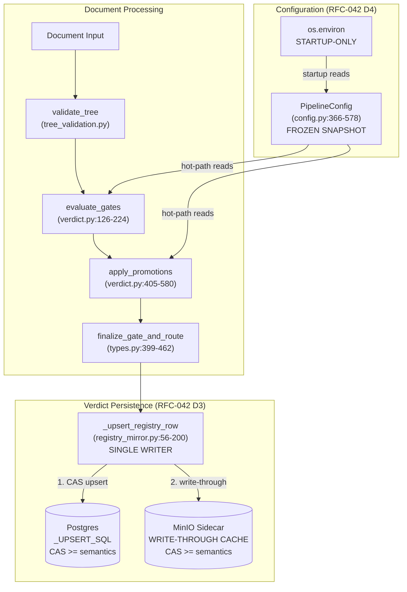
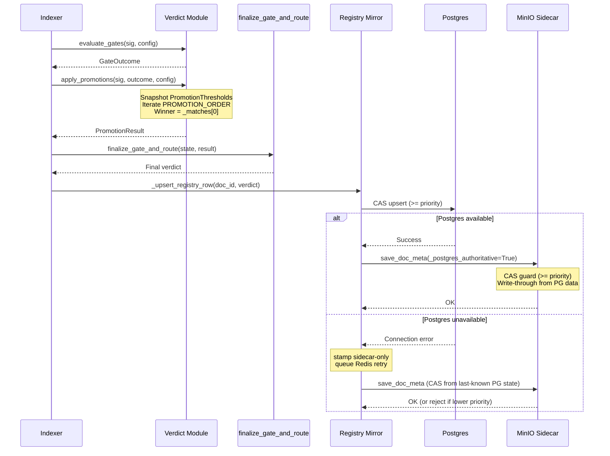
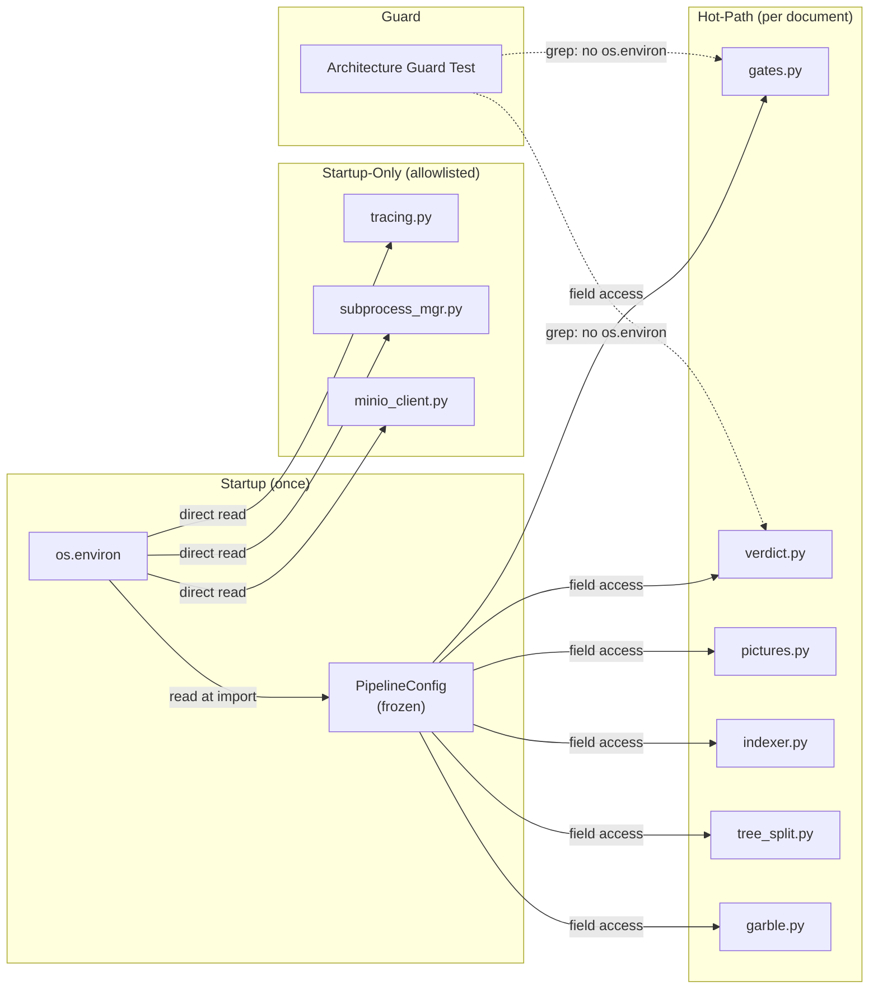

# Design Document: Verdict & Config Unification

## Traceability

| Artifact | Reference |
|----------|-----------|
| Governing RFC(s) | [[042-verdict-config-unification\|RFC-042]] |
| PRD / Requirements | [[PRD]] |
| Architecture Doc | [[ARCHITECTURE]] |
| Implementation Plan | [[tasks-rfc042-verdict-config-unification]] |

## Overview

The verdict subsystem persists document quality verdicts to two stores (Postgres registry + MinIO sidecar) through multiple independent write paths, while the configuration layer serves the same values through two divergent access patterns (frozen PipelineConfig vs live `os.environ`). This design unifies both: verdict persistence becomes a single authoritative writer with a write-through cache, and hot-path config reads are consolidated through the frozen snapshot. The design addresses POST-RFC041 audit zones 2, 4, 5, and 6.

## Key Design Principles

1. **Single Authority:** Every piece of mutable state has exactly one authoritative writer. Postgres is authoritative for verdicts; PipelineConfig is authoritative for config in hot-path code.
2. **Write-Through, Not Write-Back:** MinIO sidecar is updated synchronously from the Postgres write path, not asynchronously. This eliminates the divergence window that caused Chain 10/24 bugs.
3. **Explicit Over Implicit:** Promotion evaluation order is a constant, not a source-code artifact. Threshold dependencies are function parameters, not ambient globals.
4. **Guard Over Fix:** Where a zone is already resolved (Zone 4, Content Measurement), add a guard test rather than re-implementing the fix.
5. **Foundation First:** Config consolidation and guards ship before verdict changes, so verdict debugging has a stable config layer beneath it.

## Launch Constraints

- Must not change promotion evaluation outcomes for existing documents — stabilize, not modify, behavior
- Corpus spot-checks required at Phase 3 and Phase 4 checkpoints
- All architecture guard tests must pass CI before verdict refactoring begins

## Architecture

### High-Level System Architecture



### Architecture Decisions

**(Amendment 2026-09-01: Promoted D1–D6 from bold paragraphs to sub-headings for anchor link resolution from tasks file.)**

#### D1: Promotion Evaluation Ordering Contract

Replace implicit source-order iteration in `apply_promotions` with an explicit `PROMOTION_ORDER` tuple. The six `_try_*` functions (canonical names `_try_cat_a/b/c`, `_try_small_doc`; alias names `_try_ocr_promotion` etc. at verdict.py:399-402) still evaluate unconditionally (VG-6 telemetry via `promotion_paths_matched` preserved), but winner selection uses the constant's order. This prevents the Chain 6 pattern where refactoring shifted promotion priority without warning.

#### D2: Promotion Threshold Isolation

**(Amendment 2026-09-01:** `VerdictThresholds` (types.py:483-531) already exists as a frozen dataclass with `from_config(PipelineConfig)`. All `_try_*` functions already receive `th: VerdictThresholds`. D2 scope narrowed to absorbing `CATEGORY_BC_PROMOTION_THRESHOLD` (config.py:17) into PipelineConfig — the sole remaining threshold leak. No hysteresis 0.30→0.40 logic found in current promotion paths.**)**

Extend existing `VerdictThresholds` to absorb `CATEGORY_BC_PROMOTION_THRESHOLD` from PipelineConfig instead of importing the module-level constant. Alternative (thread-local config snapshot) rejected as more complex with no benefit.

#### D3: MinIO Verdict Write-Through Cache

**(Amendment 2026-09-01:** `_upsert_registry_row` already calls `save_doc_meta` in 3 places and already stamps `consistency_regime`. D3 scope reframed: close 10+ bypass callers across 7 files, add MinIO CAS guard, make `save_doc_meta` private to registry_mirror.py. Sentinel parameter replaced by architecture guard — more idiomatic for this codebase.**)**

Close all `save_doc_meta` bypass paths. Rename to `_save_doc_meta`, enforce single-caller via architecture guard test. Add MinIO CAS guard matching Postgres `>=` semantics. Alternative (remove MinIO storage) rejected — sidecar-only degradation mode is load-bearing for availability.

#### D4: Config Access Consolidation

Route hot-path `os.environ` reads through PipelineConfig. 121 matches across 17 files (validated). Prioritize 6 hot-path files where divergence causes verdict shifts. Startup-only files exempted with explicit allowlist. Alternative (runtime os.environ interception) rejected as overengineered.

#### D5: Content Measurement Regression Guard

Test-only. Two guards: (1) table blocks contribute non-zero chars via `block_text`, (2) no external `block.get("text")` calls in src/.

#### D6: Verdict Subsystem Integration Tests

Three scenarios: normal (Postgres+MinIO consistent), degradation (sidecar-only with CAS), recovery (reconciliation via `_drain_verdict_retry_queue` Postgres→MinIO backfill path). **(Amendment 2026-09-01:** reconcile_registry_drift reads MinIO→Postgres; only the drain sub-path does Postgres→MinIO.**)**

## Service Contracts

### 1. Verdict Module (verdict.py)

**Responsibility**: Evaluate document quality through gates and promotions, produce a final verdict with explicit ordering and threshold isolation.

```python
# New: Explicit promotion evaluation order (RFC-042 D1)
PROMOTION_ORDER: tuple[Callable, ...] = (
    _try_image_enrichment,    # verdict.py:227
    _try_structural_pass,     # verdict.py:272
    _try_ocr_promotion,       # verdict.py:290
    _try_flat_promotion,      # verdict.py:316
    _try_content_class_promotion,  # verdict.py:342
    _try_small_doc_promotion,     # verdict.py:363
)

# Existing: VerdictThresholds already isolates thresholds (types.py:483-531)
# D2 extends it to absorb CATEGORY_BC_PROMOTION_THRESHOLD from PipelineConfig
@dataclass(frozen=True)
class VerdictThresholds:
    min_marginal_chars: int
    pass_max_leaf_ratio: float
    cat_a_max_leaf_ratio: float
    cat_a_max_ocr_noise: float
    cat_bc_promotion_threshold: float  # was CATEGORY_BC_PROMOTION_THRESHOLD constant
    small_doc_enabled: bool
    # ... (already has from_config(PipelineConfig) classmethod)

# Modified: apply_promotions iterates PROMOTION_ORDER with existing VerdictThresholds
def apply_promotions(sig, gate_outcome, config) -> PromotionResult
```

**Internal Interfaces**:
- Reads PipelineConfig for threshold initialization (once per document)
- Called by indexer.py after evaluate_gates
- Output consumed by finalize_gate_and_route (types.py)

### 2. Registry Mirror (registry_mirror.py)

**Responsibility**: Single authoritative writer for verdict persistence — Postgres first, MinIO write-through second.

```python
# Modified: _upsert_registry_row is the SOLE verdict write entry point
async def _upsert_registry_row(doc_id, verdict_data, config) -> None:
    # 1. Postgres CAS upsert (>= semantics via _UPSERT_SQL)
    # 2. Write-through to MinIO via save_doc_meta(_postgres_authoritative=True)
    # 3. On Postgres failure: stamp sidecar-only, MinIO CAS from last-known state

# Modified: save_doc_meta renamed to _save_doc_meta (private to registry_mirror.py)
def _save_doc_meta(...) -> None:
    # Architecture guard test enforces single-caller from _upsert_registry_row
    # Adds CAS guard with >= semantics matching Postgres
    # 10+ existing bypass callers migrated or eliminated (see RFC-042 D3 amendment)
```

**Internal Interfaces**:
- Writes to Postgres via `upsert_doc` → `_UPSERT_SQL` (queries.py:127)
- Writes to MinIO via `save_doc_meta` (verdict.py) — write-through only
- Queues Redis retry on Postgres failure
- Called from indexer.py after finalize_gate_and_route

### 3. Config Module (config.py)

**Responsibility**: Provide frozen configuration snapshot for all hot-path code. Single source of truth for config values during document processing.

```python
# Modified: PipelineConfig gains fields for all hot-path env vars
@dataclass(frozen=True)
class PipelineConfig:
    # Existing 88+ fields...
    # New fields for hot-path vars previously read via os.environ:
    #   (exact list from Task 1.1 audit)

# Modified: reset includes new fields
def reset_pipeline_config() -> PipelineConfig
```

**Internal Interfaces**:
- Read by all hot-path modules (gates.py, verdict.py, pictures.py, indexer.py, tree_split.py, garble.py)
- Frozen at import time — immutable for process lifetime
- `reset_pipeline_config` rebuilds from current `os.environ` (test utility)

## Data Models

### Verdict Write Flow (After RFC-042)



### Config Read Flow (After RFC-042)



## Correctness Properties

### Property 1: Promotion Determinism

Given identical `DocumentSignature` and `PipelineConfig`, `apply_promotions` SHALL return identical winner and `_matches` list. This property is violated if:
- Promotion order depends on source-code position (fixed by D1: PROMOTION_ORDER constant)
- Thresholds are read from divergent sources mid-evaluation (fixed by D2: PromotionThresholds snapshot)

Validated by: Task 3.4 (hypothesis/parametric property test)

### Property 2: Config Consistency

Within a single document processing run, all configuration reads SHALL return the same values regardless of access path (PipelineConfig field vs former `os.environ` read site). This property is violated if:
- A hot-path file reads `os.environ` directly instead of PipelineConfig (fixed by D4: routing + guard)
- Boolean parsing differs between PipelineConfig and `os.environ` (fixed by D4: consistent `_bool()` parser)

Validated by: Task 4.2 (instrumented test run capturing all config accesses)

### Property 3: Verdict Persistence Consistency

After any verdict write completes (normal or degraded mode), the verdict data in MinIO SHALL equal the verdict data in the authoritative store (Postgres in normal mode, last-known Postgres state in degraded mode). This property is violated if:
- A code path writes to MinIO without going through `_upsert_registry_row` (fixed by D3: sentinel parameter + architecture guard)
- MinIO CAS guard uses different semantics than Postgres (fixed by D3: unified `>=` semantics)

Validated by: Tasks 4.1, 4.3 (integration + degradation tests)

## Risk Mitigation

| Risk | Mitigation | Checkpoint |
|------|-----------|------------|
| Config consolidation surfaces threshold drift | Compare before/after values for all consolidated variables | Phase 1 |
| save_doc_meta refactor breaks callers | Incremental per-caller migration, per-step verification | Phase 2 |
| Threshold isolation changes promotion outcomes | Corpus spot-check on 5 known-sensitive documents | Phase 3 |
| Verdict flips on borderline documents | Golden-file tests flag any shift for explicit review | Phase 3+4 |