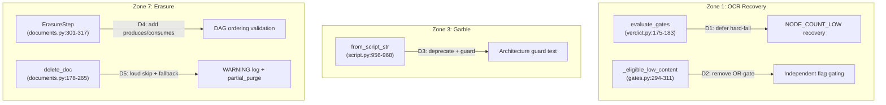

# Design Document: OCR Recovery, Garble Defense & Erasure Hardening

## Traceability

| Artifact | Reference |
|----------|-----------|
| Governing RFC(s) | [[RFC-043]] |
| Architecture Doc | [[ARCHITECTURE]] |
| Implementation Plan | [[tasks-rfc043-ocr-garble-erasure-hardening]] |

## Overview

Closes three validated structural gaps across the OCR recovery, garble detection, and erasure subsystems. Each gap creates a silent failure mode: documents terminal-rejected instead of recovered, quality gates blind to their real failure signal, or erasure reporting success while leaving residual PII. All three fixes are narrow, well-isolated changes with clear fallback paths.

## Key Design Principles

1. **Recovery before rejection**: A document should exhaust its recovery options before being terminal-rejected. Zero-content is a recoverable state (via OCR), not a terminal one.
2. **Independent toggles**: Each operator-facing config flag should control exactly one behavior. Shared flags create unintended kill-switch coupling.
3. **Compile-time over runtime enforcement**: Data-flow ordering in the erasure manifest and PF hardcode prevention should fail at import time, not silently at runtime.
4. **Loud failure for compliance**: Erasure steps that skip silently violate the spirit of right-to-erasure. Partial purges must be visible.

## Launch Constraints

- D1 may shift some documents from FAIL to MARGINAL/PASS — requires corpus validation before landing
- D4 must validate that the CURRENT erasure manifest ordering passes the new DAG check before enabling it
- D3 must not break test fixtures that use `from_script_str` — deprecation warning, not removal

## Architecture

### High-Level Change Map



### Architecture Decisions

#### D1: Zero-Content Recovery Bypass

**(Amendment 2026-09-01 v3:** v3 review confirmed zero-content recovery already works correctly today. No production code changes needed — reframed as test-coverage lock.)**

**Execution flow (verified):**
1. `validate_tree` → `finalize_gate_and_route` sets `state.gate_result.defect = NODE_COUNT_LOW`
2. Recovery loop (indexer.py:1496-1520) iterates GATES, calls `_eligible_low_content(state)`
3. `_eligible_low_content` (gates.py:294-311) checks: `not state.ok` ✓, `NODE_COUNT_LOW in defects` ✓, `ocr_escalation_low_content or image_dominant_enabled` ✓ → **True**
4. Recovery loop calls `_recover_low_content_ocr(state, file_path, ...)`
5. Inside recovery (recovery.py:453): `total_chars >= low_content_ocr_char_floor` → `0 >= 300` = False → does NOT skip → proceeds to `_execute_ocr_retry`
6. Post-recovery: `evaluate_gates` runs inside `_persist_flat/tree_result` — sees recovered signal (correct)

**Current behavior is correct.** The `low_content_ocr_char_floor=300` check in `_recover_low_content_ocr` is a *skip* guard: documents with enough chars skip recovery; zero-content documents (below floor) proceed to OCR retry. `_eligible_low_content` has no char threshold — it gates on flags + defect membership only.

**Change:** Test-coverage only. No production code modifications.
1. Regression test locking the full zero-content → recovery → evaluate_gates flow
2. Architecture guard verifying `_eligible_low_content` does NOT check `total_chars` (char floor must stay in recovery function, not eligibility predicate)

**Rejected alternatives (across v1-v3):**
- Deferred-hint pattern on `evaluate_gates` (v1) — targets wrong function; `evaluate_gates` is post-recovery
- `GateOutcome.recovery_hint` field (v1) — unnecessary; recovery uses `GateSpec.recovery_eligible`
- Hardening `_eligible_low_content` with char threshold (v2) — would INTRODUCE the bug; `0 >= 300 = False` would block zero-content recovery
- Moving zero-content check after ALL gates — too broad; only `NODE_COUNT_LOW` recovery is relevant

#### D2: OCR Escalation Flag Decoupling

**Current behavior:** `_eligible_low_content` (gates.py:294-311) gates on `ocr_escalation_low_content OR image_dominant_ocr_escalation_enabled`. Disabling image-dominant OCR also disables low-content recovery as a side effect.

**(Amendment 2026-09-01:** The OR-gate is documented as intentional in the docstring (line 301: "Combined OR-gate"). This is a deliberate behavior change, not a bug fix. `ocr_escalation_low_content` defaults to True via `OCR_ESCALATION_GARBLE` env var (config.py:478-482), so default deployments are unaffected. Operators who explicitly set `OCR_ESCALATION_LOW_CONTENT=0` and relied on image-dominant as fallback activation need migration.**)**

**Change:** Remove the `or config.image_dominant_ocr_escalation_enabled` clause (gates.py:309-310). `_eligible_low_content` gates solely on `config.ocr_escalation_low_content`. Individual recovery methods already check their own specific flag independently (`_recover_low_content_ocr` at recovery.py:452 checks `ocr_escalation_low_content` only). The OR-gate was a redundant activation path that created unintended coupling.

**After D2 — predicate flag mapping:**

| Predicate | Config flag | Independent? |
|-----------|------------|-------------|
| `_eligible_garble` | (none — checks defect type only) | Yes |
| `_eligible_low_content` | `ocr_escalation_low_content` | Yes (D2) |
| `_eligible_image_dominant` | `image_dominant_ocr_escalation_enabled` | Yes |

**Migration note:** Operators with `OCR_ESCALATION_LOW_CONTENT=0` + `IMAGE_DOMINANT_OCR_ESCALATION_ENABLED=1` who expect NODE_COUNT_LOW recovery must set `OCR_ESCALATION_LOW_CONTENT=1` explicitly.

#### D3: ScriptContext PF Enforcement

**Current state:** `ScriptContext.from_script_str` (script.py:956-968) hardcodes `had_presentation_forms=False`. Validation confirmed zero live production callers — only test code uses it.

**(Amendment 2026-09-01:** `TestPresentationFormsNotHardcoded` (test_architecture_guards.py:498-582) already guards PF hardcodes via AST parsing. It exempts `script.py` via `ALLOWED_FILES = {"script.py"}` (line 518). No new guard needed — remove the exemption after fixing.**)**

**Change:**
1. Add `warnings.warn("Use ScriptContext.from_document instead", DeprecationWarning)` (matching existing pattern at queries.py:213)
2. Make `had_presentation_forms` a required keyword parameter (no default)
3. Remove `ALLOWED_FILES = {"script.py"}` exemption from `TestPresentationFormsNotHardcoded`

**Rejected alternative:** Removing `from_script_str` entirely — breaks test fixtures that construct ScriptContext from raw strings.

#### D4: Erasure Manifest Ordering Validation

**Current state:** `validate_erasure_manifest` (documents.py:644-678) checks PREFIX→step completeness only. The 11 `ErasureStep` entries have implicit ordering dependencies undocumented outside comments.

**(Amendment 2026-09-01:** Validation found `_erase_verdicts` reads `ctx.sha256` from the sidecar internally (self-contained read + delete). Current ordering is correct — verdicts (step 2) reads sidecar before meta_json (step 3) deletes it. DAG model rethought: two dependency layers — sidecar-object-level `reads`/`deletes` and context-field-level `produces`/`consumes`.**)**

**Change:** Extend `ErasureStep` dataclass with four optional fields:

```python
@dataclass(frozen=True)
class ErasureStep:
    name: str
    step: int
    description: str
    execute: Callable
    required: bool = True
    produces: frozenset[str] = frozenset()  # ctx.* fields this step populates
    consumes: frozenset[str] = frozenset()  # ctx.* fields this step needs
    reads: frozenset[str] = frozenset()     # sidecar objects read (before deletion)
    deletes: frozenset[str] = frozenset()   # sidecar objects deleted by this step
```

Extend `validate_erasure_manifest` with two checks:
1. **Context-field ordering:** for each step with `consumes`, verify all consumed values are `produces`-ed by an earlier step
2. **Sidecar ordering:** for each step with `reads`, verify the read sidecar is not `deletes`-ed by any earlier step

```python
# Manifest entries annotated:
# Step 1 (uploads): produces={"ctx.doc_name"}
# Step 2d (verdicts): reads={"processed/{id}.meta.json"} — reads sha256 from sidecar internally
# Step 3 (meta_json): deletes={"processed/{id}.meta.json"}
# Step 5 (hash_cache): consumes={"ctx.doc_name"}
# Step 7 (preloaded): consumes={"ctx.doc_name"}
```

**Implementation notes (Amendment 2026-09-01 v2 — from DAG model review):**
1. **Conditional `ctx.doc_name` production:** Step 1 (`uploads`) produces `ctx.doc_name` only when the pre-loop `load_doc(doc_id)` recovery (documents.py:205-211) failed. If `load_doc` succeeds, `ctx.doc_name` is already populated before the manifest loop starts. The `produces={"ctx.doc_name"}` annotation is conservative (safe) but technically conditional — document this in the step's annotation comment.
2. **Self-contained `ctx.sha256`:** Step 2d (`verdicts`) reads sha256 from the sidecar internally and uses it to build the deletion path — it does not consume `ctx.sha256` from a prior step. The `produces={"ctx.sha256"}` annotation has no downstream consumer in the manifest. Either omit it or annotate as self-contained.
3. **Infrastructure dependencies out of scope:** Step 6 (`registry`) depends on Postgres pool state (`settings.registry_enabled and settings.postgres_dsn`, then `get_pool() is not None`), not on any `ctx.*` field or sidecar. This is a runtime availability concern, not an ordering constraint — correctly excluded from the DAG model.

**Rejected alternative:** Runtime ordering at execution time (topological sort) — changes execution order, which could break other implicit dependencies. Compile-time validation is safer.

#### D5: Erasure Failure Loudness

**Current state:** `delete_doc` (documents.py:178-265) catches exceptions per-step, logs `missed_optional` at DEBUG level for `required=False` steps. A partial purge reports `errors=[]`.

**Change:**
1. Upgrade skip logging from DEBUG to WARNING with structured fields: `step_name`, `missing_dep`, `doc_id`
2. Add `partial_purge: bool` to return dict — True when any step was skipped due to missing dependency
3. For `ctx.sha256` specifically: before skipping the verdicts step, attempt fallback lookup from Postgres registry row (`upsert_doc` → `SELECT sha256 FROM doc_registry WHERE doc_id = ?`)

**Rejected alternative:** Making all steps `required=True` — would turn partial failures into full failures, worse for the user.

## Service Contracts

### 1. Verdict Module — evaluate_gates (verdict.py)

```python
# UNCHANGED by D1 (Amendment 2026-09-01 v2): evaluate_gates runs post-recovery.
# Its zero-content early return is correct — fires only when recovery already
# failed or wasn't eligible. No modifications needed.
def evaluate_gates(sig: TreeSignal, config: PipelineConfig) -> GateOutcome:
    # existing zero-content check at lines 175-183 stays as-is
```

### 2. Gates Module — eligibility predicates (gates.py)

```python
# Modified by D2 only (Amendment 2026-09-01 v3 — D1 is test-only, no code change here)
# Actual signature: (state: ExtractionState) -> bool (module-level pipeline_config)
def _eligible_low_content(state: ExtractionState) -> bool:
    if state.ok:
        return False
    if TreeDefect.NODE_COUNT_LOW not in _all_defects(state):
        return False
    # D2: removed OR-gate — was: ocr_escalation_low_content or image_dominant_enabled
    return pipeline_config.ocr_escalation_low_content
    # D1 note: NO char threshold here — that's correctly in _recover_low_content_ocr
    # (recovery.py:453) where 0 >= 300 = False means zero-content docs get recovery

# Unchanged: _eligible_garble (no flag check)
# Unchanged: _eligible_image_dominant (gates on image_dominant_ocr_escalation_enabled)
```

### 3. Script Module — ScriptContext (script.py)

```python
# Modified: from_script_str deprecated, PF parameter required
@classmethod
@deprecated("Use ScriptContext.from_document instead")
def from_script_str(cls, script_str: str, *, had_presentation_forms: bool) -> ScriptContext:
    # D3: had_presentation_forms is now required (was hardcoded False)
```

### 4. Storage Module — ErasureStep + delete_doc (documents.py)

```python
# Modified: ErasureStep gains produces/consumes/reads/deletes fields (Amendment 2026-09-01)
@dataclass(frozen=True)
class ErasureStep:
    name: str
    step: int
    description: str
    execute: Callable
    required: bool = True
    produces: frozenset[str] = frozenset()   # D4: ctx.* fields populated
    consumes: frozenset[str] = frozenset()   # D4: ctx.* fields needed
    reads: frozenset[str] = frozenset()      # D4: sidecar objects read
    deletes: frozenset[str] = frozenset()    # D4: sidecar objects deleted

# Modified: validate_erasure_manifest checks both dependency layers
def validate_erasure_manifest() -> None:
    # Existing: PREFIX completeness check
    # D4: ctx-field ordering — consumes satisfied by prior produces
    # D4: sidecar ordering — reads not deleted by any earlier step

# Modified: delete_doc returns partial_purge flag
async def delete_doc(doc_id: str, ...) -> dict:
    # D5: WARNING-level skip logging with structured fields
    # D5: partial_purge flag in return dict
    # D5: sha256 fallback from registry row before skipping verdicts step
```

## Correctness Properties

### Property 1: Recovery Exhaustion

**(Amendment 2026-09-01 v3)** Already holds in current code. A document with `node_count == 0` reaches the recovery loop via `_eligible_low_content` (flags + defect check, no char threshold), enters `_recover_low_content_ocr` (char floor skip guard passes for `total_chars=0`), and only then reaches `evaluate_gates` post-recovery. Formally: `evaluate_gates("zero_content") → recovery_loop_completed("NODE_COUNT_LOW")`. D1 adds regression tests to lock this property.

### Property 2: Flag Independence

Disabling `image_dominant_ocr_escalation_enabled` SHALL NOT change the return value of `_eligible_low_content` for any input. Formally: `∀ inputs, _eligible_low_content(config[image_dominant=False]) == _eligible_low_content(config[image_dominant=True])` when `ocr_escalation_low_content` is held constant.

### Property 3: Erasure Ordering Soundness

For every `ErasureStep` s in `_ERASURE_MANIFEST`: `∀ v ∈ s.consumes, ∃ s' earlier in manifest where v ∈ s'.produces`. Validated at import time by `validate_erasure_manifest`.

### Property 4: Erasure Completeness Reporting

`delete_doc` returns `partial_purge=True` if and only if at least one step was skipped due to a missing dependency value. `partial_purge=False` means all steps executed (though individual steps may have failed for other reasons, reported in `errors`).

## Risk Mitigation

| Risk | Mitigation |
|------|-----------|
| D1 changes verdict outcomes | Golden-file test with corpus; recovery fires only on `node_count==0` (currently always FAIL anyway — can only improve) |
| D2 changes operator behavior | `ocr_escalation_low_content` is the documented primary flag; OR-gate was undocumented coupling |
| D4 rejects current manifest | Validate current ordering passes BEFORE adding the check (Task 3.1 prerequisite) |
| D5 sha256 fallback adds Postgres dep to erasure | Fallback is best-effort with try/except; erasure already uses Postgres for registry step |
