# Design Document: Recovery Dispatch Wiring & OCR Decision Authority

## Traceability

| Artifact | Reference |
|----------|-----------|
| Governing RFC(s) | [[RFC-044]] |
| Architecture Doc | [[ARCHITECTURE]] |
| Implementation Plan | [[tasks-rfc044-recovery-dispatch-wiring]] |
| Zone Specs | [[ocr-pipeline-decision-recovery-cascade]] (Zone 1), [[gate-to-recovery-dispatch-wiring-gap]] (Zone 6) |
| Predecessor Design | [[design-rfc043-ocr-garble-erasure-hardening]] |

## Overview

Hardens the GATES-driven recovery dispatch wiring landed in RFC-043 by closing five validated gaps: inconsistent re-entry guard enforcement across OCR recovery methods (D1), an asymmetric eligibility predicate AND internal recovery-method guards for RTL recovery (D2, extended in Amendment 3 to cover recovery.py), a dead `decide_ocr_strategy` call site that misleads auditors (D3), and an unreachable feature-flag branch that inflates the apparent decision surface (D4). A fifth deliverable documents the `force_full_page`-vs-`decide_ocr_strategy` authority inversion with a phased remediation plan (D5). A sixth deliverable audits the full test suite (~2050 tests) for consolidation to ~1000 (D6, added Amendment 2).

All six decisions are narrow, well-isolated changes. D1 and D2 fix standing bugs (redundant OCR retries and silently skipped RTL recovery). D3 and D4 remove dead code. D5 is documentation only. D6 is a test-suite-reduction audit gated behind Waves 1-6. No new recovery strategies, no pipeline restructuring, no severity ordering changes.

## Key Design Principles

1. **Guard consistency over guard completeness**: When a re-entry guard exists in 1 of 3 sibling methods, the fix is to propagate the guard to the other 2 -- not to redesign the guard mechanism.
2. **Predicate symmetry**: All four `_eligible_*` predicates must use the same `_all_defects(state)` helper. A single predicate checking `state.first_defect` instead is a silent regression vector, not a design choice.
3. **Dead code removal over dead code annotation**: A call site that computes a result and only logs it is worse than no call site -- it creates false audit findings. Remove, do not comment.
4. **Document before restructure**: The `force_full_page` authority inversion requires pipeline restructuring to fix. Document the inversion and scope the restructuring for a follow-up RFC rather than attempting it inline.
5. **Dedup by method name, not by gate**: The recovery loop's `_fired_methods` set deduplicates by recovery method name across all GateSpecs. This is correct -- methods like `_recover_image_dominant_ocr` appear in both NODE_COUNT_LOW and DEPTH_LOW gates and must fire at most once regardless of how many gates declare them.

## Launch Constraints

- D1 changes the behavior of `_recover_garble_ocr` and `_recover_low_content_ocr` -- a document that previously received two full-page OCR passes will now receive one. Requires corpus spot-check on garble-defect documents to verify no recovery regressions.
- D2 changes when RTL recovery fires -- documents with RTL_REVERSAL as a secondary defect will now enter RTL recovery. Amendment 3 extends D2 to also patch the internal `first_defect` guards in `_recover_rtl_repair` (recovery.py:529) and `_recover_rtl_flat_compare` (recovery.py:588). RTL recovery retains its remaining internal guards (`state.ok`, `bidi_renorm_applied`, `ext == ".pdf"`, `settings.flat_doc_routing`), so the blast radius is limited to defect-type eligibility, not to mutation.
- D3 removes a DEBUG-level log line. Operators monitoring post-conversion OcrDecision diagnostics at DEBUG level lose this output. The live call site in `_recover_picture_results` already logs its own OcrDecision.
- D4 removes the `UNIFIED_OCR_PLAN_ENABLED` env var. Operators with it set experience no behavior change (it was always dead code).
- D6 runs only after Waves 1-6 land and verify. Test deletion must not precede the code changes that make some tests obsolete.

## Architecture

### High-Level Change Map

```mermaid
graph TB
    subgraph "D1: Re-entry Guard Consistency"
        RG_OCR["_recover_garble_ocr<br/>(recovery.py:400-432)"] -->|"ADD guard"| GUARD["if state.full_page_already_applied: return"]
        RG_LOW["_recover_low_content_ocr<br/>(recovery.py:434-468)"] -->|"ADD guard"| GUARD
        RG_IMG["_recover_image_dominant_ocr<br/>(recovery.py:470-512)"] -.->|"ALREADY has guard"| GUARD
    end

    subgraph "D2: RTL Eligibility + Recovery Guard Fix"
        RTL_OLD["_eligible_rtl<br/>(gates.py:325-327)"] -->|"REPLACE"| RTL_NEW["_all_defects(state)<br/>check"]
        RTL_R1["_recover_rtl_repair<br/>(recovery.py:529)"] -->|"REPLACE"| RTL_NEW
        RTL_R2["_recover_rtl_flat_compare<br/>(recovery.py:588)"] -->|"REPLACE"| RTL_NEW
    end

    subgraph "D3: Dead Call Removal"
        DEAD["decide_ocr_strategy call<br/>(indexer.py:780-794)"] -->|"DELETE"| GONE["removed"]
    end

    subgraph "D4: Unreachable Branch Removal"
        FLAG["UNIFIED_OCR_PLAN_ENABLED<br/>(picture_plane.py:349-352)"] -->|"DELETE"| GONE2["removed"]
        BRANCH["image branch in<br/>decide_ocr_strategy"] -->|"DELETE"| GONE2
    end

    subgraph "D5: Authority Documentation"
        FFP["force_full_page<br/>(indexer.py:536)"] -.->|"ADD comment"| DOC["Authority inversion<br/>documented"]
        DOS["decide_ocr_strategy<br/>docstring"] -.->|"AMEND"| DOC
    end

    subgraph "D6: Test Suite Reduction"
        AUDIT["Test inventory<br/>(~2050 tests)"] -->|"IDENTIFY"| MANIFEST["Redundancy manifest"]
        MANIFEST -->|"EXECUTE"| REDUCED["Target ≤1100 tests"]
    end
```



### Architecture Decisions

#### D1: Re-entry Guard Consistency

**Problem:** The `full_page_already_applied` re-entry guard is enforced inconsistently across the three OCR recovery methods. `_recover_image_dominant_ocr` (recovery.py:487) checks `if state.full_page_already_applied: return` before calling `_execute_ocr_retry`. Neither `_recover_garble_ocr` (recovery.py:400-432) nor `_recover_low_content_ocr` (recovery.py:434-468) performs this check.

**Consequence of current code:** A document that already received full-page OCR (from the pre-conversion `force_full_page` path at indexer.py:536 or from a prior recovery step) and still fails `validate_tree` with GARBLING will unconditionally trigger a second, redundant full-page OCR retry via `_recover_garble_ocr`. This wastes compute and risks content-destruction regressions (a second OCR pass over already-OCR'd content can degrade quality).

**Why dedup does not catch this:** The recovery loop's `_fired_methods` set (indexer.py:1496) deduplicates by method name across gates, preventing the same method from running twice in a single loop iteration. But it does not prevent a method from re-running full-page OCR when a prior conversion pass (Site 3: `force_full_page`) already applied it. The re-entry guard is the only protection against cross-pass redundancy.

**Change location:** `src/pageindex_mcp/client/recovery.py`

**Before (recovery.py:400-432, `_recover_garble_ocr`):**
```python
async def _recover_garble_ocr(self, state, file_path, filename, ext,
                               expected_script, script_context=None):
    if state.ok or ext != ".pdf":
        return
    if not pipeline_config.ocr_escalation_garble:
        return
    # ... calls _execute_ocr_retry unconditionally ...
```

**After:**
```python
async def _recover_garble_ocr(self, state, file_path, filename, ext,
                               expected_script, script_context=None):
    if state.ok or ext != ".pdf":
        return
    if state.full_page_already_applied:
        return  # D1: re-entry guard — prior OCR pass already ran
    if not pipeline_config.ocr_escalation_garble:
        return
    # ... calls _execute_ocr_retry ...
```

**Before (recovery.py:434-468, `_recover_low_content_ocr`):**
```python
async def _recover_low_content_ocr(self, state, file_path, filename, ext,
                                    expected_script, script_context=None):
    if state.ok or ext != ".pdf":
        return
    if not pipeline_config.ocr_escalation_low_content:
        return
    if state.total_chars >= pipeline_config.low_content_ocr_char_floor:
        return
    # ... calls _execute_ocr_retry unconditionally ...
```

**After:**
```python
async def _recover_low_content_ocr(self, state, file_path, filename, ext,
                                    expected_script, script_context=None):
    if state.ok or ext != ".pdf":
        return
    if state.full_page_already_applied:
        return  # D1: re-entry guard — prior OCR pass already ran
    if not pipeline_config.ocr_escalation_low_content:
        return
    if state.total_chars >= pipeline_config.low_content_ocr_char_floor:
        return
    # ... calls _execute_ocr_retry ...
```

**Guard placement rationale:** The `full_page_already_applied` check is inserted AFTER the `state.ok or ext != ".pdf"` short-circuit (which is universal) but BEFORE the flag/threshold checks. This matches `_recover_image_dominant_ocr` (recovery.py:485-488) exactly:
```python
# _recover_image_dominant_ocr (existing, unchanged):
if state.ok or ext != ".pdf":
    return
if state.full_page_already_applied:  # <-- this guard
    return
if not pipeline_config.image_dominant_ocr_escalation_enabled:
    return
```

**Edge cases:**
1. *Document gets `force_full_page=True` from pre-conversion probe (indexer.py:536), conversion runs Docling native OCR, `state.full_page_already_applied` is set to True at indexer.py:777, document still fails validate_tree with GARBLING:* Before D1, `_recover_garble_ocr` fires and runs a redundant second OCR pass. After D1, it returns immediately -- correct behavior since a second identical OCR pass on already-OCR'd content is extremely unlikely to produce a different result.
2. *Document has no pre-conversion OCR (`force_full_page=False`), fails with GARBLING, `_recover_garble_ocr` fires and succeeds, sets `state.full_page_already_applied=True`, then `_recover_low_content_ocr` is eligible on a later gate:* After D1, `_recover_low_content_ocr` returns immediately because the garble recovery already applied full-page OCR -- correct, prevents triple-OCR.
3. *Document has no pre-conversion OCR, fails with NODE_COUNT_LOW only, `_recover_low_content_ocr` fires:* `state.full_page_already_applied` is False, guard passes, recovery proceeds normally -- no behavior change.
4. *VLM fallback (`_recover_vlm_fallback`) is NOT an OCR method and does NOT check or set `full_page_already_applied`:* Correct -- VLM is a distinct strategy, not a re-run of Docling/Tesseract OCR. It should fire even after a full-page OCR pass failed. D1 does not touch `_recover_vlm_fallback`.

**Interaction with D2:** Independent. D1 changes what happens inside recovery methods; D2 changes which methods become eligible. A document with RTL_REVERSAL as a secondary defect (newly eligible after D2) that also has GARBLING as primary would enter `_recover_garble_ocr` first (severity=0), which now checks the guard (D1). If garble recovery succeeds and sets the flag, subsequent `_recover_low_content_ocr` (if eligible) would also respect the guard (D1). The RTL recovery methods (`_recover_rtl_repair`, `_recover_rtl_flat_compare`) do not call `_execute_ocr_retry` and are unaffected by the OCR re-entry guard.

#### D2: RTL Eligibility Predicate Consistency

**Problem:** `_eligible_rtl` (gates.py:325-327) is the only recovery-eligibility predicate that checks `state.first_defect` instead of `_all_defects(state)`. The other three predicates (`_eligible_garble`, `_eligible_low_content`, `_eligible_image_dominant`) were explicitly patched in RFC-043 to use `_all_defects(state)`, with docstrings explaining the Zone-1 fix rationale. `_eligible_rtl` was not patched -- its docstring contains no Zone-1 annotation.

**Consequence of current code:** If RTL_REVERSAL (severity=5) co-fires behind a higher-severity primary defect (NODE_COUNT_LOW severity=1, DEPTH_LOW severity=2, etc.), `state.first_defect` will be the higher-severity defect (or a garble-type defect promoted by the D4 override), and `_eligible_rtl` returns False -- RTL recovery is silently skipped. The document retains reversed RTL text even though recovery methods exist for it.

**Why this is an oversight, not intentional:** No docstring or comment on `_eligible_rtl` explains why RTL should behave differently from the other three predicates. The three patched predicates have explicit Zone-1 annotations. The GATES table gives RTL_REVERSAL `recovery_eligible=_eligible_rtl` and `recovery_fns=("_recover_rtl_repair", "_recover_rtl_flat_compare")` -- the same structure as the other recovery-carrying gates, implying the same dispatch contract.

**Change location:** `src/pageindex_mcp/helpers/gates.py:325-327`

**Before:**
```python
def _eligible_rtl(state: ExtractionState) -> bool:
    """RTL repair eligibility (RTL_REVERSAL)."""
    return not state.ok and state.first_defect == TreeDefect.RTL_REVERSAL
```

**After:**
```python
def _eligible_rtl(state: ExtractionState) -> bool:
    """RTL repair eligibility (RTL_REVERSAL).

    Zone-1 fix: checks *all* active defects (not just first_defect) so
    RTL_REVERSAL firing as a secondary defect behind a higher-severity
    primary still triggers RTL-specific recovery.
    """
    return not state.ok and TreeDefect.RTL_REVERSAL in _all_defects(state)
```

**Change location 2:** `src/pageindex_mcp/client/recovery.py:529, :588` **(Amendment 3, 2026-09-04)**

The eligibility predicate fix alone is insufficient. Both RTL recovery methods gate on `state.first_defect == TreeDefect.RTL_REVERSAL` internally — without patching these, D2 makes the GATES loop dispatch the methods but they return on their first line, making D2 a no-op for the co-firing case.

**Before (`_recover_rtl_repair`, recovery.py:529):**
```python
if not (not state.ok and state.first_defect == TreeDefect.RTL_REVERSAL and ext == ".pdf"):
    return
```

**After:**
```python
if not (not state.ok and TreeDefect.RTL_REVERSAL in _all_defects(state) and ext == ".pdf"):
    return
```

**Before (`_recover_rtl_flat_compare`, recovery.py:586-592):**
```python
if not (
    not state.ok
    and state.first_defect == TreeDefect.RTL_REVERSAL
    and ext == ".pdf"
    and settings.flat_doc_routing
    and state.md_content
):
    return
```

**After:**
```python
if not (
    not state.ok
    and TreeDefect.RTL_REVERSAL in _all_defects(state)
    and ext == ".pdf"
    and settings.flat_doc_routing
    and state.md_content
):
    return
```

Both methods must import `_all_defects` from `..helpers.gates` or use `state.gate_result.all_defects` directly. The `_all_defects` helper is preferred for consistency with the eligibility predicates.

**Note:** `_recover_vlm_fallback` (recovery.py:659) also uses `state.first_defect` for its Tesseract raster fallback gating — this is deliberately out of D2 scope. Its guard checks for `GARBLING`/`NODE_GARBLING`, not `RTL_REVERSAL`, and serves a different purpose (post-VLM Tesseract escalation).

**Edge cases:**
1. *RTL_REVERSAL is the only defect:* `_all_defects(state)` returns `frozenset({RTL_REVERSAL})`, membership check passes, `_eligible_rtl` returns True -- same behavior as before.
2. *RTL_REVERSAL co-fires with NODE_COUNT_LOW (severity=1):* `_all_defects` returns `{NODE_COUNT_LOW, RTL_REVERSAL}`. Before D2: `state.first_defect == NODE_COUNT_LOW`, `_eligible_rtl` returns False, RTL recovery skipped. After D2: `RTL_REVERSAL in {NODE_COUNT_LOW, RTL_REVERSAL}` is True, RTL recovery fires -- correct behavior.
3. *RTL_REVERSAL co-fires with GARBLING (severity=0):* D4 override promotes GARBLING to primary. `_all_defects` includes both. Before D2: `first_defect == GARBLING`, RTL recovery skipped. After D2: RTL recovery fires, and garble recovery also fires via `_eligible_garble` -- both recovery paths run, deduplicated by method name (they share no methods). Correct.
4. *RTL_REVERSAL co-fires with REORDERED (severity=4, recovery_waived=True):* `_eligible_rtl` now returns True. RTL recovery fires. REORDERED has no recovery methods (waived), so the loop skips it. No interaction.
5. *Recovery loop ordering:* The loop iterates GATES in severity order (GARBLING=0, NODE_COUNT_LOW=1, ..., RTL_REVERSAL=5). After D2, if RTL_REVERSAL co-fires with GARBLING, garble recovery runs first (severity=0). If garble recovery resolves the tree (`state.ok` becomes True after `_reconvert_and_revalidate` inside `_execute_ocr_retry`), the loop continues but `_eligible_rtl` sees `state.ok=True` and returns False -- RTL recovery is correctly skipped since the tree is already healthy. If garble recovery fails, `state.ok` remains False, and RTL recovery runs as a subsequent recovery attempt.

**Interaction with D1:** RTL recovery methods (`_recover_rtl_repair`, `_recover_rtl_flat_compare`) do not call `_execute_ocr_retry` and do not check or set `full_page_already_applied`. D1's guard changes have no effect on RTL recovery. Conversely, RTL recovery does not set `full_page_already_applied`, so it does not suppress subsequent OCR recovery methods.

**Post-D2 predicate consistency table:**

| Predicate | Defect check | Consistent? |
|-----------|-------------|-------------|
| `_eligible_garble` | `_all_defects(state) & {GARBLING, NODE_GARBLING}` | Yes |
| `_eligible_low_content` | `NODE_COUNT_LOW in _all_defects(state)` | Yes |
| `_eligible_image_dominant` | `DEPTH_LOW in _all_defects(state)` | Yes |
| `_eligible_rtl` | `RTL_REVERSAL in _all_defects(state)` | Yes (D2) |

#### D3: Dead OCR Decision Call Removal

**Problem:** `_convert_to_tree` (indexer.py:780-794) calls `decide_ocr_strategy` with real post-conversion parameters, stores the result in `_ocr_decision`, and only uses it in a `logger.debug` call. The result is never acted upon -- the actual live call site is inside `_recover_picture_results` in `converters/pictures.py`, which runs during the converter chain.

**Impact of the dead call:** The POST-RFC043 zone audit (Zone 1) cited this call site as evidence of "multiple independent OCR decision sites making contradictory verdicts." One of those "sites" is a log statement. Removing it reduces the apparent decision surface from 4 to 3, eliminates a source of false audit findings, and prevents future developers from modifying the dead call thinking it drives behavior.

**Change location:** `src/pageindex_mcp/client/indexer.py:778-794`

**Before (indexer.py:778-794):**
```python
                # Zone-2: post-conversion OcrDecision with actual has_image_markers
                # (was hardcoded False pre-conversion; now reflects real content).
                _ocr_decision = decide_ocr_strategy(
                    ocr_escalation_enabled=pipeline_config.ocr_escalation_per_picture,
                    has_image_markers=bool(md_content and "<!-- image -->" in md_content),
                    force_full_page=force_full_page,
                    garble_status=state.pre_garbled,
                    full_page_already_applied=state.full_page_already_applied,
                )
                logger.debug(
                    "Zone-2: post-conversion OcrDecision for %s: mode=%s, "
                    "has_image_markers=%s, full_page_already_applied=%s",
                    filename,
                    _ocr_decision.mode.value,
                    _ocr_decision.has_image_markers,
                    _ocr_decision.full_page_already_applied,
                )
```

**After:** Lines 778-794 deleted entirely. **(Amendment 2026-09-03):** The `decide_ocr_strategy` import in `indexer.py` MUST be checked and removed if no other reference remains — this is a change location for D3 alongside the call site deletion. **(Amendment 2026-09-04):** Also check `OcrDecision` and `OcrMode` imports in `indexer.py` — if their only consumer was the dead call's parameter construction, remove them from the import block (GAP-5).

**Edge cases:**
1. *Operators relying on the DEBUG log output:* The log message is at DEBUG level. If post-conversion OCR diagnostics are needed, the live call site in `_recover_picture_results` (converters/pictures.py) already produces its own diagnostic output. No operator-visible regression.
2. *Import hygiene:* After deletion, check whether `decide_ocr_strategy` is still imported elsewhere in `indexer.py`. If the only import consumer was this dead call, remove the import. The symbol must remain importable from `picture_plane.py` for the live call site in `converters/pictures.py`.

**Interaction with D4:** Independent. D3 removes a call site in `indexer.py`; D4 removes a branch inside `decide_ocr_strategy` in `picture_plane.py`. Neither depends on the other, and they can be applied in either order.

**Interaction with D5:** D3 should land before D5. D5 amends the `decide_ocr_strategy` docstring to describe its actual authority scope -- that description should reflect the post-D3 state (single live call site) rather than the pre-D3 state (one live, one dead).

#### D4: Unreachable Image Branch Removal

**Problem:** `UNIFIED_OCR_PLAN_ENABLED` (picture_plane.py:349-352) is a feature flag that, when True and `document_type='image'`, short-circuits `decide_ocr_strategy` to return `OcrMode.FULL_PAGE`. However, neither call site ever passes `document_type='image'`:
- `_recover_picture_results` (converters/pictures.py) hardcodes `document_type='pdf'`
- The dead call in `_convert_to_tree` (indexer.py:780, removed by D3) defaults to `'pdf'`

Standalone-image handling in `_convert_to_tree` (the `elif ext in _IMAGE_EXTS:` branch) has its own entirely separate logic (`image_to_markdown` / `_tesseract_ocr_image` / `MIN_STANDALONE_IMAGE_MD_CHARS`) and never calls `decide_ocr_strategy`.

The `UNIFIED_OCR_PLAN_ENABLED` image branch is therefore unreachable dead code regardless of the flag's value.

**Change location:** `src/pageindex_mcp/picture_plane.py:349-352` (flag definition) and the gated branch inside `decide_ocr_strategy` (approximately lines 398-409, the `if UNIFIED_OCR_PLAN_ENABLED and document_type == "image":` block).

**Before (picture_plane.py:349-352):**
```python
# Zone-8: feature flag gating unified OCR plan (default off, shadow validation).
UNIFIED_OCR_PLAN_ENABLED = os.getenv(
    "UNIFIED_OCR_PLAN_ENABLED", "false"
).strip().lower() in ("1", "true", "yes")
```
Plus the gated branch inside `decide_ocr_strategy`:
```python
    # Zone-8: unified plan for image documents
    if UNIFIED_OCR_PLAN_ENABLED and document_type == "image":
        return OcrDecision(
            mode=OcrMode.FULL_PAGE,
            full_page_already_applied=False,
            has_image_markers=False,
            garble_status=False,
            ocr_langs=_langs,
            splice_required=True,
        )
```

**After:** Both the flag definition (lines 349-352) and the gated branch are deleted. The `document_type` parameter on `decide_ocr_strategy` is retained -- it is part of the Zone-8 typed contract and will be needed if a future RFC routes standalone images through `decide_ocr_strategy` with a call site that actually passes `document_type='image'`.

**Edge cases:**
1. *Operators with `UNIFIED_OCR_PLAN_ENABLED=true` in their environment:* No behavior change -- the branch was unreachable regardless of the flag's value. The env var becomes a no-op rather than dead code.
2. *Future image-routing work:* Any future RFC that wants standalone images to route through `decide_ocr_strategy` must (a) add a call site that passes `document_type='image'`, and (b) add the image-handling logic fresh. Removing the dead branch does not block that work -- the old branch was untested and based on assumptions about call-site plumbing that never materialized.
3. *`DocumentType` literal stays:* The type alias `DocumentType = Literal["pdf", "image", "html", "text", "xlsx"]` (picture_plane.py:354) is retained as part of the Zone-8 contract.
4. *`import os` cleanup:* After removing the `UNIFIED_OCR_PLAN_ENABLED` flag (the only `os.getenv` call in picture_plane.py), the `import os` at line 15 becomes unused and MUST be removed. **(Amendment 2026-09-04, GAP-6)**

**(Amendment 2026-09-03):** Three existing tests in `test_gates.py::TestDecideOcrStrategyDocumentType` exercise the removed flag and image branch: `test_image_document_type_returns_full_page_with_splice_when_unified_enabled` (line 764), `test_image_document_type_ignored_when_unified_disabled` (line 776), `test_image_type_carries_custom_ocr_langs` (line 831). These must be deleted alongside the production code — they test unreachable dead code that no longer exists post-D4.

**(Amendment 4, 2026-09-04):** A fourth test, `test_pdf_document_type_preserves_existing_truth_table` (~line 798), monkeypatches `UNIFIED_OCR_PLAN_ENABLED`. Unlike the three image-branch tests, this test validates PDF-path parity (R4.4) and must be kept — but its monkeypatch of the deleted flag will raise `AttributeError`. Treatment: strip the monkeypatch fixture, retain the parametrized truth table. Task 3.5 becomes a confirmation step verifying this test passes post-strip.

**(Amendment 4, 2026-09-04):** Additionally, the `decide_ocr_strategy` docstring (~line 378) and an inline comment (~lines 385-387) reference `UNIFIED_OCR_PLAN_ENABLED` by name. These must be removed alongside the flag definition and branch, otherwise Property 4's `grep -rn UNIFIED_OCR_PLAN_ENABLED src/` guard fails. Change locations added: `picture_plane.py` docstring ~378 and inline comment ~385-387.

**Interaction with D3:** After D3 removes the dead call site in `indexer.py`, `decide_ocr_strategy` has exactly one call site (`_recover_picture_results`). D4 then removes dead internal logic from the function. The two decisions clean up different layers of the same dead-code chain.

#### D5: Force-Full-Page Authority Documentation

**Problem:** `force_full_page` (indexer.py:536) causes Docling's native full-page OCR engine to run BEFORE `decide_ocr_strategy` is ever consulted. The "single decision point" function is told what already happened rather than deciding what should happen. This is a structural authority inversion, not a bug to fix inline.

**Why it exists:** `force_full_page` is a pre-conversion decision. It runs before the converter chain produces markdown, so `has_image_markers` (which requires post-conversion markdown content) is unknowable at this point. `decide_ocr_strategy` needs post-conversion signals to make a complete decision. The inversion exists because the pipeline's temporal structure (convert first, then decide) conflicts with the desired authority structure (decide first, then convert).

**Why it is not fixed in this RFC:** Fixing the inversion requires restructuring the conversion pipeline so that a lightweight pre-scan produces the inputs `decide_ocr_strategy` needs (via, e.g., a fitz probe of all pages rather than just page 1, or a two-pass conversion), which then gates whether Docling runs native full-page OCR. This is Phase B/C scope -- higher risk, larger blast radius, requires its own RFC.

**Change locations:**

1. **`src/pageindex_mcp/client/indexer.py:530-537` -- inline comment on `force_full_page` assignment:**

**Before:**
```python
                # Zone-2: force_full_page pre-conversion decision (independent of
                # has_image_markers, unknown until converter returns).
                # PER_PICTURE decision deferred to converter chain
                # (_recover_picture_results) where has_image_markers reflects actual
                # content. decide_ocr_strategy called post-conversion to produce
                # unified OcrDecision with real document state.
                force_full_page = inspector_force_ocr or (
                    state.pre_garbled and PRE_GARBLE_FORCE_OCR_ENABLED
                )
```

**After:**
```python
                # Zone-2: force_full_page pre-conversion decision (independent of
                # has_image_markers, unknown until converter returns).
                # PER_PICTURE decision deferred to converter chain
                # (_recover_picture_results) where has_image_markers reflects actual
                # content.
                #
                # AUTHORITY INVERSION (RFC-044 D5): this decision causes Docling to
                # run native full-page OCR BEFORE decide_ocr_strategy is consulted.
                # decide_ocr_strategy learns what already happened (via
                # full_page_already_applied) rather than deciding what should happen.
                # Inputs (pdf_classification, pre_garbled) should feed INTO
                # decide_ocr_strategy in a future RFC (Phase B consolidation).
                # See design-rfc044-recovery-dispatch-wiring.md D5 for phased plan.
                force_full_page = inspector_force_ocr or (
                    state.pre_garbled and PRE_GARBLE_FORCE_OCR_ENABLED
                )
```

2. **`src/pageindex_mcp/picture_plane.py` -- `decide_ocr_strategy` docstring amendment:**

**Before (partial):**
```python
    """Unified OCR-mode decision via sealed ``OcrDecision``.

    Replaces the dual-site ``decide_ocr_mode`` pattern with a single
    decision point: ...
    """
```

**After (partial):**
```python
    """Unified OCR-mode decision via sealed ``OcrDecision``.

    Replaces the dual-site ``decide_ocr_mode`` pattern with a single
    decision point: ...

    Authority scope (RFC-044 D5): this function is authoritative for the
    FIRST conversion pass only (post-conversion diagnostic in the converter
    chain via _recover_picture_results).  Recovery-pass OCR decisions are
    made independently by recovery methods in client/recovery.py, which
    check their own flag gates and the full_page_already_applied re-entry
    guard but do NOT call this function.  Pre-conversion full-page OCR is
    driven by force_full_page (indexer.py:536), which bypasses this
    function entirely.  See design-rfc044 D5 for the phased consolidation
    plan.
    """
```

**Phased consolidation plan (design note):**

- **Phase A (this RFC, D1-D4):** Remove dead/misleading call sites and unreachable branches. Ensure the re-entry guard is consistently checked. No authority restructuring.
- **Phase B (future RFC):** Invert the `force_full_page`/`decide_ocr_strategy` relationship. Feed `force_full_page`'s inputs (pdf_classification, pre_garbled, inspector_force_ocr) INTO `decide_ocr_strategy` as additional parameters. `decide_ocr_strategy` returns a mode that drives both the Docling engine call and the per-picture path. The pre-conversion `force_full_page` local variable is replaced by `decide_ocr_strategy`'s verdict.
- **Phase C (future RFC):** Fold recovery-pass OCR decisions into `decide_ocr_strategy`'s typed contract. Recovery methods call `decide_ocr_strategy` rather than checking their own flag gates independently. The `full_page_already_applied` re-entry guard becomes internal to `decide_ocr_strategy` rather than checked ad-hoc by each caller. `PictureGateConfig` thresholds (per-region decisions in Site 4) are surfaced through `OcrDecision` or a sibling typed contract. Standalone-image handling routes through `decide_ocr_strategy` with `document_type='image'`.

#### D6: Test Suite Reduction **(Amendment 2026-09-04)**

**Problem:** The test suite has grown to ~2050 tests across RFC-018 through RFC-044. Many tests overlap with architecture guards, exercise code removed by dead-code cleanup (D3/D4 and prior RFCs), or are fixture-heavy integration tests with 90%+ shared setup.

**Approach:** A three-phase audit:
1. **Inventory** (Task 7.1): Collect per-file test counts, categorize by type (unit/integration/architecture guard/regression/fixture-heavy), identify top-10 files by count. **Capture coverage baseline** (`uv run pytest --cov=pageindex_mcp --cov-report=term-missing`) as the floor reference for Task 7.4. **(Amendment 4)**
2. **Identify** (Task 7.2): For each high-count file, flag: (a) tests exercising removed/superseded code, (b) tests subsumed by architecture guards, (c) duplicates across files, (d) parametrizable fixture-heavy tests.
3. **Execute** (Task 7.3): Delete/merge flagged tests in batches, verify suite still passes after each batch.

**Target:** ~1000 tests (≤1100 with ±10% margin).

**Constraints:**
- All five correctness properties (P1–P5) must hold post-reduction
- All architecture guards must pass
- No corpus verdict regressions
- Wave 7 runs only after Waves 1–6 complete (all RFC-044 code changes landed and verified)

**Risk:** Over-deletion causing silent coverage loss. Mitigated by: batch-and-verify approach (test after each deletion batch), architecture guards as structural coverage backstop, corpus regression check at the end.

## Service Contracts

### 1. Recovery Module -- OCR recovery methods (recovery.py)

```python
# Modified by D1: _recover_garble_ocr gains full_page_already_applied guard
async def _recover_garble_ocr(self, state, file_path, filename, ext,
                               expected_script, script_context=None):
    if state.ok or ext != ".pdf":
        return
    if state.full_page_already_applied:   # D1: NEW -- re-entry guard
        return
    if not pipeline_config.ocr_escalation_garble:
        return
    # ... _execute_ocr_retry ...

# Modified by D1: _recover_low_content_ocr gains full_page_already_applied guard
async def _recover_low_content_ocr(self, state, file_path, filename, ext,
                                    expected_script, script_context=None):
    if state.ok or ext != ".pdf":
        return
    if state.full_page_already_applied:   # D1: NEW -- re-entry guard
        return
    if not pipeline_config.ocr_escalation_low_content:
        return
    if state.total_chars >= pipeline_config.low_content_ocr_char_floor:
        return
    # ... _execute_ocr_retry ...

# Unchanged: _recover_image_dominant_ocr (already has guard at line 487)
# Unchanged: _recover_vlm_fallback (VLM, not OCR -- guard does not apply; first_defect usage at :659 is deliberately out of D2 scope)
# Modified by D2 (Amendment 3): _recover_rtl_repair uses _all_defects(state) instead of first_defect (recovery.py:529)
# Modified by D2 (Amendment 3): _recover_rtl_flat_compare uses _all_defects(state) instead of first_defect (recovery.py:588)
# Unchanged: _execute_ocr_retry (shared helper, does not set the guard itself)
```

### 2. Gates Module -- eligibility predicates (gates.py)

```python
# Modified by D2: _eligible_rtl uses _all_defects instead of first_defect
def _eligible_rtl(state: ExtractionState) -> bool:
    """RTL repair eligibility (RTL_REVERSAL).

    Zone-1 fix: checks *all* active defects (not just first_defect) so
    RTL_REVERSAL firing as a secondary defect behind a higher-severity
    primary still triggers RTL-specific recovery.
    """
    return not state.ok and TreeDefect.RTL_REVERSAL in _all_defects(state)

# Unchanged: _eligible_garble (already uses _all_defects)
# Unchanged: _eligible_low_content (already uses _all_defects)
# Unchanged: _eligible_image_dominant (already uses _all_defects)
# Unchanged: _all_defects helper function
```

### 3. OCR Decision Module -- decide_ocr_strategy (picture_plane.py)

```python
# Modified by D4: UNIFIED_OCR_PLAN_ENABLED flag and image branch removed
# Modified by D5: docstring amended with authority-scope note
# Unchanged: signature, parameters, return type, PDF-path behavior

# DELETED: UNIFIED_OCR_PLAN_ENABLED (was picture_plane.py:349-352)
# DELETED: image branch inside decide_ocr_strategy

# RETAINED: document_type parameter (Zone-8 typed contract)
# RETAINED: DocumentType literal (Zone-8 typed contract)
def decide_ocr_strategy(*, ocr_escalation_enabled, has_image_markers,
                        force_full_page=False, garble_status=False,
                        full_page_already_applied=False,
                        document_type="pdf", ocr_langs=None) -> OcrDecision:
    """...(D5 docstring amendment)..."""
    # full_page_already_applied guard (unchanged)
    # force_full_page -> FULL_PAGE (unchanged)
    # garble_status -> FULL_PAGE (unchanged)
    # ocr_escalation_enabled and has_image_markers -> PER_PICTURE (unchanged)
    # else -> NONE (unchanged)
```

### 4. Indexer Module -- _convert_to_tree (indexer.py)

```python
# Modified by D3: dead decide_ocr_strategy call at lines 778-794 removed
# Modified by D5: force_full_page comment at lines 530-537 amended

# DELETED: _ocr_decision = decide_ocr_strategy(...) call (lines 780-786)
# DELETED: logger.debug("Zone-2: post-conversion OcrDecision...") (lines 787-794)

# Unchanged: force_full_page assignment (indexer.py:536) -- value computation unchanged
# Unchanged: state.full_page_already_applied = True (indexer.py:777)
# Unchanged: all converter chain invocations
# Unchanged: validate_tree + finalize_gate_and_route sequence

# The decide_ocr_strategy import may become unused -- remove if so.
```

### 5. Recovery Dispatch Loop -- index() (indexer.py)

```python
# UNCHANGED by any decision in this RFC.
# Documented here for completeness as the execution context for D1 and D2.

# indexer.py:1489-1514 -- GATES-driven recovery loop
_fired_methods: set[str] = set()
for _gate in GATES:                                    # severity order
    if not _gate.recovery_fns:                         # skip gates with no recovery
        continue
    if _gate.recovery_eligible is None or \
       not _gate.recovery_eligible(state):             # D2 affects _eligible_rtl here
        continue
    for _fn_name in _gate.recovery_fns:
        if _fn_name in _fired_methods:                 # dedup by method name
            continue
        _fired_methods.add(_fn_name)
        await getattr(self, _fn_name)(                 # D1 affects guard inside method
            state, file_path, filename, ext,
            expected_script, script_context=script_context
        )

# Post-GATES non-table recovery (unchanged, unconditional):
await self._recover_flat_prefer(state, filename, ext, expected_script)
await self._recover_landscape_reroute(state, filename)
```

**Dedup-by-method-name logic explained:** The `_fired_methods` set tracks method names (strings), not GateSpec entries. When multiple GateSpecs declare the same recovery method (e.g., `_recover_image_dominant_ocr` appears in both NODE_COUNT_LOW and DEPTH_LOW), the method runs at most once -- on the first gate that (a) is eligible and (b) declares it. Since GATES is iterated in severity order, and NODE_COUNT_LOW (severity=1) precedes DEPTH_LOW (severity=2), `_recover_image_dominant_ocr` fires under NODE_COUNT_LOW's eligibility (if eligible) and is skipped under DEPTH_LOW's (already in `_fired_methods`).

**What happens when recovery fails for one defect but succeeds for another:** The loop does not break on recovery failure. Each recovery method mutates `state` in place -- if it succeeds, it calls `_reconvert_and_revalidate` internally (which re-runs `finalize_gate_and_route`, updating `state.ok`, `state.gate_result`, `state.first_defect`). If it fails, `state` remains unchanged. The loop continues to the next gate. A later gate's recovery method sees the updated (or unchanged) state and decides accordingly. Example: `_recover_garble_ocr` fails (state.ok stays False), the loop continues to NODE_COUNT_LOW's `_recover_low_content_ocr`, which checks its own eligibility and guards. After D1, it also checks `full_page_already_applied` -- if `_recover_garble_ocr` set the flag on its _execute_ocr_retry attempt (it does, at recovery.py:432, regardless of whether the retry improved the tree), `_recover_low_content_ocr` will return immediately (correct -- a second OCR pass on the same content would be redundant).

## Correctness Properties

### Property 1: Re-entry Guard Exhaustiveness

All methods in `RecoveryMixin` that call `_execute_ocr_retry` SHALL check `state.full_page_already_applied` before the call. Formally: for every method `m` in `{_recover_garble_ocr, _recover_low_content_ocr, _recover_image_dominant_ocr}`, `m` contains an early-return guard on `state.full_page_already_applied` positioned before any call to `_execute_ocr_retry`.

**Test:** Architecture guard via AST or source-text inspection of all three methods.

### Property 2: Eligibility Predicate Symmetry

All four `_eligible_*` predicates SHALL use `_all_defects(state)` for defect-type membership checks. None SHALL reference `state.first_defect` directly. Formally: `grep -n 'first_defect' gates.py` returns zero hits inside `_eligible_*` function bodies.

Additionally, `_recover_rtl_repair` and `_recover_rtl_flat_compare` in recovery.py SHALL NOT gate on `state.first_defect == TreeDefect.RTL_REVERSAL`; they SHALL use `_all_defects(state)` for the RTL_REVERSAL membership check. **(Amendment 3, 2026-09-04)** Note: `_recover_vlm_fallback` (recovery.py:659) is deliberately excluded — its `first_defect` usage checks `GARBLING`/`NODE_GARBLING` for Tesseract raster fallback, not RTL_REVERSAL.

**Test:** Architecture guard via source-text inspection of all four predicates AND both `_recover_rtl_*` method bodies in recovery.py.

### Property 3: Single Live Call Site

`decide_ocr_strategy` SHALL have exactly one call site in `src/` (excluding `tests/`). Formally: `grep -rn 'decide_ocr_strategy(' src/ --include='*.py' | grep -v 'def decide_ocr_strategy' | grep -v 'test'` returns exactly one line (the call in `converters/pictures.py`).

**Test:** Architecture guard via grep or AST import analysis.

### Property 4: No Unreachable Feature Flags

The string `UNIFIED_OCR_PLAN_ENABLED` SHALL NOT appear in `src/` (excluding tests). Formally: `grep -rn 'UNIFIED_OCR_PLAN_ENABLED' src/` returns zero hits.

**Test:** Architecture guard via grep.

### Property 5: Recovery Loop All-Defects Contract

When multiple defects co-fire in `validate_tree`, the recovery dispatch loop SHALL evaluate eligibility for ALL gates with non-empty `recovery_fns`, not just the gate whose defect is primary. This is already true (the loop iterates all GATES, not just the primary-defect gate) and SHALL remain true. Formally: for any `state` with `all_defects = {A, B}` where both `A` and `B` have recovery-carrying GateSpecs, both GateSpecs' `recovery_eligible` predicates are called.

**Test:** Integration test with a mock state containing two co-firing defects, verifying both eligibility predicates are invoked.

### Property 6: Test Suite Coverage Floor (D6) **(Amendment 3, 2026-09-04)**

Post-reduction test suite SHALL: (a) contain ≤1100 tests, (b) pass in full (`uv run pytest`), (c) preserve all five architecture guard classes by name (including `TestRFC044RecoveryDispatchGuards` in `test_architecture_guards.py`), (d) maintain coverage ≥ pre-reduction baseline − 1 percentage point (baseline captured as Task 7.1 deliverable), (e) produce no corpus verdict regressions. **(Amendment 4: reworded (c) to name the guard class, (d) to reference baseline capture.)**

**Test:** Tasks 7.3 and 7.4 checkpoint verification.

## Risk Mitigation

| Risk | Mitigation |
|------|------------|
| D1: Guard prevents garble recovery that would have succeeded on a second OCR pass | Extremely unlikely -- if Docling/Tesseract already ran full-page OCR and the document still shows garble, a second identical OCR pass produces the same output. VLM fallback (`_recover_vlm_fallback`) is unaffected by the guard and serves as the escape hatch for persistently garbled documents. |
| D2: RTL eligibility change causes RTL recovery to fire on documents where it was previously silent | RTL recovery methods contain a compound guard that included `state.first_defect == TreeDefect.RTL_REVERSAL` — Amendment 3 patches this to `_all_defects(state)` alongside the eligibility predicate fix. The remaining guards (`state.ok`, `bidi_renorm_applied`, `ext == ".pdf"`, `settings.flat_doc_routing`) are correct and intentional. The change means documents with RTL_REVERSAL as a secondary defect now enter RTL recovery where they were previously silently skipped. |
| D3: Removal of dead call site breaks operator logging workflows | The log line is at DEBUG level. The live call site in `_recover_picture_results` already produces diagnostic output. If operators need post-conversion OcrDecision logging, it can be added to the live call site as a follow-up. |
| **(Amendment 2026-09-03)** D1: Guard blocks OCR recovery but VLM fallback is the intended escape hatch | VLM fallback (`_recover_vlm_fallback`) does NOT call `_execute_ocr_retry` and is NOT blocked by `full_page_already_applied`. An integration test (Task 5.4) SHALL verify this escape-hatch path: D1 guard fires → OCR blocked → VLM still runs. |
| D4: Removal of UNIFIED_OCR_PLAN_ENABLED blocks future image-routing | Any future image-routing work must add a call site passing `document_type='image'` regardless of whether the old branch exists. The dead branch was untested and based on never-materialized call-site assumptions. |
| Zone reports re-used as evidence without re-verification | This RFC and design document explicitly record that Zone 1 and Zone 6 central claims are stale against HEAD 896d455. Recommend updating zone frontmatter to `status: partially-addressed` after this RFC lands. |
| D1+D2 interaction causes unexpected multi-recovery behavior | D1 and D2 affect orthogonal axes: D1 limits OCR-based recovery (re-entry guard), D2 expands RTL-based recovery (eligibility). RTL methods do not call `_execute_ocr_retry`, so D1's guard does not affect them. OCR methods are not gated by `_eligible_rtl`, so D2 does not affect them. No interaction. |
| **(Amendment 3)** D6: Over-deletion causing silent coverage loss during test suite reduction | Batch-and-verify approach (test after each deletion batch), architecture guards as structural coverage backstop, coverage baseline with ≥baseline−1pt floor, corpus regression check, by-name survival of all architecture guard classes and every test cited in an RFC-041..044 acceptance criterion. |

## Amendment History

### Amendment 1 (2026-09-03): Review iteration 1 — test cleanup + VLM escape-hatch

**Design subsections touched:** D3 (import cleanup as explicit change location), D4 (test cleanup with specific test names and line numbers), Risk Mitigation (VLM escape-hatch row added).

### Amendment 2 (2026-09-04): Review iteration 2 — test consolidation + Wave 7

**Design subsections touched:** D3 (OcrDecision/OcrMode import check per GAP-5), D4 (`import os` removal per GAP-6), D6 added (Test Suite Reduction), Property 6 added (Test Suite Coverage Floor), Wave 5 consolidation note.

### Amendment 3 (2026-09-04): Review iteration 3 — D2 no-op fix + D6 currency

**Design subsections touched:** Overview, High-Level Change Map (mermaid), D2 (recovery-method RTL guard extension, Change location 2, Amendment 3 note on `_recover_vlm_fallback`), Service Contract 1 (recovery.py RTL method lines), Property 2 (recovery.py extension), Risk Mitigation (D6 over-deletion row), Launch Constraints (D2 Amendment 3 extension).

### Amendment 4 (2026-09-04): Review iteration 4 — D4 fourth test + docstring residue + D6 effort

**Design subsections touched:** D4 (fourth test treatment paragraph, docstring/comment deletion targets paragraph), D6 (coverage baseline capture in Approach), Property 6(c) (reworded to name guard class and reference baseline capture), Risk Mitigation (no new rows — existing D6 row covers).

### Amendment 5 (2026-09-04): Review iteration 5 — convergence verification

**Design subsections touched:** This section added (Amendment History, closing GAP-11 structural asymmetry with RFC and Tasks files).
