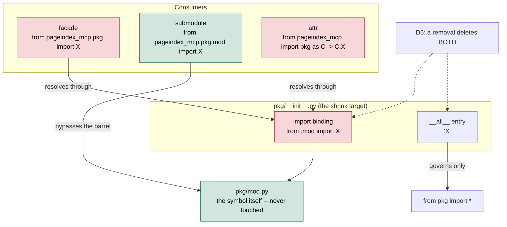

# Design Document: Package-Facade Surface Shrink

## Traceability

| Artifact | Reference |
|----------|-----------|
| Governing RFC(s) | [[RFC-045]] |
| Architecture Doc | [[ARCHITECTURE]] |
| Implementation Plan | [[tasks-rfc045-package-facade-surface]] |
| Manifest | `audit/FACADE_SURFACE_MANIFEST_2026-09-07.md` |
| Measurement | `scripts/facade_surface_measure.py` |
| Guard | `tests/test_facade_surface_guard.py` |

## Overview

Shrinks eight `src/pageindex_mcp/*/__init__.py` barrels by 59 entries that have
no facade consumer and no attribute consumer anywhere in the repo, in six
per-package waves. No symbol moves, is renamed, or changes behaviour: every
implementation stays exactly where it is, and only the re-export lines that
name it are deleted.

The design problem is not *what* to remove — [[RFC-045]] settled that with a
measurement — but *how to remove it without being wrong*, in a workstream where
every previous verdict was wrong for the same reason. The whole design turns on
one distinction: a name reached through `pageindex_mcp.<pkg>` breaks when the
barrel shrinks; the same name reached through `pageindex_mcp.<pkg>.<mod>` does
not. Four separate review rounds cited the second as proof of the first. Every
correctness property below exists to make that specific error mechanically
detectable rather than a matter of reviewer attention.

Three structural facts shape the execution and are established, not assumed
(D6): removal must delete the import binding as well as the `__all__` entry, or
the attribute channel stays open; two import lines empty out entirely and must
be deleted as lines; and the submodule objects that 62 `monkeypatch.setattr`
sites depend on exist only because a barrel imported them, so their import lines
must retain at least one surviving name.

## Key Design Principles

1. **Channel, not reference.** A name's liveness is a property of *how* it is reached, never of *how often* it appears. Reference counts, grep hit totals, and "it's used in the package" arguments are all category errors here; only the Facade_Channel and Attr_Channel can break.
2. **Mechanical signals flag, humans rule.** The Narrow_Rule's five signals are proxies for coupling, not verdicts about it. Every name a signal flags gets a human ruling with file:line evidence on both breaking channels. All 11 flagged names ruled REMOVE — the signals were right that coupling exists and wrong that the facade mediates it.
3. **Measure the alternative, don't assert against it.** The Broad_Rule was rejected because it was run and collapsed the set to 10 of 59, not because it felt too aggressive. `scripts/facade_surface_measure.py` prints both figures so the choice stays auditable.
4. **Freeze before you shrink.** The regrowth guard landed ahead of any removal so that it captures the pre-shrink baseline. A guard written after the fact freezes the outcome, not the decision.
5. **A guard that can be quietly wrong is worse than none.** The rejected "every export has a consumer" guard needed the same repo-wide consumer counter whose two defects inflated this audit's candidate set 162 → 110. Guards here assert *resolution* (does this reference resolve), never *usage*.
6. **Per-wave properties are properties of the remaining set.** Submodule-attribute survival and FEATURE_WIRINGS overlap are not per-removal checks — they depend on what is left after a wave, so they re-run each wave rather than once at the start.

## Launch Constraints

- **Startup, not tests, is the failure mode for a wired producer.** `FEATURE_WIRINGS` resolves five producer paths through a facade, via `gates.py` `rsplit(".", 1)` → `importlib.import_module(mod_path)` → `getattr(mod, attr_name, None)` → `AssertionError`. It is called from `server.py:83-86` and `worker/lifecycle.py:60-63`. Deleting one of those import bindings takes the server and the worker down at boot. The overlap with the removal set is empty, and stays checked per wave.
- **`services/docling-service` is a separate deployable that copies this source.** Its three facade imports (`app.py:87`, `:159`, `:189`) are not exercised by this repo's suite; they break inside its own image at runtime. They are pinned, not merely retained.
- **The container command is a consumer.** `arq pageindex_mcp.worker.WorkerSettings` in `apps/pageindex-mcp/worker-deployment.yaml:27` reaches the worker facade from outside any Python file.
- **The frozen list must be updated in the same commit as the removal it describes.** A wave that removes entries without updating `tests/test_facade_surface_guard.py` leaves the suite red; a wave that updates it without the external pin re-check leaves the suite green and production broken.
- **The measurement tests pin the pre-shrink facade.** They self-skip once wave 1 lands. Re-pinning them is a task of the final verification wave, not an incidental fixup along the way.

## Architecture

### High-Level Change Map



The red path is what a shrink severs; the green path is what it cannot touch.
Every wrong verdict in this workstream came from reading a green edge as
evidence about a red one.

### Architecture Decisions

#### D1: Barrels are residue, not API

Maps to [[RFC-045]] D1. `__init__.py` files are shrunk to their real consumers;
"zero facade consumers" is grounds for removal rather than a barrel's designed
state. The barrels' own docstrings claim backward compatibility
(`worker/__init__.py:1-4`) and `agents/governance/vocabulary.yaml:62-65`
codifies `barrel: role: "re-exports only"` — this decision overrides the
docstring claim and keeps the vocabulary role, which says nothing about
breadth.

#### D2: The removal set is 59, cleared

Maps to [[RFC-045]] D2 and D7. The consistency critic's coherence hold is
discharged: all 23 §E splits carry a disposition, and the 11 names the
Narrow_Rule flagged were each ruled with file:line evidence. No exceptions, no
partial set.

#### D3: Per-package waves in ascending risk order

`client` (3) → `storage` (1) → `registry_backfill` (8) → `worker` (9) →
`helpers` (12) → `converters` (26). The waves are technically independent — no
package's removal is a prerequisite for another's — and run in sequence purely
so that a regression is attributable to one package. `converters` runs last
because it carries both the external contract and three of the five wired
producers.

#### D4: Removal scope is the entry and the binding

Maps to [[RFC-045]] D6. `__all__` governs only `from pkg import *`; the
Attr_Channel is provided by the import statement. Deleting only the `__all__`
string leaves `C.X` working and moots every attr-channel argument in the RFC.
Both go, together, in the same edit.

Two measured consequences:

```python
# Import lines that EMPTY under the full removal set -- delete the line:
#   converters/__init__.py:5   from concurrent.futures import TimeoutError as FuturesTimeoutError
#   helpers/__init__.py:10     from ..script import _JOINING_TYPE
# Neither is a first-party submodule of its own package, so no submodule
# attribute is lost. `pageindex_mcp.script` stays bound via eight other
# `from ..script import ...` sites.

# Import lines that must NOT empty -- they are the only reason these
# submodule objects are reachable as package attributes:
#   converters.pictures    (42 setattr/getattr sites)
#   client.llm             (8)
#   converters.formats     (4)
#   helpers.garble         (4)
#   storage.minio_ops      (2)
#   converters.docling_conv, client.recovery, helpers.gates  (1 each)
# All eight retain surviving names under the full removal set. Re-checked
# per wave, because this is a property of the remaining set.
```

#### D5: The regrowth guard is a frozen list plus an external pin

Maps to [[RFC-045]] D5, landed 2026-09-08. Four assertions, each covering
another's blind spot: the frozen literal (change detection), the
external-contract pin (catches a reviewer who "fixes" a frozen-list failure by
editing the literal), a binding check (no stale name in the literal), and
`TestConsumerReferencesResolve` (44 off-suite references resolve). The
"every export has a consumer" variant is rejected — see Principle 5.

#### D6: The disposition rule is a script, not a paragraph

Maps to [[RFC-045]] D7. `scripts/facade_surface_measure.py` loads section B of
the manifest, resolves each candidate to its defining submodule, and runs five
narrow signals against current source, printing the Narrow_Rule and Broad_Rule
outcomes together:

| Rule | Survive as REMOVE | Flip to KEEP |
|---|---|---|
| Broad_Rule | 10 of 59 | 49 |
| Narrow_Rule | 48 of 59 | 11 |

`tests/test_rfc045_facade_measurement.py` pins the population, both counts, the
per-package split, and the 11-name hand-review set with the signal that catches
each — so the set a human must rule on cannot drift silently. The signal
battery is honest about being heuristic: the cross-package check is a proxy for
a runtime Redis-key contract that import-graph AST analysis cannot see at all,
and its docstring says so.

#### D7: Verification is a positive-controlled AST pass, not a grep

The eleven rulings rest on a repo-wide AST pass over `src/`, `tests/`,
`services/`, `scripts/` and `issue/` that resolves the Facade_Channel and
Attr_Channel separately, tracking per-file aliases so that
`from pageindex_mcp import worker as w` → `w.X` is caught. It returned zero on
both channels for all 11 names.

A checker that returns all zeros is indistinguishable from a broken checker, so
it was positive-controlled against five names known to be live —
`converters._docling_converter` (facade, external), `converters.pdf_to_markdown_docling`
(facade + attr), `converters.zdr_egress_gate` (wired producer), `helpers.GATES`
(6 facade sites), `worker._run_converter_subprocess` (2 facade sites) — and
found every one. The control is part of the design, not a debugging step: any
future re-verification runs it first.

## Service Contracts

```python
# --- Per-package facade surfaces after the shrink -------------------------
# Format: package  proposed -> removed / retained   notes

# client/__init__.py            3 removed
#   REMOVED: RecoveryMixin, + 2 others (manifest B)
#   RETAINED: LOW_CONTENT_OCR_CHAR_FLOOR (attr consumer, tests/test_bidi.py:721)
#   NOTE: the `# recovery` comment in __all__ STAYS -- it also heads
#         `_remote_image_to_markdown`, which is not a candidate.

# storage/__init__.py           1 removed
#   REMOVED: SIDECAR_VERSION

# registry_backfill/__init__.py 8 removed
#   No external consumers; `main` is reachable as a module entry point,
#   not through the facade.

# worker/__init__.py            9 removed
#   REMOVED: _mirror_bridged_incr, _mirror_bridged_set, _VERDICT_RETRY_*, ...
#   RETAINED: WorkerSettings (container command, R3.2)
#   RETAINED: _mirror_registry_metric_to_redis, _mirror_registry_write_failure_to_redis,
#             _upsert_registry_row (real facade consumers -- the .registry_mirror
#             block is deliberately a partial-block shrink)

# helpers/__init__.py           12 removed
#   REMOVED: _GateFn, _flat_*, _walk_leaves, flag_empty_cells, ...
#   RETAINED: GATES, compute_image_enrichment_ratio  (FEATURE_WIRINGS, R3.4)
#   LINE DELETED: `from ..script import _JOINING_TYPE` (empties)

# converters/__init__.py        26 removed
#   REMOVED: ScriptContext, StageRecord, _CHUNKED_DOCLING_PER_CHUNK_TIMEOUT_S,
#            _D7_FITZ_FALLBACK_ENABLED, _PAGE_ROTATION_DETECTION_ENABLED,
#            _pdf_inspector_available, FuturesTimeoutError, ...
#   RETAINED: _docling_converter, pdf_to_markdown_docling, image_to_markdown
#             (services/docling-service, R3.1)
#   RETAINED: chunked_docling_timeout_s, probe_conversion_route, zdr_egress_gate
#             (FEATURE_WIRINGS, R3.4)
#   RETAINED: _HEADING_RE, _build_pdf_pipeline_options, _patch_hierarchical_infer
#             (issue/, R3.3)
#   LINE DELETED: `from concurrent.futures import TimeoutError as FuturesTimeoutError`

# --- Unchanged by this RFC ------------------------------------------------
# registry/__init__.py    zero candidates
# metrics/__init__.py     7 candidates, deferred (OQ3) -- frozen by D5 meanwhile
# tools/__init__.py       5 entries, all live via server.py:29-33 attr access
```

## Correctness Properties

### Property 1: No removed name has a breaking-channel consumer

Every name removed from a package's `__init__.py` SHALL have zero
Facade_Channel imports and zero Attr_Channel references across `src/`,
`tests/`, `services/`, `scripts/` and `issue/`. Formally: for each removed
`(pkg, name)`, an AST pass resolving `ImportFrom` with module
`pageindex_mcp.<pkg>` and `Attribute` access on any local alias bound to
`<pkg>` yields the empty set.

**Test:** The positive-controlled AST pass of D7, re-run per wave; plus
`tests/test_facade_surface_guard.py` external pin for the off-suite half.

### Property 2: A removal deletes the entry and the binding

For every removed name, neither the `__all__` string nor the `import` binding
SHALL survive in the package's `__init__.py`. Formally: `name not in
pkg.__all__` **and** `not hasattr(pkg, name)`.

**Test:** `hasattr` assertion per removed name, per wave. The `__all__` half
alone is insufficient and is the specific failure this property exists to
prevent.

### Property 3: Submodule attributes survive

Every submodule object reached as a package attribute SHALL remain bound after
each wave. Formally: for each of the 8 `(pkg, submodule)` pairs reached across
62 `setattr`/`getattr` sites, `hasattr(pkg, submodule)` holds.

**Test:** Import each package and assert the attribute, per wave. This is a
property of the *remaining* set, so a wave that is individually safe can still
break it in combination — hence per-wave, not once.

### Property 4: FEATURE_WIRINGS resolves at startup

All five facade-resolved producer paths SHALL remain resolvable:
`converters.chunked_docling_timeout_s`, `converters.probe_conversion_route`,
`converters.zdr_egress_gate`, `helpers.GATES`,
`helpers.compute_image_enrichment_ratio`. Formally:
`validate_feature_wirings()` raises no `AssertionError`.

**Test:** Existing startup validation, exercised at import; plus an explicit
per-wave assertion that the intersection of `FEATURE_WIRINGS` attribute names
and the wave's removal list is empty.

### Property 5: The external contract resolves

`services/docling-service/app.py` (3 names), the `issue/` scripts (3 names),
and the container command `arq pageindex_mcp.worker.WorkerSettings` SHALL
continue to resolve. Formally: all 44 off-suite `(module, name)` references
resolve.

**Test:** `TestConsumerReferencesResolve` in
`tests/test_facade_surface_guard.py`, with its `>= 40` floor assertion so the
sweep cannot go vacuously green.

### Property 6: The frozen surface matches after each wave

Each package's `__all__` SHALL equal the frozen literal in
`tests/test_facade_surface_guard.py`, updated in the same commit as the removal.

**Test:** The frozen-list guard, which fails on any drift with an
added/removed diff.

### Property 7: The measurement stays reproducible

`scripts/facade_surface_measure.py` SHALL remain runnable and its outcomes
pinned. While the facade is un-shrunk the pins assert the pre-shrink numbers;
once wave 1 lands the reproduction tests self-skip with an explanatory message,
and the final verification wave re-pins them against the post-shrink source.

**Test:** `tests/test_rfc045_facade_measurement.py`. Mutation-checked: dropping
one signal from the Narrow_Rule fails 3 of its 5 tests.

## Risk Mitigation

| Risk | Mitigation | Property |
|---|---|---|
| A submodule-channel reference is read as facade evidence | The AST pass resolves the two separately and is positive-controlled | P1, D7 |
| An `__all__`-only shrink leaves the attr channel open | `hasattr` assertion per removed name | P2 |
| An emptied import line drops a submodule attribute | Only 2 lines empty, neither first-party; 8-attribute sweep per wave | P3 |
| A wired producer loses its binding and the server fails at boot | Overlap is empty; re-checked per wave | P4 |
| `services/docling-service` breaks inside its own image | External pin, not merely retention | P5 |
| A reviewer "fixes" a frozen-list failure by editing the literal | The external pin catches exactly this | P6, D5 |
| The barrels regrow | Frozen list across all 9 packages / 412 entries | P6 |
| A future audit re-argues the disposition | The measurement is a committed script with pinned outcomes | P7 |

## Amendment History

### Amendment 1 (2026-09-08): Initial design

Authored alongside [[RFC-045]] Amendment 3, which discharged Requirement 2 and
added RFC decisions D6 (removal scope) and D7 (disposition rule). This design
carries those forward as architecture decisions D4 and D6-D7, and turns the
per-wave obligations they imply — submodule-attribute survival, FEATURE_WIRINGS
overlap, and the entry-plus-binding scope — into Properties 2, 3 and 4.
