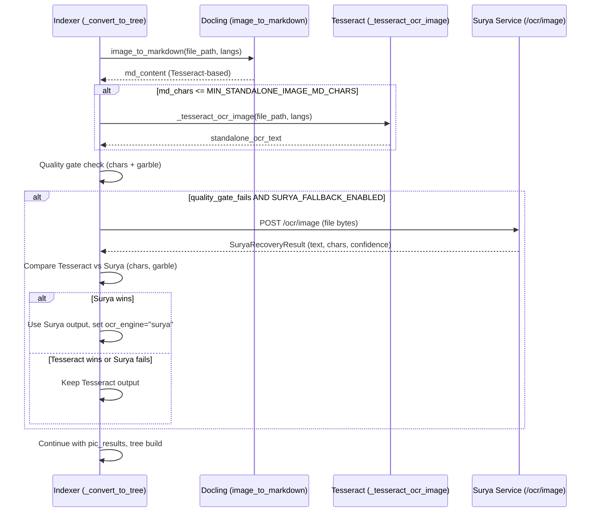

<!-- Space: CITRA -->
<!-- Title: Design Document: Surya OCR Fallback for Standalone Images -->
<!-- Folder: Designs -->

---
id: "design-rfc048-surya-image-fallback"
title: "Design: Surya OCR Fallback for Standalone Images"
type: design
status: draft
date: "2026-09-22"
tags:
  - design
  - ocr
  - image-pipeline
aliases:
  - "design-rfc048-surya-image-fallback"
governs:
  - "[[RFC-048]]"
---

# Design Document: Surya OCR Fallback for Standalone Images

## Traceability

| Artifact | Reference |
|----------|-----------|
| Governing RFC(s) | [[RFC-048]] |
| PRD / Requirements | [[PRD]] |
| Architecture Doc | [[ARCHITECTURE]] |
| Implementation Plan | [[tasks-rfc048-surya-image-fallback]] |
| Prior art | [[design-rfc047-gate-layer-correctness]] D8 |

## Overview

Standalone image files (`.jpg`, `.png`, etc.) that Tesseract OCR handles poorly — yielding sparse, garbled, or wrong-script output — get a second chance via the existing Surya OCR service. The Surya service gains a new `/ocr/image` endpoint for direct image input. The indexer's image branch gains a quality-gated fallback that fires after Tesseract, compares outputs, and picks the winner.

## Key Design Principles

1. **Tesseract-first, Surya-fallback**: Tesseract remains the primary engine. Surya fires only when Tesseract output fails the quality gate. This preserves latency for the happy path.
2. **Reuse existing infrastructure**: The Surya service, config fields (`SURYA_FALLBACK_ENABLED`, `SURYA_SERVICE_URL`, `SURYA_FALLBACK_TIMEOUT_S`), and `SuryaRecoveryResult` dataclass already exist from [[RFC-047]] D8. No new config surface.
3. **Fail-open**: Surya service unavailability never blocks ingestion. Timeout/error → keep Tesseract output, log, continue.

## Launch Constraints

- `SURYA_FALLBACK_ENABLED` defaults to `false` — opt-in deployment.
- Surya service must be running at `SURYA_SERVICE_URL` for fallback to work.
- GPL-3.0 licensing: Surya runs as a separate container behind HTTP (process isolation from MIT codebase). Same legal clearance surface as pymupdf4llm (AGPL-3.0) per CLAUDE.md Hard Rule #4.

## Architecture

### Sequence Diagram: Image Ingestion with Surya Fallback



### Architecture Decisions

**Reuse `SuryaRecoveryResult` and existing config (RFC-047 D8):** The `_surya_density_recovery` function and `SuryaRecoveryResult` dataclass already exist. The image fallback uses the same result type and config fields, avoiding duplication. The helper function is new (`_surya_image_ocr`) because the API endpoint differs (`/ocr/image` vs `/ocr/pdf`).

**Quality gate triggers Surya, not general arbitration:** The `arbitrate.py` multi-engine framework is not used. This is a targeted recovery path (same pattern as RFC-047 D8), not a general engine-selection mechanism.

## Service Contracts

### 1. Surya OCR Service — `/ocr/image` Endpoint

**Responsibility**: Accept a raw image file, run Surya OCR, return text + confidence.

```python
# New endpoint
POST /ocr/image  # OCR a single image file
```

**Request:** multipart/form-data with `file` field (image bytes, any format PIL can decode).

**Response schema** (matches `/ocr/pdf` for client consistency):

```python
class ImageOcrResponse(BaseModel):
    total_text: str
    total_char_count: int
    total_avg_confidence: float
    regions: list[RegionResult]  # per-block text + bbox + confidence
    elapsed_s: float
```

**Error responses:**
- 400: image cannot be decoded (PIL.UnidentifiedImageError)
- 500: internal OCR failure

### 2. Indexer — Image Fallback Path

**Responsibility**: After Tesseract OCR in the `ext in _IMAGE_EXTS` branch, check quality gate and optionally fall back to Surya.

**Site:** `src/pageindex_mcp/client/indexer.py`, inside `_convert_to_tree`, BETWEEN `pic_results` construction (~line 1344) and `splice_picture_text_for_tree` (~line 1353). The gate must run after `pic_results` is built but BEFORE the splice bakes `pic_results[i]["ocr_text"]` into `md_content`. This way, updating `pic_results[0]["ocr_text"]` with Surya text automatically propagates through the existing splice step — no separate `md_content` manipulation needed. **(Amendment 2026-09-22: GA-1 fix — gate AFTER pic_results, BEFORE splice.) (Amendment 2026-09-22: GB-2 fix — clarified: must be before splice_picture_text_for_tree so Surya text flows into the tree.)**

**New helper function:**

```python
async def _surya_image_ocr(
    file_bytes: bytes,
    filename: str,
    surya_url: str,
    timeout_s: float,
) -> SuryaRecoveryResult | None:
```

Sends the image to `{surya_url}/ocr/image`, returns `SuryaRecoveryResult` or `None` on failure. Maps response field `total_char_count` → dataclass field `total_chars`. **(Amendment 2026-09-22: GA-4 — explicit field mapping note.)**

**Quality gate logic (runs AFTER `pic_results` construction, BEFORE `splice_picture_text_for_tree`):**

```python
_tess_garbled = bool(detect_garble(
    standalone_ocr_text,
    script_context=script_context,
    config=_garble_config,
    blob_kind=BlobKind.TREE_TEXT,
)) if standalone_ocr_text else True

_tess_chars = len("".join(standalone_ocr_text.split())) if standalone_ocr_text else 0
_quality_gate_fails = _tess_chars <= MIN_STANDALONE_IMAGE_MD_CHARS or _tess_garbled

if _quality_gate_fails and settings.surya_fallback_enabled:
    _surya_result = await _surya_image_ocr(...)
    if _surya_result:
        _surya_garbled = bool(detect_garble(...))
        # Surya wins if: more chars AND not garbled, OR tesseract was garbled and surya is not
        if (not _surya_garbled and _surya_result.total_chars > _tess_chars) or (
            _tess_garbled and not _surya_garbled
        ):
            standalone_ocr_text = _surya_result.total_text
            # Update pic_results[0] — TypedDict, use dict assignment (GB-1)
            if pic_results:
                pic_results[0]["ocr_text"] = _surya_result.total_text
            state.ocr_engine = str(OcrEngine.SURYA)
```

## Correctness Properties

### Property 1: Fallback Gate Correctness

*For any* standalone image where Tesseract output exceeds `MIN_STANDALONE_IMAGE_MD_CHARS` **and** is not garbled, system SHALL NOT invoke the Surya service. (Gate triggers on either condition alone — OR, not AND.) **(Amendment 2026-09-22: GA-3 — clarified OR semantics to match RFC R2 AC1 amendment.)**

**Validates: Requirement 2, AC 1**

### Property 1a: Marker Integrity

*For any* standalone image where Surya wins, `md_content` markers SHALL be intact at gate-evaluation time. The Surya text is written to `pic_results[0]["ocr_text"]` (dict assignment — `PictureResult` is a `TypedDict`) and `standalone_ocr_text`; it then propagates into `md_content` via the existing `splice_picture_text_for_tree` call that follows the gate. **(Added 2026-09-22: GA-1.) (Amendment 2026-09-22: GB-1 — dict assignment, not `_replace`.) (Amendment 2026-09-22: GB-2 — Surya text reaches tree via splice, not by replacing md_content directly.)**

**Validates: Requirement 2, AC 2**

### Property 2: Fail-Open Guarantee

*For any* Surya service failure (timeout, HTTP error, decode error), system SHALL continue with Tesseract output and SHALL NOT raise an exception.

**Validates: Requirement 2, AC 4**

### Property 3: Engine Attribution

*For any* image processed through the Surya fallback path where Surya wins, `state.ocr_engine` SHALL equal `"surya"`. Requires `OcrEngine.SURYA` enum member to exist in `picture_plane.py`. **(Amendment 2026-09-22: GA-2 — enum member is a prerequisite, not already present.)**

**Validates: Requirement 2, AC 5**

### Property 4: Feature Gate

*For any* image processed when `SURYA_FALLBACK_ENABLED=false`, system SHALL NOT make any HTTP request to the Surya service.

**Validates: Requirement 2, AC 3**

### Property 5a: Winner-Selection Invariant

*For any* standalone image where both Tesseract and Surya produce output, Surya SHALL win if and only if: (a) Surya is not garbled AND Surya char count exceeds Tesseract char count, OR (b) Tesseract is garbled AND Surya is not garbled. In all other cases, Tesseract output SHALL be kept. **(Added 2026-09-22: GB-4 — formalises the selection logic from R2 AC2.)**

**Validates: Requirement 2, AC 2**

### Property 5b: Error Response Contract

*For any* request to `/ocr/image` with an unrecognisable or empty image, the endpoint SHALL return HTTP 400 with a descriptive error message. **(Added 2026-09-22: GB-5 — formalises R1 AC2.)**

**Validates: Requirement 1, AC 2**

### Property 5c: Decision Event Emission

*For any* standalone image where the quality gate is evaluated, a `surya_image_fallback` decision event SHALL be emitted with the appropriate choice (`gate_not_triggered`, `not_attempted`, `recovery_succeeded`, `recovery_insufficient`, `recovery_failed`) and full attributes. **(Added 2026-09-22: GB-6 — formalises R2 AC6.)**

**Validates: Requirement 2, AC 6**

### Property 6: Response Schema Consistency

*For any* valid image sent to `/ocr/image`, the response SHALL contain `total_text` (str), `total_char_count` (int ≥ 0), and `total_avg_confidence` (float 0.0–1.0).

**Validates: Requirement 1, AC 3**

## Error Handling

**Surya service errors:**

| Scenario | Handling |
|----------|----------|
| Surya service unreachable | `_surya_image_ocr` returns `None`, Tesseract output kept, `recovery_failed` logged |
| Surya timeout (> `SURYA_FALLBACK_TIMEOUT_S`) | Same as unreachable |
| Surya returns empty text | Treated as `recovery_insufficient`, Tesseract output kept |
| Invalid image sent to `/ocr/image` | Surya returns 400, `_surya_image_ocr` returns `None` |

## Testing Strategy

### Testing Layers

1. **Unit Tests**: Quality gate logic, winner selection, fail-open behavior, config gating.
2. **Service Tests**: `/ocr/image` endpoint with valid/invalid images.
3. **Integration Tests**: End-to-end with mocked Surya service.

### Key Test Scenarios

**Critical Path Tests:**

1. Image with poor Tesseract output → Surya fallback fires → Surya wins → engine attributed as "surya"
2. Image with good Tesseract output → Surya fallback does NOT fire → engine remains "tesseract"
3. `SURYA_FALLBACK_ENABLED=false` → no Surya attempt regardless of Tesseract quality

**Edge Cases:**

- Surya service timeout → Tesseract output kept, no exception
- Surya returns more chars but garbled → Tesseract wins
- Both Tesseract and Surya garbled → Tesseract kept (no change from current)
- Empty image → Tesseract returns empty, Surya fallback fires, Surya returns empty → FAIL stands