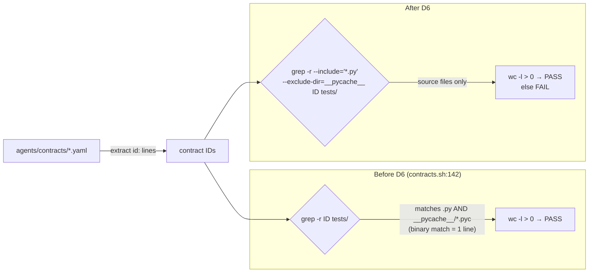
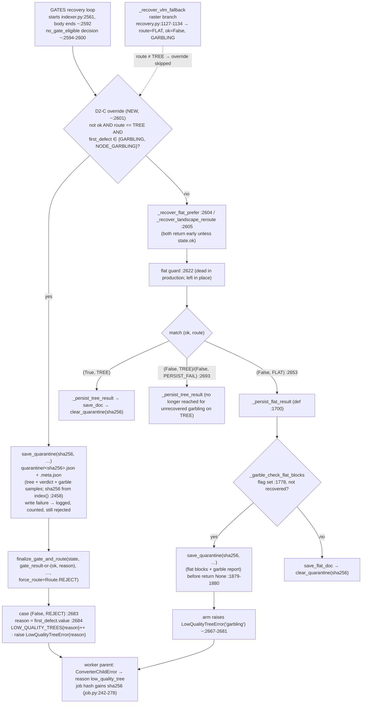
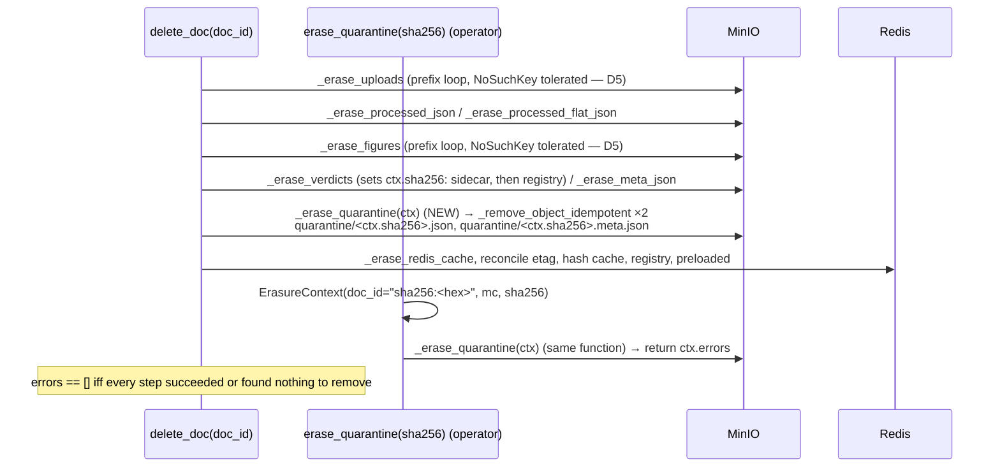
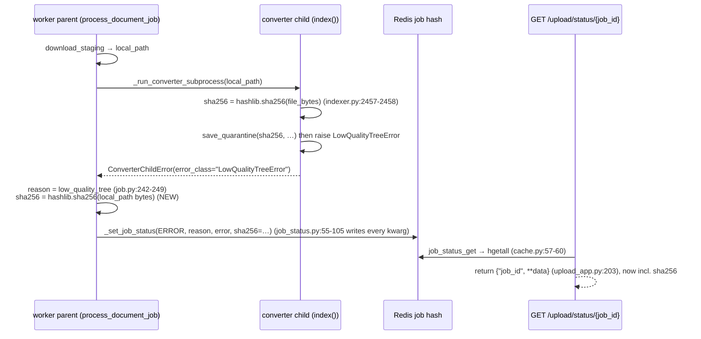
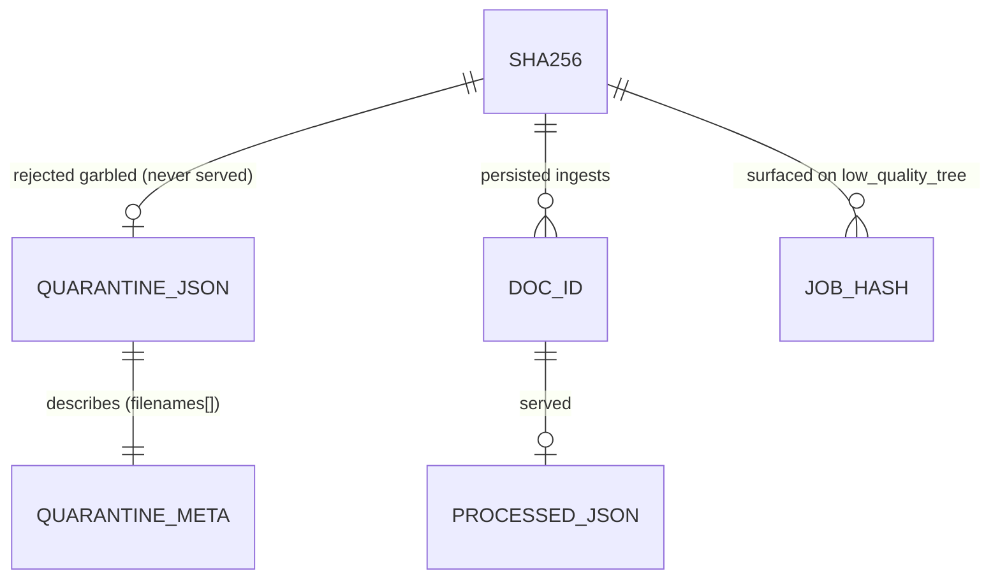
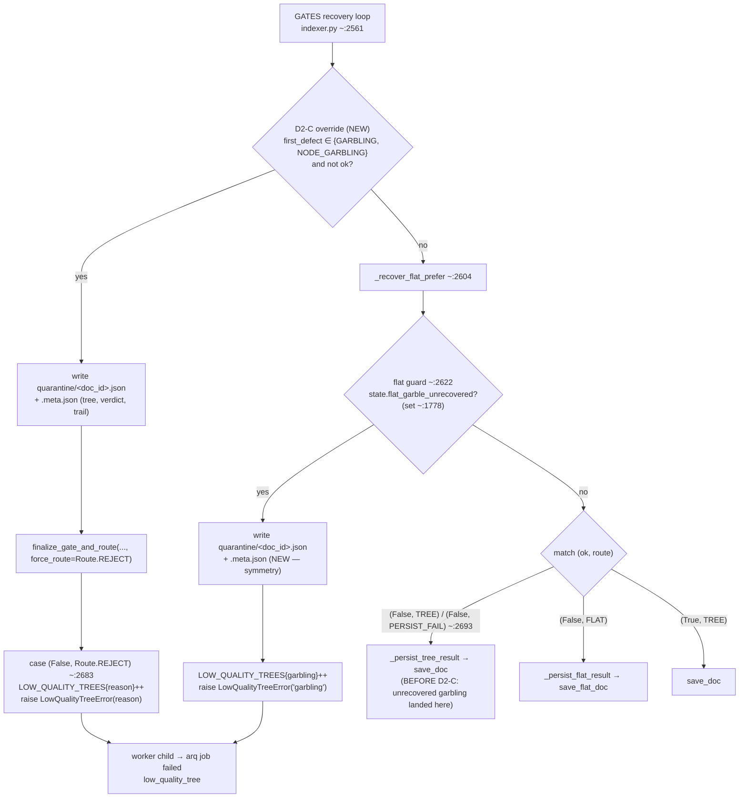
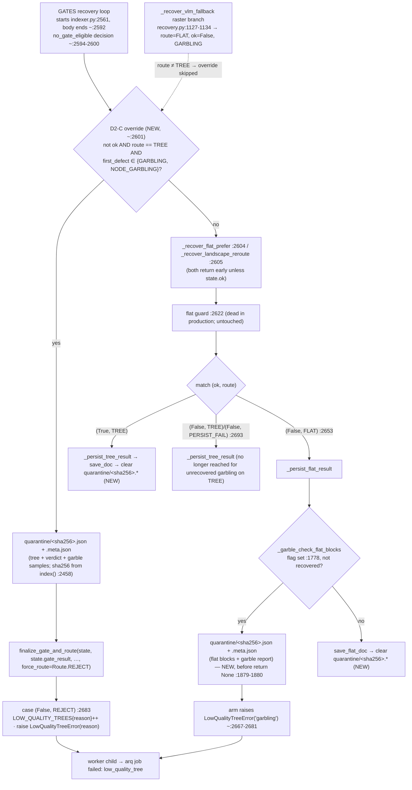
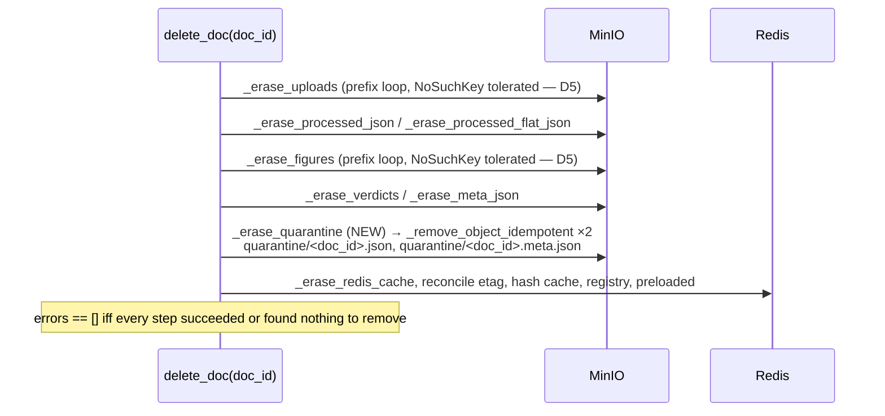
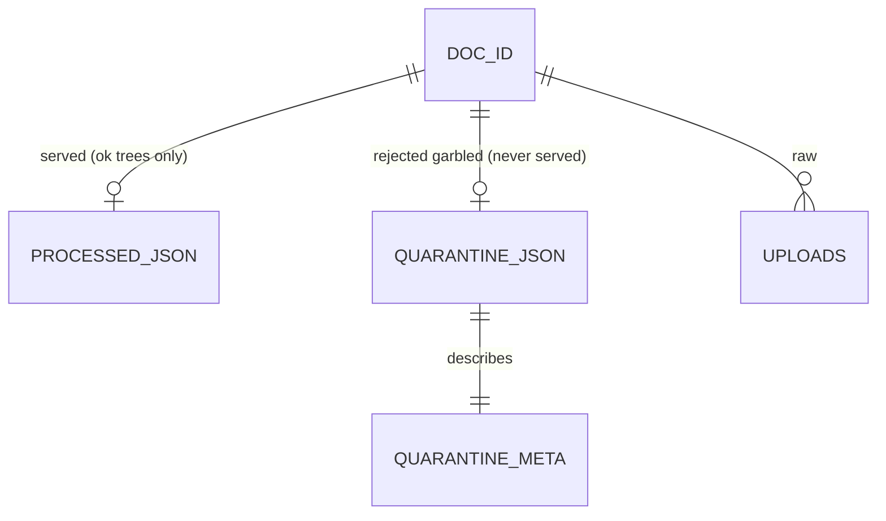
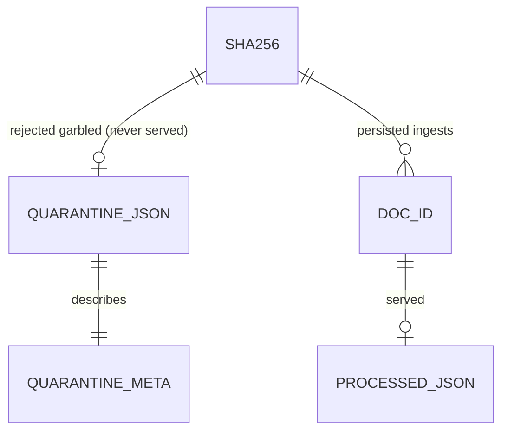

<!-- Space: CITRA -->
<!-- Title: Design Document: Contract Drift Remediation -->
<!-- Folder: Designs -->

---
id: "design-rfc049-contract-drift-remediation"
title: "Design: Contract Drift Remediation"
type: design
status: accepted
date: "2026-09-23"
tags:
  - design
  - contracts
  - gates
  - hard-rules
  - erasure
aliases:
  - "design-rfc049-contract-drift-remediation"
governed_by:
  - "[[RFC-049]]"
---

# Design Document: Contract Drift Remediation

> **v2 consolidation 2026-09-23 (iter 3).** This file is now a single authoritative text. The amendment markers and struck-through text from iterations 1 and 2 have been folded in, so everything above [Appendix Z](#appendix-z-iteration-history-verbatim-pre-v2-text) is the current design. The complete pre-v2 file (iterations 1–2, including its old frontmatter) is kept verbatim inside a fenced block in Appendix Z. Because it is fenced, its headings and anchors do not render and cannot collide with the v2 anchors. Status is `accepted` (approved for build). The frontmatter key `governs` became `governed_by`, because this design is governed *by* RFC-049. Iteration 3 adds: the corrected `vt_raw` fallback on the REJECT override, a quarantine `filenames[]` array, the HR5-critical write-failure property ([P12c](#property-12c-a-failed-quarantine-write-still-rejects-and-never-persists)), sha256 surfacing on rejection ([P12d](#property-12d-a-rejection-surfaces-the-documents-sha256)), one erasure implementation shared by the cascade and the operator path, and the complete `quarantine_write` decision-point spec.

## Traceability

| Artifact | Reference |
|----------|-----------|
| Governing RFC | [RFC-049: Contract Drift Remediation](../rfcs/049-contract-drift-remediation.md) · [[RFC-049]] |
| RFC requirements | [R1](../rfcs/049-contract-drift-remediation.md#requirement-1-no-contract-may-report-green-against-code-that-contradicts-it) · [R2](../rfcs/049-contract-drift-remediation.md#requirement-2-the-contracts-gate-must-not-be-maskable-by-build-artefacts) · [R3](../rfcs/049-contract-drift-remediation.md#requirement-3-hr2-cascade-idempotency-amendment-2026-09-23) · [R4](../rfcs/049-contract-drift-remediation.md#requirement-4-rejected-garbled-trees-are-quarantined-never-served-and-erasable-amendment-2026-09-23) |
| RFC decisions | [D1](../rfcs/049-contract-drift-remediation.md#d1-lang-01-c2-is-stale--the-raise-is-the-fix-not-the-bug) · [D2](../rfcs/049-contract-drift-remediation.md#d2-ocr-01-c3-vs-hard-rule-5--the-decision-requires-explicit-approval) · [D3](../rfcs/049-contract-drift-remediation.md#d3-flat-01-c3s-role-set-is-incomplete--add-image) · [D4](../rfcs/049-contract-drift-remediation.md#d4-three-drifted-triggereffect-clauses--substance-intact-text-stale) · [D5](../rfcs/049-contract-drift-remediation.md#d5-erase-01-c2-idempotency-hole--ratification-fix-already-applied) · [D6](../rfcs/049-contract-drift-remediation.md#d6-the-contracts-gates-own-grep-is-unhardened--latent-one-line-fix) |
| RFC current state | [RFC-049 Decision Summary — current state](../rfcs/049-contract-drift-remediation.md#decision-summary) |
| Implementation Plan | [Tasks: Contract Drift Remediation](../tasks/tasks-rfc049-contract-drift-remediation.md) · [[tasks-rfc049-contract-drift-remediation]] |
| Implementation order | [RFC-049 Sequencing](../rfcs/049-contract-drift-remediation.md#sequencing) |
| Test strategy | [RFC-049 Test Strategy](../rfcs/049-contract-drift-remediation.md#test-strategy) |
| Risks | [RFC-049 Risks](../rfcs/049-contract-drift-remediation.md#risks) |
| Hard rules at issue | [CLAUDE.md Hard Rules](../../CLAUDE.md#hard-rules): HR2 (erasure cascade), HR5 (never persist a low-quality tree) |
| Architecture Doc | [[ARCHITECTURE]]: MinIO layout, Tree Quality Gate, Compliance |
| PRD | [[PRD]] |
| Evidence baseline | [[rfc047-d9-final-baseline]] (25 docs, 0 FAIL, 2026-09-22) |
| Correctness properties | P1–P12, P12a, P12b, P12c, P12d (below) |

## Overview

RFC-049 closes the last two contracts-gate FAILs (`LANG-01-C2`, `OCR-01-C3`). Where the code is right, it fixes the *contract*; where the contract is right, it fixes the *code*. It never labels a test ahead of either. Five of the six decisions are contract-text or one-line changes:

- [D6](../rfcs/049-contract-drift-remediation.md#d6-the-contracts-gates-own-grep-is-unhardened--latent-one-line-fix) hardens the gate's own grep.
- [D3](../rfcs/049-contract-drift-remediation.md#d3-flat-01-c3s-role-set-is-incomplete--add-image) and [D4](../rfcs/049-contract-drift-remediation.md#d4-three-drifted-triggereffect-clauses--substance-intact-text-stale) correct editorial drift.
- [D1](../rfcs/049-contract-drift-remediation.md#d1-lang-01-c2-is-stale--the-raise-is-the-fix-not-the-bug) aligns `LANG-01-C2` with the deliberate non-Latin raise.
- [D5](../rfcs/049-contract-drift-remediation.md#d5-erase-01-c2-idempotency-hole--ratification-fix-already-applied) ratifies an erasure fix already committed as `e2ecd4b`.

Most of the work is in [D2](../rfcs/049-contract-drift-remediation.md#d2-ocr-01-c3-vs-hard-rule-5--the-decision-requires-explicit-approval). The user resolved it on 2026-09-23 as **[Option C, reject and quarantine](../rfcs/049-contract-drift-remediation.md#option-c--reject-and-quarantine-adopted-2026-09-23)**:

- **Reject.** After GATES recovery, a document with `not state.ok and state.route == Route.TREE and state.first_defect in {GARBLING, NODE_GARBLING}` is forced to `Route.REJECT`. It raises `LowQualityTreeError` and never reaches `save_doc`. A document that recovery legitimately moved to `Route.FLAT` is left alone.
- **Quarantine first.** Before the raise, the tree (or flat blocks), the verdict and garble samples are written to MinIO `quarantine/<sha256>.json` and `quarantine/<sha256>.meta.json`. The key is the content hash because a rejected document never gets a `doc_id`. The tree-route write happens in `index()`. The flat-route write happens inside `_persist_flat_result`, before its `return None`.
- **Never served.** No MCP query tool or HTTP route reads `quarantine/`.
- **Bounded in time.** A 30-day lifecycle TTL applies, and the copy is cleared when the same bytes later persist successfully.
- **Erasable.** `delete_doc` reaches the copy through `ctx.sha256`. For a document that was never persisted, an operator uses `erase_quarantine(sha256)`, which the rejected job's status record now exposes.
- **HR5 wins over inspectability.** If the quarantine write fails, the document is still rejected.

The contracts gate goes **PASS=64 FAIL=2 → PASS=65 FAIL=1** after the Wave 0/1 edits ([Checkpoint A](../tasks/tasks-rfc049-contract-drift-remediation.md#4-checkpoint-a--contract-text-wave)), then **PASS=68 FAIL=0** after D2-C ([Checkpoint B](../tasks/tasks-rfc049-contract-drift-remediation.md#711-checkpoint-b--d2-c)). These are gate lines: 61 contract IDs + 5 module-coverage lines = 66, plus the two new IDs `OCR-01-C4` and `ERASE-01-C4`.

## Key Design Principles

1. **Probe before label.** Drift is found by writing a test *literally to the contract text*, without looking at the implementation. For D2-C the probe tests are re-derived from the `OCR-01-C3` and `FLAT-03-C2` text, written red first, and labelled only once green ([Task 7.1](../tasks/tasks-rfc049-contract-drift-remediation.md#71-write-red-probe-tests), [Task 7.7](../tasks/tasks-rfc049-contract-drift-remediation.md#77-label-the-probe-tests)).
2. **Amend before label.** A contract whose *effect* the code contradicts stays FAIL until its text or the code changes. The label goes in the same change as the amendment or later, never earlier ([R1 AC2/AC4](../rfcs/049-contract-drift-remediation.md#requirement-1-no-contract-may-report-green-against-code-that-contradicts-it), [Property 4](#property-4-labels-follow-amendments), [Property 9](#property-9-unresolved-contradictions-stay-red)).
3. **Gate counts come from source only.** A PASS must come from a `*.py` file under `tests/`, never from bytecode ([R2](../rfcs/049-contract-drift-remediation.md#requirement-2-the-contracts-gate-must-not-be-maskable-by-build-artefacts), [Property 1](#property-1-gate-hits-come-only-from-test-source)).
4. **Reject, don't serve.** An unrecoverably garbled tree is never a served artifact on any route. It stays inspectable through a quarantine object that the query surface does not read and that erasure covers ([R4](../rfcs/049-contract-drift-remediation.md#requirement-4-rejected-garbled-trees-are-quarantined-never-served-and-erasable-amendment-2026-09-23), [Property 10](#property-10-unrecovered-garbling-is-rejected-never-saved), [Property 12](#property-12-rejected-trees-are-quarantined-unserved-erasable)).
5. **Leave the routing table alone.** D2-C is a post-recovery override in `index()`. It does not change `REASON_POLICY` or `decide_route`. `finalize_gate_and_route` has 7 production call sites: `client/indexer.py:611` and `:1556`, and `client/recovery.py:897`, `:949`, `:1127`, `:1208` and `:1292`. The graph in-degree is ~19 once tests are counted. Several of these sites run mid-retry, where `RETRY_OCR → TREE` is load-bearing.
6. **Respect a legitimate re-route.** The override fires only while `state.route == Route.TREE`. A recovery that deliberately moved the document to `Route.FLAT`, with `ok` still `False`, keeps its route.
7. **HR5 over inspectability.** A failed quarantine write never falls back to persisting. The document is rejected either way ([Property 12c](#property-12c-a-failed-quarantine-write-still-rejects-and-never-persists)).

## Launch Constraints

- **HR changes need a human.** One bundled `CLAUDE.md` edit is proposed as a diff only and applied only after explicit human approval ([R1 AC3](../rfcs/049-contract-drift-remediation.md#requirement-1-no-contract-may-report-green-against-code-that-contradicts-it), [Task 7.9](../tasks/tasks-rfc049-contract-drift-remediation.md#79-propose-the-claudemd-hr2-purge-list-change)). It covers:
  - HR2: the full `_ERASURE_MANIFEST` cascade list, including `quarantine/`.
  - HR5: a one-clause amendment permitting an unserved `quarantine/` copy.
- **Behaviour changes come only from D2-C.** D1, D3, D4 and D6 change contract text or a gate script and nothing else. D5 is already committed (`e2ecd4b`).
- **Blast radius measured at 0 documents.** The [[rfc047-d9-final-baseline]] records 0 FAIL across 25 docs. The one REJECTED document (#12) is already rejected for garbling on the flat route. [Property 11](#property-11-corpus-verdicts-unchanged) re-verifies this after D2-C ([RFC-049 Risk 1](../rfcs/049-contract-drift-remediation.md#risks)).
- **PII/residency (HR3) unaffected.** Quarantine objects hold the same content class as `processed/*.json`, live in the same bucket and region, and add no LLM egress. Retention is a storage-limitation question, resolved as RFC Q4 ([RFC-049 Open Questions](../rfcs/049-contract-drift-remediation.md#open-questions)): a 30-day MinIO lifecycle TTL ([Task 7.5c](../tasks/tasks-rfc049-contract-drift-remediation.md#75c-configure-the-quarantine-lifecycle-ttl), operator step, owner **open**) plus clear-on-success ([Task 7.5a](../tasks/tasks-rfc049-contract-drift-remediation.md#75a-clear-quarantine-on-successful-persist)).
- **The quarantine prefix is a PII-bearing store.** It carries the same content as the rejected document and is treated like `processed/` for access control and erasure ([RFC-049 Risk 6](../rfcs/049-contract-drift-remediation.md#risks)).
- **Backups are unverified.** Whether a documented backup or bucket versioning covers `quarantine/` has not been checked. [Task 6.2](../tasks/tasks-rfc049-contract-drift-remediation.md#62-re-verify-code-anchors) checks for a documented backup. [Task 7.5c](../tasks/tasks-rfc049-contract-drift-remediation.md#75c-configure-the-quarantine-lifecycle-ttl) checks bucket versioning and adds a noncurrent-version expiry rule if versioning is on.
- **Test runs use `make test`.** Every suite run in this plan is `make test` / `make test PYTEST_ARGS="..."`, in the foreground and bounded (CLAUDE.md "Running Tests").

## Architecture

### Contracts Gate Flow (D6)



Implements [AD6](#ad6-restrict-gate-grep-to-source-d6) · [Property 1](#property-1-gate-hits-come-only-from-test-source) · [Property 2](#property-2-gate-counts-are-stable-under-hardening) · [Task 1.1](../tasks/tasks-rfc049-contract-drift-remediation.md#11-restrict-the-grep-to-test-source).

### Index Route Dispatch Before and After D2-C



**Before D2-C:** an unrecovered `GARBLING` on the tree route came out of recovery as `(ok=False, route=Route.TREE)`, because `REASON_POLICY[GARBLING] = RETRY_OCR` (`helpers/gates.py:680`) and `decide_route` maps `RETRY_OCR → TREE` (`helpers/types.py:369-373`). It then fell through to `save_doc`.

**After D2-C:** the override catches that case once the recovery loop has finished. The `:2622` pre-match guard never fires in production. The flag is set only inside `_persist_flat_result`, and that method runs later, from the `(False, FLAT)` arm. The guard is left in place and documented, and it is not a quarantine write site.

Implements [AD2](#ad2-reject-and-quarantine-unrecovered-garbling-d2-option-c) · [Property 10](#property-10-unrecovered-garbling-is-rejected-never-saved) · [Property 12](#property-12-rejected-trees-are-quarantined-unserved-erasable) · [Property 12c](#property-12c-a-failed-quarantine-write-still-rejects-and-never-persists) · [Task 7.3](../tasks/tasks-rfc049-contract-drift-remediation.md#73-add-the-post-recovery-reject-override) · [Task 7.4](../tasks/tasks-rfc049-contract-drift-remediation.md#74-quarantine-on-the-flat-guard).

### Erasure Cascade with Quarantine (D2-C, D5)



- **Where the hash comes from.** `_erase_quarantine` reads the hash from `ctx.sha256`. `_erase_verdicts` (`storage/documents.py:440-481`) populates it from `processed/<doc_id>.meta.json`, falling back to `registry.get_doc_sha256`. The value stays on the `ErasureContext` (`:281-297`) after `_erase_meta_json` (`:484-491`) deletes the sidecar.
- **Position.** The step can therefore run after `meta_json` and before `redis_cache`, which keeps HR2's MinIO → Redis order.
- **Declared dependency.** `verdicts` gains `produces=frozenset({"ctx.sha256"})` and `quarantine` gets `consumes=frozenset({"ctx.sha256"})`. The ordering loop in `validate_erasure_manifest()` (`:698-755`) then rejects any reorder that puts quarantine before verdicts.
- **Step number.** The step takes `step=3`. Step numbers are shared (four steps sit at 2, two at 4), and only non-decreasing order is enforced (`tests/test_storage.py:711-715`), so no uniqueness check is needed.
- **Missing hash.** If `ctx.sha256` is still `None`, the step logs a warning and returns `False` (`required=False`, mirroring `verdicts`). The operator path covers that case.
- **One implementation.** The cascade step and the operator entry point share it ([AD2](#ad2-reject-and-quarantine-unrecovered-garbling-d2-option-c), [Service Contract 10](#10-storage-documentspy-and-quarantine-helper)). `erase_quarantine(sha256)` builds a minimal `ErasureContext` and calls `_erase_quarantine`. Both live in `pageindex_mcp.storage.documents`.

Implements [AD2](#ad2-reject-and-quarantine-unrecovered-garbling-d2-option-c) · [AD5](#ad5-ratify-erase-01-c2-prefix-loop-tolerance-d5) · [Property 8](#property-8-erasure-retry-is-idempotent) · [Property 12](#property-12-rejected-trees-are-quarantined-unserved-erasable) · [Property 12b](#property-12b-the-quarantine-prefix-cannot-escape-the-hr2-guard) · [Task 7.5](../tasks/tasks-rfc049-contract-drift-remediation.md#75-add-the-erase-quarantine-cascade-step) · [Task 7.5b](../tasks/tasks-rfc049-contract-drift-remediation.md#75b-add-the-operator-erasure-path-by-sha256).

### Rejection sha256 Surfacing (D2-C)



`ConverterChildError` carries only `returncode`, `stderr_tail` and `error_class`, so the child's hash cannot cross the subprocess boundary. The parent instead hashes the same downloaded file the child indexed. It uses the same algorithm, so the value equals the quarantine key. Once `_set_job_status` has the extra field, the status endpoint exposes it with no endpoint change.

The arq **return value** of the terminal path stays `""` (`worker/job.py:278`). It is pinned by `tests/test_worker.py:178` (`test_flat_04_c2_low_quality_tree_is_terminal_without_dlq_or_retry`), and success paths return a `doc_id` that a hash could be mistaken for. The sha256 therefore goes into the job's persisted result record (the Redis job hash), which is what clients read. See [Service Contract 12](#12-worker-and-upload-status-jobpy-upload_apppy).

Implements [Property 12d](#property-12d-a-rejection-surfaces-the-documents-sha256) · [Task 7.5d](../tasks/tasks-rfc049-contract-drift-remediation.md#75d-surface-sha256-on-rejection).

### Architecture Decisions

#### AD1: Amend LANG-01-C2 by script class (D1)

The raise is the fix. `ensure_tessdata` raises `TessdataUnavailableError` for a missing **non-Latin** language on purpose (D6/ISS-34), because Latin-only OCR on Arabic produces confidently wrong text, not less text. The contract text changes and the code does not:

- A missing Latin language is dropped with a logged degradation, and the result falls back to ⊇ `['deu','eng']`.
- A missing non-Latin language raises, and each caller that can proceed degrades at its own catch site.

The header comment at `lang-01.yaml:9-11` ("NEVER fails hard") is amended in the same edit. The empty-fallback raise at `ocr_langs.py:399` is unreachable in practice and is **not** presented as a live path. Links: [RFC D1](../rfcs/049-contract-drift-remediation.md#d1-lang-01-c2-is-stale--the-raise-is-the-fix-not-the-bug) · [Property 3](#property-3-tessdata-degrades-for-latin-raises-for-non-latin) · [Property 4](#property-4-labels-follow-amendments) · [Task 3.1](../tasks/tasks-rfc049-contract-drift-remediation.md#31-amend-lang-01-c2-effect-and-header) · [Task 3.3](../tasks/tasks-rfc049-contract-drift-remediation.md#33-label-the-lang-01-c2-test).

#### AD2: Reject and quarantine unrecovered garbling (D2 Option C)

Decided by the user on 2026-09-23. It combines the RFC's Option A (restore HR5) with the inspectability of Option B, delivered through quarantine rather than persistence.

- **Guard:** `not state.ok and state.route == Route.TREE and state.first_defect in {TreeDefect.GARBLING, TreeDefect.NODE_GARBLING}`.
  - All three `OCR-01-C3` triggers reduce to this one check: still garbled after the retry; `OCR_ESCALATION` disabled, so no retry ran; an exception inside the retry, which `_execute_ocr_retry` (`client/recovery.py`) swallows before returning `False`.
  - The `route == TREE` clause preserves the tesseract-raster recovery in `_recover_vlm_fallback` (`recovery.py:1127-1134`). That branch forces `Route.FLAT` while leaving `ok=False` and first defect `GARBLING`.
- **Where:** in `index()` (`client/indexer.py`), after the GATES loop (starts `:2561`, body ends `~:2592`, `no_gate_eligible` decision `~:2594-2600`) and before `_recover_flat_prefer` (`:2604`), at `~:2601`.
- **Call:** `finalize_gate_and_route(state, state.gate_result if state.gate_result is not None else (state.ok, state.reason), settings.flat_doc_routing, force_route=Route.REJECT)`.
  - This `vt_raw` expression is the one the existing override sites use (`client/recovery.py:947`, `:1125-1126`, `:1206`, `:1290`).
  - `state.gate_result` starts as `None` (`ExtractionState`, `helpers/types.py:219`), and the legacy branch of `finalize_gate_and_route` resets it to `None` (`helpers/types.py:459`). Passing a bare `None` would take the legacy branch and raise `TypeError`.
  - The tuple form emits a `DeprecationWarning`, which is accepted, exactly as at the recovery sites.
  - `finalize_gate_and_route` sets `state.reason = str(vt_raw)`. This is harmless: the REJECT arm reads `state.first_defect.value` (`indexer.py:2683-2684`), not `state.reason`.
  - No existing site forces `REJECT`, so this is a new use of an existing API. The four existing override sites all force `FLAT`.
- **Not where:** `REASON_POLICY` (`helpers/gates.py:680`) and `decide_route` (`helpers/types.py:369-373`) are unchanged.
- **NODE_GARBLING** gets identical treatment and raises with its own defect value.
- **Quarantine before the raise, on both routes.**
  - Tree route: the `index()` local `sha256` (`:2458`); payload is `state.result["structure"]` + verdict + garble samples.
  - Flat route: inside `_persist_flat_result` (def `:1700`, `sha256` parameter), before `return None` at `:1879-1880`. The payload is `_garble_blocks`, a `list[dict]` of plain, JSON-serialisable dicts that need no `asdict()`, plus the flat garble report.
  - No decision trail is included, because `decision()` (`obs/decisions.py:19-58`) only logs.
- **Storage functions**, all in `pageindex_mcp.storage.documents`:
  - `save_quarantine(sha256, payload, meta)` writes both keys, merging `filenames[]` in `.meta.json` read-modify-write in the style of `save_doc_meta` (`storage/verdict.py:52-172`). It is the single emitter of `quarantine_write` and the single incrementer of `QUARANTINE_WRITES_TOTAL`, and it re-raises on failure.
  - `clear_quarantine(sha256)` is an idempotent delete that never raises.
  - `erase_quarantine(sha256) -> list[str]` is the operator entry point. It builds a minimal `ErasureContext(doc_id=f"sha256:{sha256}", mc=_minio_ops.get_minio(), sha256=sha256)` and calls the cascade step `_erase_quarantine(ctx)`. That step removes both keys through `_remove_object_idempotent(ctx, key, "quarantine", fmt)` (`documents.py:339-355`).
- **Retention:** a 30-day MinIO lifecycle TTL (operator step) plus clear-on-success after `save_doc` / `save_flat_doc`.
- **Write in the worker child.** `LowQualityTreeError(reason)` has no payload field, `worker/errors.py` classifies by class name, and `ConverterChildError` drops attributes, so the tree cannot ride on the exception. The quarantine write therefore happens where the tree is. Only the sha256 is re-derived in the parent ([Rejection sha256 Surfacing](#rejection-sha256-surfacing-d2-c)).
- **Effort:** ~2.75–3.25 days including the Wave 3 corpus re-run. This is the iteration-2 estimate of ~2.5–3 days plus ~0.25 day for sha256 surfacing and the write-failure tests.

Links: [RFC D2](../rfcs/049-contract-drift-remediation.md#d2-ocr-01-c3-vs-hard-rule-5--the-decision-requires-explicit-approval) · [RFC D2 Option C](../rfcs/049-contract-drift-remediation.md#option-c--reject-and-quarantine-adopted-2026-09-23) · [R4](../rfcs/049-contract-drift-remediation.md#requirement-4-rejected-garbled-trees-are-quarantined-never-served-and-erasable-amendment-2026-09-23) · [Property 10](#property-10-unrecovered-garbling-is-rejected-never-saved) · [Property 12](#property-12-rejected-trees-are-quarantined-unserved-erasable) · [Tasks 7.1–7.11](../tasks/tasks-rfc049-contract-drift-remediation.md#7-d2-c-reject-and-quarantine).

#### AD3: Add image to FLAT-01-C3 role set (D3)

`route_and_extract_flat` emits `image` blocks (`flat.py:117`, `:127`). The role set becomes `{title, prose, kv, table, image}`, and the apologetic parenthesis in the docstring of `tests/test_helpers_combined.py:524` is deleted. Links: [RFC D3](../rfcs/049-contract-drift-remediation.md#d3-flat-01-c3s-role-set-is-incomplete--add-image) · [Property 5](#property-5-flat-role-set-is-exactly-five-roles) · [Task 2.1](../tasks/tasks-rfc049-contract-drift-remediation.md#21-amend-flat-01-c3-role-set).

#### AD4: Editorial trigger/effect corrections (D4)

- **(a) `FLAT-03-C2`**: subsumed by D2-C. Once D2-C lands, the trigger "`validate_tree()` returns `(False,'garbling')` inside `index()` → raise" is true as written. The existing label on `tests/test_flat.py:1529` stays: the effect is true, the trigger is stale, and the drift is listed in the RFC, as the R1 clarification requires.
- **(b) `INDEX-01-C2`**: the trigger becomes full failure of the `pdf_markdown_converters()` chain (chain built at `indexer.py:830`, legacy fallback in the else-arm at `:1192-1205`), matching `CONV-01-C1`.
- **(c) `CONV-01-C5`**: the effect becomes langs = `ensure_tessdata(detect_ocr_langs(filename))` (`indexer.py:1258`), degrading to `['deu','eng']` in the `except TessdataUnavailableError` at `:1262`. The hardcoded `['ara','deu','eng']` and the "never raises" claim are removed, and the effect is phrased at route level, consistent with AD1.

Links: [RFC D4](../rfcs/049-contract-drift-remediation.md#d4-three-drifted-triggereffect-clauses--substance-intact-text-stale) · [Property 6](#property-6-legacy-fallback-iff-whole-chain-fails) · [Property 7](#property-7-image-route-languages-come-from-filename-detection) · [Property 10](#property-10-unrecovered-garbling-is-rejected-never-saved) · [Task 2.2](../tasks/tasks-rfc049-contract-drift-remediation.md#22-amend-index-01-c2-trigger) · [Task 3.2](../tasks/tasks-rfc049-contract-drift-remediation.md#32-amend-conv-01-c5-effect).

#### AD5: Ratify ERASE-01-C2 prefix-loop tolerance (D5)

Ratification only; the fix is committed at `e2ecd4b`. `_erase_uploads` and `_erase_figures` tolerate `NoSuchKey` inside their prefix loops and skip the removal counter when they do. Any other `S3Error` still surfaces in `ctx.errors`. Pinned by `tests/test_storage.py:183` and `:201`. Links: [RFC D5](../rfcs/049-contract-drift-remediation.md#d5-erase-01-c2-idempotency-hole--ratification-fix-already-applied) · [R3](../rfcs/049-contract-drift-remediation.md#requirement-3-hr2-cascade-idempotency-amendment-2026-09-23) · [Property 8](#property-8-erasure-retry-is-idempotent) · [Task 5.1](../tasks/tasks-rfc049-contract-drift-remediation.md#51-confirm-the-rfc-cites-e2ecd4b) · [Task 5.2](../tasks/tasks-rfc049-contract-drift-remediation.md#52-confirm-erase-01-c2-labels).

#### AD6: Restrict gate grep to source (D6)

`scripts/gates/contracts.sh:142` gets `--include='*.py' --exclude-dir=__pycache__`. A simulated run gives the identical FAIL set {`LANG-01-C2`, `OCR-01-C3`}, and the non-`.py` files under `tests/` hold zero contract IDs. Links: [RFC D6](../rfcs/049-contract-drift-remediation.md#d6-the-contracts-gates-own-grep-is-unhardened--latent-one-line-fix) · [R2](../rfcs/049-contract-drift-remediation.md#requirement-2-the-contracts-gate-must-not-be-maskable-by-build-artefacts) · [Property 1](#property-1-gate-hits-come-only-from-test-source) · [Property 2](#property-2-gate-counts-are-stable-under-hardening) · [Task 1.1](../tasks/tasks-rfc049-contract-drift-remediation.md#11-restrict-the-grep-to-test-source).

## Service Contracts

Each entry gives the contract clause or source site, its text before and after, and links to the decision, properties and tasks. The "after" text is the amendment to apply. The YAML itself is edited in the tasks, not here.

### 1. Contracts gate (contracts.sh)

| | Text |
|---|---|
| **Before** (`scripts/gates/contracts.sh:142`) | `GREP_HITS=$( (grep -r "$cid" "$REPO_ROOT/tests/" 2>/dev/null \|\| true) \| wc -l \| tr -d ' ')` |
| **After** | `GREP_HITS=$( (grep -r --include='*.py' --exclude-dir=__pycache__ "$cid" "$REPO_ROOT/tests/" 2>/dev/null \|\| true) \| wc -l \| tr -d ' ')` |

[AD6](#ad6-restrict-gate-grep-to-source-d6) · [Property 1](#property-1-gate-hits-come-only-from-test-source) · [Property 2](#property-2-gate-counts-are-stable-under-hardening) · [Task 1.1](../tasks/tasks-rfc049-contract-drift-remediation.md#11-restrict-the-grep-to-test-source) · [Task 1.3](../tasks/tasks-rfc049-contract-drift-remediation.md#13-run-the-deleted-test-negative-check)

### 2. LANG-01 (lang-01.yaml)

| Clause | Before | After |
|---|---|---|
| Header comment (lines 9-11) | "ensure_tessdata NEVER fails hard: a missing language degrades gracefully to deu,eng rather than raising." | "ensure_tessdata degrades for missing **Latin-script** languages (dropped, result ⊇ deu,eng) and **raises** `TessdataUnavailableError` for a missing **non-Latin-script** language (D6/ISS-34: Latin OCR on a non-Latin script yields gibberish, not less text). Callers that can proceed catch and degrade at their own call site." |
| `LANG-01-C2` effect | "...the language is dropped from the returned set rather than raising... always falls back to at least deu,eng" | "For each missing language, `_try_download_tessdata` attempts a fetch only when `TESSDATA_ALLOW_DOWNLOAD` permits egress. A missing Latin-script language (member of `_LATIN_LANGS`) is dropped with a logged degradation and the returned list falls back to at least `['deu','eng']`, never empty. A missing non-Latin-script language raises `TessdataUnavailableError`; callers that can proceed catch it and degrade explicitly (e.g. `client/indexer.py:1262`, `client/images.py:137`)." |
| `LANG-01-C2` boundary | "...must return control to the caller without an exception in all cases" | "...returns without exception when every missing language is Latin-script; raises `TessdataUnavailableError` when a missing language is non-Latin-script." |

[AD1](#ad1-amend-lang-01-c2-by-script-class-d1) · [Property 3](#property-3-tessdata-degrades-for-latin-raises-for-non-latin) · [Property 4](#property-4-labels-follow-amendments) · [Task 3.1](../tasks/tasks-rfc049-contract-drift-remediation.md#31-amend-lang-01-c2-effect-and-header) · [Task 3.3](../tasks/tasks-rfc049-contract-drift-remediation.md#33-label-the-lang-01-c2-test)

### 3. CONV-01 (conv-01.yaml)

| Clause | Before | After |
|---|---|---|
| `CONV-01-C5` effect | "ensure_tessdata(['ara','deu','eng']) provisions a superset language set (no pre-existing text layer exists to sample for language detection) but may return a degraded subset ... (never raises; falls back to ['deu','eng'] if nothing is available), then image_to_markdown(file_path, langs) ..." | "Langs are `ensure_tessdata(detect_ocr_langs(filename))`: the filename is the language sample (`client/indexer.py:1258`). If `ensure_tessdata` raises `TessdataUnavailableError` (non-Latin language unavailable, per `LANG-01-C2`), the image route catches it and degrades to `['deu','eng']` with a `standalone_image_tessdata_availability` decision event (`:1262`). `image_to_markdown(file_path, langs)` then OCRs locally via Tesseract; the markdown runs through `_run_md_to_tree`; no VLM/LLM vision call is made (HR3)." |

[AD4](#ad4-editorial-triggereffect-corrections-d4) · [Property 7](#property-7-image-route-languages-come-from-filename-detection) · [Task 3.2](../tasks/tasks-rfc049-contract-drift-remediation.md#32-amend-conv-01-c5-effect)

### 4. FLAT-01 (flat-01.yaml)

| Clause | Before | After |
|---|---|---|
| `FLAT-01-C3` effect (`flat-01.yaml:29`) | "Every block carries a role in {title, prose, kv, table}; ..." | "Every block carries a role in {title, prose, kv, table, image}; ..." (remainder unchanged) |
| Test docstring `tests/test_helpers_combined.py:524` | "(plus the later-added 'image' role, which the contract text predates)" | parenthesis deleted |

[AD3](#ad3-add-image-to-flat-01-c3-role-set-d3) · [Property 5](#property-5-flat-role-set-is-exactly-five-roles) · [Task 2.1](../tasks/tasks-rfc049-contract-drift-remediation.md#21-amend-flat-01-c3-role-set)

### 5. INDEX-01 (index-01.yaml)

| Clause | Before | After |
|---|---|---|
| `INDEX-01-C2` desc | "A .pdf input falls back to _run_page_index only when pdf_to_markdown raises an exception" | "A .pdf input falls back to the legacy `_run_page_index` only when every converter in the `pdf_markdown_converters()` chain fails" |
| `INDEX-01-C2` trigger | "client.index() called with a .pdf file path and pdf_to_markdown raises any exception" | "client.index() called with a .pdf and every converter in `pdf_markdown_converters()` (built `client/indexer.py:830`) fails; a single converter raising is not sufficient" |
| `INDEX-01-C2` effect | "_run_page_index is invoked as the try/except last-resort fallback; ... logged warning or metric" | "The chain's else-arm (`:1192-1205`) increments `PDF_EXTRACT_FALLBACKS`, emits `pdf_conversion_outcome` with choice `all_converters_failed_legacy_fallback`, and calls `_run_page_index_retrying(file_path)` (consistent with `CONV-01-C1`)" |
| `INDEX-01-C2` boundary | "pdf_to_markdown raises an exception during the primary route" | "Full-chain failure of `pdf_markdown_converters()`" |

[AD4](#ad4-editorial-triggereffect-corrections-d4) · [Property 6](#property-6-legacy-fallback-iff-whole-chain-fails) · [Task 2.2](../tasks/tasks-rfc049-contract-drift-remediation.md#22-amend-index-01-c2-trigger)

### 6. FLAT-03 (flat-03.yaml)

| Clause | Before | After |
|---|---|---|
| `FLAT-03-C2` | Trigger "validate_tree() returns (False, 'garbling') inside index()"; effect "index() raises LowQualityTreeError('garbling') ...; nothing persisted; LOW_QUALITY_TREES{reason=garbling} incremented" | **Unchanged.** D2-C makes the trigger true as written, which subsumes D4(a). The label on `tests/test_flat.py:1529` stays. The re-derived probe test ([Task 7.1](../tasks/tasks-rfc049-contract-drift-remediation.md#71-write-red-probe-tests)) must pass literally against this text. |

[AD4](#ad4-editorial-triggereffect-corrections-d4) · [AD2](#ad2-reject-and-quarantine-unrecovered-garbling-d2-option-c) · [Property 10](#property-10-unrecovered-garbling-is-rejected-never-saved)

### 7. OCR-01 (ocr-01.yaml)

| Clause | Before | After |
|---|---|---|
| `OCR-01-C3` | Text unchanged. Currently refuted by the code on all three triggers. | Text unchanged; it becomes **true** after D2-C. Labelled only when the probe tests pass ([Task 7.7](../tasks/tasks-rfc049-contract-drift-remediation.md#77-label-the-probe-tests)). |
| **`OCR-01-C4` (NEW)** | — | desc: "An unrecoverably garbled tree is quarantined before rejection, never persisted as a served artifact (HR5, D2-C)". trigger: "After GATES recovery in index(), not ok AND route == TREE AND first_defect ∈ {GARBLING, NODE_GARBLING}; OR, on the flat route, _persist_flat_result's per-block garble check fires and is not recovered". effect: "Before LowQualityTreeError is raised, the tree (or flat blocks), the verdict and garble samples are written to MinIO quarantine/<sha256>.json and quarantine/<sha256>.meta.json (meta: sha256, filenames[] merged across rejections, job_id if available, reason, first_defect, route, UTC timestamp); save_doc / save_flat_doc are not called; processed/ is not written; LOW_QUALITY_TREES{reason} is incremented; QUARANTINE_WRITES_TOTAL{result} is incremented; if the quarantine write fails, LowQualityTreeError is still raised, save_doc / save_flat_doc are still not called, QUARANTINE_WRITES_TOTAL{result=error} is incremented and a quarantine_write decision with choice failed is emitted". boundary: "A document forced to Route.FLAT by recovery is not rejected by the tree override; runs inside the worker child". |

[AD2](#ad2-reject-and-quarantine-unrecovered-garbling-d2-option-c) · [Property 10](#property-10-unrecovered-garbling-is-rejected-never-saved) · [Property 12](#property-12-rejected-trees-are-quarantined-unserved-erasable) · [Property 12c](#property-12c-a-failed-quarantine-write-still-rejects-and-never-persists) · [Task 7.6](../tasks/tasks-rfc049-contract-drift-remediation.md#76-add-new-erase-01-and-ocr-01-clauses)

### 8. ERASE-01 (erase-01.yaml)

| Clause | Before | After |
|---|---|---|
| Header comment (lines 7-9) | "...must purge MinIO uploads/, processed/<id>.json, processed/<id>.meta.json, the Redis cache key..." | The full `_ERASURE_MANIFEST` cascade order, mirroring the proposed `CLAUDE.md` HR2 text ([Task 7.9](../tasks/tasks-rfc049-contract-drift-remediation.md#79-propose-the-claudemd-hr2-purge-list-change)): `uploads/<id>/`, `processed/<id>.json`, `processed/<id>.flat.json`, `figures/<id>/`, `verdicts/<sha256>.json`, `processed/<id>.meta.json`, `quarantine/<sha256>.json` + `.meta.json`, Redis cache (+ reconcile-etag entry), hash cache, registry row, `preloaded/<filename>`, documented backups (manual). |
| `ERASE-01-C2` | Ratified by D5. | Unchanged. |
| **`ERASE-01-C4` (NEW)** | — | desc: "The erasure cascade purges quarantined rejected trees". trigger: "delete_doc(doc_id) called and the doc's sha256 is discoverable (sidecar or registry); or erase_quarantine(sha256) called by an operator for a never-persisted document". effect: "_erase_quarantine removes quarantine/<sha256>.json and .meta.json via _remove_object_idempotent; a missing object is idempotent success; any other S3Error is surfaced in errors under the quarantine label; when ctx.sha256 is unavailable the step logs and returns False (required=False) and the operator path applies; erase_quarantine(sha256) builds a minimal ErasureContext, calls the same _erase_quarantine and returns its errors". boundary: "Cascade step after meta_json and before redis_cache; consumes ctx.sha256 produced by the verdicts step; both functions live in pageindex_mcp.storage.documents". |

[AD2](#ad2-reject-and-quarantine-unrecovered-garbling-d2-option-c) · [AD5](#ad5-ratify-erase-01-c2-prefix-loop-tolerance-d5) · [Property 8](#property-8-erasure-retry-is-idempotent) · [Property 12](#property-12-rejected-trees-are-quarantined-unserved-erasable) · [Task 7.5](../tasks/tasks-rfc049-contract-drift-remediation.md#75-add-the-erase-quarantine-cascade-step) · [Task 7.6](../tasks/tasks-rfc049-contract-drift-remediation.md#76-add-new-erase-01-and-ocr-01-clauses)

### 9. Indexer (client/indexer.py)

| Site | Change |
|---|---|
| `index()` after the GATES loop (starts `:2561`, body ends `~:2592`, `no_gate_eligible` `~:2594-2600`), before `_recover_flat_prefer` (`:2604`) — at `~:2601` | NEW override. Guard: `not state.ok and state.route == Route.TREE and state.first_defect in {GARBLING, NODE_GARBLING}`. Body: `await asyncio.to_thread(save_quarantine, sha256, payload, meta)` inside `try/except Exception` (on failure: log at error with `sha256`, `route`, `reason`; continue to reject); then `finalize_gate_and_route(state, state.gate_result if state.gate_result is not None else (state.ok, state.reason), settings.flat_doc_routing, force_route=Route.REJECT)`. `sha256` is the `index()` local at `:2458`. The existing `case (False, Route.REJECT)` arm (`:2683`) sets `_reject_reason = state.first_defect.value` (`:2684`), increments `LOW_QUALITY_TREES{reason}` and raises. |
| `_persist_flat_result` (def `:1700`) — before `return None` at `:1879-1880` | NEW flat quarantine write using `_garble_blocks` (`list[dict]`), `_flat_garble_report`, `filename` and the `sha256` parameter. Same failure handling; the method still returns `None` on failure, so the `(False, Route.FLAT)` arm (`~:2667-2681`) still raises. |
| Pre-match flat guard (`:2622-2624`) | **Unchanged and documented as dead in production.** `_persist_flat_result` (single caller: the `(False, Route.FLAT)` arm at `:2653`) sets `flat_garble_unrecovered` only at `:1778`, after the guard has run. Kept as a defensive guard; not a quarantine write site. |
| Clear-on-success | After `save_doc` in `_persist_tree_result` and after `save_flat_doc` in `_persist_flat_result`: `await asyncio.to_thread(clear_quarantine, sha256)`. Idempotent; a failure is logged and never fails the persist. |
| `case (False, Route.TREE) \| (False, Route.PERSIST_FAIL)` (`:2693`) | Unchanged, but no longer reached for unrecovered GARBLING/NODE_GARBLING on the tree route. |
| `REASON_POLICY` (`helpers/gates.py:680`), `decide_route` (`helpers/types.py:369-373`) | **Unchanged** by design. |

[AD2](#ad2-reject-and-quarantine-unrecovered-garbling-d2-option-c) · [Property 10](#property-10-unrecovered-garbling-is-rejected-never-saved) · [Property 12](#property-12-rejected-trees-are-quarantined-unserved-erasable) · [Property 12a](#property-12a-quarantine-is-bounded-in-time) · [Property 12c](#property-12c-a-failed-quarantine-write-still-rejects-and-never-persists) · [Task 7.3](../tasks/tasks-rfc049-contract-drift-remediation.md#73-add-the-post-recovery-reject-override) · [Task 7.4](../tasks/tasks-rfc049-contract-drift-remediation.md#74-quarantine-on-the-flat-guard) · [Task 7.5a](../tasks/tasks-rfc049-contract-drift-remediation.md#75a-clear-quarantine-on-successful-persist)

### 10. Storage (documents.py and quarantine helper)

All quarantine functions live in **`pageindex_mcp.storage.documents`**. They are sync functions mirroring `save_doc` (`storage/documents.py:89-110`): `_minio_ops.get_minio()`, a `put_object` of a `BytesIO` of `json.dumps(..., indent=2)`, and `content_type="application/json"`. Async callers use `asyncio.to_thread`.

| Function / site | Contract |
|---|---|
| `save_quarantine(sha256, payload, meta)` | Writes `quarantine/<sha256>.json` (payload), then read-modify-writes `quarantine/<sha256>.meta.json`. It reads the existing meta (`NoSuchKey` → start fresh), appends `meta["filename"]` to `filenames: []` if absent (order-preserving union), overwrites the scalar fields with the latest rejection's values and writes the result back, following the merge pattern of `save_doc_meta` (`storage/verdict.py:52-172`). It is the **single emitter** of the `quarantine_write` decision point and the **single incrementer** of `QUARANTINE_WRITES_TOTAL`: on success `result="ok"`/choice `ok`; on any exception `result="error"`/choice `failed`, then re-raise. It never calls `save_doc`. |
| `_erase_quarantine(ctx) -> bool` | Cascade step. If `ctx.sha256 is None`: warn and return `False`. Otherwise call `_remove_object_idempotent(ctx, f"quarantine/{ctx.sha256}.json", "quarantine", fmt)` and the same for `.meta.json` (`documents.py:339-355`: `NoSuchKey` is success; any other `S3Error` is appended to `ctx.errors` under the label). Return `True` only if both succeed. |
| `erase_quarantine(sha256) -> list[str]` | Operator entry point. Builds `ErasureContext(doc_id=f"sha256:{sha256}", mc=_minio_ops.get_minio(), sha256=sha256)` (`ErasureContext` at `:281-297`), calls `_erase_quarantine(ctx)`, returns `ctx.errors`. Idempotent. |
| `clear_quarantine(sha256) -> None` | Clear-on-success. Calls `erase_quarantine(sha256)` and logs any returned errors at warning; never raises. |
| `_ERASURE_MANIFEST` (`:594-676`) | Add `ErasureStep(name="quarantine", step=3, description="Quarantined rejected tree at quarantine/<sha256>.json + .meta.json", execute=_erase_quarantine, required=False, consumes=frozenset({"ctx.sha256"}))` after `meta_json`, before `redis_cache`. Add `produces=frozenset({"ctx.sha256"})` to `verdicts` and update its "no other step produces or reads ctx.sha256" comment. |
| HR2 import-time guard | `register_storage_prefix("quarantine/")` next to the existing registrations (`:48-53`; function at `:35`). Add `"quarantine/": ("quarantine",)` to `_PREFIX_TO_ERASURE_STEPS` (`:689-695`). Without both, `validate_erasure_manifest()` (`:698-755`, called at `:759`) raises `ImportError`. |
| `_erase_uploads` (`:358`), `_erase_figures` (`:415`) | Unchanged since `e2ecd4b` (D5). |
| `wipe_processed` (`:762-780`) | **Not extended.** Its contract is `processed/*` only; it deliberately leaves `verdicts/` alone. Stale quarantine objects are handled by clear-on-success and the TTL. |
| Metric | `QUARANTINE_WRITES_TOTAL = Counter("pageindex_quarantine_writes_total", …, ["result"])` in `src/pageindex_mcp/metrics/definitions.py` next to `LOW_QUALITY_TREES` (`:144-148`), re-exported from `metrics/__init__.py` (import + `__all__`). |
| Decision point | `quarantine_write` in `obs/decision_points.py`: `DecisionPoint(event="quarantine_write", phase=Phase.PERSIST, module="pageindex_mcp.storage.documents", function="save_quarantine", choices=("ok", "failed"), attrs=("route", "reason", "payload_bytes", "exception_type"), always_emits=False)`. `phase`, `module` and `function` have no defaults (`DecisionPoint`, `obs/decision_points.py:74-108`; `Phase.PERSIST` in `obs/phases.py:25-42`). Register it in the group that `DECISION_POINTS` (`:1831-1844`) aggregates; the exact group is located in [Task 6.2](../tasks/tasks-rfc049-contract-drift-remediation.md#62-re-verify-code-anchors). Attrs are content-free (nothing matching `FORBIDDEN_ATTR_SUBSTRINGS`, `:1873-1905`). `tests/test_source_invariants.py:258` enforces registration. |

[AD2](#ad2-reject-and-quarantine-unrecovered-garbling-d2-option-c) · [AD5](#ad5-ratify-erase-01-c2-prefix-loop-tolerance-d5) · [Property 8](#property-8-erasure-retry-is-idempotent) · [Property 12](#property-12-rejected-trees-are-quarantined-unserved-erasable) · [Property 12b](#property-12b-the-quarantine-prefix-cannot-escape-the-hr2-guard) · [Task 7.2](../tasks/tasks-rfc049-contract-drift-remediation.md#72-add-the-quarantine-storage-helper) · [Task 7.5](../tasks/tasks-rfc049-contract-drift-remediation.md#75-add-the-erase-quarantine-cascade-step)

### 11. Documentation (ARCHITECTURE.md, CLAUDE.md)

| File | Change | Approval |
|---|---|---|
| `ARCHITECTURE.md` — Data Model & Storage Layout | New MinIO row: `quarantine/<sha256>.json` + `.meta.json` ("rejected garbled trees; never read by MCP query tools or HTTP routes; `filenames[]` in meta; erased by `delete_doc` via `ctx.sha256` or by `erase_quarantine(sha256)`; 30-day TTL; cleared on success"). | Agent |
| `ARCHITECTURE.md` — Tree Quality Gate | Describe the post-recovery REJECT override and quarantine-before-raise on both routes as current behaviour, in its own paragraph. Do **not** graft it onto the stale "[planned — Tier 0]" / warn-only `validate_tree` prose (ADR-003). | Agent |
| `ARCHITECTURE.md` — Compliance "Required erasure fan-out" block | Add `quarantine/<sha256>.*`, the operator runbook (sha256 from the rejected job's status body, or by matching `filenames` in `quarantine/*.meta.json`; `scripts/erase-quarantine.sh <sha256>`), and the lifecycle rule. State that backup coverage is **unverified** (see [Task 6.2](../tasks/tasks-rfc049-contract-drift-remediation.md#62-re-verify-code-anchors), [Task 7.5c](../tasks/tasks-rfc049-contract-drift-remediation.md#75c-configure-the-quarantine-lifecycle-ttl)). | Agent |
| `DESIGN.md` / `ARCHITECTURE.md` — Upload & Job-Status API | `GET /upload/status/{job_id}` error body for `reason=low_quality_tree` now carries `sha256`. | Agent |
| `CLAUDE.md` HR2 + HR5 (bundled) | HR2 lists every `_ERASURE_MANIFEST` store in cascade order. HR5 gains: *"…not a stored artifact reachable through the MCP query surface or any HTTP route; an unserved `quarantine/` copy, purged by `delete_doc` and expiring within 30 days, is permitted for diagnosis."* Full diff in [Task 7.9](../tasks/tasks-rfc049-contract-drift-remediation.md#79-propose-the-claudemd-hr2-purge-list-change). | **Human approval only**; never applied by an agent |

[AD2](#ad2-reject-and-quarantine-unrecovered-garbling-d2-option-c) · [Task 7.8](../tasks/tasks-rfc049-contract-drift-remediation.md#78-update-architecturemd) · [Task 7.9](../tasks/tasks-rfc049-contract-drift-remediation.md#79-propose-the-claudemd-hr2-purge-list-change)

### 12. Worker and upload status (job.py, upload_app.py)

| Site | Before | After |
|---|---|---|
| `process_document_job`, `except ConverterChildError` (`worker/job.py:242`; reason resolved `:249`; `_set_job_status(... reason=reason, error=exc.stderr_tail ...)` follows) | Job hash: `status=error`, `reason=low_quality_tree`, `error=<stderr tail>`, job-start fields. | When `reason == "low_quality_tree"`, first compute `sha256 = hashlib.sha256(Path(local_path).read_bytes()).hexdigest()` via `asyncio.to_thread`, and pass `sha256=sha256` to `_set_job_status`. A hashing failure is logged and the field is omitted (`_set_job_status` skips `None` values, `job_status.py:55-105`); it never changes the terminal classification. |
| Terminal return (`worker/job.py:278`) | `return ""` | **Unchanged.** Pinned by `tests/test_worker.py:178` (FLAT-04-C2). The sha256 lives in the job hash, not the arq return value. |
| `GET /upload/status/{job_id}` (`upload_app.py:190-203`) | Returns `{"job_id": job_id, **data}` from `job_status_get` (`cache.py:57-60`, `hgetall` of the job hash). | No code change; the body now includes `sha256` for `low_quality_tree` errors. |
| `FLAT-04-C2` effect (`agents/contracts/flat-04.yaml`) | "…status=error with reason=low_quality_tree; … byte-for-byte unchanged from WORKER-01-C2" | Editorial amendment in the same change: "…status=error with reason=low_quality_tree and a `sha256` field naming the quarantine key (RFC-049 D2-C); otherwise unchanged from WORKER-01-C2". Check `WORKER-01-C2` wording in [Task 6.2](../tasks/tasks-rfc049-contract-drift-remediation.md#62-re-verify-code-anchors). |

The sha256 is a content hash, not document content. It sits in the same job hash that already carries `filename` and expires with `JOB_TTL`.

[Property 12d](#property-12d-a-rejection-surfaces-the-documents-sha256) · [Rejection sha256 Surfacing](#rejection-sha256-surfacing-d2-c) · [Task 7.5d](../tasks/tasks-rfc049-contract-drift-remediation.md#75d-surface-sha256-on-rejection)

## Data Models

### Quarantine Object Layout

A rejected document never gets a `doc_id`. The `doc_id` is minted only on the success paths: by `uuid4` at `client/indexer.py:2243` and in `_apply_picture_enrichment` at `client/images.py:205`. The content hash is the only stable key at both reject sites.

| Key | Content |
|---|---|
| `quarantine/<sha256>.json` | The rejected payload: the tree `structure` (tree route) or `_garble_blocks` (flat route, `list[dict]`), the verdict (`state.gate_result` rendered to a dict, or the flat garble report), and garble samples (fired prongs, garble ratio, and a bounded list of truncated excerpts from the worst nodes or blocks). |
| `quarantine/<sha256>.meta.json` | `sha256`, `filenames` (list; every filename under which these bytes were rejected, merged read-modify-write on each rewrite), `job_id` (latest, if available in the child), `route` (`tree`\|`flat`), `reason`, `first_defect`, `quarantined_at` (UTC ISO 8601, latest), `rfc: "RFC-049 D2-C"`. No decision-event trail: `decision()` (`obs/decisions.py:19-58`) only logs, and there is no per-document collector. |



**Lifecycle:**

1. Written before the raise.
2. The same bytes rejected again overwrite `.json` and merge into `.meta.json`, so there is at most one quarantine copy per content hash, however many filenames it arrived under.
3. Deleted idempotently when the same bytes later persist successfully (clear-on-success). This is intended: once the bytes are served from `processed/`, the diagnostic copy has no further use.
4. Expired by a 30-day MinIO lifecycle rule.
5. Erased by `delete_doc` through `ctx.sha256`, or by an operator with `erase_quarantine(sha256)`.

## Correctness Properties

Numbering is stable; tasks cite these IDs. New properties are added as sub-properties (P12a–P12d) and never renumbered.

### Property 1: Gate hits come only from test source

*For any* contract ID, the contracts gate SHALL count a hit only from `tests/**/*.py` files outside `__pycache__`. A deleted contract test whose `.pyc` survives SHALL therefore report FAIL.

- **Validates:** [RFC D6](../rfcs/049-contract-drift-remediation.md#d6-the-contracts-gates-own-grep-is-unhardened--latent-one-line-fix), [R2 AC1–AC2](../rfcs/049-contract-drift-remediation.md#requirement-2-the-contracts-gate-must-not-be-maskable-by-build-artefacts)
- **Tested in:** [Task 1.3](../tasks/tasks-rfc049-contract-drift-remediation.md#13-run-the-deleted-test-negative-check) (negative check: deleted test + surviving `.pyc` → FAIL)
- **Service contract:** [Contracts gate](#1-contracts-gate-contractssh)

### Property 2: Gate counts are stable under hardening

*For any* run of the gate on the current tree, the hardened grep SHALL produce the same PASS/FAIL counts and the same FAIL set ({`LANG-01-C2`, `OCR-01-C3`}) as the unhardened grep.

- **Validates:** [RFC D6](../rfcs/049-contract-drift-remediation.md#d6-the-contracts-gates-own-grep-is-unhardened--latent-one-line-fix), [R2](../rfcs/049-contract-drift-remediation.md#requirement-2-the-contracts-gate-must-not-be-maskable-by-build-artefacts), [RFC-049 Risk 4](../rfcs/049-contract-drift-remediation.md#risks)
- **Tested in:** [Task 1.2](../tasks/tasks-rfc049-contract-drift-remediation.md#12-record-before-and-after-gate-counts), [Checkpoint A](../tasks/tasks-rfc049-contract-drift-remediation.md#4-checkpoint-a--contract-text-wave)
- **Service contract:** [Contracts gate](#1-contracts-gate-contractssh)

### Property 3: Tessdata degrades for Latin, raises for non-Latin

*For any* call `ensure_tessdata(langs)` where a requested language is missing and cannot be provisioned, the system SHALL drop a missing Latin-script language and return a list ⊇ `['deu','eng']`. It SHALL raise `TessdataUnavailableError` for a missing non-Latin-script language.

- **Validates:** [RFC D1](../rfcs/049-contract-drift-remediation.md#d1-lang-01-c2-is-stale--the-raise-is-the-fix-not-the-bug), [R1 AC1/AC5](../rfcs/049-contract-drift-remediation.md#requirement-1-no-contract-may-report-green-against-code-that-contradicts-it)
- **Tested in:** [Task 3.3](../tasks/tasks-rfc049-contract-drift-remediation.md#33-label-the-lang-01-c2-test): `tests/test_helpers_combined.py:420::test_ensure_tessdata_non_latin_raises_latin_degrades`
- **Service contract:** [LANG-01](#2-lang-01-lang-01yaml)

### Property 4: Labels follow amendments

*For any* contract clause this RFC amends or adds (`LANG-01-C2`, `FLAT-01-C3`, `INDEX-01-C2`, `CONV-01-C5`, `FLAT-04-C2`, and the new `OCR-01-C4` / `ERASE-01-C4`), a test SHALL gain that clause's label only in the same change as the amendment or in a later one, never earlier.

**Carve-out (extends the R1 clarification).** Some clauses already carry a label on a passing test, even though their effect text is wrong until the Wave 0/1 amendment. `FLAT-01-C3` (`tests/test_helpers_combined.py:524`, role set missing `image`) and `CONV-01-C5` (`tests/test_converters.py:783`, "never raises" / hardcoded langs) are the two cases. They keep those pre-existing labels. The mismatch is listed in the RFC as D3 and D4(c), and the same PR that lands Wave 0/1 closes it. No new label is added ahead of an amendment.

- **Validates:** [R1 AC2/AC4](../rfcs/049-contract-drift-remediation.md#requirement-1-no-contract-may-report-green-against-code-that-contradicts-it), [RFC D1](../rfcs/049-contract-drift-remediation.md#d1-lang-01-c2-is-stale--the-raise-is-the-fix-not-the-bug), [RFC D3](../rfcs/049-contract-drift-remediation.md#d3-flat-01-c3s-role-set-is-incomplete--add-image), [RFC D4](../rfcs/049-contract-drift-remediation.md#d4-three-drifted-triggereffect-clauses--substance-intact-text-stale), [RFC-049 Risk 3](../rfcs/049-contract-drift-remediation.md#risks)
- **Tested in:** [Task 3.3](../tasks/tasks-rfc049-contract-drift-remediation.md#33-label-the-lang-01-c2-test) (ordered after [Task 3.1](../tasks/tasks-rfc049-contract-drift-remediation.md#31-amend-lang-01-c2-effect-and-header)), [Task 7.6](../tasks/tasks-rfc049-contract-drift-remediation.md#76-add-new-erase-01-and-ocr-01-clauses), [Task 7.7](../tasks/tasks-rfc049-contract-drift-remediation.md#77-label-the-probe-tests), [Task 7.5d](../tasks/tasks-rfc049-contract-drift-remediation.md#75d-surface-sha256-on-rejection); checked by git history order at review
- **Service contract:** [LANG-01](#2-lang-01-lang-01yaml), [OCR-01](#7-ocr-01-ocr-01yaml), [ERASE-01](#8-erase-01-erase-01yaml), [Worker and upload status](#12-worker-and-upload-status-jobpy-upload_apppy)

### Property 5: Flat role set is exactly five roles

*For any* markdown accepted by `route_and_extract_flat`, every returned block SHALL carry a role in `{title, prose, kv, table, image}`, and `FLAT-01-C3` SHALL name exactly that set.

- **Validates:** [RFC D3](../rfcs/049-contract-drift-remediation.md#d3-flat-01-c3s-role-set-is-incomplete--add-image), [R1 AC5](../rfcs/049-contract-drift-remediation.md#requirement-1-no-contract-may-report-green-against-code-that-contradicts-it)
- **Tested in:** [Task 2.1](../tasks/tasks-rfc049-contract-drift-remediation.md#21-amend-flat-01-c3-role-set): `tests/test_helpers_combined.py:524::test_flat_01_c3_roles_are_typed_and_gate_independent`
- **Service contract:** [FLAT-01](#4-flat-01-flat-01yaml)

### Property 6: Legacy fallback iff whole chain fails

*For any* `.pdf` input, the system SHALL invoke the legacy `_run_page_index` fallback if and only if every converter in `pdf_markdown_converters()` fails. A single converter raising while a later one succeeds SHALL NOT trigger it.

- **Validates:** [RFC D4(b)](../rfcs/049-contract-drift-remediation.md#d4-three-drifted-triggereffect-clauses--substance-intact-text-stale), [R1 AC5](../rfcs/049-contract-drift-remediation.md#requirement-1-no-contract-may-report-green-against-code-that-contradicts-it)
- **Tested in:** [Task 2.2](../tasks/tasks-rfc049-contract-drift-remediation.md#22-amend-index-01-c2-trigger): `tests/test_converters.py:1270`
- **Service contract:** [INDEX-01](#5-index-01-index-01yaml)

### Property 7: Image-route languages come from filename detection

*For any* standalone image input, the system SHALL select OCR languages as `ensure_tessdata(detect_ocr_langs(filename))`. If `TessdataUnavailableError` is raised, it SHALL degrade to `['deu','eng']` at the image-route catch site (`indexer.py:1262`), not inside `ensure_tessdata`.

- **Validates:** [RFC D4(c)](../rfcs/049-contract-drift-remediation.md#d4-three-drifted-triggereffect-clauses--substance-intact-text-stale), [R1 AC5](../rfcs/049-contract-drift-remediation.md#requirement-1-no-contract-may-report-green-against-code-that-contradicts-it)
- **Tested in:** [Task 3.2](../tasks/tasks-rfc049-contract-drift-remediation.md#32-amend-conv-01-c5-effect): `tests/test_converters.py:783`
- **Service contract:** [CONV-01](#3-conv-01-conv-01yaml)

### Property 8: Erasure retry is idempotent

*For any* `delete_doc(doc_id)` retried after a partial failure, where every derivative (including `quarantine/`) is already absent, the system SHALL return `errors == []`. A non-`NoSuchKey` `S3Error` in any step SHALL still be surfaced in `errors`.

- **Validates:** [RFC D5](../rfcs/049-contract-drift-remediation.md#d5-erase-01-c2-idempotency-hole--ratification-fix-already-applied), [R3 AC1–AC2](../rfcs/049-contract-drift-remediation.md#requirement-3-hr2-cascade-idempotency-amendment-2026-09-23), [CLAUDE.md HR2](../../CLAUDE.md#hard-rules)
- **Tested in:** [Task 5.2](../tasks/tasks-rfc049-contract-drift-remediation.md#52-confirm-erase-01-c2-labels): `tests/test_storage.py:183`, `tests/test_storage.py:201::test_erase_01_c2_prefix_loops_tolerate_nosuchkey_but_surface_other_errors`; [Task 7.5](../tasks/tasks-rfc049-contract-drift-remediation.md#75-add-the-erase-quarantine-cascade-step) (quarantine step)
- **Service contract:** [ERASE-01](#8-erase-01-erase-01yaml), [Storage](#10-storage-documentspy-and-quarantine-helper)
- **Sequence diagram:** [Erasure Cascade with Quarantine](#erasure-cascade-with-quarantine-d2-c-d5)

### Property 9: Unresolved contradictions stay red

*For any* contract whose effect contradicts the code or a `CLAUDE.md` hard rule, and whose contradiction is not yet resolved, the gate SHALL report FAIL. `OCR-01-C3` SHALL remain FAIL through Checkpoint A and clear only once D2-C makes it true.

This property binds effect contradictions only. Under the R1 clarification, a contract whose **effect** is true and asserted but whose **trigger** text is stale MAY keep an existing label, provided the RFC lists the drift. `FLAT-03-C2` (label on `tests/test_flat.py:1529`, stale trigger listed as D4(a)) is that case. See [Property 4](#property-4-labels-follow-amendments) for the pre-existing labels on `FLAT-01-C3` and `CONV-01-C5`.

- **Validates:** [R1 AC2/AC3](../rfcs/049-contract-drift-remediation.md#requirement-1-no-contract-may-report-green-against-code-that-contradicts-it), [RFC-049 Risk 3](../rfcs/049-contract-drift-remediation.md#risks)
- **Tested in:** [Checkpoint A](../tasks/tasks-rfc049-contract-drift-remediation.md#4-checkpoint-a--contract-text-wave) (expects PASS=65 FAIL=1, FAIL set = {`OCR-01-C3`}), [Checkpoint B](../tasks/tasks-rfc049-contract-drift-remediation.md#711-checkpoint-b--d2-c) (PASS=68 FAIL=0)
- **Service contract:** [Contracts gate](#1-contracts-gate-contractssh), [OCR-01](#7-ocr-01-ocr-01yaml)

### Property 10: Unrecovered garbling is rejected, never saved

*For any* `index()` call that ends GATES recovery with `not state.ok`, `state.route == Route.TREE` and `first_defect ∈ {GARBLING, NODE_GARBLING}`, the system SHALL:

- raise `LowQualityTreeError` with `first_defect.value`;
- increment `LOW_QUALITY_TREES{reason}`;
- not call `save_doc` or write anything under `processed/`.

This holds for every `OCR-01-C3` trigger (still garbled after retry, `OCR_ESCALATION` disabled, exception in the retry) and makes `OCR-01-C3` and `FLAT-03-C2` true as written.

*For any* call where recovery forced `Route.FLAT` with `ok=False` and first defect `GARBLING` (the tesseract-raster branch, `recovery.py:1127-1134`), the override SHALL NOT fire, and the document SHALL reach the `(False, Route.FLAT)` arm exactly as before D2-C. The override SHALL pass a non-`None` `vt_raw` (`state.gate_result`, or `(state.ok, state.reason)` when it is `None`).

- **Validates:** [RFC D2](../rfcs/049-contract-drift-remediation.md#d2-ocr-01-c3-vs-hard-rule-5--the-decision-requires-explicit-approval) ([Option C](../rfcs/049-contract-drift-remediation.md#option-c--reject-and-quarantine-adopted-2026-09-23)), [R4 AC1](../rfcs/049-contract-drift-remediation.md#requirement-4-rejected-garbled-trees-are-quarantined-never-served-and-erasable-amendment-2026-09-23), [CLAUDE.md HR5](../../CLAUDE.md#hard-rules)
- **Tested in:** [Task 7.1](../tasks/tasks-rfc049-contract-drift-remediation.md#71-write-red-probe-tests) (probe tests, red first; raster probe green throughout), [Task 7.3](../tasks/tasks-rfc049-contract-drift-remediation.md#73-add-the-post-recovery-reject-override) (includes the `gate_result is None` case), [Task 7.7](../tasks/tasks-rfc049-contract-drift-remediation.md#77-label-the-probe-tests)
- **Service contract:** [Indexer](#9-indexer-clientindexerpy), [OCR-01](#7-ocr-01-ocr-01yaml), [FLAT-03](#6-flat-03-flat-03yaml)
- **Sequence diagram:** [Index Route Dispatch Before and After D2-C](#index-route-dispatch-before-and-after-d2-c)

### Property 11: Corpus verdicts unchanged

*For any* document in the RFC-047 D9 final baseline corpus, the post-D2-C verdict SHALL equal its baseline verdict (blast radius 0).

**Reasoning.** The override can only change the outcome for a document that leaves recovery `not ok`, on `route == TREE`, with a garble first defect. The baseline records 0 FAIL, so no baseline document is in that state. Documents that recovery moved to `FLAT` (including the raster branch) are excluded by the guard. Doc #12 (image pie chart) is already REJECTED on the flat route, inside `_persist_flat_result`, which is exactly where the flat quarantine write is placed. After D2-C it is still REJECTED and now also has a `quarantine/<sha256>` object, and its job hash carries the `sha256`.

- **Validates:** [RFC-049 Risk 1](../rfcs/049-contract-drift-remediation.md#risks), [RFC D2](../rfcs/049-contract-drift-remediation.md#d2-ocr-01-c3-vs-hard-rule-5--the-decision-requires-explicit-approval) (measured blast radius)
- **Tested in:** [Task 8.1](../tasks/tasks-rfc049-contract-drift-remediation.md#81-run-corpus-ingest-score), [Task 8.2](../tasks/tasks-rfc049-contract-drift-remediation.md#82-diff-against-the-baseline)
- **Service contract:** [Indexer](#9-indexer-clientindexerpy)

### Property 12: Rejected trees are quarantined, unserved, erasable

*For any* document rejected for unrecovered garbling on the tree route or the flat route, the system SHALL attempt to write `quarantine/<sha256>.json` and `quarantine/<sha256>.meta.json` before raising, and the meta SHALL carry a `filenames` list that includes the current filename. No MCP query tool or HTTP route SHALL read the `quarantine/` prefix. `delete_doc(doc_id)` SHALL remove both objects via `ctx.sha256`, and for a never-persisted document `erase_quarantine(sha256)` SHALL remove them.

- **Validates:** [R4 AC2–AC4, AC6](../rfcs/049-contract-drift-remediation.md#requirement-4-rejected-garbled-trees-are-quarantined-never-served-and-erasable-amendment-2026-09-23), [RFC D2](../rfcs/049-contract-drift-remediation.md#d2-ocr-01-c3-vs-hard-rule-5--the-decision-requires-explicit-approval) ([Option C](../rfcs/049-contract-drift-remediation.md#option-c--reject-and-quarantine-adopted-2026-09-23)), [CLAUDE.md HR2](../../CLAUDE.md#hard-rules)
- **Tested in:** [Task 7.2](../tasks/tasks-rfc049-contract-drift-remediation.md#72-add-the-quarantine-storage-helper), [Task 7.3](../tasks/tasks-rfc049-contract-drift-remediation.md#73-add-the-post-recovery-reject-override), [Task 7.4](../tasks/tasks-rfc049-contract-drift-remediation.md#74-quarantine-on-the-flat-guard), [Task 7.5](../tasks/tasks-rfc049-contract-drift-remediation.md#75-add-the-erase-quarantine-cascade-step), [Task 7.10](../tasks/tasks-rfc049-contract-drift-remediation.md#710-verify-no-mcp-tool-reads-quarantine)
- **Service contract:** [Storage](#10-storage-documentspy-and-quarantine-helper), [ERASE-01](#8-erase-01-erase-01yaml), [OCR-01](#7-ocr-01-ocr-01yaml)
- **Sequence diagram:** [Index Route Dispatch Before and After D2-C](#index-route-dispatch-before-and-after-d2-c), [Erasure Cascade with Quarantine](#erasure-cascade-with-quarantine-d2-c-d5)

### Property 12a: Quarantine is bounded in time

*For any* `sha256` with a quarantine copy, a later successful persist of the same bytes SHALL idempotently delete `quarantine/<sha256>.json` and `.meta.json`. This is intended: the diagnostic copy is dropped once the bytes are served. A clear that fails SHALL NOT fail the persist. Independently, objects under `quarantine/` SHALL expire through a 30-day MinIO lifecycle rule. If bucket versioning is on, noncurrent versions SHALL also expire through a noncurrent-version rule.

- **Validates:** [R4 AC5](../rfcs/049-contract-drift-remediation.md#requirement-4-rejected-garbled-trees-are-quarantined-never-served-and-erasable-amendment-2026-09-23), [RFC Open Question 4](../rfcs/049-contract-drift-remediation.md#open-questions), [RFC-049 Risk 6](../rfcs/049-contract-drift-remediation.md#risks)
- **Tested in:** [Task 7.5a](../tasks/tasks-rfc049-contract-drift-remediation.md#75a-clear-quarantine-on-successful-persist) (clear-on-success unit test). The lifecycle and versioning rules are verified by inspection in [Task 7.5c](../tasks/tasks-rfc049-contract-drift-remediation.md#75c-configure-the-quarantine-lifecycle-ttl), not by the suite.
- **Service contract:** [Indexer](#9-indexer-clientindexerpy), [Storage](#10-storage-documentspy-and-quarantine-helper)

### Property 12b: The quarantine prefix cannot escape the HR2 guard

*For any* import of `storage/documents.py`, `quarantine/` SHALL be a registered storage prefix mapped to an `ErasureStep` named `quarantine`, and that step SHALL consume the `ctx.sha256` produced by the earlier `verdicts` step. Removing either registration SHALL raise at import time. A never-persisted document SHALL be erasable by `erase_quarantine(sha256)`, which runs the same `_erase_quarantine` implementation as the cascade.

- **Validates:** [R4 AC4/AC6](../rfcs/049-contract-drift-remediation.md#requirement-4-rejected-garbled-trees-are-quarantined-never-served-and-erasable-amendment-2026-09-23), [CLAUDE.md HR2](../../CLAUDE.md#hard-rules)
- **Tested in:** [Task 7.5](../tasks/tasks-rfc049-contract-drift-remediation.md#75-add-the-erase-quarantine-cascade-step) (`TestHR2CascadeStoreCoverage` quarantine assertion; updated manifest tests; `validate_erasure_manifest()` passes), [Task 7.5b](../tasks/tasks-rfc049-contract-drift-remediation.md#75b-add-the-operator-erasure-path-by-sha256)
- **Service contract:** [Storage](#10-storage-documentspy-and-quarantine-helper), [ERASE-01](#8-erase-01-erase-01yaml)

### Property 12c: A failed quarantine write still rejects and never persists

*For any* rejection on the tree route or the flat route in which the quarantine write raises, the system SHALL still:

- raise `LowQualityTreeError` with the same reason;
- never call `save_doc` or `save_flat_doc`;
- increment `QUARANTINE_WRITES_TOTAL{result="error"}`;
- emit a `quarantine_write` decision with choice `failed`, both from `save_quarantine`.

The caller SHALL log at error with `sha256`, `route` and `reason`. This is the HR5-critical clause: inspectability never outranks rejection.

- **Validates:** [R4 AC7](../rfcs/049-contract-drift-remediation.md#requirement-4-rejected-garbled-trees-are-quarantined-never-served-and-erasable-amendment-2026-09-23), [CLAUDE.md HR5](../../CLAUDE.md#hard-rules)
- **Tested in:** [Task 7.3](../tasks/tasks-rfc049-contract-drift-remediation.md#73-add-the-post-recovery-reject-override) (tree write-failure test), [Task 7.4](../tasks/tasks-rfc049-contract-drift-remediation.md#74-quarantine-on-the-flat-guard) (flat write-failure test), [Task 7.2](../tasks/tasks-rfc049-contract-drift-remediation.md#72-add-the-quarantine-storage-helper) (metric + decision emitted on failure)
- **Service contract:** [Indexer](#9-indexer-clientindexerpy), [Storage](#10-storage-documentspy-and-quarantine-helper), [OCR-01](#7-ocr-01-ocr-01yaml)
- **Error handling:** [Quarantine Write Failure](#quarantine-write-failure)

### Property 12d: A rejection surfaces the document's sha256

*For any* job that ends with `reason=low_quality_tree`, the worker parent SHALL write `sha256` to the job hash, and `GET /upload/status/{job_id}` SHALL return it. The value SHALL be the SHA-256 of the staged file's bytes, which equals the child's quarantine key. The arq return value of the terminal path SHALL stay `""`. A failure to compute the hash SHALL omit the field and SHALL NOT change the terminal classification.

- **Validates:** [R4 AC8](../rfcs/049-contract-drift-remediation.md#requirement-4-rejected-garbled-trees-are-quarantined-never-served-and-erasable-amendment-2026-09-23), [R4 AC6](../rfcs/049-contract-drift-remediation.md#requirement-4-rejected-garbled-trees-are-quarantined-never-served-and-erasable-amendment-2026-09-23) (the operator can find the key without re-hashing)
- **Tested in:** [Task 7.5d](../tasks/tasks-rfc049-contract-drift-remediation.md#75d-surface-sha256-on-rejection)
- **Service contract:** [Worker and upload status](#12-worker-and-upload-status-jobpy-upload_apppy)
- **Sequence diagram:** [Rejection sha256 Surfacing](#rejection-sha256-surfacing-d2-c)

## Error Handling

### Error Categories

| Error | Raised where | Worker classification | Persisted artifact |
|---|---|---|---|
| `LowQualityTreeError('garbling')`, tree route (NEW) | D2-C override → `(False, Route.REJECT)` arm (`:2683-2684`) | `low_quality_tree` (by class name, `worker/errors.py`); job hash gains `sha256` | `quarantine/<sha256>.json` + `.meta.json` only |
| `LowQualityTreeError('node_garbling')`, tree route (NEW) | same | same | same |
| `LowQualityTreeError('garbling')`, flat route | `(False, Route.FLAT)` arm `~:2667-2681`, after `_persist_flat_result` returns `None` (`:1879-1880`) | same | `quarantine/<sha256>.*`, written inside `_persist_flat_result` before `return None` (NEW; previously nothing) |
| Quarantine write failure (NEW) | `save_quarantine` raises; caught at both call sites | none of its own; the `LowQualityTreeError` above still follows | none (partial `.json` possible; see below) |
| `TessdataUnavailableError` uncaught | `ocr_langs.py` | `converter_env_missing`, terminal (`worker/errors.py:30`) | none (unchanged by this RFC) |
| `S3Error` (non-`NoSuchKey`) during erasure | any cascade step incl. `_erase_quarantine` | n/a: returned in `errors` | n/a |

The pre-match flat guard at `indexer.py:2622-2624` raises only in theory: it is dead in production and stays as a defensive guard.

### LowQualityTreeError Path Through the Worker

The rejection is raised inside the converter child process. `LowQualityTreeError(reason)` carries only the reason string. `ConverterChildError` keeps only `returncode`, `stderr_tail` and `error_class` across the subprocess boundary, and `worker/errors.py` classifies by class name. The arq job therefore ends as a terminal `low_quality_tree` error (`worker/job.py:242-278`). For that reason:

- the diagnostic payload is written to `quarantine/` **inside the child, before the raise**, instead of riding on the exception;
- the sha256 is recomputed **in the parent** from the same staged file ([Rejection sha256 Surfacing](#rejection-sha256-surfacing-d2-c)).

### Quarantine Write Failure

Decision: **a failed quarantine write SHALL NOT fall back to `save_doc` or `save_flat_doc`.** HR5 takes priority over inspectability.

1. `save_quarantine` increments `QUARANTINE_WRITES_TOTAL{result="error"}`, emits `quarantine_write` with choice `failed` (attrs `route`, `reason`, `exception_type`) and re-raises.
2. The caller (the tree override in `index()`, or the flat site in `_persist_flat_result`) catches the exception and logs at `error` with **`sha256`**, `route`, `reason` and the exception. There is no `doc_id` at either reject site.
3. The tree override still calls `finalize_gate_and_route(..., force_route=Route.REJECT)`, and the arm raises. The flat site still returns `None`, and the arm raises. The job fails with `low_quality_tree`, as it would have without the write.

A partial write (`.json` written, `.meta.json` failed) is left in place. `_erase_quarantine` removes both keys idempotently, and the TTL bounds it. No retry loop is added.

## Testing Strategy

### Testing Layers

1. **Gate-level:** before/after gate counts and a deleted-test negative check ([Property 1](#property-1-gate-hits-come-only-from-test-source), [Property 2](#property-2-gate-counts-are-stable-under-hardening), [Property 9](#property-9-unresolved-contradictions-stay-red)).
2. **Existing pinning tests, labelled:** `tests/test_helpers_combined.py:420` (`LANG-01-C2`), `:524` (`FLAT-01-C3`), `tests/test_converters.py:1270` (`INDEX-01-C2`), `:783` (`CONV-01-C5`), `tests/test_flat.py:1529` (`FLAT-03-C2`), `tests/test_storage.py:183`/`:201` (`ERASE-01-C2`).
3. **Probe tests (TDD, D2-C):** re-derived literally from the `OCR-01-C3` (three triggers) and `FLAT-03-C2` text, plus a `NODE_GARBLING` case, a raster-to-FLAT regression guard and a flat-route probe. The originals are not in VCS. They are written red and unlabelled before implementation, then labelled once green ([Task 7.1](../tasks/tasks-rfc049-contract-drift-remediation.md#71-write-red-probe-tests), [Task 7.7](../tasks/tasks-rfc049-contract-drift-remediation.md#77-label-the-probe-tests)).
4. **Unit tests, new code:** quarantine helper (including the `filenames[]` merge), `_erase_quarantine` / `erase_quarantine` idempotency, quarantine write failure on both routes, clear-on-success, sha256 in the job hash and status body, and the static no-reader scan.
5. **Existing tests updated for the new erasure step** ([Task 7.5](../tasks/tasks-rfc049-contract-drift-remediation.md#75-add-the-erase-quarantine-cascade-step)):
   - `tests/test_storage.py:701-759` (`expected_names` gains `quarantine`);
   - `tests/test_storage.py:762-794` (`"quarantine": False`);
   - `tests/test_integration.py:149-194` (11 → 12 steps; `partial_purge` must stay `False`);
   - `tests/test_client.py:806-863` `TestValidateErasureManifest`;
   - `tests/test_registry.py:605-640` `TestHR2CascadeStoreCoverage`.
6. **Corpus:** re-run and diff against [[rfc047-d9-final-baseline]] ([Property 11](#property-11-corpus-verdicts-unchanged)).

All runs use `make test` / `make test PYTEST_ARGS="..."`: foreground, bounded, never backgrounded.

### Key Test Scenarios

| Scenario | Expected | Property |
|---|---|---|
| Tree route, still garbled after `force_full_page_ocr` retry | raise `LowQualityTreeError('garbling')`; `save_doc` not called; quarantine written | [P10](#property-10-unrecovered-garbling-is-rejected-never-saved), [P12](#property-12-rejected-trees-are-quarantined-unserved-erasable) |
| Tree route, `OCR_ESCALATION` disabled, garbled | same | [P10](#property-10-unrecovered-garbling-is-rejected-never-saved) |
| Tree route, exception inside retry (swallowed by `_execute_ocr_retry`) | same; `OCR_ESCALATION_TOTAL{result='error'}` incremented | [P10](#property-10-unrecovered-garbling-is-rejected-never-saved) |
| Tree route, `NODE_GARBLING` unrecovered | raise with the node-garbling defect value; quarantine written | [P10](#property-10-unrecovered-garbling-is-rejected-never-saved), [P12](#property-12-rejected-trees-are-quarantined-unserved-erasable) |
| Override with `state.gate_result is None` | tuple fallback `(state.ok, state.reason)` passed; no `TypeError`; REJECT arm raises with `first_defect.value` | [P10](#property-10-unrecovered-garbling-is-rejected-never-saved) |
| Tree route, garbling recovered by retry | persisted normally; no quarantine object; `clear_quarantine` is a no-op | [P10](#property-10-unrecovered-garbling-is-rejected-never-saved), [P12a](#property-12a-quarantine-is-bounded-in-time) |
| Raster-recovered-to-FLAT (`ok=False`, `route=FLAT`, `GARBLING`) | **not** rejected by the tree override; proceeds to the `(False, FLAT)` arm | [P10](#property-10-unrecovered-garbling-is-rejected-never-saved) |
| Flat garble unrecovered inside `_persist_flat_result` | `quarantine/<sha256>.*` written before `return None`; raise from the `(False, FLAT)` arm | [P12](#property-12-rejected-trees-are-quarantined-unserved-erasable) |
| Quarantine write raises (tree route) | `LowQualityTreeError` still raised; `save_doc` not called; `QUARANTINE_WRITES_TOTAL{result="error"}` +1; `quarantine_write`=`failed` | [P12c](#property-12c-a-failed-quarantine-write-still-rejects-and-never-persists) |
| Quarantine write raises (flat route) | `_persist_flat_result` returns `None`; `save_flat_doc` not called; arm raises; metric and decision as above | [P12c](#property-12c-a-failed-quarantine-write-still-rejects-and-never-persists) |
| Same bytes rejected under two filenames | one `quarantine/<sha256>.json`; `.meta.json` `filenames` holds both, order-preserving, no duplicates | [P12](#property-12-rejected-trees-are-quarantined-unserved-erasable) |
| Same bytes later persist successfully | `quarantine/<sha256>.*` deleted; persist unaffected by a clear failure | [P12a](#property-12a-quarantine-is-bounded-in-time) |
| `delete_doc` on a quarantined doc, then retry | both keys removed; retry `errors == []` | [P8](#property-8-erasure-retry-is-idempotent), [P12](#property-12-rejected-trees-are-quarantined-unserved-erasable) |
| `erase_quarantine(sha256)` on a never-persisted doc, then again | both keys removed; second call returns `[]`; non-`NoSuchKey` `S3Error` returned in the list | [P12b](#property-12b-the-quarantine-prefix-cannot-escape-the-hr2-guard) |
| Job ends `low_quality_tree` | job hash and `GET /upload/status` body carry `sha256` = SHA-256 of the staged bytes; arq return value `""` | [P12d](#property-12d-a-rejection-surfaces-the-documents-sha256) |
| Static scan of `src/` | no `"quarantine/"` reference outside the storage writer/eraser helpers and the prefix registration | [P12](#property-12-rejected-trees-are-quarantined-unserved-erasable) |
| Deleted contract test with surviving `.pyc` | gate FAIL for that ID | [P1](#property-1-gate-hits-come-only-from-test-source) |
| `ensure_tessdata(["ara"])` missing / `(["fra"])` missing | raises / returns `['deu','eng']` | [P3](#property-3-tessdata-degrades-for-latin-raises-for-non-latin) |
| Corpus re-run | every verdict equals baseline | [P11](#property-11-corpus-verdicts-unchanged) |

## Appendix Z: Iteration history (verbatim pre-v2 text)

The block below is the complete design file as it stood before the v2 consolidation. It covers iterations 1 and 2 on 2026-09-23, including the original frontmatter, every amendment marker and all struck-through text, reproduced byte for byte. It is fenced so that its headings, `<a id>` anchors and mermaid blocks do not render or collide with the v2 body. It is history only; where it differs from the v2 body above, the v2 body wins.

`````markdown
<!-- Space: CITRA -->
<!-- Title: Design Document: Contract Drift Remediation -->
<!-- Folder: Designs -->

---
id: "design-rfc049-contract-drift-remediation"
title: "Design: Contract Drift Remediation"
type: design
status: draft
date: "2026-09-23"
tags:
  - design
  - contracts
  - gates
  - hard-rules
  - erasure
aliases:
  - "design-rfc049-contract-drift-remediation"
governs:
  - "[[RFC-049]]"
---

# Design Document: Contract Drift Remediation

## Traceability

| Artifact | Reference |
|----------|-----------|
| Governing RFC | [RFC-049: Contract Drift Remediation](../rfcs/049-contract-drift-remediation.md) · [[RFC-049]] |
| RFC requirements | [R1](../rfcs/049-contract-drift-remediation.md#requirement-1-no-contract-may-report-green-against-code-that-contradicts-it) · [R2](../rfcs/049-contract-drift-remediation.md#requirement-2-the-contracts-gate-must-not-be-maskable-by-build-artefacts) · [R3](../rfcs/049-contract-drift-remediation.md#requirement-3-hr2-cascade-idempotency-amendment-2026-09-23) · [R4](../rfcs/049-contract-drift-remediation.md#requirement-4-rejected-garbled-trees-are-quarantined-never-served-and-erasable-amendment-2026-09-23) |
| RFC decisions | [D1](../rfcs/049-contract-drift-remediation.md#d1-lang-01-c2-is-stale--the-raise-is-the-fix-not-the-bug) · [D2](../rfcs/049-contract-drift-remediation.md#d2-ocr-01-c3-vs-hard-rule-5--the-decision-requires-explicit-approval) · [D3](../rfcs/049-contract-drift-remediation.md#d3-flat-01-c3s-role-set-is-incomplete--add-image) · [D4](../rfcs/049-contract-drift-remediation.md#d4-three-drifted-triggereffect-clauses--substance-intact-text-stale) · [D5](../rfcs/049-contract-drift-remediation.md#d5-erase-01-c2-idempotency-hole--ratification-fix-already-applied) · [D6](../rfcs/049-contract-drift-remediation.md#d6-the-contracts-gates-own-grep-is-unhardened--latent-one-line-fix) |
| Implementation Plan | [Tasks: Contract Drift Remediation](../tasks/tasks-rfc049-contract-drift-remediation.md) · [[tasks-rfc049-contract-drift-remediation]] |
| Implementation order | [RFC-049 Sequencing](../rfcs/049-contract-drift-remediation.md#sequencing) |
| Test strategy | [RFC-049 Test Strategy](../rfcs/049-contract-drift-remediation.md#test-strategy) |
| Risks | [RFC-049 Risks](../rfcs/049-contract-drift-remediation.md#risks) |
| Hard rules at issue | [CLAUDE.md Hard Rules](../../CLAUDE.md#hard-rules) — HR2 (erasure cascade), HR5 (never persist a low-quality tree) |
| Architecture Doc | [[ARCHITECTURE]] — MinIO layout, Tree Quality Gate |
| PRD | [[PRD]] |
| Evidence baseline | [[rfc047-d9-final-baseline]] (25 docs, 0 FAIL, 2026-09-22) |

## Overview

RFC-049 closes the last two contracts-gate FAILs (`LANG-01-C2`, `OCR-01-C3`) by fixing the *contracts* where the code is right and the *code* where the contract is right, and never by labelling a test ahead of either. Five of the six decisions are contract-text or one-line changes: [D6](../rfcs/049-contract-drift-remediation.md#d6-the-contracts-gates-own-grep-is-unhardened--latent-one-line-fix) hardens the gate's own grep, [D3](../rfcs/049-contract-drift-remediation.md#d3-flat-01-c3s-role-set-is-incomplete--add-image) and [D4](../rfcs/049-contract-drift-remediation.md#d4-three-drifted-triggereffect-clauses--substance-intact-text-stale) correct editorial drift, [D1](../rfcs/049-contract-drift-remediation.md#d1-lang-01-c2-is-stale--the-raise-is-the-fix-not-the-bug) aligns `LANG-01-C2` with the deliberate non-Latin raise, and [D5](../rfcs/049-contract-drift-remediation.md#d5-erase-01-c2-idempotency-hole--ratification-fix-already-applied) ratifies an erasure fix already committed as `e2ecd4b`.

The weight is in [D2](../rfcs/049-contract-drift-remediation.md#d2-ocr-01-c3-vs-hard-rule-5--the-decision-requires-explicit-approval), which the user resolved on 2026-09-23 as **[Option C — reject and quarantine](../rfcs/049-contract-drift-remediation.md#option-c--reject-and-quarantine-adopted-2026-09-23)**. A tree-route document whose `first_defect` is `GARBLING` or `NODE_GARBLING` and that is still not ok after GATES recovery is forced to `Route.REJECT`, raises `LowQualityTreeError`, and is never passed to `save_doc`, restoring [CLAUDE.md HR5](../../CLAUDE.md#hard-rules) as a bright line. The tree, verdict and decision trail are first written to MinIO `quarantine/<doc_id>.json` and `.meta.json`. No MCP query tool reads that prefix. The existing flat garble guard gets the same quarantine write, and the [HR2](../../CLAUDE.md#hard-rules) erasure cascade gains a `_erase_quarantine` step. That keeps Option B's inspectability without serving the tree, and does not open a gap in erasure.

**(Amendment 2026-09-23, iter 2):** four corrections to the paragraph above. (1) The override is guarded by `state.route == Route.TREE`, so a document that recovery legitimately forced to `Route.FLAT` is not rejected. (2) The key is `quarantine/<sha256>.json` + `.meta.json`, because no `doc_id` exists at either reject site. (3) The payload is tree + verdict + garble samples; the "decision trail" is dropped because `decision()` only logs. (4) The flat write goes inside `_persist_flat_result` before its `return None`, because the "existing flat garble guard" at `indexer.py:2622` never fires in production. Retention is a 30-day lifecycle TTL plus clear-on-success. Erasure is `_erase_quarantine` via `ctx.sha256`, plus an operator `erase_quarantine(sha256)` for documents that were never persisted.

The contracts gate goes **PASS=64 FAIL=2 → PASS=65 FAIL=1** after the Wave 0/1 edits ([Checkpoint A](../tasks/tasks-rfc049-contract-drift-remediation.md#4-checkpoint-a--contract-text-wave)) and to **FAIL=0** after D2-C ([Checkpoint B](../tasks/tasks-rfc049-contract-drift-remediation.md#711-checkpoint-b--d2-c)).

## Key Design Principles

1. **Probe before label.** Drift is found by writing a test *literally to the contract text*, with no reference to the implementation. For D2-C the probe tests are re-derived from `OCR-01-C3` and `FLAT-03-C2` text, written red first, and labelled only once green ([Task 7.1](../tasks/tasks-rfc049-contract-drift-remediation.md#71-write-red-probe-tests), [Task 7.7](../tasks/tasks-rfc049-contract-drift-remediation.md#77-label-the-probe-tests)).
2. **Amend before label.** A contract whose *effect* the code contradicts stays FAIL until its text or the code changes. The label goes in the same change as the amendment or later, never earlier ([R1 AC2/AC4](../rfcs/049-contract-drift-remediation.md#requirement-1-no-contract-may-report-green-against-code-that-contradicts-it), [Property 4](#property-4-labels-follow-amendments), [Property 9](#property-9-unresolved-contradictions-stay-red)).
3. **Gate counts are derived from source only.** A PASS must come from a `*.py` file under `tests/`, never from bytecode ([R2](../rfcs/049-contract-drift-remediation.md#requirement-2-the-contracts-gate-must-not-be-maskable-by-build-artefacts), [Property 1](#property-1-gate-hits-come-only-from-test-source)).
4. **Reject, don't serve.** An unrecoverably garbled tree is never a served artifact on any route. It stays inspectable through a quarantine object that the query surface does not read and that erasure covers ([R4](../rfcs/049-contract-drift-remediation.md#requirement-4-rejected-garbled-trees-are-quarantined-never-served-and-erasable-amendment-2026-09-23), [Property 10](#property-10-unrecovered-garbling-is-rejected-never-saved), [Property 12](#property-12-rejected-trees-are-quarantined-unserved-erasable)).
5. **Don't touch the routing table.** D2-C is a post-recovery override in `index()`. It does not change `REASON_POLICY` or `decide_route`: `finalize_gate_and_route` has ~19 callers, including mid-retry recovery, where `RETRY_OCR → TREE` is load-bearing. **(Amendment 2026-09-23, iter 2):** ~19 is the graph in-degree including tests. There are 7 production call sites: `client/indexer.py:611`, `:1556`; `client/recovery.py:897`, `:949`, `:1127`, `:1208`, `:1292`.
6. **(Amendment 2026-09-23, iter 2) Don't override a legitimate re-route.** The override fires only while `state.route == Route.TREE`. A recovery that deliberately moved the document to `Route.FLAT` (with `ok` still `False`) keeps its route.

## Launch Constraints

- **HR changes need a human.** The `CLAUDE.md` HR2 purge-list edit (`quarantine/` added) **(Amendment 2026-09-23, iter 2: bundled with a one-clause HR5 amendment and the full `_ERASURE_MANIFEST` cascade order)** is proposed as a diff only and applied after explicit human approval ([R1 AC3](../rfcs/049-contract-drift-remediation.md#requirement-1-no-contract-may-report-green-against-code-that-contradicts-it), [Task 7.9](../tasks/tasks-rfc049-contract-drift-remediation.md#79-propose-the-claudemd-hr2-purge-list-change)).
- **Behaviour change is D2-C only.** D1, D3, D4, D6 change contract text or a gate script and nothing else. D5 is already committed (`e2ecd4b`).
- **Blast radius measured at 0 documents.** The [[rfc047-d9-final-baseline]] records 0 FAIL across 25 docs, and the one REJECTED document (#12) is already rejected for garbling via the image/flat path. [Property 11](#property-11-corpus-verdicts-unchanged) re-verifies this after D2-C ([RFC-049 Risk 1](../rfcs/049-contract-drift-remediation.md#risks)).
- **PII/residency (HR3) unaffected.** Quarantine objects hold the same content class as `processed/*.json` and live in the same bucket and region. They add no new LLM egress.
- **Test runs use `make test`.** Every suite run in this plan is `make test` / `make test PYTEST_ARGS="..."`, in the foreground and bounded (CLAUDE.md "Running Tests").
- ~~**Retention/TTL for `quarantine/`, and its HR3 ZDR standing, are open.** See [RFC-049 Open Questions](../rfcs/049-contract-drift-remediation.md#open-questions) (Q4). Objects persist until `delete_doc` erases them or an operator removes them. No lifecycle rule ships in this RFC.~~ **(Amendment 2026-09-23, iter 2):** this bullet contradicted bullet 4 ("HR3 unaffected"), which is correct: the quarantine write adds no LLM egress. Retention is a storage-limitation question, resolved as Q4 in [RFC-049 Open Questions](../rfcs/049-contract-drift-remediation.md#open-questions): a 30-day MinIO lifecycle TTL on `quarantine/` (an operator step, since the repo has no lifecycle configuration; [Task 7.5c](../tasks/tasks-rfc049-contract-drift-remediation.md#75c-configure-the-quarantine-lifecycle-ttl)), plus clear-on-success ([Task 7.5a](../tasks/tasks-rfc049-contract-drift-remediation.md#75a-clear-quarantine-on-successful-persist)).
- **The quarantine prefix is a PII-bearing store.** It carries the same content as the rejected document and must be treated like `processed/` for access control and erasure ([RFC-049 Risk 6](../rfcs/049-contract-drift-remediation.md#risks)).

## Architecture

### Contracts Gate Flow (D6)


Implements [AD6](#ad6-restrict-gate-grep-to-source-d6) · [Property 1](#property-1-gate-hits-come-only-from-test-source) · [Property 2](#property-2-gate-counts-are-stable-under-hardening) · [Task 1.1](../tasks/tasks-rfc049-contract-drift-remediation.md#11-restrict-the-grep-to-test-source).

### Index Route Dispatch Before and After D2-C



Before D2-C, an unrecovered `GARBLING` on the tree route came out of recovery as `(ok=False, route=Route.TREE)`, because `REASON_POLICY[GARBLING] = RETRY_OCR` (`helpers/gates.py:680`) and `decide_route` maps `RETRY_OCR → TREE` (`helpers/types.py:369-373`). It then fell through to `save_doc`. After D2-C, the override intercepts it after the recovery loop has run to completion. Every mid-retry caller of `finalize_gate_and_route` behaves as before.

**(Amendment 2026-09-23, iter 2) — corrected flow.** The diagram above is kept for the record but has four errors. The loop *starts* at `:2561`, it does not end there. The override has no `route == TREE` guard. The keys are `<doc_id>`. The flat quarantine is shown at the `:2622` guard, which never fires: the flag is set only inside `_persist_flat_result`, and that method runs later, from the `(False, FLAT)` arm. The corrected flow:



Implements [AD2](#ad2-reject-and-quarantine-unrecovered-garbling-d2-option-c) · [Property 10](#property-10-unrecovered-garbling-is-rejected-never-saved) · [Property 12](#property-12-rejected-trees-are-quarantined-unserved-erasable) · [Task 7.3](../tasks/tasks-rfc049-contract-drift-remediation.md#73-add-the-post-recovery-reject-override) · [Task 7.4](../tasks/tasks-rfc049-contract-drift-remediation.md#74-quarantine-on-the-flat-guard).

### Erasure Cascade with Quarantine (D2-C, D5)



**(Amendment 2026-09-23, iter 2) — keying and position.** The quarantine keys are `quarantine/<sha256>.json` and `quarantine/<sha256>.meta.json`, not `<doc_id>`. `_erase_quarantine` gets the hash from `ctx.sha256`. That field is populated by `_erase_verdicts` (`storage/documents.py:440-481`), which reads `processed/<doc_id>.meta.json` and falls back to `registry.get_doc_sha256`. `ctx.sha256` stays on the `ErasureContext` (`:281-297`) after `_erase_meta_json` (`:484-491`) deletes the sidecar, so the step can safely run **after `meta_json` and before `redis_cache`** (`step=3`), the position shown above. That position respects the HR2 order: MinIO derivatives, then the diagnostic copy, then Redis. The dependency is declared, not implicit. The `verdicts` step gains `produces=frozenset({"ctx.sha256"})` and the `quarantine` step gets `consumes=frozenset({"ctx.sha256"})`, so the D4 ordering loop at the end of `validate_erasure_manifest()` (`:698-755`) rejects any reorder that puts quarantine before verdicts. The manifest comment claiming that "no other step produces or reads ctx.sha256" is updated accordingly. If `ctx.sha256` is still `None`, the step logs a warning and returns `False` (`required=False`, mirroring `verdicts`); the operator `erase_quarantine(sha256)` path covers that case.

Implements [AD2](#ad2-reject-and-quarantine-unrecovered-garbling-d2-option-c) · [AD5](#ad5-ratify-erase-01-c2-prefix-loop-tolerance-d5) · [Property 8](#property-8-erasure-retry-is-idempotent) · [Property 12](#property-12-rejected-trees-are-quarantined-unserved-erasable) · [Task 7.5](../tasks/tasks-rfc049-contract-drift-remediation.md#75-add-the-erase-quarantine-cascade-step).

### Architecture Decisions

#### AD1: Amend LANG-01-C2 by script class (D1)

The raise is the fix. `ensure_tessdata` raises `TessdataUnavailableError` for a missing **non-Latin** language on purpose (D6/ISS-34): Latin-only OCR on Arabic produces confidently wrong text rather than less text. The contract text changes and the code does not. A missing Latin language is dropped with a logged degradation and the result falls back to ⊇ `['deu','eng']`. A missing non-Latin language raises, and each caller that can proceed degrades at its own catch site. The header comment at `lang-01.yaml:9-11` ("NEVER fails hard") is amended in the same edit. The empty-fallback raise at `ocr_langs.py:399` is unreachable in practice and is **not** presented as a live path. Links: [RFC D1](../rfcs/049-contract-drift-remediation.md#d1-lang-01-c2-is-stale--the-raise-is-the-fix-not-the-bug) · [Property 3](#property-3-tessdata-degrades-for-latin-raises-for-non-latin) · [Property 4](#property-4-labels-follow-amendments) · [Task 3.1](../tasks/tasks-rfc049-contract-drift-remediation.md#31-amend-lang-01-c2-effect-and-header) · [Task 3.3](../tasks/tasks-rfc049-contract-drift-remediation.md#33-label-the-lang-01-c2-test).

#### AD2: Reject and quarantine unrecovered garbling (D2 Option C)

This was decided by the user on 2026-09-23. It combines the RFC's Option A (restore HR5) with the inspectability of Option B, delivered through quarantine rather than persistence. Design choices:

- **Where:** a post-recovery override in `index()` (`client/indexer.py`), after the GATES recovery loop and before `_recover_flat_prefer`. It ~~reuses~~ calls `finalize_gate_and_route(..., force_route=Route.REJECT)`. **(Amendment 2026-09-23, iter 2):** this is a new use of an existing API. No site forces `REJECT` today; the four override sites (`recovery.py:955`, `:1133`, `:1214`, `:1298`) all force `FLAT`. The call is `finalize_gate_and_route(state, state.gate_result, settings.flat_doc_routing, force_route=Route.REJECT)`. `vt_raw` is required, and the legacy tuple form warns. Insertion point: the loop starts at `:2561` and its body ends at `~:2592`; `no_gate_eligible` follows at `~:2594-2600`. The override goes at `~:2601`, before `:2604`.
- **Not where:** `REASON_POLICY` (`helpers/gates.py:680`) and `decide_route` (`helpers/types.py:369-373`) are unchanged.
- **Condition:** `first_defect ∈ {GARBLING, NODE_GARBLING}` and not ok after recovery. **(Amendment 2026-09-23, iter 2):** the full guard is `not state.ok and state.route == Route.TREE and state.first_defect in {TreeDefect.GARBLING, TreeDefect.NODE_GARBLING}`. Without `route == TREE`, the override would cancel the tesseract-raster recovery in `_recover_vlm_fallback` (`recovery.py:1127-1134`), which forces `Route.FLAT` while leaving `ok=False` and first defect `GARBLING`. All three `OCR-01-C3` triggers reduce to this one check: still garbled after retry; `OCR_ESCALATION` disabled so no retry ran; an exception in the retry, which `_execute_ocr_retry` (`client/recovery.py`) swallows and returns `False`.
- **NODE_GARBLING** gets identical treatment and raises with its own reason string.
- **Quarantine before raise**, on the tree route and on the existing flat guard (`indexer.py ~:2622`, flag set `~:1778`), so the two routes behave the same. **(Amendment 2026-09-23, iter 2):** on the flat route the write goes **inside `_persist_flat_result` before `return None` (`:1879-1880`)**, because the `:2622` guard is dead (see [corrected flow](#index-route-dispatch-before-and-after-d2-c)). Key: `quarantine/<sha256>.*`. `sha256` is the `index()` local at `:2458` on the tree route and the `_persist_flat_result` parameter on the flat route. Payload: tree/blocks + verdict + garble samples. No decision trail is included, because `decision()` (`obs/decisions.py:19-58`) only logs.
- **(Amendment 2026-09-23, iter 2) Retention:** 30-day MinIO lifecycle TTL (an operator step) plus clear-on-success after `save_doc` / `save_flat_doc`.
- **Write in the worker child.** `LowQualityTreeError(reason)` has no payload field, `worker/errors.py` classifies by class name, and `ConverterChildError` drops attributes. Attaching the tree to the exception would not survive the subprocess boundary. The quarantine write happens where the tree is.
- **Effort** ~1.5–2 days. **(Amendment 2026-09-23, iter 2):** ~2.5–3 days, including the Wave 3 corpus re-run (same scope as the RFC effort table).

Links: [RFC D2](../rfcs/049-contract-drift-remediation.md#d2-ocr-01-c3-vs-hard-rule-5--the-decision-requires-explicit-approval) · [RFC D2 Option C](../rfcs/049-contract-drift-remediation.md#option-c--reject-and-quarantine-adopted-2026-09-23) · [R4](../rfcs/049-contract-drift-remediation.md#requirement-4-rejected-garbled-trees-are-quarantined-never-served-and-erasable-amendment-2026-09-23) · [Property 10](#property-10-unrecovered-garbling-is-rejected-never-saved) · [Property 12](#property-12-rejected-trees-are-quarantined-unserved-erasable) · [Tasks 7.1–7.11](../tasks/tasks-rfc049-contract-drift-remediation.md#7-d2-c-reject-and-quarantine).

#### AD3: Add image to FLAT-01-C3 role set (D3)

`route_and_extract_flat` emits `image` blocks (`flat.py:117`, `:127`). The role set becomes `{title, prose, kv, table, image}`, and the apologetic parenthesis in the docstring of `tests/test_helpers_combined.py:524` is deleted. Links: [RFC D3](../rfcs/049-contract-drift-remediation.md#d3-flat-01-c3s-role-set-is-incomplete--add-image) · [Property 5](#property-5-flat-role-set-is-exactly-five-roles) · [Task 2.1](../tasks/tasks-rfc049-contract-drift-remediation.md#21-amend-flat-01-c3-role-set).

#### AD4: Editorial trigger/effect corrections (D4)

- **(a) `FLAT-03-C2`**: D2-C subsumes it. Once D2-C lands, the trigger "`validate_tree()` returns `(False,'garbling')` inside `index()` → raise" becomes true as written. The existing label on `tests/test_flat.py:1529` stays (effect true, trigger stale, listed in the RFC per the R1 clarification).
- **(b) `INDEX-01-C2`**: the trigger becomes full `pdf_markdown_converters()` chain failure (chain built `indexer.py:830`, legacy fallback in the else-arm `:1192-1205`), matching `CONV-01-C1`.
- **(c) `CONV-01-C5`**: the effect becomes langs = `ensure_tessdata(detect_ocr_langs(filename))` (`indexer.py:1258`), degrading to `['deu','eng']` in the `except TessdataUnavailableError` at `:1262`. The hardcoded `['ara','deu','eng']` and "never raises" claims are removed, and the effect is phrased at route level, consistent with AD1.

Links: [RFC D4](../rfcs/049-contract-drift-remediation.md#d4-three-drifted-triggereffect-clauses--substance-intact-text-stale) · [Property 6](#property-6-legacy-fallback-iff-whole-chain-fails) · [Property 7](#property-7-image-route-languages-come-from-filename-detection) · [Property 10](#property-10-unrecovered-garbling-is-rejected-never-saved) · [Task 2.2](../tasks/tasks-rfc049-contract-drift-remediation.md#22-amend-index-01-c2-trigger) · [Task 3.2](../tasks/tasks-rfc049-contract-drift-remediation.md#32-amend-conv-01-c5-effect).

#### AD5: Ratify ERASE-01-C2 prefix-loop tolerance (D5)

This is ratification only, committed at `e2ecd4b`. `_erase_uploads` and `_erase_figures` tolerate `NoSuchKey` inside their prefix loops, skip the removal counter on tolerance, and still surface any other `S3Error` in `ctx.errors`. Pinned by `tests/test_storage.py:183` and `:201`. Links: [RFC D5](../rfcs/049-contract-drift-remediation.md#d5-erase-01-c2-idempotency-hole--ratification-fix-already-applied) · [R3](../rfcs/049-contract-drift-remediation.md#requirement-3-hr2-cascade-idempotency-amendment-2026-09-23) · [Property 8](#property-8-erasure-retry-is-idempotent) · [Task 5.1](../tasks/tasks-rfc049-contract-drift-remediation.md#51-confirm-the-rfc-cites-e2ecd4b) · [Task 5.2](../tasks/tasks-rfc049-contract-drift-remediation.md#52-confirm-erase-01-c2-labels).

#### AD6: Restrict gate grep to source (D6)

`scripts/gates/contracts.sh:142` gets `--include='*.py' --exclude-dir=__pycache__`. A simulated run gives the identical FAIL set {`LANG-01-C2`, `OCR-01-C3`}, and the non-`.py` files under `tests/` hold zero contract IDs. Links: [RFC D6](../rfcs/049-contract-drift-remediation.md#d6-the-contracts-gates-own-grep-is-unhardened--latent-one-line-fix) · [R2](../rfcs/049-contract-drift-remediation.md#requirement-2-the-contracts-gate-must-not-be-maskable-by-build-artefacts) · [Property 1](#property-1-gate-hits-come-only-from-test-source) · [Property 2](#property-2-gate-counts-are-stable-under-hardening) · [Task 1.1](../tasks/tasks-rfc049-contract-drift-remediation.md#11-restrict-the-grep-to-test-source).

## Service Contracts

Each entry gives the contract clause or source file, its text before and after, and links to the decision, properties and tasks. The "after" text is the proposed amendment. The YAML is edited in the tasks, not here.

### 1. Contracts gate (contracts.sh)

| | Text |
|---|---|
| **Before** (`scripts/gates/contracts.sh:142`) | `GREP_HITS=$( (grep -r "$cid" "$REPO_ROOT/tests/" 2>/dev/null \|\| true) \| wc -l \| tr -d ' ')` |
| **After** | `GREP_HITS=$( (grep -r --include='*.py' --exclude-dir=__pycache__ "$cid" "$REPO_ROOT/tests/" 2>/dev/null \|\| true) \| wc -l \| tr -d ' ')` |

[AD6](#ad6-restrict-gate-grep-to-source-d6) · [Property 1](#property-1-gate-hits-come-only-from-test-source) · [Property 2](#property-2-gate-counts-are-stable-under-hardening) · [Task 1.1](../tasks/tasks-rfc049-contract-drift-remediation.md#11-restrict-the-grep-to-test-source) · [Task 1.3](../tasks/tasks-rfc049-contract-drift-remediation.md#13-run-the-deleted-test-negative-check)

### 2. LANG-01 (lang-01.yaml)

| Clause | Before | After |
|---|---|---|
| Header comment (lines 9-11) | "ensure_tessdata NEVER fails hard: a missing language degrades gracefully to deu,eng rather than raising." | "ensure_tessdata degrades for missing **Latin-script** languages (dropped, result ⊇ deu,eng) and **raises** `TessdataUnavailableError` for a missing **non-Latin-script** language (D6/ISS-34: Latin OCR on a non-Latin script yields gibberish, not less text). Callers that can proceed catch and degrade at their own call site." |
| `LANG-01-C2` effect | "...the language is dropped from the returned set rather than raising... always falls back to at least deu,eng" | "For each missing language, `_try_download_tessdata` attempts a fetch only when `TESSDATA_ALLOW_DOWNLOAD` permits egress. A missing Latin-script language (member of `_LATIN_LANGS`) is dropped with a logged degradation and the returned list falls back to at least `['deu','eng']`, never empty. A missing non-Latin-script language raises `TessdataUnavailableError`; callers that can proceed catch it and degrade explicitly (e.g. `client/indexer.py:1262`, `client/images.py:137`)." |
| `LANG-01-C2` boundary | "...must return control to the caller without an exception in all cases" | "...returns without exception when every missing language is Latin-script; raises `TessdataUnavailableError` when a missing language is non-Latin-script." |

[AD1](#ad1-amend-lang-01-c2-by-script-class-d1) · [Property 3](#property-3-tessdata-degrades-for-latin-raises-for-non-latin) · [Property 4](#property-4-labels-follow-amendments) · [Task 3.1](../tasks/tasks-rfc049-contract-drift-remediation.md#31-amend-lang-01-c2-effect-and-header) · [Task 3.3](../tasks/tasks-rfc049-contract-drift-remediation.md#33-label-the-lang-01-c2-test)

### 3. CONV-01 (conv-01.yaml)

| Clause | Before | After |
|---|---|---|
| `CONV-01-C5` effect | "ensure_tessdata(['ara','deu','eng']) provisions a superset language set (no pre-existing text layer exists to sample for language detection) but may return a degraded subset ... (never raises; falls back to ['deu','eng'] if nothing is available), then image_to_markdown(file_path, langs) ..." | "Langs are `ensure_tessdata(detect_ocr_langs(filename))`: the filename is the language sample (`client/indexer.py:1258`). If `ensure_tessdata` raises `TessdataUnavailableError` (non-Latin language unavailable, per `LANG-01-C2`), the image route catches it and degrades to `['deu','eng']` with a `standalone_image_tessdata_availability` decision event (`:1262`). `image_to_markdown(file_path, langs)` then OCRs locally via Tesseract; the markdown runs through `_run_md_to_tree`; no VLM/LLM vision call is made (HR3)." |

[AD4](#ad4-editorial-triggereffect-corrections-d4) · [Property 7](#property-7-image-route-languages-come-from-filename-detection) · [Task 3.2](../tasks/tasks-rfc049-contract-drift-remediation.md#32-amend-conv-01-c5-effect)

### 4. FLAT-01 (flat-01.yaml)

| Clause | Before | After |
|---|---|---|
| `FLAT-01-C3` effect (`flat-01.yaml:29`) | "Every block carries a role in {title, prose, kv, table}; ..." | "Every block carries a role in {title, prose, kv, table, image}; ..." (remainder unchanged) |
| Test docstring `tests/test_helpers_combined.py:524` | "(plus the later-added 'image' role, which the contract text predates)" | parenthesis deleted |

[AD3](#ad3-add-image-to-flat-01-c3-role-set-d3) · [Property 5](#property-5-flat-role-set-is-exactly-five-roles) · [Task 2.1](../tasks/tasks-rfc049-contract-drift-remediation.md#21-amend-flat-01-c3-role-set)

### 5. INDEX-01 (index-01.yaml)

| Clause | Before | After |
|---|---|---|
| `INDEX-01-C2` desc | "A .pdf input falls back to _run_page_index only when pdf_to_markdown raises an exception" | "A .pdf input falls back to the legacy `_run_page_index` only when every converter in the `pdf_markdown_converters()` chain fails" |
| `INDEX-01-C2` trigger | "client.index() called with a .pdf file path and pdf_to_markdown raises any exception" | "client.index() called with a .pdf and every converter in `pdf_markdown_converters()` (built `client/indexer.py:830`) fails; a single converter raising is not sufficient" |
| `INDEX-01-C2` effect | "_run_page_index is invoked as the try/except last-resort fallback; ... logged warning or metric" | "The chain's else-arm (`:1192-1205`) increments `PDF_EXTRACT_FALLBACKS`, emits `pdf_conversion_outcome` with choice `all_converters_failed_legacy_fallback`, and calls `_run_page_index_retrying(file_path)` (consistent with `CONV-01-C1`)" |
| `INDEX-01-C2` boundary | "pdf_to_markdown raises an exception during the primary route" | "Full-chain failure of `pdf_markdown_converters()`" |

[AD4](#ad4-editorial-triggereffect-corrections-d4) · [Property 6](#property-6-legacy-fallback-iff-whole-chain-fails) · [Task 2.2](../tasks/tasks-rfc049-contract-drift-remediation.md#22-amend-index-01-c2-trigger)

### 6. FLAT-03 (flat-03.yaml)

| Clause | Before | After |
|---|---|---|
| `FLAT-03-C2` | Trigger "validate_tree() returns (False, 'garbling') inside index()"; effect "index() raises LowQualityTreeError('garbling') ...; nothing persisted; LOW_QUALITY_TREES{reason=garbling} incremented" | **Unchanged.** D2-C makes the trigger true as written, subsuming D4(a). The label on `tests/test_flat.py:1529` stays. The re-derived probe test ([Task 7.1](../tasks/tasks-rfc049-contract-drift-remediation.md#71-write-red-probe-tests)) must pass literally against this text. |

[AD4](#ad4-editorial-triggereffect-corrections-d4) · [AD2](#ad2-reject-and-quarantine-unrecovered-garbling-d2-option-c) · [Property 10](#property-10-unrecovered-garbling-is-rejected-never-saved)

### 7. OCR-01 (ocr-01.yaml)

| Clause | Before | After |
|---|---|---|
| `OCR-01-C3` | Text unchanged. Currently refuted by the code on all three triggers. | Text unchanged; it becomes **true** after D2-C. Labelled only when the probe tests pass ([Task 7.7](../tasks/tasks-rfc049-contract-drift-remediation.md#77-label-the-probe-tests)). |
| **`OCR-01-C4` (NEW)** | — | desc: "An unrecoverably garbled tree is quarantined before rejection, never persisted as a served artifact (HR5, D2-C)". trigger: "After GATES recovery in index(), first_defect ∈ {GARBLING, NODE_GARBLING} and the tree is not ok; OR the flat garble guard fires (state.flat_garble_unrecovered)". effect: "Before LowQualityTreeError is raised, the tree (or flat blocks), the verdict and the decision-event trail are written to MinIO quarantine/<doc_id>.json and quarantine/<doc_id>.meta.json; save_doc / save_flat_doc are not called; processed/<doc_id>.json is not written; LOW_QUALITY_TREES{reason} is incremented; if the quarantine write fails, LowQualityTreeError is still raised and the failure is logged and counted". boundary: "Tree or flat route; reason is garbling or node_garbling; runs inside the worker child". |
| **`OCR-01-C4` — revised text (Amendment 2026-09-23, iter 2)** | Supersedes the row above | desc: unchanged. trigger: "After GATES recovery in index(), not ok AND route == TREE AND first_defect ∈ {GARBLING, NODE_GARBLING}; OR, on the flat route, _persist_flat_result's per-block garble check fires and is not recovered". effect: "Before LowQualityTreeError is raised, the tree (or flat blocks), the verdict and garble samples are written to MinIO quarantine/<sha256>.json and quarantine/<sha256>.meta.json (meta: filename, job_id if available, reason, first_defect, route, UTC timestamp); save_doc / save_flat_doc are not called; processed/ is not written; LOW_QUALITY_TREES{reason} is incremented; QUARANTINE_WRITES_TOTAL{result} is incremented; if the quarantine write fails, LowQualityTreeError is still raised and a quarantine_write decision with choice failed is emitted". boundary: "A document forced to Route.FLAT by recovery is not rejected by the tree override; runs inside the worker child". |

[AD2](#ad2-reject-and-quarantine-unrecovered-garbling-d2-option-c) · [Property 10](#property-10-unrecovered-garbling-is-rejected-never-saved) · [Property 12](#property-12-rejected-trees-are-quarantined-unserved-erasable) · [Task 7.6](../tasks/tasks-rfc049-contract-drift-remediation.md#76-add-new-erase-01-and-ocr-01-clauses)

### 8. ERASE-01 (erase-01.yaml)

| Clause | Before | After |
|---|---|---|
| Header comment (lines 7-9) | "...must purge MinIO uploads/, processed/<id>.json, processed/<id>.meta.json, the Redis cache key..." | Add `quarantine/<id>.json` and `quarantine/<id>.meta.json` to the purge list. |
| `ERASE-01-C2` | Unchanged; ratified by D5. | Unchanged. |
| **`ERASE-01-C4` (NEW)** | — | desc: "The erasure cascade purges quarantined rejected trees". trigger: "delete_doc(doc_id) called for a doc_id that was rejected for garbling and quarantined (or never was)". effect: "_erase_quarantine removes quarantine/<doc_id>.json and quarantine/<doc_id>.meta.json via _remove_object_idempotent; a missing quarantine object is idempotent success (no entry in errors); any other S3Error is surfaced in errors naming the quarantine store". boundary: "Runs as a cascade step after processed/meta erasure and before Redis erasure". |
| **Header comment — revised (Amendment 2026-09-23, iter 2)** | Supersedes the header row above | Replace the purge list with the full `_ERASURE_MANIFEST` cascade order, mirroring the proposed `CLAUDE.md` HR2 text ([Task 7.9](../tasks/tasks-rfc049-contract-drift-remediation.md#79-propose-the-claudemd-hr2-purge-list-change)): `uploads/<id>/`, `processed/<id>.json`, `processed/<id>.flat.json`, `figures/<id>/`, `verdicts/<sha256>.json`, `processed/<id>.meta.json`, `quarantine/<sha256>.json` + `.meta.json`, Redis cache (+ reconcile-etag entry), hash cache, registry row, `preloaded/<filename>`, documented backups (manual). |
| **`ERASE-01-C4` — revised text (Amendment 2026-09-23, iter 2)** | Supersedes the C4 row above | trigger: "delete_doc(doc_id) called; the doc's sha256 is discoverable (sidecar or registry) — or erase_quarantine(sha256) called by an operator for a never-persisted document". effect: "_erase_quarantine removes quarantine/<ctx.sha256>.json and .meta.json via _remove_object_idempotent; a missing object is idempotent success; any other S3Error is surfaced in errors naming the quarantine store; when ctx.sha256 is unavailable the step logs and returns False (required=False) and the operator path applies". boundary: "Cascade step after meta_json and before redis_cache; consumes ctx.sha256 produced by the verdicts step". |

[AD2](#ad2-reject-and-quarantine-unrecovered-garbling-d2-option-c) · [AD5](#ad5-ratify-erase-01-c2-prefix-loop-tolerance-d5) · [Property 8](#property-8-erasure-retry-is-idempotent) · [Property 12](#property-12-rejected-trees-are-quarantined-unserved-erasable) · [Task 7.5](../tasks/tasks-rfc049-contract-drift-remediation.md#75-add-the-erase-quarantine-cascade-step) · [Task 7.6](../tasks/tasks-rfc049-contract-drift-remediation.md#76-add-new-erase-01-and-ocr-01-clauses)

### 9. Indexer (client/indexer.py)

| Site | Change |
|---|---|
| After the GATES recovery loop (`~:2561`), before `_recover_flat_prefer` (`~:2604`) | NEW override: if `state.first_defect in {TreeDefect.GARBLING, TreeDefect.NODE_GARBLING}` and not ok → quarantine write → `finalize_gate_and_route(..., force_route=Route.REJECT)`. The existing `case (False, Route.REJECT)` arm (`~:2683`) raises `LowQualityTreeError(reason)` and increments `LOW_QUALITY_TREES{reason}`. |
| Flat garble guard (`~:2622`, flag set `~:1778`) | Quarantine write inserted before the existing `raise LowQualityTreeError("garbling")`. |
| `case (False, Route.TREE) \| (False, Route.PERSIST_FAIL)` (`~:2693`) | Unchanged, but no longer reachable for unrecovered GARBLING/NODE_GARBLING. |
| `REASON_POLICY` (`helpers/gates.py:680`), `decide_route` (`helpers/types.py:369-373`) | **Unchanged** by design. |
| **(Amendment 2026-09-23, iter 2)** Override site — corrected | "loop end `~:2561`" is wrong: the loop **starts** at `:2561`, its body ends at `~:2592`, and the `no_gate_eligible` decision is at `~:2594-2600`. The override goes at `~:2601`, before `_recover_flat_prefer` (`:2604`). Guard: `not state.ok and state.route == Route.TREE and state.first_defect in {GARBLING, NODE_GARBLING}`. Call: `finalize_gate_and_route(state, state.gate_result, settings.flat_doc_routing, force_route=Route.REJECT)`. Quarantine key: `sha256` (the `index()` local at `:2458`). |
| **(iter 2)** Flat quarantine site — corrected | **Inside `_persist_flat_result`**, before `return None` at `:1879-1880`, using `_garble_blocks`, `_flat_garble_report` and the `sha256` parameter. The `:2622` guard is **not** modified; it is dead in production because `_persist_flat_result` (single caller: the `(False, Route.FLAT)` arm at `:2653`) runs after it, and the live flat raise is in that arm (`~:2667-2681`). |
| **(iter 2)** Clear-on-success | After `save_doc` in `_persist_tree_result` and after `save_flat_doc` in `_persist_flat_result`: idempotent delete of `quarantine/<sha256>.json` + `.meta.json`. A failure is logged and never fails the persist. |

[AD2](#ad2-reject-and-quarantine-unrecovered-garbling-d2-option-c) · [Property 10](#property-10-unrecovered-garbling-is-rejected-never-saved) · [Property 12](#property-12-rejected-trees-are-quarantined-unserved-erasable) · [Task 7.3](../tasks/tasks-rfc049-contract-drift-remediation.md#73-add-the-post-recovery-reject-override) · [Task 7.4](../tasks/tasks-rfc049-contract-drift-remediation.md#74-quarantine-on-the-flat-guard)

### 10. Storage (documents.py and quarantine helper)

| Site | Change |
|---|---|
| NEW quarantine helper (`src/pageindex_mcp/storage/`) | Writes ~~`quarantine/<doc_id>.json` (tree or flat blocks) and `quarantine/<doc_id>.meta.json`~~ `quarantine/<sha256>.json` / `.meta.json` **(Amendment 2026-09-23, iter 2; see the corrected helper row below)** (see [Quarantine Object Layout](#quarantine-object-layout)). Raises on failure; the caller handles it per [Quarantine Write Failure](#quarantine-write-failure). |
| `storage/documents.py` cascade step table (`~:599-640`) | NEW `_erase_quarantine` step, after `_erase_meta_json` and before `_erase_redis_cache`, removing both keys via `_remove_object_idempotent` (`:339`). |
| `_erase_uploads` (`:358`), `_erase_figures` (`:415`) | Unchanged since `e2ecd4b` (D5). |
| **(Amendment 2026-09-23, iter 2)** Quarantine helpers — corrected | Sync functions mirroring `save_doc` (`storage/documents.py:89-110`): `_minio_ops.get_minio()`, `put_object` of a `BytesIO` of `json.dumps(..., indent=2)`, `content_type="application/json"`. Async callers invoke them via `asyncio.to_thread`. Keys `quarantine/<sha256>.json` / `.meta.json`. Three entry points: `save_quarantine(sha256, payload, meta)` (raises on failure), `clear_quarantine(sha256)` (idempotent, `NoSuchKey` tolerated) and `erase_quarantine(sha256) -> list[str]` (idempotent, returns errors; operator-reachable). The writer never calls `save_doc`. |
| **(iter 2)** Cascade step table — corrected anchor | The manifest is `_ERASURE_MANIFEST` at `:594-676` (not `~:599-640`). Add `ErasureStep(name="quarantine", step=3, description="Quarantined rejected tree at quarantine/<sha256>.json + .meta.json", execute=_erase_quarantine, required=False, consumes=frozenset({"ctx.sha256"}))` after `meta_json`. Add `produces=frozenset({"ctx.sha256"})` to the `verdicts` step. |
| **(iter 2)** HR2 import-time guard | `register_storage_prefix("quarantine/")` next to the existing registrations (`:48-53`; function at `:35`, set at `:32`). Add `"quarantine/": ("quarantine",)` to `_PREFIX_TO_ERASURE_STEPS` (`:689-695`). Without both, `validate_erasure_manifest()` (`:698-755`, called at `:759`) raises `ImportError`. Extend `tests/test_registry.py::TestHR2CascadeStoreCoverage` (`:605-640`) with a `quarantine/` assertion. |
| **(iter 2)** `wipe_processed` (`:762-780`) | **Not extended.** Its contract is `processed/*` only, and it deliberately leaves `verdicts/` alone (see its docstring). Stale quarantine objects are handled by clear-on-success and the TTL; a corpus-wide wipe of `quarantine/` is an explicit operator action. |

[AD2](#ad2-reject-and-quarantine-unrecovered-garbling-d2-option-c) · [AD5](#ad5-ratify-erase-01-c2-prefix-loop-tolerance-d5) · [Property 8](#property-8-erasure-retry-is-idempotent) · [Property 12](#property-12-rejected-trees-are-quarantined-unserved-erasable) · [Task 7.2](../tasks/tasks-rfc049-contract-drift-remediation.md#72-add-the-quarantine-storage-helper) · [Task 7.5](../tasks/tasks-rfc049-contract-drift-remediation.md#75-add-the-erase-quarantine-cascade-step)

### 11. Documentation (ARCHITECTURE.md, CLAUDE.md)

| File | Change | Approval |
|---|---|---|
| `ARCHITECTURE.md` — Data Model & Storage Layout | New MinIO layout row for ~~`quarantine/<doc_id>.json`~~ `quarantine/<sha256>.json` **(Amendment 2026-09-23, iter 2)** + `.meta.json` ("rejected garbled trees; never read by MCP query tools; erased by `delete_doc`"). | Agent |
| `ARCHITECTURE.md` — Tree Quality Gate | Document the post-recovery REJECT override and quarantine-before-raise on both routes. | Agent |
| `CLAUDE.md` HR2 | Purge list gains `quarantine/`. | **Human approval required** — proposed as a diff only |
| **(Amendment 2026-09-23, iter 2)** `CLAUDE.md` HR2 + HR5 (bundled) | HR2 lists every `_ERASURE_MANIFEST` store in cascade order. HR5 gains the clause *"…not a stored artifact served by any query tool; an unserved, erasable `quarantine/` copy kept for diagnosis is permitted."* The full diff text is in [Task 7.9](../tasks/tasks-rfc049-contract-drift-remediation.md#79-propose-the-claudemd-hr2-purge-list-change). | **Human approval only** — never applied by an agent |
| **(iter 2)** `ARCHITECTURE.md` — Compliance "Required erasure fan-out" block | Add `quarantine/<sha256>.json` + `.meta.json`, plus the operator `erase_quarantine(sha256)` path. Note that backups and object-store snapshots capture `quarantine/`, so the existing manual backup purge covers it. Add the 30-day lifecycle rule as an operator step. The override must **not** be grafted onto the stale "[planned — Tier 0]" / warn-only `validate_tree` prose; describe it as current behaviour in its own paragraph. | Agent |

[AD2](#ad2-reject-and-quarantine-unrecovered-garbling-d2-option-c) · [Task 7.8](../tasks/tasks-rfc049-contract-drift-remediation.md#78-update-architecturemd) · [Task 7.9](../tasks/tasks-rfc049-contract-drift-remediation.md#79-propose-the-claudemd-hr2-purge-list-change)

## Data Models

### Quarantine Object Layout

| Key | Content |
|---|---|
| `quarantine/<doc_id>.json` | The rejected payload as it stood at rejection: the tree `structure` on the tree route, or the flat `blocks` + `content_class` on the flat route. Same serialisation as `processed/<doc_id>.json` / `.flat.json`, so existing tooling can read it for diagnosis. |
| `quarantine/<doc_id>.meta.json` | `doc_id`, `filename`, `route` (`tree`\|`flat`), `reason` (`garbling`\|`node_garbling`), `first_defect`, the verdict/validation result, the decision-event trail for the call (recovery attempts, `OCR_ESCALATION` outcome, route dispatch), `quarantined_at` (UTC ISO 8601), `rfc: "RFC-049 D2-C"`. |



A `doc_id` holds at most one of `processed/<doc_id>.json` and `quarantine/<doc_id>.json` from a single `index()` call. A later successful re-ingest leaves any old quarantine object in place until `delete_doc` erases it or an operator removes it (retention is an open question).

**(Amendment 2026-09-23, iter 2) — revised layout (supersedes the table and paragraph above).** A rejected document never gets a `doc_id`: it is minted only on the success paths, by `uuid4` at `client/indexer.py:2243` and in `_apply_picture_enrichment` at `client/images.py:205`. The content hash is the only stable key available at both reject sites.

| Key | Content |
|---|---|
| `quarantine/<sha256>.json` | The rejected payload: the tree `structure` (tree route) or `_garble_blocks` (flat route), the verdict (`state.gate_result` rendered to a dict, or the flat garble report), and garble samples (fired prongs, garble ratio, and a bounded list of truncated excerpts from the worst nodes or blocks). |
| `quarantine/<sha256>.meta.json` | `sha256`, `filename`, `job_id` (if available in the child), `route` (`tree`\|`flat`), `reason`, `first_defect`, `quarantined_at` (UTC ISO 8601), `rfc: "RFC-049 D2-C"`. **No decision-event trail**: `decision()` (`obs/decisions.py:19-58`) only logs, and there is no per-document collector. |



Lifecycle: written before the raise; deleted idempotently when the same bytes later persist (clear-on-success); expired by a 30-day MinIO lifecycle rule; erased by `delete_doc` through `ctx.sha256`, or by an operator with `erase_quarantine(sha256)`. The same bytes re-rejected overwrite the same key, so at most one quarantine copy exists per content hash.

## Correctness Properties

Numbering is stable; tasks cite these IDs.

### Property 1: Gate hits come only from test source

*For any* contract ID, the contracts gate SHALL count a hit only from `tests/**/*.py` files outside `__pycache__`. A deleted contract test whose `.pyc` survives SHALL therefore report FAIL.

- **Validates:** [RFC D6](../rfcs/049-contract-drift-remediation.md#d6-the-contracts-gates-own-grep-is-unhardened--latent-one-line-fix), [R2 AC1–AC2](../rfcs/049-contract-drift-remediation.md#requirement-2-the-contracts-gate-must-not-be-maskable-by-build-artefacts)
- **Tested in:** [Task 1.3](../tasks/tasks-rfc049-contract-drift-remediation.md#13-run-the-deleted-test-negative-check) (negative check: deleted test + surviving `.pyc` → FAIL)
- **Service contract:** [Contracts gate](#1-contracts-gate-contractssh)

### Property 2: Gate counts are stable under hardening

*For any* run of the gate on the current tree, the hardened grep SHALL produce the same PASS/FAIL counts and the same FAIL set ({`LANG-01-C2`, `OCR-01-C3`}) as the unhardened grep.

- **Validates:** [RFC D6](../rfcs/049-contract-drift-remediation.md#d6-the-contracts-gates-own-grep-is-unhardened--latent-one-line-fix), [R2](../rfcs/049-contract-drift-remediation.md#requirement-2-the-contracts-gate-must-not-be-maskable-by-build-artefacts), [RFC-049 Risk 4](../rfcs/049-contract-drift-remediation.md#risks)
- **Tested in:** [Task 1.2](../tasks/tasks-rfc049-contract-drift-remediation.md#12-record-before-and-after-gate-counts), [Checkpoint A](../tasks/tasks-rfc049-contract-drift-remediation.md#4-checkpoint-a--contract-text-wave)
- **Service contract:** [Contracts gate](#1-contracts-gate-contractssh)

### Property 3: Tessdata degrades for Latin, raises for non-Latin

*For any* call `ensure_tessdata(langs)` where a requested language is missing and cannot be provisioned, the system SHALL drop a missing Latin-script language and return a list ⊇ `['deu','eng']`. It SHALL raise `TessdataUnavailableError` for a missing non-Latin-script language.

- **Validates:** [RFC D1](../rfcs/049-contract-drift-remediation.md#d1-lang-01-c2-is-stale--the-raise-is-the-fix-not-the-bug), [R1 AC1/AC5](../rfcs/049-contract-drift-remediation.md#requirement-1-no-contract-may-report-green-against-code-that-contradicts-it)
- **Tested in:** [Task 3.3](../tasks/tasks-rfc049-contract-drift-remediation.md#33-label-the-lang-01-c2-test) — `tests/test_helpers_combined.py:420::test_ensure_tessdata_non_latin_raises_latin_degrades`
- **Service contract:** [LANG-01](#2-lang-01-lang-01yaml)

### Property 4: Labels follow amendments

*For any* contract clause amended by this RFC (`LANG-01-C2`, `FLAT-01-C3`, `INDEX-01-C2`, `CONV-01-C5`, and the new `OCR-01-C4` / `ERASE-01-C4`), the system SHALL gain that clause's label in a test only in the same change as the amendment or a later one, never before it.

- **Validates:** [R1 AC2/AC4](../rfcs/049-contract-drift-remediation.md#requirement-1-no-contract-may-report-green-against-code-that-contradicts-it), [RFC D1](../rfcs/049-contract-drift-remediation.md#d1-lang-01-c2-is-stale--the-raise-is-the-fix-not-the-bug), [RFC D3](../rfcs/049-contract-drift-remediation.md#d3-flat-01-c3s-role-set-is-incomplete--add-image), [RFC D4](../rfcs/049-contract-drift-remediation.md#d4-three-drifted-triggereffect-clauses--substance-intact-text-stale), [RFC-049 Risk 3](../rfcs/049-contract-drift-remediation.md#risks)
- **Tested in:** [Task 3.3](../tasks/tasks-rfc049-contract-drift-remediation.md#33-label-the-lang-01-c2-test) (ordered after [Task 3.1](../tasks/tasks-rfc049-contract-drift-remediation.md#31-amend-lang-01-c2-effect-and-header)), [Task 7.6](../tasks/tasks-rfc049-contract-drift-remediation.md#76-add-new-erase-01-and-ocr-01-clauses), [Task 7.7](../tasks/tasks-rfc049-contract-drift-remediation.md#77-label-the-probe-tests); checked by git history order at review
- **Service contract:** [LANG-01](#2-lang-01-lang-01yaml), [OCR-01](#7-ocr-01-ocr-01yaml), [ERASE-01](#8-erase-01-erase-01yaml)

### Property 5: Flat role set is exactly five roles

*For any* markdown accepted by `route_and_extract_flat`, every returned block SHALL carry a role in `{title, prose, kv, table, image}`, and `FLAT-01-C3` SHALL name exactly that set.

- **Validates:** [RFC D3](../rfcs/049-contract-drift-remediation.md#d3-flat-01-c3s-role-set-is-incomplete--add-image), [R1 AC5](../rfcs/049-contract-drift-remediation.md#requirement-1-no-contract-may-report-green-against-code-that-contradicts-it)
- **Tested in:** [Task 2.1](../tasks/tasks-rfc049-contract-drift-remediation.md#21-amend-flat-01-c3-role-set) — `tests/test_helpers_combined.py:524::test_flat_01_c3_roles_are_typed_and_gate_independent`
- **Service contract:** [FLAT-01](#4-flat-01-flat-01yaml)

### Property 6: Legacy fallback iff whole chain fails

*For any* `.pdf` input, the system SHALL invoke the legacy `_run_page_index` fallback if and only if every converter in `pdf_markdown_converters()` fails. A single converter raising while a later one succeeds SHALL NOT trigger it.

- **Validates:** [RFC D4(b)](../rfcs/049-contract-drift-remediation.md#d4-three-drifted-triggereffect-clauses--substance-intact-text-stale), [R1 AC5](../rfcs/049-contract-drift-remediation.md#requirement-1-no-contract-may-report-green-against-code-that-contradicts-it)
- **Tested in:** [Task 2.2](../tasks/tasks-rfc049-contract-drift-remediation.md#22-amend-index-01-c2-trigger) — `tests/test_converters.py:1270`
- **Service contract:** [INDEX-01](#5-index-01-index-01yaml)

### Property 7: Image-route languages come from filename detection

*For any* standalone image input, the system SHALL select OCR languages as `ensure_tessdata(detect_ocr_langs(filename))`. If `TessdataUnavailableError` is raised, it SHALL degrade to `['deu','eng']` at the image-route catch site (`indexer.py:1262`), not inside `ensure_tessdata`.

- **Validates:** [RFC D4(c)](../rfcs/049-contract-drift-remediation.md#d4-three-drifted-triggereffect-clauses--substance-intact-text-stale), [R1 AC5](../rfcs/049-contract-drift-remediation.md#requirement-1-no-contract-may-report-green-against-code-that-contradicts-it)
- **Tested in:** [Task 3.2](../tasks/tasks-rfc049-contract-drift-remediation.md#32-amend-conv-01-c5-effect) — `tests/test_converters.py:783`
- **Service contract:** [CONV-01](#3-conv-01-conv-01yaml)

### Property 8: Erasure retry is idempotent

*For any* `delete_doc(doc_id)` retried after a partial failure where every derivative (including `quarantine/`) is already absent, the system SHALL return `errors == []`. A non-`NoSuchKey` `S3Error` in any step SHALL still be surfaced in `errors`.

- **Validates:** [RFC D5](../rfcs/049-contract-drift-remediation.md#d5-erase-01-c2-idempotency-hole--ratification-fix-already-applied), [R3 AC1–AC2](../rfcs/049-contract-drift-remediation.md#requirement-3-hr2-cascade-idempotency-amendment-2026-09-23), [CLAUDE.md HR2](../../CLAUDE.md#hard-rules)
- **Tested in:** [Task 5.2](../tasks/tasks-rfc049-contract-drift-remediation.md#52-confirm-erase-01-c2-labels) — `tests/test_storage.py:183`, `tests/test_storage.py:201::test_erase_01_c2_prefix_loops_tolerate_nosuchkey_but_surface_other_errors`; [Task 7.5](../tasks/tasks-rfc049-contract-drift-remediation.md#75-add-the-erase-quarantine-cascade-step) (quarantine step)
- **Service contract:** [ERASE-01](#8-erase-01-erase-01yaml), [Storage](#10-storage-documentspy-and-quarantine-helper)
- **Sequence diagram:** [Erasure Cascade with Quarantine](#erasure-cascade-with-quarantine-d2-c-d5)

### Property 9: Unresolved contradictions stay red

*For any* contract whose effect contradicts the code or a `CLAUDE.md` hard rule and is not yet resolved, the gate SHALL report FAIL for it. `OCR-01-C3` SHALL remain FAIL through Checkpoint A and clear only once D2-C makes it true. **(Amendment 2026-09-23, iter 2) — carve-out (R1 clarification):** a contract whose **effect** is true and asserted but whose **trigger** text is stale MAY keep an existing label, provided the drift is listed in the RFC. `FLAT-03-C2` (label on `tests/test_flat.py:1529`, stale trigger listed as D4(a)) is the instance. This property binds effect contradictions only.

- **Validates:** [R1 AC2/AC3](../rfcs/049-contract-drift-remediation.md#requirement-1-no-contract-may-report-green-against-code-that-contradicts-it), [RFC-049 Risk 3](../rfcs/049-contract-drift-remediation.md#risks)
- **Tested in:** [Checkpoint A](../tasks/tasks-rfc049-contract-drift-remediation.md#4-checkpoint-a--contract-text-wave) (expects PASS=65 FAIL=1, FAIL set = {`OCR-01-C3`}), [Checkpoint B](../tasks/tasks-rfc049-contract-drift-remediation.md#711-checkpoint-b--d2-c) (FAIL=0)
- **Service contract:** [Contracts gate](#1-contracts-gate-contractssh), [OCR-01](#7-ocr-01-ocr-01yaml)

### Property 10: Unrecovered garbling is rejected, never saved

*For any* tree-route `index()` call that ends GATES recovery with `first_defect ∈ {GARBLING, NODE_GARBLING}` and not ok, the system SHALL raise `LowQualityTreeError` with that defect's reason string, SHALL increment `LOW_QUALITY_TREES{reason}`, and SHALL NOT call `save_doc` or write `processed/<doc_id>.json`. This holds for every `OCR-01-C3` trigger (still garbled after retry, `OCR_ESCALATION` disabled, exception in the retry) and makes `OCR-01-C3` and `FLAT-03-C2` true as written. **(Amendment 2026-09-23, iter 2):** "tree-route" means `state.route == Route.TREE` after the loop. *For any* call where recovery forced `Route.FLAT` with `ok=False` and first defect `GARBLING` (the tesseract-raster branch, `recovery.py:1127-1134`), the override SHALL NOT fire, and the document SHALL proceed to the `(False, Route.FLAT)` arm exactly as before D2-C.

- **Validates:** [RFC D2](../rfcs/049-contract-drift-remediation.md#d2-ocr-01-c3-vs-hard-rule-5--the-decision-requires-explicit-approval) — [Option C](../rfcs/049-contract-drift-remediation.md#option-c--reject-and-quarantine-adopted-2026-09-23), [R4 AC1](../rfcs/049-contract-drift-remediation.md#requirement-4-rejected-garbled-trees-are-quarantined-never-served-and-erasable-amendment-2026-09-23), [CLAUDE.md HR5](../../CLAUDE.md#hard-rules)
- **Tested in:** [Task 7.1](../tasks/tasks-rfc049-contract-drift-remediation.md#71-write-red-probe-tests) (probe tests, red first), [Task 7.3](../tasks/tasks-rfc049-contract-drift-remediation.md#73-add-the-post-recovery-reject-override), [Task 7.7](../tasks/tasks-rfc049-contract-drift-remediation.md#77-label-the-probe-tests)
- **Service contract:** [Indexer](#9-indexer-clientindexerpy), [OCR-01](#7-ocr-01-ocr-01yaml), [FLAT-03](#6-flat-03-flat-03yaml)
- **Sequence diagram:** [Index Route Dispatch Before and After D2-C](#index-route-dispatch-before-and-after-d2-c)

### Property 11: Corpus verdicts unchanged

*For any* document in the RFC-047 D9 final baseline corpus, the post-D2-C verdict SHALL equal its baseline verdict (blast radius 0).

**(Amendment 2026-09-23, iter 2) — reasoning.** The override can only change outcomes for documents that leave recovery with `not ok`, `route == TREE` and a garble first defect. The baseline records 0 FAIL, so no baseline document is in that state. Documents that recovery moved to `FLAT` (including the raster branch) are excluded by the `route == TREE` guard, so their path is unchanged. Doc #12 (image pie chart) is already REJECTED through the flat route. Its reject happens inside `_persist_flat_result` (garble check, `return None` at `:1879-1880`, raise in the `(False, FLAT)` arm), which is exactly where the flat quarantine write is placed, so after D2-C it is still REJECTED and now also has a `quarantine/<sha256>` object.

- **Validates:** [RFC-049 Risk 1](../rfcs/049-contract-drift-remediation.md#risks), [RFC D2](../rfcs/049-contract-drift-remediation.md#d2-ocr-01-c3-vs-hard-rule-5--the-decision-requires-explicit-approval) (measured blast radius)
- **Tested in:** [Task 8.1](../tasks/tasks-rfc049-contract-drift-remediation.md#81-run-corpus-ingest-score), [Task 8.2](../tasks/tasks-rfc049-contract-drift-remediation.md#82-diff-against-the-baseline)
- **Service contract:** [Indexer](#9-indexer-clientindexerpy)

### Property 12: Rejected trees are quarantined, unserved, erasable

*For any* document rejected for unrecovered garbling on the tree route or the flat route, the system SHALL have written ~~`quarantine/<doc_id>.json` and `quarantine/<doc_id>.meta.json`~~ `quarantine/<sha256>.json` and `quarantine/<sha256>.meta.json` **(Amendment 2026-09-23, iter 2)** before raising. No MCP query tool SHALL read the `quarantine/` prefix, and `delete_doc(doc_id)` SHALL remove both objects **(iter 2: via `ctx.sha256`; for a never-persisted document, `erase_quarantine(sha256)` SHALL remove them)**.

- **Validates:** [R4 AC2–AC4](../rfcs/049-contract-drift-remediation.md#requirement-4-rejected-garbled-trees-are-quarantined-never-served-and-erasable-amendment-2026-09-23), [RFC D2](../rfcs/049-contract-drift-remediation.md#d2-ocr-01-c3-vs-hard-rule-5--the-decision-requires-explicit-approval) — [Option C](../rfcs/049-contract-drift-remediation.md#option-c--reject-and-quarantine-adopted-2026-09-23), [CLAUDE.md HR2](../../CLAUDE.md#hard-rules)
- **Tested in:** [Task 7.2](../tasks/tasks-rfc049-contract-drift-remediation.md#72-add-the-quarantine-storage-helper), [Task 7.3](../tasks/tasks-rfc049-contract-drift-remediation.md#73-add-the-post-recovery-reject-override), [Task 7.4](../tasks/tasks-rfc049-contract-drift-remediation.md#74-quarantine-on-the-flat-guard), [Task 7.5](../tasks/tasks-rfc049-contract-drift-remediation.md#75-add-the-erase-quarantine-cascade-step), [Task 7.10](../tasks/tasks-rfc049-contract-drift-remediation.md#710-verify-no-mcp-tool-reads-quarantine)
- **Service contract:** [Storage](#10-storage-documentspy-and-quarantine-helper), [ERASE-01](#8-erase-01-erase-01yaml), [OCR-01](#7-ocr-01-ocr-01yaml)
- **Sequence diagram:** [Index Route Dispatch Before and After D2-C](#index-route-dispatch-before-and-after-d2-c), [Erasure Cascade with Quarantine](#erasure-cascade-with-quarantine-d2-c-d5)

### Property 12a: Quarantine is bounded in time

**(Amendment 2026-09-23, iter 2)** *For any* `sha256` with a quarantine copy, a later successful persist of the same bytes SHALL idempotently delete `quarantine/<sha256>.json` and `.meta.json`, and a clear that fails SHALL NOT fail the persist. Independently, objects under `quarantine/` SHALL expire through a 30-day MinIO lifecycle rule.

- **Validates:** [R4 AC5](../rfcs/049-contract-drift-remediation.md#requirement-4-rejected-garbled-trees-are-quarantined-never-served-and-erasable-amendment-2026-09-23), [RFC Open Question 4](../rfcs/049-contract-drift-remediation.md#open-questions), [RFC-049 Risk 6](../rfcs/049-contract-drift-remediation.md#risks)
- **Tested in:** [Task 7.5a](../tasks/tasks-rfc049-contract-drift-remediation.md#75a-clear-quarantine-on-successful-persist) (clear-on-success unit test); the lifecycle rule is verified by inspection in [Task 7.5c](../tasks/tasks-rfc049-contract-drift-remediation.md#75c-configure-the-quarantine-lifecycle-ttl), not by the suite
- **Service contract:** [Indexer](#9-indexer-clientindexerpy), [Storage](#10-storage-documentspy-and-quarantine-helper)

### Property 12b: The quarantine prefix cannot escape the HR2 guard

**(Amendment 2026-09-23, iter 2)** *For any* import of `storage/documents.py`, `quarantine/` SHALL be a registered storage prefix mapped to an `ErasureStep` named `quarantine`, which consumes the `ctx.sha256` produced by the earlier `verdicts` step. Removing either registration SHALL raise at import time. A never-persisted document SHALL be erasable by `erase_quarantine(sha256)`.

- **Validates:** [R4 AC4/AC6](../rfcs/049-contract-drift-remediation.md#requirement-4-rejected-garbled-trees-are-quarantined-never-served-and-erasable-amendment-2026-09-23), [CLAUDE.md HR2](../../CLAUDE.md#hard-rules)
- **Tested in:** [Task 7.5](../tasks/tasks-rfc049-contract-drift-remediation.md#75-add-the-erase-quarantine-cascade-step) (`TestHR2CascadeStoreCoverage` quarantine assertion; `validate_erasure_manifest()` passes), [Task 7.5b](../tasks/tasks-rfc049-contract-drift-remediation.md#75b-add-the-operator-erasure-path-by-sha256)
- **Service contract:** [Storage](#10-storage-documentspy-and-quarantine-helper), [ERASE-01](#8-erase-01-erase-01yaml)

## Error Handling

### Error Categories

| Error | Raised where | Worker classification | Persisted artifact |
|---|---|---|---|
| `LowQualityTreeError('garbling')` — tree route (NEW) | D2-C override → `(False, Route.REJECT)` arm | `low_quality_tree` (by class name, `worker/errors.py`) | ~~`quarantine/<doc_id>.json`~~ `quarantine/<sha256>.json` **(Amendment 2026-09-23, iter 2)** + `.meta.json` only |
| `LowQualityTreeError('node_garbling')` — tree route (NEW) | same | `low_quality_tree` | same |
| `LowQualityTreeError('garbling')` — flat guard | `indexer.py ~:2622` | `low_quality_tree` | `quarantine/` (NEW); previously nothing |
| **(Amendment 2026-09-23, iter 2)** `LowQualityTreeError('garbling')` — flat route, live path | `(False, Route.FLAT)` arm `~:2667-2681`, after `_persist_flat_result` returns `None` (`:1879-1880`); the `:2622` guard row above is dead in production | `low_quality_tree` | `quarantine/<sha256>.*` written inside `_persist_flat_result` before `return None` |
| `TessdataUnavailableError` uncaught | `ocr_langs.py` | `converter_env_missing`, terminal (`worker/errors.py:30`) | none (unchanged by this RFC) |
| `S3Error` (non-`NoSuchKey`) during erasure | any cascade step incl. `_erase_quarantine` | n/a — returned in `errors` | n/a |

### LowQualityTreeError Path Through the Worker

The rejection is raised inside the converter child process. `LowQualityTreeError(reason)` carries only the reason string. `ConverterChildError` drops exception attributes when it crosses the subprocess boundary, and `worker/errors.py` classifies by class name. The arq job therefore fails with `low_quality_tree` and the reason, and nothing else survives the hop. Because of this the diagnostic payload is written to `quarantine/` **inside the child, before the raise**, instead of being attached to the exception. See [AD2](#ad2-reject-and-quarantine-unrecovered-garbling-d2-option-c).

### Quarantine Write Failure

Decision: **a failed quarantine write SHALL NOT fall back to `save_doc` or `save_flat_doc`.** HR5 takes priority over inspectability. On failure the indexer:

1. logs at `error` with `doc_id`, `route`, `reason` and the exception;
2. increments a quarantine-failure counter (proposed `QUARANTINE_WRITES_TOTAL{result="error"}`, with `result="ok"` on success) and emits a `quarantine_write` decision event with choice `failed`;
3. still raises `LowQualityTreeError(reason)`, so the job fails with `low_quality_tree` exactly as it would have.

A partial write (`.json` written, `.meta.json` failed) is left in place. `_erase_quarantine` removes both keys idempotently, so erasure is unaffected. No retry loop is added.

**(Amendment 2026-09-23, iter 2) — registration requirements.**
- `QUARANTINE_WRITES_TOTAL` (Counter, label `result` ∈ {`ok`, `error`}) is defined in `src/pageindex_mcp/metrics/definitions.py` next to `LOW_QUALITY_TREES` (`:144-148`) and re-exported from `src/pageindex_mcp/metrics/__init__.py` (import plus `__all__`, as `LOW_QUALITY_TREES` is at `:30` / `:97`).
- `quarantine_write` is registered in `obs/decision_points.py` `DECISION_POINTS` (`:1831-1844`) as a `DecisionPoint` with `choices=("ok", "failed")`, declared content-free `attrs` (e.g. `route`, `reason`, `payload_bytes`, `exception_type`, and none matching `FORBIDDEN_ATTR_SUBSTRINGS`, `:1873-1905`), and `always_emits=False`, because it fires only on rejects. `tests/test_source_invariants.py:258` (`test_decision_call_sites_agree_with_the_registry`) fails on an unregistered event.
- The writer is sync and runs via `asyncio.to_thread`. On failure it logs, increments `result="error"`, emits `quarantine_write` with choice `failed`, and still raises `LowQualityTreeError`. It never calls `save_doc`.

## Testing Strategy

### Testing Layers

1. **Gate-level:** before/after gate counts and a deleted-test negative check ([Property 1](#property-1-gate-hits-come-only-from-test-source), [Property 2](#property-2-gate-counts-are-stable-under-hardening), [Property 9](#property-9-unresolved-contradictions-stay-red)).
2. **Existing pinning tests, labelled:** `tests/test_helpers_combined.py:420` (`LANG-01-C2`), `:524` (`FLAT-01-C3`), `tests/test_converters.py:1270` (`INDEX-01-C2`), `:783` (`CONV-01-C5`), `tests/test_flat.py:1529` (`FLAT-03-C2`), `tests/test_storage.py:183`/`:201` (`ERASE-01-C2`).
3. **Probe tests (TDD, D2-C):** re-derived literally from `OCR-01-C3` (three triggers) and `FLAT-03-C2` text, plus `NODE_GARBLING`. Written red and unlabelled before implementation, then labelled once green ([Task 7.1](../tasks/tasks-rfc049-contract-drift-remediation.md#71-write-red-probe-tests), [Task 7.7](../tasks/tasks-rfc049-contract-drift-remediation.md#77-label-the-probe-tests)). The originals are not in VCS.
4. **Unit tests, new code:** quarantine helper, `_erase_quarantine` idempotency, quarantine-write-failure path.
5. **Corpus:** re-run and diff against [[rfc047-d9-final-baseline]] ([Property 11](#property-11-corpus-verdicts-unchanged)).

All runs use `make test` / `make test PYTEST_ARGS="..."`: in the foreground, bounded, never backgrounded.

### Key Test Scenarios

| Scenario | Expected | Property |
|---|---|---|
| Tree route, still garbled after `force_full_page_ocr` retry | raise `LowQualityTreeError('garbling')`; `save_doc` not called; quarantine written | [P10](#property-10-unrecovered-garbling-is-rejected-never-saved), [P12](#property-12-rejected-trees-are-quarantined-unserved-erasable) |
| Tree route, `OCR_ESCALATION` disabled, garbled | same | [P10](#property-10-unrecovered-garbling-is-rejected-never-saved) |
| Tree route, exception inside retry (swallowed by `_execute_ocr_retry`) | same; `OCR_ESCALATION_TOTAL{result='error'}` incremented | [P10](#property-10-unrecovered-garbling-is-rejected-never-saved) |
| Tree route, `NODE_GARBLING` unrecovered | raise with node-garbling reason; quarantine written | [P10](#property-10-unrecovered-garbling-is-rejected-never-saved), [P12](#property-12-rejected-trees-are-quarantined-unserved-erasable) |
| Tree route, garbling recovered by retry | persisted normally; no quarantine object | [P10](#property-10-unrecovered-garbling-is-rejected-never-saved) |
| Flat route, `flat_garble_unrecovered` | raise `'garbling'`; quarantine written (NEW) | [P12](#property-12-rejected-trees-are-quarantined-unserved-erasable) |
| Quarantine write raises | `LowQualityTreeError` still raised; `save_doc` not called; failure counted | [P10](#property-10-unrecovered-garbling-is-rejected-never-saved) |
| `delete_doc` on quarantined doc, then retry | both keys removed; retry `errors == []` | [P8](#property-8-erasure-retry-is-idempotent), [P12](#property-12-rejected-trees-are-quarantined-unserved-erasable) |
| Deleted contract test with surviving `.pyc` | gate FAIL for that ID | [P1](#property-1-gate-hits-come-only-from-test-source) |
| `ensure_tessdata(["ara"])` missing / `(["fra"])` missing | raises / returns `['deu','eng']` | [P3](#property-3-tessdata-degrades-for-latin-raises-for-non-latin) |
| Corpus re-run | every verdict equals baseline | [P11](#property-11-corpus-verdicts-unchanged) |
| **(Amendment 2026-09-23, iter 2)** Raster-recovered-to-FLAT (`ok=False`, `route=FLAT`, `GARBLING`) | **not** rejected by the tree override; proceeds to the `(False, FLAT)` arm | [P10](#property-10-unrecovered-garbling-is-rejected-never-saved) |
| **(iter 2)** Flat garble unrecovered inside `_persist_flat_result` | `quarantine/<sha256>.*` written before `return None`; raise from the `(False, FLAT)` arm | [P12](#property-12-rejected-trees-are-quarantined-unserved-erasable) |
| **(iter 2)** Same bytes later persist successfully | `quarantine/<sha256>.*` deleted; persist unaffected by a clear failure | [P12a](#property-12a-quarantine-is-bounded-in-time) |
| **(iter 2)** `erase_quarantine(sha256)` on a never-persisted doc, then again | both keys removed; second call returns no errors | [P12b](#property-12b-the-quarantine-prefix-cannot-escape-the-hr2-guard) |
| **(iter 2)** Static scan of `src/` | no `"quarantine/"` reference outside the storage writer/eraser helpers | [P12](#property-12-rejected-trees-are-quarantined-unserved-erasable) |
`````
