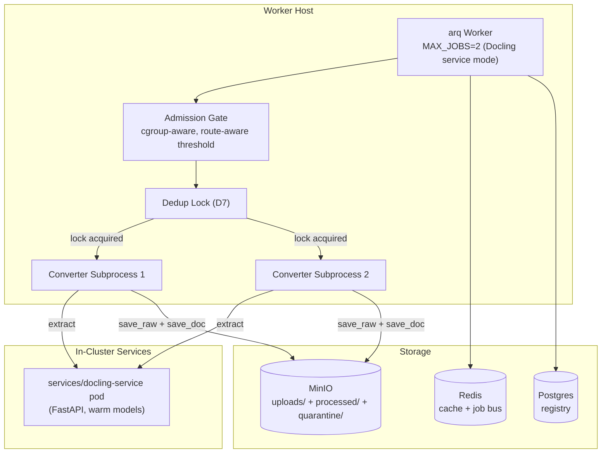

<!-- Space: CITRA -->
<!-- Title: Design Document: Pipeline Acceleration & Raw Output Persistence -->
<!-- Folder: Designs -->

---
id: "design-rfc050-pipeline-acceleration-raw-export"
title: "Design: Pipeline Acceleration & Raw Output Persistence"
type: design
status: draft
date: "2026-09-24"
tags:
  - design
  - pipeline
  - performance
  - storage
aliases:
  - "design-rfc050-pipeline-acceleration-raw-export"
governs:
  - "[[RFC-050]]"
---

# Design Document: Pipeline Acceleration & Raw Output Persistence

## Traceability

| Artifact | Reference |
|----------|-----------|
| Governing RFC(s) | [[RFC-050]] |
| PRD / Requirements | [[PRD]] |
| Architecture Doc | [[ARCHITECTURE]] |
| Implementation Plan | [[tasks-rfc050-pipeline-acceleration-raw-export]] |

## Overview

**Current contract (2026-09-24, Iter 9 — MINIMAL scope, user decision.)** This design covers three concerns: (1) throughput — a cgroup-aware memory admission gate and a service-aware worker concurrency default, targeting the in-cluster `services/docling-service` pod; (2) a per-file dedup lock (D7, done — keyed on `sha256(filename)` since the hash cache is filename-keyed, not content-keyed) that closes an orphan-copy race before concurrency rises; and (3) persisting the tree builder's input markdown for persisted documents only (D3, slimmed), queryable via `get_document(doc_id, include="raw")`. The CLI replay (D4) and recovery method optimization (D5) from earlier iterations are **deferred** to a follow-up RFC — see their sections below, kept for reference rather than deleted.

<details><summary>Amendment history (Iter 1-8, collapsed)</summary>

Iterations 1-8 built toward a `--from-raw` CLI dry-run replay of cached extraction (D4, requiring a state sidecar and a fail-closed write-barrier overlay) and recovery method optimization (D5). Both grew substantially in scope across iterations (see each section's history) without a quantified throughput contribution, and are cut in Iter 9's MINIMAL-scope pass.

</details>

## Key Design Principles

1. **Config over code**: Throughput tuning (admission floor, MAX_JOBS) is achieved through configuration changes, not pipeline restructuring. Operators can tune without code changes.
2. **Persist the tree builder's input**: ~~Raw extraction output is saved before any normalization or tree construction, ensuring it survives pipeline failures and enables re-processing.~~ **(Amendment 2026-09-24, Iteration 6):** the markdown handed to tree construction — post-stages, post-recovery `state.md_content` — is saved at persist or reject time together with a state sidecar, so a replay can rebuild the tree without the converter. It is not pre-normalization output.
3. **Erasure completeness**: Every new storage path is added to `_ERASURE_MANIFEST` before the write path is wired, maintaining right-to-erasure compliance by construction.
4. ~~**Independence-aware concurrency**: Recovery strategies are only parallelized when provably independent. Dependent strategies preserve sequential execution.~~ **Sequential recovery (Amendment 2026-09-24, Iteration 6 — stale since Iteration 2):** recovery methods share mutable `ExtractionState` and run in GateSpec order; D5 optimizes them one by one.
5. **Backward compatibility**: All changes are additive. Existing behavior is preserved when new config knobs are at their defaults and `--from-raw` is not used.

## Launch Constraints

- Single-node k3s deployment with 7.6 GiB host RAM — `MAX_JOBS` ceiling must account for worker + system RSS.
- Remote Docling service on Scaleway — network latency adds ~2-5s per extraction but removes ~1.8 GiB RSS from the worker host.
- `_ERASURE_MANIFEST` in `storage/documents.py` must be updated atomically with the write path — never ship a write without the corresponding erasure entry.

## Architecture

### High-Level System Architecture



**(Amendment 2026-09-24, Iteration 6):** diagram label `raw/` replaced by `quarantine/` — there is no `raw/` prefix; extracted output lives under `uploads/<doc_id>/` and `quarantine/` (D3).

### Architecture Decisions

**D1: Cgroup-aware, route-aware admission threshold (RFC-050 D1) — Done (implemented 2026-09-24, uncommitted):** Two changes. (a) `available` is computed as `min(host MemAvailable, cgroup_headroom)` instead of the host value alone — `memory_admission.py:35-46` reads only `/proc/meminfo` today. `cgroup_headroom` is `memory.max − memory.current` (cgroup v2, when `memory.max` is numeric) or `memory.limit_in_bytes − memory.usage_in_bytes` (v1 fallback); if neither is readable, `available` falls back to the host value, unchanged from today. (b) The existing `_has_headroom(floor)` already accepts a configurable floor parameter; the change threads a route-aware floor value from the caller (`process_document_job`) based on `DOCLING_SERVICE_URL`: `MEM_ADMISSION_FLOOR_SERVICE_BYTES` (800 MiB) for service mode, `MEM_ADMISSION_FLOOR_BYTES` (2.2 GiB) for local. Alternative considered: a `remote_docling: bool` parameter on `wait_for_memory` — rejected in favor of passing the floor value directly. **(Amendment 2026-09-24: simplified design based on existing `floor` param)**

**D2: MAX_JOBS auto-default (RFC-050 D2) — Done (implemented 2026-09-24, uncommitted; the `pageindex_worker_max_jobs` gauge was not added — R2 AC4 deferred to Phase 3 with the worker `/metrics` scrape):** `resolve_max_jobs(raw)` in `worker/lifecycle.py` already exists with `MAX_JOBS_DEFAULT` and `MAX_JOBS_CEILING`. ~~Modify it to check `DOCLING_SERVICE_URL` and default to 2 when remote.~~ **(Amendment 2026-09-24, Iter 8, following Task 1.3's Iter 7 rule):** keep it pure. Add a `remote: bool` parameter, which the call site computes from `settings.docling_service_url`, and default to 2 when `remote` is true. Env var `PAGEINDEX_WORKER_MAX_JOBS` always takes precedence. Alternative: always default to 1 — rejected because the remote path's RSS is low enough that serial execution wastes capacity. **(Amendment 2026-09-24: leverages existing `resolve_max_jobs` function)**

**D3: Raw output storage path (RFC-050 D3) — Current contract (2026-09-24, Iter 9, slimmed):** Raw markdown is stored at `uploads/<doc_id>/<original_filename>.extracted.md` using the existing `save_raw` function, for persisted documents only. Alternative: a separate `raw/` prefix — rejected because co-locating with the upload keeps the per-document directory self-contained and simplifies erasure. Rejected documents get no markdown object at all (see [D3b](#3b-reject-reason-in-quarantine-meta-new-d3b)) — the Iteration 5-6 plan to also write `quarantine/<sha256>.extracted.md` (+ a state sidecar) is cut with D4 (deferred), which was its only consumer.

<details><summary>Amendment history (Iterations 4-6)</summary>

Iteration 4 tried `uploads/<sha256[:8]>/` for rejected documents — no erasure caller, no discovery, 32-bit collision space. Iteration 5 moved it to `quarantine/<sha256>.extracted.md` (full sha256, RFC-049's key space) via a new `save_quarantine_extracted`. Iteration 6 added a state sidecar beside it for the planned replay (D4).

</details>

**D4: From-raw re-processing (RFC-050 D4) — DEFERRED, 2026-09-24, Iter 9.** Cut from this RFC (MINIMAL scope, user decision). Follow-up option: a scratch bucket + scratch Redis db, ~3h, instead of the fail-closed read-your-writes overlay below.

<details><summary>D4 — full Iter 1-8 design, kept for the follow-up RFC (collapsed)</summary>

A CLI dry-run replay (`preprocess_client.py --from-raw`) running in the normal converter child: `converters_cli` gets replay arguments, skips `probe_conversion_route` (handshake values come from a state sidecar), and calls `index()` in replay mode, bypassing the hash-cache dedup and swapping `_convert_to_tree`'s converter dispatch for cached text and restored state. Everything after the dispatch (`prepare_tree`, `validate_tree`, `finalize_gate_and_route`, the GateSpec recovery loop, the persist methods where the verdict is computed) runs unchanged behind a write barrier — a fail-closed, in-memory read-your-writes overlay replacing the module singletons `minio_ops._minio_client`, `cache._redis_sync` and `cache._redis_async` via a context manager, restored on exit. Rejected alternatives: an HTTP `from_raw` form flag (forces a re-upload); returning before the persist methods (skips the real verdict); re-deriving state from markdown (page count, landscape pages, the pre-NFKC RTL signal aren't in the text); "record and drop" instead of read-your-writes (breaks on `save_doc`'s own visibility check); a scratch bucket (rejected then as "infrastructure, and a leak lands in real storage" — reconsidered as the Iter 9 follow-up option since the overlay's per-method emulation list turned out to be the expensive part). Iter 8 effort: 17.5-19.5h.

</details>

**D5: Recovery method optimization (RFC-050 D5) — DEFERRED, 2026-09-24, Iter 9.** Cut from this RFC (MINIMAL scope, user decision) — no quantified target; Task 1.5's stage-timing histogram (kept) gives a follow-up RFC real data to profile against.

<details><summary>D5 — Iter 1-8 design, kept for the follow-up RFC (collapsed)</summary>

Recovery methods live in `client/recovery.py` as `RecoveryMixin` — 8 async methods all mutating shared `ExtractionState`. Sequential ordering is a correctness invariant (NOT parallelizable — rejected alternative: `asyncio.gather`). Optimization targets individual method internals (profiling hotspots, reducing redundant I/O, caching intermediate results) while preserving the sequential GateSpec dispatch order.

</details>

**D3b: Reject reason in quarantine meta (RFC-050 D3b) — Done (implemented 2026-09-24, uncommitted):** See [§3b](#3b-reject-reason-in-quarantine-meta-new-d3b) below.

**D7: Per-file dedup lock (RFC-050 D7) — Done (implemented 2026-09-24, uncommitted):** See [§1b](#1b-per-file-dedup-lock-new-d7) below.

### Deployment Architecture

- **Backend**: Python 3.12, arq worker, k3s single-node
- **Database**: Postgres (registry rows)
- **Object Storage**: MinIO (uploads, processed, ~~raw,~~ figures, verdicts, quarantine) **(Amendment 2026-09-24, Iter 7: there is no `raw` prefix)**
- **Task Queue**: arq with Redis broker
- **Metrics**: Prometheus (existing `pageindex_*` namespace)

### Communication Patterns

| Pattern | Use Case | Technology |
|---------|----------|------------|
| Sync HTTP | PDF extraction | Worker → Remote Docling |
| Async job queue | Document ingestion jobs | arq + Redis |
| Object storage | Raw/processed document persistence | MinIO S3 API |
| Registry upsert | Job status tracking | Postgres |

### Sequence Diagram: Document Ingestion (Post-RFC-050)

```mermaid
sequenceDiagram
  participant W as Worker
  participant AG as Admission Gate
  participant SP as Converter Subprocess
  participant D as Remote Docling
  participant M as MinIO

  W->>AG: wait_for_memory(redis)
  AG-->>W: RSS < remote_threshold (800 MiB)
  W->>SP: spawn subprocess
  SP->>D: extract PDF → markdown
  D-->>SP: markdown
  SP->>SP: _run_stages (inside the converter)
  SP->>SP: _run_md_to_tree(md_content) → validate_tree → route
  alt TREE route
    SP->>M: save_doc(doc_id, tree_json)
    SP->>M: save_raw(doc_id, .extracted.md)
  else FLAT route
    SP->>M: save_flat_doc(doc_id, flat_json)
    SP->>M: save_raw(doc_id, .extracted.md)
  else REJECT
    SP->>M: save_quarantine(sha256, ...) — every REJECT; .meta.json carries reject_reason + all co-firing defects (D3b)
  end
  SP-->>W: result
```

**(Amendment 2026-09-24, Iter 9):** diagram slimmed — no state sidecar, no `save_quarantine_extracted` (both cut with D4, deferred). `save_raw` for `.extracted.md` runs at exactly the two persist sites shown.

## Service Contracts

### 1. Admission Gate (memory_admission.py)

**Responsibility**: Block job start until memory (host and cgroup) is sufficient for safe extraction.
**Location**: `src/pageindex_mcp/memory_admission.py`.

**Current contract (2026-09-24, Iter 9 — corrected post-review, 2026-09-24).**

<details><summary>Pre-review Iter 9 text (superseded — headroom used raw memory.current/usage_in_bytes, keyed on DOCLING_SERVICE_URL alone)</summary>

```python
def _cgroup_headroom() -> int | None:
    # cgroup v2: read memory.max and memory.current; if memory.max == "max", try v1 fallback
    # cgroup v1 fallback: memory.limit_in_bytes - memory.usage_in_bytes
    # returns None if neither is readable (caller then uses the host value alone)
    ...

def _available_bytes() -> int:
    host = _host_mem_available()          # existing /proc/meminfo read
    cg = _cgroup_headroom()
    return min(host, cg) if cg is not None else host

# _has_headroom already accepts floor param — unchanged
async def wait_for_memory(redis, *, floor: int | None = None) -> bool:
    effective_floor = floor or MEM_ADMISSION_FLOOR_BYTES
    available = _available_bytes()
    # ... calls _has_headroom(available, floor=effective_floor)
```

- Caller in `process_document_job` (`worker/job.py:184`) passes `floor=MEM_ADMISSION_FLOOR_SERVICE_BYTES` when `DOCLING_SERVICE_URL` is set.

</details>

```python
def _working_set(current: int, stat_text: str, *, v2: bool) -> int:
    # v2: parse `inactive_file` out of memory.stat; v1: `total_inactive_file`
    # working_set = current - inactive_file, mirroring kubelet's own headroom calc
    # falls back to `current` unadjusted if the stat can't be parsed
    ...

def _cgroup_headroom() -> int | None:
    # cgroup v2: read memory.max, memory.current, memory.stat; if memory.max == "max", try v1 fallback
    #   headroom = memory.max - _working_set(memory.current, memory.stat, v2=True)
    # cgroup v1 fallback: headroom = memory.limit_in_bytes - _working_set(memory.usage_in_bytes, memory.stat, v2=False)
    # returns None if neither is readable (caller then uses the host value alone)
    ...

def _available_bytes() -> int:
    host = _host_mem_available()          # existing /proc/meminfo read
    cg = _cgroup_headroom()
    return min(host, cg) if cg is not None else host

# _has_headroom already accepts floor param — unchanged
async def wait_for_memory(redis, *, floor: int | None = None) -> bool:
    effective_floor = floor or MEM_ADMISSION_FLOOR_BYTES
    available = _available_bytes()
    # ... calls _has_headroom(available, floor=effective_floor)
```

**Internal Interfaces**:
- `_has_headroom(available, floor=MEM_ADMISSION_FLOOR_BYTES)` is at `memory_admission.py:49` and is unchanged.
- `wait_for_memory` (`:72-99`) calls it at `:86`; it gains the new `floor` keyword, and `available` is now `_available_bytes()` (cgroup-aware) instead of the host-only read at `:35-46`.
- Caller in `process_document_job` (`worker/job.py:184`) passes `floor=MEM_ADMISSION_FLOOR_SERVICE_BYTES` when `config.docling_offload_configured()` is true (`DOCLING_SERVICE_URL` set AND `docling` importable — the indexer's docling converter entry exists), not on `DOCLING_SERVICE_URL` alone.
- `MEM_ADMISSION_FLOOR_SERVICE_BYTES` is a module constant beside `MEM_ADMISSION_FLOOR_BYTES` (`:23`), read via `os.getenv`.
- Cgroup headroom is computed from `working_set = current − inactive_file` (v2: `memory.stat`'s `inactive_file`; v1: `total_inactive_file`), not raw `memory.current`/`usage_in_bytes` — matching kubelet's own calculation. Falls back to the raw-usage subtraction when the stat can't be parsed.
- If host memory cannot be read, or neither cgroup file is readable, the gate still fails open (admits the job) — unchanged behavior (see Error Handling).
- Logs the selected threshold and mode (local/service) at first call, and warns at startup when `DOCLING_SERVICE_URL` is set but offload isn't configured (worker stays in local-floor mode).

### 1b. Per-File Dedup Lock (New D7)

**Responsibility**: Prevent two concurrent ingests of identical file bytes from both minting a `doc_id` (HR2 orphan-copy race).
**Location (post-review, 2026-09-24)**: new module `storage/ingest_lock.py`; acquired and released in the **parent**, `worker/subprocess_mgr.py`'s `_run_converter_subprocess`, around `_run_converter_child` — not in `index()`. Covers both callers of `_run_converter_subprocess`: the arq job (`job.py`) and `preprocess_client.py`.

<details><summary>Pre-review Iter 9 text (superseded — lock lived inside `index()`, keyed on filename content, no cancel/parent-death handling)</summary>

**Location**: new module `storage/ingest_lock.py`; wraps the existing hash-cache dedup check (`client/indexer.py:2521`) and the two `hash_cache_set` call sites (`:2234`, `:2412`). `index()` now wraps `_index_locked()`.

**Current contract (2026-09-24, Iter 9):** the hash cache is keyed by filename, not content sha256, so the lock is keyed on `sha256(filename)` too — Redis key `pageindex:ingest-lock:<sha256(filename)>`.

```python
async def acquire_dedup_lock(redis, filename: str, *, ttl_ms: int) -> str | None:
    key = f"pageindex:ingest-lock:{hashlib.sha256(filename.encode()).hexdigest()}"
    token = secrets.token_hex(16)
    ok = await redis.set(key, token, nx=True, px=ttl_ms)
    return token if ok else None

async def release_dedup_lock(redis, filename: str, token: str) -> None:
    # Lua compare-and-delete: only the holder's own token releases the lock
    key = f"pageindex:ingest-lock:{hashlib.sha256(filename.encode()).hexdigest()}"
    await redis.eval(_CAS_DEL_SCRIPT, 1, key, token)
```

**Flow:** `ttl_ms = (JOB_TIMEOUT + 60) * 1000`. Before the existing `hash_cache_get` check, acquire the lock. Holder: run the dedup check, extract if needed, `hash_cache_set`, then release via the Lua compare-and-delete in a `finally` block. Waiter: poll every 3s up to `JOB_TIMEOUT`, then re-run the dedup check — if now populated, take the dedup-skip path; otherwise proceed to extract. If Redis is unreachable, proceed unlocked and log a warning (fail-open) — availability over strict mutual exclusion. Caveats: a waiter's poll-wait counts against its own job timeout; a SIGKILLed holder (no `finally` runs) blocks other ingests of that filename until the lock's TTL expires.

</details>

**Current contract (2026-09-24, Iter 9 — corrected post-review, 2026-09-24):** the lock now lives in the parent, so a killed child (OOM/timeout) no longer strands it — the parent's own `finally` releases it regardless of how the child exited. Key is still filename-derived, since the hash cache is filename-keyed, not content-keyed: `pageindex:ingest-lock:<sha256(basename(abspath(pdf_path)))>`.

**Job deadline (2026-09-24, Iter 9, Task 1.8 — done):** the lock wait and the memory-admission wait no longer eat arq's budget unaccounted. `worker/job.py` sets `deadline = start + JOB_TIMEOUT − CHILD_GRACE_SECONDS`; the child timeout is clamped to the time remaining and the lock wait is capped at `remaining / 2`, so the child always times out before arq cancels the job. `preprocess_client.py` passes no deadline.

```python
async def acquire_dedup_lock(redis, pdf_path: str, *, ttl_ms: int) -> str | None:
    key = f"pageindex:ingest-lock:{hashlib.sha256(os.path.basename(os.path.abspath(pdf_path)).encode()).hexdigest()}"
    token = secrets.token_hex(16)
    ok = await redis.set(key, token, nx=True, px=ttl_ms)
    return token if ok else None

async def release_dedup_lock(redis, pdf_path: str, token: str) -> None:
    # Lua compare-and-delete: only the holder's own token releases the lock
    key = f"pageindex:ingest-lock:{hashlib.sha256(os.path.basename(os.path.abspath(pdf_path)).encode()).hexdigest()}"
    await redis.eval(_CAS_DEL_SCRIPT, 1, key, token)

# _run_converter_subprocess (worker/subprocess_mgr.py)
async def _run_converter_subprocess(pdf_path: str, ...):
    ttl_ms = (MAX_EFFECTIVE_TIMEOUT + KILL_GRACE_S + 60) * 1000  # upper bound; child timeout unknown pre-handshake
    max_wait_s = min(INGEST_LOCK_MAX_WAIT_S, min(CHILD_TIMEOUT, MAX_EFFECTIVE_TIMEOUT) / 2, deadline_left / 2)
    token = await acquire_dedup_lock(redis, pdf_path, ttl_ms=ttl_ms)
    try:
        if token is None:
            token = await _wait_for_lock_or_timeout(redis, pdf_path, max_wait_s)
            # expiry while still held -> raise; arq requeues, preprocess_client skips + logs error
            # (Redis unreachable -> fail open, finite socket timeouts)
        return await _run_converter_child(pdf_path, ...)
    except asyncio.CancelledError:
        if token is not None:
            await release_dedup_lock(redis, pdf_path, token)  # CAS delete, then re-raise
        raise
    finally:
        if token is not None:
            await release_dedup_lock(redis, pdf_path, token)
```

**Flow:** `ttl_ms = (MAX_EFFECTIVE_TIMEOUT + kill grace + 60) * 1000` — an upper bound, since the parent can't know the child's effective timeout before the handshake. Before spawning the child, the parent acquires the lock. Holder: runs `_run_converter_child`, releases via the Lua compare-and-delete in its own `finally`, whether the child returns, times out or is OOM-killed. Waiter: polls up to `min(INGEST_LOCK_MAX_WAIT_S, min(CHILD_TIMEOUT, MAX_EFFECTIVE_TIMEOUT) / 2, deadline_left / 2)` (`INGEST_LOCK_MAX_WAIT_S` default 900s). **Corrected post-review (PR #26, HR2 beats availability):** on expiry while another holder still owns the lock, the waiter **never proceeds unlocked** — the arq job is requeued (arq retry/defer) and `preprocess_client.py` skips the file with a logged error. A cancellation during acquire does a token compare-and-delete before re-raising. If Redis is *unreachable*, the lock fails open (proceeds unlocked, logs a warning) with finite socket/connect timeouts — arq itself depends on Redis, so blocking here buys nothing. G5 therefore holds in every case except a Redis outage. The arq deadline is recomputed after the converter handshake, so the child timeout is clamped to what actually remains. Caveats: a waiter's poll-wait still counts against the arq `JOB_TIMEOUT`; a **parent** (worker pod) death — as distinct from a child death — strands the lock until TTL expiry, since nothing external reaps it. The `ingest_dedup_lock` decision point lives in a new `_WORKER_POINTS` table (`obs/decision_points.py`), not the existing indexer-side decision table.

### 2. Raw Output Persistence (save_raw)

**Current contract (2026-09-24, Iter 9 — slimmed, MINIMAL scope):**
- **What is written.** The tree builder's input markdown (post-stages, post-recovery `state.md_content`), at exactly **two** sites, guarded by `md_content is not None` and wrapped in `try/except` → `logger.warning` (implemented — a failed sidecar write never fails the ingest):
  - `_persist_tree_result` (`client/indexer.py:2407`) and `_persist_flat_result` (`:2226`): after the existing upload `save_raw`, write `save_raw(doc_id, f"{filename}.extracted.md", md)`.
- **No state sidecar, no reject-side writes.** Both were cut with D4 (deferred, its only consumer).
- **Content types — outstanding (not implemented as of 2026-09-25).** `save_raw` (`storage/documents.py`) still uses its inline `.pdf`-or-octet-stream ternary, so `.extracted.md` is stored as `application/octet-stream`. Planned: a suffix map — `.pdf` → `application/pdf`, `.md` → `text/markdown`, anything else → `application/octet-stream` (Task 3.1).
- **Erasure.** No change — `uploads/` prefix delete already covers it.
- **Retention.** `quarantine/` (unaffected by this section — see §3b) expires after 30 days ([Property 3b](#property-3b-quarantine-expires-within-30-days-added-2026-09-24-iter-8)).

### 3b. Reject Reason in Quarantine Meta (New D3b)

**Responsibility**: Give an operator the reject reason and defect list for a rejected document without a markdown+state pair.
**Location**: `storage/documents.py`, `save_quarantine` (`:888-936`).

```python
def save_quarantine(sha256: str, payload: dict, filenames: list[str], *,
                     reject_reason: str, defects: list[str], bucket: str | None = None) -> None:
    # .meta.json now includes: {"filenames": [...], "reject_reason": reject_reason, "defects": defects}
```

Called at the two existing reject points — the `flat_garble_unrecovered` branch in `_persist_flat_result` (`:1924-1933`) and `case (False, Route.REJECT)` in `index()` (`:2762-2787`), for every reject reason (structural as well as garbling), not only the garbling defects `save_quarantine` already handles. `defects` records **all** gate defects that co-fired at the reject point, not only the one that chose the reason. The `.meta.json` key for the reason is `reject_reason` (the writer was renamed from `reason` post-review, PR #26). No new object, no new erasure key — the existing quarantine erasure (`_erase_quarantine`, `erase_quarantine`) and the 30-day TTL already cover `.meta.json` as a whole.

<details><summary>§2 amendment history (Iterations 2-8, collapsed)</summary>

**Responsibility**: Persist ~~raw extraction markdown before tree construction~~ the tree builder's input markdown, after tree construction, at persist or reject time **(Amendment 2026-09-24, Iter 7)**.

```python
# Existing function — no signature change needed
def save_raw(doc_id: str, filename: str, data: bytes) -> None:
    # Stores at uploads/<doc_id>/<filename>
```

**Internal Interfaces**:
- Called from `_persist_tree_result` and `_persist_flat_result` in `client/indexer.py`, after the existing `save_raw(doc_id, filename, file_bytes)` call that persists the raw upload. At this point `doc_id` is available (generated as `uuid4()` in the persist method). **(Amendment 2026-09-24, Iteration 2): `_run_stages` runs inside each converter function, not in `_convert_to_tree`. (Amendment 2026-09-24, Iteration 3): Moved from convergence point to persist methods — `doc_id` is not available at convergence (~L1728), only `filename` is.**
- Erasure path covered by existing `uploads/` prefix in `_ERASURE_MANIFEST`

**Reject-path companion (Added: 2026-09-24, Iteration 5):**

```python
# New, in storage/documents.py next to save_quarantine (:888-942)
def save_quarantine_extracted(sha256: str, md: bytes, *, bucket: str | None = None) -> None:
    # Stores at quarantine/<sha256>.extracted.md, content_type="text/markdown"
```

- Called at the two reject points, each wrapped in `try/except Exception` → `logger.warning` so a failed write never prevents the rejection (RFC-049 Property 12c):
  - `_persist_flat_result`, `flat_garble_unrecovered` branch (`client/indexer.py:1924-1933`), beside the existing `save_quarantine` call, before `return None`.
  - `index()`, `case (False, Route.REJECT)` (`client/indexer.py:2762-2787`), for every reject reason — outside the `first_defect in {GARBLING, NODE_GARBLING}` guard that limits `save_quarantine`.
- Uses the full `sha256` computed in `index()`, the same key as `save_quarantine`. A separate function (not a new `save_quarantine` kwarg) because non-garbling rejects write `.extracted.md` without a quarantine payload.
- Erasure: `_erase_quarantine` (`storage/documents.py:612-629`) and `erase_quarantine` (`:945-966`) each gain a third `_remove_object_idempotent` call for `quarantine/{sha256}.extracted.md`. `clear_quarantine` (`:969-976`) inherits it through `erase_quarantine`. The required/optional status of the quarantine manifest step is unchanged; a missing `.extracted.md` is tolerated as idempotent.
- **Never served (HR5):** no MCP tool or HTTP route reads `quarantine/`. **(Amendment 2026-09-24, Iteration 6):** the one reader is the operator CLI replay, through a CLI-only function (§3, Property 4b).

**State sidecar and `None` guard (Added: 2026-09-24, Iteration 6):**

```python
# New, helpers/ (pure functions, no I/O)
def extraction_state_snapshot(state: ExtractionState, *, pdf_classification: dict | None,
                              pre_classification: dict | None) -> dict:
    # schema_version + the RFC R3 AC5 field list; rtl_decision via dataclasses.asdict;
    # pic_results with png_bytes dropped and a per-entry has_png flag (Iter 7);
    # never flat_garble_unrecovered (a gate output, Iter 7)
def restore_extraction_state(snapshot: dict) -> tuple[dict, list[str]]:
    # -> (ExtractionState kwargs, missing_fields); never sets the guarded gate fields
```

- Persist methods: after the `.extracted.md` write, `save_raw(doc_id, f"{filename}.extracted.state.json", json_bytes)`; `save_raw`'s content-type map also gains `".json": "application/json"`. **(Amendment 2026-09-24, Iter 7):** there is no content-type map today — `save_raw` (`storage/documents.py:838-854`) uses an inline `.pdf`-or-octet-stream ternary; D3 replaces it with a suffix→content-type map (`.pdf`, `.md`, `.json`).
- **(Amendment 2026-09-24, Iter 7) Never restored:** `flat_garble_unrecovered` joins the guarded gate fields on the never-snapshot list. It is an output of the flat garble check (set in `_persist_flat_result`, `client/indexer.py:1924`; raised on in `index()` at `:2702`); restoring it would decide the outcome before the gate runs.
- **(Amendment 2026-09-24, Iter 7) `has_png`:** each `pic_results` entry keeps `has_png`. The bytes matter to the verdict: `_enrich_image_blocks` (`images.py:298-302`) sets `figure_path` only with bytes, `compute_image_enrichment_ratio` (`helpers/verdict.py:36-63`) counts it, and the flat `compute_verdict` (`:2025`) reads the ratio; `splice_figure_markers` (`pictures.py:1489`) and `_add_vlm_descriptions` (`pictures.py:1719-1725`) also read them. Replay reloads `figures/<doc_id>/fig-<idx>.png` for stored documents; a rejected document or missing figure gets a non-empty placeholder and an `approximate` report.
- Reject points: `save_quarantine_extracted(sha256, md: bytes, state: bytes | None = None, *, bucket=None)` writes `quarantine/<sha256>.extracted.md` and, when given, `quarantine/<sha256>.extracted.state.json`.
- All four sites are skipped when `state.md_content is None` — `.md`/`.markdown`/`.txt` inputs, the LibreOffice `page_index` route, the all-converters-failed `page_index` fallback (`client/indexer.py:1199-1231`).
- ~~`pdf_classification` and `pre_classification` are `index()` parameters; `_persist_tree_result` already reads `pdf_classification` for the verdict (`client/indexer.py:2316-2320`). Thread both to any site where they are not in scope.~~ **(Amendment 2026-09-24, Iter 7):** both persist methods already take `pdf_classification`; neither takes `pre_classification`. Add keyword `pre_classification=None` to `_persist_flat_result` (`:1743-1754`) and `_persist_tree_result` (`:2289-2302`); their only callers are in `index()`. The `index()` REJECT site has both in scope.

</details>

### 3. From-Raw Re-Processing Path

**DEFERRED (2026-09-24, Iter 9). Cut from this RFC** (MINIMAL scope, user decision). The full Iter 6-8 replay contract is kept below, collapsed, for a follow-up RFC — including the rejected sketches, so the same dead ends aren't re-explored. Follow-up option: replace the fail-closed read-your-writes overlay with a scratch bucket + scratch Redis db (real writes to a disposable store), ~3h instead of the ~17.5-19.5h overlay spec below.

<details><summary>§3 — full Iter 1-8 design, kept for the follow-up RFC (collapsed)</summary>

**(Superseded 2026-09-24, Iteration 6 — see "Replay contract" below.)** ~~**Responsibility**: Skip PDF extraction when cached raw output exists.~~ The sketch below had the wrong signature — the real one is `_process_one(sem: asyncio.Semaphore, file: Path, run_id: str) -> None` (`preprocess_client.py:154`), and it takes a local file, not a `doc_id`.

```python
# New flag in preprocess_client.py
def _process_one(path, *, from_raw: bool = False) -> dict:
    # If from_raw: check MinIO for raw output, skip extraction if found
```

**Internal Interfaces**:
- ~~Reads from MinIO `uploads/<doc_id>/<filename>.extracted.md` **(Amendment 2026-09-24, Iteration 5: was `.raw.md`, stale since the Iteration 2 rename)**~~
- ~~Falls back to full extraction if raw output not found~~
- ~~Records `provenance.extraction_source = "raw_cache"` in metadata~~ — no `provenance` field exists in meta, the registry or `_META_FIELDS`

**Replay contract — Current contract (2026-09-24, Iter 8):**

**Responsibility**: Rebuild, gate and grade a stored or rejected document from its cached extraction, report the result, and write nothing. A host-only operator CLI (the container image does not ship `preprocess_client.py`).

- **Entry.** `preprocess_client.py --from-raw (--doc-id <id> | --sha256 <sha>) [--no-recovery] [--no-text] [--allow-non-zdr]`.
- **`_replay_one` (parent), in order:**
  1. **LLM tier check (HR3).** Print `OPENAI_BASE_URL` and the resolved LLM tier, and exit 1 on a non-ZDR tier unless `--allow-non-zdr` is given.
  2. **Look up the cache.** `load_extracted(doc_id)` or `load_quarantine_replay(sha256)`. If nothing is found, exit 2 `no_raw_cache` before spawning anything. This covers `None` inputs, pre-D3 documents and expired quarantine.
  3. **Fetch into a temp dir (HR2).** Fetch everything into a `tempfile.TemporaryDirectory` context manager, which is removed on every exit, including a child crash, a timeout and `KeyboardInterrupt`. The original upload is the single `uploads/<doc_id>/` key without an `.extracted.*` suffix; more than one is exit 1.
  4. **Spawn the child.** Call `_run_converter_subprocess(..., replay=ReplayArgs(...))`, where `ReplayArgs` carries `original_doc_id`.
  5. **Print the report.** Any child failure, including argparse's exit 2, maps to exit 1.

  `_replay_one` never references `_upsert_registry_row` or `save_doc_meta` (static check, Task 5.3). With `replay` set, `_run_converter_subprocess` skips `_mirror_bridged_set` and `_mirror_bridged_incr` (including the SIGKILL `converter_child_oom_total` increment, `worker/subprocess_mgr.py:483-485`). In-process Prometheus gauges are exempt. No `decision()` records are emitted.
- **Child.**
  - `converters_cli` takes the replay arguments. Its positional `input_path` is always the temp `.extracted.md`. With replay arguments it skips `probe_conversion_route`, and `index(replay=ReplayInput(...))` bypasses the `os.path.isfile` check (`client/indexer.py:2495-2496`) and the hash-cache dedup (`:2521`).
  - `ReplayInput` carries the markdown, the restored state, the original filename, the sha256, the path to the original (or `None`) and `original_doc_id`. `file_bytes=b""` when there is no original.
  - `_convert_to_tree` swaps its converter dispatch for the cached text. Everything from `prepare_tree` on runs unchanged, including the persist methods, where the verdict is computed.
- **Handshake.** The child writes the handshake line the parent reads first (`worker/subprocess_mgr.py:309-372`). Replay skips conversion, so the Docling chunk multiplier would only inflate the timeout. The child therefore emits `is_docling_route=true` and the sidecar's chunk count only when recovery is on and an original exists (recovery may reconvert); otherwise it emits `false` / `chunk_count=1`. The sidecar's classifications are logged either way.
- **Figures.** For `pic_results` entries with `has_png`, reload `figures/<original_doc_id>/fig-<idx>.png` (a read; the overlay passes it through) into the restored `pic_results` before `_apply_picture_enrichment`. The child's freshly minted `uuid4` is never used to look up figures. A rejected document or a missing figure gets a non-empty placeholder and an `approximate` report.
- **Write barrier: fail-closed read-your-writes overlay.**
  - **Install.** A context manager, entered in `converters_cli` before `index()` and exited after it, sets these module singletons and restores them on exit:
    - `storage.minio_ops._minio_client` → `MinioOverlay(make_minio(...))`
    - `cache._redis_sync` → `RedisOverlay(redis.from_url(..., decode_responses=True))`
    - `cache._redis_async` → `AsyncRedisBlocked()`

    None of the accessors (`storage/minio_ops.py:61-91`, `cache.py:39-47`, `:63-70`) is `lru_cache`d; each is a lazy global. Setting the global means every caller sees the overlay, including `from ..storage import save_figure` (`images.py:34`), and `get_minio()`'s `bucket_exists`/`make_bucket` branch (a real write) never runs.
  - **Emulated methods** (applied to the in-memory layer):
    - MinIO: `put_object`, `remove_object`, `stat_object`, `get_object`, `list_objects`, `fget_object`.
    - Redis: `get`, `set`, `setex`, `delete`, `expire`, `hget`, `hset`, `hdel`, `hgetall`.
  - **Read-only pass-through:** `bucket_exists` and other attributes that are named explicitly and never mutate.
  - **Everything else raises `ReplayWriteBlocked`.** That includes `copy_object`, `eval`, `incr` and `presigned_get_object`. A missed method is a test failure, not a real write.
  - **Read semantics:**
    - A key written in-process is read from the layer.
    - A removed key is a tombstone: `stat_object`/`get_object` raise `S3Error` with `code="NoSuchKey"`, and Redis returns `None`.
    - A key never touched in-process is read from the real store, read-only.
    - `get_object` returns a fake response with `.read()`, `.close()` and `.release_conn()`.
    - `list_objects` returns the real listing minus tombstones plus overlay keys, as objects with `.object_name`.
    - Redis values are `str` in and out (`decode_responses=True`).
    - One `threading.Lock` guards the layer (writes run via `asyncio.to_thread`).
  - **Async Redis.** The child never calls `get_async_redis` (its callers are server-, job- and query-side), so it gets a stub that raises on every call, not an emulation.
- **Recovery.** A stored document with recovery on and an original runs recovery as normal. `--no-recovery`, a rejected document or a missing original skip:
  - the GateSpec loop
  - the flat-route Surya density fallback
  - the flat-route VLM garble fallback (`vlm_extract_markdown`, `client/indexer.py` ~1821-1880)
  - the image post-validation fallback

  The report lists each as a would-be trigger.
- **Report.** The header says the report contains document content. It has:
  - `extraction_source: raw_cache`
  - `approximate`, with the missing fields
  - the tree outline
  - the gate result and defects
  - the route
  - the verdict
  - the recovery outcome
  - the overlay's recorded writes
  - the count of LLM calls
  - `OPENAI_BASE_URL` and the resolved tier
  - the structural diff against the stored output, keyed on `--doc-id` / `--sha256`

  `--no-text` drops node text and the text diff and keeps structure, gate, route, verdict and diff counts.

<details><summary>§3 replay contract amendment history (Iterations 6-7)</summary>

**Replay contract (Added: 2026-09-24, Iteration 6):**

**Responsibility**: Rebuild, gate and grade a stored or rejected document from its cached extraction, report the result, and write nothing.

```python
# preprocess_client.py (parent, operator CLI)
#   --from-raw --doc-id <doc_id> | --from-raw --sha256 <sha256>  [--no-recovery]
async def _replay_one(sem: asyncio.Semaphore, *, doc_id: str | None, sha256: str | None,
                      recovery: bool, run_id: str) -> int:  # exit code
    # 1. fetch into a temp dir: <name>.extracted.md, <name>.extracted.state.json,
    #    the original filename, and (doc_id + recovery) the original upload
    # 2. _run_converter_subprocess(..., replay=ReplayArgs(...))
    # 3. print the report + structural diff; exit 0 / 1 (error) / 2 (no_raw_cache)

# storage/documents.py — the only readers of the cache
def load_extracted(doc_id: str) -> tuple[str, bytes, bytes | None] | None: ...
    # (filename, md, state) from uploads/<doc_id>/
def load_quarantine_replay(sha256: str) -> tuple[bytes, bytes | None, dict | None, list[str]] | None: ...
    # (md, state, quarantine/<sha256>.json payload if any, filenames); CLI-only (Property 4b)

# client/indexer.py
async def index(self, file_path, ..., replay: ReplayInput | None = None): ...
    # replay set: skip the hash-cache dedup; take sha256 from the replay input when there
    # are no original bytes; _convert_to_tree swaps its converter dispatch for
    # replay.md_content + restore_extraction_state(replay.state)
```

- **Child side.** `converters_cli` gains the replay arguments; with them it skips `probe_conversion_route` (`converters/docling_conv.py:381`, called at `converters_cli.py:139`) and takes `pdf_classification` / `pre_classification` from the sidecar. `ReplayInput` carries the original filename, because `ext` decides the image `GarbleConfig` and whether `validate_tree` gets a `page_count`. **(Amendment 2026-09-24, Iter 7):** the positional `input_path` (`converters_cli.py:103-110`) is always the temp `.extracted.md`; `index()` skips its `os.path.isfile` check (~~`client/indexer.py:2491-2492`~~ `:2495-2496` — **Iter 8**) when `replay` is set and passes `file_bytes=b""` when there is no original. Because the probe is skipped, the child emits the handshake line the parent reads first (`worker/subprocess_mgr.py:309-365`) ~~from the sidecar's classifications, so chunk count and timeout match the original run~~ **(Iter 8: superseded — see the current contract, handshake bullet)**.
- ~~**Write barrier.** Before `index()`, the replay child wraps the MinIO client, the Redis client and the registry connection so that every mutating call is recorded in the report and not executed; reads pass through. The persist methods then run unchanged, so the verdict (`compute_verdict` at `client/indexer.py:2316` for trees, `:2025` for flat), flat-route construction and picture enrichment behave as in a real ingest. The `uuid4` they mint is thrown away.~~
- **Write barrier — in-memory read-your-writes overlay (Amendment 2026-09-24, Iter 7; user decision).** "Record and drop" fails on the first save: `save_doc` / `save_flat_doc` confirm each write with `stat_object` (`storage/documents.py:97-108`, `:162-173`) and raise `PersistenceNotVisibleError` when it is missing, and the verdict sidecar reads before writing (`storage/verdict.py:38,93`). ~~Before `index()`, the replay child wraps the **clients returned by** `storage.minio_ops.get_minio()`, sync `cache.get_cache_redis()` and async `cache.get_async_redis()`.~~ **(Iter 8: superseded — the overlay replaces the module singletons; see the current contract.)** Mutating calls are recorded and applied to an in-memory layer; later reads and `stat` calls in the same child see that layer first and fall through to the real store read-only. Nothing reaches a real store, and the layer dies with the child. The persist methods then run unchanged, so the verdict (`compute_verdict` at `client/indexer.py:2316` for trees, `:2025` for flat), flat-route construction and picture enrichment behave as in a real ingest.
- **Registry and parent-side writes (Amendment 2026-09-24, Iter 7).** The child never writes the registry: it returns `registry_fields` in its stdout JSON (`client/indexer.py:2254-2286`, `:2430-2461`), and the parent upserts via `_upsert_registry_row` (`worker/registry_mirror.py:136-315`, called at `preprocess_client.py:201`). `_replay_one` never calls it, and `_run_converter_subprocess` skips its `_mirror_bridged_set` Redis write when `replay` is set.
- **Identity (Amendment 2026-09-24, Iter 7).** The persist path mints a fresh `uuid4` (`client/indexer.py:2304`, `images.py:205`); it is thrown away. The report and diff are keyed on the `--doc-id` / `--sha256` argument.
- **LLM cost (Amendment 2026-09-24, Iter 7).** The barrier blocks writes, not LLM calls: replay makes the `_run_md_to_tree` summary calls and, on the flat route, `_generate_flat_doc_description`, plus any recovery calls. The report counts them. Replay has the same token cost as the tree-build and persist stages of a real ingest.
- **Recovery.** Stored document, recovery on: `file_path` is the fetched original, so the GateSpec loop, `_reconvert_and_revalidate` (`client/indexer.py:590-617`) and the image post-validation fallback run as normal (replay also sets that branch's `img_bytes` from the original). `--no-recovery`, a rejected document or a missing original: the loop is not entered, the flat-route Surya density fallback is skipped, and the report lists the gate defects that would have triggered recovery. Recovery's LLM/OCR calls use the normal routing (HR3).
- **Report.** `extraction_source: raw_cache`; `approximate` plus the missing sidecar fields; tree outline; gate result and all defects; route; verdict and reason; recovery outcome; the blocked writes; and a structural diff (titles, hierarchy, node text, page indices) against `processed/<doc_id>.json` / `.flat.json`, or `quarantine/<sha256>.json` when one exists. `summary` and `doc_description` are left out of the diff (LLM output). Nothing goes to `processed/*.meta.json`.
- **No cache.** No `.extracted.md` → exit 2 with `no_raw_cache`; the replay never falls back to extraction.

</details>

</details>

### 4. MCP Query Tool: get_document(doc_id, include="raw")

**Responsibility**: Expose raw extraction output through the existing `get_document` MCP tool.

**Current contract (2026-09-24, Iter 9 — reversed from the Iter 7 sixth-tool plan):**

Implemented shape (`tools/documents.py`): `include` is an optional string, default `""`. `include="raw"` does **not** replace the response — it **adds** a `raw_markdown` field to the normal `get_document` JSON. Any other value returns the tool's usual `{"error": ...}` JSON.

```python
@mcp.tool()
async def get_document(doc_id: str, include: str = "") -> str:  # JSON string, as before
    if include not in ("", "raw"):
        return json.dumps({"error": f"Invalid include value: {include!r}. Supported: '', 'raw'"})
    ...  # existing document response built into `result`
    if include == "raw":
        md = load_extracted_md(doc_id)          # storage.documents; None if absent
        if md is None:
            result.update({"raw_markdown": None, "raw_markdown_note": "..."})  # e.g. legacy doc
        else:
            result.update({"raw_markdown": md})
    return json.dumps(result)
```

**Scope:** `doc_id` only — persisted documents only. `load_extracted_md` lists `uploads/<doc_id>/*.extracted.md` and never touches `quarantine/`, so a rejected document's sha256 (or any other string) returns not-found. Rejected-document output stays unserved (HR5) — trivially, since D3 (Iter 9) never writes it in the first place.

**Frozen surfaces (unchanged by this design):**
- `FROZEN_SURFACE["tools"]` (`scripts/gates/source_invariants.py:501-507`, five names) is **not** modified — `get_document` already exists; only its signature gains an optional parameter, which is not a facade-frozen surface concern.
- `load_extracted_md` is imported from `storage.documents` directly and is not added to the storage package's frozen `__all__` (35 names, `source_invariants.py:461`).
- `DESIGN.md` continues to document 5 registered tools plus 2 planned (`compare_tiers`, `find_clause_across_docs`); `get_document`'s entry gains the `include` parameter (Task 3.4).

<details><summary>Amendment history</summary>

Iteration 5 scoped a new `get_raw_output(doc_id)` tool to persisted documents only. Iter 7-8 made it a sixth registered MCP tool, requiring a `FROZEN_SURFACE["tools"]` update. **(Iter 9, reversed):** folded into `get_document(doc_id, include="raw")` instead — cheaper than growing the frozen tool surface, and the MCP contract stays at five tools.

</details>

## Data Models

### Storage Layout (MinIO additions)

**Current contract (2026-09-24, Iter 9 — slimmed):**

```
uploads/<doc_id>/
  <original_filename>               # raw upload (existing)
  <original_filename>.extracted.md  # post-stages markdown (NEW — RFC-050 D3; persisted documents only)
processed/<doc_id>.json             # tree JSON (existing)
processed/<doc_id>.flat.json        # flat JSON (existing)
processed/<doc_id>.meta.json        # metadata (existing)
quarantine/<sha256>.json            # rejected payload (existing, RFC-049; garbling rejects only)
quarantine/<sha256>.meta.json       # filenames + reject_reason + defects (RFC-049 existing object;
                                     #   reject_reason/defects fields NEW — RFC-050 D3b, Iter 9)
```

No state sidecar and no `quarantine/*.extracted.*` objects (cut, Iter 9 — their only consumer, D4, is deferred).

`quarantine/` carries a 30-day MinIO lifecycle expiration (prefix filter `quarantine/`), covering both object kinds above. It is RFC-049 Task 7.5c, implemented by RFC-050 Task 3.6; see [D6](../rfcs/050-pipeline-acceleration-raw-export.md#decision-summary) and [Property 3b](#property-3b-quarantine-expires-within-30-days-added-2026-09-24-iter-8).

### Configuration Additions

```python
MEM_ADMISSION_FLOOR_SERVICE_BYTES: int = 800 * 1024 * 1024  # 800 MiB
# MEM_ADMISSION_FLOOR_BYTES remains at ~2.2 GiB (existing)
# MAX_JOBS default: 2 if config.docling_offload_configured(), else 1  (post-review fix, 2026-09-24)
```

### Erasure Note

`uploads/` already covers `*.extracted.md` since raw files are stored under `uploads/<doc_id>/`. The existing `_ERASURE_MANIFEST` entry handles erasure without a new entry. **(Iter 9):** there is no reject-side `.extracted.*` object to erase (cut with D4) — D3b adds fields to `quarantine/<sha256>.meta.json`, an object the existing quarantine erasure already removes whole. No new erasure surface anywhere in this RFC. **Backups (Phase 6, operator work, not in code; user decision 2026-09-24):** only `uploads/` (so `.extracted.md` rides along) and the Postgres registry are backed up, nightly, 30-day retention; HR2 reaches them through an erasure ledger of erased `doc_id`/sha256 replayed against any restore before it is served — see ARCHITECTURE.md § Compliance.

**Post-review fix (2026-09-24):** the doc-name recovery helper (used to reconstruct a document's original filename from its stored object keys, e.g. for erasure logging/audit) SHALL strip the `.extracted.md` suffix in addition to its existing known suffixes — covering the sidecar-only case where `uploads/<doc_id>/` still holds `<filename>.extracted.md` but the original `<filename>` upload has already been removed (or never persisted). Without this, recovery would return a filename carrying the `.extracted.md` suffix for that case.

### Content-Type Fix

The existing `save_raw` function (`storage/documents.py:838-854`) uses an inline `.pdf`-or-octet-stream ternary. When called with `<filename>.extracted.md`, it sets `application/octet-stream` — semantically wrong. Replace it with a suffix → content-type map: `.pdf` → `application/pdf`, `.md` → `text/markdown`, default `application/octet-stream` (Task 3.1 — **outstanding**: the ternary is still in place as of 2026-09-25). **(Iter 9):** no `.json` entry needed — the state sidecar that would have used it is cut.

## Correctness Properties

### Property 1: Admission Gate Route Selection

*For any* worker startup with `DOCLING_SERVICE_URL` set, the admission gate SHALL use `MEM_ADMISSION_FLOOR_SERVICE_BYTES` (800 MiB). *For any* startup without it, SHALL use `MEM_ADMISSION_FLOOR_BYTES` (2.2 GiB).

**Validates: Requirements 1, 2**

### Property 2: Raw Output Persistence Completeness

**Current contract (2026-09-24, Iter 9 — slimmed):** *For any* persisted document (TREE or FLAT route) whose `state.md_content` is not `None` at persist time, the pipeline SHALL write `<filename>.extracted.md` under `uploads/<doc_id>/`. The write happens at exactly two sites: the two persist methods. A failed write never changes the route or blocks persistence. *For any* document whose `md_content` is `None`, no such object is written. *For any* rejected document, no `.extracted.md` is ever written (see [Property 8](#property-8-reject-metadata-completeness-added-2026-09-24-iter-9) instead).

<details><summary>Property 2 amendment history (Iterations 2-6)</summary>

*For any* document that completes extraction (regardless of subsequent tree/flat/reject routing), the post-stages markdown SHALL be persisted to MinIO. Persist-method paths use `save_raw(doc_id, f"{filename}.extracted.md", state.md_content.encode("utf-8"))`. Rejection paths ~~(`Route.REJECT`, `flat_garble_unrecovered`) use `save_raw(sha256[:8], ...)`~~ **(Amendment 2026-09-24, Iteration 5)** use `save_quarantine_extracted(sha256, state.md_content.encode("utf-8"))` → `quarantine/<sha256>.extracted.md` at `_persist_flat_result`'s `flat_garble_unrecovered` branch (`client/indexer.py:1924-1933`) and `index()`'s `case (False, Route.REJECT)` (`:2762-2787`, every reject reason) — since `doc_id` is never generated for rejected documents. A failed reject-path write never prevents the rejection. Total: 4 call sites (2 persist + 2 reject). **(Amendment 2026-09-24, Iteration 2): Updated — save_raw captures post-stages markdown, not pre-stages raw extraction output. (Amendment 2026-09-24, Iteration 3): Moved from convergence point to persist methods. (Amendment 2026-09-24, Iteration 4): Added reject-path coverage — rejected docs bypass persist methods~~, need explicit save_raw with sha256[:8] as key~~ (Iter 8: struck — the key moved to `quarantine/<sha256>` in Iteration 5).** **(Amendment 2026-09-24, Iteration 6):** each of the four sites also writes the state sidecar, and all four are skipped when `state.md_content is None` — "completes extraction" excludes the direct-markdown and `page_index` routes that never set it.

</details>

**Validates: Requirement 3**

### Property 3: Erasure Cascade Completeness

*For any* document with a persisted raw output, `delete_doc(doc_id)` SHALL remove the raw output file. After deletion, zero files SHALL remain under the document's MinIO prefix. *For any* rejected document, `erase_quarantine(sha256)` — and `delete_doc` of a later-persisted document with the same bytes, via `ctx.sha256` — SHALL leave zero of `quarantine/<sha256>.json` and `.meta.json` (the latter now carrying D3b's `reject_reason`/`defects` fields, which are removed with the whole object; no separate key). Retention is bounded at 30 days — see Property 3b.

**Validates: Requirement 3 (AC3)**

### Property 3b: Quarantine Expires Within 30 Days (Added: 2026-09-24, Iter 8)

*For any* bucket the pipeline writes `quarantine/` objects to, the bucket's lifecycle configuration SHALL contain a rule with prefix filter `quarantine/` and an expiration of at most 30 days. Applying the rule SHALL be idempotent and SHALL keep every other lifecycle rule on the bucket. So every `quarantine/<sha256>.json`, `.meta.json`, `.extracted.md` and `.extracted.state.json` is gone within 30 days of its write (plus MinIO's scan interval), with or without an erasure request. This implements RFC-049 R4 AC5 / Property 12a / Task 7.5c; the D6 supersession is reversed.

**Validates: Requirement 3 (AC6), HR5**

### Property 3a: Rejected Output Is Never Served (Added: 2026-09-24, Iteration 5)

**Current contract (2026-09-24, Iter 9 — trivial, kept as a regression guard):** *For any* string `k` that is not the `doc_id` of a persisted document — including a rejected document's sha256 — `get_document(k, include="raw")` SHALL return not-found, and no MCP tool or HTTP route SHALL read from `quarantine/`. This is now trivially true rather than load-bearing: since D3 (Iter 9) never writes reject-side markdown, there is nothing for a rejected sha256 to leak. Kept as a regression guard (a future PR re-adding reject-side writes without re-checking this property would be caught by the test).

**Validates: Requirement 3 (AC4), HR5**

### Property 8: Reject Metadata Completeness (Added: 2026-09-24, Iter 9)

*For any* document that reaches a reject point (the `flat_garble_unrecovered` branch or `case (False, Route.REJECT)`), `quarantine/<sha256>.meta.json` SHALL contain a non-empty `reject_reason` and a `defects` list reflecting the actual gate defects at that point. A failed write is logged and never blocks the rejection.

**Validates: Requirement 3 (D3b)**

### Property 4: From-Raw Equivalence

**DEFERRED (2026-09-24, Iter 9).** Cut from this RFC with D4/R4 (deferred). Kept below for the follow-up RFC.

~~*For any* document processed via `--from-raw`, the tree/flat output SHALL be identical to processing the same raw markdown through the full pipeline (extraction skipped, all subsequent stages preserved). Two separate threading paths must be supported: (a) `preprocess_client.py` CLI → subprocess (2-layer); (b) HTTP → arq → subprocess (4-layer). State reconstruction at `_convert_to_tree` must set ~10+ state fields beyond `md_content` — stored metadata or synthesis required. **(Amendment 2026-09-24, Iteration 4): Added two-path acknowledgement and state reconstruction note.**~~

**(Amendment 2026-09-24, Iteration 6):** *For any* persisted document whose state sidecar exists, a replay with recovery disabled (or not triggered) SHALL produce the same tree structure — titles, hierarchy, node text, page indices — gate result and defect set, route, and verdict as the stored run. `summary` and `doc_description` are excluded: `_run_md_to_tree` asks the LLM for them (`client/indexer.py:2912-2968`), so they differ from run to run. Tests stub the LLM, which makes the whole output byte-identical. The old wording ("identical to the full pipeline", all stages preserved) could not hold: it also re-ran normalization stages on post-stages text (RFC NG6).

**Validates: Requirement 4 (AC1, AC2)**

### Property 4a: Replay Writes Nothing (Added: 2026-09-24, Iteration 6)

**DEFERRED (Iter 9).**

*For any* replay — persisted or rejected, recovery on or off, any route or verdict — the MinIO, Redis and registry clients SHALL receive zero executed mutating calls, and every stored object SHALL be byte-identical before and after.

**(Amendment 2026-09-24, Iter 7):** "executed" means reaching a real store. In the child, mutating calls land in the in-memory overlay (§3) and are visible to later reads in that child, so the persist path completes without `PersistenceNotVisibleError`. In the parent, `_upsert_registry_row` and `_mirror_bridged_set` SHALL NOT be called. The test spies on both processes, and a replay through each persist method that raises `PersistenceNotVisibleError` fails the test.

**(Amendment 2026-09-24, Iter 8):**
- **Scope.** The property covers the document stores: MinIO, Redis and the Postgres registry. In-process Prometheus gauges and counters in the parent are exempt.
- **Parent spy.** It covers `_upsert_registry_row`, `save_doc_meta`, `_mirror_bridged_set` and `_mirror_bridged_incr`; none may be called.
- **Child spy.** It asserts that the overlay is installed on all three singletons (§3) and that calling a non-emulated method (e.g. Redis `eval`, MinIO `copy_object`) raises `ReplayWriteBlocked`. After the child exits, the real singletons are restored.

**Validates: Requirement 4 (AC3), HR5**

### Property 4b: Quarantine Is Read Only by the Operator CLI (Added: 2026-09-24, Iteration 6)

**DEFERRED (Iter 9).**

The quarantine replay reader SHALL live in `storage/documents.py`, the only file `check_quarantine_prefix_confined` allows to hold the prefix, and SHALL have no non-test caller other than `preprocess_client.py`. No MCP tool, HTTP route or worker job SHALL reach it.

**Validates: Requirement 4 (AC5), HR5**

### Property 5: Recovery Optimization Equivalence

**DEFERRED (2026-09-24, Iter 9).** Cut from this RFC with D5/R5 (deferred). Kept below for the follow-up RFC.

*For any* recovery method optimized in D5, the optimized version SHALL produce identical output to the baseline version for representative documents. The sequential GateSpec dispatch order SHALL be preserved.

**(Amendment 2026-09-24, Iteration 2): Redefined from "Recovery Independence" — parallelization is infeasible (shared mutable `ExtractionState`). Property now validates that optimization does not alter method behavior.**

**Validates: Requirement 5**

### Property 6: MAX_JOBS Ceiling

*For any* configuration, `MAX_JOBS` SHALL never exceed 4, regardless of the value requested.

**Validates: Requirement 2 (AC3)**

### Property 7: Dedup Lock Mutual Exclusion (Added: 2026-09-24, Iter 9)

*For any* two concurrent ingests of identical file bytes (same filename), at most one SHALL mint a `doc_id` and persist; the other SHALL take the dedup-skip path once it observes the winner's hash-cache entry. *For any* single ingest with no contention, behavior is unchanged (lock acquired and released without a waiter). *For any* waiter whose wait budget expires while the lock is still held (including a holder whose parent died without releasing), the waiter SHALL NOT run the converter unlocked: the arq job is requeued and `preprocess_client` skips the file with a logged error; the stranded lock clears at TTL expiry. *Only* if Redis itself is unreachable does the pipeline fail open and proceed unlocked (bounded by finite socket timeouts) — the one case the property does not cover.

**Validates: Requirement 6**

## Error Handling

### Service-Specific Error Handling

**Admission Gate:**
- ~~Host RSS cannot be read → Fall back to `MEM_ADMISSION_FLOOR_BYTES` (conservative), log warning~~ **(Amendment 2026-09-24, Iter 8):** host memory cannot be read → the gate fails open and admits the job, as it does today (`worker/job.py:183`: "Fails open (proceeds) on any error"). The change does not alter this.
- Redis connection lost during memory check → Retry with exponential backoff (existing behavior)
- No headroom after `MEM_ADMISSION_MAX_WAIT_S` (default 120s) → fail open and admit. The gate is **best-effort admission** (a floor check whose lock is released before the job runs), not a guarantee a pod stays inside its limit; the cgroup limit is the hard cap and can still OOM-kill the worker.

**Raw Output Persistence:**
- MinIO write fails for raw output → Log error, continue with pipeline (raw output is diagnostic, not load-bearing for tree construction)
- Raw file exceeds 50 MB → Log warning, persist anyway

**Dedup Lock (New, Iter 9):**
- Lock cannot be acquired within the wait budget (holder still running, or its parent died) → never proceed unlocked: arq job requeued, `preprocess_client` skips the file and logs an error
- Redis unreachable → fail open (proceed unlocked, log a warning), bounded by finite socket timeouts
- Waiter acquires the lock after the holder released it, cache is now populated → dedup-skip path
- Waiter acquires the lock, cache still empty (holder failed before persisting) → proceed to extract as the new holder

**Reject Metadata (New D3b, Iter 9):**
- Write to `quarantine/<sha256>.meta.json` fails → log a warning, the document is still rejected (RFC-049 Property 12c) — reason/defects are diagnostic, not load-bearing

**From-Raw Path — DEFERRED (Iter 9):** the full Iter 6-8 error-handling list (no cache → `no_raw_cache`; corrupted UTF-8; missing state sidecar → `approximate`; write-barrier semantics; HR2/HR3 safeguards; exit code mapping) is kept in RFC-050's history and design §3 for the follow-up RFC that revives D4.

**Quarantine lifecycle (Added: Iter 8):**
- Applying the rule fails (MinIO error, lifecycle API unsupported) → log an error and continue. Startup or ingest is not blocked. The Task 3.6 check (`get_bucket_lifecycle()` shows the rule) reports it as missing.

**Recovery ~~Parallelization~~ Optimization (Amendment 2026-09-24, Iteration 6 — stale since Iteration 2):**
- ~~One concurrent recovery task raises an exception → Captured by `return_exceptions=True`, does not cancel siblings~~
- ~~All concurrent recovery tasks fail → Fall through to next recovery tier (existing behavior)~~
- Recovery stays sequential (D5); an optimized method that raises is handled exactly as the unoptimized one was

## Testing Strategy

### Testing Layers

**Current contract (2026-09-24, Iter 9):**

1. **Property-Based Tests (PBT)**: Verify Properties 1, 2, 3, 3a (trivial), 3b, 6, 7, 8 across randomized inputs. Properties 4, 4a, 4b, 5 are deferred with D4/D5.
2. **Unit Tests**: cgroup-aware admission gate, `wait_for_memory` threshold selection, MAX_JOBS default logic, dedup lock acquire/release/timeout, raw output file naming, D3b reject-metadata fields.
3. **Integration Tests**: `save_raw` → `delete_doc` erasure, concurrent-ingest dedup lock, quarantine TTL rule application.
4. **Corpus Validation**: 16-document ingestion, baseline (local Docling, `MAX_JOBS=1`) vs. post (in-cluster docling service, `MAX_JOBS=2`), G1 protocol.

### Property-Based Testing Configuration

- **Library**: Hypothesis
- **Minimum iterations**: 100 per property
- **Deadline**: 5000ms per example

### Test Categories

**Current contract (2026-09-24, Iter 9):**

| Component | PBT Properties | Unit Tests | Integration Tests |
|-----------|----------------|------------|-------------------|
| Admission Gate | 1, 6 | threshold selection, cgroup v1/v2/unreadable, mode detection | worker startup with env vars |
| Dedup Lock | 7 | acquire/release, CAS release, stuck-lock timeout | concurrent-ingest, one `doc_id` minted |
| Raw Persistence | 2, 3 | file naming, `save_raw` call, content-type map | save → delete cascade (2 sites only) |
| Reject Metadata (D3b) | 8 | `reject_reason`/`defects` fields written, best-effort on failure | forced reject → fields present in `.meta.json` |
| Quarantine TTL | 3b | lifecycle rule present, prefix `quarantine/`, ≤30 days, idempotent, other rules kept | — |

**Test-only coverage.** R1 AC3 (log threshold/mode) has no correctness property and is covered by tests alone (Task 1.4). R2 AC4 (`pageindex_worker_max_jobs` gauge) is **deferred to Phase 3, not implemented** (user decision 2026-09-24, lands with the worker `/metrics` scrape). G1 / Task 1.5 (stage timing histogram and `decision()` record) is covered by its unit test and the Task 9.1/9.2 measurement; the histogram is `pageindex_stage_duration_seconds{stage=extraction|tree_build|recovery}` (non-overlapping stages, one `stage_duration` decision record per stage per doc) — **open item:** it is not visible on `/metrics` today (worker `/metrics` isn't scraped and the Redis metric bridge carries scalars only), so logs (parsed by `make g1-timings`) remain the source for G1 attribution until the Phase 3 worker scrape. **LLM concurrency cap — deferred open item (user decision 2026-09-24):** `pageindex` is a site-packages dependency (not vendored) whose `page_index_md.py` fans node summaries out via `asyncio.gather` with no semaphore, so bursts double at `MAX_JOBS=2`; revisit only if `make g1-timings` shows 429/retry lines (fix = fork change or client-side limiter).

<details><summary>Deferred (Iter 9) — From-Raw Path / Recovery Loop rows, kept for the follow-up RFC</summary>

| Component | PBT Properties | Unit Tests | Integration Tests |
|-----------|----------------|------------|-------------------|
| From-Raw Path | 4, 4a, 4b | flag parsing, `no_raw_cache`, quarantine-reader gate | replay round-trip with an LLM stub and a zero-write spy; forced-reject replay by sha256 |
| Recovery Loop | 5 | per-method timing, dispatch order unchanged | optimized vs baseline output |
| Replay safeguards | 4a (fail-closed) | `ReplayWriteBlocked` on a non-emulated method; singletons restored; temp dir removed after a forced crash; non-ZDR refusal and `--allow-non-zdr`; `--no-text`; ambiguous original → exit 1; child exit mapping | parent spy: no `_upsert_registry_row`, `save_doc_meta`, `_mirror_bridged_*` |

</details>

### Key Test Scenarios

**Critical Path Tests:**
1. In-cluster-Docling worker starts with MAX_JOBS=2, processes 2 documents concurrently, both succeed
2. Document ingested → raw output persisted → document deleted → zero files remain
3. Two concurrent ingests of identical bytes → exactly one `doc_id` minted, the other dedup-skips
4. Forced reject → `quarantine/<sha256>.meta.json` has `reject_reason` and `defects`; TTL rule still expires it within 30 days

**Edge Cases:**
- MAX_JOBS set to 10 → clamped to 4 with warning
- Raw output write fails → pipeline continues, tree/flat output still produced
- `.md`/`.txt` input or the LibreOffice/all-converters-failed `page_index` route → no `.extracted.md` written, no exception
- Dedup lock holder's parent dies mid-extraction → waiter's bounded wait expires → arq requeue / `preprocess_client` skip with a logged error; a later attempt acquires once the lock's TTL lapses
- Non-garbling reject reason (e.g. a structural gate failure, not RFC-049's garbling defects) → still gets `reject_reason`/`defects` in `.meta.json` via D3b, even though `save_quarantine`'s `.json` payload is garbling-only

<details><summary>Deferred (Iter 9) — replay edge cases, kept for the follow-up RFC</summary>

`--from-raw` on a `.txt` input or pre-D3 document → `no_raw_cache`; `--sha256` on a rejected document → recovery off, would-be triggers listed; replay of a pre-sidecar document → `approximate`; replay through the persist methods → no `PersistenceNotVisibleError`; flat-route replay with figures → same enrichment ratio and verdict; figures reloaded under `original_doc_id`; VLM garble fallback skipped and listed under `--no-recovery`; expired quarantine → `no_raw_cache`.

</details>
