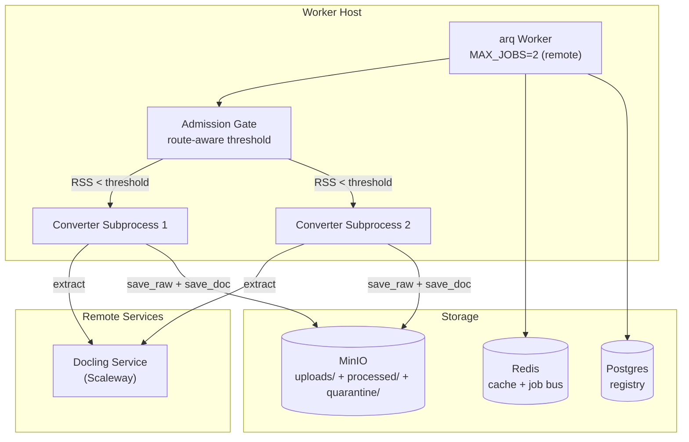
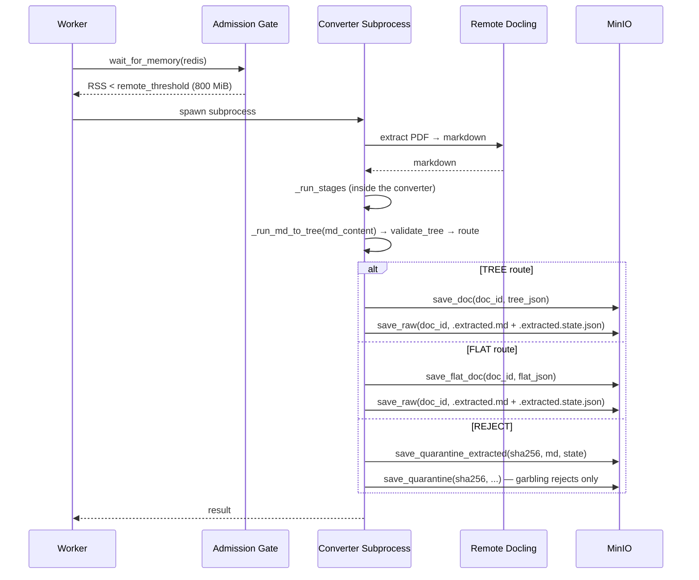

<!-- Space: CITRA -->
<!-- Title: Design Document: Pipeline Acceleration & Raw Output Persistence -->
<!-- Folder: Designs -->

---
id: "design-rfc050-pipeline-acceleration-raw-export"
title: "Design: Pipeline Acceleration & Raw Output Persistence"
type: design
status: draft
date: "2026-09-24"
tags:
  - design
  - pipeline
  - performance
  - storage
aliases:
  - "design-rfc050-pipeline-acceleration-raw-export"
governs:
  - "[[RFC-050]]"
---

# Design Document: Pipeline Acceleration & Raw Output Persistence

## Traceability

| Artifact | Reference |
|----------|-----------|
| Governing RFC(s) | [[RFC-050]] |
| PRD / Requirements | [[PRD]] |
| Architecture Doc | [[ARCHITECTURE]] |
| Implementation Plan | [[tasks-rfc050-pipeline-acceleration-raw-export]] |

## Overview

This design addresses two ~~coupled~~ related (not coupled — **Amendment 2026-09-24, Iter 7**, matching the RFC) concerns in the PageIndex ingestion pipeline: (1) throughput bottlenecks caused by a stale memory admission gate and conservative worker concurrency defaults, and (2) the absence of persisted raw extraction output. The solution tunes the admission gate for remote Docling, raises default worker concurrency, wires the existing `save_raw` storage function into the pipeline, and adds a ~~`--from-raw` re-processing path~~ CLI dry-run replay (`--from-raw`) of cached extraction for stored and rejected documents **(Amendment 2026-09-24, Iteration 6)**. ~~Recovery loop parallelization provides an additional latency reduction for documents requiring multiple recovery attempts.~~ Recovery method optimization (D5, redefined in Iteration 2) reduces recovery latency without changing the sequential dispatch order.

## Key Design Principles

1. **Config over code**: Throughput tuning (admission floor, MAX_JOBS) is achieved through configuration changes, not pipeline restructuring. Operators can tune without code changes.
2. **Persist the tree builder's input**: ~~Raw extraction output is saved before any normalization or tree construction, ensuring it survives pipeline failures and enables re-processing.~~ **(Amendment 2026-09-24, Iteration 6):** the markdown handed to tree construction — post-stages, post-recovery `state.md_content` — is saved at persist or reject time together with a state sidecar, so a replay can rebuild the tree without the converter. It is not pre-normalization output.
3. **Erasure completeness**: Every new storage path is added to `_ERASURE_MANIFEST` before the write path is wired, maintaining right-to-erasure compliance by construction.
4. ~~**Independence-aware concurrency**: Recovery strategies are only parallelized when provably independent. Dependent strategies preserve sequential execution.~~ **Sequential recovery (Amendment 2026-09-24, Iteration 6 — stale since Iteration 2):** recovery methods share mutable `ExtractionState` and run in GateSpec order; D5 optimizes them one by one.
5. **Backward compatibility**: All changes are additive. Existing behavior is preserved when new config knobs are at their defaults and `--from-raw` is not used.

## Launch Constraints

- Single-node k3s deployment with 7.6 GiB host RAM — `MAX_JOBS` ceiling must account for worker + system RSS.
- Remote Docling service on Scaleway — network latency adds ~2-5s per extraction but removes ~1.8 GiB RSS from the worker host.
- `_ERASURE_MANIFEST` in `storage/documents.py` must be updated atomically with the write path — never ship a write without the corresponding erasure entry.

## Architecture

### High-Level System Architecture



**(Amendment 2026-09-24, Iteration 6):** diagram label `raw/` replaced by `quarantine/` — there is no `raw/` prefix; extracted output lives under `uploads/<doc_id>/` and `quarantine/` (D3).

### Architecture Decisions

**D1: Route-aware admission threshold (RFC-050 D1):** The existing `_has_headroom(floor)` in `memory_admission.py` already accepts a configurable floor parameter. The change threads a route-aware floor value from the caller (`process_document_job`) based on `DOCLING_SERVICE_URL`: 800 MiB for remote, 2.2 GiB for local. Alternative considered: adding a `remote_docling: bool` parameter to `wait_for_memory` — rejected because passing the floor value directly is simpler and more flexible. **(Amendment 2026-09-24: simplified design based on existing `floor` param)**

**D2: MAX_JOBS auto-default (RFC-050 D2):** `resolve_max_jobs(raw)` in `worker/lifecycle.py` already exists with `MAX_JOBS_DEFAULT` and `MAX_JOBS_CEILING`. ~~Modify it to check `DOCLING_SERVICE_URL` and default to 2 when remote.~~ **(Amendment 2026-09-24, Iter 8, following Task 1.3's Iter 7 rule):** keep it pure. Add a `remote: bool` parameter, which the call site computes from `settings.docling_service_url`, and default to 2 when `remote` is true. Env var `PAGEINDEX_WORKER_MAX_JOBS` always takes precedence. Alternative: always default to 1 — rejected because the remote path's RSS is low enough that serial execution wastes capacity. **(Amendment 2026-09-24: leverages existing `resolve_max_jobs` function)**

**D3: Raw output storage path (RFC-050 D3):** Raw markdown is stored at `uploads/<doc_id>/<original_filename>.extracted.md` (~~`.raw.md`~~ — **Amendment 2026-09-24, Iteration 5**: stale suffix corrected) using the existing `save_raw` function. Alternative: a separate `raw/` prefix — rejected because co-locating with the upload keeps the per-document directory self-contained and simplifies erasure. **(Amendment 2026-09-24, Iteration 5):** rejected documents have no `doc_id`, so their markdown goes to `quarantine/<sha256>.extracted.md` via a new `save_quarantine_extracted` — co-located with RFC-049's quarantine objects under the same full-sha256 key, erased by the same two functions, and unserved. Rejected alternative: `uploads/<sha256[:8]>/` (Iteration 4) — no erasure caller, no discovery, 32-bit collision space.

**D4: From-raw re-processing (RFC-050 D4, P2):** ~~A `--from-raw` flag that must traverse 4 layers: `preprocess_client.py` CLI → HTTP `POST /upload/files` → arq job metadata → converter subprocess → `_convert_to_tree`. Each layer needs to thread the flag. Alternative: a local-only reprocessing script that calls the indexer directly — considered but deferred as it bypasses the job queue's error handling and retry logic. **(Amendment 2026-09-24: reclassified P2, effort revised 4h→8-10h due to cross-layer complexity)**~~

**(Amendment 2026-09-24, Iteration 6):** the chain above was wrong — `preprocess_client.py` never calls HTTP; its `_process_one(sem, file, run_id)` (`preprocess_client.py:154`) drives the same `_run_converter_subprocess` (`worker/subprocess_mgr.py:243`) as the arq job. The 8-10h figure was also stale against the RFC's Iteration 4 estimate of 12-16h. **Decision: a CLI dry-run replay.** It runs in the normal converter child (NG1): `converters_cli` gets replay arguments, skips `probe_conversion_route` (handshake values come from the state sidecar) and calls `index()` in replay mode, which bypasses the hash-cache dedup and swaps `_convert_to_tree`'s converter dispatch for the cached text and restored state. Everything after the dispatch — `prepare_tree`, `validate_tree`, `finalize_gate_and_route`, the GateSpec recovery loop, and the persist methods, where the verdict is computed — runs unchanged behind a write barrier. Alternatives rejected: (a) an HTTP `from_raw` form flag — `POST /upload/files` takes file bytes, so it forces a re-upload, and a `POST /reprocess/{doc_id}` route adds a job type and re-persist rules (RFC NG5); (b) returning before the persist methods — that skips the verdict, flat-route construction and the RFC-047 Surya density fallback, which all live inside them; (c) re-deriving state from markdown — page count, landscape pages and the pre-NFKC RTL signal are not in the text. Effort ~~13-15h~~ 14.5-16.5h (RFC Wave 3; **Iter 7**: +1.5h for the read-your-writes overlay). **(Amendment 2026-09-24, Iter 7):** the barrier is an in-memory overlay over the MinIO and Redis clients (§3), not "record and drop" — the persist methods read back their own writes. Rejected: stubbing `_confirm_write_visible` (every future read-after-write breaks replay again) and a scratch bucket (infrastructure, and a leak lands in real storage). **(Amendment 2026-09-24, Iter 8):**
- **Install.** The overlay replaces the module singletons (`minio_ops._minio_client`, `cache._redis_sync`, `cache._redis_async`) through a context manager, not the accessor functions.
- **Fail-closed.** Non-emulated methods raise `ReplayWriteBlocked`.
- **Host-only.** The replay is a host-only operator CLI: the container image ships no `preprocess_client.py`.
- **Effort** 17.5-19.5h. All four are specified in §3.

**D5: Recovery method optimization (RFC-050 D5, P2):** Recovery methods live in `client/recovery.py` as `RecoveryMixin` — 8 async methods all mutating shared `ExtractionState`. Sequential ordering is a correctness invariant (NOT parallelizable). Optimization targets individual method internals (profiling hotspots, reducing redundant I/O, caching intermediate results) while preserving the sequential GateSpec dispatch order. Alternative: parallelization via `asyncio.gather` — rejected because all 8 methods share mutable `ExtractionState` with sequential ordering as a correctness invariant. **(Amendment 2026-09-24: added actual module location and method names) (Amendment 2026-09-24, Iteration 3: redefined from parallelization to optimization — shared mutable state makes parallelization infeasible; reclassified P1→P2)**

### Deployment Architecture

- **Backend**: Python 3.12, arq worker, k3s single-node
- **Database**: Postgres (registry rows)
- **Object Storage**: MinIO (uploads, processed, ~~raw,~~ figures, verdicts, quarantine) **(Amendment 2026-09-24, Iter 7: there is no `raw` prefix)**
- **Task Queue**: arq with Redis broker
- **Metrics**: Prometheus (existing `pageindex_*` namespace)

### Communication Patterns

| Pattern | Use Case | Technology |
|---------|----------|------------|
| Sync HTTP | PDF extraction | Worker → Remote Docling |
| Async job queue | Document ingestion jobs | arq + Redis |
| Object storage | Raw/processed document persistence | MinIO S3 API |
| Registry upsert | Job status tracking | Postgres |

### Sequence Diagram: Document Ingestion (Post-RFC-050)



**(Amendment 2026-09-24, Iteration 6):** diagram corrected — the extracted markdown is saved in the persist methods after tree construction (Iteration 3), not before `_run_stages`; `save_quarantine` is keyed by sha256, not `doc_id`; the state sidecar is new in this iteration.

## Service Contracts

### 1. Admission Gate (memory_admission.py)

**Responsibility**: Block job start until host memory is sufficient for safe extraction.
**Location**: `src/pageindex_mcp/memory_admission.py` (NOT `worker/job.py`). **(Amendment 2026-09-24: corrected location)**

```python
# _has_headroom already accepts floor param — leverage it
async def wait_for_memory(redis, *, floor: int | None = None) -> bool:
    effective_floor = floor or MEM_ADMISSION_FLOOR_BYTES
    # ... calls _has_headroom(floor=effective_floor)
```

**Internal Interfaces**:
- Caller in `process_document_job` passes `floor=MEM_ADMISSION_FLOOR_REMOTE_BYTES` when `DOCLING_SERVICE_URL` is set
- `_has_headroom(floor)` already exists — no new parameter needed on that function
- Logs selected threshold at first call
- **(Amendment 2026-09-24, Iter 8):** `_has_headroom(available, floor=MEM_ADMISSION_FLOOR_BYTES)` is at `memory_admission.py:49`. `wait_for_memory` (`:72-99`) calls it at `:86` without `floor`; the new `floor` keyword on `wait_for_memory` is passed through there. `MEM_ADMISSION_FLOOR_REMOTE_BYTES` is a module constant beside `MEM_ADMISSION_FLOOR_BYTES` (`:23`), read via `os.getenv`. The file is `src/pageindex_mcp/memory_admission.py`; there is no `worker/memory_admission.py`. The single caller is `worker/job.py:184`.

### 2. Raw Output Persistence (save_raw)

**Current contract (2026-09-24, Iter 8):**
- **What is written.** The tree builder's input markdown (post-stages, post-recovery `state.md_content`) and a state sidecar, at four sites, each guarded by `md_content is not None` and wrapped in `try/except` → `logger.warning`:
  - `_persist_tree_result` (`client/indexer.py:2407`) and `_persist_flat_result` (`:2226`): after the existing upload `save_raw`, write `save_raw(doc_id, f"{filename}.extracted.md", md)` and `save_raw(doc_id, f"{filename}.extracted.state.json", state_json)`.
  - The `flat_garble_unrecovered` branch in `_persist_flat_result` (`:1924-1933`) and `case (False, Route.REJECT)` in `index()` (`:2762-2787`, every reject reason): `save_quarantine_extracted(sha256, md, state)` writes `quarantine/<sha256>.extracted.md` and `.extracted.state.json`, and emits the new `quarantine_extracted_write` decision event.
- **Content types.** `save_raw` replaces its inline `.pdf`-or-octet-stream ternary with a suffix map: `.pdf` → `application/pdf`, `.md` → `text/markdown`, `.json` → `application/json`, anything else → `application/octet-stream`.
- **Snapshot helpers.** `extraction_state_snapshot` / `restore_extraction_state` in `helpers/` cover the R3 AC5 field list. They never include the guarded gate fields or `flat_garble_unrecovered`, and they keep `has_png` on each `pic_results` entry. Both persist methods gain the keyword `pre_classification=None`.
- **Erasure.** `_erase_quarantine` and `erase_quarantine` remove four exact keys.
- **Retention.** `quarantine/` expires after 30 days ([Property 3b](#property-3b-quarantine-expires-within-30-days-added-2026-09-24-iter-8)).

<details><summary>§2 amendment history (Iterations 2-7)</summary>

**Responsibility**: Persist ~~raw extraction markdown before tree construction~~ the tree builder's input markdown, after tree construction, at persist or reject time **(Amendment 2026-09-24, Iter 7)**.

```python
# Existing function — no signature change needed
def save_raw(doc_id: str, filename: str, data: bytes) -> None:
    # Stores at uploads/<doc_id>/<filename>
```

**Internal Interfaces**:
- Called from `_persist_tree_result` and `_persist_flat_result` in `client/indexer.py`, after the existing `save_raw(doc_id, filename, file_bytes)` call that persists the raw upload. At this point `doc_id` is available (generated as `uuid4()` in the persist method). **(Amendment 2026-09-24, Iteration 2): `_run_stages` runs inside each converter function, not in `_convert_to_tree`. (Amendment 2026-09-24, Iteration 3): Moved from convergence point to persist methods — `doc_id` is not available at convergence (~L1728), only `filename` is.**
- Erasure path covered by existing `uploads/` prefix in `_ERASURE_MANIFEST`

**Reject-path companion (Added: 2026-09-24, Iteration 5):**

```python
# New, in storage/documents.py next to save_quarantine (:888-942)
def save_quarantine_extracted(sha256: str, md: bytes, *, bucket: str | None = None) -> None:
    # Stores at quarantine/<sha256>.extracted.md, content_type="text/markdown"
```

- Called at the two reject points, each wrapped in `try/except Exception` → `logger.warning` so a failed write never prevents the rejection (RFC-049 Property 12c):
  - `_persist_flat_result`, `flat_garble_unrecovered` branch (`client/indexer.py:1924-1933`), beside the existing `save_quarantine` call, before `return None`.
  - `index()`, `case (False, Route.REJECT)` (`client/indexer.py:2762-2787`), for every reject reason — outside the `first_defect in {GARBLING, NODE_GARBLING}` guard that limits `save_quarantine`.
- Uses the full `sha256` computed in `index()`, the same key as `save_quarantine`. A separate function (not a new `save_quarantine` kwarg) because non-garbling rejects write `.extracted.md` without a quarantine payload.
- Erasure: `_erase_quarantine` (`storage/documents.py:612-629`) and `erase_quarantine` (`:945-966`) each gain a third `_remove_object_idempotent` call for `quarantine/{sha256}.extracted.md`. `clear_quarantine` (`:969-976`) inherits it through `erase_quarantine`. The required/optional status of the quarantine manifest step is unchanged; a missing `.extracted.md` is tolerated as idempotent.
- **Never served (HR5):** no MCP tool or HTTP route reads `quarantine/`. **(Amendment 2026-09-24, Iteration 6):** the one reader is the operator CLI replay, through a CLI-only function (§3, Property 4b).

**State sidecar and `None` guard (Added: 2026-09-24, Iteration 6):**

```python
# New, helpers/ (pure functions, no I/O)
def extraction_state_snapshot(state: ExtractionState, *, pdf_classification: dict | None,
                              pre_classification: dict | None) -> dict:
    # schema_version + the RFC R3 AC5 field list; rtl_decision via dataclasses.asdict;
    # pic_results with png_bytes dropped and a per-entry has_png flag (Iter 7);
    # never flat_garble_unrecovered (a gate output, Iter 7)
def restore_extraction_state(snapshot: dict) -> tuple[dict, list[str]]:
    # -> (ExtractionState kwargs, missing_fields); never sets the guarded gate fields
```

- Persist methods: after the `.extracted.md` write, `save_raw(doc_id, f"{filename}.extracted.state.json", json_bytes)`; `save_raw`'s content-type map also gains `".json": "application/json"`. **(Amendment 2026-09-24, Iter 7):** there is no content-type map today — `save_raw` (`storage/documents.py:838-854`) uses an inline `.pdf`-or-octet-stream ternary; D3 replaces it with a suffix→content-type map (`.pdf`, `.md`, `.json`).
- **(Amendment 2026-09-24, Iter 7) Never restored:** `flat_garble_unrecovered` joins the guarded gate fields on the never-snapshot list. It is an output of the flat garble check (set in `_persist_flat_result`, `client/indexer.py:1924`; raised on in `index()` at `:2702`); restoring it would decide the outcome before the gate runs.
- **(Amendment 2026-09-24, Iter 7) `has_png`:** each `pic_results` entry keeps `has_png`. The bytes matter to the verdict: `_enrich_image_blocks` (`images.py:298-302`) sets `figure_path` only with bytes, `compute_image_enrichment_ratio` (`helpers/verdict.py:36-63`) counts it, and the flat `compute_verdict` (`:2025`) reads the ratio; `splice_figure_markers` (`pictures.py:1489`) and `_add_vlm_descriptions` (`pictures.py:1719-1725`) also read them. Replay reloads `figures/<doc_id>/fig-<idx>.png` for stored documents; a rejected document or missing figure gets a non-empty placeholder and an `approximate` report.
- Reject points: `save_quarantine_extracted(sha256, md: bytes, state: bytes | None = None, *, bucket=None)` writes `quarantine/<sha256>.extracted.md` and, when given, `quarantine/<sha256>.extracted.state.json`.
- All four sites are skipped when `state.md_content is None` — `.md`/`.markdown`/`.txt` inputs, the LibreOffice `page_index` route, the all-converters-failed `page_index` fallback (`client/indexer.py:1199-1231`).
- ~~`pdf_classification` and `pre_classification` are `index()` parameters; `_persist_tree_result` already reads `pdf_classification` for the verdict (`client/indexer.py:2316-2320`). Thread both to any site where they are not in scope.~~ **(Amendment 2026-09-24, Iter 7):** both persist methods already take `pdf_classification`; neither takes `pre_classification`. Add keyword `pre_classification=None` to `_persist_flat_result` (`:1743-1754`) and `_persist_tree_result` (`:2289-2302`); their only callers are in `index()`. The `index()` REJECT site has both in scope.

</details>

### 3. From-Raw Re-Processing Path

**(Superseded 2026-09-24, Iteration 6 — see "Replay contract" below.)** ~~**Responsibility**: Skip PDF extraction when cached raw output exists.~~ The sketch below had the wrong signature — the real one is `_process_one(sem: asyncio.Semaphore, file: Path, run_id: str) -> None` (`preprocess_client.py:154`), and it takes a local file, not a `doc_id`.

```python
# New flag in preprocess_client.py
def _process_one(path, *, from_raw: bool = False) -> dict:
    # If from_raw: check MinIO for raw output, skip extraction if found
```

**Internal Interfaces**:
- ~~Reads from MinIO `uploads/<doc_id>/<filename>.extracted.md` **(Amendment 2026-09-24, Iteration 5: was `.raw.md`, stale since the Iteration 2 rename)**~~
- ~~Falls back to full extraction if raw output not found~~
- ~~Records `provenance.extraction_source = "raw_cache"` in metadata~~ — no `provenance` field exists in meta, the registry or `_META_FIELDS`

**Replay contract — Current contract (2026-09-24, Iter 8):**

**Responsibility**: Rebuild, gate and grade a stored or rejected document from its cached extraction, report the result, and write nothing. A host-only operator CLI (the container image does not ship `preprocess_client.py`).

- **Entry.** `preprocess_client.py --from-raw (--doc-id <id> | --sha256 <sha>) [--no-recovery] [--no-text] [--allow-non-zdr]`.
- **`_replay_one` (parent), in order:**
  1. **LLM tier check (HR3).** Print `OPENAI_BASE_URL` and the resolved LLM tier, and exit 1 on a non-ZDR tier unless `--allow-non-zdr` is given.
  2. **Look up the cache.** `load_extracted(doc_id)` or `load_quarantine_replay(sha256)`. If nothing is found, exit 2 `no_raw_cache` before spawning anything. This covers `None` inputs, pre-D3 documents and expired quarantine.
  3. **Fetch into a temp dir (HR2).** Fetch everything into a `tempfile.TemporaryDirectory` context manager, which is removed on every exit, including a child crash, a timeout and `KeyboardInterrupt`. The original upload is the single `uploads/<doc_id>/` key without an `.extracted.*` suffix; more than one is exit 1.
  4. **Spawn the child.** Call `_run_converter_subprocess(..., replay=ReplayArgs(...))`, where `ReplayArgs` carries `original_doc_id`.
  5. **Print the report.** Any child failure, including argparse's exit 2, maps to exit 1.

  `_replay_one` never references `_upsert_registry_row` or `save_doc_meta` (static check, Task 5.3). With `replay` set, `_run_converter_subprocess` skips `_mirror_bridged_set` and `_mirror_bridged_incr` (including the SIGKILL `converter_child_oom_total` increment, `worker/subprocess_mgr.py:483-485`). In-process Prometheus gauges are exempt. No `decision()` records are emitted.
- **Child.**
  - `converters_cli` takes the replay arguments. Its positional `input_path` is always the temp `.extracted.md`. With replay arguments it skips `probe_conversion_route`, and `index(replay=ReplayInput(...))` bypasses the `os.path.isfile` check (`client/indexer.py:2495-2496`) and the hash-cache dedup (`:2521`).
  - `ReplayInput` carries the markdown, the restored state, the original filename, the sha256, the path to the original (or `None`) and `original_doc_id`. `file_bytes=b""` when there is no original.
  - `_convert_to_tree` swaps its converter dispatch for the cached text. Everything from `prepare_tree` on runs unchanged, including the persist methods, where the verdict is computed.
- **Handshake.** The child writes the handshake line the parent reads first (`worker/subprocess_mgr.py:309-372`). Replay skips conversion, so the Docling chunk multiplier would only inflate the timeout. The child therefore emits `is_docling_route=true` and the sidecar's chunk count only when recovery is on and an original exists (recovery may reconvert); otherwise it emits `false` / `chunk_count=1`. The sidecar's classifications are logged either way.
- **Figures.** For `pic_results` entries with `has_png`, reload `figures/<original_doc_id>/fig-<idx>.png` (a read; the overlay passes it through) into the restored `pic_results` before `_apply_picture_enrichment`. The child's freshly minted `uuid4` is never used to look up figures. A rejected document or a missing figure gets a non-empty placeholder and an `approximate` report.
- **Write barrier: fail-closed read-your-writes overlay.**
  - **Install.** A context manager, entered in `converters_cli` before `index()` and exited after it, sets these module singletons and restores them on exit:
    - `storage.minio_ops._minio_client` → `MinioOverlay(make_minio(...))`
    - `cache._redis_sync` → `RedisOverlay(redis.from_url(..., decode_responses=True))`
    - `cache._redis_async` → `AsyncRedisBlocked()`

    None of the accessors (`storage/minio_ops.py:61-91`, `cache.py:39-47`, `:63-70`) is `lru_cache`d; each is a lazy global. Setting the global means every caller sees the overlay, including `from ..storage import save_figure` (`images.py:34`), and `get_minio()`'s `bucket_exists`/`make_bucket` branch (a real write) never runs.
  - **Emulated methods** (applied to the in-memory layer):
    - MinIO: `put_object`, `remove_object`, `stat_object`, `get_object`, `list_objects`, `fget_object`.
    - Redis: `get`, `set`, `setex`, `delete`, `expire`, `hget`, `hset`, `hdel`, `hgetall`.
  - **Read-only pass-through:** `bucket_exists` and other attributes that are named explicitly and never mutate.
  - **Everything else raises `ReplayWriteBlocked`.** That includes `copy_object`, `eval`, `incr` and `presigned_get_object`. A missed method is a test failure, not a real write.
  - **Read semantics:**
    - A key written in-process is read from the layer.
    - A removed key is a tombstone: `stat_object`/`get_object` raise `S3Error` with `code="NoSuchKey"`, and Redis returns `None`.
    - A key never touched in-process is read from the real store, read-only.
    - `get_object` returns a fake response with `.read()`, `.close()` and `.release_conn()`.
    - `list_objects` returns the real listing minus tombstones plus overlay keys, as objects with `.object_name`.
    - Redis values are `str` in and out (`decode_responses=True`).
    - One `threading.Lock` guards the layer (writes run via `asyncio.to_thread`).
  - **Async Redis.** The child never calls `get_async_redis` (its callers are server-, job- and query-side), so it gets a stub that raises on every call, not an emulation.
- **Recovery.** A stored document with recovery on and an original runs recovery as normal. `--no-recovery`, a rejected document or a missing original skip:
  - the GateSpec loop
  - the flat-route Surya density fallback
  - the flat-route VLM garble fallback (`vlm_extract_markdown`, `client/indexer.py` ~1821-1880)
  - the image post-validation fallback

  The report lists each as a would-be trigger.
- **Report.** The header says the report contains document content. It has:
  - `extraction_source: raw_cache`
  - `approximate`, with the missing fields
  - the tree outline
  - the gate result and defects
  - the route
  - the verdict
  - the recovery outcome
  - the overlay's recorded writes
  - the count of LLM calls
  - `OPENAI_BASE_URL` and the resolved tier
  - the structural diff against the stored output, keyed on `--doc-id` / `--sha256`

  `--no-text` drops node text and the text diff and keeps structure, gate, route, verdict and diff counts.

<details><summary>§3 replay contract amendment history (Iterations 6-7)</summary>

**Replay contract (Added: 2026-09-24, Iteration 6):**

**Responsibility**: Rebuild, gate and grade a stored or rejected document from its cached extraction, report the result, and write nothing.

```python
# preprocess_client.py (parent, operator CLI)
#   --from-raw --doc-id <doc_id> | --from-raw --sha256 <sha256>  [--no-recovery]
async def _replay_one(sem: asyncio.Semaphore, *, doc_id: str | None, sha256: str | None,
                      recovery: bool, run_id: str) -> int:  # exit code
    # 1. fetch into a temp dir: <name>.extracted.md, <name>.extracted.state.json,
    #    the original filename, and (doc_id + recovery) the original upload
    # 2. _run_converter_subprocess(..., replay=ReplayArgs(...))
    # 3. print the report + structural diff; exit 0 / 1 (error) / 2 (no_raw_cache)

# storage/documents.py — the only readers of the cache
def load_extracted(doc_id: str) -> tuple[str, bytes, bytes | None] | None: ...
    # (filename, md, state) from uploads/<doc_id>/
def load_quarantine_replay(sha256: str) -> tuple[bytes, bytes | None, dict | None, list[str]] | None: ...
    # (md, state, quarantine/<sha256>.json payload if any, filenames); CLI-only (Property 4b)

# client/indexer.py
async def index(self, file_path, ..., replay: ReplayInput | None = None): ...
    # replay set: skip the hash-cache dedup; take sha256 from the replay input when there
    # are no original bytes; _convert_to_tree swaps its converter dispatch for
    # replay.md_content + restore_extraction_state(replay.state)
```

- **Child side.** `converters_cli` gains the replay arguments; with them it skips `probe_conversion_route` (`converters/docling_conv.py:381`, called at `converters_cli.py:139`) and takes `pdf_classification` / `pre_classification` from the sidecar. `ReplayInput` carries the original filename, because `ext` decides the image `GarbleConfig` and whether `validate_tree` gets a `page_count`. **(Amendment 2026-09-24, Iter 7):** the positional `input_path` (`converters_cli.py:103-110`) is always the temp `.extracted.md`; `index()` skips its `os.path.isfile` check (~~`client/indexer.py:2491-2492`~~ `:2495-2496` — **Iter 8**) when `replay` is set and passes `file_bytes=b""` when there is no original. Because the probe is skipped, the child emits the handshake line the parent reads first (`worker/subprocess_mgr.py:309-365`) ~~from the sidecar's classifications, so chunk count and timeout match the original run~~ **(Iter 8: superseded — see the current contract, handshake bullet)**.
- ~~**Write barrier.** Before `index()`, the replay child wraps the MinIO client, the Redis client and the registry connection so that every mutating call is recorded in the report and not executed; reads pass through. The persist methods then run unchanged, so the verdict (`compute_verdict` at `client/indexer.py:2316` for trees, `:2025` for flat), flat-route construction and picture enrichment behave as in a real ingest. The `uuid4` they mint is thrown away.~~
- **Write barrier — in-memory read-your-writes overlay (Amendment 2026-09-24, Iter 7; user decision).** "Record and drop" fails on the first save: `save_doc` / `save_flat_doc` confirm each write with `stat_object` (`storage/documents.py:97-108`, `:162-173`) and raise `PersistenceNotVisibleError` when it is missing, and the verdict sidecar reads before writing (`storage/verdict.py:38,93`). ~~Before `index()`, the replay child wraps the **clients returned by** `storage.minio_ops.get_minio()`, sync `cache.get_cache_redis()` and async `cache.get_async_redis()`.~~ **(Iter 8: superseded — the overlay replaces the module singletons; see the current contract.)** Mutating calls are recorded and applied to an in-memory layer; later reads and `stat` calls in the same child see that layer first and fall through to the real store read-only. Nothing reaches a real store, and the layer dies with the child. The persist methods then run unchanged, so the verdict (`compute_verdict` at `client/indexer.py:2316` for trees, `:2025` for flat), flat-route construction and picture enrichment behave as in a real ingest.
- **Registry and parent-side writes (Amendment 2026-09-24, Iter 7).** The child never writes the registry: it returns `registry_fields` in its stdout JSON (`client/indexer.py:2254-2286`, `:2430-2461`), and the parent upserts via `_upsert_registry_row` (`worker/registry_mirror.py:136-315`, called at `preprocess_client.py:201`). `_replay_one` never calls it, and `_run_converter_subprocess` skips its `_mirror_bridged_set` Redis write when `replay` is set.
- **Identity (Amendment 2026-09-24, Iter 7).** The persist path mints a fresh `uuid4` (`client/indexer.py:2304`, `images.py:205`); it is thrown away. The report and diff are keyed on the `--doc-id` / `--sha256` argument.
- **LLM cost (Amendment 2026-09-24, Iter 7).** The barrier blocks writes, not LLM calls: replay makes the `_run_md_to_tree` summary calls and, on the flat route, `_generate_flat_doc_description`, plus any recovery calls. The report counts them. Replay has the same token cost as the tree-build and persist stages of a real ingest.
- **Recovery.** Stored document, recovery on: `file_path` is the fetched original, so the GateSpec loop, `_reconvert_and_revalidate` (`client/indexer.py:590-617`) and the image post-validation fallback run as normal (replay also sets that branch's `img_bytes` from the original). `--no-recovery`, a rejected document or a missing original: the loop is not entered, the flat-route Surya density fallback is skipped, and the report lists the gate defects that would have triggered recovery. Recovery's LLM/OCR calls use the normal routing (HR3).
- **Report.** `extraction_source: raw_cache`; `approximate` plus the missing sidecar fields; tree outline; gate result and all defects; route; verdict and reason; recovery outcome; the blocked writes; and a structural diff (titles, hierarchy, node text, page indices) against `processed/<doc_id>.json` / `.flat.json`, or `quarantine/<sha256>.json` when one exists. `summary` and `doc_description` are left out of the diff (LLM output). Nothing goes to `processed/*.meta.json`.
- **No cache.** No `.extracted.md` → exit 2 with `no_raw_cache`; the replay never falls back to extraction.

</details>

### 4. MCP Query Tool: get_raw_output

**Responsibility**: Expose raw extraction output through the MCP query surface.

```python
@mcp.tool()
async def get_raw_output(doc_id: str) -> str:
    """Retrieve the raw markdown extracted from a document before tree construction."""
    raw = storage.load_raw(doc_id)
    if raw is None:
        raise ValueError(f"No raw output found for {doc_id}")
    return raw.decode("utf-8")
```

**Scope (Amendment 2026-09-24, Iteration 5):** `doc_id` only — persisted documents only. `load_raw` lists `uploads/<doc_id>/*.extracted.md` and never touches `quarantine/`, so a rejected document's sha256 (or any other string) returns not-found. No `list_raw_outputs` discovery tool is added. Rejected-document output is an unserved diagnostic copy (HR5), read by operators from MinIO.

**(Amendment 2026-09-24, Iter 8):**
- **Frozen tool surface.** `FROZEN_SURFACE["tools"]` (`scripts/gates/source_invariants.py:501-507`, five names) pins the tool surface. Task 3.4 adds `get_raw_output` to it in the same commit, as an RFC-sanctioned facade change.
- **Storage imports.** `load_raw` is imported from `storage.documents` and is not added to the storage package's frozen `__all__` (35 names, `source_invariants.py:461`). `('SIDECAR_VERSION',)` is `REMOVED_SURFACE["storage"]` (`:80`), not the frozen surface.
- **DESIGN.md.** It documents 5 registered tools plus 2 planned (`compare_tiers`, `find_clause_across_docs`). `get_raw_output` becomes the sixth registered tool.

## Data Models

### Storage Layout (MinIO additions)

```
uploads/<doc_id>/
  <original_filename>               # raw upload (existing)
  <original_filename>.extracted.md  # post-stages markdown (NEW — RFC-050 D3; was .raw.md)
  <original_filename>.extracted.state.json  # replay state sidecar (NEW — RFC-050 D3, Iteration 6)
processed/<doc_id>.json             # tree JSON (existing)
processed/<doc_id>.flat.json        # flat JSON (existing)
processed/<doc_id>.meta.json        # metadata (existing)
quarantine/<sha256>.json            # rejected payload (existing, RFC-049; garbling rejects only)
quarantine/<sha256>.meta.json       # filenames (existing, RFC-049)
quarantine/<sha256>.extracted.md    # rejected-doc markdown (NEW — RFC-050 D3, Iteration 5; all reject reasons)
quarantine/<sha256>.extracted.state.json  # rejected-doc state sidecar (NEW — RFC-050 D3, Iteration 6)
```

~~**(Amendment 2026-09-24, Iteration 5):** `quarantine/` has no lifecycle TTL — RFC-049's 30-day TTL is superseded by [RFC-050 D6](../rfcs/050-pipeline-acceleration-raw-export.md#decision-summary).~~ **(Amendment 2026-09-24, Iter 8; user decision, HR5):** `quarantine/` carries a 30-day MinIO lifecycle expiration (prefix filter `quarantine/`), which covers all four object kinds above. It is RFC-049 Task 7.5c, implemented by RFC-050 Task 3.6; see [D6](../rfcs/050-pipeline-acceleration-raw-export.md#decision-summary) and [Property 3b](#property-3b-quarantine-expires-within-30-days-added-2026-09-24-iter-8).

### Configuration Additions

```python
MEM_ADMISSION_FLOOR_REMOTE_BYTES: int = 800 * 1024 * 1024  # 800 MiB
# MEM_ADMISSION_FLOOR_BYTES remains at ~2.2 GiB (existing)
# MAX_JOBS default: 2 if DOCLING_SERVICE_URL set, else 1
```

### Erasure Note

`uploads/` already covers ~~`*.raw.md`~~ `*.extracted.md` since raw files are stored under `uploads/<doc_id>/`. The existing `_ERASURE_MANIFEST` entry handles erasure without a new entry. **(Amendment 2026-09-24, Iteration 5):** the reject-path object `quarantine/<sha256>.extracted.md` needs no new manifest entry either, but the existing quarantine step (`_erase_quarantine`) and the standalone `erase_quarantine` must each remove it as a third key — both delete exact keys, not a prefix. **(Amendment 2026-09-24, Iteration 6):** `uploads/<doc_id>/<filename>.extracted.state.json` is covered by the `uploads/` prefix delete; `quarantine/<sha256>.extracted.state.json` is a fourth exact key in `_erase_quarantine` and `erase_quarantine`. A replay creates nothing, so it adds no erasure surface.

### Content-Type Fix

**(Amendment 2026-09-24):** The existing `save_raw` function maps `.pdf` → `application/pdf` and defaults to `application/octet-stream`. When called with ~~`<filename>.raw.md`~~ `<filename>.extracted.md`, it will set `application/octet-stream` — semantically wrong. ~~Add `".md": "text/markdown"` to the content-type map in `save_raw`.~~ **(Amendment 2026-09-24, Iter 8, following §2's Iter 7 note):** there is no content-type map. `save_raw` (`storage/documents.py:838-854`) uses an inline `.pdf`-or-octet-stream ternary. Replace it with a suffix → content-type map: `.pdf` → `application/pdf`, `.md` → `text/markdown`, `.json` → `application/json`, default `application/octet-stream` (Task 3.1).

## Correctness Properties

### Property 1: Admission Gate Route Selection

*For any* worker startup with `DOCLING_SERVICE_URL` set, the admission gate SHALL use `MEM_ADMISSION_FLOOR_REMOTE_BYTES` (800 MiB). *For any* startup without it, SHALL use `MEM_ADMISSION_FLOOR_BYTES` (2.2 GiB).

**Validates: Requirements 1, 2**

### Property 2: Raw Output Persistence Completeness

**Current contract (2026-09-24, Iter 8):** *For any* document whose `state.md_content` is not `None` at persist or reject time, the pipeline SHALL write two objects: the markdown (`<filename>.extracted.md` under `uploads/<doc_id>/`, or `quarantine/<sha256>.extracted.md` for a rejected document) and its state sidecar (`.extracted.state.json` beside it). The writes happen at exactly four sites: the two persist methods, the `flat_garble_unrecovered` branch and `case (False, Route.REJECT)`. A failed write never changes the route or blocks the rejection. *For any* document whose `md_content` is `None`, no such object is written.

<details><summary>Property 2 amendment history (Iterations 2-6)</summary>

*For any* document that completes extraction (regardless of subsequent tree/flat/reject routing), the post-stages markdown SHALL be persisted to MinIO. Persist-method paths use `save_raw(doc_id, f"{filename}.extracted.md", state.md_content.encode("utf-8"))`. Rejection paths ~~(`Route.REJECT`, `flat_garble_unrecovered`) use `save_raw(sha256[:8], ...)`~~ **(Amendment 2026-09-24, Iteration 5)** use `save_quarantine_extracted(sha256, state.md_content.encode("utf-8"))` → `quarantine/<sha256>.extracted.md` at `_persist_flat_result`'s `flat_garble_unrecovered` branch (`client/indexer.py:1924-1933`) and `index()`'s `case (False, Route.REJECT)` (`:2762-2787`, every reject reason) — since `doc_id` is never generated for rejected documents. A failed reject-path write never prevents the rejection. Total: 4 call sites (2 persist + 2 reject). **(Amendment 2026-09-24, Iteration 2): Updated — save_raw captures post-stages markdown, not pre-stages raw extraction output. (Amendment 2026-09-24, Iteration 3): Moved from convergence point to persist methods. (Amendment 2026-09-24, Iteration 4): Added reject-path coverage — rejected docs bypass persist methods~~, need explicit save_raw with sha256[:8] as key~~ (Iter 8: struck — the key moved to `quarantine/<sha256>` in Iteration 5).** **(Amendment 2026-09-24, Iteration 6):** each of the four sites also writes the state sidecar, and all four are skipped when `state.md_content is None` — "completes extraction" excludes the direct-markdown and `page_index` routes that never set it.

</details>

**Validates: Requirement 3**

### Property 3: Erasure Cascade Completeness

*For any* document with a persisted raw output, `delete_doc(doc_id)` SHALL remove the raw output file. After deletion, zero files SHALL remain under the document's MinIO prefix. **(Amendment 2026-09-24, Iteration 5):** *For any* rejected document, `erase_quarantine(sha256)` — and `delete_doc` of a later-persisted document with the same bytes, via `ctx.sha256` — SHALL leave zero of `quarantine/<sha256>.json`, `.meta.json`, `.extracted.md`, and — **(Amendment 2026-09-24, Iteration 6)** — `.extracted.state.json`. ~~Retention is not time-bounded (RFC-049 Property 12a's 30-day TTL is superseded by RFC-050 D6).~~ **(Amendment 2026-09-24, Iter 8):** retention is bounded at 30 days. See Property 3b.

**Validates: Requirement 3 (AC3)**

### Property 3b: Quarantine Expires Within 30 Days (Added: 2026-09-24, Iter 8)

*For any* bucket the pipeline writes `quarantine/` objects to, the bucket's lifecycle configuration SHALL contain a rule with prefix filter `quarantine/` and an expiration of at most 30 days. Applying the rule SHALL be idempotent and SHALL keep every other lifecycle rule on the bucket. So every `quarantine/<sha256>.json`, `.meta.json`, `.extracted.md` and `.extracted.state.json` is gone within 30 days of its write (plus MinIO's scan interval), with or without an erasure request. This implements RFC-049 R4 AC5 / Property 12a / Task 7.5c; the D6 supersession is reversed.

**Validates: Requirement 3 (AC6), HR5**

### Property 3a: Rejected Output Is Never Served (Added: 2026-09-24, Iteration 5)

*For any* string `k` that is not the `doc_id` of a persisted document — including a rejected document's sha256 — `get_raw_output(k)` SHALL return not-found, and no MCP tool or HTTP route SHALL read from `quarantine/`.

**Validates: Requirement 3 (AC4), HR5**

### Property 4: From-Raw Equivalence

~~*For any* document processed via `--from-raw`, the tree/flat output SHALL be identical to processing the same raw markdown through the full pipeline (extraction skipped, all subsequent stages preserved). Two separate threading paths must be supported: (a) `preprocess_client.py` CLI → subprocess (2-layer); (b) HTTP → arq → subprocess (4-layer). State reconstruction at `_convert_to_tree` must set ~10+ state fields beyond `md_content` — stored metadata or synthesis required. **(Amendment 2026-09-24, Iteration 4): Added two-path acknowledgement and state reconstruction note.**~~

**(Amendment 2026-09-24, Iteration 6):** *For any* persisted document whose state sidecar exists, a replay with recovery disabled (or not triggered) SHALL produce the same tree structure — titles, hierarchy, node text, page indices — gate result and defect set, route, and verdict as the stored run. `summary` and `doc_description` are excluded: `_run_md_to_tree` asks the LLM for them (`client/indexer.py:2912-2968`), so they differ from run to run. Tests stub the LLM, which makes the whole output byte-identical. The old wording ("identical to the full pipeline", all stages preserved) could not hold: it also re-ran normalization stages on post-stages text (RFC NG6).

**Validates: Requirement 4 (AC1, AC2)**

### Property 4a: Replay Writes Nothing (Added: 2026-09-24, Iteration 6)

*For any* replay — persisted or rejected, recovery on or off, any route or verdict — the MinIO, Redis and registry clients SHALL receive zero executed mutating calls, and every stored object SHALL be byte-identical before and after.

**(Amendment 2026-09-24, Iter 7):** "executed" means reaching a real store. In the child, mutating calls land in the in-memory overlay (§3) and are visible to later reads in that child, so the persist path completes without `PersistenceNotVisibleError`. In the parent, `_upsert_registry_row` and `_mirror_bridged_set` SHALL NOT be called. The test spies on both processes, and a replay through each persist method that raises `PersistenceNotVisibleError` fails the test.

**(Amendment 2026-09-24, Iter 8):**
- **Scope.** The property covers the document stores: MinIO, Redis and the Postgres registry. In-process Prometheus gauges and counters in the parent are exempt.
- **Parent spy.** It covers `_upsert_registry_row`, `save_doc_meta`, `_mirror_bridged_set` and `_mirror_bridged_incr`; none may be called.
- **Child spy.** It asserts that the overlay is installed on all three singletons (§3) and that calling a non-emulated method (e.g. Redis `eval`, MinIO `copy_object`) raises `ReplayWriteBlocked`. After the child exits, the real singletons are restored.

**Validates: Requirement 4 (AC3), HR5**

### Property 4b: Quarantine Is Read Only by the Operator CLI (Added: 2026-09-24, Iteration 6)

The quarantine replay reader SHALL live in `storage/documents.py`, the only file `check_quarantine_prefix_confined` allows to hold the prefix, and SHALL have no non-test caller other than `preprocess_client.py`. No MCP tool, HTTP route or worker job SHALL reach it.

**Validates: Requirement 4 (AC5), HR5**

### Property 5: Recovery Optimization Equivalence

*For any* recovery method optimized in D5, the optimized version SHALL produce identical output to the baseline version for representative documents. The sequential GateSpec dispatch order SHALL be preserved.

**(Amendment 2026-09-24, Iteration 2): Redefined from "Recovery Independence" — parallelization is infeasible (shared mutable `ExtractionState`). Property now validates that optimization does not alter method behavior.**

**Validates: Requirement 5**

### Property 6: MAX_JOBS Ceiling

*For any* configuration, `MAX_JOBS` SHALL never exceed 4, regardless of the value requested.

**Validates: Requirement 2 (AC3)**

## Error Handling

### Service-Specific Error Handling

**Admission Gate:**
- ~~Host RSS cannot be read → Fall back to `MEM_ADMISSION_FLOOR_BYTES` (conservative), log warning~~ **(Amendment 2026-09-24, Iter 8):** host memory cannot be read → the gate fails open and admits the job, as it does today (`worker/job.py:183`: "Fails open (proceeds) on any error"). The change does not alter this.
- Redis connection lost during memory check → Retry with exponential backoff (existing behavior)

**Raw Output Persistence:**
- MinIO write fails for raw output → Log error, continue with pipeline (raw output is diagnostic, not load-bearing for tree construction)
- Raw file exceeds 50 MB → Log warning, persist anyway

**From-Raw Path:**
- ~~Raw output not found in MinIO → Fall back to full extraction, log info~~
- ~~Raw output corrupted (not valid UTF-8) → Fall back to full extraction, log warning~~
- **(Amendment 2026-09-24, Iteration 6):** no `.extracted.md` → exit 2, `no_raw_cache`; the replay never extracts
- Not valid UTF-8 → exit 1, the report names the object; no fallback
- State sidecar missing, or `schema_version` unknown → replay on defaults, report `approximate` with the missing fields
- Original upload missing when recovery is on → run with recovery off and say so in the report
- A mutating call reaches the write barrier → recorded, not executed, listed in the report; expected from the persist methods, so not an error **(Amendment 2026-09-24, Iter 7: applied to the in-memory overlay so read-after-write checks pass; never reaches a real store)**
- **(Added: Iter 7)** A `has_png` figure is missing from `figures/<doc_id>/`, or the document is rejected → non-empty placeholder, report `approximate`
- Child timeout or crash → handled as for a normal ingest in `_run_converter_subprocess`; exit 1
- **(Added: Iter 8)** A non-emulated overlay method is called → `ReplayWriteBlocked`; the child fails and the replay exits 1. This is a bug to fix in the overlay list, never a write.
- **(Added: Iter 8)** Non-ZDR LLM tier without `--allow-non-zdr` → exit 1 before any fetch or spawn (HR3)
- **(Added: Iter 8)** More than one non-`.extracted.*` key under `uploads/<doc_id>/` → exit 1, naming the keys
- **(Added: Iter 8)** Any exit path, including crash, timeout and `KeyboardInterrupt` → the `TemporaryDirectory` context manager removes every fetched file (HR2)
- **(Added: Iter 8)** Child argparse error (its exit 2) → the parent maps it to exit 1. Only the parent's own pre-spawn check produces exit 2 (`no_raw_cache`)
- **(Added: Iter 8)** Rejected document whose quarantine objects expired (30-day TTL) → exit 2, `no_raw_cache`

**Quarantine lifecycle (Added: Iter 8):**
- Applying the rule fails (MinIO error, lifecycle API unsupported) → log an error and continue. Startup or ingest is not blocked. The Task 3.6 check (`get_bucket_lifecycle()` shows the rule) reports it as missing.

**Recovery ~~Parallelization~~ Optimization (Amendment 2026-09-24, Iteration 6 — stale since Iteration 2):**
- ~~One concurrent recovery task raises an exception → Captured by `return_exceptions=True`, does not cancel siblings~~
- ~~All concurrent recovery tasks fail → Fall through to next recovery tier (existing behavior)~~
- Recovery stays sequential (D5); an optimized method that raises is handled exactly as the unoptimized one was

## Testing Strategy

### Testing Layers

1. **Property-Based Tests (PBT)**: Verify Properties 1-6 across randomized inputs. **(Amendment 2026-09-24, Iteration 6: plus 3a, 4a, 4b.)** **(Iter 8: plus 3b.)**
2. **Unit Tests**: Admission gate threshold selection, MAX_JOBS default logic, raw output file naming. **(Iteration 6: state snapshot round-trip, `None` guard, replay flag parsing, `no_raw_cache`.)**
3. **Integration Tests**: save_raw → delete_doc erasure, ~~from-raw re-processing path, recovery parallelization~~ replay round-trip with an LLM stub and a zero-write spy, recovery optimization **(Amendment 2026-09-24, Iteration 6)**.
4. **Corpus Validation**: 16-document re-ingestion with timing comparison.

### Property-Based Testing Configuration

- **Library**: Hypothesis
- **Minimum iterations**: 100 per property
- **Deadline**: 5000ms per example

### Test Categories

| Component | PBT Properties | Unit Tests | Integration Tests |
|-----------|----------------|------------|-------------------|
| Admission Gate | 1, 6 | threshold selection, mode detection | worker startup with env vars |
| Raw Persistence | 2, 3 | file naming, save_raw call; **(Iteration 6)** state snapshot round-trip, `None` guard | save → delete cascade; **(Iteration 6)** four-key quarantine erase |
| From-Raw Path | ~~4~~ 4, 4a, 4b | flag parsing, ~~cache hit/miss~~ `no_raw_cache`, quarantine-reader gate **(Iteration 6)** | ~~full re-processing round-trip~~ replay round-trip with an LLM stub and a zero-write spy; forced-reject replay by sha256 **(Iteration 6)** |
| Recovery Loop | 5 | ~~independence classification~~ per-method timing, dispatch order unchanged **(Iteration 6 — stale since Iteration 2)** | ~~concurrent OCR + bidi~~ optimized vs baseline output |
| **(Added: Iter 8)** Quarantine TTL | 3b | lifecycle rule present, prefix `quarantine/`, ≤30 days, idempotent, other rules kept | — |
| **(Added: Iter 8)** Replay safeguards | 4a (fail-closed) | `ReplayWriteBlocked` on a non-emulated method; singletons restored; temp dir removed after a forced crash; non-ZDR refusal and `--allow-non-zdr`; `--no-text`; ambiguous original → exit 1; child exit mapping | parent spy: no `_upsert_registry_row`, `save_doc_meta`, `_mirror_bridged_*` |

**Test-only coverage (Added: 2026-09-24, Iter 8).** These acceptance criteria have no correctness property and are covered by tests alone:
- **R1 AC3** (log the active threshold and mode): unit test in Task 1.4.
- **R2 AC4** (`pageindex_worker_max_jobs` gauge): Task 1.4 and the Wave 1 checkpoint.
- **R4 AC6** (`no_raw_cache`): Task 5.3.
- **R4 AC7** (replay runs in the converter subprocess): the Task 5.3 integration test.
- **R4 AC8-AC12** (temp dir, ZDR, `--no-text`, original selection and exit codes, host-only / no `decision()`): Task 5.3.
- **G1 / Task 1.5** (stage timing histogram and `decision()` record): the Task 1.5 unit test and the Task 9.1/9.2 measurement.

### Key Test Scenarios

**Critical Path Tests:**
1. Remote-Docling worker starts with MAX_JOBS=2, processes 2 documents concurrently, both succeed
2. Document ingested → raw output persisted → document deleted → zero files remain
3. ~~Document ingested → re-processed with --from-raw → identical tree output~~ **(Amendment 2026-09-24, Iteration 6):** document ingested → replayed with `--from-raw --doc-id` → same structure, gate, route and verdict; zero writes

**Edge Cases:**
- MAX_JOBS set to 10 → clamped to 4 with warning
- Raw output write fails → pipeline continues, tree/flat output still produced
- ~~--from-raw with no cached raw → falls back to full extraction transparently~~ **(Iteration 6):** `--from-raw` on a `.txt` input or a pre-D3 document → exit 2, `no_raw_cache`
- **(Added: Iteration 6)** `--from-raw --sha256` on a rejected document → replays with recovery off, lists the would-be recovery triggers; `quarantine/` unchanged
- **(Added: Iteration 6)** replay of a document persisted before the state sidecar shipped → runs on defaults, report `approximate`
- **(Added: Iter 7)** replay through `_persist_tree_result` / `_persist_flat_result` → no `PersistenceNotVisibleError` (overlay read-your-writes); parent never calls `_upsert_registry_row` or `_mirror_bridged_set`
- **(Added: Iter 7)** flat-route replay of a document with figures → same image-enrichment ratio and verdict as stored (figures reloaded by `has_png`)
- **(Added: Iter 8)** figures reloaded under `original_doc_id`, never the child's fresh `uuid4`
- **(Added: Iter 8)** flat garbled PDF replayed with `--no-recovery` → the VLM garble fallback is not called and is listed as a would-be trigger
- **(Added: Iter 8)** rejected document replayed after its quarantine objects expired → exit 2 `no_raw_cache`
- ~~Two recovery strategies classified as independent produce different results → first success wins~~ (stale since Iteration 2 — recovery is sequential)
